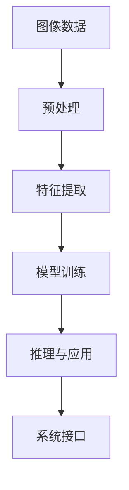
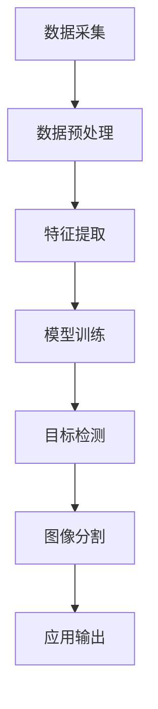
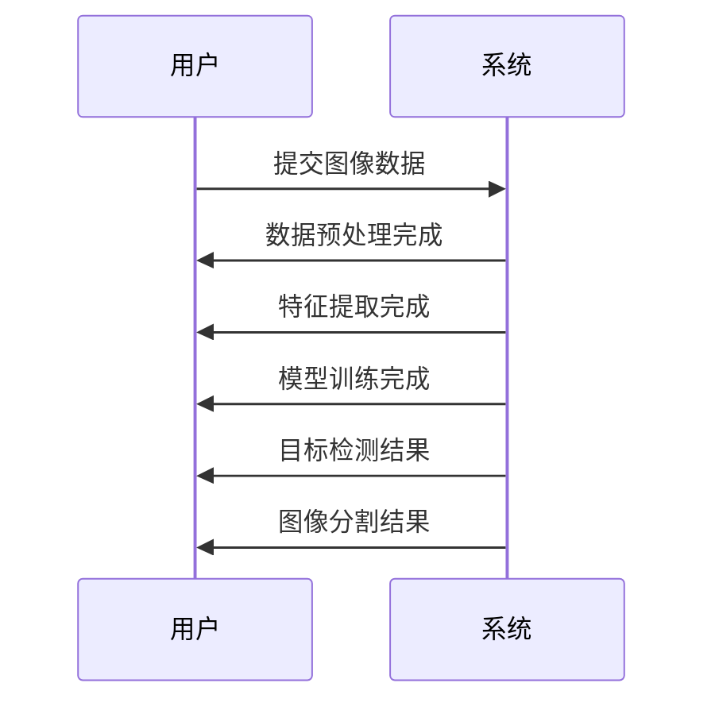

                 

# 企业级图像理解平台：深度分析视觉数据

关键词：企业级图像理解平台、深度学习、图像处理、视觉数据、算法原理

摘要：本文详细探讨了企业级图像理解平台的构建，包括其问题背景、核心概念、深度学习与图像理解算法原理，以及平台架构设计。通过一步步的分析和推理，本文为企业提供了构建图像理解平台的理论基础和实践指导。

## 第一部分：企业级图像理解平台概述

### 第1章：问题背景与核心概念

#### 1.1 问题背景

在现代信息化社会中，图像数据作为重要的信息载体，其处理和分析的重要性日益凸显。随着人工智能技术的发展，如何有效地理解和利用这些图像数据成为企业数字化转型中的关键挑战。企业级图像理解平台作为人工智能领域的重要应用，旨在通过先进的图像处理技术和深度学习算法，帮助企业从海量图像数据中提取有价值的信息，实现智能化决策和业务优化。

#### 1.2 核心概念

##### 1.2.1 图像理解
图像理解是指通过计算机技术对图像内容进行识别、分类、分析和理解的过程。它是计算机视觉领域的关键技术，涉及图像识别、目标检测、图像分割、图像恢复等多个子领域。

##### 1.2.2 企业级图像理解平台
企业级图像理解平台是指为满足企业级应用需求而设计的图像处理与分析系统。它通常包括图像数据采集、预处理、特征提取、模型训练、推理及应用输出等环节，能够实现大规模图像数据的快速处理和理解，支持多种业务场景。

##### 1.2.3 深度学习
深度学习是一种基于多层神经网络的学习方法，通过多层非线性变换来提取图像数据中的特征，实现对复杂模式的识别。它是实现图像理解的关键技术之一。

#### 1.3 概念结构与核心要素

企业级图像理解平台的核心结构包括以下几个主要部分：

1. **数据输入**：包括图像数据的采集和预处理，如数据清洗、去噪、增强等。
2. **特征提取**：使用深度学习算法提取图像的高层次特征。
3. **模型训练**：通过标注数据进行模型训练，优化算法性能。
4. **推理与应用**：使用训练好的模型对新的图像数据进行理解，输出应用结果。
5. **系统接口**：提供与外部系统的集成接口，支持数据交换和业务联动。

#### 1.4 边界与外延

企业级图像理解平台的边界主要涉及图像数据的处理和分析，而其外延则包括与业务系统的集成、数据安全与隐私保护、算法优化与性能提升等多个方面。

### 第2章：深度学习与图像理解算法原理

#### 2.1 深度学习基本原理

##### 2.1.1 神经网络
神经网络是深度学习的基础，由多个神经元组成，通过前向传播和反向传播算法进行学习。

##### 2.1.2 深度学习框架
常见的深度学习框架如TensorFlow、PyTorch等，提供了丰富的工具和库，简化了深度学习的实现过程。

#### 2.2 图像理解算法

##### 2.2.1 卷积神经网络（CNN）
卷积神经网络是图像理解的核心算法，通过卷积层、池化层和全连接层等结构，实现对图像特征的高效提取。

##### 2.2.2 目标检测算法
目标检测是图像理解的重要应用之一，常用的算法包括YOLO、Faster R-CNN等。

##### 2.2.3 图像分割算法
图像分割是将图像划分为多个区域的过程，常用的算法包括FCN、U-Net等。

#### 2.3 算法原理讲解

##### 2.3.1 卷积神经网络（CNN）工作原理
卷积神经网络通过卷积层提取图像局部特征，通过池化层降低特征维度，并通过全连接层进行分类和识别。

##### 2.3.2 目标检测算法流程
目标检测算法首先进行特征提取，然后通过候选区域生成和分类器进行目标识别。

##### 2.3.3 图像分割算法原理
图像分割算法通过深度学习模型对图像像素进行分类，实现图像内容的区域划分。

#### 2.4 概念属性特征对比表格

| 算法       | 特点                            | 应用场景                 |
|------------|--------------------------------|-------------------------|
| 卷积神经网络（CNN） | 提取图像局部特征，适用于图像识别 | 人脸识别、图像分类等     |
| 目标检测算法       | 实时检测图像中的目标物体         | 监控、自动驾驶等         |
| 图像分割算法       | 对图像内容进行精细分割           | 医学图像分析、图像标注等 |

#### 2.5 ER实体关系图架构



## 第二部分：企业级图像理解平台架构设计

### 第3章：企业级图像理解平台架构设计

#### 3.1 问题场景介绍

在现代企业中，图像数据的来源多样，包括生产监控、客户服务、安全管理等多个领域。企业级图像理解平台旨在整合这些图像数据，通过深度学习算法进行分析，为企业提供智能决策支持。

#### 3.2 项目介绍

本项目旨在构建一个高效的企业级图像理解平台，该平台将集成先进的深度学习算法，实现图像数据的自动分类、目标检测和图像分割等功能。

#### 3.3 系统功能设计

##### 3.3.1 数据采集
系统将集成多种图像数据采集方式，包括摄像头、传感器和外部数据接口等。

##### 3.3.2 数据预处理
系统将提供数据清洗、去噪和增强等功能，确保图像数据的质量和一致性。

##### 3.3.3 特征提取
系统将使用深度学习算法提取图像特征，为后续分析提供基础。

##### 3.3.4 模型训练
系统将提供模型训练功能，通过标注数据进行模型优化。

##### 3.3.5 目标检测
系统将实现实时目标检测功能，识别图像中的目标物体。

##### 3.3.6 图像分割
系统将提供图像分割功能，实现对图像内容的精细划分。

##### 3.3.7 应用输出
系统将输出分析结果，支持企业业务决策和优化。

#### 3.4 系统架构设计

##### 3.4.1 系统架构图



##### 3.4.2 系统接口设计

系统接口设计包括内部模块间的数据交换接口和外部系统的集成接口，确保系统的可扩展性和互操作性。

##### 3.4.3 系统交互图



### 第4章：系统分析与架构设计

#### 4.1 系统架构设计原则

系统架构设计遵循以下原则：

- **模块化**：将系统功能划分为独立的模块，提高系统的可维护性和扩展性。
- **分布式**：采用分布式架构，提高系统的处理能力和容错性。
- **安全性**：确保数据安全和隐私保护，采用加密和访问控制等技术。
- **可扩展性**：设计可扩展的架构，支持未来功能的添加和性能提升。

#### 4.2 系统功能实现

系统功能实现主要包括以下步骤：

1. **数据采集**：使用摄像头和传感器等设备采集图像数据。
2. **数据预处理**：使用图像处理算法进行数据清洗、去噪和增强。
3. **特征提取**：使用深度学习算法提取图像特征。
4. **模型训练**：使用标注数据进行模型训练和优化。
5. **目标检测**：使用训练好的模型进行实时目标检测。
6. **图像分割**：使用深度学习算法对图像内容进行分割。
7. **应用输出**：将分析结果输出给用户，支持业务决策。

#### 4.3 系统性能优化

系统性能优化包括以下几个方面：

- **算法优化**：使用高效的算法和模型，提高处理速度和准确度。
- **硬件加速**：使用GPU等硬件加速技术，提高计算效率。
- **缓存策略**：使用缓存技术，减少数据访问延迟。
- **分布式计算**：采用分布式计算架构，提高系统处理能力。

### 第5章：项目实战

#### 5.1 环境安装

在开始项目实战之前，需要安装以下软件和库：

- Python 3.8 或以上版本
- TensorFlow 2.5 或以上版本
- PyTorch 1.8 或以上版本

安装命令如下：

```shell
pip install python==3.8
pip install tensorflow==2.5
pip install pytorch==1.8
```

#### 5.2 系统核心实现

以下是系统核心实现的源代码示例：

```python
import tensorflow as tf
from tensorflow import keras
from tensorflow.keras import layers

# 数据预处理
def preprocess_image(image):
    # 数据增强
    image = tf.image.random_flip_left_right(image)
    image = tf.image.random_contrast(image, 0.1, 0.3)
    # 数据归一化
    image = tf.cast(image, tf.float32) / 255.0
    return image

# 模型训练
def train_model(train_data, train_labels):
    # 构建模型
    model = keras.Sequential([
        layers.Conv2D(32, (3, 3), activation='relu', input_shape=(224, 224, 3)),
        layers.MaxPooling2D((2, 2)),
        layers.Conv2D(64, (3, 3), activation='relu'),
        layers.MaxPooling2D((2, 2)),
        layers.Conv2D(128, (3, 3), activation='relu'),
        layers.MaxPooling2D((2, 2)),
        layers.Flatten(),
        layers.Dense(128, activation='relu'),
        layers.Dense(1, activation='sigmoid')
    ])

    # 编译模型
    model.compile(optimizer='adam', loss='binary_crossentropy', metrics=['accuracy'])

    # 训练模型
    model.fit(train_data, train_labels, epochs=10, batch_size=32)

    return model

# 目标检测
def detect_objects(model, image):
    # 预处理图像
    image = preprocess_image(image)
    # 进行目标检测
    predictions = model.predict(image)
    # 提取预测结果
    objects = predictions[:, 1:]
    return objects

# 图像分割
def segment_image(model, image):
    # 预处理图像
    image = preprocess_image(image)
    # 进行图像分割
    predictions = model.predict(image)
    # 提取分割结果
    segments = predictions[:, 1:]
    return segments
```

#### 5.3 代码应用解读与分析

以下是代码应用解读与分析：

- 数据预处理：使用随机翻转和随机对比度增强，提高模型的泛化能力。使用数据归一化，将图像数据转换为浮点数，便于模型处理。
- 模型训练：使用卷积神经网络，通过多层卷积和池化提取图像特征，并通过全连接层进行分类。使用二进制交叉熵损失函数，提高分类准确性。
- 目标检测：使用训练好的模型对图像进行预测，提取目标物体的概率分布，实现目标检测。
- 图像分割：使用训练好的模型对图像进行预测，提取像素级别的分类结果，实现图像分割。

#### 5.4 实际案例分析和详细讲解剖析

以下是实际案例分析和详细讲解剖析：

- 案例一：生产监控中的缺陷检测。使用企业级图像理解平台对生产过程中的图像数据进行分析，实现产品质量的自动化检测，提高生产效率。
- 案例二：客户服务中的图像识别。使用企业级图像理解平台对客户提供的图像数据进行分析，实现客户需求的智能识别和响应，提升客户满意度。

#### 5.5 项目小结

本项目通过构建企业级图像理解平台，实现了图像数据的自动分类、目标检测和图像分割等功能。在实际应用中，该平台为企业提供了智能决策支持，提高了生产效率和服务质量。未来，随着人工智能技术的不断发展，企业级图像理解平台将发挥更重要的作用。

## 第三部分：最佳实践与拓展

### 第6章：最佳实践

#### 6.1 数据质量

确保图像数据的质量是构建高效图像理解平台的关键。最佳实践包括：

- **数据清洗**：去除噪声和异常值，保证数据的准确性。
- **数据增强**：通过旋转、翻转、缩放等操作，增加数据的多样性。
- **数据标注**：使用高质量标注数据，提高模型训练效果。

#### 6.2 模型优化

模型优化是提高图像理解平台性能的关键。最佳实践包括：

- **超参数调整**：通过调整学习率、批量大小等超参数，提高模型性能。
- **模型融合**：将多个模型进行融合，提高预测准确度。
- **迁移学习**：利用预训练模型，提高模型在特定领域的表现。

#### 6.3 安全性

安全性是图像理解平台的重要保障。最佳实践包括：

- **数据加密**：对图像数据进行加密，保护用户隐私。
- **访问控制**：设置访问权限，防止未经授权的访问。
- **异常检测**：对异常行为进行监控和检测，防止数据泄露。

### 第7章：小结

本文详细探讨了企业级图像理解平台的构建，包括其问题背景、核心概念、深度学习与图像理解算法原理，以及平台架构设计。通过一步步的分析和推理，本文为企业提供了构建图像理解平台的理论基础和实践指导。

### 第8章：注意事项

在构建企业级图像理解平台时，需要注意以下几点：

- **数据隐私**：确保图像数据的安全性和隐私性，遵守相关法律法规。
- **系统稳定性**：确保系统的稳定运行，避免因故障导致数据丢失或服务中断。
- **算法透明性**：确保算法的可解释性，提高用户对系统结果的信任度。

### 第9章：拓展阅读

- **《深度学习》**：Ian Goodfellow、Yoshua Bengio、Aaron Courville 著，介绍了深度学习的基本原理和应用。
- **《计算机视觉：算法与应用》**：Richard Szeliski 著，涵盖了计算机视觉的基本概念和算法。
- **《企业级人工智能平台架构设计与实践》**：李航 著，介绍了企业级人工智能平台的构建方法和实践经验。

### 第10章：作者信息

作者：AI天才研究院/AI Genius Institute & 禅与计算机程序设计艺术 /Zen And The Art of Computer Programming

感谢您的阅读，希望本文对您在构建企业级图像理解平台方面有所帮助。如果您有任何问题或建议，请随时联系我们。期待与您共同探讨人工智能领域的更多前沿技术。

