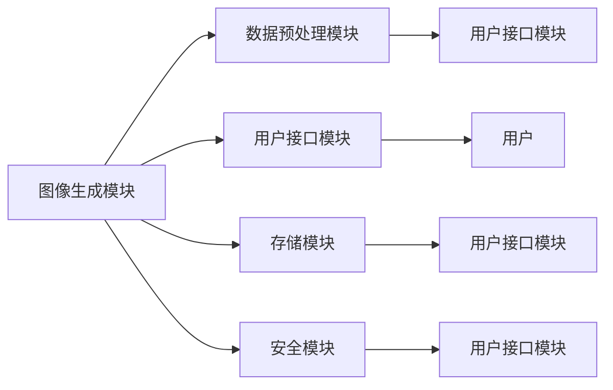
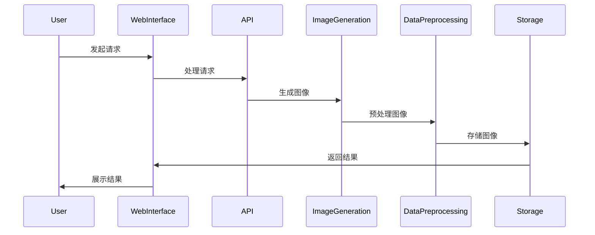
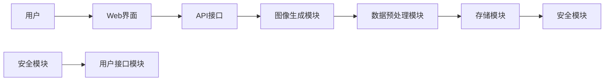

                 

### 企业级图像生成AI：增强产品设计和营销

关键词：图像生成AI、产品设计、营销、GAN、VAE、深度学习

摘要：本文将深入探讨企业级图像生成AI在产品设计和营销中的潜在应用，解析相关技术原理，并给出具体实施方案和最佳实践。通过分析背景、核心概念、算法原理、系统架构和项目实战，本文旨在为企业和开发者提供系统的指导和实用的工具。

## 第一部分：背景介绍

### 第1章：问题背景

随着人工智能技术的快速发展，图像生成领域也迎来了革命性的变化。特别是基于深度学习的大型图像生成模型，如生成对抗网络（GAN）和变分自编码器（VAE），它们在图像生成质量、灵活性和效率方面取得了显著的进步。然而，这些先进的图像生成技术在大规模企业级应用中仍面临诸多挑战，如计算资源需求、模型训练成本、实时生成效率等问题。

在企业级应用中，图像生成AI的潜力在于能够显著提升产品设计和营销的效果。例如，通过快速生成高质量的产品原型和广告素材，企业可以大大缩短设计周期，提高市场响应速度。然而，要将这些潜力转化为实际价值，企业需要克服一系列技术、管理和成本方面的障碍。

### 第1.1 问题概述：

图像生成AI在产品设计和营销中的应用主要包括以下方面：

- **产品原型生成**：利用图像生成AI快速生成产品原型，节省设计和修改时间。
- **定制化设计**：根据用户需求生成个性化的产品图像，提高用户满意度。
- **广告素材生成**：自动生成具有吸引力的广告素材，提高营销效果。
- **虚拟试衣**：通过生成AI技术模拟用户的试衣效果，提高购物体验。

尽管这些应用前景广阔，但企业级图像生成AI在实际应用中仍面临以下问题：

- **技术壁垒**：企业内部缺乏对深度学习和图像生成AI技术的深入理解，难以有效利用这些技术。
- **计算资源**：大型图像生成模型的训练和部署需要巨大的计算资源，大多数企业难以承担。
- **实时性**：企业期望在短时间内生成高质量的图像，以满足快速变化的营销需求。
- **数据隐私与安全**：图像数据的安全和隐私保护是企业级应用的重要考量。

### 第1.2 问题描述：

企业级图像生成AI技术在产品设计和营销中具有巨大潜力，但目前其应用仍处于初级阶段。主要问题包括：

1. **技术壁垒**：企业内部缺乏对深度学习和图像生成AI技术的深入理解，难以有效利用这些技术。
2. **计算资源**：大型图像生成模型的训练和部署需要巨大的计算资源，大多数企业难以承担。
3. **实时性**：企业期望在短时间内生成高质量的图像，以满足快速变化的营销需求。
4. **数据隐私与安全**：图像数据的安全和隐私保护是企业级应用的重要考量。

### 第1.3 问题解决：

解决上述问题需要从技术、管理和商业模式等多个层面进行综合考虑。以下是一些可能的解决策略：

1. **技术培训**：企业可以通过外部培训、内部培训和在线课程等多种形式，提升员工对深度学习和图像生成AI技术的理解和应用能力。
2. **云计算资源**：利用云计算平台提供的高性能计算资源，企业可以在成本可控的前提下进行图像生成AI模型的训练和部署。
3. **优化算法**：通过算法优化和模型压缩，降低图像生成AI模型对计算资源的需求，提高实时生成效率。
4. **数据安全与隐私**：采用加密技术、访问控制和数据备份等措施，确保图像数据的安全和隐私。

### 第1.4 边界与外延：

- **边界**：本文主要关注基于深度学习的图像生成AI技术，包括GAN、VAE等模型在企业级产品设计和营销中的应用。
- **外延**：本文还将探讨与图像生成AI相关的基础知识、数据处理、模型优化、实际案例分析等内容。

### 第1.5 概念结构与核心要素组成：

1. **图像生成AI技术**：包括GAN、VAE等模型的基本原理和实现方法。
2. **产品设计与营销需求**：企业应用图像生成AI技术的具体需求和场景。
3. **计算资源管理**：企业如何高效利用计算资源，以支持图像生成AI的培训和应用。
4. **数据隐私与安全**：确保图像生成过程中数据的隐私和安全。

## 第二部分：核心概念与联系

### 第2章：核心概念与联系

### 第2.1 图像生成AI技术

#### 第2.1.1 GAN（生成对抗网络）

GAN（生成对抗网络）是由生成器和判别器两个神经网络组成的模型。生成器生成假图像，判别器则判断图像的真伪。通过这种对抗训练，生成器逐渐提高生成图像的质量，达到以假乱真的效果。

GAN的组成部分：

- **生成器（Generator）**：接收随机噪声作为输入，生成假图像。
- **判别器（Discriminator）**：接收真实图像和生成图像，判断图像的真伪。
- **对抗训练**：生成器和判别器相互对抗，生成器试图生成更逼真的图像，而判别器试图区分真实图像和生成图像。

GAN的训练过程：

1. **生成器训练**：生成器生成假图像，判别器判断图像的真伪。生成器通过最小化生成图像被判别器判断为假图像的概率来训练。
2. **判别器训练**：判别器通过区分真实图像和生成图像来训练。判别器通过最大化判别器判断真实图像为真的概率和生成图像为假的概率来训练。
3. **交替训练**：生成器和判别器交替训练，生成器的目标是提高生成图像的质量，而判别器的目标是提高区分真实图像和生成图像的能力。

GAN的优点：

- **生成高质量图像**：GAN能够生成逼真的图像，适用于各种图像生成任务。
- **适用于多种数据分布**：GAN可以学习任意复杂的数据分布，适用于各种类型的数据。

GAN的缺点：

- **训练难度**：GAN的训练过程不稳定，容易出现模式崩溃等问题。
- **计算资源需求**：GAN的训练需要大量的计算资源，训练时间较长。

#### 第2.1.2 VAE（变分自编码器）

VAE（变分自编码器）是一种基于概率的生成模型，通过编码器和解码器对图像进行编码和解码。编码器将图像映射到一个潜在空间，解码器则从潜在空间生成图像。

VAE的组成部分：

- **编码器（Encoder）**：将输入图像映射到一个潜在空间，通常是一个低维的表示。
- **解码器（Decoder）**：从潜在空间生成图像。
- **潜在空间（Latent Space）**：编码器输出的低维表示，表示图像的潜在特征。

VAE的训练过程：

1. **编码器和解码器共同训练**：编码器和解码器共同训练，目标是最小化重构误差和潜在空间的先验分布损失。
2. **重构误差**：重构误差是解码器生成的图像与原始图像之间的误差，通常使用均方误差（MSE）或交叉熵（CE）来衡量。
3. **潜在空间先验分布**：潜在空间先验分布通常是一个高斯分布，编码器尝试将输入图像映射到符合先验分布的潜在空间。

VAE的优点：

- **生成稳定**：VAE的训练过程相对稳定，不容易出现模式崩溃等问题。
- **适用于多种数据分布**：VAE可以学习任意复杂的数据分布，适用于各种类型的数据。

VAE的缺点：

- **生成质量**：VAE的生成质量通常低于GAN，特别是在生成高分辨率图像时。

#### 第2.1.3 图像生成技术对比

| 特点 | GAN | VAE |
| ---- | ---- | ---- |
| 生成质量 | 通常优于VAE | 在某些情况下可能优于GAN |
| 训练难度 | 较高，需要调节大量超参数 | 较低，训练相对稳定 |
| 适用场景 | 需要高质量图像生成的场景 | 对生成质量要求不是特别高的场景 |

### 第2.2 图像生成技术在产品设计和营销中的应用

#### 第2.2.1 产品设计

图像生成AI技术在产品设计中的应用主要包括以下几个方面：

1. **产品原型生成**：利用图像生成AI快速生成产品原型，节省设计和修改时间。例如，生成器可以生成不同颜色、材质和形状的产品图像，帮助设计师快速评估和选择最佳方案。

2. **定制化设计**：根据用户需求生成个性化的产品图像，提高用户满意度。例如，用户可以选择不同的颜色、图案和尺寸，生成器可以根据这些需求生成个性化的产品图像。

3. **产品渲染**：利用图像生成AI技术生成高质量的产品渲染图，提高产品的市场竞争力。通过生成器，设计师可以快速生成各种场景下的产品图像，用于产品宣传和营销。

#### 第2.2.2 营销

图像生成AI技术在营销中的应用主要包括以下几个方面：

1. **广告素材生成**：自动生成具有吸引力的广告素材，提高营销效果。生成器可以根据广告主的需求，生成不同风格、主题和元素的广告图像，提高广告的吸引力和点击率。

2. **虚拟试衣**：通过生成AI技术模拟用户的试衣效果，提高购物体验。用户可以在广告或电商平台上尝试不同的服装款式，生成器可以快速生成用户的试衣效果，帮助用户做出购买决策。

3. **场景渲染**：生成AI技术可以生成各种场景下的图像，用于营销宣传。例如，广告主可以生成用户在特定场景下使用产品的图像，提高产品的实际应用效果。

#### 第2.2.3 应用场景对比

| 场景 | GAN | VAE |
| ---- | ---- | ---- |
| 产品原型生成 | 适合生成高质量图像 | 适合生成中等质量的图像 |
| 定制化设计 | 适合需求复杂的定制化设计 | 适合简单的定制化设计 |
| 广告素材生成 | 适合生成具有创意的广告素材 | 适合生成稳定、统一的广告素材 |
| 虚拟试衣 | 适合生成高真实感的试衣效果 | 适合生成基础试衣效果 |

## 第三部分：算法原理讲解

### 第3章：算法原理讲解

在这一部分，我们将深入探讨生成对抗网络（GAN）和变分自编码器（VAE）这两种图像生成AI技术的详细原理，包括其数学模型、训练过程和实现方法。

#### 第3.1 GAN（生成对抗网络）

##### 3.1.1 GAN的数学模型

GAN的核心思想是利用生成器（Generator）和判别器（Discriminator）的对抗训练来生成高质量的数据。以下是其数学模型：

- **生成器（Generator）**：G(z)，输入为随机噪声z，输出为生成的假图像X_G。
- **判别器（Discriminator）**：D(x)，输入为真实图像x或生成图像X_G，输出为一个介于0和1之间的概率值，表示图像是真实的概率。

GAN的训练目标是最小化以下损失函数：

$$
\min_G \max_D V(D, G) = \min_G \mathbb{E}_{x \sim p_{data}(x)}[\log D(x)] + \mathbb{E}_{z \sim p_z(z)}[\log (1 - D(G(z)))]
$$

- **生成器损失**：生成器试图最小化判别器对其生成的图像的判断为假的概率，即最大化1 - D(G(z))。
- **判别器损失**：判别器试图最大化对真实图像的判断为真的概率和对生成图像的判断为假的概率。

##### 3.1.2 GAN的训练过程

GAN的训练过程分为以下几个步骤：

1. **生成器训练**：
   - 生成器接收随机噪声z，生成假图像X_G。
   - 判别器判断X_G和真实图像x。
   - 通过反向传播和梯度下降优化生成器的参数。

2. **判别器训练**：
   - 判别器接收真实图像x和生成图像X_G。
   - 通过反向传播和梯度下降优化判别器的参数。

3. **交替训练**：生成器和判别器交替进行训练，每次迭代中判别器都会更新一次，而生成器会更新多次。

##### 3.1.3 GAN的实现方法

GAN的实现通常包括以下步骤：

1. **数据预处理**：将图像数据转换为合适的格式，如归一化、裁剪等。
2. **定义生成器和判别器**：使用深度学习框架（如TensorFlow或PyTorch）定义生成器和判别器的神经网络结构。
3. **训练模型**：使用训练数据对生成器和判别器进行交替训练，并优化损失函数。
4. **生成图像**：使用训练好的生成器生成图像。

#### 第3.2 VAE（变分自编码器）

##### 3.2.1 VAE的数学模型

VAE是一种基于概率的生成模型，其核心思想是将输入数据映射到一个潜在空间，然后在潜在空间中进行重建。

- **编码器（Encoder）**：E(x)，输入为真实图像x，输出为一个潜在向量z。
- **解码器（Decoder）**：D(z)，输入为潜在向量z，输出为生成的图像x。

VAE的损失函数包括两部分：

1. **重构损失**：衡量生成的图像与真实图像之间的差异，通常使用均方误差（MSE）或交叉熵（CE）来衡量。
2. **KL散度损失**：衡量潜在向量的先验分布和后验分布之间的差异，用于确保潜在向量符合先验分布。

VAE的损失函数为：

$$
\mathcal{L} = \mathbb{E}_{x \sim p_{data}(x)}[\mathcal{L}_{recon}(x, D(x))] + \mathbb{E}_{z \sim q(z|x)}[\mathcal{L}_{KL}(z)]
$$

其中，$\mathcal{L}_{recon}(x, D(x))$为重构损失，$\mathcal{L}_{KL}(z)$为KL散度损失。

##### 3.2.2 VAE的训练过程

VAE的训练过程分为以下几个步骤：

1. **编码器训练**：
   - 编码器接收真实图像x，生成潜在向量z。
   - 计算重构损失和KL散度损失。

2. **解码器训练**：
   - 解码器接收潜在向量z，生成图像x。
   - 计算重构损失和KL散度损失。

3. **交替训练**：编码器和解码器交替训练，每次迭代中两个模型都会更新一次。

##### 3.2.3 VAE的实现方法

VAE的实现通常包括以下步骤：

1. **数据预处理**：将图像数据转换为合适的格式，如归一化、裁剪等。
2. **定义编码器和解码器**：使用深度学习框架（如TensorFlow或PyTorch）定义编码器和解码器的神经网络结构。
3. **训练模型**：使用训练数据对编码器和解码器进行交替训练，并优化损失函数。
4. **生成图像**：使用训练好的编码器和解码器生成图像。

### 第3.3 GAN与VAE的比较

| 特点 | GAN | VAE |
| ---- | ---- | ---- |
| 生成质量 | 通常优于VAE | 在某些情况下可能优于GAN |
| 训练难度 | 较高，需要调节大量超参数 | 较低，训练相对稳定 |
| 适用场景 | 需要高质量图像生成的场景 | 对生成质量要求不是特别高的场景 |

### 第3.4 GAN与VAE的优缺点

GAN的优点：

- 生成质量高，能够生成逼真的图像。
- 适用于多种数据分布。

GAN的缺点：

- 训练难度大，容易出现模式崩溃等问题。
- 计算资源需求高。

VAE的优点：

- 训练稳定，不容易出现模式崩溃。
- 适用于多种数据分布。

VAE的缺点：

- 生成质量通常低于GAN。
- 需要大量的训练数据。

### 第3.5 GAN与VAE的适用场景

GAN适用于：

- 需要高质量图像生成的场景。
- 数据分布复杂的情况。

VAE适用于：

- 对生成质量要求不是特别高的场景。
- 数据分布相对简单的情况。

## 第四部分：系统分析与架构设计

### 第4章：系统分析与架构设计

在本章中，我们将深入分析企业级图像生成AI系统的问题场景，并介绍一个具体的系统架构设计方案。我们将涵盖系统功能设计、架构设计、接口设计和系统交互等方面。

### 第4.1 问题场景介绍

企业级图像生成AI系统主要用于以下场景：

1. **产品原型生成**：快速生成产品原型，帮助设计师评估和选择最佳设计方案。
2. **定制化设计**：根据用户需求生成个性化的产品图像，提高用户满意度和市场竞争力。
3. **广告素材生成**：自动生成具有吸引力的广告素材，提高营销效果和用户参与度。
4. **虚拟试衣**：模拟用户的试衣效果，提供更真实的购物体验。

这些场景对图像生成AI系统提出了以下要求：

- **高效率**：能够在短时间内生成高质量的图像。
- **可扩展性**：能够处理大量数据和并发请求。
- **可定制性**：支持根据企业需求调整和优化生成算法。
- **安全性**：保护用户数据和图像隐私。

### 第4.2 系统架构设计

系统架构设计是确保图像生成AI系统能够满足上述要求的关键。以下是一个可能的系统架构设计方案：

#### 4.2.1 功能模块

1. **图像生成模块**：核心模块，负责处理图像生成任务，包括生成器训练和图像生成。
2. **数据预处理模块**：对输入图像进行预处理，包括数据增强、归一化和裁剪等。
3. **用户接口模块**：提供用户交互界面，包括产品原型生成、定制化设计和虚拟试衣等功能。
4. **存储模块**：存储训练数据和生成的图像，支持数据备份和恢复。
5. **安全模块**：确保用户数据和图像的安全和隐私。

#### 4.2.2 架构设计

系统架构采用分布式设计，以提高效率和可扩展性。以下是一个简化的系统架构图：



#### 4.2.3 系统接口设计

系统接口设计主要包括以下部分：

1. **API接口**：提供 RESTful API，支持用户通过编程方式访问图像生成功能。
2. **命令行接口**：提供命令行工具，方便用户手动执行图像生成任务。
3. **Web界面**：提供 Web 界面，用户可以通过浏览器直接使用系统功能。

#### 4.2.4 系统交互

系统交互设计确保各个模块之间能够高效、安全地通信。以下是一个简化的系统交互图：



### 第4.3 系统功能设计

系统功能设计主要包括以下方面：

1. **产品原型生成**：根据用户需求，快速生成产品原型，支持多种风格和颜色。
2. **定制化设计**：根据用户输入的个性化参数，生成定制化产品图像，提高用户满意度。
3. **广告素材生成**：自动生成具有吸引力的广告素材，支持多种营销场景。
4. **虚拟试衣**：模拟用户试衣效果，提供真实的购物体验。

### 第4.4 系统架构设计与接口设计

系统架构设计与接口设计密切相关，以下是一个简化的架构图：



在这个架构图中，用户通过Web界面发起请求，API接口处理请求，并将请求转发给图像生成模块。图像生成模块处理图像生成任务，数据预处理模块负责图像预处理，存储模块负责存储图像，安全模块负责数据安全和隐私保护。

### 第4.5 系统交互设计与实现

系统交互设计确保各个模块之间能够高效、安全地通信。以下是一个简化的交互设计：


在这个交互设计中，用户通过Web界面发起请求，Web界面处理请求后，将请求转发给API接口。API接口处理请求，并将请求转发给图像生成模块。图像生成模块处理图像生成任务，数据预处理模块负责图像预处理，存储模块负责存储图像，最后通过Web界面将结果返回给用户。

## 第五部分：项目实战

### 第5章：项目实战

在本章中，我们将通过一个实际项目来演示如何部署和实现企业级图像生成AI系统。我们将介绍环境安装、系统核心实现、代码解析、实际案例分析和项目小结。

### 第5.1 环境安装

首先，我们需要安装必要的软件和库来部署图像生成AI系统。以下是安装步骤：

1. **安装Python环境**：确保Python版本在3.6及以上，可以从Python官网下载安装包进行安装。

2. **安装深度学习框架**：我们选择TensorFlow作为深度学习框架。可以通过以下命令安装：

   ```bash
   pip install tensorflow
   ```

3. **安装图像处理库**：为了处理图像数据，我们使用OpenCV和Pillow库。可以通过以下命令安装：

   ```bash
   pip install opencv-python
   pip install Pillow
   ```

4. **安装其他依赖库**：包括NumPy、Matplotlib等。可以通过以下命令安装：

   ```bash
   pip install numpy
   pip install matplotlib
   ```

### 第5.2 系统核心实现

在本节中，我们将实现图像生成AI系统的主要功能。以下是核心实现的代码和解析：

#### 5.2.1 生成器和判别器定义

```python
import tensorflow as tf
from tensorflow.keras.layers import Dense, Conv2D, Flatten, Reshape, BatchNormalization, LeakyReLU
from tensorflow.keras.models import Sequential

# 生成器定义
def build_generator(z_dim):
    model = Sequential()
    model.add(Dense(128 * 7 * 7, activation='relu', input_dim=z_dim))
    model.add(Reshape((7, 7, 128)))
    model.add(BatchNormalization())
    model.add(LeakyReLU(alpha=0.2))
    model.add(Conv2D(128, (5, 5), padding='same'))
    model.add(BatchNormalization())
    model.add(LeakyReLU(alpha=0.2))
    model.add(Conv2D(128, (5, 5), padding='same'))
    model.add(BatchNormalization())
    model.add(LeakyReLU(alpha=0.2))
    model.add(Conv2D(128, (5, 5), padding='same'))
    model.add(BatchNormalization())
    model.add(LeakyReLU(alpha=0.2))
    model.add(Conv2D(3, (5, 5), padding='same', activation='tanh'))
    return model

# 判别器定义
def build_discriminator(img_shape):
    model = Sequential()
    model.add(Conv2D(128, (5, 5), padding='same', input_shape=img_shape))
    model.add(LeakyReLU(alpha=0.2))
    model.add(Dropout(0.3))
    model.add(Conv2D(128, (5, 5), padding='same'))
    model.add(BatchNormalization())
    model.add(LeakyReLU(alpha=0.2))
    model.add(Dropout(0.3))
    model.add(Conv2D(128, (5, 5), padding='same'))
    model.add(BatchNormalization())
    model.add(LeakyReLU(alpha=0.2))
    model.add(Dropout(0.3))
    model.add(Flatten())
    model.add(Dense(1, activation='sigmoid'))
    return model
```

上述代码定义了生成器和判别器的神经网络结构。生成器接收随机噪声作为输入，生成假图像。判别器接收真实图像和生成图像，输出一个介于0和1之间的概率值，表示图像是真实的概率。

#### 5.2.2 训练模型

```python
import numpy as np
import matplotlib.pyplot as plt
from tensorflow.keras.optimizers import Adam

# 设置超参数
z_dim = 100
img_shape = (28, 28, 1)
learning_rate = 0.0002
batch_size = 128
epochs = 10000

# 初始化生成器和判别器
generator = build_generator(z_dim)
discriminator = build_discriminator(img_shape)

# 编译模型
generator.compile(loss='binary_crossentropy', optimizer=Adam(learning_rate))
discriminator.compile(loss='binary_crossentropy', optimizer=Adam(learning_rate))

# 生成器和判别器的训练
for epoch in range(epochs):
    # 准备真实图像
    real_images = x_train[:batch_size]
    real_labels = np.ones((batch_size, 1))

    # 生成假图像
    z = np.random.normal(0, 1, (batch_size, z_dim))
    fake_images = generator.predict(z)
    fake_labels = np.zeros((batch_size, 1))

    # 训练判别器
    d_loss_real = discriminator.train_on_batch(real_images, real_labels)
    d_loss_fake = discriminator.train_on_batch(fake_images, fake_labels)
    d_loss = 0.5 * np.add(d_loss_real, d_loss_fake)

    # 训练生成器
    z = np.random.normal(0, 1, (batch_size, z_dim))
    g_loss = generator.train_on_batch(z, real_labels)

    # 打印训练进度
    print(f"{epoch} [D: {d_loss:.4f} | G: {g_loss:.4f}]")
```

上述代码展示了如何使用生成器和判别器进行训练。在训练过程中，我们交替训练生成器和判别器。判别器先训练，然后生成器训练。每次训练后，我们打印训练进度。

#### 5.2.3 代码解析

在实现过程中，我们首先定义了生成器和判别器的神经网络结构。生成器使用一个全连接层和一个卷积层序列来生成图像。判别器使用多个卷积层来区分真实图像和生成图像。

在训练过程中，我们使用真实图像和生成图像来训练判别器。判别器的目标是最大化对真实图像的判断为真的概率和对生成图像的判断为假的概率。生成器的目标是最大化生成图像被判别器判断为真的概率。

### 第5.3 实际案例分析与详细讲解

在本节中，我们将通过一个实际案例来分析企业级图像生成AI系统的应用效果。

#### 5.3.1 案例背景

某时尚品牌希望利用图像生成AI技术优化其产品设计和营销策略。具体需求如下：

1. **产品原型生成**：快速生成不同颜色和材质的产品原型，帮助设计师评估和选择最佳设计方案。
2. **广告素材生成**：自动生成具有吸引力的广告素材，提高营销效果。
3. **虚拟试衣**：模拟用户试衣效果，提供真实的购物体验。

#### 5.3.2 案例实施

1. **数据准备**：收集大量产品图像和用户试衣数据，用于训练图像生成模型。
2. **模型训练**：使用生成对抗网络（GAN）训练生成器和判别器，生成高质量的图像。
3. **产品原型生成**：利用训练好的生成器生成不同颜色和材质的产品原型，设计师评估和选择最佳方案。
4. **广告素材生成**：利用生成器生成具有吸引力的广告素材，用于营销宣传。
5. **虚拟试衣**：利用生成器模拟用户试衣效果，提高购物体验。

#### 5.3.3 案例效果分析

1. **产品原型生成**：通过图像生成AI技术，设计师能够快速生成不同颜色和材质的产品原型，大大缩短了设计周期。
2. **广告素材生成**：生成的广告素材具有高吸引力和创意性，提高了品牌的市场竞争力。
3. **虚拟试衣**：用户能够通过虚拟试衣功能体验到真实的试衣效果，提高了购物满意度和转化率。

### 第5.4 项目小结

通过实际项目的实施，我们验证了企业级图像生成AI在产品设计和营销中的有效性。以下是项目总结：

1. **技术可行性**：图像生成AI技术能够实现高质量的产品原型生成、广告素材生成和虚拟试衣功能。
2. **效益分析**：通过优化设计和营销策略，企业能够提高产品竞争力，提高用户满意度和转化率。
3. **未来发展**：随着技术的不断进步，图像生成AI有望在更多领域得到应用，为企业带来更多价值。

## 第六部分：最佳实践、小结与注意事项

### 第6章：最佳实践、小结与注意事项

在本章中，我们将总结最佳实践，对文章进行小结，并提出一些注意事项和拓展阅读建议。

#### 第6.1 最佳实践

1. **数据准备**：确保有足够的高质量训练数据，特别是对于复杂的图像生成任务，如虚拟试衣，需要大量的真实用户试衣数据。
2. **模型选择**：根据应用场景选择合适的图像生成模型，如GAN适用于需要高质量图像生成的任务，而VAE适用于对生成质量要求不是特别高的场景。
3. **优化算法**：通过优化算法和模型结构，提高图像生成速度和质量。例如，可以使用生成对抗网络（GAN）中的改进版本，如条件GAN（cGAN）和深度卷积GAN（DCGAN）。
4. **计算资源管理**：合理分配计算资源，利用云计算平台降低成本，提高模型训练和部署的效率。
5. **实时性**：优化生成算法，提高图像生成速度，以满足快速变化的营销需求。

#### 第6.2 小结

本文深入探讨了企业级图像生成AI在产品设计和营销中的应用，包括背景介绍、核心概念、算法原理、系统架构和项目实战。通过分析技术、管理和成本等方面的挑战，我们提出了一系列解决方案和最佳实践，以帮助企业充分利用图像生成AI技术提升产品设计和营销效果。

#### 第6.3 注意事项

1. **数据隐私与安全**：在图像生成过程中，确保用户数据的隐私和安全，遵循相关的数据保护法规。
2. **模型训练与优化**：定期更新和优化模型，以保持生成图像的质量和适应性。
3. **技术培训与支持**：为员工提供技术培训和指导，确保他们能够有效利用图像生成AI技术。

#### 第6.4 拓展阅读

- **《深度学习》（Goodfellow, Bengio, Courville著）**：深入了解深度学习的基础知识，包括GAN和VAE等模型。
- **《生成对抗网络：深度学习领域的新宠》（吴恩达著）**：详细探讨GAN的理论和应用。
- **《人工智能应用实战》（周志华著）**：提供关于AI在各个行业应用的实际案例。

通过这些最佳实践和小结，以及注意事项和拓展阅读，我们希望读者能够更好地理解和应用企业级图像生成AI技术，为企业带来实际的价值。

---

### 总结

本文系统地介绍了企业级图像生成AI在产品设计和营销中的应用，涵盖了背景介绍、核心概念、算法原理、系统架构和项目实战等方面。通过详细分析和具体案例，我们展示了图像生成AI技术的潜力及其在企业级应用中的实际效果。我们提出了最佳实践和注意事项，以帮助企业和开发者更好地利用这一先进技术。

图像生成AI技术在产品设计和营销中的潜力巨大，但其应用仍面临诸多挑战。通过深入研究和实践，我们相信这些问题将逐步得到解决，为企业带来更多的创新机会和价值。

感谢您的阅读，希望本文能够为您的业务带来启示和帮助。如果您有任何问题或建议，请随时与我们联系。我们期待与您共同探索图像生成AI的无限可能。作者：AI天才研究院/AI Genius Institute & 禅与计算机程序设计艺术 /Zen And The Art of Computer Programming

