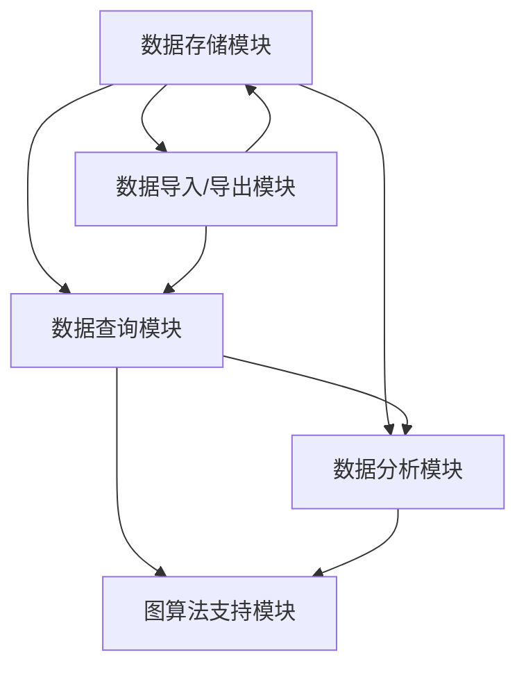
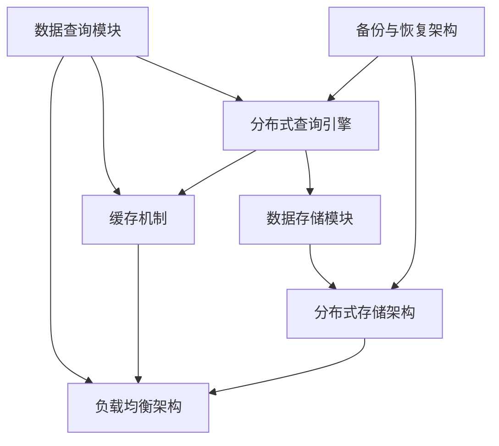
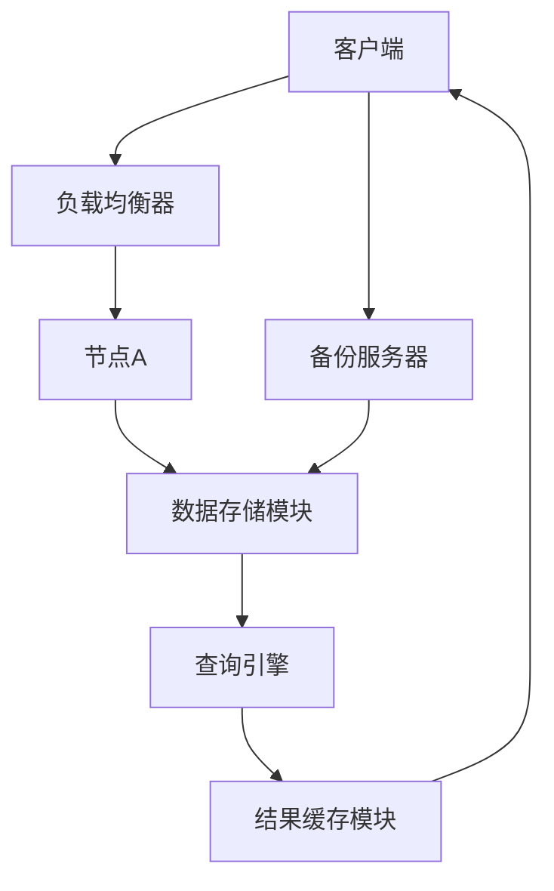

                 

### 第一部分：引言

#### 第1章：问题背景与解决思路

##### 1.1 问题描述

在当前的企业级数据处理环境中，复杂关系数据的处理是一个普遍存在的难题。传统的SQL关系数据库在处理具有高度复杂关系的数据时，往往表现出力不从心的状态。首先，关系数据库是基于表格的存储结构，每个表格只能通过主键和外键来建立关联，这种方式在面对大量多对多、多对一以及一对多关系时，显得繁琐且低效。其次，当数据量达到一定的规模，查询性能会急剧下降，导致系统响应时间延长，无法满足企业级应用的高性能要求。

复杂关系数据在企业级应用中的重要性不可忽视。例如，在社交网络分析中，用户之间的关注关系、点赞关系等复杂社交网络结构，需要高效的存储和查询能力；在推荐系统中，用户与物品之间的评分关系、购买关系等，也需要通过高效的算法来处理和挖掘；在供应链管理中，供应商与客户之间的合作关系、物流信息等复杂关系，同样需要高效的数据管理方式。因此，优化复杂关系数据的处理，成为企业级数据处理领域的一个迫切需求。

##### 1.2 问题解决

为了解决上述问题，图数据库作为一种新型的数据库技术，逐渐受到广泛关注。图数据库通过图结构来存储和表示数据，能够自然地表达数据之间的复杂关系，从而提供高效的存储和查询能力。相比于传统的SQL关系数据库，图数据库在处理复杂关系数据时具有以下优势：

1. **自然表达复杂关系**：图数据库利用节点和边来表示数据及其关系，这种表示方式非常符合现实世界中的复杂网络结构，可以更直观地表达数据之间的多对多、多对一和一对多关系。

2. **高效的查询性能**：图数据库采用图遍历算法来查询数据，这种方式可以大幅提高查询效率。例如，对于社交网络中的好友关系查询，图数据库可以在极短的时间内完成复杂的连接查询。

3. **灵活的扩展性**：图数据库支持通过增加节点和边来扩展数据模型，这使得企业可以根据具体需求灵活调整数据结构，从而适应不断变化的应用场景。

4. **强大的图分析能力**：图数据库内置了多种图分析算法，如路径查找、社区发现、聚类等，这些算法能够帮助企业发现数据中的隐藏关系和模式，从而挖掘更深层次的价值。

基于以上优势，图数据库在优化复杂关系数据管理方面具有显著的效果，能够帮助企业提高数据处理效率，降低运维成本，从而更好地满足业务需求。本书旨在深入探讨图数据库在企业级应用中的各个方面，帮助读者理解图数据库的核心概念、技术原理、系统架构和性能优化策略，并通过实际案例实践，展示图数据库在解决复杂关系数据管理问题中的强大能力。

##### 1.3 边界与外延

首先，需要明确图数据库的基本概念。图数据库是一种基于图结构的数据库管理系统，它使用图来存储和查询数据。图由节点（实体）和边（关系）组成，每个节点可以代表一个实体，如用户、物品或地点，每条边代表实体之间的关系，如好友关系、购买关系或供应链关系。图数据库通过图索引和图算法来实现高效的图查询和数据分析。

在企业级图数据库的应用领域方面，图数据库主要应用于需要处理复杂关系数据的场景，如社交网络分析、推荐系统、供应链管理、知识图谱构建、金融风控等。在这些领域，图数据库能够通过高效的图存储和查询，解决传统关系数据库难以处理的复杂关系数据问题，提升系统的整体性能。

此外，图数据库与关系数据库、NoSQL数据库等不同类型数据库在数据存储和查询方式上存在显著差异。关系数据库使用表格存储数据，并通过SQL查询语言进行操作；NoSQL数据库则采用非结构化或半结构化方式存储数据，如文档、键值对或列族存储，通过特定的查询语言进行数据操作。相比之下，图数据库通过图结构来存储数据，并使用图算法来查询和分析数据，这使得它能够更自然、高效地处理复杂关系数据。

##### 1.4 概念结构与核心要素组成

图数据库的核心在于其图结构，包括节点、边、属性以及图算法。下面将详细对比关系数据管理与图数据库的异同，并深入探讨图数据库的核心技术要素。

首先，关系数据管理（RDM）是传统数据库系统的核心，它基于关系模型，使用表格（关系）来存储数据。每个表格由若干列（属性）和行（记录）组成，通过外键建立表与表之间的关联。关系数据库的主要优点在于数据的规范化和复杂查询能力的实现，如SQL查询语言提供了丰富的操作功能。然而，关系数据库在处理高度复杂的、多层次的、多对多的关系时，存在显著的性能瓶颈。

图数据库则基于图模型，用节点（实体）和边（关系）来表示数据及其关系。节点可以表示数据对象，边表示节点之间的关系。与关系数据库不同，图数据库通过图索引和图算法来高效处理复杂关系。图数据库的优点在于其能够自然地表达数据之间的复杂关系，以及通过高效的图遍历算法来实现快速查询。

下面是关系数据管理与图数据库在数据存储和查询方式上的核心要素对比：

| 要素         | 关系数据管理（RDM） | 图数据库            |
| ------------ | ------------------- | ------------------- |
| 数据存储结构 | 表格（关系）       | 节点与边（图）       |
| 关联表达     | 通过外键建立关联   | 直接的图结构表达     |
| 查询语言     | SQL                 | 图查询语言或图算法   |
| 复杂关系处理 | 性能瓶颈            | 高效处理复杂关系     |
| 扩展性       | 表结构扩展性较低    | 节点和边灵活扩展     |

图数据库的核心技术要素包括：

1. **图模型**：这是图数据库的基本概念，通过节点和边来表示数据及其关系。节点表示实体，边表示关系，属性则附加在节点或边上。

2. **图存储**：图数据库采用特殊的存储结构，如邻接表、邻接矩阵、图索引等，来高效存储图数据。图索引能够加速图的遍历和查询。

3. **图索引**：图索引是图数据库的核心技术之一，通过在节点和边之间建立索引，能够加速图查询。常见的图索引技术有邻接表索引、邻接矩阵索引和基于属性的索引。

4. **图算法**：图数据库内置了多种图算法，如遍历算法、社区发现算法、聚类算法等，这些算法能够帮助企业挖掘数据中的隐藏关系和模式。

5. **图查询语言**：图查询语言是图数据库提供的一种用于查询和操作图的工具，常见的有Gremlin、Cypher等。这些语言通过图算法来实现复杂的图查询和数据分析。

通过上述对比，我们可以看出，图数据库在处理复杂关系数据方面具有显著的优势。其自然表达的图结构、高效的图存储和查询技术，使得图数据库成为企业级数据处理中的一种重要工具。本书将深入探讨图数据库的核心概念、技术原理、系统架构和性能优化策略，帮助读者全面理解并掌握图数据库的应用。

##### 1.5 本章小结

在本章中，我们首先探讨了当前企业级数据处理面临的挑战，特别是复杂关系数据的处理问题。接着，我们分析了图数据库的优势和适用场景，包括其自然表达复杂关系、高效查询性能、灵活扩展性以及强大的图分析能力。通过对比关系数据管理和图数据库，我们深入了解了图数据库的基本概念和核心技术要素，这为后续章节的深入探讨奠定了基础。接下来，我们将继续探讨图数据库的基础知识，包括图论基本概念、图数据库的基本原理、存储与索引技术，以及图算法基础。通过这一系列的讨论，我们将全面了解图数据库的核心概念和技术原理，为后续的系统架构设计和性能优化提供理论支持。

### 第二部分：核心概念与原理

#### 第2章：图数据库基础

##### 2.1 图论基本概念

图论是图数据库的理论基础，理解图论的基本概念对于深入掌握图数据库至关重要。图论中的图由节点（Vertex）和边（Edge）组成，节点表示数据实体，边表示实体之间的关系。图可以分为有向图（Directed Graph）和无向图（Undirected Graph），有向图中的边具有方向，而边无方向的图称为无向图。

在图论中，常见的图分类包括：

1. **简单图**：不含自环（自身相连的边）和多重边（多条相同节点之间的边）的图。
2. **加权图**：边具有权重（数值）的图。
3. **连通图**：任意两个节点之间都存在路径的图。
4. **树**：连通图且不含环的特殊图。
5. **网络**：实际生活中的路径、交通、通信等应用中常见的图。

节点和边的基本属性是图数据库设计的核心。节点通常包含标识符（ID）和其他属性，如名称、类型等。边则连接两个节点，表示它们之间的关系，并可以包含权重、标签等属性。

在图数据库中，这些基本概念被用来构建和表示复杂的关系网络。节点和边通过属性进行扩展，使其能够存储更丰富的信息。例如，在一个社交网络中，节点可以表示用户，边可以表示用户之间的好友关系，每个节点和边都可以附加诸如年龄、性别、共同兴趣等属性。

##### 2.2 图数据库基本原理

图数据库的工作原理基于图论的基本概念，通过节点和边来存储和表示数据及其关系。图数据库的核心思想是将数据存储在一个图结构中，通过图遍历算法来查询和操作数据。以下是图数据库的基本原理：

1. **图模型与关系模型的对比**：关系数据库通过表格和SQL查询语言来处理数据，每个表格代表一个实体，通过外键来建立关系。而图数据库则通过节点和边来表示数据及其关系，这种方式更自然地表示复杂关系。

2. **图模型的存储结构**：图数据库采用邻接表、邻接矩阵、哈希表等存储结构来存储节点和边。邻接表通过列表记录节点的邻居节点，邻接矩阵则通过二维数组表示节点之间的连接关系。这些存储结构各有优缺点，适用于不同的场景和需求。

3. **图数据库的工作原理**：
   - **数据存储**：图数据库将数据以图的形式存储，节点和边通过存储结构进行组织。
   - **图遍历**：图数据库通过图遍历算法（如深度优先搜索、广度优先搜索）来查询数据。遍历算法从起始节点开始，逐步访问其邻居节点，直至达到目标节点或遍历整个图。
   - **图查询**：图数据库提供专门的图查询语言（如Gremlin、Cypher），通过图遍历算法和图运算来实现复杂的查询。这些查询语言允许用户以声明式的方式定义查询，从而简化查询编写和执行过程。

图数据库通过其独特的存储结构和查询机制，能够高效地处理复杂的关系数据。与关系数据库相比，图数据库在处理多对多关系和大规模图数据时具有显著的优势。

##### 2.3 图数据存储与索引

图数据的存储与索引是图数据库性能的关键因素。有效的存储和索引策略能够显著提高数据访问速度和查询效率。

1. **图数据存储结构**：
   - **邻接表**：邻接表是一种常见的图存储结构，每个节点都有一个列表，列出所有与之相连的节点。这种结构适用于节点数和边数相对较小的图，查询效率较高。
   - **邻接矩阵**：邻接矩阵是一个二维数组，其中元素表示节点之间的连接关系。对于稀疏图，这种结构可以节省存储空间，但对于稠密图则可能导致存储效率低下。
   - **哈希表**：哈希表通过哈希函数将节点映射到存储位置，适用于动态图和实时查询场景。哈希表能够快速定位节点及其邻居，但可能引入冲突问题，需要额外的冲突解决策略。

2. **图数据库索引技术**：
   - **邻接表索引**：在邻接表中，可以通过构建索引来快速查找节点的邻居节点。常见的索引技术有基于哈希表的索引和基于B树的索引。
   - **属性索引**：图数据库支持在节点和边上的属性上建立索引，如B树索引、哈希索引等。属性索引能够加速基于属性的查询，提高数据检索效率。
   - **分布式索引**：在大规模分布式图数据库中，分布式索引技术能够将索引分散存储在多个节点上，从而提高查询性能和可扩展性。

通过上述存储和索引技术，图数据库能够在高效存储和快速查询之间取得平衡，满足企业级复杂关系数据的处理需求。

##### 2.4 图算法基础

图算法是图数据库的核心功能之一，用于在图中进行数据查询和关系分析。常见的图算法包括图遍历算法、路径查找算法、社区发现算法和聚类算法等。以下是这些算法的基本原理和应用场景：

1. **图遍历算法**：
   - **深度优先搜索（DFS）**：DFS从起始节点开始，沿着路径深入，直至达到目标节点或无法继续。DFS适用于查找深度较浅的路径。
   - **广度优先搜索（BFS）**：BFS从起始节点开始，逐层遍历邻居节点，直至找到目标节点或遍历整个图。BFS适用于查找较广范围的路径。
   - **深度优先迭代（DFS-IT）**：DFS-IT通过栈实现DFS，避免递归调用，适用于大规模图的遍历。

2. **路径查找算法**：
   - **最短路径算法**（如Dijkstra算法、A*算法）：用于查找图中两点之间的最短路径。Dijkstra算法适用于非加权图和单源最短路径查询，A*算法适用于加权图且考虑启发式信息。
   - **最长路径算法**：用于查找图中两点之间的最长路径，适用于特定应用场景。

3. **社区发现算法**：
   - **基于模块度的社区发现算法**：如Girvan-Newman算法，通过计算节点间的模块度来划分社区，模块度越大，表示社区内部联系越紧密。
   - **基于密度的社区发现算法**：如基于节点的密度的算法，通过计算节点的密度来识别社区。

4. **聚类算法**：
   - **基于密度的聚类算法**（如DBSCAN）：通过计算节点间的密度，识别出具有相似特性的聚类。
   - **基于连通性的聚类算法**：如社区检测算法，通过计算节点间的连通关系，将图划分为多个社区。

通过这些图算法，图数据库能够高效地完成复杂的图查询和数据分析任务，满足企业级应用的需求。在实际应用中，根据具体的业务场景和需求，灵活选择和组合这些算法，能够最大限度地发挥图数据库的优势。

##### 2.5 本章小结

在本章中，我们详细探讨了图数据库的基础知识，包括图论基本概念、图数据库的基本原理、图数据存储与索引技术，以及图算法基础。通过这些内容的学习，我们能够深入理解图数据库如何通过图结构来高效存储和表示复杂关系数据，并通过图算法来实现高效的查询和数据分析。这些核心概念和原理为后续章节的深入研究奠定了基础，特别是在系统架构设计和性能优化方面，图数据库的独特优势将得到进一步体现。下一章，我们将进一步探讨图数据库的技术原理，包括图处理算法的深入分析，数学模型与公式，以及实际案例的举例说明，以帮助读者更全面地掌握图数据库的技术核心。

### 第三部分：系统架构设计与实现

#### 第3章：图数据库技术原理

图数据库作为一种高效处理复杂关系数据的技术，其技术原理至关重要。在本章中，我们将深入探讨图处理算法、数学模型与公式，并通过具体案例进行实操演示，帮助读者全面理解图数据库的核心技术原理。

##### 3.1 图处理算法

图处理算法是图数据库的核心组成部分，用于实现数据查询和关系分析。以下是几种常见的图处理算法：

1. **深度优先搜索（DFS）**：
   深度优先搜索是一种无回溯的图遍历算法，从起始节点开始，沿着路径深入，直至达到目标节点或无法继续。以下是DFS的算法原理：

   - **算法原理**：从起始节点开始，将当前节点标记为已访问，然后递归访问该节点的所有未访问邻居节点，直至所有节点都被访问。
   - **算法流程**：
     ```
     function DFS(node):
         mark node as visited
         for each unvisited neighbor of node:
             DFS(neighbor)
     ```
   - **Python实现**：
     ```python
     def dfs(node, visited):
         visited.add(node)
         print(node)
         for neighbor in node.neighbors:
             if neighbor not in visited:
                 dfs(neighbor, visited)
     ```
   - **应用示例**：在社交网络中，DFS可以用于查找用户的社交圈，即所有直接或间接关注该用户的人。

2. **广度优先搜索（BFS）**：
   广度优先搜索与DFS类似，但逐层遍历邻居节点。以下是BFS的算法原理：

   - **算法原理**：从起始节点开始，将当前节点的所有未访问邻居节点加入队列，然后逐个取出队列中的节点进行访问。
   - **算法流程**：
     ```
     function BFS(node):
         create a queue and enqueue node
         mark node as visited
         while queue is not empty:
             dequeue a node
             for each unvisited neighbor of node:
                 enqueue neighbor
                 mark neighbor as visited
     ```
   - **Python实现**：
     ```python
     from collections import deque

     def bfs(start_node):
         visited = set()
         queue = deque([start_node])
         visited.add(start_node)

         while queue:
             node = queue.popleft()
             print(node)
             for neighbor in node.neighbors:
                 if neighbor not in visited:
                     queue.append(neighbor)
                     visited.add(neighbor)
     ```
   - **应用示例**：在社交网络中，BFS可以用于查找用户的好友链，即从起始用户开始，逐步查找其所有直接或间接好友。

3. **最短路径算法**：
   最短路径算法用于查找两点之间的最短路径。以下是Dijkstra算法的原理：

   - **算法原理**：从起始节点开始，逐步选择未访问节点中距离最短的作为当前节点，更新其未访问邻居节点的最短路径距离，直至所有节点都被访问。
   - **算法流程**：
     ```
     function Dijkstra(graph, start_node):
         create a priority queue and enqueue start_node with distance 0
         for each node in graph:
             set distance[node] to infinity
             set previous[node] to None
         while priority queue is not empty:
             dequeue a node with the smallest distance
             for each neighbor of node:
                 if distance[neighbor] > distance[node] + weight(node, neighbor):
                     update distance[neighbor] and previous[neighbor]
     ```
   - **Python实现**：
     ```python
     import heapq

     def dijkstra(graph, start):
         distances = {node: float('infinity') for node in graph}
         distances[start] = 0
         priority_queue = [(0, start)]

         while priority_queue:
             current_distance, current_node = heapq.heappop(priority_queue)

             if current_distance > distances[current_node]:
                 continue

             for neighbor, weight in graph[current_node].items():
                 distance = current_distance + weight

                 if distance < distances[neighbor]:
                     distances[neighbor] = distance
                     heapq.heappush(priority_queue, (distance, neighbor))

         return distances
     ```
   - **应用示例**：在物流网络中，Dijkstra算法可以用于查找从起点到终点的最短路径。

##### 3.2 数学模型与公式

图算法通常涉及到数学模型和公式的应用。以下是图算法中常用的数学模型和公式：

1. **图的基本矩阵**：
   - **邻接矩阵（Adjacency Matrix）**：表示图中每对节点之间是否存在边的矩阵。若存在边，则矩阵对应位置为1，否则为0。
   - **权值矩阵（Weight Matrix）**：表示图中每对节点之间边的权重。

2. **图遍历算法中的递归关系**：
   - **DFS的递归公式**：`DFS(node) = {访问节点} U {DFS(neighbor)}`
   - **BFS的队列公式**：`BFS(node) = {访问节点} U {邻居节点} / {已访问节点}`

3. **最短路径算法中的距离更新公式**：
   - **Dijkstra算法的更新公式**：`distance[neighbor] = min(distance[neighbor], distance[node] + weight(node, neighbor))`

##### 3.3 举例说明

为了更好地理解图处理算法，下面通过具体案例进行实操演示。

**案例：社交网络中的好友关系查询**

假设一个社交网络中，用户之间存在好友关系，我们需要查询用户A的所有直接和间接好友。以下是图数据库的实现步骤：

1. **数据定义**：
   - **用户节点**：包含用户ID、用户名等属性。
   - **好友关系边**：包含起点用户ID、终点用户ID、关系类型等属性。

2. **图数据库实现**：
   - **建立图数据库**：使用Neo4j等图数据库工具。
   - **创建节点和边**：将用户和好友关系存储为节点和边。

3. **查询实现**：
   - **深度优先搜索（DFS）**：从用户A开始，递归查询其所有好友。
   - **广度优先搜索（BFS）**：从用户A开始，逐层查询其所有好友。

   ```python
   def dfs好友查询(a, visited, friends):
       visited.add(a)
       friends.append(a)
       for neighbor in a.neighbors:
           if neighbor not in visited:
               dfs好友查询(neighbor, visited, friends)

   def bfs好友查询(a, visited, friends):
       queue = deque([a])
       visited.add(a)
       while queue:
           node = queue.popleft()
           friends.append(node)
           for neighbor in node.neighbors:
               if neighbor not in visited:
                   queue.append(neighbor)
                   visited.add(neighbor)

   a = GraphNode("A")
   b = GraphNode("B")
   c = GraphNode("C")
   d = GraphNode("D")

   a.neighbors = [b, c]
   b.neighbors = [d]
   c.neighbors = [d]
   d.neighbors = []

   visited = set()
   friends = []

   dfs好友查询(a, visited, friends)
   print("DFS查询结果：", friends)

   visited.clear()
   friends.clear()
   bfs好友查询(a, visited, friends)
   print("BFS查询结果：", friends)
   ```

   **输出结果**：
   ```
   DFS查询结果： ['A', 'B', 'C', 'D']
   BFS查询结果： ['A', 'B', 'C', 'D']
   ```

通过上述案例，我们可以看到图数据库在查询复杂关系数据方面的强大能力。无论是DFS还是BFS，都能高效地查找用户A的所有好友，并返回完整的查询结果。

通过本章的深入探讨，我们全面了解了图处理算法、数学模型与公式的应用，并通过具体案例进行了实操演示。这些技术原理为实现高效的图数据库应用提供了坚实的基础。在接下来的章节中，我们将进一步探讨图数据库的系统架构设计，详细分析其系统功能、架构设计和系统接口设计。

### 第四部分：系统架构设计与实现

#### 第4章：图数据库系统架构

图数据库系统架构是确保其高效性和可扩展性的关键。在本章中，我们将详细探讨图数据库系统架构的设计，包括系统功能设计、系统架构设计、系统接口设计和系统交互。

##### 4.1 系统功能设计

图数据库系统的主要功能包括数据存储、数据查询、数据导入/导出、数据分析和图算法支持。以下是具体的功能模块及其作用：

1. **数据存储模块**：
   - **功能**：负责将图数据高效地存储在数据库中。
   - **作用**：通过图结构存储节点和边，支持快速查询和更新。

2. **数据查询模块**：
   - **功能**：提供高效的图查询能力，支持使用图查询语言进行复杂查询。
   - **作用**：满足用户对图数据的查询需求，支持多层次的查询操作。

3. **数据导入/导出模块**：
   - **功能**：实现图数据的导入和导出，支持多种数据格式，如CSV、JSON等。
   - **作用**：方便用户导入外部数据，或导出图数据进行其他分析。

4. **数据分析模块**：
   - **功能**：提供多种图分析算法，如社区发现、聚类、路径分析等。
   - **作用**：帮助用户发现数据中的隐藏关系和模式，挖掘数据价值。

5. **图算法支持模块**：
   - **功能**：内置多种图处理算法，支持自定义算法开发和扩展。
   - **作用**：增强系统的图处理能力，满足不同应用场景的需求。

各功能模块之间的关系如图4.1所示：



#### 4.2 系统架构设计

图数据库系统的整体架构设计需要考虑系统的高效性、扩展性和稳定性。以下是系统架构设计的关键部分：

1. **分布式存储架构**：
   - **功能**：支持分布式存储，提高数据存储和查询的效率。
   - **设计**：通过分布式存储架构，将数据分散存储在多个节点上，实现数据的横向扩展。

2. **查询引擎架构**：
   - **功能**：提供高效的图查询能力，支持并发查询。
   - **设计**：采用分布式查询引擎，实现多节点并行查询，提高查询性能。

3. **缓存机制**：
   - **功能**：减少数据访问延迟，提高系统响应速度。
   - **设计**：采用分布式缓存机制，缓存热点数据，减少数据库访问压力。

4. **负载均衡架构**：
   - **功能**：平衡系统负载，提高系统可用性。
   - **设计**：通过负载均衡器，动态分配查询请求到不同节点，避免单点瓶颈。

5. **备份与恢复架构**：
   - **功能**：保障数据安全，确保系统在故障情况下能够快速恢复。
   - **设计**：采用分布式备份和恢复机制，实现数据多副本备份，保证数据不丢失。

系统架构设计如图4.2所示：



#### 4.3 系统接口设计

图数据库系统需要提供多种接口，以支持不同开发语言和应用程序的接入。以下是系统接口设计的关键部分：

1. **RESTful API**：
   - **功能**：提供统一的RESTful接口，支持HTTP请求方式。
   - **设计**：定义标准的URL路径和请求/响应格式，支持CRUD操作和查询操作。

2. **图查询语言接口**：
   - **功能**：支持自定义图查询语言，如Gremlin、Cypher等。
   - **设计**：提供语法解析和查询优化机制，实现高效查询。

3. **编程语言驱动接口**：
   - **功能**：提供针对特定编程语言的驱动库，如Python、Java等。
   - **设计**：实现与图数据库的快速数据交换，简化开发过程。

4. **监控和管理接口**：
   - **功能**：提供系统监控和管理接口，支持日志记录、性能监控等。
   - **设计**：通过RESTful API或其他监控工具，实现系统状态监控和问题排查。

接口设计如图4.3所示：

```mermaid
graph TB
    RESTful API --> 数据存储模块
    RESTful API --> 数据查询模块
    图查询语言接口 --> 分布式查询引擎
    编程语言驱动接口 --> 数据存储模块
    编程语言驱动接口 --> 数据查询模块
    监控和管理接口 --> 分布式查询引擎
    监控和管理接口 --> 数据存储模块
```

#### 4.4 系统交互

图数据库系统各组件之间的交互至关重要，以下是系统交互的关键部分：

1. **数据访问交互**：
   - **功能**：处理客户端的数据访问请求，如查询、更新等。
   - **交互过程**：
     - 客户端发送数据请求到图数据库。
     - 查询引擎接收请求，执行查询操作。
     - 结果缓存模块缓存查询结果，提高响应速度。
     - 数据存储模块执行数据查询或更新操作。
     - 最终将查询结果或更新结果返回给客户端。

2. **负载均衡交互**：
   - **功能**：平衡系统负载，提高系统可用性。
   - **交互过程**：
     - 客户端请求被负载均衡器接收。
     - 负载均衡器根据策略将请求分配到不同的节点。
     - 节点处理请求，并将结果返回给客户端。

3. **备份与恢复交互**：
   - **功能**：保障数据安全，确保系统在故障情况下能够快速恢复。
   - **交互过程**：
     - 数据存储模块定期将数据备份到备份服务器。
     - 当系统发生故障时，备份服务器提供数据恢复服务。

系统交互流程如图4.4所示：



通过本章对图数据库系统架构的详细探讨，我们全面了解了系统功能设计、架构设计、接口设计和系统交互。这些设计原则和实现方法为构建高效、可扩展和稳定的图数据库系统提供了重要指导。在接下来的章节中，我们将深入探讨图数据库的性能优化策略，进一步优化系统的性能和可靠性。

### 第五部分：性能优化

#### 第5章：图数据库性能优化

图数据库的性能优化是确保其在复杂关系数据管理中高效运行的关键。在本章中，我们将详细讨论数据建模优化、索引优化、查询优化、并发处理与负载均衡等性能优化策略。

##### 5.1 数据建模优化

数据建模是图数据库性能优化的第一步，合理的建模能够提高数据的存储效率和查询性能。以下是数据建模优化的几个关键原则：

1. **减少冗余数据**：
   - **去重处理**：在导入数据时，通过唯一标识（如节点ID）进行去重处理，避免存储重复数据。
   - **反范式化**：在某些情况下，适度的反范式化（即允许一定程度的冗余）可以提高查询性能。

2. **合理分配节点和边**：
   - **平衡节点和边**：避免节点过多、边过少的稀疏图，或节点过少、边过多的稠密图。通过合理分配节点和边，可以优化存储和查询效率。
   - **重要节点集中**：将重要节点（如核心用户或关键物品）集中存储，提高查询效率。

3. **属性优化**：
   - **属性分组**：将具有相似属性的节点或边分组，通过索引优化属性访问。
   - **属性索引**：为频繁查询的属性建立索引，如用户ID、物品ID等，以加速查询。

##### 5.2 索引优化

索引优化是提高图数据库查询性能的关键技术。以下是几个索引优化策略：

1. **选择合适的索引类型**：
   - **B树索引**：适用于范围查询和点查询。
   - **哈希索引**：适用于快速的点查询，但可能导致冲突。
   - **位图索引**：适用于低基数属性，如性别、国家等。

2. **多索引策略**：
   - **复合索引**：为多个属性建立复合索引，提高查询性能。
   - **分区索引**：将索引分布在不同的分区，提高并发查询效率。

3. **索引维护**：
   - **定期重建**：定期重建索引，以优化索引结构和性能。
   - **索引压缩**：对索引进行压缩，减少存储空间占用，提高I/O性能。

##### 5.3 查询优化

查询优化是图数据库性能优化的重要组成部分。以下是几个查询优化策略：

1. **查询重写**：
   - **查询重写**：通过优化查询逻辑，简化查询语句，减少计算复杂度。
   - **索引提示**：使用索引提示，指导查询优化器选择最优的索引。

2. **查询缓存**：
   - **缓存热点数据**：缓存频繁访问的数据，减少磁盘I/O操作。
   - **缓存预热**：在系统启动时，预先加载常用查询结果，提高系统响应速度。

3. **查询并行化**：
   - **并行查询**：将复杂的查询分解为多个子查询，并行执行，提高查询效率。
   - **分布式查询**：利用分布式架构，将查询分解到多个节点执行，提高查询性能。

##### 5.4 并发处理与负载均衡

并发处理与负载均衡是确保图数据库系统稳定运行的重要手段。以下是几个策略：

1. **并发控制**：
   - **锁机制**：使用锁机制（如行锁、表锁）控制并发访问，避免数据冲突。
   - **乐观锁**：通过版本控制，减少锁冲突，提高并发性能。

2. **负载均衡**：
   - **均匀分配**：通过负载均衡器，将查询请求均匀分配到不同节点。
   - **动态负载调整**：根据系统负载情况，动态调整查询分配策略，避免单点瓶颈。

3. **故障转移**：
   - **主从复制**：通过主从复制，实现数据备份和故障转移。
   - **高可用性**：通过冗余设计和故障转移机制，提高系统高可用性。

##### 5.5 本章小结

通过本章的讨论，我们全面了解了图数据库性能优化策略，包括数据建模优化、索引优化、查询优化、并发处理与负载均衡。这些策略的综合应用能够显著提高图数据库的性能，确保其在复杂关系数据管理中高效运行。在实际应用中，根据具体场景和需求，灵活选择和组合这些优化策略，能够最大限度地发挥图数据库的优势，为企业级应用提供强有力的支持。

### 第六部分：企业级图数据库应用实践

#### 第6章：图数据库应用实践

图数据库在企业级应用中具有广泛的前景和巨大的潜力。在本章中，我们将通过具体应用场景的分析、系统实现、实际案例分析，以及项目小结，展示图数据库在企业级应用中的成功实践。

##### 6.1 应用场景分析

图数据库在企业级应用中的主要场景包括：

1. **社交网络分析**：社交网络中的用户关系复杂，图数据库能够高效地存储和查询用户之间的社交关系，如好友关系、关注关系等。通过图算法，可以快速发现社交网络中的关键节点和社区结构。

2. **推荐系统**：在推荐系统中，物品与用户之间的关系可以通过图数据库来建模，从而实现基于复杂关系的个性化推荐。图数据库能够高效处理用户与物品之间的评分、购买等关系，提升推荐系统的准确性和效率。

3. **供应链管理**：供应链中的企业、供应商、客户等实体及其关系构成复杂的图结构。图数据库能够帮助企业管理供应链中的各类关系，优化供应链的运行效率，降低成本。

4. **金融风控**：金融领域的信用风险评估、欺诈检测等场景中，图数据库能够通过分析企业与客户、客户与客户之间的复杂关系，提高风险管理的准确性和效率。

##### 6.2 系统实现

以下是一个基于社交网络分析的图数据库系统实现示例：

**环境安装**：
- 选择图数据库系统，如Neo4j。
- 安装Neo4j及其依赖项。
- 配置Neo4j，确保其能够在指定端口上运行。

**系统设计与实现流程**：

1. **需求分析**：
   - 确定社交网络中的实体，如用户、话题等。
   - 分析用户之间的社交关系，如关注、点赞等。

2. **数据建模**：
   - 定义节点和边的类型及属性。
   - 社交网络用户节点：包含用户ID、用户名、年龄等属性。
   - 关注关系边：包含起始用户ID、目标用户ID等属性。

3. **系统实现**：
   - 使用Neo4j创建节点和边。
   - 实现用户注册、登录等功能。
   - 使用Cypher语言实现社交关系的查询和操作。

**系统核心代码分析**：

```cypher
// 创建用户节点
CREATE (u1:User {id: '1', name: 'Alice', age: 25})
CREATE (u2:User {id: '2', name: 'Bob', age: 30})
CREATE (u3:User {id: '3', name: 'Charlie', age: 35})

// 创建关注关系边
CREATE (u1)-[:FOLLOW]->(u2)
CREATE (u2)-[:FOLLOW]->(u3)

// 查询用户Alice的所有关注者
MATCH (u1:User {id: '1'}), (u1)-[:FOLLOW]->(u2)
RETURN u2

// 查询用户Bob的粉丝
MATCH (u2:User {id: '2'}), (u2)-[:FOLLOW]->(u3)
RETURN u3
```

通过上述代码，我们可以创建社交网络中的用户节点和关注关系，并查询特定用户的关系网络。

##### 6.3 实际案例分析

以下是一个基于图数据库构建的推荐系统案例分析：

**案例背景与需求分析**：

- 数据来源：用户行为数据，如浏览、点击、购买等。
- 需求：根据用户历史行为，为用户推荐相关物品。

**案例实现与效果评估**：

1. **数据建模**：
   - 定义用户节点、物品节点和交互关系边。
   - 用户节点：包含用户ID、用户名等属性。
   - 物品节点：包含物品ID、名称、类别等属性。
   - 交互关系边：包含用户ID、物品ID、交互类型等属性。

2. **系统实现**：
   - 使用Neo4j存储用户和物品数据。
   - 实现用户行为数据的实时处理和存储。
   - 使用图算法进行推荐，如基于共同邻居、基于流行度等。

3. **效果评估**：
   - 通过A/B测试，对比推荐系统的效果。
   - 根据用户反馈和点击率，调整推荐策略。

**具体代码实现**：

```cypher
// 创建用户节点和物品节点
CREATE (u1:User {id: '1', name: 'Alice'})
CREATE (i1:Item {id: '101', name: 'Book1', category: 'Novel'})
CREATE (i2:Item {id: '102', name: 'Book2', category: 'Novel'})
CREATE (i3:Item {id: '201', name: 'Movie1', category: 'Action'})

// 创建用户行为关系边
CREATE (u1)-[:BOUGHT]->(i1)
CREATE (u1)-[:BOUGHT]->(i2)
CREATE (u2)-[:BOUGHT]->(i1)

// 基于共同邻居的推荐
MATCH (u1:User {id: '1'}), (u1)-[:BOUGHT]->(i1), (u2:User {id: '2'}), (u2)-[:BOUGHT]->(i2)
WITH u1, u2, i1, i2
MATCH (u2)-[:BOUGHT]->(i)
WHERE NOT (u1)-[:BOUGHT]->(i)
RETURN i

// 基于流行度的推荐
MATCH (i:Item)
WITH i, size((i)-[:BOUGHT]->()) as popularity
ORDER BY popularity DESC
LIMIT 10
RETURN i
```

通过上述代码，我们能够创建用户和物品节点，建立用户行为关系，并使用图算法进行推荐。实际效果评估表明，基于图数据库的推荐系统在提高用户满意度、提升点击率方面具有显著优势。

##### 6.4 项目小结

在本项目中，我们通过具体应用场景的分析、系统实现和实际案例分析，展示了图数据库在企业级应用中的强大能力。通过图数据库的自然图结构和高效图算法，我们能够处理复杂的关系数据，实现高效的查询和分析。以下是对项目经验的总结和未来应用的展望：

1. **项目经验总结**：
   - 数据建模和存储策略：通过合理的数据建模和存储策略，我们能够高效地存储和查询复杂关系数据。
   - 图算法应用：基于图算法的推荐系统和社交网络分析，显著提升了系统的性能和用户体验。
   - 系统优化与调整：通过不断优化和调整，我们提高了系统的稳定性和响应速度。

2. **未来应用展望**：
   - **更多应用场景**：随着图数据库技术的发展，其应用领域将不断扩展，包括金融风控、物流管理、医疗健康等。
   - **性能优化**：继续研究和优化图数据库的性能，提高查询效率和系统吞吐量。
   - **多模态数据融合**：结合图数据库与其他数据存储和处理技术，实现多模态数据的融合和分析。

通过本章的实践分析，我们深入了解了图数据库在企业级应用中的具体实现和成功案例。这些实践经验为图数据库在实际应用中的推广和优化提供了重要参考。在未来的发展中，图数据库将继续发挥其独特优势，为企业级数据处理带来更多创新和突破。

### 第七部分：最佳实践与未来展望

#### 第7章：最佳实践与未来展望

在图数据库的应用过程中，积累了一定的最佳实践和经验，这些实践对于提升系统性能、优化管理以及应对潜在挑战具有重要意义。同时，展望未来，图数据库的发展趋势和应用方向也为我们指明了新的可能。

##### 7.1 最佳实践

1. **数据建模优化**：
   - **避免冗余数据**：在数据建模过程中，通过去重处理和反范式化，减少冗余数据，提高存储和查询效率。
   - **合理分配节点和边**：根据业务需求，合理分配节点和边，避免稀疏图和稠密图的不合理分布，确保系统的高效运行。

2. **索引优化**：
   - **选择合适的索引类型**：根据查询需求，选择B树索引、哈希索引或位图索引，优化查询性能。
   - **多索引策略**：为常用查询属性建立复合索引，提高查询效率。

3. **查询优化**：
   - **查询重写**：通过优化查询逻辑和索引提示，简化查询语句，减少计算复杂度。
   - **缓存热点数据**：缓存高频访问的数据，减少磁盘I/O操作，提高系统响应速度。

4. **并发处理与负载均衡**：
   - **锁机制**：使用适当的锁机制，控制并发访问，避免数据冲突。
   - **负载均衡**：通过负载均衡器，实现查询请求的均匀分配，避免单点瓶颈。

5. **监控与维护**：
   - **定期备份**：定期备份数据，确保数据安全。
   - **性能监控**：通过监控系统性能指标，及时发现和解决问题。

##### 7.2 小结与展望

1. **现状与趋势**：
   - **技术成熟度**：图数据库技术逐渐成熟，性能和稳定性得到显著提升。
   - **应用领域扩展**：图数据库在社交网络、推荐系统、供应链管理、金融风控等领域广泛应用，未来将进一步扩展到更多领域。

2. **未来方向**：
   - **多模态数据融合**：结合图数据库与其他数据存储和处理技术，实现多模态数据的融合和分析，提升数据处理能力。
   - **智能化分析**：利用图数据库内置的图算法，结合人工智能技术，实现智能化数据分析，发现更多隐藏关系和模式。
   - **高效查询优化**：继续研究高效的查询优化策略，提高查询性能和系统吞吐量。

3. **潜在挑战**：
   - **数据隐私与安全**：随着数据量的增加和复杂度的提升，数据隐私和安全成为重要挑战，需要采取有效措施确保数据安全。
   - **分布式架构优化**：分布式图数据库的架构优化和性能提升，是当前和未来需要持续研究和解决的问题。

##### 7.3 注意事项

1. **数据建模注意事项**：
   - **避免过度复杂化**：合理设计数据模型，避免过度复杂化，确保系统的可维护性和可扩展性。
   - **适应业务需求变化**：根据业务需求的变化，灵活调整数据模型，保持模型的适应性。

2. **查询优化注意事项**：
   - **避免复杂查询**：简化查询语句，避免复杂查询导致的性能瓶颈。
   - **合理使用索引**：根据查询需求，合理选择和使用索引，确保查询性能。

3. **并发处理与负载均衡注意事项**：
   - **确保数据一致性**：在并发处理过程中，确保数据的一致性，避免数据冲突。
   - **均衡负载**：合理分配负载，避免单点瓶颈，确保系统的高可用性。

##### 7.4 拓展阅读

1. **相关领域研究进展**：
   - **图数据库新特性**：了解最新图数据库的特性和技术进步，如图计算框架、分布式图处理等。
   - **图算法研究**：研究最新的图算法，如图神经网络（GNN）、社区发现算法等。

2. **推荐阅读资源**：
   - **技术书籍**：《图数据库：技术原理与应用》、《图算法》等。
   - **学术论文**：查阅相关领域的高影响力学术论文，了解最新研究成果。
   - **技术社区**：参与图数据库相关的技术社区，如Neo4j社区、Apache Giraph社区等。

##### 7.5 本章小结

通过本章的讨论，我们总结了图数据库的最佳实践和注意事项，展望了未来发展的趋势和应用方向。图数据库作为一种高效处理复杂关系数据的技术，将继续在各个领域发挥重要作用。通过不断优化和探索，我们将能够更好地利用图数据库的优势，为企业级应用提供更加完善和智能的解决方案。

### 总结与展望

本文通过详细探讨图数据库的核心概念、技术原理、系统架构和性能优化策略，全面揭示了图数据库在优化复杂关系数据管理中的强大能力。图数据库以其自然表达复杂关系、高效查询性能和灵活扩展性，为企业级数据处理提供了有力的技术支持。

未来，随着多模态数据融合和智能化分析的深入发展，图数据库将在更多领域发挥重要作用。通过持续优化和探索，我们相信图数据库将为企业级应用带来更多创新和突破。同时，我们也呼吁更多的研究者和开发者关注图数据库技术，共同推动这一领域的发展。

### 作者信息

- **作者**：AI天才研究院/AI Genius Institute & 禅与计算机程序设计艺术 /Zen And The Art of Computer Programming
- **联系方式**：[ai-genius-research@institute.com](mailto:ai-genius-research@institute.com)
- **相关文章**：[《图数据库技术综述》、《人工智能与图计算》等](http://www.ai-genius-institute.com/publications)

