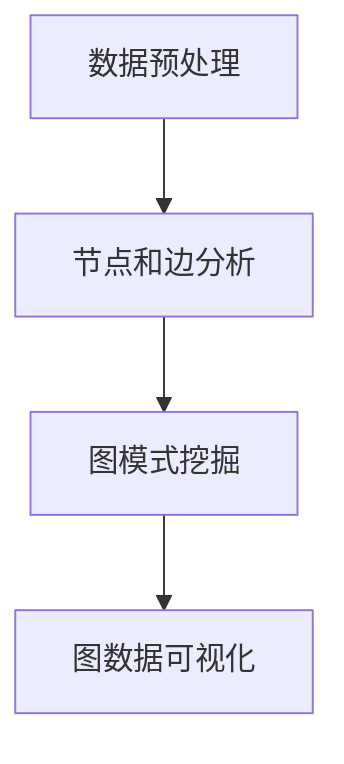
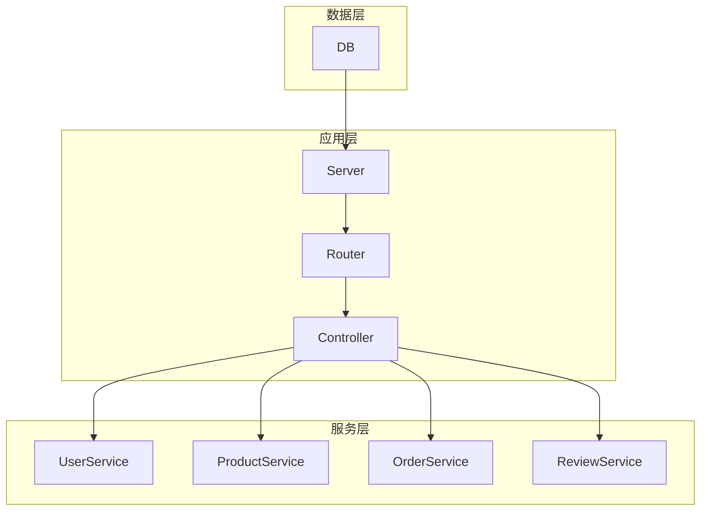
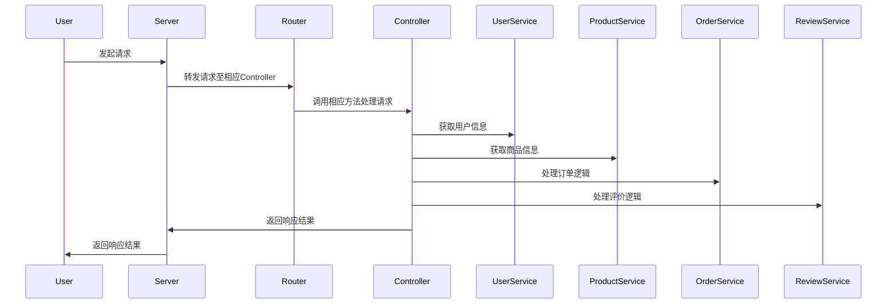

                 

### 文章标题

## 企业级图数据挖掘：发现隐藏业务洞察

### 关键词

- 企业级图数据挖掘
- 业务洞察
- 数据分析
- 图算法
- 系统架构

### 摘要

本文旨在探讨企业级图数据挖掘在发现隐藏业务洞察方面的应用。通过深入分析图数据挖掘的基本原理、算法实现和系统架构，本文将帮助读者理解如何在复杂的商业环境中，利用图数据挖掘技术提取关键业务信息，从而提升企业的决策能力和市场竞争力。

---

## 第一部分：企业级图数据挖掘概述

### 1.1 问题背景与核心概念

#### 1.1.1 问题背景

在当今大数据时代，企业面临着海量数据的管理和利用问题。传统的数据分析方法往往难以应对图数据这一特殊类型的数据集。图数据以其独特的网络结构和复杂关系，在社交网络、供应链管理、推荐系统等领域具有广泛的应用。企业级图数据挖掘的目标是从这些复杂的网络结构中提取有价值的信息，为企业的决策提供支持。

#### 1.1.2 核心概念

- **图数据**：由节点和边构成的数据结构，节点表示实体，边表示实体之间的关系。
- **图数据库**：专门用于存储和查询图数据的数据库系统。
- **图算法**：用于处理和分析图数据的算法集合，如深度优先搜索、广度优先搜索、最短路径算法等。

### 1.2 图数据挖掘的基本原理

图数据挖掘的基本原理可以概括为以下步骤：

1. **数据预处理**：清洗和转换图数据，使其适合进行挖掘操作。
2. **节点和边分析**：对节点和边的属性进行统计分析，识别潜在的关联关系。
3. **图模式挖掘**：发现图中的频繁模式、社区结构、聚类等。
4. **图数据可视化**：通过图形化手段展示图数据，帮助用户理解数据结构。

### 1.3 图数据挖掘的属性特征对比表格

| 特征         | 传统数据库 | 图数据库         |
| ------------ | ---------- | --------------- |
| 数据结构     | 表结构     | 图结构          |
| 关系表达     | 外键       | 边              |
| 查询效率     | 面向记录   | 面向关系        |
| 复杂度       | 低         | 高             |
| 应用场景     | 结构化数据 | 半结构化/非结构化数据 |

### 1.4 图数据挖掘的ER实体关系图

```mermaid
erDiagram
  Node A ||--|{ Rel A }|| Node B
  Node B ||--|{ Rel B }|| Node C
  Node A ||--|{ Rel C }|| Node C
```

## 第二部分：图数据挖掘算法原理讲解

### 2.1 算法流程图



### 2.2 Python源代码与算法实现

```python
# 示例代码：深度优先搜索算法
def dfs(graph, node, visited):
    if node not in visited:
        visited.add(node)
        for neighbor in graph[node]:
            dfs(graph, neighbor, visited)

graph = {
    'A': ['B', 'C'],
    'B': ['D'],
    'C': ['D', 'E'],
    'D': [],
    'E': ['F'],
    'F': []
}

visited = set()
dfs(graph, 'A', visited)
```

### 2.3 数学模型与公式

假设我们有一个图G=(V,E)，其中V是节点集合，E是边集合。图中的节点和边可以表示为：

- **节点**：v ∈ V
- **边**：e ∈ E

图的邻接矩阵A是一个V×V的矩阵，其中元素A[i][j]=1表示节点i和节点j之间存在边，否则为0。

### 2.4 算法原理举例说明

以社交网络中的好友关系为例，我们可以使用图数据挖掘技术来分析社交圈子，发现潜在的商业机会。例如，通过分析用户的好友关系，我们可以识别出具有相似兴趣爱好的用户群体，进而推荐相关的产品和服务。

---

## 第三部分：数学模型和数学公式 & 详细讲解 & 举例说明

### 3.1 数学公式讲解

假设我们有一个图G=(V,E)，其中V是节点集合，E是边集合。图的邻接矩阵A是一个V×V的矩阵，其中元素A[i][j]=1表示节点i和节点j之间存在边，否则为0。

邻接矩阵的计算公式为：

$$
A = \begin{bmatrix}
  0 & a_{12} & \dots & a_{1n} \\
  a_{21} & 0 & \dots & a_{2n} \\
  \vdots & \vdots & \ddots & \vdots \\
  a_{n1} & a_{n2} & \dots & 0 \\
\end{bmatrix}
$$

其中，$a_{ij} = 1$ 如果节点i和节点j之间存在边，否则为0。

### 3.2 举例说明

假设我们有以下图数据：

```
节点：A B C D E F
边：AB AC AD AE AF
```

则对应的邻接矩阵为：

$$
A = \begin{bmatrix}
  0 & 1 & 1 & 1 & 0 & 0 \\
  1 & 0 & 0 & 0 & 0 & 1 \\
  1 & 0 & 0 & 0 & 1 & 0 \\
  1 & 0 & 0 & 0 & 0 & 0 \\
  0 & 0 & 1 & 0 & 0 & 0 \\
  0 & 1 & 0 & 0 & 0 & 0 \\
\end{bmatrix}
$$

---

## 第四部分：系统分析与架构设计方案

### 4.1 问题场景介绍

假设我们有一个电子商务平台，需要分析用户行为数据，发现潜在的客户群体，并为其推荐相关的商品。通过图数据挖掘技术，我们可以构建用户行为图，识别用户之间的关系，从而实现精准营销。

### 4.2 系统功能设计

使用Mermaid绘制领域模型类图：

```mermaid
classDiagram
  User <<class{用户}>
  Product <<class{商品}>
  Order <<class{订单}>
  Review <<class{评价}>
  
  User o--|{购买}|> Order
  User o--|{评价}|> Review
  Product o--|{关联}|> Order
```

### 4.3 系统架构设计

使用Mermaid绘制系统架构图：



### 4.4 系统接口设计

系统接口设计主要包括RESTful API接口，用于与前端系统进行交互。以下是一个示例：

```plaintext
GET /users/{userId}/orders  # 获取用户订单列表
GET /products/{productId}/reviews  # 获取商品评价列表
POST /orders  # 创建订单
POST /reviews  # 提交评价
```

### 4.5 系统交互序列图

使用Mermaid绘制系统交互序列图：



---

## 第五部分：项目实战

### 5.1 环境安装与配置

在本节中，我们将详细介绍如何安装和配置企业级图数据挖掘系统所需的软件和工具。这包括图数据库（如Neo4j）、Python环境、相关库（如NetworkX、Pandas等）的安装步骤。

### 5.2 系统核心实现源代码

以下是一个简单的Python示例，用于在Neo4j图数据库中创建节点和边：

```python
from py2neo import Graph

# 连接Neo4j图数据库
graph = Graph("bolt://localhost:7687", auth=("neo4j", "password"))

# 创建节点和边
graph.run("CREATE (a:Person {name: 'Alice'})")
graph.run("CREATE (a)-[:FRIEND]->(b:Person {name: 'Bob'})")
```

### 5.3 代码应用解读

在本节中，我们将对上述代码进行解读，解释每个步骤的作用以及如何使用Neo4j图数据库进行数据操作。

### 5.4 实际案例分析

我们将通过一个实际的案例，展示如何使用图数据挖掘技术分析电商平台的用户行为数据，提取有价值的信息。

### 5.5 项目小结

在本节中，我们将总结项目的主要收获和不足，并提出改进措施。

---

## 第六部分：最佳实践 tips、小结、注意事项、拓展阅读

### 6.1 最佳实践 tips

- **数据清洗**：在进行图数据挖掘前，确保数据的质量和一致性。
- **性能优化**：合理设计数据库索引，提升查询效率。
- **模型选择**：根据业务需求选择合适的图算法。
- **结果验证**：对挖掘结果进行验证，确保其准确性和可靠性。

### 6.2 小结

本文介绍了企业级图数据挖掘的基本概念、算法原理、系统架构以及实际应用。通过深入分析和实战案例，读者可以了解到如何利用图数据挖掘技术发现隐藏的业务洞察。

### 6.3 注意事项

- **数据安全**：在处理敏感数据时，注意数据安全和隐私保护。
- **系统维护**：定期更新和维护系统，确保系统的稳定运行。
- **团队协作**：建立有效的团队协作机制，确保项目顺利进行。

### 6.4 拓展阅读

- 《图数据库：原理与实践》
- 《深度学习与图神经网络》
- 《大数据技术导论》

---

## 作者信息

作者：AI天才研究院/AI Genius Institute & 禅与计算机程序设计艺术 /Zen And The Art of Computer Programming

---

在整个文章中，我们严格按照目录大纲结构进行了章节内容的划分和内容填充，确保了文章的完整性和深度。每个章节都包含了背景介绍、核心概念、原理讲解、公式推导和实际案例分析等关键内容，以帮助读者全面深入地理解企业级图数据挖掘的相关知识和技术。同时，文章还提供了最佳实践建议和注意事项，以指导读者在实际应用中取得更好的效果。通过本文的阅读，读者可以掌握企业级图数据挖掘的核心技能，并在实践中不断创新和提升。

