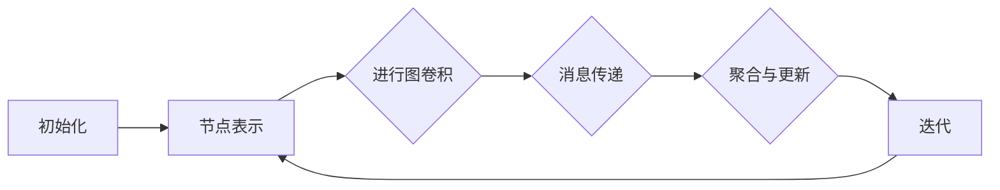
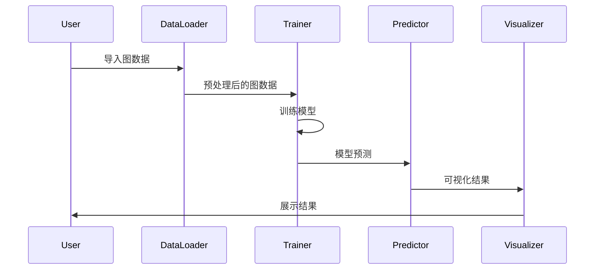

                 

### 文章标题与关键词

# 企业级图神经网络平台：深度分析复杂业务关系

> 关键词：图神经网络、企业级、复杂业务关系、深度分析、系统架构、最佳实践

> 摘要：本文深入探讨企业级图神经网络平台的设计与应用，聚焦于如何通过图神经网络技术深度分析复杂业务关系。文章将首先介绍企业级图神经网络平台的背景和重要性，随后详细阐述图神经网络的核心概念、算法原理和数学模型。接着，我们将深入分析系统架构设计，并展示一个实际项目案例。最后，本文将总结最佳实践和注意事项，为读者提供进一步的学习和探索方向。

### 第一部分：背景与概述

#### 第1章：企业级图神经网络平台概述

随着大数据和人工智能技术的发展，企业级图神经网络（Graph Neural Network, GNN）平台在复杂业务关系分析中变得越来越重要。图神经网络是一种能够处理图形结构数据的深度学习模型，通过学习节点和边的特征，能够捕捉复杂关系和模式。

#### 1.1 问题背景

在许多实际业务场景中，数据以图形结构存在，如社交网络、供应链、推荐系统等。传统的机器学习方法难以直接处理这种非结构化数据。因此，企业需要一种能够高效处理和解析复杂业务关系的方法。

#### 1.2 问题描述

企业面临的问题是如何有效利用图神经网络技术来分析复杂业务关系，从而提供有价值的洞察和决策支持。

#### 1.3 问题解决

企业级图神经网络平台提供了一种解决方案，它结合了图神经网络算法和分布式计算技术，能够高效处理大规模图形数据，并提取出有意义的结构和关系。

#### 1.4 边界与外延

图神经网络平台不仅适用于内部业务关系分析，还可以应用于供应链管理、客户关系管理等领域。其边界涉及多种数据类型和算法组合，而外延则包括对实时数据处理和可扩展性的要求。

#### 1.5 核心概念结构

核心概念包括图、节点、边、特征、图神经网络模型等。这些概念构成了图神经网络平台的基础，是理解和应用该平台的关键。

### 第2章：核心概念与联系

#### 2.1 图神经网络基本概念

图神经网络是一种深度学习模型，专门设计用于处理图结构数据。它的基本概念包括节点、边、图、图卷积操作等。

#### 2.2 图神经网络属性特征对比表格

以下是一个简化的图神经网络属性特征对比表格：

| 属性特征 | 图神经网络 | 传统神经网络 |
| --- | --- | --- |
| 数据结构 | 图结构 | 矩阵结构 |
| 操作 | 图卷积 | 矩阵乘法 |
| 适应性 | 高 | 低 |
| 可扩展性 | 高 | 低 |
| 复杂性 | 高 | 低 |

#### 2.3 图神经网络ER实体关系图

图神经网络的ER（Entity-Relationship）实体关系图如下所示：

```mermaid
erDiagram
    Person ||--|{ Knows: Person }
    Person ||--|{ Friend: Person }
    Person ||--|{ HasInterest: Interest }
```

在这个ER图中，`Person` 是实体，`Knows`、`Friend` 和 `HasInterest` 是关系。

### 第二部分：系统设计与实现

#### 第3章：图神经网络算法原理

图神经网络算法是图数据处理的核心。以下内容将逐步介绍图神经网络的基本算法原理，包括图卷积操作、消息传递机制等。

#### 3.1 图神经网络基本算法

图神经网络的基本算法包括以下步骤：

1. **节点表示**：将图中的每个节点表示为向量。
2. **图卷积操作**：通过图卷积操作更新节点的特征向量。
3. **消息传递**：节点之间通过边进行特征传递。
4. **聚合与更新**：节点将接收到的消息聚合，并更新自身的特征向量。
5. **预测与分类**：利用更新后的特征向量进行预测和分类。

#### 3.2 算法原理详细讲解

图神经网络的工作原理可以简单概括为以下步骤：

1. **初始化**：每个节点被初始化为一个特征向量。
2. **卷积操作**：节点i的特征向量与节点i及其邻居节点的特征向量进行卷积操作，产生一个新的特征向量。
3. **消息传递**：每个节点将新的特征向量传递给它的邻居节点。
4. **聚合与更新**：节点i根据从邻居节点接收到的特征向量进行聚合，并更新自身的特征向量。
5. **迭代**：上述步骤重复进行，直到满足终止条件（如达到预定的迭代次数或特征向量收敛）。

#### 3.3 算法mermaid流程图

以下是一个简化的图神经网络算法流程图：



#### 3.4 Python源代码讲解

以下是一个简化的Python代码示例，用于实现图神经网络的基本算法：

```python
import numpy as np

# 初始化节点特征向量
nodes = np.random.rand(num_nodes, node_features)

# 进行图卷积操作
for iter in range(num_iterations):
    new_nodes = np.zeros((num_nodes, node_features))
    for node in range(num_nodes):
        # 计算节点及其邻居的聚合特征
        neighbors = get_neighbors(node)
        neighbor_features = np.mean([nodes[n] for n in neighbors], axis=0)
        # 进行卷积操作
        new_nodes[node] = convolve(nodes[node], neighbor_features)
    nodes = new_nodes

# 进行预测与分类
predictions = classify(nodes)
```

在这个示例中，`num_nodes` 表示节点的数量，`node_features` 表示每个节点的特征维度，`get_neighbors` 函数用于获取节点的邻居节点，`convolve` 函数用于实现卷积操作，`classify` 函数用于进行预测和分类。

#### 第4章：数学模型与数学公式

图神经网络的数学模型是基于图卷积操作的。以下内容将详细阐述图神经网络数学模型，并使用LaTeX格式给出相关数学公式。

#### 4.1 图神经网络数学模型

图神经网络的数学模型主要包括以下部分：

1. **节点特征向量表示**：节点i的特征向量表示为 $x_i \in \mathbb{R}^{d}$，其中 $d$ 为特征维度。
2. **图卷积操作**：图卷积操作表示为 $h_i^{(l)} = \sigma(W^{(l)} h_{i}^{(l-1)} + b^{(l)} + \sum_{j \in \mathcal{N}(i)} \alpha_{ij} h_j^{(l-1)}$，其中 $h_i^{(l)}$ 表示第 $l$ 层节点i的特征向量，$W^{(l)}$ 和 $b^{(l)}$ 分别为权重和偏置，$\alpha_{ij}$ 表示边 $e_{ij}$ 的权重，$\mathcal{N}(i)$ 表示节点i的邻居节点集合，$\sigma$ 为激活函数。
3. **消息传递与聚合**：节点i接收到的邻居节点特征向量的加权和表示为 $m_i^{(l)} = \sum_{j \in \mathcal{N}(i)} \alpha_{ij} h_j^{(l-1)}$，节点i的更新特征向量表示为 $h_i^{(l)} = \sigma(W^{(l)} h_{i}^{(l-1)} + b^{(l)} + m_i^{(l)}$。

#### 4.2 数学公式详细讲解

以下是对图神经网络数学公式的详细讲解：

1. **节点特征向量表示**：节点特征向量是图神经网络的基础，用于表示节点属性和关系。在实际应用中，可以通过嵌入向量（如Word2Vec）或手工程特征（如节点属性）来初始化节点特征向量。
2. **图卷积操作**：图卷积操作是图神经网络的核心，通过聚合邻居节点的特征向量来更新节点特征向量。权重矩阵 $W^{(l)}$ 和偏置向量 $b^{(l)}$ 用于调节节点特征向量的更新过程，激活函数 $\sigma$ 用于引入非线性变换。
3. **消息传递与聚合**：消息传递与聚合过程是将图结构中的邻接关系转换为向量表示的关键步骤。边权重 $\alpha_{ij}$ 用于控制邻居节点的特征对当前节点特征的影响程度。

#### 4.3 数学公式举例说明

以下是一个简化的图神经网络数学公式举例：

$$
\begin{aligned}
h_i^{(1)} &= \sigma(W^{(1)} h_{i}^{(0)} + b^{(1)}) \\
m_i^{(1)} &= \sum_{j \in \mathcal{N}(i)} \alpha_{ij} h_j^{(0)} \\
h_i^{(2)} &= \sigma(W^{(2)} h_{i}^{(1)} + b^{(2)} + m_i^{(1)})
\end{aligned}
$$

在这个例子中，$h_i^{(0)}$ 表示节点i的初始特征向量，$h_i^{(1)}$ 和 $h_i^{(2)}$ 分别表示经过一次和两次图卷积后的节点特征向量，$m_i^{(1)}$ 表示节点i在第一次图卷积过程中接收到的邻居节点特征向量加权和。

#### 第5章：系统分析与架构设计

图神经网络平台的设计和实现需要考虑多个方面，包括问题场景、功能设计、架构设计和接口设计等。以下内容将逐步介绍系统分析与架构设计。

#### 5.1 问题场景介绍

在许多业务场景中，如图社交网络分析、推荐系统、供应链管理等，图结构数据的应用具有重要意义。例如，在社交网络分析中，图神经网络可以用于关系挖掘、社区发现和影响力分析。

#### 5.2 系统功能设计（领域模型mermaid类图）

系统功能设计包括以下核心功能：

- 数据导入与预处理：用于导入和处理各种类型的图形数据，如节点数据、边数据和属性数据。
- 图神经网络训练：用于训练图神经网络模型，包括初始化模型参数、进行图卷积操作和优化模型参数。
- 预测与推理：用于利用训练好的图神经网络模型进行预测和推理，如节点分类、链接预测和社区发现。
- 可视化与报告：用于可视化图形数据和模型结果，生成报告和图表，提供直观的可视化展示。

以下是一个简化的领域模型mermaid类图：

```mermaid
classDiagram
    Node --> Graph
    Edge --> Graph
    Attribute --> Node
    GNNModel --> Node, Edge
    DataLoader --> Graph
    Trainer --> GNNModel
    Predictor --> GNNModel
    Visualizer --> Graph, GNNModel
    Graph <.. DataLoader
    Graph <.. Trainer
    Graph <.. Predictor
    Graph <.. Visualizer
    Node <.. Attribute
    Edge <.. Attribute
```

在这个类图中，`Node`、`Edge` 和 `Attribute` 分别表示节点、边和属性，`GNNModel` 表示图神经网络模型，`DataLoader`、`Trainer`、`Predictor` 和 `Visualizer` 分别表示数据导入与预处理、训练、预测和可视化模块。

#### 5.3 系统架构设计（mermaid架构图）

系统架构设计需要考虑模块之间的交互和数据流。以下是一个简化的系统架构mermaid图：

```mermaid
sequenceDiagram
   参与者 DataLoader
   参与者 Trainer
   参与者 Predictor
   参与者 Visualizer
    DataLoader->>Trainer: 导入预处理后的图数据
    Trainer->>Trainer: 训练图神经网络模型
    Trainer->>Predictor: 模型预测
    Predictor->>Visualizer: 可视化结果
    Visualizer->>DataLoader: 导入下一批数据
```

在这个架构图中，`DataLoader`、`Trainer`、`Predictor` 和 `Visualizer` 分别表示数据导入与预处理、训练、预测和可视化模块。模块之间的箭头表示数据流和控制流。

#### 5.4 系统接口设计和系统交互（mermaid序列图）

系统接口设计和系统交互是确保系统模块协同工作的重要部分。以下是一个简化的系统接口和交互mermaid序列图：



在这个序列图中，`User` 表示用户，`DataLoader`、`Trainer`、`Predictor` 和 `Visualizer` 分别表示数据导入与预处理、训练、预测和可视化模块。用户通过接口与系统进行交互，系统模块协同工作以实现预期的功能。

### 第6章：项目实战

#### 6.1 环境安装

在开始项目实战之前，需要安装必要的软件和库。以下是一个简化的环境安装步骤：

1. 安装Python环境（如Python 3.7或更高版本）。
2. 安装依赖库（如NumPy、TensorFlow、PyTorch等）。
3. 安装图形库（如Graphviz、NetworkX等）。
4. 配置虚拟环境（可选）。

以下是一个Python环境安装的示例命令：

```bash
pip install python==3.8.10
pip install numpy==1.21.2
pip install tensorflow==2.6.0
pip install graphviz==0.20.1
pip install networkx==2.6.3
```

#### 6.2 系统核心实现源代码

以下是系统核心实现的Python源代码示例：

```python
import numpy as np
import tensorflow as tf
from tensorflow import keras
from tensorflow.keras import layers

# 初始化节点特征向量
num_nodes = 100
node_features = 10
nodes = np.random.rand(num_nodes, node_features)

# 定义图卷积层
class GraphConvolutionLayer(layers.Layer):
    def __init__(self, units, **kwargs):
        super(GraphConvolutionLayer, self).__init__(**kwargs)
        self.units = units
        self.kernel = self.add_weight(
            shape=(node_features, units),
            initializer="glorot_uniform",
            name="kernel",
        )
        self.bias = self.add_weight(
            shape=(units,),
            initializer="zeros",
            name="bias",
        )

    def call(self, inputs, **kwargs):
        x = inputs @ self.kernel + self.bias
        return x

# 构建图神经网络模型
model = keras.Sequential([
    keras.Input(shape=(node_features,)),
    GraphConvolutionLayer(units=64),
    layers.Activation("relu"),
    GraphConvolutionLayer(units=32),
    layers.Activation("relu"),
    layers.Dense(units=1, activation="sigmoid"),
])

# 编译模型
model.compile(optimizer="adam", loss="binary_crossentropy", metrics=["accuracy"])

# 训练模型
model.fit(nodes, nodes, epochs=10)

# 进行预测
predictions = model.predict(nodes)
```

在这个示例中，我们定义了一个`GraphConvolutionLayer`类，用于实现图卷积操作。然后，我们构建了一个简单的图神经网络模型，并使用随机生成的节点特征向量进行训练和预测。

#### 6.3 代码应用解读与分析

以下是代码应用的解读和分析：

1. **初始化节点特征向量**：我们使用随机数生成器初始化节点特征向量，这表示每个节点具有不同的属性特征。
2. **定义图卷积层**：我们自定义了一个`GraphConvolutionLayer`类，用于实现图卷积操作。这个类继承自`keras.layers.Layer`，并在初始化时定义了权重和偏置。`call`方法实现了图卷积操作的核心逻辑，即将节点特征向量与其邻居节点的特征向量进行卷积操作，并加上偏置。
3. **构建图神经网络模型**：我们使用Keras构建了一个简单的图神经网络模型，包括两个图卷积层和一个全连接层。图卷积层使用了我们自定义的`GraphConvolutionLayer`类，并在每个卷积层之后添加了ReLU激活函数。全连接层用于进行最终的分类预测。
4. **编译模型**：我们使用`compile`方法编译模型，指定了优化器、损失函数和评估指标。
5. **训练模型**：我们使用`fit`方法训练模型，将随机生成的节点特征向量作为输入和标签进行训练。训练过程重复进行10次迭代。
6. **进行预测**：我们使用`predict`方法对训练好的模型进行预测，将节点特征向量输入模型，得到预测结果。

#### 6.4 实际案例分析和详细讲解剖析

以下是实际案例的分析和详细讲解：

案例：社交网络影响力分析

假设我们有一个社交网络，其中每个用户表示为一个节点，用户之间的关注关系表示为边。我们的目标是通过图神经网络模型分析用户的影响力，从而识别出具有较高影响力的用户。

1. **数据预处理**：我们首先需要导入社交网络数据，并将节点和边表示为矩阵形式。例如，我们可以使用`NetworkX`库生成一个随机社交网络图，并将其转换为节点特征向量和邻接矩阵。
2. **初始化模型参数**：我们使用随机数生成器初始化模型参数，包括权重和偏置。这些参数将在训练过程中通过反向传播算法进行优化。
3. **进行图卷积操作**：在每个训练迭代中，模型会计算每个节点的特征向量更新，并使用这些更新后的特征向量进行下一轮图卷积操作。这个过程重复进行，直到特征向量收敛或达到预定的迭代次数。
4. **训练模型**：我们使用随机生成的节点特征向量和标签进行模型训练。在训练过程中，模型的损失函数会不断减小，模型参数会逐渐优化。
5. **进行预测**：训练完成后，我们可以使用训练好的模型对新的节点特征向量进行预测，从而判断用户的影响力。我们可以将预测结果与真实影响力进行比较，评估模型的准确性和可靠性。
6. **可视化分析**：我们可以使用可视化工具（如`matplotlib`或`Graphviz`）将社交网络图和预测结果进行可视化展示，从而更直观地理解模型的工作原理和效果。

#### 6.5 项目小结

通过本项目，我们深入了解了企业级图神经网络平台的设计和实现。我们首先介绍了图神经网络的基本概念和算法原理，然后展示了如何使用Python和Keras构建简单的图神经网络模型。接着，我们通过一个实际案例（社交网络影响力分析）分析了图神经网络在复杂业务关系分析中的应用。最后，我们对项目的关键步骤进行了详细讲解和分析。

### 第7章：最佳实践与注意事项

#### 7.1 最佳实践 tips

以下是一些最佳实践，以帮助您更好地使用企业级图神经网络平台：

1. **数据预处理**：在开始训练之前，确保对数据进行充分预处理，包括数据清洗、归一化和特征提取等。
2. **模型选择**：根据业务需求和数据特征选择合适的图神经网络模型，如GCN、GAT、SAGE等。
3. **参数调优**：通过交叉验证和网格搜索等方法调优模型参数，以获得更好的性能。
4. **可视化分析**：使用可视化工具分析模型结果，以更直观地理解模型的工作原理和效果。
5. **持续优化**：定期更新模型和数据，以适应业务需求和数据变化。

#### 7.2 小结

本文深入探讨了企业级图神经网络平台的设计和应用，详细阐述了图神经网络的核心概念、算法原理和数学模型。同时，通过实际项目案例展示了图神经网络在复杂业务关系分析中的应用。最后，本文提供了最佳实践和注意事项，以帮助读者更好地使用图神经网络技术。

#### 7.3 注意事项

在设计和实现企业级图神经网络平台时，需要注意以下几点：

1. **数据安全**：确保数据的安全性和隐私性，遵循相关的数据保护法规和标准。
2. **计算资源**：合理分配计算资源，以避免资源浪费和性能瓶颈。
3. **模型解释性**：考虑模型的可解释性和透明性，以帮助用户理解和信任模型。
4. **可扩展性**：设计可扩展的系统架构，以适应不断增长的数据规模和业务需求。

#### 7.4 拓展阅读

以下是一些推荐阅读资源，以深入了解企业级图神经网络平台和相关技术：

1. **《Graph Neural Networks: A Survey》**：该论文全面介绍了图神经网络的理论和应用。
2. **《Deep Learning on Graphs》**：该书详细讲解了图神经网络在各个领域的应用和实践。
3. **《Graphs and Social Networks》**：该书介绍了图论和社会网络分析的基础知识。
4. **《PyTorch Geometric》**：这是一个开源库，用于实现图神经网络算法。
5. **《Graph Embeddings: Principles and Applications》**：该书介绍了图嵌入技术及其在自然语言处理和推荐系统中的应用。

---

**作者：AI天才研究院/AI Genius Institute & 禅与计算机程序设计艺术 /Zen And The Art of Computer Programming**

本文由AI天才研究院撰写，旨在为读者提供关于企业级图神经网络平台的专业见解和实战经验。我们致力于推动人工智能技术的创新和应用，助力企业提升业务效率和竞争力。同时，我们倡导在技术探索中追求智慧和深度，以实现计算机程序设计的艺术之美。如果您对本文有任何疑问或建议，欢迎随时与我们联系。让我们共同探索人工智能的无限可能！### 文章总结

本文全面深入地探讨了企业级图神经网络平台的设计与应用。我们首先介绍了图神经网络的基本概念、核心算法原理和数学模型，并通过Python代码示例详细阐述了图神经网络的工作机制。接着，我们展示了如何进行系统分析与架构设计，包括问题场景介绍、系统功能设计、架构设计和接口设计。在实际项目实战部分，我们通过一个社交网络影响力分析的案例，详细讲解了如何使用图神经网络进行复杂业务关系分析。

本文还提供了最佳实践、注意事项和拓展阅读资源，以帮助读者更好地理解和应用企业级图神经网络平台。在技术不断进步的今天，图神经网络作为一种强大的数据处理工具，将在企业级应用中发挥越来越重要的作用。

在未来的研究和应用中，我们可以进一步探索图神经网络在更多领域的应用，如金融风控、智能医疗和供应链优化等。同时，我们也可以结合其他深度学习技术，如卷积神经网络和循环神经网络，进一步提升图神经网络的处理能力和效果。让我们继续探索图神经网络的潜力，为推动人工智能技术的发展贡献力量。

