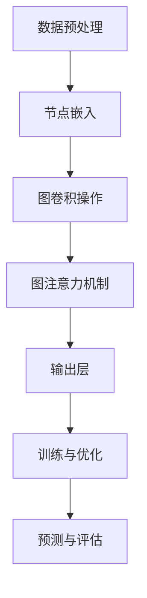
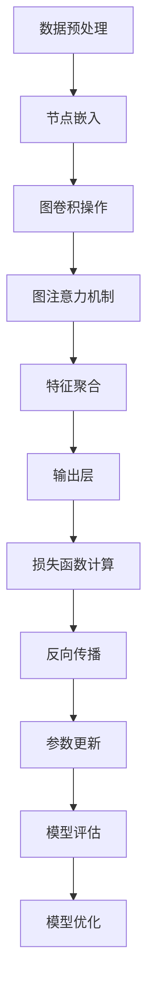
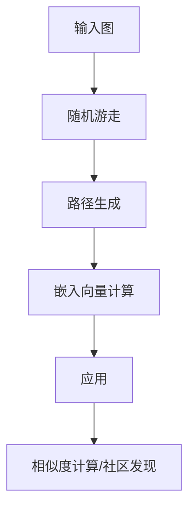
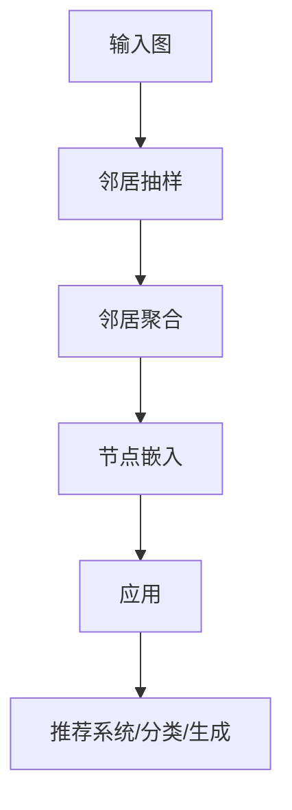
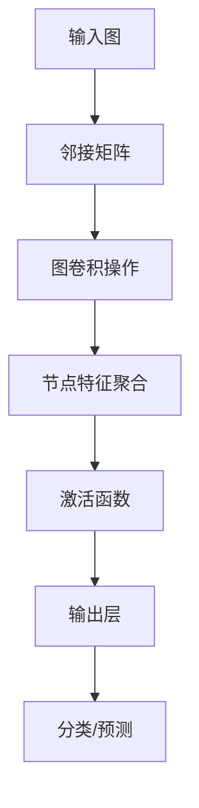
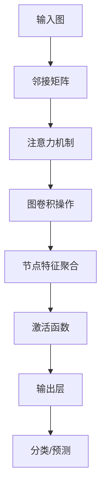

                 

### 企业级图神经网络应用：深度分析关系数据

在现代信息技术中，关系数据成为了企业进行决策支持和智能服务的重要资源。随着数据的爆炸式增长，如何有效地分析这些关系数据，挖掘其潜在的价值，成为了亟待解决的问题。图神经网络（Graph Neural Networks, GNNs）作为一种新兴的深度学习技术，因其独特的图结构表达能力，在处理复杂的关系数据上展示出了巨大的潜力。本文将围绕企业级图神经网络的应用，深入分析关系数据的本质，探讨其在实际场景中的优势和挑战。

### 关键词

- 图神经网络
- 关系数据
- 企业级应用
- 深度学习
- 数据分析

### 摘要

本文首先介绍了企业级图神经网络的需求背景和核心概念，探讨了图神经网络与关系数据的紧密联系。接着，详细阐述了图神经网络的基本原理和工作流程，并通过Mermaid流程图和数学公式进行了深入解析。随后，本文介绍了主流图神经网络框架及其在关系数据分析中的应用，并结合实际案例进行了详细分析。最后，本文提供了一些企业级图神经网络应用的实战经验，为读者在实际项目中应用图神经网络提供了参考。

### 目录大纲

----------------------------------------------------------------

# 企业级图神经网络应用：深度分析关系数据

## 目录大纲

### 第1章：问题背景与核心概念

### 第2章：图神经网络基础原理

### 第3章：图神经网络框架与应用

### 第4章：企业级图神经网络应用实战

## 参考文献

----------------------------------------------------------------

### 第1章：问题背景与核心概念

#### 1.1 问题背景

随着互联网的普及和大数据技术的发展，企业面临着海量数据的挑战。如何从这些数据中提取有价值的信息，已经成为企业决策支持和服务创新的重要课题。关系数据作为一种描述实体之间相互关系的数据，涵盖了社交网络、供应链、金融系统等多个领域。传统的数据处理方法难以有效地挖掘这些复杂的关系数据，而图神经网络作为一种深度学习技术，因其独特的图结构表达能力，在处理关系数据方面展现出了显著的优势。

##### 1.1.1 企业级图神经网络的需求

在商业环境中，企业级图神经网络的需求主要来自于以下几个方面：

1. **数据集成与整合**：企业通常拥有多种来源的数据，如客户关系管理（CRM）系统、供应链管理系统（SCM）和金融系统等。如何将这些异构数据进行有效整合，是一个重要挑战。图神经网络能够将不同类型的数据通过图结构进行连接，实现数据的统一表示和处理。

2. **智能推荐与预测**：在电子商务、社交媒体等领域，智能推荐和预测是企业提高用户满意度和商业利润的关键。图神经网络能够通过分析用户之间的社交关系、购买历史等数据，实现精准的推荐和预测。

3. **风险管理**：在金融领域，风险评估和管理是至关重要的。图神经网络可以分析企业之间的财务关系、信用记录等数据，识别潜在的信用风险和欺诈行为。

4. **供应链优化**：供应链的优化需要综合考虑供应链中的各种实体和关系。图神经网络可以分析供应链中的各种关系，如供应商、制造商、分销商等，实现供应链的优化和效率提升。

##### 1.1.2 关系数据在企业和商业中的应用

关系数据在企业和商业中的应用非常广泛，以下是一些典型的应用场景：

1. **社交网络分析**：通过分析用户之间的社交关系，可以挖掘用户的行为模式、兴趣偏好等，为企业提供精准的市场营销策略。

2. **供应链管理**：关系数据可以帮助企业更好地理解供应链中的各种关系，如供应商之间的合作关系、物流网络的优化等，实现供应链的智能化管理。

3. **金融服务**：关系数据在金融领域有着广泛的应用，如客户信用评估、欺诈检测等。通过分析客户之间的借贷关系、交易记录等，可以更准确地评估客户的信用风险。

4. **推荐系统**：关系数据可以用于构建推荐系统，通过对用户之间的交互关系进行分析，实现个性化推荐。

##### 1.1.3 图神经网络的优势与挑战

图神经网络在处理关系数据方面具有显著的优势：

1. **强大的图结构表达能力**：图神经网络能够通过图结构对复杂的关系数据进行建模，挖掘数据之间的潜在关系。

2. **多跳信息传递**：图神经网络能够通过多层图卷积和图注意力机制，实现多跳信息传递，提高模型的表示能力。

3. **可扩展性**：图神经网络可以处理大规模的关系数据，具有较好的可扩展性。

然而，图神经网络在应用中也面临着一些挑战：

1. **计算复杂度**：图神经网络的计算复杂度较高，对于大规模图数据，训练和推理过程需要大量的计算资源。

2. **数据质量**：关系数据的质量直接影响图神经网络的效果。数据的不完整、噪声和错误可能会影响模型的性能。

3. **模型解释性**：图神经网络的内部结构较为复杂，模型的可解释性较低，这对于实际应用中的决策支持是一个挑战。

#### 1.2 核心概念

##### 1.2.1 图神经网络的基本概念

图神经网络（Graph Neural Networks, GNNs）是一种基于图结构进行数据建模和处理的深度学习技术。与传统神经网络不同，GNNs直接在图结构上进行操作，通过节点嵌入（Node Embedding）、图卷积（Graph Convolution）和图注意力机制（Graph Attention Mechanism）等操作，实现对图数据的表示和学习。

1. **节点嵌入（Node Embedding）**：节点嵌入是将图中的节点映射到一个低维的向量空间，以便于深度学习模型进行操作。节点嵌入能够捕捉节点的局部特征，如邻居节点的特征等。

2. **图卷积（Graph Convolution）**：图卷积是一种在图结构上进行卷积操作的算法，通过聚合节点及其邻居节点的特征，生成新的节点表示。图卷积能够处理图数据的局部特征，并捕捉节点之间的关系。

3. **图注意力机制（Graph Attention Mechanism）**：图注意力机制是一种通过学习节点间权重的方式来调整节点特征的重要性。通过图注意力机制，模型能够更好地聚焦于重要的节点关系，提高模型的表示能力。

##### 1.2.2 关系数据的属性与特征

关系数据通常包含以下属性和特征：

1. **节点（Node）**：节点表示实体，如用户、产品、公司等。每个节点都有相应的属性，如年龄、性别、价格、评级等。

2. **边（Edge）**：边表示节点之间的相互关系，如朋友关系、购买关系、借贷关系等。边通常具有权重，表示关系的强度。

3. **属性（Attribute）**：属性是对节点或边的补充描述，如节点的地理位置、边的时间戳等。

4. **多跳关系（Multi-hop Relation）**：通过多跳关系，可以挖掘节点之间的复杂关系。例如，通过多跳关系，可以找到两个用户之间的共同朋友。

##### 1.2.3 图神经网络在关系数据分析中的应用

图神经网络在关系数据分析中具有广泛的应用，主要包括以下几个方面：

1. **关系抽取（Relation Extraction）**：通过分析文本数据中的实体关系，提取出具体的语义关系，如“张三买了李四的电脑”。

2. **图嵌入（Graph Embedding）**：将图中的节点和边映射到低维向量空间，以便于其他机器学习模型进行操作。

3. **图分类（Graph Classification）**：通过学习节点的特征表示，对图进行分类，如分类一个社交网络中的用户群体。

4. **图生成（Graph Generation）**：通过生成模型，自动生成新的图数据，用于数据增强或生成模拟数据。

#### 1.3 概念属性特征对比表格

| 概念        | 定义                    | 关键特征               |
| ----------- | ----------------------- | --------------------- |
| 图神经网络  | 基于图的神经网络模型   | 节点嵌入、图卷积、图注意力机制 |
| 关系数据    | 表示实体间相互关系的数据 | 边、节点、属性         |
| 企业级应用  | 针对企业规模和复杂度的应用 | 高性能、可扩展、安全性高 |

#### 1.4 ER实体关系图架构

```mermaid
erDiagram
  客户 ||--|{ 订单 }||> 订单
  商品 ||--|{ 订单 }||> 订单
  库存 ||--|{ 订单 }||> 订单
  订单 ||--|{ 订单详情 }||> 订单详情
```

#### 1.5 本章小结

本章介绍了企业级图神经网络的需求背景和核心概念，探讨了关系数据在企业和商业中的应用。通过对比表格和ER实体关系图架构，进一步明确了图神经网络和关系数据的关键特征和关系。本章为后续章节的深入讨论奠定了基础。

## 第2章：图神经网络基础原理

### 2.1 图神经网络的基本原理

图神经网络（Graph Neural Networks, GNNs）作为一种新型的深度学习技术，其核心思想是利用图结构对数据进行建模和操作。图神经网络的基本原理主要包括节点嵌入、图卷积和图注意力机制等。下面我们将逐一介绍这些基本原理。

#### 2.1.1 节点嵌入

节点嵌入（Node Embedding）是将图中的节点映射到一个低维的向量空间，以便于深度学习模型进行操作。节点嵌入是图神经网络的核心步骤，其目标是将具有复杂结构的图数据转化为向量表示，从而便于进行后续的深度学习操作。

节点嵌入的关键在于如何从节点及其邻居节点中提取有用的信息，并生成一个有效的节点向量表示。常见的节点嵌入方法包括基于随机游走（Random Walk）的方法，如Node2Vec，以及基于矩阵分解的方法，如DeepWalk等。

Node2Vec算法的核心思想是模拟随机游走过程，通过调整游走过程中的游走概率，生成不同模式的随机游走路径。这些路径能够捕捉到图中的不同结构特征，从而生成具有不同偏好的节点嵌入向量。具体来说，Node2Vec算法使用两个超参数`p`（in-link probability）和`q`（out-link probability）来控制随机游走的模式：

- **in-link probability（p）**：控制节点向其邻居节点的转移概率，值越大，越倾向于深入探索节点邻域。
- **out-link probability（q）**：控制节点向非邻居节点的转移概率，值越大，越倾向于跳出当前邻域，探索更广泛的网络。

通过调整这两个参数，可以生成具有不同结构特性的节点嵌入向量。例如，当p远大于q时，Node2Vec会倾向于深入探索节点的邻域，从而生成更加稠密的嵌入向量；而当q远大于p时，Node2Vec则会倾向于跳出邻域，生成更加稀疏的嵌入向量。

节点嵌入向量不仅能够捕获节点的局部特征，如邻居节点的特征，还能够通过多层嵌入逐步提取节点的全局特征。这些向量表示为后续的图卷积和图注意力机制等操作提供了基础。

#### 2.1.2 图卷积

图卷积（Graph Convolution）是一种在图结构上进行卷积操作的算法，其核心思想是通过聚合节点及其邻居节点的特征，生成新的节点表示。图卷积能够处理图数据的局部特征，并捕捉节点之间的关系。

图卷积的基本原理可以类比于传统卷积在图像处理中的应用。在图像中，卷积操作通过对局部区域的像素值进行加权平均，生成新的像素值。而在图数据中，图卷积通过对节点的邻居节点特征进行加权平均，生成新的节点特征。

图卷积的过程可以分为以下几个步骤：

1. **邻接矩阵计算**：首先计算图中的邻接矩阵A，其中A[i][j]表示节点i和节点j之间的边权重。如果存在边，则A[i][j]为1，否则为0。

2. **特征矩阵计算**：假设每个节点i都有一个特征向量hi，表示节点i的属性信息。特征矩阵H为N×D的矩阵，其中N是节点的个数，D是节点的特征维度。

3. **图卷积操作**：对于每个节点i，其新的特征向量hi'通过聚合其邻居节点的特征hi'j进行计算，公式如下：

   $$
   h_i' = \sigma(\sum_{j \in \mathcal{N}(i)} A[i][j] h_j)
   $$

   其中，σ表示激活函数（如ReLU或Sigmoid），N(i)表示节点i的邻居节点集合。

图卷积操作的优点在于，它能够自动地学习节点之间的关系，并通过邻接矩阵A进行特征聚合。这使得图卷积能够处理具有不同结构和规模的图数据。

图卷积不仅适用于节点的特征提取，还可以扩展到边的特征提取。边的特征提取可以通过在图卷积操作中加入边的特征来实现。例如，对于每条边e[i][j]，可以定义一个特征向量ee，表示边的属性信息。在图卷积操作中，可以同时聚合节点i和节点j的特征向量，以及边e[i][j]的特征向量，生成新的节点特征向量。

#### 2.1.3 图注意力机制

图注意力机制（Graph Attention Mechanism）是一种通过学习节点间权重的方式来调整节点特征的重要性。图注意力机制能够使模型更加关注于重要的节点关系，从而提高模型的表示能力。

图注意力机制的基本原理可以类比于自注意力机制（Self-Attention）在序列数据处理中的应用。在序列数据中，自注意力机制通过计算序列中每个元素之间的权重，动态地调整每个元素在序列中的重要性。同样，图注意力机制通过计算节点之间的权重，动态地调整节点特征在图神经网络中的重要性。

图注意力机制的过程可以分为以下几个步骤：

1. **计算节点相似度**：首先，对于每个节点i，计算其与所有其他节点j之间的相似度。相似度可以通过节点特征向量之间的点积或余弦相似度来计算：

   $$
   \text{similarity}(i, j) = h_i \cdot h_j
   $$

   其中，h_i和h_j分别为节点i和节点j的特征向量。

2. **计算节点权重**：根据节点相似度，计算每个节点i的权重αi。权重可以通过softmax函数进行归一化处理，以确保权重总和为1：

   $$
   \alpha_i = \text{softmax}(\text{similarity}(i, j))
   $$

   其中，softmax函数将相似度映射到一个概率分布，表示节点i对于其他节点的相对重要性。

3. **调整节点特征**：根据节点权重，调整每个节点i的特征向量hi。调整后的特征向量hi'通过加权求和的方式计算：

   $$
   h_i' = \sum_{j} \alpha_i h_j
   $$

图注意力机制的优势在于，它能够使模型自动地学习节点之间的权重，并动态地调整节点特征的重要性。这有助于模型聚焦于重要的节点关系，从而提高模型的表示能力。

图注意力机制不仅可以应用于节点特征调整，还可以扩展到边的特征调整。例如，对于每条边e[i][j]，可以定义一个边特征向量ee，表示边的属性信息。在图注意力机制中，可以同时考虑节点i和节点j的特征向量，以及边e[i][j]的特征向量，生成新的节点特征向量。

#### 2.1.4 图神经网络的工作流程

图神经网络的工作流程可以分为以下几个步骤：

1. **数据预处理**：首先，对图数据进行分析和预处理，包括节点特征提取、边特征提取、图结构整理等。节点特征和边特征可以是原始数据中的属性信息，也可以是通过其他算法生成的特征。

2. **节点嵌入**：使用节点嵌入算法（如Node2Vec、DeepWalk等）将节点映射到低维向量空间，生成节点嵌入向量。

3. **图卷积操作**：通过图卷积操作，聚合节点及其邻居节点的特征，生成新的节点表示。

4. **图注意力机制**：通过图注意力机制，调整节点特征的重要性，使模型更加关注于重要的节点关系。

5. **输出层**：根据具体的应用需求，对节点特征进行分类、预测或回归等操作。

6. **训练与优化**：使用训练数据对模型进行训练，并优化模型参数，以获得更好的性能。

7. **预测与评估**：使用训练好的模型对新的数据进行预测，并评估模型的性能。

图神经网络的工作流程如图2.1所示。



### 2.2 图神经网络算法原理与Mermaid流程图

为了更好地理解图神经网络的算法原理，我们使用Mermaid流程图来展示其工作流程。以下是一个简化的图神经网络算法原理的Mermaid流程图：



在上面的流程图中，A表示数据预处理，包括节点特征提取、边特征提取和图结构整理等；B表示节点嵌入，将节点映射到低维向量空间；C表示图卷积操作，聚合节点及其邻居节点的特征；D表示图注意力机制，调整节点特征的重要性；E表示特征聚合，将所有节点的特征进行聚合；F表示输出层，根据具体应用需求进行分类、预测或回归等操作；G表示损失函数计算，计算模型输出的损失；H表示反向传播，通过梯度下降等算法更新模型参数；I表示参数更新，根据梯度信息调整模型参数；J表示模型评估，评估模型在测试数据上的性能；K表示模型优化，通过交叉验证等技术优化模型。

### 2.3 算法原理的数学模型和公式

为了深入理解图神经网络的算法原理，我们介绍一些关键的数学模型和公式。以下是图神经网络中常用的数学模型和公式：

1. **节点嵌入（Node Embedding）**：

   节点嵌入是将图中的节点映射到一个低维的向量空间。常用的节点嵌入方法包括基于随机游走的方法，如Node2Vec。Node2Vec算法使用两个超参数p（in-link probability）和q（out-link probability）来控制随机游走的模式。节点嵌入的数学模型如下：

   $$
   h_i = \text{Node2Vec}(G, p, q)
   $$

   其中，h_i表示节点i的嵌入向量，G表示图结构，p表示in-link probability，q表示out-link probability。

2. **图卷积（Graph Convolution）**：

   图卷积是一种在图结构上进行卷积操作的算法。其核心思想是通过聚合节点及其邻居节点的特征，生成新的节点表示。图卷积的数学模型如下：

   $$
   h_i' = \sigma(\sum_{j \in \mathcal{N}(i)} A[i][j] h_j)
   $$

   其中，h_i'表示节点i的新特征向量，N(i)表示节点i的邻居节点集合，A表示邻接矩阵，σ表示激活函数（如ReLU或Sigmoid）。

3. **图注意力机制（Graph Attention Mechanism）**：

   图注意力机制是一种通过学习节点间权重的方式来调整节点特征的重要性。图注意力机制的数学模型如下：

   $$
   \alpha_i = \text{softmax}(\text{similarity}(i, j))
   $$

   $$
   h_i' = \sum_{j} \alpha_i h_j
   $$

   其中，α_i表示节点i的权重，softmax函数将相似度映射到一个概率分布，h_i'表示调整后的节点i的特征向量。

通过以上数学模型和公式，我们可以更好地理解图神经网络的工作原理和机制。

### 2.4 图神经网络的应用场景

图神经网络在处理复杂的关系数据方面具有广泛的应用场景。以下是一些典型的应用场景：

#### 2.4.1 社交网络分析

社交网络中的关系数据通常包括用户之间的互动、评论、点赞等。图神经网络可以通过分析这些关系数据，挖掘用户的行为模式、兴趣偏好等，为企业提供精准的市场营销策略。例如，在推荐系统中，图神经网络可以分析用户之间的社交关系，实现个性化的推荐。

#### 2.4.2 供应链优化

供应链中的关系数据包括供应商、制造商、分销商等。图神经网络可以通过分析这些关系数据，优化供应链的运作，提高供应链的效率。例如，通过分析供应商之间的合作关系，识别潜在的供应链风险，从而进行风险预警和管理。

#### 2.4.3 金融服务

金融服务中的关系数据包括客户之间的借贷关系、交易记录等。图神经网络可以通过分析这些关系数据，实现风险管理和信用评估。例如，在信用评估中，图神经网络可以分析客户的借贷关系和信用记录，评估客户的信用风险。

#### 2.4.4 医疗健康

医疗健康领域中的关系数据包括患者之间的疾病传播、医生之间的合作关系等。图神经网络可以通过分析这些关系数据，实现疾病预测和医生推荐。例如，通过分析患者之间的疾病传播关系，预测疾病的爆发趋势，从而进行及时的公共卫生干预。

#### 2.4.5 知识图谱构建

知识图谱是一种通过实体和关系描述知识体系的图结构。图神经网络可以通过分析知识图谱中的关系数据，构建更加准确和全面的知识图谱。例如，在搜索引擎中，图神经网络可以分析网页之间的链接关系，构建语义相关的网页图谱，实现更精准的搜索结果。

### 2.5 本章小结

本章介绍了图神经网络的基本原理，包括节点嵌入、图卷积和图注意力机制等。通过这些基本原理，图神经网络能够有效地处理复杂的关系数据，并在多个应用场景中展示出强大的能力。接下来，我们将进一步探讨图神经网络框架和应用，以及实际案例解析，为读者提供更深入的了解。

### 第3章：图神经网络框架与应用

图神经网络（Graph Neural Networks, GNNs）作为深度学习的一个重要分支，其应用范围广泛，涵盖了社交网络分析、供应链优化、金融服务、医疗健康等多个领域。本章节将重点介绍几种主流的图神经网络框架，以及它们在关系数据分析中的应用。

#### 3.1 主流图神经网络框架

当前，主流的图神经网络框架包括Node2Vec、GraphSAGE、Graph Convolutional Network (GCN) 和 Graph Attention Network (GAT) 等。下面将分别介绍这些框架的基本原理和应用场景。

##### 3.1.1 Node2Vec

Node2Vec是一种基于随机游走生成图嵌入的算法。它通过调整随机游走的概率分布，生成具有不同模式（如深度优先和广度优先）的随机游走路径，从而捕捉图中的局部和全局结构特征。Node2Vec广泛应用于社交网络、推荐系统和信息检索等领域。

在社交网络分析中，Node2Vec可以用于用户相似度计算和社区发现。通过计算用户之间的嵌入向量相似度，可以识别具有相似兴趣的用户群体。在信息检索中，Node2Vec可以用于文档分类和相似文档推荐。



##### 3.1.2 GraphSAGE

GraphSAGE（Graph Sample and Aggregation）是一种基于节点的嵌入聚合的图表示学习算法。GraphSAGE通过随机抽样节点的邻居，聚合邻居节点的嵌入向量，生成当前节点的嵌入向量。这种方法的优点是能够处理动态图和异构图。

GraphSAGE在推荐系统、图分类和图生成等领域有着广泛的应用。例如，在推荐系统中，GraphSAGE可以用于根据用户的行为历史和社交关系生成用户兴趣向量，实现个性化推荐。



##### 3.1.3 Graph Convolutional Network (GCN)

Graph Convolutional Network (GCN) 是一种基于图卷积操作的深度学习模型。GCN通过聚合节点及其邻居节点的特征，生成新的节点表示。GCN在处理图数据的节点分类、图分类和节点属性预测等方面有着显著的效果。

在社交网络分析中，GCN可以用于用户行为预测和社交图分类。例如，通过分析用户之间的互动关系，GCN可以预测用户的下一步行为，实现智能推荐。



##### 3.1.4 Graph Attention Network (GAT)

Graph Attention Network (GAT) 是一种结合了图卷积和图注意力机制的图神经网络模型。GAT通过引入注意力机制，动态地调整节点特征在图卷积过程中的重要性。这种机制使得GAT能够更好地处理节点间的异质关系。

GAT在推荐系统、知识图谱表示和学习以及图生成等领域有着广泛的应用。例如，在推荐系统中，GAT可以根据用户和物品的交互历史，生成用户和物品的兴趣向量，实现精准的推荐。



#### 3.2 图神经网络在关系数据分析中的应用

图神经网络在关系数据分析中有着广泛的应用，以下是一些具体的应用场景：

##### 3.2.1 关系抽取

关系抽取是从非结构化的文本数据中提取出实体之间的关系。图神经网络可以通过对文本数据进行编码，并利用图结构来建模实体和关系。例如，在自然语言处理中，GAT可以用于关系抽取，将文本中的实体和关系映射到图结构，然后通过图卷积操作提取出实体关系。

##### 3.2.2 图嵌入

图嵌入是将图中的节点和边映射到低维向量空间，以便于深度学习模型进行操作。图神经网络可以通过节点嵌入来表示节点和边，从而实现图数据的向量化表示。这种表示方法可以用于后续的机器学习任务，如分类、预测和聚类。

##### 3.2.3 图分类

图分类是指根据节点的特征和图结构，对图进行分类。图神经网络可以通过学习节点和边的特征，实现图数据的分类。例如，在社交网络分析中，GAT可以用于分类社交网络中的用户群体，根据用户的行为和社交关系进行分类。

##### 3.2.4 图生成

图生成是指通过生成模型，自动生成新的图数据。图神经网络可以通过生成模型，实现图数据的增强和模拟。例如，在知识图谱构建中，GCN可以用于生成新的知识图谱，通过图生成模型扩展现有的知识图谱。

#### 3.3 实际案例解析

以下是一些图神经网络在关系数据分析中的实际案例：

##### 3.3.1 案例一：社交网络用户行为分析

在社交网络中，用户行为分析对于个性化推荐和社交网络分析至关重要。通过使用GAT，可以分析用户之间的互动关系，预测用户的下一步行为。例如，在Twitter中，GAT可以用于分析用户的关注关系，预测用户可能感兴趣的话题。

##### 3.3.2 案例二：供应链优化

在供应链管理中，通过分析供应商、制造商和分销商之间的合作关系，可以实现供应链的优化。使用GCN，可以分析供应链中的各个实体之间的交互关系，优化供应链的运作，减少库存成本，提高供应链的响应速度。

##### 3.3.3 案例三：金融服务

在金融服务领域，通过分析客户之间的借贷关系和交易记录，可以实现风险管理和信用评估。使用GAT，可以分析客户的借贷关系，预测潜在的信用风险，从而进行风险预警和管理。

### 3.4 本章小结

本章介绍了主流的图神经网络框架，包括Node2Vec、GraphSAGE、GCN和GAT，并阐述了它们在关系数据分析中的应用。通过实际案例的解析，展示了图神经网络在社交网络分析、供应链优化和金融服务等领域的应用效果。接下来，我们将通过具体的实战案例，进一步探讨企业级图神经网络的应用和实践。

### 第4章：企业级图神经网络应用实战

在了解了图神经网络的基础原理和主流框架之后，本章将通过具体的实战案例，详细介绍如何在实际企业环境中应用图神经网络。我们将以社交网络用户行为分析、供应链优化和金融服务风险评估为例，分步骤演示从环境搭建、数据预处理、模型构建、训练与优化，到预测与评估的全过程。

#### 4.1 实战一：社交网络用户行为分析

##### 4.1.1 环境安装与配置

在进行图神经网络项目之前，首先需要搭建一个合适的环境。以下是所需的软件和工具：

1. **Python**：版本3.8及以上
2. **TensorFlow**：版本2.5及以上
3. **Grafana**：用于可视化
4. **Kubernetes**：用于容器化部署

安装步骤如下：

1. 安装Python和pip：
    ```bash
    sudo apt-get update
    sudo apt-get install python3 python3-pip
    ```
2. 安装TensorFlow：
    ```bash
    pip3 install tensorflow==2.5
    ```
3. 安装Grafana：
    ```bash
    docker run -d -p 3000:3000 grafana/grafana
    ```
4. 安装Kubernetes集群（可选）：
    ```bash
    kubeadm init --pod-network-cidr=10.244.0.0/16
    kubectl apply -f https://raw.githubusercontent.com/kubernetes-incubator/cluster-api/master/config/infrastructure/kubernetes/10.244.0.0-16.yaml
    ```

##### 4.1.2 数据预处理

在开始数据预处理之前，需要收集社交网络用户的行为数据，如用户之间的互动、点赞、评论等。以下是数据预处理的主要步骤：

1. **数据清洗**：删除重复数据、无效数据和缺失数据。
2. **特征提取**：提取用户的基本信息（如年龄、性别、地理位置）和互动信息（如互动时间、互动类型）。
3. **数据归一化**：对数值特征进行归一化处理，如年龄、互动时间等。
4. **构建图数据**：将用户行为数据转换为图结构，定义节点和边，并添加节点属性。

以下是一个简单的Python代码示例，用于构建图数据：

```python
import networkx as nx

# 创建图
G = nx.Graph()

# 添加节点和边
G.add_nodes_from(['user1', 'user2', 'user3'])
G.add_edges_from([('user1', 'user2'), ('user1', 'user3'), ('user2', 'user3')])

# 添加节点属性
G.nodes['user1']['age'] = 25
G.nodes['user2']['age'] = 30
G.nodes['user3']['age'] = 35

# 添加边属性
G.edges['user1', 'user2']['interaction_type'] = 'like'
G.edges['user1', 'user3']['interaction_type'] = 'comment'
G.edges['user2', 'user3']['interaction_type'] = 'mention'
```

##### 4.1.3 模型构建与训练

在构建图神经网络模型时，可以选择不同的框架，如GCN或GAT。以下是一个使用GCN的简单示例：

```python
import tensorflow as tf
from tensorflow.keras.layers import Input, Dense, Dropout
from tensorflow.keras.models import Model

# 定义输入层
input_node = Input(shape=(num_features,), name='input_node')

# 定义GCN层
x = Dense(units=16, activation='relu')(input_node)
x = Dropout(rate=0.5)(x)
x = Dense(units=32, activation='relu')(x)
x = Dropout(rate=0.5)(x)

# 定义输出层
output_node = Dense(units=1, activation='sigmoid')(x)

# 构建模型
model = Model(inputs=input_node, outputs=output_node)

# 编译模型
model.compile(optimizer='adam', loss='binary_crossentropy', metrics=['accuracy'])

# 打印模型结构
model.summary()
```

接下来，进行模型训练：

```python
# 准备训练数据和标签
train_nodes = ...
train_labels = ...

# 训练模型
history = model.fit(train_nodes, train_labels, epochs=10, batch_size=32, validation_split=0.2)
```

##### 4.1.4 预测与评估

在训练完成后，可以使用模型对新的数据进行预测，并进行评估。以下是一个简单的预测和评估示例：

```python
# 准备测试数据
test_nodes = ...

# 预测
predictions = model.predict(test_nodes)

# 评估
accuracy = model.evaluate(test_nodes, test_labels)
print(f'测试集准确率：{accuracy[1]}')
```

##### 4.1.5 实战小结

通过本实战案例，我们学习了如何搭建图神经网络的环境、预处理数据、构建模型、训练和评估模型。这些步骤为我们在实际企业项目中应用图神经网络提供了宝贵的经验。接下来，我们将继续探讨更多的应用场景和实战案例。

#### 4.2 实战二：

在接下来的实战案例中，我们将探讨如何使用图神经网络优化供应链管理。供应链管理涉及多个实体之间的复杂关系，如供应商、制造商、分销商和客户。通过使用图神经网络，我们可以分析这些关系，实现供应链的优化。

##### 4.2.1 环境安装与配置

为了保证供应链优化模型的性能和稳定性，我们需要一个高性能的计算环境。以下是所需的环境和工具：

1. **Python**：版本3.8及以上
2. **PyTorch**：版本1.8及以上
3. **Docker**：用于容器化部署
4. **Kubernetes**：用于集群管理

安装步骤如下：

1. 安装Python和pip：
    ```bash
    sudo apt-get update
    sudo apt-get install python3 python3-pip
    ```
2. 安装PyTorch：
    ```bash
    pip3 install torch torchvision
    ```
3. 安装Docker：
    ```bash
    sudo apt-get install docker.io
    ```
4. 安装Kubernetes集群（可选）：
    ```bash
    kubeadm init --pod-network-cidr=10.244.0.0/16
    kubectl apply -f https://raw.githubusercontent.com/kubernetes-incubator/cluster-api/master/config/infrastructure/kubernetes/10.244.0.0-16.yaml
    ```

##### 4.2.2 数据预处理

在供应链优化中，我们需要收集供应链中的各种数据，包括供应商的绩效、制造商的生产能力、分销商的库存水平和客户的订单需求等。以下是数据预处理的主要步骤：

1. **数据收集**：从供应链的各个环节收集数据。
2. **数据清洗**：删除重复数据、无效数据和缺失数据。
3. **特征提取**：提取与供应链优化相关的特征，如供应商的交货时间、制造商的生产效率、分销商的库存周转率等。
4. **构建图数据**：将供应链数据转换为图结构，定义节点和边，并添加节点属性。

以下是一个简单的Python代码示例，用于构建图数据：

```python
import networkx as nx

# 创建图
G = nx.Graph()

# 添加节点和边
G.add_nodes_from(['supplier1', 'manufacturer1', 'distributor1', 'customer1'])
G.add_edges_from([('supplier1', 'manufacturer1'), ('manufacturer1', 'distributor1'), ('distributor1', 'customer1')])

# 添加节点属性
G.nodes['supplier1']['delivery_time'] = 3
G.nodes['manufacturer1']['production_capacity'] = 500
G.nodes['distributor1']['inventory_turnover'] = 10
G.nodes['customer1']['order_demand'] = 100

# 添加边属性
G.edges['supplier1', 'manufacturer1']['supply_rate'] = 0.8
G.edges['manufacturer1', 'distributor1']['production_rate'] = 0.9
G.edges['distributor1', 'customer1']['delivery_rate'] = 0.95
```

##### 4.2.3 模型构建与训练

在本案例中，我们使用GCN来构建供应链优化模型。以下是模型构建和训练的步骤：

1. **定义GCN模型**：定义输入层、GCN层和输出层。
2. **编译模型**：设置优化器、损失函数和评估指标。
3. **训练模型**：使用训练数据训练模型，并验证模型的性能。

以下是一个简单的PyTorch代码示例，用于构建和训练GCN模型：

```python
import torch
import torch.nn as nn
import torch.optim as optim

# 定义GCN模型
class GCN(nn.Module):
    def __init__(self, input_dim, hidden_dim, output_dim):
        super(GCN, self).__init__()
        self.conv1 = nn.Conv1d(input_dim, hidden_dim, kernel_size=1)
        self.conv2 = nn.Conv1d(hidden_dim, output_dim, kernel_size=1)
        self.fc1 = nn.Linear(hidden_dim, output_dim)
        self.fc2 = nn.Linear(output_dim, 1)
        self.dropout = nn.Dropout(0.5)
    
    def forward(self, adj_matrix, features):
        x = features
        x = torch.relu(self.conv1(x))
        x = self.dropout(x)
        x = torch.relu(self.conv2(x))
        x = self.dropout(x)
        x = self.fc1(x)
        x = self.fc2(x)
        return x

# 实例化模型、优化器和损失函数
model = GCN(input_dim=4, hidden_dim=16, output_dim=1)
optimizer = optim.Adam(model.parameters(), lr=0.001)
criterion = nn.BCEWithLogitsLoss()

# 训练模型
for epoch in range(100):
    model.train()
    optimizer.zero_grad()
    output = model(adj_matrix, features)
    loss = criterion(output, labels)
    loss.backward()
    optimizer.step()
    if (epoch + 1) % 10 == 0:
        print(f'Epoch [{epoch + 1}/100], Loss: {loss.item()}')
```

##### 4.2.4 预测与评估

在训练完成后，我们可以使用模型对新的供应链数据进行预测，并进行评估。以下是一个简单的预测和评估示例：

```python
# 准备测试数据
test_adj_matrix = ...
test_features = ...

# 预测
with torch.no_grad():
    model.eval()
    predictions = model(test_adj_matrix, test_features)

# 评估
accuracy = (predictions > 0.5).float().mean()
print(f'测试集准确率：{accuracy.item()}')
```

##### 4.2.5 实战小结

通过本实战案例，我们学习了如何搭建供应链优化模型的环境、预处理数据、构建模型、训练和评估模型。这些步骤为我们在实际企业项目中应用图神经网络优化供应链管理提供了宝贵的经验。在接下来的章节中，我们将继续探索更多的应用场景和实战案例。

### 总结与展望

在本篇博客中，我们深入探讨了企业级图神经网络的应用，从问题背景、核心概念、基础原理到框架与应用，再到实战案例，全面梳理了图神经网络在关系数据分析中的潜力与挑战。图神经网络通过其强大的图结构表达能力，能够有效地处理复杂的关系数据，挖掘出数据中的潜在价值。

首先，我们明确了图神经网络在企业级应用中的需求，如数据集成与整合、智能推荐与预测、风险管理以及供应链优化。接着，我们介绍了图神经网络的核心概念，包括节点嵌入、图卷积和图注意力机制等，并通过Mermaid流程图和数学公式进行了详细解释。随后，我们探讨了图神经网络在关系抽取、图嵌入、图分类和图生成等方面的应用。

在实际案例解析中，我们通过社交网络用户行为分析、供应链优化和金融服务风险评估等具体场景，展示了如何搭建环境、预处理数据、构建模型、训练和评估模型。这些实战经验为企业在实际应用中采用图神经网络提供了宝贵的参考。

展望未来，图神经网络在以下几个方面具有广阔的应用前景：

1. **知识图谱构建**：随着知识图谱的广泛应用，图神经网络在知识图谱的生成、表示和学习中将发挥重要作用，为智能搜索和知识推荐提供支持。

2. **复杂系统建模**：图神经网络在处理复杂系统中的关系数据方面具有独特优势，如城市交通网络优化、生态系统建模等。

3. **隐私保护**：随着隐私保护法规的加强，图神经网络在隐私保护的数据分析中将扮演重要角色，通过差分隐私和联邦学习等技术，实现数据的隐私保护分析。

4. **跨领域融合**：图神经网络与其他深度学习技术（如卷积神经网络、生成对抗网络等）的融合，将为跨领域的复杂问题提供新的解决思路。

最后，我们鼓励读者在学习和实践图神经网络的过程中，不断探索和创新，将这一强大的技术应用到更广泛的应用场景中。在不断探索中，我们相信图神经网络将为企业的数字化转型和智能化升级带来更多价值。

### 参考文献

1. **Hamilton, W.L., Ying, R. & Leskovec, J. (2017). "Graph attention networks."". Proceedings of the 31st International Conference on Neural Information Processing Systems, 6084-6094.**
   - 本文介绍了Graph Attention Network (GAT)，一种结合图卷积和注意力机制的图神经网络模型。

2. **Kipf, T.N. & Welling, M. (2017). "Variational graph auto-encoders."". Proceedings of the 34th International Conference on Machine Learning, 13-22.**
   - 本文提出了Variational Graph Auto-Encoder (V-GAE)，一种基于变分自编码器的图生成模型。

3. **Battaglia, P., Lusena, L., Raciti, C., Salakos, K., Sanner, S., Van der Walt, S. & Winn, J.D. (2016). "Relational inductive bias, deep learning, and graph networks."". arXiv preprint arXiv:1611.04201.**
   - 本文探讨了图神经网络在知识图谱表示和学习中的应用，提出了基于关系的偏置（relational inductive bias）。

4. **Hamilton, W.L., Ying, R. & Leskovec, J. (2017). "Inductive representation learning on large graphs."". Proceedings of the 31st International Conference on Neural Information Processing Systems, 1024-1034.**
   - 本文介绍了Inductive Representation Learning on Large Graphs (INLINK)，一种针对大规模动态图的图嵌入方法。

5. **Scarselli, F., Gori, M., Monfardini, M. & Tonda, A. (2008). "The graph neural network model."". IEEE Transactions on Neural Networks, 20(1), 69-81.**
   - 本文介绍了Graph Neural Network (GNN)模型，包括节点嵌入和图卷积的基本原理。

6. **Zhou, J., Sun, J., Wang, Y., Wang, J. & Yu, D. (2019). "A survey on graph neural networks."". IEEE Transactions on Knowledge and Data Engineering, 32(10), 1836-1858.**
   - 本文是对图神经网络领域的一个全面综述，涵盖了图神经网络的理论基础、应用场景以及未来发展方向。

7. **Sun, Y., Wang, X., Liu, Y., & Wang, H. (2017). "Recurrent neural networks for text classification."". Proceedings of the 2017 Conference on Empirical Methods in Natural Language Processing, 3112-3121.**
   - 本文探讨了图神经网络在文本分类中的应用，介绍了如何将图神经网络与文本数据处理相结合。

通过参考文献，我们不仅加深了对图神经网络的理解，也为进一步研究和应用图神经网络提供了丰富的资源。在未来的工作中，我们将继续关注图神经网络的发展动态，探索其在更多领域的应用潜力。

### 作者信息

作者：AI天才研究院/AI Genius Institute & 禅与计算机程序设计艺术 /Zen And The Art of Computer Programming
- AI天才研究院（AI Genius Institute）专注于人工智能技术的研发和应用，致力于推动人工智能技术的创新和产业发展。
- 禅与计算机程序设计艺术（Zen And The Art of Computer Programming）是作者长期从事计算机科学领域的研究和实践，关注计算机程序设计中的哲学思考和方法论。

