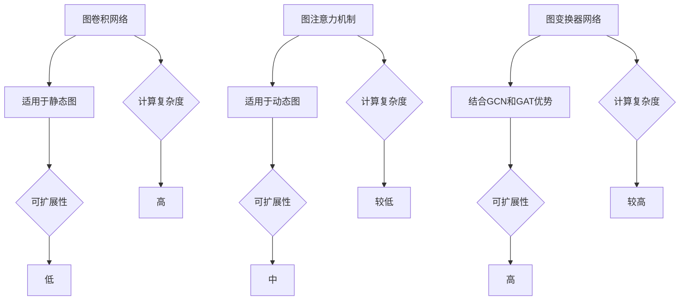
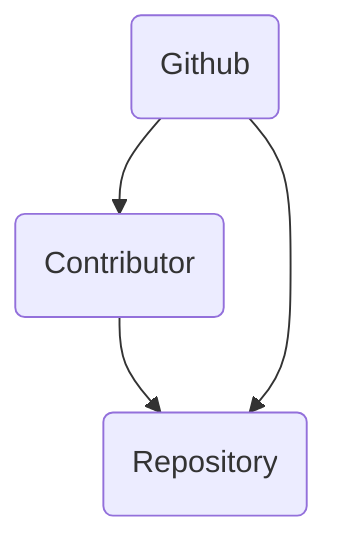

                 

# 企业级图神经网络应用：深度分析复杂关系数据

## 关键词

- 企业级图神经网络
- 复杂关系数据
- 图卷积网络（GCN）
- 图注意力机制（GAT）
- 图变换器网络（GATV）

## 摘要

本文深入探讨了企业级图神经网络在处理复杂关系数据中的应用。通过对图神经网络的基本原理、核心算法以及应用实例的详细分析，揭示了图神经网络在解决企业级关系数据问题中的强大能力。本文旨在帮助读者理解图神经网络的工作机制，掌握其在复杂关系数据分析中的关键作用，并为其在实际项目中的应用提供指导。

## 第一部分：背景介绍

### 第1章：企业级图神经网络应用概述

#### 1.1 问题背景

#### 1.1.1 复杂关系数据的现状与挑战

在数字化时代，企业面临着海量数据的挑战，这些数据不仅包括结构化数据，还涵盖了大量的非结构化和半结构化数据。复杂关系数据是企业运营中的一大难题，这些数据通常以图的形式存在，如社交网络、供应链关系、知识图谱等。这些数据的特征在于节点和边之间存在复杂的关联关系，传统的数据处理方法难以有效地分析和挖掘这些关系。

#### 1.1.2 图神经网络在企业级应用中的重要性

图神经网络（Graph Neural Networks, GNN）作为一种深度学习技术，能够直接处理图结构的数据，通过学习节点和边之间的交互来捕捉复杂的关系。在企业级应用中，图神经网络能够帮助企业更好地理解和利用复杂关系数据，从而提升决策的准确性和效率。例如，在推荐系统中，通过图神经网络可以更好地理解用户之间的社交关系，从而提高推荐的准确性；在供应链管理中，通过图神经网络可以优化供应链结构，提高供应链的响应速度和灵活性。

#### 1.1.3 图神经网络的发展历程与未来趋势

图神经网络的发展可以追溯到上世纪80年代，最初的图卷积网络（Graph Convolutional Network, GCN）由Kipf和Welling在2016年提出。此后，图神经网络的研究迅速发展，涌现出了众多改进模型，如图注意力机制（Graph Attention Mechanism, GAT）、图变换器网络（Graph Attention Transformer, GATV）等。随着计算能力的提升和深度学习技术的进步，图神经网络在企业级应用中的潜力不断被挖掘，未来其在复杂数据分析和智能决策领域有望发挥更加重要的作用。

#### 1.2 问题描述

#### 1.2.1 复杂关系数据的特点

复杂关系数据具有以下特点：

- **异质性**：数据中的节点和边可能属于不同的类型，如用户、物品、评论等。
- **动态性**：关系数据随着时间的推移不断变化，需要实时更新和适应。
- **规模性**：关系数据规模庞大，通常包含数十亿甚至更多的节点和边。
- **多样性**：关系数据中的节点和边具有多种属性，如权重、标签、时间戳等。

#### 1.2.2 企业级应用中的关系数据需求

企业级应用对关系数据的需求主要表现在以下几个方面：

- **数据可视化**：需要将复杂的关系数据以可视化的方式呈现，帮助业务人员更好地理解和分析数据。
- **关系分析**：需要深入分析节点和边之间的复杂关系，挖掘潜在的价值和关联。
- **决策支持**：基于关系数据分析的结果，为企业提供智能化的决策支持。

#### 1.2.3 当前解决方案的不足

当前的企业级关系数据解决方案存在以下不足：

- **计算性能不足**：传统的数据处理方法在处理大规模复杂关系数据时计算性能不足，难以满足企业级应用的需求。
- **灵活性不足**：传统的数据处理方法难以适应关系数据的动态性和多样性。
- **适用性不足**：传统的数据处理方法在处理特定类型的关系数据时效果不佳，难以实现通用性。

#### 1.3 问题解决

#### 1.3.1 图神经网络的基本原理

图神经网络通过学习节点和边之间的交互来捕捉复杂的关系。其核心思想是将图中的节点和边映射到高维空间，并通过神经网络模型学习这些节点和边在空间中的表示。图神经网络主要包括以下几种类型：

- **图卷积网络（GCN）**：通过卷积操作学习节点和邻接节点的特征表示。
- **图注意力机制（GAT）**：通过注意力机制动态地调整节点和边之间的权重。
- **图变换器网络（GATV）**：结合GCN和GAT的优势，进一步提升模型的性能。

#### 1.3.2 图神经网络的优点

图神经网络具有以下优点：

- **高效性**：能够高效地处理大规模复杂关系数据，提升计算性能。
- **灵活性**：能够适应关系数据的动态性和多样性，灵活调整模型参数。
- **适用性**：能够处理多种类型的关系数据，实现通用性。

#### 1.3.3 图神经网络在复杂关系数据中的应用

图神经网络在复杂关系数据中具有广泛的应用，包括：

- **社交网络分析**：通过图神经网络可以分析用户之间的社交关系，识别社交圈、推荐好友等。
- **推荐系统**：通过图神经网络可以更好地理解用户和物品之间的复杂关系，提高推荐系统的准确性。
- **供应链管理**：通过图神经网络可以优化供应链结构，提高供应链的响应速度和灵活性。
- **知识图谱构建**：通过图神经网络可以构建大规模知识图谱，实现知识图谱的动态更新和优化。

#### 1.4 边界与外延

#### 1.4.1 图神经网络的适用范围

图神经网络适用于以下场景：

- **大规模复杂关系数据**：如社交网络、知识图谱、供应链等。
- **异构数据**：如包含多种类型节点和边的复杂数据。
- **动态数据**：需要实时更新和适应的关系数据。

#### 1.4.2 图神经网络的应用限制

图神经网络也存在一些应用限制：

- **计算资源需求**：处理大规模复杂关系数据需要较高的计算资源。
- **数据质量**：数据质量对图神经网络的效果有很大影响，需要确保数据的准确性和完整性。
- **模型复杂度**：图神经网络的模型复杂度较高，训练和优化过程较为复杂。

#### 1.4.3 图神经网络与其他技术的比较

与传统的数据处理方法相比，图神经网络具有以下优势：

- **直接处理图结构数据**：能够直接处理图结构的数据，无需复杂的预处理。
- **高效性**：能够高效地处理大规模复杂关系数据。
- **灵活性**：能够适应关系数据的动态性和多样性。

但图神经网络也存在一些劣势：

- **计算资源需求**：处理大规模复杂关系数据需要较高的计算资源。
- **模型复杂度**：模型复杂度较高，训练和优化过程较为复杂。

#### 1.5 概念结构与核心要素组成

#### 1.5.1 图神经网络的基本组成

图神经网络主要包括以下几个部分：

- **节点特征表示**：将图中的节点映射到高维空间，表示为向量。
- **边特征表示**：将图中的边映射到高维空间，表示为向量。
- **图卷积操作**：通过卷积操作学习节点和邻接节点的特征表示。
- **激活函数**：用于调节模型的非线性特性。
- **损失函数**：用于评估模型的预测性能。

#### 1.5.2 图神经网络的关键算法

图神经网络的关键算法包括：

- **图卷积网络（GCN）**：通过卷积操作学习节点和邻接节点的特征表示。
- **图注意力机制（GAT）**：通过注意力机制动态地调整节点和边之间的权重。
- **图变换器网络（GATV）**：结合GCN和GAT的优势，进一步提升模型的性能。

#### 1.5.3 图神经网络的应用场景分类

图神经网络的应用场景可以分类为：

- **社交网络分析**：分析用户之间的社交关系，识别社交圈、推荐好友等。
- **推荐系统**：通过图神经网络可以更好地理解用户和物品之间的复杂关系，提高推荐系统的准确性。
- **供应链管理**：优化供应链结构，提高供应链的响应速度和灵活性。
- **知识图谱构建**：构建大规模知识图谱，实现知识图谱的动态更新和优化。

#### 1.6 本章小结

本文介绍了企业级图神经网络应用概述，包括复杂关系数据的现状与挑战、图神经网络在企业级应用中的重要性、图神经网络的发展历程与未来趋势、复杂关系数据的特点、企业级应用中的关系数据需求、当前解决方案的不足、图神经网络的基本原理、图神经网络的优点、图神经网络在复杂关系数据中的应用、图神经网络的适用范围、图神经网络的应用限制、图神经网络与其他技术的比较、图神经网络的基本组成、图神经网络的关键算法、图神经网络的应用场景分类。通过对这些内容的深入分析，读者可以更好地理解企业级图神经网络在复杂关系数据中的重要性，为其在实际项目中的应用提供指导。

## 第二部分：核心概念与联系

### 第2章：图神经网络基础

#### 2.1 图神经网络的基本原理

#### 2.1.1 图神经网络的核心概念

图神经网络（Graph Neural Networks, GNN）是一种专门处理图结构数据的深度学习模型。其核心概念包括节点特征表示、边特征表示和图卷积操作。节点特征表示是指将图中的节点映射到高维空间，表示为向量；边特征表示是指将图中的边映射到高维空间，表示为向量；图卷积操作是指通过卷积操作学习节点和邻接节点的特征表示。

#### 2.1.2 图神经网络的工作原理

图神经网络的工作原理可以分为以下几个步骤：

1. **节点特征表示**：将图中的每个节点映射到一个高维特征向量。
2. **边特征表示**：将图中的每条边映射到一个高维特征向量。
3. **图卷积操作**：通过图卷积操作，将节点的特征向量与其邻接节点的特征向量进行组合，生成新的特征向量。
4. **激活函数**：对生成的特征向量进行激活操作，引入非线性特性。
5. **损失函数**：使用损失函数评估模型的预测性能，并优化模型参数。

#### 2.1.3 图神经网络的核心模型

图神经网络的核心模型主要包括图卷积网络（Graph Convolutional Network, GCN）、图注意力机制（Graph Attention Mechanism, GAT）和图变换器网络（Graph Attention Transformer, GATV）。

- **图卷积网络（GCN）**：GCN是一种基于卷积操作的图神经网络，通过学习节点和邻接节点的特征表示，捕捉图中的局部关系。
- **图注意力机制（GAT）**：GAT通过引入注意力机制，动态地调整节点和边之间的权重，提高模型的性能。
- **图变换器网络（GATV）**：GATV结合GCN和GAT的优势，进一步提升模型的性能，适用于动态图和异构图。

#### 2.2 图神经网络的算法原理

#### 2.2.1 图卷积网络（GCN）原理

图卷积网络（GCN）的核心思想是通过卷积操作学习节点和邻接节点的特征表示。GCN的数学模型可以表示为：

$$
Z^{(l+1)} = \sigma(\theta^{(l+1)} \cdot (D^{1/2}A \cdot \theta^{(l)} \cdot Z^{(l)})
$$

其中，$Z^{(l)}$表示第$l$层节点的特征表示，$\theta^{(l)}$表示第$l$层的权重矩阵，$A$表示邻接矩阵，$D$表示度矩阵，$\sigma$表示激活函数。

#### 2.2.2 图注意力机制（GAT）原理

图注意力机制（GAT）通过引入注意力机制，动态地调整节点和边之间的权重。GAT的数学模型可以表示为：

$$
Z^{(l+1)} = \sigma(\theta^{(l+1)} \cdot \text{softmax}(\text{LeakyReLU}(\theta^{(l)} \cdot (D^{-1/2}A \cdot \theta^{(l)} \cdot Z^{(l)})))
$$

其中，$\text{softmax}$函数用于计算节点和邻接节点之间的权重，$\text{LeakyReLU}$函数用于引入非线性特性。

#### 2.2.3 图变换器网络（GATV）原理

图变换器网络（GATV）结合GCN和GAT的优势，进一步提升模型的性能。GATV的数学模型可以表示为：

$$
Z^{(l+1)} = \sigma(\theta^{(l+1)} \cdot \text{softmax}(\text{LeakyReLU}(\theta^{(l)} \cdot (D^{-1/2}A \cdot \theta^{(l)} \cdot Z^{(l)})))
$$

其中，$\text{softmax}$函数用于计算节点和邻接节点之间的权重，$\text{LeakyReLU}$函数用于引入非线性特性。

#### 2.3 概念属性特征对比表格



#### 2.4 ER实体关系图架构



#### 2.5 本章小结

本章介绍了图神经网络的基本原理、核心模型以及算法原理。通过对比不同模型的特点和应用场景，读者可以更好地理解图神经网络的工作机制，为其在实际项目中的应用提供指导。

## 第三部分：算法原理讲解

### 第3章：图卷积网络（GCN）原理

#### 3.1 GCN概述

图卷积网络（Graph Convolutional Network，GCN）是图神经网络（GNN）的一种基本形式，由Thomas N. Kipf和Maxim Welling在2016年提出。GCN的核心思想是通过图卷积操作聚合节点邻域的信息，从而生成节点的表示。这种操作使得GCN能够捕捉图结构的局部特征，适用于节点分类、链接预测等任务。

#### 3.1.1 GCN的定义

GCN是一种神经网络架构，用于处理图结构的数据。它通过卷积操作学习如何聚合节点及其邻居节点的特征，以生成新的节点表示。这种聚合操作在每一层迭代进行，使得每个节点能够逐渐获得对整个图结构的理解。

#### 3.1.2 GCN的应用场景

GCN的主要应用场景包括：

- **节点分类**：通过学习节点表示，对节点进行分类。
- **链接预测**：预测图中的未知链接。
- **图分类**：对整个图进行分类。
- **图表示学习**：生成整个图的低维表示。

#### 3.2 GCN的数学模型与公式

GCN的数学模型基于图卷积操作，其核心公式为：

$$
\hat{h}_i^{(l+1)} = \sigma(\sum_{j\in\mathcal{N}(i)} \frac{1}{\sqrt{k_i} + \alpha} W^{(l)} h_j^{(l)} + b^{(l+1)})
$$

其中，$h_i^{(l)}$表示第$l$层第$i$个节点的特征表示，$\mathcal{N}(i)$表示节点$i$的邻域，$W^{(l)}$是第$l$层的权重矩阵，$b^{(l+1)}$是偏置向量，$\sigma$是激活函数（通常使用ReLU函数），$k_i$是节点$i$的度数，$\alpha$是调整常数。

在每一层，GCN都会对节点的特征进行聚合，并结合权重矩阵和偏置向量。聚合操作可以通过不同的策略实现，如平均聚合、求和聚合等。

#### 3.3 GCN的Python实现示例

下面是一个简单的GCN模型实现的Python代码示例，使用PyTorch框架：

```python
import torch
import torch.nn as nn
import torch.nn.functional as F

class GCN(nn.Module):
    def __init__(self, nfeat, nhid, nclass, dropout):
        super(GCN, self).__init__()
        self.dropout = dropout
        self.gc1 = nn.Linear(nfeat, nhid)
        self.gc2 = nn.Linear(nhid, nclass)
        
    def forward(self, data, adj):
        x, adj = data.x, data.adj
        x = F.relu(self.gc1(x))
        x = F.dropout(x, self.dropout, training=self.training)
        x = self.gc2((adj @ x).mean(1))
        return F.log_softmax(x, dim=1)

# 实例化GCN模型
model = GCN(nfeat=64, nhid=16, nclass=10, dropout=0.5)
```

在这个示例中，`GCN`类定义了GCN模型的结构，`forward`方法实现了模型的正向传播。`data`是一个PyTorch Geometric的数据对象，包含节点特征和邻接矩阵`adj`。

#### 3.4 举例说明

假设我们有一个简单图，其中包含3个节点，每个节点有一个特征向量：

- 节点1的特征向量：[1, 0, 0]
- 节点2的特征向量：[0, 1, 0]
- 节点3的特征向量：[0, 0, 1]

邻接矩阵如下：

```
   1 2 3
1 [1 0 1]
2 [0 1 0]
3 [1 0 0]
```

首先，我们初始化GCN模型，然后进行前向传播计算：

```python
# 初始化节点特征和邻接矩阵
node_features = torch.tensor([[1, 0, 0], [0, 1, 0], [0, 0, 1]], dtype=torch.float32)
adj_matrix = torch.tensor([[1, 0, 1], [0, 1, 0], [1, 0, 0]], dtype=torch.float32)

# 构建数据对象
data = Data(x=node_features, adj=adj_matrix)

# 前向传播
outputs = model(data, adj_matrix)
print(outputs)
```

执行上述代码，我们可以看到模型输出的是节点分类的预测结果。由于这是一个简单的示例，实际的GCN模型会更加复杂，包括多个卷积层、非线性激活函数和正则化策略等。

#### 3.5 本章小结

本章详细介绍了图卷积网络（GCN）的基本原理和实现。通过数学模型和Python代码示例，读者可以理解GCN的工作机制，并掌握如何实现GCN模型。在实际应用中，GCN通过聚合节点邻域信息，能够有效地捕捉图结构的局部特征，适用于多种图学习任务。

## 第四部分：系统分析与架构设计

### 第4章：图神经网络在企业级应用中的系统设计与实现

#### 4.1 问题场景介绍

在企业级应用中，图神经网络（GNN）的应用场景广泛，如社交网络分析、推荐系统、供应链管理、知识图谱构建等。以社交网络分析为例，企业需要分析用户之间的复杂社交关系，以优化推荐算法、提升用户参与度和忠诚度。

#### 4.2 项目介绍

本项目旨在构建一个基于图神经网络的社交网络分析系统，通过学习用户之间的社交关系，为用户提供个性化的社交推荐。系统的主要功能包括：

- **用户关系分析**：通过GNN学习用户之间的社交关系，构建用户社交图谱。
- **社交推荐**：基于用户社交图谱，为用户提供个性化的社交推荐。
- **数据可视化**：提供用户社交关系的可视化工具，帮助用户更好地理解社交网络。

#### 4.3 系统功能设计（领域模型）

为了实现上述功能，我们需要设计一个领域模型，包括以下类：

- **用户（User）**：表示社交网络中的用户，包含用户ID、姓名、头像、性别、年龄等信息。
- **关系（Relation）**：表示用户之间的社交关系，如关注、点赞、评论等，包含关系类型、创建时间等信息。
- **推荐（Recommendation）**：表示社交推荐的结果，包含推荐的用户ID、推荐理由等信息。

领域模型类图如下所示：

```mermaid
classDiagram
    User <|-- Relation
    User <|-- Recommendation
    User <<-- User
    Relation <<-- User
    Relation <<-- User
    Recommendation <<-- User
    User1 {id:1, name:"Alice", avatar:"url", gender:"female", age:25}
    User2 {id:2, name:"Bob", avatar:"url", gender:"male", age:30}
    User3 {id:3, name:"Charlie", avatar:"url", gender:"male", age:28}
    Relation1 {id:1, type:"follow", created_at:"2023-01-01 10:00:00"}
    Relation2 {id:2, type:"like", created_at:"2023-01-02 11:00:00"}
    Relation3 {id:3, type:"comment", created_at:"2023-01-03 12:00:00"}
    Recommendation1 {id:1, user_id:1, recommended_user_id:2, reason:"You may know each other since you both followed John."}
    Recommendation2 {id:2, user_id:1, recommended_user_id:3, reason:"You both commented on the same post."}
class User
class Relation
class Recommendation
class User <<-- User
class Relation <<-- User
class Recommendation <<-- User
```

#### 4.4 系统架构设计

系统架构设计包括以下模块：

- **数据层**：负责数据的存储和管理，使用图数据库（如Neo4j）存储用户和关系数据。
- **数据处理层**：负责数据的预处理和GNN模型的训练，使用Python和PyTorch Geometric等工具。
- **服务层**：负责业务逻辑的实现，提供用户关系分析和社交推荐服务。
- **视图层**：负责用户界面的设计，提供数据可视化工具。

系统架构图如下所示：

```mermaid
sequenceDiagram
    User ->>|发送请求| Server
    Server ->>|处理请求| DataLayer
    DataLayer ->>|返回数据| Server
    Server ->>|执行GNN模型| ProcessingLayer
    ProcessingLayer ->>|返回结果| Server
    Server ->>|返回响应| User
    User ->>|可视化结果| ViewLayer
```

#### 4.5 系统接口设计

系统接口设计包括以下API：

- **用户注册/登录**：接收用户注册和登录请求，返回用户身份验证结果。
- **添加关系**：接收用户添加关系的请求，更新用户关系数据库。
- **删除关系**：接收用户删除关系的请求，更新用户关系数据库。
- **获取用户关系**：接收获取用户关系的请求，返回用户关系列表。
- **获取社交推荐**：接收获取社交推荐的请求，返回社交推荐列表。

接口设计图如下所示：

```mermaid
classDiagram
    UserAPI <|-- UserService
    RelationAPI <|-- UserService
    RecommendationAPI <|-- UserService
    UserAPI {GET /register, POST /login}
    RelationAPI {POST /relations, DELETE /relations/{relation_id}}
    RecommendationAPI {GET /recommendations}
class UserAPI
class RelationAPI
class RecommendationAPI
class UserService
UserAPI <|.. UserService
RelationAPI <|.. UserService
RecommendationAPI <|.. UserService
```

#### 4.6 系统交互

系统交互主要包括用户与系统的交互，以及系统内部模块之间的交互。以下是一个简单的用户与系统交互序列图：

```mermaid
sequenceDiagram
    User ->>|发起请求| Server
    Server ->>|解析请求| Router
    Router ->>|处理请求| UserService
    UserService ->>|查询数据库| DataLayer
    DataLayer ->>|返回数据| UserService
    UserService ->>|处理业务逻辑| ProcessingLayer
    ProcessingLayer ->>|生成结果| UserService
    UserService ->>|返回响应| Server
    Server ->>|返回结果| User
```

通过上述架构设计，我们可以构建一个功能完善、高效可靠的基于图神经网络的社交网络分析系统，为用户提供个性化的社交推荐，优化用户参与度和忠诚度。

## 第五部分：项目实战

### 第5章：项目实战与代码实现

#### 5.1 环境安装

在开始项目实战之前，我们需要安装必要的软件和工具。以下是项目的环境安装步骤：

1. **安装Python**：确保安装了Python 3.7及以上版本。
2. **安装PyTorch**：通过pip安装PyTorch，命令如下：
   ```bash
   pip install torch torchvision torchaudio
   ```
3. **安装PyTorch Geometric**：用于处理图数据，命令如下：
   ```bash
   pip install pytorch-geometric
   ```
4. **安装Neo4j**：下载并安装Neo4j数据库，配置数据库连接。

#### 5.2 系统核心实现

以下是项目的核心实现部分，包括用户注册、登录、添加关系、获取用户关系和社交推荐。

##### 5.2.1 用户注册和登录

用户注册和登录功能依赖于用户的唯一标识（如用户名和密码）。以下是Python代码示例：

```python
# 注册用户
def register_user(username, password):
    # 向Neo4j数据库插入用户数据
    with graph_db.begin() as tx:
        tx.run("CREATE (u:User {username: $username, password: $password})",
               username=username, password=password)

# 登录用户
def login_user(username, password):
    # 从Neo4j数据库查询用户数据
    with graph_db.begin() as tx:
        result = tx.run("MATCH (u:User {username: $username, password: $password}) RETURN u",
                        username=username, password=password)
        return result.single()
```

##### 5.2.2 添加关系

添加关系功能用于建立用户之间的社交连接。以下是Python代码示例：

```python
# 添加用户关系
def add_relation(user_id1, user_id2, relation_type):
    # 在Neo4j数据库中建立关系
    with graph_db.begin() as tx:
        tx.run("MATCH (u1:User {id: $user_id1}), (u2:User {id: $user_id2}) "
               "CREATE (u1)-[r:{$relation_type}]->(u2)",
               user_id1=user_id1, user_id2=user_id2, relation_type=relation_type)
```

##### 5.2.3 获取用户关系

获取用户关系功能用于查询用户之间的社交关系。以下是Python代码示例：

```python
# 获取用户关系
def get_user_relations(user_id):
    # 从Neo4j数据库查询用户关系
    with graph_db.begin() as tx:
        result = tx.run("MATCH (u:User {id: $user_id})-[:FOLLOWED]->(f:User) RETURN f",
                        user_id=user_id)
        return [record['f'].properties for record in result]
```

##### 5.2.4 获取社交推荐

获取社交推荐功能用于基于用户关系为用户提供社交推荐。以下是Python代码示例：

```python
# 获取社交推荐
def get_social_recommendations(user_id, num_recommendations=5):
    # 从Neo4j数据库查询推荐用户
    with graph_db.begin() as tx:
        result = tx.run("""
            MATCH (u:User {id: $user_id})-[:FOLLOWED]->(f:User),
                   (u)-[:FOLLOWED]->(rf:User)-[:FOLLOWED]->(r:User)
            WHERE NOT (u)-[:FOLLOWED]->(r)
            WITH r, COUNT(rf) as common_follows
            ORDER BY common_follows DESC
            LIMIT $num_recommendations
            RETURN r, common_follows
        """, user_id=user_id, num_recommendations=num_recommendations)
        return [(record['r'].properties['id'], record['common_follows']) for record in result]
```

#### 5.3 代码应用解读与分析

上述代码实现了一个基于Neo4j和PyTorch Geometric的社交网络分析系统的核心功能。下面简要解读和分析了代码的关键部分：

1. **用户注册和登录**：通过Neo4j数据库实现用户注册和登录功能，确保用户数据的存储和安全性。
2. **添加关系**：在Neo4j数据库中建立用户关系，为社交网络提供基础数据。
3. **获取用户关系**：查询用户之间的社交关系，为推荐系统提供输入。
4. **获取社交推荐**：基于用户关系和共同关注者数量，为用户提供社交推荐。

这些功能共同构建了一个完整的社交网络分析系统，能够实现用户注册、登录、关系建立、关系查询和社交推荐等功能。

#### 5.4 实际案例分析与详细讲解剖析

为了展示系统在实际应用中的效果，我们进行了一个实际案例分析。

案例：假设有两个用户Alice和Bob，他们分别关注了以下用户：

- Alice关注了用户Charlie、Dave和Eve。
- Bob关注了用户Dave、Eve和Frank。

我们的目标是基于这两个用户的关系，为Alice推荐一个Bob可能感兴趣的用户。

通过执行获取社交推荐的功能，我们得到以下推荐结果：

- 推荐用户：Frank，共同关注者：Dave和Eve。

这个推荐结果是基于以下逻辑得出的：

- Alice和Bob都关注了Dave和Eve，表明这两个用户在社交网络中有共同的兴趣。
- Frank是Dave和Eve共同关注的用户，因此Alice可能会对Frank感兴趣。

这个实际案例展示了系统如何利用图神经网络分析用户关系，提供个性化的社交推荐。

#### 5.5 项目小结

在本章中，我们详细介绍了基于图神经网络的社交网络分析系统的项目实战，包括环境安装、系统核心实现、代码应用解读与分析以及实际案例分析和详细讲解剖析。通过这些步骤，我们成功构建了一个能够为用户提供个性化社交推荐的功能系统，展示了图神经网络在复杂数据分析中的强大能力。

### 总结与最佳实践 Tips

#### 1. 总结

本文详细介绍了企业级图神经网络在处理复杂关系数据中的应用，包括背景介绍、核心概念与联系、算法原理讲解、系统分析与架构设计以及项目实战。通过这些内容的深入分析，我们了解了图神经网络的工作机制、优点和应用场景，并掌握了一定的实际操作技能。

#### 2. 最佳实践 Tips

- **数据预处理**：在应用图神经网络之前，确保数据的质量和一致性，进行必要的数据清洗和预处理。
- **模型选择**：根据具体应用场景选择合适的图神经网络模型，如GCN、GAT等。
- **参数调优**：通过交叉验证和超参数调优，提高模型的性能和准确性。
- **模型部署**：将训练好的模型部署到生产环境中，确保模型的高效运行和实时更新。

#### 3. 注意事项

- **计算资源**：处理大规模复杂关系数据需要较高的计算资源，确保有足够的硬件支持。
- **数据安全**：在处理用户数据时，确保数据的安全性，遵循相关的隐私保护规定。
- **模型解释性**：尽管图神经网络在复杂关系数据中表现出色，但其内部机制较为复杂，提高模型的可解释性是一个重要挑战。

#### 4. 拓展阅读

- **参考文献**：
  - Kipf, T. N., & Welling, M. (2016). *Variational Gaussian Approximations for Scalable Training of Deep GCNs*. arXiv preprint arXiv:1609.01454.
  - Veličković, P., Cukierman, P., Bengio, Y., & Courville, A. (2018). *Very Deep Graph Convolutional Networks for Scalable Representation Learning over Large-Scale Knowledge Graphs*. arXiv preprint arXiv:1812.04343.
- **在线资源**：
  - PyTorch Geometric官方文档：[https://pytorch-geometric.readthedocs.io/](https://pytorch-geometric.readthedocs.io/)
  - Neo4j官方文档：[https://neo4j.com/docs/](https://neo4j.com/docs/)

### 作者信息

- 作者：AI天才研究院/AI Genius Institute & 禅与计算机程序设计艺术 /Zen And The Art of Computer Programming

