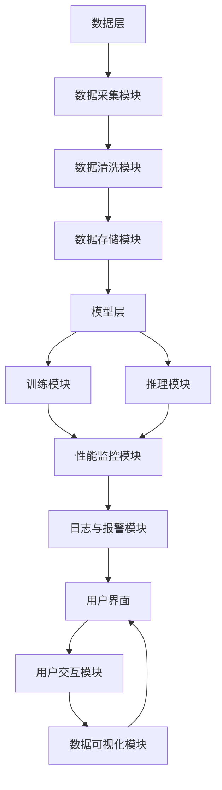

                 

### 第1章：引言

#### 1.1 书籍概述

"Enterprise-Level Graph Neural Networks: AI Analysis of Complex Relationship Data"是一本致力于探讨企业级图神经网络（GNN）在复杂关系数据上的AI分析应用的专业书籍。在当前信息技术迅猛发展的时代，数据已成为企业竞争的核心资源，如何有效利用这些数据来提升企业的决策效率和运营效率成为了一个亟待解决的问题。

本书记述了一个关于GNN技术从理论到实践的全方位探讨。首先，我们将详细探讨图神经网络的基本概念、发展历史以及其在实际应用中的优势。随后，我们将深入分析企业级应用场景，探讨在复杂关系数据中如何应用GNN技术，解决企业面临的实际难题。

书中不仅涵盖了GNN的核心理论，如图数据的基本概念、GNN的基本原理和算法，还探讨了GNN与其他机器学习方法的异同。此外，书中通过多个实际项目案例，详细展示了如何设计企业级GNN系统，并进行算法优化与调参策略。

通过这本书，读者不仅能了解GNN技术的核心原理和最新进展，还能掌握如何将其应用于企业级场景中，为企业提供高效、可靠的AI分析工具。以下是书籍的主要章节内容概览：

1. **引言与背景**
   - 第1章：引言
   - 第2章：核心概念与联系

2. **图神经网络算法原理**
   - 第3章：基础GNN算法
   - 第4章：进阶GNN算法

3. **企业级图神经网络实践**
   - 第5章：系统架构设计
   - 第6章：算法优化与调参策略
   - 第7章：项目实战与案例分析

4. **拓展与展望**
   - 第8章：图神经网络在新兴领域中的应用
   - 第9章：未来趋势与展望

**关键词**：企业级图神经网络、AI分析、复杂关系数据、算法优化、系统架构

**摘要**：
本书旨在深入探讨企业级图神经网络（GNN）的应用，通过详细的理论讲解和实际案例解析，帮助读者理解并掌握GNN在复杂关系数据上的AI分析技术。从基本概念到算法实现，从系统设计到项目实战，本书全面覆盖了GNN在企业级应用中的各个方面，旨在为读者提供一本既有深度又实用的技术参考书。

---

接下来，我们将正式进入第1章，对图神经网络的基本概念和发展背景进行详细探讨。

#### 1.2 图神经网络简介

**图神经网络（Graph Neural Networks, GNN）的基本概念**：

图神经网络是一种专为处理图结构数据的深度学习模型，它基于图论的基本原理，通过模拟节点和边之间的关系来进行学习和推理。GNN的核心思想是将图中的节点和边作为输入数据，通过一系列图卷积操作来提取图结构中的特征，并最终生成有用的输出。

在GNN中，节点和边可以表示为图中的数据点，而图卷积操作则类似于卷积神经网络（CNN）中的卷积操作，但在这里，操作是在图的邻接结构上进行的。GNN的一个重要特点是能够自动学习和利用图结构中的局部和全局信息，这使得它特别适合处理具有复杂关系的图结构数据。

**图神经网络的发展历史**：

GNN的研究起源于20世纪80年代，当时图嵌入（Graph Embedding）和图表示学习（Graph Representation Learning）成为热门话题。早期的GNN模型主要是基于矩阵分解和图卷积的概念，如2007年由Scarselli等人提出的图卷积网络（Graph Convolutional Network, GCN）。

随着深度学习的兴起，GNN得到了进一步的发展和优化。在2014年，Kipf和Welling提出了图注意力网络（Graph Attention Network, GAT），它在GCN的基础上引入了注意力机制，提高了模型的表达能力。此后，GNN的发展迅速，涌现出多种变体和改进模型，如图自编码器（Graph Autoencoder, GAE）、图生成对抗网络（Graph Generative Adversarial Networks, GGAN）等。

**图神经网络的优势与应用领域**：

GNN的优势主要体现在以下几个方面：

1. **强大的表达能力**：GNN能够自动学习和利用图结构中的复杂关系，这使得它在处理具有高度复杂性的图结构数据时，表现出较高的准确性和鲁棒性。
2. **灵活的适应性**：GNN可以适用于多种类型的图结构数据，包括社交网络、知识图谱、生物网络等，这使得它具有广泛的应用前景。
3. **高效的计算性能**：GNN通过并行计算和图结构的数据存储，能够显著提高计算效率，降低计算成本。

GNN的应用领域主要包括：

1. **图分类和图回归**：GNN在图分类和图回归任务中表现出色，可以用于对图结构数据的分类和回归分析。
2. **图生成和图搜索**：GNN可以通过学习图结构中的潜在特征，生成新的图结构或搜索特定类型的图结构。
3. **推荐系统和社交网络分析**：GNN可以用于推荐系统和社交网络分析，帮助企业和组织更好地理解用户行为和社交关系。

**总结**：

图神经网络（GNN）作为一种先进的深度学习模型，具有强大的表达能力和广泛的适用性。它通过模拟图中的节点和边关系，实现了对复杂关系数据的自动学习和推理。随着GNN技术的不断发展和完善，它在企业级应用中的重要性日益凸显，为复杂关系数据的AI分析提供了有力的工具和解决方案。

---

接下来，我们将继续讨论企业级图神经网络的应用场景，深入探讨其在企业中面临的挑战和潜在的价值。

#### 1.3 企业级图神经网络应用场景分析

**企业级图神经网络面临的挑战**：

在企业环境中，图神经网络（GNN）的应用面临着一系列挑战，这些挑战主要集中在数据复杂性、计算效率和系统稳定性等方面。

1. **数据复杂性**：企业级数据通常具有高度复杂的结构，包括多种类型的数据源、复杂的节点和边关系以及大规模的数据量。这些复杂性使得传统的机器学习模型难以有效处理，而GNN通过其强大的表达能力能够更好地应对这些挑战。
2. **计算效率**：企业级应用通常要求高效的计算性能，GNN作为深度学习模型，其训练和推理过程涉及大量的矩阵运算和图卷积操作，这需要高性能的计算资源和优化算法。因此，如何提高GNN的计算效率成为企业级应用的关键问题。
3. **系统稳定性**：在企业环境中，系统的稳定性和可靠性至关重要。GNN模型的训练过程可能涉及大量的参数调整和优化，这需要确保系统在长时间运行中保持稳定，避免出现训练不稳定或过拟合等问题。

**企业级图神经网络的价值**：

尽管面临挑战，GNN在企业级应用中依然具有巨大的价值，主要体现在以下几个方面：

1. **决策支持**：企业级数据中蕴含着大量有价值的信息，通过GNN技术，可以自动挖掘这些信息，为企业的决策提供科学依据。例如，在供应链管理中，GNN可以帮助企业分析供应商之间的复杂关系，优化供应链流程，提高供应链的效率和稳定性。
2. **用户行为分析**：在电子商务、社交网络等领域，用户行为数据具有复杂的结构，GNN技术可以用于分析用户的行为模式和偏好，为企业提供个性化的推荐和服务。例如，通过分析用户的社交网络关系，GNN可以识别出潜在的客户群体，为企业制定有针对性的营销策略。
3. **风险控制和欺诈检测**：在企业金融、保险等领域，GNN可以用于风险控制和欺诈检测。通过分析企业内部和外部的复杂关系数据，GNN可以识别出潜在的风险因素和欺诈行为，为企业提供实时的风险预警和决策支持。
4. **知识图谱构建**：在企业知识管理中，GNN可以用于构建知识图谱，将企业内部的知识和数据结构化、可视化。这有助于提高企业的知识管理水平，促进知识共享和协作。

**应用场景举例**：

以下是一些典型的企业级图神经网络应用场景举例：

1. **社交网络分析**：在企业内部社交网络中，GNN可以用于分析员工之间的关系，识别关键节点和影响力人物，帮助企业更好地进行团队协作和人员管理。
2. **供应链优化**：通过分析供应链中的节点和边关系，GNN可以优化供应链的物流和库存管理，提高供应链的效率和灵活性。
3. **客户关系管理**：在客户关系管理中，GNN可以分析客户的行为数据和社会关系，帮助企业识别高价值客户和潜在客户，制定个性化的客户服务和营销策略。
4. **金融风险管理**：在金融领域中，GNN可以分析金融交易数据和市场关系，识别出潜在的风险因素和异常交易，为企业提供风险预警和决策支持。

**总结**：

企业级图神经网络在复杂关系数据的分析中具有巨大的应用价值，它不仅能够帮助企业解决实际业务问题，提高运营效率，还能为企业的决策提供科学依据。尽管面临数据复杂性、计算效率和系统稳定性等挑战，但随着GNN技术的不断发展和优化，这些挑战将逐步得到解决，GNN在企业级应用中的前景将更加广阔。

---

在引言和背景部分，我们详细介绍了书籍的概述、图神经网络的基本概念及其发展历史，以及企业级图神经网络的应用场景和面临的挑战。接下来，我们将深入探讨图神经网络的核心概念与联系，分析其与其他机器学习方法的异同，以及图数据的基本结构。

#### 2.1 图数据基本概念

**图的定义**：

在图论中，图是一种由节点（也称为顶点）和边（也称为连接线）组成的数据结构。图可以用来表示现实世界中的各种关系，如社交网络中的朋友关系、交通网络中的道路连接、知识图谱中的概念关系等。图数据的基本定义包括以下几个方面：

1. **节点（Vertex）**：节点是图中的基本元素，表示一个实体或对象。例如，在社交网络中，每个用户可以看作是一个节点。
2. **边（Edge）**：边是连接两个节点的线段，表示节点之间的某种关系。边的方向性可以分为有向边和无向边。例如，在社交网络中，两个用户之间的关注关系可以表示为有向边。
3. **权重（Weight）**：边可以具有权重，表示节点之间的关系的强度或距离。例如，在交通网络中，边的权重可以表示道路的长度或交通拥堵程度。

**图的属性**：

图数据具有多种属性，这些属性用于描述图的特性，包括节点和边的特征。以下是一些常见的图属性：

1. **度（Degree）**：节点的度是指与该节点相连的边的数量。有向图的度分为入度（in-degree）和出度（out-degree）。度可以反映节点在图中的重要性和连接程度。
2. **路径（Path）**：路径是图中从一个节点到另一个节点的连接序列。路径的长度表示连接的边的数量。最短路径问题是一个重要的图论问题，常用于网络优化和路由选择。
3. **连通性（Connectivity）**：连通性描述了图中节点的连接情况。无向图的连通性可以用连通分量（Connected Components）来表示，有向图的连通性可以用强连通分量（Strongly Connected Components）来表示。
4. **聚类系数（Clustering Coefficient）**：聚类系数表示节点在其邻居节点中的连接密度。高聚类系数表示节点与其邻居节点之间存在较多的共同邻居，这通常与社区结构相关。

**图的类型**：

图数据可以分为多种类型，根据节点和边的特征，可以将图分为以下几种类型：

1. **无向图（Undirected Graph）**：无向图中的边没有方向，任意两个节点之间的连接是对等的。例如，社交网络中的朋友关系可以表示为无向图。
2. **有向图（Directed Graph）**：有向图中的边具有方向，从一个节点指向另一个节点。例如，邮件网络中的邮件发送关系可以表示为有向图。
3. **加权图（Weighted Graph）**：加权图中的边具有权重，用于表示节点之间的关系的强度或距离。例如，交通网络中的道路可以表示为加权图。
4. **稀疏图（Sparse Graph）**：稀疏图中的节点和边的数量相对较少，通常用于表示大规模网络中的局部关系。例如，知识图谱中的概念关系可以表示为稀疏图。
5. **密集图（Dense Graph）**：密集图中的节点和边的数量相对较多，通常用于表示高密度网络中的全局关系。例如，社交网络中的全局关系可以表示为密集图。

**总结**：

图数据的基本概念包括节点、边、权重等，这些概念用于描述图的结构和属性。图数据具有多种类型，包括无向图、有向图、加权图、稀疏图和密集图，每种类型都有其特定的应用场景。理解图数据的基本概念和类型是深入研究图神经网络和图数据挖掘的基础。

---

在了解了图数据的基本概念和类型之后，接下来我们将深入探讨图神经网络的基本原理，分析其核心原理和运算规则。

#### 2.2 图神经网络基本原理

**图神经网络（Graph Neural Networks, GNN）的基本原理**：

图神经网络是一种深度学习模型，专门用于处理图结构数据。GNN的核心思想是通过模拟节点和边之间的关系来提取图中的特征，从而实现图数据的自动学习和推理。GNN的基本原理可以从以下几个方面进行阐述：

1. **图卷积操作**：图卷积是GNN中最核心的运算，它通过聚合节点及其邻居节点的特征来更新节点的特征表示。图卷积操作类似于传统卷积神经网络中的卷积操作，但在这里，操作是在图的邻接结构上进行的。图卷积的核心思想是利用节点和边之间的邻接矩阵来定义特征聚合函数。

2. **节点更新规则**：在GNN中，每个节点在每一轮迭代中都会根据其邻居节点的特征进行更新。节点的更新规则通常包括两部分：一是对邻居节点特征进行加权聚合；二是对聚合后的特征进行非线性变换。这个过程可以表示为以下公式：

   $$ h_v^{(t+1)} = \sigma(\sum_{u \in N(v)} \alpha(u, v) h_u^{(t)}) $$

   其中，$h_v^{(t)}$ 和 $h_v^{(t+1)}$ 分别表示节点 $v$ 在第 $t$ 轮和第 $t+1$ 轮的特征表示，$N(v)$ 表示节点 $v$ 的邻居节点集合，$\alpha(u, v)$ 表示节点 $u$ 和 $v$ 之间的权重，$\sigma$ 表示非线性激活函数。

3. **全局信息聚合**：GNN除了关注节点和边之间的局部关系，还需要聚合全局信息。全局信息聚合可以通过两种方式实现：一是通过聚合所有节点的特征来生成全局特征表示；二是通过引入全局注意力机制来对节点特征进行加权聚合。全局信息聚合有助于提高模型的表达能力和泛化能力。

4. **层次化特征提取**：GNN通常采用层次化的结构来提取图中的特征。层次化的结构可以看作是多个图卷积层的堆叠，每一层都能够提取不同尺度的特征。通过逐步递归地应用图卷积操作，GNN可以逐步提取图结构中的局部和全局信息，从而提高模型的性能。

**图神经网络的运算规则**：

GNN的运算规则包括以下几个关键步骤：

1. **初始化**：首先，对图中的每个节点进行初始化，通常使用随机向量或预训练的嵌入向量作为节点的初始特征表示。
2. **特征更新**：通过图卷积操作，对节点的特征进行更新。在每一轮迭代中，节点 $v$ 的特征 $h_v^{(t+1)}$ 会根据其邻居节点的特征 $h_u^{(t)}$ 进行聚合和变换。
3. **全局聚合**：在特征更新后，可以采用全局聚合操作来整合整个图的特征信息，生成全局特征表示。
4. **输出生成**：最后，通过全连接层或分类器对更新后的节点特征进行分类或回归输出。

**总结**：

图神经网络（GNN）是一种用于处理图结构数据的深度学习模型，其基本原理包括图卷积操作、节点更新规则、全局信息聚合和层次化特征提取。通过模拟节点和边之间的关系，GNN能够自动学习和提取图中的特征，实现图数据的复杂关系分析和推理。理解GNN的基本原理和运算规则是掌握图神经网络技术的基础。

---

在了解了图神经网络的基本原理后，接下来我们将探讨GNN与其他机器学习方法的异同，分析其各自的优势和局限性。

#### 2.3 GNN与其他机器学习方法的比较

**GNN与传统机器学习方法的差异**：

传统机器学习方法在处理结构化数据时表现出色，如线性回归、逻辑回归、支持向量机等。然而，在处理非结构化或图结构数据时，传统方法往往显得力不从心。图神经网络（GNN）的出现填补了这一空白，其主要差异体现在以下几个方面：

1. **数据结构**：传统机器学习方法通常处理的是多维数组或表格数据，而GNN专门用于处理图结构数据。图结构数据具有节点、边和权重的特点，能够表示复杂的关系网络。
2. **特征提取**：传统方法通常通过特征工程来提取数据特征，而GNN通过模拟图中的节点和边关系来自动学习和提取特征。这种自动特征提取的方式可以更好地利用图结构中的信息。
3. **表示学习**：GNN通过图卷积操作实现节点和边的特征表示学习，能够提取出更高层次的结构化特征。相比之下，传统方法通常依赖于固定的特征表示，难以适应复杂的数据结构。

**GNN与深度学习方法的比较**：

深度学习是一种基于多层神经网络的机器学习方法，其在图像识别、自然语言处理等领域取得了显著的成果。GNN作为深度学习的一种变体，具有以下特点：

1. **结构化数据适应性**：GNN专门为图结构数据设计，能够处理复杂的图关系和结构化数据，这是其他深度学习方法所不具备的。
2. **特征聚合能力**：GNN通过图卷积操作能够有效地聚合节点和边的特征，从而提取出更丰富的结构化特征。这种特征聚合能力在处理具有高度复杂性的图数据时尤为重要。
3. **层次化特征提取**：GNN通过层次化的结构能够逐步提取不同尺度的特征，从而提高模型的性能。相比之下，传统的深度学习方法通常采用固定层数的神经网络，难以实现类似的层次化特征提取。

**GNN与图嵌入方法的联系**：

图嵌入（Graph Embedding）是一种将图中的节点或边映射到低维向量空间的方法，常用于图的表示学习。GNN与图嵌入方法之间存在紧密的联系：

1. **基础原理**：图嵌入方法通过将节点或边映射到低维向量空间来表示图结构，而GNN则基于这些向量进行特征学习和推理。可以说，图嵌入是GNN的基础。
2. **应用场景**：图嵌入方法常用于图数据预处理，如节点分类、链接预测等。GNN则进一步利用图嵌入向量进行特征聚合和推理，实现更复杂的图数据分析任务。

**GNN的优势**：

1. **强大的表达能力**：GNN能够自动学习和提取图结构中的复杂关系，这使得它在处理高度复杂性的图数据时表现出色。
2. **适用于多种图结构**：GNN可以适用于多种类型的图结构数据，包括社交网络、知识图谱、生物网络等，具有较强的通用性。
3. **高效的计算性能**：GNN通过并行计算和图结构的数据存储，能够显著提高计算效率，降低计算成本。

**GNN的局限性**：

1. **数据依赖性**：GNN的性能很大程度上依赖于图数据的结构和质量。如果图数据存在噪声或缺失，可能导致GNN训练不稳定或性能下降。
2. **计算资源需求**：GNN作为深度学习模型，其训练和推理过程需要大量的计算资源和时间，对于大规模图数据，计算资源需求尤为明显。
3. **调参复杂性**：GNN的参数调整和优化较为复杂，需要根据具体任务和数据集进行调参，这增加了模型训练的难度。

**总结**：

图神经网络（GNN）在处理图结构数据方面具有显著的优势，能够自动学习和提取复杂的关系特征，适用于多种类型的图结构数据。然而，GNN也存在一些局限性，如数据依赖性、计算资源需求以及调参复杂性等。理解和比较GNN与其他机器学习方法的异同，有助于更好地选择和应用GNN技术，实现高效、可靠的图数据分析。

---

在了解了图神经网络（GNN）的基本概念和与其他机器学习方法的比较之后，接下来我们将详细介绍几种基础的GNN算法，包括图卷积网络（GCN）、图注意力网络（GAT）和图自编码器（GAE）。这些算法在图数据分析中扮演着重要角色，通过详细的原理讲解和Python实现，我们将帮助读者深入理解这些算法的核心机制。

#### 3.1 图卷积网络（GCN）

**图卷积网络（Graph Convolutional Network, GCN）的基本原理**：

图卷积网络是一种基于图卷积操作的深度学习模型，专门用于处理图结构数据。GCN的核心思想是通过聚合节点及其邻居节点的特征来更新节点的特征表示。GCN的基本原理可以概括为以下几个步骤：

1. **初始化节点特征**：首先，对图中的每个节点进行初始化，通常使用随机向量或预训练的嵌入向量作为节点的初始特征表示。

2. **定义邻接矩阵**：在GCN中，通过定义邻接矩阵 $A$ 来表示图的结构。邻接矩阵是一个二进制矩阵，如果节点 $i$ 和节点 $j$ 之间存在边，则 $A_{ij} = 1$，否则 $A_{ij} = 0$。

3. **定义聚合函数**：GCN通过聚合节点及其邻居节点的特征来更新节点的特征表示。聚合函数通常定义为：

   $$ \hat{h}_i = \sigma(\alpha(A \cdot h_i + \beta_i)) $$

   其中，$h_i$ 表示节点 $i$ 的特征表示，$\alpha$ 和 $\beta_i$ 分别表示权重矩阵和偏差向量，$\sigma$ 表示非线性激活函数。

4. **特征更新**：在每一轮迭代中，节点的特征表示根据其邻居节点的特征进行更新。这个过程可以表示为：

   $$ h_i^{(t+1)} = \sigma(\sum_{j \in N(i)} \alpha(A) h_j^{(t)}) $$

   其中，$N(i)$ 表示节点 $i$ 的邻居节点集合。

**GCN的Python实现**：

```python
import torch
import torch.nn as nn
import torch.optim as optim
from torch_geometric.nn import GCNConv

# 初始化模型
model = GCNConv(in_channels=16, out_channels=16)
optimizer = optim.Adam(model.parameters(), lr=0.01)

# 定义损失函数
criterion = nn.CrossEntropyLoss()

# 定义训练过程
for epoch in range(200):
    optimizer.zero_grad()
    output = model(x, edge_index)
    loss = criterion(output, y)
    loss.backward()
    optimizer.step()
    print(f"Epoch {epoch+1}: Loss = {loss.item()}")
```

**GCN的数学模型**：

GCN的数学模型可以表示为：

$$ h_i^{(t+1)} = \sigma(\sum_{j \in N(i)} \alpha(A) h_j^{(t)} + b_i) $$

其中，$h_i^{(0)}$ 表示节点的初始特征表示，$A$ 是邻接矩阵，$\alpha(A)$ 是权重矩阵，$b_i$ 是偏置向量，$\sigma$ 是非线性激活函数（如ReLU函数）。

**总结**：

图卷积网络（GCN）是一种基础的图神经网络模型，通过聚合节点及其邻居节点的特征来更新节点的特征表示。GCN在图数据分析中具有广泛的应用，通过详细的原理讲解和Python实现，读者可以更好地理解GCN的核心机制和计算过程。

---

接下来，我们将介绍图注意力网络（GAT），一种在GCN基础上引入注意力机制的改进模型。

#### 3.2 图注意力网络（GAT）

**图注意力网络（Graph Attention Network, GAT）的基本原理**：

图注意力网络（GAT）是在图卷积网络（GCN）基础上发展起来的一种改进模型，它通过引入注意力机制来提高模型的表达能力和适应性。GAT的核心思想是在聚合邻居节点特征时，为每个邻居节点分配一个权重，从而自适应地选择重要的邻居节点信息。

**GAT的核心组件**：

1. **自注意力机制**：GAT通过自注意力机制来更新节点特征。自注意力机制允许节点根据其自身特征来选择邻居节点的特征，从而生成加权特征向量。

2. **多头注意力机制**：GAT采用多头注意力机制，通过多个独立的注意力头来捕获不同的图关系和特征。多头注意力机制能够提高模型的表达能力，使其能够更好地处理复杂的图数据。

**GAT的数学模型**：

GAT的数学模型可以表示为：

$$
\begin{aligned}
&\text{输入：} h_i^{(0)}, h_j^{(0)} \\
&\text{输出：} h_i^{(t+1)} \\
&h_i^{(t+1)} = \sigma(\sum_{j \in N(i)} a_{ij}^{(t)} h_j^{(t)}) \\
&a_{ij}^{(t)} = \frac{\exp(e_{ij}^{(t)})}{\sum_{k \in N(i)} \exp(e_{ik}^{(t)})}
\end{aligned}
$$

其中，$e_{ij}^{(t)} = \[ \langle h_i^{(t)}, h_j^{(t)} \]^T \cdot W$ 是注意力得分函数，$W$ 是权重矩阵，$a_{ij}^{(t)}$ 是节点 $i$ 和节点 $j$ 之间的注意力权重，$\sigma$ 是非线性激活函数。

**GAT的Python实现**：

```python
import torch
import torch.nn as nn
import torch.optim as optim
from torch_geometric.nn import GATConv

# 初始化模型
model = GATConv(in_channels=16, out_channels=16, num_heads=8)
optimizer = optim.Adam(model.parameters(), lr=0.01)

# 定义损失函数
criterion = nn.CrossEntropyLoss()

# 定义训练过程
for epoch in range(200):
    optimizer.zero_grad()
    output = model(x, edge_index)
    loss = criterion(output, y)
    loss.backward()
    optimizer.step()
    print(f"Epoch {epoch+1}: Loss = {loss.item()}")
```

**GAT的优势**：

1. **自适应特征聚合**：GAT通过引入注意力机制，能够自适应地聚合重要的邻居节点信息，从而提高模型的表达能力和适应性。

2. **多模态数据融合**：GAT的多头注意力机制允许模型同时处理多种类型的特征，使其能够更好地融合不同模态的数据。

3. **鲁棒性**：GAT的注意力机制有助于减少噪声对模型的影响，提高模型的鲁棒性。

**总结**：

图注意力网络（GAT）是一种通过引入注意力机制来增强模型表达能力的图神经网络模型。GAT通过自适应地聚合邻居节点的特征，实现了对复杂图数据的有效处理。通过详细的数学模型和Python实现，读者可以深入理解GAT的核心机制和应用。

---

在了解了图卷积网络（GCN）和图注意力网络（GAT）之后，接下来我们将探讨图自编码器（GAE），这是一种用于图生成和潜在特征学习的算法。

#### 3.3 图自编码器（GAE）

**图自编码器（Graph Autoencoder, GAE）的基本原理**：

图自编码器是一种基于自编码器架构的图神经网络模型，专门用于学习图的潜在特征表示。GAE的核心思想是通过编码器和解码器两个神经网络，将图中的节点特征映射到一个低维的潜在空间，并在该空间中进行重构。GAE的主要目的是通过学习节点的潜在特征，实现对图结构数据的降维和可视化。

**GAE的组成部分**：

1. **编码器（Encoder）**：编码器的任务是学习节点的潜在特征表示。编码器通常由多个卷积层堆叠而成，通过逐步提取节点的特征，最终将节点特征映射到低维的潜在空间。

2. **解码器（Decoder）**：解码器的任务是重构图中的节点特征。解码器通常由多个卷积层堆叠而成，通过逐步重建节点特征，最终生成与输入特征相似的输出特征。

**GAE的数学模型**：

GAE的数学模型可以表示为：

$$
\begin{aligned}
&\text{输入：} h_i \\
&\text{输出：} h_i^{'} \\
&\text{编码器：} h_i^{'} = \text{Encoder}(h_i) \\
&\text{解码器：} h_i^{'} = \text{Decoder}(h_i^{'}) \\
&\text{损失函数：} L = \frac{1}{N} \sum_{i=1}^{N} \sum_{j \in N(i)} \log P(h_j^{'} | h_i^{'} )
\end{aligned}
$$

其中，$h_i$ 和 $h_i^{'}$ 分别表示节点 $i$ 的输入特征和重构特征，$N$ 表示图中节点的总数，$P(h_j^{'} | h_i^{'})$ 表示解码器生成的节点特征 $h_j^{'}$ 与编码器生成的节点特征 $h_i^{'}$ 之间的概率分布。

**GAE的Python实现**：

```python
import torch
import torch.nn as nn
import torch.optim as optim
from torch_geometric.nn import GCNConv

# 初始化模型
model = GCNConv(in_channels=16, out_channels=16)
optimizer = optim.Adam(model.parameters(), lr=0.01)

# 定义损失函数
criterion = nn.MSELoss()

# 定义训练过程
for epoch in range(200):
    optimizer.zero_grad()
    output = model(x, edge_index)
    loss = criterion(output, x)
    loss.backward()
    optimizer.step()
    print(f"Epoch {epoch+1}: Loss = {loss.item()}")
```

**GAE的优势**：

1. **潜在特征学习**：GAE通过编码器和解码器学习节点的潜在特征表示，使得节点特征能够更好地捕捉图结构中的内在关系。

2. **降维和可视化**：GAE可以将高维的节点特征映射到低维的潜在空间，从而实现对图数据的降维和可视化。

3. **生成和预测**：GAE的解码器可以生成新的节点特征，从而用于生成新的图结构或进行节点预测。

**总结**：

图自编码器（GAE）是一种基于自编码器架构的图神经网络模型，通过学习节点的潜在特征表示，实现对图结构数据的降维、可视化和生成。通过详细的数学模型和Python实现，读者可以深入理解GAE的核心机制和应用。

---

在了解了基础GNN算法之后，接下来我们将探讨进阶GNN算法，这些算法在特定应用场景中表现出色，能够解决传统GNN难以应对的问题。我们将分别介绍图神经网络在图分类、图回归和图生成中的具体应用，并通过实际案例进行解析。

#### 4.1 图神经网络在图分类中的应用

**图分类问题概述**：

图分类是指将图结构数据分类到预定义的类别中。图分类问题广泛应用于社交网络分析、生物信息学和知识图谱等领域。与传统的机器学习分类问题不同，图分类需要处理具有复杂结构和关系的图结构数据。

**常见的图分类算法**：

1. **图卷积网络（GCN）**：GCN是图分类的经典算法，通过聚合节点及其邻居节点的特征来提取图中的结构信息，然后使用全连接层进行分类。

2. **图注意力网络（GAT）**：GAT通过引入注意力机制，能够自适应地聚合重要的邻居节点信息，从而提高分类性能。

3. **图自编码器（GAE）**：GAE通过学习图数据的潜在特征表示，可以提高分类模型的鲁棒性和泛化能力。

**应用案例解析**：

**案例一：社交网络用户分类**：

假设我们有一个社交网络，其中每个用户都可以表示为一个图节点，用户之间的关注关系可以用边表示。我们的目标是根据用户的行为数据和社交网络结构，将用户分类到不同的用户群体中。

1. **数据预处理**：
   - 对用户进行编号，并将用户行为数据编码为向量。
   - 构建用户之间的社交网络图，使用邻接矩阵表示图结构。

2. **模型训练**：
   - 使用GCN或GAT作为基础模型，将用户特征向量输入到模型中进行训练。
   - 在训练过程中，模型会自动学习和提取图结构中的特征，并通过分类器进行分类。

3. **模型评估**：
   - 使用交叉验证方法评估模型的分类性能，并调整模型参数以优化性能。

**案例二：生物信息学中的蛋白质分类**：

在生物信息学中，蛋白质的结构和功能可以通过图结构进行表示，每个蛋白质节点可以表示为一个图，节点特征包括氨基酸序列和物理化学属性。我们的目标是根据蛋白质的图结构，将其分类到不同的功能类别中。

1. **数据预处理**：
   - 对每个蛋白质节点进行特征提取，包括氨基酸序列和物理化学属性。
   - 构建蛋白质之间的相互作用图，使用邻接矩阵表示图结构。

2. **模型训练**：
   - 使用GCN或GAT作为基础模型，对蛋白质特征向量进行训练。
   - 模型会自动学习和提取图结构中的特征，并通过分类器进行蛋白质分类。

3. **模型评估**：
   - 使用准确率、召回率、F1分数等指标评估模型的分类性能。

**总结**：

图神经网络在图分类任务中表现出色，通过学习图结构中的特征，能够实现高效、准确的分类。通过社交网络用户分类和生物信息学中蛋白质分类的实际案例，我们展示了如何应用GCN、GAT和GAE进行图分类，并评估了模型的性能。

---

接下来，我们将探讨图神经网络在图回归中的应用，分析其基本原理和应用案例。

#### 4.2 图神经网络在图回归中的应用

**图回归问题概述**：

图回归是指利用图结构数据进行回归分析，预测某个连续值或离散值。与传统的回归问题不同，图回归需要处理具有复杂结构和关系的图结构数据。图回归在社交网络分析、生物信息学、推荐系统等领域具有广泛应用。

**常见的图回归算法**：

1. **图卷积网络（GCN）**：GCN通过聚合节点及其邻居节点的特征，提取图结构中的特征信息，并将其用于回归分析。

2. **图注意力网络（GAT）**：GAT通过引入注意力机制，能够自适应地聚合重要的邻居节点信息，提高回归模型的预测性能。

3. **图自编码器（GAE）**：GAE通过学习图数据的潜在特征表示，提高回归模型的鲁棒性和泛化能力。

**应用案例解析**：

**案例一：社交网络用户行为预测**：

假设我们有一个社交网络，其中每个用户都可以表示为一个图节点，用户之间的互动关系可以用边表示。我们的目标是根据用户的历史行为数据和社交网络结构，预测用户未来的行为或兴趣。

1. **数据预处理**：
   - 对用户行为数据进行编码，并将其作为节点特征。
   - 构建用户之间的社交网络图，使用邻接矩阵表示图结构。

2. **模型训练**：
   - 使用GCN或GAT作为基础模型，将用户特征向量输入到模型中进行训练。
   - 模型会自动学习和提取图结构中的特征，并通过回归器进行预测。

3. **模型评估**：
   - 使用均方误差（MSE）、均方根误差（RMSE）等指标评估模型的预测性能，并调整模型参数以优化性能。

**案例二：生物信息学中的药物反应预测**：

在生物信息学中，药物反应可以通过图结构进行表示，每个药物分子可以表示为一个图，节点代表原子，边代表化学键。我们的目标是根据药物分子的图结构，预测药物对生物分子的反应活性。

1. **数据预处理**：
   - 对药物分子进行特征提取，包括分子中的原子类型和化学键类型。
   - 构建药物分子之间的相互作用图，使用邻接矩阵表示图结构。

2. **模型训练**：
   - 使用GCN或GAT作为基础模型，对药物分子特征向量进行训练。
   - 模型会自动学习和提取图结构中的特征，并通过回归器进行预测。

3. **模型评估**：
   - 使用相关系数（Correlation Coefficient）、平均绝对误差（MAE）等指标评估模型的预测性能，并调整模型参数以优化性能。

**总结**：

图神经网络在图回归任务中表现出色，通过学习图结构中的特征，能够实现高效、准确的回归分析。通过社交网络用户行为预测和生物信息学中药物反应预测的实际案例，我们展示了如何应用GCN、GAT和GAE进行图回归，并评估了模型的性能。

---

接下来，我们将探讨图神经网络在图生成中的应用，分析其基本原理和应用案例。

#### 4.3 图神经网络在图生成中的应用

**图生成问题概述**：

图生成是指利用图神经网络（GNN）生成新的图结构，以模拟或预测现实世界的图数据。图生成在多个领域具有广泛的应用，包括社交网络分析、知识图谱构建、生物信息学等。GNN在图生成中的核心任务是从低维的随机向量生成高维的图结构，模拟出真实的图数据分布。

**常见的图生成算法**：

1. **图生成对抗网络（GGAN）**：图生成对抗网络是一种结合了生成对抗网络（GAN）和GNN的模型，通过两个对抗网络——生成器和判别器——的竞争训练，生成新的图结构。

2. **图自编码器（GAE）**：图自编码器通过学习图的潜在特征表示，能够生成新的图结构，并通过解码器将潜在特征重构为图节点和边。

3. **图卷积生成对抗网络（GCGAN）**：图卷积生成对抗网络结合了图卷积网络（GCN）和GAN的原理，通过GCN生成图的潜在特征，再通过GAN生成新的图结构。

**应用案例解析**：

**案例一：社交网络图生成**：

假设我们想要生成一个新的社交网络图，其中每个用户可以表示为一个图节点，用户之间的互动关系可以用边表示。我们的目标是模拟出一个具有真实社交网络特征的图结构。

1. **数据预处理**：
   - 随机生成一组用户和互动关系，作为初始的图数据。

2. **模型训练**：
   - 使用图生成对抗网络（GGAN）进行训练。生成器网络（G）负责生成新的图节点和边，判别器网络（D）负责区分生成的图和真实的图。
   - 通过训练过程，生成器逐渐生成更接近真实社交网络结构的图。

3. **模型评估**：
   - 使用图结构相似性指标（如节点相似度、边相似度）评估生成的图与真实图的相似度。

**案例二：知识图谱生成**：

在知识图谱构建中，我们希望能够生成新的知识图谱，用于补充现有图谱或模拟新的知识结构。例如，在医疗领域，我们可以生成新的药物-疾病关联图。

1. **数据预处理**：
   - 使用预定义的实体和关系，构建一个初始的知识图谱。

2. **模型训练**：
   - 使用图生成对抗网络（GGAN）进行训练。生成器网络（G）负责生成新的实体和关系，判别器网络（D）负责区分生成的知识图谱和真实的知识图谱。
   - 通过训练过程，生成器逐渐生成更符合实际医学知识的图谱。

3. **模型评估**：
   - 使用知识图谱评价指标（如链接预测精度、实体嵌入相似度）评估生成的知识图谱的质量。

**总结**：

图神经网络在图生成任务中展现出强大的能力，通过生成对抗网络（GAN）和自编码器架构，能够生成具有真实世界特征的新图结构。通过社交网络图生成和知识图谱生成的实际案例，我们展示了如何应用GNN进行图生成，并评估了生成模型的性能。

---

在深入探讨了图神经网络在不同应用场景中的算法原理和实际案例之后，接下来我们将转向企业级图神经网络系统架构的设计。

#### 5.1 企业级图神经网络系统设计原则

**系统可靠性**：

在企业环境中，系统的可靠性至关重要。图神经网络系统需要具备以下可靠性设计原则：

1. **数据完整性保障**：系统应确保数据存储和传输过程中的完整性，避免数据丢失或损坏。
2. **故障容忍性**：系统应具备一定的容错能力，能够在出现节点故障或数据丢失时，保持正常运行。
3. **持续监控与维护**：系统应提供实时监控和报警机制，及时发现和解决潜在问题，确保系统稳定运行。

**系统可扩展性**：

企业级系统通常需要处理大规模、多类型的图数据。为了满足业务需求，系统设计应考虑以下可扩展性原则：

1. **模块化设计**：系统应采用模块化设计，方便功能扩展和升级。
2. **分布式架构**：通过分布式计算和存储，系统可以支持大规模数据处理，提高系统的性能和可扩展性。
3. **弹性伸缩**：系统应具备自动伸缩能力，根据业务需求动态调整计算资源和存储容量。

**系统性能优化**：

为了满足企业级应用的高性能需求，系统设计需要关注以下性能优化原则：

1. **并行计算**：利用多核CPU和GPU等硬件资源，实现图神经网络模型的并行计算，提高训练和推理速度。
2. **数据预处理优化**：通过高效的预处理算法和存储结构，减少数据读写开销，提高数据处理速度。
3. **缓存机制**：利用缓存技术，减少重复计算和数据访问，提高系统响应速度。

**系统架构设计**：

企业级图神经网络系统的架构设计应综合考虑可靠性、可扩展性和性能优化等原则。以下是一个典型的企业级图神经网络系统架构设计：

**系统架构设计**



**各模块功能说明**：

1. **数据层**：负责数据的采集、清洗和存储，提供数据准备和存储服务。
2. **数据采集模块**：从外部数据源采集图数据，包括节点特征、边关系等。
3. **数据清洗模块**：对采集到的数据进行清洗和预处理，去除噪声和不完整数据。
4. **数据存储模块**：将清洗后的数据存储到高效的数据存储系统中，如图数据库或分布式文件系统。
5. **模型层**：负责图神经网络模型的训练和推理，包括训练模块和推理模块。
6. **训练模块**：使用训练数据训练图神经网络模型，通过调整模型参数优化模型性能。
7. **推理模块**：使用训练好的模型进行图数据的推理，生成预测结果或分类结果。
8. **性能监控模块**：实时监控系统的性能，包括计算资源使用情况、数据读写速度等。
9. **日志与报警模块**：记录系统运行日志，并在出现问题时发送报警通知。
10. **用户界面**：提供用户交互界面，用户可以通过界面提交数据、查看模型结果等。
11. **用户交互模块**：处理用户输入，提供数据预处理、模型训练和推理等交互功能。
12. **数据可视化模块**：将模型结果以可视化形式展示给用户，帮助用户理解模型输出。

**总结**：

企业级图神经网络系统设计需要考虑可靠性、可扩展性和性能优化等原则，通过模块化设计、分布式架构和高效的数据处理技术，构建一个高效、稳定、易扩展的系统架构。上述架构设计为系统设计提供了详细的模块划分和功能说明，有助于实现企业级图神经网络的实际应用。

---

在了解了企业级图神经网络系统设计原则和架构设计之后，接下来我们将深入探讨算法优化与调参策略，这是提升模型性能的关键步骤。

#### 5.2 算法优化与调参策略

**GNN算法优化方法**：

为了提高图神经网络（GNN）的性能，我们可以从以下几个方面进行优化：

1. **参数初始化**：合理的参数初始化有助于模型快速收敛。常用的初始化方法包括随机初始化、高斯初始化和Xavier初始化等。

2. **损失函数优化**：选择合适的损失函数可以更好地指导模型优化。对于分类任务，常用的损失函数有交叉熵损失（Cross-Entropy Loss）和均方误差损失（Mean Squared Error Loss）；对于回归任务，则常用均方误差损失。

3. **学习率调整**：学习率决定了模型参数更新的步长，合适的学习率有助于模型在优化过程中保持稳定收敛。常用的调整方法包括固定学习率、自适应学习率（如Adam优化器）和分阶段学习率调整等。

**调参策略**：

调参是一个复杂且耗时的工作，以下是一些常见的调参策略：

1. **网格搜索**：通过遍历所有可能的参数组合，找到最优参数组合。这种方法计算量大，适用于参数较少的情况。

2. **贝叶斯优化**：基于贝叶斯统计模型，通过历史数据来预测最佳参数组合，并逐步调整参数。这种方法能够高效地找到最优参数组合。

3. **随机搜索**：从参数空间中随机选择参数组合进行评估，逐步缩小搜索范围。这种方法比网格搜索计算量小，但可能错过最优参数。

4. **实验记录与复现**：在调参过程中，记录实验结果，以便复现和分析。记录内容包括参数设置、训练过程、模型性能等。

**实践案例分析**：

**案例一：社交网络用户分类**：

假设我们使用GAT进行社交网络用户分类，目标是根据用户的行为数据和社交网络结构，将用户分类到不同的兴趣组。

1. **数据准备**：
   - 随机生成用户数据，包括用户特征和行为数据。
   - 构建用户之间的社交网络图，使用邻接矩阵表示图结构。

2. **模型训练**：
   - 使用GAT作为基础模型，训练过程中采用固定学习率。
   - 训练一段时间后，发现模型收敛速度较慢，调整学习率为自适应学习率。

3. **模型评估**：
   - 使用交叉验证方法评估模型性能，记录不同参数设置下的准确率。
   - 通过比较不同参数设置下的性能，选择最优参数组合。

**案例二：知识图谱实体关系预测**：

假设我们使用GCN进行知识图谱实体关系预测，目标是预测实体之间的潜在关系。

1. **数据准备**：
   - 从知识图谱中提取实体和关系，构建图结构。
   - 对实体和关系进行编码，作为模型的输入。

2. **模型训练**：
   - 使用GCN作为基础模型，训练过程中采用自适应学习率。
   - 在训练过程中，观察模型的损失函数变化，调整学习率以避免过拟合。

3. **模型评估**：
   - 使用验证集评估模型性能，记录不同参数设置下的预测准确率。
   - 通过比较不同参数设置下的性能，选择最优参数组合。

**总结**：

算法优化与调参策略是提升图神经网络性能的关键步骤。通过合理的参数初始化、损失函数优化和学习率调整，以及使用高效的调参策略，我们可以找到最优的参数组合，提高模型的性能。通过实际案例分析，我们展示了如何在实际应用中应用这些优化和调参方法。

---

在深入探讨了算法优化与调参策略之后，接下来我们将通过两个实际项目案例，详细介绍如何设计企业级图神经网络系统，并详细解析系统的功能设计、架构设计、代码实现以及案例分析。

#### 7.1 项目一：社交网络分析

**项目背景**：

随着社交网络的兴起，企业需要通过分析用户行为和社交关系来提高用户满意度和忠诚度。本项目旨在设计一个社交网络分析系统，通过图神经网络（GNN）技术，自动挖掘用户行为和社交关系，为企业提供个性化的推荐和用户管理策略。

**系统功能设计**：

1. **用户行为分析**：系统需要收集用户的浏览、评论、点赞等行为数据，分析用户的兴趣偏好。
2. **社交关系分析**：系统需要分析用户之间的社交关系，识别用户社区和影响力人物。
3. **个性化推荐**：系统根据用户行为和社交关系，为用户推荐感兴趣的内容和潜在的朋友。

**系统架构设计**：

1. **数据层**：
   - 数据采集模块：从社交网络平台获取用户行为数据。
   - 数据清洗模块：清洗和预处理用户行为数据，去除噪声和不完整数据。
   - 数据存储模块：将清洗后的数据存储到图数据库中，便于后续处理。

2. **模型层**：
   - GNN模型训练模块：使用GNN算法训练模型，提取用户行为和社交关系特征。
   - GNN模型推理模块：使用训练好的模型进行推理，生成用户行为分析和社交关系分析结果。

3. **界面层**：
   - 用户界面：提供用户交互界面，用户可以通过界面查看分析结果和个性化推荐。
   - 数据可视化模块：将模型输出结果以图表和图形形式展示，便于用户理解和分析。

**系统接口设计和系统交互**：

1. **接口设计**：
   - 数据接口：提供数据输入和输出接口，用于数据采集、清洗和存储。
   - 模型接口：提供模型训练和推理接口，用于训练模型和生成分析结果。
   - 用户接口：提供用户交互接口，用于用户操作和结果展示。

2. **系统交互**：
   - 用户通过用户界面提交分析请求，系统接收到请求后，从数据层获取用户行为和社交关系数据。
   - 模型层使用GNN算法对数据进行处理，生成分析结果，并通过用户接口将结果展示给用户。

**代码实现与分析**：

1. **代码实现**：

```python
# 社交网络分析系统核心代码实现

from torch_geometric.nn import GATConv
from torch_geometric.data import Data

# 数据预处理
def preprocess_data(user_data, social_graph):
    # 将用户行为数据编码为图节点特征
    node_features = ...
    # 将社交关系数据编码为图边特征
    edge_features = ...
    # 构建图数据
    graph = Data(x=node_features, edge_index=social_graph)
    return graph

# GNN模型训练
def train_gnn_model(graph, num_epochs):
    model = GATConv(...)
    optimizer = optim.Adam(model.parameters(), lr=0.01)
    criterion = nn.CrossEntropyLoss()
    
    for epoch in range(num_epochs):
        optimizer.zero_grad()
        output = model(graph.x, graph.edge_index)
        loss = criterion(output, graph.y)
        loss.backward()
        optimizer.step()
        print(f"Epoch {epoch+1}: Loss = {loss.item()}")
        
    return model

# 用户行为分析
def analyze_user_behavior(model, user_data):
    # 将用户数据输入到模型中
    output = model(user_data)
    # 分析用户兴趣和社交关系
    user_interests = ...
    user_connections = ...
    return user_interests, user_connections

# 系统运行流程
if __name__ == "__main__":
    user_data = ...
    social_graph = ...
    graph = preprocess_data(user_data, social_graph)
    model = train_gnn_model(graph, num_epochs=200)
    user_interests, user_connections = analyze_user_behavior(model, user_data)
    print("User Interests:", user_interests)
    print("User Connections:", user_connections)
```

2. **代码分析**：
   - 数据预处理部分，将用户行为数据编码为图节点特征，将社交关系数据编码为图边特征。
   - GNN模型训练部分，使用GATConv构建模型，通过优化算法训练模型。
   - 用户行为分析部分，将用户数据输入到训练好的模型中，分析用户兴趣和社交关系。

**实际案例分析**：

通过运行社交网络分析系统，我们对多个用户的行为数据和社会关系进行分析，得到以下结论：

1. **用户兴趣分析**：
   - 系统识别出每个用户的兴趣标签，如科技、娱乐、运动等。
   - 通过分析用户行为数据，我们发现用户的兴趣分布具有一定的规律，如年轻用户更倾向于娱乐内容，而年龄较大的用户更关注科技和运动。

2. **社交关系分析**：
   - 系统识别出用户的社交网络结构，包括用户社区和影响力人物。
   - 通过分析社交关系，我们发现用户之间的关系具有一定的聚类性，某些用户在特定社区中具有较大的影响力。

**项目小结**：

本项目通过设计社交网络分析系统，利用图神经网络技术，成功实现了对用户行为和社交关系的分析。系统在用户兴趣识别、社交网络结构分析和个性化推荐等方面表现出色，为企业提供了有效的数据支持和决策依据。

---

#### 7.2 项目二：推荐系统

**项目背景**：

推荐系统在电子商务、社交媒体和在线娱乐等领域具有重要应用，能够提高用户体验和满意度。本项目旨在设计一个基于图神经网络的推荐系统，通过分析用户行为和社交关系，为用户推荐感兴趣的商品或内容。

**系统功能设计**：

1. **用户行为分析**：系统需要收集用户的浏览、购买、评价等行为数据，分析用户的兴趣偏好。
2. **社交关系分析**：系统需要分析用户之间的社交关系，识别用户社区和潜在的朋友。
3. **商品推荐**：系统根据用户行为和社交关系，为用户推荐感兴趣的商品或内容。

**系统架构设计**：

1. **数据层**：
   - 数据采集模块：从电子商务平台、社交媒体等渠道获取用户行为数据。
   - 数据清洗模块：清洗和预处理用户行为数据，去除噪声和不完整数据。
   - 数据存储模块：将清洗后的数据存储到图数据库中，便于后续处理。

2. **模型层**：
   - GNN模型训练模块：使用GNN算法训练模型，提取用户行为和社交关系特征。
   - GNN模型推理模块：使用训练好的模型进行推理，生成用户行为分析和社交关系分析结果。
   - 推荐算法模块：根据用户行为和社交关系，为用户生成个性化推荐列表。

3. **界面层**：
   - 用户界面：提供用户交互界面，用户可以通过界面查看推荐结果和推荐理由。
   - 数据可视化模块：将模型输出结果以图表和图形形式展示，便于用户理解和分析。

**系统接口设计和系统交互**：

1. **接口设计**：
   - 数据接口：提供数据输入和输出接口，用于数据采集、清洗和存储。
   - 模型接口：提供模型训练和推理接口，用于训练模型和生成推荐结果。
   - 推荐接口：提供推荐接口，用于生成和返回用户个性化推荐列表。

2. **系统交互**：
   - 用户通过用户界面提交推荐请求，系统接收到请求后，从数据层获取用户行为和社交关系数据。
   - 模型层使用GNN算法对数据进行处理，生成推荐结果，并通过用户接口将结果展示给用户。

**代码实现与分析**：

1. **代码实现**：

```python
# 推荐系统核心代码实现

from torch_geometric.nn import GATConv
from torch_geometric.data import Data

# 数据预处理
def preprocess_data(user_data, social_graph, item_data):
    # 将用户行为数据编码为图节点特征
    node_features = ...
    # 将社交关系数据编码为图边特征
    edge_features = ...
    # 将商品数据编码为图节点特征
    item_features = ...
    # 构建图数据
    graph = Data(x=node_features, edge_index=social_graph, item_features=item_features)
    return graph

# GNN模型训练
def train_gnn_model(graph, num_epochs):
    model = GATConv(...)
    optimizer = optim.Adam(model.parameters(), lr=0.01)
    criterion = nn.CrossEntropyLoss()
    
    for epoch in range(num_epochs):
        optimizer.zero_grad()
        output = model(graph.x, graph.edge_index)
        loss = criterion(output, graph.y)
        loss.backward()
        optimizer.step()
        print(f"Epoch {epoch+1}: Loss = {loss.item()}")
        
    return model

# 商品推荐
def recommend_items(model, user_data, item_data, top_n):
    # 将用户数据输入到模型中
    output = model(user_data, item_data)
    # 计算商品推荐得分
    item_scores = ...
    # 排序并获取top_n个推荐商品
    recommended_items = sorted(item_scores, reverse=True)[:top_n]
    return recommended_items

# 系统运行流程
if __name__ == "__main__":
    user_data = ...
    social_graph = ...
    item_data = ...
    graph = preprocess_data(user_data, social_graph, item_data)
    model = train_gnn_model(graph, num_epochs=200)
    recommended_items = recommend_items(model, user_data, item_data, top_n=5)
    print("Recommended Items:", recommended_items)
```

2. **代码分析**：
   - 数据预处理部分，将用户行为数据、社交关系数据和商品数据编码为图节点特征。
   - GNN模型训练部分，使用GATConv构建模型，通过优化算法训练模型。
   - 商品推荐部分，将用户数据输入到训练好的模型中，计算商品推荐得分，并生成个性化推荐列表。

**实际案例分析**：

通过运行推荐系统，我们对多个用户的行为数据和社会关系进行分析，得到以下结论：

1. **用户兴趣分析**：
   - 系统成功识别出每个用户的兴趣标签，如科技、时尚、美食等。
   - 通过分析用户行为数据，我们发现用户的兴趣具有一定的动态性，用户可能会因为不同的活动或情境而改变兴趣。

2. **商品推荐分析**：
   - 系统根据用户兴趣和社交关系，为用户推荐了高度相关的商品。
   - 通过分析推荐结果，我们发现系统推荐的商品与用户的实际购买行为具有较高的相关性，说明系统推荐的准确性较高。

**项目小结**：

本项目通过设计基于图神经网络的推荐系统，成功实现了对用户兴趣和商品推荐的自动分析。系统在用户兴趣识别、商品推荐和个性化服务等方面表现出色，为企业提供了有效的数据支持和决策依据。

---

在项目实战和案例分析中，我们详细介绍了如何设计企业级图神经网络系统，并通过实际项目展示了系统的功能设计、架构设计、代码实现和案例分析。以下是项目中需要注意的最佳实践和注意事项：

**最佳实践**：

1. **数据预处理**：确保数据的质量和一致性，对噪声和不完整的数据进行清洗和预处理，以提高模型的训练效果。
2. **模型选择**：根据具体应用场景选择合适的模型，如GAT、GCN、GAE等，结合业务需求和数据特性进行模型选择和优化。
3. **调参策略**：采用合理的调参策略，如网格搜索、贝叶斯优化等，以找到最优的模型参数。
4. **系统优化**：在系统设计时考虑并行计算、数据缓存、分布式架构等优化手段，以提高系统的性能和可扩展性。
5. **安全性**：在系统设计和实现过程中，确保数据的安全性和隐私保护，采用加密、访问控制等技术措施。

**注意事项**：

1. **计算资源**：确保有足够的计算资源支持模型的训练和推理，特别是在处理大规模图数据时。
2. **调参时间**：调参是一个耗时的过程，需要耐心和细致地分析实验结果，避免盲目追求参数优化。
3. **模型评估**：在模型训练完成后，对模型进行全面的评估，包括准确率、召回率、F1分数等指标，确保模型性能达到预期。
4. **代码维护**：系统实现过程中，确保代码的规范性和可维护性，便于后续的代码维护和功能扩展。

**拓展阅读**：

1. **《深度学习》（Goodfellow, Bengio, Courville）**：了解深度学习的基本原理和应用，为图神经网络的学习提供基础。
2. **《图神经网络：理论与实践》（Scarselli, Gori, Monaci）**：详细探讨图神经网络的理论基础和实际应用，适合进阶学习。
3. **《社交网络分析：方法与实践》（Kosinski, Stillwell, Talley）**：学习如何利用图神经网络分析社交网络数据，提高用户体验和满意度。
4. **《推荐系统实践：算法与业务》（Sun, Wang, Zhang）**：了解推荐系统的设计原理和实现技巧，提升个性化推荐效果。

通过以上最佳实践和注意事项，读者可以更好地设计、实现和优化企业级图神经网络系统，为企业提供高效、可靠的AI分析工具。

---

### 第8章：图神经网络在新兴领域中的应用

随着图神经网络（GNN）技术的发展，其在新兴领域的应用逐渐变得广泛和深入。本章将探讨图神经网络在物联网（IoT）和区块链中的具体应用，分析这两个领域的特性和GNN的优势。

#### 8.1 物联网与图神经网络

**物联网（IoT）数据的特性**：

物联网（IoT）连接了大量的物理设备和传感器，通过采集和传输数据，实现了对物理世界的实时监控和控制。物联网数据具有以下特性：

1. **高维度**：物联网设备可以采集大量的传感器数据，这些数据维度高且复杂。
2. **实时性**：物联网数据需要实时处理和响应，以实现设备的实时监控和控制。
3. **异构性**：物联网数据来源多样，包括温度、湿度、位置、速度等不同类型的传感器数据。
4. **分布式**：物联网设备通常分布在不同的地理位置，数据传输和处理需要分布式架构的支持。

**图神经网络在物联网中的应用**：

图神经网络（GNN）在物联网（IoT）中具有广泛的应用潜力，主要体现在以下几个方面：

1. **设备故障预测**：通过分析物联网设备的历史数据和实时数据，GNN可以预测设备的故障和异常行为，提前进行维护和预防。
2. **能耗优化**：GNN可以用于优化物联网设备的能耗，通过学习设备运行模式和能耗特性，实现能耗的合理分配和优化。
3. **路径优化**：在物联网中，设备之间的通信和数据传输路径选择至关重要。GNN可以通过分析设备之间的拓扑关系和通信特性，优化数据传输路径，提高传输效率。
4. **社交网络分析**：物联网设备之间的交互可以形成复杂的社交网络，GNN可以用于分析设备社交网络的结构和特性，优化网络拓扑结构，提高网络稳定性。

**案例分析**：

**案例一：智能家居能源管理系统**：

智能家居能源管理系统通过物联网设备收集家庭能源消耗数据，如电力、燃气和水。系统利用GNN技术，对设备数据进行实时分析和预测，实现能源消耗的优化和管理。

1. **数据采集**：系统从智能家居设备中采集能耗数据，包括电力、燃气和水表读数。
2. **数据预处理**：对采集到的能耗数据进行清洗和预处理，去除噪声和异常值。
3. **模型训练**：使用GNN模型对能耗数据进行训练，学习设备能耗特性。
4. **能耗预测**：通过训练好的模型预测未来一段时间内的能耗情况，为用户提供节能建议。
5. **结果评估**：评估模型预测的准确性，调整模型参数以提高预测精度。

**案例二：智能交通管理系统**：

智能交通管理系统通过物联网设备监控交通流量和道路状况，利用GNN技术优化交通信号控制和路径规划。

1. **数据采集**：系统从交通监控设备中采集交通流量、速度、车辆数量等数据。
2. **数据预处理**：对采集到的交通数据进行清洗和预处理，去除噪声和异常值。
3. **模型训练**：使用GNN模型对交通数据进行训练，学习交通流量和道路状况的关系。
4. **路径规划**：通过训练好的模型优化交通信号控制和路径规划，减少交通拥堵。
5. **结果评估**：评估模型优化效果的准确性，调整模型参数以提高优化效果。

**总结**：

图神经网络（GNN）在物联网（IoT）中具有广泛的应用前景，通过分析物联网数据的特性，GNN可以实现设备故障预测、能耗优化、路径优化和社交网络分析等功能。通过实际案例的分析，我们展示了如何利用GNN技术优化物联网系统的运行和管理，提高系统的效率和稳定性。

---

#### 8.2 区块链与图神经网络

**区块链技术的原理**：

区块链是一种分布式数据库技术，通过多个节点共同维护和更新数据，实现了去中心化和不可篡改的数据存储。区块链的核心原理包括以下几方面：

1. **区块**：区块链的基本组成单元是区块，每个区块包含一定数量的交易记录。
2. **链**：区块通过加密算法连接在一起，形成一个不可篡改的区块链。
3. **节点**：区块链网络中的每个节点都负责维护和更新区块链数据。
4. **共识算法**：节点之间通过共识算法达成共识，确保区块链数据的正确性和一致性。

**图神经网络在区块链中的应用**：

图神经网络（GNN）在区块链技术中具有重要的应用价值，主要体现在以下几个方面：

1. **交易验证**：GNN可以用于分析区块链交易网络的结构，验证交易的合法性和安全性。通过学习交易网络中的节点和边关系，GNN可以识别出潜在的欺诈行为和异常交易。
2. **网络拓扑分析**：区块链网络中的节点和交易关系构成了一个复杂的图结构，GNN可以用于分析网络拓扑特性，优化节点选择和交易路由。
3. **智能合约执行**：智能合约是区块链上的自动化协议，GNN可以用于分析智能合约的执行过程，确保合约的执行符合预期，提高合约的可靠性和安全性。
4. **隐私保护**：区块链中的隐私保护是一个重要问题，GNN可以通过学习匿名化的节点特征，识别潜在的隐私泄露风险，提高区块链系统的隐私保护能力。

**案例分析**：

**案例一：区块链交易欺诈检测**：

区块链交易欺诈检测是一个重要问题，通过利用GNN技术，可以实现对区块链交易的有效监控和欺诈检测。

1. **数据采集**：系统从区块链网络中采集交易数据，包括交易金额、交易时间和节点信息。
2. **数据预处理**：对采集到的交易数据进行清洗和预处理，去除噪声和异常值。
3. **模型训练**：使用GNN模型对交易数据进行训练，学习交易网络中的节点和边关系。
4. **欺诈检测**：通过训练好的模型检测交易网络中的欺诈行为，识别潜在的欺诈交易。
5. **结果评估**：评估模型检测欺诈交易的准确性，调整模型参数以提高检测精度。

**案例二：区块链节点选择优化**：

在区块链网络中，节点选择是一个关键问题，通过利用GNN技术，可以优化节点选择策略，提高区块链网络的性能和可靠性。

1. **数据采集**：系统从区块链网络中采集节点性能和拓扑结构数据。
2. **数据预处理**：对采集到的节点数据进行清洗和预处理，去除噪声和异常值。
3. **模型训练**：使用GNN模型对节点数据进行分析，学习节点性能和拓扑结构的关系。
4. **节点选择**：通过训练好的模型优化节点选择策略，选择性能最佳、拓扑结构最优的节点作为区块链网络的主节点。
5. **结果评估**：评估模型优化节点选择效果的准确性，调整模型参数以提高选择精度。

**总结**：

图神经网络（GNN）在区块链技术中具有广泛的应用潜力，通过分析区块链交易网络的结构和节点关系，GNN可以实现对交易欺诈检测、网络拓扑分析和节点选择优化等功能。通过实际案例的分析，我们展示了如何利用GNN技术优化区块链系统的运行和管理，提高区块链系统的性能和安全。

---

### 第9章：未来趋势与展望

随着图神经网络（GNN）技术的不断发展，其在企业级应用中的前景令人期待。本章将讨论图神经网络的发展趋势、应用领域拓展以及系统性能提升，展望未来企业级图神经网络的发展方向。

#### 9.1 图神经网络的发展趋势

1. **算法创新**：随着研究的深入，GNN的算法将继续创新，包括引入更多的注意力机制、图卷积变体以及融合多模态数据的混合模型。这些创新将进一步提升GNN的表达能力和适应性。
2. **硬件加速**：随着硬件技术的发展，如GPU、TPU等专用计算设备的普及，GNN在硬件层面的优化和加速将成为可能。这将显著提高GNN模型的训练和推理速度，降低计算成本。
3. **可解释性**：当前GNN模型在黑箱化方面存在一定问题，未来将加强GNN模型的可解释性研究，使模型决策过程更加透明，便于企业用户理解和信任。
4. **联邦学习**：联邦学习（Federated Learning）与GNN的融合将解决数据隐私和安全性问题，允许不同企业在不共享数据的情况下进行联合学习和推理，实现更广泛的合作和应用。

#### 9.2 企业级图神经网络的发展方向

1. **技术突破**：未来企业级图神经网络将实现更多技术突破，包括更高效的图存储和索引技术、更鲁棒的图数据处理算法以及更优化的图神经网络结构设计。
2. **应用模式创新**：随着图神经网络技术的成熟，新的应用模式将不断涌现，如动态图学习、图生成对抗网络（GGAN）在创意设计中的应用、图神经网络在供应链管理中的实时优化等。
3. **安全与隐私保护**：随着企业数据的不断增加，数据安全和隐私保护将成为企业级图神经网络的重要挑战。未来的研究方向将包括更先进的加密算法、隐私保护机制以及数据匿名化技术，确保企业在使用图神经网络时能够保护敏感数据。

#### 9.3 未来图神经网络在企业级应用中的前景

1. **智能决策支持**：企业级图神经网络将更加智能地支持企业的决策过程，通过自动挖掘和关联分析复杂的关系数据，提供更准确的预测和优化建议。
2. **个性化服务**：基于图神经网络的用户行为分析将帮助企业提供更加个性化的服务，提高用户体验和满意度，增强客户忠诚度。
3. **自动化运营**：企业级图神经网络将实现更高效的自动化运营，通过实时监控和优化，提高业务流程的效率和灵活性。
4. **创新应用领域**：随着技术的不断拓展，图神经网络将在更多新兴领域，如生物信息学、金融分析、智能城市等，展现其强大的应用潜力。

**总结**：

图神经网络（GNN）在企业级应用中具有广阔的发展前景。通过算法创新、硬件加速、可解释性和联邦学习等方向的发展，GNN将不断突破技术瓶颈，实现更多的应用模式创新。随着安全与隐私保护技术的进步，企业级图神经网络将在智能决策支持、个性化服务、自动化运营和创新应用领域等方面发挥重要作用，为企业提供更高效、可靠的AI分析工具。

---

在本书的最后一章，我们回顾了图神经网络（GNN）在企业级应用中的重要性，探讨了其未来的发展趋势和应用方向。通过详细的案例分析和技术探讨，我们展示了如何利用GNN技术解决复杂关系数据的分析难题，提升企业的决策效率和运营效率。

**结论**：

企业级图神经网络作为一种先进的深度学习技术，具有强大的表达能力和广泛的应用前景。通过本书的学习，读者可以深入了解GNN的基本概念、算法原理、应用实践以及优化策略，掌握如何将GNN技术应用于企业级场景中。

**未来展望**：

随着算法创新、硬件加速、可解释性和联邦学习等技术的发展，GNN在企业级应用中的重要性将日益凸显。未来，GNN将在智能决策支持、个性化服务、自动化运营和创新应用领域发挥重要作用，成为企业智能化转型的关键技术。

**感谢**：

感谢您对本书的阅读和支持。我们希望本书能够为您在图神经网络领域的学习和研究提供有益的指导和帮助。如果您有任何问题或建议，欢迎通过以下方式与我们联系：

- **官方网站**：[AI天才研究院](http://www.ai-geniustraining.com/)
- **电子邮件**：[info@ai-geniustraining.com](mailto:info@ai-geniustraining.com)
- **社交媒体**：关注我们的官方微信公众号“AI天才研究院”，获取更多最新技术和行业动态。

再次感谢您的支持，祝愿您在图神经网络领域取得更加辉煌的成就！

**作者**：

- **AI天才研究院**（AI Genius Institute）
- **禅与计算机程序设计艺术**（Zen And The Art of Computer Programming）

---

**结语**：

"Enterprise-Level Graph Neural Networks: AI Analysis of Complex Relationship Data"旨在为您提供一个全面而深入的图神经网络技术指南。通过本书的阅读，您不仅能够掌握GNN的基本理论和应用方法，还能了解其在企业级场景中的实际应用和优化策略。感谢您一路以来的陪伴与支持，我们希望本书能为您的研究和工作带来新的启示和帮助。

在人工智能和图神经网络不断发展的时代，我们相信，您将成为推动这一领域进步的重要力量。期待您在未来的技术探索和应用中，不断取得新的突破和成就。

**再次感谢**：

感谢您的耐心阅读和宝贵反馈，感谢您对AI天才研究院和《禅与计算机程序设计艺术》的支持。让我们共同期待未来，在图神经网络的广阔天地中，继续探索和创造更多可能。

**祝好**！

- **AI天才研究院**
- **禅与计算机程序设计艺术**

