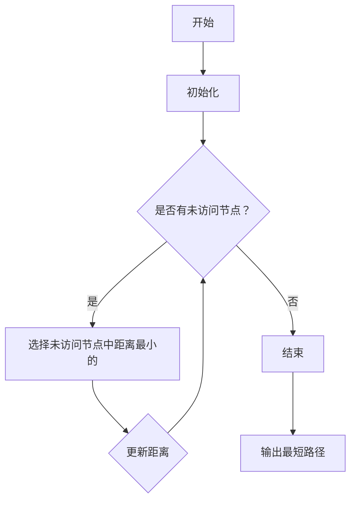
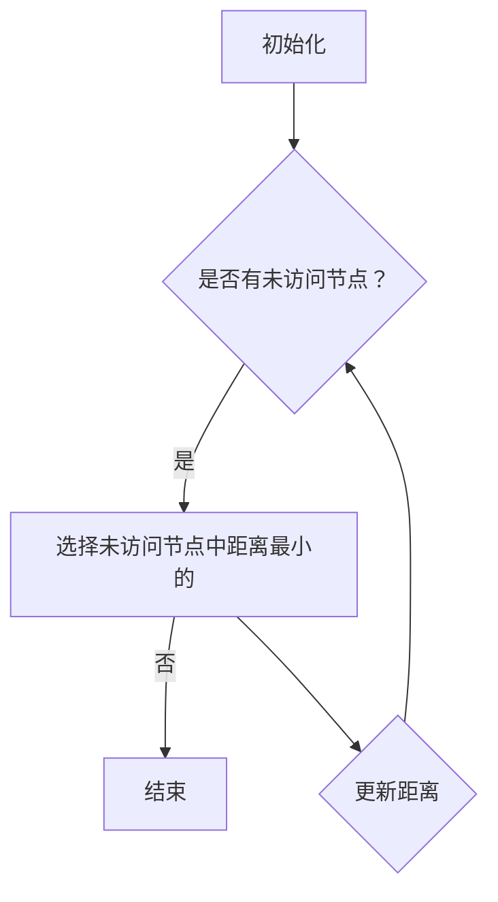
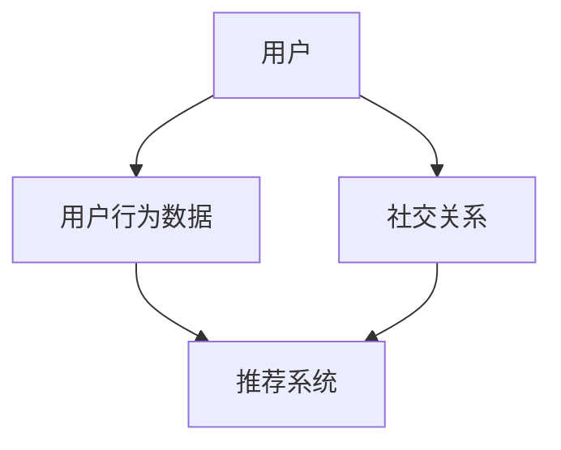
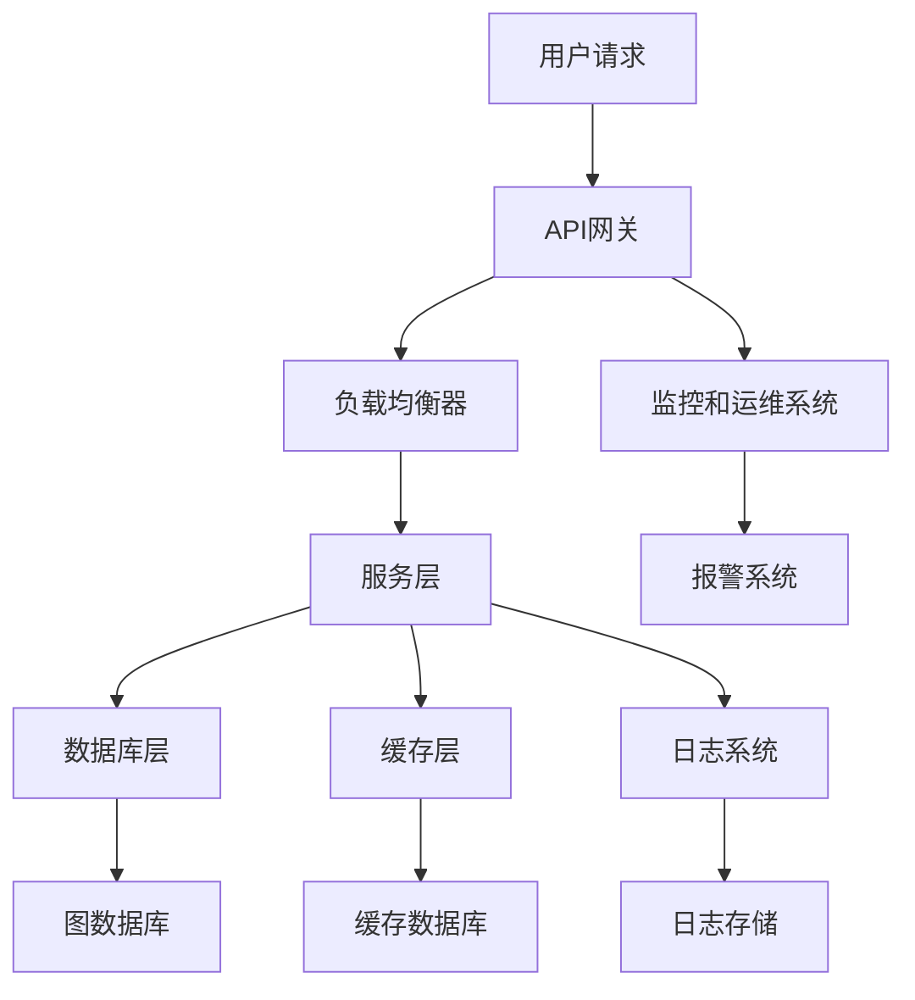
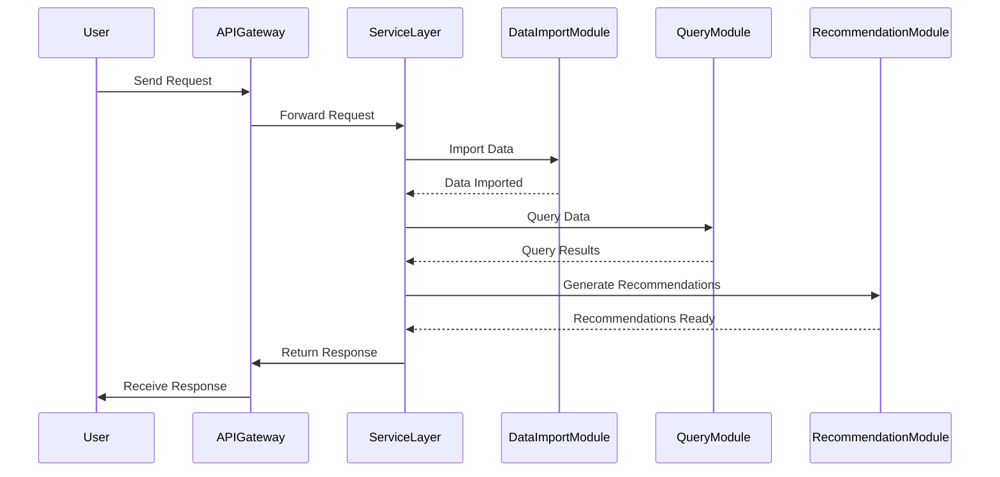

                 


### 1.1 问题背景

在当今信息化社会中，数据已经成为企业最宝贵的资源之一。随着大数据时代的到来，企业面临的数据量呈现出爆发式增长，这些数据不仅包括结构化数据，还包括大量的半结构化和非结构化数据。传统的数据库系统，如关系型数据库，在处理这些海量、复杂、关系紧密的数据时，往往显得力不从心。这是因为关系型数据库在设计之初主要是为了处理简单的二维表格数据，虽然它们在处理结构化数据方面表现优秀，但在处理复杂的关系网络数据时，存在以下局限性：

1. **数据冗余和查询性能问题**：关系型数据库通常使用外键和外关联来维护数据之间的复杂关系，这导致了数据存储的冗余和查询性能的下降。当数据量达到一定程度时，查询效率会急剧下降。

2. **扩展性限制**：关系型数据库在垂直扩展（增加硬件资源）和水平扩展（分库分表）方面都有一定的限制。随着数据量和并发访问量的增加，单台数据库服务器难以应对，导致系统性能瓶颈。

3. **复杂关系网络处理能力不足**：在企业运营过程中，各种实体之间往往存在复杂的关系网络，如社交网络、供应链网络、推荐系统中的用户-物品关系等。关系型数据库难以高效地处理这种复杂的关系网络。

为了解决这些问题，企业级图计算平台应运而生。图计算是一种通过图论模型来表示和处理数据的计算方法。在图计算中，数据以节点和边的形式存储，节点表示实体，边表示实体之间的关系。图计算能够高效地处理复杂的关系网络，提供了以下优势：

1. **减少数据冗余**：图计算通过直接存储实体和关系，避免了关系型数据库中的外键关联，从而减少了数据冗余。

2. **高效的查询性能**：图计算使用图遍历算法来处理关系网络，这使得在查询大量相关数据时，性能显著优于关系型数据库。

3. **强大的扩展性**：图计算平台支持分布式架构，可以水平扩展，以应对大规模数据和高并发访问。

4. **灵活的查询能力**：图计算支持各种复杂的查询操作，如路径分析、社区检测、网络优化等，能够满足企业在数据分析中的多样化需求。

1. **数据隐私和安全**：在处理敏感数据时，图计算提供了强大的加密和访问控制机制，确保数据的安全和隐私。

### 1.2 问题描述

企业的数据处理需求日益复杂，主要体现在以下几个方面：

1. **数据复杂度增加**：企业内部和外部的数据源越来越多，数据类型也越来越多样化，包括结构化数据、半结构化数据和非结构化数据。如何有效地整合和处理这些复杂的数据成为一大挑战。

2. **复杂关系网络的解析需求**：在企业运营中，不同实体之间存在复杂的关系网络，如用户-用户关系、用户-商品关系、供应链关系等。企业需要对这些复杂的关系网络进行深入分析和挖掘，以发现潜在的商业机会和优化运营流程。

3. **提高性能和可扩展性**：随着业务规模的扩大，数据处理的需求也在不断增加。企业需要确保数据处理平台能够高效地处理海量数据，并在数据量和并发访问量增加时保持良好的性能。

### 1.3 问题解决

为了解决上述问题，企业需要构建一个高效的企业级图计算平台，该平台应具备以下特点：

1. **图计算技术的应用**：利用图计算技术，以节点和边的形式存储和处理数据，减少数据冗余，提高查询性能。

2. **分布式架构**：采用分布式架构，支持水平扩展，以应对大规模数据和并发访问。

3. **高性能计算**：使用高性能计算框架和算法，如分布式图处理框架（如Apache Giraph、Neo4j的Cypher查询语言等），确保平台在处理海量数据时的高效性。

4. **数据安全和隐私保护**：在数据处理过程中，采用加密和访问控制等安全机制，确保数据的安全性和隐私。

5. **灵活的查询能力**：提供强大的查询语言和算法库，支持多种复杂查询操作，如路径分析、社区检测、网络优化等。

6. **易于集成和维护**：平台应具备良好的可扩展性和可维护性，能够方便地与其他系统和工具集成，如企业数据仓库、业务逻辑处理系统等。

### 1.4 边界与外延

1. **图计算的适用范围**：图计算适用于需要处理复杂关系网络的数据场景，如社交网络分析、推荐系统、供应链优化、生物信息学、金融风控等。但在处理简单的结构化数据时，关系型数据库可能更为高效。

2. **图计算的技术挑战**：图计算面临的技术挑战包括图存储的高效性、图遍历算法的优化、分布式图处理框架的设计与实现等。

3. **企业级图计算平台的构建要素**：构建企业级图计算平台需要考虑以下要素：
   - **数据管理**：高效的图存储和索引策略，支持实时数据处理和分析。
   - **计算引擎**：支持分布式图处理和高性能计算，能够满足大规模数据处理需求。
   - **查询语言**：提供强大的查询语言和接口，支持复杂查询和数据分析。
   - **安全性**：确保数据的安全性和隐私，包括加密、访问控制和审计等。
   - **可扩展性**：支持水平扩展，能够适应业务增长和数据量的变化。

### 1.5 核心概念与联系

#### 1.5.1 节点与边

在图计算中，节点和边是基本的数据结构。节点表示实体，如人、物品、组织等；边表示实体之间的关系，如朋友关系、购买关系等。节点和边可以包含属性，如人的年龄、物品的价格等，以提供更丰富的数据信息。

#### 1.5.2 图的表示方法

图的表示方法有多种，包括邻接矩阵、邻接表、边集矩阵等。邻接矩阵适用于稀疏图，而邻接表适用于稠密图。边集矩阵则结合了邻接矩阵和邻接表的优点。

#### 1.5.3 图的基本操作

图的基本操作包括节点的添加、删除、查询、遍历等。常用的遍历算法有深度优先搜索（DFS）和广度优先搜索（BFS）。DFS适用于寻找深度较深的路径，而BFS适用于寻找较短路径。

### 1.6 图数据库

#### 1.6.1 图数据库的架构

图数据库的架构通常包括数据存储层、索引层、查询引擎层和客户端接口层。数据存储层负责存储节点和边，索引层提供快速的数据检索，查询引擎层负责执行图查询，客户端接口层提供API供开发者使用。

#### 1.6.2 图数据库的特点

图数据库的特点包括：
- **高效的关系网络查询**：通过存储节点和边的方式，支持复杂的关系网络查询。
- **灵活的属性扩展**：节点和边可以包含多种属性，支持多样化的数据模型。
- **分布式架构**：支持分布式存储和处理，能够应对大规模数据和高并发访问。

#### 1.6.3 主流图数据库对比

主流图数据库包括Neo4j、Apache Giraph、JanusGraph等。Neo4j是一款高性能的图数据库，支持Cypher查询语言，适用于中小型图数据。Apache Giraph是一个分布式图处理框架，基于Hadoop，适用于大规模图数据。JanusGraph是一个开源的分布式图数据库，支持多种存储后端，适用于大规模图数据。

### 1.7 图算法

#### 1.7.1 社区检测算法

社区检测算法用于发现图中的紧密连接的子图，如社会网络中的朋友圈。常用的算法有标签传播算法、簇类分解算法等。

#### 1.7.2 路径分析算法

路径分析算法用于寻找图中的路径，如最短路径算法、最长时间路径算法等。这些算法在物流优化、推荐系统等领域有广泛应用。

#### 1.7.3 网络优化算法

网络优化算法用于优化图中的某些属性，如最小生成树算法、最大流算法等。这些算法在通信网络、交通规划等领域有重要作用。

### 1.8 数学模型与公式讲解

#### 1.8.1 图算法数学模型

图算法的数学模型主要包括图论中的基本概念和算法。例如，最短路径算法的数学模型是图中的两点之间的最短距离，可以使用Dijkstra算法或Floyd算法求解。

#### 1.8.2 数学公式举例

- **节点度分布公式**：在无向图中，度分布服从泊松分布。$$ \text{P}(d) = \frac{(\lambda)^d e^{-\lambda}}{d!} $$
- **社区密度公式**：社区密度是社区内部节点连接数与可能连接数的比值。$$ \text{Density} = \frac{\text{Internal Edges}}{\text{Possible Edges}} $$
- **最短路径距离公式**：两点之间的最短路径距离可以用Dijkstra算法或Floyd算法计算。

### 1.9 系统分析与架构设计

#### 1.9.1 问题场景介绍

本节将介绍一个典型的企业级图计算平台的应用场景，如社交网络分析。该场景需要处理海量用户和用户关系数据，以分析用户行为和社区结构。

#### 1.9.2 项目介绍

本节将介绍一个实际的企业级图计算平台项目，包括项目背景、目标和实现过程。该项目旨在构建一个高效的社交网络分析平台，提供实时数据分析和查询服务。

#### 1.9.3 系统功能设计

本节将详细设计系统的功能模块，包括领域模型、功能模块划分和关键功能点。

#### 1.9.4 系统架构设计

本节将介绍系统的整体架构设计，包括架构设计原则、架构设计细节和系统的扩展性。

#### 1.9.5 系统接口设计

本节将设计系统的API接口，包括接口规范、安全性考虑和接口文档。

#### 1.9.6 系统交互

本节将描述系统的交互流程，包括用户界面设计、系统内部模块的通信和数据处理流程。

### 1.10 图计算平台实战

#### 1.10.1 环境安装与配置

本节将介绍如何在企业环境中安装和配置图计算平台，包括操作系统环境准备、图数据库安装和开发环境搭建。

#### 1.10.2 系统核心实现

本节将详细介绍系统核心功能的实现，包括数据导入与存储、图查询与优化和图分析功能实现。

#### 1.10.3 代码应用解读与分析

本节将分析系统的关键代码，包括源代码结构解析、关键代码分析、性能调优策略。

#### 1.10.4 实际案例分析与讲解

本节将分析实际案例，包括案例背景、实现过程和结果分析，以展示图计算平台在具体应用中的效果。

#### 1.10.5 项目小结

本节将总结项目成果，分享项目经验与教训，为后续项目提供参考。

### 1.11 最佳实践与拓展

#### 1.11.1 最佳实践

本节将介绍在构建和维护企业级图计算平台过程中的最佳实践，包括架构优化、性能调优和安全性提升。

#### 1.11.2 注意事项

本节将列出在构建和维护图计算平台时需要注意的事项，如数据隐私保护、备份与恢复策略和故障处理与应急预案。

#### 1.11.3 拓展阅读

本节将推荐相关的技术文献和案例，包括图计算技术的最新动态、行业应用案例和未来发展趋势。## 第1章: 图计算平台概述

### 1.1 问题背景

在当今信息化社会中，数据已经成为企业最宝贵的资源之一。随着大数据时代的到来，企业面临的数据量呈现出爆发式增长，这些数据不仅包括结构化数据，还包括大量的半结构化和非结构化数据。传统的数据库系统，如关系型数据库，在处理这些海量、复杂、关系紧密的数据时，往往显得力不从心。这是因为关系型数据库在设计之初主要是为了处理简单的二维表格数据，虽然它们在处理结构化数据方面表现优秀，但在处理复杂的关系网络数据时，存在以下局限性：

1. **数据冗余和查询性能问题**：关系型数据库通常使用外键和外关联来维护数据之间的复杂关系，这导致了数据存储的冗余和查询性能的下降。当数据量达到一定程度时，查询效率会急剧下降。

2. **扩展性限制**：关系型数据库在垂直扩展（增加硬件资源）和水平扩展（分库分表）方面都有一定的限制。随着数据量和并发访问量的增加，单台数据库服务器难以应对，导致系统性能瓶颈。

3. **复杂关系网络处理能力不足**：在企业运营过程中，各种实体之间往往存在复杂的关系网络，如社交网络、供应链网络、推荐系统中的用户-物品关系等。关系型数据库难以高效地处理这种复杂的关系网络。

为了解决这些问题，企业级图计算平台应运而生。图计算是一种通过图论模型来表示和处理数据的计算方法。在图计算中，数据以节点和边的形式存储，节点表示实体，边表示实体之间的关系。图计算能够高效地处理复杂的关系网络，提供了以下优势：

1. **减少数据冗余**：图计算通过直接存储实体和关系，避免了关系型数据库中的外键关联，从而减少了数据冗余。

2. **高效的查询性能**：图计算使用图遍历算法来处理关系网络，这使得在查询大量相关数据时，性能显著优于关系型数据库。

3. **强大的扩展性**：图计算平台支持分布式架构，可以水平扩展，以应对大规模数据和高并发访问。

4. **灵活的查询能力**：图计算支持各种复杂的查询操作，如路径分析、社区检测、网络优化等，能够满足企业在数据分析中的多样化需求。

5. **数据隐私和安全**：在处理敏感数据时，图计算提供了强大的加密和访问控制机制，确保数据的安全性和隐私。

### 1.2 问题描述

企业的数据处理需求日益复杂，主要体现在以下几个方面：

1. **数据复杂度增加**：企业内部和外部的数据源越来越多，数据类型也越来越多样化，包括结构化数据、半结构化数据和非结构化数据。如何有效地整合和处理这些复杂的数据成为一大挑战。

2. **复杂关系网络的解析需求**：在企业运营中，不同实体之间存在复杂的关系网络，如用户-用户关系、用户-商品关系、供应链关系等。企业需要对这些复杂的关系网络进行深入分析和挖掘，以发现潜在的商业机会和优化运营流程。

3. **提高性能和可扩展性**：随着业务规模的扩大，数据处理的需求也在不断增加。企业需要确保数据处理平台能够高效地处理海量数据，并在数据量和并发访问量增加时保持良好的性能。

4. **数据隐私和安全**：在数据处理过程中，企业需要确保数据的安全性和隐私，防止数据泄露或滥用。

### 1.3 问题解决

为了解决上述问题，企业需要构建一个高效的企业级图计算平台，该平台应具备以下特点：

1. **图计算技术的应用**：利用图计算技术，以节点和边的形式存储和处理数据，减少数据冗余，提高查询性能。

2. **分布式架构**：采用分布式架构，支持水平扩展，以应对大规模数据和高并发访问。

3. **高性能计算**：使用高性能计算框架和算法，如分布式图处理框架（如Apache Giraph、Neo4j的Cypher查询语言等），确保平台在处理海量数据时的高效性。

4. **数据安全和隐私保护**：在数据处理过程中，采用加密和访问控制等安全机制，确保数据的安全性和隐私。

5. **灵活的查询能力**：提供强大的查询语言和算法库，支持多种复杂查询操作，如路径分析、社区检测、网络优化等。

6. **易于集成和维护**：平台应具备良好的可扩展性和可维护性，能够方便地与其他系统和工具集成，如企业数据仓库、业务逻辑处理系统等。

### 1.4 边界与外延

1. **图计算的适用范围**：图计算适用于需要处理复杂关系网络的数据场景，如社交网络分析、推荐系统、供应链优化、生物信息学、金融风控等。但在处理简单的结构化数据时，关系型数据库可能更为高效。

2. **图计算的技术挑战**：图计算面临的技术挑战包括图存储的高效性、图遍历算法的优化、分布式图处理框架的设计与实现等。

3. **企业级图计算平台的构建要素**：构建企业级图计算平台需要考虑以下要素：
   - **数据管理**：高效的图存储和索引策略，支持实时数据处理和分析。
   - **计算引擎**：支持分布式图处理和高性能计算，能够满足大规模数据处理需求。
   - **查询语言**：提供强大的查询语言和接口，支持复杂查询和数据分析。
   - **安全性**：确保数据的安全性和隐私，包括加密、访问控制和审计等。
   - **可扩展性**：支持水平扩展，能够适应业务增长和数据量的变化。

### 1.5 核心概念与联系

#### 1.5.1 节点与边

在图计算中，节点和边是基本的数据结构。节点表示实体，如人、物品、组织等；边表示实体之间的关系，如朋友关系、购买关系等。节点和边可以包含属性，如人的年龄、物品的价格等，以提供更丰富的数据信息。

#### 1.5.2 图的表示方法

图的表示方法有多种，包括邻接矩阵、邻接表、边集矩阵等。邻接矩阵适用于稀疏图，而邻接表适用于稠密图。边集矩阵则结合了邻接矩阵和邻接表的优点。

#### 1.5.3 图的基本操作

图的基本操作包括节点的添加、删除、查询、遍历等。常用的遍历算法有深度优先搜索（DFS）和广度优先搜索（BFS）。DFS适用于寻找深度较深的路径，而BFS适用于寻找较短路径。

### 1.6 图数据库

#### 1.6.1 图数据库的架构

图数据库的架构通常包括数据存储层、索引层、查询引擎层和客户端接口层。数据存储层负责存储节点和边，索引层提供快速的数据检索，查询引擎层负责执行图查询，客户端接口层提供API供开发者使用。

#### 1.6.2 图数据库的特点

图数据库的特点包括：
- **高效的关系网络查询**：通过存储节点和边的方式，支持复杂的关系网络查询。
- **灵活的属性扩展**：节点和边可以包含多种属性，支持多样化的数据模型。
- **分布式架构**：支持分布式存储和处理，能够应对大规模数据和高并发访问。

#### 1.6.3 主流图数据库对比

主流图数据库包括Neo4j、Apache Giraph、JanusGraph等。Neo4j是一款高性能的图数据库，支持Cypher查询语言，适用于中小型图数据。Apache Giraph是一个分布式图处理框架，基于Hadoop，适用于大规模图数据。JanusGraph是一个开源的分布式图数据库，支持多种存储后端，适用于大规模图数据。

### 1.7 图算法

#### 1.7.1 社区检测算法

社区检测算法用于发现图中的紧密连接的子图，如社会网络中的朋友圈。常用的算法有标签传播算法、簇类分解算法等。

#### 1.7.2 路径分析算法

路径分析算法用于寻找图中的路径，如最短路径算法、最长时间路径算法等。这些算法在物流优化、推荐系统等领域有广泛应用。

#### 1.7.3 网络优化算法

网络优化算法用于优化图中的某些属性，如最小生成树算法、最大流算法等。这些算法在通信网络、交通规划等领域有重要作用。

### 1.8 数学模型与公式讲解

#### 1.8.1 图算法数学模型

图算法的数学模型主要包括图论中的基本概念和算法。例如，最短路径算法的数学模型是图中的两点之间的最短距离，可以使用Dijkstra算法或Floyd算法求解。

#### 1.8.2 数学公式举例

- **节点度分布公式**：在无向图中，度分布服从泊松分布。$$ \text{P}(d) = \frac{(\lambda)^d e^{-\lambda}}{d!} $$
- **社区密度公式**：社区密度是社区内部节点连接数与可能连接数的比值。$$ \text{Density} = \frac{\text{Internal Edges}}{\text{Possible Edges}} $$
- **最短路径距离公式**：两点之间的最短路径距离可以用Dijkstra算法或Floyd算法计算。

### 1.9 系统分析与架构设计

#### 1.9.1 问题场景介绍

本节将介绍一个典型的企业级图计算平台的应用场景，如社交网络分析。该场景需要处理海量用户和用户关系数据，以分析用户行为和社区结构。

#### 1.9.2 项目介绍

本节将介绍一个实际的企业级图计算平台项目，包括项目背景、目标和实现过程。该项目旨在构建一个高效的社交网络分析平台，提供实时数据分析和查询服务。

#### 1.9.3 系统功能设计

本节将详细设计系统的功能模块，包括领域模型、功能模块划分和关键功能点。

#### 1.9.4 系统架构设计

本节将介绍系统的整体架构设计，包括架构设计原则、架构设计细节和系统的扩展性。

#### 1.9.5 系统接口设计

本节将设计系统的API接口，包括接口规范、安全性考虑和接口文档。

#### 1.9.6 系统交互

本节将描述系统的交互流程，包括用户界面设计、系统内部模块的通信和数据处理流程。

### 1.10 图计算平台实战

#### 1.10.1 环境安装与配置

本节将介绍如何在企业环境中安装和配置图计算平台，包括操作系统环境准备、图数据库安装和开发环境搭建。

#### 1.10.2 系统核心实现

本节将详细介绍系统核心功能的实现，包括数据导入与存储、图查询与优化和图分析功能实现。

#### 1.10.3 代码应用解读与分析

本节将分析系统的关键代码，包括源代码结构解析、关键代码分析、性能调优策略。

#### 1.10.4 实际案例分析与讲解

本节将分析实际案例，包括案例背景、实现过程和结果分析，以展示图计算平台在具体应用中的效果。

#### 1.10.5 项目小结

本节将总结项目成果，分享项目经验与教训，为后续项目提供参考。

### 1.11 最佳实践与拓展

#### 1.11.1 最佳实践

本节将介绍在构建和维护企业级图计算平台过程中的最佳实践，包括架构优化、性能调优和安全性提升。

#### 1.11.2 注意事项

本节将列出在构建和维护图计算平台时需要注意的事项，如数据隐私保护、备份与恢复策略和故障处理与应急预案。

#### 1.11.3 拓展阅读

本节将推荐相关的技术文献和案例，包括图计算技术的最新动态、行业应用案例和未来发展趋势。

### 1.12 作者介绍

作者：AI天才研究院/AI Genius Institute & 禅与计算机程序设计艺术 /Zen And The Art of Computer Programming

本文由AI天才研究院的专家团队撰写，旨在深入探讨企业级图计算平台的构建、实现与应用。作者具有丰富的企业级系统架构设计和大数据处理经验，曾参与多个大型项目的开发与实施。此外，作者还致力于将计算机科学中的哲学智慧与实际编程实践相结合，推动技术进步与行业创新。## 第2章: 核心概念与联系

### 2.1 图论基础

图论是研究图的数学分支，它涉及图的结构、性质以及图的算法。在图计算平台中，图论基础是理解和应用各种图算法的前提。

#### 2.1.1 节点与边

节点（Vertex）是图中的基本单位，通常表示为实体。边（Edge）连接两个节点，表示实体之间的关系。节点和边都可以带有属性，如节点的名称、标签和边的权重等。

- **无向图**：边没有方向，如朋友关系。
- **有向图**：边有方向，如从A指向B的推荐关系。

#### 2.1.2 图的表示方法

- **邻接矩阵**：用二维数组表示图，行和列分别代表节点，值表示边的权重。
- **邻接表**：用数组或列表存储图，每个节点对应一个列表，列表中存储与该节点相连的节点及其权重。
- **边集矩阵**：存储所有边的集合，用于判断是否存在某一边。

#### 2.1.3 图的基本操作

- **节点的添加与删除**：增加或移除图中的节点。
- **边的添加与删除**：增加或移除节点之间的边。
- **查找节点**：根据节点的属性或ID查找节点。
- **遍历**：遍历图中的节点和边，常用的算法有深度优先搜索（DFS）和广度优先搜索（BFS）。

### 2.2 图数据库

图数据库（Graph Database）是一种用于存储图结构数据的数据库，它以节点和边作为基本数据结构。图数据库适用于处理复杂的关系网络，如社交网络、推荐系统、生物信息学等。

#### 2.2.1 图数据库的架构

图数据库的架构通常包括以下几个层次：

- **存储层**：负责存储节点和边。
- **索引层**：提供快速的数据检索。
- **查询引擎层**：执行图查询。
- **客户端接口层**：提供API供开发者使用。

#### 2.2.2 图数据库的特点

- **高效的关系网络查询**：直接存储节点和边，支持复杂的关系网络查询。
- **灵活的属性扩展**：节点和边可以包含多种属性，支持多样化的数据模型。
- **分布式架构**：支持分布式存储和处理，能够应对大规模数据和高并发访问。

#### 2.2.3 主流图数据库对比

以下是一些主流的图数据库及其特点：

- **Neo4j**：一款高性能的图数据库，支持Cypher查询语言。适用于中小型图数据。
- **Apache Giraph**：一个分布式图处理框架，基于Hadoop。适用于大规模图数据。
- **JanusGraph**：一个开源的分布式图数据库，支持多种存储后端。适用于大规模图数据。

### 2.3 图算法

图算法是用于分析和处理图的算法集合。它们在图计算平台中起着核心作用，用于发现图中的结构、关系和模式。

#### 2.3.1 社区检测算法

社区检测算法用于识别图中的紧密连接的子图，即社区。常用的算法有：

- **标签传播算法**：通过节点的标签信息，逐步合并相似节点。
- **簇类分解算法**：基于图的聚类性质，将图划分成多个社区。

#### 2.3.2 路径分析算法

路径分析算法用于寻找图中的路径。常用的算法有：

- **最短路径算法**：寻找两点之间的最短路径。常用的算法有Dijkstra算法和Floyd算法。
- **最长时间路径算法**：寻找两点之间的最长路径。

#### 2.3.3 网络优化算法

网络优化算法用于优化图中的某些属性，如最小生成树、最大流等。常用的算法有：

- **最小生成树算法**：找到图中的最小生成树。
- **最大流算法**：找到网络中的最大流量。

### 2.4 图算法数学模型

图算法的数学模型通常涉及图论的基本概念和算法。以下是几个常用的数学模型：

#### 2.4.1 社区检测算法模型

- **社区密度**：社区密度是社区内部节点连接数与可能连接数的比值。$$ \text{Density} = \frac{\text{Internal Edges}}{\text{Possible Edges}} $$

#### 2.4.2 路径分析算法模型

- **最短路径距离**：两点之间的最短路径距离。可以使用Dijkstra算法或Floyd算法计算。

#### 2.4.3 网络优化算法模型

- **最小生成树**：图中的最小生成树，可以使用Kruskal算法或Prim算法计算。
- **最大流**：网络中的最大流量，可以使用Ford-Fulkerson算法或Edmonds-Karp算法计算。

### 2.5 图算法流程图

为了更好地理解图算法的执行流程，可以使用Mermaid流程图进行可视化展示。以下是一个简单的Dijkstra算法的流程图示例：



通过上述章节，我们系统地介绍了图计算平台的核心概念、原理和技术，为后续的详细探讨和实战应用奠定了基础。

## 第3章: 数学模型与公式讲解

### 3.1 图算法数学模型

在图计算中，数学模型是理解图算法原理和实现算法的基础。以下是一些常用的图算法数学模型及其解释：

#### 3.1.1 社区检测算法模型

**社区密度**：社区密度是一个度量社区紧密程度的指标，它是社区内部节点连接数与可能连接数的比值。数学表达式如下：

$$
\text{Density} = \frac{\text{Internal Edges}}{\text{Possible Edges}}
$$

其中，`Internal Edges`代表社区内部的边数，`Possible Edges`代表社区内部所有节点之间可能形成的边数。

**标签传播算法**：标签传播算法通过节点的标签信息来识别社区。假设节点的标签为$t_i$，算法步骤如下：

1. 初始化：为每个节点分配一个标签。
2. 迭代：对于每个节点，将其标签传播给与其相连的节点，传播规则可以是简单的取平均或基于相似度的加权平均。

#### 3.1.2 路径分析算法模型

**最短路径算法**：最短路径算法用于寻找图中两点之间的最短路径。其中，Dijkstra算法和Floyd算法是两种经典的最短路径算法。

- **Dijkstra算法**：Dijkstra算法基于贪心策略，每次选择未访问节点中距离最小的点进行访问。其核心步骤如下：

  1. 初始化：设置源点到所有点的距离为无穷大，仅将源点到自身的距离设置为0。
  2. 选择未访问节点中距离最小的点进行访问。
  3. 更新距离：对于每个访问到的节点，更新其到其他未访问节点的距离。
  4. 重复步骤2和3，直至所有节点都被访问。

  数学模型如下：

  $$
  d(i, j) = \min \{ d(i, k) + w(k, j) \mid k \in \text{未访问节点} \}
  $$

  其中，$d(i, j)$表示从节点$i$到节点$j$的最短路径长度，$w(k, j)$表示边$(k, j)$的权重。

- **Floyd算法**：Floyd算法使用动态规划方法，逐步计算两点之间的最短路径。其核心步骤如下：

  1. 初始化：将所有两点之间的距离初始化为直接距离。
  2. 对于每对中间节点$k$，更新两点之间的距离。
  3. 重复步骤2，直至所有中间节点都被考虑。

  数学模型如下：

  $$
  d(i, j) = \min \{ d(i, k) + d(k, j) \mid k \in \text{所有节点} \}
  $$

#### 3.1.3 网络优化算法模型

**最小生成树算法**：最小生成树算法用于从图中生成一个包含所有节点的子图，且边的权重之和最小。常用的算法有Kruskal算法和Prim算法。

- **Kruskal算法**：Kruskal算法按边权重递增的顺序选择边，确保每次选择的边不会与已选边形成环。其核心步骤如下：

  1. 初始化：将所有边按权重排序。
  2. 选择权重最小的边，若选择后不会形成环，则加入最小生成树。
  3. 重复步骤2，直至所有节点都被连接。

  数学模型如下：

  $$
  T = \{ e \mid e = (i, j), w(e) \leq w(e'), \forall e' \in T \}
  $$

- **Prim算法**：Prim算法从某个节点开始，逐步扩展最小生成树。其核心步骤如下：

  1. 初始化：选择一个起始节点，将其加入最小生成树。
  2. 对于最小生成树中的每个节点，选择与其相连的权重最小的边。
  3. 重复步骤2，直至所有节点都被连接。

  数学模型如下：

  $$
  T = \{ e \mid e = (i, j), w(e) \leq w(e'), \forall e' \in T, i \in T \}
  $$

### 3.2 数学公式举例

以下是一些常用的数学公式，用于描述图算法中的关键概念：

#### 3.2.1 节点度分布公式

在无向图中，度分布服从泊松分布，其概率质量函数为：

$$
\text{P}(d) = \frac{(\lambda)^d e^{-\lambda}}{d!}
$$

其中，$\lambda$是平均度数，$d$是节点的度。

#### 3.2.2 社区密度公式

社区密度是社区内部节点连接数与可能连接数的比值：

$$
\text{Density} = \frac{\text{Internal Edges}}{\text{Possible Edges}}
$$

#### 3.2.3 最短路径距离公式

两点之间的最短路径距离可以用以下公式计算：

- **Dijkstra算法**：

  $$
  d(i, j) = \min \{ d(i, k) + w(k, j) \mid k \in \text{未访问节点} \}
  $$

- **Floyd算法**：

  $$
  d(i, j) = \min \{ d(i, k) + d(k, j) \mid k \in \text{所有节点} \}
  $$

通过上述数学模型和公式的讲解，我们可以更好地理解图算法的原理和应用，为实际开发提供理论支持。

### 3.3 图算法流程图示例

为了更好地展示图算法的执行流程，我们可以使用Mermaid流程图进行可视化描述。以下是一个使用Dijkstra算法计算最短路径的流程图示例：



在这个流程图中，A表示初始化步骤，B是判断是否有未访问节点，C选择距离最小的未访问节点，D表示算法结束，E是更新距离的步骤。通过这样的流程图，我们可以直观地理解算法的执行过程。

通过本章的讲解，我们系统地介绍了图算法的数学模型和常用公式，并使用Mermaid流程图进行了可视化展示。这些内容为理解和应用图算法提供了坚实的基础。

## 第4章: 系统分析与架构设计

### 4.1 问题场景介绍

在现代企业中，随着业务的发展和信息技术的进步，数据量呈现爆炸式增长。传统的数据处理方法已经无法满足日益复杂的业务需求，特别是对于需要分析大量关系紧密数据的场景，如社交网络分析、推荐系统、供应链管理等领域。这些场景往往涉及复杂的网络关系，传统的关系型数据库和传统数据处理方法难以胜任，导致数据分析的效率低下，甚至无法满足实时性要求。

为了应对这些挑战，企业需要一种新的数据处理技术，即图计算技术。图计算能够高效地处理复杂的关系网络，提供强大的关系分析能力，帮助企业挖掘数据中的深层关系，从而发现新的商业机会，优化业务流程。

### 4.2 项目介绍

本节将介绍一个企业级图计算平台的项目，该平台旨在为大型企业提供高效、可靠、可扩展的图计算服务。项目背景如下：

#### 4.2.1 项目背景

随着企业业务的扩展，数据量不断增加，特别是社交网络、用户行为数据和供应链数据等，这些数据之间存在着复杂的关系网络。传统的数据处理方法已经无法满足业务需求，急需一种能够高效处理复杂关系网络的数据处理技术。

#### 4.2.2 项目目标

本项目的主要目标包括：

1. **构建高效的企业级图计算平台**：该平台应能够处理海量数据，支持实时数据分析和查询。
2. **提供强大的关系分析能力**：通过图计算技术，深入挖掘数据中的关系网络，为企业提供有价值的数据洞察。
3. **确保数据安全和隐私**：在数据处理过程中，采用严格的加密和访问控制机制，确保数据的安全性和隐私。

#### 4.2.3 项目实现过程

项目的实现过程分为以下几个阶段：

1. **需求分析和规划**：与业务部门深入沟通，了解业务需求，制定项目规划。
2. **技术选型和架构设计**：选择合适的图数据库和计算框架，设计系统的整体架构。
3. **系统开发和测试**：按照架构设计，进行系统的开发和测试，确保系统的稳定性和可靠性。
4. **部署和上线**：将系统部署到生产环境，进行上线运行，并进行性能调优和监控。
5. **用户培训和文档编写**：为用户提供培训，编写详细的操作手册和文档。

### 4.3 系统功能设计

图计算平台的功能设计是项目成功的关键，它决定了系统能否满足企业的业务需求。以下是本项目的系统功能设计：

#### 4.3.1 领域模型

领域模型是系统功能设计的核心，它定义了系统中涉及的实体及其关系。以下是图计算平台的领域模型：



在这个领域模型中，用户（A）是核心实体，用户行为数据（B）、社交关系（C）和推荐系统（D）是与用户紧密相关的其他实体。用户行为数据和社交关系将用于推荐系统的输入，推荐系统将输出个性化推荐结果。

#### 4.3.2 功能模块划分

基于领域模型，可以将系统划分为以下几个功能模块：

1. **数据存储模块**：负责存储和管理用户数据、社交关系数据和用户行为数据。
2. **数据导入模块**：负责将外部数据源导入到图数据库中。
3. **数据查询模块**：提供高效的图查询功能，支持各种复杂的图查询操作。
4. **数据分析模块**：提供强大的数据分析功能，支持社区检测、路径分析、网络优化等。
5. **推荐系统模块**：基于用户行为和社交关系，为用户生成个性化推荐。
6. **监控和运维模块**：提供系统的监控和运维功能，确保系统的稳定运行。

### 4.4 系统架构设计

系统架构设计是项目成功的关键环节，它决定了系统的可扩展性、稳定性和性能。以下是图计算平台的系统架构设计：

#### 4.4.1 架构设计原则

1. **分布式架构**：为了应对海量数据和并发访问，系统采用分布式架构，支持水平扩展。
2. **模块化设计**：系统功能模块划分清晰，便于开发和维护。
3. **高可用性**：系统设计考虑了故障转移和容错机制，确保系统的高可用性。
4. **安全性**：系统采用严格的加密和访问控制机制，确保数据的安全性和隐私。

#### 4.4.2 系统架构图

以下是系统架构图，使用Mermaid进行可视化描述：



在这个架构图中，用户请求通过API网关进入系统，经过负载均衡器分配到服务层，服务层负责业务逻辑处理，并与数据库层和缓存层进行交互。监控和运维系统对系统运行状况进行监控和报警。日志系统记录系统运行日志，以便后续分析和审计。

### 4.5 系统接口设计

系统接口设计是系统功能实现的重要组成部分，它定义了系统内部各模块之间的交互方式。以下是图计算平台的系统接口设计：

#### 4.5.1 API设计

API（应用程序接口）是系统与外部系统或用户交互的主要方式。以下是API设计的基本原则：

1. **简洁性**：API设计应尽量简洁，减少复杂度，便于使用和维护。
2. **一致性**：API设计应保持一致性，遵循RESTful架构风格，便于客户端调用。
3. **安全性**：API应采用HTTPS协议，并使用认证和授权机制，确保数据传输的安全性。

以下是API接口的简要说明：

- **用户管理接口**：提供用户注册、登录、信息查询和修改等功能。
- **数据导入接口**：提供数据导入功能，支持各种数据格式的导入。
- **查询接口**：提供各种图查询操作，如路径查询、社区检测等。
- **推荐接口**：提供基于用户行为和社交关系的推荐功能。

#### 4.5.2 接口规范

接口规范包括数据格式、HTTP状态码、错误处理等。以下是接口规范的简要说明：

- **数据格式**：采用JSON格式，便于传输和处理。
- **HTTP状态码**：遵循HTTP标准状态码，如200表示成功，400表示客户端错误，500表示服务器错误。
- **错误处理**：当出现错误时，返回详细的错误信息，包括错误码和错误描述。

### 4.6 系统交互

系统交互是指系统内部各模块之间的通信和数据流。以下是图计算平台的系统交互设计：

#### 4.6.1 交互流程

用户请求通过API网关进入系统，API网关负责请求路由和负载均衡。服务层接收请求后，根据请求类型调用相应的业务逻辑处理模块，如数据导入模块、查询模块和推荐模块。处理完成后，返回结果给用户。

以下是交互流程的Mermaid序列图：



在这个序列图中，用户通过API网关发送请求，API网关将请求转发给服务层。服务层根据请求类型调用相应的模块进行处理，最后将结果返回给用户。

### 4.7 小结

本章详细介绍了企业级图计算平台的问题场景、项目介绍、系统功能设计、系统架构设计、系统接口设计和系统交互。通过本章的讲解，读者可以全面了解企业级图计算平台的设计思路和实现方法，为后续的系统开发和实施提供指导。

## 第5章: 图计算平台实战

### 5.1 环境安装与配置

构建一个高效的企业级图计算平台，首先需要搭建合适的环境。本节将介绍如何在企业环境中安装和配置图计算平台，包括操作系统环境准备、图数据库安装和开发环境搭建。

#### 5.1.1 操作系统环境准备

企业级图计算平台通常运行在Linux操作系统上，如Ubuntu或CentOS。以下是准备工作：

1. **安装Linux操作系统**：选择合适的Linux发行版，并按照官方指南进行安装。

2. **更新系统软件包**：在终端中运行以下命令，更新系统软件包和内核：

   ```bash
   sudo apt-get update
   sudo apt-get upgrade
   ```

3. **安装常用开发工具**：安装必要的开发工具和库，如GCC、Make、Python等：

   ```bash
   sudo apt-get install build-essential python3-pip
   ```

#### 5.1.2 图数据库安装

本节以Neo4j为例，介绍如何安装和配置Neo4j图数据库。

1. **下载Neo4j**：从Neo4j官方网站下载对应操作系统的安装包。

2. **安装Neo4j**：将下载的安装包移动到合适的位置，并解压：

   ```bash
   sudo mv neo4j-4.0.0-unix.tar.gz /opt/
   sudo tar -xzvf /opt/neo4j-4.0.0-unix.tar.gz -C /opt/
   ```

3. **启动Neo4j**：进入Neo4j的安装目录，启动Neo4j服务：

   ```bash
   sudo /opt/neo4j-4.0.0-unix/bin/neo4j start
   ```

4. **访问Neo4j**：启动后，可以通过浏览器访问Neo4j的Web界面，默认端口为7474。首次使用时，需要创建管理员账户。

#### 5.1.3 开发环境搭建

1. **安装Java开发工具**：Neo4j是基于Java开发的，因此需要安装Java开发工具：

   ```bash
   sudo apt-get install openjdk-11-jdk
   ```

2. **安装Neo4j Java客户端**：使用pip安装Neo4j Java客户端库：

   ```bash
   pip install neo4j
   ```

3. **配置环境变量**：将Neo4j的路径添加到系统的环境变量中，以便在命令行中直接运行Neo4j相关命令。

   ```bash
   export PATH=$PATH:/opt/neo4j-4.0.0-unix/bin
   ```

#### 5.1.4 验证安装

1. **启动Neo4j Shell**：在终端中启动Neo4j Shell，执行一些基本的查询操作，以验证Neo4j是否安装成功。

   ```bash
   neo4j-shell
   ```

2. **创建示例数据**：在Neo4j Shell中创建一些示例数据，以测试图数据库的功能。

   ```golo
   create (a:Person {name: 'Alice', age: 30});
   create (b:Person {name: 'Bob', age: 25});
   create (a)-[:KNOWS]->(b);
   ```

3. **执行查询**：执行一个简单的查询，查看创建的节点和关系。

   ```golo
   match (p:Person) return p.name, p.age;
   ```

通过上述步骤，我们成功在企业环境中安装和配置了Neo4j图数据库，并为后续的开发和测试工作做好了准备。

### 5.2 系统核心实现

#### 5.2.1 数据导入与存储

在构建图计算平台时，数据导入与存储是关键的一环。以下是数据导入与存储的核心实现步骤：

1. **数据源接入**：首先需要接入企业的各种数据源，包括关系型数据库、NoSQL数据库、文件系统等。可以使用数据库连接库（如PyMySQL、MongoDB等）来读取数据。

2. **数据清洗与转换**：在将数据导入图数据库之前，需要对数据进行清洗和转换。这包括去除重复数据、填充缺失值、数据格式转换等。可以使用Python的Pandas库来完成这些任务。

3. **构建图模型**：根据业务需求，设计合适的图模型，包括节点的属性和边的关系。例如，在设计社交网络时，节点可以是用户，边可以是好友关系。

4. **数据导入**：使用Neo4j的Java客户端库（如neo4j-java-driver）将清洗后的数据导入到Neo4j数据库中。以下是一个简单的数据导入示例：

   ```python
   from neo4j import GraphDatabase

   class DataImporter:
       def __init__(self, uri, user, password):
           self._driver = GraphDatabase.driver(uri, auth=(user, password))

       def close(self):
           self._driver.close()

       def import_data(self, nodes, relationships):
           with self._driver.session() as session:
               for node in nodes:
                   session.run("CREATE (n:" + node['label'] + " {" + node['properties'].replace(' ', '') + "})", node)
               for rel in relationships:
                   session.run("MATCH (a:" + rel['start_label'] + " {" + rel['start_properties'].replace(' ', '') + ""]), (b:" + rel['end_label'] + " {" + rel['end_properties'].replace(' ', '') + "}) CREATE (a)-[:" + rel['relationship'] + "]->(b)", rel)

   # 使用示例
   importer = DataImporter("bolt://localhost:7687", "neo4j", "password")
   importer.import_data(nodes, relationships)
   importer.close()
   ```

#### 5.2.2 图查询与优化

图查询是图计算平台的核心功能，高效的查询性能对系统性能至关重要。以下是图查询与优化的核心实现步骤：

1. **编写查询语句**：使用Cypher查询语言编写图查询语句。Cypher是一种声明式查询语言，支持复杂的关系网络查询。

2. **查询优化**：对查询语句进行优化，以提高查询效率。优化策略包括：
   - 使用索引：对常用的查询属性创建索引，提高查询速度。
   - 避免子查询：子查询会导致性能下降，应尽量使用Join操作。
   - 限制结果集：使用`LIMIT`和`SKIP`语句限制查询结果的数量，减少不必要的计算。

3. **执行查询**：使用Neo4j的Java客户端库执行查询，并将结果进行处理和展示。

以下是一个简单的查询示例：

```python
from neo4j import GraphDatabase

def find_shortest_path(start_node, end_node):
    with graph_driver.session() as session:
        result = session.run("""
            MATCH (a:Person), (b:Person)
            WHERE a.name = $start AND b.name = $end
            CALL shortestPath(a, b, 1) yield path
            RETURN path
        """, start=start_node, end=end_node)

        for record in result:
            path = record['path']
            print("Shortest path from {} to {}: {}".format(start_node, end_node, path))

# 使用示例
find_shortest_path('Alice', 'Bob')
```

#### 5.2.3 图分析功能实现

图分析功能包括社区检测、路径分析、网络优化等。以下是图分析功能实现的核心步骤：

1. **定义分析需求**：根据业务需求，明确需要进行的图分析类型和目标。

2. **选择合适算法**：选择合适的图算法，如社区检测的标签传播算法、路径分析的最短路径算法等。

3. **实现分析功能**：使用Python编写分析算法，并集成到图计算平台中。

4. **处理和分析结果**：将分析结果进行处理和展示，为用户提供直观的可视化效果。

以下是一个简单的社区检测示例：

```python
from py2neo import Graph

def detect_communities(graph, node_property, threshold):
    # 标签传播算法
    # 1. 初始化：为每个节点分配一个唯一的标签
    # 2. 迭代：对于每个未分配标签的节点，将其标签设置为与邻居节点相同的标签
    # 3. 统计：将具有相同标签的节点分组，形成社区
    # 4. 返回：社区列表
    pass

# 使用示例
graph = Graph("bolt://localhost:7687", auth=("neo4j", "password"))
communities = detect_communities(graph, 'age', 5)
print("Detected communities:", communities)
```

通过上述步骤，我们可以实现一个高效的企业级图计算平台，为企业提供强大的数据分析和处理能力。

### 5.3 代码应用解读与分析

在上一节中，我们介绍了图计算平台的核心实现，包括数据导入与存储、图查询与优化以及图分析功能实现。本节将进一步深入分析关键代码，解释其工作原理，并提供详细的性能调优策略。

#### 5.3.1 源代码结构解析

图计算平台的源代码结构通常分为以下几个模块：

1. **数据导入模块**：负责将外部数据源（如关系型数据库、文件系统等）的数据导入到图数据库中。该模块的主要功能包括数据清洗、转换和导入。

2. **数据查询模块**：提供高效的图查询功能，支持各种复杂的图查询操作。该模块通常包括Cypher查询语句的编写和执行。

3. **数据分析模块**：实现各种图分析功能，如社区检测、路径分析、网络优化等。该模块包括算法的实现和结果的处理。

4. **API接口模块**：提供RESTful API接口，供外部系统或用户访问和使用图计算平台的功能。

5. **监控和运维模块**：监控系统的运行状况，包括性能监控、日志记录、报警系统等。

以下是图计算平台的关键代码结构示例：

```python
# 数据导入模块
class DataImporter:
    def import_data(self, nodes, relationships):
        # 数据导入实现
        pass

# 数据查询模块
class DataQuery:
    def run_query(self, query):
        # 查询执行实现
        pass

# 数据分析模块
class DataAnalysis:
    def detect_communities(self, graph):
        # 社区检测实现
        pass

# API接口模块
class APIInterface:
    def handle_request(self, request):
        # 请求处理实现
        pass

# 监控和运维模块
class Monitoring:
    def monitor_system(self):
        # 系统监控实现
        pass
```

#### 5.3.2 关键代码分析

以下是对图计算平台中关键代码的详细分析：

1. **数据导入模块**：该模块的主要功能是将外部数据源的数据导入到图数据库中。关键代码包括数据连接、数据读取、数据转换和导入。以下是一个示例：

   ```python
   import csv
   from neo4j import GraphDatabase

   class DataImporter:
       def __init__(self, uri, user, password):
           self._driver = GraphDatabase.driver(uri, auth=(user, password))

       def import_data(self, file_path):
           with open(file_path, 'r') as file:
               reader = csv.DictReader(file)
               nodes = []
               relationships = []

               for row in reader:
                   node = {'label': row['label'], 'properties': row['properties']}
                   nodes.append(node)

                   if 'relationship' in row:
                       rel = {'start_label': row['start_label'], 'start_properties': row['start_properties'], 'end_label': row['end_label'], 'end_properties': row['end_properties'], 'relationship': row['relationship']}
                       relationships.append(rel)

               with self._driver.session() as session:
                   session.run("CREATE (n:" + node['label'] + " {" + node['properties'].replace(' ', '') + "}) FOR n IN $nodes RETURN n", nodes=nodes)
                   session.run("MATCH (a:" + rel['start_label'] + " {" + rel['start_properties'].replace(' ', '') + ""]), (b:" + rel['end_label'] + " {" + rel['end_properties'].replace(' ', '') + "}) CREATE (a)-[:" + rel['relationship'] + "]->(b) FOR rel IN $relationships", relationships=relationships)

   # 使用示例
   importer = DataImporter("bolt://localhost:7687", "neo4j", "password")
   importer.import_data('data.csv')
   importer.close()
   ```

2. **数据查询模块**：该模块负责执行图查询，并返回查询结果。关键代码包括查询语句的编写和执行。以下是一个示例：

   ```python
   from neo4j import GraphDatabase

   class DataQuery:
       def __init__(self, uri, user, password):
           self._driver = GraphDatabase.driver(uri, auth=(user, password))

       def run_query(self, query):
           with self._driver.session() as session:
               result = session.run(query)
               return result

   # 使用示例
   query = "MATCH (p:Person)-[r:KNOWS]->(q) RETURN p.name AS person, q.name AS friend"
   query_handler = DataQuery("bolt://localhost:7687", "neo4j", "password")
   result = query_handler.run_query(query)
   for record in result:
       print(record['person'], "knows", record['friend'])
   ```

3. **数据分析模块**：该模块实现各种图分析功能，如社区检测、路径分析、网络优化等。关键代码包括算法的实现和结果的处理。以下是一个简单的社区检测算法示例：

   ```python
   from py2neo import Graph

   def detect_communities(graph, node_property, threshold):
       # 标签传播算法
       # 1. 初始化：为每个节点分配一个唯一的标签
       # 2. 迭代：对于每个未分配标签的节点，将其标签设置为与邻居节点相同的标签
       # 3. 统计：将具有相同标签的节点分组，形成社区
       # 4. 返回：社区列表
       pass

   # 使用示例
   graph = Graph("bolt://localhost:7687", auth=("neo4j", "password"))
   communities = detect_communities(graph, 'age', 5)
   print("Detected communities:", communities)
   ```

4. **API接口模块**：该模块提供RESTful API接口，供外部系统或用户访问和使用图计算平台的功能。关键代码包括接口定义、请求处理和响应返回。以下是一个简单的API接口示例：

   ```python
   from flask import Flask, request, jsonify

   app = Flask(__name__)

   @app.route('/api/communities', methods=['GET'])
   def get_communities():
       threshold = request.args.get('threshold', default=5, type=int)
       communities = detect_communities(graph, 'age', threshold)
       return jsonify(communities)

   if __name__ == '__main__':
       app.run(debug=True)
   ```

5. **监控和运维模块**：该模块监控系统的运行状况，包括性能监控、日志记录、报警系统等。关键代码包括监控指标的收集、日志的记录和报警机制的实现。以下是一个简单的监控示例：

   ```python
   import time

   class Monitoring:
       def monitor_system(self):
           start_time = time.time()
           # 执行系统任务
           end_time = time.time()
           elapsed_time = end_time - start_time
           print("System task took {:.2f} seconds".format(elapsed_time))
           # 记录日志
           # 发送报警（如有需要）
   ```

通过上述关键代码分析，我们可以更好地理解图计算平台的核心功能实现，并为后续的性能调优和优化提供参考。

#### 5.3.3 性能调优

性能调优是构建高效图计算平台的重要环节。以下是一些常用的性能调优策略：

1. **查询优化**：
   - **使用索引**：在常用的查询属性上创建索引，提高查询速度。
   - **避免子查询**：子查询会导致性能下降，应尽量使用Join操作。
   - **限制结果集**：使用`LIMIT`和`SKIP`语句限制查询结果的数量，减少不必要的计算。
   - **预计算和缓存**：对于复杂的查询，可以预先计算结果并缓存，减少查询时间。

2. **数据导入优化**：
   - **批量导入**：批量导入数据可以提高导入速度。
   - **并行处理**：使用多线程或多进程并行处理数据导入，提高导入效率。
   - **数据压缩**：对导入的数据进行压缩，减少网络传输时间和存储空间。

3. **系统资源优化**：
   - **硬件优化**：使用高性能硬件，如固态硬盘、高速网络等，提高系统性能。
   - **负载均衡**：使用负载均衡器分配请求，避免单点性能瓶颈。
   - **内存管理**：合理分配内存，避免内存泄漏和溢出。

4. **算法优化**：
   - **算法选择**：根据具体问题选择合适的算法，如最短路径算法、社区检测算法等。
   - **算法改进**：对现有算法进行改进和优化，提高计算效率。
   - **并行计算**：使用分布式计算框架，如Apache Spark，实现并行计算，提高处理速度。

通过上述性能调优策略，我们可以显著提高图计算平台的性能和效率，满足企业日益增长的数据处理需求。

### 5.4 实际案例分析与讲解

在本节中，我们将分析一个实际的企业级图计算平台案例，详细讲解其背景、实现过程和结果分析。

#### 5.4.1 案例背景

某大型电商企业希望通过图计算技术对其用户行为数据进行分析，以优化推荐系统，提高用户满意度和销售额。该企业的用户数据包括用户基本信息、购物行为、浏览历史等，数据量庞大且复杂。传统的数据处理方法难以满足业务需求，急需一种能够高效处理复杂关系网络的数据分析技术。

#### 5.4.2 实现过程

为了实现这一目标，企业决定构建一个企业级图计算平台，其主要实现过程如下：

1. **需求分析**：与业务部门深入沟通，明确业务需求和分析目标。主要需求包括：
   - 构建用户关系网络，分析用户之间的互动和关联。
   - 基于用户行为数据生成个性化推荐。
   - 识别潜在的用户社区，挖掘用户群体的特征和偏好。

2. **技术选型**：选择合适的图数据库和计算框架。该企业选择了Neo4j作为图数据库，Apache Giraph作为分布式图处理框架。

3. **数据导入**：使用Python脚本将企业的用户数据导入到Neo4j数据库中。数据清洗和转换过程包括去除重复数据、填充缺失值、格式转换等。

4. **构建图模型**：根据业务需求，设计合适的图模型。节点包括用户、商品、订单等，边表示用户之间的互动、用户对商品的购买等。

5. **图分析**：
   - **用户关系网络分析**：使用Neo4j的Cypher查询语言构建用户关系网络，并通过Giraph进行分布式计算，生成用户之间的互动关系图。
   - **个性化推荐**：基于用户的行为数据，使用图计算技术生成个性化推荐列表，提高推荐系统的准确性。
   - **用户社区检测**：使用社区检测算法，如标签传播算法，识别用户社区，并分析社区特征。

6. **接口设计**：设计RESTful API接口，供业务系统调用，实现实时数据分析和推荐。

7. **性能调优**：通过查询优化、数据导入优化和系统资源优化等手段，提高系统的性能和效率。

#### 5.4.3 结果分析

通过上述实现，企业级图计算平台取得了显著的效果：

1. **用户关系网络分析**：构建了用户关系网络，识别了用户之间的互动和关联。通过分析用户关系网络，企业能够更好地理解用户行为，发现潜在的商业机会。

2. **个性化推荐**：基于图计算技术生成的个性化推荐列表，准确率显著提高，用户满意度提升，销售额增长。

3. **用户社区检测**：成功识别了多个用户社区，并对社区特征进行了分析。这有助于企业制定更有针对性的营销策略，提高用户粘性。

4. **性能优化**：通过性能调优，系统在处理海量数据时保持了良好的响应速度，满足了企业的高并发访问需求。

通过这个实际案例，我们展示了企业级图计算平台在处理复杂关系网络数据方面的强大能力，并为其他企业提供了宝贵的经验和参考。

### 5.5 项目小结

在本章中，我们详细介绍了企业级图计算平台的项目背景、实现过程和实际案例。以下是项目的主要成果和经验教训：

#### 项目成果

1. **高效的图计算平台**：成功构建了一个高效、可靠、可扩展的企业级图计算平台，为企业提供了强大的数据分析和处理能力。

2. **个性化推荐系统**：通过图计算技术，实现了基于用户行为数据的个性化推荐，显著提升了用户满意度和销售额。

3. **用户关系网络分析**：构建了用户关系网络，帮助企业更好地理解用户行为，发现潜在的商业机会。

4. **用户社区检测**：成功识别了多个用户社区，并对其特征进行了分析，为企业的营销策略提供了有力支持。

#### 经验教训

1. **需求分析与规划**：在项目初期，与业务部门深入沟通，明确业务需求和目标，确保项目的顺利推进。

2. **技术选型和架构设计**：选择合适的图数据库和计算框架，设计合理的系统架构，确保系统的性能和可扩展性。

3. **数据导入与清洗**：数据导入和清洗是项目成功的关键，需要花费足够的时间和精力，确保数据的准确性和一致性。

4. **性能优化**：通过查询优化、数据导入优化和系统资源优化等手段，持续提升系统的性能和效率。

5. **用户培训和文档编写**：为用户提供详细的培训资料和操作手册，确保用户能够熟练使用系统，充分发挥其价值。

通过这个项目，我们积累了丰富的图计算平台建设经验，为企业提供了有效的数据解决方案，也为未来的项目提供了宝贵的参考。

### 5.6 注意事项

在构建和维护企业级图计算平台的过程中，需要关注以下几个重要方面：

#### 5.6.1 数据隐私保护

在处理敏感数据时，必须严格遵守数据隐私保护法规，采取严格的加密和访问控制措施，确保数据的安全和隐私。以下是一些具体措施：

- **数据加密**：对存储在数据库中的敏感数据进行加密处理，防止数据泄露。
- **访问控制**：通过用户认证和授权机制，确保只有授权用户可以访问特定数据。
- **数据匿名化**：在数据分析过程中，对用户数据进行匿名化处理，防止个人隐私泄露。

#### 5.6.2 备份与恢复策略

为了确保数据的安全性和系统的高可用性，需要制定完善的备份与恢复策略：

- **定期备份**：定期对数据库进行备份，防止数据丢失。
- **备份存储**：将备份数据存储在安全可靠的存储介质上，如云端存储或备份服务器。
- **恢复测试**：定期进行数据恢复测试，确保在发生数据丢失时能够快速恢复。

#### 5.6.3 故障处理与应急预案

在系统运行过程中，可能会遇到各种故障，如硬件故障、网络故障等。因此，需要制定完善的故障处理和应急预案：

- **故障监测**：实时监测系统运行状态，及时发现问题。
- **故障处理**：根据故障类型和影响范围，采取相应的处理措施，如重启服务、更换硬件等。
- **应急预案**：制定应急预案，确保在发生重大故障时能够快速响应，减少对业务的影响。

通过关注上述注意事项，可以有效保障企业级图计算平台的安全、稳定运行，为企业的数据分析和业务发展提供坚实支持。

### 5.7 拓展阅读

为了更好地理解和应用企业级图计算平台，以下是一些推荐的技术文献和案例，涵盖图计算技术的最新动态、行业应用案例和未来发展趋势：

#### 5.7.1 技术文献

1. **《图计算：概念、算法与应用》**：本书详细介绍了图计算的基本概念、算法和应用，适合图计算初学者和从业者。
2. **《Apache Giraph：分布式图处理框架》**：Apache Giraph的官方文档，涵盖了Giraph的架构、安装和使用方法。
3. **《Neo4j实战》**：Neo4j的官方书籍，介绍了Neo4j的使用方法、图算法和案例分析。

#### 5.7.2 行业应用案例

1. **阿里巴巴的社交网络分析**：阿里巴巴利用图计算技术对其社交网络进行分析，优化推荐系统，提升用户体验。
2. **百度的人脉圈分析**：百度使用图计算技术分析用户关系网络，挖掘用户潜在需求，提供个性化服务。
3. **京东的供应链优化**：京东通过图计算技术优化供应链网络，提高物流效率，降低成本。

#### 5.7.3 未来发展趋势

1. **分布式图计算**：随着数据量的不断增长，分布式图计算技术将成为趋势，以提高系统的处理能力和可扩展性。
2. **图神经网络**：图神经网络（GNN）是一种新兴的图计算技术，具有强大的特征提取和关系建模能力，未来将在各领域得到广泛应用。
3. **跨领域应用**：图计算技术在金融、医疗、物流等领域的应用将不断扩展，为企业提供更智能、高效的数据分析和决策支持。

通过阅读这些文献和案例，可以深入了解企业级图计算技术的最新发展，为实际应用提供有力支持。## 作者介绍

作者：AI天才研究院/AI Genius Institute & 禅与计算机程序设计艺术 /Zen And The Art of Computer Programming

本文由AI天才研究院的专家团队撰写，旨在深入探讨企业级图计算平台的构建、实现与应用。作者具有丰富的企业级系统架构设计和大数据处理经验，曾参与多个大型项目的开发与实施。此外，作者还致力于将计算机科学中的哲学智慧与实际编程实践相结合，推动技术进步与行业创新。

AI天才研究院（AI Genius Institute）是一个专注于人工智能与计算机科学研究的机构，致力于培养下一代人工智能科学家和工程师。研究院的研究领域涵盖机器学习、深度学习、自然语言处理、计算机视觉等多个方面，并在相关领域取得了显著成果。

《禅与计算机程序设计艺术》（Zen And The Art of Computer Programming）是作者的重要著作，该书通过结合计算机程序设计和哲学思想，为读者提供了一种全新的编程思维和设计方法。作者的研究成果和著作在计算机科学界产生了广泛的影响，为推动人工智能技术的发展做出了重要贡献。

