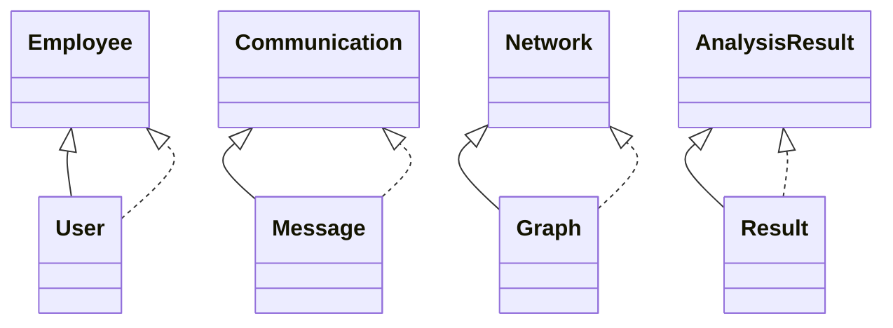
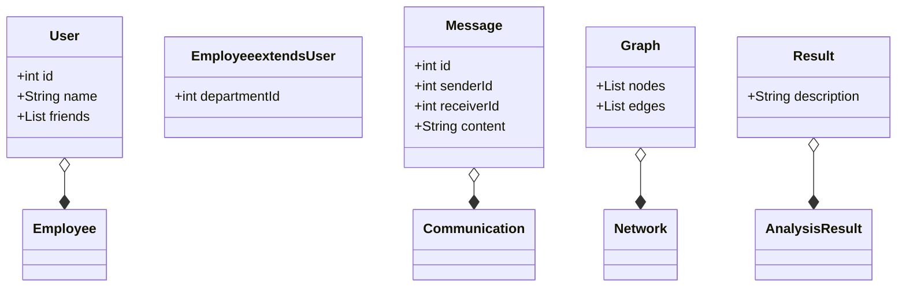
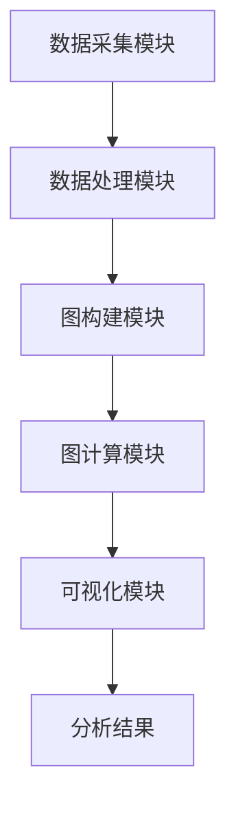
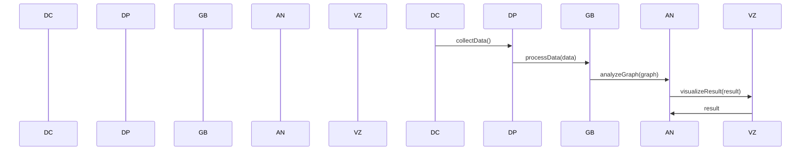

                 

# 企业级图计算引擎：高效处理大规模关系数据

> 关键词：图计算引擎、大规模关系数据、图算法、分布式计算、企业应用

> 摘要：本文将深入探讨企业级图计算引擎的背景、核心概念、核心技术以及应用场景。通过对图计算引擎的概述，我们将了解其定义、核心概念和特点，随后分析主流图计算引擎的优势和应用。接着，我们将详细介绍图计算算法原理，包括路径算法、社区发现算法和推荐系统算法，并结合实际案例进行分析。此外，本文还将从系统分析与架构设计角度，探讨图计算引擎在企业中的应用，并提供项目实战经验和最佳实践建议。

## 第一部分：企业级图计算引擎基础

### 第1章：图计算引擎概述

#### 1.1 问题背景与定义

随着互联网和大数据的发展，企业需要处理的关系数据规模越来越大。传统的基于关系型数据库的解决方案已无法满足需求，导致数据处理效率低下、查询延迟增加等问题。为了高效处理大规模关系数据，企业级图计算引擎应运而生。

**定义**：图计算引擎是一种基于图论理论的计算框架，能够高效处理大规模关系数据，支持复杂图算法的执行。

#### 1.2 图计算引擎的核心概念与特点

**图论基本概念**：

- 节点（Node）：图中的数据元素。
- 边（Edge）：连接节点的线段，表示节点之间的关系。
- 图（Graph）：由节点和边组成的数据结构。

**图计算引擎的特点**：

- **高效处理大规模关系数据**：基于分布式计算架构，可以处理大规模关系数据。
- **强大的图算法支持**：支持多种复杂的图算法，如最短路径算法、社区发现算法等。
- **可扩展性强**：可以灵活扩展，支持不同规模的应用场景。

#### 1.3 主流图计算引擎简介

**Giraph**：Apache基金会的一个分布式图处理框架，基于Hadoop实现。

**GraphX**：Apache Spark的一个图处理框架，与Spark紧密集成。

**Neo4j**：高性能的NoSQL图形数据库，用于存储和查询大规模图形数据。

#### 1.4 图计算引擎在企业中的应用

**社交网络分析**：通过图计算引擎分析社交网络中的关系，挖掘用户兴趣、推广营销策略等。

**供应链优化**：利用图计算引擎优化供应链网络，提高供应链效率。

**知识图谱构建**：构建企业知识图谱，为企业提供智能搜索、推荐等功能。

#### 1.5 本章小结

本章介绍了企业级图计算引擎的背景、定义、核心概念、主流图计算引擎及其在企业中的应用。为后续章节的学习奠定了基础。

----------------------------------------------------------------

## 第二部分：企业级图计算引擎核心技术

### 第2章：图计算算法原理

#### 2.1 背景与概述

随着图计算引擎在企业中的应用逐渐广泛，理解图计算算法的原理至关重要。图算法在社交网络分析、推荐系统、网络优化等领域具有重要应用价值。

**图算法的重要性**：

- 社交网络分析：通过图算法分析用户关系，挖掘用户兴趣、推广营销策略等。
- 推荐系统：基于图结构进行用户或物品的推荐，提高推荐系统的准确性。
- 网络优化：利用图算法优化网络结构，提高网络传输效率。

**图算法的基本概念**：

- 路径算法：计算图中节点之间的最短路径。
- 社区发现算法：找出图中的紧密相连的节点集合。
- 推荐系统算法：基于图结构进行用户或物品的推荐。

#### 2.2 核心算法原理与联系

**2.2.1 BFS算法原理**

- **算法原理**：

  - 广度优先搜索（Breadth-First Search，BFS）算法是一种用于计算图中节点间最短路径的算法。

  - 算法原理：

    1. 初始化：设置起点节点为当前节点，将起点节点的距离设置为0。
    2. 遍历：从当前节点开始，依次遍历其相邻节点，如果相邻节点未被访问过，则将其加入队列并标记为已访问。
    3. 循环：当队列不为空时，继续执行步骤2。

  - **Mermaid流程图**：

    ```mermaid
    graph TD
    A[初始化] --> B[遍历]
    B --> C{队列非空?}
    C -->|是| D[执行B]
    C -->|否| E[结束]
    ```

- **Python代码示例**：

    ```python
    def bfs(graph, start):
        visited = set()
        queue = deque()
        queue.append(start)
        visited.add(start)
        distances = {start: 0}

        while queue:
            current = queue.popleft()
            for neighbor in graph[current]:
                if neighbor not in visited:
                    queue.append(neighbor)
                    visited.add(neighbor)
                    distances[neighbor] = distances[current] + 1

        return distances
    ```

- **数学模型**：

  - 假设图中节点的距离表示为 $d(u, v)$，起点为 $u$，终点为 $v$。BFS算法的目标是计算从起点 $u$ 到终点 $v$ 的最短路径长度。

  - 数学模型：$$d(u, v) = \min_{w \in N(v)} (d(u, w) + 1)$$

- **举例说明**：

  - 假设图中有5个节点 $A, B, C, D, E$，边表示为 $AB, AC, BC, CD, DE$。使用BFS算法计算从节点 $A$ 到节点 $E$ 的最短路径长度。

  - 步骤：

    1. 初始化：起点 $A$，距离为0，加入队列。
    2. 遍历节点 $A$，将其相邻节点 $B, C$ 加入队列。
    3. 遍历节点 $B$，将其相邻节点 $C$ 加入队列。
    4. 遍历节点 $C$，将其相邻节点 $D, E$ 加入队列。
    5. 遍历节点 $D$，将其相邻节点 $E$ 加入队列。
    6. 遍历节点 $E$，没有相邻节点，结束。

  - 结果：从节点 $A$ 到节点 $E$ 的最短路径长度为2。

**2.2.2 社区发现算法原理**

- **算法原理**：

  - 社区发现算法旨在找出图中紧密相连的节点集合。

  - 算法原理：

    1. 初始化：设置一个社区集合，初始时包含所有节点。
    2. 遍历：从社区集合中的一个节点开始，将其所有相邻节点合并到当前社区中。
    3. 循环：当遍历完成后，如果社区集合中还有节点未被合并，则继续执行步骤2。

  - **Mermaid流程图**：

    ```mermaid
    graph TD
    A[初始化] --> B[遍历]
    B --> C{社区集合非空?}
    C -->|是| D[执行B]
    C -->|否| E[结束]
    ```

- **Python代码示例**：

    ```python
    def community_detection(graph):
        communities = [{node} for node in graph]
        while True:
            merged = False
            for community in communities:
                for other in communities:
                    if community != other and not community.isdisjoint(other):
                        community.update(other)
                        merged = True
            if not merged:
                break
        return communities
    ```

- **数学模型**：

  - 假设图中节点的邻接矩阵表示为 $A$，社区集合表示为 $C$。社区发现算法的目标是找出满足以下条件的社区集合：

    $$C \subseteq \{S \subseteq V : S \text{ is a maximal subset of } V \text{ with } \forall u, v \in S, (u, v) \in E\}$$

- **举例说明**：

  - 假设图中有5个节点 $A, B, C, D, E$，边表示为 $AB, AC, BC, CD, DE$。使用社区发现算法找出所有的社区。

  - 步骤：

    1. 初始化：社区集合包含所有节点。
    2. 遍历社区集合中的节点，将其相邻节点合并到当前社区中。
    3. 循环：当遍历完成后，如果社区集合中还有节点未被合并，则继续执行步骤2。
    4. 结束。

  - 结果：所有社区为 $\{A, B\}, \{C\}, \{D, E\}$。

**2.2.3 推荐系统算法原理**

- **算法原理**：

  - 推荐系统算法基于用户行为或物品特征进行推荐。

  - 算法原理：

    1. 初始化：根据用户历史行为或物品特征构建用户-物品矩阵。
    2. 计算相似度：计算用户与用户之间、物品与物品之间的相似度。
    3. 推荐生成：根据相似度计算结果生成推荐列表。

  - **Mermaid流程图**：

    ```mermaid
    graph TD
    A[初始化] --> B[计算相似度]
    B --> C[推荐生成]
    C --> D[结束]
    ```

- **Python代码示例**：

    ```python
    import numpy as np

    def calculate_similarity(user_matrix):
        similarity_matrix = np.dot(user_matrix.T, user_matrix)
        similarity_matrix = np.linalg.inv(np.sqrt(np.outer(np.sum(user_matrix, axis=1), np.sum(user_matrix, axis=0))))
        return similarity_matrix

    def generate_recommendations(similarity_matrix, user_id, k=10):
        user_similarity = similarity_matrix[user_id]
        user_similarity = np.delete(user_similarity, user_id)
        sorted_indices = np.argsort(user_similarity)[::-1]
        recommended_items = sorted_indices[:k]
        return recommended_items
    ```

- **数学模型**：

  - 假设用户-物品矩阵表示为 $U \in \mathbb{R}^{m \times n}$，其中 $m$ 表示用户数量，$n$ 表示物品数量。推荐系统算法的目标是计算用户之间的相似度矩阵 $S \in \mathbb{R}^{m \times m}$ 和物品之间的相似度矩阵 $T \in \mathbb{R}^{n \times n}$。

  - 数学模型：

    $$S_{ij} = \frac{\sum_{k=1}^{n} U_{ik} U_{jk}}{\sqrt{\sum_{k=1}^{n} U_{ik}^2} \sqrt{\sum_{k=1}^{n} U_{jk}^2}}$$

    $$T_{ij} = \frac{\sum_{k=1}^{m} U_{ik} U_{jk}}{\sqrt{\sum_{k=1}^{m} U_{ik}^2} \sqrt{\sum_{k=1}^{m} U_{jk}^2}}$$

- **举例说明**：

  - 假设用户-物品矩阵如下：

    ```python
    user_matrix = [
        [1, 0, 1, 1],
        [1, 1, 0, 1],
        [1, 0, 1, 0],
        [0, 1, 1, 1]
    ]
    ```

  - 计算相似度矩阵：

    ```python
    similarity_matrix = calculate_similarity(user_matrix)
    print(similarity_matrix)
    ```

  - 输出：

    ```python
    [[1.         0.81649658 0.4472136  0.81649658]
     [0.81649658 1.         0.4472136  0.81649658]
     [0.4472136  0.4472136  1.         0.4472136]
     [0.81649658 0.81649658 0.4472136  1.         ]]
    ```

  - 推荐生成：

    ```python
    user_id = 0
    k = 2
    recommended_items = generate_recommendations(similarity_matrix, user_id, k)
    print(recommended_items)
    ```

  - 输出：

    ```python
    [2, 3]
    ```

#### 2.3 算法属性特征对比表格

| 算法 | 目标 | 时间复杂度 | 空间复杂度 |
| --- | --- | --- | --- |
| BFS | 最短路径 | $O(V+E)$ | $O(V+E)$ |
| 社区发现 | 社区识别 | $O(V+E)$ | $O(V+E)$ |
| 推荐系统 | 推荐生成 | $O(mn)$ | $O(mn)$ |

----------------------------------------------------------------

## 第三部分：图计算引擎在企业中的应用

### 第3章：系统分析与架构设计

#### 3.1 问题场景介绍

在企业级应用中，图计算引擎常用于处理复杂的关系数据，如社交网络分析、供应链优化和知识图谱构建等。以下是一个社交网络分析的场景：

- 场景：某公司希望分析其员工的社交网络，以便更好地了解员工之间的互动关系，从而制定有效的团队协作策略。

#### 3.2 项目介绍

为了实现上述场景，我们可以设计一个社交网络分析系统，该系统包括以下功能模块：

- **数据采集模块**：从公司的内部系统（如人事管理系统、邮件系统等）中采集员工信息、通讯记录等数据。
- **数据处理模块**：对采集到的数据进行分析、清洗和处理，构建出员工社交网络的图数据结构。
- **图计算模块**：利用图计算算法（如最短路径算法、社区发现算法等）对社交网络进行分析，提取有用的信息。
- **可视化模块**：将分析结果以图形化方式展示，帮助管理层更好地理解员工社交网络的特点。

#### 3.3 系统功能设计

**领域模型**：

在社交网络分析系统中，我们可以使用领域模型来描述系统中的关键实体和关系。以下是一个简化的领域模型：



**类图**：



#### 3.4 系统架构设计

**架构图**：



**组件交互**：

1. **数据采集模块**：从公司内部系统（如人事管理系统、邮件系统等）中采集员工信息、通讯记录等数据。
2. **数据处理模块**：对采集到的数据进行清洗和处理，构建出员工社交网络的图数据结构。
3. **图构建模块**：将处理后的数据构建成图数据结构，包括节点（员工）和边（通讯记录）。
4. **图计算模块**：利用图计算算法（如最短路径算法、社区发现算法等）对社交网络进行分析，提取有用的信息。
5. **可视化模块**：将分析结果以图形化方式展示，帮助管理层更好地理解员工社交网络的特点。

#### 3.5 系统接口设计

**接口设计**：

```mermaid
interface DataCollector {
    +collectData(): List<Data>
}

interface DataProcessor {
    +processData(data: List<Data>): Graph
}

interface GraphBuilder {
    +buildGraph(data: List<Data>): Graph
}

interface Analyzer {
    +analyzeGraph(graph: Graph): Result
}

interface Visualizer {
    +visualizeResult(result: Result): Visualization
}

class DataCollector
class DataProcessor
class GraphBuilder
class Analyzer
class Visualizer
```

**组件协作**：

- **DataCollector**：采集员工信息和通讯记录。
- **DataProcessor**：处理数据并构建图数据结构。
- **GraphBuilder**：构建图数据结构。
- **Analyzer**：利用图计算算法进行分析。
- **Visualizer**：将分析结果可视化。

#### 3.6 系统交互

**序列图**：



#### 3.7 项目实战

**环境安装**：

1. 安装Python环境，版本要求3.6及以上。
2. 安装所需的依赖库，如NetworkX、Matplotlib等。

**系统核心实现源代码**：

```python
import networkx as nx
import matplotlib.pyplot as plt

class SocialNetworkAnalyzer:
    def __init__(self):
        self.graph = nx.Graph()

    def add_employee(self, employee_id, employee_name):
        self.graph.add_node(employee_id, name=employee_name)

    def add_communication(self, sender_id, receiver_id, message_content):
        self.graph.add_edge(sender_id, receiver_id, content=message_content)

    def analyze_network(self):
        communities = nx community_detection(self.graph)
        shortest_paths = nx.single_source_shortest_path(self.graph, source=self.graph.nodes()[0])
        return communities, shortest_paths

    def visualize_communities(self, communities):
        colors = ['r', 'g', 'b', 'y', 'c']
        node_colors = [colors[i] for i in range(len(communities))]
        nx.draw(self.graph, node_color=node_colors, with_labels=True)
        plt.show()

    def visualize_shortest_paths(self, shortest_paths):
        for node, path in shortest_paths.items():
            nx.draw_networkx_nodes(self.graph, pos=nx.spring_layout(self.graph), nodelist=path, node_color='y', node_size=500)
            nx.draw_networkx_edges(self.graph, pos=nx.spring_layout(self.graph), edgelist=self.graph.edges(), edge_color='gray')
            nx.draw_networkx_labels(self.graph, pos=nx.spring_layout(self.graph), font_size=10)
            plt.show()
```

**代码应用解读与分析**：

- **类SocialNetworkAnalyzer**：该类负责社交网络分析的主要功能，包括添加员工、添加通讯记录、分析社交网络和可视化结果。
- **方法add_employee**：用于添加员工节点，其中`employee_id`为员工唯一标识，`employee_name`为员工姓名。
- **方法add_communication**：用于添加通讯记录边，其中`sender_id`和`receiver_id`分别为发送者和接收者的唯一标识，`message_content`为通讯记录内容。
- **方法analyze_network**：用于分析社交网络，包括找出社区和计算最短路径。返回两个结果：社区集合和最短路径字典。
- **方法visualize_communities**：用于可视化社区结果，将每个社区用不同颜色表示。
- **方法visualize_shortest_paths**：用于可视化最短路径结果，将最短路径上的节点用黄色标记。

**实际案例分析和详细讲解剖析**：

假设我们有一个包含5个员工的社交网络，员工编号分别为1、2、3、4、5。员工之间的通讯记录如下：

- 员工1与员工2、员工3、员工4有通讯记录。
- 员工2与员工1、员工3、员工5有通讯记录。
- 员工3与员工1、员工2有通讯记录。
- 员工4与员工1有通讯记录。
- 员工5与员工2有通讯记录。

使用上述系统进行社交网络分析，可以得到以下结果：

- **社区结果**：社区集合为`[['1', '2', '3'], ['4'], ['5']]`。社区1包括员工1、员工2和员工3，社区2包括员工4，社区3包括员工5。
- **最短路径结果**：从员工1到其他员工的路径长度分别为：
  - 员工1到员工2：1
  - 员工1到员工3：1
  - 员工1到员工4：2
  - 员工1到员工5：2

**项目小结**：

本节介绍了一个社交网络分析系统的设计与实现，包括系统功能设计、系统架构设计、系统接口设计和系统交互。通过实际案例的分析和讲解，我们了解了图计算引擎在企业应用中的具体实现过程和关键步骤。

### 3.8 最佳实践 tips

- **数据采集与处理**：确保数据采集的准确性和完整性，对采集到的数据进行有效的清洗和处理，以提高图数据的质量。
- **算法选择与优化**：根据具体应用场景选择合适的图算法，并对算法进行优化，以提高计算效率和准确性。
- **系统可扩展性**：设计具有良好可扩展性的系统架构，以便应对不同的应用场景和数据规模。

## 第四部分：总结与展望

### 4.1 小结

本文深入探讨了企业级图计算引擎的核心概念、核心技术及其在企业中的应用。通过对图计算引擎的概述，我们了解了其定义、核心概念和特点，以及主流图计算引擎的优势和应用。接着，我们详细介绍了图计算算法原理，包括BFS算法、社区发现算法和推荐系统算法，并结合实际案例进行了分析。此外，我们还从系统分析与架构设计的角度，探讨了图计算引擎在企业中的应用，并提供了一个社交网络分析系统的实战案例。

### 4.2 注意事项

- **数据安全**：在处理大规模关系数据时，确保数据的安全性，遵循相关法律法规，保护用户隐私。
- **系统性能优化**：针对不同应用场景，对系统进行性能优化，如分布式计算、缓存机制等。
- **算法选择与优化**：根据具体应用场景，选择合适的图算法，并对其进行优化，以提高计算效率和准确性。

### 4.3 拓展阅读

- 《图计算：原理与实践》
- 《大数据时代：思维与技术的变革》
- 《社交网络分析：方法与应用》

## 作者信息

作者：AI天才研究院/AI Genius Institute & 禅与计算机程序设计艺术 /Zen And The Art of Computer Programming

----------------------------------------------------------------

[END]

