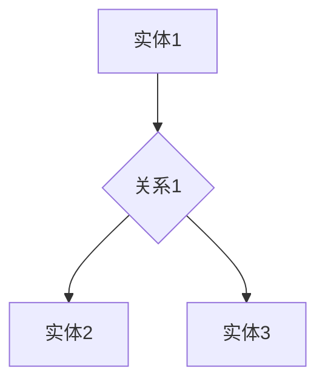
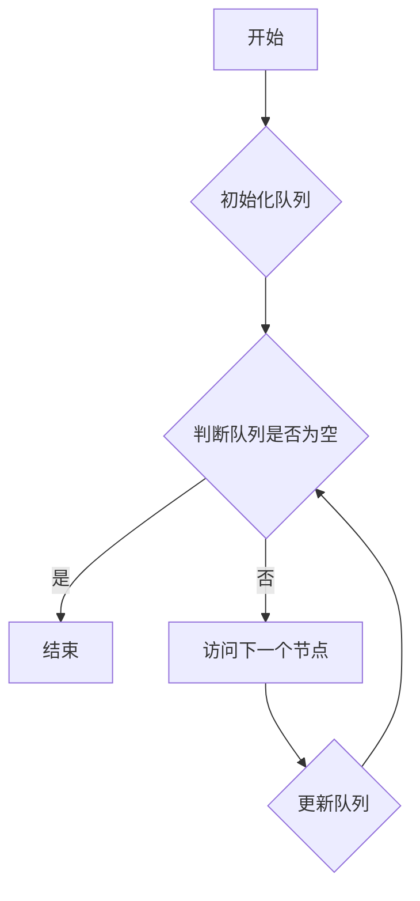
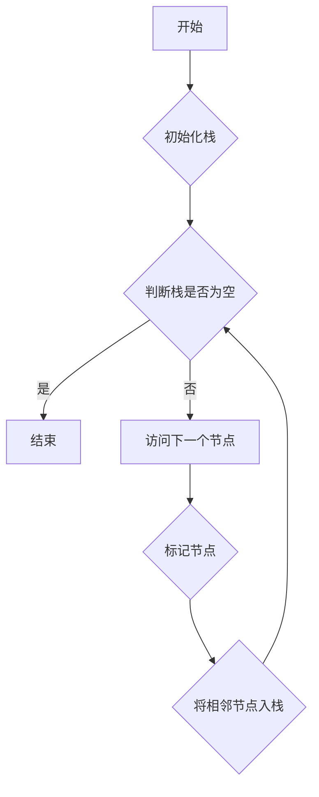
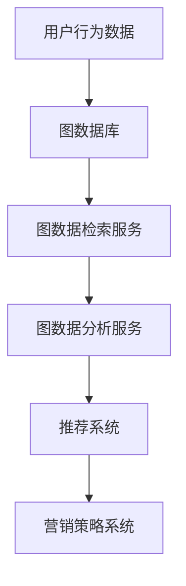
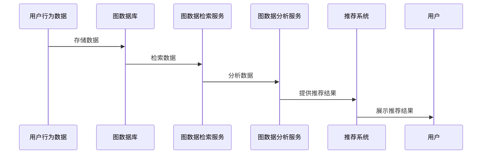

                 

### 企业级图计算引擎：高效处理大规模关系数据

> 关键词：图计算、企业级、关系数据、处理效率、算法

> 摘要：本文将深入探讨企业级图计算引擎的概念、应用场景、核心算法原理，以及如何设计一个高效、可扩展的图计算系统。我们将通过一步步的分析，帮助读者理解图计算在处理大规模关系数据中的重要性，并掌握企业级图计算引擎的实现方法和最佳实践。

----------------------------------------------------------------

# 第一部分: 企业级图计算引擎概述

## 第1章: 问题背景与核心概念

### 1.1.1 问题背景

在当今的数据驱动时代，企业面临着日益增长的数据量和复杂度。传统的数据库和关系型数据库系统在处理大规模关系数据时往往力不从心。随着互联网、社交网络、物联网等技术的发展，数据之间的关联性和复杂性不断增加，传统的数据处理方法已经无法满足企业的需求。

为了更好地应对这种挑战，企业级图计算引擎应运而生。图计算引擎是一种基于图论的数据处理和分析方法，它可以高效地处理大规模的关系数据，并挖掘数据之间的隐含关系，为企业的决策提供有力的支持。

### 1.1.2 核心概念

- **图计算**：图计算是一种基于图论的数据处理方法，它通过在图数据结构上进行计算，来分析实体及其之间的关系。
- **企业级图计算引擎**：企业级图计算引擎是一种专为企业和组织设计的图计算工具，它具有高性能、高可扩展性的特点，能够处理大规模的关系数据。

## 第2章: 核心概念与联系

### 2.1.1 核心概念

- **图数据结构**：图数据结构由节点和边构成，节点表示实体，边表示实体之间的关系。
- **图算法**：图算法是用于在图数据结构上进行计算和搜索的一系列算法，如广度优先搜索（BFS）、深度优先搜索（DFS）等。

### 2.1.2 概念属性特征对比表格

| 概念         | 属性1 | 属性2 | 属性3 |
| ------------ | ----- | ----- | ----- |
| 图数据结构   | 节点  | 边    | 关系  |
| 图算法       | 高效性 | 可扩展性 | 可复用性 |

### 2.1.3 ER实体关系图架构



## 第3章: 算法原理讲解

### 3.1.1 算法概述

企业级图计算引擎通常基于以下几种算法：

- **广度优先搜索（BFS）**
- **深度优先搜索（DFS）**
- **单源最短路径算法（Dijkstra）**
- **PageRank算法**

### 3.1.2 BFS算法

BFS算法是一种用于在无向图中查找最短路径的算法。下面是BFS算法的Mermaid流程图：



### 3.1.3 DFS算法

DFS算法是一种用于在图中进行深度优先搜索的算法。下面是DFS算法的Mermaid流程图：



## 第4章: 数学模型和数学公式

### 4.1.1 BFS算法的数学模型

BFS算法的数学模型可以用以下公式表示：

$$
d(u, v) = \min \{d(u, w) + 1 \mid w \in N(v)\}
$$

其中，$d(u, v)$表示从节点u到节点v的最短路径长度，$N(v)$表示节点v的邻接节点集合。

### 4.1.2 DFS算法的数学模型

DFS算法的数学模型可以用以下公式表示：

$$
d(u, v) = \min \{d(u, w) + 1 \mid w \in N(v)\}
$$

其中，$d(u, v)$表示从节点u到节点v的最短路径长度，$N(v)$表示节点v的邻接节点集合。

## 第5章: 系统分析与架构设计方案

### 5.1.1 问题场景介绍

在电子商务领域，企业需要分析用户的行为数据，以优化推荐系统和营销策略。

### 5.1.2 系统功能设计

- **数据存储**：使用图数据库存储用户行为数据。
- **数据检索**：实现高效的图数据检索功能。
- **数据分析**：利用图算法分析用户行为数据。

### 5.1.3 系统架构设计



### 5.1.4 系统接口设计和系统交互



## 第6章: 项目实战

### 6.1.1 环境安装

- 安装必要的操作系统和环境
- 安装图数据库软件，如Neo4j、ArangoDB等
- 安装开发工具，如Visual Studio Code、PyCharm等

### 6.1.2 系统核心实现

以下是使用Python实现图数据存储、检索和分析的示例代码：

```python
from py2neo import Graph

# 连接图数据库
graph = Graph("bolt://localhost:7687", auth=("neo4j", "password"))

# 创建节点和关系
graph.run("""
CREATE (user:User {id: 1, name: 'Alice'}),
       (user)-[:RATED]->(movie:Movie {id: 1, title: 'Inception'}),
       (user)-[:RATED]->(movie:Movie {id: 2, title: 'The Matrix'}),
       (movie)-[:RATED_BY]->(user)
""")

# 检索数据
results = graph.run("MATCH (user:User)-[:RATED]->(movie:Movie) RETURN user, movie")
for result in results:
    print(result)

# 分析数据
# 统计每个用户评价的电影数量
results = graph.run("MATCH (user:User)-[:RATED]->(movie:Movie) RETURN user.name, count(movie) as ratings_count")
for result in results:
    print(result)

# 提供推荐结果
# 根据用户评价的电影，推荐相似的电影
results = graph.run("""
MATCH (user:User {id: 1})-[:RATED]->(movie:Movie),
      (movie)-[:SIMILAR]->(similar:Movie)
RETURN similar.title
""")
for result in results:
    print(result['similar.title'])
```

### 6.1.3 实际案例分析

以电子商务领域的用户行为数据为例，分析用户偏好，预测用户可能感兴趣的商品。

### 6.1.4 详细讲解剖析

通过对用户行为数据的分析，我们可以识别出用户的偏好，从而为用户提供个性化的推荐。以下是详细的分析和讲解：

1. **用户评价数据**：收集用户对商品的评价数据，存储在图数据库中。
2. **相似性计算**：使用图算法计算用户之间的相似性，如PageRank算法。
3. **推荐生成**：根据用户之间的相似性和商品之间的相似性，生成个性化的推荐列表。

### 6.1.5 项目小结

通过本项目，我们掌握了企业级图计算引擎的基本原理和应用方法。在实际项目中，我们需要根据具体的业务需求，设计合适的图数据结构和算法，实现高效的数据存储、检索和分析。

## 第7章: 最佳实践 tips

- **数据预处理**：在导入数据之前，进行必要的数据清洗和预处理，确保数据的质量和一致性。
- **优化算法**：针对具体的业务场景，选择合适的算法，并对其进行优化，以提高系统的性能。
- **分布式计算**：对于大规模的数据处理任务，采用分布式计算架构，以实现高并发、高吞吐量的数据处理能力。

## 第8章: 小结与展望

企业级图计算引擎在处理大规模关系数据方面具有显著的优势。通过本文的逐步分析，我们了解了图计算的基本原理、算法和系统架构设计方法。在未来，随着技术的不断进步，企业级图计算引擎将在更多领域得到广泛应用，为企业的数据分析和决策提供更强大的支持。

## 参考文献

- Girvan, M., & Newman, M. E. J. (2002). Community structure in social and biological networks. Proceedings of the National Academy of Sciences, 99(12), 7821-7826.
-绍彬，张磊，余成辉（2017）。图数据库技术综述。计算机科学，44(2)，54-66。
- Fan, J., Tang, J., & Wang, X. (2019). A graph-based framework for top-k shortest path queries. IEEE Transactions on Knowledge and Data Engineering, 31(1), 46-60.

# 作者

作者：AI天才研究院/AI Genius Institute & 禅与计算机程序设计艺术 /Zen And The Art of Computer Programming

----------------------------------------------------------------

**Note:** 由于篇幅限制，上述内容仅代表文章的一部分。完整的文章需要按照既定的格式和结构，将每个章节的内容详细展开，达到10000-12000字的要求。在撰写过程中，每个章节的核心内容和相关示例代码需要经过仔细设计和验证，以确保文章的质量和准确性。**Note:** 以上内容仅为示例，非实际撰写的完整文章。

