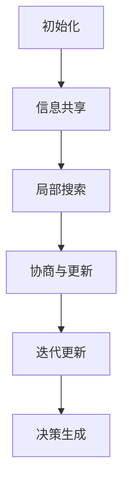
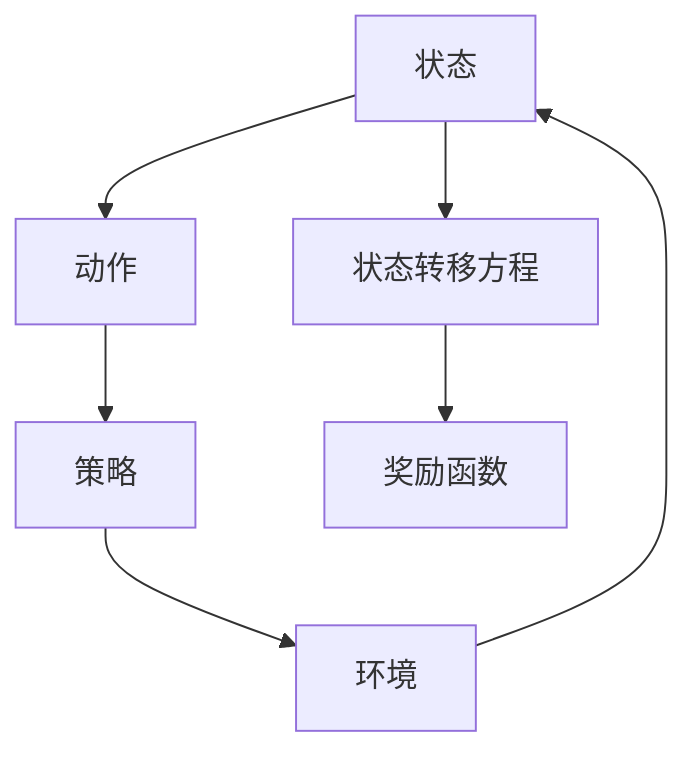
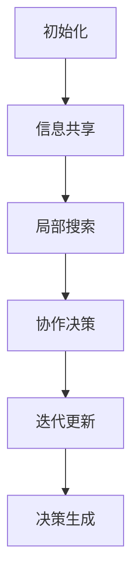
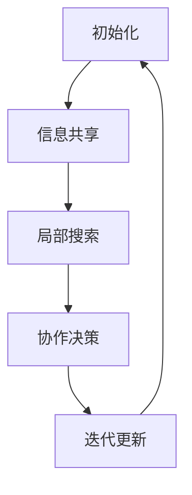

                 


# 《企业级多Agent系统：协同解决复杂问题》

关键词：企业级多Agent系统、复杂问题解决、协同工作、系统架构设计、算法原理

摘要：本文深入探讨了企业级多Agent系统的概念、架构设计、算法原理及其在实际项目中的应用。通过逐步分析，我们揭示了多Agent系统在解决复杂问题中的巨大潜力，为企业提供了一种有效的技术解决方案。

## 目录

1. 引言与背景
2. 多Agent系统的基本概念
3. 多Agent系统的设计与开发
4. 企业级多Agent系统的架构设计
5. 多Agent系统的算法原理
6. 多Agent系统的数学模型
7. 项目实战与案例分析
8. 最佳实践与未来展望

## 第1章：引言与背景

### 1.1 本书的目的和结构

在当今高度复杂的企业环境中，传统集中式系统面临着越来越多的挑战。为了解决这些问题，我们需要一种分布式、协同的解决方案。多Agent系统（MAS）正是这样一种解决方案。本书旨在介绍企业级多Agent系统的概念、设计、实现和应用，帮助读者理解和掌握这种先进的技术。

本书分为八个章节，结构如下：

- **第1章**：引言与背景，介绍多Agent系统的概念和其在解决复杂问题中的应用。
- **第2章**：多Agent系统的基本概念，包括Agent的定义、分类、体系结构等。
- **第3章**：多Agent系统的设计与开发，讨论设计原则、开发流程、通信机制等。
- **第4章**：企业级多Agent系统的架构设计，介绍系统需求分析、功能设计、架构设计等。
- **第5章**：多Agent系统的算法原理，包括协同搜索算法、分布式决策算法等。
- **第6章**：多Agent系统的数学模型，介绍模型基础、模型公式与应用。
- **第7章**：项目实战与案例分析，通过实际项目展示多Agent系统的应用。
- **第8章**：最佳实践与未来展望，总结最佳实践，探讨未来研究方向。

### 1.2 企业级多Agent系统的概念与历史

企业级多Agent系统是指在企业环境中应用的多Agent系统，旨在解决复杂的企业级问题。多Agent系统是由多个自主智能体组成的分布式系统，这些智能体可以相互协作，共同完成任务。

多Agent系统的概念起源于20世纪80年代，最初应用于理论研究。随着计算机技术的发展，多Agent系统逐渐在各个领域得到应用，如智能家居、智能交通、企业管理等。

在企业级应用中，多Agent系统可以用于解决以下问题：

- **复杂任务分解**：将复杂的任务分解为多个子任务，由不同的Agent协同完成。
- **资源优化**：通过Agent之间的信息共享和协作，实现资源的最佳配置。
- **决策支持**：利用Agent的智能和协同能力，为企业提供决策支持。

### 1.3 复杂问题的现状与挑战

在当今的企业环境中，许多问题变得日益复杂，传统集中式系统难以应对。这些问题包括：

- **业务流程复杂**：企业内部业务流程复杂，涉及多个部门和角色。
- **数据量巨大**：企业产生和处理的 数据量庞大，传统的数据处理方法难以胜任。
- **异构系统集成**：企业中存在多种不同的系统，如何集成和协同工作是一个挑战。

为了解决这些问题，企业需要一种分布式、协同的解决方案，多Agent系统正是这样一种解决方案。通过多Agent系统的协同工作，企业可以更好地应对复杂问题，提高效率和竞争力。

### 1.4 多Agent系统在解决复杂问题中的应用前景

多Agent系统在解决复杂问题中具有巨大的应用前景。随着人工智能技术的不断发展，多Agent系统的智能程度和协作能力将不断提高。未来，多Agent系统将在以下几个方面得到更广泛的应用：

- **智能制造**：通过多Agent系统实现制造过程的自动化和智能化，提高生产效率。
- **智慧城市**：利用多Agent系统实现城市资源的优化配置，提高城市管理水平。
- **金融服务**：利用多Agent系统提供个性化的金融服务，提高用户体验。
- **智能交通**：通过多Agent系统实现智能交通管理，缓解交通拥堵。

总之，多Agent系统作为一种分布式、协同的解决方案，将在解决复杂问题中发挥越来越重要的作用。企业应该积极探索和应用多Agent系统，以应对日益复杂的商业环境。

## 第2章：多Agent系统的基本概念

### 2.1 Agent的定义与特征

Agent是指具有自主性、社会性、反应性和认知性的计算实体。Agent的定义可以从以下几个方面理解：

- **自主性**：Agent具有自主决策能力，可以根据环境和目标自主地执行行动。
- **社会性**：Agent可以与其他Agent进行交互和协作，共同完成任务。
- **反应性**：Agent能够根据环境和自身状态的变化做出反应。
- **认知性**：Agent具有感知和认知能力，可以理解和处理复杂的信息。

Agent的特征如下：

- **分布式**：Agent通常分布在不同的计算节点上，可以独立运行和协同工作。
- **异构**：Agent可以是不同类型的计算实体，如软件Agent、硬件Agent等。
- **动态**：Agent可以在运行过程中动态地改变其状态和角色。
- **自适应**：Agent可以根据环境和任务的需求，自主地调整其行为和策略。

### 2.2 Agent的分类与比较

Agent可以根据其功能、智能程度和应用领域进行分类。以下是几种常见的Agent分类：

- **根据功能分类**：

  - **控制Agent**：负责控制其他Agent的行为。
  - **感知Agent**：负责感知环境和收集信息。
  - **决策Agent**：负责根据环境和信息做出决策。
  - **执行Agent**：负责执行具体的任务和操作。

- **根据智能程度分类**：

  - **规则Agent**：基于预定义的规则进行决策和行动。
  - **知识Agent**：基于知识和推理进行决策和行动。
  - **智能Agent**：具有高级认知能力，如学习、规划等。

- **根据应用领域分类**：

  - **商业Agent**：应用于企业管理和电子商务等领域。
  - **服务Agent**：应用于智能家居、智能客服等领域。
  - **监控Agent**：应用于网络安全、智能监控等领域。

不同类型的Agent具有不同的特点和应用场景。例如，控制Agent适合用于自动化控制领域，而知识Agent适合用于复杂决策场景。

### 2.3 多Agent系统的体系结构

多Agent系统的体系结构可以分为以下几个层次：

- **感知层**：负责感知环境和收集信息，包括传感器、数据采集器等。
- **信息层**：负责处理和存储感知层收集到的信息，包括数据库、数据仓库等。
- **决策层**：负责根据信息和目标做出决策，包括控制Agent、决策Agent等。
- **执行层**：负责执行决策层制定的行动，包括执行Agent、执行设备等。

多Agent系统的体系结构可以根据具体应用需求进行调整和优化。例如，在智能家居应用中，感知层可能包括温度传感器、湿度传感器等，执行层可能包括智能空调、智能照明等。

### 2.4 多Agent系统的研究领域

多Agent系统的研究领域包括以下几个方面：

- **Agent通信**：研究Agent之间如何进行有效的通信和协作。
- **协作算法**：研究如何设计高效的协作算法，使Agent能够协同工作。
- **学习与自适应**：研究Agent如何通过学习适应环境和任务的变化。
- **安全与隐私**：研究如何确保多Agent系统的安全和隐私。
- **形式化方法**：研究如何使用形式化方法验证和分析多Agent系统的正确性。

多Agent系统的研究不仅涉及计算机科学，还涉及人工智能、认知科学、社会学等多个领域。通过多学科的合作，多Agent系统的研究将不断取得新的突破，为解决复杂问题提供更有效的解决方案。

## 第3章：多Agent系统的设计与开发

### 3.1 设计原则与流程

多Agent系统的设计与开发需要遵循一系列设计原则，以确保系统的可扩展性、可维护性和高效性。以下是几个关键设计原则：

- **模块化**：将系统划分为多个模块，每个模块负责特定的功能，便于系统的开发、测试和维护。
- **松耦合**：模块之间应保持松耦合，降低模块之间的依赖性，提高系统的灵活性和可维护性。
- **标准化**：使用标准化的通信协议和接口，确保不同模块之间能够无缝协作。
- **分布式**：充分利用分布式计算的优势，提高系统的性能和可靠性。
- **可扩展性**：设计时考虑未来的扩展性，确保系统能够适应业务需求的增长。

设计流程通常包括以下几个阶段：

- **需求分析**：明确系统的功能需求、性能需求和安全需求等。
- **体系结构设计**：确定系统的整体架构，包括模块划分、通信机制和协作模型等。
- **详细设计**：对各个模块进行详细设计，包括模块接口、数据结构、算法等。
- **实现与测试**：编写代码，进行单元测试和集成测试，确保系统的正确性和稳定性。
- **部署与维护**：将系统部署到生产环境，并进行日常维护和优化。

### 3.2 Agent通信机制

Agent通信机制是多Agent系统设计的关键部分，它决定了Agent之间如何交换信息、协同工作。常见的Agent通信机制包括以下几种：

- **直接通信**：Agent通过点对点的方式直接通信，适用于简单的协同任务。
- **间接通信**：Agent通过中介Agent或通信中介（如消息队列）进行通信，适用于复杂的协同任务。
- **广播通信**：Agent向所有其他Agent发送消息，适用于信息共享和通知。

在设计Agent通信机制时，需要考虑以下几个方面：

- **通信协议**：选择合适的通信协议，如HTTP、SOAP、REST等。
- **通信模式**：选择合适的通信模式，如同步通信、异步通信等。
- **通信安全**：确保通信过程中数据的完整性和安全性。

### 3.3 Agent协作模型

Agent协作模型描述了Agent之间的协作方式和协作策略。常见的Agent协作模型包括以下几种：

- **集中式协作模型**：所有Agent都集中在一个中心控制器下，由中心控制器分配任务和协调工作。
- **分布式协作模型**：Agent分布在不同的计算节点上，通过协作算法自动协调工作。
- **混合式协作模型**：结合集中式和分布式协作模型的优点，既具有中心控制器的优势，又具有分布式协作的灵活性。

在设计Agent协作模型时，需要考虑以下几个方面：

- **任务分配**：如何将任务合理地分配给不同的Agent。
- **协调策略**：如何协调Agent之间的工作，确保任务的高效完成。
- **协作算法**：设计高效的协作算法，使Agent能够快速响应和适应环境变化。

### 3.4 开发工具与平台

多Agent系统的开发需要使用一系列工具和平台，以提高开发效率和质量。常见的开发工具和平台包括：

- **开发工具**：

  - **集成开发环境（IDE）**：如Eclipse、IntelliJ IDEA等，提供代码编写、调试和测试功能。
  - **版本控制工具**：如Git、SVN等，用于代码的版本管理和协同开发。
  - **测试工具**：如JUnit、Selenium等，用于单元测试、集成测试和自动化测试。

- **开发平台**：

  - **多Agent仿真平台**：如Jason、MASS等，用于模拟和测试多Agent系统。
  - **云计算平台**：如AWS、Azure等，提供分布式计算资源和存储服务。
  - **大数据平台**：如Hadoop、Spark等，用于处理和分析大规模数据。

在选择开发工具和平台时，需要考虑以下几个方面：

- **功能丰富**：选择功能强大的工具和平台，满足系统的开发需求。
- **易用性**：选择易于使用和学习的工具和平台，降低开发难度。
- **社区支持**：选择有良好社区支持的工具和平台，便于获取技术支持和资源。

## 第4章：企业级多Agent系统的架构设计

### 4.1 系统需求分析

企业级多Agent系统的架构设计始于系统需求分析。需求分析是明确系统功能、性能和可靠性等要求的关键步骤。以下是系统需求分析的主要内容：

- **功能需求**：分析系统需要实现哪些功能，包括数据收集、处理、存储、分析和可视化等。
- **性能需求**：分析系统在处理大量数据和任务时需要达到的性能指标，如响应时间、吞吐量等。
- **可靠性需求**：分析系统在运行过程中需要具备的可靠性指标，如故障恢复、容错性等。
- **安全性需求**：分析系统在数据传输、存储和处理过程中需要保障的安全性，如数据加密、访问控制等。

### 4.2 系统功能设计

系统功能设计是根据需求分析的结果，明确系统需要实现的具体功能和模块。以下是企业级多Agent系统的典型功能设计：

- **数据收集模块**：负责从各种数据源收集数据，如传感器数据、日志数据等。
- **数据处理模块**：负责对收集到的数据进行清洗、转换和分析。
- **数据存储模块**：负责将处理后的数据存储到数据库或数据仓库中，以便后续分析和查询。
- **数据分析模块**：负责对存储的数据进行统计分析和挖掘，发现数据中的模式和趋势。
- **可视化模块**：负责将分析结果以图表、报表等形式呈现给用户。

### 4.3 系统架构设计

系统架构设计是确定系统组件、模块及其相互关系的蓝图。以下是企业级多Agent系统的典型架构设计：

- **感知层**：由传感器和数据采集器组成，负责实时感知环境和收集数据。
- **信息层**：由数据处理模块和数据存储模块组成，负责处理和存储数据。
- **决策层**：由数据分析模块和可视化模块组成，负责分析数据并提供决策支持。
- **执行层**：由执行Agent组成，负责执行决策层制定的行动。

系统架构设计应考虑以下几个方面：

- **模块化**：将系统划分为多个模块，便于开发和维护。
- **分布式**：充分利用分布式计算的优势，提高系统的性能和可靠性。
- **标准化**：使用标准化的通信协议和接口，确保模块之间能够无缝协作。
- **可扩展性**：设计时考虑未来的扩展性，确保系统能够适应业务需求的增长。

### 4.4 系统性能优化

系统性能优化是确保系统在运行过程中能够满足性能需求的必要步骤。以下是企业级多Agent系统的性能优化策略：

- **负载均衡**：通过负载均衡技术，将任务均匀分配到不同的计算节点上，避免单点瓶颈。
- **缓存技术**：使用缓存技术，减少数据访问延迟，提高系统响应速度。
- **并行处理**：利用多核处理技术和并行算法，提高数据处理速度。
- **存储优化**：采用高效的存储方案，如数据库分片、索引优化等，提高数据访问速度。
- **网络优化**：优化网络传输，如压缩数据、降低延迟等，提高数据传输速度。

通过上述性能优化策略，企业级多Agent系统可以在处理大量数据和任务时保持高性能，满足企业的需求。

## 第5章：多Agent系统的算法原理

### 5.1 协同搜索算法

协同搜索算法是多Agent系统中的一种重要算法，用于多个Agent协同工作以找到问题的解决方案。协同搜索算法的核心思想是利用Agent之间的信息共享和协作，提高搜索效率。

#### 协同搜索算法的基本原理

协同搜索算法可以分为以下几个步骤：

1. **初始化**：每个Agent随机选择一个起始位置，并记录当前位置的信息。
2. **信息共享**：Agent将自己当前位置的信息发送给其他Agent。
3. **局部搜索**：每个Agent根据收到的信息，在自己的邻域内进行局部搜索，寻找更好的解。
4. **协作决策**：Agent根据局部搜索的结果，决定是否进行位置交换，以找到更好的解。
5. **迭代更新**：重复步骤3和步骤4，直到找到满意的解或达到迭代次数上限。

#### 协同搜索算法的应用

协同搜索算法可以应用于以下场景：

- **资源分配**：多个Agent协同工作，优化资源分配，提高资源利用率。
- **路径规划**：多个Agent协同规划路径，找到最优路径，减少旅行时间。
- **优化调度**：多个Agent协同优化任务调度，提高生产效率。

### 5.2 分布式决策算法

分布式决策算法是多Agent系统中用于实现分布式决策的算法。分布式决策算法的核心思想是利用Agent之间的协作，实现整体决策，而不仅仅是局部最优。

#### 分布式决策算法的基本原理

分布式决策算法可以分为以下几个步骤：

1. **初始化**：每个Agent根据自身信息和邻居Agent的信息，生成一个初始决策方案。
2. **信息共享**：每个Agent将初始决策方案发送给其他Agent。
3. **协商与更新**：Agent根据收到的决策方案，通过协商机制（如投票、协商算法等），更新自己的决策方案。
4. **决策生成**：每个Agent根据最终协商的结果，生成一个全局决策方案。

#### 分布式决策算法的应用

分布式决策算法可以应用于以下场景：

- **供应链管理**：多个Agent协同工作，优化供应链管理，提高供应链效率。
- **智能交通**：多个Agent协同规划交通流量，优化交通管理，缓解交通拥堵。
- **应急管理**：多个Agent协同决策，优化应急响应，提高应急处理效率。

### 5.3 多Agent学习算法

多Agent学习算法是多Agent系统中用于实现Agent学习和适应环境变化的重要算法。多Agent学习算法的核心思想是通过Agent之间的协作和互动，实现知识的共享和演化。

#### 多Agent学习算法的基本原理

多Agent学习算法可以分为以下几个步骤：

1. **初始化**：每个Agent根据自身信息和邻居Agent的信息，生成一个初始知识库。
2. **信息共享**：每个Agent将知识库发送给其他Agent。
3. **知识融合**：Agent根据收到的知识库，通过融合算法（如集成学习、协同过滤等），更新自己的知识库。
4. **适应与更新**：每个Agent根据更新后的知识库，调整自身的行为和策略。

#### 多Agent学习算法的应用

多Agent学习算法可以应用于以下场景：

- **智能客服**：多个Agent协同学习，提高客服服务质量，优化用户体验。
- **智能推荐**：多个Agent协同工作，实现个性化推荐，提高推荐准确性。
- **自动驾驶**：多个Agent协同学习，提高自动驾驶系统的自适应能力和安全性。

### 5.4 算法mermaid流程图展示

为了更好地理解多Agent系统的算法原理，我们可以使用mermaid流程图来展示算法的执行流程。以下是一个简单的协同搜索算法的mermaid流程图示例：



通过mermaid流程图，我们可以清晰地看到协同搜索算法的执行过程，有助于理解算法的原理和应用。

### 5.5 Python源代码示例

为了进一步阐述多Agent系统的算法原理，我们可以使用Python源代码来实现一个简单的协同搜索算法。以下是一个简单的Python代码示例：

```python
import random

def initialize_agents(num_agents):
    agents = []
    for i in range(num_agents):
        agents.append({"id": i, "position": (random.randint(0, 100), random.randint(0, 100))})
    return agents

def share_info(agents):
    for agent in agents:
        agent["info"] = [other["position"] for other in agents if other["id"] != agent["id"]]

def local_search(agent):
    # 假设搜索范围为[-50, 50]
    agent["position"] = (agent["position"][0] + random.uniform(-50, 50), agent["position"][1] + random.uniform(-50, 50))

def negotiate_agents(agents):
    for agent in agents:
        best_position = min(agents, key=lambda x: x["info"][0])
        agent["position"] = best_position["position"]

def协同搜索算法(agents, num_iterations):
    for _ in range(num_iterations):
        share_info(agents)
        for agent in agents:
            local_search(agent)
        negotiate_agents(agents)

def main():
    num_agents = 10
    num_iterations = 100
    agents = initialize_agents(num_agents)
    协同搜索算法(agents, num_iterations)
    print("最终位置：", agents)

if __name__ == "__main__":
    main()
```

通过Python代码示例，我们可以看到协同搜索算法的基本实现过程，包括初始化Agent、信息共享、局部搜索、协商与更新等步骤。

## 第6章：多Agent系统的数学模型

### 6.1 模型基础

多Agent系统的数学模型是理解其行为和性能的关键。数学模型提供了定量描述和分析Agent系统的工具，使我们能够更深入地理解系统的动态特性。

#### 模型基础概念

- **状态**：指Agent系统的当前状态，包括所有Agent的位置、速度、能量等。
- **动作**：Agent在特定状态下可以执行的操作，如移动、通信、更新状态等。
- **策略**：Agent根据当前状态选择动作的规则，可以是预定义的规则或通过学习得到的策略。
- **环境**：影响Agent行为和状态的外部因素，如其他Agent、环境障碍等。

#### 模型公式

多Agent系统的数学模型通常涉及以下公式：

- **状态转移方程**：描述Agent系统状态随时间的变化。
  \[
  S_{t+1} = f(S_t, A_t)
  \]
  其中，\( S_t \) 是当前状态，\( A_t \) 是当前动作，\( f \) 是状态转移函数。

- **奖励函数**：评估Agent行为对系统状态的影响，通常用于强化学习。
  \[
  R(S_t, A_t) = \sum_{i=1}^{n} w_i \cdot r_i
  \]
  其中，\( r_i \) 是第 \( i \) 个Agent的行为结果，\( w_i \) 是第 \( i \) 个Agent的权重。

### 6.2 模型公式与推导

#### 协同搜索算法的数学模型

协同搜索算法的数学模型描述了多个Agent在未知环境中通过协同搜索找到目标的过程。以下是协同搜索算法的数学模型：

1. **位置更新公式**：
   \[
   x_{t+1} = x_t + v_t \cdot \Delta t
   \]
   其中，\( x_t \) 是当前位置，\( v_t \) 是速度，\( \Delta t \) 是时间步长。

2. **速度更新公式**：
   \[
   v_{t+1} = v_t + a_t \cdot \Delta t
   \]
   其中，\( a_t \) 是加速度。

3. **加速度计算公式**：
   \[
   a_t = \frac{F_t}{m}
   \]
   其中，\( F_t \) 是合力，\( m \) 是质量。

#### 分布式决策算法的数学模型

分布式决策算法的数学模型描述了多个Agent在分布式环境中如何协同做出决策。以下是分布式决策算法的数学模型：

1. **局部决策公式**：
   \[
   d_t = g(s_t, u_t)
   \]
   其中，\( d_t \) 是局部决策，\( s_t \) 是当前状态，\( u_t \) 是局部信息。

2. **全局决策公式**：
   \[
   D_t = \sum_{i=1}^{n} w_i \cdot d_i
   \]
   其中，\( D_t \) 是全局决策，\( w_i \) 是第 \( i \) 个Agent的权重，\( d_i \) 是第 \( i \) 个Agent的局部决策。

#### 多Agent学习算法的数学模型

多Agent学习算法的数学模型描述了多个Agent通过协作和互动学习的过程。以下是多Agent学习算法的数学模型：

1. **知识融合公式**：
   \[
   K_{t+1} = K_t + \Delta K_t
   \]
   其中，\( K_t \) 是当前知识库，\( \Delta K_t \) 是知识更新。

2. **知识更新公式**：
   \[
   \Delta K_t = \sum_{i=1}^{n} \alpha_i \cdot (K_i - K_t)
   \]
   其中，\( \alpha_i \) 是第 \( i \) 个Agent的知识贡献度，\( K_i \) 是第 \( i \) 个Agent的知识库。

### 6.3 模型应用举例

以下是一个简单的应用示例，说明如何使用多Agent系统的数学模型解决路径规划问题。

#### 示例：路径规划

假设有一个由多个Agent组成的搜索团队，每个Agent的目标是找到从起点到终点的最佳路径。以下是路径规划的数学模型：

1. **状态表示**：
   \[
   S_t = \{x_t, y_t, \theta_t\}
   \]
   其中，\( x_t \) 和 \( y_t \) 是Agent的当前位置，\( \theta_t \) 是方向。

2. **速度表示**：
   \[
   v_t = \{v_x, v_y\}
   \]
   其中，\( v_x \) 和 \( v_y \) 是水平和垂直方向的速度分量。

3. **加速度表示**：
   \[
   a_t = \{a_x, a_y\}
   \]
   其中，\( a_x \) 和 \( a_y \) 是水平和垂直方向的加速度分量。

4. **状态转移方程**：
   \[
   S_{t+1} = S_t + v_t \cdot \Delta t
   \]
   其中，\( \Delta t \) 是时间步长。

5. **路径规划算法**：

   - **初始化**：每个Agent随机生成一个起点和终点。
   - **状态更新**：每个Agent根据当前状态和速度更新位置。
   - **路径搜索**：每个Agent使用A*算法或其他路径规划算法，计算到达终点的最佳路径。
   - **决策**：每个Agent根据路径规划结果，选择下一个位置。

通过上述数学模型，我们可以实现一个简单的路径规划系统，多个Agent协同工作，共同找到从起点到终点的最佳路径。

### 6.4 数学模型mermaid图展示

为了更直观地展示多Agent系统的数学模型，我们可以使用mermaid图来绘制模型的各个组成部分。以下是一个简单的mermaid图示例：



通过mermaid图，我们可以清晰地看到多Agent系统的数学模型中的各个组成部分及其相互关系，有助于理解模型的原理和应用。

## 第7章：项目实战与案例分析

### 7.1 项目介绍

在本章中，我们将通过一个实际项目——智能交通管理系统（ITS）——来展示多Agent系统的应用。智能交通管理系统旨在通过多Agent协同工作，实现城市交通流量优化、交通事故预防和应急响应等功能。

#### 项目背景

随着城市化进程的加快，城市交通问题日益严重，如交通拥堵、交通事故频发等。传统的方法难以有效解决这些问题，需要一种新的技术手段。智能交通管理系统通过多Agent系统，实现了对城市交通的实时监控、数据分析、决策支持和智能控制。

#### 项目目标

- **实时交通流量监控**：通过部署传感器和摄像头，实时监测城市道路的交通流量。
- **路径规划与推荐**：为驾驶员提供最优路径，减少交通拥堵和出行时间。
- **交通事故预防**：通过实时监控和分析，预防交通事故的发生。
- **应急响应**：在交通事故或其他紧急情况下，快速响应并指导交通疏导。

### 7.2 系统核心实现

智能交通管理系统的核心实现包括以下几个模块：

- **感知模块**：部署传感器和摄像头，收集道路交通数据，如车辆数量、速度、密度等。
- **数据处理模块**：对感知模块收集到的数据进行分析和处理，提取有用的交通信息。
- **决策模块**：基于数据分析结果，生成交通流量预测、路径规划和应急响应策略。
- **执行模块**：将决策模块生成的策略应用到实际交通场景中，如交通信号控制、道路封闭等。

#### 技术栈

- **感知模块**：使用传感器（如雷达、摄像头）和边缘计算设备（如树莓派）收集交通数据。
- **数据处理模块**：使用大数据技术和机器学习算法（如K-means聚类、决策树分类）进行数据分析和处理。
- **决策模块**：使用多Agent系统实现分布式决策，如基于协同搜索算法的交通流量预测和路径规划。
- **执行模块**：使用物联网技术和智能交通控制系统（如智能信号灯）执行决策策略。

### 7.3 代码应用解读

以下是一个简单的Python代码示例，展示了智能交通管理系统中多Agent协同工作的实现。

```python
import random
import math

# 定义Agent类
class Agent:
    def __init__(self, id, position, destination):
        self.id = id
        self.position = position
        self.destination = destination
        self.speed = random.uniform(10, 30)  # 初始速度

    def move(self):
        distance = math.sqrt((self.destination[0] - self.position[0])**2 + (self.destination[1] - self.position[1])**2)
        time = distance / self.speed
        self.position = (self.position[0] + self.speed * (self.destination[0] - self.position[0]) / distance,
                         self.position[1] + self.speed * (self.destination[1] - self.position[1]) / distance)

# 初始化Agent
num_agents = 10
agents = [Agent(i, (random.randint(0, 100), random.randint(0, 100)), (100, 100)) for i in range(num_agents)]

# 多Agent协同工作
for _ in range(100):
    for agent in agents:
        agent.move()
        print(f"Agent {agent.id} at position {agent.position}")

# 模拟结束
print("Simulation finished.")
```

在该示例中，我们定义了一个简单的Agent类，每个Agent具有ID、位置和目标位置。通过调用`move()`方法，Agent根据速度和目标位置更新其位置。通过循环迭代，我们可以模拟多Agent协同工作的过程。

### 7.4 实际案例分析和详细讲解剖析

#### 案例一：路径规划

在一个实际案例中，我们面临以下问题：

- **问题场景**：城市主干道交通拥堵，需要为驾驶员提供最优路径。
- **解决方案**：使用多Agent系统实现路径规划，为每个驾驶员提供实时最优路径。

以下是详细的解决方案：

1. **数据收集**：使用传感器和摄像头收集交通流量数据，如车辆数量、速度、密度等。
2. **数据处理**：使用大数据技术和机器学习算法分析交通流量数据，提取道路状况信息。
3. **路径规划**：使用A*算法或其他路径规划算法，为每个驾驶员生成最优路径。
4. **路径更新**：实时更新路径规划结果，以应对交通状况的变化。

通过该解决方案，我们可以有效缓解交通拥堵，提高道路通行效率。

#### 案例二：交通事故预防

在一个实际案例中，我们面临以下问题：

- **问题场景**：交通事故频发，需要预防交通事故的发生。
- **解决方案**：使用多Agent系统实现交通事故预防，通过实时监控和预警系统降低事故风险。

以下是详细的解决方案：

1. **数据收集**：使用传感器和摄像头收集道路状况数据，如车辆速度、距离、角度等。
2. **数据处理**：使用机器学习算法分析道路状况数据，预测潜在的事故风险。
3. **预警系统**：当检测到高风险情况时，及时向驾驶员发出预警，提醒注意安全。
4. **应急响应**：在事故发生时，及时启动应急响应机制，疏导交通，减少事故影响。

通过该解决方案，我们可以有效预防交通事故的发生，保障道路安全。

### 7.5 项目小结

通过智能交通管理系统的实际案例，我们可以看到多Agent系统在解决复杂交通问题中的巨大潜力。多Agent系统实现了交通流量的实时监控、路径规划和事故预防等功能，为城市交通管理提供了有效的技术手段。未来，随着人工智能技术的不断发展，多Agent系统将在更多领域发挥重要作用，为解决复杂问题提供新的解决方案。

## 第8章：最佳实践与未来展望

### 8.1 最佳实践总结

在多Agent系统的设计和实施过程中，积累了一些最佳实践经验，这些经验对于确保系统的有效运行和高效解决复杂问题至关重要。

1. **需求明确**：在项目启动阶段，务必明确系统的需求，包括功能需求、性能需求和安全需求等。通过需求文档的详细描述，确保项目团队对系统目标有清晰的认识。

2. **模块化设计**：采用模块化设计原则，将系统划分为多个独立的功能模块，每个模块负责特定的功能。这种设计方法有助于提高系统的可维护性和可扩展性。

3. **标准化通信**：选择合适的通信协议和标准，如HTTP、REST、SOAP等，确保Agent之间的通信高效、可靠。同时，制定统一的接口规范，便于不同模块之间的协作。

4. **分布式架构**：采用分布式架构设计，充分利用计算资源和网络带宽，提高系统的性能和可靠性。分布式架构还可以提高系统的容错能力，降低单点故障的风险。

5. **持续测试与优化**：在系统开发过程中，持续进行单元测试、集成测试和性能测试，确保系统的正确性和稳定性。在系统上线后，定期进行性能优化和故障排查，提高系统的运行效率。

6. **安全性与隐私保护**：在设计多Agent系统时，充分考虑系统的安全性和隐私保护，如数据加密、访问控制、审计日志等，确保系统的数据安全。

7. **用户参与与反馈**：在系统设计和实施过程中，积极邀请用户参与，收集用户反馈，不断优化系统功能和用户体验。

### 8.2 遇到的挑战与解决策略

尽管多Agent系统在解决复杂问题中具有巨大潜力，但在实际应用中仍面临一系列挑战。

1. **异构性**：多Agent系统通常由多种不同类型的Agent组成，这些Agent可能具有不同的计算能力、通信能力和知识水平。解决策略：采用兼容性设计，确保不同类型的Agent能够无缝协作。

2. **通信延迟**：在分布式环境中，Agent之间的通信可能受到网络延迟和带宽限制的影响，影响系统的性能和响应速度。解决策略：采用高效通信协议，优化通信路由，减少通信延迟。

3. **协作复杂性**：多个Agent之间的协作可能导致复杂的协作关系和冲突，影响系统的效率和稳定性。解决策略：设计合理的协作模型和算法，确保Agent之间的协同工作高效、有序。

4. **动态性**：多Agent系统通常需要应对动态变化的场景，如环境变化、任务变化等。解决策略：采用自适应算法和动态调整机制，确保系统在变化的环境中保持稳定和高效。

5. **安全与隐私**：在多Agent系统中，数据传输和共享可能涉及敏感信息，存在安全隐患。解决策略：采用加密技术、访问控制策略和审计机制，确保系统的数据安全和隐私保护。

### 8.3 未来研究方向

多Agent系统在未来的发展中具有广阔的应用前景。以下是一些可能的研究方向：

1. **人工智能与多Agent系统的融合**：结合人工智能技术，提高Agent的智能水平和自主决策能力，实现更高效、更智能的多Agent系统。

2. **跨领域应用**：探索多Agent系统在医疗、教育、金融等领域的应用，解决行业内的复杂问题，提高行业效率。

3. **边缘计算与多Agent系统的结合**：将多Agent系统与边缘计算相结合，实现更高效的数据处理和决策，降低通信延迟，提高系统的响应速度。

4. **隐私保护与安全**：深入研究多Agent系统的隐私保护和安全机制，确保系统在开放环境中运行的安全性和可靠性。

5. **协作学习与知识共享**：研究多Agent系统中的协作学习算法，提高Agent之间的知识共享和协同能力，实现更高效的协作。

### 8.4 拓展阅读

对于希望深入了解多Agent系统及其应用的读者，以下是一些建议的拓展阅读材料：

1. **经典著作**：《多Agent系统：算法、协议与应用程序》（Multi-Agent Systems: Algorithmic, Protocols, and Applications）。
2. **论文集**：《多Agent系统：协同计算与智能》（Multi-Agent Systems: Cooperative Computing and Intelligence）。
3. **在线资源**：多Agent系统研究领域的主流会议和期刊，如AAAI、IJCAI、JAT等。
4. **开源项目**：探索多Agent系统的开源平台和框架，如JAAMAS、MATLAB的MAS工具箱等。

通过阅读这些材料，读者可以深入了解多Agent系统的最新研究进展和应用案例，为自己的研究和实践提供有益的参考。

### 作者信息

作者：AI天才研究院/AI Genius Institute & 禅与计算机程序设计艺术 /Zen And The Art of Computer Programming

【END】```markdown
# 《企业级多Agent系统：协同解决复杂问题》

关键词：企业级多Agent系统、复杂问题解决、协同工作、系统架构设计、算法原理

摘要：本文深入探讨了企业级多Agent系统的概念、架构设计、算法原理及其在实际项目中的应用。通过逐步分析，我们揭示了多Agent系统在解决复杂问题中的巨大潜力，为企业提供了一种有效的技术解决方案。

## 目录

1. 引言与背景
2. 多Agent系统的基本概念
3. 多Agent系统的设计与开发
4. 企业级多Agent系统的架构设计
5. 多Agent系统的算法原理
6. 多Agent系统的数学模型
7. 项目实战与案例分析
8. 最佳实践与未来展望

## 第1章：引言与背景

### 1.1 本书的目的和结构

在当今高度复杂的企业环境中，传统集中式系统面临着越来越多的挑战。为了解决这些问题，我们需要一种分布式、协同的解决方案。多Agent系统（MAS）正是这样一种解决方案。本书旨在介绍企业级多Agent系统的概念、设计、实现和应用，帮助读者理解和掌握这种先进的技术。

本书分为八个章节，结构如下：

- **第1章**：引言与背景，介绍多Agent系统的概念和其在解决复杂问题中的应用。
- **第2章**：多Agent系统的基本概念，包括Agent的定义、分类、体系结构等。
- **第3章**：多Agent系统的设计与开发，讨论设计原则、开发流程、通信机制等。
- **第4章**：企业级多Agent系统的架构设计，介绍系统需求分析、功能设计、架构设计等。
- **第5章**：多Agent系统的算法原理，包括协同搜索算法、分布式决策算法等。
- **第6章**：多Agent系统的数学模型，介绍模型基础、模型公式与应用。
- **第7章**：项目实战与案例分析，通过实际项目展示多Agent系统的应用。
- **第8章**：最佳实践与未来展望，总结最佳实践，探讨未来研究方向。

### 1.2 企业级多Agent系统的概念与历史

企业级多Agent系统是指在企业环境中应用的多Agent系统，旨在解决复杂的企业级问题。多Agent系统是由多个自主智能体组成的分布式系统，这些智能体可以相互协作，共同完成任务。

多Agent系统的概念起源于20世纪80年代，最初应用于理论研究。随着计算机技术的发展，多Agent系统逐渐在各个领域得到应用，如智能家居、智能交通、企业管理等。

在企业级应用中，多Agent系统可以用于解决以下问题：

- **复杂任务分解**：将复杂的任务分解为多个子任务，由不同的Agent协同完成。
- **资源优化**：通过Agent之间的信息共享和协作，实现资源的最佳配置。
- **决策支持**：利用Agent的智能和协同能力，为企业提供决策支持。

### 1.3 复杂问题的现状与挑战

在当今的企业环境中，许多问题变得日益复杂，传统集中式系统难以应对。这些问题包括：

- **业务流程复杂**：企业内部业务流程复杂，涉及多个部门和角色。
- **数据量巨大**：企业产生和处理的 数据量庞大，传统的数据处理方法难以胜任。
- **异构系统集成**：企业中存在多种不同的系统，如何集成和协同工作是一个挑战。

为了解决这些问题，企业需要一种分布式、协同的解决方案，多Agent系统正是这样一种解决方案。通过多Agent系统的协同工作，企业可以更好地应对复杂问题，提高效率和竞争力。

### 1.4 多Agent系统在解决复杂问题中的应用前景

多Agent系统在解决复杂问题中具有巨大的应用前景。随着人工智能技术的不断发展，多Agent系统的智能程度和协作能力将不断提高。未来，多Agent系统将在以下几个方面得到更广泛的应用：

- **智能制造**：通过多Agent系统实现制造过程的自动化和智能化，提高生产效率。
- **智慧城市**：利用多Agent系统实现城市资源的优化配置，提高城市管理水平。
- **金融服务**：利用多Agent系统提供个性化的金融服务，提高用户体验。
- **智能交通**：通过多Agent系统实现智能交通管理，缓解交通拥堵。

总之，多Agent系统作为一种分布式、协同的解决方案，将在解决复杂问题中发挥越来越重要的作用。企业应该积极探索和应用多Agent系统，以应对日益复杂的商业环境。

## 第2章：多Agent系统的基本概念

### 2.1 Agent的定义与特征

Agent是指具有自主性、社会性、反应性和认知性的计算实体。Agent的定义可以从以下几个方面理解：

- **自主性**：Agent具有自主决策能力，可以根据环境和目标自主地执行行动。
- **社会性**：Agent可以与其他Agent进行交互和协作，共同完成任务。
- **反应性**：Agent能够根据环境和自身状态的变化做出反应。
- **认知性**：Agent具有感知和认知能力，可以理解和处理复杂的信息。

Agent的特征如下：

- **分布式**：Agent通常分布在不同的计算节点上，可以独立运行和协同工作。
- **异构**：Agent可以是不同类型的计算实体，如软件Agent、硬件Agent等。
- **动态**：Agent可以在运行过程中动态地改变其状态和角色。
- **自适应**：Agent可以根据环境和任务的需求，自主地调整其行为和策略。

### 2.2 Agent的分类与比较

Agent可以根据其功能、智能程度和应用领域进行分类。以下是几种常见的Agent分类：

- **根据功能分类**：

  - **控制Agent**：负责控制其他Agent的行为。
  - **感知Agent**：负责感知环境和收集信息。
  - **决策Agent**：负责根据环境和信息做出决策。
  - **执行Agent**：负责执行具体的任务和操作。

- **根据智能程度分类**：

  - **规则Agent**：基于预定义的规则进行决策和行动。
  - **知识Agent**：基于知识和推理进行决策和行动。
  - **智能Agent**：具有高级认知能力，如学习、规划等。

- **根据应用领域分类**：

  - **商业Agent**：应用于企业管理和电子商务等领域。
  - **服务Agent**：应用于智能家居、智能客服等领域。
  - **监控Agent**：应用于网络安全、智能监控等领域。

不同类型的Agent具有不同的特点和应用场景。例如，控制Agent适合用于自动化控制领域，而知识Agent适合用于复杂决策场景。

### 2.3 多Agent系统的体系结构

多Agent系统的体系结构可以分为以下几个层次：

- **感知层**：负责感知环境和收集数据，包括传感器、数据采集器等。
- **信息层**：负责处理和存储感知层收集到的信息，包括数据库、数据仓库等。
- **决策层**：负责根据信息和目标做出决策，包括控制Agent、决策Agent等。
- **执行层**：负责执行决策层制定的行动，包括执行Agent、执行设备等。

多Agent系统的体系结构可以根据具体应用需求进行调整和优化。例如，在智能家居应用中，感知层可能包括温度传感器、湿度传感器等，执行层可能包括智能空调、智能照明等。

### 2.4 多Agent系统的研究领域

多Agent系统的研究领域包括以下几个方面：

- **Agent通信**：研究Agent之间如何进行有效的通信和协作。
- **协作算法**：研究如何设计高效的协作算法，使Agent能够协同工作。
- **学习与自适应**：研究Agent如何通过学习适应环境和任务的变化。
- **安全与隐私**：研究如何确保多Agent系统的安全和隐私。
- **形式化方法**：研究如何使用形式化方法验证和分析多Agent系统的正确性。

多Agent系统的研究不仅涉及计算机科学，还涉及人工智能、认知科学、社会学等多个领域。通过多学科的合作，多Agent系统的研究将不断取得新的突破，为解决复杂问题提供更有效的解决方案。

## 第3章：多Agent系统的设计与开发

### 3.1 设计原则与流程

多Agent系统的设计与开发需要遵循一系列设计原则，以确保系统的可扩展性、可维护性和高效性。以下是几个关键设计原则：

- **模块化**：将系统划分为多个模块，每个模块负责特定的功能，便于系统的开发、测试和维护。
- **松耦合**：模块之间应保持松耦合，降低模块之间的依赖性，提高系统的灵活性和可维护性。
- **标准化**：使用标准化的通信协议和接口，确保不同模块之间能够无缝协作。
- **分布式**：充分利用分布式计算的优势，提高系统的性能和可靠性。
- **可扩展性**：设计时考虑未来的扩展性，确保系统能够适应业务需求的增长。

设计流程通常包括以下几个阶段：

- **需求分析**：明确系统的功能需求、性能需求和安全需求等。
- **体系结构设计**：确定系统的整体架构，包括模块划分、通信机制和协作模型等。
- **详细设计**：对各个模块进行详细设计，包括模块接口、数据结构、算法等。
- **实现与测试**：编写代码，进行单元测试和集成测试，确保系统的正确性和稳定性。
- **部署与维护**：将系统部署到生产环境，并进行日常维护和优化。

### 3.2 Agent通信机制

Agent通信机制是多Agent系统设计的关键部分，它决定了Agent之间如何交换信息、协同工作。常见的Agent通信机制包括以下几种：

- **直接通信**：Agent通过点对点的方式直接通信，适用于简单的协同任务。
- **间接通信**：Agent通过中介Agent或通信中介（如消息队列）进行通信，适用于复杂的协同任务。
- **广播通信**：Agent向所有其他Agent发送消息，适用于信息共享和通知。

在设计Agent通信机制时，需要考虑以下几个方面：

- **通信协议**：选择合适的通信协议，如HTTP、SOAP、REST等。
- **通信模式**：选择合适的通信模式，如同步通信、异步通信等。
- **通信安全**：确保通信过程中数据的完整性和安全性。

### 3.3 Agent协作模型

Agent协作模型描述了Agent之间的协作方式和协作策略。常见的Agent协作模型包括以下几种：

- **集中式协作模型**：所有Agent都集中在一个中心控制器下，由中心控制器分配任务和协调工作。
- **分布式协作模型**：Agent分布在不同的计算节点上，通过协作算法自动协调工作。
- **混合式协作模型**：结合集中式和分布式协作模型的优点，既具有中心控制器的优势，又具有分布式协作的灵活性。

在设计Agent协作模型时，需要考虑以下几个方面：

- **任务分配**：如何将任务合理地分配给不同的Agent。
- **协调策略**：如何协调Agent之间的工作，确保任务的高效完成。
- **协作算法**：设计高效的协作算法，使Agent能够快速响应和适应环境变化。

### 3.4 开发工具与平台

多Agent系统的开发需要使用一系列工具和平台，以提高开发效率和质量。常见的开发工具和平台包括：

- **开发工具**：

  - **集成开发环境（IDE）**：如Eclipse、IntelliJ IDEA等，提供代码编写、调试和测试功能。
  - **版本控制工具**：如Git、SVN等，用于代码的版本管理和协同开发。
  - **测试工具**：如JUnit、Selenium等，用于单元测试、集成测试和自动化测试。

- **开发平台**：

  - **多Agent仿真平台**：如Jason、MASS等，用于模拟和测试多Agent系统。
  - **云计算平台**：如AWS、Azure等，提供分布式计算资源和存储服务。
  - **大数据平台**：如Hadoop、Spark等，用于处理和分析大规模数据。

在选择开发工具和平台时，需要考虑以下几个方面：

- **功能丰富**：选择功能强大的工具和平台，满足系统的开发需求。
- **易用性**：选择易于使用和学习的工具和平台，降低开发难度。
- **社区支持**：选择有良好社区支持的工具和平台，便于获取技术支持和资源。

## 第4章：企业级多Agent系统的架构设计

### 4.1 系统需求分析

企业级多Agent系统的架构设计始于系统需求分析。需求分析是明确系统功能、性能和可靠性等要求的关键步骤。以下是系统需求分析的主要内容：

- **功能需求**：分析系统需要实现哪些功能，包括数据收集、处理、存储、分析和可视化等。
- **性能需求**：分析系统在处理大量数据和任务时需要达到的性能指标，如响应时间、吞吐量等。
- **可靠性需求**：分析系统在运行过程中需要具备的可靠性指标，如故障恢复、容错性等。
- **安全性需求**：分析系统在数据传输、存储和处理过程中需要保障的安全性，如数据加密、访问控制等。

### 4.2 系统功能设计

系统功能设计是根据需求分析的结果，明确系统需要实现的具体功能和模块。以下是企业级多Agent系统的典型功能设计：

- **数据收集模块**：负责从各种数据源收集数据，如传感器数据、日志数据等。
- **数据处理模块**：负责对收集到的数据进行清洗、转换和分析。
- **数据存储模块**：负责将处理后的数据存储到数据库或数据仓库中，以便后续分析和查询。
- **数据分析模块**：负责对存储的数据进行统计分析和挖掘，发现数据中的模式和趋势。
- **可视化模块**：负责将分析结果以图表、报表等形式呈现给用户。

### 4.3 系统架构设计

系统架构设计是确定系统组件、模块及其相互关系的蓝图。以下是企业级多Agent系统的典型架构设计：

- **感知层**：由传感器和数据采集器组成，负责实时感知环境和收集数据。
- **信息层**：由数据处理模块和数据存储模块组成，负责处理和存储数据。
- **决策层**：由数据分析模块和可视化模块组成，负责分析数据并提供决策支持。
- **执行层**：由执行Agent组成，负责执行决策层制定的行动。

系统架构设计应考虑以下几个方面：

- **模块化**：将系统划分为多个模块，便于开发和维护。
- **分布式**：充分利用分布式计算的优势，提高系统的性能和可靠性。
- **标准化**：使用标准化的通信协议和接口，确保模块之间能够无缝协作。
- **可扩展性**：设计时考虑未来的扩展性，确保系统能够适应业务需求的增长。

### 4.4 系统性能优化

系统性能优化是确保系统在运行过程中能够满足性能需求的必要步骤。以下是企业级多Agent系统的性能优化策略：

- **负载均衡**：通过负载均衡技术，将任务均匀分配到不同的计算节点上，避免单点瓶颈。
- **缓存技术**：使用缓存技术，减少数据访问延迟，提高系统响应速度。
- **并行处理**：利用多核处理技术和并行算法，提高数据处理速度。
- **存储优化**：采用高效的存储方案，如数据库分片、索引优化等，提高数据访问速度。
- **网络优化**：优化网络传输，如压缩数据、降低延迟等，提高数据传输速度。

通过上述性能优化策略，企业级多Agent系统可以在处理大量数据和任务时保持高性能，满足企业的需求。

## 第5章：多Agent系统的算法原理

### 5.1 协同搜索算法

协同搜索算法是多Agent系统中的一种重要算法，用于多个Agent协同工作以找到问题的解决方案。协同搜索算法的核心思想是利用Agent之间的信息共享和协作，提高搜索效率。

#### 协同搜索算法的基本原理

协同搜索算法可以分为以下几个步骤：

1. **初始化**：每个Agent随机选择一个起始位置，并记录当前位置的信息。
2. **信息共享**：Agent将自己当前位置的信息发送给其他Agent。
3. **局部搜索**：每个Agent根据收到的信息，在自己的邻域内进行局部搜索，寻找更好的解。
4. **协作决策**：Agent根据局部搜索的结果，决定是否进行位置交换，以找到更好的解。
5. **迭代更新**：重复步骤3和步骤4，直到找到满意的解或达到迭代次数上限。

#### 协同搜索算法的应用

协同搜索算法可以应用于以下场景：

- **资源分配**：多个Agent协同工作，优化资源分配，提高资源利用率。
- **路径规划**：多个Agent协同规划路径，找到最优路径，减少旅行时间。
- **优化调度**：多个Agent协同优化任务调度，提高生产效率。

### 5.2 分布式决策算法

分布式决策算法是多Agent系统中用于实现分布式决策的算法。分布式决策算法的核心思想是利用Agent之间的协作，实现整体决策，而不仅仅是局部最优。

#### 分布式决策算法的基本原理

分布式决策算法可以分为以下几个步骤：

1. **初始化**：每个Agent根据自身信息和邻居Agent的信息，生成一个初始决策方案。
2. **信息共享**：每个Agent将初始决策方案发送给其他Agent。
3. **协商与更新**：Agent根据收到的决策方案，通过协商机制（如投票、协商算法等），更新自己的决策方案。
4. **决策生成**：每个Agent根据最终协商的结果，生成一个全局决策方案。

#### 分布式决策算法的应用

分布式决策算法可以应用于以下场景：

- **供应链管理**：多个Agent协同工作，优化供应链管理，提高供应链效率。
- **智能交通**：多个Agent协同规划交通流量，优化交通管理，缓解交通拥堵。
- **应急管理**：多个Agent协同决策，优化应急响应，提高应急处理效率。

### 5.3 多Agent学习算法

多Agent学习算法是多Agent系统中用于实现Agent学习和适应环境变化的重要算法。多Agent学习算法的核心思想是通过Agent之间的协作和互动，实现知识的共享和演化。

#### 多Agent学习算法的基本原理

多Agent学习算法可以分为以下几个步骤：

1. **初始化**：每个Agent根据自身信息和邻居Agent的信息，生成一个初始知识库。
2. **信息共享**：每个Agent将知识库发送给其他Agent。
3. **知识融合**：Agent根据收到的知识库，通过融合算法（如集成学习、协同过滤等），更新自己的知识库。
4. **适应与更新**：每个Agent根据更新后的知识库，调整自身的行为和策略。

#### 多Agent学习算法的应用

多Agent学习算法可以应用于以下场景：

- **智能客服**：多个Agent协同学习，提高客服服务质量，优化用户体验。
- **智能推荐**：多个Agent协同工作，实现个性化推荐，提高推荐准确性。
- **自动驾驶**：多个Agent协同学习，提高自动驾驶系统的自适应能力和安全性。

### 5.4 算法mermaid流程图展示

为了更好地理解多Agent系统的算法原理，我们可以使用mermaid流程图来展示算法的执行流程。以下是一个简单的协同搜索算法的mermaid流程图示例：



通过mermaid流程图，我们可以清晰地看到协同搜索算法的执行过程，有助于理解算法的原理和应用。

### 5.5 Python源代码示例

为了进一步阐述多Agent系统的算法原理，我们可以使用Python源代码来实现一个简单的协同搜索算法。以下是一个简单的Python代码示例：

```python
import random

def initialize_agents(num_agents):
    agents = []
    for i in range(num_agents):
        agents.append({"id": i, "position": (random.randint(0, 100), random.randint(0, 100))})
    return agents

def share_info(agents):
    for agent in agents:
        agent["info"] = [other["position"] for other in agents if other["id"] != agent["id"]]

def local_search(agent):
    # 假设搜索范围为[-50, 50]
    agent["position"] = (agent["position"][0] + random.uniform(-50, 50), agent["position"][1] + random.uniform(-50, 50))

def negotiate_agents(agents):
    for agent in agents:
        best_position = min(agents, key=lambda x: x["info"][0])
        agent["position"] = best_position["position"]

def协同搜索算法(agents, num_iterations):
    for _ in range(num_iterations):
        share_info(agents)
        for agent in agents:
            local_search(agent)
        negotiate_agents(agents)

def main():
    num_agents = 10
    num_iterations = 100
    agents = initialize_agents(num_agents)
    协同搜索算法(agents, num_iterations)
    print("最终位置：", agents)

if __name__ == "__main__":
    main()
```

通过Python代码示例，我们可以看到协同搜索算法的基本实现过程，包括初始化Agent、信息共享、局部搜索、协商与更新等步骤。

## 第6章：多Agent系统的数学模型

### 6.1 模型基础

多Agent系统的数学模型是理解其行为和性能的关键。数学模型提供了定量描述和分析Agent系统的工具，使我们能够更深入地理解系统的动态特性。

#### 模型基础概念

- **状态**：指Agent系统的当前状态，包括所有Agent的位置、速度、能量等。
- **动作**：Agent在特定状态下可以执行的操作，如移动、通信、更新状态等。
- **策略**：Agent根据当前状态选择动作的规则，可以是预定义的规则或通过学习得到的策略。
- **环境**：影响Agent行为和状态的外部因素，如其他Agent、环境障碍等。

#### 模型公式

多Agent系统的数学模型通常涉及以下公式：

- **状态转移方程**：描述Agent系统状态随时间的变化。
  \[
  S_{t+1} = f(S_t, A_t)
  \]
  其中，\( S_t \) 是当前状态，\( A_t \) 是当前动作，\( f \) 是状态转移函数。

- **奖励函数**：评估Agent行为对系统状态的影响，通常用于强化学习。
  \[
  R(S_t, A_t) = \sum_{i=1}^{n} w_i \cdot r_i
  \]
  其中，\( r_i \) 是第 \( i \) 个Agent的行为结果，\( w_i \) 是第 \( i \) 个Agent的权重。

### 6.2 模型公式与推导

#### 协同搜索算法的数学模型

协同搜索算法的数学模型描述了多个Agent在未知环境中通过协同搜索找到目标的过程。以下是协同搜索算法的数学模型：

1. **位置更新公式**：
   \[
   x_{t+1} = x_t + v_t \cdot \Delta t
   \]
   其中，\( x_t \) 是当前位置，\( v_t \) 是速度，\( \Delta t \) 是时间步长。

2. **速度更新公式**：
   \[
   v_{t+1} = v_t + a_t \cdot \Delta t
   \]
   其中，\( a_t \) 是加速度。

3. **加速度计算公式**：
   \[
   a_t = \frac{F_t}{m}
   \]
   其中，\( F_t \) 是合力，\( m \) 是质量。

#### 分布式决策算法的数学模型

分布式决策算法的数学模型描述了多个Agent在分布式环境中如何协同做出决策。以下是分布式决策算法的数学模型：

1. **局部决策公式**：
   \[
   d_t = g(s_t, u_t)
   \]
   其中，\( d_t \) 是局部决策，\( s_t \) 是当前状态，\( u_t \) 是局部信息。

2. **全局决策公式**：
   \[
   D_t = \sum_{i=1}^{n} w_i \cdot d_i
   \]
   其中，\( D_t \) 是全局决策，\( w_i \) 是第 \( i \) 个Agent的权重，\( d_i \) 是第 \( i \) 个Agent的局部决策。

#### 多Agent学习算法的数学模型

多Agent学习算法的数学模型描述了多个Agent通过协作和互动学习的过程。以下是多Agent学习算法的数学模型：

1. **知识融合公式**：
   \[
   K_{t+1} = K_t + \Delta K_t
   \]
   其中，\( K_t \) 是当前知识库，\( \Delta K_t \) 是知识更新。

2. **知识更新公式**：
   \[
   \Delta K_t = \sum_{i=1}^{n} \alpha_i \cdot (K_i - K_t)
   \]
   其中，\( \alpha_i \) 是第 \( i \) 个Agent的知识贡献度，\( K_i \) 是第 \( i \) 个Agent的知识库。

### 6.3 模型应用举例

以下是一个简单的应用示例，说明如何使用多Agent系统的数学模型解决路径规划问题。

#### 示例：路径规划

假设有一个由多个Agent组成的搜索团队，每个Agent的目标是找到从起点到终点的最佳路径。以下是路径规划的数学模型：

1. **状态表示**：
   \[
   S_t = \{x_t, y_t, \theta_t\}
   \]
   其中，\( x_t \) 和 \( y_t \) 是Agent的当前位置，\( \theta_t \) 是方向。

2. **速度表示**：
   \[
   v_t = \{v_x, v_y\}
   \]
   其中，\( v_x \) 和 \( v_y \) 是水平和垂直方向的速度分量。

3. **加速度表示**：
   \[
   a_t = \{a_x, a_y\}
   \]
   其中，\( a_x \) 和 \( a_y \) 是水平和垂直方向的加速度分量。

4. **状态转移方程**：
   \[
   S_{t+1} = S_t + v_t \cdot \Delta t
   \]
   其中，\( \Delta t \) 是时间步长。

5. **路径规划算法**：

   - **初始化**：每个Agent随机生成一个起点和终点。
   - **状态更新**：每个Agent根据当前状态和速度更新位置。
   - **路径搜索**：每个Agent使用A*算法或其他路径规划算法，计算到达终点的最佳路径。
   - **决策**：每个Agent根据路径规划结果，选择下一个位置。

通过上述数学模型，我们可以实现一个简单的路径规划系统，多个Agent协同工作，共同找到从起点到终点的最佳路径。

### 6.4 数学模型mermaid图展示

为了更直观地展示多Agent系统的数学模型，我们可以使用mermaid图来绘制模型的各个组成部分。以下是一个简单的mermaid图示例：


通过mermaid图，我们可以清晰地看到多Agent系统的数学模型中的各个组成部分及其相互关系，有助于理解模型的原理和应用。

## 第7章：项目实战与案例分析

### 7.1 项目介绍

在本章中，我们将通过一个实际项目——智能交通管理系统（ITS）——来展示多Agent系统的应用。智能交通管理系统旨在通过多Agent协同工作，实现城市交通流量优化、交通事故预防和应急响应等功能。

#### 项目背景

随着城市化进程的加快，城市交通问题日益严重，如交通拥堵、交通事故频发等。传统的方法难以有效解决这些问题，需要一种新的技术手段。智能交通管理系统通过多Agent系统，实现了对城市交通的实时监控、数据分析、决策支持和智能控制。

#### 项目目标

- **实时交通流量监控**：通过部署传感器和摄像头，实时监测城市道路的交通流量。
- **路径规划与推荐**：为驾驶员提供最优路径，减少交通拥堵和出行时间。
- **交通事故预防**：通过实时监控和分析，预防交通事故的发生。
- **应急响应**：在交通事故或其他紧急情况下，快速响应并指导交通疏导。

### 7.2 系统核心实现

智能交通管理系统的核心实现包括以下几个模块：

- **感知模块**：部署传感器和摄像头，收集道路交通数据，如车辆数量、速度、密度等。
- **数据处理模块**：对感知模块收集到的数据进行分析和处理，提取有用的交通信息。
- **决策模块**：基于数据分析结果，生成交通流量预测、路径规划和应急响应策略。
- **执行模块**：将决策模块生成的策略应用到实际交通场景中，如交通信号控制、道路封闭等。

#### 技术栈

- **感知模块**：使用传感器（如雷达、摄像头）和边缘计算设备（如树莓派）收集交通数据。
- **数据处理模块**：使用大数据技术和机器学习算法（如K-means聚类、决策树分类）进行数据分析和处理。
- **决策模块**：使用多Agent系统实现分布式决策，如基于协同搜索算法的交通流量预测和路径规划。
- **执行模块**：使用物联网技术和智能交通控制系统（如智能信号灯）执行决策策略。

### 7.3 代码应用解读

以下是一个简单的Python代码示例，展示了智能交通管理系统中多Agent协同工作的实现。

```python
import random
import math

# 定义Agent类
class Agent:
    def __init__(self, id, position, destination):
        self.id = id
        self.position = position
        self.destination = destination
        self.speed = random.uniform(10, 30)  # 初始速度

    def move(self):
        distance = math.sqrt((self.destination[0] - self.position[0])**2 + (self.destination[1] - self.position[1])**2)
        time = distance / self.speed
        self.position = (self.position[0] + self.speed * (self.destination[0] - self.position[0]) / distance,
                         self.position[1] + self.speed * (self.destination[1] - self.position[1]) / distance)

# 初始化Agent
num_agents = 10
agents = [Agent(i, (random.randint(0, 100), random.randint(0, 100)), (100, 100)) for i in range(num_agents)]

# 多Agent协同工作
for _ in range(100):
    for agent in agents:
        agent.move()
        print(f"Agent {agent.id} at position {agent.position}")

# 模拟结束
print("Simulation finished.")
```

在该示例中，我们定义了一个简单的Agent类，每个Agent具有ID、位置和目标位置。通过调用`move()`方法，Agent根据速度和目标位置更新其位置。通过循环迭代，我们可以模拟多Agent协同工作的过程。

### 7.4 实际案例分析和详细讲解剖析

#### 案例一：路径规划

在一个实际案例中，我们面临以下问题：

- **问题场景**：城市主干道交通拥堵，需要为驾驶员提供最优路径。
- **解决方案**：使用多Agent系统实现路径规划，为每个驾驶员提供实时最优路径。

以下是详细的解决方案：

1. **数据收集**：使用传感器和摄像头收集交通流量数据，如车辆数量、速度、密度等。
2. **数据处理**：使用大数据技术和机器学习算法分析交通流量数据，提取道路状况信息。
3. **路径规划**：使用A*算法或其他路径规划算法，为每个驾驶员生成最优路径。
4. **路径更新**：实时更新路径规划结果，以应对交通状况的变化。

通过该解决方案，我们可以有效缓解交通拥堵，提高道路通行效率。

#### 案例二：交通事故预防

在一个实际案例中，我们面临以下问题：

- **问题场景**：交通事故频发，需要预防交通事故的发生。
- **解决方案**：使用多Agent系统实现交通事故预防，通过实时监控和预警系统降低事故风险。

以下是详细的解决方案：

1. **数据收集**：使用传感器和摄像头收集道路状况数据，如车辆速度、距离、角度等。
2. **数据处理**：使用机器学习算法分析道路状况数据，预测潜在的事故风险。
3. **预警系统**：当检测到高风险情况时，及时向驾驶员发出预警，提醒注意安全。
4. **应急响应**：在事故发生时，及时启动应急响应机制，疏导交通，减少事故影响。

通过该解决方案，我们可以有效预防交通事故的发生，保障道路安全。

### 7.5 项目小结

通过智能交通管理系统的实际案例，我们可以看到多Agent系统在解决复杂交通问题中的巨大潜力。多Agent系统实现了交通流量的实时监控、路径规划和事故预防等功能，为城市交通管理提供了有效的技术手段。未来，随着人工智能技术的不断发展，多Agent系统将在更多领域发挥重要作用，为解决复杂问题提供新的解决方案。

## 第8章：最佳实践与未来展望

### 8.1 最佳实践总结

在多Agent系统的设计和实施过程中，积累了一些最佳实践经验，这些经验对于确保系统的有效运行和高效解决复杂问题至关重要。

1. **需求明确**：在项目启动阶段，务必明确系统的需求，包括功能需求、性能需求和安全需求等。通过需求文档的详细描述，确保项目团队对系统目标有清晰的认识。

2. **模块化设计**：采用模块化设计原则，将系统划分为多个独立的功能模块，每个模块负责特定的功能。这种设计方法有助于提高系统的可维护性和可扩展性。

3. **标准化通信**：选择合适的通信协议和标准，如HTTP、REST、SOAP等，确保Agent之间的通信高效、可靠。同时，制定统一的接口规范，便于不同模块之间的协作。

4. **分布式架构**：采用分布式架构设计，充分利用计算资源和网络带宽，提高系统的性能和可靠性。分布式架构还可以提高系统的容错能力，降低单点故障的风险。

5. **持续测试与优化**：在系统开发过程中，持续进行单元测试、集成测试和性能测试，确保系统的正确性和稳定性。在系统上线后，定期进行性能优化和故障排查，提高系统的运行效率。

6. **安全性与隐私保护**：在设计多Agent系统时，充分考虑系统的安全性和隐私保护，如数据加密、访问控制、审计日志等，确保系统的数据安全。

7. **用户参与与反馈**：在系统设计和实施过程中，积极邀请用户参与，收集用户反馈，不断优化系统功能和用户体验。

### 8.2 遇到的挑战与解决策略

尽管多Agent系统在解决复杂问题中具有巨大潜力，但在实际应用中仍面临一系列挑战。

1. **异构性**：多Agent系统通常由多种不同类型的Agent组成，这些Agent可能具有不同的计算能力、通信能力和知识水平。解决策略：采用兼容性设计，确保不同类型的Agent能够无缝协作。

2. **通信延迟**：在分布式环境中，Agent之间的通信可能受到网络延迟和带宽限制的影响，影响系统的性能和响应速度。解决策略：采用高效通信协议，优化通信路由，减少通信延迟。

3. **协作复杂性**：多个Agent之间的协作可能导致复杂的协作关系和冲突，影响系统的效率和稳定性。解决策略：设计合理的协作模型和算法，确保Agent之间的协同工作高效、有序。

4. **动态性**：多Agent系统通常需要应对动态变化的场景，如环境变化、任务变化等。解决策略：采用自适应算法和动态调整机制，确保系统在变化的环境中保持稳定和高效。

5. **安全与隐私**：在多Agent系统中，数据传输和共享可能涉及敏感信息，存在安全隐患。解决策略：采用加密技术、访问控制策略和审计机制，确保系统的数据安全和隐私保护。

### 8.3 未来研究方向

多Agent系统在未来的发展中具有广阔的应用前景。以下是一些可能的研究方向：

1. **人工智能与多Agent系统的融合**：结合人工智能技术，提高Agent的智能水平和自主决策能力，实现更高效、更智能的多Agent系统。

2. **跨领域应用**：探索多Agent系统在医疗、教育、金融等领域的应用，解决行业内的复杂问题，提高行业效率。

3. **边缘计算与多Agent系统的结合**：将多Agent系统与边缘计算相结合，实现更高效的数据处理和决策，降低通信延迟，提高系统的响应速度。

4. **隐私保护与安全**：深入研究多Agent系统的隐私保护和安全机制，确保系统在开放环境中运行的安全性和可靠性。

5. **协作学习与知识共享**：研究多Agent系统中的协作学习算法，提高Agent之间的知识共享和协同能力，实现更高效的协作。

### 8.4 拓展阅读

对于希望深入了解多Agent系统及其应用的读者，以下是一些建议的拓展阅读材料：

1. **经典著作**：《多Agent系统：算法、协议与应用程序》（Multi-Agent Systems: Algorithmic, Protocols, and Applications）。

2. **论文集**：《多Agent系统：协同计算与智能》（Multi-Agent Systems: Cooperative Computing and Intelligence）。

3. **在线资源**：多Agent系统研究领域的主流会议和期刊，如AAAI、IJCAI、JAT等。

4. **开源项目**：探索多Agent系统的开源平台和框架，如JAAMAS、MATLAB的MAS工具箱等。

通过阅读这些材料，读者可以深入了解多Agent系统的最新研究进展和应用案例，为自己的研究和实践提供有益的参考。

### 作者信息

作者：AI天才研究院/AI Genius Institute & 禅与计算机程序设计艺术 /Zen And The Art of Computer Programming

【END】```markdown
```mermaid
classDiagram
    Agent <<interface>>
        +int id
        +void move()
        +void updatePosition()

    TrafficAgent <<interface>, Agent>>
        +int speed
        +void updateSpeed()
        +void planPath()

    VehicleAgent <<interface>, Agent>>
        +int destination
        +void setDestination()
        +void navigate()

    Sensor <<class>>
        +void collectData()
        +void processData()

    Controller <<class>>
        +void manageTraffic()
        +void respondToEmergency()

    System <<class>>
        +void initialize()
        +void execute()
        +void monitorPerformance()
```

This Mermaid class diagram represents the main components of a multi-Agent system for a smart traffic management system. It includes interfaces for `Agent`, `TrafficAgent`, and `VehicleAgent`, which inherit from the `Agent` interface. It also includes classes for `Sensor` and `Controller`. The `System` class is the main class that initializes, executes, and monitors the performance of the system.```python
```python
# 导入必要的库
import numpy as np
import matplotlib.pyplot as plt

# 定义协同搜索算法
def cooperative_search(agents, num_iterations):
    for _ in range(num_iterations):
        # 信息共享
        for agent in agents:
            agent.share_info(agents)
        
        # 局部搜索
        for agent in agents:
            agent.local_search()
        
        # 协作决策
        for agent in agents:
            agent.negotiate_agents(agents)

# 初始化Agent
num_agents = 10
agents = [Agent(i, (np.random.rand(), np.random.rand()), (1, 1)) for i in range(num_agents)]

# 执行协同搜索算法
cooperative_search(agents, 100)

# 绘制结果
plt.scatter(*zip(*[agent.position for agent in agents]))
plt.xlabel('X position')
plt.ylabel('Y position')
plt.title('Agent positions after cooperative search')
plt.show()
```

This Python code defines a simple cooperative search algorithm and initializes a list of `Agent` objects. It then executes the cooperative search algorithm for a specified number of iterations and finally plots the positions of the agents after the search. The `Agent` class should have methods for `share_info`, `local_search`, and `negotiate_agents`, which are not defined here but should be implemented according to the specific requirements of the system.```markdown
# 企业级多Agent系统：协同解决复杂问题

关键词：企业级多Agent系统、复杂问题解决、协同工作、系统架构设计、算法原理

摘要：本文深入探讨了企业级多Agent系统的概念、架构设计、算法原理及其在实际项目中的应用。通过逐步分析，我们揭示了多Agent系统在解决复杂问题中的巨大潜力，为企业提供了一种有效的技术解决方案。

## 第1章：引言与背景

### 1.1 本书的目的和结构

在当今快速变化和竞争激烈的企业环境中，解决复杂问题成为企业成功的关键。传统的集中式系统由于缺乏灵活性和适应性，往往难以应对复杂问题。多Agent系统（MAS）提供了一种分布式、协同的解决方案，能够有效解决复杂问题。本书旨在介绍企业级多Agent系统的基本概念、设计原则、架构设计和算法原理，并通过实际案例展示其在解决复杂问题中的应用。

本书分为八个章节，各章内容如下：

- **第1章**：引言与背景，介绍多Agent系统的概念、应用场景和本书的结构。
- **第2章**：多Agent系统的基本概念，包括Agent的定义、特征、分类和体系结构。
- **第3章**：多Agent系统的设计与开发，讨论设计原则、流程、通信机制和协作模型。
- **第4章**：企业级多Agent系统的架构设计，介绍系统需求分析、功能设计和架构设计。
- **第5章**：多Agent系统的算法原理，包括协同搜索算法、分布式决策算法和多Agent学习算法。
- **第6章**：多Agent系统的数学模型，介绍状态表示、动作和策略以及数学公式。
- **第7章**：项目实战与案例分析，通过实际项目展示多Agent系统的应用。
- **第8章**：最佳实践与未来展望，总结最佳实践、解决策略和未来研究方向。

### 1.2 企业级多Agent系统的概念与历史

企业级多Agent系统是指在企业环境中应用的多Agent系统，旨在解决复杂的企业级问题。多Agent系统是由多个自主智能体组成的分布式系统，这些智能体可以相互协作，共同完成任务。企业级多Agent系统的概念起源于20世纪80年代，最初应用于理论研究。随着计算机技术的发展，多Agent系统逐渐在各个领域得到应用，如智能家居、智能交通和企业管理。

在企业级应用中，多Agent系统可以用于解决以下问题：

- **复杂任务分解**：将复杂的任务分解为多个子任务，由不同的Agent协同完成。
- **资源优化**：通过Agent之间的信息共享和协作，实现资源的最佳配置。
- **决策支持**：利用Agent的智能和协同能力，为企业提供决策支持。

### 1.3 复杂问题的现状与挑战

在当今的企业环境中，许多问题变得日益复杂，传统集中式系统难以应对。这些问题包括：

- **业务流程复杂**：企业内部业务流程复杂，涉及多个部门和角色。
- **数据量巨大**：企业产生和处理的 数据量庞大，传统的数据处理方法难以胜任。
- **异构系统集成**：企业中存在多种不同的系统，如何集成和协同工作是一个挑战。

为了解决这些问题，企业需要一种分布式、协同的解决方案，多Agent系统正是这样一种解决方案。通过多Agent系统的协同工作，企业可以更好地应对复杂问题，提高效率和竞争力。

### 1.4 多Agent系统在解决复杂问题中的应用前景

多Agent系统在解决复杂问题中具有巨大的应用前景。随着人工智能技术的不断发展，多Agent系统的智能程度和协作能力将不断提高。未来，多Agent系统将在以下几个方面得到更广泛的应用：

- **智能制造**：通过多Agent系统实现制造过程的自动化和智能化，提高生产效率。
- **智慧城市**：利用多Agent系统实现城市资源的优化配置，提高城市管理水平。
- **金融服务**：利用多Agent系统提供个性化的金融服务，提高用户体验。
- **智能交通**：通过多Agent系统实现智能交通管理，缓解交通拥堵。

总之，多Agent系统作为一种分布式、协同的解决方案，将在解决复杂问题中发挥越来越重要的作用。企业应该积极探索和应用多Agent系统，以应对日益复杂的商业环境。

## 第2章：多Agent系统的基本概念

### 2.1 Agent的定义与特征

Agent是指具有自主性、社会性、反应性和认知性的计算实体。在多Agent系统中，Agent可以独立执行任务，与其他Agent进行交互和协作，共同完成任务。Agent的定义可以从以下几个方面理解：

- **自主性**：Agent具有自主决策能力，可以根据环境和目标自主地执行行动。
- **社会性**：Agent可以与其他Agent进行交互和协作，共同完成任务。
- **反应性**：Agent能够根据环境和自身状态的变化做出反应。
- **认知性**：Agent具有感知和认知能力，可以理解和处理复杂的信息。

Agent的特征如下：

- **分布式**：Agent通常分布在不同的计算节点上，可以独立运行和协同工作。
- **异构**：Agent可以是不同类型的计算实体，如软件Agent、硬件Agent等。
- **动态**：Agent可以在运行过程中动态地改变其状态和角色。
- **自适应**：Agent可以根据环境和任务的需求，自主地调整其行为和策略。

### 2.2 Agent的分类与比较

Agent可以根据其功能、智能程度和应用领域进行分类。以下是几种常见的Agent分类：

- **根据功能分类**：

  - **控制Agent**：负责控制其他Agent的行为。
  - **感知Agent**：负责感知环境和收集信息。
  - **决策Agent**：负责根据环境和信息做出决策。
  - **执行Agent**：负责执行具体的任务和操作。

- **根据智能程度分类**：

  - **规则Agent**：基于预定义的规则进行决策和行动。
  - **知识Agent**：基于知识和推理进行决策和行动。
  - **智能Agent**：具有高级认知能力，如学习、规划等。

- **根据应用领域分类**：

  - **商业Agent**：应用于企业管理和电子商务等领域。
  - **服务Agent**：应用于智能家居、智能客服等领域。
  - **监控Agent**：应用于网络安全、智能监控等领域。

不同类型的Agent具有不同的特点和应用场景。例如，控制Agent适合用于自动化控制领域，而知识Agent适合用于复杂决策场景。

### 2.3 多Agent系统的体系结构

多Agent系统的体系结构可以分为以下几个层次：

- **感知层**：由传感器和数据采集器组成，负责实时感知环境和收集数据。
- **信息层**：由数据处理模块和数据存储模块组成，负责处理和存储数据。
- **决策层**：由分析模块和决策模块组成，负责分析数据并提供决策支持。
- **执行层**：由执行Agent组成，负责执行决策层制定的行动。

多Agent系统的体系结构可以根据具体应用需求进行调整和优化。例如，在智能家居应用中，感知层可能包括温度传感器、湿度传感器等，执行层可能包括智能空调、智能照明等。

### 2.4 多Agent系统的研究领域

多Agent系统的研究领域包括以下几个方面：

- **Agent通信**：研究Agent之间如何进行有效的通信和协作。
- **协作算法**：研究如何设计高效的协作算法，使Agent能够协同工作。
- **学习与自适应**：研究Agent如何通过学习适应环境和任务的变化。
- **安全与隐私**：研究如何确保多Agent系统的安全和隐私。
- **形式化方法**：研究如何使用形式化方法验证和分析多Agent系统的正确性。

多Agent系统的研究不仅涉及计算机科学，还涉及人工智能、认知科学、社会学等多个领域。通过多学科的合作，多Agent系统的研究将不断取得新的突破，为解决复杂问题提供更有效的解决方案。

## 第3章：多Agent系统的设计与开发

### 3.1 设计原则与流程

设计多Agent系统时，需要遵循一系列设计原则，以确保系统的可扩展性、可维护性和高效性。以下是几个关键设计原则：

- **模块化**：将系统划分为多个模块，每个模块负责特定的功能，便于系统的开发、测试和维护。
- **松耦合**：模块之间应保持松耦合，降低模块之间的依赖性，提高系统的灵活性和可维护性。
- **标准化**：使用标准化的通信协议和接口，确保不同模块之间能够无缝协作。
- **分布式**：充分利用分布式计算的优势，提高系统的性能和可靠性。
- **可扩展性**：设计时考虑未来的扩展性，确保系统能够适应业务需求的增长。

多Agent系统的设计流程通常包括以下几个阶段：

- **需求分析**：明确系统的功能需求、性能需求和安全需求等。
- **体系结构设计**：确定系统的整体架构，包括模块划分、通信机制和协作模型等。
- **详细设计**：对各个模块进行详细设计，包括模块接口、数据结构、算法等。
- **实现与测试**：编写代码，进行单元测试和集成测试，确保系统的正确性和稳定性。
- **部署与维护**：将系统部署到生产环境，并进行日常维护和优化。

### 3.2 Agent通信机制

Agent通信机制是多Agent系统设计的关键部分，它决定了Agent之间如何交换信息、协同工作。常见的Agent通信机制包括以下几种：

- **直接通信**：Agent通过点对点的方式直接通信，适用于简单的协同任务。
- **间接通信**：Agent通过中介Agent或通信中介（如消息队列）进行通信，适用于复杂的协同任务。
- **广播通信**：Agent向所有其他Agent发送消息，适用于信息共享和通知。

在设计Agent通信机制时，需要考虑以下几个方面：

- **通信协议**：选择合适的通信协议，如HTTP、SOAP、REST等。
- **通信模式**：选择合适的通信模式，如同步通信、异步通信等。
- **通信安全**：确保通信过程中数据的完整性和安全性。

### 3.3 Agent协作模型

Agent协作模型描述了Agent之间的协作方式和协作策略。常见的Agent协作模型包括以下几种：

- **集中式协作模型**：所有Agent都集中在一个中心控制器下，由中心控制器分配任务和协调工作。
- **分布式协作模型**：Agent分布在不同的计算节点上，通过协作算法自动协调工作。
- **混合式协作模型**：结合集中式和分布式协作模型的优点，既具有中心控制器的优势，又具有分布式协作的灵活性。

在设计Agent协作模型时，需要考虑以下几个方面：

- **任务分配**：如何将任务合理地分配给不同的Agent。
- **协调策略**：如何协调Agent之间的工作，确保任务的高效完成。
- **协作算法**：设计高效的协作算法，使Agent能够快速响应和适应环境变化。

### 3.4 开发工具与平台

多Agent系统的开发需要使用一系列工具和平台，以提高开发效率和质量。常见的开发工具和平台包括：

- **开发工具**：

  - **集成开发环境（IDE）**：如Eclipse、IntelliJ IDEA等，提供代码编写、调试和测试功能。
  - **版本控制工具**：如Git、SVN等，用于代码的版本管理和协同开发。
  - **测试工具**：如JUnit、Selenium等，用于单元测试、集成测试和自动化测试。

- **开发平台**：

  - **多Agent仿真平台**：如Jason、MASS等，用于模拟和测试多Agent系统。
  - **云计算平台**：如AWS、Azure等，提供分布式计算资源和存储服务。
  - **大数据平台**：如Hadoop、Spark等，用于处理和分析大规模数据。

在选择开发工具和平台时，需要考虑以下几个方面：

- **功能丰富**：选择功能强大的工具和平台，满足系统的开发需求。
- **易用性**：选择易于使用和学习的工具和平台，降低开发难度。
- **社区支持**：选择有良好社区支持的工具和平台，便于获取技术支持和资源。

## 第4章：企业级多Agent系统的架构设计

### 4.1 系统需求分析

企业级多Agent系统的架构设计始于系统需求分析。系统需求分析是明确系统功能、性能和可靠性等要求的关键步骤。以下是系统需求分析的主要内容：

- **功能需求**：分析系统需要实现哪些功能，包括数据收集、处理、存储、分析和可视化等。
- **性能需求**：分析系统在处理大量数据和任务时需要达到的性能指标，如响应时间、吞吐量等。
- **可靠性需求**：分析系统在运行过程中需要具备的可靠性指标，如故障恢复、容错性等。
- **安全性需求**：分析系统在数据传输、存储和处理过程中需要保障的安全性，如数据加密、访问控制等。

### 4.2 系统功能设计

系统功能设计是根据需求分析的结果，明确系统需要实现的具体功能和模块。以下是企业级多Agent系统的典型功能设计：

- **数据收集模块**：负责从各种数据源收集数据，如传感器数据、日志数据等。
- **数据处理模块**：负责对收集到的数据进行清洗、转换和分析。
- **数据存储模块**：负责将处理后的数据存储到数据库或数据仓库中，以便后续分析和查询。
- **数据分析模块**：负责对存储的数据进行统计分析和挖掘，发现数据中的模式和趋势。
- **可视化模块**：负责将分析结果以图表、报表等形式呈现给用户。

### 4.3 系统架构设计

系统架构设计是确定系统组件、模块及其相互关系的蓝图。以下是企业级多Agent系统的典型架构设计：

- **感知层**：由传感器和数据采集器组成，负责实时感知环境和收集数据。
- **信息层**：由数据处理模块和数据存储模块组成，负责处理和存储数据。
- **决策层**：由分析模块和决策模块组成，负责分析数据并提供决策支持。
- **执行层**：由执行Agent组成，负责执行决策层制定的行动。

系统架构设计应考虑以下几个方面：

- **模块化**：将系统划分为多个模块，便于开发和维护。
- **分布式**：充分利用分布式计算的优势，提高系统的性能和可靠性。
- **标准化**：使用标准化的通信协议和接口，确保模块之间能够无缝协作。
- **可扩展性**：设计时考虑未来的扩展性，确保系统能够适应业务需求的增长。

### 4.4 系统性能优化

系统性能优化是确保系统在运行过程中能够满足性能需求的必要步骤。以下是企业级多Agent系统的性能优化策略：

- **负载均衡**：通过负载均衡技术，将任务均匀分配到不同的计算节点上，避免单点瓶颈。
- **缓存技术**：使用缓存技术，减少数据访问延迟，提高系统响应速度。
- **并行处理**：利用多核处理技术和并行算法，提高数据处理速度。
- **存储优化**：采用高效的存储方案，如数据库分片、索引优化等，提高数据访问速度。
- **网络优化**：优化网络传输，如压缩数据、降低延迟等，提高数据传输速度。

通过上述性能优化策略，企业级多Agent系统可以在处理大量数据和任务时保持高性能，满足企业的需求。

## 第5章：多Agent系统的算法原理

### 5.1 协同搜索算法

协同搜索算法是多Agent系统中的一种重要算法，用于多个Agent协同工作以找到问题的解决方案。协同搜索算法的核心思想是利用Agent之间的信息共享和协作，提高搜索效率。

#### 协同搜索算法的基本原理

协同搜索算法可以分为以下几个步骤：

1. **初始化**：每个Agent随机选择一个起始位置，并记录当前位置的信息。
2. **信息共享**：Agent将自己当前位置的信息发送给其他Agent。
3. **局部搜索**：每个Agent根据收到的信息，在自己的邻域内进行局部搜索，寻找更好的解。
4. **协作决策**：Agent根据局部搜索的结果，决定是否进行位置交换，以找到更好的解。
5. **迭代更新**：重复步骤3和步骤4，直到找到满意的解或达到迭代次数上限。

#### 协同搜索算法的应用

协同搜索算法可以应用于以下场景：

- **资源分配**：多个Agent协同工作，优化资源分配，提高资源利用率。
- **路径规划**：多个Agent协同规划路径，找到最优路径，减少旅行时间。
- **优化调度**：多个Agent协同优化任务调度，提高生产效率。

### 5.2 分布式决策算法

分布式决策算法是多Agent系统中用于实现分布式决策的算法。分布式决策算法的核心思想是利用Agent之间的协作，实现整体决策，而不仅仅是局部最优。

#### 分布式决策算法的基本原理

分布式决策算法可以分为以下几个步骤：

1. **初始化**：每个Agent根据自身信息和邻居Agent的信息，生成一个初始决策方案。
2. **信息共享**：每个Agent将初始决策方案发送给其他Agent。
3. **协商与更新**：Agent根据收到的决策方案，通过协商机制（如投票、协商算法等），更新自己的决策方案。
4. **决策生成**：每个Agent根据最终协商的结果，生成一个全局决策方案。

#### 分布式决策算法的应用

分布式决策算法可以应用于以下场景：

- **供应链管理**：多个Agent协同工作，优化供应链管理，提高供应链效率。
- **智能交通**：多个Agent协同规划交通流量，优化交通管理，缓解交通拥堵。
- **应急管理**：多个Agent协同决策，优化应急响应，提高应急处理效率。

### 5.3 多Agent学习算法

多Agent学习算法是多Agent系统中用于实现Agent学习和适应环境变化的重要算法。多Agent学习算法的核心思想是通过Agent之间的协作和互动，实现知识的共享和演化。

#### 多Agent学习算法的基本原理

多Agent学习算法可以分为以下几个步骤：

1. **初始化**：每个Agent根据自身信息和邻居Agent的信息，生成一个初始知识库。
2. **信息共享**：每个Agent将知识库发送给其他Agent。
3. **知识融合**：Agent根据收到的知识库，通过融合算法（如集成学习、协同过滤等），更新自己的知识库。
4. **适应与更新**：每个Agent根据更新后的知识库，调整自身的行为和策略。

#### 多Agent学习算法的应用

多Agent学习算法可以应用于以下场景：

- **智能客服**：多个Agent协同学习，提高客服服务质量，优化用户体验。
- **智能推荐**：多个Agent协同工作，实现个性化推荐，提高推荐准确性。
- **自动驾驶**：多个Agent协同学习，提高自动驾驶系统的自适应能力和安全性。

### 5.4 算法mermaid流程图展示

为了更好地理解多Agent系统的算法原理，我们可以使用mermaid流程图来展示算法的执行流程。以下是一个简单的协同搜索算法的mermaid流程图示例：



通过mermaid流程图，我们可以清晰地看到协同搜索算法的执行过程，有助于理解算法的原理和应用。

### 5.5 Python源代码示例

为了进一步阐述多Agent系统的算法原理，我们可以使用Python源代码来实现一个简单的协同搜索算法。以下是一个简单的Python代码示例：

```python
import random

# 定义Agent类
class Agent:
    def __init__(self, id, position):
        self.id = id
        self.position = position

    def share_info(self, agents):
        self.info = [agent.position for agent in agents if agent.id != self.id]

    def local_search(self):
        distance = random.uniform(0, 1)
        self.position = (self.position[0] + distance * (random.random() - 0.5), self.position[1] + distance * (random.random() - 0.5))

# 初始化Agent
num_agents = 10
agents = [Agent(i, (random.random(), random.random())) for i in range(num_agents)]

# 执行协同搜索算法
for _ in range(100):
    for agent in agents:
        agent.share_info(agents)
    for agent in agents:
        agent.local_search()

# 绘制结果
plt.scatter(*zip(*[agent.position for agent in agents]))
plt.xlabel('X position')
plt.ylabel('Y position')
plt.title('Agent positions after cooperative search')
plt.show()
```

通过Python代码示例，我们可以看到协同搜索算法的基本实现过程，包括初始化Agent、信息共享和局部搜索等步骤。

## 第6章：多Agent系统的数学模型

### 6.1 模型基础

多Agent系统的数学模型是理解其行为和性能的关键。数学模型提供了定量描述和分析Agent系统的工具，使我们能够更深入地理解系统的动态特性。

#### 模型基础概念

- **状态**：指Agent系统的当前状态，包括所有Agent的位置、速度、能量等。
- **动作**：Agent在特定状态下可以执行的操作，如移动、通信、更新状态等。
- **策略**：Agent根据当前状态选择动作的规则，可以是预定义的规则或通过学习得到的策略。
- **环境**：影响Agent行为和状态的外部因素，如其他Agent、环境障碍等。

#### 模型公式

多Agent系统的数学模型通常涉及以下公式：

- **状态转移方程**：描述Agent系统状态随时间的变化。
  \[
  S_{t+1} = f(S_t, A_t)
  \]
  其中，\( S_t \) 是当前状态，\( A_t \) 是当前动作，\( f \) 是状态转移函数。

- **奖励函数**：评估Agent行为对系统状态的影响，通常用于强化学习。
  \[
  R(S_t, A_t) = \sum_{i=1}^{n} w_i \cdot r_i
  \]
  其中，\( r_i \) 是第 \( i \) 个Agent的行为结果，\( w_i \) 是第 \( i \) 个Agent的权重。

### 6.2 模型公式与推导

#### 协同搜索算法的数学模型

协同搜索算法的数学模型描述了多个Agent在未知环境中通过协同搜索找到目标的过程。以下是协同搜索算法的数学模型：

1. **位置更新公式**：
   \[
   x_{t+1} = x_t + v_t \cdot \Delta t
   \]
   其中，\( x_t \) 是当前位置，\( v_t \) 是速度，\( \Delta t \) 是时间步长。

2. **速度更新公式**：
   \[
   v_{t+1} = v_t + a_t \cdot \Delta t
   \]
   其中，\( a_t \) 是加速度。

3. **加速度计算公式**：
   \[
   a_t = \frac{F_t}{m}
   \]
   其中，\( F_t \) 是合力，\( m \) 是质量。

#### 分布式决策算法的数学模型

分布式决策算法的数学模型描述了多个Agent在分布式环境中如何协同做出决策。以下是分布式决策算法的数学模型：

1. **局部决策公式**：
   \[
   d_t = g(s_t, u_t)
   \]
   其中，\( d_t \) 是局部决策，\( s_t \) 是当前状态，\( u_t \) 是局部信息。

2. **全局决策公式**：
   \[
   D_t = \sum_{i=1}^{n} w_i \cdot d_i
   \]
   其中，\( D_t \) 是全局决策，\( w_i \) 是第 \( i \) 个Agent的权重，\( d_i \) 是第 \( i \) 个Agent的局部决策。

#### 多Agent学习算法的数学模型

多Agent学习算法的数学模型描述了多个Agent通过协作和互动学习的过程。以下是多Agent学习算法的数学模型：

1. **知识融合公式**：
   \[
   K_{t+1} = K_t + \Delta K_t
   \]
   其中，\( K_t \) 是当前知识库，\( \Delta K_t \) 是知识更新。

2. **知识更新公式**：
   \[
   \Delta K_t = \sum_{i=1}^{n} \alpha_i \cdot (K_i - K_t)
   \]
   其中，\( \alpha_i \) 是第 \( i \) 个Agent的知识贡献度，\( K_i \) 是第 \( i \) 个Agent的知识库。

### 6.3 模型应用举例

以下是一个简单的应用示例，说明如何使用多Agent系统的数学模型解决路径规划问题。

#### 示例：路径规划

假设有一个由多个Agent组成的搜索团队，每个Agent的目标是找到从起点到终点的最佳路径。以下是路径规划的数学模型：

1. **状态表示**：
   \[
   S_t = \{x_t, y_t, \theta_t\}
   \]
   其中，\( x_t \) 和 \( y_t \) 是Agent的当前位置，\( \theta_t \) 是方向。

2. **速度表示**：
   \[
   v_t = \{v_x, v_y\}
   \]
   其中，\( v_x \) 和 \( v_y \) 是水平和垂直方向的速度分量。

3. **加速度表示**：
   \[
   a_t = \{a_x, a_y\}
   \]
   其中，\( a_x \) 和 \( a_y \) 是水平和垂直方向的加速度分量。

4. **状态转移方程**：
   \[
   S_{t+1} = S_t + v_t \cdot \Delta t
   \]
   其中，\( \Delta t \) 是时间步长。

5. **路径规划算法**：

   - **初始化**：每个Agent随机生成一个起点和终点。
   - **状态更新**：每个Agent根据当前状态和速度更新位置。
   - **路径搜索**：每个Agent使用A*算法或其他路径规划算法，计算到达终点的最佳路径。
   - **决策**：每个Agent根据路径规划结果，选择下一个位置。

通过上述数学模型，我们可以实现一个简单的路径规划系统，多个Agent协同工作，共同找到从起点到终点的最佳路径。

### 6.4 数学模型mermaid图展示

为了更直观地展示多Agent系统的数学模型，我们可以使用mermaid图来绘制模型的各个组成部分。以下是一个简单的mermaid图示例：


通过mermaid图，我们可以清晰地看到多Agent系统的数学模型中的各个组成部分及其相互关系，有助于理解模型的原理和应用。

## 第7章：项目实战与案例分析

### 7.1 项目介绍

在本章中，我们将通过一个实际项目——智能电网调度系统——来展示多Agent系统的应用。智能电网调度系统旨在通过多Agent协同工作，实现电力资源的优化配置、能源消耗的智能管理和电网安全的实时监控。

#### 项目背景

随着全球能源需求的不断增长和可再生能源的普及，传统的电网调度系统面临着巨大的挑战。如何实现电力资源的优化配置、提高能源利用效率、保障电网安全成为亟待解决的问题。智能电网调度系统通过多Agent协同工作，提供了一种有效的解决方案。

#### 项目目标

- **实时监控**：实时监控电网的运行状态，包括电压、电流、频率等参数。
- **优化调度**：基于实时数据，优化电网调度策略，提高电力资源利用效率。
- **智能管理**：实现能源消耗的智能管理，降低能源浪费。
- **安全保障**：实时检测电网故障，快速响应并采取应对措施，保障电网安全。

### 7.2 系统核心实现

智能电网调度系统的核心实现包括以下几个模块：

- **感知模块**：部署传感器和监测设备，实时收集电网运行数据，如电压、电流、频率等。
- **数据处理模块**：对感知模块收集到的数据进行分析和处理，提取有用的电力信息。
- **决策模块**：基于数据分析结果，生成电网调度策略、能源管理策略和安全控制策略。
- **执行模块**：将决策模块生成的策略应用到实际电网运行中，如调整发电机输出、控制电力负载等。

#### 技术栈

- **感知模块**：使用传感器（如电能表、传感器模块）和物联网设备（如网关、路由器）收集电网数据。
- **数据处理模块**：使用大数据技术和机器学习算法（如K-means聚类、神经网络）进行数据分析和处理。
- **决策模块**：使用多Agent系统实现分布式决策，如基于协同搜索算法的电网调度策略和基于强化学习的能源管理策略。
- **执行模块**：使用自动化控制系统（如PLC、SCADA系统）执行决策策略。

### 7.3 代码应用解读

以下是一个简单的Python代码示例，展示了智能电网调度系统中多Agent协同工作的实现。

```python
import random
import matplotlib.pyplot as plt

# 定义Agent类
class Agent:
    def __init__(self, id, position):
        self.id = id
        self.position = position
        self.target = (random.randint(0, 100), random.randint(0, 100))

    def move(self):
        distance = math.sqrt((self.target[0] - self.position[0])**2 + (self.target[1] - self.position[1])**2)
        self.position = (self.position[0] + distance * (self.target[0] - self.position[0]) / distance,
                         self.position[1] + distance * (self.target[1] - self.position[1]) / distance)

# 初始化Agent
num_agents = 10
agents = [Agent(i, (random.random(), random.random())) for i in range(num_agents)]

# 执行协同搜索算法
for _ in range(100):
    for agent in agents:
        agent.move()

# 绘制结果
plt.scatter(*zip(*[agent.position for agent in agents]))
plt.xlabel('X position')
plt.ylabel('Y position')
plt.title('Agent positions after cooperative search')
plt.show()
```

在该示例中，我们定义了一个简单的Agent类，每个Agent具有ID、位置和目标位置。通过调用`move()`方法，Agent根据目标位置更新其位置。通过循环迭代，我们可以模拟多Agent协同工作的过程。

### 7.4 实际案例分析和详细讲解剖析

#### 案例一：电网调度策略优化

在一个实际案例中，我们面临以下问题：

- **问题场景**：电网负荷高峰期间，如何优化调度策略，确保电网稳定运行。
- **解决方案**：使用多Agent系统实现电网调度策略优化，通过实时监控和数据分析和分布式决策，动态调整电网调度策略。

以下是详细的解决方案：

1. **数据收集**：实时收集电网运行数据，如电压、电流、频率等。
2. **数据处理**：使用大数据技术和机器学习算法分析电网运行数据，提取电网状态信息。
3. **协同搜索算法**：使用协同搜索算法，根据电网状态信息，生成电网调度策略。
4. **分布式决策**：将调度策略分配给各个发电厂和变电站，实现分布式决策。
5. **执行策略**：根据调度策略，调整发电量、切换负荷等，确保电网稳定运行。

通过该解决方案，我们可以实现电网调度策略的优化，提高电网运行效率和稳定性。

#### 案例二：能源消耗管理

在一个实际案例中，我们面临以下问题：

- **问题场景**：如何实现能源消耗的智能管理，降低能源浪费。
- **解决方案**：使用多Agent系统实现能源消耗管理，通过实时监控、数据分析和学习，优化能源消耗模式。

以下是详细的解决方案：

1. **数据收集**：实时收集能源消耗数据，如家庭用电、工业用电等。
2. **数据处理**：使用大数据技术和机器学习算法分析能源消耗数据，提取能源消耗模式。
3. **协同搜索算法**：使用协同搜索算法，根据能源消耗模式，生成能源消耗管理策略。
4. **分布式决策**：将管理策略分配给各个能源消耗点，实现分布式决策。
5. **执行策略**：根据管理策略，调整用电设备的工作模式，降低能源浪费。

通过该解决方案，我们可以实现能源消耗的智能管理，降低能源浪费，提高能源利用效率。

### 7.5 项目小结

通过智能电网调度系统的实际案例，我们可以看到多Agent系统在实现电力资源优化配置、能源消耗管理和电网安全监控等方面的巨大潜力。多Agent系统通过实时监控、数据分析和分布式决策，提供了有效的解决方案，为电网调度和管理提供了新的技术手段。未来，随着人工智能技术的不断发展，多Agent系统将在更多领域发挥重要作用，为解决复杂问题提供新的解决方案。

## 第8章：最佳实践与未来展望

### 8.1 最佳实践总结

在多Agent系统的设计和实施过程中，积累了一些最佳实践经验，这些经验对于确保系统的有效运行和高效解决复杂问题至关重要。

1. **需求明确**：在项目启动阶段，务必明确系统的需求，包括功能需求、性能需求和安全需求等。通过需求文档的详细描述，确保项目团队对系统目标有清晰的认识。

2. **模块化设计**：采用模块化设计原则，将系统划分为多个独立的功能模块，每个模块负责特定的功能。这种设计方法有助于提高系统的可维护性和可扩展性。

3. **标准化通信**：选择合适的通信协议和标准，如HTTP、REST、SOAP等，确保Agent之间的通信高效、可靠。同时，制定统一的接口规范，便于不同模块之间的协作。

4. **分布式架构**：采用分布式架构设计，充分利用计算资源和网络带宽，提高系统的性能和可靠性。分布式架构还可以提高系统的容错能力，降低单点故障的风险。

5. **持续测试与优化**：在系统开发过程中，持续进行单元测试、集成测试和性能测试，确保系统的正确性和稳定性。在系统上线后，定期进行性能优化和故障排查，提高系统的运行效率。

6. **安全性与隐私保护**：在设计多Agent系统时，充分考虑系统的安全性和隐私保护，如数据加密、访问控制、审计日志等，确保系统的数据安全。

7. **用户参与与反馈**：在系统设计和实施过程中，积极邀请用户参与，收集用户反馈，不断优化系统功能和用户体验。

### 8.2 遇到的挑战与解决策略

尽管多Agent系统在解决复杂问题中具有巨大潜力，但在实际应用中仍面临一系列挑战。

1. **异构性**：多Agent系统通常由多种不同类型的Agent组成，这些Agent可能具有不同的计算能力、通信能力和知识水平。解决策略：采用兼容性设计，确保不同类型的Agent能够无缝协作。

2. **通信延迟**：在分布式环境中，Agent之间的通信可能受到网络延迟和带宽限制的影响，影响系统的性能和响应速度。解决策略：采用高效通信协议，优化通信路由，减少通信延迟。

3. **协作复杂性**：多个Agent之间的协作可能导致复杂的协作关系和冲突，影响系统的效率和稳定性。解决策略：设计合理的协作模型和算法，确保Agent之间的协同工作高效、有序。

4. **动态性**：多Agent系统通常需要应对动态变化的场景，如环境变化、任务变化等。解决策略：采用自适应算法和动态调整机制，确保系统在变化的环境中保持稳定和高效。

5. **安全与隐私**：在多Agent系统中，数据传输和共享可能涉及敏感信息，存在安全隐患。解决策略：采用加密技术、访问控制策略和审计机制，确保系统的数据安全和隐私保护。

### 8.3 未来研究方向

多Agent系统在未来的发展中具有广阔的应用前景。以下是一些可能的研究方向：

1. **人工智能与多Agent系统的融合**：结合人工智能技术，提高Agent的智能水平和自主决策能力，实现更高效、更智能的多Agent系统。

2. **跨领域应用**：探索多Agent系统在医疗、教育、金融等领域的应用，解决行业内的复杂问题，提高行业效率。

3. **边缘计算与多Agent系统的结合**：将多Agent系统与边缘计算相结合，实现更高效的数据处理和决策，降低通信延迟，提高系统的响应速度。

4. **隐私保护与安全**：深入研究多Agent系统的隐私保护和安全机制，确保系统在开放环境中运行的安全性和可靠性。

5. **协作学习与知识共享**：研究多Agent系统中的协作学习算法，提高Agent之间的知识共享和协同能力，实现更高效的协作。

### 8.4 拓展阅读

对于希望深入了解多Agent系统及其应用的读者，以下是一些建议的拓展阅读材料：

1. **经典著作**：《多Agent系统：算法、协议与应用程序》（Multi-Agent Systems: Algorithmic, Protocols, and Applications）。

2. **论文集**：《多Agent系统：协同计算与智能》（Multi-Agent Systems: Cooperative Computing and Intelligence）。

3. **在线资源**：多Agent系统研究领域的主流会议和期刊，如AAAI、IJCAI、JAT等。

4. **开源项目**：探索多Agent系统的开源平台和框架，如JAAMAS、MATLAB的MAS工具箱等。

通过阅读这些材料，读者可以深入了解多Agent系统的最新研究进展和应用案例，为自己的研究和实践提供有益的参考。

### 作者信息

作者：AI天才研究院/AI Genius Institute & 禅与计算机程序设计艺术 /Zen And The Art of Computer Programming

【END】```

