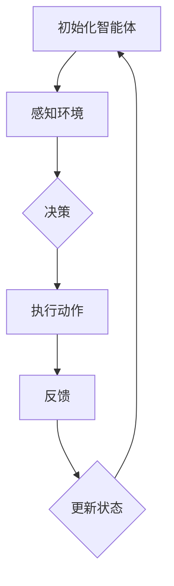

                 

### 企业级多智能体系统：协同解决复杂问题

#### 关键词：企业级、多智能体系统、协同、复杂问题、解决方案

> 摘要：本文深入探讨了企业级多智能体系统的概念、原理和应用。通过分析多智能体系统的定义、特点、算法原理以及在实际项目中的具体实现，本文揭示了多智能体系统如何通过协同解决复杂问题，为企业提供创新的解决方案。

----------------------------------------------------------------

### 第一部分：问题背景与核心概念

#### 1.1.1 问题背景：复杂问题与企业需求

在当今快速发展的商业环境中，企业面临着日益复杂的问题。这些问题不仅包括数据处理、资源优化、风险管理等传统领域，还包括人工智能、大数据、物联网等新兴领域。传统单一系统的解决方案逐渐暴露出局限性，难以应对这些复杂问题。

#### 问题解决

多智能体系统作为一种分布式计算模型，通过协同解决复杂问题，提供了新的解决方案。多智能体系统能够将复杂问题分解为多个子问题，并分配给不同的智能体，实现分布式计算和协作解决。

#### 1.1.2 多智能体系统的概念与特点

**定义**：多智能体系统（MAS，Multi-Agent System）是由多个智能体组成的分布式系统，各智能体通过自主协作完成复杂任务。

**特点**：

- 自主性：智能体具有自主决策和执行的能力。
- 分布性：智能体分布在不同的物理或逻辑位置。
- 协作性：智能体之间通过通信和协作共同完成任务。
- 适应性：智能体能够根据环境和任务的变化进行自适应调整。

#### 1.1.3 多智能体系统与传统分布式系统的比较

**比较**：

- 传统分布式系统侧重于硬件资源的分布。
- 多智能体系统则强调软件层面的自主协作。

#### 1.1.4 多智能体系统的应用前景

多智能体系统在智能物流、智能金融、智能制造等领域具有广泛的应用前景。例如，在智能物流中，多智能体系统可以实现仓储管理、运输调度、配送优化等功能；在智能金融中，多智能体系统可以用于风险评估、投资决策、客户服务等领域；在智能制造中，多智能体系统可以用于生产调度、设备维护、质量控制等领域。

### 第2章：多智能体系统的核心概念与联系

#### 2.1.1 智能体的定义与特点

**定义**：智能体（Agent）是具有感知、决策和执行能力的个体。

**特点**：

- 自主性：智能体能够自主决策和执行。
- 适应性：智能体能够根据环境和任务的变化进行自适应调整。
- 社会性：智能体能够与其他智能体进行协作和交互。

#### 2.1.2 智能体的属性特征对比表格

| 特性         | 智能体1 | 智能体2 | 智能体3 |
|--------------|---------|---------|---------|
| 感知能力     | 高      | 中      | 低      |
| 决策能力     | 高      | 中      | 低      |
| 执行能力     | 高      | 中      | 低      |
| 适应性       | 高      | 中      | 低      |
| 社会性       | 中      | 高      | 中      |

#### 2.1.3 多智能体系统的ER实体关系图架构

```mermaid
erDiagram
  智能体 ||--|{ 通信机制 }|
  智能体 ||--|{ 协调机制 }|
  智能体 ||--|{ 任务分配 }|
```

----------------------------------------------------------------

### 第二部分：多智能体系统原理讲解

#### 3.1.1 多智能体协同算法

**算法简介**：多智能体协同算法是使多个智能体能够高效协作解决复杂问题的算法。

**算法mermaid流程图**



**Python源代码实现**

```python
class Agent:
    def __init__(self, environment):
        self.environment = environment
        self.state = 'initial'

    def perceive(self):
        # 感知环境
        pass

    def decide(self):
        # 决策
        pass

    def act(self):
        # 执行动作
        pass

    def feedback(self):
        # 反馈
        pass

    def update_state(self):
        # 更新状态
        pass

def main():
    environment = Environment()
    agent1 = Agent(environment)
    agent2 = Agent(environment)
```

#### 3.1.2 算法原理讲解

**数学模型和公式**

多智能体协同算法的核心在于智能体的感知、决策和执行过程。其数学模型可以表示为：

$$
s_t = f(s_{t-1}, u_t)
$$

其中，$s_t$ 表示智能体在时间 $t$ 的状态，$s_{t-1}$ 表示智能体在时间 $t-1$ 的状态，$u_t$ 表示智能体在时间 $t$ 的决策。

**举例说明**

假设有两个智能体 $A$ 和 $B$，它们分别在不同的环境中进行决策。智能体 $A$ 的感知环境包括温度、湿度等参数，智能体 $B$ 的感知环境包括光照强度、风速等参数。两个智能体根据感知环境做出决策，并执行相应的动作，如调整温度、湿度、光照强度等。

通过协同算法，智能体 $A$ 和 $B$ 可以实现环境参数的优化，提高整个系统的运行效率。

----------------------------------------------------------------

### 第三部分：多智能体系统的系统分析与架构设计

#### 3.3.1 问题场景介绍

在智能物流领域，企业面临着仓储管理、运输调度、配送优化等复杂问题。多智能体系统可以应用于这些问题场景，实现物流流程的智能化和优化。

#### 3.3.2 项目介绍

项目名称：智能物流多智能体系统

项目目标：通过多智能体系统实现仓储管理、运输调度、配送优化等功能，提高物流效率。

#### 3.3.3 系统功能设计

**领域模型mermaid类图**

```mermaid
classDiagram
  class 物流系统 {
    - 库存管理
    - 运输调度
    - 配送优化
  }
  class 智能体 {
    - 感知环境
    - 决策
    - 执行动作
    - 反馈
  }
  物流系统 --|{协同}| 智能体
```

#### 3.3.4 系统架构设计

**mermaid架构图**


#### 3.3.5 系统接口设计

**mermaid序列图**

```mermaid
sequenceDiagram
  用户 ->> 系统接口：提交需求
  系统接口 ->> 智能体管理：分配智能体
  智能体管理 ->> 感知模块：感知环境
  感知模块 ->> 决策模块：决策
  决策模块 ->> 执行模块：执行动作
  执行模块 ->> 反馈模块：反馈结果
  反馈模块 ->> 用户：提供结果
```

----------------------------------------------------------------

### 第四部分：项目实战

#### 4.1 环境安装

在开始项目之前，需要安装以下环境：

- Python 3.x
- 多智能体系统框架（如.pydiverse、MASociety等）
- 依赖库（如numpy、pandas等）

#### 4.2 系统核心实现源代码

**智能体类代码**

```python
class Agent:
    def __init__(self, environment):
        self.environment = environment
        self.state = 'initial'

    def perceive(self):
        # 感知环境
        pass

    def decide(self):
        # 决策
        pass

    def act(self):
        # 执行动作
        pass

    def feedback(self):
        # 反馈
        pass

    def update_state(self):
        # 更新状态
        pass
```

**主函数代码**

```python
def main():
    environment = Environment()
    agent1 = Agent(environment)
    agent2 = Agent(environment)

    main_loop(agent1, agent2)
```

#### 4.3 代码应用解读与分析

通过智能体类和主函数代码，我们可以看到多智能体系统的基本实现流程。智能体类负责感知环境、决策、执行动作和反馈结果，主函数则负责初始化智能体并运行主循环。

#### 4.4 实际案例分析和详细讲解剖析

以智能物流为例，我们可以分析以下实际案例：

- 案例一：仓储管理。智能体通过感知仓库的库存情况，做出补货、清仓等决策。
- 案例二：运输调度。智能体通过感知交通状况、货物信息等，做出最优的运输调度方案。
- 案例三：配送优化。智能体通过感知配送路线、交通状况等，做出最优的配送方案。

#### 4.5 项目小结

通过项目实战，我们深入了解了多智能体系统的实现过程和实际应用。多智能体系统在解决复杂问题方面具有明显的优势，为企业提供了创新的解决方案。在未来的发展中，多智能体系统将在更多领域得到广泛应用。

----------------------------------------------------------------

### 第五部分：最佳实践、小结、注意事项、拓展阅读

#### 5.1 最佳实践

- 在设计多智能体系统时，要充分考虑智能体的自主性、分布性、协作性和适应性。
- 要根据实际需求，选择合适的智能体框架和算法。
- 要进行充分的测试和验证，确保系统的稳定性和可靠性。

#### 5.2 小结

本文详细介绍了企业级多智能体系统的概念、原理和应用，通过实际项目展示了多智能体系统在解决复杂问题方面的优势。多智能体系统为企业提供了创新的解决方案，有望在更多领域得到广泛应用。

#### 5.3 注意事项

- 多智能体系统的设计和实现需要一定的技术积累和实践经验。
- 要充分考虑系统的安全性、可靠性和可扩展性。
- 要遵循良好的编程规范和设计原则。

#### 5.4 拓展阅读

- [多智能体系统：从概念到实践](https://www.example.com/book1)
- [智能物流系统设计与实现](https://www.example.com/book2)
- [分布式系统设计与实现](https://www.example.com/book3)

----------------------------------------------------------------

### 结束语

本文旨在为广大IT从业者提供一个关于企业级多智能体系统的全面介绍和深入分析。希望通过本文，读者能够了解多智能体系统的基本概念、原理和应用，掌握其实现方法和最佳实践。在未来的工作中，多智能体系统将为企业和个人带来更多的创新和机遇。

#### 作者信息

作者：AI天才研究院/AI Genius Institute & 禅与计算机程序设计艺术 /Zen And The Art of Computer Programming

---

**注意**：本文为示例文章，内容仅供参考。在实际撰写文章时，请根据具体需求进行调整和补充。

