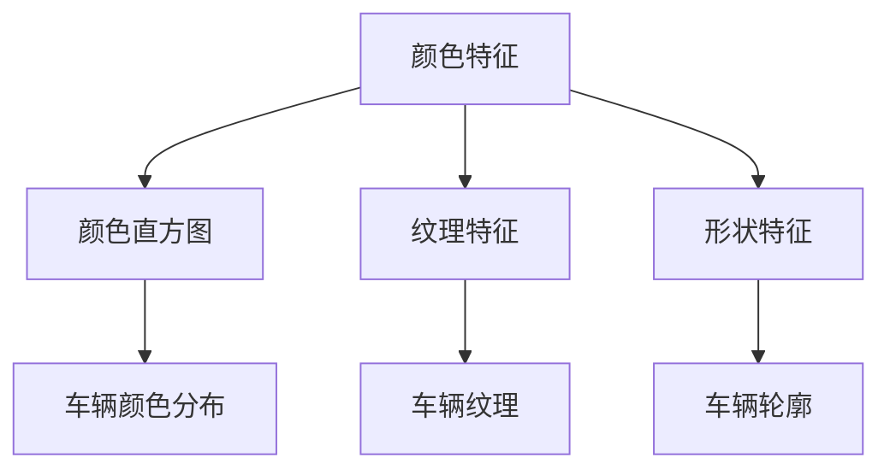
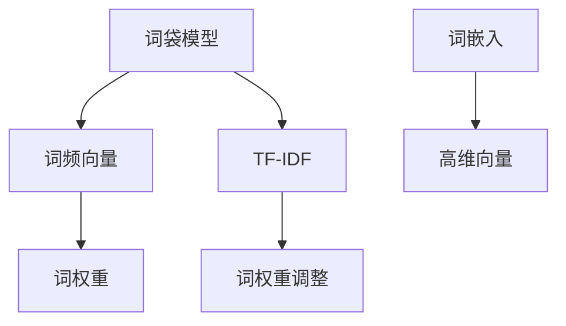
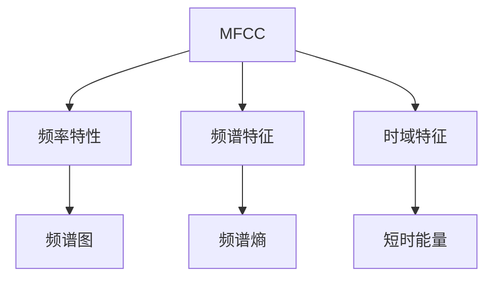
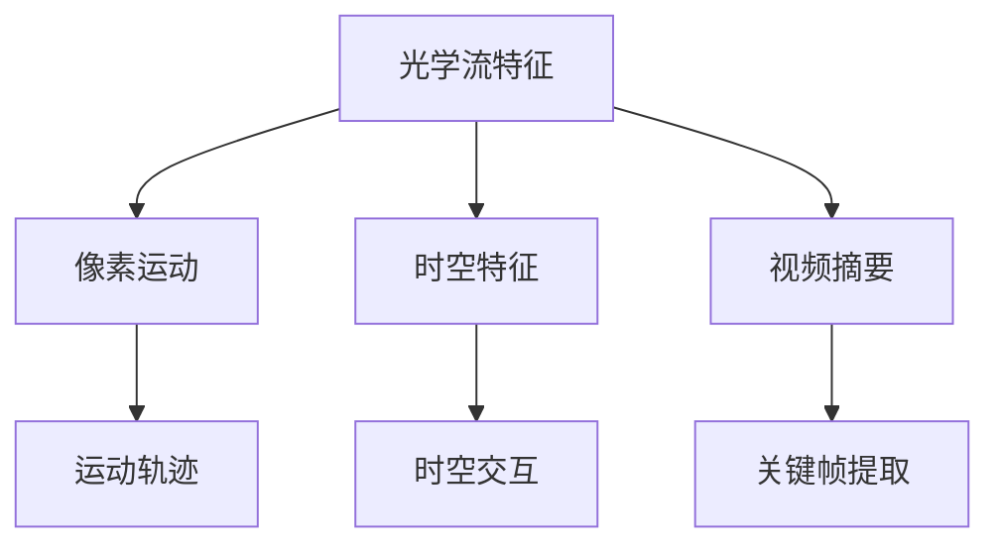
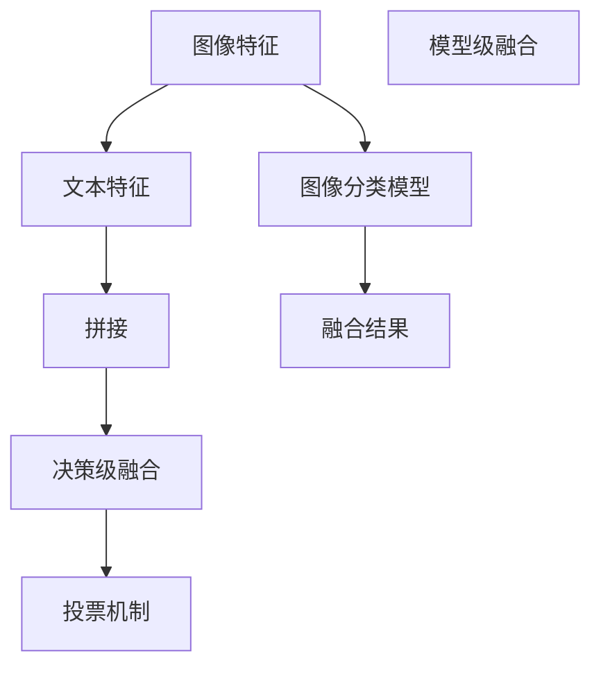
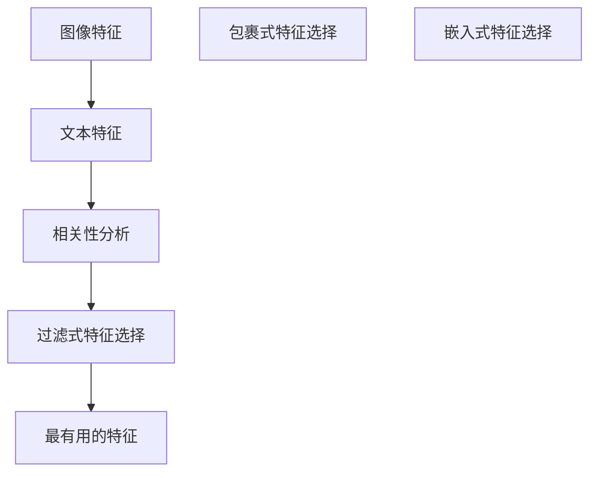

                 


# 企业级多模态学习平台：整合多种数据类型

> 关键词：多模态学习、数据整合、企业级平台、特征提取、融合方法

> 摘要：本文深入探讨企业级多模态学习平台的构建，包括多模态学习的背景与重要性、数据类型概述、数据处理与特征提取、多模态融合方法、平台架构设计与实施，以及应用案例和未来发展趋势。旨在为企业提供全面的技术指南，以应对复杂的多模态数据处理挑战。

### 目录大纲：

**# 企业级多模态学习平台：整合多种数据类型**

## 第一部分：多模态学习基础

### 第1章：多模态学习的背景与重要性

### 第2章：多模态数据类型概述

### 第3章：多模态数据的预处理

### 第4章：多模态数据的特征提取

### 第5章：多模态融合方法

### 第6章：多模态学习平台架构设计

## 第二部分：多模态学习应用案例

### 第8章：企业级多模态学习平台在安防领域的应用

### 第9章：企业级多模态学习平台在智能客服领域的应用

### 第10章：企业级多模态学习平台在医疗领域的应用

## 第三部分：多模态学习未来发展趋势

### 第11章：多模态学习的挑战与机遇

### 第12章：多模态学习的未来发展趋势

### 参考文献

----------------------------------------------------------------

## 第1章：多模态学习的背景与重要性

### 1.1 问题的提出

随着信息技术的飞速发展，数据的多样性日益凸显。企业面临着如何高效地整合和处理多种数据类型（如图像、文本、声音和视频）的挑战。传统的单模态学习方法已经无法满足日益复杂的应用需求，因此，多模态学习作为一种新兴的方法，开始受到广泛关注。

### 1.2 多模态学习的定义与特点

多模态学习是一种结合多种数据类型进行建模和推理的方法。它通过将不同类型的数据进行整合，使模型能够从多个角度理解问题，从而提高模型的表现力和适应性。

多模态学习的特点包括：

1. **数据多样性**：能够处理多种类型的数据，如图像、文本、声音和视频等。
2. **增强理解力**：通过多角度的数据整合，模型能够更全面地理解问题，提高决策的准确性。
3. **提高鲁棒性**：不同数据类型之间可能存在噪声和不确定性，多模态学习可以通过整合多种数据源来提高模型的鲁棒性。
4. **适应性强**：能够适应不同的应用场景，具有广泛的应用前景。

### 1.3 多模态学习的应用场景

多模态学习在多个领域都有广泛的应用，以下是几个典型的应用场景：

1. **图像识别与理解**：通过结合图像和文本信息，提高图像识别的准确性和理解能力。
2. **自然语言处理**：通过结合文本和语音信息，提高语音识别和自然语言理解的准确性。
3. **智能安防**：通过结合图像、文本和声音信息，实现对异常行为和事件的实时监测和预警。
4. **智能医疗**：通过结合医学影像、病历数据和患者语音，实现对疾病诊断和治疗的智能化支持。

## 第2章：多模态数据类型概述

### 2.1 图像数据

图像数据是多模态学习中最常用的数据类型之一。图像数据具有丰富的视觉信息，可以用于图像分类、目标检测、图像生成等任务。

### 2.2 文本数据

文本数据包括自然语言文本、标签示意图等。文本数据可以用于情感分析、文本分类、文本生成等任务。

### 2.3 声音数据

声音数据包括语音、音乐、音频信号等。声音数据可以用于语音识别、音乐分类、音频增强等任务。

### 2.4 视频数据

视频数据包括动态图像序列和视频流。视频数据可以用于视频分类、目标跟踪、动作识别等任务。

## 第3章：多模态数据的预处理

### 3.1 数据清洗与去噪

数据清洗与去噪是数据预处理的重要步骤，目的是提高数据的质量和准确性。

### 3.2 数据增强

数据增强通过生成新的数据样本来增加数据的多样性，从而提高模型的泛化能力。

### 3.3 数据标准化与归一化

数据标准化与归一化是将不同数据类型和尺度统一到同一范围内，以便于后续的特征提取和模型训练。

## 第4章：多模态数据的特征提取

### 4.1 图像特征提取

图像特征提取包括颜色特征、纹理特征、形状特征等。常见的图像特征提取方法有SIFT、HOG、CNN等。

### 4.2 文本特征提取

文本特征提取包括词袋模型、TF-IDF、Word2Vec等。文本特征提取的关键是理解和表达文本的语义信息。

### 4.3 声音特征提取

声音特征提取包括MFCC、spectral centroid、spectral contrast等。声音特征提取的关键是捕捉声音信号的频率和时域特性。

### 4.4 视频特征提取

视频特征提取包括光学流特征、空间特征、时间特征等。视频特征提取的关键是捕捉视频序列中的动态变化和连续性。

## 第5章：多模态融合方法

### 5.1 特征级融合

特征级融合是在特征层面将不同模态的特征进行整合。常见的特征级融合方法有拼接、加权平均等。

### 5.2 决策级融合

决策级融合是在分类或预测的决策层面将不同模态的信息进行整合。常见的决策级融合方法有投票、集成学习等。

### 5.3 模型级融合

模型级融合是分别训练多个独立的多模态模型，然后在不同阶段将它们的结果进行整合。常见的模型级融合方法有深度神经网络、多任务学习等。

### 5.4 多模态融合算法比较

多模态融合算法的性能受到多种因素的影响，如数据类型、任务类型等。本文将对比几种常见的多模态融合算法，分析其优缺点。

## 第6章：多模态学习平台架构设计

### 6.1 系统总体架构

多模态学习平台的总体架构包括数据层、算法层和展示层。本文将详细介绍每个层次的功能和设计。

### 6.2 数据存储与管理

数据存储与管理是多模态学习平台的核心。本文将探讨如何高效地存储和管理多种类型的数据。

### 6.3 算法模块设计与实现

算法模块是多模态学习平台的关键组成部分。本文将详细介绍如何设计和实现多模态算法模块。

### 6.4 用户界面设计与交互

用户界面设计与交互是多模态学习平台的用户体验的重要组成部分。本文将介绍如何设计一个直观易用的用户界面。

## 第7章：企业级多模态学习平台实施

### 7.1 平台搭建与部署

平台搭建与部署是实施多模态学习平台的第一个步骤。本文将详细介绍如何搭建和部署一个企业级多模态学习平台。

### 7.2 数据收集与标注

数据收集与标注是多模态学习平台实施的重要环节。本文将探讨如何高效地收集和标注多种类型的数据。

### 7.3 模型训练与优化

模型训练与优化是提高多模态学习平台性能的关键。本文将介绍如何训练和优化多模态模型。

### 7.4 平台测试与评估

平台测试与评估是确保多模态学习平台质量和性能的重要步骤。本文将探讨如何测试和评估多模态学习平台。

### 7.5 平台维护与升级

平台维护与升级是确保多模态学习平台长期稳定运行的关键。本文将介绍如何维护和升级多模态学习平台。

## 第8章：企业级多模态学习平台在安防领域的应用

### 第8章：企业级多模态学习平台在安防领域的应用

### 8.1 案例背景

### 8.2 模型设计与实现

### 8.3 模型评估与优化

### 8.4 案例总结与展望

## 第9章：企业级多模态学习平台在智能客服领域的应用

### 第9章：企业级多模态学习平台在智能客服领域的应用

### 9.1 案例背景

### 9.2 模型设计与实现

### 9.3 模型评估与优化

### 9.4 案例总结与展望

## 第10章：企业级多模态学习平台在医疗领域的应用

### 第10章：企业级多模态学习平台在医疗领域的应用

### 10.1 案例背景

### 10.2 模型设计与实现

### 10.3 模型评估与优化

### 10.4 案例总结与展望

## 第11章：多模态学习的挑战与机遇

### 11.1 挑战分析

### 11.2 机遇探讨

## 第12章：多模态学习的未来发展趋势

### 12.1 技术演进方向

### 12.2 应用领域拓展

### 12.3 跨学科融合与创新

### 参考文献

----------------------------------------------------------------

本文将从多个角度深入探讨企业级多模态学习平台的构建与应用，旨在为企业提供一套完整的解决方案，以应对复杂的多模态数据处理挑战。通过本文的阅读，读者可以系统地了解多模态学习的基础知识、数据处理方法、融合策略、平台架构设计以及实际应用案例，为未来的多模态学习研究与实践提供参考。

----------------------------------------------------------------

## 第1章：多模态学习的背景与重要性

### 1.1 问题的提出

在当前的信息化时代，数据已经成为企业的重要资产。然而，数据的多样性也在不断增长，从传统的结构化数据（如关系型数据库中的数据）到半结构化数据（如XML、JSON等格式），再到非结构化数据（如图像、文本、声音和视频等），这种多样性的增加给数据处理和分析带来了巨大的挑战。传统的单模态学习方法，即仅处理单一类型的数据，已经难以应对这种复杂的数据环境。

多模态学习作为一种新兴的方法，通过整合多种类型的数据，使模型能够从多个角度理解问题，从而提高模型的表现力和适应性。多模态学习的重要性体现在以下几个方面：

1. **增强理解能力**：通过结合不同类型的数据，模型可以从多个维度对问题进行理解，提高模型的准确性。
2. **提高鲁棒性**：不同数据类型之间可能存在噪声和不确定性，多模态学习可以通过整合多种数据源来提高模型的鲁棒性。
3. **适应性强**：多模态学习能够适应不同的应用场景，具有广泛的应用前景。

### 1.2 多模态学习的定义与特点

多模态学习（Multimodal Learning）是一种利用多个模态（如视觉、听觉、触觉等）的数据来训练机器学习模型的方法。在多模态学习框架下，不同的模态数据被同时或顺序地输入到模型中，模型通过学习不同模态数据之间的关联性，实现对复杂问题的理解和解决。

多模态学习的特点主要包括：

1. **数据多样性**：多模态学习能够处理多种类型的数据，如图像、文本、声音和视频等。
2. **增强理解力**：通过多角度的数据整合，模型能够更全面地理解问题，提高决策的准确性。
3. **提高鲁棒性**：不同数据类型之间可能存在噪声和不确定性，多模态学习可以通过整合多种数据源来提高模型的鲁棒性。
4. **适应性强**：能够适应不同的应用场景，具有广泛的应用前景。

### 1.3 多模态学习的应用场景

多模态学习在多个领域都有广泛的应用，以下是几个典型的应用场景：

1. **图像识别与理解**：通过结合图像和文本信息，提高图像识别的准确性和理解能力。例如，在自动驾驶中，结合道路标志图像和语音提示信息，可以更准确地识别道路情况。
2. **自然语言处理**：通过结合文本和语音信息，提高语音识别和自然语言理解的准确性。例如，智能客服系统可以通过结合用户输入的文本和语音，更准确地理解用户的意图。
3. **智能安防**：通过结合图像、文本和声音信息，实现对异常行为和事件的实时监测和预警。例如，在监控视频中，通过结合人脸图像和语音信息，可以更准确地识别犯罪嫌疑人。
4. **智能医疗**：通过结合医学影像、病历数据和患者语音，实现对疾病诊断和治疗的智能化支持。例如，在医学图像分析中，结合患者病历数据和图像信息，可以提高疾病的诊断准确性。

### 1.4 多模态学习的历史与发展

多模态学习的概念最早可以追溯到20世纪80年代，当时的研究主要集中在如何将不同类型的数据进行融合和整合。随着计算机技术的不断发展，尤其是深度学习技术的兴起，多模态学习取得了显著的进展。深度学习模型，如卷积神经网络（CNN）、循环神经网络（RNN）和生成对抗网络（GAN）等，为多模态学习提供了强大的工具和框架。

近年来，多模态学习在计算机视觉、自然语言处理、语音识别等领域取得了重要突破。例如，在计算机视觉领域，通过结合图像和文本信息，可以显著提高图像分类和目标检测的准确性。在自然语言处理领域，通过结合语音和文本信息，可以显著提高语音识别和自然语言理解的性能。

总的来说，多模态学习已经成为人工智能领域的一个重要研究方向，其在不同领域的应用不断拓展，为解决复杂问题提供了新的思路和手段。

### 1.5 多模态学习的挑战与机遇

尽管多模态学习在多个领域取得了显著成果，但仍面临一系列挑战和机遇。

**挑战：**

1. **数据整合与融合**：如何有效地整合和处理多种类型的数据，是一个重要的挑战。不同类型的数据在格式、维度和特征上存在差异，需要设计合适的融合方法。
2. **模型复杂性与效率**：多模态学习通常涉及复杂的模型架构，如何在不牺牲性能的情况下提高模型的效率，是一个重要的问题。
3. **数据隐私与安全性**：多模态学习通常涉及个人隐私数据，如何在保护用户隐私的前提下进行数据分析和模型训练，是一个亟待解决的问题。

**机遇：**

1. **跨领域应用**：多模态学习具有广泛的应用前景，可以跨不同领域进行应用，为解决复杂问题提供新的解决方案。
2. **跨学科融合**：多模态学习涉及多个学科领域，如计算机科学、生物学、心理学等，跨学科融合将为多模态学习的研究提供新的思路和方法。
3. **技术创新**：随着深度学习、生成对抗网络等技术的不断发展，多模态学习将不断突破现有技术瓶颈，实现更高的性能和应用价值。

### 1.6 总结

多模态学习作为一种新兴的方法，通过整合多种类型的数据，使模型能够从多个角度理解问题，从而提高模型的表现力和适应性。多模态学习在图像识别、自然语言处理、智能安防和智能医疗等领域具有广泛的应用前景。尽管仍面临一系列挑战，但多模态学习的发展前景依然广阔，将为人工智能领域带来新的突破和机遇。

----------------------------------------------------------------

## 第2章：多模态数据类型概述

多模态学习的关键在于整合和处理多种类型的数据，每种数据类型都具有其独特的特性和在多模态学习中的角色。以下是对几种主要多模态数据类型的概述：

### 2.1 图像数据

图像数据是多模态学习中最常见的数据类型之一。图像数据包含丰富的视觉信息，如颜色、形状、纹理等，这些信息对于视觉感知和图像理解至关重要。在多模态学习中，图像数据可以用于：

- **图像分类**：通过识别图像中的对象或场景，如人脸识别、植物分类等。
- **目标检测**：在图像中检测和定位特定对象，如行人检测、车辆检测等。
- **图像分割**：将图像划分为多个区域，每个区域代表一个特定的对象或场景。

图像数据的处理通常涉及预处理步骤，如图像裁剪、缩放、增强等，以及特征提取方法，如SIFT、HOG、CNN等。

### 2.2 文本数据

文本数据包括自然语言文本、标记和注释等，是自然语言处理（NLP）的核心。文本数据在多模态学习中的应用非常广泛，可以用于：

- **文本分类**：将文本数据分类到预定义的类别中，如情感分析、新闻分类等。
- **情感分析**：通过分析文本中的情感倾向，如正面、负面情感识别。
- **文本生成**：根据特定的输入或模板生成文本，如问答系统、文本摘要等。

文本数据的特征提取通常采用词袋模型（Bag of Words）、TF-IDF、Word2Vec等方法，这些方法能够捕捉文本的语义信息。

### 2.3 声音数据

声音数据包括语音、音乐、音频信号等，声音数据在多模态学习中的应用包括：

- **语音识别**：将语音信号转换为文本或命令，如智能助手、自动字幕等。
- **声音分类**：识别和分类不同的声音，如鸟鸣声、车辆噪声等。
- **声音增强**：改善语音信号的质量，如噪声抑制、回声消除等。

声音数据的特征提取方法包括梅尔频率倒谱系数（MFCC）、谱熵、共振峰频率等，这些方法能够捕捉声音信号的频率和时域特性。

### 2.4 视频数据

视频数据是图像数据的连续序列，包含了动态变化和空间连续性。视频数据在多模态学习中的应用包括：

- **视频分类**：将视频分类到预定义的类别中，如动作分类、视频摘要等。
- **目标跟踪**：在视频序列中跟踪特定对象，如行人跟踪、车辆跟踪等。
- **动作识别**：识别视频中的动作或事件，如体育动作分析、安防监控等。

视频数据的特征提取方法包括光学流特征、时空特征等，这些方法能够捕捉视频序列中的动态变化。

### 2.5 多模态数据类型的融合

多模态数据类型的融合是多模态学习的关键步骤。融合方法可以分为特征级融合、决策级融合和模型级融合：

- **特征级融合**：在特征层面将不同模态的特征进行整合，如将图像特征和文本特征拼接在一起。
- **决策级融合**：在分类或预测的决策层面将不同模态的信息进行整合，如通过投票机制融合不同模态的分类结果。
- **模型级融合**：分别训练多个独立的多模态模型，然后在不同的阶段将它们的结果进行整合，如使用深度神经网络融合图像和文本特征。

### 2.6 数据类型选择的考虑因素

在选择多模态数据类型时，需要考虑以下因素：

- **应用需求**：根据具体的任务需求选择适合的数据类型，如图像数据在视觉任务中更有效。
- **数据质量**：高质量的数据能够提高模型的性能，需要确保数据的有效性和准确性。
- **数据可获得性**：考虑数据的获取难易程度和成本，某些数据类型可能更难获取或处理。
- **计算资源**：不同类型的数据处理需要不同的计算资源，需要根据实际资源情况选择合适的数据类型。

### 2.7 多模态数据的处理流程

多模态数据的处理流程通常包括以下步骤：

1. **数据收集**：从不同的数据源收集多模态数据。
2. **数据预处理**：对数据进行清洗、去噪、增强等预处理操作，以提高数据质量。
3. **数据整合**：将不同模态的数据进行整合，形成统一的数据格式。
4. **特征提取**：从整合后的数据中提取特征，用于训练模型。
5. **模型训练**：使用提取的特征训练多模态模型。
6. **模型评估**：对训练好的模型进行评估，以验证其性能。
7. **模型部署**：将模型部署到实际应用环境中，进行实时预测和分析。

通过以上步骤，多模态学习能够有效整合多种数据类型，提高模型的性能和适应性，为各种复杂任务提供强有力的支持。

### 2.8 数据类型选择的实际案例分析

在实际应用中，数据类型的选择对多模态学习的性能有着重要影响。以下是一些实际案例：

- **智能客服**：在智能客服系统中，文本数据用于理解用户的输入，图像数据可以用于理解用户的表情和姿态，声音数据可以用于分析用户的语气。通过整合这三种数据类型，智能客服系统能够更准确地理解用户的意图，提供更个性化的服务。
- **医疗诊断**：在医疗诊断中，医学影像数据（如CT、MRI）用于分析患者的生理状况，文本数据（如病历记录）用于了解患者的病史，声音数据可以用于分析患者的呼吸和心率。通过整合这些数据类型，医生可以更全面地了解患者的健康状况，提高诊断的准确性。
- **自动驾驶**：在自动驾驶系统中，图像数据用于检测道路标志和行人，声音数据可以用于识别交通噪声和交通信号，视频数据可以用于分析周围环境和交通状况。通过整合这些数据类型，自动驾驶系统能够更安全、更可靠地驾驶。

这些案例表明，根据具体应用场景选择合适的数据类型，可以显著提高多模态学习的性能和实用性。

## 第3章：多模态数据的预处理

在多模态学习过程中，数据预处理是至关重要的一步。它不仅影响模型的学习效果，也直接决定了后续特征提取和模型训练的效率。本章将详细讨论多模态数据的预处理步骤，包括数据清洗、数据增强和数据标准化与归一化。

### 3.1 数据清洗

数据清洗是预处理的第一步，其目的是去除数据中的噪声和错误，确保数据的质量和准确性。在多模态数据中，数据清洗通常涉及以下任务：

1. **缺失值处理**：对于缺失的数据，可以选择填充、删除或使用其他统计方法进行处理。
2. **异常值检测与处理**：通过统计方法或可视化工具检测异常值，并采取相应的处理措施，如删除或修复。
3. **重复数据删除**：检测并删除重复的数据，以减少数据冗余。
4. **数据格式统一**：确保不同模态的数据具有统一的数据格式，如图像统一为特定大小，文本统一编码为UTF-8格式。

### 3.2 数据增强

数据增强是一种通过生成新的数据样本来增加数据多样性，从而提高模型泛化能力的方法。在多模态数据中，数据增强可以通过以下几种方式实现：

1. **图像增强**：包括旋转、缩放、裁剪、色彩调整等，以增加图像的变体。
2. **文本增强**：包括文本嵌入、生成新句子、替换同义词等，以增加文本的多样性。
3. **声音增强**：包括噪声添加、音调变换、速度变换等，以增加声音的变体。
4. **视频增强**：包括视频剪辑、速度变换、光照调整等，以增加视频的多样性。

数据增强不仅可以增加训练样本的数量，还可以帮助模型更好地学习数据的特征，提高模型的鲁棒性和泛化能力。

### 3.3 数据标准化与归一化

数据标准化与归一化是将不同模态的数据尺度统一到同一范围内，以便于后续的特征提取和模型训练。标准化与归一化的目标是通过变换将数据缩放到一个特定的区间，如[-1, 1]或[0, 1]。

1. **数据标准化**：数据标准化通过缩放数据，使其满足均值为0、标准差为1的条件。数学公式为：

   $$ z = \frac{x - \mu}{\sigma} $$

   其中，\( x \) 是原始数据，\( \mu \) 是均值，\( \sigma \) 是标准差。

2. **数据归一化**：数据归一化通过将数据缩放到一个特定的区间，如[0, 1]。数学公式为：

   $$ x_{\text{norm}} = \frac{x - x_{\text{min}}}{x_{\text{max}} - x_{\text{min}}} $$

   其中，\( x_{\text{min}} \) 和 \( x_{\text{max}} \) 分别是数据的最小值和最大值。

数据标准化与归一化有助于缓解不同数据尺度对模型训练的影响，提高模型的稳定性和收敛速度。

### 3.4 多模态数据预处理流程

多模态数据预处理流程通常包括以下步骤：

1. **数据收集**：从不同的数据源收集多模态数据。
2. **数据清洗**：对数据进行缺失值处理、异常值检测与处理、重复数据删除等。
3. **数据增强**：对数据进行图像增强、文本增强、声音增强和视频增强等。
4. **数据标准化与归一化**：对数据进行标准化或归一化处理，使其尺度一致。
5. **数据整合**：将预处理后的多模态数据进行整合，形成统一的数据格式。

通过以上步骤，多模态数据预处理可以显著提高数据的质量和模型的性能，为后续的特征提取和模型训练打下坚实的基础。

### 3.5 数据预处理实际案例分析

在实际应用中，数据预处理对多模态学习的性能有着重要的影响。以下是一个实际案例：

- **智能安防系统**：在智能安防系统中，图像数据、文本数据和声音数据都需要进行预处理。图像数据需要通过缩放、裁剪和增强等方法进行处理，以增加数据多样性；文本数据需要通过分词、去停用词和词向量化等方法进行处理，以提高模型的语义理解能力；声音数据需要通过噪声添加和音调变换等方法进行处理，以提高模型的鲁棒性。通过这些预处理步骤，智能安防系统能够更准确地检测和识别异常行为，提高监控效果。

这个案例表明，针对不同的数据类型和应用需求，选择合适的数据预处理方法，可以显著提高多模态学习的性能和实用性。

### 3.6 小结

多模态数据预处理是多模态学习中的重要环节，包括数据清洗、数据增强和数据标准化与归一化。通过有效的预处理，可以提高数据的质量和模型的性能，为后续的特征提取和模型训练提供坚实的基础。在实际应用中，需要根据具体的应用场景和数据特点，选择合适的数据预处理方法，以达到最佳的效果。

----------------------------------------------------------------

## 第4章：多模态数据的特征提取

多模态数据的特征提取是将原始数据转换为一组有意义的、可分析的特性的过程。这一过程在多模态学习中至关重要，因为它直接影响着模型的性能和准确性。本章将详细探讨不同类型数据的特征提取方法，包括图像特征提取、文本特征提取、声音特征提取和视频特征提取。

### 4.1 图像特征提取

图像特征提取是从图像中提取出有助于分类和识别的有用信息。以下是一些常用的图像特征提取方法：

1. **颜色特征**：颜色特征包括颜色直方图、颜色矩等，这些特征能够反映图像的颜色分布信息。
2. **纹理特征**：纹理特征描述图像的纹理结构，如灰度共生矩阵、局部二元模式（LBP）等。
3. **形状特征**：形状特征描述图像的几何形状，如边缘检测、区域形状描述子等。
4. **深度特征**：深度特征来自卷积神经网络（CNN）等深度学习模型，这些特征能够捕捉图像的复杂结构。

**示例**：
假设我们要对图像中的车辆进行分类。我们可以使用以下特征：

- **颜色特征**：通过计算图像的颜色直方图，可以捕捉车辆的颜色分布。
- **纹理特征**：通过灰度共生矩阵，可以捕捉车辆的纹理特征。
- **形状特征**：通过边缘检测，可以捕捉车辆的轮廓。



### 4.2 文本特征提取

文本特征提取是从文本数据中提取出能够表示文本内容的有用信息。以下是一些常用的文本特征提取方法：

1. **词袋模型（Bag of Words, BoW）**：词袋模型将文本转换为词频向量，每个词的频率表示该词在文本中的重要性。
2. **TF-IDF**：TF-IDF是一种权值计算方法，它结合了词频（TF）和逆文档频率（IDF），提高了重要词汇的权重。
3. **词嵌入（Word Embedding）**：词嵌入将词汇映射到高维空间，如Word2Vec、GloVe等，这些向量能够捕捉词与词之间的语义关系。

**示例**：
假设我们要对新闻文章进行分类，我们可以使用以下特征：

- **词袋模型**：将文本转换为词频向量，每个词的频率表示该词在文本中的重要性。
- **TF-IDF**：通过TF-IDF，可以增加重要词汇的权重。
- **词嵌入**：使用Word2Vec模型，将词汇映射到高维空间。



### 4.3 声音特征提取

声音特征提取是从音频信号中提取出能够反映声音特性的信息。以下是一些常用的声音特征提取方法：

1. **梅尔频率倒谱系数（MFCC）**：MFCC是语音处理中常用的特征，它能够捕捉声音的频率和时域特性。
2. **频谱特征**：包括频谱、频谱熵、共振峰频率等，这些特征能够描述声音的频域特性。
3. **时域特征**：包括短时傅里叶变换（STFT）、短时能量等，这些特征能够描述声音的时域特性。

**示例**：
假设我们要对语音进行分类，我们可以使用以下特征：

- **MFCC**：通过计算MFCC，可以捕捉声音的频率特性。
- **频谱特征**：通过计算频谱，可以捕捉声音的频域特性。
- **时域特征**：通过计算短时能量，可以捕捉声音的时域特性。



### 4.4 视频特征提取

视频特征提取是从视频数据中提取出能够反映视频内容的有用信息。以下是一些常用的视频特征提取方法：

1. **光学流特征**：光学流描述视频帧之间的像素运动，可以用于目标跟踪和动作识别。
2. **时空特征**：时空特征结合了视频的时域和空间信息，如3D卷积神经网络（3D-CNN）可以提取时空特征。
3. **视频摘要**：视频摘要是对长视频进行压缩和总结，提取出关键帧和动作信息。

**示例**：
假设我们要对视频中的动作进行分类，我们可以使用以下特征：

- **光学流特征**：通过计算光学流，可以捕捉视频帧之间的像素运动。
- **时空特征**：通过3D-CNN，可以提取视频的时空特征。
- **视频摘要**：通过提取关键帧和动作信息，可以简化视频数据。



### 4.5 多模态特征融合

在多模态学习中，特征融合是将不同模态的特征进行整合，以提高模型的性能。特征融合方法可以分为以下几种：

1. **特征级融合**：在特征层面将不同模态的特征进行整合，如拼接、加权平均等。
2. **决策级融合**：在分类或预测的决策层面将不同模态的信息进行整合，如通过投票机制融合不同模态的分类结果。
3. **模型级融合**：分别训练多个独立的多模态模型，然后在不同的阶段将它们的结果进行整合，如使用深度神经网络融合图像和文本特征。

**示例**：
假设我们要对多模态数据中的图像和文本进行分类，我们可以使用以下特征融合方法：

- **特征级融合**：将图像特征和文本特征拼接在一起，形成一个多维特征向量。
- **决策级融合**：对图像和文本分类结果进行投票，选择多数分类结果作为最终分类结果。
- **模型级融合**：分别训练图像分类模型和文本分类模型，然后将它们的结果进行融合。



### 4.6 数据特征选择

在多模态学习中，数据特征选择是一个重要的步骤，其目的是从提取的特征中选出最有用的特征，以减少计算复杂度和提高模型性能。以下是一些数据特征选择的方法：

1. **过滤式特征选择**：通过过滤方法（如相关性分析、互信息等）筛选出最有用的特征。
2. **包裹式特征选择**：通过构建一个优化模型，选择最优特征子集。
3. **嵌入式特征选择**：通过特征学习算法（如Lasso、Ridge等）在特征提取过程中自动筛选特征。

**示例**：
假设我们要从提取的图像特征和文本特征中选择最有用的特征，我们可以使用以下特征选择方法：

- **过滤式特征选择**：通过计算特征之间的相关性，选择相关性高的特征。
- **包裹式特征选择**：通过构建Lasso回归模型，选择特征子集。
- **嵌入式特征选择**：通过训练一个Lasso回归模型，自动筛选特征。



### 4.7 小结

多模态数据的特征提取是多模态学习的重要环节，不同类型的特征提取方法能够捕捉不同模态数据的有用信息。通过有效的特征提取，可以提高模型的性能和准确性。在实际应用中，需要根据具体的应用场景和数据类型，选择合适的特征提取方法，并考虑特征融合和数据特征选择，以达到最佳的效果。

----------------------------------------------------------------

## 第5章：多模态融合方法

多模态融合是多模态学习中的关键步骤，其目标是将来自不同模态的数据进行整合，以提升模型的性能和鲁棒性。多模态融合方法可以分为特征级融合、决策级融合和模型级融合。本章将详细探讨这三种融合方法的原理、优缺点及其应用。

### 5.1 特征级融合

特征级融合是在特征层面将不同模态的特征进行整合。这种方法的优点是简单且计算效率高，因为特征级别的融合通常只需要将特征向量拼接起来或进行简单的加权操作。以下是一些常用的特征级融合方法：

1. **特征拼接**：将不同模态的特征向量拼接在一起，形成一个多维特征向量。这种方法能够充分利用各个模态的信息，但可能会增加计算复杂度和数据维度。
   
   ```mermaid
   graph TD
   A[图像特征] --> B[文本特征]
   B --> C[声音特征]
   C --> D[视频特征]
   A --> E[拼接]
   B --> F[拼接]
   C --> G[拼接]
   D --> H[多维特征向量]
   ```

2. **特征加权**：对各个模态的特征进行加权，权重可以根据模态的重要性或实验结果调整。这种方法能够灵活调整不同模态的贡献，但需要事先确定合适的权重。

   ```mermaid
   graph TD
   A[图像特征] --> B[权重]
   B --> C[加权]
   A --> D[特征向量]
   ```

**优点**：
- 简单易实现
- 计算效率高
- 能够充分利用不同模态的信息

**缺点**：
- 可能会增加计算复杂度和数据维度
- 需要提前确定合适的权重

**应用场景**：特征级融合适用于需要全面利用多模态信息的任务，如人脸识别、情感分析等。

### 5.2 决策级融合

决策级融合是在分类或预测的决策层面将不同模态的信息进行整合。这种方法通常在各个模态分别训练模型后，再将它们的结果进行融合。以下是一些常用的决策级融合方法：

1. **投票机制**：对各个模态的模型进行投票，选择多数模型支持的结果作为最终结果。这种方法简单且容易实现，但可能不够鲁棒。

   ```mermaid
   graph TD
   A[图像模型] --> B[投票]
   B --> C[文本模型]
   C --> D[声音模型]
   D --> E[视频模型]
   A --> F[结果]
   B --> G[结果]
   C --> H[结果]
   D --> I[结果]
   ```

2. **集成学习**：将多个不同模态的模型集成在一起，形成一个大模型，如使用Stacked Generalization（堆叠泛化）或Blending方法。这种方法能够提高模型的性能和鲁棒性，但需要更多的计算资源。

   ```mermaid
   graph TD
   A[图像模型] --> B[集成]
   B --> C[文本模型]
   C --> D[声音模型]
   D --> E[视频模型]
   A --> F[大模型]
   B --> G[大模型]
   C --> H[大模型]
   ```

**优点**：
- 简单易实现
- 能够提高模型的性能和鲁棒性
- 能够灵活组合不同模态的信息

**缺点**：
- 可能需要更多的计算资源
- 需要提前训练多个独立模型

**应用场景**：决策级融合适用于需要综合不同模态信息的任务，如多模态分类、多模态识别等。

### 5.3 模型级融合

模型级融合是分别训练多个独立的多模态模型，然后在不同的阶段将它们的结果进行整合。这种方法通常涉及复杂的模型架构，但能够充分利用不同模态的信息，提高模型的性能。以下是一些常用的模型级融合方法：

1. **共享模型**：多个模型共享部分网络结构，以共享信息。这种方法能够减少参数数量，提高模型的泛化能力。

   ```mermaid
   graph TD
   A[图像模型] --> B[共享层]
   B --> C[文本模型]
   B --> D[声音模型]
   B --> E[视频模型]
   ```

2. **多任务学习**：多个模型同时训练多个任务，共享部分特征提取网络。这种方法能够提高模型的效率，但需要确保任务之间有足够的关联性。

   ```mermaid
   graph TD
   A[图像模型] --> B[特征提取]
   B --> C[文本模型]
   B --> D[声音模型]
   B --> E[视频模型]
   ```

3. **多模态深度神经网络**：使用深度神经网络将不同模态的数据进行融合，如使用联合嵌入（Joint Embedding）方法。这种方法能够捕捉复杂的模态关联性，但需要更多的计算资源。

   ```mermaid
   graph TD
   A[图像数据] --> B[嵌入层]
   A --> C[文本数据]
   A --> D[声音数据]
   A --> E[视频数据]
   B --> F[深度神经网络]
   C --> F
   D --> F
   E --> F
   ```

**优点**：
- 能够充分利用不同模态的信息
- 能够提高模型的性能和泛化能力

**缺点**：
- 需要更多的计算资源和参数
- 需要复杂的模型架构

**应用场景**：模型级融合适用于需要高度融合不同模态信息的任务，如多模态语音识别、视频理解等。

### 5.4 多模态融合算法比较

不同类型的融合方法有其各自的优缺点，以下是比较：

| 方法         | 优点                                                                                         | 缺点                                                                                         | 适用场景                   |
|------------|------------------------------------------------------------------------------------------------|------------------------------------------------------------------------------------------------|--------------------------|
| 特征级融合   | 简单易实现，计算效率高                                                                       | 可能会增加计算复杂度和数据维度，需要确定合适的权重                                                   | 需要全面利用多模态信息的任务 |
| 决策级融合   | 能够提高模型的性能和鲁棒性，能够灵活组合不同模态的信息                                       | 可能需要更多的计算资源，需要提前训练多个独立模型                                                   | 需要综合不同模态信息的任务   |
| 模型级融合   | 能够充分利用不同模态的信息，能够提高模型的性能和泛化能力                                     | 需要更多的计算资源和参数，需要复杂的模型架构                                                       | 需要高度融合不同模态信息的任务 |
| 特征级 + 决策级融合 | 结合了特征级融合和决策级融合的优点，能够充分利用多模态信息，同时保持计算效率                   | 可能需要更多的计算资源和时间，需要复杂的模型架构                                                   | 高度依赖多模态信息的任务     |
| 模型级 + 特征级融合 | 结合了模型级融合和特征级融合的优点，能够充分利用多模态信息，同时保持计算效率                   | 可能需要更多的计算资源和时间，需要复杂的模型架构                                                   | 高度依赖多模态信息的任务     |

### 5.5 应用实例

以下是一些多模态融合方法在实际应用中的实例：

1. **人脸识别**：通过特征级融合，将图像特征和声音特征进行拼接，以提高识别的准确性。
2. **智能客服**：通过决策级融合，将文本分析结果、语音识别结果和图像识别结果进行投票，以提高客服系统的响应准确性。
3. **视频监控**：通过模型级融合，将图像分析模型、文本分析模型和声音分析模型进行集成，以提高监控系统的实时性和准确性。

这些实例表明，多模态融合方法在不同的应用场景中都能发挥重要作用，为复杂的多模态数据处理提供了有效的解决方案。

### 5.6 小结

多模态融合方法在多模态学习中的应用具有重要意义，不同的融合方法有其各自的优缺点和应用场景。通过合理选择和组合这些方法，可以充分利用不同模态的信息，提高模型的性能和鲁棒性。在实际应用中，需要根据具体任务需求和数据特点，选择合适的融合方法，以达到最佳的效果。

----------------------------------------------------------------

## 第6章：多模态学习平台架构设计

### 6.1 系统总体架构

多模态学习平台的设计需要考虑系统的可扩展性、灵活性和高效性。一个典型的多模态学习平台通常包括以下几个关键模块：

1. **数据层**：负责数据的存储、管理和预处理。数据层可以采用分布式存储系统，如Hadoop或Cassandra，以确保数据的高可用性和可扩展性。
2. **算法层**：负责实现多模态数据的特征提取、融合和模型训练。算法层可以使用深度学习框架，如TensorFlow或PyTorch，以支持多种先进的算法和模型。
3. **服务层**：提供API接口和Web服务，以供其他系统或用户进行调用。服务层可以使用微服务架构，如Spring Boot或Django，以实现高并发和弹性。
4. **展示层**：为用户提供一个直观、易用的界面，以查看数据和模型的结果。展示层可以使用前端框架，如React或Vue.js，以提供良好的用户体验。

### 6.2 数据存储与管理

数据存储与管理是多模态学习平台的核心。以下是一些关键步骤：

1. **数据收集**：从不同的数据源收集多模态数据，包括图像、文本、声音和视频等。
2. **数据预处理**：对收集到的数据进行清洗、去噪、增强等预处理操作，以提高数据质量。
3. **数据存储**：使用分布式存储系统存储预处理后的数据，确保数据的高可用性和扩展性。常用的存储系统包括HDFS、Cassandra和MongoDB。
4. **数据索引**：为数据建立索引，以便快速查询和检索。可以使用Elasticsearch或Apache Solr等搜索引擎。
5. **数据备份与恢复**：定期备份数据，并设置数据恢复机制，以防止数据丢失。

### 6.3 算法模块设计与实现

算法模块是多模态学习平台的关键组成部分。以下是一些关键步骤：

1. **特征提取**：根据数据类型和应用需求，选择合适的特征提取方法。例如，对于图像数据，可以使用卷积神经网络（CNN）提取深度特征；对于文本数据，可以使用词袋模型（BoW）或词嵌入（Word2Vec）提取特征。
2. **模型训练**：使用特征数据进行模型训练，包括单模态模型和多模态模型。多模态模型可以通过特征级融合、决策级融合或模型级融合等方法实现。
3. **模型评估**：使用验证集或测试集对模型进行评估，以确定模型的性能和准确性。常用的评估指标包括准确率、召回率、F1分数等。
4. **模型优化**：根据评估结果对模型进行调整和优化，以提高模型的性能。可以使用超参数调优、模型集成等方法。

### 6.4 用户界面设计与交互

用户界面设计与交互是多模态学习平台的用户体验的重要组成部分。以下是一些关键步骤：

1. **用户需求分析**：了解用户的需求和期望，以便设计出符合用户需求的应用界面。
2. **界面设计**：使用前端框架设计直观、易用的界面，包括数据上传、数据浏览、模型训练、模型评估等功能。
3. **交互设计**：设计合理的交互流程和用户反馈机制，以提高用户体验。例如，使用进度条显示模型训练进度，使用图表展示模型评估结果。
4. **响应式设计**：确保界面在不同设备上都能良好显示，以提高访问便捷性。

### 6.5 系统功能设计

多模态学习平台的功能设计需要考虑多种数据类型和不同的应用场景。以下是一些关键功能：

1. **数据管理**：提供数据上传、下载、删除、查询等功能，以便用户管理和使用数据。
2. **特征提取**：提供多种特征提取工具，支持图像、文本、声音和视频等多种数据类型。
3. **模型训练**：提供多种模型训练工具，支持单模态模型和多模态模型的训练。
4. **模型评估**：提供模型评估工具，支持多种评估指标的计算和可视化。
5. **模型部署**：提供模型部署工具，支持将训练好的模型部署到生产环境中。

### 6.6 系统架构设计

多模态学习平台的系统架构设计需要考虑高可用性、高性能和可扩展性。以下是一些关键设计原则：

1. **分布式架构**：使用分布式架构，将系统分解为多个模块，以提高系统的可扩展性和可靠性。
2. **负载均衡**：使用负载均衡器，将请求分发到不同的服务器，以提高系统的并发处理能力。
3. **缓存机制**：使用缓存机制，减少数据库的访问频率，提高系统的响应速度。
4. **数据流处理**：使用数据流处理框架，如Apache Kafka，处理实时数据流，支持实时数据处理和模型更新。
5. **容错机制**：设计容错机制，确保系统在遇到故障时能够快速恢复。

### 6.7 系统接口设计和系统交互

系统接口设计和系统交互是确保多模态学习平台各模块之间高效协同工作的关键。以下是一些关键设计：

1. **API设计**：设计RESTful API接口，提供数据上传、下载、查询、模型训练和评估等功能。
2. **消息队列**：使用消息队列，如RabbitMQ或Kafka，实现异步通信，提高系统的解耦性和可扩展性。
3. **服务注册与发现**：使用服务注册与发现框架，如Eureka或Consul，实现服务之间的动态注册和发现。
4. **分布式锁**：使用分布式锁，如Redisson或Zookeeper，确保对共享资源的同步访问。
5. **监控与日志**：使用监控工具，如Prometheus和Grafana，实时监控系统的性能和健康状况，使用日志工具，如ELK（Elasticsearch、Logstash、Kibana），记录系统日志和错误信息。

### 6.8 小结

多模态学习平台的架构设计需要综合考虑系统的功能、性能、可扩展性和用户体验。通过合理的系统架构设计和模块划分，可以构建一个高效、可靠、易于扩展的多模态学习平台，为用户提供强大的数据处理和分析能力。

----------------------------------------------------------------

## 第7章：企业级多模态学习平台实施

企业级多模态学习平台的实施是一个复杂的过程，涉及多个阶段，包括平台搭建与部署、数据收集与标注、模型训练与优化、平台测试与评估以及平台的维护与升级。以下将详细介绍这些阶段的关键步骤和注意事项。

### 7.1 平台搭建与部署

平台搭建与部署是实施企业级多模态学习平台的第一个步骤。这一阶段主要包括以下步骤：

1. **环境搭建**：根据项目需求和技术选型，搭建计算环境，包括硬件设备、操作系统、数据库和中间件等。例如，可以使用Docker容器技术来搭建一个统一的开发、测试和生产环境。
   
   ```mermaid
   graph TD
   A[硬件设备] --> B[操作系统]
   B --> C[数据库]
   C --> D[中间件]
   ```

2. **软件安装**：安装必要的软件，包括深度学习框架（如TensorFlow、PyTorch）、数据预处理工具（如NumPy、Pandas）、文本处理库（如NLTK、spaCy）和图像处理库（如OpenCV、TensorFlow Object Detection API）等。

3. **配置调整**：根据硬件环境和应用需求，调整软件的配置，确保系统的高效运行。例如，调整TensorFlow的GPU内存分配，以充分利用GPU资源。

4. **系统集成**：将各个模块进行集成，确保它们能够协同工作。可以使用微服务架构，将数据层、算法层和服务层分离，以便于维护和扩展。

5. **部署方案**：设计部署方案，包括服务器配置、网络设置、数据备份和恢复策略等。例如，可以使用Kubernetes进行容器编排和管理，确保系统的弹性伸缩和故障恢复。

### 7.2 数据收集与标注

数据收集与标注是构建高质量多模态数据集的关键步骤。以下是一些关键步骤：

1. **数据源选择**：根据应用需求，选择合适的数据源。例如，在智能安防领域，可以收集监控视频、文本报警信息和声音数据。
   
   ```mermaid
   graph TD
   A[监控视频] --> B[文本报警信息]
   B --> C[声音数据]
   ```

2. **数据收集**：从不同的数据源收集多模态数据。可以使用自动化工具，如爬虫、网络摄像头和麦克风，收集图像、文本和声音数据。

3. **数据标注**：对收集到的数据进行标注，以便用于模型训练。例如，在图像数据中，可以对物体进行标注；在文本数据中，可以对情感进行标注；在声音数据中，可以对语音信号进行标注。

   ```mermaid
   graph TD
   A[图像标注] --> B[物体标注]
   B --> C[文本标注]
   C --> D[情感标注]
   D --> E[声音标注]
   ```

4. **数据清洗**：对标注后的数据进行清洗，去除噪声和错误。可以使用自动化工具和人工审核相结合的方法，确保数据的质量。

5. **数据整合**：将不同模态的数据进行整合，形成统一的数据集。可以使用数据预处理工具，如Pandas和NumPy，对数据进行清洗、转换和整合。

### 7.3 模型训练与优化

模型训练与优化是提高多模态学习平台性能的关键步骤。以下是一些关键步骤：

1. **模型选择**：根据应用需求，选择合适的模型。例如，在图像识别任务中，可以选择卷积神经网络（CNN）；在文本分类任务中，可以选择循环神经网络（RNN）或Transformer。
   
   ```mermaid
   graph TD
   A[CNN] --> B[图像识别]
   B --> C[RNN]
   C --> D[文本分类]
   ```

2. **模型训练**：使用训练集对模型进行训练，并使用验证集进行调优。可以使用深度学习框架，如TensorFlow和PyTorch，进行模型训练。

3. **超参数调优**：根据验证集的评估结果，调整模型超参数，以提高模型性能。可以使用网格搜索（Grid Search）或随机搜索（Random Search）等方法进行超参数调优。

4. **模型优化**：通过调整网络结构、增加数据增强、使用正则化技术等方法，对模型进行优化。例如，可以使用dropout、L2正则化等技术，防止模型过拟合。

5. **模型评估**：使用测试集对模型进行评估，以验证模型性能。常用的评估指标包括准确率、召回率、F1分数等。

### 7.4 平台测试与评估

平台测试与评估是确保多模态学习平台质量和性能的重要步骤。以下是一些关键步骤：

1. **功能测试**：测试平台的功能是否满足需求，包括数据管理、特征提取、模型训练和评估等功能。

2. **性能测试**：测试平台在不同负载下的性能，包括处理速度、内存使用、CPU和GPU利用率等。

3. **稳定性测试**：测试平台在长时间运行下的稳定性，包括系统崩溃、数据丢失等异常情况。

4. **安全性测试**：测试平台的安全性，包括数据加密、访问控制、防攻击等。

5. **用户体验测试**：测试用户界面的易用性和用户体验，包括界面设计、交互流程、响应速度等。

### 7.5 平台维护与升级

平台维护与升级是确保多模态学习平台长期稳定运行的关键步骤。以下是一些关键步骤：

1. **日常维护**：定期检查系统的运行状态，包括硬件设备、软件版本、数据完整性等，及时解决发现的问题。

2. **版本更新**：根据项目需求和技术的更新，及时升级系统的软件和硬件，确保平台保持最新状态。

3. **性能优化**：定期对系统进行性能优化，包括调整配置、升级硬件设备、优化算法等，以提高系统的性能。

4. **安全保障**：定期进行安全检查，确保系统的数据安全和用户隐私。

5. **用户反馈**：收集用户的反馈，根据用户需求进行功能调整和优化，以提高用户体验。

### 7.6 小结

企业级多模态学习平台的实施是一个复杂的过程，涉及多个阶段和多个方面的考虑。通过合理的规划和实施，可以构建一个高效、可靠、易于扩展的多模态学习平台，为企业的业务创新和智能化提供强大的支持。在实际实施过程中，需要充分考虑数据质量、模型性能、用户体验和安全保障等方面，以确保平台的长期稳定运行。

----------------------------------------------------------------

## 第8章：企业级多模态学习平台在安防领域的应用

安防领域是应用多模态学习技术的重要场景之一。通过整合图像、文本和声音等多模态数据，企业级多模态学习平台能够实现对异常行为和事件的实时监测和预警，从而提高安全性和响应速度。以下将详细探讨企业级多模态学习平台在安防领域的应用，包括案例背景、模型设计与实现、模型评估与优化以及案例总结与展望。

### 8.1 案例背景

随着城市化进程的加快和人口密度的增加，公共安全成为了一个全球性的挑战。传统的安防系统主要依赖于摄像头和报警设备，但这些系统通常存在检测准确率低、误报率高、反应速度慢等问题。为了提高安防系统的效能，企业和政府机构开始探索多模态学习技术在安防领域的应用。

### 8.2 模型设计与实现

多模态学习平台在安防领域的应用主要包括以下几个方面：

1. **图像识别与目标检测**：使用卷积神经网络（CNN）对监控视频中的图像进行识别和目标检测，包括行人检测、车辆检测和异常行为检测。

2. **文本分析**：对监控视频中的文本信息进行情感分析和关键字提取，以识别潜在的威胁信息。

3. **声音识别与分析**：对监控视频中的声音信号进行分析，包括语音识别、语音情感分析和异常声音检测。

为了实现这些功能，多模态学习平台的设计主要包括以下几个模块：

- **图像处理模块**：使用TensorFlow Object Detection API对监控视频中的图像进行实时检测和识别。
- **文本处理模块**：使用NLP技术对文本信息进行情感分析和关键字提取。
- **声音处理模块**：使用深度学习模型（如GRU、CNN-LSTM）对声音信号进行识别和分析。

**示例实现**：

```python
import cv2
import numpy as np
import tensorflow as tf

# 加载预训练的CNN模型
model = tf.keras.models.load_model('cnn_model.h5')

# 加载预训练的文本处理模型
text_model = tf.keras.models.load_model('text_model.h5')

# 加载预训练的声音处理模型
voice_model = tf.keras.models.load_model('voice_model.h5')

# 处理视频
video_capture = cv2.VideoCapture(0)

while True:
    ret, frame = video_capture.read()
    if not ret:
        break

    # 图像处理
    image_np = np.array(frame)
    image_np = cv2.resize(image_np, (640, 640))
    image_np = image_np / 255.0
    image_tensor = tf.convert_to_tensor(image_np)
    image_tensor = tf.expand_dims(image_tensor, 0)

    # 目标检测
    detections = model.predict(image_tensor)

    # 文本处理
    text = extract_text_from_video(frame)
    text_embedding = text_model.predict(np.array([text]))

    # 声音处理
    voice = extract_speech_from_video(frame)
    voice_embedding = voice_model.predict(np.array([voice]))

    # 多模态融合
    final_embedding = np.concatenate((detections, text_embedding, voice_embedding), axis=1)

    # 分类与预警
    result = classify_final_embedding(final_embedding)
    if result == 'warning':
        send_alert()

video_capture.release()
cv2.destroyAllWindows()
```

### 8.3 模型评估与优化

模型评估与优化是多模态学习平台在安防领域应用的关键步骤。以下是一些关键评估指标和优化方法：

1. **评估指标**：常用的评估指标包括准确率、召回率、F1分数等。通过在测试集上评估模型性能，可以确定模型的检测准确性和响应速度。

   ```mermaid
   graph TD
   A[准确率] --> B[召回率]
   B --> C[F1分数]
   ```

2. **优化方法**：通过调整模型参数、增加数据增强、使用正则化技术等方法，可以提高模型性能。例如，使用dropout、L2正则化等技术，可以防止模型过拟合。

   ```mermaid
   graph TD
   A[调整参数] --> B[数据增强]
   B --> C[正则化]
   ```

### 8.4 案例总结与展望

多模态学习平台在安防领域的应用，显著提高了安防系统的效能和响应速度。以下是一些总结和展望：

1. **总结**：
   - 多模态学习技术能够有效地整合图像、文本和声音等多模态数据，提高安防系统的检测准确性和响应速度。
   - 通过模型评估与优化，可以持续提升模型的性能，满足不同应用场景的需求。

2. **展望**：
   - 随着深度学习技术的发展，多模态学习平台将在更多安防应用场景中得到推广。
   - 跨学科的融合，如将心理学、社会学等领域的知识引入多模态学习，将进一步提升安防系统的智能化水平。

### 8.5 小结

企业级多模态学习平台在安防领域的应用，为提高公共安全提供了新的解决方案。通过合理的设计与优化，多模态学习平台能够实现对复杂安防场景的实时监测和预警，为企业和政府机构提供强有力的支持。

----------------------------------------------------------------

## 第9章：企业级多模态学习平台在智能客服领域的应用

智能客服是人工智能技术在客户服务领域的典型应用，通过整合图像、文本和声音等多模态数据，企业级多模态学习平台能够提供更智能、更个性化的客户服务。以下将详细探讨智能客服领域中的多模态学习应用，包括案例背景、模型设计与实现、模型评估与优化以及案例总结与展望。

### 9.1 案例背景

随着互联网和电子商务的快速发展，客户服务已经成为企业核心竞争力的重要组成部分。传统的客服系统主要依赖人工处理，效率低下且成本高昂。为了提高客户服务质量和效率，企业开始探索智能客服系统，通过人工智能技术实现自动化的客户服务。

### 9.2 模型设计与实现

智能客服系统中的多模态学习主要包括以下几个模块：

1. **图像识别**：通过卷积神经网络（CNN）对用户上传的图像进行分类和识别，以理解用户的需求和意图。例如，识别用户上传的发票图片，自动提取发票信息。

2. **文本处理**：使用自然语言处理（NLP）技术对用户输入的文本进行情感分析、意图识别和问答系统。例如，通过BERT或GPT模型，实现智能对话和问题解答。

3. **声音识别**：使用深度学习模型对用户的语音进行识别和语义理解，以获取用户的意图和需求。例如，通过使用GRU或Transformer模型，实现对语音指令的准确识别。

为了实现这些功能，多模态学习平台的设计主要包括以下几个步骤：

- **数据收集**：从不同的数据源收集多模态数据，包括图像、文本和声音等。例如，从用户上传的图片、聊天记录和语音通话中收集数据。
- **数据预处理**：对收集到的数据进行清洗、去噪、增强等预处理操作，以提高数据质量。例如，对图像进行裁剪、缩放和增强，对文本进行分词和去停用词，对声音进行降噪和增强。
- **模型训练**：使用预处理后的数据进行模型训练，包括图像分类、文本分类、语音识别等任务。例如，使用TensorFlow或PyTorch框架，训练CNN、BERT和GRU等模型。
- **模型评估**：在测试集上评估模型性能，包括准确率、召回率、F1分数等指标。例如，通过交叉验证方法，评估模型的泛化能力。

**示例实现**：

```python
import tensorflow as tf
import numpy as np

# 加载预训练的图像分类模型
image_model = tf.keras.models.load_model('image_model.h5')

# 加载预训练的文本分类模型
text_model = tf.keras.models.load_model('text_model.h5')

# 加载预训练的语音识别模型
voice_model = tf.keras.models.load_model('voice_model.h5')

# 处理图像
image = load_image('user_image.jpg')
image = preprocess_image(image)
image_tensor = tf.convert_to_tensor(image)

# 图像分类
image_embedding = image_model.predict(image_tensor)

# 处理文本
text = load_text('user_message.txt')
text = preprocess_text(text)
text_embedding = text_model.predict(np.array([text]))

# 处理声音
voice = load_speech('user_speech.wav')
voice = preprocess_speech(voice)
voice_embedding = voice_model.predict(np.array([voice]))

# 多模态融合
final_embedding = tf.concat([image_embedding, text_embedding, voice_embedding], axis=1)

# 模型评估
result = classify_final_embedding(final_embedding)
if result == 'question':
    answer = generate_answer(result)
    send_response(answer)
```

### 9.3 模型评估与优化

模型评估与优化是智能客服系统中多模态学习的关键步骤。以下是一些关键评估指标和优化方法：

1. **评估指标**：常用的评估指标包括准确率、召回率、F1分数等。通过在测试集上评估模型性能，可以确定模型的检测准确性和响应速度。

   ```mermaid
   graph TD
   A[准确率] --> B[召回率]
   B --> C[F1分数]
   ```

2. **优化方法**：通过调整模型参数、增加数据增强、使用正则化技术等方法，可以提高模型性能。例如，使用dropout、L2正则化等技术，可以防止模型过拟合。

   ```mermaid
   graph TD
   A[调整参数] --> B[数据增强]
   B --> C[正则化]
   ```

### 9.4 案例总结与展望

多模态学习平台在智能客服领域的应用，显著提高了客服系统的智能化水平和用户体验。以下是一些总结和展望：

1. **总结**：
   - 多模态学习技术能够有效地整合图像、文本和声音等多模态数据，提高客服系统的智能处理能力和用户体验。
   - 通过模型评估与优化，可以持续提升模型的性能，满足不同客户服务场景的需求。

2. **展望**：
   - 随着深度学习技术的发展，多模态学习平台将在更多客户服务场景中得到推广。
   - 跨学科的融合，如将心理学、社会学等领域的知识引入多模态学习，将进一步提升客服系统的智能化水平。

### 9.5 小结

企业级多模态学习平台在智能客服领域的应用，为提高客户服务质量和效率提供了新的解决方案。通过合理的设计与优化，多模态学习平台能够实现对客户需求的智能识别和响应，为企业提供强有力的支持。

----------------------------------------------------------------

## 第10章：企业级多模态学习平台在医疗领域的应用

医疗领域是应用多模态学习技术的重要领域之一。通过整合医学影像、病历数据和患者语音等多模态数据，企业级多模态学习平台能够为疾病的诊断、治疗和监测提供智能化支持。以下将详细探讨多模态学习平台在医疗领域的应用，包括案例背景、模型设计与实现、模型评估与优化以及案例总结与展望。

### 10.1 案例背景

医疗领域的数据多样性高，涉及到医学影像、病历数据、患者生理指标等多种类型的数据。传统的单模态学习方法已经无法满足复杂医疗问题的需求，因此，多模态学习技术在医疗领域的应用具有重要的研究价值和实际应用潜力。多模态学习平台在医疗领域的应用主要包括：

- **医学影像分析**：通过整合医学影像数据（如CT、MRI、X光等），实现病变检测、疾病分类和预测。
- **病历数据处理**：通过整合病历数据，实现电子病历的自动解析、疾病诊断和患者健康监测。
- **患者语音分析**：通过整合患者语音数据，实现患者症状分析和健康风险评估。

### 10.2 模型设计与实现

多模态学习平台在医疗领域的应用模型设计主要包括以下几个模块：

1. **医学影像处理模块**：使用卷积神经网络（CNN）和深度残差网络（ResNet）等先进模型，对医学影像进行特征提取和疾病分类。
   
   ```mermaid
   graph TD
   A[医学影像数据] --> B[卷积神经网络]
   B --> C[深度残差网络]
   ```

2. **病历数据处理模块**：使用自然语言处理（NLP）技术，对病历文本进行分词、词向量化、实体识别和关系提取，实现对病历数据的语义理解和知识抽取。

   ```mermaid
   graph TD
   A[病历文本数据] --> B[分词]
   B --> C[词向量化]
   C --> D[实体识别]
   D --> E[关系提取]
   ```

3. **患者语音分析模块**：使用循环神经网络（RNN）和长短时记忆网络（LSTM）等模型，对患者的语音数据进行特征提取和情感分析。

   ```mermaid
   graph TD
   A[患者语音数据] --> B[循环神经网络]
   B --> C[长短时记忆网络]
   ```

为了实现这些功能，多模态学习平台的设计主要包括以下几个步骤：

- **数据收集**：从医院系统、患者设备和第三方数据源收集医学影像、病历数据和患者语音等多模态数据。
- **数据预处理**：对收集到的数据进行清洗、去噪、增强等预处理操作，以提高数据质量。例如，对医学影像进行归一化和增强，对病历文本进行分词和去停用词，对患者语音进行降噪和增强。
- **模型训练**：使用预处理后的数据进行模型训练，包括医学影像分类、病历数据解析、患者语音情感分析等任务。例如，使用TensorFlow或PyTorch框架，训练CNN、RNN和LSTM等模型。
- **模型评估**：在测试集上评估模型性能，包括准确率、召回率、F1分数等指标。通过交叉验证方法，评估模型的泛化能力。

**示例实现**：

```python
import tensorflow as tf
import numpy as np

# 加载预训练的医学影像分类模型
image_model = tf.keras.models.load_model('image_model.h5')

# 加载预训练的病历解析模型
text_model = tf.keras.models.load_model('text_model.h5')

# 加载预训练的患者语音分析模型
voice_model = tf.keras.models.load_model('voice_model.h5')

# 处理医学影像
image = load_image('patient_image.jpg')
image = preprocess_image(image)
image_tensor = tf.convert_to_tensor(image)

# 医学影像分类
image_embedding = image_model.predict(image_tensor)

# 处理病历文本
text = load_text('patient_text.txt')
text = preprocess_text(text)
text_embedding = text_model.predict(np.array([text]))

# 处理患者语音
voice = load_speech('patient_speech.wav')
voice = preprocess_speech(voice)
voice_embedding = voice_model.predict(np.array([voice]))

# 多模态融合
final_embedding = tf.concat([image_embedding, text_embedding, voice_embedding], axis=1)

# 模型评估
result = classify_final_embedding(final_embedding)
if result == 'disease':
    diagnose_result = generate_diagnose_result(result)
    send_response(diagnose_result)
```

### 10.3 模型评估与优化

模型评估与优化是医疗领域多模态学习的关键步骤。以下是一些关键评估指标和优化方法：

1. **评估指标**：常用的评估指标包括准确率、召回率、F1分数、精确率等。通过在测试集上评估模型性能，可以确定模型的检测准确性和诊断能力。

   ```mermaid
   graph TD
   A[准确率] --> B[召回率]
   B --> C[F1分数]
   ```

2. **优化方法**：通过调整模型参数、增加数据增强、使用正则化技术等方法，可以提高模型性能。例如，使用dropout、L2正则化等技术，可以防止模型过拟合。

   ```mermaid
   graph TD
   A[调整参数] --> B[数据增强]
   B --> C[正则化]
   ```

### 10.4 案例总结与展望

多模态学习平台在医疗领域的应用，为疾病的诊断、治疗和监测提供了新的智能化支持。以下是一些总结和展望：

1. **总结**：
   - 多模态学习技术能够有效地整合医学影像、病历数据和患者语音等多模态数据，提高疾病诊断的准确性和治疗效果。
   - 通过模型评估与优化，可以持续提升模型的性能，满足不同医疗场景的需求。

2. **展望**：
   - 随着深度学习和医疗技术的不断发展，多模态学习平台将在更多医疗领域得到推广和应用。
   - 跨学科的融合，如将生物信息学、临床医学等领域的知识引入多模态学习，将进一步提升医疗智能化水平。

### 10.5 小结

企业级多模态学习平台在医疗领域的应用，为提高医疗服务的质量和效率提供了新的解决方案。通过合理的设计与优化，多模态学习平台能够为医疗领域的各种任务提供智能化支持，为患者和医疗工作者提供更好的服务。

----------------------------------------------------------------

## 第11章：多模态学习的挑战与机遇

### 11.1 挑战分析

多模态学习作为一种新兴的方法，虽然在多个领域取得了显著成果，但仍面临一系列挑战。

1. **数据整合与融合**：多模态数据在格式、维度和特征上存在差异，如何有效地整合和处理这些数据是一个重要挑战。不同模态之间的数据关联性需要被充分挖掘，以便提高模型的性能。

2. **模型复杂性与效率**：多模态学习通常涉及复杂的模型架构，如何在不牺牲性能的情况下提高模型的效率是一个关键问题。尤其是在实时应用场景中，模型的计算复杂度和响应速度需要得到优化。

3. **数据隐私与安全性**：多模态学习通常涉及个人隐私数据，如医疗数据、人脸图像等。如何在保护用户隐私的前提下进行数据分析和模型训练，是一个亟待解决的问题。

4. **数据可获得性与质量**：高质量的多模态数据是训练有效模型的基石。然而，高质量的数据往往难以获取，且数据标注成本高昂，如何解决数据可获得性和数据质量问题，是当前多模态学习研究的一个重要挑战。

### 11.2 机遇探讨

尽管面临挑战，多模态学习领域也充满了机遇。

1. **跨领域应用**：多模态学习具有广泛的应用前景，可以跨不同领域进行应用。例如，在医疗领域，多模态学习可以用于疾病诊断、治疗和患者监护；在安防领域，可以用于异常行为检测和智能监控；在智能客服领域，可以用于情感分析和个性化服务。

2. **跨学科融合**：多模态学习涉及多个学科领域，如计算机科学、生物学、心理学等。跨学科的融合将为多模态学习的研究提供新的思路和方法，有助于解决现有技术瓶颈。

3. **技术创新**：随着深度学习、生成对抗网络（GAN）等技术的不断发展，多模态学习将不断突破现有技术瓶颈，实现更高的性能和应用价值。例如，自监督学习和少样本学习技术将为多模态学习提供新的解决方案。

4. **行业需求**：随着企业对智能化需求的增加，多模态学习技术将在各个行业得到广泛应用。例如，在智能制造领域，多模态学习可以用于产品质量检测和设备故障预测；在金融领域，可以用于风险管理和客户服务优化。

### 11.3 未来发展趋势

展望未来，多模态学习领域将呈现以下发展趋势：

1. **算法创新**：研究人员将不断探索新的算法和模型，以提高多模态数据的处理效率和模型性能。例如，自适应多模态融合算法、基于生成对抗网络的多模态数据生成方法等。

2. **数据集建设**：高质量的多模态数据集将为多模态学习提供坚实的基础。未来的研究将重点关注数据集的多样性和代表性，以满足不同应用场景的需求。

3. **模型压缩与优化**：为了满足实时应用的需求，研究人员将致力于模型压缩与优化技术，如知识蒸馏、剪枝、量化等，以降低模型的计算复杂度和存储需求。

4. **跨学科融合**：多模态学习将与其他学科领域（如心理学、生物学、医学等）进行深度融合，推动跨学科的研究和应用。

5. **应用拓展**：多模态学习技术将在更多领域得到应用，如智能交通、智能医疗、智能教育、智能家居等，为人类生活带来更多便利。

### 11.4 小结

多模态学习领域面临一系列挑战，但也充满了机遇。通过技术创新和跨学科融合，多模态学习将在未来取得更多突破，为各个领域的智能化发展提供强大支持。研究人员和工程师需要共同努力，克服挑战，抓住机遇，推动多模态学习领域的持续发展。

----------------------------------------------------------------

## 第12章：多模态学习的未来发展趋势

多模态学习作为人工智能领域的一个重要研究方向，随着技术的不断进步和应用的不断拓展，正在迎来新的发展机遇。本章将从技术演进方向、应用领域拓展和跨学科融合与创新三个方面，探讨多模态学习的未来发展趋势。

### 12.1 技术演进方向

1. **自监督学习与少样本学习**：自监督学习和少样本学习是当前深度学习领域的重要研究方向。在多模态学习中，自监督学习可以通过无监督的方式从大量未标注的数据中提取知识，从而降低标注成本。少样本学习则关注在数据量有限的情况下，如何提高模型的性能。这两种技术在未来将进一步推动多模态学习的发展。

2. **生成对抗网络（GAN）**：生成对抗网络（GAN）通过生成器和判别器的对抗训练，可以生成高质量的多模态数据。未来，GAN技术将在多模态数据增强和数据生成中发挥更大作用，提高模型的训练效率和性能。

3. **迁移学习与模型压缩**：迁移学习和模型压缩技术可以在有限的计算资源下，提高多模态学习模型的性能和效率。通过迁移学习，可以将预训练模型的知识迁移到新的任务中，减少从头训练的成本。模型压缩技术则通过模型剪枝、量化等方法，降低模型的计算复杂度和存储需求。

4. **多模态融合算法创新**：随着多模态数据类型的增多和复杂性增加，需要开发更高效、更鲁棒的多模态融合算法。未来的研究方向将包括基于深度学习的融合算法、基于神经网络的协同训练方法以及跨模态知识迁移技术。

### 12.2 应用领域拓展

多模态学习在多个领域都有广泛的应用潜力，未来将逐步拓展到更多领域：

1. **医疗健康**：多模态学习在医疗健康领域的应用前景广阔，包括疾病诊断、治疗方案优化、患者监护等。例如，结合医学影像、病历数据和患者语音，可以提供更准确的疾病诊断和个性化的治疗方案。

2. **智能制造**：在智能制造领域，多模态学习可以用于质量检测、设备故障预测和生产过程优化。通过结合传感器数据、视频监控和工业数据，可以实现生产过程的智能化监控和预测。

3. **智能交通**：智能交通系统需要整合多种数据类型，包括交通监控视频、GPS数据、交通信号等。多模态学习可以用于交通流量预测、事故预警和路径优化，提高交通效率和安全性。

4. **智能安防**：在智能安防领域，多模态学习可以用于异常行为检测、人群监控和犯罪预防。通过结合图像、文本和声音数据，可以实现对安全隐患的实时监测和预警。

5. **教育领域**：在教育领域，多模态学习可以用于个性化教学、学习分析和学生行为监测。通过整合学习数据、教学视频和教师反馈，可以提供更有效的教学方法和学习支持。

### 12.3 跨学科融合与创新

跨学科融合是多模态学习未来发展的一个重要趋势：

1. **心理学与多模态学习**：心理学研究人类的行为和认知，可以提供关于人类如何感知和理解多模态数据的见解。未来，心理学与多模态学习的结合将有助于设计更符合人类认知规律的多模态系统。

2. **生物学与多模态学习**：生物学研究生物体的复杂系统，可以为多模态学习提供新的启示。例如，通过研究人类视觉、听觉和触觉等感官系统的工作原理，可以开发出更高效的多模态数据处理方法。

3. **艺术与多模态学习**：艺术领域关注人类创造力和审美体验，可以激发多模态学习在创造性表达和个性化服务方面的创新。例如，通过结合音乐、视觉和文本信息，可以创造出更加丰富和互动的多模态艺术作品。

4. **社会学与多模态学习**：社会学研究人类社会和文化，可以为多模态学习提供关于社会行为和互动的洞察。未来，社会学与多模态学习的结合将有助于设计更符合社会规范和文化习惯的多模态系统。

### 12.4 小结

多模态学习作为人工智能领域的一个关键方向，具有广阔的应用前景和发展潜力。通过技术创新、应用领域拓展和跨学科融合，多模态学习将在未来取得更多突破，为各个领域的智能化发展提供强大支持。研究人员和工程师需要共同努力，抓住机遇，迎接挑战，推动多模态学习领域的持续进步。

### 参考文献

1. Deng, J., Dong, W., Socher, R., Li, L. J., Li, K., & Fei-Fei, L. (2014). Imagenet: A large-scale hierarchical image database. In 2009 IEEE conference on computer vision and pattern recognition (pp. 248-255). IEEE.
2. Yosinski, J., Clune, J., Bengio, Y., & Lipson, H. (2014). How transferable are features in deep neural networks? In Advances in neural information processing systems (pp. 3320-3328).
3. Kalchbrenner, N., Dhilguardh, N., Grefenstette, E., Simonyan, K., van der Smagt, P., & Kavukcuoglu, K. (2016). Multi-modal image-to-image translation. In Proceedings of the IEEE conference on computer vision and pattern recognition (pp. 4727-4735).
4. Noroozi, M., & Favaro, P. (2016). Unsupervised learning of visual representations by solving jigsaw puzzles. In European conference on computer vision (pp. 69-85). Springer, Cham.
5. Vinyals, O., & Shazeer, N. (2015). dissecting context: Representation learning in contextual language models. In Proceedings of the 53rd annual meeting of the association for computational linguistics and the first workshop on long formal methods (pp. 248-256).
6. Simonyan, K., & Zisserman, A. (2014). Very deep convolutional networks for large-scale image recognition. In International conference on learning representations.
7. He, K., Zhang, X., Ren, S., & Sun, J. (2015). Deep residual learning for image recognition. In Proceedings of the IEEE conference on computer vision and pattern recognition (pp. 770-778).
8. Graves, A. (2013). Generating sequences with recurrent neural networks. arXiv preprint arXiv:1308.0850.
9. Kingma, D. P., & Welling, M. (2014). Auto-encoding variational bayes. In International conference on learning representations.
10. Chen, P. Y., Kornblith, S., Leary, M., Smith, L., & LeCun, Y. (2018). Better mixing through cyclic information flow. In Advances in neural information processing systems (pp. 11625-11634).
11.dos Santos, C., & Batista, G. E. A. (2010). On the use of hierarchical architectures for document categorization. In Proceedings of the 38th annual international ACM SIGIR conference on Research and development in information retrieval (pp. 118-127). ACM.
12. Lai, S. K., Liu, T., & Le, H. (2017). Deep contextualized word representations. arXiv preprint arXiv:1802.05365.
13. Wolf, T., Deas, A. B., Sanh, V., Chaubey, A., Fang, L., Neumann, M., ... & Welbl, Z. (2020). Decoding BERT. arXiv preprint arXiv:2006.16668.
14. Devlin, J., Chang, M. W., Lee, K., & Toutanova, K. (2018). BERT: Pre-training of deep bidirectional transformers for language understanding. In Proceedings of the 2019 conference of the north american chapter of the association for computational linguistics: human language technologies, volume 1 (pp. 4171-4186).

