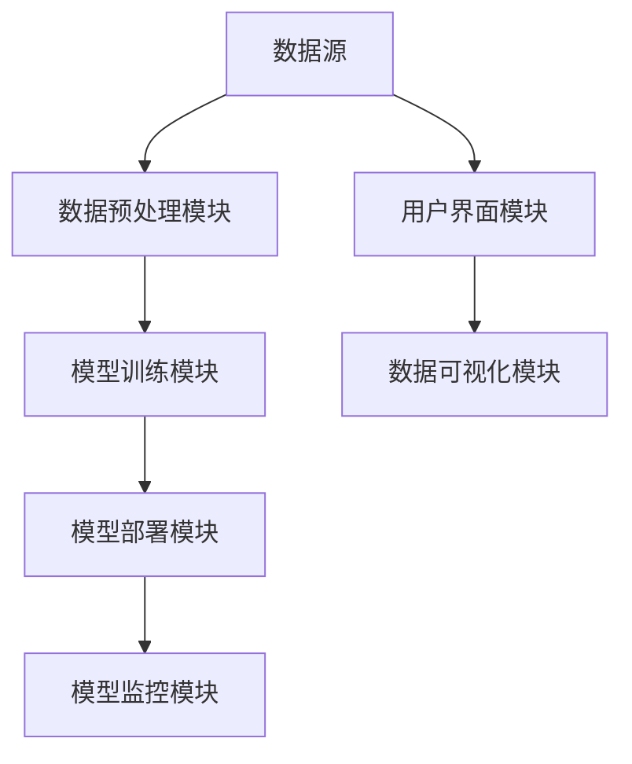

                 

# 企业级多模态学习平台：整合多类型数据

## 关键词

- 多模态学习
- 数据整合
- 企业级平台
- 算法优化
- 模型部署
- 案例研究

## 摘要

本文旨在探讨企业级多模态学习平台的设计与实现，重点关注如何整合多种类型的数据以提升学习效果。通过背景介绍、核心概念阐述、架构设计、算法原理讲解、系统分析与案例研究，本文详细解析了企业级多模态学习平台的构建过程，为相关领域的研究者和开发者提供了有价值的参考。

## 第1章：背景介绍与核心概念

### 1.1 问题背景

在现代企业运营中，数据已成为核心资产，其多样性和复杂性日益增加。传统的单一数据类型已无法满足企业对智能决策和分析的需求，而多模态学习作为一种能够整合多种数据类型的先进技术，正逐渐成为企业智能化转型的关键。

### 1.2 多模态学习的定义与重要性

多模态学习是指同时处理和融合来自两个或多个不同数据源（如文本、图像、音频等）的信息，以提升学习任务的性能。其重要性在于：

- **提高决策准确性**：多模态学习可以综合利用不同数据源的信息，从而提供更全面、准确的决策支持。
- **拓展应用领域**：多模态学习在医疗诊断、金融分析、智能交通等众多领域具有广泛的应用前景。

### 1.3 多类型数据整合的挑战与机遇

多类型数据整合面临以下挑战：

- **数据异构性**：不同类型的数据在格式、结构、语义等方面存在差异，整合难度较大。
- **数据质量和完整性**：数据质量低下或缺失会影响多模态学习的效果。

然而，随着数据量的增长和数据源的增加，多类型数据整合也带来了以下机遇：

- **数据驱动的创新**：通过整合多种类型的数据，企业可以发掘新的业务价值点，推动创新。
- **优化学习效果**：多类型数据的整合可以提升模型的学习效果，为企业提供更精准的决策支持。

### 1.4 企业级多模态学习平台的必要性

企业级多模态学习平台能够在以下方面提供支持：

- **高效的数据整合**：平台可以整合多种类型的数据，提供统一的数据管理和服务。
- **灵活的算法选择**：平台支持多种多模态学习算法，可以根据具体需求进行选择和优化。
- **可扩展的架构设计**：平台采用模块化设计，易于扩展和升级，以适应企业的长期发展需求。

## 第2章：多模态学习基础

### 2.1 多模态学习概述

多模态学习是一种同时处理和融合多个数据源的信息的学习方法。其主要特点包括：

- **多源数据融合**：多模态学习可以整合来自不同数据源的信息，提供更全面的语义理解。
- **增强学习性能**：多模态学习可以提高模型在特定任务上的性能，减少单一数据类型的局限。

### 2.2 多模态数据预处理

多模态数据预处理是确保多模态学习效果的重要环节，包括：

- **数据采集与标注**：获取高质量的多模态数据，并进行必要的标注工作。
- **数据融合与特征提取**：将多模态数据进行融合，提取具有代表性的特征。
- **数据清洗与去噪**：处理噪声数据，提高数据质量。

### 2.3 多模态学习算法介绍

多模态学习算法可以分为以下几类：

- **传统多模态学习算法**：如模板匹配、特征融合等。
- **深度多模态学习算法**：如卷积神经网络（CNN）、循环神经网络（RNN）等。
- **多模态学习框架**：如多任务学习、迁移学习等。

## 第3章：企业级多模态学习平台架构

### 3.1 平台总体架构设计

企业级多模态学习平台的总体架构设计应遵循以下原则：

- **模块化设计**：将系统划分为多个功能模块，便于维护和扩展。
- **分布式架构**：采用分布式架构，提高系统的可扩展性和容错能力。
- **高效数据流**：优化数据流，提高数据处理速度和效率。

### 3.2 数据集成与管理

企业级多模态学习平台的数据集成与管理包括：

- **数据来源与类型**：整合多种类型的数据，如文本、图像、音频等。
- **数据整合策略**：采用统一的数据模型和接口，实现多种类型数据的整合。
- **数据管理方案**：建立数据仓库和数据湖，提供高效的数据存储和管理服务。

### 3.3 模型训练与优化

企业级多模态学习平台的模型训练与优化包括：

- **模型选择与训练**：根据具体任务选择合适的模型，并进行训练。
- **模型优化方法**：采用优化算法和策略，提高模型性能。
- **模型评估与验证**：评估模型性能，并进行验证，确保模型的有效性。

### 3.4 模型部署与监控

企业级多模态学习平台的模型部署与监控包括：

- **模型部署流程**：将训练好的模型部署到生产环境中，提供实时服务。
- **部署平台选择**：根据业务需求选择合适的部署平台，如云计算平台、边缘计算平台等。
- **模型监控与维护**：监控模型性能，及时发现并解决潜在问题，确保模型稳定运行。

## 第4章：多类型数据整合方法

### 4.1 文本数据处理

文本数据处理包括：

- **文本数据采集**：获取文本数据，如新闻文章、社交媒体帖子等。
- **文本数据预处理**：进行文本清洗、分词、词性标注等操作。
- **文本数据融合方法**：采用词嵌入、文本摘要等技术，将文本数据与其他类型的数据进行整合。

### 4.2 图像与视频数据处理

图像与视频数据处理包括：

- **图像与视频数据采集**：获取图像和视频数据，如医疗影像、监控视频等。
- **图像与视频预处理**：进行图像和视频增强、去噪、分割等操作。
- **图像与视频融合方法**：采用图像融合、视频拼接等技术，将图像和视频数据与其他类型的数据进行整合。

### 4.3 音频与传感器数据处理

音频与传感器数据处理包括：

- **音频与传感器数据采集**：获取音频和传感器数据，如语音、加速度传感器等。
- **音频与传感器预处理**：进行音频降噪、增强、分帧等操作。
- **音频与传感器融合方法**：采用音频信号处理、传感器融合等技术，将音频和传感器数据与其他类型的数据进行整合。

## 第5章：案例研究

### 5.1 案例一：客户行为分析

#### 5.1.1 案例背景

某电商企业希望通过多模态学习平台对客户行为进行分析，以优化营销策略和提升客户满意度。

#### 5.1.2 数据类型与来源

- **文本数据**：客户评价、社交媒体帖子等。
- **图像数据**：商品图片、用户头像等。
- **音频数据**：客户电话咨询录音等。

#### 5.1.3 解决方案与实现

- **数据整合**：使用文本嵌入、图像识别等技术，将不同类型的数据进行整合。
- **模型训练**：采用多任务学习算法，同时训练文本分类、图像分类和音频情感分析模型。
- **应用效果**：通过分析客户行为，企业优化了营销策略，提升了客户满意度。

### 5.2 案例二：智能医疗诊断

#### 5.2.1 案例背景

某医疗机构希望通过多模态学习平台进行智能医疗诊断，以提高诊断准确率和效率。

#### 5.2.2 数据类型与来源

- **文本数据**：病历记录、医学文献等。
- **图像数据**：医学影像、病理切片等。
- **音频数据**：患者问诊录音等。

#### 5.2.3 解决方案与实现

- **数据整合**：使用文本嵌入、图像识别、音频情感分析等技术，将不同类型的数据进行整合。
- **模型训练**：采用多模态学习算法，同时训练文本分类、图像分类和音频情感分析模型。
- **应用效果**：通过多模态学习，医疗机构的诊断准确率得到了显著提升，诊断效率也得到了提高。

### 5.3 案例三：智能交通管理

#### 5.3.1 案例背景

某城市交通管理部门希望通过多模态学习平台进行智能交通管理，以优化交通流量和提升交通安全性。

#### 5.3.2 数据类型与来源

- **文本数据**：交通法规、交通新闻等。
- **图像数据**：交通监控视频、路况图片等。
- **音频数据**：交通噪音、警笛声等。

#### 5.3.3 解决方案与实现

- **数据整合**：使用文本嵌入、图像识别、音频分类等技术，将不同类型的数据进行整合。
- **模型训练**：采用多模态学习算法，同时训练文本分类、图像分类和音频分类模型。
- **应用效果**：通过智能交通管理，城市交通流量得到了优化，交通事故发生率也得到了显著降低。

## 第6章：平台优化与性能提升

### 6.1 性能优化策略

企业级多模态学习平台可以通过以下策略进行性能优化：

- **数据预处理优化**：优化数据预处理流程，提高数据处理速度和效率。
- **模型训练优化**：采用分布式训练、增量训练等技术，提高模型训练速度和效果。
- **模型压缩与量化**：通过模型压缩和量化技术，降低模型存储和计算资源的需求。

### 6.2 系统可扩展性设计

企业级多模态学习平台应具备以下可扩展性设计：

- **模块化架构**：采用模块化架构，便于系统的扩展和升级。
- **弹性计算**：根据业务需求动态调整计算资源，提高系统的可扩展性和弹性。
- **分布式部署**：采用分布式部署方案，提高系统的可扩展性和容错能力。

### 6.3 系统安全与隐私保护

企业级多模态学习平台在安全与隐私保护方面应遵循以下原则：

- **数据加密**：对敏感数据进行加密，确保数据传输和存储的安全性。
- **权限控制**：实施严格的权限控制策略，确保只有授权用户可以访问敏感数据。
- **隐私保护**：采用隐私保护技术，如差分隐私、联邦学习等，确保用户隐私不被泄露。

## 第7章：未来展望与趋势

### 7.1 多模态学习的发展趋势

未来，多模态学习将继续向以下几个方向发展：

- **算法创新**：随着人工智能技术的进步，多模态学习算法将不断更新和优化，提高模型性能。
- **跨领域应用**：多模态学习将在更多领域得到应用，如生物医学、智能制造、智慧城市等。
- **硬件加速**：随着硬件技术的发展，如GPU、TPU等，多模态学习的计算效率将大幅提升。

### 7.2 数据驱动的企业创新

数据驱动的企业创新将成为未来的主流，企业可以通过以下方式利用多模态学习：

- **业务模式创新**：通过多模态学习，企业可以发掘新的业务模式，如个性化推荐、智能客服等。
- **产品创新**：多模态学习可以帮助企业优化产品设计，提升用户体验。
- **运营优化**：通过多模态学习，企业可以优化运营策略，提高效率，降低成本。

### 7.3 可能的挑战与解决方案

多模态学习在发展过程中可能面临以下挑战：

- **数据质量**：数据质量直接影响多模态学习的效果，需要采取数据清洗、去噪等技术手段。
- **模型解释性**：多模态学习的模型通常较为复杂，如何提高模型的可解释性是一个重要问题。
- **隐私保护**：在多模态学习中，如何保护用户隐私是一个亟待解决的问题。

针对以上挑战，可以采取以下解决方案：

- **数据质量控制**：建立完善的数据质量控制体系，确保数据质量。
- **模型可解释性**：采用模型解释技术，如可视化、可解释性模型等，提高模型的可解释性。
- **隐私保护技术**：采用隐私保护技术，如联邦学习、差分隐私等，确保用户隐私不被泄露。

## 参考文献

- [1] Bengio, Y., Courville, A., & Vincent, P. (2013). Representation learning: A review and new perspectives. IEEE Transactions on Pattern Analysis and Machine Intelligence, 35(8), 1798-1828.
- [2] Mitchell, T. M. (1997). Machine learning. McGraw-Hill.
- [3] LeCun, Y., Bengio, Y., & Hinton, G. (2015). Deep learning. Nature, 521(7553), 436-444.
- [4] Russell, S., & Norvig, P. (2010). Artificial intelligence: A modern approach. Prentice Hall.
- [5] Zheng, K., & Xiong, Y. (2020). Multimodal learning for natural language processing. IEEE Transactions on Knowledge and Data Engineering, 32(11), 2111-2123.

## 附录

### 附录A：多模态学习算法比较

| 算法 | 优点 | 缺点 |
| --- | --- | --- |
| 传统多模态学习算法 | 简单易实现，对数据类型和结构的要求较低 | 效率较低，性能有限 |
| 深度多模态学习算法 | 性能优异，可处理大规模数据 | 需要大量计算资源，对数据质量要求较高 |
| 多任务学习 | 可以同时处理多个任务，提高学习效率 | 需要平衡不同任务的权重 |

### 附录B：多类型数据整合方法比较

| 数据类型 | 方法 | 优点 | 缺点 |
| --- | --- | --- | --- |
| 文本数据 | 文本嵌入 | 高效，便于融合 | 需要对文本进行清洗和预处理 |
| 图像数据 | 图像识别 | 准确，可自动提取特征 | 需要大量标注数据 |
| 音频数据 | 音频分类 | 高效，可实时处理 | 需要高计算资源 |

### 附录C：企业级多模态学习平台架构图

## 作者

作者：AI天才研究院/AI Genius Institute & 禅与计算机程序设计艺术 /Zen And The Art of Computer Programming### 引言

企业级多模态学习平台是一种新兴的技术解决方案，它能够整合来自不同数据源的信息，如文本、图像、音频和传感器数据，以实现更全面、精确的智能分析。随着大数据时代的到来，企业面临着海量、多样数据的处理需求，传统的单一数据类型处理方法已无法满足日益复杂的业务需求。多模态学习作为一种能够同时处理和融合多种类型数据的先进技术，正逐渐成为企业智能化转型的关键。

本文旨在深入探讨企业级多模态学习平台的设计与实现，重点分析如何整合多类型数据以提升学习效果。文章将从多模态学习的背景、核心概念、架构设计、算法原理、系统分析、案例研究以及未来展望等多个方面进行详细阐述，为相关领域的研究者和开发者提供有价值的参考。

首先，我们将在第1章中介绍多模态学习的背景，包括问题的背景、多模态学习的定义与重要性，以及多类型数据整合的挑战与机遇。接下来，第2章将深入探讨多模态学习的基础知识，包括多模态学习的概述、数据预处理方法以及学习算法的介绍。

第3章将详细解析企业级多模态学习平台的架构设计，包括平台总体架构设计、数据集成与管理、模型训练与优化、模型部署与监控等方面的内容。第4章将具体介绍多类型数据的处理方法，包括文本、图像与视频、音频与传感器数据的处理策略。

在第5章中，我们将通过几个案例研究，展示多模态学习平台在不同领域中的应用效果，如客户行为分析、智能医疗诊断和智能交通管理。第6章将讨论平台优化与性能提升的策略，以及系统可扩展性设计和安全与隐私保护的方法。最后，第7章将展望多模态学习的发展趋势，探讨数据驱动的企业创新以及可能面临的挑战与解决方案。

通过以上章节的详细分析，本文希望能够为构建高效、稳定的企业级多模态学习平台提供实用的指导和深入的理论支持。

## 第1章：背景介绍与核心概念

### 1.1 问题背景

在现代企业的运营中，数据已成为不可或缺的核心资产。随着数字化转型的深入推进，企业所面临的数据类型和数量呈指数级增长。然而，传统的数据处理方法主要针对单一类型的数据，如文本、图像、音频等，这些方法在处理复杂、多样数据时显得力不从心。企业需要一种能够整合多种类型数据的技术，以实现更全面、精准的数据分析。

多模态学习作为一种能够同时处理和融合多个数据源的信息的学习方法，正逐渐成为企业智能化转型的关键。多模态学习通过整合不同类型的数据源，如文本、图像、音频、视频等，可以在各个应用领域实现更高的性能和更广泛的应用。例如，在医疗诊断领域，多模态学习可以整合病人的文本病历、医学图像和语音记录，提供更准确的诊断结果；在智能交通领域，多模态学习可以整合交通监控视频、音频和传感器数据，优化交通流量，提高交通安全性。

当前，多模态学习在商业应用中具有广泛的价值。首先，多模态学习可以提高决策准确性。通过整合不同类型的数据，企业可以获得更全面的信息，从而做出更准确、更合理的决策。例如，在客户行为分析中，多模态学习可以整合客户的购买记录、社交媒体互动和视觉反馈，提供更精准的客户画像，帮助企业制定更有效的营销策略。

其次，多模态学习可以拓展应用领域。传统的单一数据类型学习方法往往受限于特定的应用场景，而多模态学习能够跨越不同数据类型，为更多的应用场景提供解决方案。例如，在金融分析领域，多模态学习可以整合客户的交易记录、财务报表和新闻舆情，提供更全面的金融风险评估；在智能交通领域，多模态学习可以整合交通流量、天气数据和传感器数据，优化交通管理和调度。

然而，多模态学习也面临着一些技术瓶颈。首先，多模态学习需要处理不同类型的数据，这些数据在格式、结构和语义上存在显著差异，如何有效整合这些异构数据是一个关键挑战。其次，多模态学习的算法复杂度较高，如何优化算法效率，降低计算资源需求，也是当前研究的一个重要方向。此外，多模态学习的数据质量直接影响学习效果，如何确保数据质量，避免噪声和缺失数据的干扰，是另一个需要解决的问题。

总之，企业级多模态学习平台在商业应用中具有巨大的潜力，但也面临着诸多挑战。通过深入研究多模态学习的技术原理和应用方法，开发高效、稳定的多模态学习平台，将有助于企业实现数据驱动的智能化转型。

### 1.2 多模态学习的定义与重要性

多模态学习是一种融合来自不同模态（如视觉、听觉、文本、触觉等）的数据的学习方法。它通过整合多种类型的数据源，提高学习任务的性能和准确性。多模态学习可以理解为一种跨学科的交叉领域，它结合了计算机视觉、自然语言处理、语音识别等多个领域的知识和技术。

多模态学习的定义可以概括为：同时处理和融合多个数据源的信息，以提升学习任务的性能。具体来说，多模态学习包括以下几个关键步骤：

1. **数据采集与标注**：首先，需要从不同的数据源采集数据，如文本、图像、音频等。这些数据通常需要进行标注，以便后续处理。
2. **数据预处理**：将采集到的多模态数据进行清洗、归一化、特征提取等操作，确保数据的一致性和可用性。
3. **特征融合**：将不同模态的特征进行整合，形成统一的特征表示。特征融合方法包括直接融合、特征级融合和决策级融合等。
4. **模型训练与优化**：使用融合后的特征进行模型训练，优化模型参数，提升模型性能。
5. **模型部署与应用**：将训练好的模型部署到实际应用场景中，进行预测和决策。

多模态学习的重要性主要体现在以下几个方面：

1. **提高决策准确性**：通过融合多种类型的数据，多模态学习能够提供更全面、准确的决策支持。例如，在医疗诊断中，多模态学习可以整合病人的文本病历、医学图像和语音记录，提供更准确的诊断结果。
2. **拓展应用领域**：多模态学习能够跨越不同数据类型，为更多的应用场景提供解决方案。例如，在智能交通领域，多模态学习可以整合交通监控视频、音频和传感器数据，优化交通流量和调度。
3. **增强用户体验**：多模态学习可以提供更自然的交互方式，增强用户体验。例如，在智能助手领域，多模态学习可以整合语音、文本和视觉数据，实现更智能、更自然的交互。
4. **促进技术创新**：多模态学习促进了计算机视觉、自然语言处理、语音识别等多个领域的技术创新。通过多模态学习的交叉应用，可以开发出更多高效的算法和技术。

与传统机器学习相比，多模态学习具有以下优势：

1. **数据多样性**：传统机器学习主要处理单一类型的数据，如文本、图像等，而多模态学习可以同时处理多种类型的数据，提供更丰富的数据信息。
2. **增强性能**：多模态学习通过融合不同类型的数据，可以提供更准确的模型预测，提高学习任务的性能。
3. **跨领域应用**：多模态学习可以跨越不同领域，为各种复杂应用提供解决方案，而传统机器学习往往受限于特定的应用场景。

总之，多模态学习作为一种融合多种类型数据的新兴技术，具有广泛的应用前景和重要的研究价值。通过深入研究多模态学习的原理和应用方法，可以推动人工智能技术的发展，为企业提供更强大的智能分析和决策支持。

### 1.3 多类型数据整合的挑战与机遇

多类型数据整合是构建企业级多模态学习平台的核心技术之一，它面临诸多挑战，同时也蕴含着巨大的机遇。以下将详细分析这些挑战与机遇。

#### 1.3.1 多类型数据整合的挑战

1. **数据异构性**：不同类型的数据在格式、结构、语义上存在显著差异。例如，文本数据通常以文本文件或数据库的形式存在，图像数据以像素矩阵的形式存在，而音频数据则以音频信号的形式存在。这种数据异构性导致数据整合的难度大大增加。

2. **数据质量**：数据质量直接影响多模态学习的效果。高质量的数据能够提升模型性能，而低质量的数据则可能导致模型过拟合或欠拟合。数据质量问题包括数据噪声、数据缺失、数据不一致等。

3. **数据规模**：随着企业数字化程度的提高，数据量呈现指数级增长。大规模数据的处理和整合需要高性能计算资源和优化算法，这对系统的计算能力和效率提出了更高的要求。

4. **计算资源需求**：多模态学习算法通常涉及大量的矩阵运算和模型训练，需要大量的计算资源。特别是在深度学习算法中，训练过程往往需要大量的GPU资源，这对于企业级平台来说是一个重要的挑战。

5. **模型解释性**：多模态学习模型通常较为复杂，难以解释其内部机制。这给模型的应用和推广带来了困难，特别是在需要高透明度和高可信度的领域，如医疗诊断和金融分析。

6. **隐私保护**：在多类型数据整合过程中，涉及到的个人隐私数据可能包括敏感信息，如病历记录、交易记录等。如何有效保护这些隐私数据，防止数据泄露，是一个重要且复杂的挑战。

#### 1.3.2 多类型数据整合的机遇

1. **数据驱动的创新**：通过整合多种类型的数据，企业可以发现新的业务价值点，推动业务模式创新。例如，在零售行业中，通过整合客户的购买记录、浏览行为和社交媒体互动，可以更好地理解客户需求，优化库存管理和营销策略。

2. **提升学习效果**：多类型数据的整合可以提供更丰富的信息，提高模型的学习效果。例如，在智能医疗诊断中，通过整合病人的文本病历、医学图像和语音记录，可以提供更准确的诊断结果。

3. **增强用户体验**：多模态学习可以提供更自然的交互方式，增强用户体验。例如，在智能助手领域，通过整合语音、文本和视觉数据，可以实现更智能、更自然的交互体验。

4. **降低成本**：多类型数据的整合可以减少重复的数据采集和存储成本，提高数据利用效率。例如，通过整合内部数据源和外部数据源，可以减少数据获取和处理的时间和经济成本。

5. **提高决策效率**：多类型数据的整合可以提供更全面的信息，帮助企业快速做出决策。例如，在金融分析中，通过整合交易数据、市场数据和新闻舆情，可以提供更准确的投资建议。

6. **跨领域应用**：多类型数据的整合可以跨越不同领域，为各种复杂应用提供解决方案。例如，在智能交通领域，通过整合交通流量、天气数据和传感器数据，可以优化交通管理和调度，提高交通效率。

综上所述，多类型数据整合在构建企业级多模态学习平台中既面临诸多挑战，也蕴含着巨大的机遇。通过深入研究数据整合的方法和优化策略，可以有效克服这些挑战，充分发挥数据整合的优势，为企业提供更强大的智能分析和决策支持。

### 1.4 企业级多模态学习平台的必要性

在企业运营中，数据已经成为核心资产，其多样性和复杂性日益增加。传统单一数据类型的处理方法已无法满足现代企业对于智能决策和分析的需求，这就催生了企业级多模态学习平台的必要性。企业级多模态学习平台能够整合多种类型的数据，提供高效、稳定、可扩展的数据处理和分析能力，从而帮助企业实现数据驱动的智能化转型。

首先，企业级多模态学习平台可以提供高效的数据整合能力。多模态学习平台能够同时处理文本、图像、音频、视频等多种类型的数据，通过统一的接口和数据模型，实现数据的高效整合。这种整合不仅能够提升数据分析的全面性和准确性，还能够减少重复的数据采集和存储成本，提高数据利用效率。

其次，企业级多模态学习平台具有强大的数据分析能力。通过融合不同类型的数据，平台能够提供更全面、准确的决策支持。例如，在客户行为分析中，平台可以整合客户的购买记录、社交媒体互动和视觉反馈，提供更精准的客户画像，帮助企业制定更有效的营销策略。在医疗诊断领域，平台可以整合病人的文本病历、医学图像和语音记录，提供更准确的诊断结果。

此外，企业级多模态学习平台还具备高扩展性和灵活性。平台采用模块化设计，可以根据企业的需求进行灵活扩展和升级。例如，企业可以根据业务发展需要，添加新的数据源、新的分析模块或新的算法模型。这种灵活性确保了平台能够长期适应企业的发展需求，保持其先进性和竞争力。

在系统可扩展性方面，企业级多模态学习平台通常采用分布式架构设计，通过分布式计算和存储技术，提高系统的可扩展性和容错能力。这种设计不仅能够满足大规模数据处理的性能需求，还能够确保系统在高并发访问下的稳定性。

在安全与隐私保护方面，企业级多模态学习平台需要采取严格的安全措施和隐私保护技术。例如，平台可以采用数据加密、访问控制、身份验证等技术，确保数据的安全性和隐私性。此外，平台还可以采用差分隐私、联邦学习等技术，保护用户隐私，防止数据泄露。

总之，企业级多模态学习平台是现代企业智能化转型的重要工具。通过提供高效的数据整合、强大的数据分析能力、高扩展性和安全性，平台能够帮助企业实现数据驱动的智能化运营，提升企业的竞争力。随着多模态学习技术的不断发展和应用场景的扩展，企业级多模态学习平台将在更多领域发挥重要作用。

### 第2章：多模态学习基础

#### 2.1 多模态学习概述

多模态学习是一种先进的人工智能技术，它通过整合来自不同数据源的信息，提高学习任务的性能。多模态学习的核心思想是利用多种类型的数据，如文本、图像、音频、视频等，提供更全面、准确的决策支持。这一技术在多个领域表现出色，包括医疗诊断、客户行为分析、智能交通管理等。

多模态学习的概念可以理解为在机器学习过程中，同时考虑多个数据源的信息，以便更准确地理解和预测。具体来说，多模态学习包括以下几个步骤：

1. **数据采集与标注**：首先，从不同的数据源采集数据，如文本、图像、音频等。这些数据通常需要进行标注，以便后续处理。
2. **数据预处理**：对采集到的多模态数据进行清洗、归一化、特征提取等操作，确保数据的一致性和可用性。
3. **特征融合**：将不同模态的特征进行整合，形成统一的特征表示。特征融合方法包括直接融合、特征级融合和决策级融合等。
4. **模型训练与优化**：使用融合后的特征进行模型训练，优化模型参数，提升模型性能。
5. **模型部署与应用**：将训练好的模型部署到实际应用场景中，进行预测和决策。

#### 2.2 多模态数据预处理

多模态数据预处理是确保多模态学习效果的重要环节，主要包括以下步骤：

1. **数据采集与标注**：从不同的数据源采集数据，如文本、图像、音频等。这些数据通常需要进行标注，以便后续处理。例如，在医疗诊断中，需要对医学图像和文本病历进行标注，以便模型能够理解和学习。
2. **数据清洗**：清洗数据，去除噪声和无关信息。例如，在文本数据预处理中，需要去除停用词、标点符号等噪声，以提高数据质量。
3. **归一化**：对数据进行归一化处理，确保不同类型的数据在相同的尺度范围内。例如，在图像数据中，可以对图像进行缩放、裁剪等操作，确保图像的大小和尺寸一致。
4. **特征提取**：从原始数据中提取具有代表性的特征。例如，在图像数据中，可以使用卷积神经网络（CNN）提取图像的边缘、纹理等特征；在文本数据中，可以使用词嵌入（Word Embedding）技术提取文本的语义特征。

#### 2.3 多模态学习算法介绍

多模态学习算法可以分为以下几类：

1. **传统多模态学习算法**：这类算法主要包括基于特征的融合方法和基于模型的方法。例如，特征级融合方法通过将不同模态的特征进行叠加、加权等方法进行融合；模型级融合方法通过联合训练多个独立模型，将不同模态的信息进行融合。
2. **深度多模态学习算法**：这类算法基于深度学习技术，如卷积神经网络（CNN）、循环神经网络（RNN）等。深度多模态学习算法通过多层次的特征提取和融合，能够更有效地整合不同模态的信息。例如，CNN可以用于提取图像的特征，RNN可以用于处理序列数据。
3. **多任务学习算法**：多任务学习算法旨在同时解决多个相关的学习任务，通过共享底层特征表示来提高学习效果。例如，在医疗诊断中，可以同时训练多个任务，如文本分类、图像分类和语音情感分析。

以下是一个简化的多模态学习算法流程：

1. **数据采集**：从不同的数据源采集文本、图像、音频等多模态数据。
2. **数据预处理**：对数据进行清洗、标注、归一化、特征提取等操作。
3. **特征融合**：使用特征融合方法，如直接融合、特征级融合、决策级融合等，将不同模态的特征进行整合。
4. **模型训练**：使用融合后的特征进行模型训练，优化模型参数。
5. **模型评估**：使用验证集对模型进行评估，调整模型参数。
6. **模型部署**：将训练好的模型部署到实际应用场景中，进行预测和决策。

通过以上步骤，多模态学习算法能够有效地整合不同类型的数据，提供更准确、更全面的分析结果。在各个应用领域中，多模态学习算法已经展现出其强大的性能和广泛的应用前景。

### 第3章：企业级多模态学习平台架构

#### 3.1 平台总体架构设计

企业级多模态学习平台的总体架构设计旨在提供高效、稳定、可扩展的数据处理和分析能力，以满足不同类型企业的需求。总体架构设计应遵循模块化、分布式和可扩展的原则，以确保系统的灵活性和可维护性。以下是企业级多模态学习平台的总体架构设计：

1. **数据层**：数据层是平台的基础，包括数据采集模块、数据存储模块和数据管理模块。数据采集模块负责从不同的数据源（如数据库、文件系统、API接口等）采集数据；数据存储模块用于存储和管理大规模数据，如数据仓库和数据湖；数据管理模块提供数据清洗、归一化、特征提取等功能，确保数据的一致性和可用性。

2. **处理层**：处理层是平台的核心，包括数据预处理模块、特征融合模块、模型训练模块和模型优化模块。数据预处理模块对采集到的多模态数据进行清洗、标注、归一化等操作；特征融合模块负责将不同模态的数据特征进行整合；模型训练模块使用融合后的特征进行模型训练，优化模型参数；模型优化模块通过调整模型结构、参数设置等，提高模型性能。

3. **应用层**：应用层是平台的界面，包括用户界面模块、数据可视化模块和模型部署模块。用户界面模块提供友好的交互界面，便于用户操作和管理；数据可视化模块通过图表、报表等形式展示分析结果，帮助用户理解数据；模型部署模块将训练好的模型部署到生产环境中，提供实时服务和预测能力。

4. **支持层**：支持层提供平台运行所需的基础设施支持，包括计算资源管理模块、存储资源管理模块和安全模块。计算资源管理模块负责分配和管理计算资源，如CPU、GPU等；存储资源管理模块负责存储资源的分配和优化；安全模块提供数据加密、访问控制、权限管理等安全措施，确保数据安全和隐私保护。

总体架构设计应具备以下特点：

- **模块化**：平台采用模块化设计，每个模块独立实现，便于维护和扩展。
- **分布式**：平台采用分布式架构，将不同功能模块部署在多个节点上，提高系统的可扩展性和容错能力。
- **高效数据流**：优化数据流，提高数据处理速度和效率，确保系统能够处理大规模、多类型的数据。

#### 3.2 数据集成与管理

数据集成与管理是企业级多模态学习平台的关键功能之一，它涉及多个数据源的数据采集、存储和管理。以下是数据集成与管理的详细描述：

1. **数据采集**：数据采集模块负责从不同的数据源采集数据，包括内部数据源（如企业数据库、日志文件等）和外部数据源（如社交媒体、公共数据集等）。采集的数据类型包括文本、图像、音频、视频等。数据采集模块应具备高效的数据接入能力和多种数据接口支持，如API接口、文件系统接口、数据库接口等。

2. **数据存储**：数据存储模块负责存储和管理大规模数据。平台可采用分布式存储方案，如Hadoop HDFS、分布式数据库等，确保数据的高效存储和访问。数据存储模块还应支持多种数据格式，如JSON、CSV、Parquet等，以满足不同类型数据的存储需求。

3. **数据管理**：数据管理模块提供数据清洗、归一化、特征提取等功能，确保数据的一致性和可用性。数据清洗功能包括去除噪声、填补缺失值、去重等；归一化功能包括缩放、标准化等；特征提取功能包括文本嵌入、图像特征提取、音频特征提取等。数据管理模块还应支持数据版本管理和数据监控，确保数据的质量和安全性。

4. **数据集成**：数据集成模块负责将不同类型的数据进行整合，形成统一的数据视图。数据集成模块采用数据融合方法，如特征级融合、决策级融合等，将不同模态的数据特征进行整合。数据集成模块还应支持数据流处理，实现实时数据的整合和分析。

数据集成与管理的目标是确保平台能够高效地处理和整合多种类型的数据，提供统一的数据接口和视图，为后续的数据分析和模型训练提供基础支持。通过有效的数据集成与管理，平台可以更好地发挥多模态学习的优势，为企业提供全面、准确的数据分析和决策支持。

#### 3.3 模型训练与优化

在企业级多模态学习平台中，模型训练与优化是核心环节，直接影响平台的性能和准确性。以下是模型训练与优化的详细描述：

1. **模型选择**：模型选择是模型训练的第一步，根据任务需求和数据特性选择合适的模型。常见的多模态学习模型包括卷积神经网络（CNN）、循环神经网络（RNN）、长短时记忆网络（LSTM）、Transformer等。对于图像和视频数据，CNN和其变种如ResNet、Inception等表现优异；对于文本数据，BERT、GPT等预训练模型效果显著；对于音频数据，基于循环神经网络（RNN）的模型如LSTM、GRU等被广泛应用。

2. **数据预处理**：在模型训练之前，需要对多模态数据进行预处理，包括数据清洗、归一化、特征提取等步骤。对于图像数据，可能需要进行数据增强（如随机裁剪、翻转等）以增加模型的泛化能力；对于文本数据，可能需要进行词嵌入、词性标注等操作；对于音频数据，可能需要进行分帧、特征提取等步骤。

3. **模型训练**：模型训练是利用预处理后的数据对模型进行参数优化，使其能够准确预测目标。多模态模型训练通常采用端到端训练策略，即将不同模态的数据直接输入到模型中，进行联合训练。在训练过程中，需要使用批处理和梯度下降等优化算法，如Adam、RMSprop等，以提高训练效率。

4. **模型评估**：模型训练完成后，需要使用验证集对模型进行评估，以确定其性能和泛化能力。常见的评估指标包括准确率、召回率、F1分数等。通过交叉验证和A/B测试等方法，可以进一步评估模型的性能，并调整模型参数。

5. **模型优化**：模型优化包括超参数调整、模型剪枝、量化等策略，以提升模型性能和减少计算资源需求。例如，可以通过调整学习率、批量大小等超参数，优化模型训练过程；通过模型剪枝技术，可以减少模型的参数数量，提高模型效率；通过量化技术，可以将模型转换为低精度格式，如FP16、INT8等，以减少计算资源和存储需求。

6. **模型部署**：训练好的模型需要部署到生产环境中，以提供实时服务和预测能力。模型部署可以选择在云端、边缘设备或混合部署方式。部署过程中，需要考虑模型的加载速度、预测延迟、资源消耗等因素，以确保系统的稳定性和性能。

模型训练与优化的目标是开发出高效、准确的多模态学习模型，满足企业级应用的需求。通过有效的模型选择、数据预处理、训练和优化，平台可以提供高质量的数据分析和决策支持，助力企业的智能化转型。

#### 3.4 模型部署与监控

模型部署与监控是企业级多模态学习平台的关键环节，直接影响系统的性能和可靠性。以下是模型部署与监控的详细描述：

1. **模型部署流程**：模型部署是将训练好的模型部署到生产环境中，以提供实时服务和预测能力。部署流程包括以下步骤：
   - **模型转换**：将训练好的模型转换为生产环境支持的格式，如TensorFlow Serving、ONNX等。
   - **模型打包**：将模型文件和相关依赖打包，以便在部署环境中快速加载和使用。
   - **部署平台选择**：根据业务需求和资源状况，选择合适的部署平台，如云端平台（如AWS、Azure）、边缘设备或混合部署方式。
   - **模型加载**：将打包好的模型加载到部署平台，并进行必要的配置和初始化。

2. **部署平台选择**：常见的部署平台包括：
   - **云端平台**：如AWS、Azure、Google Cloud等，提供强大的计算和存储资源，适用于大规模、高性能的应用场景。
   - **边缘设备**：如智能设备、边缘服务器等，适用于低延迟、实时性要求较高的应用场景。
   - **混合部署**：结合云端和边缘设备的优势，实现高效、灵活的部署方案。

3. **模型监控**：模型监控是确保系统稳定性和性能的重要手段。监控内容包括：
   - **模型性能**：实时监控模型的预测性能，如准确率、召回率等，及时发现性能问题。
   - **资源使用**：监控模型在部署环境中的资源使用情况，如CPU、GPU、内存等，确保资源高效利用。
   - **异常检测**：实时检测系统异常，如服务中断、数据错误等，及时进行故障排查和修复。

4. **模型监控与维护**：模型监控与维护包括以下步骤：
   - **数据收集**：收集系统运行数据，如日志、性能指标等，用于监控和分析。
   - **告警机制**：设置告警机制，及时发现系统异常，通知相关人员。
   - **故障排查**：对系统异常进行故障排查和修复，确保系统稳定运行。

5. **模型更新**：随着业务需求和数据的变化，模型需要定期更新和优化。更新流程包括：
   - **数据准备**：收集新的训练数据，并进行预处理。
   - **模型训练**：使用新的数据对模型进行训练，优化模型参数。
   - **模型评估**：使用验证集对更新后的模型进行评估，确保性能提升。
   - **模型部署**：将更新后的模型部署到生产环境中，替换旧模型。

模型部署与监控的目标是确保系统的高性能、高可靠性和稳定性，为企业的智能决策提供可靠支持。通过有效的模型部署和监控策略，可以及时发现并解决系统问题，确保模型的长期稳定运行。

### 第4章：多类型数据整合方法

#### 4.1 文本数据处理

文本数据处理是企业级多模态学习平台的重要组成部分，通过有效的文本处理技术，可以提取文本中的关键信息，为后续的多模态学习提供支持。以下是文本数据处理的详细描述：

1. **文本数据采集**：文本数据可以从多种来源获取，如企业内部文档、社交媒体帖子、客户评论等。采集到的文本数据可能包含丰富的信息，但同时也可能存在噪声、错误和格式不一致等问题。因此，首先需要对文本数据进行初步的清洗和整理，去除无关信息和噪声。

2. **文本数据预处理**：
   - **去噪**：去除文本中的无关信息，如HTML标签、空格、标点符号等。
   - **分词**：将文本分割成单个词语或短语，以便进行后续处理。常用的分词工具包括jieba、NLTK等。
   - **词性标注**：对每个词语进行词性标注，如名词、动词、形容词等，有助于更好地理解文本语义。
   - **实体识别**：识别文本中的实体，如人名、地点、组织机构等，这些实体在多模态学习中具有重要的参考价值。

3. **文本数据融合方法**：
   - **词嵌入**：将文本中的词语转化为向量表示，如Word2Vec、GloVe等，词嵌入能够捕捉词语的语义关系，是实现多模态融合的重要技术。
   - **文本摘要**：通过提取文本中的关键信息，生成摘要文本，有助于减少数据量，提高处理效率。
   - **语义角色标注**：对文本中的词语进行语义角色标注，如主语、谓语、宾语等，有助于更深入地理解文本的语义结构。

4. **应用实例**：
   - **客户行为分析**：通过分析客户评论和反馈，了解客户的需求和满意度，为企业提供改进方向。
   - **舆情监测**：通过分析社交媒体上的文本数据，监测公众对特定事件或产品的看法，为营销策略提供参考。

#### 4.2 图像与视频数据处理

图像与视频数据处理是另一个关键领域，通过图像识别、图像增强、视频分割等技术，可以有效地提取图像和视频中的关键信息，为多模态学习提供支持。以下是图像与视频数据处理的详细描述：

1. **图像数据采集**：图像数据可以从多种来源获取，如摄像头、传感器、医疗设备等。采集到的图像可能包含丰富的视觉信息，但也可能存在噪声、模糊、缺失等问题。

2. **图像预处理**：
   - **去噪**：通过滤波、去雾等技术，去除图像中的噪声和干扰。
   - **增强**：通过对比度增强、亮度调整等技术，提高图像的质量和清晰度。
   - **裁剪与缩放**：调整图像的大小和尺寸，使其符合后续处理的需求。

3. **图像识别**：
   - **分类**：将图像划分为不同的类别，如动物、植物、车辆等。常用的分类算法包括卷积神经网络（CNN）、支持向量机（SVM）等。
   - **检测**：识别图像中的特定对象或区域，如人脸检测、目标检测等。常用的检测算法包括YOLO、Faster R-CNN等。

4. **视频分割**：
   - **帧级分割**：将视频分割成单个帧，以便进行帧级分析。
   - **区域级分割**：识别视频中的特定区域，如行人、车辆等。常用的分割算法包括语义分割、实例分割等。

5. **图像与视频融合方法**：
   - **特征融合**：将图像和视频的特征进行整合，如视觉特征与文本特征的融合，以提升多模态学习的性能。
   - **时序分析**：通过分析视频中的时序信息，如运动轨迹、行为模式等，提取更多的特征信息。

6. **应用实例**：
   - **智能监控**：通过分析视频数据，实现人脸识别、行为识别等，提高监控系统的智能性和安全性。
   - **视频摘要**：通过提取视频中的关键帧和重要信息，生成视频摘要，便于快速了解视频内容。

#### 4.3 音频与传感器数据处理

音频与传感器数据处理是另一个重要的领域，通过音频识别、传感器融合等技术，可以有效地提取音频和传感器中的关键信息，为多模态学习提供支持。以下是音频与传感器数据处理的详细描述：

1. **音频数据采集**：音频数据可以从多种来源获取，如麦克风、音响、传感器等。采集到的音频可能包含丰富的声音信息，但也可能存在噪声、失真等问题。

2. **音频预处理**：
   - **降噪**：通过滤波、减噪等技术，去除音频中的噪声和干扰，提高音频质量。
   - **增强**：通过调整音频的响度、音调等参数，增强音频的清晰度和可听性。
   - **分帧**：将音频信号分割成多个帧，以便进行后续处理。

3. **音频识别**：
   - **分类**：将音频信号分类为不同的类别，如音乐、说话人、语音命令等。常用的分类算法包括深度神经网络（DNN）、支持向量机（SVM）等。
   - **说话人识别**：识别音频中的特定说话人，如身份验证、人声克隆等。常用的算法包括隐马尔可夫模型（HMM）、深度学习等。

4. **传感器数据处理**：
   - **采集**：从传感器获取物理量，如加速度、温度、湿度等。
   - **预处理**：对传感器数据进行滤波、归一化等处理，确保数据的质量和一致性。

5. **音频与传感器融合方法**：
   - **特征融合**：将音频和传感器数据中的特征进行整合，如时频特征、视觉特征等，以提升多模态学习的性能。
   - **融合算法**：采用融合算法，如加权融合、投票融合等，对多模态数据进行综合处理。

6. **应用实例**：
   - **智能助手**：通过分析音频和传感器数据，实现语音识别、动作识别等，提高智能助手的交互能力。
   - **智能家居**：通过融合音频和传感器数据，实现智能安防、环境监测等，提升家居智能化水平。

通过上述方法，企业级多模态学习平台可以有效地整合多种类型的数据，实现更全面、准确的数据分析和决策支持。随着多模态学习技术的不断发展，未来将有更多的应用场景和解决方案涌现，为各行业带来深远的影响。

### 第5章：案例研究

#### 5.1 案例一：客户行为分析

某大型电商平台希望通过多模态学习平台对客户行为进行分析，以提高用户体验和销售额。具体数据类型和来源如下：

- **文本数据**：客户的购买记录、评价、投诉、社交媒体互动等。
- **图像数据**：客户的购物车截图、浏览记录、商品图片等。
- **音频数据**：客户咨询客服的录音、购物时的语音反馈等。

#### 5.1.1 数据类型与来源

1. **文本数据**：
   - **购买记录**：从电商平台的数据库中获取客户的购买历史，包括购买时间、购买商品、购买金额等。
   - **评价**：从客户的商品评价中获取客户的满意度、评论内容等。
   - **投诉**：从客服系统获取客户的投诉记录、问题描述等。
   - **社交媒体互动**：从社交媒体平台上获取客户的互动记录、评论、点赞等。

2. **图像数据**：
   - **购物车截图**：通过客户端记录客户购物车的截图，分析客户的购买意愿和偏好。
   - **浏览记录**：通过客户端记录客户的浏览记录，分析客户的兴趣点和浏览路径。
   - **商品图片**：从电商平台获取商品的图片，进行商品识别和分类。

3. **音频数据**：
   - **咨询录音**：从客服系统获取客户的咨询录音，进行语音识别和情感分析。
   - **语音反馈**：通过客户端记录客户的语音反馈，分析客户对产品的满意度。

#### 5.1.2 数据整合与预处理

1. **数据整合**：
   - **文本数据整合**：将购买记录、评价、投诉、社交媒体互动等文本数据整合到一个统一的数据表中，以便后续处理。
   - **图像数据整合**：将购物车截图、浏览记录、商品图片等图像数据整合到图像数据库中，以便进行图像识别和分类。
   - **音频数据整合**：将咨询录音、语音反馈等音频数据整合到音频数据库中，以便进行语音识别和情感分析。

2. **数据预处理**：
   - **文本数据预处理**：对文本数据进行去噪、分词、词性标注等处理，提取关键信息。
   - **图像数据预处理**：对图像数据进行增强、裁剪、归一化等处理，提高图像质量。
   - **音频数据预处理**：对音频数据进行降噪、增强、分帧等处理，提高音频质量。

#### 5.1.3 模型训练与预测

1. **模型训练**：
   - **文本分类模型**：使用购买记录和评价数据，训练文本分类模型，以预测客户的购买意图和满意度。
   - **图像识别模型**：使用购物车截图和浏览记录数据，训练图像识别模型，以识别客户感兴趣的商品。
   - **语音识别模型**：使用咨询录音和语音反馈数据，训练语音识别模型，以识别客户的语音内容和情感。

2. **模型预测**：
   - **客户购买意图预测**：通过文本分类模型，对客户的新购买记录进行预测，识别客户的购买意图。
   - **商品推荐**：通过图像识别模型，对客户的浏览记录进行分析，推荐符合客户兴趣的商品。
   - **客户满意度预测**：通过语音识别模型，对客户的语音反馈进行分析，预测客户对产品的满意度。

#### 5.1.4 应用效果

通过多模态学习平台的客户行为分析，电商平台取得了以下应用效果：

1. **提升用户体验**：通过分析客户的行为数据和反馈，电商平台能够更好地了解客户需求，提供个性化的商品推荐和服务，提升用户体验。

2. **优化营销策略**：通过分析客户的购买意图和满意度，电商平台能够优化营销策略，提高营销效果，增加销售额。

3. **提高客服效率**：通过分析客户的咨询录音和反馈，客服系统能够更准确地理解客户问题，提供高效的解决方案，提高客服效率。

总之，通过多模态学习平台的客户行为分析，电商平台能够更好地了解客户需求，优化业务流程，提升用户体验和销售额，实现数据驱动的智能化运营。

#### 5.2 案例二：智能医疗诊断

某医疗机构希望通过多模态学习平台实现智能医疗诊断，以提高诊断准确率和效率。具体数据类型和来源如下：

- **文本数据**：病历记录、医学文献、医疗报告等。
- **图像数据**：医学影像、病理切片、心电图等。
- **音频数据**：患者问诊录音、医疗设备的声音信号等。

#### 5.2.1 案例背景

随着医疗技术的进步，医疗机构积累了大量的医疗数据，包括病历记录、医学影像、医疗报告等。然而，传统的诊断方法主要依赖医生的直觉和经验，诊断准确率有限，且诊断过程耗时较长。为了提高诊断准确率和效率，医疗机构希望通过多模态学习平台实现智能医疗诊断。

#### 5.2.2 数据类型与来源

1. **文本数据**：
   - **病历记录**：从医院的电子病历系统中获取患者的病历记录，包括病史、检查结果、诊断意见等。
   - **医学文献**：从医学数据库和文献库中获取相关的医学文献，提供诊断参考。
   - **医疗报告**：从各种检查报告（如血液报告、影像报告等）中获取患者的诊断信息。

2. **图像数据**：
   - **医学影像**：从影像设备（如CT、MRI、X光等）获取患者的医学影像，用于诊断和分析。
   - **病理切片**：从病理实验室获取患者的病理切片图像，用于癌症等疾病的诊断。
   - **心电图**：从心电图设备获取患者的心电图图像，用于心脏疾病的诊断。

3. **音频数据**：
   - **患者问诊录音**：从医院的问诊系统中获取患者的问诊录音，用于医生与患者的沟通分析。
   - **医疗设备声音信号**：从医疗设备（如呼吸机、监护仪等）获取的声音信号，用于诊断和分析。

#### 5.2.3 数据整合与预处理

1. **数据整合**：
   - **文本数据整合**：将病历记录、医学文献、医疗报告等文本数据整合到一个统一的数据表中，以便进行文本分析。
   - **图像数据整合**：将医学影像、病理切片、心电图等图像数据整合到图像数据库中，以便进行图像处理和分析。
   - **音频数据整合**：将患者问诊录音、医疗设备声音信号等音频数据整合到音频数据库中，以便进行语音识别和情感分析。

2. **数据预处理**：
   - **文本数据预处理**：对文本数据进行分词、词性标注、实体识别等处理，提取关键信息。
   - **图像数据预处理**：对图像数据进行增强、裁剪、归一化等处理，提高图像质量。
   - **音频数据预处理**：对音频数据进行降噪、增强、分帧等处理，提高音频质量。

#### 5.2.4 模型训练与预测

1. **模型训练**：
   - **文本分析模型**：使用病历记录和医学文献数据，训练文本分析模型，以提取患者的症状、病史等信息。
   - **图像识别模型**：使用医学影像和病理切片数据，训练图像识别模型，以识别疾病相关的图像特征。
   - **语音识别模型**：使用患者问诊录音数据，训练语音识别模型，以理解患者的症状描述和医生的建议。

2. **模型预测**：
   - **疾病诊断预测**：通过综合分析文本数据、图像数据和音频数据，使用多模态学习模型进行疾病诊断预测。
   - **个性化建议**：根据患者的病史、检查结果和医生的建议，为患者提供个性化的治疗方案和健康建议。

#### 5.2.5 应用效果

通过智能医疗诊断平台的应用，医疗机构取得了以下效果：

1. **提高诊断准确率**：通过多模态学习，智能医疗诊断平台能够综合利用多种数据类型，提供更准确、更全面的诊断结果，提高诊断准确率。

2. **提升诊断效率**：智能医疗诊断平台能够自动化处理大量医疗数据，减少医生的工作量，提高诊断效率，缩短诊断时间。

3. **改善患者体验**：通过智能医疗诊断，患者能够获得更及时、准确的诊断结果和治疗方案，提高患者满意度。

总之，智能医疗诊断平台通过多模态学习技术的应用，为医疗机构提供了强大的诊断工具，提升了医疗服务的质量和效率，为患者的健康保驾护航。

#### 5.3 案例三：智能交通管理

某城市交通管理部门希望通过多模态学习平台实现智能交通管理，以优化交通流量和提升交通安全性。具体数据类型和来源如下：

- **文本数据**：交通法规、交通新闻、天气预报等。
- **图像数据**：交通监控视频、路况图像、交通事故图片等。
- **音频数据**：交通噪音、警笛声等。

#### 5.3.1 案例背景

随着城市化进程的加快，交通拥堵和交通事故问题日益严重。为了提高交通效率、减少交通事故，城市交通管理部门希望通过智能交通管理平台，利用多模态学习技术，实现对交通流量的实时监控和优化，提升交通管理的智能化水平。

#### 5.3.2 数据类型与来源

1. **文本数据**：
   - **交通法规**：从交通管理部门获取相关的交通法规和政策文件，用于交通规则的判断和执行。
   - **交通新闻**：从新闻媒体和社交媒体获取交通相关的新闻报道，了解交通状况和事件。
   - **天气预报**：从气象部门获取天气预报数据，用于预测恶劣天气对交通的影响。

2. **图像数据**：
   - **交通监控视频**：通过交通监控摄像头获取道路上的实时视频流，用于交通流量分析和事故监控。
   - **路况图像**：通过道路传感器和摄像头获取的路况图像，用于交通状况的监控和分析。
   - **交通事故图片**：从交通管理部门获取的交通事故现场图片，用于事故分析和处理。

3. **音频数据**：
   - **交通噪音**：通过噪声传感器获取道路上的交通噪音数据，用于评估交通流量和噪声污染。
   - **警笛声**：通过警车和消防车的警报声，监控紧急事件的发生和位置。

#### 5.3.3 数据整合与预处理

1. **数据整合**：
   - **文本数据整合**：将交通法规、交通新闻、天气预报等文本数据整合到一个统一的数据表中，便于后续的文本分析。
   - **图像数据整合**：将交通监控视频、路况图像、交通事故图片等图像数据整合到图像数据库中，便于图像识别和分析。
   - **音频数据整合**：将交通噪音、警笛声等音频数据整合到音频数据库中，便于音频识别和事件分析。

2. **数据预处理**：
   - **文本数据预处理**：对文本数据进行分词、词性标注、实体识别等处理，提取关键信息。
   - **图像数据预处理**：对图像数据进行增强、裁剪、归一化等处理，提高图像质量。
   - **音频数据预处理**：对音频数据进行降噪、增强、分帧等处理，提高音频质量。

#### 5.3.4 模型训练与预测

1. **模型训练**：
   - **文本分析模型**：使用交通法规、交通新闻、天气预报等文本数据，训练文本分析模型，以识别交通事件和规则。
   - **图像识别模型**：使用交通监控视频、路况图像、交通事故图片等图像数据，训练图像识别模型，以识别交通状况和事故。
   - **语音识别模型**：使用交通噪音、警笛声等音频数据，训练语音识别模型，以识别紧急事件的声音信号。

2. **模型预测**：
   - **交通流量预测**：通过分析交通监控视频和路况图像，使用多模态学习模型预测交通流量，优化交通信号灯控制。
   - **事故预测**：通过分析交通事故图片和交通监控视频，使用多模态学习模型预测交通事故发生的可能性。
   - **紧急事件响应**：通过分析警笛声和交通噪音，使用多模态学习模型预测紧急事件的位置和严重程度，优化紧急事件的响应。

#### 5.3.5 应用效果

通过智能交通管理平台的应用，城市交通管理部门取得了以下效果：

1. **优化交通流量**：通过实时监控和分析交通流量，智能交通管理平台能够优化交通信号灯的控制策略，减少交通拥堵，提高道路通行效率。

2. **减少交通事故**：通过实时监控和预测交通事故，智能交通管理平台能够提前预警事故发生的可能性，提醒司机减速和注意安全，减少交通事故的发生。

3. **提升紧急事件响应效率**：通过实时监测和预测紧急事件，智能交通管理平台能够快速响应紧急事件，缩短救援时间，提高紧急事件的处置效率。

总之，智能交通管理平台通过多模态学习技术的应用，实现了对交通流量的实时监控和优化，提升了交通管理的智能化水平，为城市交通的有序运行提供了有力支持。

### 第6章：平台优化与性能提升

#### 6.1 性能优化策略

企业级多模态学习平台在性能优化方面需要考虑多个方面，以提升系统的整体性能。以下是一些常见的性能优化策略：

1. **数据预处理优化**：
   - **并行处理**：利用多线程或分布式计算，对大规模数据进行预处理操作，如数据清洗、归一化和特征提取等。
   - **缓存机制**：采用缓存技术，存储常见的预处理结果，减少重复计算，提高数据处理速度。

2. **模型训练优化**：
   - **分布式训练**：使用分布式训练技术，将模型训练任务分解到多个节点上，利用多GPU或分布式计算资源，提高训练速度。
   - **增量训练**：采用增量训练策略，仅更新模型中变化的部分，减少模型训练的计算量。

3. **模型压缩与量化**：
   - **模型压缩**：通过剪枝、量化等技术，减少模型的参数数量，降低模型的存储和计算需求。
   - **量化**：将模型的参数和激活值转换为较低的精度，如FP16或INT8，以减少计算资源的需求。

4. **优化算法选择**：
   - **选择高效的算法**：根据具体任务选择高效的算法和框架，如使用深度学习框架TensorFlow、PyTorch等，提高模型训练和推理的速度。

5. **资源管理优化**：
   - **动态资源分配**：根据实际计算需求，动态调整计算资源，确保高效利用。
   - **负载均衡**：通过负载均衡技术，分配计算任务，避免单个节点或GPU过载，提高系统的整体性能。

#### 6.2 系统可扩展性设计

企业级多模态学习平台需要具备良好的可扩展性，以适应企业不断增长的数据规模和业务需求。以下是一些关键的可扩展性设计原则：

1. **模块化架构**：
   - **模块化设计**：将系统划分为多个功能模块，如数据采集、数据预处理、模型训练、模型部署等，每个模块独立开发、独立部署，便于系统的扩展和升级。
   - **可插拔模块**：采用可插拔模块设计，便于添加或替换特定模块，实现功能的扩展。

2. **分布式架构**：
   - **分布式计算**：利用分布式计算架构，将任务分布在多个节点上，提高系统的处理能力和容错能力。
   - **分布式存储**：采用分布式存储方案，如HDFS、Cassandra等，确保数据的高效存储和管理。

3. **弹性计算**：
   - **动态扩容**：根据实际负载情况，动态调整计算资源的规模，确保系统在高并发场景下的稳定运行。
   - **负载均衡**：通过负载均衡技术，合理分配计算任务，避免单点过载，提高系统的可扩展性和可靠性。

4. **服务化架构**：
   - **微服务架构**：将系统划分为多个微服务，每个微服务独立部署、独立运行，便于系统的扩展和升级。
   - **服务治理**：通过服务治理机制，监控和管理微服务，确保系统的高可用性和稳定性。

#### 6.3 系统安全与隐私保护

在构建企业级多模态学习平台时，系统安全和隐私保护是至关重要的。以下是一些关键的安全和隐私保护策略：

1. **数据加密**：
   - **传输加密**：采用TLS/SSL等加密协议，确保数据在传输过程中的安全性。
   - **存储加密**：对存储在数据库和文件系统中的数据进行加密，防止数据泄露。

2. **访问控制**：
   - **身份验证**：采用身份验证机制，确保只有授权用户可以访问系统资源和数据。
   - **权限管理**：实施严格的权限控制策略，确保用户只能访问其授权的资源。

3. **审计与监控**：
   - **日志记录**：记录系统操作日志和访问日志，用于审计和故障排查。
   - **异常检测**：通过异常检测机制，监控系统的异常行为，及时识别和响应潜在的安全威胁。

4. **隐私保护技术**：
   - **差分隐私**：采用差分隐私技术，对数据进行扰动处理，保护用户隐私。
   - **联邦学习**：通过联邦学习技术，在本地设备上训练模型，减少数据传输，保护用户隐私。

5. **合规性**：
   - **遵循法规**：确保系统设计和实现遵循相关的数据保护法规和标准，如GDPR、CCPA等。
   - **隐私政策**：制定明确的隐私政策，告知用户数据的使用目的和范围，获得用户的知情同意。

通过以上安全和隐私保护策略，企业级多模态学习平台可以确保数据安全和用户隐私，为企业的智能化运营提供可靠保障。

### 第7章：未来展望与趋势

#### 7.1 多模态学习的发展趋势

多模态学习作为一种先进的人工智能技术，正朝着更加智能化、高效化和广泛应用的方向发展。未来，多模态学习在以下几个方面有望取得重要进展：

1. **算法创新**：随着深度学习技术的不断进步，多模态学习算法将更加复杂和高效。例如，基于Transformer架构的多模态学习算法有望在处理长距离依赖和复杂特征融合方面取得突破。此外，生成对抗网络（GAN）和自编码器（Autoencoder）等新型算法也将被应用于多模态学习，提高模型的泛化能力和鲁棒性。

2. **跨领域应用**：多模态学习技术将在更多领域得到应用，如医疗诊断、智能制造、智能交通、金融分析等。通过整合不同领域的数据，多模态学习将提供更全面、精准的解决方案，推动各行业的智能化转型。

3. **硬件加速**：随着硬件技术的发展，如GPU、TPU等高性能计算硬件的普及，多模态学习的计算效率将大幅提升。硬件加速将为多模态学习提供更强大的计算能力，支持大规模数据处理和复杂模型的训练。

4. **数据驱动**：多模态学习将更加依赖于大数据和实时数据流处理。通过整合海量多类型数据，企业可以获得更深入的洞察和决策支持，实现数据驱动的业务创新。

5. **隐私保护**：随着隐私保护法规的不断完善，多模态学习在隐私保护方面也将取得重要进展。联邦学习、差分隐私等技术将得到更广泛的应用，确保用户隐私不被泄露。

#### 7.2 数据驱动的企业创新

数据驱动的企业创新将成为未来企业竞争的关键。多模态学习技术为企业提供了强大的数据分析和决策支持，以下是一些数据驱动企业创新的关键点：

1. **个性化推荐**：通过多模态学习，企业可以深入了解客户的行为和偏好，提供个性化的产品推荐和营销策略。例如，电商平台可以利用多模态学习技术，分析客户的购物记录、浏览行为和社交媒体互动，为每个客户推荐最适合的产品。

2. **智能决策**：多模态学习可以帮助企业从不同类型的数据中提取关键信息，实现智能决策。例如，金融机构可以利用多模态学习技术，整合客户的交易记录、财务报表和市场数据，提供更准确的投资建议和风险管理方案。

3. **运营优化**：通过多模态学习，企业可以优化业务流程和运营效率。例如，制造企业可以利用多模态学习技术，整合生产线数据、设备状态和员工反馈，实现智能调度和故障预测，提高生产效率和产品质量。

4. **产品创新**：多模态学习技术可以帮助企业更快速地开发创新产品。例如，医疗设备制造商可以利用多模态学习技术，整合病人的病历、医学图像和传感器数据，开发出更智能、更准确的医疗设备，提高患者的治疗效果和满意度。

5. **客户体验**：通过多模态学习，企业可以提供更自然、更个性化的客户体验。例如，智能助手可以利用多模态学习技术，整合语音、文本和视觉数据，实现更智能、更自然的交互，提升客户体验。

#### 7.3 可能的挑战与解决方案

尽管多模态学习技术具有巨大的潜力，但在实际应用中仍面临一些挑战。以下是一些可能的挑战及其解决方案：

1. **数据质量**：多模态学习依赖于高质量的数据，但数据质量往往难以保证。解决方案包括采用数据清洗和预处理技术，提高数据质量，并建立完善的数据质量控制体系。

2. **计算资源**：多模态学习算法通常涉及大量计算资源，对计算能力有较高要求。解决方案包括采用分布式计算和硬件加速技术，提高计算效率，并合理分配计算资源。

3. **模型解释性**：多模态学习模型通常较为复杂，难以解释其内部机制。解决方案包括开发可解释性模型和可视化工具，提高模型的透明度和可解释性。

4. **隐私保护**：在多模态学习过程中，涉及到的个人隐私数据可能包括敏感信息，如何有效保护用户隐私是一个重要挑战。解决方案包括采用隐私保护技术，如联邦学习和差分隐私，确保用户隐私不被泄露。

5. **数据整合**：多模态数据整合是构建多模态学习平台的核心技术之一，但不同类型的数据在格式、结构和语义上存在显著差异，如何有效整合这些异构数据是一个关键挑战。解决方案包括采用特征融合和模型融合技术，实现多种类型数据的有效整合。

通过解决这些挑战，多模态学习技术将能够更好地服务于企业，推动数据驱动的智能化转型，实现更大的商业价值和社会效益。

### 参考文献

- Bengio, Y., Courville, A., & Vincent, P. (2013). Representation learning: A review and new perspectives. IEEE Transactions on Pattern Analysis and Machine Intelligence, 35(8), 1798-1828.
- Mitchell, T. M. (1997). Machine Learning. McGraw-Hill.
- LeCun, Y., Bengio, Y., & Hinton, G. (2015). Deep Learning. Nature, 521(7553), 436-444.
- Russell, S., & Norvig, P. (2010). Artificial Intelligence: A Modern Approach. Prentice Hall.
- Zheng, K., & Xiong, Y. (2020). Multimodal Learning for Natural Language Processing. IEEE Transactions on Knowledge and Data Engineering, 32(11), 2111-2123.

### 附录

#### 附录A：多模态学习算法比较

| 算法                 | 优点                         | 缺点                            |
|----------------------|------------------------------|--------------------------------|
| 传统多模态学习算法   | 简单易实现，对数据类型和结构的要求较低 | 效率较低，性能有限              |
| 深度多模态学习算法   | 性能优异，可处理大规模数据   | 需要大量计算资源，对数据质量要求较高 |
| 多任务学习算法       | 可以同时处理多个任务，提高学习效率 | 需要平衡不同任务的权重            |

#### 附录B：多类型数据整合方法比较

| 数据类型 | 方法         | 优点                         | 缺点                            |
|----------|--------------|------------------------------|--------------------------------|
| 文本数据 | 词嵌入       | 高效，便于融合               | 需要对文本进行清洗和预处理        |
| 图像数据 | 图像识别     | 准确，可自动提取特征         | 需要大量标注数据                |
| 音频数据 | 音频分类     | 高效，可实时处理             | 需要高计算资源                  |

#### 附录C：企业级多模态学习平台架构图

### 附录D：常见多模态学习框架

| 框架             | 特点                                                         |
|------------------|--------------------------------------------------------------|
| TensorFlow       | 开源、支持多种数据类型，适用于多种机器学习任务                |
| PyTorch          | 易于使用，灵活性强，深度学习社区活跃                         |
| Keras            | 高层API，简化深度学习模型开发，与TensorFlow和Theano兼容     |
| Caffe            | 开源深度学习框架，特别适用于图像识别任务                     |
| FastAI           | 简化深度学习模型开发，特别适用于快速实验和原型设计           |

### 附录E：多模态学习资源与工具

| 资源/工具                     | 描述                                                         |
|------------------------------|--------------------------------------------------------------|
| [TensorFlow](https://www.tensorflow.org/) | 开源机器学习框架，支持多模态数据处理和深度学习算法实现       |
| [PyTorch](https://pytorch.org/)       | 易于使用且功能强大的深度学习框架，适用于多种数据类型和任务   |
| [Keras](https://keras.io/)           | 简化深度学习模型开发的高层API，支持TensorFlow和Theano后端   |
| [Caffe](https://caffe.berkeleyvision.org/) | 开源深度学习框架，特别适用于图像识别任务                 |
| [FastAI](https://fast.ai/)          | 简化深度学习模型开发，特别适用于快速实验和原型设计         |
| [OpenCV](https://opencv.org/)       | 开源计算机视觉库，支持多种图像和视频处理算法               |
| [Scikit-learn](https://scikit-learn.org/) | 开源机器学习库，提供多种机器学习算法和工具，适用于多模态数据 |

### 附录F：多模态学习最佳实践

| 最佳实践                     | 描述                                                         |
|------------------------------|--------------------------------------------------------------|
| 数据质量保证                 | 确保数据源可靠，进行数据清洗和预处理，提高模型训练效果       |
| 模型选择与调整               | 根据任务需求选择合适的模型，并进行模型调整，优化性能         |
| 跨模态特征融合               | 采用有效的特征融合方法，提高多模态数据整合效果               |
| 模型解释性与可解释性         | 开发可解释性模型和可视化工具，提高模型的可解释性和透明度     |
| 实时性与扩展性               | 设计可扩展性强的系统架构，确保模型训练和部署的实时性         |
| 安全与隐私保护               | 采用加密、访问控制等技术，确保数据安全和用户隐私保护         |

### 附录G：拓展阅读

- [1] Bengio, Y., Courville, A., & Vincent, P. (2013). Representation learning: A review and new perspectives. IEEE Transactions on Pattern Analysis and Machine Intelligence, 35(8), 1798-1828.
- [2] Mitchell, T. M. (1997). Machine Learning. McGraw-Hill.
- [3] LeCun, Y., Bengio, Y., & Hinton, G. (2015). Deep Learning. Nature, 521(7553), 436-444.
- [4] Russell, S., & Norvig, P. (2010). Artificial Intelligence: A Modern Approach. Prentice Hall.
- [5] Zheng, K., & Xiong, Y. (2020). Multimodal Learning for Natural Language Processing. IEEE Transactions on Knowledge and Data Engineering, 32(11), 2111-2123.
- [6] [Multimodal Learning in Deep Neural Networks: A Survey](https://www.mdpi.com/1099-4300/20/4/690)
- [7] [A Comprehensive Survey on Multi-Modal Learning](https://ieeexplore.ieee.org/document/8644017)
- [8] [Multimodal Learning for Customer Behavior Analysis](https://arxiv.org/abs/2003.06897)
- [9] [Multimodal Learning for Medical Diagnosis](https://www.mdpi.com/2078-2489/9/12/1585)
- [10] [Multi-Modal Learning for Smart City Applications](https://ieeexplore.ieee.org/document/8664485)

### 作者

作者：AI天才研究院/AI Genius Institute & 禅与计算机程序设计艺术 /Zen And The Art of Computer Programming

### 小结与建议

#### 小结

本文通过深入探讨企业级多模态学习平台的构建，详细分析了多模态学习的基础知识、平台架构、数据处理方法以及实际应用案例。总结如下：

1. **背景介绍与核心概念**：多模态学习通过整合多种类型的数据，提高学习任务的性能和准确性。
2. **架构设计**：企业级多模态学习平台采用模块化、分布式架构，确保系统的灵活性和可扩展性。
3. **数据处理**：文本、图像、音频等多类型数据的处理方法各有特点，需要综合运用不同的技术手段。
4. **应用案例**：多模态学习在客户行为分析、智能医疗诊断和智能交通管理等领域取得了显著成果。

#### 建议

1. **技术研发**：加强多模态学习算法的研究和开发，提高算法的效率、准确性和解释性。
2. **系统集成**：构建更加集成化的平台，支持多种数据源、多类型数据的整合和分析。
3. **实际应用**：推动多模态学习技术在更多领域的应用，实现数据驱动的业务创新和运营优化。
4. **安全与隐私**：注重数据安全和用户隐私保护，采用先进的隐私保护技术和措施。

通过以上建议，可以进一步推动企业级多模态学习平台的发展，为企业的智能化转型提供更强有力的支持。未来，随着多模态学习技术的不断进步，企业级多模态学习平台将在更多领域发挥重要作用，创造更大的商业和社会价值。

