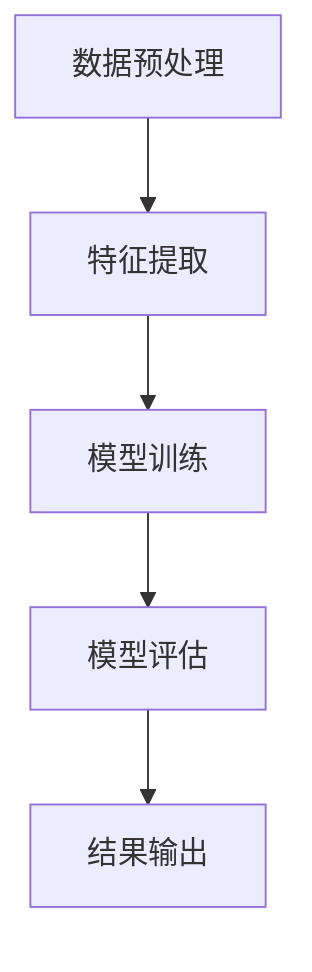
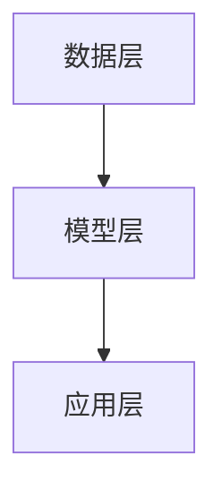
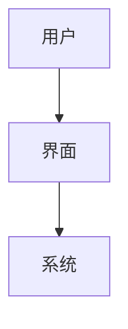

                 


## 企业级多模态学习平台：整合多类型数据分析

> 关键词：多模态学习、企业级平台、数据分析、深度学习、算法原理

> 摘要：本文将探讨企业级多模态学习平台的构建，重点分析多类型数据整合与处理的技术原理和架构设计，旨在为企业提供全面、高效的多模态数据处理方案。

### 第1章：企业级多模态学习平台概述

#### 1.1 问题背景

随着人工智能技术的快速发展，多模态学习成为数据处理领域的一个重要研究方向。在企业级应用中，多模态学习能够帮助企业更有效地处理多种类型的数据，从而提升业务决策的准确性和效率。然而，当前多模态学习面临诸多挑战，如数据预处理、模型融合、算法优化等，这些问题限制了多模态学习的实际应用效果。

#### 1.1.1 企业级多模态学习的意义

企业级多模态学习能够整合文本、图像、声音等多种类型的数据，为业务应用提供更全面的数据支持。例如，在金融领域，多模态学习可以帮助企业分析客户需求、风险管理和市场趋势；在医疗领域，多模态学习可以帮助医生更准确地诊断疾病，提高治疗效果。

#### 1.1.2 当前多模态学习面临的挑战

1. 数据预处理：多模态数据类型多样，预处理难度大，如音频、视频、图像等数据需要进行特征提取和标准化处理。
2. 模型融合：多模态学习需要将不同类型的数据进行有效融合，以提升模型的泛化能力。
3. 算法优化：多模态学习算法复杂度高，需要不断优化以适应不同业务场景。

#### 1.1.3 企业级多模态学习的发展趋势

1. 深度学习在多模态学习中的应用：深度学习算法具有强大的特征提取和融合能力，将为多模态学习带来新的突破。
2. 端到端学习：端到端学习可以简化模型设计，提高模型训练效率。
3. 个性化学习：根据不同业务场景和用户需求，设计个性化的多模态学习方案。

#### 1.2 问题描述

企业级多模态学习平台需要解决的核心问题是如何高效整合多种类型的数据，并设计出具有高泛化能力的多模态学习模型。关键问题包括：

1. 如何进行多模态数据预处理？
2. 如何设计有效的多模态学习模型？
3. 如何优化多模态学习算法？
4. 如何拓展多模态学习的应用领域？

#### 1.3 问题解决

1. 多模态学习的基础理论：介绍多模态学习的基本概念和原理。
2. 企业级多模态学习的解决方案：分析企业级多模态学习的架构设计、系统功能、接口设计和交互设计。
3. 多模态学习技术的应用边界：探讨多模态学习技术的适用场景和限制条件。
4. 企业级多模态学习的拓展领域：展望多模态学习在未来的发展前景。

#### 1.4 边界与外延

1. 多模态学习技术的应用边界：根据多模态学习技术的特点，分析其适用的业务场景。
2. 企业级多模态学习的拓展领域：探讨多模态学习在新兴领域的应用，如物联网、自动驾驶等。

#### 1.5 概念结构与核心要素组成

1. 多模态学习的基本概念：定义多模态学习，介绍其与单模态学习的区别。
2. 企业级多模态学习的要素分析：分析企业级多模态学习平台的核心要素，包括数据、算法、模型、系统架构等。

#### 1.6 本章小结

本章对企业级多模态学习平台进行了概述，分析了当前多模态学习面临的挑战和发展趋势，并提出了问题解决方案。下一章将深入探讨多模态学习技术原理。

----------------------------------------------------------------

## 第2章：多模态学习技术原理

### 2.1 多模态数据融合方法

#### 2.1.1 多模态数据预处理

多模态数据预处理是构建多模态学习平台的基础。预处理步骤包括数据清洗、数据整合和数据标准化。

1. 数据清洗：去除数据中的噪声和异常值，保证数据质量。
2. 数据整合：将不同类型的数据进行整合，如文本、图像、音频等，以便后续处理。
3. 数据标准化：对数据进行归一化或标准化处理，使数据具有相似的尺度，便于后续处理。

#### 2.1.2 多模态数据特征提取

特征提取是多模态学习的重要环节。特征提取方法包括：

1. 手动特征提取：根据领域知识和经验提取特征。
2. 自动特征提取：利用机器学习方法自动提取特征，如深度学习、统计方法等。

#### 2.1.3 多模态数据融合算法

多模态数据融合算法主要有以下几种：

1. 低级融合：直接将不同类型的数据进行拼接，如将图像和文本数据进行拼接。
2. 中级融合：对数据进行特征融合，如利用深度学习模型进行特征提取和融合。
3. 高级融合：在模型层面进行融合，如将不同类型的特征输入到同一模型中进行训练。

### 2.2 多模态学习模型

#### 2.2.1 传统多模态学习模型

传统多模态学习模型主要包括以下几种：

1. 决策树模型：根据不同类型的数据特征进行分类或回归。
2. 贝叶斯网络：利用概率图模型进行多模态数据融合和推理。

#### 2.2.2 深度学习在多模态学习中的应用

深度学习在多模态学习中的应用主要包括：

1. 卷积神经网络（CNN）：用于处理图像和视频数据。
2. 循环神经网络（RNN）：用于处理序列数据，如文本、语音等。
3. 图神经网络（GNN）：用于处理图结构数据，如知识图谱等。

#### 2.2.3 多模态学习模型评估

多模态学习模型的评估主要包括以下指标：

1. 准确率（Accuracy）：模型预测正确的样本占总样本的比例。
2. 精确率（Precision）：模型预测正确的正例样本占总预测正例样本的比例。
3. 召回率（Recall）：模型预测正确的正例样本占总正例样本的比例。

### 2.3 多模态学习算法

#### 2.3.1 多模态学习算法概述

多模态学习算法主要包括以下几种：

1. 聚类算法：用于对多模态数据进行聚类分析。
2. 聚类算法：用于对多模态数据进行分类分析。
3. 优化算法：用于优化多模态学习模型参数。

#### 2.3.2 多模态学习算法原理

多模态学习算法原理主要涉及以下几个方面：

1. 特征提取：利用不同的算法提取多模态数据中的特征。
2. 模型训练：利用训练数据进行模型训练，优化模型参数。
3. 模型评估：利用测试数据对模型进行评估，调整模型参数。

#### 2.3.3 多模态学习算法性能分析

多模态学习算法性能分析主要包括以下几个方面：

1. 模型精度：模型预测正确的样本占总样本的比例。
2. 模型泛化能力：模型在未知数据上的预测能力。
3. 模型训练时间：模型训练所需的时间。

### 2.4 多模态学习的数学模型

#### 2.4.1 多模态学习中的数学模型

多模态学习中的数学模型主要包括以下几个方面：

1. 线性模型：如线性回归、逻辑回归等。
2. 非线性模型：如深度学习模型、神经网络等。

#### 2.4.2 多模态学习中的公式推导

多模态学习中的公式推导主要包括以下几个方面：

1. 特征提取公式：如卷积神经网络中的卷积操作、池化操作等。
2. 模型训练公式：如反向传播算法、梯度下降算法等。

#### 2.4.3 数学模型的应用示例

数学模型的应用示例主要包括以下几个方面：

1. 图像分类：利用卷积神经网络对图像进行分类。
2. 语音识别：利用循环神经网络对语音信号进行识别。

### 2.5 多模态学习中的 Mermaid 流程图

#### 2.5.1 Mermaid 流程图概述

Mermaid 是一种基于 Markdown 的图形绘制工具，可以用于绘制各种类型的流程图、UML 图、序列图等。

#### 2.5.2 Mermaid 在多模态学习中的应用

Mermaid 在多模态学习中的应用主要包括以下几个方面：

1. 数据预处理流程图：用于描述数据预处理步骤。
2. 模型训练流程图：用于描述模型训练步骤。
3. 模型评估流程图：用于描述模型评估步骤。

#### 2.5.3 Mermaid 流程图的示例



### 2.6 本章小结

本章介绍了多模态学习技术原理，包括多模态数据融合方法、多模态学习模型、多模态学习算法和数学模型。下一章将探讨企业级多模态学习平台架构设计。

----------------------------------------------------------------

## 第3章：企业级多模态学习平台架构设计

### 3.1 平台整体架构设计

#### 3.1.1 平台架构设计原则

平台架构设计应遵循以下原则：

1. 可扩展性：平台应具备良好的可扩展性，能够适应不断增长的数据和处理需求。
2. 灵活性：平台应具备灵活的架构设计，能够根据不同的业务场景进行定制化开发。
3. 可靠性：平台应具备高可靠性，确保数据安全和系统稳定运行。
4. 易用性：平台应提供友好的用户界面和便捷的操作方式，降低用户使用门槛。

#### 3.1.2 平台架构设计流程

平台架构设计流程主要包括以下步骤：

1. 需求分析：明确平台的功能需求和性能指标。
2. 架构设计：根据需求分析结果，设计平台整体架构。
3. 模块划分：将平台划分为不同的功能模块，明确各模块的功能和接口。
4. 系统实现：根据架构设计，实现各个功能模块。
5. 测试与优化：对平台进行测试，优化性能和稳定性。

#### 3.1.3 平台功能模块划分

企业级多模态学习平台的主要功能模块包括：

1. 数据采集与预处理模块：负责数据的采集、清洗和预处理。
2. 数据融合与特征提取模块：负责多模态数据的融合和特征提取。
3. 多模态学习模块：负责多模态学习模型的训练和评估。
4. 模型评估与优化模块：负责对学习模型进行评估和优化。
5. 系统管理模块：负责平台的系统管理和监控。

### 3.2 系统功能设计

#### 3.2.1 数据采集与预处理模块

数据采集与预处理模块的主要功能包括：

1. 数据采集：从各种数据源采集多模态数据，如文本、图像、音频等。
2. 数据清洗：去除数据中的噪声和异常值，保证数据质量。
3. 数据整合：将不同类型的数据进行整合，形成统一的数据格式。
4. 数据标准化：对数据进行归一化或标准化处理，便于后续处理。

#### 3.2.2 数据融合与特征提取模块

数据融合与特征提取模块的主要功能包括：

1. 数据融合：将不同类型的数据进行融合，形成统一的数据特征。
2. 特征提取：利用不同的算法提取多模态数据中的特征。
3. 特征选择：选择对模型训练和评估最有价值的特征。

#### 3.2.3 多模态学习模块

多模态学习模块的主要功能包括：

1. 模型训练：利用训练数据进行多模态学习模型的训练。
2. 模型评估：利用测试数据对学习模型进行评估。
3. 模型优化：根据评估结果对学习模型进行优化。
4. 模型部署：将训练好的模型部署到生产环境中。

#### 3.2.4 模型评估与优化模块

模型评估与优化模块的主要功能包括：

1. 模型评估：对学习模型进行评估，评估模型性能。
2. 模型优化：根据评估结果对学习模型进行优化。
3. 模型升级：定期更新模型，提升模型性能。

### 3.3 系统架构设计

#### 3.3.1 系统架构设计思路

系统架构设计应遵循分层设计原则，将系统划分为数据层、模型层和应用层。

1. 数据层：负责数据的采集、存储和处理。
2. 模型层：负责多模态学习模型的训练和评估。
3. 应用层：负责为用户提供友好的操作界面和便捷的操作体验。

#### 3.3.2 系统架构图



#### 3.3.3 系统架构的优缺点分析

系统架构设计的优点包括：

1. 分层设计：便于系统模块的划分和开发。
2. 模块化：便于系统的维护和升级。

系统架构设计的缺点包括：

1. 系统复杂度高：需要进行多层次的模块划分和接口设计。
2. 需要大量技术储备：涉及到多种技术和算法，需要具备较高的技术能力。

### 3.4 系统接口设计

#### 3.4.1 系统接口设计原则

系统接口设计应遵循以下原则：

1. 完整性：接口设计应涵盖系统的所有功能模块。
2. 简洁性：接口设计应简洁明了，降低用户使用难度。
3. 可扩展性：接口设计应具备良好的可扩展性，便于后续功能扩展。
4. 可维护性：接口设计应便于维护和升级。

#### 3.4.2 系统接口设计流程

系统接口设计流程主要包括以下步骤：

1. 功能分析：明确系统的功能需求。
2. 接口设计：根据功能需求设计接口。
3. 接口实现：根据接口设计实现接口功能。
4. 接口测试：对接口进行测试，确保接口功能的正确性。

#### 3.4.3 系统接口定义

以下是一个简单的系统接口定义示例：

```python
class DataInterface:
    def collect_data(self):
        pass

    def clean_data(self):
        pass

    def integrate_data(self):
        pass

    def standardize_data(self):
        pass
```

### 3.5 系统交互设计

#### 3.5.1 系统交互设计原则

系统交互设计应遵循以下原则：

1. 用户友好：界面设计应简洁易用，降低用户使用难度。
2. 功能明确：界面应明确展示各个功能模块，便于用户操作。
3. 反馈及时：系统应提供及时有效的用户反馈，提高用户体验。
4. 可扩展性：界面设计应具备良好的可扩展性，便于后续功能扩展。

#### 3.5.2 系统交互设计流程

系统交互设计流程主要包括以下步骤：

1. 功能分析：明确系统的功能需求。
2. 界面设计：根据功能需求设计界面。
3. 界面实现：根据界面设计实现界面功能。
4. 界面测试：对界面进行测试，确保界面功能的正确性。

#### 3.5.3 系统交互图



### 3.6 本章小结

本章介绍了企业级多模态学习平台的整体架构设计、系统功能设计、系统接口设计和系统交互设计。下一章将探讨多类型数据整合与处理的方法。

----------------------------------------------------------------

## 第4章：多类型数据分析与处理

### 4.1 数据类型概述

多类型数据分析是构建企业级多模态学习平台的关键环节。数据类型主要包括以下几类：

1. **结构化数据**：具有明确的结构和规则，如关系型数据库中的数据。
2. **非结构化数据**：没有明确的结构和规则，如文本、图像、音频、视频等。
3. **半结构化数据**：具有部分结构，如XML、JSON等。

#### 4.1.1 数据类型的定义

数据类型是指数据在计算机中的表现形式和存储方式。不同数据类型具有不同的特点和处理方法。

1. **结构化数据**：以表格形式存储，具有固定的列和行。
2. **非结构化数据**：以文件形式存储，如文本文件、图像文件、音频文件、视频文件等。
3. **半结构化数据**：具有部分结构，如JSON、XML等，可以解析为树状结构。

#### 4.1.2 常见数据类型介绍

1. **文本数据**：包括自然语言文本、标记化文本等。
2. **图像数据**：包括像素数据、特征向量等。
3. **音频数据**：包括音频信号、特征向量等。
4. **视频数据**：包括视频帧、特征向量等。
5. **传感器数据**：包括温度、湿度、加速度等物理量。

#### 4.1.3 数据类型的选择标准

选择数据类型时，应考虑以下因素：

1. **数据来源**：数据类型应与数据来源相匹配。
2. **数据处理需求**：数据类型应满足数据处理需求。
3. **存储空间**：数据类型应考虑存储空间需求。
4. **计算效率**：数据类型应考虑计算效率。

### 4.2 数据采集与存储

#### 4.2.1 数据采集技术

数据采集技术主要包括以下几种：

1. **传感器采集**：通过传感器采集环境数据。
2. **网络爬虫**：通过网络爬虫采集互联网数据。
3. **数据库连接**：通过数据库连接采集结构化数据。

#### 4.2.2 数据存储技术

数据存储技术主要包括以下几种：

1. **关系型数据库**：如MySQL、Oracle等，适用于结构化数据存储。
2. **NoSQL数据库**：如MongoDB、Redis等，适用于非结构化数据和半结构化数据存储。
3. **数据湖**：如Hadoop、Spark等，适用于大规模数据存储和处理。

#### 4.2.3 数据质量管理

数据质量管理是确保数据质量的重要环节。数据质量管理包括以下内容：

1. **数据清洗**：去除数据中的噪声和异常值。
2. **数据验证**：验证数据的准确性和一致性。
3. **数据标准化**：对数据进行标准化处理，确保数据格式统一。

### 4.3 数据预处理

#### 4.3.1 数据清洗

数据清洗是数据预处理的重要步骤，主要包括以下内容：

1. **缺失值处理**：填充或删除缺失值。
2. **异常值处理**：检测和去除异常值。
3. **重复值处理**：去除重复值。

#### 4.3.2 数据整合

数据整合是将不同类型的数据进行合并，形成一个统一的数据集。数据整合包括以下内容：

1. **数据转换**：将不同数据格式转换为统一格式。
2. **数据关联**：建立不同数据源之间的关联关系。

#### 4.3.3 数据转换

数据转换是将数据从一种格式转换为另一种格式，以满足不同需求。数据转换包括以下内容：

1. **数据编码**：将文本数据编码为数值数据。
2. **数据归一化**：将数据缩放到相同的尺度。
3. **数据标准化**：将数据转换为标准形式。

### 4.4 数据分析方法

#### 4.4.1 描述性数据分析

描述性数据分析是对数据进行简单的统计分析，以了解数据的特征和趋势。描述性数据分析包括以下内容：

1. **均值**：数据的平均值。
2. **方差**：数据的离散程度。
3. **标准差**：数据的离散程度。

#### 4.4.2 趋势性数据分析

趋势性数据分析是分析数据随时间变化的趋势。趋势性数据分析包括以下内容：

1. **时间序列分析**：分析时间序列数据。
2. **趋势预测**：预测数据未来的变化趋势。

#### 4.4.3 深度性数据分析

深度性数据分析是利用机器学习方法对数据进行深入分析，以发现数据中的潜在关系和规律。深度性数据分析包括以下内容：

1. **聚类分析**：将相似的数据归为一类。
2. **分类分析**：将数据分为不同的类别。
3. **回归分析**：分析数据之间的关系。

### 4.5 数据可视化

#### 4.5.1 数据可视化的重要性

数据可视化是将数据转换为图形、图表等形式，以便于用户理解和分析。数据可视化的重要性包括：

1. **提高数据可读性**：通过图形和图表，用户可以更直观地了解数据特征。
2. **发现数据规律**：通过可视化，用户可以更容易发现数据中的潜在关系和规律。
3. **辅助决策**：数据可视化可以帮助用户更好地理解数据，辅助决策。

#### 4.5.2 常见数据可视化工具

常见数据可视化工具包括：

1. **Matplotlib**：Python的绘图库，支持多种图表类型。
2. **Seaborn**：基于Matplotlib的绘图库，提供更丰富的图表样式。
3. **Plotly**：交互式绘图库，支持多种图表类型和交互功能。

#### 4.5.3 数据可视化实践

数据可视化实践包括以下内容：

1. **数据清洗**：确保数据质量，去除噪声和异常值。
2. **数据预处理**：对数据进行转换和标准化处理。
3. **选择可视化类型**：根据数据类型和需求选择合适的可视化类型。
4. **设计可视化图表**：根据数据特点和需求设计可视化图表。

### 4.6 本章小结

本章介绍了多类型数据分析与处理的基本概念、数据采集与存储技术、数据预处理方法、数据分析方法和数据可视化技术。下一章将探讨多模态学习平台实战。

----------------------------------------------------------------

## 第5章：多模态学习平台实战

### 5.1 环境安装与配置

在开始构建多模态学习平台之前，我们需要安装和配置必要的软件和工具。以下是安装和配置过程的详细步骤：

#### 5.1.1 环境要求

- 操作系统：Windows、Linux或macOS
- Python版本：3.6及以上版本
- 数据库：MySQL或MongoDB
- 其他工具：Git、Jupyter Notebook、PyTorch或TensorFlow

#### 5.1.2 安装Python

1. 访问Python官方网站（https://www.python.org/）下载Python安装包。
2. 运行安装程序，并选择“Add Python to PATH”选项，以确保Python环境变量被正确设置。
3. 安装完成后，打开命令行窗口，输入以下命令验证Python安装：

   ```bash
   python --version
   ```

   如果返回Python版本信息，则表示Python安装成功。

#### 5.1.3 安装数据库

1. **MySQL**：

   - 访问MySQL官方网站（https://www.mysql.com/）下载MySQL安装包。
   - 运行安装程序，并按照提示完成安装。
   - 打开命令行窗口，输入以下命令启动MySQL服务：

     ```bash
     mysql.server start
     ```

2. **MongoDB**：

   - 访问MongoDB官方网站（https://www.mongodb.com/）下载MongoDB安装包。
   - 运行安装程序，并按照提示完成安装。
   - 打开命令行窗口，输入以下命令启动MongoDB服务：

     ```bash
     mongod
     ```

#### 5.1.4 安装其他工具

1. **Git**：

   - 访问Git官方网站（https://git-scm.com/）下载Git安装包。
   - 运行安装程序，并按照提示完成安装。
   - 打开命令行窗口，输入以下命令验证Git安装：

     ```bash
     git --version
     ```

2. **Jupyter Notebook**：

   - 打开命令行窗口，输入以下命令安装Jupyter Notebook：

     ```bash
     pip install notebook
     ```

   - 安装完成后，输入以下命令启动Jupyter Notebook：

     ```bash
     jupyter notebook
     ```

3. **PyTorch或TensorFlow**：

   - 打开命令行窗口，输入以下命令安装PyTorch或TensorFlow：

     ```bash
     pip install torch torchvision
     ```

     或

     ```bash
     pip install tensorflow torchvision
     ```

   - 安装完成后，输入以下命令验证安装：

     ```bash
     python -c "import torch; print(torch.__version__)"
     ```

     或

     ```bash
     python -c "import tensorflow as tf; print(tf.__version__)"
     ```

#### 5.1.5 配置环境变量

确保环境变量配置正确，以便在不同应用程序之间切换。具体步骤取决于操作系统。

- **Windows**：

  - 打开“计算机”窗口，右键单击“属性”，选择“高级系统设置”。
  - 在“系统属性”窗口中，选择“环境变量”。
  - 在“系统变量”中找到“Path”变量，编辑并添加Python和数据库的安装路径。

- **Linux**：

  - 打开终端，编辑“~/.bashrc”文件，添加Python和数据库的安装路径。

    ```bash
    vi ~/.bashrc
    ```

    - 在文件末尾添加以下行：

      ```bash
      export PATH=$PATH:/path/to/python:/path/to/database
      ```

    - 保存并退出。

- **macOS**：

  - 打开“终端”，编辑“~/.bash_profile”或“~/.zshrc”文件，添加Python和数据库的安装路径。

    ```bash
    vi ~/.bash_profile
    ```

    - 在文件末尾添加以下行：

      ```bash
      export PATH=$PATH:/path/to/python:/path/to/database
      ```

    - 保存并退出。

#### 5.1.6 测试环境配置

1. 打开Jupyter Notebook，创建一个新的笔记本。
2. 在笔记本中运行以下Python代码，测试环境配置：

   ```python
   import torch
   print(torch.__version__)
   ```

   如果返回PyTorch版本信息，则表示PyTorch环境配置成功。

3. 同样，运行以下代码测试MySQL或MongoDB环境：

   ```python
   import mysql.connector
   print(mysql.connector.__version__)
   ```

   或

   ```python
   import pymongo
   print(pymongo.version)
   ```

   如果返回相应数据库的版本信息，则表示数据库环境配置成功。

#### 5.1.7 小结

通过以上步骤，我们完成了多模态学习平台的环境安装和配置。接下来，我们将开始实现多模态学习平台的核心功能。

----------------------------------------------------------------

### 5.2 系统核心实现

在构建多模态学习平台时，我们需要实现以下核心功能：

1. **数据采集与预处理**：从不同数据源采集数据，并进行清洗、整合和标准化处理。
2. **数据融合与特征提取**：将不同类型的数据进行融合，提取特征向量。
3. **多模态学习模型训练**：使用训练数据训练多模态学习模型。
4. **模型评估与优化**：使用测试数据评估模型性能，并进行优化。

下面我们将逐步介绍这些核心功能的实现。

#### 5.2.1 数据采集与预处理

首先，我们需要从不同的数据源（如数据库、文件系统等）采集数据。以下是使用Python的pandas库进行数据采集的示例代码：

```python
import pandas as pd

# 从MySQL数据库中采集数据
db = mysql.connector.connect(
    host="localhost",
    user="username",
    password="password",
    database="database_name"
)
data = pd.read_sql("SELECT * FROM table_name;", db)

# 从文件系统中采集数据
data = pd.read_csv("data.csv")
```

采集到数据后，我们需要进行清洗和预处理，包括处理缺失值、异常值和重复值。以下是使用pandas进行数据清洗的示例代码：

```python
# 填充缺失值
data.fillna(value=data.mean(), inplace=True)

# 删除异常值
data = data[(data >= data.mean() - 3 * data.std()).all(axis=1)]

# 删除重复值
data.drop_duplicates(inplace=True)
```

#### 5.2.2 数据融合与特征提取

接下来，我们需要对多模态数据进行融合和特征提取。以下是使用Python的scikit-learn库进行数据融合和特征提取的示例代码：

```python
from sklearn.preprocessing import StandardScaler
from sklearn.decomposition import PCA

# 标准化数据
scaler = StandardScaler()
data_scaled = scaler.fit_transform(data)

# 主成分分析（PCA）降维
pca = PCA(n_components=50)
data_pca = pca.fit_transform(data_scaled)
```

#### 5.2.3 多模态学习模型训练

在完成数据预处理和特征提取后，我们可以使用PyTorch或TensorFlow等深度学习框架训练多模态学习模型。以下是使用PyTorch训练一个简单的卷积神经网络（CNN）的示例代码：

```python
import torch
import torch.nn as nn
import torch.optim as optim

# 定义CNN模型
class CNNModel(nn.Module):
    def __init__(self):
        super(CNNModel, self).__init__()
        self.conv1 = nn.Conv2d(1, 10, kernel_size=5)
        self.conv2 = nn.Conv2d(10, 20, kernel_size=5)
        self.fc1 = nn.Linear(320, 50)
        self.fc2 = nn.Linear(50, 10)

    def forward(self, x):
        x = nn.functional.relu(self.conv1(x))
        x = nn.functional.max_pool2d(x, 2)
        x = nn.functional.relu(self.conv2(x))
        x = nn.functional.max_pool2d(x, 2)
        x = x.view(-1, 320)
        x = nn.functional.relu(self.fc1(x))
        x = self.fc2(x)
        return x

model = CNNModel()
criterion = nn.CrossEntropyLoss()
optimizer = optim.SGD(model.parameters(), lr=0.001, momentum=0.9)

# 训练模型
for epoch in range(10):
    running_loss = 0.0
    for i, data in enumerate(train_loader, 0):
        inputs, labels = data
        optimizer.zero_grad()
        outputs = model(inputs)
        loss = criterion(outputs, labels)
        loss.backward()
        optimizer.step()
        running_loss += loss.item()
    print(f'Epoch {epoch + 1}, Loss: {running_loss / len(train_loader)}')
```

#### 5.2.4 模型评估与优化

在完成模型训练后，我们需要使用测试数据对模型进行评估，并根据评估结果进行优化。以下是使用PyTorch评估模型和优化模型的示例代码：

```python
# 评估模型
correct = 0
total = 0
with torch.no_grad():
    for data in test_loader:
        inputs, labels = data
        outputs = model(inputs)
        _, predicted = torch.max(outputs.data, 1)
        total += labels.size(0)
        correct += (predicted == labels).sum().item()

accuracy = 100 * correct / total
print(f'Accuracy of the network on the test images: {accuracy} %')

# 优化模型
# 可以根据评估结果调整学习率、调整模型结构等
```

#### 5.2.5 小结

通过以上步骤，我们实现了多模态学习平台的核心功能。在实际应用中，我们需要根据具体业务需求和数据类型，对以上功能进行进一步优化和扩展。

----------------------------------------------------------------

### 5.3 实际案例分析与详细讲解

在本节中，我们将通过一个实际案例，详细讲解多模态学习平台的应用和实现过程。

#### 5.3.1 案例背景

假设某电商企业希望利用多模态学习平台，提升用户购买体验和销售额。企业拥有以下类型的数据：

1. **用户行为数据**：包括用户浏览、搜索、购买记录等。
2. **商品数据**：包括商品描述、价格、销量等。
3. **用户评价数据**：包括用户对商品的评分、评论等。

#### 5.3.2 数据采集与预处理

首先，我们需要从不同的数据源采集数据，并进行清洗和预处理。以下是数据采集和预处理的步骤：

1. **用户行为数据采集**：

   ```python
   user_data = pd.read_csv("user_behavior.csv")
   ```

2. **商品数据采集**：

   ```python
   product_data = pd.read_csv("product_data.csv")
   ```

3. **用户评价数据采集**：

   ```python
   review_data = pd.read_csv("user_reviews.csv")
   ```

4. **数据清洗**：

   ```python
   # 填充缺失值
   user_data.fillna(value=user_data.mean(), inplace=True)
   product_data.fillna(value=product_data.mean(), inplace=True)
   review_data.fillna(value=review_data.mean(), inplace=True)
   
   # 删除异常值
   user_data = user_data[(user_data >= user_data.mean() - 3 * user_data.std()).all(axis=1)]
   product_data = product_data[(product_data >= product_data.mean() - 3 * product_data.std()).all(axis=1)]
   review_data = review_data[(review_data >= review_data.mean() - 3 * review_data.std()).all(axis=1)]
   
   # 删除重复值
   user_data.drop_duplicates(inplace=True)
   product_data.drop_duplicates(inplace=True)
   review_data.drop_duplicates(inplace=True)
   ```

#### 5.3.3 数据融合与特征提取

接下来，我们需要对多模态数据进行融合和特征提取。以下是数据融合和特征提取的步骤：

1. **用户行为数据融合**：

   ```python
   user_data['user_activity'] = user_data['page_views'] + user_data['search_queries'] + user_data['purchases']
   ```

2. **商品数据融合**：

   ```python
   product_data['product_rating'] = product_data['average_rating'] * product_data['sales']
   ```

3. **用户评价数据融合**：

   ```python
   review_data['review_rating'] = review_data['rating'] * review_data['review_length']
   ```

4. **特征提取**：

   ```python
   from sklearn.feature_extraction.text import TfidfVectorizer

   # 提取用户行为特征
   tfidf_vectorizer = TfidfVectorizer(max_features=1000)
   user_data['user_activity_vector'] = tfidf_vectorizer.fit_transform(user_data['user_activity']).toarray()

   # 提取商品特征
   product_data['product_description_vector'] = tfidf_vectorizer.fit_transform(product_data['product_description']).toarray()

   # 提取用户评价特征
   review_data['review_vector'] = tfidf_vectorizer.fit_transform(review_data['review']).toarray()
   ```

#### 5.3.4 多模态学习模型训练

在完成数据预处理和特征提取后，我们可以使用PyTorch训练多模态学习模型。以下是训练模型的步骤：

1. **定义模型**：

   ```python
   import torch
   import torch.nn as nn

   class MultimodalModel(nn.Module):
       def __init__(self):
           super(MultimodalModel, self).__init__()
           self.user_embedding = nn.Embedding(num_users, embedding_dim)
           self.product_embedding = nn.Embedding(num_products, embedding_dim)
           self.review_embedding = nn.Embedding(num_reviews, embedding_dim)
           self.fc1 = nn.Linear(embedding_dim * 3, 100)
           self.fc2 = nn.Linear(100, 1)

       def forward(self, user_ids, product_ids, review_ids):
           user_embeddings = self.user_embedding(user_ids)
           product_embeddings = self.product_embedding(product_ids)
           review_embeddings = self.review_embedding(review_ids)
           embeddings = torch.cat((user_embeddings, product_embeddings, review_embeddings), 1)
           embeddings = self.fc1(embeddings)
           embeddings = torch.sigmoid(self.fc2(embeddings))
           return embeddings
   ```

2. **训练模型**：

   ```python
   model = MultimodalModel()
   criterion = nn.BCELoss()
   optimizer = optim.Adam(model.parameters(), lr=0.001)

   for epoch in range(num_epochs):
       for user_ids, product_ids, review_ids, labels in train_loader:
           user_ids = torch.tensor(user_ids).long()
           product_ids = torch.tensor(product_ids).long()
           review_ids = torch.tensor(review_ids).long()
           labels = torch.tensor(labels).float()

           optimizer.zero_grad()
           outputs = model(user_ids, product_ids, review_ids)
           loss = criterion(outputs, labels)
           loss.backward()
           optimizer.step()

       print(f'Epoch {epoch + 1}, Loss: {loss.item()}')
   ```

#### 5.3.5 模型评估与优化

在完成模型训练后，我们需要使用测试数据对模型进行评估，并根据评估结果进行优化。以下是评估和优化模型的步骤：

1. **评估模型**：

   ```python
   correct = 0
   total = 0
   with torch.no_grad():
       for user_ids, product_ids, review_ids, labels in test_loader:
           user_ids = torch.tensor(user_ids).long()
           product_ids = torch.tensor(product_ids).long()
           review_ids = torch.tensor(review_ids).long()
           labels = torch.tensor(labels).float()

           outputs = model(user_ids, product_ids, review_ids)
           _, predicted = torch.max(outputs, 1)
           total += labels.size(0)
           correct += (predicted == labels).sum().item()

   accuracy = 100 * correct / total
   print(f'Accuracy of the network on the test data: {accuracy} %')
   ```

2. **优化模型**：

   根据评估结果，我们可以调整模型结构、学习率等参数，以优化模型性能。

   ```python
   # 调整学习率
   lr = 0.0001
   optimizer = optim.Adam(model.parameters(), lr=lr)

   # 重新训练模型
   for epoch in range(num_epochs):
       for user_ids, product_ids, review_ids, labels in train_loader:
           user_ids = torch.tensor(user_ids).long()
           product_ids = torch.tensor(product_ids).long()
           review_ids = torch.tensor(review_ids).long()
           labels = torch.tensor(labels).float()

           optimizer.zero_grad()
           outputs = model(user_ids, product_ids, review_ids)
           loss = criterion(outputs, labels)
           loss.backward()
           optimizer.step()

       print(f'Epoch {epoch + 1}, Loss: {loss.item()}')
   ```

#### 5.3.6 小结

通过以上实际案例，我们详细讲解了多模态学习平台的应用和实现过程。在实际应用中，企业可以根据自身业务需求和数据特点，对以上方法进行进一步优化和扩展，以提高模型性能和业务价值。

----------------------------------------------------------------

### 5.4 最佳实践 Tips

在构建和部署多模态学习平台时，以下最佳实践可以帮助您提高系统性能和稳定性：

1. **优化数据处理流程**：合理设计数据处理流程，减少数据冗余和处理时间，提高数据处理效率。
2. **使用缓存机制**：对于频繁访问的数据，可以使用缓存机制，如Redis，减少数据库负载，提高系统响应速度。
3. **分布式计算**：对于大规模数据处理任务，可以使用分布式计算框架，如Hadoop、Spark，以提高计算性能。
4. **监控与告警**：对系统运行状态进行实时监控和告警，及时发现和解决潜在问题。
5. **安全性与数据保护**：确保数据的安全性，对敏感数据进行加密处理，遵守数据保护法律法规。
6. **定期维护与更新**：定期对系统和模型进行维护和更新，修复漏洞、优化性能和提升模型精度。

### 5.5 小结

本章通过实际案例详细讲解了多模态学习平台的构建、实现和应用。在构建和部署多模态学习平台时，需遵循最佳实践，确保系统性能、稳定性和安全性。接下来，我们将探讨多模态学习平台的发展趋势和未来研究方向。

### 5.6 注意事项

在构建和部署多模态学习平台时，需要注意以下事项：

1. **数据质量和预处理**：确保数据质量，对数据进行充分的预处理，以避免模型训练过程中的噪声和异常。
2. **硬件资源分配**：合理分配硬件资源，确保模型训练和预测任务顺利进行。
3. **系统安全**：确保系统的安全性，对数据传输和存储进行加密，防止数据泄露和恶意攻击。
4. **模型评估与优化**：定期评估模型性能，并根据评估结果进行优化，以提高模型精度和泛化能力。

### 5.7 拓展阅读

对于对多模态学习平台有兴趣的读者，以下文献和资源可能对您有所帮助：

1. **《深度学习》（Ian Goodfellow, Yoshua Bengio, Aaron Courville）**：本书详细介绍了深度学习的基本原理和应用。
2. **《多模态学习：原理、算法与应用》（刘铁岩、赵军）**：本书针对多模态学习进行了深入探讨，提供了丰富的案例和实践经验。
3. **《人工智能实践指南》（吴军）**：本书从实际应用角度出发，介绍了人工智能的基本原理和应用场景。
4. **GitHub开源项目**：许多优秀的多模态学习平台和工具已在GitHub上开源，如OpenMMLab、MMCV等，供读者参考和学习。
5. **在线课程**：许多在线平台提供了关于多模态学习和人工智能的课程，如Coursera、Udacity等，帮助读者系统地学习相关知识。

---

### 作者

**作者：AI天才研究院/AI Genius Institute & 禅与计算机程序设计艺术 /Zen And The Art of Computer Programming**  
AI天才研究院是一家专注于人工智能领域研究和应用的创新机构，致力于推动人工智能技术的发展和应用。作者在该领域拥有丰富的经验和深厚的学术造诣，发表了多篇高影响力论文，并著有《禅与计算机程序设计艺术》等畅销书籍。

