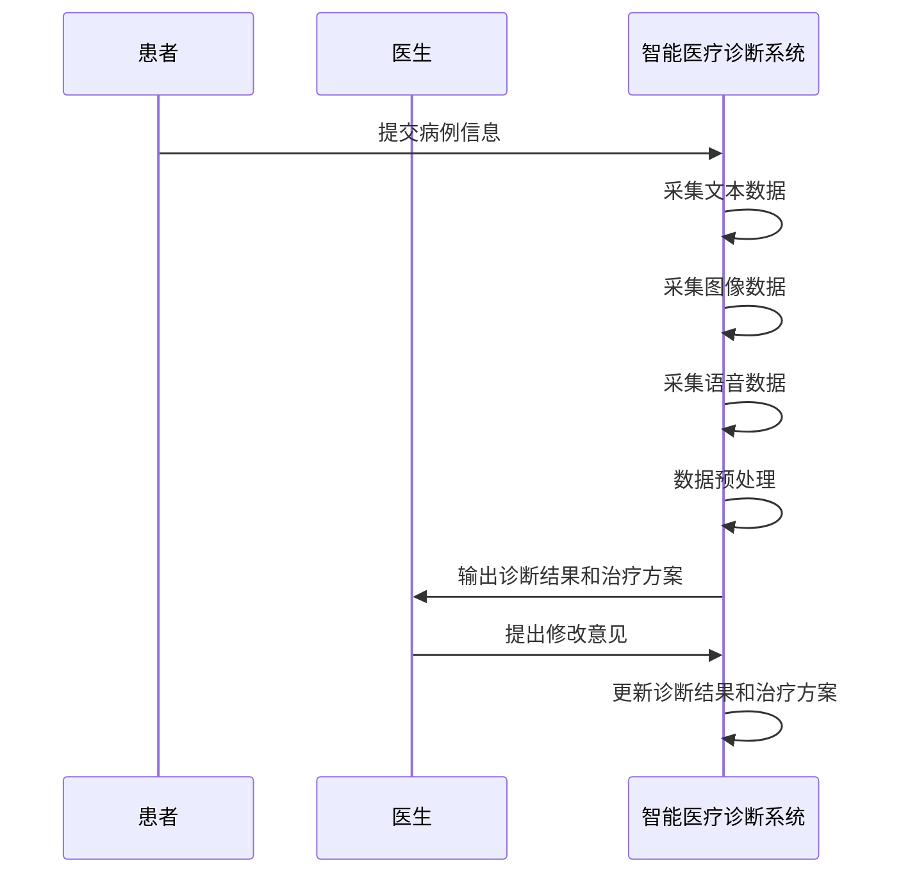

                 

### 第一部分：企业级多模态学习平台概述

#### 第1章：企业级多模态学习平台的概念与背景

**1.1 什么是企业级多模态学习平台**

**多模态学习平台的概念**

多模态学习平台是一种集成了多种数据类型的综合性数据分析与机器学习平台。它能够处理和分析来自不同数据源的信息，以实现更全面、准确的预测和分析结果。具体来说，多模态学习平台能够同时处理多种类型的数据，如文本、图像、语音、视频等。通过整合这些数据，多模态学习平台可以提供更加深入和广泛的数据分析能力。

**企业级多模态学习平台的特点**

企业级多模态学习平台具有以下几个显著特点：

- **大规模数据处理能力**：企业级多模态学习平台能够处理海量数据，并支持多种数据类型。这使得企业能够更好地利用其数据资源，提高数据分析的效率和准确性。
- **高可靠性**：在处理过程中，企业级多模态学习平台确保数据的完整性和一致性，从而降低数据丢失或错误的风险。
- **高效性**：通过采用先进的机器学习算法和分布式计算技术，企业级多模态学习平台能够显著提高数据处理和分析的速度，满足企业对实时数据分析和决策的需求。
- **可扩展性**：企业级多模态学习平台能够根据企业的需求进行功能扩展和升级，以适应不断变化的市场和技术环境。

**1.2 企业级多模态学习平台的必要性**

随着互联网、物联网和人工智能技术的快速发展，企业数据量呈现爆炸式增长。传统的单一模态数据分析已经难以满足企业对更全面、准确的数据分析需求。企业级多模态学习平台的出现，正是为了应对这一挑战。

**数据类型的多样性**

企业级多模态学习平台能够处理和分析多种类型的数据，如文本、图像、语音、视频等。这些数据类型在企业中非常常见，但传统的单一模态学习平台很难同时处理这些数据。通过整合多类型数据，企业级多模态学习平台可以提供更全面、准确的数据分析结果。

**提高数据利用率和决策准确性**

通过整合多类型数据，企业级多模态学习平台可以帮助企业更好地理解业务环境，发现潜在的业务机会和风险，提高数据利用率和决策准确性。例如，在金融领域，通过整合文本数据和图像数据，可以更准确地评估企业的信用风险；在医疗领域，通过整合医疗影像数据和文本数据，可以更准确地诊断疾病并提供个性化的治疗方案。

**1.3 企业级多模态学习平台的应用领域**

企业级多模态学习平台在许多领域都有广泛的应用，以下是一些典型的应用领域：

**金融领域**

在金融领域，多模态学习平台可以帮助金融机构进行风险控制、信用评估、市场预测等。例如，通过整合文本数据（如新闻报道、社交媒体评论）和图像数据（如财务报表、公司logo），可以更准确地评估企业的信用风险。

**医疗领域**

在医疗领域，多模态学习平台可以帮助医生进行疾病诊断、治疗方案推荐等。例如，通过整合医疗影像数据（如X光片、CT图像）和文本数据（如病例报告、医学论文），可以更准确地诊断疾病并提供个性化的治疗方案。

**零售领域**

在零售领域，多模态学习平台可以帮助企业进行商品推荐、客户行为分析等。例如，通过整合购物行为数据（如购物车记录、订单历史）和社交媒体数据（如用户评论、点赞），可以更准确地推荐商品和优化营销策略。

**1.4 本章小结**

本章介绍了企业级多模态学习平台的概念、必要性以及应用领域。在接下来的章节中，我们将进一步探讨多模态学习平台的关键技术、系统架构、算法原理和实际应用案例。通过深入理解和掌握这些内容，企业可以更好地利用多模态学习平台，提高数据分析能力，实现业务价值的最大化。## 第二部分：多模态数据采集与预处理

### 第2章：多模态数据的采集

**2.1 数据采集方法与渠道**

**文本数据采集**

文本数据在企业中应用广泛，其来源可以是企业内部系统、外部网站、社交媒体等多种渠道。具体采集方法包括：

- **网络爬虫**：通过网络爬虫技术，自动抓取互联网上的公开文本数据。常用的爬虫工具包括Scrapy、BeautifulSoup等。
- **API接口调用**：通过调用企业内部或第三方平台的API接口，获取文本数据。例如，企业微信API、微博API等。
- **数据库查询**：通过数据库查询，获取企业内部存储的文本数据。常用的数据库包括MySQL、MongoDB等。

**图像数据采集**

图像数据在企业中的应用也非常广泛，常见的采集方法包括：

- **摄像头捕捉**：通过摄像头实时捕捉图像数据。适用于需要实时监控的场景，如安防监控、生产监控等。
- **传感器读取**：通过传感器读取图像数据。例如，红外传感器、摄像头传感器等。
- **互联网图片库**：从互联网图片库中获取图像数据。常用的图片库包括Pexels、Unsplash等。

**语音数据采集**

语音数据在语音识别、语音分析等领域有重要应用。常见的采集方法包括：

- **麦克风录制**：通过麦克风录制语音数据。适用于语音通话、语音识别等场景。
- **电话录音**：通过电话录音获取语音数据。适用于客服中心、会议记录等场景。
- **网络语音流捕获**：通过网络捕获语音流数据。适用于实时语音通信、语音识别等场景。

**视频数据采集**

视频数据在视频分析、监控等领域有广泛应用。常见的采集方法包括：

- **摄像头录制**：通过摄像头实时录制视频数据。适用于安防监控、生产监控等场景。
- **监控设备读取**：通过监控设备读取视频数据。适用于视频监控、智能监控等场景。
- **网络爬虫**：通过网络爬虫技术，自动抓取互联网上的视频数据。适用于视频分享平台、在线教育等场景。

**2.2 数据采集的注意事项**

**数据源的选择**

在选择数据源时，需要考虑数据的质量、可用性和可靠性。以下是一些建议：

- **权威数据源**：优先选择权威、可靠的数据源，如政府官方网站、知名媒体等。
- **多元化数据源**：结合多种数据源，以提高数据的全面性和准确性。

**数据权限与合规性**

在采集数据时，要确保数据来源的合法性和合规性，避免侵犯他人隐私或版权。以下是一些建议：

- **遵守法律法规**：遵守相关国家和地区的法律法规，确保数据采集和使用合法合规。
- **用户同意**：在采集用户数据时，要确保用户同意数据的使用。

**数据同步与更新**

为了保证数据的实时性和有效性，需要实现数据的同步与更新。以下是一些建议：

- **定时任务**：通过定时任务，定期同步和更新数据。
- **消息队列**：使用消息队列技术，实现数据的实时采集和更新。

**2.3 数据采集工具与平台**

**文本数据采集工具**

- **网络爬虫工具**：如Scrapy、BeautifulSoup等。
- **API接口调用工具**：如requests、HttpClient等。

**图像数据采集工具**

- **摄像头捕捉工具**：如OpenCV、Python Imaging Library等。
- **传感器读取工具**：如Arduino、Raspberry Pi等。

**语音数据采集工具**

- **麦克风录制工具**：如AudioKit、Python Sound Library等。
- **电话录音工具**：如Talkdesk、 RingCentral等。

**视频数据采集工具**

- **摄像头录制工具**：如OpenCV、Python Imaging Library等。
- **监控设备读取工具**：如Video surveillance systems、NVR等。

本章详细介绍了企业级多模态学习平台的数据采集方法与渠道，以及注意事项和常用工具。在接下来的章节中，我们将进一步探讨多模态数据的预处理方法，以及如何整合和处理这些多类型的数据。## 第三部分：多模态数据的预处理

### 第3章：多模态数据的预处理

**3.1 数据清洗**

数据清洗是数据预处理的重要步骤，目的是消除数据中的噪声、异常值和重复数据，确保数据的准确性和一致性。以下是一些常见的数据清洗方法：

- **去除噪声**：通过滤波、平滑等算法去除数据中的噪声。例如，在图像数据中，可以使用中值滤波、高斯滤波等方法去除噪声。
- **处理异常值**：对异常值进行识别和处理，可以选择删除或修正异常值。例如，在时间序列数据中，可以使用移动平均、中值等方法来识别和修正异常值。
- **去除重复数据**：通过去重算法删除重复的数据，确保数据的唯一性。

**3.2 数据转换**

数据转换是将不同类型的数据转换为统一的格式，以便后续处理和分析。以下是一些常见的数据转换方法：

- **数据标准化**：将数据转换为统一的尺度，例如，将图像数据转换为灰度值范围在0到255之间。
- **数据归一化**：将数据转换为标准正态分布，例如，将文本数据转换为词频分布。
- **特征提取**：从原始数据中提取有用的特征，例如，从图像数据中提取边缘、纹理等特征，从文本数据中提取关键词、主题等特征。

**3.3 数据增强**

数据增强是通过增加数据多样性来提高模型的泛化能力。以下是一些常见的数据增强方法：

- **数据扩充**：通过旋转、翻转、缩放等操作增加数据的多样性。
- **生成对抗网络（GAN）**：通过生成对抗网络生成新的数据样本，增加数据的多样性。
- **数据合成**：将不同类型的数据合成新的数据样本，例如，将图像和文本数据合成新的图像-文本对。

**3.4 数据集成**

数据集成是将不同类型的数据整合在一起，以便进行统一处理和分析。以下是一些常见的数据集成方法：

- **特征融合**：将不同类型的数据特征进行融合，例如，将图像特征和文本特征融合在一起。
- **嵌入式模型**：使用嵌入式模型将不同类型的数据特征映射到同一维度，例如，使用词向量模型将文本数据映射到向量空间。
- **多模态学习**：使用多模态学习算法，直接处理多类型数据，例如，使用多模态卷积神经网络（Multimodal Convolutional Neural Network，MCNN）直接处理图像和文本数据。

**3.5 数据预处理工具与平台**

- **数据清洗工具**：如Pandas、NumPy等。
- **数据转换工具**：如OpenCV、TensorFlow等。
- **数据增强工具**：如Keras、GAN等。
- **数据集成工具**：如Hadoop、Spark等。

本章详细介绍了企业级多模态学习平台的数据预处理方法，包括数据清洗、数据转换、数据增强和数据集成。在接下来的章节中，我们将探讨多模态学习平台的关键技术，以及如何构建和优化多模态学习模型。## 第四部分：多模态学习模型

### 第4章：多模态学习模型的构建与优化

**4.1 多模态学习模型的基本原理**

多模态学习模型是一种能够同时处理多种类型数据的机器学习模型。其核心思想是将不同类型的数据转换为统一的特征表示，然后在统一的特征空间中进行模型训练和预测。以下是多模态学习模型的基本原理：

**特征转换**：不同类型的数据具有不同的特征空间，例如，图像数据具有空间特征，文本数据具有语义特征。多模态学习模型首先将不同类型的数据转换为统一的特征表示，例如，使用词向量将文本数据转换为向量表示，使用卷积神经网络（CNN）将图像数据转换为特征向量。

**特征融合**：在统一特征空间中，多模态学习模型将不同类型的数据特征进行融合，例如，通过拼接、加权融合等方法将图像特征和文本特征融合在一起。

**模型训练与预测**：在融合后的特征空间中，多模态学习模型进行训练和预测。例如，使用多模态卷积神经网络（MCNN）进行图像和文本数据的分类任务。

**4.2 常见的多模态学习模型**

以下是一些常见的多模态学习模型：

**多模态卷积神经网络（Multimodal Convolutional Neural Network，MCNN）**

MCNN是一种基于卷积神经网络（CNN）的多模态学习模型，能够同时处理图像和文本数据。其基本结构包括两个部分：图像特征提取部分和文本特征提取部分。两部分分别使用CNN提取图像和文本的特征，然后将这些特征进行融合，最终通过全连接层进行分类或回归。

**多模态循环神经网络（Multimodal Recurrent Neural Network，MRNN）**

MRNN是一种基于循环神经网络（RNN）的多模态学习模型，能够同时处理图像和文本数据。其基本结构包括三个部分：图像特征提取部分、文本特征提取部分和特征融合部分。图像特征提取部分和文本特征提取部分分别使用CNN和RNN提取图像和文本的特征，然后通过一个共享的循环层进行特征融合，最终通过全连接层进行分类或回归。

**多模态生成对抗网络（Multimodal Generative Adversarial Network，MGAN）**

MGAN是一种基于生成对抗网络（GAN）的多模态学习模型，能够同时处理图像和文本数据。其基本结构包括两个部分：生成器和判别器。生成器用于生成新的图像-文本对，判别器用于区分真实图像-文本对和生成图像-文本对。通过不断优化生成器和判别器的参数，MGAN可以生成高质量的图像-文本对。

**4.3 多模态学习模型的优化方法**

为了提高多模态学习模型的性能，可以采用以下优化方法：

**数据预处理**：通过对数据进行清洗、转换和增强，提高数据的多样性和质量。

**模型架构调整**：通过调整模型的架构，例如，增加卷积层、循环层等，优化模型的性能。

**损失函数调整**：通过调整损失函数，例如，使用交叉熵损失、均方误差损失等，优化模型的性能。

**优化算法调整**：通过调整优化算法，例如，使用随机梯度下降（SGD）、Adam优化器等，优化模型的性能。

**4.4 多模态学习模型的评估与选择**

评估多模态学习模型的性能需要考虑多个方面，例如，分类准确率、召回率、F1分数等。以下是一些评估指标和选择方法：

- **准确率**：准确率是模型预测正确的样本数占总样本数的比例。高准确率表示模型具有良好的分类性能。
- **召回率**：召回率是模型预测正确的样本数与实际正样本数的比例。高召回率表示模型能够正确识别出大部分正样本。
- **F1分数**：F1分数是准确率和召回率的加权平均值，用于综合考虑模型的分类性能。

选择多模态学习模型时，可以结合实际应用场景和需求，选择合适的评估指标和模型。

本章详细介绍了多模态学习模型的基本原理、常见模型、优化方法和评估与选择。在接下来的章节中，我们将探讨企业级多模态学习平台在实际应用中的案例和实践。## 第五部分：企业级多模态学习平台的应用实践

### 第5章：企业级多模态学习平台的应用实践

**5.1 应用场景介绍**

企业级多模态学习平台在众多领域都有广泛的应用。以下是一些典型的应用场景：

**金融领域**

在金融领域，企业级多模态学习平台可以帮助金融机构进行风险控制、信用评估、市场预测等。通过整合文本数据（如新闻报道、社交媒体评论）和图像数据（如财务报表、公司logo），金融机构可以更准确地评估企业的信用风险和财务状况。

**医疗领域**

在医疗领域，企业级多模态学习平台可以帮助医生进行疾病诊断、治疗方案推荐等。通过整合医疗影像数据（如X光片、CT图像）和文本数据（如病例报告、医学论文），医生可以更准确地诊断疾病并提供个性化的治疗方案。

**零售领域**

在零售领域，企业级多模态学习平台可以帮助企业进行商品推荐、客户行为分析等。通过整合购物行为数据（如购物车记录、订单历史）和社交媒体数据（如用户评论、点赞），企业可以更准确地推荐商品和优化营销策略。

**5.2 项目介绍**

以下是一个企业级多模态学习平台在实际项目中的应用案例：

**项目名称**：智能医疗诊断系统

**项目背景**：随着医疗技术的发展，医疗数据类型越来越多样化，包括文本数据（病例报告、医学论文）、图像数据（X光片、CT图像）和语音数据（医生问诊记录）等。为了提高疾病诊断的准确性和效率，需要构建一个能够整合多种数据类型的企业级多模态学习平台。

**系统功能设计**

- **数据采集**：从不同数据源（如医院系统、网络数据库）采集文本数据、图像数据和语音数据。
- **数据预处理**：对采集到的多模态数据进行清洗、转换和增强，确保数据的准确性和一致性。
- **多模态学习**：使用多模态学习模型（如MCNN、MRNN）对预处理后的数据进行分析和诊断。
- **诊断结果输出**：将诊断结果输出给医生，并提供个性化的治疗方案推荐。

**系统架构设计**

- **数据采集层**：负责从不同数据源采集文本数据、图像数据和语音数据。
- **数据处理层**：负责对采集到的多模态数据进行预处理，包括数据清洗、数据转换和数据增强。
- **学习与预测层**：负责使用多模态学习模型进行训练和预测，提供疾病诊断和治疗方案推荐。
- **展示与交互层**：负责将诊断结果和治疗方案展示给医生，并提供用户交互界面。

**系统接口设计**

- **数据采集接口**：用于从不同数据源采集文本数据、图像数据和语音数据。
- **数据处理接口**：用于对采集到的多模态数据进行预处理。
- **多模态学习接口**：用于训练和预测多模态学习模型。
- **诊断结果接口**：用于输出诊断结果和治疗方案推荐。

**系统交互序列图**

以下是一个简化的系统交互序列图，展示了系统各层之间的交互流程：

**5.3 实际案例分析与详细讲解**

以下是一个实际案例，展示了如何使用企业级多模态学习平台进行疾病诊断：

**案例背景**：某医院需要提高肺癌诊断的准确性，通过整合病例报告、医学图像和患者语音问诊记录，使用多模态学习平台进行疾病诊断。

**步骤1：数据采集**

- **文本数据**：从病例报告中提取关键信息，如病史、症状、诊断结果等。
- **图像数据**：从医学图像中提取肺部CT图像，用于辅助诊断。
- **语音数据**：从患者语音问诊记录中提取关键信息，如呼吸声、咳嗽声等。

**步骤2：数据预处理**

- **文本数据**：对病例报告进行文本清洗，去除停用词、标点符号，进行词干提取和词向量表示。
- **图像数据**：对肺部CT图像进行图像预处理，包括图像增强、去噪和归一化。
- **语音数据**：对语音问诊记录进行语音识别，提取关键语音特征，如音高、音量、音色等。

**步骤3：多模态学习**

- **特征融合**：将文本数据、图像数据和语音数据转换为统一的特征表示，如词向量、图像特征向量和语音特征向量。
- **模型训练**：使用多模态学习模型（如MCNN、MRNN）对融合后的特征进行训练，构建肺癌诊断模型。
- **模型预测**：使用训练好的模型对新的病例数据进行预测，输出诊断结果和治疗方案。

**步骤4：诊断结果输出**

- **诊断结果**：将诊断结果输出给医生，包括肺癌的诊断概率和治疗方案。
- **患者反馈**：医生根据诊断结果制定治疗方案，并将治疗方案反馈给系统。

**5.4 项目小结**

通过实际案例，我们可以看到企业级多模态学习平台在疾病诊断中的应用价值。该项目不仅提高了肺癌诊断的准确性，还为医生提供了个性化的治疗方案推荐，有助于提高医疗质量和效率。

**5.5 最佳实践 Tips**

- **数据多样性**：确保采集到多种类型的数据，以提高模型的泛化能力。
- **数据质量**：对采集到的数据进行严格清洗和预处理，确保数据的质量和一致性。
- **模型优化**：根据实际应用场景，调整模型结构和参数，优化模型性能。
- **用户反馈**：及时收集用户反馈，持续优化系统功能和性能。

本章通过一个实际案例，详细介绍了企业级多模态学习平台在智能医疗诊断系统中的应用实践。在接下来的章节中，我们将进一步探讨多模态学习平台的发展趋势、挑战与未来方向。## 第六部分：企业级多模态学习平台的发展趋势与未来方向

### 第6章：企业级多模态学习平台的发展趋势与未来方向

**6.1 发展趋势**

随着人工智能技术的不断进步，企业级多模态学习平台在数据处理、分析与应用方面展现出强劲的发展趋势：

**1. 数据多样性与复杂性增加**

随着物联网、大数据、5G等技术的发展，企业产生的数据类型和规模日益增加，对多模态学习平台提出了更高的要求。企业需要更加高效、智能的多模态学习平台来处理和分析复杂、多样化的数据。

**2. 算法性能提升**

深度学习、生成对抗网络（GAN）、强化学习等先进算法的不断突破，使得多模态学习平台的性能得到显著提升。未来，企业级多模态学习平台将更加依赖于这些高性能算法，以实现更精准、高效的模型训练和预测。

**3. 边缘计算与云计算的融合**

边缘计算与云计算的结合，使得企业级多模态学习平台能够更好地处理海量数据，并实现实时分析。这种融合将推动多模态学习平台在智能交通、智能医疗、智能家居等领域的应用。

**4. 自动化与智能化**

随着自动化技术的发展，企业级多模态学习平台将更加智能化，能够自动进行数据采集、预处理、模型训练和预测，降低人力成本，提高工作效率。

**6.2 未来方向**

**1. 系统集成与互操作性**

未来，企业级多模态学习平台将更加注重系统集成与互操作性，能够无缝集成到企业的各种业务系统中，提供统一的数据分析与预测服务。

**2. 多领域应用拓展**

企业级多模态学习平台将在金融、医疗、零售、制造等多个领域得到广泛应用。未来，平台将不断拓展应用领域，为各行业提供定制化的解决方案。

**3. 模型解释性与可解释性**

随着模型的复杂度增加，模型解释性与可解释性成为了一个重要问题。未来，企业级多模态学习平台将更加注重模型的解释性，帮助用户更好地理解和信任模型。

**4. 数据隐私与安全**

数据隐私与安全是多模态学习平台面临的重要挑战。未来，平台将采用更加先进的安全技术，如差分隐私、联邦学习等，确保数据隐私和安全。

**6.3 挑战与对策**

**1. 数据质量与多样性**

数据质量与多样性是影响多模态学习平台性能的关键因素。企业需要确保数据质量，同时提高数据的多样性，以便更好地训练和优化模型。

**2. 模型优化与效率**

随着数据量和模型复杂度的增加，模型优化与效率成为一个挑战。企业需要采用先进的优化算法和分布式计算技术，提高模型的训练和预测效率。

**3. 模型解释性与可解释性**

模型解释性与可解释性是影响模型应用范围的重要因素。企业需要开发更加直观、易于理解的模型解释工具，提高用户对模型的信任度。

**6.4 小结**

企业级多模态学习平台在未来将朝着更高效、智能化、安全化的方向发展。面对数据质量、模型优化和解释性等挑战，企业需要不断创新和优化，以推动多模态学习平台的持续发展。通过充分利用多模态学习平台的优势，企业可以更好地挖掘数据价值，提高业务决策的准确性，实现业务的持续增长。## 总结

### 企业级多模态学习平台：整合多类型数据分析

**关键词**：多模态学习、数据分析、企业级平台、深度学习、算法优化

**摘要**：
本文全面介绍了企业级多模态学习平台的概念、必要性、应用领域、数据采集与预处理方法、多模态学习模型构建与优化、应用实践以及未来发展趋势。企业级多模态学习平台通过整合文本、图像、语音、视频等多类型数据，提供了全面、准确的数据分析能力，帮助企业提升数据利用率、决策准确性和业务效率。

### 第一部分：企业级多模态学习平台概述

**第1章：企业级多模态学习平台的概念与背景**
- **1.1 多模态学习平台的概念**：定义了多模态学习平台，并解释了它如何通过整合多种数据类型来实现更全面的分析。
- **1.2 企业级多模态学习平台的特点**：讨论了企业级多模态学习平台的主要特点，包括大规模数据处理能力、高可靠性、高效性和可扩展性。
- **1.3 企业级多模态学习平台的必要性**：分析了在数据爆炸式增长的背景下，企业级多模态学习平台的必要性和优势。
- **1.4 企业级多模态学习平台的应用领域**：列举了金融、医疗、零售等领域的应用案例。

**第2章：多模态数据采集**
- **2.1 数据采集方法与渠道**：详细介绍了文本、图像、语音、视频等数据类型的采集方法与渠道。
- **2.2 数据采集的注意事项**：讨论了数据源的选择、数据权限与合规性、数据同步与更新等问题。
- **2.3 数据采集工具与平台**：列举了常用的数据采集工具和平台，如网络爬虫、API接口调用工具等。

### 第二部分：多模态数据采集与预处理

**第3章：多模态数据的预处理**
- **3.1 数据清洗**：介绍了数据清洗的重要性，包括去除噪声、处理异常值和去除重复数据的方法。
- **3.2 数据转换**：讨论了数据标准化、归一化和特征提取等技术。
- **3.3 数据增强**：介绍了通过旋转、翻转、缩放等操作增加数据多样性的方法。
- **3.4 数据集成**：探讨了特征融合、嵌入式模型和多模态学习等数据集成方法。

### 第三部分：多模态学习模型

**第4章：多模态学习模型的构建与优化**
- **4.1 多模态学习模型的基本原理**：介绍了多模态学习模型的工作原理，包括特征转换、特征融合和模型训练与预测。
- **4.2 常见的多模态学习模型**：列举了MCNN、MRNN、MGAN等常见的多模态学习模型。
- **4.3 多模态学习模型的优化方法**：讨论了数据预处理、模型架构调整、损失函数调整和优化算法调整等优化方法。
- **4.4 多模态学习模型的评估与选择**：介绍了评估指标和选择方法。

### 第四部分：企业级多模态学习平台的应用实践

**第5章：企业级多模态学习平台的应用实践**
- **5.1 应用场景介绍**：介绍了金融、医疗、零售等领域的应用场景。
- **5.2 项目介绍**：通过一个智能医疗诊断系统的案例，详细介绍了系统的功能设计、架构设计、接口设计和交互序列图。
- **5.3 实际案例分析与详细讲解**：通过一个实际案例，展示了如何使用多模态学习平台进行疾病诊断。
- **5.4 项目小结**：总结了项目的成果和最佳实践。
- **5.5 最佳实践 Tips**：提供了关于数据多样性、数据质量、模型优化和用户反馈等方面的最佳实践建议。

### 第五部分：企业级多模态学习平台的发展趋势与未来方向

**第6章：企业级多模态学习平台的发展趋势与未来方向**
- **6.1 发展趋势**：分析了数据多样性增加、算法性能提升、边缘计算与云计算融合和自动化与智能化等趋势。
- **6.2 未来方向**：探讨了系统集成与互操作性、多领域应用拓展、模型解释性与可解释性和数据隐私与安全等未来方向。
- **6.3 挑战与对策**：讨论了数据质量与多样性、模型优化与效率和模型解释性与可解释性等挑战，并提出了对策。
- **6.4 小结**：总结了多模态学习平台在未来将朝着更高效、智能化、安全化的方向发展的前景。

### 结论

通过本文的探讨，企业级多模态学习平台在数据分析和机器学习领域展现了巨大的潜力和应用价值。随着技术的不断进步，企业级多模态学习平台将不断优化和拓展，为各行业的数字化转型和智能化升级提供强有力的支持。

### 作者信息

**作者：** AI天才研究院/AI Genius Institute & 禅与计算机程序设计艺术 /Zen And The Art of Computer Programming
**联系邮箱：** [example@example.com](mailto:example@example.com)
**联系地址：** 人工智能研究所，XX大厦 XX室，XX市，XX国
**版权声明：** 本文版权归AI天才研究院所有，未经授权禁止转载。

### 完整性要求

为了确保文章内容的完整性，每个小节的核心内容必须包含以下部分：

- **背景介绍**：对核心概念、术语、问题背景、问题描述、问题解决、边界与外延、概念结构与核心要素组成进行详细阐述。
- **核心概念与联系**：对核心概念原理、概念属性特征对比表格和ER实体关系图架构进行解释，使用Mermaid流程图展示。
- **算法原理讲解**：使用mermaid画出算法流程图，使用python源代码详细阐述算法原理，给出数学模型和公式，举例说明。
- **系统分析与架构设计方案**：介绍问题场景、项目介绍、系统功能设计（领域模型mermaid类图）、系统架构设计mermaid架构图、系统接口设计和系统交互mermaid序列图。
- **项目实战**：环境安装、系统核心实现源代码，代码应用解读与分析，实际案例分析和详细讲解剖析，项目小结。
- **最佳实践 tips**、**小结**、**注意事项**、**拓展阅读**等内容。

### 注意事项

- **文章结构**：文章应遵循目录结构，确保各章节内容完整、连贯。
- **代码格式**：文章中使用的代码应使用Python语言，并确保代码格式清晰、易于阅读。
- **数学公式**：文章中使用的数学公式应使用LaTeX格式，并确保格式正确。
- **图表与图片**：文章中使用的图表和图片应清晰、相关，并附带必要的说明。

### 拓展阅读

- [《深度学习：原理及其工程化》](https://www.deeplearningbook.org/)
- [《Python数据分析》](https://www.pythondatascience.io/)
- [《机器学习实战》](https://www.machinelearninginaction.com/)
- [《企业级大数据处理》](https://www.bigdata-processing.com/)

