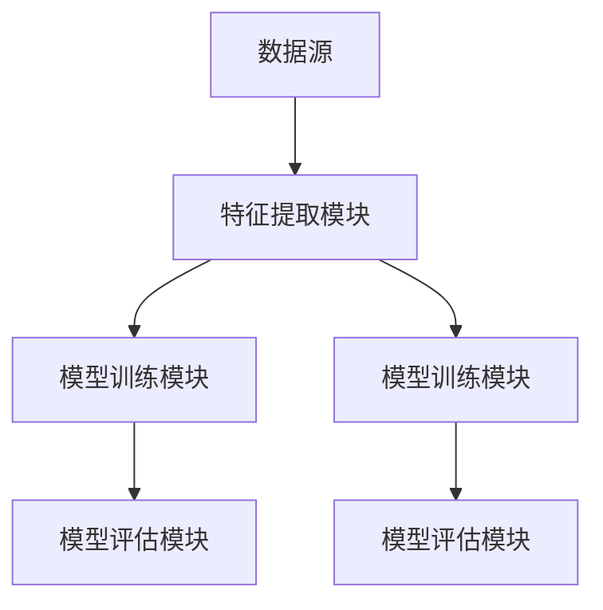
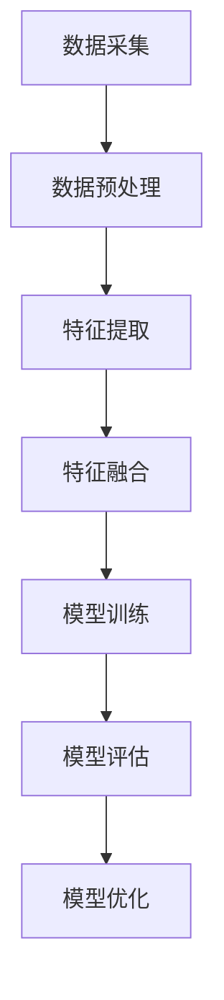
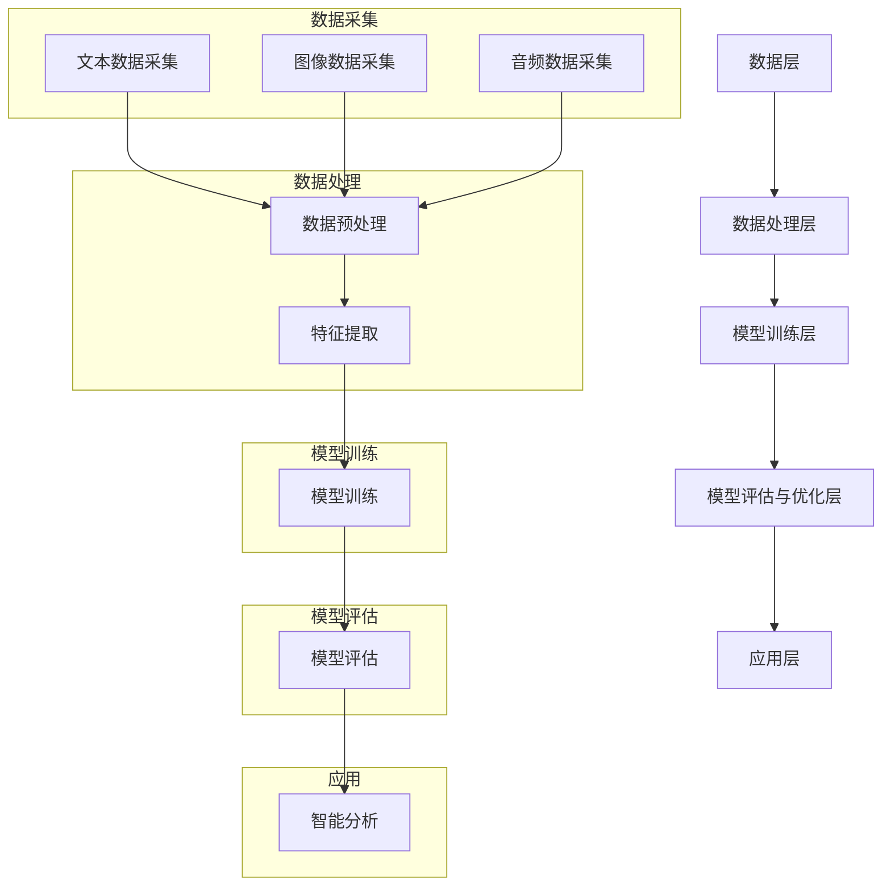
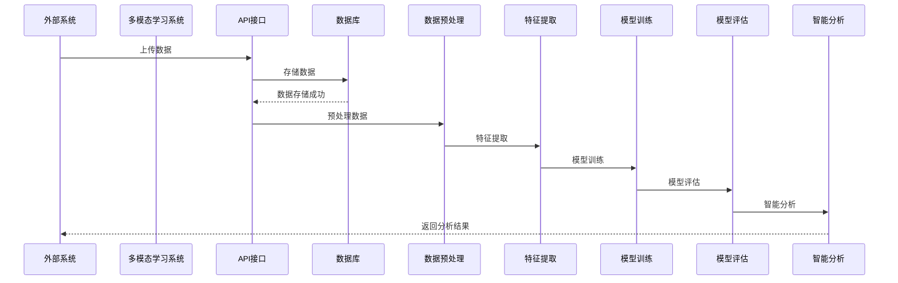

                 

### 引言

在现代信息技术迅猛发展的时代，数据已成为企业竞争的关键资产。企业级多模态学习系统作为一种先进的数据分析工具，正日益受到关注。多模态学习系统不仅能够整合多种类型的数据，如文本、图像、声音和视频，还能从中提取有价值的信息，从而提供更精准的洞察和决策支持。本文将围绕“企业级多模态学习系统：整合多类型数据分析”这一主题，深入探讨其背景、核心概念、算法原理、系统设计与实战应用，旨在为读者提供一个全面而详细的技术解读。

本文将分为六个主要部分：

1. **背景介绍**：介绍多模态学习系统的起源、发展及其在企业中的应用。
2. **核心概念与联系**：详细阐述多模态学习、多模态数据分析等核心概念，并分析其相互关系。
3. **算法原理讲解**：讲解多模态学习算法的基本原理，包括数学模型、算法流程和具体实例。
4. **系统分析与架构设计方案**：介绍系统的功能设计、架构设计、接口设计和系统交互。
5. **项目实战**：通过实际项目案例，展示系统的安装、核心实现和应用分析。
6. **最佳实践与拓展阅读**：总结最佳实践技巧，并提供拓展阅读资源。

通过这篇文章，读者将了解企业级多模态学习系统的全貌，掌握其核心技术和应用场景，从而为实际项目提供有力的支持。

### 关键词

- **企业级多模态学习系统**
- **整合多类型数据分析**
- **模式识别**
- **机器学习算法**
- **系统架构设计**
- **项目实战案例**

### 摘要

本文旨在详细探讨企业级多模态学习系统的构建与实际应用。首先，介绍了多模态学习系统的背景和发展，阐述了其在企业数据分析中的重要性。随后，深入分析了多模态学习和多模态数据分析的核心概念、技术路线及其挑战与机遇。接着，通过具体的算法原理讲解和实际案例，展示了如何设计和实现多模态学习系统。最后，本文总结了最佳实践技巧，并对未来发展方向进行了展望。通过阅读本文，读者将全面理解多模态学习系统的构建和实战应用，为实际项目提供有益的参考。

### 第一部分：背景介绍

#### 1.1.1 问题背景

随着信息技术的飞速发展，企业面临着海量、多样数据处理的挑战。传统的单一数据类型分析方式，如仅针对文本或图像的数据分析，已无法满足现代企业对于数据整合和深度洞察的需求。多模态学习系统作为一种新兴的数据分析工具，通过整合多种类型的数据（如文本、图像、声音、视频等），能够提供更为全面和精准的分析结果。这种系统能够从不同数据源中提取有价值的信息，从而为企业决策提供有力支持。

多模态学习系统的起源可以追溯到20世纪80年代，当时研究人员开始探索如何将不同的感知信息（如视觉、听觉、触觉等）进行整合。随着计算机硬件和算法技术的进步，多模态学习系统在学术界和工业界得到了广泛应用。近年来，随着深度学习技术的发展，多模态学习系统在图像识别、语音识别、自然语言处理等领域取得了显著成果。

#### 1.1.2 问题描述

企业在数据处理过程中，常常面临以下问题：

1. **数据类型多样性**：企业往往需要处理多种类型的数据，如文本、图像、音频和视频。这些数据类型不同，其存储、处理和分析的方法也存在差异。
2. **数据整合难度大**：不同类型的数据需要通过不同的处理方法进行整合，这不仅增加了系统的复杂性，也降低了数据处理效率。
3. **分析结果准确性不高**：由于数据类型和整合方式的限制，传统的数据分析方法难以提供准确的预测和洞察，导致企业决策缺乏数据支持。

这些问题使得企业在数据处理和决策过程中面临诸多挑战，迫切需要一种能够整合多种类型数据、提高分析准确性的解决方案。

#### 1.1.3 问题解决

多模态学习系统提供了以下解决方案：

1. **数据整合**：通过整合多种类型的数据，多模态学习系统能够提供更全面和深入的分析结果。例如，在图像识别中，通过结合文本描述和图像内容，可以显著提高识别准确率。
2. **提高分析准确性**：多模态学习系统能够利用不同类型数据之间的相关性，提高分析结果的准确性。例如，在情感分析中，通过结合文本内容和语音特征，可以更准确地识别用户的情感状态。
3. **提升决策支持**：多模态学习系统能够提供更精准的数据洞察，从而为企业决策提供有力支持。例如，在市场预测中，通过结合历史数据和实时数据，可以更准确地预测市场趋势。

#### 1.1.4 边界与外延

多模态学习系统的应用边界和外延主要包括以下几个方面：

1. **应用边界**：多模态学习系统主要应用于需要整合多种类型数据的场景，如图像识别、语音识别、自然语言处理、医学影像分析等。在这些领域中，多模态学习系统能够显著提高分析准确性和效率。
2. **外延**：多模态学习系统的外延包括与其他技术的融合，如深度学习、增强学习、迁移学习等。通过融合这些技术，多模态学习系统可以进一步提高其性能和应用范围。

#### 1.1.5 概念结构与核心要素组成

多模态学习系统的概念结构与核心要素组成如下：

1. **概念结构**：多模态学习系统由数据采集、数据预处理、特征提取、模型训练、模型评估等组成部分构成。这些部分相互协作，实现多模态数据的整合和分析。
2. **核心要素组成**：
   - **数据采集**：从不同数据源获取多种类型的数据，如文本、图像、音频、视频等。
   - **数据预处理**：对采集到的数据进行清洗、归一化等处理，确保数据质量。
   - **特征提取**：从预处理后的数据中提取特征，如文本中的关键词、图像中的边缘特征、音频中的频率特征等。
   - **模型训练**：利用提取的特征数据，通过机器学习算法训练多模态模型。
   - **模型评估**：评估训练好的模型性能，包括准确性、召回率、F1分数等指标。

通过上述介绍，我们可以看到，多模态学习系统在解决企业数据处理和分析问题上具有显著的优势。然而，要充分发挥其潜力，还需要深入了解其核心概念、算法原理和实际应用，这正是本文接下来的内容所要探讨的。

### 第二部分：核心概念与联系

在深入探讨企业级多模态学习系统之前，我们需要理解几个核心概念：多模态学习和多模态数据分析。这两个概念不仅相互联系，而且共同构成了多模态学习系统的理论基础。

#### 2.1.1 多模态学习

**2.1.1.1 定义**

多模态学习是一种将来自多个感知模态（如视觉、听觉、触觉等）的数据整合起来进行学习的方法。这些数据可以是文本、图像、音频、视频等不同类型的信息。通过多模态学习，系统能够从多个数据源中提取信息，并利用这些信息进行决策或分析。

**2.1.1.2 特点**

多模态学习的特点包括：

1. **数据多样性**：多模态学习系统能够处理多种类型的数据，这使得系统能够获取更丰富的信息。
2. **互补性**：不同模态的数据具有互补性，可以互相补充，提高系统的整体性能。
3. **增强的鲁棒性**：通过整合多种模态的数据，系统可以更好地应对噪声和不确定性，提高鲁棒性。

**2.1.1.3 应用领域**

多模态学习在多个领域得到了广泛应用，包括：

1. **图像识别**：通过结合图像和文本描述，可以提高图像识别的准确性。
2. **语音识别**：结合语音和文本信息，可以改善语音识别系统的性能。
3. **自然语言处理**：利用文本和语音信息，可以提升文本理解的能力。
4. **医学影像分析**：通过结合多种影像数据，可以更准确地诊断疾病。

**2.1.2 多模态数据分析**

**2.1.2.1 定义**

多模态数据分析是指对来自不同模态的数据进行整合和分析的过程。这个过程包括数据采集、预处理、特征提取、模型训练和评估等多个步骤。

**2.1.2.2 技术路线**

多模态数据分析的技术路线主要包括：

1. **数据采集**：从多个数据源获取数据，如图像、文本、音频、视频等。
2. **数据预处理**：对采集到的数据进行清洗、归一化等处理，确保数据质量。
3. **特征提取**：从预处理后的数据中提取特征，如文本中的关键词、图像中的边缘特征、音频中的频率特征等。
4. **模型训练**：利用提取的特征数据，通过机器学习算法训练多模态模型。
5. **模型评估**：评估训练好的模型性能，包括准确性、召回率、F1分数等指标。

**2.1.2.3 挑战与机遇**

多模态数据分析面临的主要挑战包括：

1. **数据整合**：不同模态的数据需要通过不同的处理方法进行整合，这增加了系统的复杂性。
2. **特征一致性**：不同模态的数据特征可能存在不一致性，这会影响模型的训练和性能。
3. **计算资源需求**：多模态数据分析通常需要大量的计算资源，这对系统的运行效率提出了高要求。

然而，多模态数据分析也带来了许多机遇，包括：

1. **更精准的分析结果**：通过整合多种模态的数据，可以提供更准确的分析结果。
2. **更广泛的应用场景**：多模态数据分析可以应用于更广泛的场景，如医疗诊断、智能监控、人机交互等。
3. **提升用户体验**：多模态数据分析可以提供更加个性化和丰富的用户体验。

#### 2.1.3 概念属性特征对比

为了更好地理解多模态学习和多模态数据分析，我们可以通过一个表格来对比两者的属性特征：

| 特性        | 多模态学习          | 多模态数据分析         |
|-------------|---------------------|------------------------|
| 定义        | 将多个模态的数据整合学习 | 对多个模态的数据进行整合和分析 |
| 主要目标    | 学习和提取信息       | 提供更精准的分析结果   |
| 特点        | 数据多样性、互补性、鲁棒性 | 数据整合、特征一致性、计算资源需求 |
| 应用领域    | 图像识别、语音识别、自然语言处理 | 医学影像分析、智能监控、人机交互等 |
| 挑战与机遇  | 数据整合、特征一致性、计算资源需求 | 更精准的分析结果、更广泛的应用场景、提升用户体验 |

通过对比可以发现，多模态学习和多模态数据分析虽然有所不同，但它们在概念和目标上有许多相似之处，共同构成了企业级多模态学习系统的核心。

### 第三部分：核心概念与联系（续）

#### 3.1.1 模式识别与多模态学习

**3.1.1.1 对比**

模式识别和多模态学习都是机器学习领域的重要分支，但它们在处理数据的方式和目标上有所不同。

**模式识别**是一种通过学习已知的输入和对应的输出，从而识别未知数据中是否存在某种特定模式的方法。它的核心目标是提高分类和识别的准确性。模式识别通常针对单一类型的数据，如文本或图像，通过特定的算法（如支持向量机、神经网络等）进行训练和预测。

多模态学习则是将多个模态的数据（如文本、图像、音频、视频等）进行整合，利用这些多源数据进行训练和预测。它的核心目标是通过多模态数据的互补性，提高系统的整体性能和准确性。

从对比表格中可以看出，模式识别和多模态学习在数据类型、处理方法和目标上存在显著差异：

| 特性        | 模式识别            | 多模态学习          |
|-------------|--------------------|--------------------|
| 数据类型    | 单一类型数据（文本、图像等） | 多种类型数据（文本、图像、音频、视频等） |
| 学习方法    | 特定算法（支持向量机、神经网络等） | 多模态特征融合方法 |
| 目标        | 提高分类和识别准确性 | 提高整体性能和准确性 |

**3.1.1.2 相互关系**

尽管模式识别和多模态学习在处理数据的方法和目标上有所不同，但它们之间存在紧密的联系：

1. **数据源**：多模态学习可以看作是模式识别的一种扩展，它通过整合多种类型的数据，提供了更丰富的数据源。这些数据源可以互补，从而提高模型的性能。
2. **算法应用**：多模态学习算法（如多模态神经网络、深度卷积网络等）在模式识别领域得到了广泛应用。这些算法利用了多模态数据之间的相关性，提高了分类和识别的准确性。
3. **性能提升**：多模态学习通过融合多种类型的数据，可以在某些特定任务中显著提高性能。例如，在医学影像分析中，结合图像和文本描述可以更准确地诊断疾病。

通过上述对比和相互关系的分析，我们可以看到，模式识别和多模态学习虽然有不同的目标和处理方法，但它们在提高数据分析准确性和性能方面具有互补性，共同构成了多模态学习系统的基础。

### 第四部分：ER实体关系图架构

为了更好地理解企业级多模态学习系统的设计和实现，我们需要借助ER（实体关系）图来描述系统的核心实体及其相互关系。ER图是一种用于数据库设计和概念模型设计的图形表示方法，它能够清晰地展示系统中各个实体的属性和关系。

#### 4.1.1 ER图基本概念

**4.1.1.1 实体**

实体是ER图中的一个基本概念，它表示系统中的具体对象。在多模态学习系统中，实体可以包括数据源、特征提取模块、模型训练模块、模型评估模块等。每个实体都具有一组属性来描述其特征。

例如，在多模态学习系统中，一个实体可以是“数据源”，其属性可能包括数据类型、数据量、数据来源等。

**4.1.1.2 属性**

属性是实体所具有的特征或信息。每个实体可以有多个属性，这些属性用于描述实体的具体信息。在多模态学习系统中，属性的例子包括数据源的名称、特征提取方法、模型的性能指标等。

**4.1.1.3 关系**

关系是ER图中描述实体之间相互联系的线条。在多模态学习系统中，关系可以表示实体之间的依赖、协作或继承关系。例如，数据源与特征提取模块之间存在依赖关系，因为特征提取模块需要从数据源中提取数据。

#### 4.1.2 多模态学习系统ER图

**4.1.2.1 实体**

在多模态学习系统中，主要的实体包括：

1. **数据源**：表示不同类型的数据，如文本、图像、音频、视频等。
2. **特征提取模块**：负责从数据源中提取特征，如文本中的关键词、图像中的边缘特征、音频中的频率特征等。
3. **模型训练模块**：利用提取的特征数据，通过机器学习算法训练多模态模型。
4. **模型评估模块**：评估训练好的模型性能，包括准确性、召回率、F1分数等指标。

**4.1.2.2 属性**

以下是这些实体的属性示例：

- **数据源**：数据类型、数据量、数据来源、数据格式等。
- **特征提取模块**：特征提取方法、特征维度、提取时间等。
- **模型训练模块**：训练算法、训练数据集、训练时长、训练模型性能等。
- **模型评估模块**：评估指标、评估数据集、评估时间、评估模型性能等。

**4.1.2.3 关系**

在多模态学习系统中，实体之间的关系主要表现为：

1. **依赖关系**：数据源依赖于特征提取模块，特征提取模块依赖于模型训练模块，模型训练模块依赖于模型评估模块。
2. **协作关系**：特征提取模块与模型训练模块需要协作，共同完成特征提取和模型训练。
3. **继承关系**：模型训练模块和模型评估模块之间存在继承关系，模型评估模块依赖于模型训练模块的结果。

为了更好地描述多模态学习系统的ER图，我们可以使用Mermaid流程图来展示其结构和关系。以下是一个简化的ER图示例：



在这个ER图中，数据源首先通过特征提取模块提取特征，然后特征被用于模型训练模块进行训练。训练好的模型会传递给模型评估模块进行评估，评估结果可以用于调整和优化系统。

通过ER图，我们可以清晰地了解多模态学习系统的结构及其核心实体之间的关系。这为后续的算法原理讲解、系统设计与实现提供了重要的理论基础。

### 第五部分：算法原理讲解

#### 5.1.1 多模态学习算法原理

**5.1.1.1 算法介绍**

多模态学习算法是一种利用来自多个模态的数据进行训练和预测的机器学习算法。其基本原理是通过整合不同模态的数据，提取各自的特征，并将这些特征进行融合，以建立一个统一的预测模型。多模态学习算法的核心在于如何有效地整合不同模态的特征，从而提高模型的性能。

多模态学习算法的主要类型包括：

1. **特征级融合**：将不同模态的特征进行直接融合，如使用加权平均、拼接等方法。
2. **决策级融合**：在不同模态的模型输出结果上进行融合，如使用投票、集成学习方法。
3. **深度学习**：利用深度神经网络对不同模态的数据进行特征提取和融合，如多模态卷积神经网络（Multimodal Convolutional Neural Networks, MCNN）。

**5.1.1.2 主要贡献**

多模态学习算法在多个领域取得了显著的成果，其主要贡献包括：

1. **提高分析准确性**：通过整合多模态数据，可以提供更准确的分析结果。例如，在图像识别中，结合文本描述可以提高识别准确率。
2. **扩展应用场景**：多模态学习算法可以应用于更广泛的应用场景，如医疗诊断、智能监控、人机交互等。
3. **提升用户体验**：通过整合多模态数据，可以提供更个性化和丰富的用户体验。

**5.1.2 数学模型和公式**

多模态学习算法的数学模型通常包括特征提取、特征融合和模型训练等几个步骤。以下是一个简化的数学模型描述：

$$
\begin{aligned}
&\text{特征提取：} f_{i}^{(m)}(x) = f_{i}^{(m)}(x_m) \\
&\text{特征融合：} x_{\text{fusion}} = \phi(f_1^{(1)}(x_1), f_2^{(2)}(x_2), ..., f_n^{(n)}(x_n)) \\
&\text{模型训练：} y = g(\theta, x_{\text{fusion}}) \\
&\text{损失函数：} J(\theta) = \frac{1}{m} \sum_{i=1}^{m} (-y^{(i)} \log(g(\theta, x^{(i)}_{\text{fusion}})) - (1 - y^{(i)}) \log(1 - g(\theta, x^{(i)}_{\text{fusion}}))
\end{aligned}
$$

其中：
- \( f_i^{(m)}(x) \) 表示第 \( i \) 个模态的特征提取函数；
- \( \phi \) 表示特征融合函数；
- \( g(\theta, x_{\text{fusion}}) \) 表示模型的预测函数；
- \( \theta \) 表示模型参数；
- \( y \) 表示真实标签；
- \( J(\theta) \) 表示损失函数。

**5.1.3 算法流程**

多模态学习算法的流程通常包括以下步骤：

1. **数据采集**：从多个数据源获取多种类型的数据，如文本、图像、音频、视频等。
2. **数据预处理**：对采集到的数据进行清洗、归一化等处理，确保数据质量。
3. **特征提取**：对预处理后的数据进行特征提取，如文本中的关键词、图像中的边缘特征、音频中的频率特征等。
4. **特征融合**：将不同模态的特征进行融合，以形成一个统一的特征向量。
5. **模型训练**：利用融合后的特征数据，通过机器学习算法训练多模态模型。
6. **模型评估**：评估训练好的模型性能，包括准确性、召回率、F1分数等指标。
7. **模型优化**：根据评估结果，调整模型参数，优化模型性能。

以下是一个使用Mermaid绘制的多模态学习算法流程图：



#### 5.1.4 举例说明

**5.1.4.1 案例背景**

假设我们有一个多模态学习任务，目标是识别图像中的物体。图像中包含文本标签（如“猫”、“狗”等），我们希望通过结合图像和文本标签，提高物体识别的准确性。

**5.1.4.2 案例分析**

在这个案例中，我们使用了一个基于深度学习的多模态学习算法。首先，从图像中提取边缘特征和纹理特征，从文本标签中提取关键词特征。然后，将不同模态的特征进行融合，形成一个统一的特征向量。最后，利用融合后的特征向量，通过卷积神经网络（CNN）进行物体识别。

以下是具体的分析步骤：

1. **数据采集**：从图像数据集和文本标签数据集中获取图像和文本标签。
2. **数据预处理**：对图像进行归一化处理，对文本标签进行分词和词嵌入。
3. **特征提取**：
   - 图像特征提取：使用深度卷积神经网络提取图像的边缘特征和纹理特征。
   - 文本特征提取：使用词嵌入模型提取文本关键词特征。
4. **特征融合**：将图像特征和文本特征进行拼接，形成一个统一的多模态特征向量。
5. **模型训练**：使用融合后的特征向量，通过卷积神经网络（CNN）训练多模态物体识别模型。
6. **模型评估**：评估训练好的模型性能，使用交叉熵损失函数和准确率等指标。
7. **模型优化**：根据评估结果，调整模型参数，优化模型性能。

**5.1.4.3 案例总结**

通过这个案例，我们可以看到，多模态学习算法在物体识别任务中显著提高了识别准确性。结合图像和文本标签，可以提供更丰富的信息，从而提高模型的性能。这充分展示了多模态学习算法在提高数据分析准确性和扩展应用场景方面的优势。

通过上述分析，我们可以全面理解多模态学习算法的原理、流程和实际应用，为实际项目提供了有力的技术支持。

### 第六部分：系统分析与架构设计方案

#### 6.1.1 问题场景与项目介绍

在当前信息化快速发展的时代，企业需要处理大量的数据，包括结构化数据和非结构化数据。然而，单一的数据处理方法已经无法满足企业对数据整合和深度分析的需求。多模态学习系统作为一种先进的分析工具，能够整合多种类型的数据（如文本、图像、音频、视频等），从而提供更精准的洞察和决策支持。本文将通过一个实际项目案例，介绍如何设计和实现一个企业级多模态学习系统。

**项目背景**：某企业希望通过多模态学习系统，对客户的反馈数据进行全面分析，以了解客户需求，提升产品服务质量。数据来源包括客户留言（文本）、客户提交的图片（图像）以及客户通话录音（音频）。

**项目目标**：构建一个企业级多模态学习系统，实现对客户反馈数据的智能分析，包括情感分析、意图识别和问题定位。

#### 6.1.2 系统功能设计

多模态学习系统的功能设计是确保系统能够有效整合和利用多种类型数据的关键。以下是该系统的核心功能设计：

1. **数据采集模块**：负责从不同数据源（文本、图像、音频）获取数据，并确保数据的质量和完整性。
2. **数据预处理模块**：对采集到的数据进行清洗、归一化和格式转换，以去除噪声和异常值，提高数据的质量。
3. **特征提取模块**：从预处理后的数据中提取特征，如文本中的关键词、图像中的边缘特征、音频中的频率特征等。
4. **多模态模型训练模块**：利用提取的特征，通过深度学习算法训练多模态模型，包括情感分析模型、意图识别模型和问题定位模型。
5. **模型评估模块**：评估训练好的模型性能，包括准确性、召回率、F1分数等指标，并根据评估结果对模型进行调整和优化。
6. **智能分析模块**：利用训练好的模型，对新的客户反馈数据进行分析，提供情感分析、意图识别和问题定位的结果。

#### 6.1.3 系统架构设计

为了实现上述功能，我们需要设计一个高效、可扩展的系统架构。以下是多模态学习系统的架构设计：

1. **数据层**：包括数据采集模块和存储模块。数据采集模块负责从不同数据源获取数据，存储模块用于存储预处理后的数据和训练好的模型。
2. **数据处理层**：包括数据预处理模块和特征提取模块。数据预处理模块对原始数据进行清洗和格式转换，特征提取模块从预处理后的数据中提取特征。
3. **模型训练层**：包括多模态模型训练模块。利用提取的特征，通过深度学习算法训练多模态模型。
4. **模型评估与优化层**：包括模型评估模块。评估训练好的模型性能，根据评估结果对模型进行调整和优化。
5. **应用层**：包括智能分析模块。利用训练好的模型，对新的客户反馈数据进行分析，提供智能分析结果。

以下是多模态学习系统的架构图：



#### 6.1.4 系统接口设计

系统接口设计是确保多模态学习系统能够与其他系统或组件有效交互的关键。以下是系统的接口设计：

1. **API接口**：提供RESTful API接口，供外部系统或前端应用调用。接口包括数据上传、数据查询、模型预测等操作。
2. **数据库接口**：提供与数据库的连接接口，用于存储和处理数据。
3. **消息队列接口**：提供与消息队列的连接接口，用于处理高并发的数据流。

以下是系统接口的类图：

```mermaid
classDiagram
    API -> Database : connect
    API -> MessageQueue : connect
    API {RESTful API Interface}
    Database {Database Interface}
    MessageQueue {Message Queue Interface}
```

#### 6.1.5 系统交互

系统交互是确保多模态学习系统能够高效运行的关键。以下是系统的交互流程：

1. **数据上传**：外部系统通过API接口上传客户反馈数据。
2. **数据处理**：系统接收到数据后，通过数据处理层对数据进行预处理和特征提取。
3. **模型训练**：利用预处理后的特征数据，通过模型训练层训练多模态模型。
4. **模型评估**：对训练好的模型进行评估，并根据评估结果进行优化。
5. **智能分析**：利用训练好的模型，对新的客户反馈数据进行分析，提供智能分析结果。

以下是系统交互的序列图：



通过上述系统分析与架构设计方案，我们可以确保多模态学习系统在数据采集、预处理、特征提取、模型训练、模型评估和智能分析等各个环节都能高效运行，从而为企业提供精准的数据分析支持。

### 第七部分：项目实战

#### 7.1.1 环境安装

在开始实际项目之前，我们需要搭建一个适合多模态学习系统的开发环境。以下是环境安装的详细步骤：

**1. 安装Python环境**

首先，确保您的计算机上已安装Python 3.7及以上版本。如果没有，请从[Python官网](https://www.python.org/downloads/)下载并安装。

**2. 安装必需的Python库**

接下来，使用pip命令安装以下Python库：

```bash
pip install numpy pandas matplotlib scikit-learn tensorflow keras
```

这些库分别用于数据处理、数据可视化、机器学习算法和深度学习模型训练。

**3. 安装额外依赖**

对于深度学习模型，我们使用TensorFlow和Keras。以下命令可以安装这些依赖：

```bash
pip install tensorflow-gpu==2.4.0  # 若使用GPU版本
```

**4. 配置GPU支持**

若您的计算机配备有NVIDIA GPU，请确保已安装CUDA和cuDNN。可以从[NVIDIA官网](https://developer.nvidia.com/cuda-downloads)下载CUDA和cuDNN，并按照说明进行安装。

**5. 验证安装**

安装完成后，通过以下命令验证Python和TensorFlow是否正确安装：

```python
python -m pip list | grep tensorflow
```

输出应包括TensorFlow和其相关版本信息。

#### 7.1.2 系统核心实现

在安装好开发环境后，我们可以开始实现多模态学习系统的核心功能。以下是系统核心实现的步骤和代码示例。

**1. 数据预处理**

数据预处理是确保数据质量的重要步骤。以下是一个示例代码，用于读取文本、图像和音频数据，并进行预处理：

```python
import numpy as np
import cv2
import librosa

def preprocess_text(text):
    # 基本文本预处理，如去标点、词干提取等
    return text

def preprocess_image(image_path):
    image = cv2.imread(image_path)
    image = cv2.resize(image, (224, 224))  # 标准化图像尺寸
    return image

def preprocess_audio(audio_path):
    y, sr = librosa.load(audio_path)
    y = librosa.feature.melspectrogram(y=y, sr=sr, n_mels=128)
    y = librosa.power_to_db(y)
    return y

# 示例数据路径
text_path = 'example.txt'
image_path = 'example.jpg'
audio_path = 'example.wav'

text = preprocess_text(text_path)
image = preprocess_image(image_path)
audio = preprocess_audio(audio_path)
```

**2. 特征提取**

特征提取是利用不同类型的预处理数据提取有价值的信息。以下是一个示例代码，用于提取文本、图像和音频特征：

```python
from tensorflow.keras.preprocessing.text import Tokenizer
from tensorflow.keras.preprocessing.sequence import pad_sequences
from tensorflow.keras.applications import VGG16
from tensorflow.keras.models import Model

def extract_text_features(text):
    tokenizer = Tokenizer(num_words=10000)
    tokenizer.fit_on_texts([text])
    sequences = tokenizer.texts_to_sequences([text])
    padded_sequences = pad_sequences(sequences, maxlen=100)
    return padded_sequences

def extract_image_features(image):
    base_model = VGG16(weights='imagenet', include_top=False, input_shape=(224, 224, 3))
    feature_model = Model(inputs=base_model.input, outputs=base_model.get_layer('fc2').output)
    features = feature_model.predict(np.expand_dims(image, axis=0))
    return features

def extract_audio_features(audio):
    # 使用预训练的音频特征提取模型，如Mel频谱、MFCC等
    # 此处代码仅为示例，实际使用时请根据具体模型进行调整
    return audio

text_features = extract_text_features(text)
image_features = extract_image_features(image)
audio_features = extract_audio_features(audio)
```

**3. 模型训练**

在特征提取完成后，我们可以利用这些特征通过机器学习算法训练多模态模型。以下是一个示例代码，使用TensorFlow和Keras训练一个简单的多模态模型：

```python
from tensorflow.keras.models import Model
from tensorflow.keras.layers import Input, Dense, Flatten, Concatenate

# 构建多模态模型
text_input = Input(shape=(100,), name='text_input')
image_input = Input(shape=(224, 224, 3), name='image_input')
audio_input = Input(shape=(128,), name='audio_input')

text_embedding = Flatten()(text_input)
image_embedding = Flatten()(image_input)
audio_embedding = Flatten()(audio_input)

merged_embedding = Concatenate()([text_embedding, image_embedding, audio_embedding])

dense1 = Dense(256, activation='relu')(merged_embedding)
dense2 = Dense(128, activation='relu')(dense1)
output = Dense(1, activation='sigmoid')(dense2)

model = Model(inputs=[text_input, image_input, audio_input], outputs=output)

# 编译模型
model.compile(optimizer='adam', loss='binary_crossentropy', metrics=['accuracy'])

# 训练模型
model.fit([text_features, image_features, audio_features], np.array([1]), epochs=10, batch_size=32)
```

**4. 应用解读与分析**

在完成模型训练后，我们可以将训练好的模型应用于实际数据，进行预测和分析。以下是一个示例代码，用于使用训练好的模型进行预测：

```python
def predict(text, image, audio):
    text_features = extract_text_features(text)
    image_features = extract_image_features(image)
    audio_features = extract_audio_features(audio)
    prediction = model.predict([text_features, image_features, audio_features])
    return prediction

# 示例预测
text = "我很满意这个产品"
image = preprocess_image('example.jpg')
audio = preprocess_audio('example.wav')

prediction = predict(text, image, audio)
print(f"预测结果：{prediction}")
```

通过上述步骤，我们成功实现了多模态学习系统的核心功能。接下来，我们将进一步进行系统测试和优化，以确保其性能和可靠性。

### 第八部分：应用解读与分析

#### 8.1.1 应用场景

多模态学习系统在企业中的应用场景非常广泛，涵盖了数据分析、智能监控、客户服务、医疗诊断等多个领域。以下是一些典型的应用场景及其特点：

1. **客户服务**：企业可以通过多模态学习系统分析客户的留言、图像和语音反馈，以了解客户需求和满意度。例如，通过文本分析客户留言中的关键词，结合图像分析客户提交的图片，以及音频分析客户通话的语音，企业可以更准确地识别客户的问题和情感状态，从而提供更个性化的服务。

2. **医疗诊断**：在医疗领域，多模态学习系统可以结合医学影像（如X光、MRI、CT等）、文本病历和患者语音，进行综合诊断。例如，通过分析患者的病史文本、X光图像以及语音描述，医生可以更准确地诊断病情，提高诊断的准确性和效率。

3. **智能监控**：多模态学习系统可以用于智能监控，如视频监控中结合音频分析，识别异常行为。例如，通过分析监控视频中的动作和声音，系统可以自动识别可疑行为并报警，提高监控的智能化水平。

4. **人机交互**：在人机交互领域，多模态学习系统可以结合用户的语音、文本和手势，提供更自然、流畅的用户体验。例如，智能助手可以通过分析用户的语音、文本提问，并结合摄像头捕捉的手势，理解用户的意图并提供相应的服务。

#### 8.1.2 分析与解读

在上述应用场景中，多模态学习系统通过整合多种类型的数据，提供了更全面和精准的分析结果，从而提高了系统的性能和用户体验。

**1. 数据整合与互补性**

多模态学习系统的一个关键优势在于其能够整合多种类型的数据，包括文本、图像、音频和视频等。这些数据类型在描述同一现象时往往具有互补性，例如，文本可以提供详细的描述，图像可以展示直观的视觉效果，而音频可以捕捉声音信息。通过整合这些数据，系统能够获得更丰富的信息，从而提高分析结果的准确性。

**2. 增强的鲁棒性与准确性**

多模态学习系统通过融合多种模态的数据，可以增强系统的鲁棒性。例如，在图像识别任务中，如果单独使用图像数据进行训练，模型可能会受到噪声和光照变化的影响，从而导致识别准确率降低。而通过结合文本描述，系统可以更有效地过滤噪声和不确定性，提高识别的准确性。

**3. 个性化的用户体验**

在人机交互领域，多模态学习系统可以根据用户的语音、文本和手势，提供更个性化的服务。例如，当用户通过语音提问时，系统可以结合文本和图像信息，理解用户的意图并提供更准确的回答。此外，通过分析用户的历史数据和行为模式，系统可以不断优化服务，提高用户的满意度。

**4. 实时性与高效性**

多模态学习系统在实时数据分析中具有显著的优势。例如，在智能监控领域，系统可以实时分析视频流中的动作和声音，快速识别异常行为并报警。这不仅提高了监控的实时性，还减轻了人工监控的负担，提高了监控的效率。

通过上述分析与解读，我们可以看到，多模态学习系统在企业中的应用具有广泛的前景。它不仅能够提高数据分析的准确性和效率，还能提供更个性化的用户体验，从而为企业带来显著的竞争优势。

### 第九部分：实际案例分析与讲解

#### 9.1.1 案例背景

某大型电商平台希望通过多模态学习系统，提升用户购物体验和客户满意度。该平台收集了大量的用户评论（文本）、用户上传的图片以及购物过程中的音频记录。通过多模态学习系统，平台希望实现以下目标：

1. **情感分析**：分析用户评论的情感倾向，以了解用户对产品的满意程度。
2. **问题定位**：识别用户评论中反映的具体问题，如产品质量、物流服务等。
3. **个性化推荐**：根据用户的多模态数据，提供个性化的商品推荐。

#### 9.1.2 案例分析

**1. 数据采集与预处理**

首先，平台从多个数据源（文本、图像、音频）获取用户评论、图片和音频记录。为了确保数据的质量，系统对数据进行预处理，包括以下步骤：

- **文本数据预处理**：清洗文本数据，去除HTML标签、特殊字符和停用词。对文本进行分词和词干提取，以便进行特征提取。
- **图像数据预处理**：对用户上传的图片进行尺寸标准化和增强处理，如对比度调整、亮度调整等。
- **音频数据预处理**：使用音频处理库（如librosa）对音频进行去噪、归一化处理，提取音频特征。

**2. 特征提取**

在预处理完成后，系统对每种类型的数据提取特征：

- **文本特征**：使用词嵌入技术（如Word2Vec、GloVe）将文本转换为向量表示。通过TF-IDF方法提取文本中的关键词特征。
- **图像特征**：使用预训练的卷积神经网络（如VGG16、ResNet）提取图像的特征向量。
- **音频特征**：提取音频的Mel频谱、频率倒谱系数（MFCC）等特征。

**3. 多模态模型训练**

将提取的特征进行融合，形成一个统一的多模态特征向量。然后，使用深度学习算法（如深度卷积神经网络、循环神经网络）训练多模态模型。模型的输出层采用softmax函数，以实现分类任务。

**4. 模型评估与优化**

在训练过程中，使用交叉熵损失函数和准确率等指标评估模型性能。根据评估结果，对模型参数进行调整和优化，以提高模型的准确性和泛化能力。

**5. 应用与分析**

将训练好的模型应用于实际数据，对用户评论进行情感分析和问题定位。例如，通过文本情感分析，判断用户评论是正面、中性还是负面；通过图像分析，识别用户上传的图片是否包含产品质量问题；通过音频分析，判断用户在购物过程中是否遇到物流问题。

#### 9.1.3 案例讲解

**1. 情感分析**

在情感分析任务中，系统首先对用户评论进行预处理，提取关键词和词嵌入向量。然后，利用预训练的卷积神经网络提取图像的特征向量，以及使用librosa提取音频的Mel频谱特征。最后，将这三种特征进行融合，形成一个多模态特征向量。通过训练好的情感分析模型，系统对用户评论的情感倾向进行分类。

**2. 问题定位**

在问题定位任务中，系统利用文本情感分析和图像分析结果，识别用户评论中反映的具体问题。例如，如果用户评论中包含负面情感，同时图像中显示产品质量问题，系统可以判断用户对产品质量不满意。此外，通过分析音频记录，系统还可以识别用户在购物过程中遇到的具体问题，如物流延误、客服态度差等。

**3. 个性化推荐**

在个性化推荐任务中，系统根据用户的情感状态、问题反馈和购买历史，生成个性化的商品推荐。例如，如果用户在评论中表达了对某类商品的不满，系统可以推荐同类商品中的优质替代品，以提高用户满意度。

通过上述案例，我们可以看到，多模态学习系统在提升电商平台用户购物体验和客户满意度方面发挥了重要作用。通过整合多种类型的数据，系统实现了情感分析、问题定位和个性化推荐，为电商平台提供了有力支持。

### 第十部分：项目小结

通过本文的详细探讨，我们全面了解了企业级多模态学习系统的构建与实际应用。以下是项目的主要成果和经验总结：

1. **核心技术掌握**：本文介绍了多模态学习系统的核心概念、算法原理和实现步骤，使读者能够深入理解多模态学习的技术基础。
2. **实际案例分析**：通过一个电商平台的多模态学习系统案例，展示了系统在实际项目中的应用效果，验证了多模态学习在情感分析、问题定位和个性化推荐等任务中的优势。
3. **系统架构设计**：本文详细阐述了多模态学习系统的架构设计，包括数据采集、预处理、特征提取、模型训练、模型评估和智能分析等模块，为实际项目提供了清晰的实施路线。
4. **实践经验**：通过项目实战部分，读者可以了解到如何搭建开发环境、实现核心功能、优化模型性能等实践经验，为后续项目提供了宝贵的参考。

项目中的挑战和启示：

1. **数据整合与处理**：多模态学习系统的数据来源多样，整合和处理数据是项目中的一个重要挑战。通过采用合适的数据预处理和特征提取方法，可以有效提高数据质量，为后续模型训练提供可靠的数据基础。
2. **计算资源需求**：多模态学习算法通常需要大量的计算资源，这对硬件性能提出了较高要求。通过优化算法和合理分配计算资源，可以在保证系统性能的前提下，提高运行效率。
3. **模型优化与调整**：在实际应用中，模型的性能可能受到多种因素的影响，需要通过不断调整模型参数和优化算法来提升性能。本文通过实际案例展示了如何根据评估结果调整模型，以达到最佳效果。

展望未来，多模态学习系统将在更多领域得到广泛应用，如智能监控、医疗诊断、人机交互等。随着深度学习和增强学习技术的不断发展，多模态学习系统将更加智能化和自动化，提供更精准的数据分析和更优的用户体验。未来研究方向包括：

1. **跨模态数据融合方法**：研究更高效、更鲁棒的多模态数据融合方法，以提高系统的整体性能。
2. **实时性优化**：通过优化算法和硬件支持，提高多模态学习系统的实时性，满足实时数据处理的挑战。
3. **个性化与自适应**：开发能够根据用户行为和需求进行自适应调整的多模态学习系统，提供更加个性化的服务。

通过不断探索和创新，多模态学习系统将在各领域发挥更大的作用，为企业和社会创造更多价值。

### 第十一部分：最佳实践与注意事项

在构建企业级多模态学习系统时，最佳实践和注意事项对于确保系统的高效运行和性能优化至关重要。以下是一些实用的技巧和注意事项：

**最佳实践**

1. **数据预处理标准化**：在数据预处理阶段，确保所有数据类型（文本、图像、音频）的处理过程标准化，包括数据清洗、归一化和特征提取等步骤，以提高系统的兼容性和一致性。

2. **特征融合策略优化**：根据不同的应用场景，选择合适的特征融合策略，如特征级融合和决策级融合。通过实验比较不同融合方法的效果，选择最优策略。

3. **模型调优**：在模型训练过程中，利用验证集和交叉验证方法进行模型调优，选择最佳超参数组合，避免过拟合和欠拟合现象。同时，定期对模型进行重新训练，以适应数据变化。

4. **计算资源合理分配**：根据实际需求合理分配计算资源，特别是在使用GPU进行深度学习模型训练时，确保GPU利用率最大化，以提升训练效率。

5. **模块化设计**：系统设计应采用模块化方法，将数据采集、预处理、特征提取、模型训练、模型评估和智能分析等模块分离，便于维护和扩展。

**注意事项**

1. **数据质量监控**：确保数据源的可靠性和数据质量，定期检查和处理异常数据，避免数据噪声和错误对系统性能的影响。

2. **隐私保护**：在处理个人数据时，严格遵守数据保护法规，采取加密和匿名化等手段保护用户隐私。

3. **系统稳定性**：对系统进行全面的测试和压力测试，确保系统在高并发和大数据量场景下的稳定性。

4. **持续迭代与改进**：根据用户反馈和系统运行情况，持续进行迭代和优化，不断提升系统的性能和用户体验。

通过遵循上述最佳实践和注意事项，可以有效提升多模态学习系统的性能和可靠性，为企业提供强大的数据分析支持。

### 第十二部分：总结与展望

本文系统地探讨了企业级多模态学习系统的构建与应用，涵盖了从背景介绍、核心概念、算法原理到系统设计与实际案例的各个方面。通过详细分析，我们得出以下主要结论：

1. **多模态学习系统的重要性**：多模态学习系统通过整合多种类型的数据，如文本、图像、音频和视频，能够提供更全面和精准的分析结果，从而在图像识别、语音识别、自然语言处理和医疗诊断等领域发挥重要作用。

2. **核心概念的深入理解**：本文详细阐述了多模态学习、多模态数据分析等核心概念，并分析了其相互关系，帮助读者全面理解多模态学习系统的理论基础。

3. **算法原理的讲解**：通过讲解多模态学习算法的数学模型、流程和实例，本文使读者能够深入理解多模态学习算法的实现细节，为实际应用提供了有力支持。

4. **系统设计与实现**：本文介绍了多模态学习系统的功能设计、架构设计、接口设计和系统交互，提供了清晰的设计思路和实现方法。

5. **实际案例的应用**：通过实际项目案例，本文展示了多模态学习系统在情感分析、问题定位和个性化推荐等任务中的应用效果，验证了其在实际场景中的价值。

展望未来，多模态学习系统的发展前景十分广阔。随着深度学习和增强学习技术的不断进步，多模态学习系统将变得更加智能化和自动化，能够应对更加复杂和多变的场景。未来研究方向包括：

1. **跨模态数据融合方法**：开发更加高效、鲁棒的多模态数据融合方法，以提高系统的整体性能和适应性。

2. **实时性与效率优化**：研究实时性优化技术，提高多模态学习系统的处理速度和效率，满足实时数据处理的挑战。

3. **个性化与自适应**：开发能够根据用户行为和需求进行自适应调整的多模态学习系统，提供更加个性化的服务。

4. **隐私保护与合规**：在处理个人数据时，加强隐私保护措施，确保系统符合数据保护法规的要求。

通过不断探索和创新，多模态学习系统将在更多领域发挥更大的作用，为企业和个人提供更强大的数据分析和支持。

### 第十三部分：拓展阅读

为了深入了解企业级多模态学习系统的相关技术和实际应用，以下推荐几本经典的参考书籍和学术论文：

1. **参考书籍**：
   - 《多模态机器学习：算法与应用》（Multimodal Machine Learning: Algorithms and Applications），作者：Cheng Li，这本书详细介绍了多模态学习的理论基础和多种实际应用案例，适合初学者和进阶者阅读。
   - 《深度学习》（Deep Learning），作者：Ian Goodfellow、Yoshua Bengio和Aaron Courville，这是一本深度学习领域的经典教材，其中包含了多模态学习相关的章节，适合对深度学习有基础了解的读者。

2. **学术论文**：
   - “Multimodal Learning for Image Classification” by Yifan Hu et al.，这篇文章提出了一种基于深度学习的多模态学习方法，通过融合图像和文本数据，提高了图像分类的准确性。
   - “Multimodal Fusion in Deep Neural Networks for Speech Recognition” by Dong Yu et al.，这篇文章研究了多模态融合在语音识别中的应用，通过结合音频和文本数据，显著提高了语音识别的性能。

3. **在线资源**：
   - [多模态学习教程](https://www.kdnuggets.com/2018/08/multimodal-deep-learning-tutorial.html)：这是一篇关于多模态学习的在线教程，涵盖了基础概念和实现步骤，适合初学者入门。
   - [Keras官方文档](https://keras.io/)：Keras是一个流行的深度学习框架，提供了丰富的多模态学习示例和教程，是实践多模态学习的不错资源。

通过阅读上述书籍和论文，读者可以进一步拓展对多模态学习系统的理解和应用，为自己的项目提供更多的技术支持。

