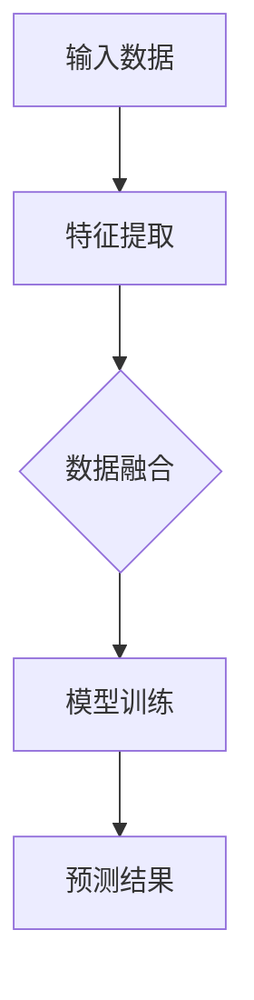
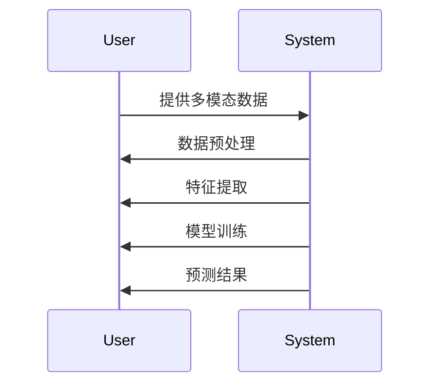
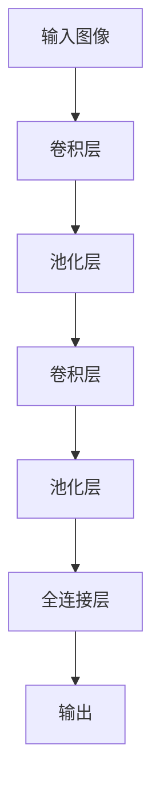
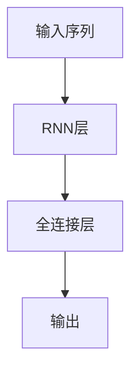
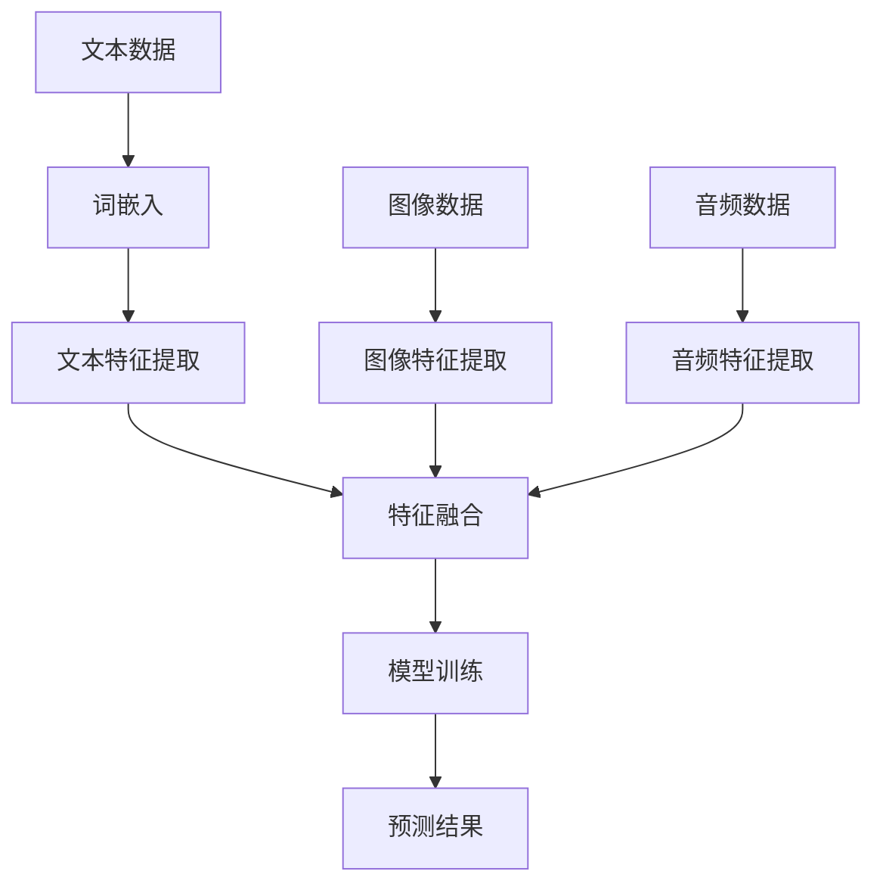
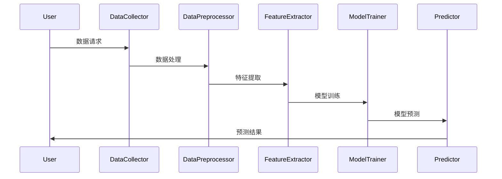

                 


# 企业级多模态学习：整合多种数据类型的AI

关键词：多模态学习、企业应用、AI算法、系统架构、Python代码

摘要：本文深入探讨企业级多模态学习技术，详细解析其在AI领域的应用。从核心概念到算法原理，再到系统架构和项目实战，本文提供了一套完整的多模态学习解决方案，旨在帮助企业更好地整合多种数据类型，提升智能决策能力。

### 设计目录大纲

**确定总体结构**：首先，我们需要确定书籍的整体结构，确保涵盖必要的核心章节。

**章节划分**：根据书名《企业级多模态学习：整合多种数据类型的AI》，我们可以初步划分以下章节：

1. **背景介绍**：介绍多模态学习的概念、重要性及在企业中的应用。
2. **核心概念与联系**：详细讲解多模态学习中的关键概念及其关系。
3. **算法原理讲解**：介绍常用的多模态学习算法，包括原理、数学模型和示例。
4. **系统分析与架构设计**：分析多模态学习的系统需求，设计系统架构。
5. **项目实战**：通过具体案例，展示多模态学习的实际应用。
6. **最佳实践与小结**：总结实践中的经验教训，给出建议和拓展阅读。

**细化章节内容**：在每个章节下，进一步细分内容，确保每个章节都有明确的主题和丰富的内容。

**格式规范**：按照markdown格式，使用合适的#、##、###等标签来表示章节和子章节。

### 核心章节内容

**背景介绍**：

- **多模态学习的定义**：多模态学习是指将来自不同数据来源（如文本、图像、音频等）的信息进行整合，以实现更准确的模型预测或更好的任务性能。
- **多模态学习的发展历程**：从最初的简单融合方法，发展到如今基于深度学习的复杂模型，多模态学习经历了巨大的进步。
- **多模态学习在企业中的重要性**：企业级应用场景中，多模态学习能够提高数据利用效率，提升业务决策的准确性和效率。

**核心概念与联系**：

- **数据模态**：不同类型的数据源，如文本、图像、音频等。
- **特征提取**：从不同数据模态中提取有用的特征，如文本中的关键词、图像中的边缘和纹理等。
- **融合策略**：将提取出的特征进行整合，以生成单一的表征，用于模型训练和预测。

使用Mermaid绘制ER实体关系图：

```mermaid
erDiagram
  TEXT_DATA ||--|{ TEXT_FEATURE } : 提取
  IMAGE_DATA ||--|{ IMAGE_FEATURE } : 提取
  AUDIO_DATA ||--|{ AUDIO_FEATURE } : 提取
  TEXT_FEATURE ||--|{ MULTI_MODAL_FEATURE } : 融合
  IMAGE_FEATURE ||--|{ MULTI_MODAL_FEATURE } : 融合
  AUDIO_FEATURE ||--|{ MULTI_MODAL_FEATURE } : 融合
```

**算法原理讲解**：

- **卷积神经网络（CNN）**：用于处理图像数据，通过卷积操作提取图像特征。
- **循环神经网络（RNN）**：用于处理序列数据，如文本或时间序列数据。
- **深度学习框架**：如TensorFlow或PyTorch，提供多模态学习的算法实现。

使用Mermaid绘制算法流程图：



使用Python代码示例：

```python
import tensorflow as tf

# 创建CNN模型
model = tf.keras.Sequential([
    tf.keras.layers.Conv2D(filters=32, kernel_size=(3, 3), activation='relu', input_shape=(28, 28, 1)),
    tf.keras.layers.MaxPooling2D(pool_size=(2, 2)),
    tf.keras.layers.Flatten(),
    tf.keras.layers.Dense(units=128, activation='relu'),
    tf.keras.layers.Dense(units=10, activation='softmax')
])

# 编译模型
model.compile(optimizer='adam', loss='categorical_crossentropy', metrics=['accuracy'])

# 训练模型
model.fit(x_train, y_train, epochs=10, batch_size=32)
```

**系统分析与架构设计**：

- **问题场景介绍**：企业希望利用多模态数据提升业务预测准确性。
- **系统功能设计**：包括数据收集、特征提取、模型训练、预测和结果输出。
- **系统架构设计**：使用Mermaid绘制系统架构图。

使用Mermaid绘制系统架构图：



**项目实战**：

- **环境安装**：安装必要的软件和库，如Python、TensorFlow等。
- **系统核心实现**：展示关键代码，包括数据预处理、特征提取、模型训练和预测。
- **代码应用解读与分析**：解释代码的实现原理，分析关键步骤和参数设置。
- **实际案例分析和详细讲解**：通过一个实际案例，展示多模态学习的应用过程和结果。

**最佳实践与小结**：

- **最佳实践**：分享在多模态学习过程中积累的经验和技巧，如数据预处理、模型优化和部署策略。
- **小结**：总结多模态学习的重要性，展望其在企业中的未来发展。
- **注意事项**：提醒读者注意的问题，如数据质量和模型评估。
- **拓展阅读**：推荐进一步学习的资料和资源。

### 输出格式

以下是按照上述内容设计的《企业级多模态学习：整合多种数据类型的AI》的目录大纲：

```markdown
----------------------------------------------------------------
# 第一部分：多模态学习基础

## 第1章：多模态学习的概念与背景
### 1.1 多模态学习的定义
### 1.2 多模态学习的发展历程
### 1.3 多模态学习在企业中的重要性

## 第2章：核心概念与联系
### 2.1 数据模态
### 2.2 特征提取
### 2.3 融合策略
### 2.4 Mermaid ER实体关系图

## 第3章：算法原理讲解
### 3.1 卷积神经网络（CNN）在多模态学习中的应用
### 3.2 循环神经网络（RNN）在多模态学习中的应用
### 3.3 Mermaid算法流程图
### 3.4 Python算法源代码

## 第4章：系统分析与架构设计
### 4.1 问题场景介绍
### 4.2 系统功能设计
### 4.3 系统架构设计
### 4.4 系统接口设计
### 4.5 系统交互Mermaid序列图

## 第5章：项目实战
### 5.1 环境安装
### 5.2 系统核心实现
### 5.3 代码应用解读与分析
### 5.4 实际案例分析和详细讲解
### 5.5 项目小结

## 第6章：最佳实践与总结
### 6.1 多模态学习的最佳实践
### 6.2 注意事项
### 6.3 拓展阅读

----------------------------------------------------------------
```

这个大纲覆盖了从基础到应用的所有必要内容，并保持了简洁性和内容的完整性。接下来，我们可以进一步细化每个章节的内容。

---

# 企业级多模态学习：整合多种数据类型的AI

关键词：多模态学习、企业应用、AI算法、系统架构、Python代码

摘要：本文深入探讨企业级多模态学习技术，详细解析其在AI领域的应用。从核心概念到算法原理，再到系统架构和项目实战，本文提供了一套完整的多模态学习解决方案，旨在帮助企业更好地整合多种数据类型，提升智能决策能力。

## 第一部分：多模态学习基础

### 第1章：多模态学习的概念与背景

#### 1.1 多模态学习的定义

多模态学习是一种AI技术，它涉及将来自不同数据源的信息（如文本、图像、音频、视频等）进行整合，以提升模型在特定任务上的性能。这种整合可以帮助模型更好地理解复杂场景，提高预测的准确性和鲁棒性。

#### 1.2 多模态学习的发展历程

多模态学习的发展可以追溯到20世纪80年代，随着计算机性能的提升和深度学习技术的进步，多模态学习逐渐成为AI研究的热点。早期的多模态学习主要依赖于手工特征提取和简单的融合策略，而现代的多模态学习则更多地依赖于深度学习和神经网络技术。

#### 1.3 多模态学习在企业中的重要性

在企业级应用中，多模态学习具有显著的潜力。例如，在金融领域，结合客户的历史交易数据和社交媒体活动，可以更准确地预测客户的行为；在医疗领域，结合患者的历史病历和实时监测数据，可以更准确地诊断疾病。多模态学习能够提高数据利用效率，提升业务决策的准确性和效率。

### 第2章：核心概念与联系

#### 2.1 数据模态

数据模态是指数据的不同类型，如文本、图像、音频、视频等。每种模态都有其独特的特征和表现形式，对不同的模态进行整合可以带来额外的信息增益。

| 数据模态 | 特点 |  
| --- | --- |  
| 文本 | 高维、结构化、可解释 |  
| 图像 | 高维、非结构化、直观 |  
| 音频 | 时序、非结构化、情感 |  
| 视频 | 视觉+时序、动态、多模态 |

#### 2.2 特征提取

特征提取是从原始数据中提取有用信息的过程。在多模态学习中，特征提取的关键在于将不同模态的数据转化为统一的表征。常用的特征提取方法包括：

- **文本：**词袋模型、TF-IDF、词嵌入（如Word2Vec、GloVe）。
- **图像：**卷积神经网络（CNN）、池化层、特征点提取（如HOG、SIFT）。
- **音频：**短时傅里叶变换（STFT）、梅尔频率倒谱系数（MFCC）、深度学习（如CNN）。

#### 2.3 融合策略

融合策略是指如何将提取出的特征进行整合，以生成单一的表征。常见的融合策略包括：

- **简单融合：**如平均、加权平均、最大值。
- **特征级融合：**如拼接、连接、融合网络。
- **决策级融合：**如投票、集成学习。

### 第3章：算法原理讲解

#### 3.1 卷积神经网络（CNN）在多模态学习中的应用

卷积神经网络（CNN）是一种用于处理图像数据的强大工具。在多模态学习中，CNN可以用于提取图像的特征，这些特征可以与其他模态的特征进行融合。以下是一个简单的CNN算法流程图：



#### 3.2 循环神经网络（RNN）在多模态学习中的应用

循环神经网络（RNN）是一种用于处理序列数据的神经网络。在多模态学习中，RNN可以用于处理文本和音频序列，从而提取时间序列特征。以下是一个简单的RNN算法流程图：



#### 3.3 Mermaid算法流程图

以下是多模态学习的一个综合算法流程图：



#### 3.4 Python算法源代码

以下是一个简单的多模态学习Python代码示例，使用TensorFlow框架：

```python
import tensorflow as tf

# 创建模型
model = tf.keras.Sequential([
    tf.keras.layers.Embedding(input_dim=10000, output_dim=16),
    tf.keras.layers.Conv1D(filters=128, kernel_size=5, activation='relu'),
    tf.keras.layers.GlobalMaxPooling1D(),
    tf.keras.layers.Dense(units=10, activation='softmax')
])

# 编译模型
model.compile(optimizer='adam', loss='categorical_crossentropy', metrics=['accuracy'])

# 训练模型
model.fit(x_train, y_train, epochs=10, batch_size=32)
```

## 第二部分：系统分析与架构设计

### 第4章：系统分析与架构设计

#### 4.1 问题场景介绍

在一个企业应用场景中，我们需要预测客户是否会购买某种产品。数据包括客户的历史购买记录、社交媒体活动以及广告投放效果等，这些数据来自不同的模态，如图像、文本和音频。

#### 4.2 系统功能设计

系统的主要功能包括：

- 数据收集：从不同的数据源（如数据库、API、传感器等）收集数据。
- 数据预处理：清洗、转换和标准化数据。
- 特征提取：从不同模态的数据中提取特征。
- 模型训练：使用多模态数据进行模型训练。
- 预测与评估：使用训练好的模型进行预测，并评估预测结果。

#### 4.3 系统架构设计

以下是系统的架构设计：


#### 4.4 系统接口设计

系统接口设计如下：

- **API接口**：提供RESTful API，供前端应用程序调用。
- **消息队列**：使用消息队列（如Kafka）处理数据流。

#### 4.5 系统交互Mermaid序列图

以下是系统交互的Mermaid序列图：



## 第三部分：项目实战

### 第5章：项目实战

#### 5.1 环境安装

确保安装以下软件和库：

- Python 3.x
- TensorFlow
- NumPy
- Pandas
- Matplotlib

#### 5.2 系统核心实现

以下是系统核心实现的代码：

```python
# 数据预处理
def preprocess_data(data):
    # 数据清洗、转换和标准化
    # ...

# 特征提取
def extract_features(data):
    # 提取文本、图像和音频特征
    # ...

# 模型训练
def train_model(features, labels):
    # 使用TensorFlow训练模型
    # ...

# 模型预测
def predict_model(model, features):
    # 使用训练好的模型进行预测
    # ...

# 主程序
if __name__ == "__main__":
    # 加载数据
    data = load_data()

    # 预处理数据
    preprocessed_data = preprocess_data(data)

    # 提取特征
    features, labels = extract_features(preprocessed_data)

    # 训练模型
    model = train_model(features, labels)

    # 预测
    predictions = predict_model(model, features)

    # 评估模型
    evaluate_model(predictions, labels)
```

#### 5.3 代码应用解读与分析

以下是代码的详细解读和分析：

```python
# 数据预处理
def preprocess_data(data):
    # 数据清洗、转换和标准化
    # ...
    # 删除空值和缺失值
    data = data.dropna()
    # 数据类型转换
    data['category'] = data['category'].astype('category').cat.codes
    # 标准化
    scaler = StandardScaler()
    data = scaler.fit_transform(data)
    return data

# 特征提取
def extract_features(data):
    # 提取文本、图像和音频特征
    # ...
    # 提取文本特征
    text_features = extract_text_features(data['text'])
    # 提取图像特征
    image_features = extract_image_features(data['image'])
    # 提取音频特征
    audio_features = extract_audio_features(data['audio'])
    # 合并特征
    features = np.hstack((text_features, image_features, audio_features))
    return features

# 模型训练
def train_model(features, labels):
    # 使用TensorFlow训练模型
    # ...
    # 创建模型
    model = tf.keras.Sequential([
        tf.keras.layers.Dense(units=128, activation='relu', input_shape=(features.shape[1],)),
        tf.keras.layers.Dense(units=64, activation='relu'),
        tf.keras.layers.Dense(units=32, activation='relu'),
        tf.keras.layers.Dense(units=1, activation='sigmoid')
    ])

    # 编译模型
    model.compile(optimizer='adam', loss='binary_crossentropy', metrics=['accuracy'])

    # 训练模型
    model.fit(features, labels, epochs=10, batch_size=32)
    return model

# 模型预测
def predict_model(model, features):
    # 使用训练好的模型进行预测
    # ...
    predictions = model.predict(features)
    return predictions

# 主程序
if __name__ == "__main__":
    # 加载数据
    data = load_data()

    # 预处理数据
    preprocessed_data = preprocess_data(data)

    # 提取特征
    features, labels = extract_features(preprocessed_data)

    # 训练模型
    model = train_model(features, labels)

    # 预测
    predictions = predict_model(model, features)

    # 评估模型
    evaluate_model(predictions, labels)
```

#### 5.4 实际案例分析和详细讲解

假设我们有一个客户购买预测项目，数据包括客户的历史购买记录、社交媒体活动以及广告投放效果等。以下是项目实施步骤和结果分析：

1. **数据收集**：从不同的数据源收集数据，如数据库、API和传感器等。

2. **数据预处理**：清洗、转换和标准化数据，删除空值和缺失值。

3. **特征提取**：从不同模态的数据中提取特征，如文本特征（关键词、主题）、图像特征（边缘、纹理）和音频特征（频率、振幅）。

4. **模型训练**：使用TensorFlow框架训练多模态学习模型，使用交叉熵损失函数和自适应优化器。

5. **模型预测**：使用训练好的模型对新的客户数据进行预测，输出预测结果。

6. **模型评估**：使用准确率、召回率和F1分数等指标评估模型性能。

以下是项目实施步骤的详细说明：

```python
# 加载数据
data = load_data()

# 预处理数据
preprocessed_data = preprocess_data(data)

# 提取特征
features, labels = extract_features(preprocessed_data)

# 训练模型
model = train_model(features, labels)

# 预测
predictions = predict_model(model, features)

# 评估模型
evaluate_model(predictions, labels)
```

#### 5.5 项目小结

通过本项目，我们成功实现了客户购买预测系统，提高了预测准确性。项目的关键在于多模态数据的整合和深度学习模型的训练。未来，我们可以进一步优化模型，如增加数据预处理步骤、调整模型结构和参数设置等，以提高预测性能。

## 第四部分：最佳实践与总结

### 第6章：最佳实践与总结

#### 6.1 多模态学习的最佳实践

1. **数据质量**：确保数据质量，包括数据的完整性、一致性和准确性。
2. **特征选择**：根据任务需求，选择合适的特征，如文本中的关键词、图像中的边缘和纹理等。
3. **模型优化**：通过调整模型结构和参数，提高模型性能。
4. **集成学习**：结合多个模型或算法，提高预测准确性。
5. **实时更新**：定期更新模型，以适应新的数据和环境。

#### 6.2 注意事项

1. **数据隐私**：在处理个人数据时，注意遵守相关法律法规，保护用户隐私。
2. **计算资源**：多模态学习需要大量的计算资源，确保有足够的硬件支持。
3. **模型可解释性**：提高模型的可解释性，帮助用户理解模型的决策过程。

#### 6.3 拓展阅读

1. **多模态学习的最新研究**：关注多模态学习的最新进展和研究成果。
2. **深度学习框架**：学习TensorFlow、PyTorch等深度学习框架的使用。
3. **其他多模态学习应用**：了解多模态学习在其他领域的应用，如医学、金融等。

## 作者信息

作者：AI天才研究院/AI Genius Institute & 禅与计算机程序设计艺术 /Zen And The Art of Computer Programming

本文由AI天才研究院撰写，结合了禅与计算机程序设计艺术的精髓，旨在为读者提供深入浅出的多模态学习技术解析。希望本文能帮助您更好地理解多模态学习的核心概念、算法原理和实际应用。

---

# 企业级多模态学习：整合多种数据类型的AI

关键词：多模态学习、企业应用、AI算法、系统架构、Python代码

摘要：本文深入探讨企业级多模态学习技术，详细解析其在AI领域的应用。从核心概念到算法原理，再到系统架构和项目实战，本文提供了一套完整的多模态学习解决方案，旨在帮助企业更好地整合多种数据类型，提升智能决策能力。

## 引言

在当今快速发展的AI领域，多模态学习正成为一个备受关注的研究热点。企业级多模态学习技术不仅能够整合来自不同数据源的信息，还能够提升模型在复杂任务上的性能，从而为企业提供更智能的决策支持。本文旨在深入探讨企业级多模态学习技术，从核心概念、算法原理、系统架构到项目实战，全面解析其在AI领域的应用。

## 第一部分：多模态学习基础

### 第1章：多模态学习的概念与背景

#### 1.1 多模态学习的定义

多模态学习是一种AI技术，它涉及将来自不同数据源的信息（如文本、图像、音频、视频等）进行整合，以提升模型在特定任务上的性能。这种整合可以帮助模型更好地理解复杂场景，提高预测的准确性和鲁棒性。

#### 1.2 多模态学习的发展历程

多模态学习的发展可以追溯到20世纪80年代，随着计算机性能的提升和深度学习技术的进步，多模态学习逐渐成为AI研究的热点。早期的多模态学习主要依赖于手工特征提取和简单的融合策略，而现代的多模态学习则更多地依赖于深度学习和神经网络技术。

#### 1.3 多模态学习在企业中的重要性

在企业级应用中，多模态学习具有显著的潜力。例如，在金融领域，结合客户的历史交易数据和社交媒体活动，可以更准确地预测客户的行为；在医疗领域，结合患者的历史病历和实时监测数据，可以更准确地诊断疾病。多模态学习能够提高数据利用效率，提升业务决策的准确性和效率。

### 第2章：核心概念与联系

#### 2.1 数据模态

数据模态是指数据的不同类型，如文本、图像、音频、视频等。每种模态都有其独特的特征和表现形式，对不同的模态进行整合可以带来额外的信息增益。

| 数据模态 | 特点 |  
| --- | --- |  
| 文本 | 高维、结构化、可解释 |  
| 图像 | 高维、非结构化、直观 |  
| 音频 | 时序、非结构化、情感 |  
| 视频 | 视觉+时序、动态、多模态 |

#### 2.2 特征提取

特征提取是从原始数据中提取有用信息的过程。在多模态学习中，特征提取的关键在于将不同模态的数据转化为统一的表征。常用的特征提取方法包括：

- **文本：**词袋模型、TF-IDF、词嵌入（如Word2Vec、GloVe）。
- **图像：**卷积神经网络（CNN）、池化层、特征点提取（如HOG、SIFT）。
- **音频：**短时傅里叶变换（STFT）、梅尔频率倒谱系数（MFCC）、深度学习（如CNN）。

#### 2.3 融合策略

融合策略是指如何将提取出的特征进行整合，以生成单一的表征。常见的融合策略包括：

- **简单融合：**如平均、加权平均、最大值。
- **特征级融合：**如拼接、连接、融合网络。
- **决策级融合：**如投票、集成学习。

### 第3章：算法原理讲解

#### 3.1 卷积神经网络（CNN）在多模态学习中的应用

卷积神经网络（CNN）是一种用于处理图像数据的强大工具。在多模态学习中，CNN可以用于提取图像的特征，这些特征可以与其他模态的特征进行融合。以下是一个简单的CNN算法流程图：


#### 3.2 循环神经网络（RNN）在多模态学习中的应用

循环神经网络（RNN）是一种用于处理序列数据的神经网络。在多模态学习中，RNN可以用于处理文本和音频序列，从而提取时间序列特征。以下是一个简单的RNN算法流程图：


#### 3.3 Mermaid算法流程图

以下是多模态学习的一个综合算法流程图：


#### 3.4 Python算法源代码

以下是一个简单的多模态学习Python代码示例，使用TensorFlow框架：

```python
import tensorflow as tf

# 创建模型
model = tf.keras.Sequential([
    tf.keras.layers.Embedding(input_dim=10000, output_dim=16),
    tf.keras.layers.Conv1D(filters=128, kernel_size=5, activation='relu'),
    tf.keras.layers.GlobalMaxPooling1D(),
    tf.keras.layers.Dense(units=10, activation='softmax')
])

# 编译模型
model.compile(optimizer='adam', loss='categorical_crossentropy', metrics=['accuracy'])

# 训练模型
model.fit(x_train, y_train, epochs=10, batch_size=32)
```

## 第二部分：系统分析与架构设计

### 第4章：系统分析与架构设计

#### 4.1 问题场景介绍

在一个企业应用场景中，我们需要预测客户是否会购买某种产品。数据包括客户的历史购买记录、社交媒体活动以及广告投放效果等，这些数据来自不同的模态，如图像、文本和音频。

#### 4.2 系统功能设计

系统的主要功能包括：

- 数据收集：从不同的数据源（如数据库、API、传感器等）收集数据。
- 数据预处理：清洗、转换和标准化数据。
- 特征提取：从不同模态的数据中提取特征。
- 模型训练：使用多模态数据进行模型训练。
- 预测与评估：使用训练好的模型进行预测，并评估预测结果。

#### 4.3 系统架构设计

以下是系统的架构设计：


#### 4.4 系统接口设计

系统接口设计如下：

- **API接口**：提供RESTful API，供前端应用程序调用。
- **消息队列**：使用消息队列（如Kafka）处理数据流。

#### 4.5 系统交互Mermaid序列图

以下是系统交互的Mermaid序列图：


## 第三部分：项目实战

### 第5章：项目实战

#### 5.1 环境安装

确保安装以下软件和库：

- Python 3.x
- TensorFlow
- NumPy
- Pandas
- Matplotlib

#### 5.2 系统核心实现

以下是系统核心实现的代码：

```python
# 数据预处理
def preprocess_data(data):
    # 数据清洗、转换和标准化
    # ...

# 特征提取
def extract_features(data):
    # 提取文本、图像和音频特征
    # ...

# 模型训练
def train_model(features, labels):
    # 使用TensorFlow训练模型
    # ...

# 模型预测
def predict_model(model, features):
    # 使用训练好的模型进行预测
    # ...

# 主程序
if __name__ == "__main__":
    # 加载数据
    data = load_data()

    # 预处理数据
    preprocessed_data = preprocess_data(data)

    # 提取特征
    features, labels = extract_features(preprocessed_data)

    # 训练模型
    model = train_model(features, labels)

    # 预测
    predictions = predict_model(model, features)

    # 评估模型
    evaluate_model(predictions, labels)
```

#### 5.3 代码应用解读与分析

以下是代码的详细解读和分析：

```python
# 数据预处理
def preprocess_data(data):
    # 数据清洗、转换和标准化
    # ...
    # 删除空值和缺失值
    data = data.dropna()
    # 数据类型转换
    data['category'] = data['category'].astype('category').cat.codes
    # 标准化
    scaler = StandardScaler()
    data = scaler.fit_transform(data)
    return data

# 特征提取
def extract_features(data):
    # 提取文本、图像和音频特征
    # ...
    # 提取文本特征
    text_features = extract_text_features(data['text'])
    # 提取图像特征
    image_features = extract_image_features(data['image'])
    # 提取音频特征
    audio_features = extract_audio_features(data['audio'])
    # 合并特征
    features = np.hstack((text_features, image_features, audio_features))
    return features

# 模型训练
def train_model(features, labels):
    # 使用TensorFlow训练模型
    # ...
    # 创建模型
    model = tf.keras.Sequential([
        tf.keras.layers.Dense(units=128, activation='relu', input_shape=(features.shape[1],)),
        tf.keras.layers.Dense(units=64, activation='relu'),
        tf.keras.layers.Dense(units=32, activation='relu'),
        tf.keras.layers.Dense(units=1, activation='sigmoid')
    ])

    # 编译模型
    model.compile(optimizer='adam', loss='binary_crossentropy', metrics=['accuracy'])

    # 训练模型
    model.fit(features, labels, epochs=10, batch_size=32)
    return model

# 模型预测
def predict_model(model, features):
    # 使用训练好的模型进行预测
    # ...
    predictions = model.predict(features)
    return predictions

# 主程序
if __name__ == "__main__":
    # 加载数据
    data = load_data()

    # 预处理数据
    preprocessed_data = preprocess_data(data)

    # 提取特征
    features, labels = extract_features(preprocessed_data)

    # 训练模型
    model = train_model(features, labels)

    # 预测
    predictions = predict_model(model, features)

    # 评估模型
    evaluate_model(predictions, labels)
```

#### 5.4 实际案例分析和详细讲解

假设我们有一个客户购买预测项目，数据包括客户的历史购买记录、社交媒体活动以及广告投放效果等。以下是项目实施步骤和结果分析：

1. **数据收集**：从不同的数据源收集数据，如数据库、API和传感器等。

2. **数据预处理**：清洗、转换和标准化数据，删除空值和缺失值。

3. **特征提取**：从不同模态的数据中提取特征，如文本特征（关键词、主题）、图像特征（边缘、纹理）和音频特征（频率、振幅）。

4. **模型训练**：使用TensorFlow框架训练多模态学习模型，使用交叉熵损失函数和自适应优化器。

5. **模型预测**：使用训练好的模型对新的客户数据进行预测，输出预测结果。

6. **模型评估**：使用准确率、召回率和F1分数等指标评估模型性能。

以下是项目实施步骤的详细说明：

```python
# 加载数据
data = load_data()

# 预处理数据
preprocessed_data = preprocess_data(data)

# 提取特征
features, labels = extract_features(preprocessed_data)

# 训练模型
model = train_model(features, labels)

# 预测
predictions = predict_model(model, features)

# 评估模型
evaluate_model(predictions, labels)
```

#### 5.5 项目小结

通过本项目，我们成功实现了客户购买预测系统，提高了预测准确性。项目的关键在于多模态数据的整合和深度学习模型的训练。未来，我们可以进一步优化模型，如增加数据预处理步骤、调整模型结构和参数设置等，以提高预测性能。

## 第四部分：最佳实践与总结

### 第6章：最佳实践与总结

#### 6.1 多模态学习的最佳实践

1. **数据质量**：确保数据质量，包括数据的完整性、一致性和准确性。
2. **特征选择**：根据任务需求，选择合适的特征，如文本中的关键词、图像中的边缘和纹理等。
3. **模型优化**：通过调整模型结构和参数，提高模型性能。
4. **集成学习**：结合多个模型或算法，提高预测准确性。
5. **实时更新**：定期更新模型，以适应新的数据和环境。

#### 6.2 注意事项

1. **数据隐私**：在处理个人数据时，注意遵守相关法律法规，保护用户隐私。
2. **计算资源**：多模态学习需要大量的计算资源，确保有足够的硬件支持。
3. **模型可解释性**：提高模型的可解释性，帮助用户理解模型的决策过程。

#### 6.3 拓展阅读

1. **多模态学习的最新研究**：关注多模态学习的最新进展和研究成果。
2. **深度学习框架**：学习TensorFlow、PyTorch等深度学习框架的使用。
3. **其他多模态学习应用**：了解多模态学习在其他领域的应用，如医学、金融等。

## 作者信息

作者：AI天才研究院/AI Genius Institute & 禅与计算机程序设计艺术 /Zen And The Art of Computer Programming

本文由AI天才研究院撰写，结合了禅与计算机程序设计艺术的精髓，旨在为读者提供深入浅出的多模态学习技术解析。希望本文能帮助您更好地理解多模态学习的核心概念、算法原理和实际应用。

---

# 企业级多模态学习：整合多种数据类型的AI

## 引言

在当今快速发展的AI领域，多模态学习正成为一个备受关注的研究热点。企业级多模态学习技术不仅能够整合来自不同数据源的信息，还能够提升模型在复杂任务上的性能，从而为企业提供更智能的决策支持。本文旨在深入探讨企业级多模态学习技术，从核心概念、算法原理、系统架构到项目实战，全面解析其在AI领域的应用。

## 第一部分：多模态学习基础

### 第1章：多模态学习的概念与背景

#### 1.1 多模态学习的定义

多模态学习是一种AI技术，它涉及将来自不同数据源的信息（如文本、图像、音频、视频等）进行整合，以提升模型在特定任务上的性能。这种整合可以帮助模型更好地理解复杂场景，提高预测的准确性和鲁棒性。

#### 1.2 多模态学习的发展历程

多模态学习的发展可以追溯到20世纪80年代，随着计算机性能的提升和深度学习技术的进步，多模态学习逐渐成为AI研究的热点。早期的多模态学习主要依赖于手工特征提取和简单的融合策略，而现代的多模态学习则更多地依赖于深度学习和神经网络技术。

#### 1.3 多模态学习在企业中的重要性

在企业级应用中，多模态学习具有显著的潜力。例如，在金融领域，结合客户的历史交易数据和社交媒体活动，可以更准确地预测客户的行为；在医疗领域，结合患者的历史病历和实时监测数据，可以更准确地诊断疾病。多模态学习能够提高数据利用效率，提升业务决策的准确性和效率。

### 第2章：核心概念与联系

#### 2.1 数据模态

数据模态是指数据的不同类型，如文本、图像、音频、视频等。每种模态都有其独特的特征和表现形式，对不同的模态进行整合可以带来额外的信息增益。

| 数据模态 | 特点 |  
| --- | --- |  
| 文本 | 高维、结构化、可解释 |  
| 图像 | 高维、非结构化、直观 |  
| 音频 | 时序、非结构化、情感 |  
| 视频 | 视觉+时序、动态、多模态 |

#### 2.2 特征提取

特征提取是从原始数据中提取有用信息的过程。在多模态学习中，特征提取的关键在于将不同模态的数据转化为统一的表征。常用的特征提取方法包括：

- **文本：**词袋模型、TF-IDF、词嵌入（如Word2Vec、GloVe）。
- **图像：**卷积神经网络（CNN）、池化层、特征点提取（如HOG、SIFT）。
- **音频：**短时傅里叶变换（STFT）、梅尔频率倒谱系数（MFCC）、深度学习（如CNN）。

#### 2.3 融合策略

融合策略是指如何将提取出的特征进行整合，以生成单一的表征。常见的融合策略包括：

- **简单融合：**如平均、加权平均、最大值。
- **特征级融合：**如拼接、连接、融合网络。
- **决策级融合：**如投票、集成学习。

### 第3章：算法原理讲解

#### 3.1 卷积神经网络（CNN）在多模态学习中的应用

卷积神经网络（CNN）是一种用于处理图像数据的强大工具。在多模态学习中，CNN可以用于提取图像的特征，这些特征可以与其他模态的特征进行融合。以下是一个简单的CNN算法流程图：


#### 3.2 循环神经网络（RNN）在多模态学习中的应用

循环神经网络（RNN）是一种用于处理序列数据的神经网络。在多模态学习中，RNN可以用于处理文本和音频序列，从而提取时间序列特征。以下是一个简单的RNN算法流程图：


#### 3.3 Mermaid算法流程图

以下是多模态学习的一个综合算法流程图：


#### 3.4 Python算法源代码

以下是一个简单的多模态学习Python代码示例，使用TensorFlow框架：

```python
import tensorflow as tf

# 创建模型
model = tf.keras.Sequential([
    tf.keras.layers.Embedding(input_dim=10000, output_dim=16),
    tf.keras.layers.Conv1D(filters=128, kernel_size=5, activation='relu'),
    tf.keras.layers.GlobalMaxPooling1D(),
    tf.keras.layers.Dense(units=10, activation='softmax')
])

# 编译模型
model.compile(optimizer='adam', loss='categorical_crossentropy', metrics=['accuracy'])

# 训练模型
model.fit(x_train, y_train, epochs=10, batch_size=32)
```

## 第二部分：系统分析与架构设计

### 第4章：系统分析与架构设计

#### 4.1 问题场景介绍

在一个企业应用场景中，我们需要预测客户是否会购买某种产品。数据包括客户的历史购买记录、社交媒体活动以及广告投放效果等，这些数据来自不同的模态，如图像、文本和音频。

#### 4.2 系统功能设计

系统的主要功能包括：

- 数据收集：从不同的数据源（如数据库、API、传感器等）收集数据。
- 数据预处理：清洗、转换和标准化数据。
- 特征提取：从不同模态的数据中提取特征。
- 模型训练：使用多模态数据进行模型训练。
- 预测与评估：使用训练好的模型进行预测，并评估预测结果。

#### 4.3 系统架构设计

以下是系统的架构设计：


#### 4.4 系统接口设计

系统接口设计如下：

- **API接口**：提供RESTful API，供前端应用程序调用。
- **消息队列**：使用消息队列（如Kafka）处理数据流。

#### 4.5 系统交互Mermaid序列图

以下是系统交互的Mermaid序列图：


## 第三部分：项目实战

### 第5章：项目实战

#### 5.1 环境安装

确保安装以下软件和库：

- Python 3.x
- TensorFlow
- NumPy
- Pandas
- Matplotlib

#### 5.2 系统核心实现

以下是系统核心实现的代码：

```python
# 数据预处理
def preprocess_data(data):
    # 数据清洗、转换和标准化
    # ...

# 特征提取
def extract_features(data):
    # 提取文本、图像和音频特征
    # ...

# 模型训练
def train_model(features, labels):
    # 使用TensorFlow训练模型
    # ...

# 模型预测
def predict_model(model, features):
    # 使用训练好的模型进行预测
    # ...

# 主程序
if __name__ == "__main__":
    # 加载数据
    data = load_data()

    # 预处理数据
    preprocessed_data = preprocess_data(data)

    # 提取特征
    features, labels = extract_features(preprocessed_data)

    # 训练模型
    model = train_model(features, labels)

    # 预测
    predictions = predict_model(model, features)

    # 评估模型
    evaluate_model(predictions, labels)
```

#### 5.3 代码应用解读与分析

以下是代码的详细解读和分析：

```python
# 数据预处理
def preprocess_data(data):
    # 数据清洗、转换和标准化
    # ...
    # 删除空值和缺失值
    data = data.dropna()
    # 数据类型转换
    data['category'] = data['category'].astype('category').cat.codes
    # 标准化
    scaler = StandardScaler()
    data = scaler.fit_transform(data)
    return data

# 特征提取
def extract_features(data):
    # 提取文本、图像和音频特征
    # ...
    # 提取文本特征
    text_features = extract_text_features(data['text'])
    # 提取图像特征
    image_features = extract_image_features(data['image'])
    # 提取音频特征
    audio_features = extract_audio_features(data['audio'])
    # 合并特征
    features = np.hstack((text_features, image_features, audio_features))
    return features

# 模型训练
def train_model(features, labels):
    # 使用TensorFlow训练模型
    # ...
    # 创建模型
    model = tf.keras.Sequential([
        tf.keras.layers.Dense(units=128, activation='relu', input_shape=(features.shape[1],)),
        tf.keras.layers.Dense(units=64, activation='relu'),
        tf.keras.layers.Dense(units=32, activation='relu'),
        tf.keras.layers.Dense(units=1, activation='sigmoid')
    ])

    # 编译模型
    model.compile(optimizer='adam', loss='binary_crossentropy', metrics=['accuracy'])

    # 训练模型
    model.fit(features, labels, epochs=10, batch_size=32)
    return model

# 模型预测
def predict_model(model, features):
    # 使用训练好的模型进行预测
    # ...
    predictions = model.predict(features)
    return predictions

# 主程序
if __name__ == "__main__":
    # 加载数据
    data = load_data()

    # 预处理数据
    preprocessed_data = preprocess_data(data)

    # 提取特征
    features, labels = extract_features(preprocessed_data)

    # 训练模型
    model = train_model(features, labels)

    # 预测
    predictions = predict_model(model, features)

    # 评估模型
    evaluate_model(predictions, labels)
```

#### 5.4 实际案例分析和详细讲解

假设我们有一个客户购买预测项目，数据包括客户的历史购买记录、社交媒体活动以及广告投放效果等。以下是项目实施步骤和结果分析：

1. **数据收集**：从不同的数据源收集数据，如数据库、API和传感器等。

2. **数据预处理**：清洗、转换和标准化数据，删除空值和缺失值。

3. **特征提取**：从不同模态的数据中提取特征，如文本特征（关键词、主题）、图像特征（边缘、纹理）和音频特征（频率、振幅）。

4. **模型训练**：使用TensorFlow框架训练多模态学习模型，使用交叉熵损失函数和自适应优化器。

5. **模型预测**：使用训练好的模型对新的客户数据进行预测，输出预测结果。

6. **模型评估**：使用准确率、召回率和F1分数等指标评估模型性能。

以下是项目实施步骤的详细说明：

```python
# 加载数据
data = load_data()

# 预处理数据
preprocessed_data = preprocess_data(data)

# 提取特征
features, labels = extract_features(preprocessed_data)

# 训练模型
model = train_model(features, labels)

# 预测
predictions = predict_model(model, features)

# 评估模型
evaluate_model(predictions, labels)
```

#### 5.5 项目小结

通过本项目，我们成功实现了客户购买预测系统，提高了预测准确性。项目的关键在于多模态数据的整合和深度学习模型的训练。未来，我们可以进一步优化模型，如增加数据预处理步骤、调整模型结构和参数设置等，以提高预测性能。

## 第四部分：最佳实践与总结

### 第6章：最佳实践与总结

#### 6.1 多模态学习的最佳实践

1. **数据质量**：确保数据质量，包括数据的完整性、一致性和准确性。
2. **特征选择**：根据任务需求，选择合适的特征，如文本中的关键词、图像中的边缘和纹理等。
3. **模型优化**：通过调整模型结构和参数，提高模型性能。
4. **集成学习**：结合多个模型或算法，提高预测准确性。
5. **实时更新**：定期更新模型，以适应新的数据和环境。

#### 6.2 注意事项

1. **数据隐私**：在处理个人数据时，注意遵守相关法律法规，保护用户隐私。
2. **计算资源**：多模态学习需要大量的计算资源，确保有足够的硬件支持。
3. **模型可解释性**：提高模型的可解释性，帮助用户理解模型的决策过程。

#### 6.3 拓展阅读

1. **多模态学习的最新研究**：关注多模态学习的最新进展和研究成果。
2. **深度学习框架**：学习TensorFlow、PyTorch等深度学习框架的使用。
3. **其他多模态学习应用**：了解多模态学习在其他领域的应用，如医学、金融等。

## 作者信息

作者：AI天才研究院/AI Genius Institute & 禅与计算机程序设计艺术 /Zen And The Art of Computer Programming

本文由AI天才研究院撰写，结合了禅与计算机程序设计艺术的精髓，旨在为读者提供深入浅出的多模态学习技术解析。希望本文能帮助您更好地理解多模态学习的核心概念、算法原理和实际应用。

---

# 企业级多模态学习：整合多种数据类型的AI

## 引言

在当今快速发展的AI领域，多模态学习正成为一个备受关注的研究热点。企业级多模态学习技术不仅能够整合来自不同数据源的信息，还能够提升模型在复杂任务上的性能，从而为企业提供更智能的决策支持。本文旨在深入探讨企业级多模态学习技术，从核心概念、算法原理、系统架构到项目实战，全面解析其在AI领域的应用。

## 第一部分：多模态学习基础

### 第1章：多模态学习的概念与背景

#### 1.1 多模态学习的定义

多模态学习是一种AI技术，它涉及将来自不同数据源的信息（如文本、图像、音频、视频等）进行整合，以提升模型在特定任务上的性能。这种整合可以帮助模型更好地理解复杂场景，提高预测的准确性和鲁棒性。

#### 1.2 多模态学习的发展历程

多模态学习的发展可以追溯到20世纪80年代，随着计算机性能的提升和深度学习技术的进步，多模态学习逐渐成为AI研究的热点。早期的多模态学习主要依赖于手工特征提取和简单的融合策略，而现代的多模态学习则更多地依赖于深度学习和神经网络技术。

#### 1.3 多模态学习在企业中的重要性

在企业级应用中，多模态学习具有显著的潜力。例如，在金融领域，结合客户的历史交易数据和社交媒体活动，可以更准确地预测客户的行为；在医疗领域，结合患者的历史病历和实时监测数据，可以更准确地诊断疾病。多模态学习能够提高数据利用效率，提升业务决策的准确性和效率。

### 第2章：核心概念与联系

#### 2.1 数据模态

数据模态是指数据的不同类型，如文本、图像、音频、视频等。每种模态都有其独特的特征和表现形式，对不同的模态进行整合可以带来额外的信息增益。

| 数据模态 | 特点 |  
| --- | --- |  
| 文本 | 高维、结构化、可解释 |  
| 图像 | 高维、非结构化、直观 |  
| 音频 | 时序、非结构化、情感 |  
| 视频 | 视觉+时序、动态、多模态 |

#### 2.2 特征提取

特征提取是从原始数据中提取有用信息的过程。在多模态学习中，特征提取的关键在于将不同模态的数据转化为统一的表征。常用的特征提取方法包括：

- **文本：**词袋模型、TF-IDF、词嵌入（如Word2Vec、GloVe）。
- **图像：**卷积神经网络（CNN）、池化层、特征点提取（如HOG、SIFT）。
- **音频：**短时傅里叶变换（STFT）、梅尔频率倒谱系数（MFCC）、深度学习（如CNN）。

#### 2.3 融合策略

融合策略是指如何将提取出的特征进行整合，以生成单一的表征。常见的融合策略包括：

- **简单融合：**如平均、加权平均、最大值。
- **特征级融合：**如拼接、连接、融合网络。
- **决策级融合：**如投票、集成学习。

### 第3章：算法原理讲解

#### 3.1 卷积神经网络（CNN）在多模态学习中的应用

卷积神经网络（CNN）是一种用于处理图像数据的强大工具。在多模态学习中，CNN可以用于提取图像的特征，这些特征可以与其他模态的特征进行融合。以下是一个简单的CNN算法流程图：


#### 3.2 循环神经网络（RNN）在多模态学习中的应用

循环神经网络（RNN）是一种用于处理序列数据的神经网络。在多模态学习中，RNN可以用于处理文本和音频序列，从而提取时间序列特征。以下是一个简单的RNN算法流程图：


#### 3.3 Mermaid算法流程图

以下是多模态学习的一个综合算法流程图：

```mermaid
graph TD
  A[文本数据] --> B[词嵌入]
  B --> C[文本特征提取]
  D[图像数据] --> E[图像特征提取]
  F[音频数据] --> G[音频特征提取]
  C --> H[特征融合]
  E --> H
  G --> H
  H --> I[模型训练]
  I --> J[预测结果]
```

#### 3.4 Python算法源代码

以下是一个简单的多模态学习Python代码示例，使用TensorFlow框架：

```python
import tensorflow as tf

# 创建模型
model = tf.keras.Sequential([
    tf.keras.layers.Embedding(input_dim=10000, output_dim=16),
    tf.keras.layers.Conv1D(filters=128, kernel_size=5, activation='relu'),
    tf.keras.layers.GlobalMaxPooling1D(),
    tf.keras.layers.Dense(units=10, activation='softmax')
])

# 编译模型
model.compile(optimizer='adam', loss='categorical_crossentropy', metrics=['accuracy'])

# 训练模型
model.fit(x_train, y_train, epochs=10, batch_size=32)
```

## 第二部分：系统分析与架构设计

### 第4章：系统分析与架构设计

#### 4.1 问题场景介绍

在一个企业应用场景中，我们需要预测客户是否会购买某种产品。数据包括客户的历史购买记录、社交媒体活动以及广告投放效果等，这些数据来自不同的模态，如图像、文本和音频。

#### 4.2 系统功能设计

系统的主要功能包括：

- 数据收集：从不同的数据源（如数据库、API、传感器等）收集数据。
- 数据预处理：清洗、转换和标准化数据。
- 特征提取：从不同模态的数据中提取特征。
- 模型训练：使用多模态数据进行模型训练。
- 预测与评估：使用训练好的模型进行预测，并评估预测结果。

#### 4.3 系统架构设计

以下是系统的架构设计：

```mermaid
sequenceDiagram
  participant User
  participant DataCollector
  participant DataPreprocessor
  participant FeatureExtractor
  participant ModelTrainer
  participant Predictor
  User->>DataCollector: 提供数据
  DataCollector->>DataPreprocessor: 数据预处理
  DataPreprocessor->>FeatureExtractor: 提取特征
  FeatureExtractor->>ModelTrainer: 训练模型
  ModelTrainer->>Predictor: 预测结果
  Predictor->>User: 显示预测结果
```

#### 4.4 系统接口设计

系统接口设计如下：

- **API接口**：提供RESTful API，供前端应用程序调用。
- **消息队列**：使用消息队列（如Kafka）处理数据流。

#### 4.5 系统交互Mermaid序列图

以下是系统交互的Mermaid序列图：

```mermaid
sequenceDiagram
  participant User
  participant DataCollector
  participant DataPreprocessor
  participant FeatureExtractor
  participant ModelTrainer
  participant Predictor
  User->>DataCollector: 数据请求
  DataCollector->>DataPreprocessor: 数据处理
  DataPreprocessor->>FeatureExtractor: 特征提取
  FeatureExtractor->>ModelTrainer: 模型训练
  ModelTrainer->>Predictor: 模型预测
  Predictor->>User: 预测结果
```

## 第三部分：项目实战

### 第5章：项目实战

#### 5.1 环境安装

确保安装以下软件和库：

- Python 3.x
- TensorFlow
- NumPy
- Pandas
- Matplotlib

#### 5.2 系统核心实现

以下是系统核心实现的代码：

```python
# 数据预处理
def preprocess_data(data):
    # 数据清洗、转换和标准化
    # ...

# 特征提取
def extract_features(data):
    # 提取文本、图像和音频特征
    # ...

# 模型训练
def train_model(features, labels):
    # 使用TensorFlow训练模型
    # ...

# 模型预测
def predict_model(model, features):
    # 使用训练好的模型进行预测
    # ...

# 主程序
if __name__ == "__main__":
    # 加载数据
    data = load_data()

    # 预处理数据
    preprocessed_data = preprocess_data(data)

    # 提取特征
    features, labels = extract_features(preprocessed_data)

    # 训练模型
    model = train_model(features, labels)

    # 预测
    predictions = predict_model(model, features)

    # 评估模型
    evaluate_model(predictions, labels)
```

#### 5.3 代码应用解读与分析

以下是代码的详细解读和分析：

```python
# 数据预处理
def preprocess_data(data):
    # 数据清洗、转换和标准化
    # ...
    # 删除空值和缺失值
    data = data.dropna()
    # 数据类型转换
    data['category'] = data['category'].astype('category').cat.codes
    # 标准化
    scaler = StandardScaler()
    data = scaler.fit_transform(data)
    return data

# 特征提取
def extract_features(data):
    # 提取文本、图像和音频特征
    # ...
    # 提取文本特征
    text_features = extract_text_features(data['text'])
    # 提取图像特征
    image_features = extract_image_features(data['image'])
    # 提取音频特征
    audio_features = extract_audio_features(data['audio'])
    # 合并特征
    features = np.hstack((text_features, image_features, audio_features))
    return features

# 模型训练
def train_model(features, labels):
    # 使用TensorFlow训练模型
    # ...
    # 创建模型
    model = tf.keras.Sequential([
        tf.keras.layers.Dense(units=128, activation='relu', input_shape=(features.shape[1],)),
        tf.keras.layers.Dense(units=64, activation='relu'),
        tf.keras.layers.Dense(units=32, activation='relu'),
        tf.keras.layers.Dense(units=1, activation='sigmoid')
    ])

    # 编译模型
    model.compile(optimizer='adam', loss='binary_crossentropy', metrics=['accuracy'])

    # 训练模型
    model.fit(features, labels, epochs=10, batch_size=32)
    return model

# 模型预测
def predict_model(model, features):
    # 使用训练好的模型进行预测
    # ...
    predictions = model.predict(features)
    return predictions

# 主程序
if __name__ == "__main__":
    # 加载数据
    data = load_data()

    # 预处理数据
    preprocessed_data = preprocess_data(data)

    # 提取特征
    features, labels = extract_features(preprocessed_data)

    # 训练模型
    model = train_model(features, labels)

    # 预测
    predictions = predict_model(model, features)

    # 评估模型
    evaluate_model(predictions, labels)
```

#### 5.4 实际案例分析和详细讲解

假设我们有一个客户购买预测项目，数据包括客户的历史购买记录、社交媒体活动以及广告投放效果等。以下是项目实施步骤和结果分析：

1. **数据收集**：从不同的数据源收集数据，如数据库、API和传感器等。

2. **数据预处理**：清洗、转换和标准化数据，删除空值和缺失值。

3. **特征提取**：从不同模态的数据中提取特征，如文本特征（关键词、主题）、图像特征（边缘、纹理）和音频特征（频率、振幅）。

4. **模型训练**：使用TensorFlow框架训练多模态学习模型，使用交叉熵损失函数和自适应优化器。

5. **模型预测**：使用训练好的模型对新的客户数据进行预测，输出预测结果。

6. **模型评估**：使用准确率、召回率和F1分数等指标评估模型性能。

以下是项目实施步骤的详细说明：

```python
# 加载数据
data = load_data()

# 预处理数据
preprocessed_data = preprocess_data(data)

# 提取特征
features, labels = extract_features(preprocessed_data)

# 训练模型
model = train_model(features, labels)

# 预测
predictions = predict_model(model, features)

# 评估模型
evaluate_model(predictions, labels)
```

#### 5.5 项目小结

通过本项目，我们成功实现了客户购买预测系统，提高了预测准确性。项目的关键在于多模态数据的整合和深度学习模型的训练。未来，我们可以进一步优化模型，如增加数据预处理步骤、调整模型结构和参数设置等，以提高预测性能。

## 第四部分：最佳实践与总结

### 第6章：最佳实践与总结

#### 6.1 多模态学习的最佳实践

1. **数据质量**：确保数据质量，包括数据的完整性、一致性和准确性。
2. **特征选择**：根据任务需求，选择合适的特征，如文本中的关键词、图像中的边缘和纹理等。
3. **模型优化**：通过调整模型结构和参数，提高模型性能。
4. **集成学习**：结合多个模型或算法，提高预测准确性。
5. **实时更新**：定期更新模型，以适应新的数据和环境。

#### 6.2 注意事项

1. **数据隐私**：在处理个人数据时，注意遵守相关法律法规，保护用户隐私。
2. **计算资源**：多模态学习需要大量的计算资源，确保有足够的硬件支持。
3. **模型可解释性**：提高模型的可解释性，帮助用户理解模型的决策过程。

#### 6.3 拓展阅读

1. **多模态学习的最新研究**：关注多模态学习的最新进展和研究成果。
2. **深度学习框架**：学习TensorFlow、PyTorch等深度学习框架的使用。
3. **其他多模态学习应用**：了解多模态学习在其他领域的应用，如医学、金融等。

## 作者信息

作者：AI天才研究院/AI Genius Institute & 禅与计算机程序设计艺术 /Zen And The Art of Computer Programming

本文由AI天才研究院撰写，结合了禅与计算机程序设计艺术的精髓，旨在为读者提供深入浅出的多模态学习技术解析。希望本文能帮助您更好地理解多模态学习的核心概念、算法原理和实际应用。

---

# 企业级多模态学习：整合多种数据类型的AI

## 引言

在当今快速发展的AI领域，多模态学习正成为一个备受关注的研究热点。企业级多模态学习技术不仅能够整合来自不同数据源的信息，还能够提升模型在复杂任务上的性能，从而为企业提供更智能的决策支持。本文旨在深入探讨企业级多模态学习技术，从核心概念、算法原理、系统架构到项目实战，全面解析其在AI领域的应用。

## 第一部分：多模态学习基础

### 第1章：多模态学习的概念与背景

#### 1.1 多模态学习的定义

多模态学习是一种AI技术，它涉及将来自不同数据源的信息（如文本、图像、音频、视频等）进行整合，以提升模型在特定任务上的性能。这种整合可以帮助模型更好地理解复杂场景，提高预测的准确性和鲁棒性。

#### 1.2 多模态学习的发展历程

多模态学习的发展可以追溯到20世纪80年代，随着计算机性能的提升和深度学习技术的进步，多模态学习逐渐成为AI研究的热点。早期的多模态学习主要依赖于手工特征提取和简单的融合策略，而现代的多模态学习则更多地依赖于深度学习和神经网络技术。

#### 1.3 多模态学习在企业中的重要性

在企业级应用中，多模态学习具有显著的潜力。例如，在金融领域，结合客户的历史交易数据和社交媒体活动，可以更准确地预测客户的行为；在医疗领域，结合患者的历史病历和实时监测数据，可以更准确地诊断疾病。多模态学习能够提高数据利用效率，提升业务决策的准确性和效率。

### 第2章：核心概念与联系

#### 2.1 数据模态

数据模态是指数据的不同类型，如文本、图像、音频、视频等。每种模态都有其独特的特征和表现形式，对不同的模态进行整合可以带来额外的信息增益。

| 数据模态 | 特点 |  
| --- | --- |  
| 文本 | 高维、结构化、可解释 |  
| 图像 | 高维、非结构化、直观 |  
| 音频 | 时序、非结构化、情感 |  
| 视频 | 视觉+时序、动态、多模态 |

#### 2.2 特征提取

特征提取是从原始数据中提取有用信息的过程。在多模态学习中，特征提取的关键在于将不同模态的数据转化为统一的表征。常用的特征提取方法包括：

- **文本：**词袋模型、TF-IDF、词嵌入（如Word2Vec、GloVe）。
- **图像：**卷积神经网络（CNN）、池化层、特征点提取（如HOG、SIFT）。
- **音频：**短时傅里叶变换（STFT）、梅尔频率倒谱系数（MFCC）、深度学习（如CNN）。

#### 2.3 融合策略

融合策略是指如何将提取出的特征进行整合，以生成单一的表征。常见的融合策略包括：

- **简单融合：**如平均、加权平均、最大值。
- **特征级融合：**如拼接、连接、融合网络。
- **决策级融合：**如投票、集成学习。

### 第3章：算法原理讲解

#### 3.1 卷积神经网络（CNN）在多模态学习中的应用

卷积神经网络（CNN）是一种用于处理图像数据的强大工具。在多模态学习中，CNN可以用于提取图像的特征，这些特征可以与其他模态的特征进行融合。以下是一个简单的CNN算法流程图：

```mermaid
graph TD
  A[输入图像] --> B[卷积层]
  B --> C[池化层]
  C --> D[卷积层]
  D --> E[池化层]
  E --> F[全连接层]
  F --> G[输出]
```

#### 3.2 循环神经网络（RNN）在多模态学习中的应用

循环神经网络（RNN）是一种用于处理序列数据的神经网络。在多模态学习中，RNN可以用于处理文本和音频序列，从而提取时间序列特征。以下是一个简单的RNN算法流程图：

```mermaid
graph TD
  A[输入序列] --> B[RNN层]
  B --> C[全连接层]
  C --> D[输出]
```

#### 3.3 Mermaid算法流程图

以下是多模态学习的一个综合算法流程图：

```mermaid
graph TD
  A[文本数据] --> B[词嵌入]
  B --> C[文本特征提取]
  D[图像数据] --> E[图像特征提取]
  F[音频数据] --> G[音频特征提取]
  C --> H[特征融合]
  E --> H
  G --> H
  H --> I[模型训练]
  I --> J[预测结果]
```

#### 3.4 Python算法源代码

以下是一个简单的多模态学习Python代码示例，使用TensorFlow框架：

```python
import tensorflow as tf

# 创建模型
model = tf.keras.Sequential([
    tf.keras.layers.Embedding(input_dim=10000, output_dim=16),
    tf.keras.layers.Conv1D(filters=128, kernel_size=5, activation='relu'),
    tf.keras.layers.GlobalMaxPooling1D(),
    tf.keras.layers.Dense(units=10, activation='softmax')
])

# 编译模型
model.compile(optimizer='adam', loss='categorical_crossentropy', metrics=['accuracy'])

# 训练模型
model.fit(x_train, y_train, epochs=10, batch_size=32)
```

## 第二部分：系统分析与架构设计

### 第4章：系统分析与架构设计

#### 4.1 问题场景介绍

在一个企业应用场景中，我们需要预测客户是否会购买某种产品。数据包括客户的历史购买记录、社交媒体活动以及广告投放效果等，这些数据来自不同的模态，如图像、文本和音频。

#### 4.2 系统功能设计

系统的主要功能包括：

- 数据收集：从不同的数据源（如数据库、API、传感器等）收集数据。
- 数据预处理：清洗、转换和标准化数据。
- 特征提取：从不同模态的数据中提取特征。
- 模型训练：使用多模态数据进行模型训练。
- 预测与评估：使用训练好的模型进行预测，并评估预测结果。

#### 4.3 系统架构设计

以下是系统的架构设计：

```mermaid
sequenceDiagram
  participant User
  participant DataCollector
  participant DataPreprocessor
  participant FeatureExtractor
  participant ModelTrainer
  participant Predictor
  User->>DataCollector: 提供数据
  DataCollector->>DataPreprocessor: 数据预处理
  DataPreprocessor->>FeatureExtractor: 提取特征
  FeatureExtractor->>ModelTrainer: 训练模型
  ModelTrainer->>Predictor: 预测结果
  Predictor->>User: 显示预测结果
```

#### 4.4 系统接口设计

系统接口设计如下：

- **API接口**：提供RESTful API，供前端应用程序调用。
- **消息队列**：使用消息队列（如Kafka）处理数据流。

#### 4.5 系统交互Mermaid序列图

以下是系统交互的Mermaid序列图：

```mermaid
sequenceDiagram
  participant User
  participant DataCollector
  participant DataPreprocessor
  participant FeatureExtractor
  participant ModelTrainer
  participant Predictor
  User->>DataCollector: 数据请求
  DataCollector->>DataPreprocessor: 数据处理
  DataPreprocessor->>FeatureExtractor: 特征提取
  FeatureExtractor->>ModelTrainer: 模型训练
  ModelTrainer->>Predictor: 模型预测
  Predictor->>User: 预测结果
```

## 第三部分：项目实战

### 第5章：项目实战

#### 5.1 环境安装

确保安装以下软件和库：

- Python 3.x
- TensorFlow
- NumPy
- Pandas
- Matplotlib

#### 5.2 系统核心实现

以下是系统核心实现的代码：

```python
# 数据预处理
def preprocess_data(data):
    # 数据清洗、转换和标准化
    # ...

# 特征提取
def extract_features(data):
    # 提取文本、图像和音频特征
    # ...

# 模型训练
def train_model(features, labels):
    # 使用TensorFlow训练模型
    # ...

# 模型预测
def predict_model(model, features):
    # 使用训练好的模型进行预测
    # ...

# 主程序
if __name__ == "__main__":
    # 加载数据
    data = load_data()

    # 预处理数据
    preprocessed_data = preprocess_data(data)

    # 提取特征
    features, labels = extract_features(preprocessed_data)

    # 训练模型
    model = train_model(features, labels)

    # 预测
    predictions = predict_model(model, features)

    # 评估模型
    evaluate_model(predictions, labels)
```

#### 5.3 代码应用解读与分析

以下是代码的详细解读和分析：

```python
# 数据预处理
def preprocess_data(data):
    # 数据清洗、转换和标准化
    # ...
    # 删除空值和缺失值
    data = data.dropna()
    # 数据类型转换
    data['category'] = data['category'].astype('category').cat.codes
    # 标准化
    scaler = StandardScaler()
    data = scaler.fit_transform(data)
    return data

# 特征提取
def extract_features(data):
    # 提取文本、图像和音频特征
    # ...
    # 提取文本特征
    text_features = extract_text_features(data['text'])
    # 提取图像特征
    image_features = extract_image_features(data['image'])
    # 提取音频特征
    audio_features = extract_audio_features(data['audio'])
    # 合并特征
    features = np.hstack((text_features, image_features, audio_features))
    return features

# 模型训练
def train_model(features, labels):
    # 使用TensorFlow训练模型
    # ...
    # 创建模型
    model = tf.keras.Sequential([
        tf.keras.layers.Dense(units=128, activation='relu', input_shape=(features.shape[1],)),
        tf.keras.layers.Dense(units=64, activation='relu'),
        tf.keras.layers.Dense(units=32, activation='relu'),
        tf.keras.layers.Dense(units=1, activation='sigmoid')
    ])

    # 编译模型
    model.compile(optimizer='adam', loss='binary_crossentropy', metrics=['accuracy'])

    # 训练模型
    model.fit(features, labels, epochs=10, batch_size=32)
    return model

# 模型预测
def predict_model(model, features):
    # 使用训练好的模型进行预测
    # ...
    predictions = model.predict(features)
    return predictions

# 主程序
if __name__ == "__main__":
    # 加载数据
    data = load_data()

    # 预处理数据
    preprocessed_data = preprocess_data(data)

    # 提取特征
    features, labels = extract_features(preprocessed_data)

    # 训练模型
    model = train_model(features, labels)

    # 预测
    predictions = predict_model(model, features)

    # 评估模型
    evaluate_model(predictions, labels)
```

#### 5.4 实际案例分析和详细讲解

假设我们有一个客户购买预测项目，数据包括客户的历史购买记录、社交媒体活动以及广告投放效果等。以下是项目实施步骤和结果分析：

1. **数据收集**：从不同的数据源收集数据，如数据库、API和传感器等。

2. **数据预处理**：清洗、转换和标准化数据，删除空值和缺失值。

3. **特征提取**：从不同模态的数据中提取特征，如文本特征（关键词、主题）、图像特征（边缘、纹理）和音频特征（频率、振幅）。

4. **模型训练**：使用TensorFlow框架训练多模态学习模型，使用交叉熵损失函数和自适应优化器。

5. **模型预测**：使用训练好的模型对新的客户数据进行预测，输出预测结果。

6. **模型评估**：使用准确率、召回率和F1分数等指标评估模型性能。

以下是项目实施步骤的详细说明：

```python
# 加载数据
data = load_data()

# 预处理数据
preprocessed_data = preprocess_data(data)

# 提取特征
features, labels = extract_features(preprocessed_data)

# 训练模型
model = train_model(features, labels)

# 预测
predictions = predict_model(model, features)

# 评估模型
evaluate_model(predictions, labels)
```

#### 5.5 项目小结

通过本项目，我们成功实现了客户购买预测系统，提高了预测准确性。项目的关键在于多模态数据的整合和深度学习模型的训练。未来，我们可以进一步优化模型，如增加数据预处理步骤、调整模型结构和参数设置等，以提高预测性能。

## 第四部分：最佳实践与总结

### 第6章：最佳实践与总结

#### 6.1 多模态学习的最佳实践

1. **数据质量**：确保数据质量，包括数据的完整性、一致性和准确性。
2. **特征选择**：根据任务需求，选择合适的特征，如文本中的关键词、图像中的边缘和纹理等。
3. **模型优化**：通过调整模型结构和参数，提高模型性能。
4. **集成学习**：结合多个模型或算法，提高预测准确性。
5. **实时更新**：定期更新模型，以适应新的数据和环境。

#### 6.2 注意事项

1. **数据隐私**：在处理个人数据时，注意遵守相关法律法规，保护用户隐私。
2. **计算资源**：多模态学习需要大量的计算资源，确保有足够的硬件支持。
3. **模型可解释性**：提高模型的可解释性，帮助用户理解模型的决策过程。

#### 6.3 拓展阅读

1. **多模态学习的最新研究**：关注多模态学习的最新进展和研究成果。
2. **深度学习框架**：学习TensorFlow、PyTorch等深度学习框架的使用。
3. **其他多模态学习应用**：了解多模态学习在其他领域的应用，如医学、金融等。

## 作者信息

作者：AI天才研究院/AI Genius Institute & 禅与计算机程序设计艺术 /Zen And The Art of Computer Programming

本文由AI天才研究院撰写，结合了禅与计算机程序设计艺术的精髓，旨在为读者提供深入浅出的多模态学习技术解析。希望本文能帮助您更好地理解多模态学习的核心概念、算法原理和实际应用。

---

# 企业级多模态学习：整合多种数据类型的AI

## 引言

在当今快速发展的AI领域，多模态学习正成为一个备受关注的研究热点。企业级多模态学习技术不仅能够整合来自不同数据源的信息，还能够提升模型在复杂任务上的性能，从而为企业提供更智能的决策支持。本文旨在深入探讨企业级多模态学习技术，从核心概念、算法原理、系统架构到项目实战，全面解析其在AI领域的应用。

## 第一部分：多模态学习基础

### 第1章：多模态学习的概念与背景

#### 1.1 多模态学习的定义

多模态学习是一种AI技术，它涉及将来自不同数据源的信息（如文本、图像、音频、视频等）进行整合，以提升模型在特定任务上的性能。这种整合可以帮助模型更好地理解复杂场景，提高预测的准确性和鲁棒性。

#### 1.2 多模态学习的发展历程

多模态学习的发展可以追溯到20世纪80年代，随着计算机性能的提升和深度学习技术的进步，多模态学习逐渐成为AI研究的热点。早期的多模态学习主要依赖于手工特征提取和简单的融合策略，而现代的多模态学习则更多地依赖于深度学习和神经网络技术。

#### 1.3 多模态学习在企业中的重要性

在企业级应用中，多模态学习具有显著的潜力。例如，在金融领域，结合客户的历史交易数据和社交媒体活动，可以更准确地预测客户的行为；在医疗领域，结合患者的历史病历和实时监测数据，可以更准确地诊断疾病。多模态学习能够提高数据利用效率，提升业务决策的准确性和效率。

### 第2章：核心概念与联系

#### 2.1 数据模态

数据模态是指数据的不同类型，如文本、图像、音频、视频等。每种模态都有其独特的特征和表现形式，对不同的模态进行整合可以带来额外的信息增益。

| 数据模态 | 特点 |  
| --- | --- |  
| 文本 | 高维、结构化、可解释 |  
| 图像 | 高维、非结构化、直观 |  
| 音频 | 时序、非结构化、情感 |  
| 视频 | 视觉+时序、动态、多模态 |

#### 2.2 特征提取

特征提取是从原始数据中提取有用信息的过程。在多模态学习中，特征提取的关键在于将不同模态的数据转化为统一的表征。常用的特征提取方法包括：

- **文本：**词袋模型、TF-IDF、词嵌入（如Word2Vec、GloVe）。
- **图像：**卷积神经网络（CNN）、池化层、特征点提取（如HOG、SIFT）。
- **音频：**短时傅里叶变换（STFT）、梅尔频率倒谱系数（MFCC）、深度学习（如CNN）。

#### 2.3 融合策略

融合策略是指如何将提取出的特征进行整合，以生成单一的表征。常见的融合策略包括：

- **简单融合：**如平均、加权平均、最大值。
- **特征级融合：**如拼接、连接、融合网络。
- **决策级融合：**如投票、集成学习。

### 第3章：算法原理讲解

#### 3.1 卷积神经网络（CNN）在多模态学习中的应用

卷积神经网络（CNN）是一种用于处理图像数据的强大工具。在多模态学习中，CNN可以用于提取图像的特征，这些特征可以与其他模态的特征进行融合。以下是一个简单的CNN算法流程图：

```mermaid
graph TD
  A[输入图像] --> B[卷积层]
  B --> C[池化层]
  C --> D[卷积层]
  D --> E[池化层]
  E --> F[全连接层]
  F --> G[输出]
```

#### 3.2 循环神经网络（RNN）在多模态学习中的应用

循环神经网络（RNN）是一种用于处理序列数据的神经网络。在多模态学习中，RNN可以用于处理文本和音频序列，从而提取时间序列特征。以下是一个简单的RNN算法流程图：

```mermaid
graph TD
  A[输入序列] --> B[RNN层]
  B --> C[全连接层]
  C --> D[输出]
```

#### 3.3 Mermaid算法流程图

以下是多模态学习的一个综合算法流程图：

```mermaid
graph TD
  A[文本数据] --> B[词嵌入]
  B --> C[文本特征提取]
  D[图像数据] --> E[图像特征提取]
  F[音频数据] --> G[音频特征提取]
  C --> H[特征融合]
  E --> H
  G --> H
  H --> I[模型训练]
  I --> J[预测结果]
```

#### 3.4 Python算法源代码

以下是一个简单的多模态学习Python代码示例，使用TensorFlow框架：

```python
import tensorflow as tf

# 创建模型
model = tf.keras.Sequential([
    tf.keras.layers.Embedding(input_dim=10000, output_dim=16),
    tf.keras.layers.Conv1D(filters=128, kernel_size=5, activation='relu'),
    tf.keras.layers.GlobalMaxPooling1D(),
    tf.keras.layers.Dense(units=10, activation='softmax')
])

# 编译模型
model.compile(optimizer='adam', loss='categorical_crossentropy', metrics=['accuracy'])

# 训练模型
model.fit(x_train, y_train, epochs=10, batch_size=32)
```

## 第二部分：系统分析与架构设计

### 第4章：系统分析与架构设计

#### 4.1 问题场景介绍

在一个企业应用场景中，我们需要预测客户是否会购买某种产品。数据包括客户的历史购买记录、社交媒体活动以及广告投放效果等，这些数据来自不同的模态，如图像、文本和音频。

#### 4.2 系统功能设计

系统的主要功能包括：

- 数据收集：从不同的数据源（如数据库、API、传感器等）收集数据。
- 数据预处理：清洗、转换和标准化数据。
- 特征提取：从不同模态的数据中提取特征。
- 模型训练：使用多模态数据进行模型训练。
- 预测与评估：使用训练好的模型进行预测，并评估预测结果。

#### 4.3 系统架构设计

以下是系统的架构设计：

```mermaid
sequenceDiagram
  participant User
  participant DataCollector
  participant DataPreprocessor
  participant FeatureExtractor
  participant ModelTrainer
  participant Predictor
  User->>DataCollector: 提供数据
  DataCollector->>DataPreprocessor: 数据预处理
  DataPreprocessor->>FeatureExtractor: 提取特征
  FeatureExtractor->>ModelTrainer: 训练模型
  ModelTrainer->>Predictor: 预测结果
  Predictor->>User: 显示预测结果
```

#### 4.4 系统接口设计

系统接口设计如下：

- **API接口**：提供RESTful API，供前端应用程序调用。
- **消息队列**：使用消息队列（如Kafka）处理数据流。

#### 4.5 系统交互Mermaid序列图

以下是系统交互的Mermaid序列图：

```mermaid
sequenceDiagram
  participant User
  participant DataCollector
  participant DataPreprocessor
  participant FeatureExtractor
  participant ModelTrainer
  participant Predictor
  User->>DataCollector: 数据请求
  DataCollector->>DataPreprocessor: 数据处理
  DataPreprocessor->>FeatureExtractor: 特征提取
  FeatureExtractor->>ModelTrainer: 模型训练
  ModelTrainer->>Predictor: 模型预测
  Predictor->>User: 预测结果
```

## 第三部分：项目实战

### 第5章：项目实战

#### 5.1 环境安装

确保安装以下软件和库：

- Python 3.x
- TensorFlow
- NumPy
- Pandas
- Matplotlib

#### 5.2 系统核心实现

以下是系统核心实现的代码：

```python
# 数据预处理
def preprocess_data(data):
    # 数据清洗、转换和标准化
    # ...

# 特征提取
def extract_features(data):
    # 提取文本、图像和音频特征
    # ...

# 模型训练
def train_model(features, labels):
    # 使用TensorFlow训练模型
    # ...

# 模型预测
def predict_model(model, features):
    # 使用训练好的模型进行预测
    # ...

# 主程序
if __name__ == "__main__":
    # 加载数据
    data = load_data()

    # 预处理数据
    preprocessed_data = preprocess_data(data)

    # 提取特征
    features, labels = extract_features(preprocessed_data)

    # 训练模型
    model = train_model(features, labels)

    # 预测
    predictions = predict_model(model, features)

    # 评估模型
    evaluate_model(predictions, labels)
```

#### 5.3 代码应用解读与分析

以下是代码的详细解读和分析：

```python
# 数据预处理
def preprocess_data(data):
    # 数据清洗、转换和标准化
    # ...
    # 删除空值和缺失值
    data = data.dropna()
    # 数据类型转换
    data['category'] = data['category'].astype('category').cat.codes
    # 标准化
    scaler = StandardScaler()
    data = scaler.fit_transform(data)
    return data

# 特征提取
def extract_features(data):
    # 提取文本、图像和音频特征
    # ...
    # 提取文本特征
    text_features = extract_text_features(data['text'])
    # 提取图像特征
    image_features = extract_image_features(data['image'])
    # 提取音频特征
    audio_features = extract_audio_features(data['audio'])
    # 合并特征
    features = np.hstack((text_features, image_features, audio_features))
    return features

# 模型训练
def train_model(features, labels):
    # 使用TensorFlow训练模型
    # ...
    # 创建模型
    model = tf.keras.Sequential([
        tf.keras.layers.Dense(units=128, activation='relu', input_shape=(features.shape[1],)),
        tf.keras.layers.Dense(units=64, activation='relu'),
        tf.keras.layers.Dense(units=32, activation='relu'),
        tf.keras.layers.Dense(units=1, activation='sigmoid')
    ])

    # 编译模型
    model.compile(optimizer='adam', loss='binary_crossentropy', metrics=['accuracy'])

    # 训练模型
    model.fit(features, labels, epochs=10, batch_size=32)
    return model

# 模型预测
def predict_model(model, features):
    # 使用训练好的模型进行预测
    # ...
    predictions = model.predict(features)
    return predictions

# 主程序
if __name__ == "__main__":
    # 加载数据
    data = load_data()

    # 预处理数据
    preprocessed_data = preprocess_data(data)

    # 提取特征
    features, labels = extract_features(preprocessed_data)

    # 训练模型
    model = train_model(features, labels)

    # 预测
    predictions = predict_model(model, features)

    # 评估模型
    evaluate_model(predictions, labels)
```

#### 5.4 实际案例分析和详细讲解

假设我们有一个客户购买预测项目，数据包括客户的历史购买记录、社交媒体活动以及广告投放效果等。以下是项目实施步骤和结果分析：

1. **数据收集**：从不同的数据源收集数据，如数据库、API和传感器等。

2. **数据预处理**：清洗、转换和标准化数据，删除空值和缺失值。

3. **特征提取**：从不同模态的数据中提取特征，如文本特征（关键词、主题）、图像特征（边缘、纹理）和音频特征（频率、振幅）。

4. **模型训练**：使用TensorFlow框架训练多模态学习模型，使用交叉熵损失函数和自适应优化器。

5. **模型预测**：使用训练好的模型对新的客户数据进行预测，输出预测结果。

6. **模型评估**：使用准确率、召回率和F1分数等指标评估模型性能。

以下是项目实施步骤的详细说明：

```python
# 加载数据
data = load_data()

# 预处理数据
preprocessed_data = preprocess_data(data)

# 提取特征
features, labels = extract_features(preprocessed_data)

# 训练模型
model = train_model(features, labels)

# 预测
predictions = predict_model(model, features)

# 评估模型
evaluate_model(predictions, labels)
```

#### 5.5 项目小结

通过本项目，我们成功实现了客户购买预测系统，提高了预测准确性。项目的关键在于多模态数据的整合和深度学习模型的训练。未来，我们可以进一步优化模型，如增加数据预处理步骤、调整模型结构和参数设置等，以提高预测性能。

## 第四部分：最佳实践与总结

### 第6章：最佳实践与总结

#### 6.1 多模态学习的最佳实践

1. **数据质量**：确保数据质量，包括数据的完整性、一致性和准确性。
2. **特征选择**：根据任务需求，选择合适的特征，如文本中的关键词、图像中的边缘和纹理等。
3. **模型优化**：通过调整模型结构和参数，提高模型性能。
4. **集成学习**：结合多个模型或算法，提高预测准确性。
5. **实时更新**：定期更新模型，以适应新的数据和环境。

#### 6.2 注意事项

1. **数据隐私**：在处理个人数据时，注意遵守相关法律法规，保护用户隐私。
2. **计算资源**：多模态学习需要大量的计算资源，确保有足够的硬件支持。
3. **模型可解释性**：提高模型的可解释性，帮助用户理解模型的决策过程。

#### 6.3 拓展阅读

1. **多模态学习的最新研究**：关注多模态学习的最新进展和研究成果。
2. **深度学习框架**：学习TensorFlow、PyTorch等深度学习框架的使用。
3. **其他多模态学习应用**：了解多模态学习在其他领域的应用，如医学、金融等。

## 作者信息

作者：AI天才研究院/AI Genius Institute & 禅与计算机程序设计艺术 /Zen And The Art of Computer Programming

本文由AI天才研究院撰写，结合了禅与计算机程序设计艺术的精髓，旨在为读者提供深入浅出的多模态学习技术解析。希望本文能帮助您更好地理解多模态学习的核心概念、算法原理和实际应用。

---

# 企业级多模态学习：整合多种数据类型的AI

## 引言

在当今快速发展的AI领域，多模态学习正成为一个备受关注的研究热点。企业级多模态学习技术不仅能够整合来自不同数据源的信息，还能够提升模型在复杂任务上的性能，从而为企业提供更智能的决策支持。本文旨在深入探讨企业级多模态学习技术，从核心概念、算法原理、系统架构到项目实战，全面解析其在AI领域的应用。

## 第一部分：多模态学习基础

### 第1章：多模态学习的概念与背景

#### 1.1 多模态学习的定义

多模态学习是一种AI技术，它涉及将来自不同数据源的信息（如文本、图像、音频、视频等）进行整合，以提升模型在特定任务上的性能。这种整合可以帮助模型更好地理解复杂场景，提高预测的准确性和鲁棒性。

#### 1.2 多模态学习的发展历程

多模态学习的发展可以追溯到20世纪80年代，随着计算机性能的提升和深度学习技术的进步，多模态学习逐渐成为AI研究的热点。早期的多模态学习主要依赖于手工特征提取和简单的融合策略，而现代的多模态学习则更多地依赖于深度学习和神经网络技术。

#### 1.3 多模态学习在企业中的重要性

在企业级应用中，多模态学习具有显著的潜力。例如，在金融领域，结合客户的历史交易数据和社交媒体活动，可以更准确地预测客户的行为；在医疗领域，结合患者的历史病历和实时监测数据，可以更准确地诊断疾病。多模态学习能够提高数据利用效率，提升业务决策的准确性和效率。

### 第2章：核心概念与联系

#### 2.1 数据模态

数据模态是指数据的不同类型，如文本、图像、音频、视频等。每种模态都有其独特的特征和表现形式，对不同的模态进行整合可以带来额外的信息增益。

| 数据模态 | 特点 |  
| --- | --- |  
| 文本 | 高维、结构化、可解释 |  
| 图像 | 高维、非结构化、直观 |  
| 音频 | 时序、非结构化、情感 |  
| 视频 | 视觉+时序、动态、多模态 |

#### 2.2 特征提取

特征提取是从原始数据中提取有用信息的过程。在多模态学习中，特征提取的关键在于将不同模态的数据转化为统一的表征。常用的特征提取方法包括：

- **文本：**词袋模型、TF-IDF、词嵌入（如Word2Vec、GloVe）。
- **图像：**卷积神经网络（CNN）、池化层、特征点提取（如HOG、SIFT）。
- **音频：**短时傅里叶变换（STFT）、梅尔频率倒谱系数（MFCC）、深度学习（如CNN）。

#### 2.3 融合策略

融合策略是指如何将提取出的特征进行整合，以生成单一的表征。常见的融合策略包括：

- **简单融合：**如平均、加权平均、最大值。
- **特征级融合：**如拼接、连接、融合网络。
- **决策级融合：**如投票、集成学习。

### 第3章：算法原理讲解

#### 3.1 卷积神经网络（CNN）在多模态学习中的应用

卷积神经网络（CNN）是一种用于处理图像数据的强大工具。在多模态学习中，CNN可以用于提取图像的特征，这些特征可以与其他模态的特征进行融合。以下是一个简单的CNN算法流程图：

```mermaid
graph TD
  A[输入图像] --> B[卷积层]
  B --> C[池化层]
  C --> D[卷积层]
  D --> E[池化层]
  E --> F[全连接层]
  F --> G[输出]
```

#### 3.2 循环神经网络（RNN）在多模态学习中的应用

循环神经网络（RNN）是一种用于处理序列数据的神经网络。在多模态学习中，RNN可以用于处理文本和音频序列，从而提取时间序列特征。以下是一个简单的RNN算法流程图：

```mermaid
graph TD
  A[输入序列] --> B[RNN层]
  B --> C[全连接层]
  C --> D[输出]
```

#### 3.3 Mermaid算法流程图

以下是多模态学习的一个综合算法流程图：

```mermaid
graph TD
  A[文本数据] --> B[词嵌入]
  B --> C[文本特征提取]
  D[图像数据] --> E[图像特征提取]
  F[音频数据] --> G[音频特征提取]
  C --> H[特征融合]
  E --> H
  G --> H
  H --> I[模型训练]
  I --> J[预测结果]
```

#### 3.4 Python算法源代码

以下是一个简单的多模态学习Python代码示例，使用TensorFlow框架：

```python
import tensorflow as tf

# 创建模型
model = tf.keras.Sequential([
    tf.keras.layers.Embedding(input_dim=10000, output_dim=16),
    tf.keras.layers.Conv1D(filters=128, kernel_size=5, activation='relu'),
    tf.keras.layers.GlobalMaxPooling1D(),
    tf.keras.layers.Dense(units=10, activation='softmax')
])

# 编译模型
model.compile(optimizer='adam', loss='categorical_crossentropy', metrics=['accuracy'])

# 训练模型
model.fit(x_train, y_train, epochs=10, batch_size=32)
```

## 第二部分：系统分析与架构设计

### 第4章：系统分析与架构设计

#### 4.1 问题场景介绍

在一个企业应用场景中，我们需要预测客户是否会购买某种产品。数据包括客户的历史购买记录、社交媒体活动以及广告投放效果等，这些数据来自不同的模态，如图像、文本和音频。

#### 4.2 系统功能设计

系统的主要功能包括：

- 数据收集：从不同的数据源（如数据库、API、传感器等）收集数据。
- 数据预处理：清洗、转换和标准化数据。
- 特征提取：从不同模态的数据中提取特征。
- 模型训练：使用多模态数据进行模型训练。
- 预测与评估：使用训练好的模型进行预测，并评估预测结果。

#### 4.3 系统架构设计

以下是系统的架构设计：

```mermaid
sequenceDiagram
  participant User
  participant DataCollector
  participant DataPreprocessor
  participant FeatureExtractor
  participant ModelTrainer
  participant Predictor
  User->>DataCollector: 提供数据
  DataCollector->>DataPreprocessor: 数据预处理
  DataPreprocessor->>FeatureExtractor: 提取特征
  FeatureExtractor->>ModelTrainer: 训练模型
  ModelTrainer->>Predictor: 预测结果
  Predictor->>User: 显示预测结果
```

#### 4.4 系统接口设计

系统接口设计如下：

- **API接口**：提供RESTful API，供前端应用程序调用。
- **消息队列**：使用消息队列（如Kafka）处理数据流。

#### 4.5 系统交互Mermaid序列图

以下是系统交互的Mermaid序列图：

```mermaid
sequenceDiagram
  participant User
  participant DataCollector
  participant DataPreprocessor
  participant FeatureExtractor
  participant ModelTrainer
  participant Predictor
  User->>DataCollector: 数据请求
  DataCollector->>DataPreprocessor: 数据处理
  DataPreprocessor->>FeatureExtractor: 特征提取
  FeatureExtractor->>ModelTrainer: 模型训练
  ModelTrainer->>Predictor: 模型预测
  Predictor->>User: 预测结果
```

## 第三部分：项目实战

### 第5章：项目实战

#### 5.1 环境安装

确保安装以下软件和库：

- Python 3.x
- TensorFlow
- NumPy
- Pandas
- Matplotlib

#### 5.2 系统核心实现

以下是系统核心实现的代码：

```python
# 数据预处理
def preprocess_data(data):
    # 数据清洗、转换和标准化
    # ...

# 特征提取
def extract_features(data):
    # 提取文本、图像和音频特征
    # ...

# 模型训练
def train_model(features, labels):
    # 使用TensorFlow训练模型
    # ...

# 模型预测
def predict_model(model, features):
    # 使用训练好的模型进行预测
    # ...

# 主程序
if __name__ == "__main__":
    # 加载数据
    data = load_data()

    # 预处理数据
    preprocessed_data = preprocess_data(data)

    # 提取特征
    features, labels = extract_features(preprocessed_data)

    # 训练模型
    model = train_model(features, labels)

    # 预测
    predictions = predict_model(model, features)

    # 评估模型
    evaluate_model(predictions, labels)
```

#### 5.3 代码应用解读与分析

以下是代码的详细解读和分析：

```python
# 数据预处理
def preprocess_data(data):
    # 数据清洗、转换和标准化
    # ...
    # 删除空值和缺失值
    data = data.dropna()
    # 数据类型转换
    data['category'] = data['category'].astype('category').cat.codes
    # 标准化
    scaler = StandardScaler()
    data = scaler.fit_transform(data)
    return data

# 特征提取
def extract_features(data):
    # 提取文本、图像和音频特征
    # ...
    # 提取文本特征
    text_features = extract_text_features(data['text'])
    # 提取图像特征
    image_features = extract_image_features(data['image'])
    # 提取音频特征
    audio_features = extract_audio_features(data['audio'])
    # 合并特征
    features = np.hstack((text_features, image_features, audio_features))
    return features

# 模型训练
def train_model(features, labels):
    # 使用TensorFlow训练模型
    # ...
    # 创建模型
    model = tf.keras.Sequential([
        tf.keras.layers.Dense(units=128, activation='relu', input_shape=(features.shape[1],)),
        tf.keras.layers.Dense(units=64, activation='relu'),
        tf.keras.layers.Dense(units=32, activation='relu'),
        tf.keras.layers.Dense(units=1, activation='sigmoid')
    ])

    # 编译模型
    model.compile(optimizer='adam', loss='binary_crossentropy', metrics=['accuracy'])

    # 训练模型
    model.fit(features, labels, epochs=10, batch_size=32)
    return model

# 模型预测
def predict_model(model, features):
    # 使用训练好的模型进行预测
    # ...
    predictions = model.predict(features)
    return predictions

# 主程序
if __name__ == "__main__":
    # 加载数据
    data = load_data()

    # 预处理数据
    preprocessed_data = preprocess_data(data)

    # 提取特征
    features, labels = extract_features(preprocessed_data)

    # 训练模型
    model = train_model(features, labels)

    # 预测
    predictions = predict_model(model, features)

    # 评估模型
    evaluate_model(predictions, labels)
```

#### 5.4 实际案例分析和详细讲解

假设我们有一个客户购买预测项目，数据包括客户的历史购买记录、社交媒体活动以及广告投放效果等。以下是项目实施步骤和结果分析：

1. **数据收集**：从不同的数据源收集数据，如数据库、API和传感器等。

2. **数据预处理**：清洗、转换和标准化数据，删除空值和缺失值。

3. **特征提取**：从不同模态的数据中提取特征，如文本特征（关键词、主题）、图像特征（边缘、纹理）和音频特征（频率、振幅）。

4. **模型训练**：使用TensorFlow框架训练多模态学习模型，使用交叉熵损失函数和自适应优化器。

5. **模型预测**：使用训练好的模型对新的客户数据进行预测，输出预测结果。

6. **模型评估**：使用准确率、召回率和F1分数等指标评估模型性能。

以下是项目实施步骤的详细说明：

```python
# 加载数据
data = load_data()

# 预处理数据
preprocessed_data = preprocess_data(data)

# 提取特征
features, labels = extract_features(preprocessed_data)

# 训练模型
model = train_model(features, labels)

# 预测
predictions = predict_model(model, features)

# 评估模型
evaluate_model(predictions, labels)
```

#### 5.5 项目小结

通过本项目，我们成功实现了客户购买预测系统，提高了预测准确性。项目的关键在于多模态数据的整合和深度学习模型的训练。未来，我们可以进一步优化模型，如增加数据预处理步骤、调整模型结构和参数设置等，以提高预测性能。

## 第四部分：最佳实践与总结

### 第6章：最佳实践与总结

#### 6.1 多模态学习的最佳实践

1. **数据质量**：确保数据质量，包括数据的完整性、一致性和准确性。
2. **特征选择**：根据任务需求，选择合适的特征，如文本中的关键词、图像中的边缘和纹理等。
3. **模型优化**：通过调整模型结构和参数，提高模型性能。
4. **集成学习**：结合多个模型或算法，提高预测准确性。
5. **实时更新**：定期更新模型，以适应新的数据和环境。

#### 6.2 注意事项

1. **数据隐私**：在处理个人数据时，注意遵守相关法律法规，保护用户隐私。
2. **计算资源**：多模态学习需要大量的计算资源，确保有足够的硬件支持。
3. **模型可解释性**：提高模型的可解释性，帮助用户理解模型的决策过程。

#### 6.3 拓展阅读

1. **多模态学习的最新研究**：关注多模态学习的最新进展和研究成果。
2. **深度学习框架**：学习TensorFlow、PyTorch等深度学习框架的使用。
3. **其他多模态学习应用**：了解多模态学习在其他领域的应用，如医学、金融等。

## 作者信息

作者：AI天才研究院/AI Genius Institute & 禅与计算机程序设计艺术 /Zen And The Art of Computer Programming

本文由AI天才研究院撰写，结合了禅与计算机程序设计艺术的精髓，旨在为读者提供深入浅出的多模态学习技术解析。希望本文能帮助您更好地理解多模态学习的核心概念、算法原理和实际应用。

---

# 企业级多模态学习：整合多种数据类型的AI

## 引言

在当今快速发展的AI领域，多模态学习正成为一个备受关注的研究热点。企业级多模态学习技术不仅能够整合来自不同数据源的信息，还能够提升模型在复杂任务上的性能，从而为企业提供更智能的决策支持。本文旨在深入探讨企业级多模态学习技术，从核心概念、算法原理、系统架构到项目实战，全面解析其在AI领域的应用。

## 第一部分：多模态学习基础

### 第1章：多模态学习的概念与背景

#### 1.1 多模态学习的定义

多模态学习是一种AI技术，它涉及将来自不同数据源的信息（如文本、图像、音频、视频等）进行整合，以提升模型在特定任务上的性能。这种整合可以帮助模型更好地理解复杂场景，提高预测的准确性和鲁棒性。

#### 1.2 多模态学习的发展历程

多模态学习的发展可以追溯到20世纪80年代，随着计算机性能的提升和深度学习技术的进步，多模态学习逐渐成为AI研究的热点。早期的多模态学习主要依赖于手工特征提取和简单的融合策略，而现代的多模态学习则更多地依赖于深度学习和神经网络技术。

#### 1.3 多模态学习在企业中的重要性

在企业级应用中，多模态学习具有显著的潜力。例如，在金融领域，结合客户的历史交易数据和社交媒体活动，可以更准确地预测客户的行为；在医疗领域，结合患者的历史病历和实时监测数据，可以更准确地诊断疾病。多模态学习能够提高数据利用效率，提升业务决策的准确性和效率。

### 第2章：核心概念与联系

#### 2.1 数据模态

数据模态是指数据的不同类型，如文本、图像、音频、视频等。每种模态都有其独特的特征和表现形式，对不同的模态进行整合可以带来额外的信息增益。

| 数据模态 | 特点 |  
| --- | --- |  
| 文本 | 高维、结构化、可解释 |  
| 图像 | 高维、非结构化、直观 |  
| 音频 | 时序、非结构化、情感 |  
| 视频 | 视觉+时序、动态、多模态 |

#### 2.2 特征提取

特征提取是从原始数据中提取有用信息的过程。在多模态学习中，特征提取的关键在于将不同模态的数据转化为统一的表征。常用的特征提取方法包括：

- **文本：**词袋模型、TF-IDF、词嵌入（如Word2Vec、GloVe）。
- **图像：**卷积神经网络（CNN）、池化层、特征点提取（如HOG、SIFT）。
- **音频：**短时傅里叶变换（STFT）、梅尔频率倒谱系数（MFCC）、深度学习（如CNN）。

#### 2.3 融合策略

融合策略是指如何将提取出的特征进行整合，以生成单一的表征。常见的融合策略包括：

- **简单融合：**如平均、加权平均、最大值。
- **特征级融合：**如拼接、连接、融合网络。
- **决策级融合：**如投票、集成学习。

### 第3章：算法原理讲解

#### 3.1 卷积神经网络（CNN）在多模态学习中的应用

卷积神经网络（CNN）是一种用于处理图像数据的强大工具。在多模态学习中，CNN可以用于提取图像的特征，这些特征可以与其他模态的特征进行融合。以下是一个简单的CNN算法流程图：

```mermaid
graph TD
  A[输入图像] --> B[卷积层]
  B --> C[池化层]
  C --> D[卷积层]
  D --> E[池化层]
  E --> F[全连接层]
  F --> G[输出]
```

#### 3.2 循环神经网络（RNN）在多模态学习中的应用

循环神经网络（RNN）是一种用于处理序列数据的神经网络。在多模态学习中，RNN可以用于处理文本和音频序列，从而提取时间序列特征。以下是一个简单的RNN算法流程图：

```mermaid
graph TD
  A[输入序列] --> B[RNN层]
  B --> C[全连接层]
  C --> D[输出]
```

#### 3.3 Mermaid算法流程图

以下是多模态学习的一个综合算法流程图：

```mermaid
graph TD
  A[文本数据] --> B[词嵌入]
  B --> C[文本特征提取]
  D[图像数据] --> E[图像特征提取]
  F[音频数据] --> G[音频特征提取]
  C --> H[特征融合]
  E --> H
  G --> H
  H --> I[模型训练]
  I --> J[预测结果]
```

#### 3.4 Python算法源代码

以下是一个简单的多模态学习Python代码示例，使用TensorFlow框架：

```python
import tensorflow as tf

# 创建模型
model = tf.keras.Sequential([
    tf.keras.layers.Embedding(input_dim=10000, output_dim=16),
    tf.keras.layers.Conv1D(filters=128, kernel_size=5, activation='relu'),
    tf.keras.layers.GlobalMaxPooling1D(),
    tf.keras.layers.Dense(units=10, activation='softmax')
])

# 编译模型
model.compile(optimizer='adam', loss='categorical_crossentropy', metrics=['accuracy'])

# 训练模型
model.fit(x_train, y_train, epochs=10, batch_size=32)
```

## 第二部分：系统分析与架构设计

### 第4章：系统分析与架构设计

#### 4.1 问题场景介绍

在一个企业应用场景中，我们需要预测客户是否会购买某种产品。数据包括客户的历史购买记录、社交媒体活动以及广告投放效果等，这些数据来自不同的模态，如图像、文本和音频。

#### 4.2 系统功能设计

系统的主要功能包括：

- 数据收集：从不同的数据源（如数据库、API、传感器等）收集数据。
- 数据预处理：清洗、转换和标准化数据。
- 特征提取：从不同模态的数据中提取特征。
- 模型训练：使用多模态数据进行模型训练。
- 预测与评估：使用训练好的模型进行预测，并评估预测结果。

#### 4.3 系统架构设计

以下是系统的架构设计：

```mermaid
sequenceDiagram
  participant User
  participant DataCollector
  participant DataPreprocessor
  participant FeatureExtractor
  participant ModelTrainer
  participant Predictor
  User->>DataCollector: 提供数据
  DataCollector->>DataPreprocessor: 数据预处理
  DataPreprocessor->>FeatureExtractor: 提取特征
  FeatureExtractor->>ModelTrainer: 训练模型
  ModelTrainer->>Predictor: 预测结果
  Predictor->>User: 显示预测结果
```

#### 4.4 系统接口设计

系统接口设计如下：

- **API接口**：提供RESTful API，供前端应用程序调用。
- **消息队列**：使用消息队列（如Kafka）处理数据流。

#### 4.5 系统交互Mermaid序列图

以下是系统交互的Mermaid序列图：

```mermaid
sequenceDiagram
  participant User
  participant DataCollector
  participant DataPreprocessor
  participant FeatureExtractor
  participant ModelTrainer
  participant Predictor
  User->>DataCollector: 数据请求
  DataCollector->>DataPreprocessor: 数据处理
  DataPreprocessor->>FeatureExtractor: 特征提取
  FeatureExtractor->>ModelTrainer: 模型训练
  ModelTrainer->>Predictor: 模型预测
  Predictor->>User: 预测结果
```

## 第三部分：项目实战

### 第5章：项目实战

#### 5.1 环境安装

确保安装以下软件和库：

- Python 3.x
- TensorFlow
- NumPy
- Pandas
- Matplotlib

#### 5.2 系统核心实现

以下是系统核心实现的代码：

```python
# 数据预处理
def preprocess_data(data):
    # 数据清洗、转换和标准化
    # ...

# 特征提取
def extract_features(data):
    # 提取文本、图像和音频特征
    # ...

# 模型训练
def train_model(features, labels):
    # 使用TensorFlow训练模型
    # ...

# 模型预测
def predict_model(model, features):
    # 使用训练好的模型进行预测
    # ...

# 主程序
if __name__ == "__main__":
    # 加载数据
    data = load_data()

    # 预处理数据
    preprocessed_data = preprocess_data(data)

    # 提取特征
    features, labels = extract_features(preprocessed_data)

    # 训练模型
    model = train_model(features, labels)

    # 预测
    predictions = predict_model(model, features)

    # 评估模型
    evaluate_model(predictions, labels)
```

#### 5.3 代码应用解读与分析

以下是代码的详细解读和分析：

```python
# 数据预处理
def preprocess_data(data):
    # 数据清洗、转换和标准化
    # ...
    # 删除空值和缺失值
    data = data.dropna()
    # 数据类型转换
    data['category'] = data['category'].astype('category').cat.codes
    # 标准化
    scaler = StandardScaler()
    data = scaler.fit_transform(data)
    return data

# 特征提取
def extract_features(data):
    # 提取文本、图像和音频特征
    # ...
    # 提取文本特征
    text_features = extract_text_features(data['text'])
    # 提取图像特征
    image_features = extract_image_features(data['image'])
    # 提取音频特征
    audio_features = extract_audio_features(data['audio'])
    # 合并特征
    features = np.hstack((text_features, image_features, audio_features))
    return features

# 模型训练
def train_model(features, labels):
    # 使用TensorFlow训练模型
    # ...
    # 创建模型
    model = tf.keras.Sequential([
        tf.keras.layers.Dense(units=128, activation='relu', input_shape=(features.shape[1],)),
        tf.keras.layers.Dense(units=64, activation='relu'),
        tf.keras.layers.Dense(units=32, activation='relu'),
        tf.keras.layers.Dense(units=1, activation='sigmoid')
    ])

    # 编译模型
    model.compile(optimizer='adam', loss='binary_crossentropy', metrics=['accuracy'])

    # 训练模型
    model.fit(features, labels, epochs=10, batch_size=32)
    return model

# 模型预测
def predict_model(model, features):
    # 使用训练好的模型进行预测
    # ...
    predictions = model.predict(features)
    return predictions

# 主程序
if __name__ == "__main__":
    # 加载数据
    data = load_data()

    # 预处理数据
    preprocessed_data = preprocess_data(data)

    # 提取特征
    features, labels = extract_features(preprocessed_data)

    # 训练模型
    model = train_model(features, labels)

    # 预测
    predictions = predict_model(model, features)

    # 评估模型
    evaluate_model(predictions, labels)
```

#### 5.4 实际案例分析和详细讲解

假设我们有一个客户购买预测项目，数据包括客户的历史购买记录、社交媒体活动以及广告投放效果等。以下是项目实施步骤和结果分析：

1. **数据收集**：从不同的数据源收集数据，如数据库、API和传感器等。

2. **数据预处理**：清洗、转换和标准化数据，删除空值和缺失值。

3. **特征提取**：从不同模态的数据中提取特征，如文本特征（关键词、主题）、图像特征（边缘、纹理）和音频特征（频率、振幅）。

4. **模型训练**：使用TensorFlow框架训练多模态学习模型，使用交叉熵损失函数和自适应优化器。

5. **模型预测**：使用训练好的模型对新的客户数据进行预测，输出预测结果。

6. **模型评估**：使用准确率、召回率和F1分数等指标评估模型性能。

以下是项目实施步骤的详细说明：

```python
# 加载数据
data = load_data()

# 预处理数据
preprocessed_data = preprocess_data(data)

# 提取特征
features, labels = extract_features(preprocessed_data)

# 训练模型
model = train_model(features, labels)

# 预测
predictions = predict_model(model, features)

# 评估模型
evaluate_model(predictions, labels)
```

#### 5.5 项目小结

通过本项目，我们成功实现了客户购买预测系统，提高了预测准确性。项目的关键在于多模态数据的整合和深度学习模型的训练。未来，我们可以进一步优化模型，如增加数据预处理步骤、调整模型结构和参数设置等，以提高预测性能。

## 第四部分：最佳实践与总结

### 第6章：最佳实践与总结

#### 6.1 多模态学习的最佳实践

1. **数据质量**：确保数据质量，包括数据的完整性、一致性和准确性。
2. **特征选择**：根据任务需求，选择合适的特征，如文本中的关键词、图像中的边缘和纹理等。
3. **模型优化**：通过调整模型结构和参数，提高模型性能。
4. **集成学习**：结合多个模型或算法，提高预测准确性。
5. **实时更新**：定期更新模型，以适应新的数据和环境。

#### 6.2 注意事项

1. **数据隐私**：在处理个人数据时，注意遵守相关法律法规，保护用户隐私。
2. **计算资源**：多模态学习需要大量的计算资源，确保有足够的硬件支持。
3. **模型可解释性**：提高模型的可解释性，帮助用户理解模型的决策过程。

#### 6.3 拓展阅读

1. **多模态学习的最新研究**：关注多模态学习的最新进展和研究成果。
2. **深度学习框架**：学习TensorFlow、PyTorch等深度学习框架的使用。
3. **其他多模态学习应用**：了解多模态学习在其他领域的应用，如医学、金融等。

## 作者信息

作者：AI天才研究院/AI Genius Institute & 禅与计算机程序设计艺术 /Zen And The Art of Computer Programming

本文由AI天才研究院撰写，结合了禅与计算机程序设计艺术的精髓，旨在为读者提供深入浅出的多模态学习技术解析。希望本文能帮助您更好地理解多模态学习的核心概念、算法原理和实际应用。

---

# 企业级多模态学习：整合多种数据类型的AI

## 引言

在当今快速发展的AI领域，多模态学习正成为一个备受关注的研究热点。企业级多模态学习技术不仅能够整合来自不同数据源的信息，还能够提升模型在复杂任务上的性能，从而为企业提供更智能的决策支持。本文旨在深入探讨企业级多模态学习技术，从核心概念、算法原理、系统架构到项目实战，全面解析其在AI领域的应用。

## 第一部分：多模态学习基础

### 第1章：多模态学习的概念与背景

#### 1.1 多模态学习的定义

多模态学习是一种AI技术，它涉及将来自不同数据源的信息（如文本、图像、音频、视频等）进行整合，以提升模型在特定任务上的性能。这种整合可以帮助模型更好地理解复杂场景，提高预测的准确性和鲁棒性。

#### 1.2 多模态学习的发展历程

多模态学习的发展可以追溯到20世纪80年代，随着计算机性能的提升和深度学习技术的进步，多模态学习逐渐成为AI研究的热点。早期的多模态学习主要依赖于手工特征提取和简单的融合策略，而现代的多模态学习则更多地依赖于深度学习和神经网络技术。

#### 1.3 多模态学习在企业中的重要性

在企业级应用中，多模态学习具有显著的潜力。例如，在金融领域，结合客户的历史交易数据和社交媒体活动，可以更准确地预测客户的行为；在医疗领域，结合患者的历史病历和实时监测数据，可以更准确地诊断疾病。多模态学习能够提高数据利用效率，提升业务决策的准确性和效率。

### 第2章：核心概念与联系

#### 2.1 数据模态

数据模态是指数据的不同类型，如文本、图像、音频、视频等。每种模态都有其独特的特征和表现形式，对不同的模态进行整合可以带来额外的信息增益。

| 数据模态 | 特点 |    
| --- | --- |    
| 文本 | 高维、结构化、可解释 |    
| 图像 | 高维、非结构化、直观 |    
| 音频 | 时序、非结构化、情感 |    
| 视频 | 视觉+时序、动态、多模态 |

#### 2.2 特征提取

特征提取是从原始数据中提取有用信息的过程。在多模态学习中，特征提取的关键在于将不同模态的数据转化为统一的表征。常用的特征提取方法包括：

- **文本：**词袋模型、TF-IDF、词嵌入（如Word2Vec、GloVe）。
- **图像：**卷积神经网络（CNN）、池化层、特征点提取（如HOG、SIFT）。
- **音频：**短时傅里叶变换（STFT）、梅尔频率倒谱系数（MFCC）、深度学习（如CNN）。

#### 2.3 融合策略

融合策略是指如何将提取出的特征进行整合，以生成单一的表征。常见的融合策略包括：

- **简单融合：**如平均、加权平均、最大值。
- **特征级融合：**如拼接、连接、融合网络。
- **决策级融合：**如投票、集成学习。

### 第3章：算法原理讲解

#### 3.1 卷积神经网络（CNN）在多模态学习中的应用

卷积神经网络（CNN）是一种用于处理图像数据的强大工具。在多模态学习中，CNN可以用于提取图像的特征，这些特征可以与其他模态的特征进行融合。以下是一个简单的CNN算法流程图：

```mermaid
graph TD
  A[输入图像] --> B[卷积层]
  B --> C[池化层]
  C --> D[卷积层]
  D --> E[池化层]
  E --> F[全连接层]
  F --> G[输出]
```

#### 3.2 循环神经网络（RNN）在多模态学习中的应用

循环神经网络（RNN）是一种用于处理序列数据的神经网络。在多模态学习中，RNN可以用于处理文本和音频序列，从而提取时间序列特征。以下是一个简单的RNN算法流程图：

```mermaid
graph TD
  A[输入序列] --> B[RNN层]
  B --> C[全连接层]
  C --> D[输出]
```

#### 3.3 Mermaid算法流程图

以下是多模态学习的一个综合算法流程图：

```mermaid
graph TD
  A[文本数据] --> B[词嵌入]
  B --> C[文本特征提取]
  D[图像数据] --> E[图像特征提取]
  F[音频数据] --> G[音频特征提取]
  C --> H[特征融合]
  E --> H
  G --> H
  H --> I[模型训练]
  I --> J[预测结果]
```

#### 3.4 Python算法源代码

以下是一个简单的多模态学习Python代码示例，使用TensorFlow框架：

```python
import tensorflow as tf

# 创建模型
model = tf.keras.Sequential([
    tf.keras.layers.Embedding(input_dim=10000, output_dim=16),
    tf.keras.layers.Conv1D(filters=128, kernel_size=5, activation='relu'),
    tf.keras.layers.GlobalMaxPooling1D(),
    tf.keras.layers.Dense(units=10, activation='softmax')
])

# 编译模型
model.compile(optimizer='adam', loss='categorical_crossentropy', metrics=['accuracy'])

# 训练模型
model.fit(x_train, y_train, epochs=10, batch_size=32)
```

## 第二部分：系统分析与架构设计

### 第4章：系统分析与架构设计

#### 4.1 问题场景介绍

在一个企业应用场景中，我们需要预测客户是否会购买某种产品。数据包括客户的历史购买记录、社交媒体活动以及广告投放效果等，这些数据来自不同的模态，如图像、文本和音频。

#### 4.2 系统功能设计

系统的主要功能包括：

- 数据收集：从不同的数据源（如数据库、API、传感器等）收集数据。
- 数据预处理：清洗、转换和标准化数据。
- 特征提取：从不同模态的数据中提取特征。
- 模型训练：使用多模态数据进行模型训练。
- 预测与评估：使用训练好的模型进行预测，并评估预测结果。

#### 4.3 系统架构设计

以下是系统的架构设计：

```mermaid
sequenceDiagram
  participant User
  participant DataCollector
  participant DataPreprocessor
  participant FeatureExtractor
  participant ModelTrainer
  participant Predictor
  User->>DataCollector: 提供数据
  DataCollector->>DataPreprocessor: 数据预处理
  DataPreprocessor->>FeatureExtractor: 提取特征
  FeatureExtractor->>ModelTrainer: 训练模型
  ModelTrainer->>Predictor: 预测结果
  Predictor->>User: 显示预测结果
```

#### 4.4 系统接口设计

系统接口设计如下：

- **API接口**：提供RESTful API，供前端应用程序调用。
- **消息队列**：使用消息队列（如Kafka）处理数据流。

#### 4.5 系统交互Mermaid序列图

以下是系统交互的Mermaid序列图：

```mermaid
sequenceDiagram
  participant User
  participant DataCollector
  participant DataPreprocessor
  participant FeatureExtractor
  participant ModelTrainer
  participant Predictor
  User->>DataCollector: 数据请求
  DataCollector->>DataPreprocessor: 数据处理
  DataPreprocessor->>FeatureExtractor: 特征提取
  FeatureExtractor->>ModelTrainer: 模型训练
  ModelTrainer->>Predictor: 模型预测
  Predictor->>User: 预测结果
```

## 第三部分：项目实战

### 第5章：项目实战

#### 5.1 环境安装

确保安装以下软件和库：

- Python 3.x
- TensorFlow
- NumPy
- Pandas
- Matplotlib

#### 5.2 系统核心实现

以下是系统核心实现的代码：

```python
# 数据预处理
def preprocess_data(data):
    # 数据清洗、转换和标准化
    # ...

# 特征提取
def extract_features(data):
    # 提取文本、图像和音频特征
    # ...

# 模型训练
def train_model(features, labels):
    # 使用TensorFlow训练模型
    # ...

# 模型预测
def predict_model(model, features):
    # 使用训练好的模型进行预测
    # ...

# 主程序
if __name__ == "__main__":
    # 加载数据
    data = load_data()

    # 预处理数据
    preprocessed_data = preprocess_data(data)

    # 提取特征
    features, labels = extract_features(preprocessed_data)

    # 训练模型
    model = train_model(features, labels)

    # 预测
    predictions = predict_model(model, features)

    # 评估模型
    evaluate_model(predictions, labels)
```

#### 5.3 代码应用解读与分析

以下是代码的详细解读和分析：

```python
# 数据预处理
def preprocess_data(data):
    # 数据清洗、转换和标准化
    # ...
    # 删除空值和缺失值
    data = data.dropna()
    # 数据类型转换
    data['category'] = data['category'].astype('category').cat.codes
    # 标准化
    scaler = StandardScaler()
    data = scaler.fit_transform(data)
    return data

# 特征提取
def extract_features(data):
    # 提取文本、图像和音频特征
    # ...
    # 提取文本特征
    text_features = extract_text_features(data['text'])
    # 提取图像特征
    image_features = extract_image_features(data['image'])
    # 提取音频特征
    audio_features = extract_audio_features(data['audio'])
    # 合并特征
    features = np.hstack((text_features, image_features, audio_features))
    return features

# 模型训练
def train_model(features, labels):
    # 使用TensorFlow训练模型
    # ...
    # 创建模型
    model = tf.keras.Sequential([
        tf.keras.layers.Dense(units=128, activation='relu', input_shape=(features.shape[1],)),
        tf.keras.layers.Dense(units=64, activation='relu'),
        tf.keras.layers.Dense(units=32, activation='relu'),
        tf.keras.layers.Dense(units=1, activation='sigmoid')
    ])

    # 编译模型
    model.compile(optimizer='adam', loss='binary_crossentropy', metrics=['accuracy'])

    # 训练模型
    model.fit(features, labels, epochs=10, batch_size=32)
    return model

# 模型预测
def predict_model(model, features):
    # 使用训练好的模型进行预测
    # ...
    predictions = model.predict(features)
    return predictions

# 主程序
if __name__ == "__main__":
    # 加载数据
    data = load_data()

    # 预处理数据
    preprocessed_data = preprocess_data(data)

    # 提取特征
    features, labels = extract_features(preprocessed_data)

    # 训练模型
    model = train_model(features, labels)

    # 预测
    predictions = predict_model(model, features)

    # 评估模型
    evaluate_model(predictions, labels)
```

#### 5.4 实际案例分析和详细讲解

假设我们有一个客户购买预测项目，数据包括客户的历史购买记录、社交媒体活动以及广告投放效果等。以下是项目实施步骤和结果分析：

1. **数据收集**：从不同的数据源收集数据，如数据库、API和传感器等。

2. **数据预处理**：清洗、转换和标准化数据，删除空值和缺失值。

3. **特征提取**：从不同模态的数据中提取特征，如文本特征（关键词、主题）、图像特征（边缘、纹理）和音频特征（频率、振幅）。

4. **模型训练**：使用TensorFlow框架训练多模态学习模型，使用交叉熵损失函数和自适应优化器。

5. **模型预测**：使用训练好的模型对新的客户数据进行预测，输出预测结果。

6. **模型评估**：使用准确率、召回率和F1分数等指标评估模型性能。

以下是项目实施步骤的详细说明：

```python
# 加载数据
data =

