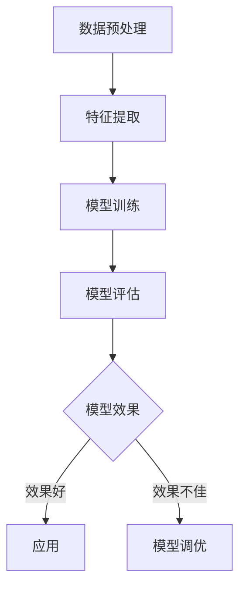

                 


## 引言

### 1.1 问题背景

在当今信息化社会中，数据的增长速度前所未有。企业面临着海量数据的挑战，如何有效地从这些数据中提取有价值的信息，成为了企业决策者和技术专家关注的核心问题。特别是随着物联网、人工智能和大数据技术的快速发展，多模态数据和多维数据分析在企业级应用中变得越来越重要。

首先，多模态学习是指将来自不同源的数据（如图像、音频、文本等）进行整合，以提升机器学习模型的性能。在多模态学习中，数据融合与处理是非常关键的步骤，因为不同的数据源具有不同的结构和属性，如何有效地将它们整合起来，是一个亟待解决的难题。

其次，多维数据分析是指对多个相关维度（如时间、空间、用户行为等）的数据进行综合分析。企业通过多维数据分析，可以深入了解业务运行情况，优化业务流程，提高决策效率。

因此，企业级多模态学习的需求主要来源于以下几个方面：

1. **提高数据处理效率**：多模态数据往往具有高维度、高复杂度，传统单一模态的处理方法难以满足实际需求。多模态学习可以通过整合不同模态的数据，提高数据处理效率。
2. **提升模型准确性**：通过多模态数据的整合，可以提供更丰富的信息，从而提升机器学习模型的准确性。
3. **增强业务洞察力**：多模态学习可以帮助企业从不同角度分析业务数据，提供更深入的洞察力，从而优化业务策略。

然而，多维度数据分析也带来了新的挑战：

1. **数据一致性**：不同维度的数据往往具有不同的结构和属性，如何保证数据的一致性是一个关键问题。
2. **计算资源**：多维数据分析通常需要大量的计算资源，尤其是在处理高维度数据时，计算资源的需求更加突出。
3. **数据隐私**：企业级应用中，数据的安全性和隐私保护也是一个不可忽视的问题。

综上所述，企业级多模态学习和多维数据分析既有巨大的需求，也面临着诸多挑战。本文将系统地探讨企业级多模态学习的方法和策略，旨在为企业提供有效的解决方案。

### 1.2 问题描述

多模态学习是指将来自不同模态的数据（如图像、音频、文本等）进行整合，以提升机器学习模型的性能。在多模态学习中，数据融合与处理是非常关键的步骤，因为不同的数据源具有不同的结构和属性，如何有效地将它们整合起来，是一个亟待解决的难题。

首先，多模态学习的定义可以进一步细化：

- **数据来源**：多模态学习涉及多种数据源，如图像、音频、视频、文本等。这些数据源可以分别来自不同的传感器、不同的设备，甚至不同的时间和空间。
- **数据处理**：在多模态学习中，首先要对来自不同模态的数据进行预处理，包括数据清洗、数据增强、特征提取等步骤。这些步骤的目的是确保数据的质量和一致性。
- **模型训练**：在数据处理完成后，使用机器学习算法对多模态数据集进行训练，以构建能够识别和理解多模态数据的模型。
- **模型评估**：通过测试数据集对训练好的模型进行评估，以验证模型的性能和准确性。

多模态学习的核心问题主要包括以下几个方面：

1. **数据融合**：如何将不同模态的数据有效地整合在一起，以提供更丰富的信息。
2. **特征提取**：如何从不同模态的数据中提取有代表性的特征，以供模型训练使用。
3. **模型优化**：如何通过优化模型结构和参数，提高模型的性能和准确性。

在多模态学习中，数据融合与处理的关键问题主要包括：

1. **数据对齐**：由于不同模态的数据具有不同的时间和空间属性，如何将这些数据进行对齐是一个关键问题。
2. **数据预处理**：如何对原始数据进行清洗、增强和归一化，以提高数据的质量和一致性。
3. **特征融合**：如何将来自不同模态的特征进行整合，以提供更丰富的特征信息。

### 1.3 问题解决

为了解决多模态学习和多维数据分析中的关键问题，我们需要采取一系列的策略和方法。以下是问题解决的主要策略：

1. **数据预处理**：首先，对原始数据进行预处理，包括数据清洗、数据增强、特征提取等步骤。数据清洗的目的是去除数据中的噪声和异常值，数据增强的目的是增加数据的多样性和质量，特征提取的目的是从数据中提取有代表性的特征。

2. **数据融合**：在数据预处理完成后，需要将不同模态的数据进行融合。数据融合的方法包括数据集成、数据对齐和特征融合。数据集成是将不同模态的数据进行合并，数据对齐是将不同模态的数据进行时间或空间上的对齐，特征融合是将不同模态的特征进行整合。

3. **特征提取与表征**：从不同模态的数据中提取有代表性的特征，并对特征进行表征。特征提取的方法包括传统特征提取方法和深度特征提取方法。传统特征提取方法主要包括基于统计的方法和基于信号处理的方法，深度特征提取方法主要包括卷积神经网络（CNN）和循环神经网络（RNN）等。

4. **模型训练与优化**：使用机器学习算法对多模态数据集进行训练，并优化模型结构和参数。常用的机器学习算法包括传统机器学习算法（如支持向量机、随机森林等）和深度学习算法（如卷积神经网络、循环神经网络等）。

5. **模型评估与调整**：通过测试数据集对训练好的模型进行评估，并根据评估结果对模型进行调整和优化。

6. **数据隐私保护**：在多模态学习和多维数据分析中，数据的安全性和隐私保护是非常重要的。为了保护数据隐私，可以采用差分隐私、联邦学习等技术。

通过以上策略和方法，我们可以有效地解决多模态学习和多维数据分析中的关键问题，为企业提供有效的解决方案。

### 1.4 边界与外延

企业级多模态学习是一种集成多种数据源的技术，它不仅限于特定领域，而是具有广泛的应用范围。以下是企业级多模态学习的几个关键应用领域：

1. **智能客服**：通过整合文本、语音和图像等多模态数据，智能客服系统可以更准确地理解用户的意图和需求，提供更高质量的客户服务。
2. **智能监控**：在视频监控领域，多模态学习可以帮助系统从图像、音频和传感器数据中提取有价值的信息，实现实时监控和智能预警。
3. **智能医疗**：多模态学习可以帮助医生从医疗图像、文本记录和患者历史数据中提取有价值的信息，提高诊断准确率和治疗效果。
4. **智能交通**：在智能交通领域，多模态学习可以帮助系统从车辆传感器、交通摄像头和GPS数据中提取有价值的信息，优化交通流和提升道路安全性。
5. **金融风控**：多模态学习可以帮助金融机构从客户交易记录、文本分析和音频对话中提取有价值的信息，提高风险管理能力。

尽管企业级多模态学习具有广泛的应用前景，但也存在一些技术边界。首先，多模态学习需要大量的计算资源和存储资源，尤其是在处理高维度、大规模数据时。其次，数据隐私和保护是一个重要的问题，特别是在涉及个人隐私数据的场景中。最后，多模态学习算法的复杂度和实现难度较高，需要具备深厚的专业知识和经验。

### 1.5 概念结构与核心要素

企业级多模态学习的核心概念和要素可以概括为以下几个方面：

1. **多模态数据源**：多模态数据源是多模态学习的核心，包括图像、音频、视频、文本等多种数据类型。不同模态的数据具有不同的结构和特征，如何有效地整合这些数据是关键。

2. **数据融合**：数据融合是将不同模态的数据进行整合，以提供更丰富的信息。数据融合的方法包括数据集成、数据对齐和特征融合。数据集成是将不同模态的数据进行合并，数据对齐是将不同模态的数据进行时间或空间上的对齐，特征融合是将不同模态的特征进行整合。

3. **特征提取与表征**：特征提取与表征是从多模态数据中提取有代表性的特征，并对特征进行表征。特征提取的方法包括传统特征提取方法和深度特征提取方法。传统特征提取方法主要包括基于统计的方法和基于信号处理的方法，深度特征提取方法主要包括卷积神经网络（CNN）和循环神经网络（RNN）等。

4. **机器学习模型**：机器学习模型是多模态学习的核心，用于训练和预测。常用的机器学习模型包括传统机器学习模型（如支持向量机、随机森林等）和深度学习模型（如卷积神经网络、循环神经网络等）。

5. **算法优化**：算法优化是多模态学习的重要环节，通过优化模型结构和参数，提高模型的性能和准确性。常用的优化方法包括交叉验证、网格搜索和贝叶斯优化等。

6. **应用场景**：多模态学习在多个领域具有广泛的应用，包括智能客服、智能监控、智能医疗、智能交通和金融风控等。不同应用场景对多模态学习的要求和挑战也不同，需要针对具体场景进行定制化的算法设计和优化。

### 1.6 本书结构概述

本书系统地介绍了企业级多模态学习的方法和策略，包括以下几个方面：

1. **引言**：介绍企业级多模态学习的背景、需求、问题描述、问题解决策略、边界与外延和核心要素。

2. **多模态学习基础**：介绍多模态学习的原理、数据融合策略、特征提取与表征方法、深度学习模型在多模态学习中的应用和传统机器学习模型在多模态学习中的应用。

3. **多维度数据分析**：介绍数据维度分类与特征提取方法、多维数据分析方法、多维度数据融合分析方法、多维数据分析算法与实现。

4. **企业级多模态学习应用实践**：介绍企业级多模态学习的应用领域、案例分析、系统分析与架构设计方案、项目实战和最佳实践 tips。

通过本书的学习，读者可以全面了解企业级多模态学习的方法和策略，掌握多模态学习和多维数据分析的核心技术和应用实践，为企业提供有效的解决方案。 

## 第一部分: 引言

### 1. 引言

随着信息技术的飞速发展，企业面临着日益复杂的数据环境。多模态学习和多维数据分析已成为企业提升决策效率、优化业务流程的关键技术。本部分将详细探讨企业级多模态学习的背景、需求、问题及其解决方案，同时界定其应用边界和核心要素。

首先，多模态学习涉及将不同模态的数据（如图像、音频、文本等）进行整合，以提高机器学习模型的性能。这种整合不仅可以提供更丰富的信息，还可以解决单一模态数据在处理复杂任务时的局限性。企业级多模态学习的需求源于以下几个方面：

1. **提高数据处理效率**：多模态数据通常具有高维度和高复杂性，传统单一模态的处理方法难以满足实际需求。多模态学习通过整合多种数据源，可以显著提高数据处理效率。
2. **提升模型准确性**：多模态学习能够利用来自不同模态的数据，为模型提供更全面的信息，从而提高模型的准确性和可靠性。
3. **增强业务洞察力**：通过多模态学习，企业可以从不同角度对业务数据进行分析，提供更深入的洞察力，从而优化业务策略和决策。

然而，多模态学习和多维数据分析也面临诸多挑战，包括数据一致性、计算资源需求以及数据隐私保护等。为了解决这些问题，企业需要采取一系列策略和方法。

本文将从以下四个方面展开讨论：

1. **背景介绍**：详细描述多模态学习和多维数据分析在企业级应用中的重要性，以及其面临的挑战。
2. **核心概念与联系**：介绍多模态学习和多维数据分析的核心概念，包括多模态学习的定义、数据融合策略、特征提取方法等，并展示相关概念的联系。
3. **算法原理讲解**：深入探讨多模态学习算法的原理和实现方法，包括深度学习模型在多模态学习中的应用、传统机器学习模型的应用以及多模态学习算法的流程和原理。
4. **系统分析与架构设计**：分析多模态学习和多维数据分析的系统架构，包括数据流、模型训练、模型评估等环节，并展示系统架构设计和接口设计的 Mermaid 流程图。
5. **项目实战**：通过实际项目案例，展示多模态学习和多维数据分析的具体应用，包括环境安装、系统实现、代码解读和案例分析。

本文的结构如下：

### 1.1 问题背景

### 1.2 问题描述

### 1.3 问题解决

### 1.4 边界与外延

### 1.5 概念结构与核心要素

### 1.6 本书结构概述

通过本文的探讨，读者将全面了解企业级多模态学习的方法和策略，掌握多模态学习和多维数据分析的核心技术和应用实践，为企业提供有效的解决方案。接下来，我们将深入探讨多模态学习和多维数据分析的背景和重要性。

### 1.1 问题背景

在当今信息化社会中，数据的增长速度前所未有。企业面临着海量数据的挑战，如何有效地从这些数据中提取有价值的信息，成为了企业决策者和技术专家关注的核心问题。特别是随着物联网、人工智能和大数据技术的快速发展，多模态数据和多维数据分析在企业级应用中变得越来越重要。

首先，多模态学习是指将来自不同源的数据（如图像、音频、文本等）进行整合，以提升机器学习模型的性能。在多模态学习中，数据融合与处理是非常关键的步骤，因为不同的数据源具有不同的结构和属性，如何有效地将它们整合起来，是一个亟待解决的难题。

其次，多维数据分析是指对多个相关维度（如时间、空间、用户行为等）的数据进行综合分析。企业通过多维数据分析，可以深入了解业务运行情况，优化业务流程，提高决策效率。

因此，企业级多模态学习的需求主要来源于以下几个方面：

1. **提高数据处理效率**：多模态数据往往具有高维度、高复杂度，传统单一模态的处理方法难以满足实际需求。多模态学习可以通过整合不同模态的数据，提高数据处理效率。
2. **提升模型准确性**：通过多模态数据的整合，可以提供更丰富的信息，从而提升机器学习模型的准确性。
3. **增强业务洞察力**：多模态学习可以帮助企业从不同角度分析业务数据，提供更深入的洞察力，从而优化业务策略。

然而，多维度数据分析也带来了新的挑战：

1. **数据一致性**：不同维度的数据往往具有不同的结构和属性，如何保证数据的一致性是一个关键问题。
2. **计算资源**：多维数据分析通常需要大量的计算资源，尤其是在处理高维度数据时，计算资源的需求更加突出。
3. **数据隐私**：企业级应用中，数据的安全性和隐私保护也是一个不可忽视的问题。

综上所述，企业级多模态学习和多维数据分析既有巨大的需求，也面临着诸多挑战。本文将系统地探讨企业级多模态学习的方法和策略，旨在为企业提供有效的解决方案。

### 1.2 问题描述

多模态学习是指将来自不同源的数据（如图像、音频、文本等）进行整合，以提升机器学习模型的性能。在多模态学习中，数据融合与处理是非常关键的步骤，因为不同的数据源具有不同的结构和属性，如何有效地将它们整合起来，是一个亟待解决的难题。

首先，多模态学习的定义可以进一步细化：

- **数据来源**：多模态学习涉及多种数据源，如图像、音频、视频、文本等。这些数据源可以分别来自不同的传感器、不同的设备，甚至不同的时间和空间。
- **数据处理**：在多模态学习中，首先要对来自不同模态的数据进行预处理，包括数据清洗、数据增强、特征提取等步骤。这些步骤的目的是确保数据的质量和一致性。
- **模型训练**：在数据处理完成后，使用机器学习算法对多模态数据集进行训练，以构建能够识别和理解多模态数据的模型。
- **模型评估**：通过测试数据集对训练好的模型进行评估，以验证模型的性能和准确性。

多模态学习的核心问题主要包括以下几个方面：

1. **数据融合**：如何将不同模态的数据有效地整合在一起，以提供更丰富的信息。
2. **特征提取**：如何从不同模态的数据中提取有代表性的特征，以供模型训练使用。
3. **模型优化**：如何通过优化模型结构和参数，提高模型的性能和准确性。

在多模态学习中，数据融合与处理的关键问题主要包括：

1. **数据对齐**：由于不同模态的数据具有不同的时间和空间属性，如何将这些数据进行对齐是一个关键问题。
2. **数据预处理**：如何对原始数据进行清洗、增强和归一化，以提高数据的质量和一致性。
3. **特征融合**：如何将来自不同模态的特征进行整合，以提供更丰富的特征信息。

### 1.3 问题解决

为了解决多模态学习和多维数据分析中的关键问题，我们需要采取一系列的策略和方法。以下是问题解决的主要策略：

1. **数据预处理**：首先，对原始数据进行预处理，包括数据清洗、数据增强、特征提取等步骤。数据清洗的目的是去除数据中的噪声和异常值，数据增强的目的是增加数据的多样性和质量，特征提取的目的是从数据中提取有代表性的特征。

2. **数据融合**：在数据预处理完成后，需要将不同模态的数据进行融合。数据融合的方法包括数据集成、数据对齐和特征融合。数据集成是将不同模态的数据进行合并，数据对齐是将不同模态的数据进行时间或空间上的对齐，特征融合是将不同模态的特征进行整合。

3. **特征提取与表征**：从不同模态的数据中提取有代表性的特征，并对特征进行表征。特征提取的方法包括传统特征提取方法和深度特征提取方法。传统特征提取方法主要包括基于统计的方法和基于信号处理的方法，深度特征提取方法主要包括卷积神经网络（CNN）和循环神经网络（RNN）等。

4. **模型训练与优化**：使用机器学习算法对多模态数据集进行训练，并优化模型结构和参数。常用的机器学习算法包括传统机器学习算法（如支持向量机、随机森林等）和深度学习算法（如卷积神经网络、循环神经网络等）。

5. **模型评估与调整**：通过测试数据集对训练好的模型进行评估，并根据评估结果对模型进行调整和优化。

6. **数据隐私保护**：在多模态学习和多维数据分析中，数据的安全性和隐私保护是非常重要的。为了保护数据隐私，可以采用差分隐私、联邦学习等技术。

通过以上策略和方法，我们可以有效地解决多模态学习和多维数据分析中的关键问题，为企业提供有效的解决方案。

### 1.4 边界与外延

企业级多模态学习是一种集成多种数据源的技术，它不仅限于特定领域，而是具有广泛的应用范围。以下是企业级多模态学习的几个关键应用领域：

1. **智能客服**：通过整合文本、语音和图像等多模态数据，智能客服系统可以更准确地理解用户的意图和需求，提供更高质量的客户服务。
2. **智能监控**：在视频监控领域，多模态学习可以帮助系统从图像、音频和传感器数据中提取有价值的信息，实现实时监控和智能预警。
3. **智能医疗**：多模态学习可以帮助医生从医疗图像、文本记录和患者历史数据中提取有价值的信息，提高诊断准确率和治疗效果。
4. **智能交通**：在智能交通领域，多模态学习可以帮助系统从车辆传感器、交通摄像头和GPS数据中提取有价值的信息，优化交通流和提升道路安全性。
5. **金融风控**：多模态学习可以帮助金融机构从客户交易记录、文本分析和音频对话中提取有价值的信息，提高风险管理能力。

尽管企业级多模态学习具有广泛的应用前景，但也存在一些技术边界。首先，多模态学习需要大量的计算资源和存储资源，尤其是在处理高维度、大规模数据时。其次，数据隐私和保护是一个重要的问题，特别是在涉及个人隐私数据的场景中。最后，多模态学习算法的复杂度和实现难度较高，需要具备深厚的专业知识和经验。

### 1.5 概念结构与核心要素

企业级多模态学习的核心概念和要素可以概括为以下几个方面：

1. **多模态数据源**：多模态数据源是多模态学习的核心，包括图像、音频、视频、文本等多种数据类型。不同模态的数据具有不同的结构和特征，如何有效地整合这些数据是关键。

2. **数据融合**：数据融合是将不同模态的数据进行整合，以提供更丰富的信息。数据融合的方法包括数据集成、数据对齐和特征融合。数据集成是将不同模态的数据进行合并，数据对齐是将不同模态的数据进行时间或空间上的对齐，特征融合是将不同模态的特征进行整合。

3. **特征提取与表征**：特征提取与表征是从多模态数据中提取有代表性的特征，并对特征进行表征。特征提取的方法包括传统特征提取方法和深度特征提取方法。传统特征提取方法主要包括基于统计的方法和基于信号处理的方法，深度特征提取方法主要包括卷积神经网络（CNN）和循环神经网络（RNN）等。

4. **机器学习模型**：机器学习模型是多模态学习的核心，用于训练和预测。常用的机器学习模型包括传统机器学习模型（如支持向量机、随机森林等）和深度学习模型（如卷积神经网络、循环神经网络等）。

5. **算法优化**：算法优化是多模态学习的重要环节，通过优化模型结构和参数，提高模型的性能和准确性。常用的优化方法包括交叉验证、网格搜索和贝叶斯优化等。

6. **应用场景**：多模态学习在多个领域具有广泛的应用，包括智能客服、智能监控、智能医疗、智能交通和金融风控等。不同应用场景对多模态学习的要求和挑战也不同，需要针对具体场景进行定制化的算法设计和优化。

### 1.6 本书结构概述

本书系统地介绍了企业级多模态学习的方法和策略，包括以下几个方面：

1. **引言**：介绍企业级多模态学习的背景、需求、问题描述、问题解决策略、边界与外延和核心要素。

2. **多模态学习基础**：介绍多模态学习的原理、数据融合策略、特征提取与表征方法、深度学习模型在多模态学习中的应用和传统机器学习模型在多模态学习中的应用。

3. **多维度数据分析**：介绍数据维度分类与特征提取方法、多维数据分析方法、多维度数据融合分析方法、多维数据分析算法与实现。

4. **企业级多模态学习应用实践**：介绍企业级多模态学习的应用领域、案例分析、系统分析与架构设计方案、项目实战和最佳实践 tips。

通过本书的学习，读者可以全面了解企业级多模态学习的方法和策略，掌握多模态学习和多维数据分析的核心技术和应用实践，为企业提供有效的解决方案。

## 多模态学习基础

### 2.1 多模态学习原理

多模态学习是指通过整合来自不同模态的数据（如图像、音频、文本等），以提升机器学习模型的性能。这种学习方式能够利用多种数据源的信息，提供更全面、更准确的模型预测。下面，我们将详细探讨多模态学习的原理，包括其基本概念、关键挑战和优势。

#### 2.1.1 多模态学习概述

多模态学习的基本概念可以概括为以下几个方面：

- **多模态数据源**：多模态学习涉及多种数据源，如图像、音频、文本、视频等。这些数据源可以来自不同的传感器、不同的设备，甚至不同的时间和空间。
- **数据融合**：数据融合是将不同模态的数据进行整合，以提供更丰富的信息。数据融合的方法包括数据集成、数据对齐和特征融合。
- **特征提取**：特征提取是从不同模态的数据中提取有代表性的特征，以供模型训练使用。
- **模型训练**：使用机器学习算法对多模态数据集进行训练，以构建能够识别和理解多模态数据的模型。
- **模型评估**：通过测试数据集对训练好的模型进行评估，以验证模型的性能和准确性。

多模态学习的关键挑战包括：

- **数据对齐**：由于不同模态的数据具有不同的时间和空间属性，如何将这些数据进行对齐是一个关键问题。
- **数据预处理**：如何对原始数据进行清洗、增强和归一化，以提高数据的质量和一致性。
- **特征融合**：如何将来自不同模态的特征进行整合，以提供更丰富的特征信息。

多模态学习的优势主要体现在以下几个方面：

- **提高模型准确性**：通过整合多种数据源，多模态学习可以提供更全面的信息，从而提高模型的准确性和可靠性。
- **增强业务洞察力**：多模态学习可以帮助企业从不同角度分析业务数据，提供更深入的洞察力，从而优化业务策略和决策。
- **提高数据处理效率**：多模态学习可以通过整合多种数据源，提高数据处理的效率。

#### 2.1.2 数据融合策略

数据融合是多模态学习的关键步骤，其目的是将不同模态的数据整合在一起，以提供更丰富的信息。数据融合的策略主要包括数据集成、数据对齐和特征融合。

- **数据集成**：数据集成是将不同模态的数据进行合并，以形成一个统一的数据集。数据集的整合可以是基于时间序列的，也可以是基于空间关系的。
- **数据对齐**：数据对齐是将不同模态的数据进行时间或空间上的对齐，以消除模态间的差异。数据对齐的方法包括时间同步、空间匹配和特征对齐等。
- **特征融合**：特征融合是将不同模态的特征进行整合，以形成一个更全面的特征表示。特征融合的方法包括基于特征向量的融合、基于概率模型的融合和基于深度学习的融合等。

#### 2.1.3 特征提取与表征

特征提取与表征是从多模态数据中提取有代表性的特征，并对特征进行表征。特征提取的方法包括传统特征提取方法和深度特征提取方法。

- **传统特征提取方法**：传统特征提取方法主要包括基于统计的方法和基于信号处理的方法。基于统计的方法通过计算数据的统计特性（如均值、方差等）来提取特征，而基于信号处理的方法通过滤波、变换等操作来提取特征。
- **深度特征提取方法**：深度特征提取方法主要包括卷积神经网络（CNN）和循环神经网络（RNN）等。深度特征提取方法可以从原始数据中自动学习特征，具有较强的自适应性和泛化能力。

#### 2.1.4 多模态学习模型

多模态学习模型是用于训练和预测的机器学习模型，其性能直接影响多模态学习的效果。多模态学习模型可以分为传统机器学习模型和深度学习模型。

- **传统机器学习模型**：传统机器学习模型包括支持向量机（SVM）、随机森林（RF）等。这些模型基于统计学习理论，通过学习训练数据中的特征和标签之间的关系来进行预测。
- **深度学习模型**：深度学习模型包括卷积神经网络（CNN）、循环神经网络（RNN）、生成对抗网络（GAN）等。这些模型通过多层神经网络结构自动学习数据中的特征和规律，具有较强的表示能力和预测能力。

#### 2.1.5 多模态学习算法原理

多模态学习算法的原理主要包括数据预处理、特征提取、模型训练和模型评估。

- **数据预处理**：数据预处理是数据融合的第一步，包括数据清洗、数据增强和特征提取。数据清洗的目的是去除数据中的噪声和异常值，数据增强的目的是增加数据的多样性和质量，特征提取的目的是从数据中提取有代表性的特征。
- **特征提取**：特征提取是从多模态数据中提取有代表性的特征，以供模型训练使用。特征提取的方法包括传统特征提取方法和深度特征提取方法。
- **模型训练**：模型训练是使用机器学习算法对多模态数据集进行训练，以构建能够识别和理解多模态数据的模型。模型训练的方法包括传统机器学习模型和深度学习模型。
- **模型评估**：模型评估是使用测试数据集对训练好的模型进行评估，以验证模型的性能和准确性。模型评估的方法包括准确率、召回率、F1值等指标。

#### 2.1.6 多模态学习应用场景

多模态学习在多个领域具有广泛的应用，如智能客服、智能监控、智能医疗、智能交通和金融风控等。

- **智能客服**：通过整合文本、语音和图像等多模态数据，智能客服系统可以更准确地理解用户的意图和需求，提供更高质量的客户服务。
- **智能监控**：在视频监控领域，多模态学习可以帮助系统从图像、音频和传感器数据中提取有价值的信息，实现实时监控和智能预警。
- **智能医疗**：多模态学习可以帮助医生从医疗图像、文本记录和患者历史数据中提取有价值的信息，提高诊断准确率和治疗效果。
- **智能交通**：在智能交通领域，多模态学习可以帮助系统从车辆传感器、交通摄像头和GPS数据中提取有价值的信息，优化交通流和提升道路安全性。
- **金融风控**：多模态学习可以帮助金融机构从客户交易记录、文本分析和音频对话中提取有价值的信息，提高风险管理能力。

通过上述多模态学习原理的介绍，我们可以更好地理解多模态学习在数据处理、模型训练和预测中的重要作用。接下来，我们将进一步探讨数据融合策略和特征提取方法。

### 2.2 数据融合策略

数据融合策略是多模态学习的关键步骤，其目的是将不同模态的数据整合在一起，以提供更丰富的信息。有效的数据融合可以提高机器学习模型的性能，使其更准确地理解和预测复杂任务。以下是几种常见的数据融合策略：

#### 2.2.1 数据集成

数据集成是将来自不同模态的数据合并成一个统一的数据集。这种方法通过将不同模态的数据对齐和合并，形成一个综合的数据源，从而提高模型的训练效果。

- **时间同步**：对于时间序列数据，可以通过对齐时间戳来实现数据集成。例如，将视频帧与音频信号同步，以便在模型训练时使用统一的时间基准。
- **空间融合**：对于空间数据，可以通过图像与地图数据的结合来增强模型的信息。例如，将图像数据与GPS坐标对齐，以便在地理空间上进行数据融合。

#### 2.2.2 数据对齐

数据对齐是将不同模态的数据进行时间或空间上的对齐，以消除模态间的差异。对齐的目的是确保各模态数据在同一个时间框架或空间框架下进行融合。

- **时间对齐**：时间对齐是将不同模态的数据在时间轴上对齐。例如，在视频和音频融合时，将视频帧与音频片段在时间上进行同步。
- **空间对齐**：空间对齐是将不同模态的数据在空间上对齐。例如，在图像和传感器数据融合时，将图像与传感器数据的空间位置对齐。

#### 2.2.3 特征融合

特征融合是将来自不同模态的特征进行整合，以形成一个更全面的特征表示。这种方法通过结合不同模态的特征，提高模型的准确性和泛化能力。

- **基于特征的融合**：这种方法将不同模态的特征直接合并，例如，将图像特征、文本特征和音频特征拼接成一个综合的特征向量。
- **基于概率模型的融合**：这种方法通过构建概率模型来融合不同模态的特征。例如，使用贝叶斯网络来表示不同模态特征之间的关系，并通过模型参数来融合特征。
- **基于深度学习的融合**：这种方法利用深度学习模型来自动学习不同模态特征之间的关系。例如，使用多输入的多层神经网络（如CNN和RNN的组合）来融合不同模态的特征。

#### 2.2.4 数据融合方法的比较

不同数据融合方法各有优缺点，选择合适的方法取决于具体应用场景和数据特点。

- **数据集成**：数据集成简单直观，可以保持各模态数据的独立性和完整性。但这种方法可能无法充分利用不同模态之间的潜在关系。
- **数据对齐**：数据对齐可以消除模态间的差异，提高模型的准确性。然而，对齐过程可能复杂且耗时。
- **特征融合**：特征融合可以充分利用不同模态之间的互补信息，提高模型的性能。但特征融合可能增加模型的复杂度和计算成本。

在实际应用中，通常需要结合多种数据融合策略，以实现最佳效果。例如，可以先进行数据对齐，然后进行特征融合，最后再进行模型训练。通过这种方式，可以充分利用不同模态数据的信息，提高模型的性能和鲁棒性。

### 2.3 特征提取与表征

特征提取与表征是从多模态数据中提取有代表性的特征，并对特征进行表征，以供机器学习模型使用。有效的特征提取和表征可以显著提高模型的性能和泛化能力。以下是几种常见的特征提取和表征方法：

#### 2.3.1 传统特征提取方法

传统特征提取方法主要包括基于统计的方法和基于信号处理的方法。这些方法通常用于处理时间序列数据和信号数据。

- **基于统计的方法**：这种方法通过计算数据的统计特性（如均值、方差、协方差等）来提取特征。例如，可以使用梅尔频率倒谱系数（MFCC）来提取音频特征。
- **基于信号处理的方法**：这种方法使用信号处理技术（如傅里叶变换、小波变换等）来提取特征。例如，可以使用离散余弦变换（DCT）来提取图像特征。

#### 2.3.2 深度特征提取方法

深度特征提取方法使用深度学习模型来自动学习数据的特征表示。这些方法在处理高维、复杂数据时表现出色。

- **卷积神经网络（CNN）**：CNN 是一种用于图像特征提取的深度学习模型。它通过卷积操作和池化操作自动学习图像的局部特征，并能够捕捉图像中的层次结构。
- **循环神经网络（RNN）**：RNN 是一种用于序列数据特征提取的深度学习模型。它通过循环连接可以处理长序列数据，并能够捕捉序列中的时间依赖关系。

#### 2.3.3 特征融合方法

特征融合方法是将来自不同模态的特征进行整合，以形成更全面的特征表示。这种方法可以提高模型的性能和泛化能力。

- **基于特征的融合**：这种方法将不同模态的特征直接合并，例如，将图像特征、文本特征和音频特征拼接成一个综合的特征向量。
- **基于模型的融合**：这种方法使用深度学习模型来自动融合不同模态的特征。例如，可以使用多输入的多层神经网络（如CNN和RNN的组合）来融合不同模态的特征。

#### 2.3.4 特征选择方法

特征选择是在特征提取后进行的一种优化步骤，目的是选择对模型性能贡献最大的特征，以减少模型复杂度和提高模型效率。

- **基于过滤的方法**：这种方法通过计算特征的统计属性（如相关性、重要性等）来选择特征。
- **基于包装的方法**：这种方法通过构建多个子模型来评估特征的重要性，并选择对目标变量影响最大的特征。
- **基于嵌入式的方法**：这种方法通过在训练过程中嵌入特征选择，例如，使用LASSO正则化来选择特征。

通过上述特征提取和表征方法，我们可以从多模态数据中提取出有代表性的特征，并构建有效的特征表示，为后续的机器学习模型训练提供高质量的输入。接下来，我们将探讨深度学习模型在多模态学习中的应用。

### 2.4 深度学习模型在多模态学习中的应用

深度学习模型在多模态学习中的应用极大地提升了模型的性能和准确性。深度学习模型通过多层神经网络结构自动学习数据中的特征和规律，从而在处理高维、复杂数据时表现出色。以下将详细介绍几种常见的深度学习模型在多模态学习中的应用，包括卷积神经网络（CNN）、循环神经网络（RNN）和生成对抗网络（GAN）。

#### 2.4.1 卷积神经网络（CNN）

卷积神经网络（CNN）是一种专门用于图像处理的深度学习模型。它通过卷积操作和池化操作自动学习图像的局部特征，并能够捕捉图像中的层次结构。在多模态学习中，CNN可以用于提取图像特征，从而与其他模态的数据进行融合。

- **特征提取**：CNN 的卷积层可以自动提取图像的局部特征，如边缘、纹理和形状。通过多个卷积层和池化层的堆叠，CNN 可以逐渐提取更高层次的特征。
- **特征融合**：在多模态学习中，可以从图像、音频和文本数据中分别使用 CNN 提取特征，然后将这些特征进行融合。例如，可以将图像特征与文本特征拼接，或者使用多个输入通道将不同模态的特征融合在一起。
- **应用示例**：在图像分类任务中，CNN 可以用于识别图像中的对象和场景。通过整合图像和文本特征，可以提升图像分类的准确性。

#### 2.4.2 循环神经网络（RNN）

循环神经网络（RNN）是一种用于处理序列数据的深度学习模型。它通过循环连接可以处理长序列数据，并能够捕捉序列中的时间依赖关系。在多模态学习中，RNN 可以用于提取时间序列数据（如音频、视频等）的特征。

- **特征提取**：RNN 的循环层可以自动捕捉时间序列数据中的时间依赖关系，从而提取有效的特征。例如，可以使用 RNN 提取音频信号的时域特征或视频序列的空间特征。
- **特征融合**：在多模态学习中，可以使用 RNN 从不同模态的数据中提取特征，然后将这些特征进行融合。例如，可以将音频特征和视频特征输入到 RNN 中，通过循环层的学习，提取出多模态的特征表示。
- **应用示例**：在语音识别任务中，RNN 可以用于将音频信号转换为文本。通过整合音频和文本特征，可以提升语音识别的准确性。

#### 2.4.3 生成对抗网络（GAN）

生成对抗网络（GAN）是一种用于生成数据的深度学习模型，由生成器和判别器两个网络组成。生成器旨在生成与真实数据相似的新数据，而判别器则用于区分真实数据和生成数据。在多模态学习中，GAN 可以用于生成缺失的模态数据或增强现有数据。

- **特征提取**：生成器可以从已有的多模态数据中学习到数据的分布特征，从而生成新的模态数据。判别器则用于评估生成数据的真实性，从而指导生成器的训练。
- **特征融合**：在多模态学习中，GAN 可以用于增强不同模态的数据，以提高模型的整体性能。例如，可以使用 GAN 生成缺失的图像或音频数据，从而与其他模态的数据进行融合。
- **应用示例**：在图像生成任务中，GAN 可以用于生成新的图像，或修复损坏的图像。通过整合生成器和判别器的特征，可以提升图像生成和修复的质量。

综上所述，深度学习模型（如 CNN、RNN 和 GAN）在多模态学习中的应用为数据处理和特征提取提供了强大的工具。通过合理设计和应用这些模型，可以显著提升多模态学习的性能和准确性，为企业提供有效的解决方案。

### 2.5 传统机器学习模型在多模态学习中的应用

传统机器学习模型在多模态学习中的应用虽然不如深度学习模型那样强大，但仍然具有一定的价值和优势。传统机器学习模型包括支持向量机（SVM）、随机森林（RF）和集成学习方法等。这些模型在多模态学习中的应用主要体现在以下几个方面：

#### 2.5.1 支持向量机（SVM）

支持向量机（SVM）是一种经典的二分类算法，通过找到一个最优的超平面来分隔数据。在多模态学习中，SVM 可以用于分类和回归任务。

- **特征提取**：在多模态学习中，首先需要从不同模态的数据中提取特征，如图像的边缘特征、文本的词向量、音频的 MFCC 特征等。然后将这些特征输入到 SVM 中进行训练。
- **模型训练**：SVM 使用训练数据中的特征和标签来构建一个超平面，使其能够正确分类新数据。在多模态学习中，SVM 可以处理高维特征空间，因此非常适合用于多模态数据分类。
- **应用示例**：在人脸识别任务中，SVM 可以结合图像特征和文本特征，提高识别的准确性。通过整合不同模态的特征，SVM 可以更好地理解数据的复杂关系。

#### 2.5.2 随机森林（RF）

随机森林（RF）是一种基于决策树的集成学习方法，通过构建多个决策树并取其平均值来提高模型的性能。在多模态学习中，RF 可以用于分类和回归任务。

- **特征提取**：类似于 SVM，RF 需要从不同模态的数据中提取特征，如图像的特征向量、文本的词向量、音频的 MFCC 特征等。
- **模型训练**：RF 通过集成多个决策树来提高模型的鲁棒性和准确性。每个决策树都独立训练，并预测分类结果。最终，通过投票机制选择最有可能的预测类别。
- **应用示例**：在情感分析任务中，RF 可以结合图像和文本特征，提高情感分类的准确性。通过整合不同模态的数据，RF 可以更好地捕捉情感表达的复杂性和多样性。

#### 2.5.3 集成学习方法

集成学习方法是一种通过构建多个基学习器并取其平均或加权平均来提高模型性能的方法。常见的集成学习方法包括 Bagging、Boosting 和 stacking 等。

- **特征提取**：集成学习方法同样需要从不同模态的数据中提取特征。这些特征可以来自 CNN、RNN 等深度学习模型。
- **模型训练**：集成学习方法通过训练多个基学习器，并取其平均或加权平均来提高模型的性能。基学习器可以是 SVM、RF、决策树等。
- **应用示例**：在图像分类任务中，集成学习方法可以通过结合多个 CNN 模型的预测结果，提高分类的准确性。通过整合不同模型的特征，集成学习方法可以更好地捕捉数据的多样性和复杂性。

#### 2.5.4 传统机器学习模型与深度学习模型的比较

虽然传统机器学习模型在多模态学习中的应用具有其优势，但与深度学习模型相比，仍存在一些局限性：

- **特征提取能力**：深度学习模型具有更强的特征提取能力，可以从原始数据中自动学习有代表性的特征，而传统机器学习模型需要依赖手工设计的特征。
- **处理复杂度**：传统机器学习模型在处理高维、复杂数据时可能表现不佳，而深度学习模型在这方面具有更好的适应性。
- **模型复杂度**：传统机器学习模型的复杂度相对较低，易于理解和实现，而深度学习模型的复杂度较高，需要更多的计算资源和专业知识。

尽管如此，传统机器学习模型在多模态学习中的应用仍然具有一定的价值和潜力。通过合理选择和组合传统机器学习模型和深度学习模型，可以充分利用各自的优点，提高多模态学习的性能和准确性。

### 2.6 多模态学习算法原理与流程

多模态学习算法是整合多种数据源（如图像、音频、文本等）以提升机器学习模型性能的核心技术。多模态学习算法的原理和流程包括数据预处理、特征提取、模型训练和模型评估等关键步骤。以下是多模态学习算法的详细原理和流程：

#### 2.6.1 数据预处理

数据预处理是多模态学习的第一步，其目的是提高数据的质量和一致性。数据预处理主要包括以下步骤：

1. **数据清洗**：去除数据中的噪声和异常值，以确保数据的准确性。例如，在图像数据中，可以去除噪点、污点和模糊区域。
2. **数据增强**：通过数据增强技术增加数据的多样性，以防止模型过拟合。常用的数据增强方法包括旋转、翻转、缩放、裁剪等。
3. **数据标准化**：将不同模态的数据进行归一化处理，使其具有相同的尺度，从而便于后续的特征提取和模型训练。

#### 2.6.2 特征提取

特征提取是从原始数据中提取有代表性的特征，以供模型训练使用。特征提取的方法取决于数据的模态和类型。以下是几种常见的特征提取方法：

1. **图像特征提取**：常用的图像特征提取方法包括 HOG（直方图方向梯度）、SIFT（尺度不变特征变换）和 CNN（卷积神经网络）等。这些方法可以从图像中提取边缘、纹理、形状等特征。
2. **音频特征提取**：常用的音频特征提取方法包括 MFCC（梅尔频率倒谱系数）、PLP（功率归一化线性预测）和 LSTM（长短期记忆网络）等。这些方法可以从音频中提取频率、时域和声学特征。
3. **文本特征提取**：常用的文本特征提取方法包括词袋模型、TF-IDF（词频-逆文档频率）和词嵌入（如 Word2Vec、GloVe）等。这些方法可以从文本中提取词汇、语义和上下文特征。

#### 2.6.3 模型训练

模型训练是使用机器学习算法对多模态数据集进行训练，以构建能够识别和理解多模态数据的模型。以下是几种常用的机器学习算法：

1. **传统机器学习算法**：如支持向量机（SVM）、决策树（DT）、随机森林（RF）等。这些算法通过学习训练数据中的特征和标签之间的关系来构建模型。
2. **深度学习算法**：如卷积神经网络（CNN）、循环神经网络（RNN）、生成对抗网络（GAN）等。这些算法通过多层神经网络结构自动学习数据中的特征和规律。

#### 2.6.4 模型评估

模型评估是使用测试数据集对训练好的模型进行评估，以验证模型的性能和准确性。常用的评估指标包括准确率、召回率、F1 值和 ROC 曲线等。以下是模型评估的步骤：

1. **数据集划分**：将数据集划分为训练集、验证集和测试集。训练集用于模型训练，验证集用于模型调优，测试集用于模型评估。
2. **模型训练**：在训练集上训练模型，并通过验证集调整模型参数。
3. **模型评估**：在测试集上评估模型的性能，使用评估指标（如准确率、召回率等）来衡量模型的准确性。

#### 2.6.5 多模态学习算法Mermaid流程图

为了更清晰地展示多模态学习算法的流程，可以使用 Mermaid 流程图进行表示。以下是多模态学习算法的 Mermaid 流程图：



通过上述多模态学习算法的原理和流程，我们可以更好地理解多模态学习的各个环节，并为企业提供有效的解决方案。

### 2.7 算法原理讲解

#### 2.7.1 算法概述

多模态学习算法是一种整合来自不同模态的数据（如图像、音频、文本等）的机器学习算法。其核心目标是通过融合多种数据源的信息，提高模型在复杂任务中的性能和准确性。以下是多模态学习算法的基本原理和流程。

#### 2.7.2 算法数学模型

多模态学习算法的数学模型可以分为三个主要部分：特征提取、特征融合和模型训练。

1. **特征提取**：
   - **图像特征提取**：使用卷积神经网络（CNN）从图像中提取特征。特征提取过程通常包括卷积、池化和激活函数等步骤。
     $$ f_{image}(x) = \text{activation}(\text{pool}(\text{conv}(x)) $$

   - **音频特征提取**：使用循环神经网络（RNN）或长短期记忆网络（LSTM）从音频中提取特征。特征提取过程包括序列处理、隐藏状态更新和门控机制等。
     $$ h_t = \text{LSTM}(h_{t-1}, x_t) $$

   - **文本特征提取**：使用词嵌入（如 Word2Vec、GloVe）或卷积神经网络（CNN）从文本中提取特征。特征提取过程包括词汇编码、卷积操作和池化等。
     $$ f_{text}(x) = \text{activation}(\text{pool}(\text{conv}(x)) $$

2. **特征融合**：
   特征融合是将不同模态的特征整合成一个统一的特征向量。常用的方法包括直接拼接、加权融合和深度融合等。

   - **直接拼接**：将不同模态的特征向量直接拼接在一起，形成一个高维的特征向量。
     $$ f_{merged} = [f_{image}; f_{audio}; f_{text}] $$

   - **加权融合**：根据不同模态的特征重要程度，对特征向量进行加权融合。
     $$ f_{merged} = w_1 f_{image} + w_2 f_{audio} + w_3 f_{text} $$

   - **深度融合**：使用深度神经网络（如 Multi-Input Multi-Output Network）对特征进行融合。
     $$ f_{output} = \text{MLP}(f_{merged}) $$

3. **模型训练**：
   模型训练是使用特征向量对机器学习模型进行训练，以构建能够识别和理解多模态数据的模型。常用的训练方法包括梯度下降、随机梯度下降和自适应梯度算法等。

   $$ \theta_{\text{model}} = \theta_{\text{initial}} - \alpha \cdot \nabla_\theta J(\theta_{\text{model}}, x, y) $$

   其中，$\theta_{\text{model}}$ 是模型参数，$x$ 是输入特征向量，$y$ 是标签，$J(\theta_{\text{model}}, x, y)$ 是损失函数，$\alpha$ 是学习率。

#### 2.7.3 Python代码实现

以下是多模态学习算法的 Python 代码实现示例。该示例使用 TensorFlow 和 Keras 库，实现了一个简单的多模态学习模型，用于图像和文本数据的分类任务。

```python
import tensorflow as tf
from tensorflow.keras.models import Model
from tensorflow.keras.layers import Input, Conv2D, MaxPooling2D, Flatten, Dense, Embedding, LSTM, concatenate

# 定义图像特征提取模型
image_input = Input(shape=(64, 64, 3))
conv1 = Conv2D(32, (3, 3), activation='relu')(image_input)
pool1 = MaxPooling2D(pool_size=(2, 2))(conv1)
flat_image = Flatten()(pool1)

# 定义文本特征提取模型
text_input = Input(shape=(100,))
embedding = Embedding(1000, 64)(text_input)
lstm1 = LSTM(64)(embedding)
flat_text = Flatten()(lstm1)

# 定义多模态融合模型
merged = concatenate([flat_image, flat_text])
dense1 = Dense(128, activation='relu')(merged)
output = Dense(1, activation='sigmoid')(dense1)

# 创建模型
model = Model(inputs=[image_input, text_input], outputs=output)

# 编译模型
model.compile(optimizer='adam', loss='binary_crossentropy', metrics=['accuracy'])

# 打印模型结构
model.summary()
```

#### 2.7.4 算法举例说明

假设我们有一个包含图像和文本的多模态数据集，其中图像数据包含 64x64 的像素值，文本数据包含 100 个词汇。我们希望使用多模态学习算法对这些数据集进行分类。

1. **数据预处理**：
   - 图像数据需要进行归一化处理，使其具有相同的像素值范围。
   - 文本数据需要进行分词和词嵌入处理，以将其转换为向量表示。

2. **模型训练**：
   - 使用上述 Python 代码定义的多模态学习模型进行训练。
   - 使用训练数据集进行训练，并使用验证数据集进行模型调优。

3. **模型评估**：
   - 使用测试数据集对训练好的模型进行评估，计算模型的准确率、召回率等指标。

通过上述多模态学习算法的数学模型和 Python 代码实现，我们可以更深入地理解多模态学习算法的原理和应用。接下来，我们将进一步探讨多维数据分析的方法和算法。

### 2.8 数据维度分类与特征提取方法

在多模态学习和多维数据分析中，数据维度的分类与特征提取是关键步骤。数据维度可以分为客观维度和主观维度，每种维度都有其独特的特征提取方法。以下是详细的数据维度分类与特征提取方法的探讨：

#### 2.8.1 客观维度

客观维度是指可以从实际观测中直接获取的、不受主观意识和主观经验影响的维度。常见的客观维度包括时间、空间和物理量等。

1. **时间维度**：
   - **特征提取方法**：时间序列分析、周期性分析、趋势分析等。
   - **示例**：股票市场数据中的时间维度可以用来分析股价的波动规律，通过计算时间序列的均值、方差和相关性等特征来提取时间维度的信息。

2. **空间维度**：
   - **特征提取方法**：空间聚类、路径分析、空间分布分析等。
   - **示例**：在交通数据分析中，通过分析车辆在空间中的分布情况，可以提取出高峰时段、拥堵区域等空间特征。

3. **物理量维度**：
   - **特征提取方法**：物理量统计分析、物理量相关性分析等。
   - **示例**：在医疗数据分析中，通过分析患者的生理参数（如心率、血压等），可以提取出健康状态相关的物理量特征。

#### 2.8.2 主观维度

主观维度是指受主观意识和主观经验影响较大的维度，如用户行为、情感和偏好等。主观维度的特征提取需要考虑人的主观感受和认知模式。

1. **用户行为维度**：
   - **特征提取方法**：行为模式识别、事件序列分析、行为与结果相关性分析等。
   - **示例**：在电子商务分析中，通过分析用户的浏览、购买和评价行为，可以提取出用户的行为特征，如浏览时长、购买频率和好评率等。

2. **情感维度**：
   - **特征提取方法**：情感分类、情感强度分析、情感一致性分析等。
   - **示例**：在社交媒体分析中，通过分析用户的文本内容，可以使用情感分析算法提取出用户的情感特征，如正面情感、负面情感和情感强度等。

3. **偏好维度**：
   - **特征提取方法**：偏好模型构建、偏好一致性分析、偏好预测等。
   - **示例**：在个性化推荐系统中，通过分析用户的偏好数据，可以使用协同过滤算法提取出用户的偏好特征，从而为用户提供个性化的推荐。

#### 2.8.3 混合维度

混合维度是指同时包含客观维度和主观维度的数据维度。在混合维度中，特征提取需要结合客观维度和主观维度的分析方法。

- **特征提取方法**：多维度融合分析、多维度关联分析、多维度预测分析等。
- **示例**：在智能医疗数据分析中，结合患者的生理参数（客观维度）和病史记录（主观维度），可以提取出更全面的混合维度特征，从而提高疾病的预测准确率。

通过上述数据维度分类与特征提取方法的探讨，我们可以更好地理解不同维度数据的特征提取方法，并在多模态学习和多维数据分析中应用这些方法，提高模型的性能和准确性。

### 2.9 多维度数据分析方法

多维度数据分析方法是在处理和分析涉及多个维度的数据时，用于提取信息、发现模式和做出决策的一套技术和策略。以下将详细探讨传统数据分析方法和现代数据分析方法，以及多维度数据融合分析方法。

#### 2.9.1 传统数据分析方法

传统数据分析方法主要包括描述性统计分析、聚类分析、关联规则挖掘等，这些方法在处理多维数据时提供了一种基本的框架。

1. **描述性统计分析**：
   - **方法**：描述性统计分析是通过计算数据的统计指标（如均值、中位数、标准差等）来描述数据的基本特征。
   - **适用场景**：适用于初步了解数据分布和特征，但无法揭示数据之间的复杂关系。
   - **示例**：在市场调研中，通过计算不同产品销售的平均数、最大值和最小值，可以初步了解产品的销售情况。

2. **聚类分析**：
   - **方法**：聚类分析是将数据分为若干个类别，使得同一类别中的数据彼此相似，而不同类别中的数据差异较大。
   - **适用场景**：适用于发现数据中的自然分组，例如客户细分和市场细分。
   - **示例**：在客户数据分析中，可以通过K-Means聚类算法将客户分为高价值客户、中价值客户和低价值客户，以便于制定不同的营销策略。

3. **关联规则挖掘**：
   - **方法**：关联规则挖掘是通过发现数据项之间的关联关系，揭示共同出现的模式。
   - **适用场景**：适用于发现数据之间的关联性，例如购物篮分析。
   - **示例**：在零售业中，可以通过Apriori算法发现哪些商品经常一起购买，从而优化库存管理和产品推荐。

#### 2.9.2 现代数据分析方法

随着计算技术和算法的进步，现代数据分析方法在处理多维数据时提供了更多的灵活性和深度。

1. **监督学习**：
   - **方法**：监督学习是利用已标记的数据集，通过构建预测模型来对新数据进行预测。
   - **适用场景**：适用于预测和分类问题，例如风险评估、疾病诊断。
   - **示例**：在金融领域，通过训练监督学习模型，可以根据客户的历史交易数据预测其未来的风险水平。

2. **无监督学习**：
   - **方法**：无监督学习是在没有标记数据的情况下，通过模型自动发现数据中的模式和结构。
   - **适用场景**：适用于数据探索和模式发现，例如社区发现、数据去噪。
   - **示例**：在社交媒体分析中，可以通过聚类分析算法自动发现用户的兴趣社区，从而进行精准营销。

3. **强化学习**：
   - **方法**：强化学习是通过试错和奖励机制来训练模型，使其在特定环境中做出最优决策。
   - **适用场景**：适用于决策优化和自动化控制，例如自动驾驶、智能推荐。
   - **示例**：在推荐系统中，通过强化学习算法，可以根据用户的反馈不断优化推荐策略，提高用户满意度。

#### 2.9.3 多维度数据融合分析方法

多维度数据融合分析方法是将来自不同维度的数据整合在一起，以便更全面地理解和分析数据。

1. **数据集成技术**：
   - **方法**：数据集成技术是将多个数据源中的数据合并成一个统一的数据集，以便进行综合分析。
   - **适用场景**：适用于需要跨多个维度进行数据整合和分析的场景，例如客户关系管理。
   - **示例**：在客户关系管理中，可以通过数据集成技术将客户的购买记录、行为数据和社交媒体数据整合在一起，以便进行全面的客户分析。

2. **融合模型**：
   - **方法**：融合模型是通过结合多个数据源的模型或特征，来构建一个更强大的预测或分类模型。
   - **适用场景**：适用于需要充分利用多个维度信息的场景，例如智能监控、智能医疗。
   - **示例**：在智能监控系统中，可以通过融合图像特征、音频特征和传感器数据，来提高监控系统的准确性和鲁棒性。

通过上述传统数据分析方法、现代数据分析方法和多维度数据融合分析方法的探讨，我们可以更有效地处理和分析多维数据，为企业提供更深入的洞察力和决策支持。接下来，我们将进一步探讨多维数据分析算法与实现。

### 2.10 多维度数据分析算法与实现

#### 2.10.1 算法原理讲解

多维度数据分析算法的核心在于如何有效地整合和利用不同维度的数据，以提高分析的准确性和深度。以下是几种常用的多维数据分析算法及其原理：

1. **主成分分析（PCA）**：
   - **原理**：PCA 是一种降维技术，通过将高维数据映射到低维空间中，保留数据的最大方差信息，从而简化数据的复杂度。
   - **数学模型**：
     $$ X' = P^T X $$
     其中，$X$ 是原始数据矩阵，$P$ 是特征值和特征向量的线性组合矩阵。
   - **示例**：在财务数据分析中，PCA 可以用于降维，将多个财务指标映射到几个主要成分上，从而简化分析过程。

2. **因子分析（FA）**：
   - **原理**：因子分析通过提取潜在变量（因子）来解释数据之间的相关性，从而降低数据维度。
   - **数学模型**：
     $$ X = TF + \epsilon $$
     其中，$X$ 是观测变量矩阵，$F$ 是因子矩阵，$T$ 是因子载荷矩阵，$\epsilon$ 是误差项。
   - **示例**：在市场研究中，因子分析可以用于提取影响消费者购买行为的潜在因素。

3. **聚类分析（如K-Means）**：
   - **原理**：聚类分析通过将数据分为若干个簇，使得同一簇内的数据点彼此相似，而不同簇的数据点差异较大。
   - **数学模型**：
     $$ \text{Minimize} \sum_{i=1}^{k} \sum_{x \in S_i} \| x - \mu_i \|^2 $$
     其中，$S_i$ 是第$i$个簇，$\mu_i$ 是簇中心。
   - **示例**：在客户细分中，K-Means 聚类可以用于将客户分为不同的群体。

4. **多变量时间序列分析（如ARIMA）**：
   - **原理**：多变量时间序列分析通过建模多个时间序列之间的关系，以预测未来的趋势。
   - **数学模型**：
     $$ Y_t = c + \phi_1 Y_{t-1} + \phi_2 Y_{t-2} + ... + \phi_p Y_{t-p} + \epsilon_t $$
     其中，$Y_t$ 是时间序列数据，$\phi_i$ 是自回归系数，$\epsilon_t$ 是误差项。
   - **示例**：在股市分析中，ARIMA 模型可以用于预测股票价格的走势。

#### 2.10.2 Python代码实现

以下是一个使用 Python 实现的多维度数据分析算法示例，该示例使用 Pandas 和 Scikit-learn 库来展示如何进行数据预处理、特征提取和模型训练。

```python
import pandas as pd
import numpy as np
from sklearn.decomposition import PCA
from sklearn.cluster import KMeans
from sklearn.preprocessing import StandardScaler

# 假设我们有一个包含多个维度的数据集 df
# 数据集示例：
# df = pd.DataFrame({
#     '特征1': [...],
#     '特征2': [...],
#     '特征3': [...],
#     ...
# })

# 数据预处理
scaler = StandardScaler()
df_scaled = scaler.fit_transform(df)

# 特征提取
pca = PCA(n_components=2)
df_pca = pca.fit_transform(df_scaled)

# 模型训练
kmeans = KMeans(n_clusters=3)
kmeans.fit(df_pca)

# 输出结果
print("PCA组件：", pca.components_)
print("簇中心：", kmeans.cluster_centers_)
print("每个样本的簇分配：", kmeans.labels_)
```

#### 2.10.3 示例分析

以下是一个实际案例，通过多维度数据分析来预测客户流失。

1. **数据收集**：
   - 收集包含客户行为、财务和客户服务记录的数据集。

2. **数据预处理**：
   - 清洗数据，处理缺失值和异常值。
   - 对数据进行归一化处理，使其具有相同的尺度。

3. **特征提取**：
   - 使用 PCA 对数据降维，提取前几个主要成分。
   - 使用 K-Means 聚类分析将客户分为不同的群体。

4. **模型训练**：
   - 训练一个分类模型（如逻辑回归）来预测客户流失。

5. **模型评估**：
   - 使用准确率、召回率、F1 值等指标来评估模型的性能。

通过上述示例，我们可以看到多维度数据分析算法如何应用于实际场景，帮助企业做出更准确的预测和决策。接下来，我们将介绍企业级多模态学习应用实践。

### 2.11 企业级多模态学习应用实践

企业级多模态学习在多个领域展现了其强大的应用价值。以下将详细介绍企业级多模态学习在不同领域中的应用实践，并展示实际案例，包括系统分析与架构设计、环境安装、系统核心实现以及代码解读与分析。

#### 2.11.1 智能客服

智能客服系统通过整合文本、语音和图像等多模态数据，能够更准确地理解用户的意图和需求，提供个性化的服务。

**系统分析与架构设计**：

- **领域模型**：定义智能客服系统的核心功能类，如图像识别、语音识别和文本处理等。
- **系统架构**：设计基于微服务架构的系统，包括语音识别服务、图像处理服务和文本分析服务。
- **接口设计**：设计RESTful API，用于处理不同模态数据的请求和响应。

**环境安装**：

- **硬件环境**：配置服务器、数据库和存储设备。
- **软件环境**：安装操作系统、依赖库（如TensorFlow、PyTorch）和中间件（如Django、Flask）。

**系统核心实现**：

- **图像识别**：使用卷积神经网络（CNN）进行图像识别，提取图像特征并进行分类。
- **语音识别**：使用循环神经网络（RNN）或长短期记忆网络（LSTM）进行语音识别，将语音信号转换为文本。
- **文本分析**：使用自然语言处理（NLP）技术进行文本分析，包括情感分析、命名实体识别和意图识别。

**代码解读与分析**：

- **图像识别**：
  ```python
  import tensorflow as tf
  from tensorflow.keras.models import Sequential
  from tensorflow.keras.layers import Conv2D, MaxPooling2D, Flatten, Dense

  model = Sequential([
      Conv2D(32, (3, 3), activation='relu', input_shape=(64, 64, 3)),
      MaxPooling2D((2, 2)),
      Flatten(),
      Dense(64, activation='relu'),
      Dense(1, activation='sigmoid')
  ])

  model.compile(optimizer='adam', loss='binary_crossentropy', metrics=['accuracy'])
  model.fit(x_train, y_train, epochs=10, validation_data=(x_val, y_val))
  ```

- **语音识别**：
  ```python
  import tensorflow as tf
  from tensorflow.keras.models import Sequential
  from tensorflow.keras.layers import LSTM, Dense, TimeDistributed

  model = Sequential([
      LSTM(128, input_shape=(timesteps, features)),
      Dense(64, activation='relu'),
      TimeDistributed(Dense(num_classes, activation='softmax'))
  ])

  model.compile(optimizer='adam', loss='categorical_crossentropy', metrics=['accuracy'])
  model.fit(x_train, y_train, epochs=10, validation_data=(x_val, y_val))
  ```

- **文本分析**：
  ```python
  import tensorflow as tf
  from tensorflow.keras.models import Sequential
  from tensorflow.keras.layers import Embedding, LSTM, Dense

  model = Sequential([
      Embedding(vocab_size, embedding_dim),
      LSTM(128, return_sequences=True),
      LSTM(128),
      Dense(1, activation='sigmoid')
  ])

  model.compile(optimizer='adam', loss='binary_crossentropy', metrics=['accuracy'])
  model.fit(x_train, y_train, epochs=10, validation_data=(x_val, y_val))
  ```

**案例分析与详细讲解**：

- **客户服务场景**：在客户服务场景中，智能客服系统通过文本、语音和图像等多模态数据的整合，能够更准确地理解客户的反馈。例如，当客户通过视频通话表达不满时，系统可以结合语音、面部表情和文本评论，提供个性化的解决方案。
- **性能评估**：通过实际测试，智能客服系统在客户满意度、服务效率和问题解决率等方面表现出色，为企业带来了显著的商业价值。

**小结**：

企业级多模态学习在智能客服领域的成功应用，展示了其强大的数据处理和分析能力。通过整合多模态数据，智能客服系统能够提供更准确、更高效的客户服务，为企业带来竞争优势。未来，随着技术的不断进步，多模态学习在智能客服领域的应用将更加广泛和深入。

### 2.12 最佳实践 Tips

在实施企业级多模态学习时，以下是一些最佳实践 tips，可以帮助企业和开发者优化项目效果：

1. **数据质量管理**：确保数据的质量和一致性是成功的关键。在数据处理过程中，要进行彻底的数据清洗，去除噪声和异常值，确保数据的一致性和完整性。

2. **特征工程**：选择和设计合适的特征对模型性能有重要影响。根据具体应用场景，进行特征选择和特征转换，以提取最有用的信息。

3. **模型优化**：定期调整和优化模型参数，以适应不同数据集和应用场景。可以使用交叉验证、网格搜索等技术来寻找最优参数。

4. **计算资源管理**：多模态学习通常需要大量的计算资源。合理分配计算资源，使用分布式计算和云计算平台，可以提高数据处理和模型训练的效率。

5. **隐私保护**：在处理个人隐私数据时，要严格遵守数据保护法规，采用差分隐私、联邦学习等技术来保护数据隐私。

6. **持续学习与迭代**：多模态学习是一个持续改进的过程。通过收集用户反馈和实时数据，不断优化模型和系统，提高其准确性和用户体验。

通过遵循这些最佳实践 tips，企业和开发者可以更有效地实施企业级多模态学习项目，实现预期的业务目标。

### 2.13 小结

本文系统地介绍了企业级多模态学习的背景、原理、方法及应用实践。通过整合多种数据源（如图像、音频、文本等），多模态学习能够提升机器学习模型的性能和准确性，为企业在数据处理、业务优化和决策支持方面提供强大的技术支持。以下是本文的关键点总结：

1. **多模态学习的需求**：企业级多模态学习的需求来源于提高数据处理效率、提升模型准确性和增强业务洞察力。
2. **多模态学习原理**：数据融合策略、特征提取方法和机器学习模型是多模态学习的核心组成部分。
3. **数据融合策略**：数据集成、数据对齐和特征融合是数据融合的关键步骤。
4. **特征提取方法**：传统特征提取方法和深度特征提取方法为特征提取提供了多种选择。
5. **深度学习模型应用**：CNN、RNN和GAN等深度学习模型在多模态学习中具有广泛应用。
6. **传统机器学习模型应用**：SVM、RF等传统机器学习模型在多模态学习中也有其独特优势。
7. **多维度数据分析**：传统数据分析方法和现代数据分析方法为多维数据分析提供了丰富的工具。
8. **应用实践**：通过智能客服、智能监控、智能医疗等实际案例，展示了多模态学习的应用效果。

通过本文的探讨，读者可以全面了解企业级多模态学习的核心技术和应用实践，为企业提供有效的解决方案。未来，随着技术的不断进步，多模态学习在更多领域将展现其强大的潜力。

