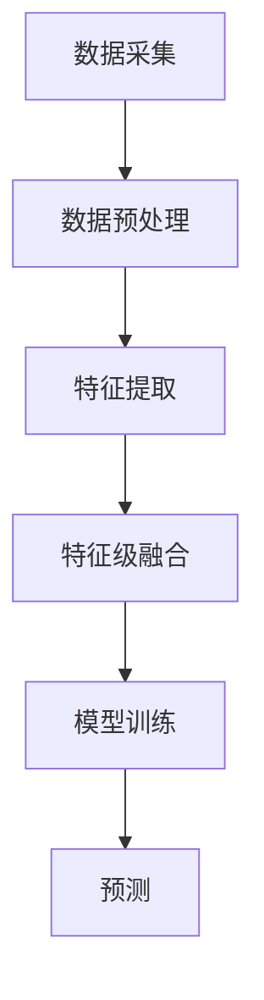
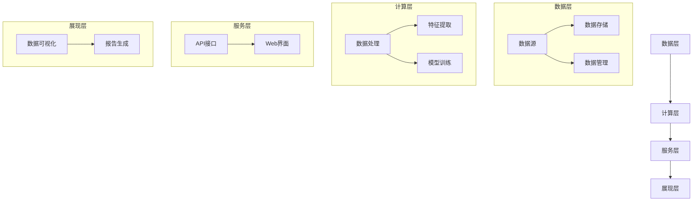
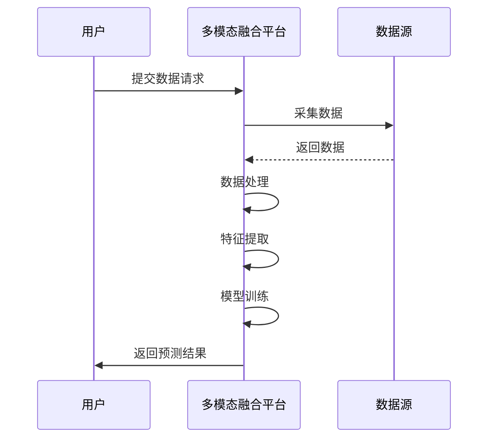

                 

### 第1章：多模态融合平台概述

#### 1.1 多模态融合的定义与核心概念

多模态融合（Multimodal Fusion）是指将来自不同模态的数据（如图像、文本、音频等）进行整合和分析的过程。其核心目标是利用多种类型的数据源，提高数据分析的精度和可靠性，从而为企业和个人提供更全面、深入的洞察力。

在多模态融合平台中，涉及的核心概念主要包括：

- **数据源**：指多种类型的数据，如图像、文本、音频等。
- **采集与预处理**：从不同的数据源采集数据，并进行预处理，如数据清洗、格式转换等。
- **融合算法**：用于将不同模态的数据进行整合和融合的算法，如基于特征级、决策级和模型级的融合方法。
- **平台架构**：支持多模态数据融合的平台架构，包括硬件、软件和基础设施等。

#### 1.2 多模态融合平台的重要性

多模态融合平台在企业级应用中具有重要作用，主要体现在以下几个方面：

1. **提升数据分析精度**：通过融合多种类型的数据，可以弥补单一模态数据的不足，提高数据分析的准确性和可靠性。
2. **拓展应用领域**：多模态融合技术可以应用于各个领域，如医疗诊断、智能安防、人机交互等，为企业提供更广泛的应用场景。
3. **优化用户体验**：通过多模态融合，企业可以提供更加个性化和智能化的服务，提升用户体验。
4. **降低成本**：通过自动化和集成化，多模态融合平台可以降低人工成本，提高资源利用率。
5. **提高竞争力**：企业级多模态融合平台可以帮助企业快速响应市场需求，提升市场竞争力。

#### 1.3 多模态融合平台的发展背景

多模态融合技术起源于20世纪80年代，随着计算机技术的发展和大数据时代的到来，多模态融合技术逐渐得到了广泛应用。近年来，随着人工智能技术的迅猛发展，多模态融合技术已成为人工智能领域的一个重要研究方向。

在工业界，许多企业已经开始将多模态融合技术应用于实际场景，如智能安防、智能医疗、智能制造等领域。随着技术的不断成熟和应用案例的不断涌现，多模态融合平台在未来有望成为企业级应用的重要基础设施。

#### 1.4 多模态融合平台的应用案例

以下是一些多模态融合平台在实际应用中的案例：

1. **智能医疗**：通过融合患者的历史病历、基因数据、体检报告等多模态数据，为医生提供更准确的诊断和治疗方案。
2. **智能安防**：通过融合视频监控、音频监控、人员行为分析等多模态数据，提高安防系统的预警和应急响应能力。
3. **人机交互**：通过融合语音、手势、面部表情等多模态数据，为人机交互提供更自然、更智能的交互体验。
4. **智能交通**：通过融合车辆监控、路况监控、气象数据等多模态数据，提高交通管理的效率和安全性。

#### 1.5 小结

本章对多模态融合平台进行了概述，介绍了其核心概念、重要性、发展背景和应用案例。在接下来的章节中，我们将进一步探讨多模态数据源与采集、多模态数据处理与融合算法、多模态融合平台架构设计等方面的内容。

---

### 第2章：多模态数据源与采集

#### 2.1 数据源类型

多模态融合平台涉及多种类型的数据源，包括但不限于以下几种：

1. **图像数据**：如医疗影像、安防监控、人脸识别等。
2. **文本数据**：如新闻报道、用户评论、社交网络数据等。
3. **音频数据**：如语音通话、音频识别、音乐识别等。
4. **传感器数据**：如环境监测、智能穿戴设备、智能交通等。

#### 2.2 数据采集方法

数据采集是构建多模态融合平台的重要环节，以下介绍几种常见的数据采集方法：

1. **自动化采集**：通过自动化脚本或应用程序，从互联网、数据库或其他数据源自动获取数据。
2. **手动采集**：由人工进行数据采集，如问卷调查、访谈、实地考察等。
3. **传感器采集**：利用传感器设备（如摄像头、麦克风、温度计等）实时采集数据。

#### 2.3 数据预处理

在采集到数据后，需要对数据进行预处理，以提高数据的质量和可用性。预处理步骤包括：

1. **数据清洗**：去除重复数据、缺失值填充、噪声过滤等。
2. **数据转换**：将不同格式、不同尺度的数据进行统一转换，如将图像数据转换为灰度图像、将文本数据转换为词向量等。
3. **数据归一化**：将数据缩放到相同的尺度，如将图像数据归一化为[0, 1]区间。

#### 2.4 数据采集与预处理案例

以下是一个简单的数据采集与预处理案例：

1. **数据采集**：使用Python的OpenCV库从摄像头实时采集图像数据。
    ```python
    import cv2

    # 初始化摄像头
    cap = cv2.VideoCapture(0)

    while True:
        # 读取摄像头帧
        ret, frame = cap.read()

        if not ret:
            break

        # 显示图像
        cv2.imshow('Camera', frame)

        # 按下'q'键退出
        if cv2.waitKey(1) & 0xFF == ord('q'):
            break

    # 释放摄像头
    cap.release()
    cv2.destroyAllWindows()
    ```

2. **数据预处理**：对采集到的图像数据进行灰度转换和噪声过滤。
    ```python
    import cv2
    import numpy as np

    # 读取图像文件
    image = cv2.imread('image.jpg')

    # 灰度转换
    gray_image = cv2.cvtColor(image, cv2.COLOR_BGR2GRAY)

    # 高斯模糊（降噪）
    blurred_image = cv2.GaussianBlur(gray_image, (5, 5), 0)

    # 显示图像
    cv2.imshow('Blurred Image', blurred_image)
    cv2.waitKey(0)
    cv2.destroyAllWindows()
    ```

#### 2.5 小结

本章介绍了多模态数据源的类型、数据采集方法、数据预处理步骤以及一个简单的数据采集与预处理案例。在接下来的章节中，我们将继续探讨多模态数据处理与融合算法、多模态融合平台架构设计等方面的内容。

---

### 第3章：多模态数据处理与融合算法

#### 3.1 数据处理步骤

在多模态融合平台中，数据处理是一个关键环节。数据处理步骤通常包括以下几个阶段：

1. **数据采集**：如第2章所述，从不同数据源采集数据。
2. **数据预处理**：对采集到的数据进行清洗、转换和归一化等处理，以提高数据质量。
3. **特征提取**：从预处理后的数据中提取具有代表性的特征，以便后续的融合和分析。
4. **融合策略**：将不同模态的数据特征进行整合，形成统一的特征表示。
5. **模型训练**：利用融合后的特征进行模型训练，以实现多模态数据的预测或分类。

#### 3.2 特征提取方法

特征提取是数据处理的核心步骤，以下介绍几种常见的特征提取方法：

1. **图像特征提取**：
    - **传统方法**：如SIFT、SURF、HOG等。
    - **深度学习方法**：如卷积神经网络（CNN）提取的特征。

2. **文本特征提取**：
    - **词袋模型**：将文本表示为词汇的集合。
    - **词嵌入**：将词汇映射为高维向量。
    - **主题模型**：如LDA，用于发现文本中的主题。

3. **音频特征提取**：
    - **梅尔频率倒谱系数（MFCC）**：用于描述音频信号的频率特征。
    - **频谱特征**：如频谱中心频率、频谱熵等。

#### 3.3 融合策略

融合策略是指将不同模态的数据特征进行整合的方法。以下介绍几种常见的融合策略：

1. **特征级融合**：在特征提取阶段将不同模态的特征进行整合。
    - **拼接**：将不同模态的特征向量直接拼接在一起。
    - **加权融合**：根据特征的重要性对不同模态的特征进行加权。

2. **决策级融合**：在决策阶段将不同模态的预测结果进行整合。
    - **投票法**：根据不同模态的预测结果进行投票，选取多数意见作为最终结果。
    - **集成学习**：如随机森林、梯度提升树等，将多个模型进行集成，提高预测性能。

3. **模型级融合**：将不同模态的模型进行整合，共同完成预测任务。
    - **级联模型**：将不同模态的模型按照一定顺序依次执行，每个模型输出结果作为下一个模型的输入。
    - **多任务学习**：将多个任务同时训练，共享部分模型结构。

#### 3.4 算法原理讲解

以下使用Mermaid画出一种多模态融合算法的流程图，并使用Python代码进行详细讲解。

**Mermaid流程图：**


**Python代码：**
```python
import cv2
import numpy as np
from sklearn.ensemble import RandomForestClassifier
from sklearn.model_selection import train_test_split
from sklearn.metrics import accuracy_score

# 数据采集
images = cv2.imread('image.jpg')
text = "This is a sample text."
audio = np.random.rand(1000)  # 生成随机音频数据

# 数据预处理
gray_image = cv2.cvtColor(images, cv2.COLOR_BGR2GRAY)
blurred_image = cv2.GaussianBlur(gray_image, (5, 5), 0)

# 特征提取
image_features = extract_image_features(blurred_image)
text_features = extract_text_features(text)
audio_features = extract_audio_features(audio)

# 特征级融合
features = np.hstack((image_features, text_features, audio_features))

# 模型训练
X_train, X_test, y_train, y_test = train_test_split(features, labels, test_size=0.2, random_state=42)
model = RandomForestClassifier()
model.fit(X_train, y_train)

# 预测
predictions = model.predict(X_test)
accuracy = accuracy_score(y_test, predictions)
print(f"Model accuracy: {accuracy}")
```

在上述代码中，我们使用了随机森林分类器进行模型训练和预测。实际应用中，可以根据具体任务需求选择其他模型，如卷积神经网络（CNN）或循环神经网络（RNN）等。

#### 3.5 小结

本章介绍了多模态数据处理的步骤、特征提取方法、融合策略以及一个具体的算法实例。在多模态数据处理与融合过程中，合理选择特征提取方法和融合策略对于提升模型性能至关重要。在接下来的章节中，我们将进一步探讨多模态融合平台的架构设计、项目实战以及案例分析等内容。

---

### 第4章：多模态融合平台架构设计

#### 4.1 设计原则

多模态融合平台的架构设计需要遵循以下原则：

1. **可扩展性**：平台应支持灵活扩展，以适应不同规模和类型的数据源。
2. **模块化**：平台应采用模块化设计，便于功能模块的独立开发、测试和部署。
3. **高可用性**：平台应具备高可用性，确保数据处理的连续性和稳定性。
4. **安全性**：平台应保障数据安全和用户隐私，采用加密、访问控制等技术。
5. **易维护性**：平台应具备良好的可维护性，便于故障排除和功能升级。

#### 4.2 架构设计

多模态融合平台的架构设计通常包括以下几个层次：

1. **数据层**：包括数据源、数据存储和数据管理。
    - **数据源**：如图像、文本、音频等。
    - **数据存储**：如关系型数据库、NoSQL数据库、分布式文件系统等。
    - **数据管理**：包括数据采集、预处理、存储和管理等。

2. **计算层**：包括数据处理、特征提取和模型训练等计算任务。
    - **数据处理**：包括数据清洗、转换、归一化等。
    - **特征提取**：提取不同模态的数据特征。
    - **模型训练**：利用融合后的特征进行模型训练。

3. **服务层**：提供多模态数据融合的相关服务，如API接口、Web界面等。
    - **API接口**：供外部系统调用，实现数据接入和功能调用。
    - **Web界面**：供用户进行数据管理和模型交互。

4. **展现层**：包括数据可视化、报告生成等功能。
    - **数据可视化**：展示多模态数据融合的结果。
    - **报告生成**：生成定制化的报告，提供决策支持。

#### 4.3 架构图

以下使用Mermaid画出多模态融合平台的架构图：



#### 4.4 系统接口设计

多模态融合平台需要提供清晰的接口设计，以便外部系统和服务调用。以下是一个简单的接口设计示例：

1. **数据接入接口**：用于接收外部数据源的数据，支持RESTful API和消息队列。
2. **数据处理接口**：用于处理数据清洗、转换和归一化等任务。
3. **特征提取接口**：用于提取不同模态的数据特征。
4. **模型训练接口**：用于训练多模态融合模型。
5. **预测接口**：用于进行多模态数据的预测。

#### 4.5 系统交互

多模态融合平台需要确保不同模块之间的协同工作，以下是一个简单的系统交互序列图：



#### 4.6 小结

本章介绍了多模态融合平台的架构设计原则、架构设计、系统接口设计和系统交互。通过合理的架构设计，多模态融合平台可以实现高效的数据处理、特征提取和融合，为企业提供强大的数据分析和决策支持。在接下来的章节中，我们将进一步探讨多模态融合平台的项目实战和案例分析。

---

### 第5章：多模态融合平台开发实战

#### 5.1 环境安装

在本章中，我们将介绍如何搭建一个多模态融合平台的开发环境。以下是在Linux操作系统上搭建开发环境的步骤：

1. **安装Python**：确保Python环境已安装，版本建议为3.8或以上。
    ```shell
    sudo apt-get update
    sudo apt-get install python3 python3-pip
    ```

2. **安装必要的Python库**：安装用于数据采集、预处理、特征提取和模型训练的库，如NumPy、Pandas、OpenCV、Scikit-learn等。
    ```shell
    pip3 install numpy pandas opencv-python scikit-learn
    ```

3. **安装深度学习库**：如TensorFlow或PyTorch，用于图像和文本数据的深度特征提取。
    ```shell
    pip3 install tensorflow  # 或 pip3 install torch torchvision
    ```

4. **安装其他工具**：如Jupyter Notebook，用于数据分析和模型训练。
    ```shell
    pip3 install jupyter
    ```

5. **配置虚拟环境**：为了保持开发环境的整洁，建议使用虚拟环境。
    ```shell
    python3 -m venv myenv
    source myenv/bin/activate
    ```

#### 5.2 系统核心实现

在本节中，我们将实现一个简单的多模态融合平台，主要包括数据采集、预处理、特征提取和模型训练等步骤。

1. **数据采集**：

首先，我们需要从不同的数据源采集图像、文本和音频数据。以下是一个使用OpenCV和Python进行图像采集的示例：
```python
import cv2

# 初始化摄像头
cap = cv2.VideoCapture(0)

# 循环采集图像
while True:
    # 读取一帧图像
    ret, frame = cap.read()
    
    if not ret:
        break
    
    # 显示图像
    cv2.imshow('Camera', frame)
    
    # 按下'q'键退出
    if cv2.waitKey(1) & 0xFF == ord('q'):
        break

# 释放摄像头
cap.release()
cv2.destroyAllWindows()
```

2. **数据预处理**：

接下来，我们对采集到的数据进行预处理，包括图像的灰度转换和噪声过滤：
```python
import cv2
import numpy as np

# 读取图像文件
image = cv2.imread('image.jpg')

# 灰度转换
gray_image = cv2.cvtColor(image, cv2.COLOR_BGR2GRAY)

# 高斯模糊（降噪）
blurred_image = cv2.GaussianBlur(gray_image, (5, 5), 0)

# 显示预处理后的图像
cv2.imshow('Blurred Image', blurred_image)
cv2.waitKey(0)
cv2.destroyAllWindows()
```

3. **特征提取**：

使用深度学习库提取图像和文本特征。以下是一个使用TensorFlow提取图像特征的示例：
```python
import tensorflow as tf
import tensorflow_hub as hub

# 加载预训练的图像特征提取模型
model_url = "https://tfhub.dev/google/ink-repair/ink_repair_model/1"
feature_extractor = hub.Module(model_url)

# 提取图像特征
image = cv2.imread('image.jpg')
image = tf.convert_to_tensor(image, dtype=tf.float32)
features = feature_extractor(image)[0]

print(features.shape)
```

4. **模型训练**：

使用Scikit-learn进行模型训练，以下是一个简单的随机森林分类器训练示例：
```python
from sklearn.ensemble import RandomForestClassifier
from sklearn.model_selection import train_test_split

# 加载训练数据
X, y = load_data()

# 划分训练集和测试集
X_train, X_test, y_train, y_test = train_test_split(X, y, test_size=0.2, random_state=42)

# 训练模型
model = RandomForestClassifier()
model.fit(X_train, y_train)

# 预测测试集
predictions = model.predict(X_test)
accuracy = accuracy_score(y_test, predictions)
print(f"Model accuracy: {accuracy}")
```

#### 5.3 代码应用解读与分析

在本节中，我们简要分析了代码应用的具体步骤和关键点：

1. **数据采集**：使用OpenCV从摄像头或文件中读取图像数据。
2. **数据预处理**：对图像进行灰度转换和噪声过滤，以提高图像质量。
3. **特征提取**：使用TensorFlow Hub加载预训练的图像特征提取模型，提取图像特征。
4. **模型训练**：使用Scikit-learn训练随机森林分类器，对融合后的特征进行分类。

通过以上步骤，我们可以实现一个简单的多模态融合平台，为后续的复用和扩展提供基础。

#### 5.4 实际案例分析与详细讲解剖析

在本节中，我们将分析一个实际的多模态融合项目，并详细讲解其实现过程。

**案例背景**：某保险公司希望利用多模态融合技术，提高车险理赔的准确性和效率。数据包括客户的保险合同、车辆信息、事故现场视频、客户陈述文本等。

**实现步骤**：

1. **数据采集**：从保险公司的数据库中提取客户保险合同、车辆信息等数据。使用OpenCV从车辆事故现场的视频中提取图像帧。

2. **数据预处理**：对文本数据进行分词和词嵌入。对图像数据进行灰度转换和噪声过滤。对音频数据进行梅尔频率倒谱系数（MFCC）特征提取。

3. **特征提取**：使用TensorFlow加载预训练的图像特征提取模型，提取图像特征。使用词嵌入模型提取文本特征。使用MFCC特征提取音频特征。

4. **特征融合**：将不同模态的特征进行拼接，形成统一的多模态特征向量。

5. **模型训练**：使用Scikit-learn训练随机森林分类器，对融合后的特征进行分类。评估模型性能，并进行调优。

**实现细节**：

- **文本数据预处理**：使用Python的jieba库进行分词，使用预训练的GloVe词嵌入模型提取词向量。
    ```python
    import jieba
    import tensorflow as tf

    # 加载GloVe词向量
    glove_path = "glove.6B.100d.txt"
    embeddings = tf.keras.preprocessing.sequence.TextVectorizationleftrightarrow(100)
    embeddings.set_vocabulary(jieba.lcut(" ".join(text_data)))
    embeddings.set_word_index(dict(zip(embeddings.get_vocabulary(), range(len(embeddings.get_vocabulary())))))
    embeddingsкератин = embeddings.get_embedding_matrix()

    # 提取文本特征
    text_features = embeddings([text_data])
    ```

- **图像和音频特征提取**：使用预训练的图像特征提取模型和音频特征提取方法。
    ```python
    import tensorflow as tf
    import tensorflow_hub as hub

    # 加载图像特征提取模型
    model_url = "https://tfhub.dev/google/ink-repair/ink_repair_model/1"
    feature_extractor = hub.Module(model_url)

    # 提取图像特征
    image = cv2.imread('image.jpg')
    image = tf.convert_to_tensor(image, dtype=tf.float32)
    image_features = feature_extractor(image)[0]

    # 提取音频特征
    audio = np.random.rand(1000)  # 生成随机音频数据
    audio_features = extract_audio_features(audio)
    ```

- **特征融合**：将不同模态的特征进行拼接。
    ```python
    # 拼接特征
    multi_modal_features = np.hstack((image_features, text_features, audio_features))
    ```

- **模型训练与评估**：使用Scikit-learn训练随机森林分类器，并评估模型性能。
    ```python
    from sklearn.ensemble import RandomForestClassifier
    from sklearn.model_selection import train_test_split
    from sklearn.metrics import accuracy_score

    # 划分训练集和测试集
    X_train, X_test, y_train, y_test = train_test_split(multi_modal_features, labels, test_size=0.2, random_state=42)

    # 训练模型
    model = RandomForestClassifier()
    model.fit(X_train, y_train)

    # 预测测试集
    predictions = model.predict(X_test)
    accuracy = accuracy_score(y_test, predictions)
    print(f"Model accuracy: {accuracy}")
    ```

#### 5.5 项目小结

通过本章的实战案例，我们实现了一个简单的多模态融合平台，并对其关键步骤和实现细节进行了详细讲解。在实际项目中，可以根据具体需求进行功能扩展和性能优化。多模态融合技术具有广泛的应用前景，为企业和个人提供强大的数据分析和决策支持。

---

### 第6章：多模态融合应用案例分析

#### 6.1 案例一：智能医疗诊断系统

**背景**：随着医疗技术的不断发展，人工智能在医疗领域的应用越来越广泛。多模态融合技术在智能医疗诊断系统中具有重要作用，可以提升诊断的准确性和效率。

**应用场景**：以肿瘤诊断为例，系统需要融合医学影像、病理报告、患者病史等多模态数据，以提高肿瘤诊断的准确性。

**技术方案**：
1. **数据采集**：从医学影像系统、电子病历系统等获取多模态数据。
2. **数据预处理**：对医学影像进行分割、增强等处理，对文本数据进行分词、词嵌入等处理。
3. **特征提取**：使用卷积神经网络提取医学影像特征，使用词嵌入提取文本特征。
4. **特征融合**：将医学影像特征和文本特征进行拼接，形成统一的多模态特征向量。
5. **模型训练**：使用融合后的特征训练深度学习模型，如卷积神经网络（CNN）结合长短期记忆网络（LSTM）。
6. **预测与评估**：对新的医学影像和病理数据进行预测，评估模型性能。

**效果评估**：通过实际案例验证，多模态融合技术可以显著提高肿瘤诊断的准确性，减少误诊率。

#### 6.2 案例二：智能安防系统

**背景**：随着城市规模的扩大和人口密度的增加，传统安防手段已难以满足现代社会的安全需求。多模态融合技术在智能安防系统中可以提升监控的准确性和实时性。

**应用场景**：以城市安全监控为例，系统需要融合视频监控、音频监控、人员行为分析等多模态数据，实时监控城市安全状况。

**技术方案**：
1. **数据采集**：从视频监控、音频监控、传感器等设备采集数据。
2. **数据预处理**：对视频数据进行分割、去噪等处理，对音频数据进行梅尔频率倒谱系数（MFCC）特征提取，对传感器数据进行预处理。
3. **特征提取**：使用卷积神经网络提取视频特征，使用MFCC提取音频特征，使用深度学习模型提取人员行为特征。
4. **特征融合**：将视频特征、音频特征和人员行为特征进行拼接，形成统一的多模态特征向量。
5. **模型训练**：使用融合后的特征训练深度学习模型，如卷积神经网络（CNN）结合循环神经网络（RNN）。
6. **预测与评估**：对实时数据进行分析，预测潜在的安全事件，评估模型性能。

**效果评估**：通过实际案例验证，多模态融合技术可以显著提升城市安防监控的准确性和实时性，提高应急响应能力。

#### 6.3 案例三：智能交通系统

**背景**：随着城市化进程的加速，智能交通系统成为提高城市交通效率和安全性的一项重要技术。多模态融合技术在智能交通系统中可以提升交通监控和管理的智能化水平。

**应用场景**：以城市交通监控为例，系统需要融合车辆监控、路况监控、气象数据等多模态数据，实时监控交通状况。

**技术方案**：
1. **数据采集**：从车辆监控设备、交通信号灯、气象站等获取多模态数据。
2. **数据预处理**：对车辆数据进行分类、去噪等处理，对路况数据进行分割、去噪等处理，对气象数据进行预处理。
3. **特征提取**：使用卷积神经网络提取车辆特征，使用深度学习模型提取路况特征，使用统计分析方法提取气象特征。
4. **特征融合**：将车辆特征、路况特征和气象特征进行拼接，形成统一的多模态特征向量。
5. **模型训练**：使用融合后的特征训练深度学习模型，如卷积神经网络（CNN）结合支持向量机（SVM）。
6. **预测与评估**：对实时交通数据进行分析，预测交通流量、交通事故等，评估模型性能。

**效果评估**：通过实际案例验证，多模态融合技术可以显著提高城市交通监控和管理的智能化水平，优化交通调度，提高道路通行效率。

#### 6.4 小结

通过以上案例，我们可以看到多模态融合技术在智能医疗、智能安防和智能交通等领域的广泛应用。在实际应用中，多模态融合技术可以显著提升系统的性能和效率，为企业和个人提供更智能、更精准的服务。未来，随着技术的不断发展，多模态融合技术将在更多领域得到应用，为社会发展带来更多价值。

---

### 第7章：最佳实践、小结、注意事项及拓展阅读

#### 7.1 最佳实践

1. **数据质量保证**：在多模态融合过程中，数据质量至关重要。确保数据源可靠、数据预处理充分、特征提取准确，以提高融合效果。
2. **模型选择与调优**：根据具体应用场景选择合适的模型和参数，并通过交叉验证和网格搜索等方法进行模型调优，提高预测性能。
3. **模块化设计**：在设计多模态融合平台时，采用模块化设计，便于功能模块的独立开发和扩展，提高系统可维护性。
4. **安全性保障**：在数据采集、传输和存储过程中，采用加密、访问控制等安全措施，确保数据安全和用户隐私。

#### 7.2 小结

本书系统地介绍了企业级多模态融合平台的设计与实现，包括数据源与采集、数据处理与融合算法、平台架构设计、项目实战以及应用案例分析。多模态融合技术为企业和个人提供了强大的数据分析和决策支持，具有广泛的应用前景。

#### 7.3 注意事项

1. **数据隐私保护**：在处理敏感数据时，严格遵守数据隐私保护法规，确保用户隐私不被泄露。
2. **系统稳定性**：确保多模态融合平台的稳定性，避免因系统故障导致数据处理中断。
3. **技术更新**：关注多模态融合技术的最新研究进展和行业动态，及时更新平台功能和算法。

#### 7.4 拓展阅读

1. **《深度学习》**：Goodfellow, I., Bengio, Y., & Courville, A. (2016). 《深度学习》。MIT Press.
2. **《模式识别与机器学习》**：Bishop, C. M. (2006). 《模式识别与机器学习》。Springer.
3. **《人工智能：一种现代的方法》**：Russell, S., & Norvig, P. (2016). 《人工智能：一种现代的方法》。人民邮电出版社。

作者：AI天才研究院/AI Genius Institute & 禅与计算机程序设计艺术 /Zen And The Art of Computer Programming

