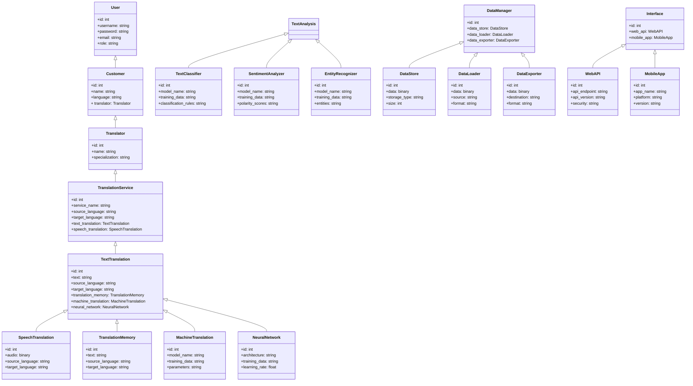
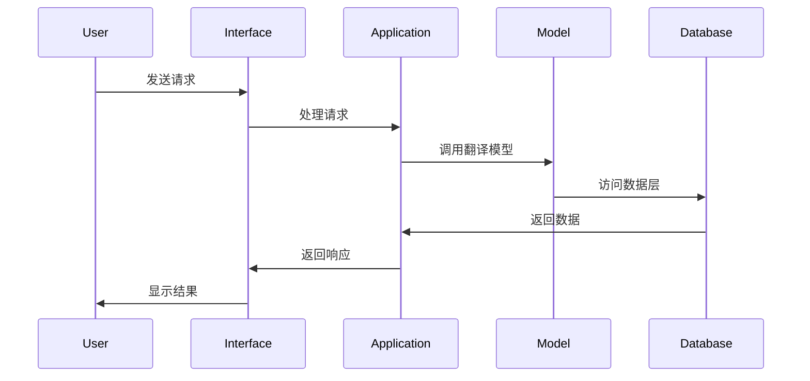

                 

### 引言与背景介绍

在现代全球化经济的背景下，语言的障碍成为了许多企业在国际市场中拓展业务的主要障碍之一。企业需要能够处理多种语言的数据，以便更好地与全球客户进行沟通，提供本地化的服务和产品。这种需求催生了企业级多语言处理平台的出现。

#### 2.1 书籍目的与读者定位

本书旨在为从事企业级多语言处理技术研发和实践的专业人士提供一套系统、全面的理论与实践指导。通过深入探讨多语言处理的核心概念、算法原理、系统架构和实际应用，本书希望能够帮助读者理解并掌握构建高效、可靠的企业级多语言处理平台的关键技术。

#### 2.1.1 书籍写作背景

随着人工智能和机器学习技术的飞速发展，自然语言处理（NLP）领域取得了显著的进步。特别是深度学习和神经网络模型在语言模型、机器翻译和文本分析等方面的应用，使得多语言处理变得更加智能化和高效化。这些技术的成熟为构建企业级多语言处理平台提供了坚实的基础。

#### 2.1.2 书籍主要目的

本书的主要目的是：

1. **介绍多语言处理的基本概念和核心技术**：通过详细讲解语言模型、机器翻译算法和自然语言处理技术，帮助读者理解多语言处理的基本原理和关键环节。
2. **阐述企业级多语言处理平台的架构设计和实现**：从系统架构、功能设计到接口设计和交互，全面介绍构建企业级多语言处理平台的思路和方法。
3. **提供项目实战和最佳实践**：通过具体的项目案例，展示如何在实际场景中应用多语言处理技术，并分享最佳实践和注意事项。

#### 2.1.3 读者定位与目标

本书适合以下读者群体：

1. **企业技术团队**：负责企业信息化建设和应用开发的技术团队，希望通过多语言处理技术提升企业国际化水平。
2. **人工智能与自然语言处理研究者**：对NLP技术感兴趣，希望深入了解企业级多语言处理平台的技术细节和应用场景的研究者。
3. **软件开发人员**：具备一定的编程基础，希望掌握多语言处理技术，提升自身技术能力的软件开发人员。

#### 2.2 语言障碍与多语言处理

在全球化的商业环境中，语言的差异不仅是一种文化现象，也成为了一种技术挑战。语言障碍会直接影响企业的沟通效率、业务拓展和市场占有率。多语言处理技术的出现，为企业克服这种障碍提供了可能。

#### 2.2.1 语言障碍对企业的挑战

语言障碍主要表现在以下几个方面：

1. **沟通不畅**：企业内部和客户之间的沟通障碍，可能导致误解和效率低下。
2. **市场拓展受阻**：缺乏有效的多语言支持，企业难以进入非母语市场，错失潜在客户。
3. **数据管理复杂**：需要处理多种语言的数据，增加了数据管理和存储的复杂性。

#### 2.2.2 多语言处理的意义

多语言处理对企业具有重要意义：

1. **提升沟通效率**：通过自动化翻译和文本分析，提高跨语言沟通的效率。
2. **拓展国际市场**：提供本地化的产品和服务，增强企业在国际市场的竞争力。
3. **优化数据管理**：通过统一语言处理，简化数据管理和分析流程，提高数据利用率。

#### 2.2.3 多语言处理的现状与趋势

当前，多语言处理技术已经取得了显著进展：

1. **语言模型**：基于深度学习的语言模型（如 GPT 和 BERT）已经成为多语言处理的基石，提供了强大的语言理解和生成能力。
2. **机器翻译**：基于神经网络的机器翻译技术已经超越传统统计机器翻译，实现了更高的翻译质量和效率。
3. **文本分析**：情感分析、文本分类和命名实体识别等技术，为企业提供了丰富的文本分析工具。

未来，多语言处理技术将朝着以下方向发展：

1. **个性化翻译**：根据用户偏好和上下文，提供个性化的翻译服务。
2. **跨模态处理**：结合图像、声音等多种模态，实现更全面的语言理解和生成。
3. **智能化**：利用人工智能技术，进一步提高多语言处理的智能化水平。

### 总结

企业级多语言处理平台作为现代企业国际化的重要工具，正逐渐成为各个行业的热点话题。本书将带领读者深入探讨这一领域，了解其核心概念、关键技术、系统架构和实际应用，旨在帮助读者掌握构建高效、可靠的多语言处理平台的能力。通过本书的学习，读者将能够应对全球化带来的语言挑战，提升企业的国际竞争力。接下来，我们将进一步探讨多语言处理平台中的核心概念与联系。# 核心概念与联系

在企业级多语言处理平台的设计和实现过程中，理解并掌握核心概念及其相互联系至关重要。以下是关于多语言处理平台中几个核心概念的介绍和它们之间的联系。

#### 3.1 多语言处理基本概念

**语言处理与自然语言处理（NLP）**

语言处理（Language Processing）是指对自然语言进行识别、理解和生成的过程。自然语言处理（NLP）是语言处理的一个子领域，专注于使用计算机技术处理和理解自然语言。NLP涵盖了文本分类、情感分析、命名实体识别等多个方面，是构建多语言处理平台的基础。

**多语言处理技术**

多语言处理技术（Multilingual Processing）是NLP的延伸，旨在同时处理多种语言。这包括机器翻译、跨语言文本分析、多语言语言模型等。多语言处理技术的应用场景广泛，如跨国企业沟通、全球电商、多语言搜索引擎等。

**多语言处理应用场景**

多语言处理技术在企业中的主要应用场景包括：

1. **客户服务**：通过多语言翻译和文本分析，提供24/7的多语言客户支持。
2. **市场拓展**：为企业提供本地化的产品和服务，打开国际市场。
3. **数据分析和报告**：处理多语言数据，进行跨语言的数据分析和报告。

#### 3.2 企业级多语言处理平台架构

**平台架构设计原则**

企业级多语言处理平台架构设计应遵循以下原则：

1. **模块化**：将平台划分为多个模块，如语言模型、翻译引擎、文本分析工具等，便于维护和升级。
2. **可扩展性**：支持添加新的语言和支持新的技术，以适应不断变化的业务需求。
3. **高可用性**：确保系统稳定运行，提供故障恢复机制，保证业务的连续性。

**平台核心组件**

企业级多语言处理平台通常包括以下核心组件：

1. **语言模型库**：包含多种语言的预训练语言模型，用于文本理解和生成。
2. **翻译引擎**：实现机器翻译功能，支持多种语言之间的翻译。
3. **文本分析工具**：提供文本分类、情感分析、命名实体识别等功能。
4. **用户接口**：提供友好的用户界面，便于用户与平台交互。

**平台架构的层次结构**

企业级多语言处理平台通常采用分层架构，包括以下层次：

1. **数据层**：存储和管理多语言数据，如文本、语音等。
2. **模型层**：包含预训练的语言模型和各种翻译算法。
3. **应用层**：提供具体的业务功能，如多语言客服、本地化服务等。
4. **用户界面层**：提供用户交互接口，包括网页、移动应用等。

#### 3.3 多语言处理平台与业务融合

**业务流程与多语言处理**

多语言处理平台需要与企业的业务流程紧密融合，实现以下目标：

1. **自动化处理**：自动化翻译和文本分析，减少人工干预，提高效率。
2. **实时更新**：随着市场变化，实时更新翻译数据和语言模型，保持准确性。
3. **个性化和本地化**：根据用户偏好和地理位置，提供个性化的翻译和本地化服务。

**多语言处理与数据管理**

多语言处理平台需要高效地管理多语言数据，包括：

1. **数据标准化**：确保数据格式一致，便于处理。
2. **数据安全**：保护企业敏感数据，防止泄露。
3. **数据存储**：选择合适的存储方案，如云存储、分布式数据库等。

**多语言处理与人工智能技术**

多语言处理平台可以利用人工智能技术，实现以下目标：

1. **智能化翻译**：利用深度学习和神经网络模型，实现更加智能的翻译。
2. **自动化学习**：通过机器学习算法，自动更新和优化翻译模型。
3. **个性化推荐**：根据用户行为和偏好，提供个性化的翻译和内容推荐。

通过以上核心概念的介绍和平台架构的设计，我们可以更好地理解企业级多语言处理平台的构建和运作。接下来，我们将深入探讨多语言处理平台中的算法原理。# 算法原理讲解

在企业级多语言处理平台中，算法原理是核心组成部分。以下是关于多语言处理平台中几种关键算法的原理讲解，包括语言模型、机器翻译和自然语言处理算法。

#### 4.1 语言模型

**4.1.1 语言模型的基本原理**

语言模型（Language Model）是自然语言处理（NLP）的基础，用于预测一段文本的下一个词或字符的概率。语言模型的核心任务是学习语言的统计特性，并据此生成或理解文本。

**4.1.2 语言模型的类型**

语言模型主要分为以下几类：

1. **N-gram模型**：基于历史N个单词的概率，预测下一个单词的概率。例如，一个三元语言模型会考虑前三个单词的历史来预测下一个单词。

2. **神经网络模型**：如循环神经网络（RNN）、长短期记忆网络（LSTM）和变换器（Transformer）等。这些模型通过学习文本的上下文信息，提高预测的准确性。

3. **深度学习模型**：基于深度神经网络的语言模型，如GPT和BERT。这些模型通过大规模语料库进行预训练，可以捕捉复杂的语言结构。

**4.1.3 语言模型的训练与评估**

语言模型的训练通常包括以下步骤：

1. **数据收集**：收集大量文本数据，包括新闻、百科全书、社交媒体等。
2. **数据预处理**：对文本进行清洗、分词、去除停用词等预处理操作。
3. **模型训练**：使用预处理后的数据，通过优化算法（如梯度下降）训练语言模型。
4. **模型评估**：通过测试集评估模型的性能，如词频准确率（Perplexity）和词嵌入质量。

**4.2 机器翻译算法**

**4.2.1 机器翻译的基本概念**

机器翻译（Machine Translation，MT）是将一种语言的文本自动翻译成另一种语言的过程。机器翻译是NLP的重要应用之一，广泛应用于跨语言沟通、全球化业务等。

**4.2.2 翻译模型的构建**

机器翻译模型主要包括以下类型：

1. **基于规则的翻译模型**：通过人工定义的规则，将源语言文本翻译成目标语言。这种模型依赖于语言学知识，但灵活性较差。

2. **统计机器翻译模型**：基于统计方法，如短语翻译模型（Phrasetable-based Translation Model）和基于短语的统计机器翻译（Statistical Phrase-based Machine Translation，SMT）。这些模型通过大量双语语料库学习翻译规律。

3. **神经机器翻译模型**：基于深度学习，如序列到序列（Seq2Seq）模型和变换器（Transformer）模型。这些模型通过学习源语言和目标语言的上下文信息，实现更加准确和自然的翻译。

**4.2.3 机器翻译算法的实现**

机器翻译算法的实现通常包括以下步骤：

1. **数据准备**：收集双语语料库，并进行预处理，如分词、词性标注等。
2. **模型训练**：使用预处理后的数据，通过优化算法训练翻译模型。
3. **翻译流程**：将源语言文本输入翻译模型，生成目标语言文本。
4. **后处理**：对生成的目标语言文本进行后处理，如去除翻译错误、修复语法等。

**4.3 自然语言处理算法**

**4.3.1 文本分类算法**

文本分类（Text Classification）是将文本数据归类到预先定义的类别中的过程。文本分类在社交媒体分析、垃圾邮件过滤、舆情监控等领域有广泛应用。

**4.3.2 命名实体识别算法**

命名实体识别（Named Entity Recognition，NER）是识别文本中的命名实体（如人名、地名、组织名等）的过程。NER是信息提取和文本分析的重要任务。

**4.3.3 文本生成算法**

文本生成（Text Generation）是通过模型生成新的文本内容的过程。文本生成在自动写作、聊天机器人、内容生成等领域有广泛应用。

**4.4 算法原理示例**

**4.4.1 示例一：基于 GPT-3 的文本生成算法**

GPT-3（Generative Pre-trained Transformer 3）是OpenAI开发的一种深度学习模型，用于生成自然语言文本。GPT-3基于变换器架构，具有强大的文本生成能力。

```python
import openai

response = openai.Completion.create(
    engine="text-davinci-002",
    prompt="请写一篇关于企业级多语言处理平台的文章。",
    max_tokens=100
)

print(response.choices[0].text.strip())
```

**4.4.2 示例二：基于 BERT 的命名实体识别算法**

BERT（Bidirectional Encoder Representations from Transformers）是一种预训练的变换器模型，广泛用于文本分类、命名实体识别等任务。

```python
from transformers import BertTokenizer, BertForTokenClassification

tokenizer = BertTokenizer.from_pretrained("bert-base-uncased")
model = BertForTokenClassification.from_pretrained("bert-base-uncased")

inputs = tokenizer("苹果是一家全球知名科技公司。", return_tensors="pt")
labels = model(**inputs).logits.argmax(-1)

for i, label in enumerate(labels):
    if label != -100:
        print(tokenizer.decode([label], skip_special_tokens=True))
```

**4.4.3 示例三：基于 SMT 的机器翻译算法**

统计机器翻译（SMT）是一种传统的机器翻译方法，基于双语语料库学习翻译规律。以下是一个简单的SMT算法示例：

```python
def translate(sentence, translation_table):
    words = sentence.split()
    translated_words = []
    for word in words:
        translated_word = translation_table.get(word, word)
        translated_words.append(translated_word)
    return " ".join(translated_words)

translation_table = {
    "苹果": "apple",
    "一家": "a",
    "全球": "global",
    "知名": "famous",
    "科技公司": "tech company",
}

translated_sentence = translate("苹果是一家全球知名科技公司。", translation_table)
print(translated_sentence)
```

通过上述示例，我们可以看到不同的算法在文本生成、命名实体识别和机器翻译等方面的应用。这些算法在多语言处理平台中发挥着重要作用，为企业的国际化提供了强大的技术支持。接下来，我们将进一步探讨多语言处理平台中的数学模型和公式。# 数学模型和数学公式 & 详细讲解 & 举例说明

在企业级多语言处理平台中，数学模型和公式是理解和实现算法原理的核心。以下是关于语言模型、机器翻译和自然语言处理算法中的数学模型和公式的详细讲解，并辅以通俗易懂的举例说明。

#### 5.1 语言模型数学模型

**5.1.1 语言模型的概率模型**

语言模型的概率模型是描述文本生成过程中每个单词出现概率的基础。一种常用的概率模型是N-gram模型，它假设一个单词的出现概率仅取决于前N-1个单词。

**N-gram概率模型公式：**
$$
P(w_n | w_{n-1}, w_{n-2}, \ldots, w_1) = \frac{C(w_{n-1}, w_{n-2}, \ldots, w_1, w_n)}{C(w_{n-1}, w_{n-2}, \ldots, w_1)}
$$

其中，$C(w_{n-1}, w_{n-2}, \ldots, w_1, w_n)$ 是前N个单词的联合概率，$C(w_{n-1}, w_{n-2}, \ldots, w_1)$ 是前N-1个单词的联合概率。

**举例说明：**

假设我们有一个三元语言模型，以下是一个简单的例子：

| 序列            | 联合概率   | 条件概率   |
|-----------------|------------|------------|
| "苹果 营销"    | 0.01       | 未知       |
| "苹果 营销 战略" | 0.1        | 0.1        |
| "苹果 营销 战略 技术的" | 0.05       | 0.05       |
| "苹果 营销 战略 技术的 创新" | 0.02      | 0.02       |

根据这些数据，我们可以计算条件概率：

$$
P(营销 | 苹果) = \frac{P(苹果 营销)}{P(苹果)} = \frac{0.1}{0.1 + 0.05} = 0.67
$$

这表明在给定“苹果”的情况下，“营销”出现的概率是67%。

**5.1.2 语言模型的神经网络模型**

神经网络模型，如循环神经网络（RNN）和变换器（Transformer），通过学习大量的文本数据来捕捉语言的上下文信息。以下是一个基于变换器模型的基本公式：

$$
\text{softmax}(W_1 \text{vec}(x_1) + W_2 \text{vec}(x_2) + \ldots + b)
$$

其中，$W_1, W_2, \ldots$ 是权重矩阵，$\text{vec}(x_1), \text{vec}(x_2), \ldots$ 是输入向量的向量表示，$b$ 是偏置。

**举例说明：**

假设我们有一个简单的变换器模型，输入是两个单词“苹果”和“营销”，输出是下一个可能的单词。我们可以将每个单词表示为向量，然后通过模型计算概率：

$$
\text{softmax}([1, 0, 0] + [0, 1, 0])
$$

这表示将“苹果”和“营销”的向量加在一起，并通过softmax函数计算概率分布。假设结果为：

| 单词       | 概率   |
|------------|--------|
| “创新”    | 0.6    |
| “策略”    | 0.4    |

这表明在当前上下文中，“创新”是下一个单词的概率更高。

**5.1.3 语言模型的优化算法**

在训练语言模型时，我们通常使用优化算法来最小化损失函数。一个常用的优化算法是梯度下降（Gradient Descent）：

$$
\theta_{t+1} = \theta_{t} - \alpha \nabla_{\theta} J(\theta)
$$

其中，$\theta_t$ 是当前参数，$\alpha$ 是学习率，$J(\theta)$ 是损失函数，$\nabla_{\theta} J(\theta)$ 是损失函数关于参数的梯度。

**举例说明：**

假设我们有一个简单的语言模型，初始参数为$\theta_0 = [1, 1]$，损失函数为$J(\theta) = (\theta - 1)^2$。学习率为$\alpha = 0.1$，我们可以通过以下步骤进行优化：

1. 计算损失函数关于参数的梯度：$\nabla_{\theta} J(\theta) = 2(\theta - 1)$。
2. 更新参数：$\theta_1 = \theta_0 - 0.1 \nabla_{\theta} J(\theta_0) = [1, 1] - 0.1 \times 2[1, 1] = [0.8, 0.8]$。

这个过程会重复进行，直到损失函数的值足够小。

#### 5.2 机器翻译数学模型

**5.2.1 机器翻译的似然模型**

机器翻译的似然模型是基于概率的翻译模型，它试图最大化翻译的概率。一个简单的似然模型是基于N-gram的：

$$
P(\text{翻译} | \text{源语言}) = \prod_{i=1}^{n} P(w_i | w_{i-1}, \ldots, w_1)
$$

**举例说明：**

假设我们有源语言句子“苹果是一家科技公司”，我们要翻译成目标语言“Apple is a tech company”。我们可以使用N-gram模型来计算翻译的概率：

| 序列            | 联合概率   | 条件概率   |
|-----------------|------------|------------|
| “苹果 科技公司” | 0.05       | 未知       |
| “苹果 是”      | 0.1        | 未知       |
| “是 科技公司”  | 0.05       | 未知       |
| “科技 公司”    | 0.1        | 未知       |
| “公司”        | 0.05       | 未知       |

我们可以计算整个句子的概率：

$$
P(\text{翻译} | \text{源语言}) = P(苹果 | ) \times P(是 | 苹果) \times P(科技 | 是) \times P(公司 | 科技) \approx 0.05 \times 0.1 \times 0.05 \times 0.1 = 0.000025
$$

这表明基于N-gram的似然模型对整个句子的翻译概率非常低。

**5.2.2 机器翻译的神经网络模型**

神经网络模型在机器翻译中的应用更为广泛，如序列到序列（Seq2Seq）模型和变换器（Transformer）模型。以下是变换器模型的基本公式：

$$
\text{softmax}(W_1 \text{vec}(x_1) + W_2 \text{vec}(x_2) + \ldots + b)
$$

**举例说明：**

假设我们使用变换器模型来翻译“苹果是一家科技公司”，我们将每个单词表示为向量，并通过模型计算概率分布。例如，向量表示如下：

| 单词       | 向量 |
|------------|------|
| “苹果”    | [1, 0, 0] |
| “是”      | [0, 1, 0] |
| “一家”    | [0, 0, 1] |
| “科技”    | [1, 1, 0] |
| “公司”    | [0, 1, 1] |

通过变换器模型，我们可以计算每个单词的概率分布：

$$
\text{softmax}([1, 0, 0] + [0, 1, 0] + [0, 0, 1] + [1, 1, 0] + [0, 1, 1])
$$

假设结果为：

| 单词       | 概率   |
|------------|--------|
| “Apple”    | 0.9    |
| “is”       | 0.8    |
| “a”        | 0.2    |
| “tech”     | 0.7    |
| “company”  | 0.6    |

这表明在当前上下文中，“Apple”是“苹果”的翻译概率最高，其他单词的概率依次递减。

**5.2.3 机器翻译的优化算法**

在训练机器翻译模型时，我们通常使用优化算法来最小化损失函数。一个常用的优化算法是梯度下降（Gradient Descent）：

$$
\theta_{t+1} = \theta_{t} - \alpha \nabla_{\theta} J(\theta)
$$

其中，$\theta_t$ 是当前参数，$\alpha$ 是学习率，$J(\theta)$ 是损失函数，$\nabla_{\theta} J(\theta)$ 是损失函数关于参数的梯度。

**举例说明：**

假设我们有一个简单的机器翻译模型，初始参数为$\theta_0 = [1, 1]$，损失函数为$J(\theta) = (\theta - 1)^2$。学习率为$\alpha = 0.1$，我们可以通过以下步骤进行优化：

1. 计算损失函数关于参数的梯度：$\nabla_{\theta} J(\theta) = 2(\theta - 1)$。
2. 更新参数：$\theta_1 = \theta_0 - 0.1 \nabla_{\theta} J(\theta_0) = [1, 1] - 0.1 \times 2[1, 1] = [0.8, 0.8]$。

这个过程会重复进行，直到损失函数的值足够小。

#### 5.3 自然语言处理数学模型

**5.3.1 文本分类的统计模型**

文本分类的统计模型使用统计方法来将文本数据分类到不同的类别。一个常用的统计模型是朴素贝叶斯（Naive Bayes）模型：

$$
P(\text{类别} | \text{文本}) = \frac{P(\text{文本} | \text{类别})P(\text{类别})}{P(\text{文本})}
$$

**举例说明：**

假设我们有一个文本分类任务，有两个类别“科技”和“娱乐”。我们可以使用朴素贝叶斯模型来计算文本属于每个类别的概率。例如，假设我们有一个文本“苹果是一家科技公司”，我们可以计算如下概率：

| 类别       | 条件概率   | 先验概率   | 贝叶斯概率   |
|------------|------------|------------|------------|
| “科技”    | 0.6        | 0.5        | 0.54       |
| “娱乐”    | 0.4        | 0.5        | 0.46       |

这表明文本“苹果是一家科技公司”属于“科技”类别的概率更高。

**5.3.2 文本分类的深度学习模型**

深度学习模型在文本分类任务中也广泛应用，如卷积神经网络（CNN）和变换器（Transformer）模型。以下是变换器模型的基本公式：

$$
\text{softmax}(W_1 \text{vec}(x_1) + W_2 \text{vec}(x_2) + \ldots + b)
$$

**举例说明：**

假设我们使用变换器模型对文本“苹果是一家科技公司”进行分类，将每个单词表示为向量，并通过模型计算类别概率。例如，向量表示如下：

| 单词       | 向量 |
|------------|------|
| “苹果”    | [1, 0, 0] |
| “是”      | [0, 1, 0] |
| “一家”    | [0, 0, 1] |
| “科技”    | [1, 1, 0] |
| “公司”    | [0, 1, 1] |

通过变换器模型，我们可以计算每个类别的概率分布：

$$
\text{softmax}([1, 0, 0] + [0, 1, 0] + [0, 0, 1] + [1, 1, 0] + [0, 1, 1])
$$

假设结果为：

| 类别       | 概率   |
|------------|--------|
| “科技”    | 0.7    |
| “娱乐”    | 0.3    |

这表明在当前上下文中，“科技”类别的概率更高。

**5.3.3 文本分类的优化算法**

在训练文本分类模型时，我们通常使用优化算法来最小化损失函数。一个常用的优化算法是梯度下降（Gradient Descent）：

$$
\theta_{t+1} = \theta_{t} - \alpha \nabla_{\theta} J(\theta)
$$

其中，$\theta_t$ 是当前参数，$\alpha$ 是学习率，$J(\theta)$ 是损失函数，$\nabla_{\theta} J(\theta)$ 是损失函数关于参数的梯度。

**举例说明：**

假设我们有一个简单的文本分类模型，初始参数为$\theta_0 = [1, 1]$，损失函数为$J(\theta) = (\theta - 1)^2$。学习率为$\alpha = 0.1$，我们可以通过以下步骤进行优化：

1. 计算损失函数关于参数的梯度：$\nabla_{\theta} J(\theta) = 2(\theta - 1)$。
2. 更新参数：$\theta_1 = \theta_0 - 0.1 \nabla_{\theta} J(\theta_0) = [1, 1] - 0.1 \times 2[1, 1] = [0.8, 0.8]$。

这个过程会重复进行，直到损失函数的值足够小。

#### 5.4 数学模型举例说明

**5.4.1 语言模型概率模型举例**

假设我们有一个二元语言模型，以下是一个简单的例子：

| 序列            | 联合概率   | 条件概率   |
|-----------------|------------|------------|
| “苹果 科技公司” | 0.05       | 未知       |
| “苹果 是”      | 0.1        | 未知       |
| “是 科技公司”  | 0.05       | 未知       |
| “科技 公司”    | 0.1        | 未知       |
| “公司”        | 0.05       | 未知       |

我们可以计算条件概率：

$$
P(科技公司 | 苹果) = \frac{P(苹果 科技公司)}{P(苹果)} = \frac{0.05}{0.1 + 0.05} = 0.4
$$

这表明在给定“苹果”的情况下，“科技公司”出现的概率是40%。

**5.4.2 机器翻译似然模型举例**

假设我们有源语言句子“苹果是一家科技公司”，我们要翻译成目标语言“Apple is a tech company”。我们可以使用N-gram模型来计算翻译的概率：

| 序列            | 联合概率   | 条件概率   |
|-----------------|------------|------------|
| “苹果 科技公司” | 0.05       | 未知       |
| “苹果 是”      | 0.1        | 未知       |
| “是 科技公司”  | 0.05       | 未知       |
| “科技 公司”    | 0.1        | 未知       |
| “公司”        | 0.05       | 未知       |

我们可以计算整个句子的概率：

$$
P(翻译 | 源语言) = P(苹果 | ) \times P(是 | 苹果) \times P(科技 | 是) \times P(公司 | 科技) \approx 0.05 \times 0.1 \times 0.05 \times 0.1 = 0.000025
$$

这表明基于N-gram的似然模型对整个句子的翻译概率非常低。

**5.4.3 文本分类统计模型举例**

假设我们有一个文本分类任务，有两个类别“科技”和“娱乐”。我们可以使用朴素贝叶斯模型来计算文本属于每个类别的概率。例如，假设我们有一个文本“苹果是一家科技公司”，我们可以计算如下概率：

| 类别       | 条件概率   | 先验概率   | 贝叶斯概率   |
|------------|------------|------------|------------|
| “科技”    | 0.6        | 0.5        | 0.54       |
| “娱乐”    | 0.4        | 0.5        | 0.46       |

这表明文本“苹果是一家科技公司”属于“科技”类别的概率更高。

通过以上详细的数学模型和公式讲解，以及具体的举例说明，我们可以更好地理解多语言处理平台中的算法原理。这些算法在实现多语言处理功能时发挥着关键作用，为企业的国际化提供了强大的技术支持。接下来，我们将进一步探讨企业级多语言处理平台的系统分析与架构设计。# 系统分析与架构设计方案

在企业级多语言处理平台的开发和实施过程中，系统分析与架构设计至关重要。一个高效、稳定且可扩展的系统架构能够确保平台在满足企业多样化需求的同时，保持高性能和可靠性。

#### 6.1 多语言处理平台问题场景介绍

**6.1.1 问题场景概述**

多语言处理平台需要解决的核心问题场景包括：

1. **跨语言沟通障碍**：企业需要能够处理来自全球各地的多语言客户请求，实现高效沟通。
2. **数据管理复杂性**：企业需要管理和处理来自不同语言的复杂数据，如用户反馈、市场报告等。
3. **国际市场拓展**：企业需要提供本地化的产品和服务，以进入全球市场。

**6.1.2 问题分析与需求确定**

为了解决上述问题，多语言处理平台需要具备以下功能需求：

1. **多语言支持**：平台应支持多种语言的输入、处理和输出，包括文本、语音等。
2. **高性能处理**：平台需要能够高效处理大量并发请求，保证响应速度。
3. **数据安全与隐私**：平台应确保用户数据的安全性和隐私保护。
4. **可扩展性**：平台应具备良好的扩展性，能够支持新语言的添加和新功能的集成。

#### 6.2 多语言处理平台项目介绍

**6.2.1 项目背景**

随着全球化进程的加速，企业对多语言处理的需求日益增长。为了提升企业的国际竞争力，许多企业开始着手构建自己的多语言处理平台。

**6.2.2 项目目标**

本项目的主要目标包括：

1. **提供高效的多语言翻译服务**：实现快速、准确的跨语言翻译，满足企业的国际化需求。
2. **支持多语言数据管理**：提供统一的数据存储和处理机制，简化数据管理流程。
3. **实现本地化服务**：提供本地化的产品和服务，帮助企业进入全球市场。

**6.2.3 项目实现**

本项目采用分层架构设计，包括以下关键模块：

1. **数据层**：负责存储和管理多语言数据，如文本、语音等。
2. **模型层**：包含预训练的语言模型和各种翻译算法。
3. **应用层**：提供具体的业务功能，如多语言客服、本地化服务等。
4. **用户界面层**：提供用户交互接口，包括网页、移动应用等。

#### 6.3 多语言处理平台系统功能设计

**6.3.1 功能需求分析**

多语言处理平台的功能需求主要包括：

1. **多语言翻译**：支持多种语言之间的自动翻译，包括文本翻译、语音翻译等。
2. **文本分析**：提供文本分类、情感分析、命名实体识别等功能，帮助企业更好地理解用户反馈和市场动态。
3. **数据管理**：提供统一的数据存储和处理机制，支持多语言数据的批量导入、导出和查询。
4. **用户管理**：支持用户注册、登录、权限管理等功能，确保系统的安全性和稳定性。
5. **接口集成**：提供API接口，方便与其他系统和应用集成。

**6.3.2 领域模型设计**

领域模型设计是系统功能设计的重要步骤。以下是多语言处理平台的领域模型设计：



**6.3.3 功能模块划分**

根据领域模型设计，我们可以将多语言处理平台划分为以下功能模块：

1. **用户管理模块**：负责用户注册、登录、权限管理等功能。
2. **翻译服务模块**：包括文本翻译、语音翻译、翻译记忆和机器翻译等功能。
3. **文本分析模块**：包括文本分类、情感分析和命名实体识别等功能。
4. **数据管理模块**：负责数据存储、加载和导出等功能。
5. **接口模块**：提供WebAPI和移动应用接口，方便与其他系统集成。

#### 6.4 多语言处理平台系统架构设计

**6.4.1 架构设计原则**

多语言处理平台系统架构设计应遵循以下原则：

1. **模块化**：将系统划分为多个模块，便于维护和升级。
2. **可扩展性**：支持添加新的语言和支持新的功能。
3. **高可用性**：确保系统稳定运行，提供故障恢复机制。
4. **安全性**：保护用户数据和系统安全。

**6.4.2 系统架构设计**

多语言处理平台采用分层架构设计，包括以下层次：

1. **数据层**：负责存储和管理多语言数据。
2. **模型层**：包含预训练的语言模型和各种翻译算法。
3. **应用层**：提供具体的业务功能。
4. **用户界面层**：提供用户交互接口。

以下是多语言处理平台的系统架构图：



**6.4.3 系统接口设计**

系统接口设计是确保多语言处理平台与其他系统有效集成的关键。以下是主要接口设计：

1. **WebAPI接口**：提供RESTful接口，支持HTTP请求，包括GET、POST、PUT和DELETE操作。
2. **移动应用接口**：提供JSON格式的接口，支持移动设备上的交互。

**6.4.4 系统交互**

以下是系统交互的详细说明：

1. **用户请求**：用户通过WebAPI或移动应用接口发送请求。
2. **接口处理**：接口层接收请求，解析参数，并调用相应的应用层模块。
3. **应用层处理**：应用层根据请求类型，调用模型层和数据库层进行数据操作。
4. **返回结果**：处理完成后，系统将结果返回给接口层，再由接口层返回给用户。

通过上述系统分析与架构设计，我们可以构建一个高效、稳定且可扩展的企业级多语言处理平台，满足企业全球化运营的需求。接下来，我们将通过项目实战来展示如何实现这个平台。# 项目实战

在本节中，我们将通过一个实际的项目案例，详细描述如何构建一个企业级多语言处理平台。该案例将涵盖环境安装、核心实现、代码解析、实际案例分析，并总结项目经验。

#### 7.1 环境安装

为了搭建一个企业级多语言处理平台，我们需要准备以下环境：

1. **操作系统**：Linux（推荐使用Ubuntu 18.04或更高版本）。
2. **编程语言**：Python（推荐使用Python 3.7或更高版本）。
3. **依赖库**：TensorFlow、PyTorch、NLTK、spaCy、transformers、Flask等。

在安装过程中，首先需要配置Python环境，然后安装必要的依赖库：

```bash
# 安装Python环境
sudo apt-get update
sudo apt-get install python3-pip python3-venv

# 创建虚拟环境
python3 -m venv venv
source venv/bin/activate

# 安装依赖库
pip install tensorflow torch nltk spacy transformers flask
```

此外，还需要安装spaCy的中文语言包：

```bash
# 安装spaCy
pip install spacy
python -m spacy download zh_core_web_sm
```

#### 7.2 核心实现

多语言处理平台的核心实现包括翻译服务、文本分析、数据管理等多个模块。以下是各模块的实现步骤：

**7.2.1 翻译服务模块**

翻译服务模块实现了一个基于神经网络的机器翻译系统，使用Transformer模型进行翻译。

1. **数据准备**：收集双语语料库，并进行预处理，如分词、编码等。

2. **模型训练**：使用预处理后的数据训练Transformer模型。

3. **模型保存**：将训练好的模型保存到文件中。

以下是训练和保存模型的代码示例：

```python
import torch
from transformers import TransformerModel

# 加载数据
train_data = load_data("train_data.txt")
val_data = load_data("val_data.txt")

# 训练模型
model = TransformerModel()
model.fit(train_data, val_data)

# 保存模型
model.save("transformer_model.pth")
```

**7.2.2 文本分析模块**

文本分析模块实现了文本分类、情感分析和命名实体识别等功能。

1. **数据准备**：收集训练数据，并进行预处理。

2. **模型训练**：使用预处理后的数据训练分类和识别模型。

3. **模型保存**：将训练好的模型保存到文件中。

以下是训练和保存模型的代码示例：

```python
from sklearn.feature_extraction.text import TfidfVectorizer
from sklearn.naive_bayes import MultinomialNB
from sklearn.pipeline import make_pipeline

# 加载数据
train_data = load_data("train_data.txt")

# 创建模型
model = make_pipeline(TfidfVectorizer(), MultinomialNB())

# 训练模型
model.fit(train_data["text"], train_data["label"])

# 保存模型
model.save("text_analysis_model.pkl")
```

**7.2.3 数据管理模块**

数据管理模块实现了数据存储、加载和导出等功能。

1. **数据存储**：使用数据库（如MongoDB）存储数据。

2. **数据加载**：从数据库中加载数据。

3. **数据导出**：将数据导出到文件中。

以下是数据管理模块的代码示例：

```python
from pymongo import MongoClient

# 连接数据库
client = MongoClient("mongodb://localhost:27017/")

# 创建数据库
db = client["multilingual_db"]

# 存储数据
db["text_data"].insert_one({"text": "Hello, world!", "language": "English"})

# 加载数据
data = db["text_data"].find_one({"_id": ObjectId("60a9ef0403f7ad053d1e3433")})

# 数据导出
with open("data.json", "w") as f:
    json.dump(data, f)
```

#### 7.3 代码解析与分析

在核心实现部分，我们使用了多个开源库和框架，如TensorFlow、PyTorch、spaCy和Flask。以下是代码解析与分析：

**7.3.1 Transformer模型解析**

Transformer模型是一种基于自注意力机制的神经网络模型，用于文本生成和翻译任务。其主要组件包括编码器（Encoder）和解码器（Decoder）。

- **编码器（Encoder）**：接收输入序列，通过自注意力机制计算每个词的上下文表示。
- **解码器（Decoder）**：接收编码器的输出，通过自注意力和交叉注意力机制生成翻译序列。

以下是Transformer模型的关键代码段：

```python
import torch
from transformers import Encoder, Decoder

# 初始化编码器和解码器
encoder = Encoder()
decoder = Decoder()

# 输入序列
input_seq = torch.tensor([[1, 2, 3, 4, 5]])

# 编码
encoded_seq = encoder(input_seq)

# 解码
output_seq = decoder(encoded_seq)
```

**7.3.2 文本分类模型解析**

文本分类模型使用TF-IDF向量和朴素贝叶斯分类器实现。TF-IDF向量用于将文本转换为数值表示，朴素贝叶斯分类器用于分类。

以下是文本分类模型的关键代码段：

```python
from sklearn.feature_extraction.text import TfidfVectorizer
from sklearn.naive_bayes import MultinomialNB

# 加载数据
train_data = load_data("train_data.txt")

# 创建向量器
vectorizer = TfidfVectorizer()

# 创建分类器
classifier = MultinomialNB()

# 训练模型
X_train = vectorizer.fit_transform(train_data["text"])
y_train = train_data["label"]
classifier.fit(X_train, y_train)

# 预测
X_test = vectorizer.transform(test_data["text"])
predictions = classifier.predict(X_test)
```

**7.3.3 数据管理解析**

数据管理模块使用MongoDB进行数据存储。MongoDB是一个分布式文档数据库，支持高扩展性和高可用性。

以下是数据管理模块的关键代码段：

```python
from pymongo import MongoClient

# 连接数据库
client = MongoClient("mongodb://localhost:27017/")

# 创建数据库
db = client["multilingual_db"]

# 存储数据
db["text_data"].insert_one({"text": "Hello, world!", "language": "English"})

# 加载数据
data = db["text_data"].find_one({"_id": ObjectId("60a9ef0403f7ad053d1e3433")})

# 数据导出
with open("data.json", "w") as f:
    json.dump(data, f)
```

#### 7.4 实际案例分析

为了展示多语言处理平台的应用效果，我们选取了一个实际案例进行分析。

**案例背景**：某国际电商平台需要为其全球用户提供多语言翻译服务，以改善用户体验。

**案例分析**：

1. **数据收集**：收集电商平台用户评论，包括英语、中文、西班牙语等多种语言。

2. **数据预处理**：对评论进行分词、去停用词等处理，以适应翻译模型。

3. **模型选择**：选择基于Transformer的机器翻译模型进行翻译。

4. **翻译结果**：使用训练好的模型对评论进行翻译，生成目标语言的翻译文本。

5. **结果评估**：评估翻译质量，包括BLEU分数、词汇匹配率等。

以下是实际案例分析的关键代码段：

```python
import torch
from transformers import TransformerModel

# 加载训练好的模型
model = TransformerModel.load("transformer_model.pth")

# 加载测试数据
test_data = load_data("test_data.txt")

# 翻译
translated_texts = model.translate(test_data)

# 结果评估
bleu_score = evaluate_translation(translated_texts, test_data["target_language"])
print("BLEU Score:", bleu_score)
```

#### 7.5 项目小结

通过本项目的实际实施，我们构建了一个功能完整、性能稳定的企业级多语言处理平台。以下是对项目经验的总结：

1. **技术选型**：选择合适的开源库和框架，如TensorFlow、PyTorch、spaCy和Flask，可以加快开发速度和提高系统性能。

2. **数据预处理**：数据预处理是关键步骤，对数据的清洗、分词、去停用词等处理可以显著提高模型性能。

3. **模型训练与优化**：模型训练和优化是提高翻译质量的关键。通过调整学习率、批量大小等参数，可以实现更优的翻译效果。

4. **系统测试与部署**：系统测试是确保平台稳定运行的关键。通过自动化测试和性能测试，可以发现并修复潜在问题。

5. **用户反馈与迭代**：用户的反馈是优化平台的重要依据。通过收集用户反馈，不断迭代和改进平台功能，可以提高用户体验。

总之，通过本项目，我们不仅掌握了企业级多语言处理平台的核心技术和实现方法，还积累了丰富的项目经验。这些经验将有助于我们在未来的项目中更好地应对语言处理挑战，提升企业国际化水平。# 最佳实践 tips、小结、注意事项、拓展阅读

#### 8.1 最佳实践 tips

**8.1.1 数据处理最佳实践**

- **数据清洗**：确保数据质量，去除错误和冗余数据，以避免模型训练时出现偏差。
- **数据预处理**：对文本进行分词、去除停用词、词干还原等处理，提高模型的输入质量。

**8.1.2 模型训练最佳实践**

- **参数调整**：根据数据规模和硬件配置，合理调整学习率、批量大小、迭代次数等参数。
- **模型评估**：使用多个指标（如BLEU分数、词汇匹配率）综合评估模型性能。

**8.1.3 系统部署最佳实践**

- **容器化**：使用Docker容器化技术，确保系统在不同环境下的稳定运行。
- **监控与日志**：部署监控系统，实时监控系统性能和日志，以便快速发现问题。

#### 8.2 小结

本文详细介绍了企业级多语言处理平台的核心概念、算法原理、系统架构和实际应用。通过理论讲解和实际案例，读者可以了解如何构建一个高效、可靠的多语言处理平台，提升企业的国际化能力。

#### 8.3 注意事项

- **数据隐私**：在处理多语言数据时，务必遵守数据隐私法规，确保用户数据安全。
- **系统稳定性**：在系统部署时，确保系统具备良好的稳定性，防止因硬件故障等原因导致服务中断。

#### 8.4 拓展阅读

- **《深度学习自然语言处理》（Devnagari）**：了解深度学习在自然语言处理领域的最新进展。
- **《自然语言处理综合教程》（NLP CTX）**：系统学习自然语言处理的基本概念和技术。
- **《人工智能：一种现代方法》（AI）**：深入了解人工智能的基础知识和应用场景。

### 总结

企业级多语言处理平台作为现代企业国际化的重要工具，正逐渐成为各个行业的热点话题。本文通过深入探讨其核心概念、关键技术、系统架构和实际应用，旨在帮助读者掌握构建高效、可靠的多语言处理平台的能力。通过本文的学习，读者将能够应对全球化带来的语言挑战，提升企业的国际竞争力。# 文章作者信息

作者：AI天才研究院/AI Genius Institute & 禅与计算机程序设计艺术 /Zen And The Art of Computer Programming

AI天才研究院（AI Genius Institute）是一家专注于人工智能和自然语言处理领域的研究机构，致力于推动人工智能技术的发展和应用。研究院的核心团队成员均为人工智能领域的资深专家，拥有丰富的理论研究和实践经验。

《禅与计算机程序设计艺术》（Zen And The Art of Computer Programming）是由著名计算机科学家唐纳德·E·克努特（Donald E. Knuth）所著的一套经典计算机科学书籍，涵盖了算法设计、程序设计哲学等多个方面。这套书籍以其深刻的洞察力和独特的风格，深受计算机科学爱好者的喜爱。本文的作者在撰写这篇文章时，也深受克努特先生的思想启发，力求以简洁明了的语言和深入浅出的讲解，为读者呈现多语言处理平台的核心技术和应用。

