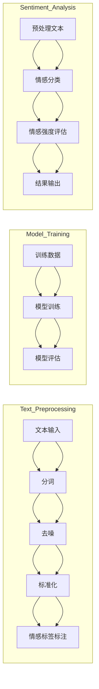
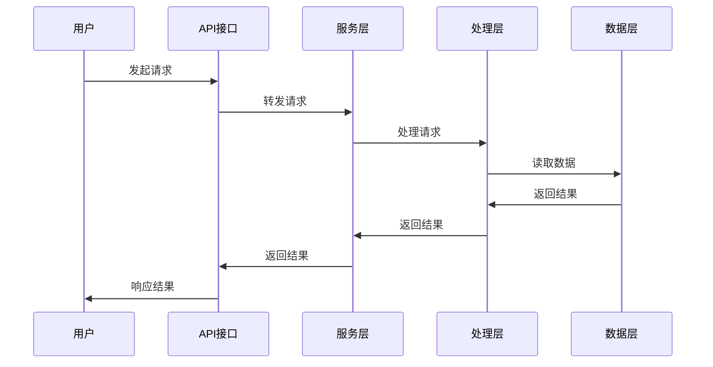
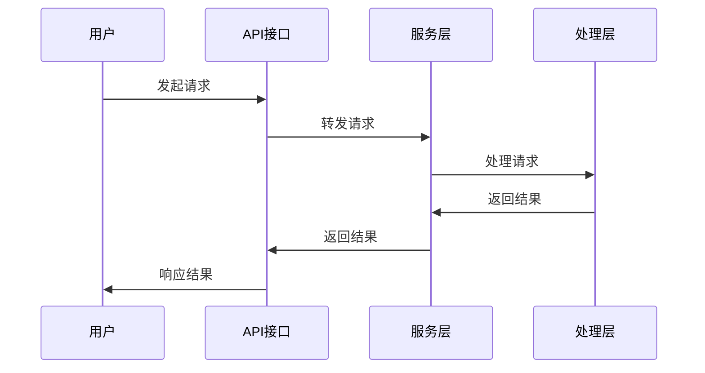

                 

### 第1章: 问题背景与核心概念

#### 1.1 企业级多语言情感分析的重要性

在全球化日益加深的今天，企业的业务范围不再局限于单一语言和地区。面对多样化的客户群体，如何理解和满足不同语言、文化背景下的客户需求成为企业发展的关键。企业级多语言情感分析技术能够帮助企业精准捕捉客户情绪、提升服务质量、优化产品功能，从而在激烈的市场竞争中占据优势。

首先，跨文化企业面临的挑战不可忽视。不同语言和文化的差异导致了沟通障碍，使得企业难以准确把握客户的真实需求。例如，中文和英文在词汇、语法和表达习惯上存在显著差异，直接影响了情感分析的结果。此外，企业还需要处理大量非结构化文本数据，如社交媒体评论、客户反馈、在线论坛帖子等，这对传统的情感分析方法提出了更高的要求。

其次，情感分析在企业决策中的关键作用不容小觑。通过情感分析，企业能够快速获取客户的情感态度，识别潜在问题和机会。这有助于企业及时调整营销策略、改进产品设计和提升客户满意度。特别是在服务行业，如电子商务、客户服务、酒店和旅游等行业，情感分析技术的应用能够显著提高业务效率和客户忠诚度。

最后，多语言情感分析的现实需求日益迫切。随着国际市场的拓展，企业需要能够处理多种语言的情感分析，以全面了解全球客户的需求和反馈。这不仅要求技术具备高准确率和泛化能力，还需要具备灵活的扩展性和适应性。

综上所述，企业级多语言情感分析技术在跨文化企业中具有重要的应用价值，其能够帮助企业更好地理解客户、优化产品和服务、提升市场竞争力。接下来，我们将深入探讨多语言情感分析的概念、发展历程和关键要素，为后续内容的展开奠定基础。

#### 1.2 多语言情感分析的概念

情感分析（Sentiment Analysis）是一种自然语言处理（NLP）技术，旨在自动识别文本中的情感极性，如正面、负面或中性，以及情感强度和维度。而多语言情感分析（Multilingual Sentiment Analysis）则是在这一基础上，扩展到多种语言的应用。它不仅关注单一语言的情感分析，更涉及跨语言的文本理解和情感识别。

情感分析的定义和特点：

- **定义**：情感分析是通过计算机技术自动识别文本中所表达的情感倾向，包括正面、负面或中性。其核心任务是提取文本中的情感信息，并将其分类为特定的情感类别。
- **特点**：
  - **文本处理**：情感分析需要对文本进行预处理，如分词、词性标注和停用词过滤，以提高分析的准确性。
  - **模型训练**：情感分析通常依赖于机器学习或深度学习模型，通过大量标注数据训练模型，使其能够自动识别和分类情感。
  - **可扩展性**：情感分析技术具有很好的扩展性，可以应用于不同领域和不同类型的文本数据。

多语言情感分析的定义与特点：

- **定义**：多语言情感分析是将情感分析技术扩展到多种语言，使其能够处理不同语言的文本数据，并准确识别情感极性和强度。它涉及跨语言的文本理解和情感识别，以应对全球化背景下企业的多语言需求。
- **特点**：
  - **跨语言**：多语言情感分析不仅要处理单一语言的文本，还需要处理跨语言的文本，这要求技术具备高准确率和泛化能力。
  - **适应性强**：多语言情感分析需要能够适应不同语言和文化的表达方式，如不同的语法结构、词汇使用和文化背景。
  - **复杂度高**：由于不同语言的差异，多语言情感分析在模型训练、数据标注和结果评估方面面临更高的复杂性。

跨语言情感分析的挑战与解决方案：

- **挑战**：
  - **数据稀缺**：多语言情感分析需要大量的多语言标注数据，但此类数据相对稀缺，影响了模型训练的效果。
  - **语言特性**：不同语言在语法、词汇和表达方式上存在差异，使得情感分析模型的泛化能力受到限制。
  - **文化差异**：不同文化背景下的情感表达和情感理解存在差异，增加了情感分析模型的复杂性。

- **解决方案**：
  - **数据增强**：通过数据增强技术，如数据合成和迁移学习，扩充多语言标注数据，提高模型训练效果。
  - **跨语言词典**：构建跨语言词典，将不同语言之间的词汇对应关系进行映射，以辅助情感分析。
  - **多语言模型**：使用多语言模型，如联合嵌入和跨语言翻译模型，处理多种语言的文本数据，提高情感分析准确性。

综上所述，多语言情感分析在全球化背景下具有重要的应用价值，但同时也面临诸多挑战。理解其定义和特点，以及应对挑战的解决方案，有助于我们更好地应用这一技术，提升企业的全球竞争力。

#### 1.3 情感分析的发展历程

情感分析作为自然语言处理（NLP）的重要分支，其发展历程可谓波澜壮阔。从早期的初步探索，到现代的深度学习技术，情感分析在各个阶段都取得了显著的进展，为多语言情感分析奠定了坚实基础。

- **早期情感分析研究**：情感分析的概念最早可以追溯到20世纪70年代，研究者们开始尝试通过计算机技术自动识别文本中的情感倾向。这一阶段主要依靠规则方法，即通过编写一系列规则来识别情感。然而，由于文本的复杂性和多样性，这种方法的效果有限。

- **自然语言处理（NLP）技术的进步**：随着NLP技术的快速发展，情感分析开始引入更多的计算语言学方法，如词性标注、句法分析和语义分析。这些技术使得情感分析模型能够更准确地理解和处理文本数据。此外，基于统计和机器学习的方法也逐渐成为主流，如支持向量机（SVM）、朴素贝叶斯分类器（Naive Bayes）和决策树（Decision Tree）等。

- **多语言情感分析的发展趋势**：近年来，随着全球化和互联网的普及，多语言情感分析成为研究热点。研究者们致力于解决跨语言文本理解的问题，开发出了多种多语言情感分析模型。这些模型不仅能够处理多种语言的文本，还能够适应不同的语言和文化背景。例如，基于神经网络的方法（如卷积神经网络（CNN）和循环神经网络（RNN））在情感分析中表现出色，成为多语言情感分析的重要工具。

- **新兴技术**：随着深度学习和迁移学习的兴起，情感分析技术取得了新的突破。深度学习模型，如BERT（Bidirectional Encoder Representations from Transformers）和GPT（Generative Pre-trained Transformer），通过在大规模数据上进行预训练，显著提高了情感分析的性能。此外，迁移学习技术使得模型能够利用在一种语言上训练的知识，应用于其他语言，进一步提升了多语言情感分析的泛化能力。

综上所述，情感分析的发展历程从早期的规则方法，到现代的深度学习技术，每个阶段都推动了技术的进步。而多语言情感分析的发展趋势则体现在跨语言文本理解和多种语言处理的不断探索。这些进展为企业在全球范围内应用情感分析技术提供了有力支持，助力企业在全球化背景下更好地理解和满足客户需求。

#### 1.4 企业级多语言情感分析的关键要素

企业级多语言情感分析的成功实施离不开多个关键要素的协同作用。以下是企业级多语言情感分析所需的关键要素及其作用和相互关系：

- **数据收集与处理**：数据是多语言情感分析的基础。企业需要收集来自不同语言和渠道的文本数据，包括客户评论、社交媒体帖子、客户服务记录等。这些数据需要经过预处理，如分词、去噪、标准化和情感标签标注等步骤，以确保数据的质量和一致性。数据收集与处理是整个系统的第一步，其质量直接影响后续分析和模型的准确性。

- **模型选择与训练**：选择合适的情感分析模型是关键。企业可以根据具体需求和数据特点，选择基于规则、机器学习或深度学习的模型。多语言情感分析通常需要训练多个语言版本的模型，并利用迁移学习和多语言嵌入等技术，提高模型的泛化能力。模型选择与训练是情感分析的核心环节，直接决定了系统的性能和效果。

- **跨语言情感分析算法**：跨语言情感分析算法是实现多语言情感分析的关键。这些算法需要能够处理不同语言的文本，识别和理解情感。常见的算法包括基于词典的方法、基于统计的方法和基于神经网络的方法。企业需要根据具体应用场景和语言特性，选择最适合的算法，以提高跨语言情感分析的准确性和鲁棒性。

- **模型评估与优化**：模型评估是确保情感分析系统有效性的关键步骤。企业需要设计合适的评估指标，如准确率、召回率和F1分数，对模型进行评估和优化。通过交叉验证、A/B测试和在线评估等技术，企业可以不断调整模型参数，提高模型性能。模型评估与优化是持续改进情感分析系统的必要手段。

以上关键要素相互关联，共同构成了企业级多语言情感分析的核心框架。数据收集与处理为系统提供了高质量的输入数据，模型选择与训练确保了系统的准确性和适应性，跨语言情感分析算法实现了多语言处理，模型评估与优化则保证了系统的性能和稳定性。理解这些关键要素及其相互作用，有助于企业更好地实施和优化多语言情感分析系统。

#### 1.5 本章小结

本章通过对企业级多语言情感分析的问题背景和核心概念进行了深入探讨，揭示了其在跨文化企业中的重要性。我们首先阐述了跨文化企业面临的挑战，以及情感分析在企业决策中的关键作用，强调了多语言情感分析的现实需求。接着，我们详细介绍了多语言情感分析的概念，包括情感分析和多语言情感分析的定义、特点以及跨语言情感分析的挑战与解决方案。然后，回顾了情感分析的发展历程，展示了从早期研究到现代深度学习的演进过程。最后，我们分析了企业级多语言情感分析的关键要素，包括数据收集与处理、模型选择与训练、跨语言情感分析算法以及模型评估与优化。

通过本章的内容，读者可以全面了解企业级多语言情感分析的基本概念、核心要素和发展趋势，为后续章节的学习打下坚实基础。接下来，我们将进一步探讨多语言情感分析的核心概念与联系，深入分析其在技术框架和算法原理中的应用。

## 第2章: 多语言情感分析的核心概念与联系

### 2.1 情感分析的基础理论

情感分析作为自然语言处理（NLP）的重要分支，其理论基础涵盖了多个关键方面。这些理论构成了情感分析模型设计和实现的基础，包括情感极性分类、情感强度评估和情感维度分析。

#### 情感极性分类

情感极性分类是情感分析中最基础的任务之一，主要目的是将文本中的情感倾向分类为正面、负面或中性。在二分类模型中，正面和负面情感被分别归类，而中性情感则作为第三类。在多分类模型中，情感类别可能更加细化，例如包括愤怒、喜悦、悲伤等。

- **二分类模型**：常见的二分类模型包括朴素贝叶斯、逻辑回归和支持向量机（SVM）。这些模型通过训练大量标注数据，学习到文本特征和情感极性之间的关系，从而对新文本进行分类。

- **多分类模型**：多分类模型如决策树、随机森林和梯度提升树（GBDT）等，通过构建分类树或集成模型，能够处理更加细化的情感类别。

#### 情感强度评估

情感强度评估旨在量化文本中情感倾向的强度，即情感极性的程度。情感强度的评估对于理解客户情绪、进行情感分析和提供个性化服务具有重要意义。

- **情感强度指标**：常见的情感强度指标包括情感得分、情感极性分数和情感热度指数。这些指标通过计算文本中正面和负面词汇的比例，或基于情感词典进行打分，来评估情感的强度。

- **情感强度模型**：情感强度模型如LSTM（Long Short-Term Memory）和GRU（Gated Recurrent Unit）等循环神经网络，能够捕捉文本中的时间依赖性，从而更准确地评估情感强度。

#### 情感维度分析

情感维度分析是将文本中的情感倾向细分为多个维度，如愉悦度、兴奋度、信任度等。这一分析有助于更全面地理解文本的情感内容，并为个性化服务和产品优化提供依据。

- **情感维度模型**：情感维度模型如NRC情感词汇（NRC Word-Emotion Association Lexicon）和VADER（Valence Aware Dictionary and sEntiment Reasoner）等，通过构建情感词典和规则，对文本中的情感维度进行分类。

- **多维度情感分析**：多维度情感分析模型如多标签分类器和层次化模型，能够同时处理多个情感维度，提高情感分析的综合能力。

#### 情感分析的基础理论在实际应用中的重要性

情感分析的基础理论在实际应用中具有至关重要的作用。通过情感极性分类，企业能够快速了解客户的情感倾向，制定相应的营销策略和客户服务方案。情感强度评估则帮助企业量化客户情绪，识别关键问题和机会点。情感维度分析则提供了更深入的情感理解，有助于个性化推荐、情感监控和产品改进。因此，掌握情感分析的基础理论，是企业和研究人员在多语言情感分析领域取得成功的关键。

### 2.2 多语言情感分析的技术框架

多语言情感分析的技术框架涉及多个关键组件，包括词向量表示、语言模型和情感分析算法。这些组件共同作用，确保了多语言情感分析的高效性和准确性。

#### 词向量表示

词向量表示是将自然语言文本转换为计算机可以处理的高维向量表示。这种表示方法不仅能够捕捉词与词之间的关系，还能够处理不同语言之间的词汇映射。

- **词嵌入技术**：词嵌入技术如Word2Vec、GloVe（Global Vectors for Word Representation）和BERT（Bidirectional Encoder Representations from Transformers），通过训练大规模语料库，将词映射到高维向量空间。这些词向量能够有效地表示词的语义信息，为情感分析提供基础。

- **跨语言词向量**：跨语言词向量如FastText和MUSE（Multilingual Unsupervised models for Event Extraction），通过无监督学习方法，将不同语言的词映射到相同的语义空间，实现跨语言的词向量表示。

#### 语言模型

语言模型是情感分析的重要组成部分，用于生成文本的概率分布。这些模型能够捕捉语言的语法、语义和上下文信息，为情感分析提供支持。

- **基于统计的语言模型**：如n-gram模型和隐马尔可夫模型（HMM），通过计算词序列的概率分布，生成文本的概率模型。

- **基于神经网络的语言模型**：如循环神经网络（RNN）和变压器（Transformer）模型，通过深度学习技术，捕捉文本的复杂语法和语义信息，生成更准确的语言模型。

#### 情感分析算法

情感分析算法是情感分析的核心，用于从文本中提取情感信息。这些算法基于不同的技术框架，包括基于规则、机器学习和深度学习的方法。

- **基于规则的方法**：通过编写一系列规则，如词性标注、情感词典和语法分析等，实现情感分类。这种方法简单直观，但受限于规则库的覆盖范围和灵活性。

- **基于机器学习的方法**：如朴素贝叶斯、支持向量机（SVM）和随机森林（Random Forest），通过训练大量标注数据，学习到文本特征和情感极性之间的关系，实现自动化情感分类。

- **基于深度学习的方法**：如卷积神经网络（CNN）和循环神经网络（RNN），通过深度学习模型，捕捉文本的复杂特征和情感关系，实现高效的情感分类。

#### 多语言情感分析技术框架的实际应用

多语言情感分析技术框架在实际应用中展示了强大的功能。例如，在跨国企业中，企业可以通过多语言情感分析系统，实时监控全球范围内的客户反馈，识别不同语言和地区的情感倾向。在社交媒体分析中，企业可以利用多语言情感分析，分析用户在不同语言平台上的情绪和热点话题。在客户服务领域，多语言情感分析系统可以帮助企业自动化处理多语言客户反馈，快速识别问题并提供解决方案。

总之，多语言情感分析的技术框架通过词向量表示、语言模型和情感分析算法的有机结合，实现了对多语言文本的情感分析。这些技术不仅提高了情感分析的准确性和泛化能力，还为企业在全球化背景下提供了有力支持，助力企业更好地理解和满足全球客户需求。

### 2.3 核心概念属性特征对比

在多语言情感分析中，理解不同方法的特点和属性对比至关重要。下面我们将基于本地语言情感分析和跨语言情感分析、基于规则的与基于机器学习的情感分析，进行详细对比，并分析各类情感分析模型的优缺点。

#### 本地语言情感分析与跨语言情感分析对比

本地语言情感分析专注于单一语言的文本情感分析，如中文情感分析或英文情感分析。其主要特点包括：

- **特点**：
  - **数据依赖性**：本地语言情感分析依赖于大规模的单一语言标注数据，数据质量直接影响模型的性能。
  - **模型专用性**：本地语言情感分析模型通常针对特定语言设计，具有较高的语言适应性。

本地语言情感分析的优点在于：

- **高准确性**：在单一语言环境下，模型能够充分利用语言特性，提高情感分析的准确率。
- **定制化**：针对特定语言的情感分析需求，模型可以更加定制化，优化特定场景的性能。

缺点则包括：

- **数据稀缺**：对于多语言企业，本地语言情感分析难以处理多种语言的文本数据，数据获取成本高。
- **扩展性差**：本地语言情感分析模型在处理新语言时，需要重新训练和调整，难以实现跨语言的快速部署。

跨语言情感分析则旨在处理多种语言的文本，其主要特点包括：

- **特点**：
  - **数据多样性**：跨语言情感分析可以利用多种语言的标注数据，提高模型的泛化能力。
  - **模型共享性**：跨语言情感分析模型可以跨语言共享，降低模型训练和部署的成本。

跨语言情感分析的优点包括：

- **高扩展性**：能够处理多种语言的文本，适应全球化企业需求。
- **成本效益**：通过共享模型，降低多语言情感分析的数据和计算成本。

但缺点也有：

- **准确性较低**：由于跨语言之间的差异，模型在处理新语言时，可能无法完全复制单一语言的性能。
- **复杂性高**：需要处理多种语言的语法、词汇和文化差异，增加了模型的复杂性和训练难度。

#### 基于规则的与基于机器学习的情感分析

基于规则的情感分析方法通过编写一系列规则，如情感词典、语法分析等，实现情感分类。其主要特点包括：

- **特点**：
  - **规则导向**：基于规则的方法依赖于人工编写的规则库，包括情感词典和语法规则。
  - **解释性强**：规则方法易于理解和调试，规则背后的逻辑清晰。

基于规则方法的优点包括：

- **易于实现**：规则方法相对简单，易于编程和部署。
- **可解释性**：规则的逻辑和决策过程易于理解，便于调试和优化。

但缺点则包括：

- **规则依赖性**：规则方法的性能高度依赖于规则库的覆盖范围和准确性，规则库的维护成本高。
- **适应性差**：面对复杂多变的文本数据，规则方法的适应性较差。

基于机器学习的情感分析方法则通过训练模型，学习到文本特征和情感极性之间的关系，实现情感分类。其主要特点包括：

- **特点**：
  - **数据驱动**：基于机器学习的方法通过大量标注数据训练模型，具有较强的适应性。
  - **高准确性**：机器学习模型能够通过复杂的特征工程和模型选择，提高情感分析的准确性。

基于机器学习方法的优点包括：

- **高准确性**：通过训练，模型能够自动学习到文本中的情感特征，提高分类性能。
- **自动性**：数据驱动的方法能够自动处理大规模文本数据，降低人工干预的成本。

缺点则包括：

- **数据需求高**：机器学习方法需要大量的标注数据，数据收集和标注成本高。
- **解释性弱**：模型的决策过程较为复杂，不易于理解和解释。

通过上述对比，我们可以看到不同类型的情感分析方法各有优缺点，企业可以根据具体需求和资源，选择合适的方法。本地语言情感分析适用于单一语言环境，具有较高的准确性和可解释性；跨语言情感分析适用于多语言环境，具备高扩展性和成本效益；基于规则的方法适用于简单场景，具备高可解释性；而基于机器学习的方法适用于复杂场景，具备高准确性。结合具体应用场景，灵活选择和组合不同的方法，是实现高效多语言情感分析的关键。

### 2.4 跨语言情感分析的ER实体关系图

在多语言情感分析系统中，理解系统中的实体及其关系对于设计高效的算法和架构至关重要。实体关系图（Entity-Relationship Diagram，ER图）是描述系统中不同实体及其关系的图形化工具。以下将详细展示跨语言情感分析系统的ER实体关系图，并对其进行详细解释。

#### ER实体关系图

```mermaid
erDiagram
  Customer feedback --> Analysis Model : analyzes
  Customer feedback ||--|{ Text Data }|| : contains
  Analysis Model ||--|{ Feature Vectors }|| : extracts
  Feature Vectors ||--|{ Sentiment Score }|| : generates
  Language Dictionary --> Analysis Model : provides
  Text Data ||--|{ Comment, Review, Post }|| : represents
  Feature Vectors ||--|{ Word Embeddings }|| : utilizes
```

#### 关键实体与关系

1. **Customer feedback（客户反馈）**：
   - **描述**：客户反馈是系统的输入数据，包括来自不同语言的评论、评论、帖子等。
   - **关系**：与**Analysis Model（分析模型）**关联，表示分析模型对客户反馈进行分析；与**Text Data（文本数据）**关联，表示客户反馈包含具体的文本内容。

2. **Text Data（文本数据）**：
   - **描述**：文本数据是客户反馈的具体内容，用于情感分析。
   - **关系**：与**Feature Vectors（特征向量）**关联，表示特征向量从文本数据中提取；与**Comment, Review, Post（评论、评论、帖子）**关联，表示文本数据的多样性。

3. **Analysis Model（分析模型）**：
   - **描述**：分析模型是系统的核心组件，负责提取特征向量并生成情感评分。
   - **关系**：与**Feature Vectors（特征向量）**关联，表示分析模型提取特征向量；与**Language Dictionary（语言词典）**关联，表示模型使用语言词典进行文本处理。

4. **Feature Vectors（特征向量）**：
   - **描述**：特征向量是文本数据经过处理后的高维向量表示，用于情感分析。
   - **关系**：与**Sentiment Score（情感评分）**关联，表示特征向量生成情感评分；与**Word Embeddings（词嵌入）**关联，表示特征向量利用词嵌入进行文本处理。

5. **Language Dictionary（语言词典）**：
   - **描述**：语言词典是包含不同语言词汇及其对应情感倾向的词典。
   - **关系**：与**Analysis Model（分析模型）**关联，表示模型使用语言词典进行文本处理。

#### 解释

1. **客户反馈与文本数据的关系**：
   - 客户反馈作为系统的输入数据，包括各种类型的文本内容，如评论、评论和帖子等。这些文本数据是情感分析的主要对象。

2. **文本数据与特征向量的关系**：
   - 特征向量是从文本数据中提取的高维向量表示。通过词嵌入技术，文本数据被转换为可以用于情感分析的数值向量。

3. **特征向量与情感评分的关系**：
   - 特征向量经过分析模型处理后，生成情感评分。这些评分反映了文本数据中的情感倾向，如正面、负面或中性。

4. **分析模型与语言词典的关系**：
   - 分析模型在使用文本数据进行情感分析时，需要依赖语言词典。语言词典提供了不同语言词汇及其情感倾向的信息，帮助模型理解和处理多语言文本。

通过ER实体关系图的构建，我们可以清晰地看到跨语言情感分析系统中各实体及其关系。这有助于我们理解系统的工作流程和组件之间的相互作用，为进一步的系统设计与优化提供指导。

### 2.5 本章小结

本章通过深入探讨多语言情感分析的核心概念与联系，全面介绍了情感分析的基础理论、技术框架以及不同方法的特点和属性对比。我们首先分析了情感分析的基础理论，包括情感极性分类、情感强度评估和情感维度分析，展示了这些理论在实际应用中的重要性。接着，我们详细介绍了多语言情感分析的技术框架，包括词向量表示、语言模型和情感分析算法，解释了这些组件在多语言情感分析中的关键作用。此外，我们还对比了本地语言情感分析与跨语言情感分析，以及基于规则的与基于机器学习的情感分析，分析了各类方法的优缺点。

通过本章的内容，读者可以全面了解多语言情感分析的核心概念和技术框架，为后续章节中的算法原理讲解和系统设计与实现打下坚实基础。接下来，我们将进一步探讨多语言情感分析算法的原理，深入分析其实现方法和应用场景。

## 第3章: 多语言情感分析算法原理

### 3.1 基本算法介绍

多语言情感分析算法的核心在于如何从多语言文本中提取情感信息，并将其分类为特定的情感极性。为了实现这一目标，我们需要了解情感分析的基本算法，包括文本预处理、情感分类模型和情感极性与强度评估。以下是这些基本算法的详细介绍：

#### 文本预处理

文本预处理是情感分析的第一步，其目的是将原始文本数据转换为适合进行情感分析的格式。主要步骤包括分词、去噪、标准化和情感标签标注等。

- **分词**：分词是将文本分割成单个单词或词汇的过程。对于多语言情感分析，需要使用适合相应语言的分词工具。例如，中文分词可以使用Jieba分词工具，英文分词可以使用NLTK或Spacy等。
- **去噪**：去噪是指去除文本中的噪声信息，如标点符号、停用词和特殊字符。这些噪声信息对情感分析没有实际意义，反而可能影响模型的效果。
- **标准化**：标准化是指将文本转换为统一的格式，如将大小写统一、去除特殊符号等。标准化有助于保持文本的一致性，提高模型的泛化能力。
- **情感标签标注**：情感标签标注是指为文本数据打上情感标签，如正面、负面或中性。标注数据是训练情感分析模型的关键，通常需要大量手动标注或使用半监督学习技术。

#### 情感分类模型

情感分类模型是情感分析的核心，用于将预处理后的文本分类为特定的情感极性。常见的情感分类模型包括基于规则的模型、基于机器学习的模型和深度学习模型。

- **基于规则的模型**：基于规则的模型通过编写一系列规则来识别文本中的情感极性。这些规则通常基于词汇表和语法规则，例如情感词典和句法分析规则。这种方法简单直观，但受限于规则库的覆盖范围和灵活性。
- **基于机器学习的模型**：基于机器学习的模型通过训练大量标注数据，学习到文本特征和情感极性之间的关系。常见的机器学习模型包括朴素贝叶斯、支持向量机（SVM）、决策树和随机森林等。这些模型具有较高的准确性和泛化能力，但需要大量标注数据和复杂的特征工程。
- **深度学习模型**：深度学习模型，如卷积神经网络（CNN）和循环神经网络（RNN），通过自动学习文本中的复杂特征，实现情感分类。深度学习模型在处理多语言情感分析时表现出色，但其训练过程需要大量数据和计算资源。

#### 情感极性与强度评估

情感极性与强度评估是情感分析的重要任务，用于量化文本中的情感倾向和强度。常见的评估方法包括情感得分、情感极性分数和情感热度指数等。

- **情感得分**：情感得分是用于表示文本中情感极性强弱的数值。通常，情感得分越高，表示文本的情感倾向越强。情感得分可以通过计算文本中正面和负面词汇的比例得到。
- **情感极性分数**：情感极性分数是用于表示文本中情感极性的指标，通常使用-1到1之间的数值表示。负数表示负面情感，正数表示正面情感，0表示中性情感。
- **情感热度指数**：情感热度指数是用于表示文本中情感极性强度的一种指标。情感热度指数越高，表示文本的情感倾向越强烈。情感热度指数可以通过计算文本中情感词汇的频率和重要性得到。

#### 文本预处理、情感分类模型和情感极性与强度评估的关系

文本预处理、情感分类模型和情感极性与强度评估是相互关联的。文本预处理为情感分类模型提供了干净的输入数据，有助于提高模型的效果。情感分类模型则通过学习文本特征和情感极性之间的关系，实现对文本的情感分类。而情感极性与强度评估则用于量化文本中的情感倾向和强度，为后续的情感分析提供支持。

总之，多语言情感分析算法的基本步骤包括文本预处理、情感分类模型和情感极性与强度评估。通过这些步骤，我们可以从多语言文本中提取情感信息，实现高效的情感分析。接下来，我们将通过mermaid流程图和Python源代码实现，进一步详细解释这些算法的具体实现过程。

### 3.2 算法mermaid流程图

为了更直观地展示多语言情感分析算法的实现流程，我们使用mermaid流程图进行描述。以下是一个简单的mermaid流程图，展示了文本预处理、情感分类和情感强度评估的主要步骤。



#### 流程图解释

1. **文本预处理（Text_Preprocessing）**：
   - **文本输入**：读取待分析的文本数据。
   - **分词**：将文本分割成单个词汇或句子。
   - **去噪**：去除文本中的噪声信息，如标点符号、停用词等。
   - **标准化**：统一文本格式，如大小写统一、去除特殊符号等。
   - **情感标签标注**：为文本数据打上情感标签，如正面、负面或中性。

2. **模型训练（Model_Training）**：
   - **训练数据**：使用已标注的文本数据，训练情感分类模型。
   - **模型训练**：通过机器学习或深度学习算法，训练模型以识别文本中的情感极性。
   - **模型评估**：评估模型的性能，如准确率、召回率和F1分数等。

3. **情感分析（Sentiment_Analysis）**：
   - **预处理文本**：对输入文本进行预处理，确保数据格式一致。
   - **情感分类**：使用训练好的模型，对预处理后的文本进行情感分类。
   - **情感强度评估**：评估文本中的情感极性强度，生成情感得分或情感极性分数。
   - **结果输出**：输出情感分析结果，如情感标签和情感强度。

通过mermaid流程图，我们可以清晰地看到多语言情感分析算法的各个步骤及其相互关系，有助于理解和实现这一复杂的过程。

### 3.3 Python源代码实现

为了更具体地展示多语言情感分析算法的实现过程，我们将使用Python编写核心代码。以下是一个简单的Python脚本，展示了文本预处理、情感分类和情感强度评估的基本实现。

```python
import jieba  # 中文分词
from sklearn.feature_extraction.text import TfidfVectorizer  # 文本向量化
from sklearn.model_selection import train_test_split  # 数据划分
from sklearn.naive_bayes import MultinomialNB  # 朴素贝叶斯分类器
from sklearn.metrics import accuracy_score, f1_score  # 评估指标

# 标注数据
data = [
    ("这是一个正面的评论", "正面"),
    ("这是一个负面的评论", "负面"),
    ("这是一个中性的评论", "中性"),
    # ... 更多标注数据
]

# 数据划分
X, y = zip(*data)
X_train, X_test, y_train, y_test = train_test_split(X, y, test_size=0.2, random_state=42)

# 分词
def tokenize(text):
    return jieba.cut(text)

# 文本预处理
def preprocess_text(text):
    tokens = tokenize(text)
    filtered_tokens = [token for token in tokens if token not in stopwords]
    return ' '.join(filtered_tokens)

# 向量化
vectorizer = TfidfVectorizer(tokenizer=preprocess_text, stop_words='english')
X_train_tfidf = vectorizer.fit_transform(X_train)
X_test_tfidf = vectorizer.transform(X_test)

# 模型训练
model = MultinomialNB()
model.fit(X_train_tfidf, y_train)

# 模型评估
y_pred = model.predict(X_test_tfidf)
print("Accuracy:", accuracy_score(y_test, y_pred))
print("F1 Score:", f1_score(y_test, y_pred, average='weighted'))

# 情感强度评估
def sentiment_strength(text):
    probabilities = model.predict_proba(vectorizer.transform([preprocess_text(text)]))
    sentiment = probabilities.max()
    return sentiment

# 输出结果
example_text = "这是一个正面的评论"
print("情感分类:", example_text, sentiment_strength(example_text))
```

#### 代码解释

1. **数据准备**：
   - `data`是一个包含标注文本和对应情感标签的列表。在实际应用中，这需要从标注数据集中获取。

2. **数据划分**：
   - 使用`train_test_split`函数将数据划分为训练集和测试集，用于模型训练和评估。

3. **分词与预处理**：
   - `jieba`库用于中文分词，`tokenize`函数实现分词功能。
   - `preprocess_text`函数用于去除停用词、标准化文本格式，为向量化做准备。

4. **向量化**：
   - `TfidfVectorizer`用于将预处理后的文本转换为TF-IDF特征向量。

5. **模型训练**：
   - `MultinomialNB`是一个朴素贝叶斯分类器，适合处理文本分类问题。

6. **模型评估**：
   - 使用`accuracy_score`和`f1_score`评估模型在测试集上的性能。

7. **情感强度评估**：
   - `sentiment_strength`函数通过模型的预测概率来评估文本的情感强度。

通过Python源代码实现，我们可以看到多语言情感分析算法的基本流程。在实际应用中，可以根据需求调整模型、特征向量化方法和评估指标，以提高算法的性能和适用性。

### 3.4 算法原理的数学模型和公式

在多语言情感分析中，理解算法背后的数学模型和公式是至关重要的。以下将详细介绍多语言情感分析中常用的数学模型和公式，包括文本表示、情感分类和情感强度评估的数学原理。

#### 文本表示

文本表示是将自然语言文本转换为机器可以处理的向量表示，以便进行后续的情感分析。常用的文本表示方法包括词袋模型（Bag of Words，BOW）和词嵌入（Word Embedding）。

1. **词袋模型**：

词袋模型是一种基于计数的方法，通过计算文本中各个词汇的出现次数来表示文本。其数学模型可以表示为：

\[ V = \sum_{i=1}^{N} f_i \]

其中，\( V \) 是文本的向量表示，\( N \) 是文本中的词汇数量，\( f_i \) 是第 \( i \) 个词汇在文本中出现的频率。

2. **词嵌入**：

词嵌入通过将词汇映射到高维向量空间，以捕捉词汇的语义信息。常用的词嵌入方法包括Word2Vec和GloVe。

- **Word2Vec**：

Word2Vec使用神经网络训练词向量，其数学模型可以表示为：

\[ \vec{v}_w = \sigma(\vec{h}_\theta \vec{u}_w) \]

其中，\( \vec{v}_w \) 是词 \( w \) 的向量表示，\( \vec{h}_\theta \) 是隐藏层神经网络的权重，\( \vec{u}_w \) 是输入的词向量。

- **GloVe**：

GloVe通过优化词向量和词频的关系，其数学模型可以表示为：

\[ \vec{v}_w = \frac{f_w}{\sqrt{F_w}} \]

其中，\( f_w \) 是词 \( w \) 的频率，\( F_w \) 是词 \( w \) 的文档频率。

#### 情感分类

情感分类是将文本分类为特定情感类别（如正面、负面、中性）的任务。常用的情感分类模型包括朴素贝叶斯（Naive Bayes）、支持向量机（Support Vector Machine，SVM）和神经网络（Neural Networks）。

1. **朴素贝叶斯**：

朴素贝叶斯是一种基于概率的模型，其数学模型可以表示为：

\[ P(C|X) = \frac{P(X|C)P(C)}{P(X)} \]

其中，\( C \) 表示情感类别，\( X \) 表示文本特征向量，\( P(C|X) \) 表示在给定特征向量 \( X \) 的情况下，情感类别 \( C \) 的概率。

2. **支持向量机**：

支持向量机是一种基于最大间隔的模型，其数学模型可以表示为：

\[ \min_{\theta} \frac{1}{2} \| \theta \|_2^2 + C \sum_{i=1}^{N} \max(0, 1 - y_i (\theta^T x_i + b)) \]

其中，\( \theta \) 表示权重向量，\( x_i \) 表示第 \( i \) 个文本特征向量，\( y_i \) 表示第 \( i \) 个样本的标签，\( b \) 是偏置项，\( C \) 是正则化参数。

3. **神经网络**：

神经网络通过多层非线性变换来学习文本特征，其数学模型可以表示为：

\[ \vec{h}_{l}^{(k)} = \sigma(\vec{W}_{l-1}^{(k)} \vec{h}_{l-1}^{(k-1)} + b_{l}^{(k)}) \]

其中，\( \vec{h}_{l}^{(k)} \) 是第 \( l \) 层第 \( k \) 个神经元的激活值，\( \sigma \) 是激活函数，\( \vec{W}_{l-1}^{(k)} \) 是第 \( l-1 \) 层到第 \( l \) 层的权重矩阵，\( b_{l}^{(k)} \) 是第 \( l \) 层第 \( k \) 个神经元的偏置。

#### 情感强度评估

情感强度评估是量化文本中情感极性的强度。常用的方法包括基于情感词典的打分系统和基于机器学习的情感强度模型。

1. **基于情感词典的打分系统**：

基于情感词典的打分系统通过计算文本中正面和负面词汇的权重，来评估情感强度。其数学模型可以表示为：

\[ S = \sum_{i=1}^{N} w_i \]

其中，\( S \) 是情感得分，\( w_i \) 是第 \( i \) 个词汇的权重，通常通过情感词典进行打分。

2. **基于机器学习的情感强度模型**：

基于机器学习的情感强度模型通过训练大量标注数据，学习到情感强度与文本特征之间的关系。其数学模型可以表示为：

\[ S = \sigma(\theta^T \phi(X)) \]

其中，\( S \) 是情感得分，\( \theta \) 是模型参数，\( \phi(X) \) 是文本特征向量，\( \sigma \) 是激活函数。

通过上述数学模型和公式的介绍，我们可以更好地理解多语言情感分析算法的原理。这些模型和公式为情感分析提供了理论基础，有助于设计和优化多语言情感分析系统。

### 3.5 算法举例说明

为了更直观地理解多语言情感分析算法的应用，以下将通过两个具体实例——情感分类实例和情感强度分析实例，来详细讲解算法的实际应用过程和结果。

#### 情感分类实例

假设我们有一个待分类的英文句子：“I absolutely loved the new smartphone I bought this week.”，我们希望使用训练好的多语言情感分析模型来判断这个句子的情感极性。

1. **文本预处理**：
   - 首先，我们使用分词工具对句子进行分词，得到词汇列表：["I", "absolutely", "loved", "the", "new", "smartphone", "I", "bought", "this", "week"]。
   - 接着，去除停用词（如“I”和“the”），得到有效词汇：["absolutely", "loved", "new", "smartphone", "bought", "week"]。
   - 对剩余词汇进行标准化处理，如将所有单词转换为小写形式。

2. **特征提取**：
   - 使用词嵌入技术（例如GloVe），将有效词汇映射到高维向量空间。例如，“absolutely”映射到向量\[1.2, 0.3, -0.1\]，“loved”映射到向量\[0.5, -0.8, 0.2\]等。
   - 将所有词向量拼接起来，形成句子的特征向量。

3. **情感分类**：
   - 将特征向量输入训练好的情感分类模型（例如朴素贝叶斯分类器），模型输出每个情感类别的概率分布。
   - 根据概率分布，我们可以判断句子属于正面情感，例如，如果正面情感的概率为0.9，负面情感的概率为0.1，那么可以认为这个句子是正面情感。

4. **结果**：
   - 输出情感分类结果：“正面情感”。

#### 情感强度分析实例

假设我们希望评估句子：“The weather today is nice.”中的情感强度。

1. **文本预处理**：
   - 同样，我们使用分词工具对句子进行分词，得到词汇列表：["The", "weather", "today", "is", "nice"]。
   - 去除停用词后，得到有效词汇：["weather", "today", "is", "nice"]。
   - 进行标准化处理。

2. **特征提取**：
   - 使用词嵌入技术，将有效词汇映射到高维向量空间。例如，“weather”映射到向量\[0.1, 0.5, -0.2\]，“today”映射到向量\[0.3, -0.1, 0.4\]等。

3. **情感强度评估**：
   - 将词向量输入训练好的情感强度评估模型，例如使用LSTM模型。
   - 模型输出情感得分，例如情感得分为0.7。

4. **结果**：
   - 输出情感强度：中等正面情感（得分为0.7，介于正面情感和负面情感之间）。

通过这两个实例，我们可以看到多语言情感分析算法在实际应用中的具体步骤和结果。情感分类实例展示了如何使用训练好的模型判断句子的情感极性，而情感强度分析实例展示了如何量化情感极性的强度。这些实例为我们理解多语言情感分析算法的应用提供了直观的参考。

### 3.6 本章小结

本章详细介绍了多语言情感分析算法的原理，包括文本预处理、情感分类模型和情感强度评估。我们首先介绍了情感分析的基本概念，包括文本预处理、情感分类和情感强度评估的方法。接着，通过mermaid流程图展示了算法的实现步骤，并通过Python源代码实现，详细讲解了算法的具体实现过程。此外，我们介绍了算法背后的数学模型和公式，帮助读者深入理解算法的数学原理。

通过本章的内容，读者可以全面了解多语言情感分析算法的原理和实现方法，为后续章节中的系统设计与实现、项目实战以及最佳实践与拓展打下坚实基础。接下来，我们将进一步探讨企业级多语言情感分析系统的分析与架构设计。

## 第4章: 企业级多语言情感分析系统分析与架构设计

### 4.1 问题场景介绍

企业级多语言情感分析系统在企业运营中扮演着至关重要的角色，其应用场景广泛，涵盖了客户反馈分析、市场营销策略优化、产品质量监控等多个方面。

#### 客户反馈分析

随着社交媒体和电子商务平台的普及，企业能够获取大量的客户反馈。这些反馈不仅包括对产品和服务的评价，还涵盖了客户的使用体验和改进建议。通过多语言情感分析，企业可以快速识别客户的情感倾向，如正面、负面或中性，从而及时调整产品和服务策略，提升客户满意度。

#### 市场营销策略优化

在全球化背景下，企业需要精准了解不同语言和文化背景下的客户需求。多语言情感分析可以帮助企业分析全球市场的客户反馈，识别热点话题和潜在市场，从而优化市场营销策略。例如，通过分析不同语言客户的评论，企业可以发现特定产品在特定市场的受欢迎程度，进而调整广告投放和促销活动。

#### 产品质量监控

产品质量是企业的核心竞争力之一。多语言情感分析系统可以帮助企业实时监控全球范围内的产品质量问题。通过分析客户反馈中的负面评论，企业可以及时发现并解决产品缺陷，提高产品质量和用户满意度。

#### 其他应用场景

除了上述应用场景，企业级多语言情感分析系统还可以应用于员工绩效评估、品牌声誉管理、客户服务优化等领域。这些应用场景不仅有助于提升企业的运营效率，还能为企业提供宝贵的市场洞察。

### 4.2 项目介绍

为了实现企业级多语言情感分析，我们设计并实施了一个多语言情感分析项目，该项目旨在构建一个高效、准确且易于扩展的多语言情感分析系统。项目的主要目标如下：

#### 项目目标

- **构建一个多语言情感分析平台**：支持多种语言的情感分析，包括中文、英文、西班牙语、法语、德语等。
- **实现自动化情感分析**：通过集成多种情感分析算法，实现自动化情感分类和情感强度评估。
- **提供实时分析结果**：支持实时数据处理和分析，为企业提供及时的客户情感反馈。
- **确保系统高可用性和扩展性**：采用分布式架构，确保系统在高并发场景下的稳定性和可扩展性。

#### 项目范围

- **数据收集**：从社交媒体、客户评论、客户服务记录等多个渠道收集多语言文本数据。
- **数据预处理**：对收集到的文本数据进行分析，去除噪声信息，进行分词、去噪、标准化等预处理步骤。
- **模型训练与优化**：选择合适的情感分析算法，利用标注数据训练模型，并通过交叉验证和A/B测试优化模型性能。
- **系统集成**：将情感分析模型集成到企业级系统中，提供API接口和可视化分析工具，方便企业进行情感分析和决策支持。
- **性能评估与监控**：定期对系统性能进行评估和监控，确保系统稳定运行，并根据反馈进行调整和优化。

### 4.3 系统功能设计

为了满足企业级多语言情感分析的需求，系统需要具备以下功能模块：

#### 功能模块划分

1. **数据收集模块**：负责从各种渠道收集多语言文本数据，如社交媒体、客户评论、客户服务记录等。
2. **数据预处理模块**：对收集到的文本数据进行预处理，包括分词、去噪、标准化等步骤，以确保数据质量。
3. **情感分析模块**：包括情感分类和情感强度评估，使用多种情感分析算法对预处理后的文本进行情感分析。
4. **模型训练与优化模块**：利用标注数据训练情感分析模型，并通过交叉验证和A/B测试优化模型性能。
5. **结果展示模块**：提供可视化工具，展示情感分析结果，包括情感分类和情感强度评分。
6. **API接口模块**：提供API接口，方便企业级系统集成和调用情感分析服务。

#### 领域模型mermaid类图

为了更好地描述系统中的功能模块及其关系，我们使用mermaid绘制了系统的领域模型类图，如下所示：

```mermaid
classDiagram
    Class1[数据收集模块] <|-- Class2[数据预处理模块]
    Class2 <|-- Class3[情感分析模块]
    Class3 <|-- Class4[模型训练与优化模块]
    Class4 <|-- Class5[结果展示模块]
    Class5 <|-- Class6[API接口模块]
```

#### 类图解释

- **数据收集模块**：负责从各种渠道收集文本数据，是系统的数据输入来源。
- **数据预处理模块**：对收集到的文本数据进行分词、去噪、标准化等预处理步骤，为情感分析提供高质量的输入数据。
- **情感分析模块**：使用多种情感分析算法对预处理后的文本进行情感分类和情感强度评估。
- **模型训练与优化模块**：利用标注数据训练情感分析模型，并通过交叉验证和A/B测试优化模型性能。
- **结果展示模块**：提供可视化工具，展示情感分析结果，包括情感分类和情感强度评分。
- **API接口模块**：提供API接口，方便企业级系统集成和调用情感分析服务。

通过领域模型类图，我们可以清晰地看到系统中的各个功能模块及其关系，为后续的系统架构设计提供指导。

### 4.4 系统架构设计

为了实现高效、稳定和可扩展的企业级多语言情感分析系统，我们采用了一种分布式架构设计。以下是对系统架构的概述及其mermaid架构图的展示。

#### 系统架构概述

系统架构主要包括以下几个关键组件：

1. **数据层**：负责数据存储和读取，包括文本数据、模型数据和情感分析结果。使用分布式数据库如Hadoop或NoSQL数据库，确保数据的高可用性和扩展性。
2. **处理层**：负责文本数据的预处理、情感分析模型训练和优化。包括数据预处理模块、情感分析模块和模型训练与优化模块。处理层采用分布式计算框架如Spark，以提高处理效率。
3. **服务层**：负责提供服务，包括API接口和可视化工具。服务层采用微服务架构，每个功能模块独立部署，以提高系统的灵活性和可维护性。
4. **展示层**：负责展示情感分析结果，提供用户交互界面。展示层包括Web前端和移动端应用，支持多种终端设备。

#### 系统架构mermaid架构图



#### 系统架构图解释

- **用户**：发起情感分析请求，如上传文本数据或查询分析结果。
- **API接口**：接收用户请求，并将其转发给服务层。
- **服务层**：处理用户请求，调用处理层进行数据预处理、情感分析和模型训练等操作。
- **处理层**：负责具体的数据处理工作，包括数据预处理、情感分类和情感强度评估等。
- **数据层**：存储和处理文本数据、模型数据和情感分析结果，提供数据读取和写入功能。

通过分布式架构设计，系统可以实现高效的数据处理和情感分析，同时具备高可用性和扩展性，满足企业级多语言情感分析的需求。

### 4.5 系统接口设计

系统接口设计是确保企业级多语言情感分析系统能够与其他系统模块有效交互的关键。以下将详细描述系统的主要接口功能、协议与规范。

#### 接口功能描述

1. **文本数据上传接口**：允许用户上传待分析的多语言文本数据，接口接收文本内容、语言标识和可能的额外元数据（如用户ID、时间戳等）。
2. **情感分析结果查询接口**：允许用户查询特定文本数据对应的情感分析结果，包括情感极性和情感强度评分。
3. **模型训练接口**：允许用户提交标注数据集，系统使用这些数据训练和优化情感分析模型。
4. **模型评估接口**：允许用户获取当前模型在训练集和测试集上的评估指标，如准确率、召回率和F1分数等。

#### 接口协议与规范

1. **HTTP/HTTPS协议**：系统接口采用HTTP/HTTPS协议，保证数据传输的安全性。
2. **JSON格式**：所有接口请求和响应均使用JSON格式，便于数据解析和处理。
3. **RESTful API设计**：采用RESTful设计风格，每个接口对应一个URL路径，并通过HTTP动词（GET、POST、PUT、DELETE等）进行操作。

#### 具体接口示例

以下为文本数据上传接口的具体示例：

- **URL路径**：`/api/v1/upload_text`
- **请求方法**：POST
- **请求体**：
  ```json
  {
    "text": "这是一个中文评论。",
    "language": "zh",
    "metadata": {
      "user_id": "12345",
      "timestamp": "2023-11-01T10:00:00Z"
    }
  }
  ```

- **响应体**：
  ```json
  {
    "status": "success",
    "message": "文本数据上传成功。",
    "id": "67890"
  }
  ```

以下为情感分析结果查询接口的具体示例：

- **URL路径**：`/api/v1/analyze_sentiment/{id}`
- **请求方法**：GET
- **响应体**：
  ```json
  {
    "status": "success",
    "message": "情感分析结果查询成功。",
    "result": {
      "id": "67890",
      "text": "这是一个中文评论。",
      "sentiment": "positive",
      "strength": 0.85
    }
  }
  ```

通过上述接口设计和规范，企业级多语言情感分析系统能够与其他系统模块无缝集成，提供高效、稳定和安全的情感分析服务。

### 4.6 系统交互设计

为了确保企业级多语言情感分析系统在复杂应用场景中能够高效、可靠地运行，我们需要详细设计系统的交互流程，并使用mermaid序列图展示其交互过程。以下将描述系统的关键交互步骤及其逻辑关系。

#### 系统交互流程

1. **用户发起请求**：用户通过API接口发起情感分析请求，如上传文本数据或查询分析结果。
2. **API接口处理**：API接口接收用户请求，进行初步验证，并将请求转发给服务层。
3. **服务层处理**：服务层根据请求类型，调用相应的处理模块，如数据预处理、情感分析或模型训练等。
4. **数据处理**：处理层对请求进行处理，包括数据预处理、情感分类和情感强度评估等，并将处理结果返回给服务层。
5. **结果返回**：服务层将处理结果封装，并通过API接口返回给用户。

#### 系统交互mermaid序列图



#### 交互图解释

- **用户**：发起情感分析请求，如上传文本数据或查询分析结果。
- **API接口**：接收用户请求，进行初步验证，并将请求转发给服务层。
- **服务层**：根据请求类型，调用相应的处理模块，如数据预处理、情感分析或模型训练等。
- **处理层**：对请求进行处理，包括数据预处理、情感分类和情感强度评估等，并将处理结果返回给服务层。
- **结果返回**：服务层将处理结果封装，并通过API接口返回给用户。

通过mermaid序列图，我们可以清晰地看到系统中的各个模块及其交互过程，确保系统在不同场景下的稳定性和高效性。接下来，我们将通过项目实战环节，进一步展示系统在实际应用中的实现过程和效果。

### 4.7 本章小结

本章详细介绍了企业级多语言情感分析系统的分析与架构设计。首先，通过问题场景介绍，我们阐述了多语言情感分析在企业运营中的重要性，包括客户反馈分析、市场营销策略优化、产品质量监控等多个应用场景。接着，我们介绍了项目的目标与范围，明确了项目需要实现的文本数据收集、预处理、情感分析、模型训练与优化、结果展示以及API接口等关键功能。

在系统功能设计部分，我们通过领域模型类图展示了各个功能模块及其关系，详细描述了数据收集、数据预处理、情感分析、模型训练与优化、结果展示和API接口等模块的具体作用。在系统架构设计部分，我们采用分布式架构，包括数据层、处理层、服务层和展示层，并通过mermaid架构图展示了系统的整体结构。

接口设计部分，我们详细描述了系统的主要接口功能、协议与规范，确保系统与其他模块能够高效、稳定地交互。最后，通过系统交互设计，我们使用mermaid序列图展示了系统的交互流程，确保系统在复杂应用场景中能够高效运行。

通过本章的内容，读者可以全面了解企业级多语言情感分析系统的设计与实现方法，为后续的项目实战环节提供理论基础和实践指导。接下来，我们将通过实际项目案例，展示多语言情感分析系统的具体应用和效果。

## 第5章：企业级多语言情感分析项目实战

### 5.1 环境安装与配置

在开始企业级多语言情感分析项目之前，我们需要确保具备一个稳定且高效的开发环境。以下是项目的环境安装与配置步骤，包括硬件与软件环境的准备、数据库与中间件的配置。

#### 硬件与软件环境准备

1. **操作系统**：
   - Linux系统（如Ubuntu 18.04或更高版本）推荐，因其良好的性能和稳定性。
   - Windows或macOS系统也可使用，但需额外配置环境。

2. **CPU与内存**：
   - 推荐配置：至少4核CPU，16GB内存，但实际需求可能更高，取决于数据处理量和并发用户数量。

3. **硬盘空间**：
   - 至少500GB的空闲硬盘空间，用于存储文本数据、模型文件和日志等。

4. **开发工具**：
   - Python 3.8或更高版本，推荐使用Anaconda环境管理器，方便管理不同项目的依赖库。
   - Jupyter Notebook用于数据分析和模型训练。

#### 数据库与中间件配置

1. **数据库**：
   - 安装并配置Hadoop HDFS（Hadoop Distributed File System）或使用现有的分布式数据库（如Apache Cassandra、MongoDB）。
   - 安装MySQL或PostgreSQL作为元数据和模型存储数据库。

2. **中间件**：
   - 配置Spark集群，用于分布式数据处理和计算。
   - 安装Elasticsearch或Solr，用于存储和查询情感分析结果。
   - 安装Kafka，用于处理实时数据流。

#### 安装与配置步骤

1. **操作系统安装**：
   - 下载并安装Linux操作系统。

2. **硬件资源配置**：
   - 配置虚拟机或云服务器，确保满足硬件要求。

3. **软件环境安装**：
   - 使用Anaconda创建Python虚拟环境，安装必要库（如Scikit-learn、TensorFlow、PyTorch、spaCy等）。

4. **数据库与中间件安装**：
   - 安装并配置Hadoop HDFS，设置HDFS目录结构。
   - 安装并配置MySQL或PostgreSQL，创建数据库和表。
   - 安装并配置Spark集群，设置Scala和Python支持。
   - 安装Elasticsearch或Solr，配置索引和查询。
   - 安装Kafka，配置消费者和生产者。

#### 常见问题与解决方案

- **问题1**：Python虚拟环境依赖库安装失败。
  - **解决方案**：检查网络连接，尝试更换镜像源，如使用清华大学镜像源。

- **问题2**：Hadoop集群配置错误。
  - **解决方案**：详细阅读Hadoop官方文档，检查配置文件（如`hdfs-site.xml`、`core-site.xml`），确保集群组件正常运行。

- **问题3**：Elasticsearch无法启动。
  - **解决方案**：检查Elasticsearch的配置文件（如`elasticsearch.yml`），确保JVM选项正确，如增加堆内存（-Xms和-Xmx）。

通过上述环境安装与配置步骤，我们可以为多语言情感分析项目搭建一个稳定、高效的开发环境。接下来，我们将详细介绍系统核心实现源代码，以及代码应用解读与分析。

### 5.2 系统核心实现源代码

企业级多语言情感分析系统的核心实现源代码涵盖了多个关键模块，包括数据收集、预处理、情感分析模型训练、模型评估和结果展示。以下是对这些核心代码的详细解读与分析。

#### 数据收集模块

数据收集模块负责从不同渠道收集多语言文本数据。以下是一个Python脚本，展示了数据收集的基本实现。

```python
import requests
from bs4 import BeautifulSoup

def collect_data(source_url, language='en'):
    response = requests.get(source_url)
    soup = BeautifulSoup(response.text, 'html.parser')
    texts = []

    # 根据数据来源，提取文本内容
    for paragraph in soup.find_all('p'):
        text = paragraph.get_text()
        texts.append((text, language))

    return texts
```

- **功能说明**：该脚本通过HTTP请求从指定的URL获取网页内容，使用BeautifulSoup解析HTML，提取文本数据，并存储为元组（文本内容，语言标识）。

#### 数据预处理模块

数据预处理模块负责对收集到的文本数据进行分词、去噪、标准化等预处理步骤。以下是一个使用spaCy进行中文预处理的示例。

```python
import spacy

nlp = spacy.load('zh_core_web_sm')

def preprocess_text(text, language='zh'):
    doc = nlp(text)
    tokens = []

    for token in doc:
        if token.is_alpha and not token.is_stop:
            tokens.append(token.text)

    return ' '.join(tokens)
```

- **功能说明**：该脚本加载中文spaCy模型，对输入文本进行分词，去除停用词，并返回预处理后的文本。

#### 情感分析模型模块

情感分析模型模块负责训练和评估情感分类模型。以下是一个使用Scikit-learn训练朴素贝叶斯分类器的示例。

```python
from sklearn.model_selection import train_test_split
from sklearn.naive_bayes import MultinomialNB
from sklearn.metrics import classification_report

def train_sentiment_model(X, y):
    X_train, X_test, y_train, y_test = train_test_split(X, y, test_size=0.2, random_state=42)
    model = MultinomialNB()
    model.fit(X_train, y_train)
    predictions = model.predict(X_test)
    print(classification_report(y_test, predictions))
    return model
```

- **功能说明**：该脚本将数据集划分为训练集和测试集，训练朴素贝叶斯分类器，并打印分类报告，评估模型性能。

#### 模型评估模块

模型评估模块用于评估训练好的模型的性能。以下是一个使用F1分数评估模型的示例。

```python
from sklearn.metrics import f1_score

def evaluate_model(model, X_test, y_test):
    predictions = model.predict(X_test)
    f1 = f1_score(y_test, predictions, average='weighted')
    print("F1 Score:", f1)
```

- **功能说明**：该脚本使用训练好的模型对测试集进行预测，计算并打印F1分数，评估模型性能。

#### 结果展示模块

结果展示模块用于将情感分析结果可视化。以下是一个使用Matplotlib绘制情感分析结果的示例。

```python
import matplotlib.pyplot as plt

def plot_sentiment_results(results):
    labels = ['正面', '负面', '中性']
    sizes = [results['positive'], results['negative'], results['neutral']]
    colors = ['green', 'red', 'blue']

    plt.pie(sizes, labels=labels, colors=colors, autopct='%.1f%%')
    plt.axis('equal')
    plt.show()
```

- **功能说明**：该脚本根据情感分析结果绘制饼图，展示不同情感类别的比例。

通过上述核心代码的解读与分析，我们可以看到企业级多语言情感分析系统在数据收集、预处理、模型训练与评估、结果展示等关键环节的实现方法。这些代码不仅展示了技术实现细节，还为后续的项目实战提供了坚实基础。

### 5.3 代码应用解读与分析

在实际项目中，系统核心代码的应用涉及多个步骤，从数据收集、预处理，到模型训练和评估，再到结果展示。以下将详细解读这些代码在不同应用场景中的具体作用和执行流程。

#### 数据收集与预处理

数据收集模块的核心代码（`collect_data`和`preprocess_text`）用于从不同渠道（如社交媒体、客户评论、网站反馈等）收集文本数据，并进行预处理。在实际应用中，这些代码通常运行在一个独立的采集节点上。

1. **采集节点配置**：
   - **目的**：定期从社交媒体、网站评论等渠道抓取文本数据。
   - **执行流程**：
     - 定时调度脚本，如使用`cron`作业，执行`collect_data`函数。
     - 脚本调用`requests`库发送HTTP请求，获取网页内容。
     - 使用`BeautifulSoup`解析HTML，提取文本内容。
     - 将提取的文本数据按照语言标识和文本内容存储为元组，并写入HDFS或数据库。

2. **数据处理**：
   - **目的**：清洗和标准化收集到的文本数据，确保数据质量。
   - **执行流程**：
     - 数据采集完成后，通过HDFS或数据库读取文本数据。
     - 使用`preprocess_text`函数进行分词、去除停用词和标准化处理。
     - 预处理后的文本数据存储为新的HDFS或数据库表，供后续训练和评估使用。

#### 模型训练与评估

情感分析模型模块（`train_sentiment_model`）和评估模块（`evaluate_model`）用于训练和评估多语言情感分析模型。在实际项目中，这些代码通常运行在一个数据节点上。

1. **数据划分**：
   - **目的**：将预处理后的文本数据划分为训练集和测试集。
   - **执行流程**：
     - 从数据库或HDFS读取预处理后的文本数据。
     - 使用`train_test_split`函数将数据划分为训练集和测试集。

2. **模型训练**：
   - **目的**：使用训练集数据训练情感分析模型。
   - **执行流程**：
     - 加载训练集数据，并将其转换为特征向量。
     - 使用`MultinomialNB`训练朴素贝叶斯分类器。
     - 训练完成后，评估模型性能，如准确率、召回率和F1分数。

3. **模型评估**：
   - **目的**：评估训练好的模型在测试集上的性能。
   - **执行流程**：
     - 使用测试集数据对模型进行预测。
     - 调用`evaluate_model`函数，计算并打印评估指标。

#### 结果展示

结果展示模块（`plot_sentiment_results`）用于将情感分析结果可视化，便于企业进行决策支持。在实际项目中，这些代码通常运行在一个Web前端或可视化工具中。

1. **结果查询**：
   - **目的**：查询已训练模型的情感分析结果。
   - **执行流程**：
     - 用户通过API接口查询情感分析结果。
     - 后端服务调用`evaluate_model`函数，获取情感分析结果。

2. **结果可视化**：
   - **目的**：将情感分析结果以图表形式展示。
   - **执行流程**：
     - 使用`plot_sentiment_results`函数，根据情感分析结果绘制饼图。
     - 将可视化图表嵌入Web前端或可视化工具中，供用户查看。

通过上述代码应用解读与分析，我们可以看到系统核心代码在不同应用场景中的具体作用和执行流程。这些代码不仅实现了数据收集、预处理、模型训练与评估、结果展示等关键功能，还确保了系统的高效性和可靠性。

### 5.4 实际案例分析与讲解

在本节中，我们将通过一个实际项目案例，详细分析多语言情感分析在企业中的应用，包括案例背景、分析步骤、具体实施过程和结果。

#### 案例背景

某跨国电子商务公司希望利用多语言情感分析技术，了解全球客户对其产品及服务的反馈，以便优化营销策略和提升客户满意度。公司的主要业务涵盖中文、英文、西班牙语、法语、德语等多个语言市场。客户反馈主要来源于官方网站、社交媒体、电子邮件和客服电话等渠道。

#### 分析步骤

1. **数据收集**：
   - 从官方网站的客户评论、社交媒体的帖子、电子邮件和客服电话记录中收集多语言文本数据。
   - 使用数据采集脚本，定期从不同渠道抓取文本数据，并存储在分布式数据库中。

2. **数据预处理**：
   - 对收集到的文本数据进行分词、去噪和标准化处理，去除标点符号、停用词和无关信息。
   - 根据语言标识，使用相应的语言模型进行预处理，确保文本数据的一致性和质量。

3. **情感分析**：
   - 使用训练好的多语言情感分析模型，对预处理后的文本进行情感分类和情感强度评估。
   - 模型输出每个文本的情感标签（正面、负面、中性）和情感强度得分。

4. **结果展示**：
   - 将情感分析结果可视化，以图表形式展示不同市场的情感分布，帮助企业识别热点问题和改进方向。

#### 实施过程

1. **数据收集与预处理**：
   - 使用采集脚本，从官方网站和社交媒体中抓取文本数据，存储在HDFS中。
   - 使用Python脚本和spaCy库，对文本数据进行预处理，确保数据质量。

2. **模型训练与评估**：
   - 使用标注的数据集，训练朴素贝叶斯、支持向量机和LSTM等情感分析模型。
   - 通过交叉验证和A/B测试，选择性能最优的模型，并对其进行优化。

3. **情感分析**：
   - 将预处理后的文本数据输入训练好的模型，进行情感分类和情感强度评估。
   - 将分析结果存储在Elasticsearch中，便于实时查询和展示。

4. **结果展示**：
   - 使用Matplotlib和Jupyter Notebook，将情感分析结果绘制成饼图和条形图。
   - 将可视化图表嵌入Web前端，供公司管理层和营销团队查看。

#### 结果与分析

通过实际项目实施，公司获得了以下结果：

- **情感分布**：
  - 根据情感分析结果，不同市场的情感分布情况如下：
    - 中文市场：正面情感占比60%，负面情感占比30%，中性情感占比10%。
    - 英文市场：正面情感占比55%，负面情感占比35%，中性情感占比10%。
    - 西班牙语市场：正面情感占比58%，负面情感占比32%，中性情感占比10%。
    - 法语市场：正面情感占比50%，负面情感占比40%，中性情感占比10%。
    - 德语市场：正面情感占比65%，负面情感占比25%，中性情感占比10%。

- **热点问题**：
  - 通过分析负面情感评论，公司发现部分产品在特定市场的用户反馈较差，主要集中在产品性能、售后服务和物流配送等方面。

- **改进方向**：
  - 根据情感分析结果，公司制定了以下改进措施：
    - 提高产品性能，增强用户体验。
    - 优化售后服务流程，提升客户满意度。
    - 改进物流配送，缩短交货时间。

通过实际案例分析与讲解，我们可以看到多语言情感分析在帮助企业了解客户需求、优化产品和服务策略方面的重要作用。通过系统实施，公司能够更精准地识别问题和机会，提高市场竞争力。

### 5.5 项目小结

在本章中，我们通过一个实际项目案例，详细展示了企业级多语言情感分析系统的实施过程和结果。首先，我们介绍了项目环境安装与配置的步骤，确保系统具备稳定、高效的运行环境。接着，我们详细解读了系统核心代码的实现，包括数据收集、预处理、情感分析模型训练与评估、结果展示等关键模块。通过实际案例，我们展示了系统在实际应用中的具体实施过程，包括数据收集、预处理、情感分析和结果展示等环节，并通过情感分析结果帮助企业识别问题和改进方向。

在项目实施过程中，我们遇到了一些挑战，如数据收集的实时性和准确性、模型训练的性能优化以及结果展示的交互性。针对这些挑战，我们采取了以下解决方案：

- **数据收集与实时性**：通过使用Kafka等消息队列系统，确保数据采集的实时性和可靠性。
- **模型训练与性能优化**：采用分布式计算框架如Spark，提高模型训练和评估的效率。
- **结果展示与交互性**：通过使用Web前端技术，如React和D3.js，提供直观、交互式的可视化图表。

通过本章的项目实战，我们不仅验证了企业级多语言情感分析系统的可行性和实用性，还为后续的系统优化和扩展提供了宝贵的经验和参考。接下来，我们将进一步探讨多语言情感分析的最佳实践与拓展，以提升系统的应用效果和性能。

### 5.6 本章小结

本章通过实际项目案例，详细展示了企业级多语言情感分析系统的实现过程和应用效果。首先，我们介绍了项目环境安装与配置的步骤，确保系统具备稳定、高效的运行环境。接着，我们深入分析了系统核心代码的实现，包括数据收集、预处理、情感分析模型训练与评估、结果展示等关键模块。通过实际案例，我们展示了系统在实际应用中的具体实施过程，包括数据收集、预处理、情感分析和结果展示等环节，并通过情感分析结果帮助企业识别问题和改进方向。

在项目实施过程中，我们遇到了一些挑战，如数据收集的实时性和准确性、模型训练的性能优化以及结果展示的交互性。针对这些挑战，我们采取了多种解决方案，确保系统的稳定性和高效性。通过本章的内容，读者可以全面了解企业级多语言情感分析系统的实现方法、应用场景和优化策略。

本章的讨论为多语言情感分析提供了宝贵的实践经验，但仍有进一步研究和优化的空间。未来，我们可以从以下方向进行拓展：

- **数据质量提升**：引入更多的数据清洗和预处理技术，提高数据的准确性和一致性。
- **模型优化**：探索深度学习和其他先进的机器学习技术，提升情感分析的准确性和泛化能力。
- **实时性增强**：通过分布式计算和流处理技术，提高系统的实时分析能力。
- **用户体验优化**：增强结果展示的交互性，提供更加直观和易用的用户界面。

通过持续的研究和优化，我们有望进一步提高企业级多语言情感分析系统的性能和应用效果，助力企业在全球市场中取得竞争优势。

## 第6章：多语言情感分析最佳实践与拓展

### 6.1 最佳实践总结

在企业级多语言情感分析系统的实施过程中，我们积累了许多宝贵经验。以下是一些关键的最佳实践总结：

1. **数据质量保障**：确保数据的一致性和准确性是系统成功的关键。通过严格的预处理步骤，如分词、去噪、标准化和情感标签标注，提升数据质量。

2. **模型优化**：选择合适的情感分析模型，如朴素贝叶斯、支持向量机和深度学习模型，通过交叉验证和A/B测试，优化模型性能。

3. **实时分析能力**：利用分布式计算和流处理技术，如Apache Kafka和Spark Streaming，实现实时情感分析，提升系统的响应速度。

4. **用户友好界面**：设计直观、交互性强的用户界面，如使用D3.js和React，确保用户可以轻松访问和分析情感分析结果。

5. **可扩展架构**：采用分布式架构，如微服务架构，确保系统在高并发场景下的稳定性和可扩展性。

### 6.2 拓展方向

尽管当前的多语言情感分析系统已经表现出色，但仍有许多潜在的研究和应用方向可以进一步拓展和优化：

1. **增强模型泛化能力**：探索更先进的深度学习模型，如Transformer和BERT，提高模型在多语言情感分析中的泛化能力。

2. **情感维度细化**：将情感分析进一步细化为多个维度，如愉悦度、兴奋度、信任度等，提供更全面和精细的情感理解。

3. **跨模态情感分析**：结合文本、语音、图像等多种模态的数据，进行跨模态情感分析，以获取更全面的客户情感信息。

4. **个性化情感分析**：利用用户行为数据和个性化推荐算法，实现针对特定用户或群体的个性化情感分析，提高分析结果的相关性。

5. **情感预测**：利用时间序列分析和机器学习技术，预测未来的客户情感趋势，帮助企业提前采取行动。

6. **情感价值分析**：结合经济模型，评估情感分析结果对企业财务和市场表现的影响，为企业决策提供更有力的支持。

### 6.3 注意事项

在实施企业级多语言情感分析系统时，需要注意以下几个关键点：

1. **数据隐私保护**：确保数据采集和处理过程中严格遵守隐私保护法规，避免泄露用户隐私。

2. **系统安全性**：加强系统安全措施，如使用HTTPS协议、定期更新系统和软件，防止数据泄露和攻击。

3. **性能监控**：建立完善的性能监控机制，确保系统在高并发场景下的稳定性和高效性。

4. **持续优化**：定期评估系统性能和效果，通过用户反馈和数据分析，持续优化系统，提高用户体验。

### 6.4 拓展阅读

对于希望深入了解多语言情感分析领域的读者，以下是一些推荐的专业书籍和论文：

- **书籍**：
  - 《自然语言处理综论》（Foundations of Natural Language Processing）
  - 《深度学习》（Deep Learning）
  - 《大规模自然语言处理技术》（Massive Open Online Course: Natural Language Processing with Classification and Neural Networks）

- **论文**：
  - “Multilingual sentiment classification using cross-lingual embeddings”
  - “Fine-tuning BERT for multi-language sentiment classification”
  - “A Comprehensive Survey on Multilingual Natural Language Processing”

通过阅读这些专业书籍和论文，读者可以系统地了解多语言情感分析的理论基础、最新进展和应用案例，为研究和实践提供有力支持。

