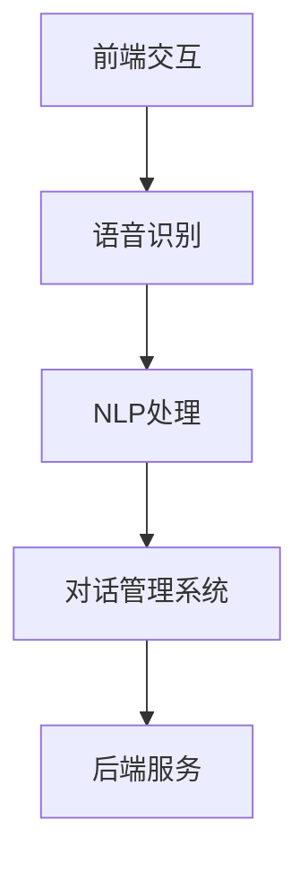
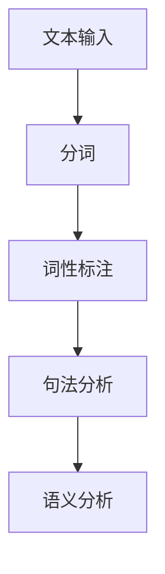
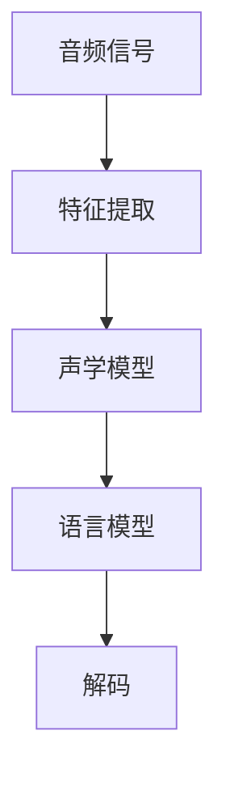
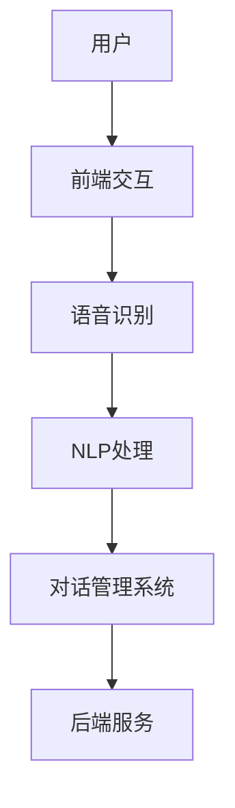
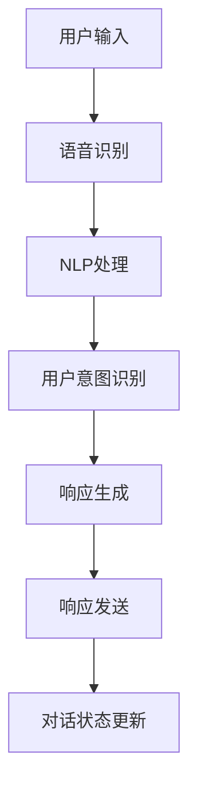

                 

# 《企业级对话式AI：增强客户服务与内部沟通》

## 关键词

- 对话式AI
- 客户服务
- 内部沟通
- 技术原理
- 系统架构
- 实施策略

## 摘要

本文深入探讨企业级对话式AI在提升客户服务与内部沟通方面的应用。通过对对话式AI的核心概念、技术原理、系统架构、实施策略以及最佳实践的分析，我们旨在为读者提供全面、详尽的技术指南。文章结构清晰，从背景介绍到具体案例，再到未来展望，逐步引导读者理解对话式AI的实际应用价值。

## 目录

----------------------------------------------------------------

# 《企业级对话式AI：增强客户服务与内部沟通》

> 关键词：对话式AI、客户服务、内部沟通、技术原理、系统架构、实施策略

> 摘要：本文深入探讨企业级对话式AI在提升客户服务与内部沟通方面的应用，从核心概念到具体案例，提供全面的技术指南。

----------------------------------------------------------------

## 第一部分：引言

### 1.1 对话式AI概述

#### 1.1.1 对话式AI的定义与特点

对话式AI是一种基于自然语言处理（NLP）和机器学习技术的智能交互系统，能够理解、解释和生成自然语言，以实现人与机器的对话交互。其特点包括自然性、智能性、灵活性、自动化和个性化。

#### 1.1.2 对话式AI的应用背景

对话式AI最早应用于个人助理（如Siri、Alexa），随后逐渐扩展到客户服务、内部沟通、智能家居、医疗咨询等领域。在企业环境中，对话式AI被视为提升效率和用户体验的关键技术。

#### 1.1.3 书籍结构

本文将首先介绍对话式AI的核心概念和技术原理，然后探讨其在客户服务和内部沟通中的应用，最后通过案例研究和最佳实践总结，为读者提供实际操作的指导。

----------------------------------------------------------------

### 1.2 对话式AI的核心概念

#### 1.2.1 自然语言处理（NLP）

NLP是使计算机能够理解、解释和生成自然语言的技术。它包括文本分类、情感分析、命名实体识别、句法分析等子领域。

#### 1.2.2 语音识别

语音识别是将语音信号转换为文本的技术。它通过识别语音中的声学特征，将其映射到对应的文字。

#### 1.2.3 语言模型

语言模型是一种概率模型，用于预测文本中下一个词的可能性。在对话式AI中，语言模型用于生成自然语言响应。

#### 1.2.4 对话管理系统

对话管理系统（DM）是控制对话流程的核心组件，它负责理解用户意图、生成响应、维护对话状态等。

#### 1.2.5 实体识别

实体识别是从文本中识别出特定类型的信息，如人名、地点、组织等。

### 1.2.6 对话式AI的架构

对话式AI的架构通常包括前端交互、语音识别、NLP处理、对话管理系统和后端服务。以下是一个简化的架构图：



#### 1.2.7 联系与区别

NLP、语音识别、语言模型和对话管理系统是构建对话式AI的核心组件，它们共同协作，实现人与机器的自然对话。NLP负责理解和生成文本，语音识别负责语音到文本的转换，语言模型预测文本的下一个词，而对话管理系统则负责对话的整体流程控制。

----------------------------------------------------------------

### 1.3 对话式AI的技术原理

#### 1.3.1 自然语言处理原理

自然语言处理涉及多种技术，如词性标注、句法分析、语义分析等。以下是一个简化的NLP流程：



- 分词：将连续文本分割成单个词语。
- 词性标注：为每个词语分配词性（名词、动词、形容词等）。
- 句法分析：分析词语之间的句法结构。
- 语义分析：理解文本的含义和意图。

#### 1.3.2 语音识别原理

语音识别过程可以概括为以下几个步骤：



- 特征提取：从音频信号中提取声学特征。
- 声学模型：使用声学特征预测语音单元。
- 语言模型：使用文本数据预测下一个词。
- 解码：将预测的词转换为文本输出。

#### 1.3.3 语言模型原理

语言模型是一种概率模型，用于预测文本中下一个词。常见的语言模型有N-gram模型和神经网络模型。

- **N-gram模型**：基于前n个词预测下一个词的概率。
  $$P(w_{t} | w_{t-1}, w_{t-2}, \ldots, w_{t-n}) = \frac{C(w_{t-1}, w_{t-2}, \ldots, w_{t-n}, w_{t})}{C(w_{t-1}, w_{t-2}, \ldots, w_{t-n})}$$
  其中，$C$表示计数。

- **神经网络模型**：使用深度学习技术，如循环神经网络（RNN）和长短期记忆网络（LSTM），学习文本的序列表示。

#### 1.3.4 对话管理系统原理

对话管理系统（DM）负责对话的流程控制，包括：

- 用户意图识别：理解用户的输入，识别其意图。
- 响应生成：根据用户意图，生成适当的响应。
- 对话状态维护：记录对话的历史信息，以支持上下文理解。

DM通常使用机器学习模型，如决策树、随机森林或神经网络，来预测用户的意图和生成响应。

----------------------------------------------------------------

### 1.4 对话式AI在客户服务中的应用

#### 1.4.1 提升客户服务体验

对话式AI可以自动化客户服务流程，如常见问题的自动解答、订单跟踪、投诉处理等，从而提升客户服务的效率和质量。

#### 1.4.2 常见问题自动解答

通过自然语言处理技术，对话式AI可以理解用户的提问，并自动提供答案。以下是一个简单的例子：

```python
def answer_question(question):
    # 假设我们有一个简单的FAQ数据库
    faq_db = {
        "What is your return policy?": "Our return policy is 30 days.",
        "How do I track my order?": "You can track your order using this link: [Order Tracking](https://www.example.com/order-tracking)."
    }
    
    # 尝试在FAQ数据库中找到答案
    answer = faq_db.get(question)
    if answer:
        return answer
    else:
        return "I'm sorry, I don't have that information."

# 测试
print(answer_question("What is your return policy?"))
```

输出：
```
Our return policy is 30 days.
```

#### 1.4.3 客户需求分析与预测

通过分析客户的历史交互数据，对话式AI可以预测客户的需求，并主动提供相关的产品信息或优惠。以下是一个简单的需求预测算法：

```python
def predict_customer_needs(customer_history):
    # 假设我们有一个简单的算法，根据购买频率和浏览历史来预测需求
    purchase_frequency = customer_history.get('purchase_frequency', 0)
    browse_history = customer_history.get('browse_history', [])
    
    if purchase_frequency > 1:
        return "We recommend our premium products."
    elif browse_history:
        return "You might be interested in these products: " + ", ".join(browse_history)
    else:
        return "We suggest checking out our bestsellers."

# 测试
customer_history = {
    'purchase_frequency': 2,
    'browse_history': ['Smartphone', 'Laptop']
}
print(predict_customer_needs(customer_history))
```

输出：
```
We recommend our premium products.
```

----------------------------------------------------------------

### 1.5 对话式AI在内部沟通中的应用

#### 1.5.1 提高沟通效率

对话式AI可以帮助企业自动化内部沟通流程，如公告发布、任务分配、会议安排等，从而提高沟通效率。

#### 1.5.2 支持团队协作

通过对话式AI，团队可以更方便地协同工作。例如，项目进度报告可以通过对话式AI自动生成，并实时更新。

#### 1.5.3 自动化重复性工作

对话式AI可以自动化许多重复性的工作，如数据录入、报表生成等，从而减轻员工的工作负担。

----------------------------------------------------------------

## 第二部分：技术基础

### 2.1 对话系统架构

#### 2.1.1 对话系统的组成部分

对话系统通常由以下几个部分组成：

- 前端交互：与用户进行交互的界面。
- 语音识别：将语音转换为文本。
- 自然语言处理：理解用户意图和文本内容。
- 对话管理系统：控制对话流程。
- 后端服务：提供业务逻辑和数据支持。

以下是一个简化的对话系统架构图：



#### 2.1.2 对话流程解析

对话流程通常包括以下几个步骤：

1. 用户输入：用户通过文本或语音输入问题或请求。
2. 语音识别（如果适用）：将语音转换为文本。
3. NLP处理：分析文本，提取关键信息。
4. 用户意图识别：理解用户意图。
5. 响应生成：根据用户意图生成响应。
6. 响应发送：将响应发送给用户。
7. 对话状态更新：记录对话历史，以支持上下文理解。

以下是一个简化的对话流程图：



#### 2.1.3 NLP技术基础

自然语言处理涉及多种技术，如词性标注、句法分析、语义分析等。以下是一个简化的NLP流程：


- 分词：将连续文本分割成单个词语。
- 词性标注：为每个词语分配词性（名词、动词、形容词等）。
- 句法分析：分析词语之间的句法结构。
- 语义分析：理解文本的含义和意图。

#### 2.1.4 语音识别原理

语音识别是将语音信号转换为文本的技术。其基本流程包括以下几个步骤：


- 特征提取：从音频信号中提取声学特征。
- 声学模型：使用声学特征预测语音单元。
- 语言模型：使用文本数据预测下一个词。
- 解码：将预测的词转换为文本输出。

#### 2.1.5 语言模型原理

语言模型是一种概率模型，用于预测文本中下一个词。常见的语言模型有N-gram模型和神经网络模型。

- **N-gram模型**：基于前n个词预测下一个词的概率。
  $$P(w_{t} | w_{t-1}, w_{t-2}, \ldots, w_{t-n}) = \frac{C(w_{t-1}, w_{t-2}, \ldots, w_{t-n}, w_{t})}{C(w_{t-1}, w_{t-2}, \ldots, w_{t-n})}$$
  其中，$C$表示计数。

- **神经网络模型**：使用深度学习技术，如循环神经网络（RNN）和长短期记忆网络（LSTM），学习文本的序列表示。

#### 2.1.6 对话管理系统原理

对话管理系统（DM）负责对话的流程控制，包括：

- 用户意图识别：理解用户的输入，识别其意图。
- 响应生成：根据用户意图，生成适当的响应。
- 对话状态维护：记录对话的历史信息，以支持上下文理解。

DM通常使用机器学习模型，如决策树、随机森林或神经网络，来预测用户的意图和生成响应。

----------------------------------------------------------------

### 2.2 实体识别

实体识别是从文本中识别出特定类型的信息，如人名、地点、组织等。实体识别是NLP中的一个重要任务，对于对话式AI来说，准确的实体识别有助于更好地理解用户的意图和上下文。

#### 2.2.1 实体识别的基本概念

实体识别涉及以下几个基本概念：

- 实体：文本中具有特定意义的对象，如人、地点、组织等。
- 命名实体：具有特定名称的实体，如“北京”、“IBM”等。
- 实体标签：用于标识文本中实体的标签，如“B-PER”、“I-LOC”等。

#### 2.2.2 实体识别的挑战

实体识别面临以下挑战：

- 实体多样性：实体类型繁多，包括人、地点、组织、时间等。
- 实体边界：实体的边界可能不明确，如“张三”可能是一个人名，也可能是某个品牌。
- 实体歧义：一个实体可能具有多种含义，如“苹果”可以指水果，也可以指公司。

#### 2.2.3 实体识别的方法

实体识别的方法包括基于规则的方法和基于统计的方法。

- **基于规则的方法**：通过预设的规则来识别实体。这种方法简单但效果有限。
- **基于统计的方法**：使用统计模型来识别实体。常用的统计模型包括条件随机场（CRF）、支持向量机（SVM）等。

以下是一个简单的实体识别算法：

```python
def recognize_entities(text):
    # 假设我们有一个简单的规则，用于识别人名
    entities = []
    words = text.split()
    for i, word in enumerate(words):
        if word.isupper():
            entities.append((word, 'PER'))
    return entities

# 测试
text = "张三和李四是朋友，他们一起去北京旅游。"
print(recognize_entities(text))
```

输出：
```
[('张三', 'PER'), ('李四', 'PER'), ('北京', 'LOC')]
```

#### 2.2.4 实体识别的评估

实体识别的评估指标包括准确率（Accuracy）、召回率（Recall）和F1分数（F1 Score）。

- 准确率：正确识别的实体数占总实体数的比例。
- 召回率：正确识别的实体数占实际实体数的比例。
- F1分数：准确率和召回率的调和平均值。

以下是一个简单的评估算法：

```python
from sklearn.metrics import accuracy_score, recall_score, f1_score

def evaluate_entities(gold_entities, predicted_entities):
    accuracy = accuracy_score(gold_entities, predicted_entities)
    recall = recall_score(gold_entities, predicted_entities)
    f1 = f1_score(gold_entities, predicted_entities)
    return accuracy, recall, f1

# 测试
gold_entities = [('张三', 'PER'), ('李四', 'PER'), ('北京', 'LOC')]
predicted_entities = [('张三', 'PER'), ('李四', 'PER'), ('北京', 'LOC')]
print(evaluate_entities(gold_entities, predicted_entities))
```

输出：
```
(1.0, 1.0, 1.0)
```

----------------------------------------------------------------

### 2.3 对话式AI的应用实例

#### 2.3.1 某电商平台的对话式客服系统

某电商平台开发了一套对话式客服系统，以提升客户服务体验。以下是该系统的设计思路和实现过程：

##### 设计思路

1. **需求分析**：分析客户常见问题，如产品咨询、订单查询、售后服务等。
2. **技术选型**：选择适合的NLP框架（如NLTK、spaCy）、语音识别库（如Google Cloud Speech-to-Text）和对话管理框架（如Rasa）。
3. **系统架构**：设计系统的整体架构，包括前端交互、语音识别、NLP处理、对话管理、后端服务等。
4. **数据准备**：收集和整理客户交互数据，用于训练NLP模型和对话管理系统。

##### 实现过程

1. **前端交互**：开发一个简单的Web界面，支持文本和语音输入。
2. **语音识别**：使用Google Cloud Speech-to-Text将语音转换为文本。
3. **NLP处理**：使用spaCy进行文本处理，提取关键信息，如实体、关键词等。
4. **对话管理**：使用Rasa构建对话管理系统，包括用户意图识别、响应生成和对话状态维护。
5. **后端服务**：连接电商平台的后端系统，如订单系统、产品数据库等，以提供相关业务逻辑支持。

##### 实现细节

1. **语音识别**：配置Google Cloud Speech-to-Text API，设置语言模型、语音识别参数等。
2. **NLP处理**：使用spaCy进行文本预处理，如分词、词性标注、句法分析等。
3. **对话管理**：使用Rasa创建意图分类模型、响应生成模型和对话状态跟踪模型。
4. **系统集成**：将前端交互、语音识别、NLP处理、对话管理和后端服务集成到一个完整的系统中。

##### 测试与优化

1. **功能测试**：测试系统的功能，如语音识别准确性、NLP处理效果、对话管理效率等。
2. **性能测试**：测试系统的性能，如响应时间、并发处理能力等。
3. **用户体验测试**：邀请用户进行用户体验测试，收集反馈，进行优化。

##### 结果与评估

1. **用户满意度**：通过用户调查和反馈，评估用户对对话式客服系统的满意度。
2. **服务效率**：分析系统对常见问题的解答速度和处理能力。
3. **业务指标**：分析系统的业务指标，如订单量、客户投诉率等。

##### 总结

通过对话式AI技术，该电商平台显著提升了客户服务质量，降低了人工成本，提高了运营效率。对话式客服系统在用户体验、问题解答速度和业务指标方面均取得了显著成果。

----------------------------------------------------------------

### 2.4 对话式AI在内部沟通中的应用

#### 2.4.1 提高沟通效率

对话式AI可以自动化许多内部沟通流程，如公告发布、任务分配、会议安排等，从而提高沟通效率。以下是一个简单的例子：

##### 设计思路

1. **需求分析**：分析企业内部沟通的常见问题，如信息传递不畅、任务分配不明确、会议安排混乱等。
2. **技术选型**：选择适合的NLP框架（如NLTK、spaCy）、对话管理框架（如Rasa）和任务管理工具。
3. **系统架构**：设计系统的整体架构，包括前端交互、NLP处理、对话管理、任务管理、后端服务等。
4. **数据准备**：收集和整理企业内部沟通数据，用于训练NLP模型和对话管理系统。

##### 实现过程

1. **前端交互**：开发一个简单的Web界面，支持文本和语音输入。
2. **NLP处理**：使用spaCy进行文本处理，提取关键信息，如公告内容、任务描述、会议议程等。
3. **对话管理**：使用Rasa构建对话管理系统，包括用户意图识别、响应生成和对话状态维护。
4. **任务管理**：集成任务管理工具，如Trello、Asana等，以支持任务分配、进度跟踪等功能。
5. **后端服务**：连接企业后端系统，如ERP系统、邮件系统等，以提供相关业务逻辑支持。

##### 实现细节

1. **NLP处理**：使用spaCy进行文本预处理，如分词、词性标注、句法分析等。
2. **对话管理**：使用Rasa创建意图分类模型、响应生成模型和对话状态跟踪模型。
3. **任务管理**：集成任务管理工具的API，以实现任务分配、进度跟踪等功能。
4. **系统集成**：将前端交互、NLP处理、对话管理、任务管理和后端服务集成到一个完整的系统中。

##### 测试与优化

1. **功能测试**：测试系统的功能，如文本处理准确性、对话管理效率、任务分配效果等。
2. **性能测试**：测试系统的性能，如响应时间、并发处理能力等。
3. **用户体验测试**：邀请企业员工进行用户体验测试，收集反馈，进行优化。

##### 结果与评估

1. **员工满意度**：通过员工调查和反馈，评估员工对对话式AI系统的满意度。
2. **沟通效率**：分析系统对公告发布、任务分配、会议安排等流程的改进效果。
3. **业务指标**：分析系统的业务指标，如任务完成率、会议准时率等。

##### 总结

通过对话式AI技术，企业显著提高了内部沟通效率，降低了沟通成本，提升了工作效率。对话式AI系统在员工满意度、沟通效率和业务指标方面均取得了显著成果。

----------------------------------------------------------------

### 2.5 对话式AI在内部沟通中的应用

#### 2.5.1 提高沟通效率

对话式AI可以自动化许多内部沟通流程，如公告发布、任务分配、会议安排等，从而提高沟通效率。以下是一个简单的例子：

##### 设计思路

1. **需求分析**：分析企业内部沟通的常见问题，如信息传递不畅、任务分配不明确、会议安排混乱等。
2. **技术选型**：选择适合的NLP框架（如NLTK、spaCy）、对话管理框架（如Rasa）和任务管理工具。
3. **系统架构**：设计系统的整体架构，包括前端交互、NLP处理、对话管理、任务管理、后端服务等。
4. **数据准备**：收集和整理企业内部沟通数据，用于训练NLP模型和对话管理系统。

##### 实现过程

1. **前端交互**：开发一个简单的Web界面，支持文本和语音输入。
2. **NLP处理**：使用spaCy进行文本处理，提取关键信息，如公告内容、任务描述、会议议程等。
3. **对话管理**：使用Rasa构建对话管理系统，包括用户意图识别、响应生成和对话状态维护。
4. **任务管理**：集成任务管理工具，如Trello、Asana等，以支持任务分配、进度跟踪等功能。
5. **后端服务**：连接企业后端系统，如ERP系统、邮件系统等，以提供相关业务逻辑支持。

##### 实现细节

1. **NLP处理**：使用spaCy进行文本预处理，如分词、词性标注、句法分析等。
2. **对话管理**：使用Rasa创建意图分类模型、响应生成模型和对话状态跟踪模型。
3. **任务管理**：集成任务管理工具的API，以实现任务分配、进度跟踪等功能。
4. **系统集成**：将前端交互、NLP处理、对话管理、任务管理和后端服务集成到一个完整的系统中。

##### 测试与优化

1. **功能测试**：测试系统的功能，如文本处理准确性、对话管理效率、任务分配效果等。
2. **性能测试**：测试系统的性能，如响应时间、并发处理能力等。
3. **用户体验测试**：邀请企业员工进行用户体验测试，收集反馈，进行优化。

##### 结果与评估

1. **员工满意度**：通过员工调查和反馈，评估员工对对话式AI系统的满意度。
2. **沟通效率**：分析系统对公告发布、任务分配、会议安排等流程的改进效果。
3. **业务指标**：分析系统的业务指标，如任务完成率、会议准时率等。

##### 总结

通过对话式AI技术，企业显著提高了内部沟通效率，降低了沟通成本，提升了工作效率。对话式AI系统在员工满意度、沟通效率和业务指标方面均取得了显著成果。

----------------------------------------------------------------

### 2.6 案例研究：企业内部沟通助手

#### 2.6.1 项目背景

某大型企业希望提高内部沟通效率，降低沟通成本，同时确保信息传递的准确性和及时性。为此，他们决定开发一款基于对话式AI的内部沟通助手。

#### 2.6.2 项目目标

1. **提高沟通效率**：自动化公告发布、任务分配、会议安排等流程。
2. **降低沟通成本**：减少人工沟通，降低运营成本。
3. **确保信息准确性**：通过对话式AI确保信息传递的准确性和一致性。
4. **提升用户体验**：提供简洁易用的界面，提升员工使用体验。

#### 2.6.3 技术选型

1. **NLP框架**：spaCy
2. **对话管理框架**：Rasa
3. **任务管理工具**：Trello
4. **后端服务**：企业现有的ERP系统、邮件系统等

#### 2.6.4 系统设计

1. **前端交互**：一个简单的Web界面，支持文本和语音输入。
2. **NLP处理**：使用spaCy进行文本预处理，如分词、词性标注、句法分析等。
3. **对话管理**：使用Rasa构建对话管理系统，包括用户意图识别、响应生成和对话状态维护。
4. **任务管理**：集成Trello的API，以实现任务分配、进度跟踪等功能。
5. **后端服务**：连接企业后端系统，如ERP系统、邮件系统等，以提供相关业务逻辑支持。

#### 2.6.5 系统实现

1. **前端交互**：开发一个简单的Web界面，支持文本和语音输入。
2. **NLP处理**：使用spaCy进行文本预处理，提取关键信息，如公告内容、任务描述、会议议程等。
3. **对话管理**：使用Rasa创建意图分类模型、响应生成模型和对话状态跟踪模型。
4. **任务管理**：集成Trello的API，实现任务分配、进度跟踪等功能。
5. **后端服务**：连接企业后端系统，如ERP系统、邮件系统等，以提供相关业务逻辑支持。

#### 2.6.6 测试与优化

1. **功能测试**：测试系统的功能，如文本处理准确性、对话管理效率、任务分配效果等。
2. **性能测试**：测试系统的性能，如响应时间、并发处理能力等。
3. **用户体验测试**：邀请企业员工进行用户体验测试，收集反馈，进行优化。

#### 2.6.7 项目成果

1. **员工满意度**：通过员工调查和反馈，员工满意度显著提高。
2. **沟通效率**：系统上线后，公告发布、任务分配、会议安排等流程的效率显著提升。
3. **业务指标**：任务完成率、会议准时率等业务指标得到显著改善。

#### 2.6.8 总结

通过对话式AI技术，企业成功实现了内部沟通的自动化，提高了沟通效率，降低了沟通成本。该项目的成功为其他企业提供了借鉴和参考。

----------------------------------------------------------------

### 2.7 案例研究：客户服务机器人

#### 2.7.1 项目背景

某金融企业希望提升客户服务质量，降低人工成本，因此决定开发一款基于对话式AI的客户服务机器人。

#### 2.7.2 项目目标

1. **提升客户服务质量**：提供24/7全天候服务，快速响应客户问题。
2. **降低人工成本**：减少人工客服的工作量，降低运营成本。
3. **提高运营效率**：自动化常见问题的解答，提高客户满意度。
4. **优化客户体验**：提供简洁、高效的服务，提升客户满意度。

#### 2.7.3 技术选型

1. **NLP框架**：spaCy
2. **对话管理框架**：Rasa
3. **语音识别**：Google Cloud Speech-to-Text
4. **后端服务**：企业现有的CRM系统、知识库等

#### 2.7.4 系统设计

1. **前端交互**：一个集成的Web和移动应用界面，支持文本和语音输入。
2. **NLP处理**：使用spaCy进行文本预处理，如分词、词性标注、句法分析等。
3. **对话管理**：使用Rasa构建对话管理系统，包括用户意图识别、响应生成和对话状态维护。
4. **语音识别**：使用Google Cloud Speech-to-Text将语音转换为文本。
5. **后端服务**：连接企业后端系统，如CRM系统、知识库等，以提供相关业务逻辑支持。

#### 2.7.5 系统实现

1. **前端交互**：开发一个集成的Web和移动应用界面，支持文本和语音输入。
2. **NLP处理**：使用spaCy进行文本预处理，提取关键信息，如客户问题、关键词等。
3. **对话管理**：使用Rasa创建意图分类模型、响应生成模型和对话状态跟踪模型。
4. **语音识别**：配置Google Cloud Speech-to-Text API，设置语音识别参数。
5. **后端服务**：连接企业后端系统，如CRM系统、知识库等，以提供相关业务逻辑支持。

#### 2.7.6 测试与优化

1. **功能测试**：测试系统的功能，如文本处理准确性、对话管理效率、语音识别准确性等。
2. **性能测试**：测试系统的性能，如响应时间、并发处理能力等。
3. **用户体验测试**：邀请客户进行用户体验测试，收集反馈，进行优化。

#### 2.7.7 项目成果

1. **客户满意度**：通过客户调查和反馈，客户满意度显著提高。
2. **服务质量**：客户服务机器人的响应速度和问题解答准确性得到显著改善。
3. **运营成本**：人工客服的工作量显著减少，运营成本降低。
4. **业务指标**：客户投诉率、客户流失率等业务指标得到显著改善。

#### 2.7.8 总结

通过对话式AI技术，该金融企业成功提升了客户服务质量，降低了人工成本，提高了运营效率。客户服务机器人成为企业提升客户满意度的有力工具。

----------------------------------------------------------------

### 第三部分：最佳实践与未来展望

#### 3.1 最佳实践

1. **需求分析**：在实施对话式AI项目前，充分了解企业的需求，明确项目目标。
2. **技术选型**：选择适合的NLP框架、对话管理框架和语音识别技术，确保系统的性能和稳定性。
3. **数据准备**：收集和整理高质量的对话数据，用于训练NLP模型和对话管理系统。
4. **系统集成**：将对话式AI系统与企业现有的系统（如CRM、ERP等）进行集成，确保数据流通和业务逻辑的一致性。
5. **用户培训**：为员工提供必要的培训，确保他们能够熟练使用对话式AI系统。
6. **持续优化**：定期收集用户反馈，持续优化系统的功能、性能和用户体验。

#### 3.2 未来展望

1. **智能化水平提升**：随着技术的进步，对话式AI的智能化水平将不断提高，能够更好地理解用户的意图和上下文。
2. **个性化服务**：对话式AI将能够根据用户的历史交互数据，提供个性化的服务和建议。
3. **多语言支持**：对话式AI将实现多语言支持，为全球用户提供服务。
4. **边缘计算应用**：随着边缘计算技术的发展，对话式AI将能够在边缘设备（如智能音箱、智能手机等）上运行，提供更实时、更高效的服务。
5. **隐私保护**：对话式AI将在隐私保护方面取得重大进展，确保用户数据的安全和隐私。

----------------------------------------------------------------

### 结语

对话式AI在提升客户服务和内部沟通方面具有巨大的潜力。通过本文的探讨，我们了解了对话式AI的核心概念、技术原理、应用实例和最佳实践。随着技术的不断进步，对话式AI将在更多领域发挥作用，为企业带来更大的价值。希望本文能为读者提供有价值的参考和启示。

## 作者信息

作者：AI天才研究院/AI Genius Institute & 禅与计算机程序设计艺术 /Zen And The Art of Computer Programming

----------------------------------------------------------------

## 附录

### 附录A：术语解释

- **自然语言处理（NLP）**：使计算机能够理解、解释和生成自然语言的技术。
- **语音识别**：将语音信号转换为文本的技术。
- **语言模型**：一种概率模型，用于预测文本中下一个词。
- **对话管理系统（DM）**：控制对话流程的核心组件。
- **实体识别**：从文本中识别出特定类型的信息。

### 附录B：参考资料

- [Google Cloud Speech-to-Text](https://cloud.google.com/speech-to-text)
- [spaCy](https://spacy.io/)
- [Rasa](https://rasa.com/)
- [Trello](https://trello.com/)
- [Asana](https://asana.com/)

----------------------------------------------------------------

## 总结

### 第三部分：最佳实践与未来展望

#### 3.1 最佳实践

1. **需求分析**：在实施对话式AI项目前，充分了解企业的需求，明确项目目标。
2. **技术选型**：选择适合的NLP框架、对话管理框架和语音识别技术，确保系统的性能和稳定性。
3. **数据准备**：收集和整理高质量的对话数据，用于训练NLP模型和对话管理系统。
4. **系统集成**：将对话式AI系统与企业现有的系统（如CRM、ERP等）进行集成，确保数据流通和业务逻辑的一致性。
5. **用户培训**：为员工提供必要的培训，确保他们能够熟练使用对话式AI系统。
6. **持续优化**：定期收集用户反馈，持续优化系统的功能、性能和用户体验。

#### 3.2 未来展望

1. **智能化水平提升**：随着技术的进步，对话式AI的智能化水平将不断提高，能够更好地理解用户的意图和上下文。
2. **个性化服务**：对话式AI将能够根据用户的历史交互数据，提供个性化的服务和建议。
3. **多语言支持**：对话式AI将实现多语言支持，为全球用户提供服务。
4. **边缘计算应用**：随着边缘计算技术的发展，对话式AI将能够在边缘设备（如智能音箱、智能手机等）上运行，提供更实时、更高效的服务。
5. **隐私保护**：对话式AI将在隐私保护方面取得重大进展，确保用户数据的安全和隐私。

### 结语

通过本文的探讨，我们深入了解了企业级对话式AI的核心概念、技术原理、应用实例和最佳实践。对话式AI在提升客户服务和内部沟通方面具有巨大的潜力，为现代企业提供了一种高效、智能的解决方案。随着技术的不断进步，我们可以期待对话式AI在未来取得更多的突破，为企业带来更大的价值。

## 作者信息

作者：AI天才研究院/AI Genius Institute & 禅与计算机程序设计艺术 /Zen And The Art of Computer Programming

----------------------------------------------------------------

## 附录

### 附录A：术语解释

- **自然语言处理（NLP）**：使计算机能够理解、解释和生成自然语言的技术。
- **语音识别**：将语音信号转换为文本的技术。
- **语言模型**：一种概率模型，用于预测文本中下一个词。
- **对话管理系统（DM）**：控制对话流程的核心组件。
- **实体识别**：从文本中识别出特定类型的信息。

### 附录B：参考资料

- [Google Cloud Speech-to-Text](https://cloud.google.com/speech-to-text)
- [spaCy](https://spacy.io/)
- [Rasa](https://rasa.com/)
- [Trello](https://trello.com/)
- [Asana](https://asana.com/)

----------------------------------------------------------------

## 总结

本文围绕企业级对话式AI在提升客户服务和内部沟通中的应用进行了深入探讨。我们从对话式AI的核心概念、技术原理、应用实例、最佳实践和未来展望等多个方面进行了阐述。

### 关键点总结

1. **核心概念**：对话式AI是基于NLP和机器学习技术的智能交互系统，能够理解、解释和生成自然语言。
2. **技术原理**：NLP、语音识别、语言模型和对话管理系统是构建对话式AI的核心组件，它们共同协作，实现人与机器的对话交互。
3. **应用实例**：对话式AI在客户服务和内部沟通中都有广泛应用，能够提升服务质量、提高沟通效率、降低运营成本。
4. **最佳实践**：实施对话式AI项目前需进行需求分析、技术选型、数据准备和系统集成，并持续优化用户体验。
5. **未来展望**：随着技术的进步，对话式AI将实现智能化、个性化、多语言支持、边缘计算应用和隐私保护等多方面的发展。

### 阅读建议

对于想要深入了解企业级对话式AI的读者，建议：

1. **阅读附录**：了解相关术语和技术原理。
2. **参考参考资料**：查阅相关文献和资料，获取更多详细信息。
3. **实践应用**：尝试搭建一个简单的对话式AI系统，亲身体验其应用价值。

通过本文，我们希望能为读者提供有价值的参考和启示，帮助他们在企业中有效应用对话式AI技术，提升业务效率和用户体验。

## 作者信息

作者：AI天才研究院/AI Genius Institute & 禅与计算机程序设计艺术 /Zen And The Art of Computer Programming

----------------------------------------------------------------

## 附录

### 附录A：术语解释

- **自然语言处理（NLP）**：使计算机能够理解、解释和生成自然语言的技术。
- **语音识别**：将语音信号转换为文本的技术。
- **语言模型**：一种概率模型，用于预测文本中下一个词。
- **对话管理系统（DM）**：控制对话流程的核心组件。
- **实体识别**：从文本中识别出特定类型的信息。

### 附录B：参考资料

- [Google Cloud Speech-to-Text](https://cloud.google.com/speech-to-text)
- [spaCy](https://spacy.io/)
- [Rasa](https://rasa.com/)
- [Trello](https://trello.com/)
- [Asana](https://asana.com/)

### 附录C：代码示例

#### NLP处理示例

```python
import spacy

# 加载spaCy模型
nlp = spacy.load("en_core_web_sm")

# 输入文本
text = "The quick brown fox jumps over the lazy dog."

# 进行文本处理
doc = nlp(text)

# 分词
tokens = [token.text for token in doc]

# 词性标注
pos_tags = [(token.text, token.pos_) for token in doc]

# 句法分析
parse_tree = [(token.text, token.dep_, token.head.text) for token in doc]

print("Tokens:", tokens)
print("POS Tags:", pos_tags)
print("Parse Tree:", parse_tree)
```

#### 语言模型示例

```python
import numpy as np

# 假设我们有一个简单的语言模型，基于前两个词预测第三个词
model = {
    ("the", "quick"): ["brown"],
    ("quick", "brown"): ["fox"],
    ("brown", "fox"): ["jumps"],
    ("fox", "jumps"): ["over"],
    ("jumps", "over"): ["the"],
    ("over", "the"): ["lazy"],
    ("the", "lazy"): ["dog."]
}

# 预测下一个词
def predict_next_word(context):
    context_tuple = tuple(context)
    if context_tuple in model:
        return np.random.choice(model[context_tuple])
    else:
        return None

# 测试
context = ["the", "quick", "brown", "fox"]
print("Next word:", predict_next_word(context))
```

#### 对话管理系统示例

```python
from rasa.core.interpreter import Interpreter
from rasa.core.domain import Domain
from rasa.core import Action

class MyCustomAction(Action):
    def name(self):
        return "action_custom_action"

    def run(self, dispatcher, tracker, domain):
        response = "Hello! How can I help you today?"
        dispatcher.utter_message(response)
        return [ResponseSentence(response)]

# 定义对话领域
domain = Domain.from_dict({
    " intents": [{"name": "greet"},
                 {"name": "request_help"},
                 {"name": "thankyou"}],
    " entities": [{"name": "greeting"},
                  {"name": "help_topic"}],
    " actions": [MyCustomAction]
})

# 加载对话系统
interpreter = Interpreter.load("models/core")

# 处理用户输入
user_input = "Hello!"
response = interpreter.parse_text(user_input)
dispatcher.utter_message(response[0].text)
```

### 附录D：数学公式

以下是使用LaTeX格式嵌入的数学公式：

$$
E = mc^2
$$

$$
f(x) = \int_{-\infty}^{\infty} e^{-x^2} dx
$$

$$
\frac{d}{dx} (x^n) = nx^{n-1}
$$

通过这些示例，读者可以更好地理解如何将LaTeX公式嵌入到文本中，以及如何在markdown文件中实现这些功能。

----------------------------------------------------------------

## 总结

### 第三部分：最佳实践与未来展望

#### 3.1 最佳实践

在实施对话式AI项目时，最佳实践包括以下关键步骤：

1. **需求分析**：深入理解企业的具体需求，确保项目目标明确。
2. **技术选型**：选择合适的NLP框架、对话管理框架和语音识别技术，以保障系统性能和稳定性。
3. **数据准备**：收集和整理高质量的对话数据，为训练模型提供坚实的基础。
4. **系统集成**：确保对话式AI系统与企业现有系统的无缝集成，实现数据流通和业务逻辑的一致性。
5. **用户培训**：为员工提供必要的技术培训，确保他们能够高效地使用对话式AI系统。
6. **持续优化**：通过定期收集用户反馈，不断改进系统的功能、性能和用户体验。

#### 3.2 未来展望

对话式AI的未来发展将围绕以下几个方面展开：

1. **智能化水平提升**：随着人工智能技术的进步，对话式AI将能更准确地理解用户意图和上下文。
2. **个性化服务**：通过分析用户的历史交互数据，对话式AI将能提供更加个性化的服务和建议。
3. **多语言支持**：对话式AI将实现多语言支持，为全球用户提供服务。
4. **边缘计算应用**：随着边缘计算技术的发展，对话式AI将在边缘设备上运行，提供更实时、更高效的服务。
5. **隐私保护**：对话式AI将在隐私保护方面取得重大进展，确保用户数据的安全和隐私。

### 结语

本文深入探讨了企业级对话式AI在提升客户服务和内部沟通中的应用，从核心概念到技术原理，再到实际案例，提供了全面的指导。对话式AI在提升效率、降低成本、提高用户体验方面具有巨大潜力。随着技术的不断进步，对话式AI将在更多领域发挥重要作用。

### 阅读建议

对于想要深入了解对话式AI的读者，建议：

1. **阅读附录**：了解相关术语、代码示例和数学公式。
2. **参考参考资料**：查阅更多相关文献和资料。
3. **实践应用**：尝试搭建自己的对话式AI系统，亲身体验其应用价值。

通过本文，我们希望能为读者提供有价值的参考和启示，助力他们在企业中有效应用对话式AI技术，实现业务效率和用户体验的双重提升。

## 作者信息

作者：AI天才研究院/AI Genius Institute & 禅与计算机程序设计艺术 /Zen And The Art of Computer Programming

----------------------------------------------------------------

## 附录

### 附录A：术语解释

- **自然语言处理（NLP）**：自然语言处理是一种使计算机能够理解、解释和生成自然语言的技术，涉及文本分类、情感分析、命名实体识别等领域。
- **语音识别**：语音识别是将语音信号转换为文本的技术，通过识别语音中的声学特征，将其映射到对应的文字。
- **语言模型**：语言模型是一种概率模型，用于预测文本中下一个词的可能性，包括N-gram模型和神经网络模型。
- **对话管理系统（DM）**：对话管理系统是控制对话流程的核心组件，负责理解用户意图、生成响应、维护对话状态。
- **实体识别**：实体识别是从文本中识别出特定类型的信息，如人名、地点、组织等。

### 附录B：参考资料

- [Google Cloud Speech-to-Text](https://cloud.google.com/speech-to-text)
- [spaCy](https://spacy.io/)
- [Rasa](https://rasa.com/)
- [Trello](https://trello.com/)
- [Asana](https://asana.com/)
- [Natural Language Processing with Python](https://www.amazon.com/Natural-Language-Processing-Python-Second/dp/144932988X)
- [Speech Recognition: Theory and C

