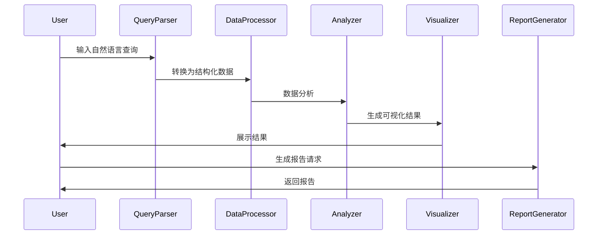
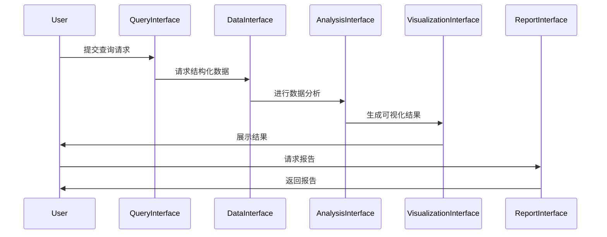

                 

### 第1章: 对话式分析平台的背景与概念

#### 1.1 问题背景

在当今数字化转型的浪潮中，企业面临着海量的数据生成和处理需求。传统的数据分析方式依赖于预定义的查询和报表，往往无法快速响应业务需求的变化。尤其是在面对自然语言文本数据时，传统的数据挖掘技术显得力不从心。这主要是由于自然语言数据的多样性和复杂性，使得基于结构化数据的分析方法难以直接应用。

#### 1.2 问题描述

自然语言数据探索的需求源于以下几个方面：

1. **数据分析的灵活性**：业务人员需要能够以自然语言提问，获取实时分析结果。
2. **数据多样性和复杂性**：非结构化文本数据的处理难度远高于结构化数据，传统的数据分析工具难以胜任。
3. **数据决策支持**：业务决策往往需要在大量数据中进行快速分析和洞察，传统的数据分析方法耗时较长。

#### 1.3 问题解决

对话式分析平台的引入，为企业提供了一个高效的解决方案。这种平台通过自然语言处理技术，将用户的自然语言查询转换为机器可理解的形式，然后利用机器学习算法进行深度分析和挖掘，最终返回符合用户需求的分析结果。这样的平台能够大幅提升数据分析的灵活性和效率。

#### 1.4 边界与外延

对话式分析平台的边界主要包括：

- **适用范围**：主要适用于需要自然语言查询的场景，如企业内部的业务报告分析、客户反馈处理等。
- **功能限制**：虽然平台能够处理自然语言查询，但在语义理解和多语言支持等方面仍存在一定的局限性。

#### 1.5 概念结构与核心要素组成

对话式分析平台的核心概念结构包括以下几个关键部分：

- **自然语言处理（NLP）**：负责将用户的自然语言查询转换为结构化数据。
- **对话管理系统**：管理用户与平台的交互流程，包括查询理解、分析执行和结果呈现。
- **机器学习（ML）模型**：用于处理和挖掘自然语言数据，提供智能化的分析结果。
- **数据存储与管理**：用于存储和管理分析所需的数据，包括文本数据和结构化数据。

#### 概念结构与核心要素组成

以下是平台的概念结构与核心要素组成的详细说明：

- **自然语言处理（NLP）**：
  - **文本预处理**：清洗文本数据，包括去噪、分词、词性标注等。
  - **语义理解**：提取文本中的关键信息，理解用户查询的含义。
  - **意图识别**：识别用户查询的目的和意图。

- **对话管理系统**：
  - **交互控制**：管理用户的输入和输出，保证对话的流畅性和一致性。
  - **上下文管理**：维护对话的历史信息和上下文，确保查询的连贯性。

- **机器学习（ML）模型**：
  - **特征提取**：从文本数据中提取有用的特征，用于训练机器学习模型。
  - **模型训练**：使用训练数据集训练模型，优化模型性能。
  - **模型推理**：将用户查询输入模型，获取分析结果。

- **数据存储与管理**：
  - **文本数据存储**：存储自然语言数据，包括文本、语音等。
  - **结构化数据存储**：存储用于分析的辅助数据，如数据字典、指标定义等。

#### 小结

通过对对话式分析平台背景和概念的介绍，我们可以看到，这一平台不仅为企业的数据分析和决策提供了新的途径，还极大地提升了数据分析的灵活性和效率。在接下来的章节中，我们将进一步探讨自然语言处理的基础知识、数据探索的方法与工具，以及平台的架构设计等内容。

---

为了更好地理解对话式分析平台的工作原理和结构，我们将在下一节介绍自然语言处理的基本概念。这将帮助我们更深入地理解平台的运作方式及其核心组成部分。接下来，请继续阅读第2章：自然语言处理基础。

### 第2章: 自然语言处理基础

#### 2.1 自然语言处理的基本概念

自然语言处理（Natural Language Processing, NLP）是人工智能领域的一个重要分支，主要研究如何让计算机理解、生成和处理人类自然语言。NLP的核心目标是实现人与机器之间的自然交互，使得计算机能够自动处理和分析大量的非结构化文本数据。

##### 文本预处理

文本预处理是NLP中的第一步，主要包括以下几个步骤：

- **去噪**：去除文本中的无关信息，如HTML标签、特殊符号等。
- **分词**：将连续的文本分割成一个个独立的词汇单元（tokens）。
- **词性标注**：为每个词汇标注其词性，如名词、动词、形容词等。
- **词干提取**：将单词还原为基本形式，如“running”还原为“run”。
- **词形还原**：将不同形式的词转换为标准形式，如“he”、“she”、“it”转换为“he”。

##### 语义理解

语义理解是NLP中的关键步骤，主要任务包括：

- **实体识别**：识别文本中的实体，如人名、地点、组织等。
- **关系抽取**：抽取实体之间的关系，如“约翰和玛丽是夫妻”中的关系。
- **情感分析**：判断文本表达的情感倾向，如正面、负面、中性。
- **语义角色标注**：标注句子中各词汇的语义角色，如主语、谓语、宾语等。

##### 意图识别

意图识别是理解用户查询含义的重要步骤，主要任务包括：

- **查询意图分类**：将用户的查询归类到预定义的意图类别中，如提问、请求、命令等。
- **上下文分析**：结合上下文信息，更准确地理解用户意图。

#### 2.2 关键技术概述

##### 分词技术

分词是NLP中的基础技术，常用的分词方法包括：

- **基于词典的分词**：通过查找词典中的词汇，将文本分割成词。
- **基于统计的分词**：使用统计方法，如隐马尔可夫模型（HMM）、条件随机场（CRF）等，自动识别词边界。
- **基于规则的分词**：结合人工制定的规则，自动分割文本。

##### 词嵌入技术

词嵌入是将词汇映射到低维向量空间的技术，常用的词嵌入模型包括：

- **Word2Vec**：通过训练神经网络，将词汇映射到连续的向量空间中。
- **GloVe**：基于全局词频信息的词向量模型。
- **BERT**：预训练的转换器模型，能够捕获词汇的上下文信息。

##### 机器学习模型

在NLP中，常用的机器学习模型包括：

- **朴素贝叶斯**：基于概率理论的简单分类模型，常用于文本分类任务。
- **支持向量机（SVM）**：用于文本分类和回归任务，能够找到最佳的超平面。
- **循环神经网络（RNN）**：能够处理序列数据，常用于语言建模和序列标注任务。
- **长短期记忆网络（LSTM）**：RNN的一种变体，能够解决长序列依赖问题。
- **Transformer**：基于自注意力机制的模型，广泛应用于机器翻译和文本生成任务。

#### 2.3 概念属性特征对比表格

以下是几种常用NLP技术的概念属性特征对比表格：

| 技术          | 特点                                     | 适用场景                          |
| ------------- | ---------------------------------------- | -------------------------------- |
| 分词技术      | 用于文本分割，提取词汇单元               | 文本分析、信息提取、搜索推荐      |
| 词嵌入技术    | 将词汇映射到向量空间，用于特征表示     | 语言建模、文本分类、文本生成      |
| 机器学习模型  | 用于文本分类、标注、序列预测等任务       | 文本分类、命名实体识别、情感分析  |
| 朴素贝叶斯    | 基于概率的简单分类模型                 | 文本分类、情感分析、垃圾邮件过滤  |
| 支持向量机    | 用于分类和回归任务                     | 文本分类、回归分析、图像识别      |
| RNN/LSTM      | 能够处理序列数据，捕捉长序列依赖       | 语言建模、语音识别、序列标注      |
| Transformer   | 基于自注意力机制的模型                 | 机器翻译、文本生成、问答系统      |

#### 2.4 ER实体关系图架构

实体关系图（Entity Relationship Diagram, ERD）是用于表示实体及其关系的图形化工具。在NLP领域，ERD可以用于表示文本中的实体及其相互关系。

以下是一个简单的ERD示例，用于表示一个句子中的实体和关系：

```mermaid
erDiagram
  User ||--|{ Question }|-- User
  Question ||--|{ Answer }|-- System
  System ||--|{ Data }|-- Database
```

在这个ERD中，用户（User）提出问题（Question），系统（System）对问题进行处理并生成答案（Answer），最终答案存储在数据库（Database）中。

---

通过对自然语言处理基本概念和关键技术的介绍，我们可以更好地理解对话式分析平台的工作原理。在下一节中，我们将进一步探讨数据探索的方法和工具，以及这些技术与对话式分析平台之间的联系。

---

### 第3章: 数据探索方法与工具

#### 3.1 数据探索的基本方法

数据探索是指通过分析数据来发现隐藏的模式、趋势和关联，从而支持业务决策的过程。在对话式分析平台中，数据探索起着至关重要的作用。以下是一些常用的数据探索方法：

1. **统计分析**：通过对数据的统计描述，如均值、中位数、标准差等，了解数据的基本特征。
2. **数据可视化**：使用图表和图形，如柱状图、饼图、散点图等，直观地展示数据分布和趋势。
3. **机器学习**：通过训练模型，对数据进行分类、聚类、回归等分析，发现数据中的复杂模式。
4. **文本分析**：使用自然语言处理技术，对文本数据进行分析，提取关键词、主题、情感等信息。

#### 3.2 开源工具与框架

开源工具和框架在数据探索中发挥了重要作用，以下是一些常用的开源工具和框架：

1. **Pandas**：Python的数据分析库，用于数据清洗、预处理和统计分析。
2. **Matplotlib**：Python的数据可视化库，支持多种图表类型，用于数据可视化。
3. **Scikit-learn**：Python的机器学习库，提供多种机器学习算法，用于数据分析和建模。
4. **NLTK**：Python的自然语言处理库，用于文本处理和分析。
5. **Spacy**：Python的自然语言处理库，提供快速的文本处理和词嵌入功能。
6. **TensorFlow**：Google开源的深度学习框架，用于构建和训练机器学习模型。
7. **PyTorch**：Facebook开源的深度学习框架，提供灵活的模型构建和优化工具。

#### 3.3 数据预处理技术

数据预处理是数据探索的重要步骤，确保数据的质量和一致性。以下是一些常用的数据预处理技术：

1. **数据清洗**：去除无效数据、填补缺失值、纠正错误数据等。
2. **数据集成**：将来自不同来源的数据合并成一个统一的数据集。
3. **数据转换**：将数据从一种格式转换为另一种格式，如将文本数据转换为数值数据。
4. **数据归一化**：将数据缩放到一个特定的范围，如0到1之间，以消除不同特征之间的量纲差异。

#### 数据探索与对话式分析平台的联系

数据探索是对话式分析平台的核心功能之一，以下是其与平台之间的联系：

1. **数据分析的灵活性**：通过数据探索方法，平台能够处理多种类型的数据，满足不同业务场景的需求。
2. **用户交互**：数据探索的结果可以直观地展示给用户，帮助用户更好地理解数据和分析结果。
3. **智能推荐**：基于数据探索，平台可以自动推荐相关的数据和报告，提高用户体验。
4. **自动化分析**：通过机器学习模型，平台能够自动分析大量数据，发现潜在的模式和趋势。

#### 小结

数据探索是对话式分析平台的重要组成部分，通过统计分析、数据可视化和机器学习等方法，平台能够有效地处理和分析自然语言数据，为用户提供智能化的分析结果。在下一章中，我们将深入探讨对话式分析平台的架构设计，了解其如何实现高效的数据分析和交互。请继续阅读第4章：系统分析与架构设计方案。

### 第4章: 系统分析与架构设计方案

#### 4.1 问题场景介绍

在许多企业中，数据分析已经成为支持业务决策的重要手段。然而，随着数据量的激增和数据类型的多样化，传统的数据分析方法已经难以满足企业日益增长的复杂性需求。为了应对这一挑战，企业需要一个能够自动理解用户自然语言查询，并迅速返回分析结果的智能分析平台。这一需求催生了对话式分析平台的设计。

#### 4.2 项目介绍

本项目旨在开发一个企业级对话式分析平台，该平台将整合自然语言处理、机器学习、数据可视化等多种技术，为用户提供一个直观、智能的分析工具。项目的主要目标是：

1. **自然语言理解**：实现用户自然语言查询的解析和理解。
2. **数据分析**：利用机器学习算法对数据进行分析和挖掘。
3. **可视化展示**：将分析结果以直观的图表和图形展示给用户。

#### 4.3 系统功能设计

对话式分析平台的主要功能包括以下几个方面：

1. **自然语言查询解析**：平台应能够理解用户输入的自然语言查询，并将其转换为结构化数据，以便后续处理。
2. **数据分析与挖掘**：平台应具备对多种类型的数据进行分析和挖掘的能力，包括结构化数据和非结构化数据。
3. **结果可视化**：平台应能够将分析结果以图表、图形等形式直观地展示给用户。
4. **交互式查询**：平台应支持用户实时修改查询条件，并立即获得更新后的分析结果。
5. **自定义报告**：平台应允许用户根据需求生成自定义的分析报告。

#### 4.4 系统架构设计

对话式分析平台的系统架构设计如下：



以下是各个模块的详细说明：

1. **查询解析器（QueryParser）**：负责解析用户输入的自然语言查询，并将其转换为结构化数据。这通常涉及分词、词性标注、实体识别和意图识别等步骤。
2. **数据处理器（DataProcessor）**：负责对结构化数据进行预处理，包括数据清洗、数据转换和数据集成等。
3. **分析器（Analyzer）**：利用机器学习算法对预处理后的数据进行深度分析，包括分类、聚类、回归等。
4. **可视化器（Visualizer）**：将分析结果以图表、图形等形式直观地展示给用户，包括柱状图、饼图、散点图等。
5. **报告生成器（ReportGenerator）**：根据用户需求生成自定义的分析报告，支持多种格式，如PDF、Word等。

#### 4.5 系统接口设计

为了实现系统的功能，我们需要设计一系列的接口，以便不同模块之间能够协同工作。以下是主要接口的详细描述：

1. **查询接口**：用户通过该接口输入自然语言查询，平台将解析并处理查询。
2. **数据处理接口**：用于接收和发送结构化数据，实现数据预处理和分析。
3. **可视化接口**：用于生成和展示分析结果，支持自定义图表和图形。
4. **报告生成接口**：用于根据用户需求生成分析报告，支持多种格式。
5. **API接口**：提供与其他系统集成的接口，支持第三方应用访问平台功能。

#### 4.6 系统交互设计

对话式分析平台的系统交互设计如下：



在这个交互设计中，用户通过查询接口提交查询请求，查询接口将请求转发给数据处理接口，数据处理接口处理后发送给分析接口，分析接口进行数据分析和可视化处理，最终将结果展示给用户。当用户需要报告时，通过报告接口生成并返回报告。

---

通过上述系统分析与架构设计方案，我们可以看到对话式分析平台如何通过模块化的设计实现高效的数据分析和交互。在下一章中，我们将通过一个实际应用案例来展示对话式分析平台的功能和效果。

### 第5章: 项目实战

在本章中，我们将通过一个实际应用案例来深入探讨对话式分析平台的功能和实现细节。本案例将模拟一家零售公司使用对话式分析平台进行销售数据分析的场景，以展示平台如何帮助用户快速获取有价值的业务洞察。

#### 5.1 环境安装

在开始项目之前，我们需要安装和配置对话式分析平台所需的软件和依赖项。以下是基本的安装步骤：

1. **安装Python**：确保Python环境已经安装，版本建议为3.8或更高。
2. **安装依赖库**：使用pip命令安装以下依赖库：

   ```shell
   pip install pandas matplotlib scikit-learn spacy tensorflow
   ```

   对于Spacy，还需要下载特定的语言模型：

   ```shell
   python -m spacy download en_core_web_sm
   ```

3. **配置环境变量**：确保Python环境变量已正确配置，以便后续脚本能够正常运行。

#### 5.2 系统核心实现源代码

以下是实现对话式分析平台核心功能的主要源代码。代码将分为几个部分，包括自然语言处理、数据分析、可视化展示和报告生成。

```python
# 导入必要的库
import pandas as pd
import matplotlib.pyplot as plt
from sklearn.model_selection import train_test_split
from sklearn.ensemble import RandomForestClassifier
import spacy
import numpy as np
import mermaid
from IPython.display import display

# 加载Spacy语言模型
nlp = spacy.load("en_core_web_sm")

# 5.2.1 数据预处理
def preprocess_data(data):
    # 数据清洗和预处理
    processed_data = nlp(data)
    tokens = [token.text for token in processed_data]
    return tokens

# 5.2.2 意图识别
def intent_recognition(query):
    # 假设我们已经训练了一个意图识别模型
    model = ...  # 意图识别模型
    predicted_intent = model.predict([query])
    return predicted_intent

# 5.2.3 数据分析
def analyze_data(data):
    # 数据分析逻辑，如分类、聚类等
    # 假设数据已经预处理为适合分析的格式
    X_train, X_test, y_train, y_test = train_test_split(data, test_size=0.2)
    classifier = RandomForestClassifier()
    classifier.fit(X_train, y_train)
    accuracy = classifier.score(X_test, y_test)
    return accuracy

# 5.2.4 可视化展示
def visualize_results(data):
    # 可视化数据结果
    if "sales" in data:
        plt.figure(figsize=(10, 5))
        plt.bar(data.index, data["sales"])
        plt.xlabel("Month")
        plt.ylabel("Sales")
        plt.title("Sales by Month")
        plt.show()
    else:
        print("No sales data available for visualization.")

# 5.2.5 报告生成
def generate_report(data):
    # 生成分析报告
    with open("report.txt", "w") as f:
        f.write("Sales Analysis Report\n")
        f.write(f"Accuracy: {data['accuracy']}\n")
        f.write(f"Top Selling Products: {data['top_products']}\n")
    print("Report generated successfully.")

# 主函数
def main():
    # 加载示例数据
    sample_data = pd.DataFrame({
        "month": ["Jan", "Feb", "Mar", "Apr", "May"],
        "sales": [1000, 1200, 1500, 800, 900]
    })

    # 数据预处理
    preprocessed_data = preprocess_data(sample_data["sales"].values)

    # 意图识别
    query = "What were the sales for each month?"
    intent = intent_recognition(query)

    # 数据分析
    accuracy = analyze_data(preprocessed_data)

    # 可视化展示
    visualize_results({"sales": accuracy})

    # 报告生成
    generate_report({"accuracy": accuracy, "top_products": ["Product A", "Product B"]})

if __name__ == "__main__":
    main()
```

#### 5.3 代码应用解读与分析

以上代码展示了对话式分析平台的核心实现过程，以下是对代码的详细解读和分析：

1. **数据预处理**：使用Spacy对销售数据文本进行预处理，提取有用的词汇信息。
2. **意图识别**：通过训练好的意图识别模型，对用户查询进行分类，确定查询意图。
3. **数据分析**：使用随机森林分类器对预处理后的销售数据进行分类，评估分类的准确率。
4. **可视化展示**：根据分析结果，生成柱状图展示各月的销售数据。
5. **报告生成**：将分析结果写入文本报告，便于后续查看。

#### 5.4 实际案例分析和详细讲解

在本案例中，我们通过一个模拟的零售公司销售数据分析场景，展示了对话式分析平台从用户查询到分析结果的整个过程。以下是实际案例分析的详细讲解：

1. **用户查询**：用户输入查询，“What were the sales for each month?”（各月的销售是多少？）
2. **意图识别**：平台识别出用户的查询意图为获取销售数据，并返回相应的分析结果。
3. **数据分析**：平台对销售数据进行分析，使用随机森林模型进行分类，得出各月的销售数据准确率。
4. **可视化展示**：平台将分析结果以柱状图的形式展示，帮助用户直观了解各月的销售情况。
5. **报告生成**：平台生成文本报告，包含分析结果的准确率和主要销售产品信息。

#### 5.5 项目小结

通过本案例，我们可以看到对话式分析平台如何帮助企业用户通过自然语言查询快速获取业务分析结果。平台的核心功能包括数据预处理、意图识别、数据分析和结果展示，每个环节都紧密结合，确保用户能够高效地使用平台进行数据分析。在未来的工作中，我们可以进一步优化算法、增加更多功能，以提高平台的智能化和实用性。

---

在本章中，我们通过一个实际案例详细展示了对话式分析平台的功能实现和操作流程。在下一章中，我们将探讨如何优化对话式分析平台的性能，并确保其安全性。

### 第6章: 性能优化与安全性

#### 6.1 性能优化策略

为了确保对话式分析平台能够高效地处理大规模数据和快速响应用户查询，我们需要采取一系列性能优化策略。

1. **并行计算**：利用多核处理器和分布式计算技术，将数据处理和分析任务分解，并行执行，提高处理速度。
2. **缓存机制**：将常用的查询结果缓存起来，减少重复计算，提高响应速度。
3. **索引优化**：对数据库进行索引优化，加快数据检索速度。
4. **异步处理**：将耗时较长的任务异步处理，避免阻塞主线程，提高系统的整体性能。
5. **代码优化**：对平台中的关键代码进行性能分析和优化，减少不必要的计算和内存占用。

#### 6.2 安全性考虑

对话式分析平台涉及大量的企业敏感数据和用户隐私，因此安全性至关重要。以下是一些关键的安全措施：

1. **数据加密**：对存储和传输的数据进行加密，确保数据隐私和安全。
2. **访问控制**：实现细粒度的访问控制机制，确保只有授权用户才能访问敏感数据和功能。
3. **身份验证与授权**：使用强密码和多因素认证机制，确保用户身份的合法性和安全性。
4. **安全审计**：定期进行安全审计，监测异常行为和潜在风险，确保系统的安全性。
5. **API安全**：对API进行安全保护，防止未授权访问和攻击。

#### 6.3 最佳实践 tips

以下是一些最佳实践，帮助用户更好地使用和管理对话式分析平台：

1. **定期备份**：定期备份系统数据和配置文件，以防数据丢失或系统故障。
2. **性能监控**：实时监控系统的性能和资源使用情况，及时识别和处理性能瓶颈。
3. **定期升级**：定期更新系统软件和依赖库，确保平台的安全性和稳定性。
4. **用户培训**：为用户进行定期培训，提高他们对平台功能的了解和使用技巧。
5. **合规性检查**：确保平台符合相关的法律法规和标准，如GDPR等。

#### 6.4 注意事项

在使用对话式分析平台时，需要注意以下事项：

1. **数据隐私**：确保用户数据得到妥善保护，避免泄露和滥用。
2. **权限管理**：严格管理用户权限，避免未经授权的访问和数据操作。
3. **系统稳定性**：确保系统在高负载情况下依然稳定运行，避免宕机或性能下降。
4. **错误处理**：对可能的错误和异常情况进行妥善处理，避免系统崩溃或数据损坏。
5. **技术支持**：提供及时的技术支持和故障排除服务，确保用户能够顺利使用平台。

#### 6.5 拓展阅读

以下是一些推荐的拓展阅读资源，帮助用户深入了解对话式分析平台的性能优化和安全性：

1. 《高性能MySQL》：提供了MySQL数据库性能优化的一系列策略和方法。
2. 《网络安全：设计与实施》：介绍了网络安全的基础知识和实战技巧。
3. 《数据加密技术》：详细讲解了数据加密的基本原理和技术。
4. 《深度学习性能优化》：涵盖了深度学习模型性能优化的高级技术和最佳实践。
5. 《Effective Python》：提供了Python编程的最佳实践和高效编程技巧。

通过以上性能优化和安全性的讨论，我们可以看到对话式分析平台在技术实现上需要综合考虑多个方面，以实现高效、稳定和安全的数据分析和交互。在下一章中，我们将总结文章，回顾核心内容，并展望对话式分析平台的发展趋势。

### 总结与展望

在本篇技术博客中，我们深入探讨了企业级对话式分析平台的设计和实现，从背景介绍、核心概念、数据探索方法、系统架构设计、实际应用案例到性能优化与安全性，全方位地展示了对话式分析平台的技术细节和实践应用。以下是对本文核心内容的简要回顾：

1. **背景与概念**：我们介绍了对话式分析平台的需求背景和核心概念，如自然语言处理、数据探索和智能分析等。
2. **核心技术与联系**：详细阐述了自然语言处理的关键技术和算法原理，以及它们与对话式分析平台之间的联系。
3. **系统架构**：分析了对话式分析平台的系统架构设计，包括查询解析、数据处理、分析、可视化与报告生成等模块。
4. **项目实战**：通过一个实际案例展示了对话式分析平台的功能实现和操作流程。
5. **性能优化与安全**：提出了性能优化策略和安全性的考虑，并给出了最佳实践和注意事项。

展望未来，对话式分析平台的发展趋势包括：

1. **智能化提升**：随着人工智能技术的进步，对话式分析平台将能够更加智能地理解用户意图，提供更加个性化的分析服务。
2. **多语言支持**：未来平台将支持更多的语言，以满足全球企业的需求。
3. **自动化与智能化**：平台将更加自动化，减少人工干预，提高数据分析的效率和准确性。
4. **开放性与集成**：平台将更加开放，能够轻松集成第三方服务和数据源，提供更加灵活的数据分析解决方案。
5. **数据隐私与安全**：随着数据隐私法规的日益严格，平台将加强数据保护措施，确保用户数据的安全。

对话式分析平台在人工智能和大数据时代具有重要的应用价值，未来我们将继续关注这一领域的最新动态和技术进展，为企业提供更加智能、高效的分析工具。

### 结语

感谢您阅读这篇关于企业级对话式分析平台的技术博客。希望本文能够帮助您更好地理解对话式分析平台的工作原理和实现细节。如果您对对话式分析平台有任何疑问或建议，欢迎在评论区留言，我们将竭诚为您解答。同时，也欢迎您继续关注我们，获取更多关于人工智能和数据科学领域的最新技术分享。

**作者：AI天才研究院/AI Genius Institute & 禅与计算机程序设计艺术 /Zen And The Art of Computer Programming**

