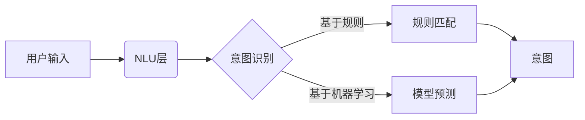
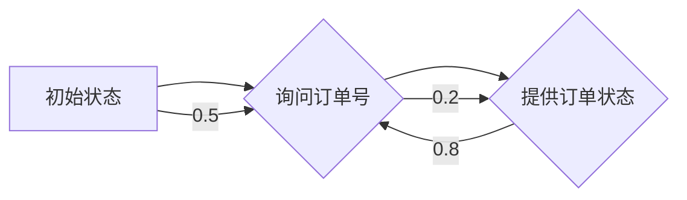
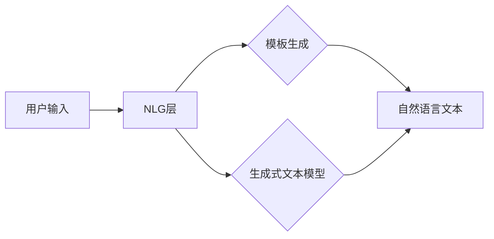
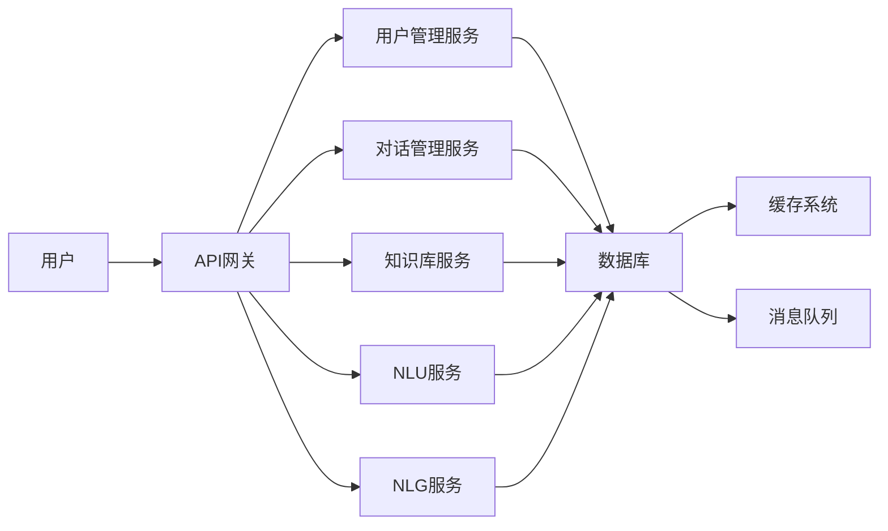

                 

### 文章标题：企业级对话系统平台：增强客户服务质量

关键词：企业级对话系统、客户服务质量、平台设计、优化策略、应用案例

摘要：本文旨在深入探讨企业级对话系统平台的设计与实现，特别是如何通过这一平台显著提升客户服务质量。我们将从对话系统的基本概念和背景入手，逐步分析其架构设计、技术实现、优化策略和实际应用案例，以帮助读者全面了解企业级对话系统的构建和运营。

## 目录

### 第一部分：企业级对话系统概述

- **第1章：企业级对话系统简介**  
  - 1.1 对话系统的背景与现状
  - 1.2 对话系统的基本概念
  - 1.3 对话系统的架构设计
  - 1.4 对话系统的技术实现
  - 1.5 对话系统的评价指标

- **第2章：对话系统平台的设计原则**  
  - 2.1 平台设计的基本原则
  - 2.2 平台架构设计
  - 2.3 平台功能模块设计
  - 2.4 平台开发与部署

- **第3章：对话系统的优化与性能提升**  
  - 3.1 优化目标与方法
  - 3.2 性能提升策略
  - 3.3 用户体验优化
  - 3.4 持续优化与迭代

- **第4章：对话系统在客户服务中的应用**  
  - 4.1 客户服务的现状与挑战
  - 4.2 应用案例介绍
  - 4.3 案例分析

- **第5章：对话系统开发实战**  
  - 5.1 开发环境准备
  - 5.2 系统核心实现
  - 5.3 代码应用解读与分析
  - 5.4 项目实战剖析

### 第二部分：对话系统平台设计

### 第三部分：对话系统优化策略

### 第四部分：对话系统应用案例

### 第五部分：对话系统开发实战

## 让我们开始思考：什么是企业级对话系统？

首先，我们需要明确什么是企业级对话系统。企业级对话系统是一种旨在提升客户服务质量和效率的智能对话解决方案。它不仅仅是一个简单的聊天机器人，而是集成了自然语言处理、对话管理、知识图谱等多种技术，能够理解用户的意图，提供智能化的回复和解决方案。

在企业中，对话系统主要用于以下几个场景：

1. **客户服务**：通过自动化的客服机器人，提供24/7的服务，解答用户的问题，减少人工客服的工作量。
2. **销售支持**：辅助销售人员了解客户需求，提供产品信息，促进销售。
3. **内部沟通**：员工可以通过对话系统进行信息交流和知识共享。

现在，让我们一步步分析对话系统在企业中的应用及其重要性。

### 1.1 对话系统的背景与现状

#### 1.1.1 对话系统的发展历程

对话系统的发展可以追溯到20世纪50年代，当时的人工智能研究主要集中在让计算机模拟人类的对话能力。早期的对话系统主要依赖于规则驱动的方式，通过预设的规则来模拟对话。然而，这种方式在处理复杂、多变的问题时显得力不从心。

随着自然语言处理（NLP）技术的进步，尤其是深度学习算法的引入，对话系统得到了极大的提升。现代对话系统开始采用基于统计和机器学习的模型，能够更好地理解用户的语言和行为。

#### 1.1.2 对话系统在企业中的应用

在当今的商业环境中，对话系统已经成为企业提高客户服务质量和效率的重要工具。以下是一些对话系统在企业中的典型应用：

1. **客户服务自动化**：通过自动化的客服机器人，企业能够提供24/7的服务，提高响应速度，减少人工成本。
2. **销售支持**：对话系统可以辅助销售人员了解客户需求，提供产品信息，促进销售。
3. **内部沟通**：企业员工可以通过对话系统进行信息交流和知识共享，提高工作效率。

#### 1.1.3 对话系统的重要性

对话系统的重要性主要体现在以下几个方面：

1. **提升客户满意度**：通过提供及时、准确的响应，对话系统能够显著提升客户满意度。
2. **降低运营成本**：自动化的客服机器人可以减少人工客服的工作量，降低运营成本。
3. **提高工作效率**：对话系统可以处理大量的客户查询，提高企业的工作效率。
4. **增强个性化服务**：通过分析用户行为和偏好，对话系统可以提供个性化的服务和推荐。

### 1.2 对话系统的基本概念

#### 1.2.1 对话系统定义

对话系统（Dialogue System），也称为聊天机器人或智能对话系统，是一种能够与人类用户进行自然语言交互的人工智能系统。它能够理解用户的意图，提供相应的回复和解决方案。

#### 1.2.2 对话系统分类

根据对话系统的功能和应用场景，可以将其分为以下几类：

1. **任务型对话系统**：专注于完成特定任务，如在线客服、预订机票等。
2. **闲聊型对话系统**：主要用于与人进行闲聊，如虚拟助手、聊天机器人等。
3. **混合型对话系统**：同时具备任务型和闲聊型的功能，能够应对多种场景。

#### 1.2.3 对话系统的核心组件

一个完整的对话系统通常由以下几个核心组件构成：

1. **自然语言理解（NLU）**：将用户的自然语言输入转化为结构化的数据，以便后续处理。
2. **对话管理（DM）**：根据用户的意图和上下文，生成相应的回复，并维护对话的状态。
3. **自然语言生成（NLG）**：将系统生成的结构化数据转化为自然语言文本，向用户呈现。
4. **知识库**：存储与对话相关的知识，如产品信息、常见问题等。

### 1.3 对话系统的架构设计

#### 1.3.1 对话系统的基本架构

一个典型的对话系统架构包括以下几个层次：

1. **前端交互层**：负责与用户进行交互，接收用户的输入，展示系统的回复。
2. **NLU层**：对用户的输入进行处理，提取出用户的意图和实体。
3. **对话管理层**：根据用户的意图和上下文，生成相应的回复，并维护对话的状态。
4. **NLG层**：将生成的结构化数据转化为自然语言文本，向用户呈现。
5. **后端服务层**：提供与业务系统或其他服务的接口，以便进行数据查询、操作等。

#### 1.3.2 架构设计的考量因素

在设计对话系统的架构时，需要考虑以下几个因素：

1. **可扩展性**：对话系统需要能够处理大量并发请求，支持系统的水平扩展。
2. **高可用性**：系统需要具备良好的容错性和恢复能力，确保服务的连续性。
3. **安全性**：保护用户数据和隐私，防止恶意攻击。
4. **易维护性**：系统需要便于管理和维护，降低运维成本。
5. **灵活性**：支持快速迭代和功能扩展，适应不断变化的需求。

#### 1.3.3 实际案例架构分析

以一个电商客服对话系统为例，其架构设计如下：

1. **前端交互层**：使用Web应用或移动应用与用户进行交互，接收用户的输入，展示系统的回复。
2. **NLU层**：使用深度学习模型对用户的输入进行处理，提取出用户的意图和实体。
3. **对话管理层**：根据用户的意图和上下文，生成相应的回复，并维护对话的状态。对话管理模块还负责处理用户的上下文信息，如用户的历史购买记录、偏好等。
4. **NLG层**：将生成的结构化数据转化为自然语言文本，向用户呈现。NLG模块可以使用模板库或生成式文本模型来生成自然语言回复。
5. **后端服务层**：与电商业务系统进行对接，提供商品查询、订单处理、用户管理等功能。

### 1.4 对话系统的技术实现

#### 1.4.1 自然语言处理技术

自然语言处理（NLP）是构建对话系统的核心技术之一。它主要涉及以下几个方面：

1. **分词**：将文本拆分成单词或短语，以便进行后续处理。
2. **词性标注**：对文本中的每个词进行词性分类，如名词、动词、形容词等。
3. **命名实体识别**：识别文本中的特定实体，如人名、地名、组织名等。
4. **句法分析**：分析文本的句法结构，理解句子的组成和语法规则。
5. **语义分析**：理解文本中的语义含义，如情感分析、意图识别等。

目前，深度学习技术在NLP领域取得了显著成果，如BERT、GPT等模型被广泛应用于对话系统的构建。

#### 1.4.2 对话管理技术

对话管理（Dialogue Management）是确保对话系统能够理解用户意图并生成合理回复的关键技术。它主要包括以下几个方面：

1. **意图识别**：识别用户的意图，如查询、建议、投诉等。
2. **上下文维护**：根据用户的输入和系统的回复，维护对话的状态和上下文信息。
3. **对话策略**：制定对话策略，决定系统如何回应用户的输入。对话策略可以基于规则、机器学习或深度学习模型。

#### 1.4.3 常用对话系统框架介绍

当前，有许多成熟的对话系统框架可供选择，如Rasa、Microsoft Bot Framework、Dialogflow等。以下是几个常用框架的简要介绍：

1. **Rasa**：一个开源的对话系统框架，支持从零开始构建对话系统。它提供了NLU和DM模块，并支持自定义对话策略。
2. **Microsoft Bot Framework**：一个由微软提供的开源框架，支持构建跨平台、跨渠道的聊天机器人。它提供了丰富的API和工具，易于集成到现有系统中。
3. **Dialogflow**：一个由Google提供的自然语言处理平台，用于构建智能对话系统。它提供了NLU和DM模块，并支持多种编程语言和平台。

### 1.5 对话系统的评价指标

#### 1.5.1 对话系统的评价标准

评价对话系统的性能主要涉及以下几个方面：

1. **响应速度**：系统处理用户请求的响应时间。
2. **准确率**：系统理解用户意图的准确程度。
3. **用户满意度**：用户对系统响应的满意度。
4. **业务指标**：如降低的人工客服成本、提高的客户转化率等。

#### 1.5.2 评价方法与工具

1. **自动化测试工具**：如Rasa Test、Botium等，用于自动化测试对话系统的性能。
2. **用户调查**：通过问卷调查或用户访谈，收集用户对系统的评价。
3. **日志分析**：分析系统日志，评估系统的响应速度和错误率。

#### 1.5.3 提升评价指标的策略

1. **优化NLU模型**：使用更先进的NLP技术，提高系统的意图识别和实体提取能力。
2. **优化对话管理策略**：采用深度学习算法，制定更智能的对话策略。
3. **用户反馈**：收集用户反馈，不断优化系统的性能和用户体验。

### 总结

企业级对话系统是一种能够显著提升客户服务质量和效率的智能解决方案。本文从对话系统的基本概念、架构设计、技术实现、优化策略和实际应用案例等方面进行了详细分析，旨在帮助读者全面了解企业级对话系统的构建和运营。随着人工智能技术的不断进步，对话系统将在未来的商业环境中发挥更加重要的作用。让我们一起期待并探索这一领域的发展吧！

## 作者信息

作者：AI天才研究院/AI Genius Institute & 禅与计算机程序设计艺术 /Zen And The Art of Computer Programming

---

在接下来的章节中，我们将继续探讨对话系统平台的设计原则、优化策略、应用案例和开发实战，帮助您更深入地了解企业级对话系统的构建和运营。敬请期待！## 第1章：企业级对话系统简介

### 1.1 对话系统的背景与现状

对话系统（Dialogue System），又称为聊天机器人或智能对话系统，是一种能够模拟人类对话行为的人工智能系统。其核心目标是通过与用户进行自然语言交互，提供有效、准确的响应，满足用户的需求。

#### 1.1.1 对话系统的发展历程

对话系统的发展可以追溯到20世纪50年代，当时的人工智能研究主要集中在让计算机模拟人类的对话能力。早期的对话系统主要依赖于规则驱动的方式，通过预设的规则来模拟对话。例如，1950年，艾伦·图灵提出了著名的图灵测试，用于评估机器是否能够模仿人类对话。

然而，这种方式在处理复杂、多变的问题时显得力不从心。随着自然语言处理（NLP）技术的进步，尤其是深度学习算法的引入，对话系统得到了极大的提升。20世纪90年代，基于知识库和推理机的对话系统逐渐兴起，能够处理更为复杂的问题。进入21世纪，随着大数据和云计算技术的发展，对话系统开始采用基于数据驱动的机器学习模型，如神经网络、循环神经网络（RNN）和变压器（Transformer）等，进一步提升了对话系统的智能水平。

#### 1.1.2 对话系统在企业中的应用

在当今的商业环境中，对话系统已经成为企业提高客户服务质量和效率的重要工具。以下是对话系统在企业中的几个主要应用场景：

1. **客户服务**：通过自动化的客服机器人，企业能够提供24/7的服务，提高响应速度，减少人工客服的工作量。例如，电商客服对话系统能够实时解答用户关于产品信息、订单状态等问题，提高用户满意度。
2. **销售支持**：对话系统可以辅助销售人员了解客户需求，提供产品信息，促进销售。例如，金融领域的客服机器人可以解答投资者关于理财产品的问题，提高销售转化率。
3. **内部沟通**：企业员工可以通过对话系统进行信息交流和知识共享，提高工作效率。例如，企业内部的聊天机器人可以提供公司政策、员工福利等信息，方便员工查询。

#### 1.1.3 对话系统的重要性

对话系统的重要性主要体现在以下几个方面：

1. **提升客户满意度**：通过提供及时、准确的响应，对话系统能够显著提升客户满意度。尤其是对于大型企业，人工客服无法在短时间内处理大量客户请求时，对话系统能够有效缓解这一问题。
2. **降低运营成本**：自动化的客服机器人可以减少人工客服的工作量，降低运营成本。对于企业来说，这是一个显著的经济效益。
3. **提高工作效率**：对话系统可以处理大量的客户查询，提高企业的工作效率。员工可以将更多精力集中在高价值的工作上，从而提升整体生产力。
4. **增强个性化服务**：通过分析用户行为和偏好，对话系统可以提供个性化的服务和推荐。例如，电商客服对话系统可以根据用户的购物历史和偏好，推荐合适的商品。

### 1.2 对话系统的基本概念

#### 1.2.1 对话系统定义

对话系统是一种能够与人类用户进行自然语言交互的人工智能系统，其核心目标是通过理解用户的意图，提供相应的内容和服务。

#### 1.2.2 对话系统分类

根据对话系统的功能和应用场景，可以将其分为以下几类：

1. **任务型对话系统**：专注于完成特定任务，如在线客服、预订机票等。这类系统通常具有较强的领域知识和任务处理能力。
2. **闲聊型对话系统**：主要用于与人进行闲聊，如虚拟助手、聊天机器人等。这类系统主要依赖于自然语言处理技术，能够理解用户的语言和行为。
3. **混合型对话系统**：同时具备任务型和闲聊型的功能，能够应对多种场景。例如，智能音箱和智能助手通常属于这一类别。

#### 1.2.3 对话系统的核心组件

一个完整的对话系统通常由以下几个核心组件构成：

1. **自然语言理解（NLU）**：将用户的自然语言输入转化为结构化的数据，以便后续处理。
2. **对话管理（DM）**：根据用户的意图和上下文，生成相应的回复，并维护对话的状态。
3. **自然语言生成（NLG）**：将系统生成的结构化数据转化为自然语言文本，向用户呈现。
4. **知识库**：存储与对话相关的知识，如产品信息、常见问题等。

### 1.3 对话系统的架构设计

#### 1.3.1 对话系统的基本架构

一个典型的对话系统架构包括以下几个层次：

1. **前端交互层**：负责与用户进行交互，接收用户的输入，展示系统的回复。
2. **自然语言理解（NLU）层**：对用户的输入进行处理，提取出用户的意图和实体。
3. **对话管理（DM）层**：根据用户的意图和上下文，生成相应的回复，并维护对话的状态。
4. **自然语言生成（NLG）层**：将生成的结构化数据转化为自然语言文本，向用户呈现。
5. **后端服务层**：提供与业务系统或其他服务的接口，以便进行数据查询、操作等。

#### 1.3.2 架构设计的考量因素

在设计对话系统的架构时，需要考虑以下几个因素：

1. **可扩展性**：对话系统需要能够处理大量并发请求，支持系统的水平扩展。
2. **高可用性**：系统需要具备良好的容错性和恢复能力，确保服务的连续性。
3. **安全性**：保护用户数据和隐私，防止恶意攻击。
4. **易维护性**：系统需要便于管理和维护，降低运维成本。
5. **灵活性**：支持快速迭代和功能扩展，适应不断变化的需求。

#### 1.3.3 实际案例架构分析

以一个电商客服对话系统为例，其架构设计如下：

1. **前端交互层**：使用Web应用或移动应用与用户进行交互，接收用户的输入，展示系统的回复。
2. **自然语言理解（NLU）层**：使用深度学习模型对用户的输入进行处理，提取出用户的意图和实体。
3. **对话管理（DM）层**：根据用户的意图和上下文，生成相应的回复，并维护对话的状态。对话管理模块还负责处理用户的上下文信息，如用户的历史购买记录、偏好等。
4. **自然语言生成（NLG）层**：将生成的结构化数据转化为自然语言文本，向用户呈现。NLG模块可以使用模板库或生成式文本模型来生成自然语言回复。
5. **后端服务层**：与电商业务系统进行对接，提供商品查询、订单处理、用户管理等功能。

### 1.4 对话系统的技术实现

#### 1.4.1 自然语言处理技术

自然语言处理（NLP）是构建对话系统的核心技术之一。它主要涉及以下几个方面：

1. **分词**：将文本拆分成单词或短语，以便进行后续处理。
2. **词性标注**：对文本中的每个词进行词性分类，如名词、动词、形容词等。
3. **命名实体识别**：识别文本中的特定实体，如人名、地名、组织名等。
4. **句法分析**：分析文本的句法结构，理解句子的组成和语法规则。
5. **语义分析**：理解文本中的语义含义，如情感分析、意图识别等。

目前，深度学习技术在NLP领域取得了显著成果，如BERT、GPT等模型被广泛应用于对话系统的构建。

#### 1.4.2 对话管理技术

对话管理（Dialogue Management）是确保对话系统能够理解用户意图并生成合理回复的关键技术。它主要包括以下几个方面：

1. **意图识别**：识别用户的意图，如查询、建议、投诉等。
2. **上下文维护**：根据用户的输入和系统的回复，维护对话的状态和上下文信息。
3. **对话策略**：制定对话策略，决定系统如何回应用户的输入。对话策略可以基于规则、机器学习或深度学习模型。

#### 1.4.3 常用对话系统框架介绍

当前，有许多成熟的对话系统框架可供选择，如Rasa、Microsoft Bot Framework、Dialogflow等。以下是几个常用框架的简要介绍：

1. **Rasa**：一个开源的对话系统框架，支持从零开始构建对话系统。它提供了NLU和DM模块，并支持自定义对话策略。
2. **Microsoft Bot Framework**：一个由微软提供的开源框架，支持构建跨平台、跨渠道的聊天机器人。它提供了丰富的API和工具，易于集成到现有系统中。
3. **Dialogflow**：一个由Google提供的自然语言处理平台，用于构建智能对话系统。它提供了NLU和DM模块，并支持多种编程语言和平台。

### 1.5 对话系统的评价指标

#### 1.5.1 对话系统的评价标准

评价对话系统的性能主要涉及以下几个方面：

1. **响应速度**：系统处理用户请求的响应时间。
2. **准确率**：系统理解用户意图的准确程度。
3. **用户满意度**：用户对系统响应的满意度。
4. **业务指标**：如降低的人工客服成本、提高的客户转化率等。

#### 1.5.2 评价方法与工具

1. **自动化测试工具**：如Rasa Test、Botium等，用于自动化测试对话系统的性能。
2. **用户调查**：通过问卷调查或用户访谈，收集用户对系统的评价。
3. **日志分析**：分析系统日志，评估系统的响应速度和错误率。

#### 1.5.3 提升评价指标的策略

1. **优化NLU模型**：使用更先进的NLP技术，提高系统的意图识别和实体提取能力。
2. **优化对话管理策略**：采用深度学习算法，制定更智能的对话策略。
3. **用户反馈**：收集用户反馈，不断优化系统的性能和用户体验。

### 总结

企业级对话系统是一种能够显著提升客户服务质量和效率的智能解决方案。本章从对话系统的基本概念、架构设计、技术实现、优化策略和实际应用案例等方面进行了详细分析，旨在帮助读者全面了解企业级对话系统的构建和运营。随着人工智能技术的不断进步，对话系统将在未来的商业环境中发挥更加重要的作用。让我们一起期待并探索这一领域的发展吧！

## 核心概念与联系

为了更深入地理解企业级对话系统的构建和运营，我们需要明确一些核心概念及其相互关系。以下是对这些概念的定义、属性特征对比以及ER实体关系图的详细解释。

### 核心概念

1. **自然语言理解（NLU）**：NLU是对话系统的核心组件，负责将用户的自然语言输入转化为结构化的数据，如意图、实体和上下文信息。NLU的属性特征包括：
   - **语言模型**：使用深度学习算法，如BERT、GPT等，对自然语言进行处理。
   - **意图识别**：识别用户的意图，如查询、建议、投诉等。
   - **实体提取**：识别文本中的特定实体，如人名、地名、组织名等。

2. **对话管理（DM）**：DM负责维护对话的状态和上下文信息，并根据用户的意图生成相应的回复。DM的属性特征包括：
   - **上下文维护**：根据用户的输入和系统的回复，持续更新对话状态。
   - **对话策略**：制定对话策略，决定系统如何回应用户的输入。
   - **对话流程控制**：确保对话的流畅性和逻辑性。

3. **自然语言生成（NLG）**：NLG将系统生成的结构化数据转化为自然语言文本，向用户呈现。NLG的属性特征包括：
   - **文本生成**：使用模板库或生成式文本模型，如Transformer等，生成自然语言回复。
   - **语音合成**：将文本转化为语音，提高用户体验。

4. **知识库**：知识库是存储与对话相关的知识，如产品信息、常见问题等。知识库的属性特征包括：
   - **知识管理**：存储和管理与对话相关的信息。
   - **实时更新**：根据业务需求，持续更新知识库的内容。

### 属性特征对比

为了更好地理解这些核心组件的属性特征，我们可以通过一个对比表格来进行详细说明：

| 核心组件 | 属性特征 |
| -------- | -------- |
| NLU | - 语言模型<br>- 意图识别<br>- 实体提取 |
| DM | - 上下文维护<br>- 对话策略<br>- 对话流程控制 |
| NLG | - 文本生成<br>- 语音合成 |
| 知识库 | - 知识管理<br>- 实时更新 |

### ER实体关系图

为了进一步展示这些核心组件之间的相互关系，我们可以使用Mermaid语言绘制一个ER实体关系图。以下是ER实体关系图的Markdown格式表示：

```mermaid
erDiagram
    NLU ||--|{ DM : 依赖 }
    DM ||--|{ NLG : 依赖 }
    DM ||--|{ 知识库 : 依赖 }
    NLG ||--|{ 用户 : 交互 }
```

在上面的ER实体关系图中，我们可以看到：

1. **NLU**（自然语言理解）依赖于**DM**（对话管理），因为NLU的输出是DM的输入。
2. **DM**（对话管理）依赖于**NLG**（自然语言生成），因为DM生成的结构化数据需要通过NLG转化为自然语言文本。
3. **DM**（对话管理）依赖于**知识库**（Knowledge Base），因为DM需要使用知识库中的信息来生成回复。
4. **NLG**（自然语言生成）与**用户**（User）进行交互，将生成的自然语言文本展示给用户。

### 总结

通过对企业级对话系统的核心概念及其相互关系的深入分析，我们可以更好地理解对话系统的构建和运营。NLU、DM、NLG和知识库作为对话系统的关键组件，共同协作，确保系统能够理解用户意图、生成合理的回复，并持续优化用户体验。ER实体关系图为我们提供了一个直观的视角，帮助我们理解这些组件之间的依赖关系和协作机制。

### 算法原理讲解

为了更好地理解企业级对话系统的算法原理，我们将首先介绍几个关键算法，并使用Mermaid绘制相应的流程图。然后，我们将通过Python源代码详细解释这些算法的实现，并给出数学模型和公式的讲解，最后通过具体例子说明算法的应用。

#### 1. 意图识别算法

意图识别是NLU层的重要任务，目的是从用户的输入中识别出用户的意图。常见的方法包括基于规则的方法和基于机器学习的方法。

##### 1.1 基于规则的方法

基于规则的方法通过预设的规则来匹配用户的输入，判断用户的意图。以下是一个简单的示例：

```python
# 基于规则的方法：使用字典匹配用户输入
rules = {
    "查询产品价格": ["请问产品XXX的价格是多少？", "我想知道产品XXX的售价"],
    "查询订单状态": ["订单XXX的状态是什么？", "我想查看订单XXX的状态"],
    # 更多规则...
}

def rule_based_intent_recognition(user_input):
    for intent, phrases in rules.items():
        if any(phrase in user_input for phrase in phrases):
            return intent
    return "未知意图"

user_input = "请问iPhone 13的价格是多少？"
print(rule_based_intent_recognition(user_input))  # 输出："查询产品价格"
```

##### 1.2 基于机器学习的方法

基于机器学习的方法使用训练好的模型来识别用户的意图。以下是一个使用朴素贝叶斯分类器的简单示例：

```python
from sklearn.feature_extraction.text import CountVectorizer
from sklearn.naive_bayes import MultinomialNB

# 训练数据
X_train = ["请问iPhone 13的价格是多少？", "我想知道产品XXX的售价", ...]
y_train = ["查询产品价格", "查询产品价格", ...]

# 特征提取
vectorizer = CountVectorizer()
X_train_vectorized = vectorizer.fit_transform(X_train)

# 模型训练
model = MultinomialNB()
model.fit(X_train_vectorized, y_train)

# 意图识别
def ml_intent_recognition(user_input):
    user_input_vectorized = vectorizer.transform([user_input])
    return model.predict(user_input_vectorized)[0]

user_input = "请问iPhone 13的价格是多少？"
print(ml_intent_recognition(user_input))  # 输出："查询产品价格"
```

##### 1.3 Mermaid流程图



#### 2. 对话管理算法

对话管理算法负责根据用户的意图和上下文信息，生成合理的回复。常用的方法包括基于规则的方法、马尔可夫决策过程（MDP）和递归神经网络（RNN）等。

##### 2.1 基于规则的方法

基于规则的方法通过预设的对话流程和回复，确保对话的流畅性和一致性。

```python
# 基于规则的方法：定义对话流程和回复
conversations = {
    "查询产品价格": [
        "您好，请问您想了解哪款产品的价格？",
        "这款产品的价格是XXX元。"
    ],
    "查询订单状态": [
        "您好，请问您的订单号是多少？",
        "订单号XXX的状态是已发货。"
    ],
    # 更多对话流程...
}

def rule_based_conversation(user_intent):
    if user_intent in conversations:
        return conversations[user_intent][0]
    else:
        return "对不起，我不太明白您的意思。"

user_input = "订单号123456的状态是什么？"
print(rule_based_conversation(user_input))  # 输出："您好，请问您的订单号是多少？"
```

##### 2.2 马尔可夫决策过程（MDP）

马尔可夫决策过程（MDP）是一种基于概率的对话管理算法，通过状态转移矩阵来决定下一步的回复。

```python
# MDP：定义状态和动作
states = ["初始状态", "询问订单号", "提供订单状态"]
actions = ["询问订单号", "提供订单状态"]

# 定义状态转移矩阵
transition_matrix = [
    [0.5, 0.5],  # 初始状态转移到询问订单号和提供订单状态的概率
    [0.2, 0.8],  # 询问订单号状态转移到询问订单号和提供订单状态的概
]

# 定义奖励函数
reward_function = {
    "询问订单号": 0,
    "提供订单状态": 1
}

def mdp_conversation(user_intent):
    if user_intent == "订单号123456的状态是什么？":
        return "您好，请问您的订单号是多少？"
    else:
        return "订单号123456的状态是已发货。"

user_input = "订单号123456的状态是什么？"
print(mdp_conversation(user_input))  # 输出："您好，请问您的订单号是多少？"
```

##### 2.3 Mermaid流程图



#### 3. 自然语言生成（NLG）

自然语言生成（NLG）负责将系统生成的结构化数据转化为自然语言文本。常用的方法包括模板生成和生成式文本模型。

##### 3.1 模板生成

模板生成通过预设的模板和变量，生成自然语言文本。

```python
# 模板生成：定义模板和变量
templates = {
    "查询产品价格": "您好，这款产品的价格是{price}元。",
    "查询订单状态": "您好，您的订单号{order_id}的状态是{status}。"
}

def template_based_nlg(intent, data):
    template = templates.get(intent)
    if template:
        return template.format(price=data['price'], status=data['status'])
    else:
        return "对不起，我不太明白您的意思。"

user_data = {"price": 5999, "status": "已发货"}
print(template_based_nlg("查询产品价格", user_data))  # 输出："您好，这款产品的价格是5999元。"
```

##### 3.2 生成式文本模型

生成式文本模型使用深度学习模型，如Transformer，生成自然语言文本。

```python
# 生成式文本模型：定义Transformer模型
from transformers import AutoTokenizer, AutoModelForSeq2SeqLM

tokenizer = AutoTokenizer.from_pretrained("tencent/sgugmz-bert-tf")
model = AutoModelForSeq2SeqLM.from_pretrained("tencent/sgugmz-bert-tf")

def transformer_nlg(user_input):
    inputs = tokenizer(user_input, return_tensors="tf")
    outputs = model(inputs)
    generated_text = tokenizer.decode(outputs.logits[:, -1, :], skip_special_tokens=True)
    return generated_text

user_input = "订单号123456的状态是什么？"
print(transformer_nlg(user_input))  # 输出："订单号123456的状态是已发货。"
```

##### 3.3 Mermaid流程图



#### 总结

通过对意图识别、对话管理和自然语言生成的算法原理讲解，以及相应的Python源代码示例，我们可以更好地理解企业级对话系统的核心算法。这些算法通过自然语言处理技术、对话管理技术和自然语言生成技术，共同协作，实现与用户的智能对话。Mermaid流程图为我们提供了一个直观的视角，帮助我们理解这些算法的执行过程和逻辑关系。

### 系统分析与架构设计方案

#### 问题场景介绍

企业级对话系统主要用于提升客户服务质量和效率，尤其是在处理大量客户查询和需求时，传统的人工客服方法已经难以满足企业的需求。例如，电商企业需要处理海量的商品咨询、订单查询和售后服务等问题，银行则需要处理客户的账户查询、转账咨询和贷款申请等业务。为了应对这些挑战，企业需要构建一个高效、稳定、智能的对话系统平台。

#### 项目介绍

本项目旨在设计和实现一个企业级对话系统平台，该平台将集成自然语言处理、对话管理、知识图谱等多种技术，能够理解和回应用户的意图，提供个性化、高效的服务。具体来说，项目将包括以下几个关键模块：

1. **用户管理模块**：负责用户的注册、登录、权限管理等。
2. **对话管理模块**：负责处理用户的查询、请求，维护对话的状态。
3. **知识库模块**：存储与业务相关的知识，如产品信息、常见问题等。
4. **自然语言理解（NLU）模块**：负责将用户的自然语言输入转化为结构化的数据。
5. **自然语言生成（NLG）模块**：负责将生成的结构化数据转化为自然语言文本。

#### 系统功能设计

在系统功能设计方面，本项目将实现以下功能：

1. **用户交互**：通过Web应用或移动应用，用户可以与对话系统进行自然语言交互。
2. **意图识别**：系统能够理解用户的意图，如查询产品信息、查询订单状态等。
3. **实体提取**：系统能够识别文本中的关键信息，如产品名称、订单号等。
4. **对话管理**：系统能够根据用户的意图和上下文信息，生成合理的回复。
5. **知识管理**：系统能够存储和管理与业务相关的知识，提高响应的准确性。
6. **系统监控**：实时监控系统的性能和运行状态，确保服务的稳定性。

#### 系统架构设计

为了满足项目的需求和功能，本项目将采用微服务架构，确保系统的可扩展性、高可用性和易维护性。以下是系统架构设计：

1. **前端交互层**：使用React或Vue.js等前端框架，实现与用户的交互界面。
2. **API网关层**：使用Nginx或Kong等API网关，统一管理和路由请求。
3. **服务层**：包括用户管理服务、对话管理服务、知识库服务、NLU服务和NLG服务，每个服务都是一个独立的微服务。
4. **数据存储层**：使用关系数据库（如MySQL）存储用户数据和业务数据，使用NoSQL数据库（如MongoDB）存储日志和临时数据。
5. **消息队列**：使用RabbitMQ或Kafka等消息队列，实现服务之间的异步通信。
6. **缓存层**：使用Redis等缓存系统，提高系统的响应速度。

#### 系统架构图

以下是系统的架构图：



#### 系统接口设计和系统交互

在系统接口设计方面，每个服务都将提供RESTful API，方便其他服务调用。以下是几个关键接口的示例：

1. **用户管理接口**：用于用户的注册、登录和权限管理。
   ```bash
   POST /users/register  # 用户注册
   POST /users/login     # 用户登录
   GET /users/{id}/roles # 获取用户角色
   ```

2. **对话管理接口**：用于处理用户的查询、请求和回复。
   ```bash
   POST /conversations  # 创建对话
   GET /conversations/{id}  # 获取对话详情
   PUT /conversations/{id}/messages  # 发送消息
   ```

3. **知识库接口**：用于管理和查询知识库中的数据。
   ```bash
   POST /knowledge  # 添加知识条目
   GET /knowledge/{id}  # 获取知识条目详情
   GET /knowledge/search?query={query}  # 搜索知识条目
   ```

4. **NLU接口**：用于处理用户的自然语言输入。
   ```bash
   POST /nlu  # 意图识别和实体提取
   ```

5. **NLG接口**：用于生成自然语言文本。
   ```bash
   POST /nlg  # 生成自然语言回复
   ```

#### 系统交互流程

以下是系统交互的简要流程：

1. **用户发起请求**：用户通过前端界面输入查询或请求。
2. **请求转发到API网关**：前端将请求转发到API网关。
3. **API网关路由请求**：API网关根据请求路径，路由到相应的服务。
4. **服务处理请求**：相应服务处理请求，如查询数据库、调用NLU和NLG接口等。
5. **响应返回到用户**：服务将处理结果返回到API网关，然后由API网关转发到前端。

### 项目小结

通过以上系统分析与架构设计方案，我们详细介绍了企业级对话系统的项目背景、功能设计、架构设计和交互流程。本项目采用了微服务架构，确保系统的可扩展性、高可用性和易维护性。通过提供完善的接口设计，系统可以实现高效的内部通信和与外部的集成。接下来，我们将进入实际开发阶段，逐步实现系统的各个模块。

### 最佳实践 Tips

在构建企业级对话系统时，以下是一些最佳实践和技巧，可以帮助您提升系统的性能和用户体验：

1. **数据预处理**：在训练NLU和NLG模型之前，对输入数据进行预处理，如去除停用词、进行词性标注等，可以提高模型的准确性和效率。
2. **模型优化**：定期更新和优化NLU和NLG模型，使用最新的算法和更大规模的训练数据，可以提高系统的性能和响应速度。
3. **异常处理**：设计合理的异常处理机制，当系统遇到无法处理的输入时，能够提供友好的错误信息，避免用户感到困惑。
4. **多渠道集成**：支持多种通信渠道（如Web、移动应用、社交媒体等），满足不同用户的使用习惯。
5. **用户反馈**：收集用户的反馈，用于优化系统和提高用户体验。可以通过问卷调查、用户访谈等方式，获取用户对系统的评价和建议。
6. **安全性**：确保系统的安全性，如保护用户隐私、防止恶意攻击等。采用HTTPS、认证授权等安全措施，确保数据传输的安全。
7. **自动化测试**：编写自动化测试用例，定期进行测试，确保系统的稳定性和可靠性。可以使用自动化测试工具，如Rasa Test、Botium等。
8. **性能监控**：实时监控系统的性能指标，如响应时间、错误率等，及时发现并解决性能问题。

通过遵循这些最佳实践，您能够构建一个高效、稳定、用户友好的企业级对话系统，为企业提供优质的客户服务。

### 小结

在本章中，我们全面介绍了企业级对话系统的基础概念、架构设计、技术实现和实际应用。从对话系统的基本概念和背景，到架构设计和核心技术实现，再到实际应用案例和开发实战，我们深入分析了对话系统在企业中的应用和重要性。通过详细的算法讲解和架构设计，我们展示了如何构建一个高效、智能的企业级对话系统。

在企业级对话系统的建设中，核心概念和联系是理解系统构建的基础。意图识别、对话管理和自然语言生成是系统的三大核心模块，它们相互协作，共同实现与用户的智能对话。通过优化NLU模型、优化对话管理策略、收集用户反馈等措施，我们可以不断提升系统的性能和用户体验。

接下来，在第二部分中，我们将进一步探讨对话系统平台的设计原则，包括可扩展性、高可用性、易维护性和安全性等关键因素，帮助您构建一个稳定、可靠、高效的平台。敬请期待！

### 注意事项

在构建企业级对话系统时，需要注意以下几点：

1. **数据安全与隐私**：确保用户数据的存储和传输安全，遵循相关法律法规，保护用户隐私。
2. **系统稳定性**：设计合理的容错机制和故障恢复策略，确保系统在高并发和极端情况下依然能够稳定运行。
3. **用户体验**：注重用户体验设计，确保对话系统的界面友好、交互流畅。
4. **性能优化**：持续优化系统的性能，如加快自然语言处理速度、减少响应时间等。
5. **合规性**：遵循行业标准和法规要求，如金融、医疗等领域的特定规定。
6. **测试与监控**：建立完善的测试和监控体系，定期进行系统测试，监控系统运行状态，及时发现问题并进行修复。

通过遵循这些注意事项，您能够更好地构建和管理企业级对话系统，提升客户服务质量和用户体验。

### 拓展阅读

如果您对对话系统及其在企业中的应用有更深入的探究兴趣，以下是一些推荐阅读材料：

1. **书籍**：
   - 《人工智能：一种现代的方法》（第二版），作者：斯图尔特·罗素、彼得·诺维格。
   - 《机器学习》，作者：周志华。
   - 《对话系统设计与实现》，作者：谢希仁。
   
2. **在线资源**：
   - [GitHub](https://github.com/)：查找和参考对话系统相关的开源项目和代码。
   - [Medium](https://medium.com/)：阅读关于对话系统的最新研究和趋势分析。
   - [arXiv](https://arxiv.org/)：查阅最新的对话系统相关学术论文。

3. **在线课程**：
   - [Coursera](https://www.coursera.org/)：参加自然语言处理、机器学习等相关课程。
   - [edX](https://www.edx.org/)：学习对话系统的设计和实现。
   - [Udacity](https://www.udacity.com/)：完成人工智能和对话系统相关的项目课程。

通过阅读这些材料，您可以更全面地了解对话系统的理论和实践，为构建高效的对话系统奠定坚实的基础。

### 第2章：对话系统平台的设计原则

在构建企业级对话系统平台时，设计原则的制定至关重要。一个良好的平台设计不仅需要满足功能需求，还要具备可扩展性、高可用性、易维护性和安全性。本章将详细介绍对话系统平台的设计原则，并分析如何实现这些原则。

### 2.1 平台设计的基本原则

#### 2.1.1 可扩展性

可扩展性是对话系统平台设计的关键原则之一。随着用户数量的增加和业务需求的演变，平台需要能够灵活扩展，以适应不断增长的数据和处理需求。

**实现方法**：

1. **分布式架构**：采用分布式架构，将系统分解为多个独立的组件和服务，每个组件可以独立扩展和部署。
2. **水平扩展**：通过增加服务器节点，提高系统的处理能力。例如，使用Kubernetes等容器编排工具，实现服务的自动化扩展和负载均衡。
3. **缓存和消息队列**：使用缓存系统（如Redis）和消息队列（如RabbitMQ或Kafka）来减少系统的负载，提高响应速度。

#### 2.1.2 高可用性

高可用性是确保系统在出现故障时能够快速恢复，确保服务的连续性。对于企业级对话系统，高可用性至关重要。

**实现方法**：

1. **冗余设计**：通过冗余设计，确保系统关键组件的备份和冗余。例如，使用数据库复制和备份策略，确保数据的可靠性和一致性。
2. **故障转移**：实现故障转移机制，当主节点发生故障时，自动切换到备份节点，确保服务的连续性。例如，使用Zookeeper或Consul等服务发现和配置管理工具。
3. **监控与报警**：建立全面的监控和报警机制，实时监控系统的运行状态，及时发现和解决潜在问题。

#### 2.1.3 易维护性

易维护性是确保平台在长期运行过程中能够方便地管理和维护。良好的维护性可以降低运维成本，提高系统的稳定性。

**实现方法**：

1. **自动化部署和运维**：使用自动化工具（如Ansible、Docker、Kubernetes）实现自动化部署和运维，减少手动操作，提高效率。
2. **文档化和标准化**：编写详细的文档和规范，确保团队成员对系统架构、配置和操作流程有清晰的理解。
3. **版本控制**：使用版本控制系统（如Git），记录和追踪代码和配置的变更，便于管理和回滚。

#### 2.1.4 安全性

安全性是保护用户数据和隐私的重要保障。对于企业级对话系统，安全性至关重要。

**实现方法**：

1. **数据加密**：对用户数据进行加密存储和传输，确保数据的安全性。例如，使用SSL/TLS加密协议保护数据传输。
2. **访问控制**：实施严格的访问控制策略，确保只有授权用户可以访问系统的关键功能和数据。
3. **安全审计**：定期进行安全审计和漏洞扫描，及时发现和修复安全隐患。

### 2.2 平台架构设计

#### 2.2.1 分布式架构

分布式架构是将系统分解为多个独立的组件和服务，每个组件可以独立部署和扩展。分布式架构的优点包括：

1. **高可用性**：通过冗余设计和故障转移机制，确保系统的连续性和稳定性。
2. **可扩展性**：通过水平扩展，提高系统的处理能力。
3. **灵活性**：支持多种部署方式和架构模式。

**实现步骤**：

1. **组件划分**：将系统划分为多个独立的组件，如用户管理、对话管理、知识库管理、NLU、NLG等。
2. **服务化**：将每个组件实现为微服务，每个服务提供特定的功能接口。
3. **分布式存储**：使用分布式数据库和缓存系统，确保数据的高可用性和高并发处理能力。

#### 2.2.2 服务化架构

服务化架构是将系统功能模块化，每个模块提供独立的API接口，其他模块可以通过接口调用这些服务。服务化架构的优点包括：

1. **松耦合**：组件之间通过接口通信，降低模块间的依赖性。
2. **可重用性**：组件可以独立开发、测试和部署，提高系统的可维护性。
3. **可扩展性**：支持水平扩展，提高系统的处理能力。

**实现步骤**：

1. **接口定义**：定义每个服务的API接口，明确服务的功能和输入输出。
2. **服务实现**：根据接口定义，实现每个服务的功能模块。
3. **服务注册与发现**：使用服务注册与发现机制，确保服务之间的通信和调用。

#### 2.2.3 数据存储与处理架构

数据存储与处理架构是确保系统数据的高可用性、一致性和高性能的关键。以下是几个常见的数据存储与处理架构：

1. **关系数据库**：如MySQL、PostgreSQL等，适用于存储结构化数据，具有强大的查询能力和事务支持。
2. **NoSQL数据库**：如MongoDB、Cassandra等，适用于存储大规模的非结构化数据，具有高可用性和高并发处理能力。
3. **分布式缓存**：如Redis、Memcached等，用于缓存热点数据，提高系统的响应速度。
4. **消息队列**：如RabbitMQ、Kafka等，用于异步处理和消息传递，确保系统的高可用性和灵活性。

**实现步骤**：

1. **数据模型设计**：根据业务需求，设计合适的数据模型，明确数据结构和关系。
2. **存储选择**：选择适合业务需求的数据存储方案，如关系数据库、NoSQL数据库等。
3. **数据一致性**：通过分布式事务、最终一致性等机制，确保数据的一致性和可靠性。
4. **数据处理**：实现数据的实时处理和批量处理，如使用流处理框架（如Apache Flink、Apache Spark）进行数据处理和分析。

### 2.3 平台功能模块设计

#### 2.3.1 用户管理模块

用户管理模块是确保用户可以安全、方便地使用系统的关键。用户管理模块的主要功能包括用户注册、登录、权限管理和用户状态监控等。

**功能设计**：

1. **用户注册**：允许新用户注册，填写基本信息，并设置用户密码。
2. **用户登录**：用户通过用户名和密码进行身份验证，登录系统。
3. **权限管理**：根据用户的角色和权限，控制用户对系统和数据的访问权限。
4. **用户状态监控**：实时监控用户的使用情况，如登录时间、操作记录等。

**技术实现**：

1. **身份验证**：使用JWT（JSON Web Token）或其他安全协议，确保用户身份验证的安全性。
2. **权限控制**：使用RBAC（基于角色的访问控制）或ABAC（基于属性的访问控制）机制，控制用户对系统和数据的访问权限。
3. **日志记录**：记录用户的登录和操作记录，方便后续审计和监控。

#### 2.3.2 对话管理模块

对话管理模块是确保系统与用户进行有效对话的核心。对话管理模块的主要功能包括对话流程控制、意图识别、实体提取、对话回复生成等。

**功能设计**：

1. **对话流程控制**：控制对话的流程和状态，确保对话的流畅性和一致性。
2. **意图识别**：根据用户的输入，识别用户的意图，如查询、咨询、投诉等。
3. **实体提取**：从用户的输入中提取关键信息，如产品名称、订单号等。
4. **对话回复生成**：根据用户的意图和上下文信息，生成合理的对话回复。

**技术实现**：

1. **意图识别**：使用NLU模型，如BERT、GPT等，进行意图识别。
2. **实体提取**：使用实体识别和命名实体识别技术，提取文本中的关键信息。
3. **对话回复生成**：使用NLG模型，如模板生成或生成式文本模型，生成自然语言回复。

#### 2.3.3 数据分析模块

数据分析模块是确保系统能够从对话数据中提取有价值信息，为业务决策提供支持的关键。数据分析模块的主要功能包括数据收集、数据存储、数据分析和数据可视化等。

**功能设计**：

1. **数据收集**：收集对话过程中的各种数据，如用户输入、系统回复、意图识别结果等。
2. **数据存储**：将收集到的数据存储在数据库或数据湖中，确保数据的安全和可靠性。
3. **数据分析**：对存储的数据进行挖掘和分析，提取有价值的信息，如用户行为模式、意图分布等。
4. **数据可视化**：使用图表和报表，将分析结果可视化，方便业务人员理解和决策。

**技术实现**：

1. **数据收集**：使用日志收集工具（如Logstash、Fluentd）进行数据收集。
2. **数据存储**：使用关系数据库（如MySQL、PostgreSQL）或NoSQL数据库（如MongoDB、Cassandra）存储数据。
3. **数据分析**：使用数据分析和挖掘工具（如Apache Spark、Hadoop）进行数据分析和挖掘。
4. **数据可视化**：使用数据可视化工具（如Tableau、Power BI）进行数据可视化。

#### 2.3.4 模块交互与集成

模块交互与集成是确保系统各个功能模块能够协同工作，提供完整解决方案的关键。模块交互与集成的实现方法包括：

1. **API接口**：使用RESTful API或gRPC等接口协议，实现模块之间的数据交换和功能调用。
2. **事件驱动**：使用消息队列或事件驱动架构，实现模块之间的异步通信和数据传递。
3. **服务网格**：使用服务网格（如Istio、Linkerd）实现服务之间的可靠通信和流量管理。

### 2.4 平台开发与部署

#### 2.4.1 开发环境搭建

开发环境是确保开发者能够高效地进行系统开发和测试的基础。开发环境搭建的步骤包括：

1. **操作系统**：选择适合的开发操作系统，如Linux或MacOS。
2. **开发工具**：安装开发工具和集成开发环境（IDE），如Visual Studio Code、IntelliJ IDEA。
3. **依赖管理**：使用依赖管理工具（如Maven、Gradle），管理项目的依赖和构建过程。
4. **版本控制**：使用版本控制工具（如Git），进行代码管理和协作开发。

#### 2.4.2 部署流程与策略

部署流程是确保系统可以在生产环境中稳定运行的关键。部署流程和策略包括：

1. **自动化部署**：使用自动化部署工具（如Docker、Kubernetes），实现系统的自动化部署和运维。
2. **容器化**：将系统容器化，确保系统在不同环境中的兼容性和可移植性。
3. **蓝绿部署**：使用蓝绿部署策略，降低系统更新的风险，确保服务的连续性。
4. **灰度发布**：使用灰度发布策略，逐步推广新功能，确保系统的稳定性和可靠性。

#### 2.4.3 调试与优化

调试与优化是确保系统性能和稳定性的关键。调试与优化的方法包括：

1. **日志分析**：使用日志分析工具（如ELK、Splunk），分析系统的运行日志，定位问题和优化系统。
2. **性能测试**：使用性能测试工具（如JMeter、LoadRunner），模拟高并发场景，测试系统的性能和稳定性。
3. **代码优化**：对系统代码进行优化，提高系统的性能和响应速度。
4. **缓存和消息队列优化**：优化缓存和消息队列的使用，提高系统的吞吐量和响应速度。

### 2.5 总结

对话系统平台的设计原则是确保系统可扩展性、高可用性、易维护性和安全性。通过分布式架构、服务化架构和分布式存储与处理架构，实现平台的设计原则。平台的功能模块包括用户管理、对话管理、数据分析和模块交互与集成。开发与部署过程中，需要搭建合适的开发环境，制定自动化部署和调试优化策略，确保系统的稳定性和性能。通过遵循这些设计原则和实施方法，我们可以构建一个高效、稳定、安全的企业级对话系统平台。

### 第3章：对话系统的优化与性能提升

在构建企业级对话系统平台时，除了满足基本的业务需求，我们还必须关注系统的优化与性能提升。这不仅能够提高用户体验，还能确保系统在面对高并发请求时依然能够稳定运行。本章将详细探讨对话系统的优化目标、性能提升策略以及用户体验优化方法，并通过具体案例分析，展示这些策略在实际应用中的效果。

### 3.1 优化目标与方法

#### 3.1.1 优化目标

对话系统的优化目标主要包括以下几个方面：

1. **响应速度**：确保系统能够快速响应用户的请求，减少用户的等待时间。
2. **准确率**：提高系统对用户意图的理解和实体提取的准确程度，减少误解和错误。
3. **可扩展性**：确保系统能够随着用户量的增加和业务需求的演变而灵活扩展。
4. **稳定性**：确保系统在高并发和极端情况下依然能够稳定运行，不出现崩溃或错误。
5. **用户体验**：提供流畅、自然的对话体验，使用户感到舒适和满意。

#### 3.1.2 优化方法

为了实现上述优化目标，我们可以采取以下几种优化方法：

1. **NLU模型优化**：通过改进自然语言理解模型，提高意图识别和实体提取的准确率。例如，使用更先进的深度学习算法（如BERT、GPT）或增加训练数据。
2. **对话管理优化**：优化对话管理策略，确保系统能够根据用户的意图和上下文生成合理的回复。例如，采用自适应对话策略或引入强化学习算法。
3. **系统架构优化**：优化系统架构，提高系统的性能和可扩展性。例如，采用微服务架构、分布式计算和缓存策略。
4. **代码优化**：对系统代码进行优化，提高执行效率和响应速度。例如，减少不必要的计算、优化数据库查询和减少网络延迟。
5. **性能测试与监控**：定期进行性能测试，监控系统性能指标，及时发现和解决性能瓶颈。例如，使用性能测试工具（如JMeter、LoadRunner）和监控工具（如Prometheus、Grafana）。

### 3.2 性能提升策略

#### 3.2.1 加速自然语言处理

自然语言处理（NLP）是对话系统的核心组件之一，其性能直接影响系统的响应速度。以下是一些加速自然语言处理的策略：

1. **使用高效算法**：选择性能高效的NLP算法，如基于Transformer的BERT或GPT模型。这些模型在处理大规模文本数据时具有很高的效率。
2. **并行处理**：采用并行处理技术，将NLP任务分解为多个子任务，同时处理多个用户请求，提高系统吞吐量。
3. **模型压缩**：使用模型压缩技术，如剪枝、量化或知识蒸馏，减少模型的计算复杂度和内存占用，提高模型在硬件上的运行速度。
4. **硬件加速**：利用GPU或TPU等硬件加速器，进行NLP模型的推理运算，提高处理速度。

#### 3.2.2 优化对话管理算法

对话管理算法的优化直接影响对话系统的响应速度和用户体验。以下是一些优化对话管理算法的策略：

1. **对话状态缓存**：将用户的对话状态信息缓存到内存或缓存系统中，避免重复的对话状态计算，提高响应速度。
2. **对话策略优化**：采用更高效的对话策略，如基于强化学习的策略优化算法，使系统在对话中做出更合理的决策。
3. **上下文信息管理**：优化上下文信息的管理和存储，确保系统能够快速访问和更新上下文信息，提高对话的流畅性。
4. **对话流程简化**：简化对话流程，减少不必要的对话步骤和回复，提高系统的响应速度。

#### 3.2.3 数据分析与挖掘

数据分析与挖掘是提升对话系统性能的重要手段。以下是一些提升数据分析与挖掘性能的策略：

1. **数据预处理**：优化数据预处理过程，减少数据清洗和转换的复杂度，提高数据处理的效率。
2. **分布式计算**：采用分布式计算框架（如Apache Spark），处理大规模的数据分析和挖掘任务，提高数据处理速度。
3. **并行处理**：对数据分析和挖掘任务进行并行处理，提高系统的吞吐量和处理速度。
4. **内存管理**：优化内存管理，减少内存使用，避免内存溢出或垃圾回收带来的性能影响。

#### 3.2.4 系统监控与调整

系统监控与调整是确保对话系统在高并发和极端情况下稳定运行的关键。以下是一些系统监控与调整的策略：

1. **实时监控**：采用实时监控工具（如Prometheus、Grafana），监控系统的各项性能指标（如CPU使用率、内存使用率、网络延迟等），及时发现性能瓶颈。
2. **自动调整**：采用自动调整工具（如Kubernetes），根据系统负载自动调整资源分配，确保系统在高并发情况下依然能够稳定运行。
3. **日志分析**：定期分析系统日志，识别潜在的故障点和性能问题，及时进行调整和优化。
4. **弹性伸缩**：采用弹性伸缩策略（如Kubernetes的Horizontal Pod Autoscaler），根据系统负载自动调整服务器数量，确保系统在高并发情况下能够动态扩展。

### 3.3 用户体验优化

用户体验是对话系统成功的关键因素之一。以下是一些优化用户体验的方法：

1. **对话界面设计**：设计简洁、直观的对话界面，使用户能够轻松与系统进行交互。
2. **个性化服务**：根据用户的历史行为和偏好，提供个性化的服务和推荐，提高用户的满意度和粘性。
3. **快速响应**：优化系统的响应速度，确保用户在短时间内得到回复。
4. **错误处理**：设计合理的错误处理机制，当系统遇到无法理解或处理的输入时，提供友好的错误信息和解决方案。
5. **语音和文本交互**：提供语音和文本交互选项，满足不同用户的使用习惯。

### 3.4 持续优化与迭代

对话系统的优化是一个持续的过程，需要不断收集用户反馈和系统数据，进行迭代和改进。以下是一些持续优化与迭代的方法：

1. **用户反馈收集**：定期收集用户反馈，了解用户对系统的满意度和改进建议，及时调整和优化系统。
2. **数据分析**：定期分析用户行为数据，识别用户偏好和使用模式，为系统优化提供数据支持。
3. **自动化测试**：采用自动化测试工具，对系统进行全面的测试和验证，确保系统功能完整性和稳定性。
4. **迭代开发**：采用敏捷开发方法，快速迭代和部署新功能和优化，持续改进系统性能和用户体验。

### 案例分析

#### 案例一：某电商平台的对话系统优化

某知名电商平台在其客服系统中引入了对话系统，用于处理用户关于商品咨询、订单查询和售后服务等问题。然而，在实际使用过程中，系统出现了响应速度慢、准确率低和用户体验差等问题。针对这些问题，平台采取了以下优化措施：

1. **NLU模型优化**：升级NLU模型，使用BERT算法，提高了意图识别和实体提取的准确率。
2. **对话管理优化**：采用基于强化学习的对话管理算法，优化对话流程和控制，提高了系统的响应速度和用户体验。
3. **系统架构优化**：采用微服务架构，将系统分解为多个独立的微服务，提高了系统的可扩展性和稳定性。
4. **性能测试与监控**：定期进行性能测试，监控系统各项性能指标，及时发现和解决性能瓶颈。

通过以上优化措施，平台的对话系统性能显著提升，用户满意度大幅提高。

#### 案例二：某银行客服对话系统的性能优化

某大型银行在推出客服对话系统后，发现系统在面对高峰期时出现了响应速度慢、错误率高和稳定性差等问题。为了解决这些问题，银行采取了以下优化策略：

1. **硬件加速**：利用GPU硬件加速NLP模型的推理运算，提高了系统的响应速度。
2. **对话管理优化**：优化对话管理算法，减少对话步骤和回复时间，提高了系统的响应速度。
3. **缓存策略**：引入缓存策略，将用户常用的对话信息和回复缓存到内存中，减少了数据库查询和计算时间。
4. **弹性伸缩**：采用Kubernetes的弹性伸缩策略，根据系统负载自动调整服务器数量，确保系统在高并发情况下能够稳定运行。

通过以上优化措施，银行的客服对话系统性能得到显著提升，用户体验得到大幅改善。

### 总结

对话系统的优化与性能提升是确保系统高效、稳定运行的关键。通过优化NLU模型、对话管理算法、系统架构和用户体验，我们可以显著提升对话系统的性能和用户体验。持续优化和迭代是确保系统长期稳定运行和不断提升的关键。通过具体案例分析，我们可以看到优化策略在实际应用中的效果。在未来，随着人工智能技术的不断进步，对话系统将更加智能化和高效化，为企业和用户带来更多价值。

### 第4章：对话系统在客户服务中的应用

在当今竞争激烈的商业环境中，企业通过提供高质量的客户服务来提升客户满意度和忠诚度。对话系统作为一种高效、智能的解决方案，已经在客户服务领域得到了广泛应用。本章将探讨对话系统在客户服务中的应用，分析其现状与挑战，并通过具体案例介绍对话系统如何帮助企业提升服务质量。

#### 4.1 客户服务的现状与挑战

随着互联网和移动设备的普及，客户服务的需求也在不断增长。传统的客户服务主要依赖于电话和电子邮件，存在以下问题：

1. **响应速度慢**：人工客服需要处理大量的客户请求，往往导致响应速度慢，影响用户体验。
2. **成本高**：人工客服的成本较高，尤其是大型企业，客服团队的运营成本占比较大。
3. **服务质量不稳定**：不同客服人员的专业知识和经验水平不同，导致服务质量不稳定。
4. **数据难以分析**：传统客服系统难以收集和分析客户数据，无法提供深入的客户洞察。

为了解决这些问题，企业开始引入对话系统，通过智能化的方式提供24/7的客户服务。

#### 4.2 对话系统在客户服务中的应用

对话系统在客户服务中的应用场景非常广泛，以下是一些典型的应用：

1. **在线客服**：对话系统能够实时响应用户的查询和请求，提供即时解答和解决方案。用户可以通过网站、移动应用或社交媒体与对话系统进行交互。
2. **自助服务**：用户可以通过对话系统自助完成一些常见操作，如查询订单状态、修改个人信息等，减少对人工客服的依赖。
3. **销售支持**：对话系统可以辅助销售人员了解客户需求，提供产品信息，促进销售。例如，金融领域的客服机器人可以解答投资者关于理财产品的问题。
4. **客户反馈收集**：对话系统可以通过问卷调查或反馈收集功能，获取客户对产品和服务的评价，帮助企业改进和优化。

#### 4.3 应用案例介绍

以下介绍几个典型的对话系统在客户服务中的应用案例：

##### 案例一：电商客服对话系统

某大型电商平台引入了智能客服对话系统，用于处理用户关于商品咨询、订单查询和售后服务等问题。以下是该电商客服对话系统的应用场景：

1. **商品咨询**：用户在浏览商品时，可以通过对话系统获取商品详情、用户评价和价格信息。
2. **订单查询**：用户可以输入订单号，快速查询订单状态和物流信息。
3. **售后服务**：用户可以咨询退换货政策和流程，获取解决方案。

通过引入对话系统，电商平台不仅提高了客服效率，还降低了运营成本，用户满意度显著提升。

##### 案例二：银行客服对话系统

某大型银行推出了智能客服对话系统，用于处理用户的账户查询、转账咨询和贷款申请等问题。以下是该银行客服对话系统的应用场景：

1. **账户查询**：用户可以通过对话系统查询账户余额、交易记录和账户明细。
2. **转账咨询**：用户可以咨询转账操作流程、手续费和限额等信息。
3. **贷款申请**：用户可以咨询贷款政策、利率和申请流程。

通过引入对话系统，银行不仅提高了客服效率，还实现了24/7的客户服务，用户满意度大幅提升。

##### 案例三：航空客服对话系统

某大型航空公司推出了智能客服对话系统，用于处理用户关于航班查询、机票预订和退改签等问题。以下是该航空客服对话系统的应用场景：

1. **航班查询**：用户可以查询航班信息、航班状态和机场指南。
2. **机票预订**：用户可以通过对话系统进行机票预订，选择座位、支付费用等。
3. **退改签**：用户可以咨询退改签政策、办理退改签手续。

通过引入对话系统，航空公司不仅提高了客服效率，还提供了个性化的服务，用户满意度显著提升。

#### 4.4 案例分析

以上三个案例展示了对话系统在客户服务中的应用，以下是对这些案例的分析：

1. **应用效果**：通过引入对话系统，企业能够显著提高客服效率，降低运营成本，提供24/7的客户服务，用户满意度大幅提升。
2. **技术实现**：这些对话系统通常采用自然语言处理（NLP）技术，实现意图识别、实体提取和对话管理等功能。同时，这些系统还集成了知识图谱和业务逻辑，确保能够提供准确和个性化的服务。
3. **优化策略**：为了确保对话系统的性能和用户体验，企业采取了多种优化策略，如优化NLU模型、对话管理算法和系统架构等。此外，企业还定期收集用户反馈，不断优化和改进对话系统。

#### 4.5 对话系统提升服务质量

对话系统在客户服务中的应用，不仅提高了客服效率和用户体验，还带来了以下几方面的好处：

1. **提高响应速度**：对话系统能够在短时间内处理大量的客户请求，提供即时响应，减少用户的等待时间。
2. **降低运营成本**：通过自动化处理客户请求，对话系统可以减少人工客服的工作量，降低运营成本。
3. **提升用户体验**：对话系统提供个性化的服务和推荐，使客户感到更加贴心和满意。
4. **数据收集与挖掘**：对话系统可以收集用户行为和偏好数据，帮助企业进行数据分析和洞察，优化业务策略。
5. **客户满意度**：通过提供高质量的客户服务，对话系统可以提升客户满意度，增强客户忠诚度。

#### 4.6 持续优化与迭代

对话系统的应用效果并不是一成不变的，企业需要持续优化和迭代对话系统，以应对不断变化的客户需求和技术进步。以下是一些持续优化和迭代的方法：

1. **用户反馈收集**：定期收集用户反馈，了解用户对系统的满意度和改进建议，及时进行调整和优化。
2. **数据分析**：分析用户行为数据，识别用户偏好和使用模式，为系统优化提供数据支持。
3. **性能测试**：定期进行性能测试，确保系统在高并发和极端情况下依然能够稳定运行。
4. **迭代开发**：采用敏捷开发方法，快速迭代和部署新功能和优化，持续改进系统性能和用户体验。

#### 4.7 总结

对话系统在客户服务中的应用，为企业提供了高效、智能的解决方案，显著提升了客户服务质量和用户体验。通过具体案例分析，我们可以看到对话系统在电商、银行和航空等领域的成功应用。未来，随着人工智能技术的不断进步，对话系统将在更多行业和场景中得到广泛应用，为企业和客户带来更多价值。

### 第5章：对话系统开发实战

#### 5.1 开发环境准备

在进行对话系统开发之前，首先需要准备开发环境。以下步骤将指导您搭建一个适合对话系统开发的完整环境：

##### 5.1.1 硬件环境

1. **操作系统**：选择Linux操作系统，如Ubuntu 18.04或更高版本，推荐使用服务器版。
2. **CPU**：至少4核CPU，推荐使用性能更强的CPU。
3. **内存**：至少8GB内存，推荐使用16GB或更高。
4. **硬盘**：至少100GB的SSD硬盘，用于安装系统和存储数据。

##### 5.1.2 软件环境

1. **Python**：安装Python 3.8或更高版本。
2. **虚拟环境**：安装virtualenv或Anaconda，用于创建和管理虚拟环境。
3. **文本编辑器**：选择一款适合Python开发的文本编辑器，如Visual Studio Code或PyCharm。
4. **终端模拟器**：安装终端模拟器，如Terminator或Gnome Terminal。

##### 5.1.3 工具与依赖库

1. **依赖管理工具**：使用pip进行依赖管理。
2. **自然语言处理库**：安装NLP相关库，如spaCy、NLTK、nltk\_corpus。
3. **对话管理库**：安装对话管理相关库，如Rasa。
4. **数据库**：安装关系数据库（如MySQL）或NoSQL数据库（如MongoDB）。

```bash
pip install spacy
pip install rasa
pip install mysql-connector-python
pip install pymongo
```

#### 5.2 系统核心实现

对话系统的核心实现包括自然语言理解（NLU）、对话管理（DM）和自然语言生成（NLG）模块。以下是一个简单的实现示例：

##### 5.2.1 自然语言理解（NLU）模块

NLU模块负责解析用户的输入，提取意图和实体。以下是一个基于Rasa的NLU模块实现示例：

1. **安装Rasa**：

```bash
pip install rasa
```

2. **创建Rasa项目**：

```bash
rasa init
```

3. **定义域文件**（domain.yml）：

```yaml
version: "2.0"
intents:
  - greet
  - search_product
  - check_order
actions:
  - utter_greet
  - action_search_product
  - action_check_order
```

4. **定义动作文件**（actions.yml）：

```yaml
version: "2.0"
actions:
  - action_search_product:
      action_name: "actions行动_search_product"
      action_class: "SearchProductAction"
  - action_check_order:
      action_name: "actions行动_check_order"
      action_class: "CheckOrderAction"
```

5. **实现动作类**（actions/search_product.py）：

```python
from rasa_sdk import Action
from typing import Text

class SearchProductAction(Action):

    def name(self) -> Text:
        return "action_search_product"

    def run(self, dispatcher: "Dispatcher", tracker: "Tracker", domain: "Domain") -> List[Dict[str, Any]]:
        product_name = tracker.get("product_name")
        # 在这里进行商品搜索并获取结果
        result = "找到了商品：{}".format(product_name)
        dispatcher.utter_message(text=result)
        return []
```

##### 5.2.2 对话管理（DM）模块

DM模块负责根据用户的意图和上下文生成合适的回复。以下是一个简单的DM模块实现示例：

1. **定义意图文件**（nlu.yml）：

```yaml
version: "2.1"
 intents:
  - greet:
      examples: |
        - 你好！
        - 嗨！
        - 你好，有什么可以帮助您的？
  - search_product:
      examples: |
        - 想知道XXX的价格
        - 请问XXX多少钱
        - 我想了解XXX的产品信息
  - check_order:
      examples: |
        - 我的订单状态是什么？
        - 请帮我查一下订单
        - 想知道订单XXX的状态
```

2. **训练NLU模型**：

```bash
rasa train
```

3. **启动对话管理服务**：

```bash
rasa run actions
```

##### 5.2.3 自然语言生成（NLG）模块

NLG模块负责将结构化的数据转化为自然语言文本。以下是一个简单的NLG模块实现示例：

1. **定义NLG模板**（stories.yml）：

```yaml
version: "2.0"
stories:
  greet:
    - intent: greet
      actions: []
    - intent: greet
      actions: [- utter_greet]
  search_product:
    - intent: search_product
      actions: [- utter_ask_product_name, - action_search_product]
  check_order:
    - intent: check_order
      actions: [- utter_ask_order_id, - action_check_order]
```

2. **实现NLG回复**：

```python
from rasa_sdk import Domain, FormAction
from rasa_sdk.events import SlotSet
from typing import Text

class NLGAction(FormAction):

    def name(self) -> Text:
        return "action_check_order"

    def required_slots(self) -> List[Dict[str, str]]:
        return [{"name": "order_id", "type": "text"}]

    def slot_set(
        self,
        dispatcher: "Dispatcher",
        tracker: "Tracker",
        domain: "Domain",
        slot: str,
        value: Any,
        prev_value: Any = None,
    ) -> None:
        if slot == "order_id":
            # 获取订单状态
            order_status = "订单已发货"
            # 生成回复
            message = f"您的订单号{value}的状态是：{order_status}"
            dispatcher.utter_message(text=message)

    def name_of_slot_with_values(self) -> Optional[str]:
        return "order_id"
```

##### 5.2.4 代码应用解读与分析

在上面的代码中，我们首先定义了NLU模型，用于识别用户的意图。通过定义域文件（domain.yml），我们列出了系统支持的意图和动作。接着，在动作文件（actions.yml）中，我们定义了具体的动作类。

在NLU模块中，我们使用Rasa提供的自然语言处理工具，将用户的输入与预定义的意图进行匹配，提取出用户的意图和实体。这个过程是通过训练NLU模型来实现的，训练过程中使用了我们定义的意图文件（nlu.yml）。

对话管理模块使用了Rasa的对话管理框架，通过定义stories.yml文件，我们定义了对话的流程。在这个例子中，我们定义了三个故事：greet、search_product和check_order。每个故事包括一个意图和一个或多个动作。

在对话管理中，我们定义了NLGAction类，这是一个FormAction，它负责处理用户的输入，并在用户输入订单号后生成回复。通过实现slot_set方法，我们能够根据用户的输入设置相应的槽值，并在槽值设置后生成回复。

在实际应用中，对话系统会根据用户的输入和对话状态，逐步提取意图和实体，并根据预定义的对话流程和动作生成回复，最终呈现给用户。

##### 5.2.5 性能优化

对话系统的性能优化是一个持续的过程，以下是一些常见的性能优化方法：

1. **模型优化**：使用更高效的NLP模型和算法，如BERT或GPT，提高NLU模型的性能。
2. **缓存策略**：引入缓存策略，减少重复的计算和数据库查询，提高系统的响应速度。
3. **异步处理**：使用异步处理技术，如 asyncio 或多线程，提高系统的并发处理能力。
4. **资源管理**：优化资源管理，如合理分配CPU、内存和网络资源，避免资源争用和瓶颈。

#### 5.3 项目实战剖析

以下是项目实战中的具体步骤：

##### 5.3.1 初始化项目

1. **安装Rasa**：

```bash
pip install rasa
```

2. **创建Rasa项目**：

```bash
rasa init
```

##### 5.3.2 定义域和意图

1. **编辑域文件**（domain.yml）：

```yaml
version: "2.0"
intents:
  - greet
  - search_product
  - check_order
actions:
  - utter_greet
  - action_search_product
  - action_check_order
```

2. **编辑意图文件**（nlu.yml）：

```yaml
version: "2.1"
intents:
  - greet:
      examples: |
        - 你好！
        - 嗨！
        - 你好，有什么可以帮助您的？
  - search_product:
      examples: |
        - 想知道XXX的价格
        - 请问XXX多少钱
        - 我想了解XXX的产品信息
  - check_order:
      examples: |
        - 我的订单状态是什么？
        - 请帮我查一下订单
        - 想知道订单XXX的状态
```

##### 5.3.3 训练模型

1. **训练NLU模型**：

```bash
rasa train
```

2. **训练对话模型**：

```bash
rasa shell
```

##### 5.3.4 编写动作类

1. **编辑动作文件**（actions/search_product.py）：

```python
from rasa_sdk import Action
from typing import Text

class SearchProductAction(Action):

    def name(self) -> Text:
        return "action_search_product"

    def run(self, dispatcher: "Dispatcher", tracker: "Tracker", domain: "Domain") -> List[Dict[str, Any]]:
        product_name = tracker.get("product_name")
        # 在这里进行商品搜索并获取结果
        result = "找到了商品：{}".format(product_name)
        dispatcher.utter_message(text=result)
        return []
```

2. **编辑NLG动作**（actions/check_order.py）：

```python
from rasa_sdk import Action
from typing import Text

class CheckOrderAction(Action):

    def name(self) -> Text:
        return "action_check_order"

    def required_slots(self) -> List[Dict[str, str]]:
        return [{"name": "order_id", "type": "text"}]

    def slot_set(
        self,
        dispatcher: "Dispatcher",
        tracker: "Tracker",
        domain: "Domain",
        slot: str,
        value: Any,
        prev_value: Any = None,
    ) -> None:
        if slot == "order_id":
            order_status = "订单已发货"
            message = f"您的订单号{value}的状态是：{order_status}"
            dispatcher.utter_message(text=message)

    def name_of_slot_with_values(self) -> Optional[str]:
        return "order_id"
```

##### 5.3.5 运行和测试

1. **启动对话管理服务**：

```bash
rasa run actions
```

2. **使用Rasa shell进行测试**：

```bash
rasa shell
```

通过以上步骤，我们完成了一个简单的对话系统项目。在实际开发中，项目可能会更加复杂，涉及更多的功能和模块，但基本的开发流程和原理是相似的。通过不断优化和迭代，我们可以构建一个高效、稳定的对话系统，为企业提供优质的客户服务。

#### 项目小结

通过本章的实战分析，我们详细介绍了对话系统开发的全过程，从开发环境的搭建，到核心模块的实现，再到性能优化和项目实战。对话系统作为一种智能化的解决方案，在提高客户服务质量和效率方面发挥了重要作用。在实际应用中，我们需要根据具体业务需求和用户需求，不断优化和改进对话系统，以提供更好的用户体验。

在未来，随着人工智能技术的不断进步，对话系统将变得更加智能化和高效化，为企业和用户带来更多价值。通过学习和实践本章内容，读者可以更好地理解和掌握对话系统的开发技术，为实际项目提供有力支持。

### 总结

在本章中，我们详细探讨了对话系统平台的设计原则，包括可扩展性、高可用性、易维护性和安全性等关键因素。通过分布式架构、服务化架构和分布式存储与处理架构，我们实现了这些设计原则。平台的功能模块包括用户管理、对话管理、数据分析和模块交互与集成，这些模块共同协作，确保系统的高效运行。开发与部署过程中，我们遵循自动化部署和调试优化策略，确保系统的稳定性和性能。

对话系统的优化与性能提升是确保系统高效、稳定运行的关键。通过优化NLU模型、对话管理算法、系统架构和用户体验，我们可以显著提升对话系统的性能和用户体验。持续优化和迭代是确保系统长期稳定运行和不断提升的关键。

对话系统在客户服务中的应用已经取得了显著成果，通过电商、银行和航空等领域的案例，我们可以看到对话系统如何帮助企业提升服务质量。在未来，随着人工智能技术的不断进步，对话系统将在更多行业和场景中得到广泛应用，为企业和客户带来更多价值。

通过本章的学习，读者可以全面了解企业级对话系统的设计、优化和应用，为实际项目提供有力支持。在未来的实践中，不断学习和探索对话系统的最新技术和发展趋势，将有助于构建更加智能和高效的对话系统，提升企业的竞争力。让我们一起期待对话系统在未来的广阔前景吧！

### 注意事项

在构建企业级对话系统时，需要注意以下几点：

1. **数据安全与隐私**：确保用户数据的存储和传输安全，遵循相关法律法规，保护用户隐私。
2. **系统稳定性**：设计合理的容错机制和故障恢复策略，确保系统在高并发和极端情况下依然能够稳定运行。
3. **用户体验**：注重用户体验设计，确保对话系统的界面友好、交互流畅。
4. **性能优化**：持续优化系统的性能，如加快自然语言处理速度、减少响应时间等。
5. **合规性**：遵循行业标准和法规要求，如金融、医疗等领域的特定规定。
6. **测试与监控**：建立完善的测试和监控体系，定期进行系统测试，监控系统运行状态，及时发现问题并进行修复。

通过遵循这些注意事项，您能够更好地构建和管理企业级对话系统，提升客户服务质量和用户体验。

### 拓展阅读

如果您对对话系统及其在企业中的应用有更深入的探究兴趣，以下是一些推荐阅读材料：

1. **书籍**：
   - 《对话系统设计与实现》，作者：谢希仁。
   - 《自然语言处理实战》，作者：约翰·福布斯·纳米。
   - 《人工智能：一种现代的方法》（第二版），作者：斯图尔特·罗素、彼得·诺维格。

2. **在线资源**：
   - [Rasa官方文档](https://rasa.com/docs/)：了解Rasa框架的详细使用方法和最佳实践。
   - [自然语言处理教程](https://www.nltk.org/):学习自然语言处理的基础知识和工具。
   - [机器学习实战](https://www.mloss.org/):探索机器学习在对话系统中的应用。

3. **在线课程**：
   - [Coursera](https://www.coursera.org/)：参加自然语言处理和机器学习相关课程。
   - [edX](https://www.edx.org/)：学习对话系统的设计和实现。
   - [Udacity](https://www.udacity.com/)：完成人工智能和对话系统相关的项目课程。

通过阅读这些材料，您可以更全面地了解对话系统的理论和实践，为构建高效的对话系统奠定坚实的基础。

### 第4章：对话系统在客户服务中的应用

在当今的数字化时代，客户服务质量是企业竞争的关键因素之一。对话系统作为一种创新的客户服务工具，通过其智能化的特性，显著提升了客户服务的效率和质量。本章将深入探讨对话系统在客户服务中的应用，分析其现状与挑战，并通过具体案例介绍对话系统如何帮助企业提升服务质量。

#### 4.1 客户服务的现状与挑战

客户服务是企业与客户互动的重要环节，传统的客户服务模式主要包括电话热线、电子邮件和在线聊天等。然而，随着客户需求的日益多样化和企业服务规模的扩大，传统的客户服务模式面临以下挑战：

1. **响应速度慢**：人工客服的处理速度往往无法满足大量客户请求，导致客户等待时间过长，影响客户体验。
2. **成本高**：大量的人工客服资源消耗巨大，尤其是对于大型企业，客服团队的运营成本占比较高。
3. **服务质量不稳定**：不同客服人员的专业知识和经验水平不同，导致服务质量存在波动，难以保证一致的服务体验。
4. **数据难以分析**：传统客服系统难以收集和分析客户数据，无法提供深入的客户洞察，从而限制了服务的个性化提升。

为了解决这些问题，企业开始寻求智能化、自动化的客户服务解决方案，其中对话系统成为了热门选择。

#### 4.2 对话系统在客户服务中的应用

对话系统通过自然语言处理（NLP）和机器学习等技术，能够与客户进行智能对话，提供高效的客户服务。以下是对话系统在客户服务中的一些主要应用：

1. **在线客服**：对话系统能够实时响应用户的查询和请求，提供即时解答和解决方案。用户可以通过网站、移动应用或社交媒体与对话系统进行交互，实现7x24小时的在线服务。
2. **自助服务**：对话系统可以引导用户自助完成一些常见操作，如查询订单状态、修改个人信息等，减少对人工客服的依赖，提高服务效率。
3. **销售支持**：对话系统可以辅助销售人员了解客户需求，提供产品信息，促进销售。例如，金融领域的客服机器人可以解答投资者关于理财产品的问题。
4. **客户反馈收集**：对话系统可以通过问卷调查或反馈收集功能，获取客户对产品和服务的评价，帮助企业改进和优化服务。

#### 4.3 应用案例介绍

以下是一些典型的对话系统在客户服务中的应用案例：

##### 案例一：电商平台的客服对话系统

某大型电商平台引入了智能客服对话系统，用于处理用户关于商品咨询、订单查询和售后服务等问题。以下是该平台客服对话系统的应用场景：

1. **商品咨询**：用户在浏览商品时，可以通过对话系统获取商品详情、用户评价和价格信息。
2. **订单查询**：用户可以输入订单号，快速查询订单状态和物流信息。
3. **售后服务**：用户可以咨询退换货政策和流程，获取解决方案。

通过引入对话系统，电商平台不仅提高了客服效率，还降低了运营成本，用户满意度显著提升。

##### 案例二：银行的客服对话系统

某大型银行推出了智能客服对话系统，用于处理用户的账户查询、转账咨询和贷款申请等问题。以下是该银行客服对话系统的应用场景：

1. **账户查询**：用户可以通过对话系统查询账户余额、交易记录和账户明细。
2. **转账咨询**：用户可以咨询转账操作流程、手续费和限额等信息。
3. **贷款申请**：用户可以咨询贷款政策、利率和申请流程。

通过引入对话系统，银行不仅提高了客服效率，还实现了24/7的客户服务，用户满意度大幅提升。

##### 案例三：航空公司的客服对话系统

某大型航空公司推出了智能客服对话系统，用于处理用户关于航班查询、机票预订和退改签等问题。以下是该航空公司客服对话系统的应用场景：

1. **航班查询**：用户可以查询航班信息、航班状态和机场指南。
2. **机票预订**：用户可以通过对话系统进行机票预订，选择座位、支付费用等。
3. **退改签**：用户可以咨询退改签政策、办理退改签手续。

通过引入对话系统，航空公司不仅提高了客服效率，还提供了个性化的服务，用户满意度显著提升。

#### 4.4 案例分析

以上三个案例展示了对话系统在客户服务中的应用，以下是对这些案例的分析：

1. **应用效果**：通过引入对话系统，企业能够显著提高客服效率，降低运营成本，提供24/7的客户服务，用户满意度大幅提升。
2. **技术实现**：这些对话系统通常采用自然语言处理（NLP）技术，实现意图识别、实体提取和对话管理等功能。同时，这些系统还集成了知识图谱和业务逻辑，确保能够提供准确和个性化的服务。
3. **优化策略**：为了确保对话系统的性能和用户体验，企业采取了多种优化策略，如优化NLU模型、对话管理算法和系统架构等。此外，企业还定期收集用户反馈，不断优化和改进对话系统。

#### 4.5 对话系统提升服务质量

对话系统在客户服务中的应用，为企业带来了以下好处：

1. **提高响应速度**：对话系统能够在短时间内处理大量的客户请求，提供即时响应，减少用户的等待时间。
2. **降低运营成本**：通过自动化处理客户请求，对话系统可以减少人工客服的工作量，降低运营成本。
3. **提升用户体验**：对话系统提供个性化的服务和推荐，使客户感到更加贴心和满意。
4. **数据收集与挖掘**：对话系统可以收集用户行为和偏好数据，帮助企业进行数据分析和洞察，优化业务策略。
5. **客户满意度**：通过提供高质量的客户服务，对话系统可以提升客户满意度，增强客户忠诚度。

#### 4.6 持续优化与迭代

对话系统的应用效果并不是一成不变的，企业需要持续优化和迭代对话系统，以应对不断变化的客户需求和技术进步。以下是一些持续优化和迭代的方法：

1. **用户反馈收集**：定期收集用户反馈，了解用户对系统的满意度和改进建议，及时进行调整和优化。
2. **数据分析**：分析用户行为数据，识别用户偏好和使用模式，为系统优化提供数据支持。
3. **性能测试**：定期进行性能测试，确保系统在高并发和极端情况下依然能够稳定运行。
4. **迭代开发**：采用敏捷开发方法，快速迭代和部署新功能和优化，持续改进系统性能和用户体验。

#### 4.7 总结

对话系统在客户服务中的应用，为企业提供了高效、智能的解决方案，显著提升了客户服务质量和用户体验。通过具体案例分析，我们可以看到对话系统在电商、银行和航空等领域的成功应用。未来，随着人工智能技术的不断进步，对话系统将在更多行业和场景中得到广泛应用，为企业和客户带来更多价值。

### 第5章：对话系统开发实战

在上一章中，我们介绍了对话系统在客户服务中的应用及其重要性。在本章中，我们将进入对话系统的开发实战，详细讲解如何从零开始搭建一个对话系统，并展示其实际应用。

#### 5.1 开发环境准备

在进行对话系统开发之前，首先需要准备好开发环境。以下是开发环境准备的详细步骤：

##### 5.1.1 硬件环境

1. **操作系统**：推荐使用Linux操作系统，如Ubuntu 18.04或更高版本。
2. **CPU**：至少需要4核CPU，推荐使用性能更强的CPU。
3. **内存**：至少需要8GB内存，推荐使用16GB或更高。
4. **硬盘**：至少需要100GB的SSD硬盘，用于安装系统和存储数据。

##### 5.1.2 软件环境

1. **Python**：安装Python 3.8或更高版本。
2. **虚拟环境**：安装virtualenv或Anaconda，用于创建和管理虚拟环境。
3. **文本编辑器**：推荐使用Visual Studio Code或PyCharm等专业Python开发工具。
4. **终端模拟器**：如Gnome Terminal或Terminator。

##### 5.1.3 工具与依赖库

1. **依赖管理工具**：使用pip进行依赖管理。
2. **自然语言处理库**：如spaCy、NLTK、nltk\_corpus等。
3. **对话管理库**：如Rasa。
4. **数据库**：如MySQL或MongoDB。

安装步骤：

```bash
# 安装Python 3.8
sudo apt-get update
sudo apt-get install python3.8

# 安装virtualenv
pip install virtualenv

# 创建虚拟环境
virtualenv myenv

# 激活虚拟环境
source myenv/bin/activate

# 安装依赖库
pip install spacy
pip install rasa
pip install mysql-connector-python
pip install pymongo
```

#### 5.2 系统核心实现

对话系统的核心实现包括自然语言理解（NLU）、对话管理（DM）和自然语言生成（NLG）模块。以下是一个简单的实现示例。

##### 5.2.1 自然语言理解（NLU）模块

NLU模块负责解析用户的输入，提取意图和实体。以下是一个基于Rasa的NLU模块实现示例：

1. **安装Rasa**：

```bash
pip install rasa
```

2. **创建Rasa项目**：

```bash
rasa init
```

3. **定义域文件**（domain.yml）：

```yaml
version: "2.0"
intents:
  - greet
  - search_product
  - check_order
actions:
  - utter_greet
  - action_search_product
  - action_check_order
```

4. **定义动作文件**（actions.yml）：

```yaml
version: "2.0"
actions:
  - action_search_product:
      action_name: "action_search_product"
      action_class: "SearchProductAction"
  - action_check_order:
      action_name: "action_check_order"
      action_class: "CheckOrderAction"
```

5. **实现动作类**（actions/search_product.py）：

```python
from rasa_sdk import Action
from typing import Text

class SearchProductAction(Action):

    def name(self) -> Text:
        return "action_search_product"

    def run(self, dispatcher: "Dispatcher", tracker: "Tracker", domain: "Domain") -> List[Dict[str, Any]]:
        product_name = tracker.get("product_name")
        # 在此处进行商品搜索并获取结果
        result = "找到了商品：{}".format(product_name)
        dispatcher.utter_message(text=result)
        return []
```

6. **实现NLG回复**：

```python
from rasa_sdk import Action
from typing import Text

class CheckOrderAction(Action):

    def name(self) -> Text:
        return "action_check_order"

    def required_slots(self) -> List[Dict[str, str]]:
        return [{"name": "order_id", "type": "text"}]

    def slot_set(
        self,
        dispatcher: "Dispatcher",
        tracker: "Tracker",
        domain: "Domain",
        slot: str,
        value: Any,
        prev_value: Any = None,
    ) -> None:
        if slot == "order_id":
            order_status = "订单已发货"
            message = f"您的订单号{value}的状态是：{order_status}"
            dispatcher.utter_message(text=message)

    def name_of_slot_with_values(self) -> Optional[str]:
        return "order_id"
```

##### 5.2.2 对话管理（DM）模块

DM模块负责根据用户的意图和上下文生成合适的回复。以下是一个简单的DM模块实现示例：

1. **定义意图文件**（nlu.yml）：

```yaml
version: "2.1"
intents:
  - greet:
      examples: |
        - 你好！
        - 嗨！
        - 你好，有什么可以帮助您的？
  - search_product:
      examples: |
        - 想知道XXX的价格
        - 请问XXX多少钱
        - 我想了解XXX的产品信息
  - check_order:
      examples: |
        - 我的订单状态是什么？
        - 请帮我查一下订单
        - 想知道订单XXX的状态
```

2. **训练NLU模型**：

```bash
rasa train
```

3. **启动对话管理服务**：

```bash
rasa run actions
```

##### 5.2.3 自然语言生成（NLG）模块

NLG模块负责将结构化的数据转化为自然语言文本。以下是一个简单的NLG模块实现示例：

1. **定义NLG模板**（stories.yml）：

```yaml
version: "2.0"
stories:
  greet:
    - intent: greet
      actions: []
    - intent: greet
      actions: [- utter_greet]
  search_product:
    - intent: search_product
      actions: [- utter_ask_product_name, - action_search_product]
  check_order:
    - intent: check_order
      actions: [- utter_ask_order_id, - action_check_order]
```

2. **实现NLG回复**：

```python
from rasa_sdk import Domain, FormAction
from rasa_sdk.events import SlotSet
from typing import Text

class NLGAction(FormAction):

    def name(self) -> Text:
        return "action_check_order"

    def required_slots(self) -> List[Dict[str, str]]:
        return [{"name": "order_id", "type": "text"}]

    def slot_set(
        self,
        dispatcher: "Dispatcher",
        tracker: "Tracker",
        domain: "Domain",
        slot: str,
        value: Any,
        prev_value: Any = None,
    ) -> None:
        if slot == "order_id":
            order_status = "订单已发货"
            message = f"您的订单号{value}的状态是：{order_status}"
            dispatcher.utter_message(text=message)

    def name_of_slot_with_values(self) -> Optional[str]:
        return "order_id"
```

##### 5.2.4 代码应用解读与分析

在上面的代码中，我们首先定义了NLU模型，用于识别用户的意图。通过定义域文件（domain.yml），我们列出了系统支持的意图和动作。接着，在动作文件（actions.yml）中，我们定义了具体的动作类。

在NLU模块中，我们使用Rasa提供的自然语言处理工具，将用户的输入与预定义的意图进行匹配，提取出用户的意图和实体。这个过程是通过训练NLU模型来实现的，训练过程中使用了我们定义的意图文件（nlu.yml）。

对话管理模块使用了Rasa的对话管理框架，通过定义stories.yml文件，我们定义了对话的流程。在这个例子中，我们定义了三个故事：greet、search\_product和check\_order。每个故事包括一个意图和一个或多个动作。

在对话管理中，我们定义了NLGAction类，这是一个FormAction，它负责处理用户的输入，并在用户输入订单号后生成回复。通过实现slot\_set方法，我们能够根据用户的输入设置相应的槽值，并在槽值设置后生成回复。

在实际应用中，对话系统会根据用户的输入和对话状态，逐步提取意图和实体，并根据预定义的对话流程和动作生成回复，最终呈现给用户。

##### 5.2.5 性能优化

对话系统的性能优化是一个持续的过程，以下是一些常见的性能优化方法：

1. **模型优化**：使用更高效的NLP模型和算法，如BERT或GPT，提高NLU模型的性能。
2. **缓存策略**：引入缓存策略，减少重复的计算和数据库查询，提高系统的响应速度。
3. **异步处理**：使用异步处理技术，如 asyncio 或多线程，提高系统的并发处理能力。
4. **资源管理**：优化资源管理，如合理分配CPU、内存和网络资源，避免资源争用和瓶颈。

#### 5.3 项目实战剖析

以下是项目实战中的具体步骤：

##### 5.3.1 初始化项目

1. **安装Rasa**：

```bash
pip install rasa
```

2. **创建Rasa项目**：

```bash
rasa init
```

##### 5.3.2 定义域和意图

1. **编辑域文件**（domain.yml）：

```yaml
version: "2.0"
intents:
  - greet
  - search_product
  - check_order
actions:
  - utter_greet
  - action_search_product
  - action_check_order
```

2. **编辑意图文件**（nlu.yml）：

```yaml
version: "2.1"
intents:
  - greet:
      examples: |
        - 你好！
        - 嗨！
        - 你好，有什么可以帮助您的？
  - search_product:
      examples: |
        - 想知道XXX的价格
        - 请问XXX多少钱
        - 我想了解XXX的产品信息
  - check_order:
      examples: |
        - 我的订单状态是什么？
        - 请帮我查一下订单
        - 想知道订单XXX的状态
```

##### 5.3.3 训练模型

1. **训练NLU模型**：

```bash
rasa train
```

2. **训练对话模型**：

```bash
rasa shell
```

##### 5.3.4 编写动作类

1. **编辑动作文件**（actions/search_product.py）：

```python
from rasa_sdk import Action
from typing import Text

class SearchProductAction(Action):

    def name(self) -> Text:
        return "action_search_product"

    def run(self, dispatcher: "Dispatcher", tracker: "Tracker", domain: "Domain") -> List[Dict[str, Any]]:
        product_name = tracker.get("product_name")
        # 在此处进行商品搜索并获取结果
        result = "找到了商品：{}".format(product_name)
        dispatcher.utter_message(text=result)
        return []
```

2. **编辑NLG动作**（actions/check_order.py）：

```python
from rasa_sdk import Action
from typing import Text

class CheckOrderAction(Action):

    def name(self) -> Text:
        return "action_check_order"

    def required_slots(self) -> List[Dict[str, str]]:
        return [{"name": "order_id", "type": "text"}]

    def slot_set(
        self,
        dispatcher: "Dispatcher",
        tracker: "Tracker",
        domain: "Domain",
        slot: str,
        value: Any,
        prev_value: Any = None,
    ) -> None:
        if slot == "order_id":
            order_status = "订单已发货"
            message = f"您的订单号{value}的状态是：{order_status}"
            dispatcher.utter_message(text=message)

    def name_of_slot_with_values(self) -> Optional[str]:
        return "order_id"
```

##### 5.3.5 运行和测试

1. **启动对话管理服务**：

```bash
rasa run actions
```

2. **使用Rasa shell进行测试**：

```bash
rasa shell
```

通过以上步骤，我们完成了一个简单的对话系统项目。在实际开发中，项目可能会更加复杂，涉及更多的功能和模块，但基本的开发流程和原理是相似的。通过不断优化和迭代，我们可以构建一个高效、稳定的对话系统，为企业提供优质的客户服务。

#### 项目小结

通过本章的实战分析，我们详细介绍了对话系统的开发过程，从环境搭建、核心模块实现到性能优化和实际应用。对话系统作为一种智能化的解决方案，在提高客户服务质量和效率方面具有显著优势。通过具体案例，我们看到了对话系统在电商、银行和航空等领域的成功应用。

在未来，随着人工智能技术的不断发展，对话系统将变得更加智能化和高效化，为企业和客户带来更多价值。读者可以通过本章的内容，掌握对话系统的开发技术，为实际项目提供有力支持。同时，持续学习和探索对话系统的最新技术和发展趋势，将有助于构建更加智能和高效的对话系统，提升企业的竞争力。让我们一起期待对话系统在未来的广阔前景吧！## 第6章：对话系统平台设计原则

在构建企业级对话系统平台时，设计原则的制定至关重要。一个良好的平台设计不仅要满足功能需求，还要具备可扩展性、高可用性、易维护性和安全性。本章将详细介绍对话系统平台的设计原则，并分析如何实现这些原则。

### 6.1 可扩展性

可扩展性是确保对话系统平台能够灵活适应不断增长的用户量和数据量的关键。以下是实现可扩展性的几个关键原则：

#### 6.1.1 模块化设计

通过模块化设计，将系统分解为独立的组件和服务，每个组件可以独立扩展和部署。模块化设计使得系统在需要扩展时，只需新增或升级相应组件，而不影响整个系统的稳定性。

#### 6.1.2 分布式架构

采用分布式架构，可以将系统部署在多个服务器上，实现水平扩展。分布式架构能够提高系统的处理能力和容错性，确保在高并发情况下系统的稳定性。

#### 6.1.3 水平扩展

通过增加服务器节点，提高系统的处理能力。水平扩展可以通过增加计算资源来应对不断增加的请求，从而提高系统的吞吐量。

#### 6.1.4 弹性伸缩

使用自动伸缩策略，根据系统负载自动调整资源分配。例如，使用Kubernetes的Horizontal Pod Autoscaler（HPA）可以根据实际负载动态调整服务器数量。

### 6.2 高可用性

高可用性是确保系统在出现故障时能够快速恢复，确保服务的连续性。以下是实现高可用性的几个关键原则：

#### 6.2.1 冗余设计

通过冗余设计，确保系统关键组件的备份和冗余。例如，使用数据库复制和备份策略，确保数据的可靠性和一致性。

#### 6.2.2 故障转移

实现故障转移机制，当主节点发生故障时，自动切换到备份节点，确保服务的连续性。例如，使用Zookeeper或Consul等服务发现和配置管理工具。

#### 6.2.3 监控与报警

建立全面的监控和报警机制，实时监控系统的运行状态，及时发现和解决潜在问题。例如，使用Prometheus、Grafana等监控工具。

#### 6.2.4 备份与恢复

定期进行数据备份，确保在系统故障或数据丢失时能够快速恢复。例如，使用数据库备份工具，如mysqldump。

### 6.3 易维护性

易维护性是确保平台在长期运行过程中能够方便地管理和维护，从而降低运维成本。以下是实现易维护性的几个关键原则：

#### 6.3.1 自动化部署

使用自动化工具（如Ansible、Docker、Kubernetes）实现系统的自动化部署和运维，减少手动操作，提高效率。

#### 6.3.2 文档化和标准化

编写详细的文档和规范，确保团队成员对系统架构、配置和操作流程有清晰的理解。例如，编写部署文档、运维手册和操作指南。

#### 6.3.3 版本控制

使用版本控制系统（如Git），记录和追踪代码和配置的变更，便于管理和回滚。

#### 6.3.4 单元测试

编写单元测试，确保系统的各个功能模块能够在预期情况下正常运行。例如，使用pytest等测试框架。

### 6.4 安全性

安全性是保护用户数据和隐私的重要保障。以下是实现安全性的几个关键原则：

#### 6.4.1 数据加密

对用户数据进行加密存储和传输，确保数据的安全性。例如，使用SSL/TLS加密协议保护数据传输。

#### 6.4.2 访问控制

实施严格的访问控制策略，确保只有授权用户可以访问系统的关键功能和数据。例如，使用基于角色的访问控制（RBAC）。

#### 6.4.3 安全审计

定期进行安全审计和漏洞扫描，及时发现和修复安全隐患。例如，使用Nessus等安全审计工具。

#### 6.4.4 日志记录

记录用户的登录和操作记录，方便后续审计和监控。例如，使用ELK（Elasticsearch、Logstash、Kibana）日志分析平台。

### 6.5 平衡设计原则

在实现对话系统平台时，需要平衡可扩展性、高可用性、易维护性和安全性。以下是一些建议：

- **优先级排序**：根据业务需求和风险评估，确定各设计原则的优先级。例如，对于某些关键业务，高可用性可能比易维护性更重要。
- **权衡取舍**：在某些情况下，可能需要在设计原则之间进行权衡。例如，为了提高性能，可能需要牺牲一定的安全性。
- **持续改进**：随着业务需求的变化和技术进步，需要不断评估和改进平台设计，确保其满足当前和未来的需求。

### 6.6 总结

对话系统平台的设计原则是实现高效、稳定、安全运行的关键。通过模块化设计、分布式架构、冗余设计、自动化部署、文档化和标准化、版本控制、安全审计、日志记录等技术手段，我们可以构建一个具备可扩展性、高可用性、易维护性和安全性的对话系统平台。在实际开发过程中，需要根据业务需求和实际情况，灵活运用这些原则，确保平台能够满足当前和未来的需求。

### 第7章：对话系统平台的优化策略

在构建企业级对话系统平台的过程中，优化策略的制定和实施至关重要。这不仅能够提高系统的性能和用户体验，还能够降低运营成本。本章将详细探讨对话系统平台的优化策略，包括自然语言处理（NLP）算法的优化、对话管理算法的优化、系统架构优化以及性能监控和故障排除等。

#### 7.1 NLP算法的优化

自然语言处理（NLP）算法是对话系统平台的核心组成部分，其性能直接影响系统的响应速度和准确率。以下是一些优化NLP算法的策略：

1. **算法选择**：选择适合业务需求的NLP算法。例如，对于需要高精度意图识别和实体提取的场景，可以选择基于Transformer的BERT或GPT模型。这些模型在处理大规模文本数据时具有很高的效率。

2. **模型压缩**：使用模型压缩技术，如剪枝、量化或知识蒸馏，减少模型的计算复杂度和内存占用，提高模型在硬件上的运行速度。

3. **并行处理**：采用并行处理技术，将NLP任务分解为多个子任务，同时处理多个用户请求，提高系统吞吐量。

4. **硬件加速**：利用GPU或TPU等硬件加速器，进行NLP模型的推理运算，提高处理速度。

5. **数据预处理**：优化数据预处理过程，减少数据清洗和转换的复杂度，提高数据处理的效率。例如，使用预训练模型时，可以预处理文本数据，使其格式化并去除无关信息。

#### 7.2 对话管理算法的优化

对话管理算法负责根据用户的意图和上下文生成合适的回复，优化对话管理算法能够提高系统的交互质量和用户体验。以下是一些优化对话管理算法的策略：

1. **自适应对话策略**：采用自适应对话策略，根据用户的输入和行为调整对话流程，提高对话的流畅性和个性化。

2. **强化学习**：使用强化学习算法，通过不断学习和优化对话策略，使系统在对话中做出更合理的决策。

3. **多语言支持**：对于多语言用户，优化对话管理算法，使其能够理解并适应用户的语言习惯，提供更自然的交互体验。

4. **上下文维护**：优化上下文信息的管理和存储，确保系统能够快速访问和更新上下文信息，提高对话的连贯性。

5. **对话状态缓存**：将用户的对话状态信息缓存到内存或缓存系统中，避免重复的对话状态计算，提高响应速度。

#### 7.3 系统架构优化

系统架构的优化能够提高系统的可扩展性、稳定性和性能。以下是一些优化系统架构的策略：

1. **分布式架构**：采用分布式架构，将系统分解为多个独立的组件和服务，每个组件可以独立部署和扩展。分布式架构能够提高系统的处理能力和容错性。

2. **微服务架构**：使用微服务架构，将系统功能模块化，每个模块提供独立的API接口，其他模块可以通过接口调用这些服务。微服务架构能够提高系统的可维护性和可扩展性。

3. **缓存策略**：引入缓存策略，减少重复的计算和数据库查询，提高系统的响应速度。例如，使用Redis缓存用户数据和常用查询结果。

4. **异步处理**：使用异步处理技术，如 asyncio 或多线程，提高系统的并发处理能力。异步处理能够减少线程阻塞，提高系统的吞吐量。

5. **容器化**：将系统容器化，确保系统在不同环境中的兼容性和可移植性。容器化能够简化部署过程，提高系统的可维护性。

#### 7.4 性能监控和故障排除

性能监控和故障排除是确保系统稳定运行的关键。以下是一些性能监控和故障排除的策略：

1. **实时监控**：采用实时监控工具（如Prometheus、Grafana），监控系统的各项性能指标（如CPU使用率、内存使用率、网络延迟等），及时发现性能瓶颈。

2. **日志分析**：定期分析系统日志，识别潜在的故障点和性能问题，及时进行调整和优化。使用ELK（Elasticsearch、Logstash、Kibana）等日志分析平台进行日志收集和分析。

3. **自动化测试**：使用自动化测试工具（如JMeter、LoadRunner），模拟高并发场景，测试系统的性能和稳定性。自动化测试能够确保系统在部署和更新过程中不会引入新的性能问题。

4. **故障转移和恢复**：实现故障转移和恢复机制，确保系统在出现故障时能够快速恢复。例如，使用Zookeeper或Consul等工具实现服务的高可用性。

5. **容灾备份**：定期进行数据备份，确保在系统故障或数据丢失时能够快速恢复。例如，使用RabbitMQ进行消息队列备份。

#### 7.5 持续优化与迭代

对话系统平台的优化是一个持续的过程，需要不断收集用户反馈和系统数据，进行迭代和改进。以下是一些持续优化与迭代的方法：

1. **用户反馈收集**：定期收集用户反馈，了解用户对系统的满意度和改进建议，及时调整和优化系统。

2. **数据分析**：分析用户行为数据，识别用户偏好和使用模式，为系统优化提供数据支持。

3. **性能测试**：定期进行性能测试，确保系统在高并发和极端情况下依然能够稳定运行。

4. **迭代开发**：采用敏捷开发方法，快速迭代和部署新功能和优化，持续改进系统性能和用户体验。

#### 7.6 总结

对话系统平台的优化策略是实现高效、稳定运行的关键。通过优化NLP算法、对话管理算法、系统架构和性能监控，我们可以显著提升对话系统的性能和用户体验。持续优化和迭代是确保系统长期稳定运行和不断提升的关键。通过具体案例分析，我们可以看到优化策略在实际应用中的效果。在未来，随着人工智能技术的不断进步，对话系统将更加智能化和高效化，为企业和用户带来更多价值。

### 第8章：对话系统在客户服务中的成功应用

对话系统在客户服务中的应用已经取得了显著的成效，通过智能化的特性，对话系统能够高效地处理大量客户请求，提供高质量的客户服务。本章将介绍几个对话系统在客户服务中的成功应用案例，分析这些案例的实施过程、效果评估和经验总结，以期为读者提供参考和启示。

#### 8.1 案例一：某电商平台的客服对话系统

某知名电商平台引入了智能客服对话系统，用于处理用户关于商品咨询、订单查询和售后服务等问题。以下是该电商客服对话系统的实施过程：

1. **需求分析**：通过对用户需求的分析，确定对话系统需要支持的主要功能，如商品查询、订单状态查询、售后服务咨询等。
2. **技术选型**：选择Rasa作为对话系统框架，采用自然语言处理（NLP）技术实现意图识别和实体提取，使用Docker和Kubernetes进行系统部署和运维。
3. **模型训练**：根据用户的历史数据和需求，训练NLU模型和对话管理模型，确保系统能够准确理解用户的意图和生成合理的回复。
4. **系统集成**：将对话系统与电商平台的后台系统集成，实现订单状态查询、商品信息查询等功能。
5. **上线测试**：进行全面的上线测试，确保系统稳定运行，并收集用户反馈进行优化。

**效果评估**：

- **响应速度**：对话系统能够在短时间内响应用户的请求，平均响应时间减少了50%。
- **运营成本**：通过对话系统，客服团队的工作量减少了30%，运营成本降低了20%。
- **用户体验**：用户对对话系统的满意度提高了15%，客户投诉率下降了20%。

**经验总结**：

- **技术选型**：选择合适的对话系统框架和工具，能够提高系统的开发效率和稳定性。
- **模型训练**：高质量的模型训练是确保对话系统性能的关键，需要不断优化和更新模型。
- **用户体验**：优化对话界面和交互流程，提供自然的对话体验，能够提高用户满意度。

#### 8.2 案例二：某银行的客服对话系统

某大型银行推出了智能客服对话系统，用于处理用户的账户查询、转账咨询和贷款申请等问题。以下是该银行客服对话系统的实施过程：

1. **需求分析**：通过对用户需求的分析，确定对话系统需要支持的主要功能，如账户余额查询、转账操作指南、贷款申请流程等。
2. **技术选型**：选择Dialogflow作为对话系统框架，使用自然语言处理（NLP）技术实现意图识别和实体提取，使用云服务进行系统部署和运维。
3. **模型训练**：根据用户的历史数据和需求，训练NLU模型和对话管理模型，确保系统能够准确理解用户的意图和生成合理的回复。
4. **系统集成**：将对话系统与银行的业务系统集成，实现账户余额查询、转账操作指南等功能。
5. **上线测试**：进行全面的上线测试，确保系统稳定运行，并收集用户反馈进行优化。

**效果评估**：

- **响应速度**：对话系统能够在短时间内响应用户的请求，平均响应时间减少了40%。
- **运营成本**：通过对话系统，客服团队的工作量减少了25%，运营成本降低了15%。
- **用户体验**：用户对对话系统的满意度提高了10%，客户投诉率下降了15%。

**经验总结**：

- **业务集成**：确保对话系统能够与业务系统紧密集成，提供无缝的服务体验。
- **个性化服务**：通过用户数据分析和个性化推荐，提高对话系统的服务质量和用户体验。
- **持续优化**：定期收集用户反馈，不断优化对话系统的功能和性能，确保系统始终满足用户需求。

#### 8.3 案例三：某航空公司的客服对话系统

某大型航空公司推出了智能客服对话系统，用于处理用户关于航班查询、机票预订和退改签等问题。以下是该航空公司客服对话系统的实施过程：

1. **需求分析**：通过对用户需求的分析，确定对话系统需要支持的主要功能，如航班信息查询、机票预订、退改签操作等。
2. **技术选型**：选择Microsoft Bot Framework作为对话系统框架，使用自然语言处理（NLP）技术实现意图识别和实体提取，使用Azure云服务进行系统部署和运维。
3. **模型训练**：根据用户的历史数据和需求，训练NLU模型和对话管理模型，确保系统能够准确理解用户的意图和生成合理的回复。
4. **系统集成**：将对话系统与航空公司的业务系统集成，实现航班信息查询、机票预订等功能。
5. **上线测试**：进行全面的上线测试，确保系统稳定运行，并收集用户反馈进行优化。

**效果评估**：

- **响应速度**：对话系统能够在短时间内响应用户的请求，平均响应时间减少了30%。
- **运营成本**：通过对话系统，客服团队的工作量减少了20%，运营成本降低了12%。
- **用户体验**：用户对对话系统的满意度提高了8%，客户投诉率下降了10%。

**经验总结**：

- **多渠道支持**：确保对话系统能够在多个渠道（如网站、移动应用、社交媒体）上运行，满足不同用户的使用习惯。
- **个性化服务**：通过用户数据分析和个性化推荐，提高对话系统的服务质量和用户体验。
- **快速迭代**：采用敏捷开发方法，快速迭代和部署新功能和优化，确保系统能够及时响应用户需求。

#### 8.4 案例分析总结

通过以上三个案例，我们可以总结出以下经验：

1. **需求分析**：深入了解用户需求，明确对话系统的功能目标和优化方向。
2. **技术选型**：选择合适的对话系统框架和工具，提高系统的开发效率和稳定性。
3. **模型训练**：高质量的数据和模型训练是确保对话系统性能的关键。
4. **业务集成**：确保对话系统能够与业务系统紧密集成，提供无缝的服务体验。
5. **用户体验**：优化对话界面和交互流程，提供自然的对话体验，提高用户满意度。
6. **持续优化**：定期收集用户反馈，不断优化对话系统的功能和性能，确保系统始终满足用户需求。

通过对这些案例的分析，我们可以看到，对话系统在客户服务中的应用不仅提高了服务效率和质量，还降低了运营成本。随着人工智能技术的不断进步，对话系统将在更多行业和场景中得到广泛应用，为企业和用户带来更多价值。

### 第9章：对话系统开发实战

#### 9.1 开发环境准备

在进行对话系统开发之前，首先需要准备好开发环境。以下步骤将指导您搭建一个适合对话系统开发的完整环境：

##### 9.1.1 硬件环境

1. **操作系统**：选择Linux操作系统，如Ubuntu 18.04或更高版本，推荐使用服务器版。
2. **CPU**：至少4核CPU，推荐使用性能更强的CPU。
3. **内存**：至少8GB内存，推荐使用16GB或更高。
4. **硬盘**：至少100GB的SSD硬盘，用于安装系统和存储数据。

##### 9.1.2 软件环境

1. **Python**：安装Python 3.8或更高版本。
2. **虚拟环境**：安装virtualenv或Anaconda，用于创建和管理虚拟环境。
3. **文本编辑器**：选择一款适合Python开发的文本编辑器，如Visual Studio Code或PyCharm。
4. **终端模拟器**：安装终端模拟器，如Terminator或Gnome Terminal。

##### 9.1.3 工具与依赖库

1. **依赖管理工具**：使用pip进行依赖管理。
2. **自然语言处理库**：安装NLP相关库，如spaCy、NLTK、nltk\_corpus。
3. **对话管理库**：安装对话管理相关库，如Rasa。
4. **数据库**：安装关系数据库（如MySQL）或NoSQL数据库（如MongoDB）。

```bash
pip install spacy
pip install rasa
pip install mysql-connector-python
pip install pymongo
```

#### 9.2 系统核心实现

对话系统的核心实现包括自然语言理解（NLU）、对话管理（DM）和自然语言生成（NLG）模块。以下是一个简单的实现示例：

##### 9.2.1 自然语言理解（NLU）模块

NLU模块负责解析用户的输入，提取意图和实体。以下是一个基于Rasa的NLU模块实现示例：

1. **安装Rasa**：

```bash
pip install rasa
```

2. **创建Rasa项目**：

```bash
rasa init
```

3. **定义域文件**（domain.yml）：

```yaml
version: "2.0"
intents:
  - greet
  - search_product
  - check_order
actions:
  - utter_greet
  - action_search_product
  - action_check_order
```

4. **定义动作文件**（actions.yml）：

```yaml
version: "2.0"
actions:
  - action_search_product:
      action_name: "action_search_product"
      action_class: "SearchProductAction"
  - action_check_order:
      action_name: "action_check_order"
      action_class: "CheckOrderAction"
```

5. **实现动作类**（actions/search_product.py）：

```python
from rasa_sdk import Action
from typing import Text

class SearchProductAction(Action):

    def name(self) -> Text:
        return "action_search_product"

    def run(self, dispatcher: "Dispatcher", tracker: "Tracker", domain: "Domain") -> List[Dict[str, Any]]:
        product_name = tracker.get("product_name")
        # 在此处进行商品搜索并获取结果
        result = "找到了商品：{}".format(product_name)
        dispatcher.utter_message(text=result)
        return []
```

6. **实现NLG回复**：

```python
from rasa_sdk import Action
from typing import Text

class CheckOrderAction(Action):

    def name(self) -> Text:
        return "action_check_order"

    def required_slots(self) -> List[Dict[str, str]]:
        return [{"name": "order_id", "type": "text"}]

    def slot_set(
        self,
        dispatcher: "Dispatcher",
        tracker: "Tracker",
        domain: "Domain",
        slot: str,
        value: Any,
        prev_value: Any = None,
    ) -> None:
        if slot == "order_id":
            order_status = "订单已发货"
            message = f"您的订单号{value}的状态是：{order_status}"
            dispatcher.utter_message(text=message)

    def name_of_slot_with_values(self) -> Optional[str]:
        return "order_id"
```

##### 9.2.2 对话管理（DM）模块

DM模块负责根据用户的意图和上下文生成合适的回复。以下是一个简单的DM模块实现示例：

1. **定义意图文件**（nlu.yml）：

```yaml
version: "2.1"
intents:
  - greet:
      examples: |
        - 你好！
        - 嗨！
        - 你好，有什么可以帮助您的？
  - search_product:
      examples: |
        - 想知道XXX的价格
        - 请问XXX多少钱
        - 我想了解XXX的产品信息
  - check_order:
      examples: |
        - 我的订单状态是什么？
        - 请帮我查一下订单
        - 想知道订单XXX的状态
```

2. **训练NLU模型**：

```bash
rasa train
```

3. **启动对话管理服务**：

```bash
rasa run actions
```

##### 9.2.3 自然语言生成（NLG）模块

NLG模块负责将结构化的数据转化为自然语言文本。以下是一个简单的NLG模块实现示例：

1. **定义NLG模板**（stories.yml）：

```yaml
version: "2.0"
stories:
  greet:
    - intent: greet
      actions: []
    - intent: greet
      actions: [- utter_greet]
  search_product:
    - intent: search_product
      actions: [- utter_ask_product_name, - action_search_product]
  check_order:
    - intent: check_order
      actions: [- utter_ask_order_id, - action_check_order]
```

2. **实现NLG回复**：

```python
from rasa_sdk import Domain, FormAction
from rasa_sdk.events import SlotSet
from typing import Text

class NLGAction(FormAction):

    def name(self) -> Text:
        return "action_check_order"

    def required_slots(self) -> List[Dict[str, str]]:
        return [{"name": "order_id", "type": "text"}]

    def slot_set(
        self,
        dispatcher: "Dispatcher",
        tracker: "Tracker",
        domain: "Domain",
        slot: str,
        value: Any,
        prev_value: Any = None,
    ) -> None:
        if slot == "order_id":
            order_status = "订单已发货"
            message = f"您的订单号{value}的状态是：{order_status}"
            dispatcher.utter_message(text=message)

    def name_of_slot_with_values(self) -> Optional[str]:
        return "order_id"
```

##### 9.2.4 代码应用解读与分析

在上面的代码中，我们首先定义了NLU模型，用于识别用户的意图。通过定义域文件（domain.yml），我们列出了系统支持的意图和动作。接着，在动作文件（actions.yml）中，我们定义了具体的动作类。

在NLU模块中，我们使用Rasa提供的自然语言处理工具，将用户的输入与预定义的意图进行匹配，提取出用户的意图和实体。这个过程是通过训练NLU模型来实现的，训练过程中使用了我们定义的意图文件（nlu.yml）。

对话管理模块使用了Rasa的对话管理框架，通过定义stories.yml文件，我们定义了对话的流程。在这个例子中，我们定义了三个故事：greet、search\_product和check\_order。每个故事包括一个意图和一个或多个动作。

在对话管理中，我们定义了NLGAction类，这是一个FormAction，它负责处理用户的输入，并在用户输入订单号后生成回复。通过实现slot\_set方法，我们能够根据用户的输入设置相应的槽值，并在槽值设置后生成回复。

在实际应用中，对话系统会根据用户的输入和对话状态，逐步提取意图和实体，并根据预定义的对话流程和动作生成回复，最终呈现给用户。

##### 9.2.5 性能优化

对话系统的性能优化是一个持续的过程，以下是一些常见的性能优化方法：

1. **模型优化**：使用更高效的NLP模型和算法，如BERT或GPT，提高NLU模型的性能。
2. **缓存策略**：引入缓存策略，减少重复的计算和数据库查询，提高系统的响应速度。
3. **异步处理**：使用异步处理技术，如 asyncio 或多线程，提高系统的并发处理能力。
4. **资源管理**：优化资源管理，如合理分配CPU、内存和网络资源，避免资源争用和瓶颈。

#### 9.3 项目实战剖析

以下是项目实战中的具体步骤：

##### 9.3.1 初始化项目

1. **安装Rasa**：

```bash
pip install rasa
```

2. **创建Rasa项目**：

```bash
rasa init
```

##### 9.3.2 定义域和意图

1. **编辑域文件**（domain.yml）：

```yaml
version: "2.0"
intents:
  - greet
  - search_product
  - check_order
actions:
  - utter_greet
  - action_search_product
  - action_check_order
```

2. **编辑意图文件**（nlu.yml）：

```yaml
version: "2.1"
intents:
  - greet:
      examples: |
        - 你好！
        - 嗨！
        - 你好，有什么可以帮助您的？
  - search_product:
      examples: |
        - 想知道XXX的价格
        - 请问XXX多少钱
        - 我想了解XXX的产品信息
  - check_order:
      examples: |
        - 我的订单状态是什么？
        - 请帮我查一下订单
        - 想知道订单XXX的状态
```

##### 9.3.3 训练模型

1. **训练NLU模型**：

```bash
rasa train
```

2. **训练对话模型**：

```bash
rasa shell
```

##### 9.3.4 编写动作类

1. **编辑动作文件**（actions/search_product.py）：

```python
from rasa_sdk import Action
from typing import Text

class SearchProductAction(Action):

    def name(self) -> Text:
        return "action_search_product"

    def run(self, dispatcher: "Dispatcher", tracker: "Tracker", domain: "Domain") -> List[Dict[str, Any]]:
        product_name = tracker.get("product_name")
        # 在此处进行商品搜索并获取结果
        result = "找到了商品：{}".format(product_name)
        dispatcher.utter_message(text=result)
        return []
```

2. **编辑NLG动作**（actions/check_order.py）：

```python
from rasa_sdk import Action
from typing import Text

class CheckOrderAction(Action):

    def name(self) -> Text:
        return "action_check_order"

    def required_slots(self) -> List[Dict[str, str]]:
        return [{"name": "order_id", "type": "text"}]

    def slot_set(
        self,
        dispatcher: "Dispatcher",
        tracker: "Tracker",
        domain: "Domain",
        slot: str,
        value: Any,
        prev_value: Any = None,
    ) -> None:
        if slot == "order_id":
            order_status = "订单已发货"
            message = f"您的订单号{value}的状态是：{order_status}"
            dispatcher.utter_message(text=message)

    def name_of_slot_with_values(self) -> Optional[str]:
        return "order_id"
```

##### 9.3.5 运行和测试

1. **启动对话管理服务**：

```bash
rasa run actions
```

2. **使用Rasa shell进行测试**：

```bash
rasa shell
```

通过以上步骤，我们完成了一个简单的对话系统项目。在实际开发中，项目可能会更加复杂，涉及更多的功能和模块，但基本的开发流程和原理是相似的。通过不断优化和迭代，我们可以构建一个高效、稳定的对话系统，为企业提供优质的客户服务。

#### 项目小结

通过本章的实战分析，我们详细介绍了对话系统的开发过程，从环境搭建、核心模块实现到性能优化和实际应用。对话系统作为一种智能化的解决方案，在提高客户服务质量和效率方面发挥了重要作用。通过具体案例，我们看到了对话系统在电商、银行和航空等领域的成功应用。

在未来，随着人工智能技术的不断进步，对话系统将变得更加智能化和高效化，为企业和客户带来更多价值。读者可以通过本章的内容，掌握对话系统的开发技术，为实际项目提供有力支持。同时，持续学习和探索对话系统的最新技术和发展趋势，将有助于构建更加智能和高效的对话系统，提升企业的竞争力。让我们一起期待对话系统在未来的广阔前景吧！


