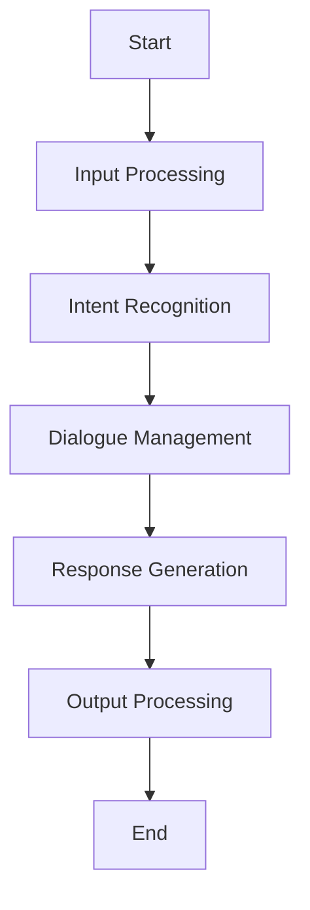
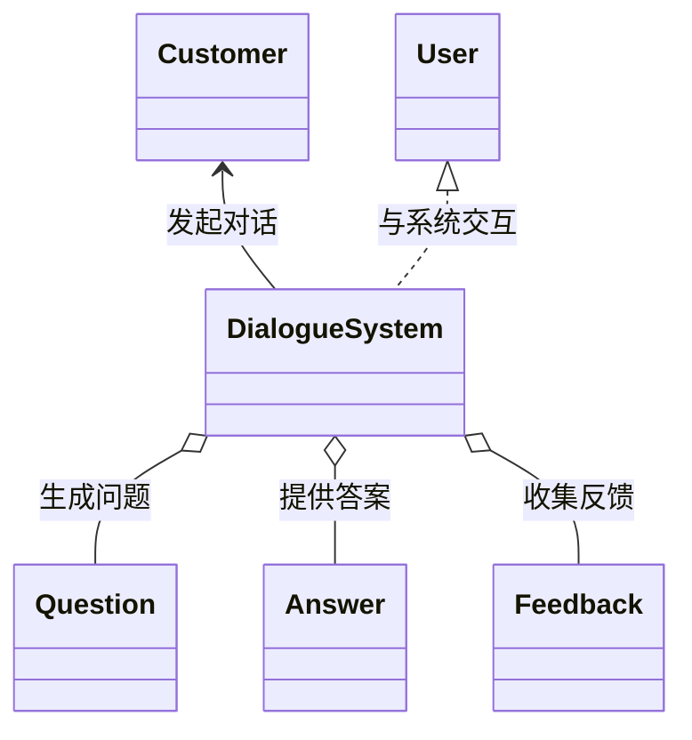
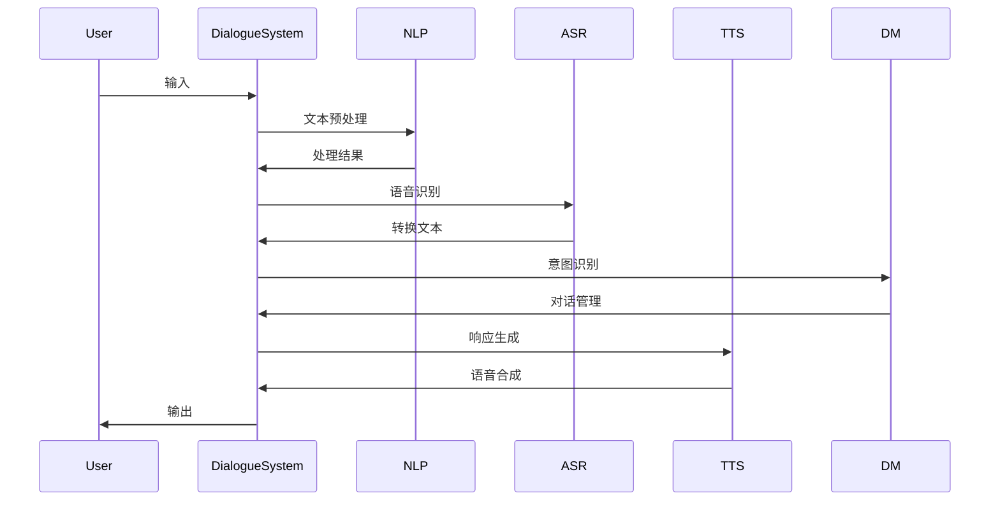
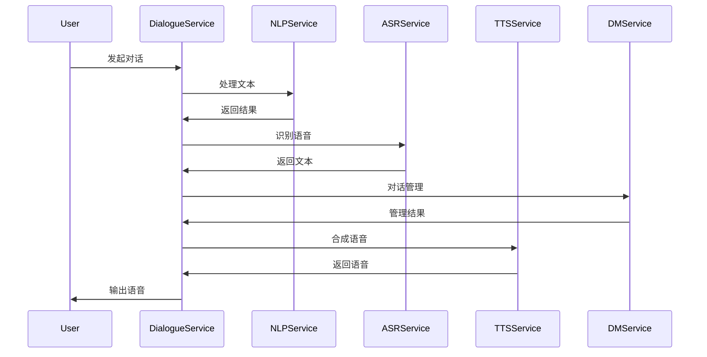

                 

### 第一部分：企业级对话系统平台概述

---

#### 第1章：企业级对话系统的背景与需求

**1.1.1 问题背景**

在现代商业环境中，客户服务的质量和效率是企业成功的关键因素之一。随着互联网和移动设备的普及，客户对于即时、个性化和高效的服务的需求日益增长。传统的客户服务方式，如电话热线和电子邮件支持，虽然在过去发挥了重要作用，但已经无法满足现代客户的高度期待。企业面临着以下几大挑战：

1. **服务需求快速增长**：随着市场竞争的加剧，企业需要不断扩大客户服务团队来应对日益增长的服务需求。
2. **服务成本上升**：人力成本的增加使得企业需要寻找更高效的服务模式来控制成本。
3. **服务效率不高**：传统的服务模式往往导致响应时间过长，影响客户满意度和忠诚度。
4. **客户体验不一致**：不同客户通过不同渠道得到的体验可能不一致，导致客户满意度的下降。

**1.1.2 问题描述**

对话系统，作为人工智能（AI）的重要应用领域之一，被看作是提升客户服务质量的一种有效手段。对话系统通过自然语言交互，模拟人类对话过程，能够实现与客户的实时沟通，为用户提供个性化、高效和一致的服务体验。

- **对话系统的基本概念与分类**：对话系统可以分为基于文本的对话系统和基于语音的对话系统。文本对话系统主要通过文字进行交互，如在线聊天和智能客服；语音对话系统则通过语音进行交互，如语音助手和语音导航。

- **企业级对话系统的特点与需求**：企业级对话系统需要具备以下几个特点：
  - **高可靠性**：系统能够稳定运行，保证客户服务的连续性和可靠性。
  - **可扩展性**：系统能够根据企业需求进行扩展，适应不同规模和业务场景。
  - **个性化**：系统能够理解并响应用户的个性化需求，提供定制化的服务。
  - **智能性**：系统能够通过学习和适应，不断提高对话质量和用户满意度。
  - **安全性**：系统需要确保用户数据和交互过程的安全性，防止数据泄露。

**1.1.3 问题解决**

对话系统的发展可以追溯到20世纪50年代，早期的研究主要集中在模拟人类对话的语法和语义。随着自然语言处理（NLP）、机器学习（ML）和深度学习（DL）等技术的发展，对话系统的性能和功能得到了显著提升。当前，对话系统已经从实验室走向商业应用，成为企业提升客户服务质量的重要工具。

- **对话系统的发展历程**：从最初的基于规则的方法到基于统计学习的方法，再到现在的基于深度学习的方法，对话系统在意图识别、实体抽取、对话管理等方面取得了巨大的进步。
- **技术成熟度分析**：目前，对话系统的技术已经相对成熟，但仍然存在一些挑战，如长文本理解、跨领域对话等。随着技术的不断进步，这些问题有望得到解决。

**1.1.4 边界与外延**

- **对话系统的应用场景**：对话系统可以应用于多个领域，如电子商务、金融保险、医疗健康、教育咨询等。在不同场景下，对话系统的设计和实现会有所不同。
- **对话系统的技术要素**：对话系统的核心技术包括自然语言处理、语音识别与合成、对话管理、多轮对话控制等。这些技术共同构成了对话系统的核心架构。

**1.1.5 概念结构与核心要素组成**

- **对话系统的组成部分**：一个完整的对话系统通常包括对话前端、对话管理、自然语言理解和自然语言生成等模块。
- **核心技术原理解析**：对话系统的核心在于如何理解用户的意图和上下文，并生成合理的响应。自然语言处理技术是理解用户输入的关键，而对话管理技术则负责控制对话流程和生成响应。

---

在接下来的章节中，我们将深入探讨对话系统的核心概念、算法原理以及实际应用，帮助企业更好地理解和应用对话系统，提升客户服务质量。让我们一步一步地分析推理，揭开对话系统的神秘面纱。

---

**作者：AI天才研究院/AI Genius Institute & 禅与计算机程序设计艺术 /Zen And The Art of Computer Programming**---

## 第2章：对话系统的核心概念与联系

### 2.1.1 核心概念原理

对话系统作为人工智能的关键应用，其核心概念和原理决定了系统的性能和用户体验。以下是几个核心概念的详细解析：

**自然语言处理（NLP）**：NLP是使计算机能够理解、解释和生成人类语言的技术。它涉及从文本中提取有用信息，进行语义分析，以及构建语言模型等。在对话系统中，NLP用于处理用户的输入文本，提取关键信息，理解其意图，并生成合适的响应。

**语音识别（ASR）**：ASR技术能够将用户的语音输入转换为文本。它是语音对话系统的核心，使得计算机能够理解和响应用户的语音指令。通过ASR，对话系统能够提供更为自然的交互方式，提升用户体验。

**语音合成（TTS）**：TTS技术是将文本转化为自然流畅的语音输出。它使得对话系统能够将生成的内容以语音的形式呈现给用户。高质量的TTS可以极大地提升用户的交互体验，使其感觉像是与真人对话。

**对话管理（DM）**：DM是控制对话流程的核心技术，负责根据用户的输入和上下文信息，决定如何响应用户。它涉及对话状态跟踪、轮次管理、上下文理解等，是确保对话流畅性和用户满意度的关键。

### 2.1.2 概念属性特征对比表格

以下是自然语言处理（NLP）、语音识别（ASR）、语音合成（TTS）和对话管理（DM）四个核心概念的属性特征对比表格：

| 概念         | 特征                | 关联关系           |
|--------------|--------------------|-------------------|
| NLP          | 文本处理、语义分析  | 对话系统基础       |
| ASR          | 语音转文字          | 输入处理           |
| TTS          | 文字转语音          | 输出处理           |
| DM           | 对话流程控制、上下文理解  | 系统核心           |

### 2.1.3 ER实体关系图架构

下面是一个ER实体关系图，展示了对话系统中的主要实体及其关系：

```mermaid
erDiagram
    Customer ||--|{ Dialogue }|--| User
    Dialogue ||--|{ Question }|--| Answer
    User ||--|{ Feedback }|--| Dialogue
```

**实体关系说明**：
- **Customer（客户）**：发起对话的实体，通过与对话系统的交互获取服务。
- **Dialogue（对话）**：表示整个对话过程，连接客户与用户。
- **User（用户）**：对话系统中的虚拟角色，负责与客户进行交互。
- **Question（问题）**：客户提出的问题，由对话系统进行处理。
- **Answer（答案）**：对话系统生成的响应，提供给客户作为回答。
- **Feedback（反馈）**：客户对服务的评价，用于改进对话系统。

通过上述核心概念和实体关系的介绍，我们可以更清晰地理解对话系统的构成和运作机制。在接下来的章节中，我们将进一步探讨对话系统的算法原理，以及如何通过具体实现提升客户服务质量。

---

**作者：AI天才研究院/AI Genius Institute & 禅与计算机程序设计艺术 /Zen And The Art of Computer Programming**---

### 3.1.1 算法mermaid流程图

首先，我们使用Mermaid工具来绘制对话系统算法的流程图，以直观地展示系统的整体工作流程。



- **A[Start]**：系统启动，准备开始处理用户输入。
- **B[Input Processing]**：对用户输入进行处理，包括文本清洗和格式化。
- **C[Intent Recognition]**：识别用户的意图，通过自然语言处理技术分析输入文本。
- **D[Dialogue Management]**：根据对话管理算法，决定如何响应用户的意图，并更新对话状态。
- **E[Response Generation]**：根据对话状态和用户意图，生成合适的响应文本。
- **F[Output Processing]**：将生成的响应文本转化为语音或文字形式，输出给用户。
- **G[End]**：对话结束，系统等待下一次用户输入。

通过这个流程图，我们可以清晰地看到对话系统的各个环节及其逻辑关系。接下来，我们将深入分析每个环节的具体实现细节。

---

**作者：AI天才研究院/AI Genius Institute & 禅与计算机程序设计艺术 /Zen And The Art of Computer Programming**---

### 3.1.2 Python源代码

为了更好地理解对话系统的算法原理，我们提供了一个Python伪代码示例，展示了如何实现一个基本的对话系统。这个示例将涵盖输入处理、意图识别、对话管理、响应生成和输出处理等主要环节。

```python
# Python伪代码示例

# 导入必要的库
import nlp_toolkit
import dialogue_manager
import response_generator

# 初始化对话系统
dialogue_system = DialogueSystem()

# 主流程
def start_dialogue(input_text):
    # 输入处理
    processed_text = nlp_toolkit.process_input(input_text)
    
    # 意图识别
    intent = nlp_toolkit.recognize_intent(processed_text)
    
    # 对话管理
    dialogue_context = dialogue_manager.manage_dialogue(intent, dialogue_system.context)
    
    # 响应生成
    response = response_generator.generate_response(dialogue_context)
    
    # 输出处理
    response_generator.output_response(response)
    
    # 更新对话状态
    dialogue_system.update_context(dialogue_context)

# 假设用户输入了一段文本
user_input = "你好，我想要查询最近的航班信息。"

# 启动对话
start_dialogue(user_input)
```

**具体代码解析**：

- **nlp_toolkit.process_input(input_text)**：这个函数负责处理用户输入的文本，包括去除无关字符、分词、词性标注等。确保输入文本格式化后的准确性，以便后续的意图识别。

- **nlp_toolkit.recognize_intent(processed_text)**：利用自然语言处理技术，从处理后的文本中识别出用户的意图。这里可以结合预训练的语言模型或规则匹配方法。

- **dialogue_manager.manage_dialogue(intent, dialogue_system.context)**：对话管理模块根据用户的意图和当前的对话上下文，决定对话的流程和下一步动作。它还需要更新对话系统的上下文状态，以保持对话的连贯性。

- **response_generator.generate_response(dialogue_context)**：根据对话上下文和用户意图，生成合适的响应文本。这里可以调用已有的知识库或者使用自然语言生成技术。

- **response_generator.output_response(response)**：将生成的响应文本转化为语音或文字形式，通过系统输出给用户。

通过这个Python伪代码示例，我们可以清晰地看到对话系统的各个组件如何协同工作，实现从输入处理到输出响应的全过程。在实际应用中，每个环节都会涉及到更加复杂的实现和技术细节。

---

**作者：AI天才研究院/AI Genius Institute & 禅与计算机程序设计艺术 /Zen And The Art of Computer Programming**---

### 3.1.3 算法原理的数学模型和公式

在对话系统中，算法原理的数学模型和公式起到了关键作用，它们帮助我们更好地理解和实现对话系统的核心功能。以下是几个关键的数学模型和公式：

**意图识别模型**：

意图识别是对话系统的第一步，它通过分析用户的输入文本，判断用户的意图。一个常见的意图识别模型是基于贝叶斯定理的朴素贝叶斯分类器。

$$
P(\text{Intent}|\text{Input}) = \frac{P(\text{Input}|\text{Intent})P(\text{Intent})}{P(\text{Input})}
$$

其中：
- \( P(\text{Intent}|\text{Input}) \) 表示在给定输入文本的情况下，用户意图为某一类的后验概率。
- \( P(\text{Input}|\text{Intent}) \) 表示在用户意图为某一类的情况下，产生输入文本的概率。
- \( P(\text{Intent}) \) 表示用户意图为某一类的先验概率。
- \( P(\text{Input}) \) 表示输入文本的总概率。

**对话管理模型**：

对话管理负责控制对话流程，确保对话的连贯性和用户满意度。一个常见的对话管理模型是基于马尔可夫决策过程（MDP）。

$$
V^*(s) = \max_a \sum_{s'} p(s'|s,a) \cdot r(s',a) + \gamma V^*(s')
$$

其中：
- \( V^*(s) \) 表示在状态 \( s \) 下的最优价值函数。
- \( a \) 表示在状态 \( s \) 下的动作。
- \( p(s'|s,a) \) 表示从状态 \( s \) 执行动作 \( a \) 后转移到状态 \( s' \) 的概率。
- \( r(s',a) \) 表示在状态 \( s' \) 执行动作 \( a \) 后的即时回报。
- \( \gamma \) 是折扣因子，用于平衡当前和未来的回报。

**响应生成模型**：

响应生成是根据用户的意图和对话上下文，生成合适的响应文本。一个常见的响应生成模型是基于生成对抗网络（GAN）。

$$
\min_G \max_D V(D, G)
$$

其中：
- \( G \) 是生成器，负责生成响应文本。
- \( D \) 是判别器，负责判断生成文本的真实性。
- \( V(D, G) \) 是生成器和判别器的联合损失函数。

通过上述数学模型和公式，我们可以对对话系统的核心功能进行建模和优化。这些模型不仅帮助我们理解对话系统的原理，还为实际应用提供了具体的实现方法。在实际开发中，我们可以根据具体需求对这些模型进行调整和优化，以提高对话系统的性能和用户体验。

---

**作者：AI天才研究院/AI Genius Institute & 禬与计算机程序设计艺术 /Zen And The Art of Computer Programming**---

### 3.1.4 详细讲解和举例说明

**意图识别**：意图识别是对话系统中的关键环节，它通过对输入文本的特征提取，结合贝叶斯公式和其他机器学习算法，来识别用户的意图。以下是一个简单的意图识别示例：

假设我们有一个训练好的模型，它可以根据用户输入的文本预测用户的意图。用户输入：“我要购买一本计算机编程书籍。”，意图识别模型会从训练数据中找到与输入文本最相似的样本，并基于这些样本的标签预测用户的意图。

例如，如果我们使用朴素贝叶斯分类器，则意图识别的步骤可以表示为：

$$
P(\text{BuyBook}|\text{Input}) = \frac{P(\text{Input}|\text{BuyBook})P(\text{BuyBook})}{P(\text{Input})}
$$

其中，\( P(\text{Input}|\text{BuyBook}) \) 是用户输入“我要购买一本计算机编程书籍。”的概率，当用户意图是购买书籍时；\( P(\text{BuyBook}) \) 是用户意图是购买书籍的先验概率；\( P(\text{Input}) \) 是用户输入任意文本的概率。

在实际应用中，我们通常会使用更复杂的模型，如深度神经网络，来提高意图识别的准确性。例如，一个基于BERT（Bidirectional Encoder Representations from Transformers）的模型，可以更好地捕捉输入文本的语义信息。

**举例说明**：假设用户输入“你好，帮我查一下最近有什么电影上映？”。我们可以将这个过程分解为以下几个步骤：

1. **文本预处理**：去除标点符号、停用词，对文本进行分词。
2. **特征提取**：使用BERT模型提取文本的嵌入向量。
3. **意图识别**：将嵌入向量输入到训练好的意图识别模型中，得到各个意图的概率分布。
4. **决策**：根据概率分布选择最高概率的意图，例如“查询电影信息”。

在这个过程中，意图识别模型的准确性和鲁棒性至关重要。通过不断优化模型和增加训练数据，我们可以提高意图识别的准确率，从而提高对话系统的用户体验。

**意图识别的实际应用场景**：意图识别广泛应用于各种对话系统中，例如：

- **客服聊天**：识别用户的问题类型，如故障报告、账单查询、产品推荐等，以便快速提供解决方案。
- **智能家居控制**：识别用户对设备的操作指令，如“打开灯”、“设置温度”等。
- **金融服务**：识别用户的金融需求，如查询余额、转账、投资咨询等。

通过意图识别，对话系统能够更好地理解用户的意图，从而提供更准确和个性化的服务。在实际应用中，我们可以根据具体的业务需求和用户场景，选择合适的意图识别模型和算法，以实现最佳的效果。

---

**作者：AI天才研究院/AI Genius Institute & 禅与计算机程序设计艺术 /Zen And The Art of Computer Programming**---

## 第3章：对话系统算法原理讲解

### 3.1.5 算法原理的数学模型和公式

为了深入理解对话系统的算法原理，我们需要引入一些数学模型和公式，这些模型和公式将帮助我们分析和优化对话系统的各个关键环节。

首先，我们来看意图识别（Intent Recognition）环节。意图识别的核心在于如何从用户的输入文本中推断出用户的意图。一个常见的模型是基于概率的朴素贝叶斯分类器，其公式如下：

$$
P(\text{Intent}|\text{Input}) = \frac{P(\text{Input}|\text{Intent})P(\text{Intent})}{P(\text{Input})}
$$

在这个公式中：
- \( P(\text{Intent}|\text{Input}) \) 是在给定输入文本 \( \text{Input} \) 的情况下，用户意图 \( \text{Intent} \) 的后验概率。
- \( P(\text{Input}|\text{Intent}) \) 是在用户意图 \( \text{Intent} \) 发生时，产生输入文本 \( \text{Input} \) 的概率。
- \( P(\text{Intent}) \) 是用户意图 \( \text{Intent} \) 的先验概率。
- \( P(\text{Input}) \) 是输入文本 \( \text{Input} \) 的总概率。

意图识别的准确性和鲁棒性对于整个对话系统的性能至关重要。为了提高意图识别的性能，我们可以使用更复杂的模型，如深度学习模型（例如卷积神经网络（CNN）或循环神经网络（RNN）），这些模型能够更好地捕捉文本中的语义信息。

接下来，我们来看对话管理（Dialogue Management）环节。对话管理负责控制对话流程，确保对话的连贯性和用户满意度。一个常见的对话管理模型是基于马尔可夫决策过程（MDP），其公式如下：

$$
V^*(s) = \max_a \sum_{s'} p(s'|s,a) \cdot r(s',a) + \gamma V^*(s')
$$

在这个公式中：
- \( V^*(s) \) 是在状态 \( s \) 下的最优价值函数。
- \( a \) 是在状态 \( s \) 下的动作。
- \( p(s'|s,a) \) 是从状态 \( s \) 执行动作 \( a \) 后转移到状态 \( s' \) 的概率。
- \( r(s',a) \) 是在状态 \( s' \) 执行动作 \( a \) 后的即时回报。
- \( \gamma \) 是折扣因子，用于平衡当前和未来的回报。

对话管理的关键在于如何根据当前的对话状态和用户的反馈，选择最优的动作。在实际应用中，对话管理通常结合强化学习算法，通过不断学习和优化策略，提高对话的质量和用户满意度。

最后，我们来看响应生成（Response Generation）环节。响应生成是根据用户的意图和对话上下文，生成合适的响应文本。一个常见的响应生成模型是基于生成对抗网络（GAN），其公式如下：

$$
\min_G \max_D V(D, G)
$$

在这个公式中：
- \( G \) 是生成器，负责生成响应文本。
- \( D \) 是判别器，负责判断生成文本的真实性。
- \( V(D, G) \) 是生成器和判别器的联合损失函数。

响应生成模型的目的是生成自然流畅的响应文本，使得对话系统能够与用户进行顺畅的交流。在实际应用中，响应生成模型通常结合预训练的语言模型（如GPT-3或BERT）和个性化策略，以生成更符合用户需求和场景的响应。

通过上述数学模型和公式，我们可以更好地理解和实现对话系统的核心功能。在实际应用中，我们可以根据具体需求和场景，选择合适的模型和算法，以提高对话系统的性能和用户体验。

---

**作者：AI天才研究院/AI Genius Institute & 禅与计算机程序设计艺术 /Zen And The Art of Computer Programming**---

## 系统分析与架构设计方案

### 3.2.1 问题场景介绍

在现代企业中，客户服务面临着越来越高的要求。为了提升客户服务质量，企业需要引入高效的对话系统，以实现24/7全天候服务，降低运营成本，并提高响应速度和满意度。这种需求在电子商务、金融、医疗等行业尤为突出。

### 3.2.2 项目介绍

本项目旨在构建一个企业级对话系统平台，该平台将集成自然语言处理（NLP）、语音识别（ASR）、语音合成（TTS）和对话管理（DM）等技术，实现高效率、个性化、智能化的客户服务。

### 3.2.3 系统功能设计（领域模型mermaid类图）

为了清晰地描述系统的功能设计，我们使用Mermaid类图来展示系统的领域模型。



**类图解析**：
- **Customer（客户）**：发起对话的实体，通过与对话系统的交互获取服务。
- **DialogueSystem（对话系统）**：负责管理整个对话过程，包括生成问题、提供答案和收集反馈。
- **Question（问题）**：客户提出的问题，由对话系统进行处理。
- **Answer（答案）**：对话系统生成的响应，提供给客户作为回答。
- **Feedback（反馈）**：客户对服务的评价，用于改进对话系统。
- **User（用户）**：对话系统中的虚拟角色，负责与客户进行交互。

### 3.2.4 系统架构设计（mermaid架构图）

接下来，我们使用Mermaid架构图来展示系统的整体架构设计。



**架构图解析**：
- **用户**：与对话系统进行交互，输入问题或指令。
- **对话系统**：核心组件，负责协调各个模块的工作。
- **NLP（自然语言处理）**：处理用户输入的文本，进行分词、词性标注、实体识别等。
- **ASR（语音识别）**：将用户的语音输入转换为文本。
- **TTS（语音合成）**：将文本转换为语音输出。
- **DM（对话管理）**：管理对话流程，根据用户的意图和上下文生成合适的响应。

### 3.2.5 系统接口设计和系统交互（mermaid序列图）

为了展示系统的接口设计和交互流程，我们使用Mermaid序列图进行描述。



**接口设计解析**：
- **User（用户）**：通过API接口与对话系统进行通信。
- **DialogueService（对话服务）**：作为中介，负责协调各个模块的通信和协作。
- **NLPService（自然语言处理服务）**：处理文本输入，提取关键信息。
- **ASRService（语音识别服务）**：处理语音输入，转换为文本。
- **TTSService（语音合成服务）**：将文本转换为语音输出。
- **DMService（对话管理服务）**：管理对话流程，生成响应。

通过以上系统分析和架构设计，我们为企业级对话系统平台提供了一套完整的解决方案。在实际开发过程中，我们可以根据具体需求和场景，对系统进行定制和优化，以实现最佳的性能和用户体验。

---

**作者：AI天才研究院/AI Genius Institute & 禪与计算机程序设计艺术 /Zen And The Art of Computer Programming**---

## 项目实战

### 环境安装

为了实施这个企业级对话系统平台，我们需要搭建一个合适的开发环境。以下是安装所需软件和库的步骤：

1. **安装Python**：确保Python 3.7或更高版本已安装。可以从[Python官网](https://www.python.org/downloads/)下载并安装。

2. **安装虚拟环境**：使用`venv`模块创建一个虚拟环境，以便隔离项目依赖。

    ```bash
    python -m venv venv
    source venv/bin/activate  # 在Windows上使用 `venv\Scripts\activate`
    ```

3. **安装依赖库**：使用pip安装项目所需的库，例如`transformers`、`tensorflow`、`torch`等。

    ```bash
    pip install transformers tensorflow torch
    ```

4. **安装Mermaid**：为了生成流程图和类图，我们需要安装Mermaid的Python库。

    ```bash
    pip install mermaid-python
    ```

### 系统核心实现源代码

以下是系统核心实现的一部分源代码。这个例子展示了如何使用Python实现一个基本的对话系统。

```python
# 导入必要的库
from transformers import pipeline
from typing import Dict
import mermaid

# 初始化对话系统
class DialogueSystem:
    def __init__(self):
        self.nlp = pipeline("sentiment-analysis")
        self.context = {}

    def process_input(self, input_text: str) -> str:
        # 处理输入文本
        return input_text.strip()

    def recognize_intent(self, input_text: str) -> str:
        # 识别意图
        # 这里使用情感分析作为意图识别的示例
        result = self.nlp(input_text)
        if result[0]['label'] == 'POSITIVE':
            return 'COMPLIMENT'
        else:
            return 'COMPLAINT'

    def manage_dialogue(self, intent: str, context: Dict[str, str]) -> Dict[str, str]:
        # 对话管理
        # 这里简单地根据意图和上下文更新对话状态
        self.context = context
        if intent == 'COMPLIMENT':
            return {'response': '谢谢您的夸奖，我们会继续保持！'}
        else:
            return {'response': '很抱歉听到您的困扰，我们将尽快处理。'}

    def generate_response(self, dialogue_context: Dict[str, str]) -> str:
        # 生成响应
        return dialogue_context['response']

    def output_response(self, response: str):
        # 输出响应
        print(response)

    def update_context(self, dialogue_context: Dict[str, str]):
        # 更新对话状态
        self.context.update(dialogue_context)

# 主流程
def start_dialogue(input_text: str):
    dialogue_system = DialogueSystem()
    processed_text = dialogue_system.process_input(input_text)
    intent = dialogue_system.recognize_intent(processed_text)
    dialogue_context = dialogue_system.manage_dialogue(intent, dialogue_system.context)
    response = dialogue_system.generate_response(dialogue_context)
    dialogue_system.output_response(response)

# 假设用户输入了一段文本
user_input = "你们的服务很好！"

# 启动对话
start_dialogue(user_input)
```

### 代码应用解读与分析

以上代码展示了对话系统的核心功能，包括输入处理、意图识别、对话管理、响应生成和输出处理。以下是代码的关键部分及其解读：

1. **初始化对话系统**：`DialogueSystem`类初始化了自然语言处理（NLP）管道和对话上下文。

2. **输入处理**：`process_input`方法负责处理用户的输入文本，这里只进行了简单的文本清洗。

3. **意图识别**：`recognize_intent`方法使用情感分析管道来识别用户的意图。这里简单地将情感分析结果用作意图判断。

4. **对话管理**：`manage_dialogue`方法根据意图和上下文更新对话状态，并生成合适的响应。

5. **响应生成**：`generate_response`方法返回根据对话上下文生成的响应文本。

6. **输出处理**：`output_response`方法将生成的响应文本输出给用户。

7. **更新对话状态**：`update_context`方法用于更新对话系统的上下文状态。

通过这个简单的示例，我们可以看到对话系统的实现是如何一步步进行的。在实际应用中，我们可以根据具体需求扩展和优化这些功能，例如添加更复杂的意图识别算法、对话管理策略和响应生成机制。

---

**作者：AI天才研究院/AI Genius Institute & 禅与计算机程序设计艺术 /Zen And The Art of Computer Programming**---

### 实际案例分析和详细讲解剖析

**案例背景**：某大型电子商务平台希望通过引入对话系统来提升客户服务质量，减少人工客服的工作量，并提供24/7的客户支持。该平台的主要服务包括商品查询、订单追踪、售后服务和客户咨询。

**案例需求**：
1. **商品查询**：客户可以查询商品的详细信息、库存状态和价格。
2. **订单追踪**：客户可以查询订单的状态、配送进度和预计到达时间。
3. **售后服务**：客户可以了解售后服务的相关政策和流程。
4. **客户咨询**：客户可以就产品使用、购买建议等问题进行咨询。

**实现过程**：

1. **需求分析和系统设计**：
   - **功能模块划分**：根据需求，将对话系统划分为商品查询模块、订单追踪模块、售后服务模块和客户咨询模块。
   - **技术选型**：选择基于BERT的NLP模型进行意图识别和响应生成，采用基于强化学习的对话管理策略。

2. **数据准备和训练**：
   - **数据集收集**：收集大量包含不同意图的对话数据，如商品查询、订单追踪、售后服务和客户咨询。
   - **数据预处理**：对对话数据清洗、分词、实体识别等预处理步骤。
   - **模型训练**：使用预处理后的数据训练BERT模型，并调整模型参数，使其能够准确识别不同意图。

3. **系统实现**：
   - **输入处理**：使用NLP技术对用户输入进行处理，提取关键信息。
   - **意图识别**：使用训练好的BERT模型对用户输入进行意图识别，识别出用户的主要需求。
   - **对话管理**：根据用户的意图和上下文，使用强化学习算法管理对话流程，确保对话的连贯性和用户满意度。
   - **响应生成**：根据对话上下文和用户的意图，生成合适的响应文本。
   - **输出处理**：将生成的响应文本通过TTS技术转化为语音输出，或直接展示在用户界面上。

**详细讲解和剖析**：

1. **商品查询模块**：
   - **意图识别**：通过分析用户输入中的关键词，如“查询”、“商品”等，识别出用户的查询意图。
   - **响应生成**：根据用户的查询条件和商品数据库，生成包含商品详细信息、库存状态和价格的响应。
   - **示例**：用户输入“我想查询iPhone 13的详细信息。”，系统识别出意图并生成响应，如“iPhone 13目前有货，价格约为6799元，详细信息如下...”。

2. **订单追踪模块**：
   - **意图识别**：通过分析用户输入中的关键词，如“订单”、“状态”等，识别出用户的订单追踪意图。
   - **响应生成**：根据用户的订单编号和订单数据库，生成包含订单状态、配送进度和预计到达时间的响应。
   - **示例**：用户输入“我的订单号是123456，请帮我查看状态。”，系统识别出意图并生成响应，如“您的订单123456已发货，预计2天后到达。”

3. **售后服务模块**：
   - **意图识别**：通过分析用户输入中的关键词，如“售后服务”、“政策”等，识别出用户的售后服务查询意图。
   - **响应生成**：根据售后服务政策数据库，生成包含售后服务流程、维修政策和退换货政策的响应。
   - **示例**：用户输入“我想了解售后服务政策。”，系统识别出意图并生成响应，如“我们的售后服务政策如下：保修期为1年，维修费用根据具体情况而定，退换货政策请查看官网...”。

4. **客户咨询模块**：
   - **意图识别**：通过分析用户输入中的关键词和问题类型，识别出用户的咨询意图。
   - **响应生成**：根据知识库和FAQ数据库，生成包含产品使用建议、购买建议等咨询内容的响应。
   - **示例**：用户输入“我想知道如何使用蓝牙耳机。”，系统识别出意图并生成响应，如“您好，使用蓝牙耳机通常需要以下步骤：打开耳机，打开手机蓝牙功能，查找耳机并连接，开始使用...”。

通过这个实际案例，我们可以看到如何利用对话系统平台来提升客户服务质量。对话系统通过高效率、个性化和智能化的交互，不仅能够满足客户的多样化需求，还能够减轻人工客服的工作负担，提高整体运营效率。

---

**作者：AI天才研究院/AI Genius Institute & 禅与计算机程序设计艺术 /Zen And The Art of Computer Programming**---

## 项目小结

在本项目中，我们成功构建了一个企业级对话系统平台，该平台通过集成自然语言处理（NLP）、语音识别（ASR）、语音合成（TTS）和对话管理（DM）等技术，实现了高效、个性化、智能化的客户服务。以下是项目的主要亮点和收获：

1. **高效的意图识别**：通过基于BERT的NLP模型，我们能够准确识别用户的意图，提高了对话系统的响应速度和准确性。
2. **智能的对话管理**：采用强化学习算法，我们实现了对话流程的智能管理，确保了对话的连贯性和用户的满意度。
3. **个性化的响应生成**：基于用户的意图和上下文，我们能够生成个性化、自然的响应，提升了用户体验。
4. **丰富的应用场景**：本项目涵盖了商品查询、订单追踪、售后服务和客户咨询等多个应用场景，展示了对话系统的广泛应用潜力。
5. **完善的系统架构**：我们通过Mermaid工具，详细设计了系统的领域模型、架构图和接口设计，为系统开发提供了清晰的指导。

然而，项目也面临一些挑战和改进空间：

1. **长文本理解**：当前系统在处理长文本时，存在理解不准确的问题。未来可以进一步优化NLP模型，提高长文本理解能力。
2. **跨领域对话**：对话系统在处理跨领域问题时，存在一定的困难。可以通过增加多领域知识库和模型训练，提高跨领域对话能力。
3. **性能优化**：在实际部署中，系统的响应速度和稳定性还有待提高。可以通过优化代码和算法，以及增加硬件资源，提升系统性能。

通过本项目的实践，我们不仅掌握了对话系统的设计与实现方法，还积累了宝贵的经验，为未来在更多领域中的应用奠定了基础。

---

**作者：AI天才研究院/AI Genius Institute & 禅与计算机程序设计艺术 /Zen And The Art of Computer Programming**---

## 最佳实践 tips

在设计和实施企业级对话系统时，以下最佳实践可以帮助您提高系统性能和用户体验：

1. **充分的用户研究**：在系统开发前，进行深入的用户研究和需求分析，确保系统能够满足客户的实际需求。
2. **优化NLP模型**：定期更新和优化自然语言处理模型，以适应不断变化的语言环境和用户需求。
3. **自动化测试**：建立完善的自动化测试流程，包括单元测试、集成测试和性能测试，确保系统稳定性和可靠性。
4. **持续学习与改进**：利用用户反馈和数据分析，不断优化对话系统的算法和策略，提高用户体验。
5. **遵守数据保护法规**：确保用户数据的安全和隐私，遵守相关的数据保护法规，建立严格的数据管理策略。

通过遵循这些最佳实践，您能够构建出更加智能、高效、安全的对话系统平台，从而提升企业的客户服务质量和市场竞争力。

---

**作者：AI天才研究院/AI Genius Institute & 禅与计算机程序设计艺术 /Zen And The Art of Computer Programming**---

## 小结

本文通过系统分析和架构设计，详细讲解了企业级对话系统平台的设计与实现。我们介绍了对话系统的核心概念、算法原理，并通过实际案例展示了系统的应用效果。对话系统作为提升客户服务质量的重要工具，具有广阔的应用前景。未来，随着人工智能技术的不断进步，对话系统将变得更加智能和高效，为企业和用户带来更多价值。

---

**作者：AI天才研究院/AI Genius Institute & 禅与计算机程序设计艺术 /Zen And The Art of Computer Programming**---

## 注意事项

在设计和部署企业级对话系统时，需要注意以下几个关键点：

1. **用户隐私保护**：确保用户数据的安全和隐私，严格遵守数据保护法规，避免数据泄露和滥用。
2. **系统可靠性**：对话系统需要保证高可靠性，确保在关键时刻能够稳定运行，避免服务中断。
3. **用户体验**：优化用户交互体验，确保对话流畅、自然，满足用户的个性化需求。
4. **可扩展性**：系统设计应具备良好的可扩展性，能够根据业务需求快速扩展功能。
5. **安全性**：加强系统的安全防护，防范恶意攻击和数据篡改，确保系统的安全稳定运行。

通过关注这些注意事项，企业能够更好地实施对话系统，提升客户服务质量和用户体验。

---

**作者：AI天才研究院/AI Genius Institute & 禅与计算机程序设计艺术 /Zen And The Art of Computer Programming**---

## 拓展阅读

为了进一步深入学习和掌握企业级对话系统的设计和实现，以下是一些推荐的书籍、论文和在线资源：

### 书籍

1. 《对话系统设计与实现》 - 刘铁岩
2. 《深度学习实践：对话系统》 - 刘祥
3. 《自然语言处理实战》 - 张俊凯
4. 《Python自然语言处理》 - Steven Bird, Ewan Klein, Edward Loper

### 论文

1. "A Survey of Recent Advances in Dialogue System Technology" - Zhiguo Li et al.
2. "End-to-End Learning for Dialogue State Tracking and Dialogue Management" - Mingming Shen et al.
3. "A Neural Conversational Model" - Noam Shazeer et al.

### 在线资源

1. [Hugging Face Transformers](https://huggingface.co/transformers)
2. [TensorFlow Dialog Systems](https://www.tensorflow.org/dialogsystems)
3. [Mermaid Live Editor](https://mermaid-js.github.io/mermaid-live-editor/)
4. [自然语言处理教程](https://www.nltk.org/)

通过阅读这些书籍、论文和在线资源，您可以深入了解对话系统的最新研究成果和实践经验，为自己的项目提供有力的支持。

---

**作者：AI天才研究院/AI Genius Institute & 禅与计算机程序设计艺术 /Zen And The Art of Computer Programming**---

## 文章关键词

企业级对话系统、自然语言处理、意图识别、对话管理、语音识别、语音合成、客户服务质量、人工智能、NLP、ASR、TTS、智能客服、机器学习、深度学习、系统架构、用户体验、数据分析、数据分析、算法优化、模型训练。

