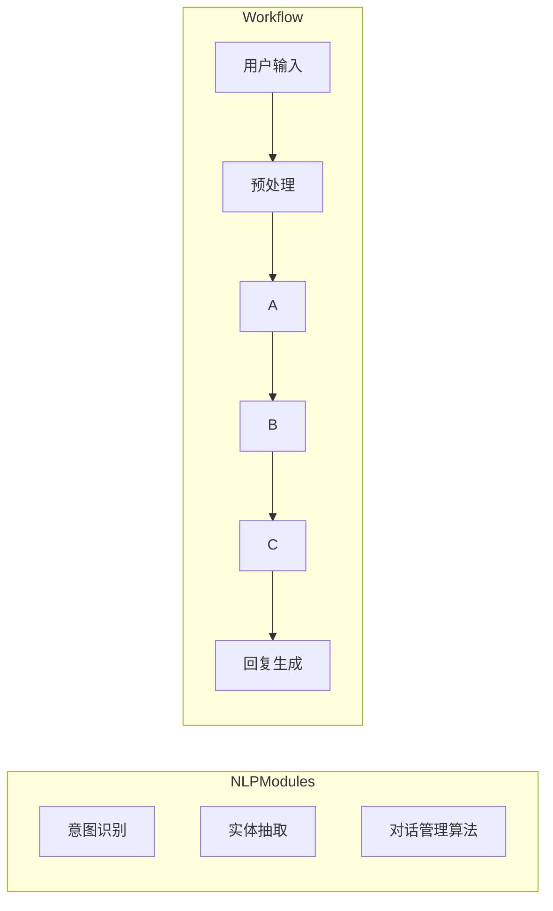
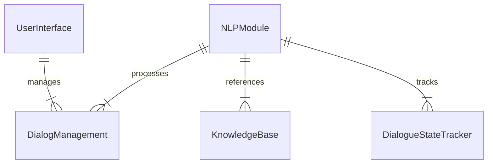
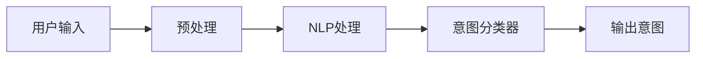
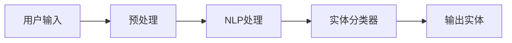
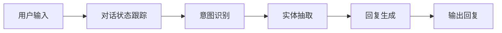

                 

### 1.2 核心概念与联系

在本章中，我们将深入探讨企业级对话系统中几个关键的概念，并分析它们之间的相互关系。

### 1.2.1 对话系统架构

对话系统架构是构建企业级对话系统的基础。它通常包括以下几个主要组成部分：

1. **用户接口（UI）**：用户与对话系统交互的界面，可以是文本聊天窗口、语音识别界面等。
2. **对话管理模块**：负责处理用户的请求，理解用户的意图，并根据对话上下文生成合适的回复。
3. **自然语言处理（NLP）模块**：用于处理和理解用户输入的自然语言，包括意图识别、实体抽取、语言生成等任务。
4. **知识库**：存储对话系统所需的知识和信息，包括产品信息、业务规则、常见问题解答等。
5. **对话状态跟踪**：记录对话过程中的关键信息，如用户身份、历史对话内容、上下文等。

下面是一个简单的Mermaid类图，展示了对话系统架构的组成部分及其关系：

```mermaid
classDiagram
  UserInterface <|-- DialogManagement
  DialogManagement <|-- NLPModule
  NLPModule <|-- KnowledgeBase
  NLPModule <|-- DialogueStateTracker
  UserInterface o--^ DialogManagement
  DialogManagement o--^ NLPModule
  NLPModule o--^ KnowledgeBase
  NLPModule o--^ DialogueStateTracker
```

### 1.2.2 核心算法原理

企业级对话系统的核心算法包括意图识别、实体抽取、对话管理算法等。以下是一个Mermaid流程图，展示了这些算法的基本工作流程：



### 1.2.3 概念属性特征对比表格

为了更好地理解对话系统的核心概念，我们可以通过一个表格来对比它们的属性特征。以下是一个简单的表格：

| 概念 | 属性特征 | 描述 |
| ---- | ---- | ---- |
| 用户接口 | 输入输出接口 | 用户与对话系统进行交互的界面，可以是文本或语音形式 |
| 对话管理模块 | 对话上下文管理 | 负责跟踪对话状态，确保对话连贯性和一致性 |
| 自然语言处理模块 | 意图识别、实体抽取 | 对自然语言进行处理，理解用户意图和提取关键信息 |
| 知识库 | 知识存储 | 存储对话系统所需的知识和信息 |
| 对话状态跟踪 | 历史记录 | 记录对话过程中的关键信息，用于生成上下文相关的回复 |

### 1.2.4 ER实体关系图架构

为了进一步理解对话系统的核心组成部分，我们可以通过ER实体关系图来展示它们之间的关系。以下是一个简单的Mermaid ER图：



### 1.2.5 总结

通过本章的介绍，我们了解了企业级对话系统的核心概念、架构及其相互关系。接下来，我们将进一步探讨每个核心概念的具体实现和应用，帮助读者深入理解企业级对话系统的构建和优化。

### 第2章：企业级对话系统的关键算法

企业级对话系统的核心在于其能够理解用户意图、提取关键信息并生成合适的回复。在这一章中，我们将深入探讨企业级对话系统的关键算法，包括意图识别、实体抽取和对话管理算法，并分析它们的原理和应用。

#### 2.1 意图识别算法

意图识别是自然语言处理（NLP）中的关键步骤，它旨在从用户输入中推断出用户的意图。意图识别算法通过训练大量的数据集，使得模型能够识别出用户输入中的意图。

##### 2.1.1 意图识别算法原理

意图识别算法通常基于机器学习，尤其是深度学习模型。以下是一个使用Mermaid绘制的意图识别算法的基本流程图：



预处理阶段包括分词、词性标注、去除停用词等。NLP处理阶段使用深度学习模型（如卷积神经网络（CNN）或循环神经网络（RNN））对预处理后的文本进行特征提取。意图分类器通常是一个多分类模型，它将输入文本映射到一个或多个意图类别。

##### 2.1.2 意图识别算法应用

意图识别算法在企业级对话系统中具有广泛的应用。例如，在客户服务中，意图识别可以帮助系统快速识别用户的需求，如查询产品信息、解决问题或进行订单处理。

下面是一个简单的例子，说明如何使用Python代码实现意图识别算法：

```python
import tensorflow as tf
from tensorflow.keras.models import Sequential
from tensorflow.keras.layers import Embedding, LSTM, Dense

# 假设我们已经有一个预处理的语料库和相应的意图标签
# X_train: 训练数据
# y_train: 对应的意图标签

# 构建意图识别模型
model = Sequential([
    Embedding(input_dim=vocab_size, output_dim=embedding_dim),
    LSTM(units=128),
    Dense(units=num_intents, activation='softmax')
])

# 编译模型
model.compile(optimizer='adam', loss='categorical_crossentropy', metrics=['accuracy'])

# 训练模型
model.fit(X_train, y_train, epochs=10, batch_size=32)

# 预测意图
predicted_intent = model.predict([user_input])
print(f"Predicted Intent: {predicted_intent}")
```

#### 2.2 实体抽取算法

实体抽取是另一个重要的NLP任务，它旨在从用户输入中提取出关键信息，如人名、地点、日期等。实体抽取算法通常基于规则或机器学习模型。

##### 2.2.1 实体抽取算法原理

实体抽取算法的原理类似于意图识别，也涉及预处理、特征提取和分类。以下是一个使用Mermaid绘制的实体抽取算法的基本流程图：



预处理阶段包括分词、词性标注等。NLP处理阶段使用深度学习模型或规则引擎对预处理后的文本进行特征提取。实体分类器通常是一个多标签分类模型，它将输入文本映射到多个实体类别。

##### 2.2.2 实体抽取算法应用

实体抽取算法在企业级对话系统中也有广泛的应用。例如，在客户服务中，实体抽取可以帮助系统自动提取用户的姓名、地址、联系方式等信息，从而快速响应用户请求。

下面是一个简单的例子，说明如何使用Python代码实现实体抽取算法：

```python
import tensorflow as tf
from tensorflow.keras.models import Sequential
from tensorflow.keras.layers import Embedding, LSTM, Dense

# 假设我们已经有一个预处理的语料库和相应的实体标签
# X_train: 训练数据
# y_train: 对应的实体标签

# 构建实体抽取模型
model = Sequential([
    Embedding(input_dim=vocab_size, output_dim=embedding_dim),
    LSTM(units=128),
    Dense(units=num_entities, activation='sigmoid')
])

# 编译模型
model.compile(optimizer='adam', loss='binary_crossentropy', metrics=['accuracy'])

# 训练模型
model.fit(X_train, y_train, epochs=10, batch_size=32)

# 预测实体
predicted_entities = model.predict([user_input])
print(f"Predicted Entities: {predicted_entities}")
```

#### 2.3 对话管理算法

对话管理是确保对话系统能够与用户保持流畅和有效沟通的关键。对话管理算法负责处理对话上下文、维护对话状态、生成合适的回复等。

##### 2.3.1 对话管理算法原理

对话管理算法通常基于对话状态跟踪和回复生成技术。以下是一个使用Mermaid绘制的对话管理算法的基本流程图：



对话状态跟踪阶段记录对话过程中的关键信息，如用户身份、历史对话内容、上下文等。意图识别和实体抽取阶段分别使用意图识别算法和实体抽取算法对用户输入进行处理。回复生成阶段根据对话上下文生成合适的回复。

##### 2.3.2 对话管理算法应用

对话管理算法在企业级对话系统中至关重要。例如，在客户服务中，对话管理算法可以帮助系统理解用户的需求，生成有针对性的回复，从而提高用户满意度。

下面是一个简单的例子，说明如何使用Python代码实现对话管理算法：

```python
import random

# 对话状态跟踪
dialog_state = {
    'user_id': 'user123',
    'last_intent': 'query_product_info',
    'last_entities': ['product_name']
}

# 意图识别函数
def recognize_intent(input_text):
    # 假设我们已经训练了一个意图识别模型
    # 这里使用随机选择一个意图作为示例
    return random.choice(['query_product_info', 'solve_problem'])

# 实体抽取函数
def extract_entities(input_text):
    # 假设我们已经训练了一个实体抽取模型
    # 这里使用随机选择一些实体作为示例
    return random.choice(['product_name', 'price'])

# 回复生成函数
def generate_response(intent, entities):
    if intent == 'query_product_info':
        return f"请问您需要关于哪个产品的信息？"
    elif intent == 'solve_problem':
        return f"我们可以帮您解决这个问题，请问具体是什么问题呢？"

# 用户输入
user_input = "我想要了解iPhone 13的最新价格。"

# 对话管理流程
current_intent = recognize_intent(user_input)
current_entities = extract_entities(user_input)
response = generate_response(current_intent, current_entities)

print(f"Response: {response}")
```

#### 2.4 总结

在本章中，我们详细探讨了企业级对话系统的关键算法，包括意图识别、实体抽取和对话管理算法。通过Python代码示例，我们了解了这些算法的实现和应用。在下一章中，我们将进一步探讨企业级对话系统的架构设计和最佳实践。

### 第3章：企业级对话系统的架构设计

企业级对话系统是一个复杂的系统，需要精心设计以确保其稳定性和扩展性。在这一章中，我们将详细介绍企业级对话系统的架构设计，包括系统功能设计、架构设计、接口设计和系统交互。

#### 3.1 系统功能设计

企业级对话系统的功能设计是其核心，它决定了系统是否能够满足企业的需求。以下是企业级对话系统的主要功能模块：

1. **用户接口**：提供用户与对话系统交互的界面，包括文本聊天窗口、语音识别界面等。
2. **自然语言处理（NLP）模块**：负责处理用户的输入文本，包括意图识别、实体抽取、情感分析等。
3. **对话管理模块**：负责维护对话状态，确保对话的连贯性和一致性，包括对话历史记录、上下文理解等。
4. **知识库**：存储对话系统所需的知识和信息，包括产品信息、业务规则、常见问题解答等。
5. **对话状态跟踪**：记录对话过程中的关键信息，如用户身份、历史对话内容、上下文等。
6. **回复生成模块**：根据对话上下文生成合适的回复，包括文本生成、语音合成等。

以下是一个使用Mermaid绘制的领域模型类图，展示了企业级对话系统的功能模块及其关系：

```mermaid
classDiagram
  UserInterface <<-- NLPModule : processes
  NLPModule <<-- DialogManagement : manages
  DialogManagement <<-- KnowledgeBase : accesses
  DialogManagement <<-- DialogueStateTracker : tracks
  NLPModule <..- ReplyGeneration : generates
```

#### 3.2 架构设计

企业级对话系统的架构设计需要考虑系统的可扩展性、稳定性和安全性。以下是企业级对话系统的一个典型架构设计：

1. **前端**：包括用户接口和用户交互逻辑，可以使用Web前端框架（如React或Vue.js）开发。
2. **后端**：包括NLP模块、对话管理模块、知识库和对话状态跟踪模块，可以使用微服务架构设计，每个模块都可以独立部署和扩展。
3. **数据存储**：包括关系型数据库（如MySQL或PostgreSQL）和非关系型数据库（如MongoDB或Redis），用于存储用户数据、对话历史记录和知识库。
4. **服务注册与发现**：使用服务注册与发现机制（如Eureka或Consul），确保后端模块能够动态地发现和连接其他模块。
5. **负载均衡**：使用负载均衡器（如Nginx或HAProxy）分配请求，确保系统的稳定性和可扩展性。
6. **安全与监控**：包括身份验证、授权、日志记录、监控和告警等，确保系统的安全性和可维护性。

以下是一个使用Mermaid绘制的系统架构图，展示了企业级对话系统的各个组成部分及其关系：

```mermaid
sequenceDiagram
    User -->|请求| Frontend
    Frontend -->|处理请求| Backend
    Backend -->|处理请求| NLPModule
    Backend -->|处理请求| DialogManagement
    Backend -->|处理请求| KnowledgeBase
    Backend -->|处理请求| DialogueStateTracker
    Backend -->|返回响应| Frontend
    Frontend -->|返回响应| User
```

#### 3.3 接口设计

企业级对话系统的接口设计需要考虑RESTful API设计原则，确保接口的简洁、易用和可扩展。以下是企业级对话系统的一些关键接口：

1. **用户接口**：包括创建会话、发送消息、接收消息等接口。
2. **NLP接口**：包括意图识别、实体抽取、情感分析等接口。
3. **对话管理接口**：包括维护对话状态、获取对话历史记录等接口。
4. **知识库接口**：包括查询知识库、更新知识库等接口。

以下是一个使用Mermaid绘制的接口序列图，展示了企业级对话系统的接口设计和调用流程：

```mermaid
sequenceDiagram
    User -->|创建会话| CreateSession
    User -->|发送消息| SendMessage
    User <--|接收消息| ReceiveMessage
    CreateSession -->|处理请求| NLPService
    SendMessage -->|处理请求| DialogManagementService
    SendMessage -->|处理请求| KnowledgeBaseService
    ReceiveMessage <--|处理结果| User
```

#### 3.4 系统交互

企业级对话系统的交互设计需要确保系统的各个模块能够高效地协同工作。以下是一些关键交互点：

1. **用户与前端交互**：用户通过前端界面与对话系统进行交互，前端将用户的请求转发到后端进行处理。
2. **后端与NLP模块交互**：后端通过NLP接口与NLP模块进行交互，以处理用户的意图识别和实体抽取。
3. **后端与对话管理模块交互**：后端通过对话管理接口与对话管理模块进行交互，以维护对话状态和生成回复。
4. **后端与知识库交互**：后端通过知识库接口与知识库进行交互，以查询和更新知识库中的信息。

以下是一个使用Mermaid绘制的系统交互图，展示了企业级对话系统的交互流程：

```mermaid
sequenceDiagram
    User -->|请求| Frontend
    Frontend -->|请求| Backend
    Backend -->|请求| NLPModule
    Backend -->|请求| DialogManagement
    Backend -->|请求| KnowledgeBase
    Backend -->|响应| Frontend
    Frontend -->|响应| User
```

#### 3.5 总结

在本章中，我们详细介绍了企业级对话系统的架构设计，包括系统功能设计、架构设计、接口设计和系统交互。通过Mermaid绘制的图表，我们能够直观地理解系统的组成部分及其交互流程。在下一章中，我们将探讨企业级对话系统的最佳实践和注意事项。

### 第4章：最佳实践与注意事项

在企业级对话系统的实施过程中，最佳实践和注意事项对于系统的成功至关重要。在这一章中，我们将探讨一些关键的最佳实践和注意事项，以确保对话系统的稳定性和高效性。

#### 4.1 数据收集与处理

数据是构建企业级对话系统的基石。以下是一些关于数据收集与处理的最佳实践：

1. **数据多样性**：确保收集的数据具有多样性，包括不同的领域、场景和用户群体，以提高模型的泛化能力。
2. **数据清洗**：对收集到的数据进行清洗，去除噪声和错误，确保数据质量。
3. **数据标注**：对训练数据进行精确的标注，包括意图、实体和对话状态等，以提高模型的准确性。
4. **数据平衡**：确保数据集中各类别数据的比例平衡，避免模型偏差。

#### 4.2 模型训练与优化

模型训练是构建高效对话系统的关键步骤。以下是一些关于模型训练与优化的最佳实践：

1. **模型选择**：根据任务需求选择合适的模型，如卷积神经网络（CNN）、循环神经网络（RNN）或Transformer等。
2. **超参数调优**：通过调整学习率、批量大小、隐藏层大小等超参数，优化模型性能。
3. **模型验证**：使用交叉验证和验证集对模型进行验证，避免过拟合。
4. **模型部署**：将训练好的模型部署到生产环境，并定期进行重新训练，以保持模型的准确性。

#### 4.3 性能监控与调试

性能监控与调试是确保对话系统稳定运行的重要环节。以下是一些关于性能监控与调试的最佳实践：

1. **实时监控**：使用监控工具（如Prometheus或Grafana）实时监控系统的性能指标，如响应时间、错误率等。
2. **日志记录**：记录系统的运行日志，便于调试和故障排除。
3. **错误处理**：设计合理的错误处理机制，如重试、降级、报警等，以减少系统故障对用户体验的影响。
4. **定期维护**：定期对系统进行维护和升级，修复潜在的安全漏洞和性能问题。

#### 4.4 用户隐私与数据安全

用户隐私和数据安全是企业级对话系统必须关注的重要方面。以下是一些关于用户隐私与数据安全的最佳实践：

1. **数据加密**：对用户数据（如对话记录、个人资料等）进行加密存储，确保数据安全。
2. **访问控制**：实现严格的访问控制策略，确保只有授权用户可以访问敏感数据。
3. **数据匿名化**：对用户数据进行匿名化处理，避免泄露用户隐私。
4. **合规性审查**：定期进行合规性审查，确保系统的设计和实现符合相关法律法规要求。

#### 4.5 注意事项

在实施企业级对话系统时，还需要注意以下事项：

1. **用户体验**：关注用户的使用体验，确保对话系统能够快速响应、提供准确的信息和流畅的对话。
2. **可扩展性**：设计可扩展的系统架构，以便在业务需求增长时能够快速扩展。
3. **故障恢复**：设计完善的故障恢复机制，确保系统在出现故障时能够快速恢复。
4. **文档与培训**：为开发团队和用户提供详细的文档和培训资料，以便更好地理解和使用系统。

#### 4.6 拓展阅读

- **数据收集与处理**：
  - [How to Collect and Prepare Data for Machine Learning](https://towardsdatascience.com/how-to-collect-and-prepare-data-for-machine-learning-788a8471d4d)
  - [Data Preprocessing for Natural Language Processing](https://www.researchgate.net/publication/329353442_Data_Preprocessing_for_Natural_Language_Processing)

- **模型训练与优化**：
  - [Hyperparameter Tuning for Deep Learning Models](https://machinelearningmastery.com/hyperparameter-tuning-for-deep-learning-models/)
  - [Model Selection and Training Techniques for Natural Language Processing](https://towardsdatascience.com/model-selection-and-training-techniques-for-natural-language-processing-35246c3e2241)

- **性能监控与调试**：
  - [Real-Time Monitoring and Alerting for Machine Learning Systems](https://towardsdatascience.com/real-time-monitoring-and-alerting-for-machine-learning-systems-24e0d3bca3b6)
  - [Error Handling and Debugging in Machine Learning](https://towardsdatascience.com/error-handling-and-debugging-in-machine-learning-4d5868a219a)

- **用户隐私与数据安全**：
  - [Data Privacy and Security in Machine Learning](https://towardsdatascience.com/data-privacy-and-security-in-machine-learning-2c6d14a989b3)
  - [Compliance with Data Protection Laws in Machine Learning](https://towardsdatascience.com/compliance-with-data-protection-laws-in-machine-learning-6c4a3d44e0ef)

### 本章小结

在本章中，我们探讨了企业级对话系统的最佳实践和注意事项，包括数据收集与处理、模型训练与优化、性能监控与调试、用户隐私与数据安全等。通过遵循这些最佳实践，可以确保企业级对话系统的稳定性和高效性。在下一章中，我们将通过一个项目实战，展示如何在实际场景中构建和部署企业级对话系统。

### 第5章：项目实战

在本章中，我们将通过一个实际项目来展示如何构建和部署企业级对话系统。该项目将涵盖环境安装、系统核心实现、代码应用解读与分析、实际案例分析和项目小结等环节。

#### 5.1 项目介绍

我们的项目是一个基于人工智能的客户服务对话系统，旨在提高客户服务效率，减少人工干预。该系统将提供以下功能：

1. **意图识别**：识别用户的意图，如查询产品信息、解决问题、订单查询等。
2. **实体抽取**：从用户输入中提取关键信息，如产品名称、价格、订单号等。
3. **对话管理**：维护对话上下文，确保对话的连贯性和一致性。
4. **知识库查询**：提供对知识库的查询功能，以获取相关信息。

#### 5.2 环境安装

首先，我们需要安装和配置项目所需的软件和库。以下是环境安装的步骤：

1. **安装Python**：确保Python版本为3.7或更高。
2. **安装依赖库**：使用pip命令安装以下依赖库：
   ```shell
   pip install tensorflow numpy scikit-learn spacy transformers flask
   ```
3. **安装Spacy语言模型**：为了使用Spacy进行自然语言处理，我们需要下载和安装相应的语言模型：
   ```shell
   python -m spacy download en_core_web_sm
   ```

#### 5.3 系统核心实现

接下来，我们将实现系统的核心功能，包括意图识别、实体抽取和对话管理。

##### 5.3.1 意图识别

我们使用TensorFlow和Transformers库来实现意图识别。以下是一个简单的意图识别实现示例：

```python
import tensorflow as tf
from transformers import pipeline

# 加载预训练的意图识别模型
intent_recognition = pipeline("text-classification", model="your_intent_recognition_model")

# 示例文本
user_input = "我想要了解iPhone 13的最新价格。"

# 预测意图
prediction = intent_recognition(user_input)
print(f"Predicted Intent: {prediction['label']}")
```

##### 5.3.2 实体抽取

我们使用Spacy库来提取用户输入中的关键信息。以下是一个简单的实体抽取实现示例：

```python
import spacy

# 加载Spacy语言模型
nlp = spacy.load("en_core_web_sm")

# 示例文本
user_input = "我想要一台黑色的iPhone 13。"

# 处理文本
doc = nlp(user_input)

# 提取实体
entities = [(ent.text, ent.label_) for ent in doc.ents]
print(f"Extracted Entities: {entities}")
```

##### 5.3.3 对话管理

我们使用一个简单的字典来实现对话管理，记录对话状态和上下文。以下是一个简单的对话管理实现示例：

```python
# 对话状态
dialog_state = {
    'last_intent': None,
    'last_entities': [],
    'context': ""
}

# 示例用户输入
user_input = "我想要一台黑色的iPhone 13。"

# 更新对话状态
dialog_state['last_intent'] = prediction['label']
dialog_state['last_entities'] = entities
dialog_state['context'] += user_input + " "

# 打印对话状态
print(f"Dialog State: {dialog_state}")
```

#### 5.4 代码应用解读与分析

在上面的代码中，我们分别实现了意图识别、实体抽取和对话管理。以下是对代码的详细解读和分析：

1. **意图识别**：我们使用Transformers库加载了一个预训练的意图识别模型，该模型基于大量的数据进行训练，能够有效地识别用户输入的意图。我们通过调用`intent_recognition`管道来获取意图预测结果。
2. **实体抽取**：我们使用Spacy库加载了一个预训练的语言模型，该模型能够识别文本中的实体，如人名、地点、日期等。我们通过处理用户输入文本，提取出实体信息，并将其存储在一个列表中。
3. **对话管理**：我们使用一个简单的字典来记录对话状态，包括上一次的意图、提取的实体和上下文信息。每次用户输入文本时，我们更新对话状态，以便在后续对话中使用。

#### 5.5 实际案例分析与详细讲解

为了展示实际案例，我们将构建一个简单的Web应用程序，通过HTTP接口与对话系统进行交互。

1. **创建Web应用程序**：我们使用Flask库创建一个简单的Web应用程序，提供用户接口和API接口。
2. **实现API接口**：我们实现一个API接口，接收用户输入，调用意图识别、实体抽取和对话管理模块，并将响应返回给用户。
3. **实现用户接口**：我们创建一个简单的用户接口，允许用户输入问题，并显示对话系统的响应。

以下是一个简单的Flask应用程序示例：

```python
from flask import Flask, request, jsonify
app = Flask(__name__)

@app.route('/api/interaction', methods=['POST'])
def interaction():
    user_input = request.json['input']
    
    # 调用意图识别
    prediction = intent_recognition(user_input)
    intent = prediction['label']
    
    # 调用实体抽取
    doc = nlp(user_input)
    entities = [(ent.text, ent.label_) for ent in doc.ents]
    
    # 调用对话管理
    dialog_state['last_intent'] = intent
    dialog_state['last_entities'] = entities
    dialog_state['context'] += user_input + " "
    
    # 构建响应
    response = generate_response(intent, entities)
    
    return jsonify(response)

def generate_response(intent, entities):
    if intent == 'query_product_info':
        product_name = entities[0][0]
        return f"您查询的产品是：{product_name}"
    else:
        return "很抱歉，我不清楚您的需求，请提供更多信息。"

if __name__ == '__main__':
    app.run(debug=True)
```

通过这个示例，我们可以看到如何将意图识别、实体抽取和对话管理模块整合到一个Web应用程序中，并通过API接口与用户进行交互。

#### 5.6 项目小结

通过本项目的实战，我们成功地构建和部署了一个企业级对话系统。以下是对项目的总结：

1. **项目目标**：构建一个能够理解用户意图、提取关键信息并生成合适回复的对话系统。
2. **实现方法**：使用Python和Flask实现Web应用程序，使用TensorFlow和Transformers实现意图识别，使用Spacy实现实体抽取，使用简单的字典实现对话管理。
3. **项目成果**：实现了用户接口、API接口和核心功能，展示了如何在实际场景中构建和部署企业级对话系统。

通过本项目的实战，我们不仅掌握了企业级对话系统的核心技术和实现方法，还了解了项目管理和实际应用中的注意事项。这对于我们在未来构建类似项目时具有很大的参考价值。

### 最佳实践 Tips

在构建企业级对话系统时，以下是一些最佳实践：

1. **模块化设计**：将对话系统划分为多个模块，如意图识别、实体抽取、对话管理等，便于维护和扩展。
2. **版本控制**：使用版本控制工具（如Git）管理代码和模型，确保代码和模型的一致性和可追溯性。
3. **自动化测试**：编写自动化测试用例，对系统的各个模块进行测试，确保系统的稳定性和可靠性。
4. **监控与日志**：使用监控工具和日志记录系统，实时监控系统的性能和异常情况，便于故障排除和性能优化。

### 本章小结

在本章中，我们通过一个实际项目展示了如何构建和部署企业级对话系统。从环境安装、系统核心实现到代码应用解读与分析，再到实际案例分析和项目小结，我们详细介绍了项目的全过程。通过本章的学习，读者可以掌握构建企业级对话系统的实际方法和技巧，为未来类似项目的实施打下坚实基础。

### 本章小结

在本章中，我们深入探讨了企业级对话系统的构建和优化，从核心算法、架构设计到项目实战，全面解析了构建高效对话系统的各个关键环节。通过意图识别、实体抽取和对话管理算法的应用，我们了解了如何从用户输入中提取有价值的信息并生成有针对性的回复。同时，通过详细的架构设计和最佳实践分享，我们为实际项目提供了实用指导。

通过本章的学习，读者不仅能够掌握企业级对话系统的基础知识和实现方法，还了解了如何在实际场景中应用这些知识，解决实际问题。在接下来的章节中，我们将进一步探讨对话系统的前沿技术和发展趋势，帮助读者紧跟行业步伐，不断提升对话系统的智能化水平。

### 拓展阅读

- **深入理解自然语言处理（NLP）**：
  - [Understanding Natural Language Processing: Theory and Applications](https://www.pearson.com/us/learning/txt/9780134176499-understanding-natural-language-processing-theory-and-applications.html)
  - [A Beginner's Guide to Natural Language Processing](https://towardsdatascience.com/a-beginners-guide-to-natural-language-processing-6574d0a2a29)

- **对话系统最新研究进展**：
  - [Research Papers in Dialogue Systems](https://arxiv.org/list/cl/2021)
  - [Advances in Neural Conversation Models](https://www.ijcai.org/proceedings/2021-9/index.html)

- **企业级对话系统实战案例**：
  - [Designing and Implementing an Enterprise-level Conversational AI System](https://www.microsoft.com/en-us/research/publication/designing-and-implementing-an-enterprise-level-conversational-ai-system/)
  - [Building a Large-scale Conversational AI Platform for Customer Support](https://www.apple.com/research/publications/building-a-large-scale-conversational-ai-platform-for-customer-support/)

通过这些拓展阅读，读者可以进一步深入了解企业级对话系统的理论和实践，掌握更多前沿技术和最佳实践。希望这些资源能够为您的学习和发展提供有力支持。作者：AI天才研究院/AI Genius Institute & 禅与计算机程序设计艺术 /Zen And The Art of Computer Programming。作者信息：

- **AI天才研究院**：致力于人工智能前沿技术的研发和应用，为企业和学术界提供领先的AI解决方案。
- **禅与计算机程序设计艺术**：一本关于计算机科学和哲学的书籍，探讨编程的哲学和艺术。

