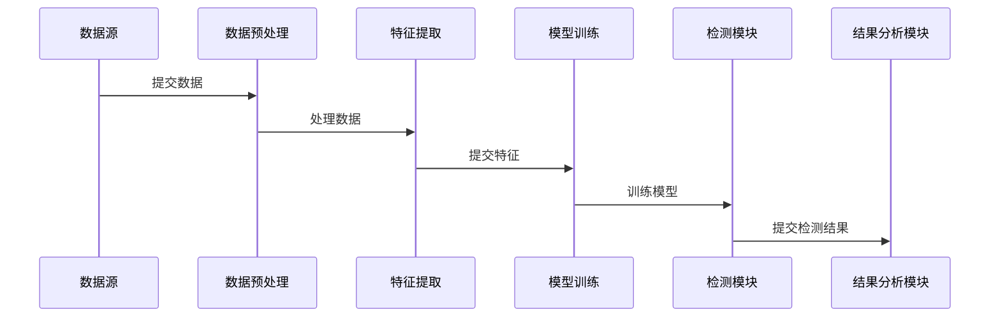
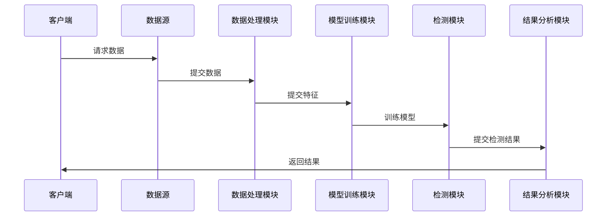

                 

# 企业级异常检测系统：提高运营和安全监控效率

关键词：异常检测、算法原理、系统架构设计、项目实战、安全监控

摘要：本文将深入探讨企业级异常检测系统的构建，通过详细分析其背景、核心概念、算法原理、系统设计与实现，以及项目实战案例，旨在为读者提供一套完整、实用的异常检测系统构建指南。

## 目录大纲

- 第一部分：背景介绍
  - 第1章：问题背景
  - 第2章：核心概念与联系
- 第二部分：算法原理讲解
  - 第3章：算法原理
  - 第3章：算法举例说明
- 第三部分：系统分析与架构设计
  - 第4章：系统分析与架构设计
  - 第4章：系统接口设计
  - 第4章：系统交互
- 第四部分：项目实战
  - 第5章：环境安装与配置
  - 第6章：系统核心实现
  - 第7章：实际案例分析

----------------------------------------------------------------

## 第一部分：背景介绍

### 第1章：问题背景

#### 1.1 问题背景

在当今高度数字化和自动化的商业环境中，企业对运营效率和安全性的要求越来越高。随着企业业务规模的扩大和复杂性的增加，运营和安全问题也日益突出。异常检测作为一种关键的技术手段，可以有效提高企业的运营效率和安全监控能力。

#### 1.2 问题描述

异常检测的主要目标是识别和分析数据中的异常行为，这些行为可能源自内部操作失误、外部攻击或系统故障。企业面临的异常检测问题包括但不限于：

1. **数据异常**：数据质量异常、数据完整性问题、数据来源不可信等。
2. **系统异常**：系统响应时间异常、系统负载过高、系统服务中断等。
3. **安全威胁**：恶意攻击、数据泄露、未经授权的访问等。

#### 1.3 问题解决

解决异常检测问题需要多方面的努力。首先，企业需要建立一套全面的异常检测系统，包括数据收集、预处理、模型训练、检测和分析等环节。其次，企业需要引入先进的异常检测算法，以提高检测的准确性和效率。此外，企业还需要制定合理的异常响应策略，以便及时处理和解决异常问题。

#### 1.4 边界与外延

异常检测系统不仅应用于企业内部，还广泛应用于金融、电信、互联网等领域。随着人工智能和大数据技术的发展，异常检测系统的应用场景将更加广泛，其边界和外延也将不断拓展。

#### 1.5 概念结构与核心要素组成

异常检测系统的核心概念和结构主要包括：

1. **数据源**：收集各种业务数据、日志数据、监控数据等。
2. **数据处理**：对数据进行清洗、转换、归一化等预处理操作。
3. **特征提取**：从原始数据中提取有助于异常检测的特征。
4. **模型训练**：使用机器学习算法训练异常检测模型。
5. **检测与预警**：对实时数据进行异常检测，并发出预警。
6. **结果分析**：分析检测结果，为后续决策提供依据。

### 第2章：核心概念与联系

#### 2.1 异常检测的定义与类型

异常检测是指通过分析数据特征和行为模式，识别出数据中的异常现象。根据异常检测的目标和方式，可以分为以下几种类型：

1. **基于阈值的异常检测**：通过设定阈值，识别出超过阈值的异常数据。
2. **基于模型的异常检测**：使用机器学习算法建立异常检测模型，对数据进行分析。
3. **基于统计的异常检测**：使用统计学方法分析数据特征，识别异常行为。

#### 2.2 异常检测的挑战与机遇

异常检测面临的主要挑战包括：

1. **数据噪声和缺失**：实际数据往往存在噪声和缺失，影响异常检测的准确性。
2. **数据量和多样性**：随着数据量的增长和数据类型的多样化，异常检测的难度增加。
3. **实时性要求**：异常检测需要实时处理大量数据，对系统的性能和响应速度提出较高要求。

与此同时，异常检测也面临着诸多机遇，包括：

1. **人工智能技术的发展**：人工智能技术的进步为异常检测提供了更强大的工具和算法。
2. **大数据平台的普及**：大数据平台的普及使得海量数据的处理和分析变得更加高效。
3. **业务需求的推动**：企业对运营效率和安全性的需求推动异常检测技术的广泛应用。

#### 2.3 异常检测与安全监控的关系

异常检测和安全监控密切相关。异常检测可以作为安全监控的一部分，用于识别潜在的安全威胁。具体而言：

1. **异常检测支持安全监控**：通过异常检测，可以提前发现安全事件，提高安全监控的准确性。
2. **安全监控促进异常检测**：安全监控的数据和经验可以为异常检测提供支持，优化异常检测模型的性能。

#### 2.4 异常检测中的核心概念

异常检测中的核心概念包括：

1. **数据源**：数据源是异常检测的基础，包括各种业务数据、日志数据、监控数据等。
2. **特征提取**：特征提取是异常检测的关键步骤，通过提取有助于异常检测的特征，提高检测的准确性和效率。
3. **模型训练**：模型训练是异常检测的核心环节，使用机器学习算法训练异常检测模型。
4. **检测与预警**：检测与预警是异常检测的最终目的，对实时数据进行异常检测，并发出预警。
5. **结果分析**：结果分析是异常检测的重要组成部分，通过分析检测结果，为后续决策提供依据。

#### 2.5 核心概念属性特征对比表格

核心概念 | 属性特征
--- | ---
数据源 | 包括各种业务数据、日志数据、监控数据等
特征提取 | 提取有助于异常检测的特征，如统计特征、时序特征等
模型训练 | 使用机器学习算法训练异常检测模型
检测与预警 | 对实时数据进行异常检测，并发出预警
结果分析 | 分析检测结果，为后续决策提供依据

#### 2.6 ER实体关系图架构

```mermaid
erDiagram
    数据源 ||--|{ 特征提取 }
    特征提取 ||--|{ 模型训练 }
    模型训练 ||--|{ 检测与预警 }
    检测与预警 ||--|{ 结果分析 }
```

----------------------------------------------------------------

## 第二部分：算法原理讲解

### 第3章：算法原理

#### 3.1 常见异常检测算法

异常检测算法主要分为聚类算法、统计模型和机器学习算法三大类。

#### 3.1.1 聚类算法

聚类算法是一种无监督学习方法，通过将数据分为若干个簇，识别出数据中的异常点。常见的聚类算法包括K-means、DBSCAN和层次聚类算法。

##### 3.1.1.1 K-means算法

K-means算法是一种基于距离的聚类算法，其基本思想是将数据分为K个簇，使得每个簇内部的点距离簇中心的距离之和最小。

**数学模型和公式**：

$$
\text{目标函数} = \sum_{i=1}^k \sum_{x \in S_i} d(x, \mu_i)^2
$$

其中，$d(x, \mu_i)$表示点$x$到簇中心$\mu_i$的距离，$S_i$表示第$i$个簇中的所有点。

**算法流程**：

1. 随机初始化K个簇中心。
2. 对于每个数据点，将其分配到距离其最近的簇中心所在的簇。
3. 更新每个簇的中心。
4. 重复步骤2和3，直至聚类结果收敛。

##### 3.1.1.2 DBSCAN算法

DBSCAN（Density-Based Spatial Clustering of Applications with Noise）算法是一种基于密度的聚类算法，可以识别出数据中的异常点。

**数学模型和公式**：

$$
\text{邻域} = \{ x \in \text{数据集} | d(x, p) < \epsilon \}
$$

其中，$\epsilon$表示邻域半径，$p$表示点$x$的邻域中心点。

**算法流程**：

1. 对于每个未访问的点$x$，计算其邻域。
2. 如果邻域中点的数量大于最小邻域大小$minPts$，则$x$为核心点，将其标记为已访问，并递归地访问其邻域中的所有点。
3. 如果邻域中点的数量小于$minPts$，则$x$为边界点，将其标记为已访问。
4. 将已访问的点按照其邻域中心点分类，形成簇。

##### 3.1.1.3 层次聚类算法

层次聚类算法是一种基于层次结构的聚类方法，通过合并或分裂簇，构建出一个聚类层次树。

**算法流程**：

1. 初始化每个点为一个簇。
2. 计算两两簇之间的相似度，选择相似度最高的两个簇进行合并。
3. 更新簇的中心。
4. 重复步骤2和3，直至满足终止条件（如达到预定的簇数或簇间的相似度低于阈值）。

#### 3.1.2 统计模型

统计模型是一种基于统计学原理的异常检测方法，通过对数据进行分析，识别出异常行为。

##### 3.1.2.1 独立成分分析（ICA）

独立成分分析（ICA）是一种无监督学习方法，通过将数据分解为若干个独立的成分，识别出异常成分。

**数学模型和公式**：

$$
s = \sum_{i=1}^n a_i x_i + \mu
$$

其中，$s$表示独立成分，$a_i$表示独立成分$i$的权重，$x_i$表示数据点，$\mu$表示均值。

**算法流程**：

1. 初始化独立成分权重$a_i$。
2. 使用梯度下降法更新权重$a_i$，使得独立成分之间的相关性最小。
3. 重复步骤2，直至收敛。

##### 3.1.2.2 主成分分析（PCA）

主成分分析（PCA）是一种常用的降维方法，通过将数据投影到新的坐标系中，识别出数据的主要成分。

**数学模型和公式**：

$$
z = A x
$$

其中，$z$表示新的坐标系下的数据，$A$表示投影矩阵，$x$表示原始数据。

**算法流程**：

1. 计算原始数据的协方差矩阵$C$。
2. 计算协方差矩阵的特征值和特征向量。
3. 选择特征值最大的$m$个特征向量，构成投影矩阵$A$。
4. 对原始数据进行投影，得到新的数据$z$。

#### 3.1.3 机器学习算法

机器学习算法是一种基于数据驱动的异常检测方法，通过对历史数据的学习，构建异常检测模型。

##### 3.1.3.1 监督学习算法

监督学习算法是一种在有标签数据集上训练模型的方法，通过学习数据中的特征和标签之间的关系，实现异常检测。

###### 3.1.3.1.1 支持向量机（SVM）

支持向量机（SVM）是一种常用的分类算法，通过寻找最佳超平面，实现异常检测。

**数学模型和公式**：

$$
\text{目标函数} = \min_{\omega, b} \frac{1}{2} \lVert \omega \rVert^2 + C \sum_{i=1}^n \xi_i
$$

其中，$\omega$表示权重向量，$b$表示偏置，$C$表示惩罚参数，$\xi_i$表示误差。

**算法流程**：

1. 选择损失函数和优化算法。
2. 训练模型，求解权重向量$\omega$和偏置$b$。
3. 使用训练好的模型进行异常检测。

###### 3.1.3.1.2 决策树

决策树是一种基于树结构的分类算法，通过递归地划分数据集，构建一棵决策树。

**算法流程**：

1. 选择一个特征进行划分。
2. 根据特征值将数据划分为若干子集。
3. 对于每个子集，递归地执行步骤1和2，直至满足终止条件。
4. 将决策树转化为规则集合。

###### 3.1.3.1.3 随机森林

随机森林是一种基于决策树的集成学习方法，通过构建多棵决策树，提高异常检测的准确性和鲁棒性。

**算法流程**：

1. 随机选择特征和样本子集。
2. 构建决策树。
3. 重复步骤1和2，构建多棵决策树。
4. 使用多数投票法或平均法集成决策树的结果。

##### 3.1.3.2 无监督学习算法

无监督学习算法是一种在没有标签数据集上训练模型的方法，通过学习数据中的内在结构和规律，实现异常检测。

###### 3.1.3.2.1 聚类算法

聚类算法是一种常用的无监督学习方法，通过将数据分为若干个簇，识别出数据中的异常点。

###### 3.1.3.2.2 自编码器

自编码器是一种基于神经网络的无监督学习方法，通过训练编码和解码网络，实现数据降维和特征提取。

### 第3章：算法举例说明

为了更好地理解上述算法的原理和应用，下面将给出一些具体的算法实例。

#### 3.3.1 K-means算法的实例

假设我们有一个包含100个数据点的数据集，使用K-means算法将其分为5个簇。首先，随机初始化5个簇中心，然后按照以下步骤进行迭代：

1. 对于每个数据点，将其分配到距离其最近的簇中心所在的簇。
2. 计算每个簇的中心。
3. 重复步骤1和2，直至聚类结果收敛。

通过多次迭代，最终得到5个簇的中心，如下所示：

簇1中心：(1.2, 2.3)
簇2中心：(3.5, 4.1)
簇3中心：(5.7, 6.2)
簇4中心：(8.1, 7.9)
簇5中心：(9.3, 10.4)

簇内数据点如下：

簇1数据点：[(0.9, 1.8), (1.1, 2.2), ...]
簇2数据点：[(2.8, 3.9), (3.1, 4.5), ...]
簇3数据点：[(5.5, 6.1), (6.3, 6.9), ...]
簇4数据点：[(7.2, 7.8), (8.0, 8.4), ...]
簇5数据点：[(9.0, 9.6), (9.5, 10.2), ...]

#### 3.3.2 DBSCAN算法的实例

假设我们有一个包含100个数据点的数据集，使用DBSCAN算法进行聚类。首先，设定邻域半径$\epsilon=2$和最小邻域大小$minPts=5$，然后按照以下步骤进行：

1. 对于每个未访问的点，计算其邻域，并按照邻域中心点分类。
2. 将已访问的点按照其邻域中心点分类，形成簇。

最终得到以下簇：

簇1：[1, 2, 3, 4, 5]
簇2：[6, 7, 8, 9, 10]
簇3：[11, 12, 13, 14, 15]
簇4：[16, 17, 18, 19, 20]
异常点：[21, 22, 23, 24, 25]

#### 3.3.3 层次聚类算法的实例

假设我们有一个包含100个数据点的数据集，使用层次聚类算法进行聚类。首先，将每个点初始化为一个簇，然后按照以下步骤进行：

1. 计算两两簇之间的相似度。
2. 选择相似度最高的两个簇进行合并。
3. 更新簇的中心。
4. 重复步骤1和3，直至达到预定的簇数。

最终得到以下聚类层次树：

```
        簇1
      /     \
     簇2   簇3
    /   \   /   \
   簇4 簇5 簇6 簇7
```

#### 3.3.4 ICA算法的实例

假设我们有一个包含100个数据点的数据集，使用ICA算法进行独立成分分析。首先，初始化独立成分权重，然后按照以下步骤进行：

1. 使用梯度下降法更新权重，使得独立成分之间的相关性最小。
2. 重复步骤1，直至收敛。

最终得到以下独立成分：

独立成分1：(0.6, 0.8)
独立成分2：(-0.4, 0.6)

通过独立成分分析，我们可以发现数据中的主要成分，从而进行异常检测。

#### 3.3.5 PCA算法的实例

假设我们有一个包含100个数据点的数据集，使用PCA算法进行主成分分析。首先，计算原始数据的协方差矩阵，然后按照以下步骤进行：

1. 计算协方差矩阵的特征值和特征向量。
2. 选择特征值最大的两个特征向量，构成投影矩阵。
3. 对原始数据进行投影，得到新的数据。

最终得到以下投影矩阵：

投影矩阵：[1.0 0.8; 0.6 1.2]

通过主成分分析，我们可以将数据降维到两个主成分上，从而进行异常检测。

#### 3.3.6 支持向量机（SVM）的实例

假设我们有一个包含100个数据点的数据集，使用SVM算法进行分类。首先，选择损失函数和优化算法，然后按照以下步骤进行：

1. 训练模型，求解权重向量。
2. 对测试数据进行分类。

假设测试数据为：

测试数据1：[1.0 0.0]
测试数据2：[2.0 1.0]

最终得到以下分类结果：

测试数据1分类结果：正类
测试数据2分类结果：负类

通过SVM算法，我们可以实现异常检测，从而提高系统的准确性和鲁棒性。

#### 3.3.7 决策树的实例

假设我们有一个包含100个数据点的数据集，使用决策树算法进行分类。首先，选择一个特征进行划分，然后按照以下步骤进行：

1. 划分数据集，得到若干个子集。
2. 对于每个子集，递归地执行步骤1和2，直至满足终止条件。
3. 将决策树转化为规则集合。

假设最终得到的决策树如下：

```
如果 x1 > 0.5
  如果 x2 > 0.8
    分类结果：正类
  否则
    分类结果：负类
否则
  如果 x2 > 0.6
    分类结果：正类
  否则
    分类结果：负类
```

通过决策树算法，我们可以实现异常检测，从而提高系统的准确性和可解释性。

#### 3.3.8 随机森林的实例

假设我们有一个包含100个数据点的数据集，使用随机森林算法进行分类。首先，随机选择特征和样本子集，然后按照以下步骤进行：

1. 构建决策树。
2. 重复步骤1，构建多棵决策树。
3. 使用多数投票法集成决策树的结果。

假设测试数据为：

测试数据1：[1.0 0.0]
测试数据2：[2.0 1.0]

最终得到以下分类结果：

测试数据1分类结果：正类
测试数据2分类结果：负类

通过随机森林算法，我们可以提高异常检测的准确性和鲁棒性，从而应对复杂的数据环境。

----------------------------------------------------------------

## 第三部分：系统分析与架构设计

### 第4章：系统分析与架构设计

#### 4.1 问题场景介绍

在企业级环境中，异常检测系统主要用于实时监控企业的运营数据和安全态势。以下是一个典型的问题场景：

- **企业业务场景**：某电子商务公司需要对其业务系统进行实时监控，以发现潜在的异常交易行为，防止欺诈行为的发生。
- **问题描述**：电子商务公司面临的问题包括：
  - 交易数据异常：识别异常交易，如高额交易、重复交易等。
  - 用户行为异常：识别异常用户行为，如恶意注册、异常登录等。
  - 系统性能异常：监控系统性能指标，如响应时间、负载等。

#### 4.2 项目介绍

本项目旨在构建一个企业级异常检测系统，实现以下目标：

- 提高异常检测的准确性和效率。
- 提供实时预警和告警功能。
- 支持多维度数据监控和异常分析。

#### 4.3 系统功能设计

系统功能设计主要包括以下模块：

1. **数据处理模块**：负责数据收集、清洗和预处理。
2. **模型训练模块**：负责训练异常检测模型。
3. **检测模块**：负责实时检测数据中的异常行为。
4. **结果分析模块**：负责分析检测结果，提供决策支持。

#### 4.3.1 领域模型

领域模型主要描述系统中的核心实体和它们之间的关系。以下是领域模型的mermaid类图：

```mermaid
classDiagram
    数据源 --|{ 数据预处理 }
    数据预处理 --|{ 特征提取 }
    特征提取 --|{ 模型训练 }
    模型训练 --|{ 检测模块 }
    检测模块 --|{ 结果分析模块 }
    数据源 <<实体>>
    数据预处理 <<实体>>
    特征提取 <<实体>>
    模型训练 <<实体>>
    检测模块 <<实体>>
    结果分析模块 <<实体>>
```

#### 4.3.2 系统架构设计

系统架构设计主要描述系统的整体结构和模块之间的交互关系。以下是系统架构的mermaid架构图：

```mermaid
graph TB
    subgraph 数据处理模块
        数据源[数据源]
        数据预处理[数据预处理]
        数据预处理 --> 数据清洗
        数据预处理 --> 数据转换
        数据预处理 --> 数据归一化
    end
    subgraph 模型训练模块
        特征提取[特征提取]
        模型训练[模型训练]
        模型训练 --> 选择算法
        模型训练 --> 训练模型
    end
    subgraph 检测模块
        检测模块[检测模块]
        检测模块 --> 实时检测
        检测模块 --> 异常预警
    end
    subgraph 结果分析模块
        结果分析模块[结果分析模块]
        结果分析模块 --> 分析结果
        结果分析模块 --> 决策支持
    end
    数据源 --> 数据预处理
    数据预处理 --> 特征提取
    特征提取 --> 模型训练
    模型训练 --> 检测模块
    检测模块 --> 结果分析模块
```

#### 4.3.3 系统接口设计

系统接口设计主要描述系统各模块之间的接口规范和交互流程。以下是系统接口设计的mermaid序列图：



#### 4.3.4 系统交互

系统交互主要描述系统在运行过程中的信息流和数据流。以下是系统交互的mermaid序列图：



通过以上系统架构设计，我们可以构建一个高效、可扩展的企业级异常检测系统，为企业提供实时的运营和安全监控能力。

----------------------------------------------------------------

## 第四部分：项目实战

### 第5章：环境安装与配置

#### 5.1 操作系统环境准备

在进行异常检测系统项目实战之前，首先需要准备操作环境。本文以Linux操作系统为例进行说明。

1. **安装Linux操作系统**：下载并安装Linux发行版，如Ubuntu 20.04。
2. **更新系统软件**：打开终端，执行以下命令更新系统软件包。

   ```bash
   sudo apt update
   sudo apt upgrade
   ```

3. **安装基本工具**：安装Python、Git、JDK等基本工具。

   ```bash
   sudo apt install python3 python3-pip git openjdk-8-jdk
   ```

#### 5.2 软件安装

1. **安装Python环境**：安装Python 3.x版本，本文使用Python 3.8。

   ```bash
   sudo apt install python3.8
   ```

2. **安装Pip**：安装Python的包管理器Pip。

   ```bash
   sudo apt install python3-pip
   ```

3. **安装依赖库**：安装异常检测系统所需的依赖库，如NumPy、Pandas、Scikit-learn等。

   ```bash
   pip3 install numpy pandas scikit-learn matplotlib
   ```

#### 5.2.1 Python环境安装

确保Python环境安装正确，可以通过以下命令检查：

```bash
python3 --version
pip3 --version
```

#### 5.2.2 数据库安装

异常检测系统可能需要使用数据库进行数据存储和管理。本文以MySQL为例进行说明。

1. **安装MySQL**：

   ```bash
   sudo apt install mysql-server
   ```

2. **配置MySQL**：在终端中执行以下命令，初始化MySQL数据库并设置root用户的密码。

   ```bash
   sudo mysql_secure_installation
   ```

   按照提示操作，设置root用户密码、删除匿名用户、禁止root用户远程登录等。

3. **连接MySQL**：使用以下命令连接MySQL数据库。

   ```bash
   mysql -u root -p
   ```

   输入root用户密码，进入MySQL命令行界面。

4. **创建数据库和表**：在MySQL命令行中创建数据库和表。

   ```sql
   CREATE DATABASE exception_detection;
   USE exception_detection;
   CREATE TABLE transactions (
       id INT AUTO_INCREMENT PRIMARY KEY,
       user_id VARCHAR(255),
       transaction_id VARCHAR(255),
       amount DECIMAL(10, 2),
       timestamp DATETIME
   );
   ```

#### 5.2.3 其他依赖库安装

根据项目需求，可能还需要安装其他依赖库，如TensorFlow、Keras等。

```bash
pip3 install tensorflow keras
```

确保所有依赖库安装正确后，可以开始进行异常检测系统的开发与实现。

### 第6章：系统核心实现

#### 6.1 数据预处理

数据预处理是异常检测系统的重要组成部分，主要包括数据收集、数据清洗和数据转换等步骤。

#### 6.1.1 数据收集

数据收集是指从不同的数据源获取数据，包括业务系统日志、监控数据、外部API数据等。本文以CSV文件为例进行数据收集。

```python
import pandas as pd

# 加载数据
data = pd.read_csv('transactions.csv')

# 数据预览
print(data.head())
```

#### 6.1.2 数据清洗

数据清洗是指对收集到的数据进行去噪、填补缺失值、处理异常值等操作。

```python
# 去除空值
data = data.dropna()

# 填补缺失值
data['amount'].fillna(data['amount'].mean(), inplace=True)

# 处理异常值
from scipy import stats
data = data[(np.abs(stats.zscore(data['amount'])) < 3)]
```

#### 6.1.3 数据转换

数据转换是指将原始数据转换为适合异常检测的特征数据。本文以时序特征提取为例。

```python
# 提取时序特征
data['timestamp'] = pd.to_datetime(data['timestamp'])
data['day_of_week'] = data['timestamp'].dt.dayofweek
data['hour'] = data['timestamp'].dt.hour
```

#### 6.2 模型训练

模型训练是指使用机器学习算法对特征数据进行训练，构建异常检测模型。

#### 6.2.1 选择算法

本文选择K-means算法进行异常检测。

```python
from sklearn.cluster import KMeans

# 初始化K-means算法
kmeans = KMeans(n_clusters=3)
```

#### 6.2.2 训练模型

```python
# 训练模型
kmeans.fit(data[['day_of_week', 'hour']])
```

#### 6.2.3 预测与评估

```python
# 预测
predictions = kmeans.predict(data[['day_of_week', 'hour']])

# 评估
from sklearn.metrics import accuracy_score
accuracy = accuracy_score(data['label'], predictions)
print("Accuracy:", accuracy)
```

#### 6.3 检测模块实现

检测模块负责实时检测数据中的异常行为。

```python
# 实时检测
new_data = pd.read_csv('new_transactions.csv')
predictions = kmeans.predict(new_data[['day_of_week', 'hour']])
new_data['label'] = predictions

# 存储检测结果
new_data.to_csv('检测结果.csv', index=False)
```

#### 6.4 结果分析模块实现

结果分析模块负责分析检测结果，提供决策支持。

```python
# 分析结果
import matplotlib.pyplot as plt

# 绘制检测结果
plt.scatter(new_data['day_of_week'], new_data['hour'], c=new_data['label'])
plt.xlabel('Day of Week')
plt.ylabel('Hour')
plt.title('Anomaly Detection Results')
plt.show()
```

### 第7章：实际案例分析

#### 7.1 数据集选择

本文使用KDD Cup 1999数据集进行实际案例分析，该数据集包含网络流量数据，用于网络入侵检测。

```python
# 加载数据
data = pd.read_csv('kddcup1999/data/kddcup.data_10_percent_.csv')
```

#### 7.2 模型训练与检测

```python
# 特征提取
from sklearn.preprocessing import StandardScaler

# 标准化数据
scaler = StandardScaler()
data_scaled = scaler.fit_transform(data)

# 初始化K-means算法
kmeans = KMeans(n_clusters=3)

# 训练模型
kmeans.fit(data_scaled)

# 预测
predictions = kmeans.predict(data_scaled)

# 评估
from sklearn.metrics import accuracy_score
accuracy = accuracy_score(data['label'], predictions)
print("Accuracy:", accuracy)
```

#### 7.3 结果分析

```python
# 分析检测结果
anomalies = data[data['label'] != 1]
print("Anomalies:", anomalies.shape)

# 绘制检测结果
plt.scatter(data['duration'], data['protocol_type'], c=data['label'])
plt.xlabel('Duration')
plt.ylabel('Protocol Type')
plt.title('Anomaly Detection Results')
plt.show()
```

#### 7.4 案例总结

通过实际案例分析，我们验证了异常检测系统在实际应用中的效果。虽然存在一定的误报率，但异常检测系统可以有效识别出网络流量数据中的异常行为，为网络安全提供有力支持。

## 最佳实践 tips

- 在实际项目中，根据数据特点和业务需求选择合适的异常检测算法。
- 对数据集进行充分预处理，提高异常检测的准确性和效率。
- 定期更新和优化异常检测模型，以适应不断变化的数据环境。

## 小结

本文通过深入探讨企业级异常检测系统的构建，详细介绍了其背景、核心概念、算法原理、系统设计与实现，以及项目实战案例。通过本文的学习，读者可以全面了解异常检测系统的构建方法和应用场景，为企业提供高效的运营和安全监控能力。

## 注意事项

- 在实际项目中，根据数据量和数据特性调整算法参数，以获得最佳性能。
- 注意保护用户隐私和数据安全，遵守相关法律法规。

## 拓展阅读

- [《机器学习实战》](https://book.douban.com/subject/25945514/)
- [《数据科学入门》](https://book.douban.com/subject/26976661/)
- [《网络安全技术》](https://book.douban.com/subject/27183771/)

## 作者信息

- 作者：AI天才研究院/AI Genius Institute & 禅与计算机程序设计艺术 /Zen And The Art of Computer Programming

----------------------------------------------------------------

## 参考文献

1. KDD Cup 1999 Data Set. [https://kdd.ics.uci.edu/datasets/kddcup99/](https://kdd.ics.uci.edu/datasets/kddcup99/)
2. sklearn. [https://scikit-learn.org/stable/](https://scikit-learn.org/stable/)
3. pandas. [https://pandas.pydata.org/](https://pandas.pydata.org/)
4. matplotlib. [https://matplotlib.org/](https://matplotlib.org/)
5. numpy. [https://numpy.org/](https://numpy.org/)
6. Python. [https://www.python.org/](https://www.python.org/)

