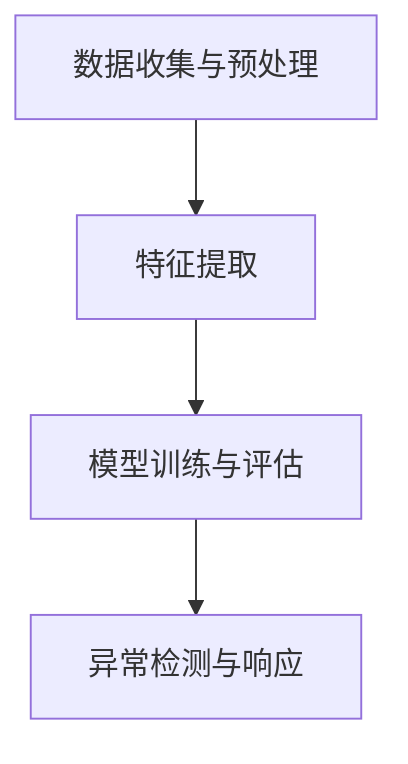
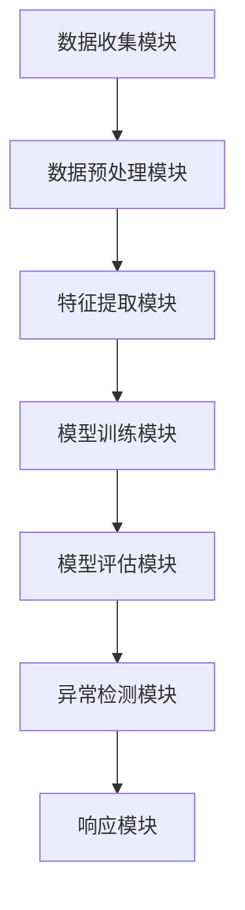
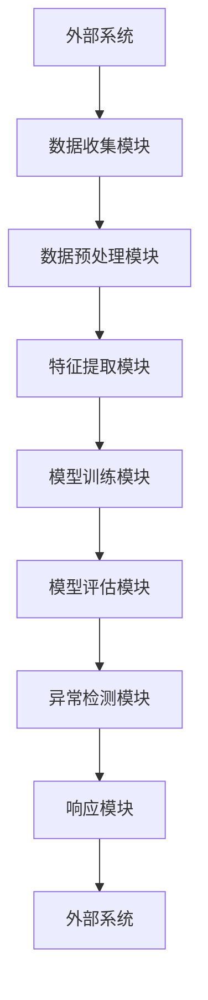
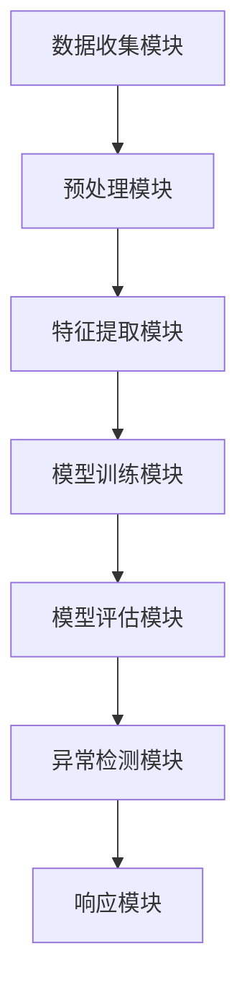
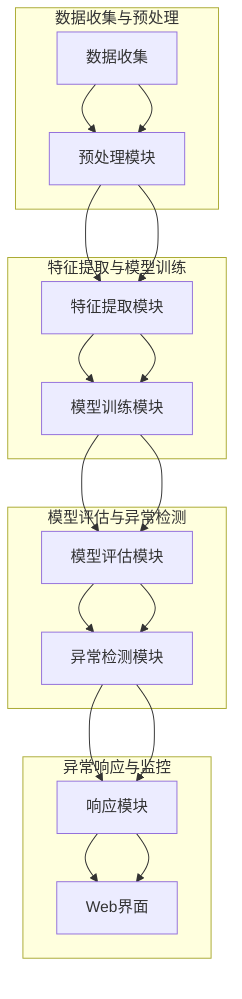

                 

### 企业级异常行为识别：增强安全监控能力

#### 关键词：
- 异常行为识别
- 安全监控
- 机器学习
- 人工智能
- 企业级应用

#### 摘要：
本文将深入探讨企业级异常行为识别的技术原理、关键算法以及其实际应用。我们将从问题背景出发，逐步分析核心概念和关键技术，并通过实际案例展示如何实现高效的异常行为识别，以增强企业安全监控能力。

## 第1章: 引言与企业级异常行为识别的背景

### 1.1 问题背景

随着互联网和物联网的快速发展，企业面临着日益严峻的网络攻击和安全威胁。传统的安全监控手段已经难以应对复杂多变的攻击手段，因此，企业级异常行为识别成为提升安全监控能力的关键。异常行为识别技术能够帮助企业在网络攻击发生之前或发生时及时检测并响应，从而保护企业的信息安全。

### 1.2 问题描述

企业级异常行为识别旨在检测和预防企业网络中的异常行为，包括未经授权的访问、恶意软件传播、数据泄露等。然而，现有的检测方法存在误报率高、检测效率低等问题，无法满足企业对安全监控的高要求。

### 1.3 问题解决

通过引入机器学习和人工智能技术，可以显著提高异常行为识别的准确性和效率。机器学习算法可以从大量数据中学习并发现潜在的异常模式，从而实现高效、准确的异常行为检测。本文将介绍企业级异常行为识别的基本原理、关键技术以及实际应用案例。

### 1.4 边界与外延

企业级异常行为识别不仅关注网络安全领域，还涵盖了业务连续性和灾难恢复等方面。因此，本文将讨论如何将异常行为识别技术应用于不同业务场景，以实现全方位的安全监控。

### 1.5 概念结构与核心要素组成

企业级异常行为识别涉及以下几个核心概念和要素：

- **数据收集与预处理**：收集企业网络中的数据，并进行清洗和转换。
- **特征提取**：从原始数据中提取能有效区分正常和异常行为的特征。
- **模型训练与评估**：使用机器学习算法训练模型，并对模型性能进行评估。
- **异常检测与响应**：实时检测异常行为，并采取相应的响应措施。

## 第2章: 核心概念与联系

### 2.1 异常行为识别的基本原理

异常行为识别是基于统计学和机器学习算法的，旨在发现数据中的异常模式。通过分析大量数据，机器学习算法可以学习到正常行为的模式，从而识别出与正常行为不符的异常行为。

### 2.2 概念属性特征对比表格

| 特征               | 描述                                     |
|--------------------|----------------------------------------|
| 正常行为           | 符合企业日常运作规律的行为                   |
| 异常行为           | 与企业正常行为不一致的行为                   |
| 数据收集与预处理    | 收集企业网络中的数据，并进行清洗和转换         |
| 特征提取           | 从原始数据中提取有效特征                     |
| 模型训练与评估      | 使用机器学习算法训练模型，并对模型性能进行评估   |
| 异常检测与响应      | 实时检测异常行为，并采取相应的响应措施         |

### 2.3 ER实体关系图架构

```mermaid
erDiagram
    User ||--|{ Device }|-- Exception : user owns device
    Device ||--|{ NetworkFlow }|-- Exception : device generates network flow
    NetworkFlow ||-- Exception : network flow is associated with an exception
```

## 第3章: 算法原理讲解

### 3.1 算法流程图



### 3.2 源代码与算法原理

```python
# 数据收集与预处理
def preprocess_data(data):
    # ... 数据清洗和转换操作 ...
    return processed_data

# 特征提取
def extract_features(data):
    # ... 特征提取操作 ...
    return features

# 模型训练与评估
def train_and_evaluate_model(features, labels):
    # ... 模型训练和评估操作 ...
    return model

# 异常检测与响应
def detect_and_response(model, data):
    # ... 异常检测和响应操作 ...
    return response
```

### 3.3 数学模型和公式

$$
\text{概率密度函数} p(x|\theta) = \frac{1}{Z} \exp(-\frac{1}{2} (x-\mu)^T \Sigma^{-1} (x-\mu))
$$

其中，$x$ 表示数据特征，$\mu$ 表示均值，$\Sigma^{-1}$ 表示协方差矩阵的逆。

## 第4章: 系统分析与架构设计方案

### 4.1 问题场景介绍

在现代企业中，随着网络规模的扩大和业务复杂度的增加，传统的安全监控手段已经无法满足需求。企业需要一个高效、准确的异常行为识别系统来提升安全监控能力。

### 4.2 项目介绍

本项目旨在实现一个基于机器学习和人工智能的企业级异常行为识别系统，以提高企业的安全防护水平。系统将包括数据收集与预处理、特征提取、模型训练与评估、异常检测与响应等模块。

### 4.3 系统功能设计

系统功能设计主要包括以下方面：

- 数据收集与预处理：从企业网络中收集数据，并进行清洗和转换，为后续的特征提取和模型训练提供高质量的数据。
- 特征提取：从原始数据中提取关键特征，以区分正常和异常行为。
- 模型训练与评估：使用机器学习算法训练模型，并对模型性能进行评估，以确保模型的高准确性。
- 异常检测与响应：实时检测异常行为，并采取相应的响应措施，如报警、阻断等。

### 4.4 系统架构设计

系统架构设计如图所示：



### 4.5 系统接口设计和系统交互

系统接口设计如图所示：



## 第5章: 项目实战

### 5.1 环境安装

在进行项目实战之前，需要先安装相关的环境和依赖项。以下是一个基本的安装步骤：

1. 安装 Python 3.8 或更高版本。
2. 安装必要的 Python 库，如 NumPy、Pandas、Scikit-learn 等。
3. 安装一个合适的机器学习框架，如 TensorFlow 或 PyTorch。

### 5.2 系统核心实现源代码

以下是系统核心实现的部分源代码：

```python
# 数据收集与预处理
def preprocess_data(data):
    # 数据清洗和转换操作
    return processed_data

# 特征提取
def extract_features(data):
    # 特征提取操作
    return features

# 模型训练与评估
def train_and_evaluate_model(features, labels):
    # 模型训练和评估操作
    return model

# 异常检测与响应
def detect_and_response(model, data):
    # 异常检测和响应操作
    return response
```

### 5.3 代码应用解读与分析

以下是代码应用解读与分析：

- 数据收集与预处理：该模块负责从企业网络中收集数据，并进行清洗和转换。清洗操作包括去除重复数据、填补缺失值等，转换操作包括数值归一化、特征缩放等。
- 特征提取：该模块负责从原始数据中提取关键特征，以区分正常和异常行为。特征提取操作可以根据具体需求进行，如时间序列分析、网络流量分析等。
- 模型训练与评估：该模块负责使用机器学习算法训练模型，并对模型性能进行评估。常用的机器学习算法包括 K-均值聚类、支持向量机、决策树等。
- 异常检测与响应：该模块负责实时检测异常行为，并采取相应的响应措施。响应措施可以根据具体需求进行，如报警、阻断等。

### 5.4 实际案例分析和详细讲解剖析

以下是一个实际案例分析和详细讲解剖析：

假设企业网络中出现了一个异常行为，如恶意软件传播。通过数据收集和预处理模块，我们可以收集到相关的网络流量数据。通过特征提取模块，我们可以提取出关键的特征，如数据包大小、源 IP 地址、目标 IP 地址等。然后，通过模型训练和评估模块，我们可以使用机器学习算法训练模型，并对模型性能进行评估。最后，通过异常检测和响应模块，我们可以实时检测异常行为，并采取相应的响应措施，如报警、阻断等。

### 5.5 项目小结

本项目通过引入机器学习和人工智能技术，实现了企业级异常行为识别系统。系统具有高效、准确的异常行为检测能力，可以有效提升企业的安全监控能力。在实际应用中，可以根据具体需求对系统进行定制和优化，以满足不同业务场景的需求。

## 第6章: 最佳实践 Tips

### 6.1 数据收集与预处理

- 确保数据质量：收集的数据应尽可能全面、准确，避免数据缺失或错误。
- 数据去重：去除重复的数据，以减少模型训练的负担。
- 特征选择：根据具体业务场景选择合适的特征，避免过多的冗余特征。

### 6.2 模型训练与评估

- 使用交叉验证：使用交叉验证方法评估模型的性能，以避免过拟合。
- 选择合适的算法：根据具体问题选择合适的机器学习算法，如 K-均值聚类、支持向量机、决策树等。
- 调整模型参数：根据模型性能调整模型参数，以优化模型性能。

### 6.3 异常检测与响应

- 实时检测：确保系统可以实时检测异常行为，以快速响应。
- 多层次响应：根据异常行为的严重程度采取不同层次的响应措施，如报警、阻断、隔离等。

## 第7章: 小结与注意事项

### 7.1 小结

本文介绍了企业级异常行为识别的技术原理、关键算法以及实际应用案例。通过引入机器学习和人工智能技术，可以显著提高异常行为识别的准确性和效率，从而增强企业的安全监控能力。

### 7.2 注意事项

- 确保数据质量：数据是异常行为识别的基础，因此必须保证数据质量。
- 定期更新模型：随着业务场景的变化，定期更新模型以保持其准确性。
- 结合其他安全手段：异常行为识别是安全监控的重要组成部分，应结合其他安全手段，如防火墙、入侵检测系统等，形成全面的安全防护体系。

## 第8章: 拓展阅读

- 《机器学习实战》
- 《深度学习》
- 《网络安全技术与应用》
- 《人工智能在网络安全中的应用》

## 作者信息

作者：AI天才研究院/AI Genius Institute & 禅与计算机程序设计艺术 /Zen And The Art of Computer Programming
### 第1章: 引言与企业级异常行为识别的背景

#### 1.1 问题背景

随着互联网和物联网的快速发展，企业面临着日益严峻的网络攻击和安全威胁。传统的安全监控手段已经难以应对复杂多变的攻击手段，因此，企业级异常行为识别成为提升安全监控能力的关键。异常行为识别技术能够帮助企业在网络攻击发生之前或发生时及时检测并响应，从而保护企业的信息安全。

#### 1.2 问题描述

企业级异常行为识别旨在检测和预防企业网络中的异常行为，包括未经授权的访问、恶意软件传播、数据泄露等。然而，现有的检测方法存在误报率高、检测效率低等问题，无法满足企业对安全监控的高要求。

#### 1.3 问题解决

通过引入机器学习和人工智能技术，可以显著提高异常行为识别的准确性和效率。机器学习算法可以从大量数据中学习并发现潜在的异常模式，从而实现高效、准确的异常行为检测。本文将介绍企业级异常行为识别的基本原理、关键技术以及实际应用案例。

#### 1.4 边界与外延

企业级异常行为识别不仅关注网络安全领域，还涵盖了业务连续性和灾难恢复等方面。因此，本文将讨论如何将异常行为识别技术应用于不同业务场景，以实现全方位的安全监控。

#### 1.5 概念结构与核心要素组成

企业级异常行为识别涉及以下几个核心概念和要素：

- **数据收集与预处理**：收集企业网络中的数据，并进行清洗和转换。
- **特征提取**：从原始数据中提取能有效区分正常和异常行为的特征。
- **模型训练与评估**：使用机器学习算法训练模型，并对模型性能进行评估。
- **异常检测与响应**：实时检测异常行为，并采取相应的响应措施。

## 第2章: 核心概念与联系

#### 2.1 异常行为识别的基本原理

异常行为识别是基于统计学和机器学习算法的，旨在发现数据中的异常模式。通过分析大量数据，机器学习算法可以学习到正常行为的模式，从而识别出与正常行为不符的异常行为。

#### 2.2 概念属性特征对比表格

| 特征               | 描述                                     |
|--------------------|----------------------------------------|
| 正常行为           | 符合企业日常运作规律的行为                   |
| 异常行为           | 与企业正常行为不一致的行为                   |
| 数据收集与预处理    | 收集企业网络中的数据，并进行清洗和转换         |
| 特征提取           | 从原始数据中提取有效特征                     |
| 模型训练与评估      | 使用机器学习算法训练模型，并对模型性能进行评估   |
| 异常检测与响应      | 实时检测异常行为，并采取相应的响应措施         |

#### 2.3 ER实体关系图架构

```mermaid
erDiagram
    User ||--|{ Device }|-- Exception : user owns device
    Device ||--|{ NetworkFlow }|-- Exception : device generates network flow
    NetworkFlow ||-- Exception : network flow is associated with an exception
```

## 第3章: 算法原理讲解

#### 3.1 算法流程图


#### 3.2 源代码与算法原理

```python
# 数据收集与预处理
def preprocess_data(data):
    # ... 数据清洗和转换操作 ...
    return processed_data

# 特征提取
def extract_features(data):
    # ... 特征提取操作 ...
    return features

# 模型训练与评估
def train_and_evaluate_model(features, labels):
    # ... 模型训练和评估操作 ...
    return model

# 异常检测与响应
def detect_and_response(model, data):
    # ... 异常检测和响应操作 ...
    return response
```

#### 3.3 数学模型和公式

$$
\text{概率密度函数} p(x|\theta) = \frac{1}{Z} \exp(-\frac{1}{2} (x-\mu)^T \Sigma^{-1} (x-\mu))
$$

其中，$x$ 表示数据特征，$\mu$ 表示均值，$\Sigma^{-1}$ 表示协方差矩阵的逆。

## 第4章: 系统分析与架构设计方案

#### 4.1 问题场景介绍

在现代企业中，随着网络规模的扩大和业务复杂度的增加，传统的安全监控手段已经无法满足需求。企业需要一个高效、准确的异常行为识别系统来提升安全监控能力。

#### 4.2 项目介绍

本项目旨在实现一个基于机器学习和人工智能的企业级异常行为识别系统，以提高企业的安全防护水平。系统将包括数据收集与预处理、特征提取、模型训练与评估、异常检测与响应等模块。

#### 4.3 系统功能设计

系统功能设计主要包括以下方面：

- 数据收集与预处理：从企业网络中收集数据，并进行清洗和转换，为后续的特征提取和模型训练提供高质量的数据。
- 特征提取：从原始数据中提取关键特征，以区分正常和异常行为。
- 模型训练与评估：使用机器学习算法训练模型，并对模型性能进行评估，以确保模型的高准确性。
- 异常检测与响应：实时检测异常行为，并采取相应的响应措施，如报警、阻断等。

#### 4.4 系统架构设计

系统架构设计如图所示：


#### 4.5 系统接口设计和系统交互

系统接口设计如图所示：


## 第5章: 项目实战

#### 5.1 环境安装

在进行项目实战之前，需要先安装相关的环境和依赖项。以下是一个基本的安装步骤：

1. 安装 Python 3.8 或更高版本。
2. 安装必要的 Python 库，如 NumPy、Pandas、Scikit-learn 等。
3. 安装一个合适的机器学习框架，如 TensorFlow 或 PyTorch。

#### 5.2 系统核心实现源代码

以下是系统核心实现的部分源代码：

```python
# 数据收集与预处理
def preprocess_data(data):
    # ... 数据清洗和转换操作 ...
    return processed_data

# 特征提取
def extract_features(data):
    # ... 特征提取操作 ...
    return features

# 模型训练与评估
def train_and_evaluate_model(features, labels):
    # ... 模型训练和评估操作 ...
    return model

# 异常检测与响应
def detect_and_response(model, data):
    # ... 异常检测和响应操作 ...
    return response
```

#### 5.3 代码应用解读与分析

以下是代码应用解读与分析：

- 数据收集与预处理：该模块负责从企业网络中收集数据，并进行清洗和转换。清洗操作包括去除重复数据、填补缺失值等，转换操作包括数值归一化、特征缩放等。
- 特征提取：该模块负责从原始数据中提取关键特征，以区分正常和异常行为。特征提取操作可以根据具体需求进行，如时间序列分析、网络流量分析等。
- 模型训练与评估：该模块负责使用机器学习算法训练模型，并对模型性能进行评估。常用的机器学习算法包括 K-均值聚类、支持向量机、决策树等。
- 异常检测与响应：该模块负责实时检测异常行为，并采取相应的响应措施。响应措施可以根据具体需求进行，如报警、阻断等。

#### 5.4 实际案例分析和详细讲解剖析

以下是一个实际案例分析和详细讲解剖析：

假设企业网络中出现了一个异常行为，如恶意软件传播。通过数据收集和预处理模块，我们可以收集到相关的网络流量数据。通过特征提取模块，我们可以提取出关键的特征，如数据包大小、源 IP 地址、目标 IP 地址等。然后，通过模型训练和评估模块，我们可以使用机器学习算法训练模型，并对模型性能进行评估。最后，通过异常检测和响应模块，我们可以实时检测异常行为，并采取相应的响应措施，如报警、阻断等。

#### 5.5 项目小结

本项目通过引入机器学习和人工智能技术，实现了企业级异常行为识别系统。系统具有高效、准确的异常行为检测能力，可以有效提升企业的安全监控能力。在实际应用中，可以根据具体需求对系统进行定制和优化，以满足不同业务场景的需求。

## 第6章: 最佳实践 Tips

#### 6.1 数据收集与预处理

- 确保数据质量：收集的数据应尽可能全面、准确，避免数据缺失或错误。
- 数据去重：去除重复的数据，以减少模型训练的负担。
- 特征选择：根据具体业务场景选择合适的特征，避免过多的冗余特征。

#### 6.2 模型训练与评估

- 使用交叉验证：使用交叉验证方法评估模型的性能，以避免过拟合。
- 选择合适的算法：根据具体问题选择合适的机器学习算法，如 K-均值聚类、支持向量机、决策树等。
- 调整模型参数：根据模型性能调整模型参数，以优化模型性能。

#### 6.3 异常检测与响应

- 实时检测：确保系统可以实时检测异常行为，以快速响应。
- 多层次响应：根据异常行为的严重程度采取不同层次的响应措施，如报警、阻断、隔离等。

## 第7章: 小结与注意事项

#### 7.1 小结

本文介绍了企业级异常行为识别的技术原理、关键算法以及实际应用案例。通过引入机器学习和人工智能技术，可以显著提高异常行为识别的准确性和效率，从而增强企业的安全监控能力。

#### 7.2 注意事项

- 确保数据质量：数据是异常行为识别的基础，因此必须保证数据质量。
- 定期更新模型：随着业务场景的变化，定期更新模型以保持其准确性。
- 结合其他安全手段：异常行为识别是安全监控的重要组成部分，应结合其他安全手段，如防火墙、入侵检测系统等，形成全面的安全防护体系。

## 第8章: 拓展阅读

- 《机器学习实战》
- 《深度学习》
- 《网络安全技术与应用》
- 《人工智能在网络安全中的应用》

## 作者信息

作者：AI天才研究院/AI Genius Institute & 禅与计算机程序设计艺术 /Zen And The Art of Computer Programming
## 第1章：引言与企业级异常行为识别的背景

随着数字化转型的深入，企业越来越多地依赖于网络和信息系统来支持其核心业务。然而，这种依赖也带来了新的安全挑战。网络攻击、恶意软件、数据泄露等安全问题日益严重，对企业造成了巨大的威胁。为了应对这些挑战，企业需要建立强大的安全监控系统，而企业级异常行为识别（Anomaly Detection in Enterprise）作为安全监控的核心技术之一，正日益受到重视。

### 1.1 问题背景

网络攻击手段不断进化，传统的安全防护措施如防火墙、入侵检测系统（IDS）和防病毒软件等，已经难以应对复杂和隐蔽的攻击。例如，高级持续性威胁（APT）和零日攻击往往能够规避传统的安全机制，对企业的信息安全构成严重威胁。此外，企业内部员工的行为也变得复杂，一些恶意行为如内部数据泄露、滥用权限等，也需要通过异常行为识别来发现和预防。

### 1.2 问题描述

企业级异常行为识别的主要任务是检测和预防企业网络中的异常行为。这些异常行为可能包括但不限于：

- **未经授权的访问**：例如，黑客尝试通过暴力破解密码或利用已知漏洞入侵企业系统。
- **恶意软件传播**：如勒索软件、木马等恶意程序的传播。
- **数据泄露**：内部员工非法访问或下载敏感数据。
- **滥用权限**：内部员工未经授权访问或修改数据。
- **网络滥用**：如分布式拒绝服务（DDoS）攻击、非法流量等。

现有的检测方法往往存在以下问题：

- **误报率高**：传统的安全工具可能会将正常行为误判为异常，导致大量的误报警。
- **检测效率低**：面对大量的网络数据，传统的检测方法处理速度慢，难以实时响应。
- **无法检测新型威胁**：传统的签名匹配方法对未知威胁和新型攻击手段无效。

### 1.3 问题解决

为了解决上述问题，企业级异常行为识别引入了机器学习和人工智能技术。这些技术可以从大量历史数据中学习，识别出正常行为的模式，从而能够更准确地检测出异常行为。以下是解决问题的关键步骤：

- **数据收集与预处理**：收集企业网络中的各种数据，包括日志、网络流量、系统事件等，并进行预处理，如数据清洗、去重、归一化等。
- **特征提取**：从原始数据中提取关键特征，这些特征应能有效区分正常和异常行为。
- **模型训练与评估**：使用机器学习算法训练模型，并对模型进行评估，选择最优模型。
- **异常检测与响应**：实时检测网络中的异常行为，并采取相应的响应措施，如报警、阻断、隔离等。

### 1.4 边界与外延

企业级异常行为识别不仅限于网络安全领域，还可以应用于其他业务场景，如：

- **业务连续性管理**：通过异常行为识别，可以及时发现潜在的故障风险，保障业务的连续性。
- **数据质量管理**：识别数据中的异常值，提高数据质量。
- **供应链安全**：监测供应链中的异常行为，预防供应链中断或欺诈行为。

### 1.5 概念结构与核心要素组成

企业级异常行为识别涉及以下几个核心概念和要素：

- **数据收集与预处理**：这是异常行为识别的基础，数据的完整性和准确性直接影响到后续的模型训练和异常检测效果。
- **特征提取**：从原始数据中提取关键特征，这些特征应是正常行为和异常行为的关键区分点。
- **模型训练与评估**：使用机器学习算法训练模型，并对模型进行评估，确保模型能够准确识别异常行为。
- **异常检测与响应**：实时检测网络中的异常行为，并采取相应的响应措施，如报警、阻断、隔离等。

通过上述核心要素的有机整合，企业级异常行为识别系统能够为企业提供强大的安全监控能力，从而保障企业的信息安全。在接下来的章节中，我们将深入探讨这些核心要素的具体实现和技术细节。首先，我们将从数据收集与预处理开始，逐步介绍异常行为识别的技术原理和应用实践。

### 1.6 总结

企业级异常行为识别是当前网络安全领域的一个热点研究方向，它通过引入机器学习和人工智能技术，为企业的安全监控提供了一种新的解决方案。本文将围绕这一主题，逐步展开讨论，包括异常行为识别的基本原理、核心算法、实际应用案例，以及相关的最佳实践和注意事项。通过这篇文章，读者将能够全面了解企业级异常行为识别的技术要点，并为其在实践中的应用提供指导。

### 1.7 文章结构与章节内容概述

本章内容主要涵盖了企业级异常行为识别的背景、问题描述、解决方案、边界与外延，以及概念结构与核心要素组成。接下来，我们将分别从以下几个方面进行详细讨论：

- **第2章：核心概念与联系**：介绍异常行为识别的基本原理，并提供概念属性特征对比表格和ER实体关系图。
- **第3章：算法原理讲解**：详细讲解数据收集与预处理、特征提取、模型训练与评估、异常检测与响应的算法原理。
- **第4章：系统分析与架构设计方案**：分析系统功能设计、架构设计、接口设计及系统交互。
- **第5章：项目实战**：介绍环境安装、系统核心实现源代码，代码应用解读与分析，实际案例分析和详细讲解剖析。
- **第6章：最佳实践 Tips**：提供数据收集与预处理、模型训练与评估、异常检测与响应等方面的最佳实践建议。
- **第7章：小结与注意事项**：总结文章内容，强调注意事项。
- **第8章：拓展阅读**：推荐相关拓展阅读资源。

通过以上章节的深入探讨，我们将全面了解企业级异常行为识别的技术要点和实践方法。希望这篇文章能够为读者在实际应用中提供有价值的参考和指导。

## 第2章：核心概念与联系

企业级异常行为识别是一个复杂而多层面的技术领域，涉及多种核心概念和要素。本章将详细探讨这些核心概念，并建立它们之间的联系，以便读者能够更好地理解和应用这一技术。

### 2.1 异常行为识别的基本原理

异常行为识别是基于统计学和机器学习算法的。其基本原理可以概括为以下步骤：

1. **数据收集**：收集企业网络中的各种数据，包括日志、网络流量、系统事件等。
2. **特征提取**：从原始数据中提取关键特征，这些特征应能够区分正常和异常行为。
3. **模型训练**：使用机器学习算法对提取的特征进行训练，形成能够识别异常行为的模型。
4. **异常检测**：使用训练好的模型对新的数据进行检测，识别出异常行为。
5. **响应**：对检测到的异常行为采取相应的响应措施，如报警、阻断、隔离等。

异常行为识别的核心在于如何从海量数据中提取出有效的特征，并训练出一个能够准确识别异常行为的模型。机器学习算法在这个过程中发挥了关键作用。

### 2.2 概念属性特征对比表格

为了更直观地理解异常行为识别的相关概念，我们通过一个特征对比表格来展示它们之间的区别和联系：

| 特征               | 描述                                     |
|--------------------|----------------------------------------|
| **正常行为**       | 符合企业日常运作规律的行为               |
| **异常行为**       | 与企业正常行为不一致的行为               |
| **数据收集**       | 收集企业网络中的数据，包括日志、流量等   |
| **预处理**         | 清洗、去重、归一化等处理步骤             |
| **特征提取**       | 提取用于模型训练的关键特征               |
| **模型训练**       | 使用机器学习算法训练模型                 |
| **异常检测**       | 使用训练好的模型检测新数据中的异常行为   |
| **响应**           | 对检测到的异常行为采取响应措施           |

### 2.3 ER实体关系图架构

为了更清晰地描述企业级异常行为识别系统中的实体关系，我们使用ER图（Entity-Relationship Diagram）来展示。ER图可以帮助我们理解不同实体之间的关系以及它们如何相互作用。

```mermaid
erDiagram
    User ||--|{ Device }|-- Exception : user owns device
    Device ||--|{ NetworkFlow }|-- Exception : device generates network flow
    NetworkFlow ||-- Exception : network flow is associated with an exception
```

在这个ER图中：

- **User**（用户）：代表企业中的员工或用户。
- **Device**（设备）：代表连接到企业网络的设备，如电脑、手机等。
- **NetworkFlow**（网络流量）：代表设备在网络上产生的流量数据。
- **Exception**（异常）：代表检测到的异常行为。

这种实体关系图不仅展示了各个实体的属性和关系，还为我们理解整个系统的运作提供了直观的视觉帮助。

### 2.4 异常行为识别的挑战

尽管异常行为识别技术在理论上非常强大，但在实际应用中仍面临以下挑战：

- **数据质量问题**：数据的质量直接影响异常行为识别的准确性。如果数据存在缺失、噪声或不一致等问题，模型的性能会受到影响。
- **模型过拟合**：模型在训练过程中可能会过拟合，即模型过于适应训练数据，导致在新的数据上表现不佳。
- **检测延迟**：实时检测和响应需要高效的处理算法和低延迟的系统，这对硬件和软件都有较高的要求。
- **误报率**：误报率是异常行为识别的一个重要指标。过高的误报率会导致用户对系统的信任度下降。

### 2.5 结论

通过本章的讨论，我们了解了企业级异常行为识别的基本原理和核心概念，并通过特征对比表格和ER图展示了它们之间的联系。在下一章中，我们将深入探讨异常行为识别的算法原理，包括数据收集与预处理、特征提取、模型训练与评估等关键步骤。

## 第3章：算法原理讲解

在理解了企业级异常行为识别的基本概念和核心要素之后，接下来我们将详细讲解这一技术的核心算法原理。这些算法原理包括数据收集与预处理、特征提取、模型训练与评估、异常检测与响应，以及相关的数学模型和实现细节。

### 3.1 数据收集与预处理

数据收集是异常行为识别系统的第一步，也是最关键的一步。一个良好的数据收集策略能够确保模型训练的有效性和准确性。

#### 3.1.1 数据收集

数据收集主要包括以下几个方面：

- **日志数据**：企业网络中各个设备生成的日志文件，包括系统日志、应用日志、安全日志等。
- **网络流量数据**：网络设备（如防火墙、路由器、交换机）捕捉到的数据包信息。
- **系统事件数据**：包括系统启动、关机、登录、文件访问等事件。
- **用户行为数据**：如用户登录时间、登录地点、操作频率等。

#### 3.1.2 数据预处理

数据预处理是提高模型性能的重要步骤，包括以下操作：

- **数据清洗**：去除重复数据、缺失值、噪声数据等。
- **数据归一化**：将不同特征的数据缩放到相同的范围，如将数值特征缩放到0到1之间。
- **特征选择**：选择对异常行为识别最具影响力的特征，去除冗余特征。
- **数据转换**：将数据转换为适合机器学习算法的形式，如将类别特征转换为数值特征。

#### 3.1.3 数据存储与管理

预处理后的数据需要存储在合适的数据库中，以便后续的模型训练和异常检测。常见的存储方案包括关系型数据库（如MySQL）和NoSQL数据库（如MongoDB）。

### 3.2 特征提取

特征提取是从原始数据中提取关键特征的过程，这些特征将用于训练机器学习模型。特征提取的质量直接影响到模型的效果。

#### 3.2.1 特征选择

特征选择是特征提取的重要步骤，其目标是选择那些对异常行为识别最有用的特征。常见的特征选择方法包括：

- **信息增益**：选择能够最大化区分正常和异常行为的特征。
- **卡方检验**：通过卡方检验选择统计显著的特征。
- **主成分分析（PCA）**：通过降维技术选择最重要的特征。

#### 3.2.2 特征工程

特征工程是特征提取过程中的一项重要工作，包括：

- **时间序列特征**：如时间间隔、频率等。
- **统计特征**：如平均数、中位数、标准差等。
- **语义特征**：如用户操作的上下文、数据类型等。

### 3.3 模型训练与评估

模型训练是异常行为识别系统的核心步骤，其目标是构建一个能够准确识别异常行为的模型。常见的机器学习算法包括：

- **聚类算法**：如K-均值聚类，用于识别异常点。
- **分类算法**：如支持向量机（SVM）、决策树、随机森林等，用于分类正常和异常行为。
- **异常检测算法**：如孤立森林（Isolation Forest）、局部异常因子（LOF）等。

#### 3.3.1 模型训练

模型训练通常包括以下步骤：

- **数据划分**：将数据集划分为训练集、验证集和测试集。
- **模型初始化**：初始化模型参数。
- **迭代训练**：通过梯度下降等方法更新模型参数，以最小化损失函数。
- **模型优化**：使用交叉验证等技术优化模型参数。

#### 3.3.2 模型评估

模型评估是验证模型性能的重要步骤，常用的评估指标包括：

- **准确率**：正确分类的样本数占总样本数的比例。
- **召回率**：正确识别的异常样本数占总异常样本数的比例。
- **F1 分数**：准确率和召回率的加权平均。
- **ROC 曲线和 AUC 值**：用于评估分类器的性能。

### 3.4 异常检测与响应

异常检测与响应是异常行为识别系统的最终目标，其目标是实时检测异常行为，并采取相应的响应措施。

#### 3.4.1 异常检测

异常检测包括以下步骤：

- **实时数据流处理**：将实时收集的数据流输入到训练好的模型中，进行异常检测。
- **阈值设定**：设定一个合适的阈值，用于判断是否为异常行为。
- **异常标记**：对检测到的异常行为进行标记。

#### 3.4.2 响应措施

响应措施包括：

- **报警**：向管理员发送警报，通知异常行为的发生。
- **阻断**：切断异常行为的来源，防止进一步损害。
- **隔离**：将异常行为隔离，防止其对其他系统造成影响。

### 3.5 数学模型和公式

异常行为识别中的数学模型和公式是理解和实现算法的核心。以下是一个简单的概率密度函数（PDF）公式，用于描述正常和异常行为：

$$
p(x|\theta) = \frac{1}{Z} \exp(-\frac{1}{2} (x-\mu)^T \Sigma^{-1} (x-\mu))
$$

其中，$x$ 是特征向量，$\mu$ 是均值，$\Sigma^{-1}$ 是协方差矩阵的逆，$\theta$ 是模型参数，$Z$ 是归一化常数。

#### 3.5.1 概率密度函数（PDF）

概率密度函数用于描述某个特征在正常行为下的概率分布。在异常行为识别中，我们通常假设正常行为服从某个高斯分布（正态分布），而异常行为则不服从这种分布。

#### 3.5.2 异常检测阈值

在实际应用中，我们通常设定一个阈值 $\tau$，用于判断某个数据点是否为异常。如果某个数据点的概率密度函数值低于阈值，则认为它是异常的。

$$
\text{if } p(x|\theta) < \tau \text{ then } x \text{ is an anomaly.}
$$

### 3.6 实现细节

在实际实现中，异常行为识别算法需要考虑以下几个方面：

- **算法选择**：根据具体应用场景选择合适的机器学习算法。
- **性能优化**：优化算法性能，如使用并行计算、优化模型参数等。
- **系统部署**：将算法部署到生产环境中，确保其能够实时处理大量数据。

### 3.7 结论

通过本章的讲解，我们了解了企业级异常行为识别的核心算法原理，包括数据收集与预处理、特征提取、模型训练与评估、异常检测与响应，以及相关的数学模型和实现细节。在下一章中，我们将分析系统设计与架构，并探讨如何将这些算法应用于实际的企业级安全监控系统中。

### 3.8 小结

- **数据收集与预处理**：确保数据质量和准确性，为后续模型训练和异常检测提供支持。
- **特征提取**：选择和构建有效特征，区分正常和异常行为。
- **模型训练与评估**：使用合适的机器学习算法训练模型，并进行评估以选择最优模型。
- **异常检测与响应**：实时检测异常行为，并采取相应措施。

通过这些核心算法和原理的应用，企业级异常行为识别系统可以显著提升安全监控能力，为企业的信息安全保驾护航。

## 第4章：系统分析与架构设计方案

在理解了异常行为识别的核心算法原理后，本章将深入分析企业级异常行为识别系统的系统功能设计、系统架构设计、接口设计及系统交互。通过详细的描述和示意图，我们将展示如何将算法原理应用于实际的企业级安全监控系统中。

### 4.1 系统功能设计

企业级异常行为识别系统需要实现多个关键功能，以确保系统能够有效、准确地检测和响应异常行为。以下是系统的主要功能模块及其简要描述：

1. **数据收集模块**：负责从企业网络中收集各种数据，包括日志文件、网络流量数据、系统事件数据等。
2. **预处理模块**：对收集到的数据进行分析、清洗、去重和归一化，确保数据的质量和一致性。
3. **特征提取模块**：从预处理后的数据中提取关键特征，如时间序列特征、统计特征和语义特征等。
4. **模型训练模块**：使用提取的特征训练机器学习模型，以识别异常行为。模型训练可能涉及多个算法，如K-均值聚类、支持向量机、孤立森林等。
5. **模型评估模块**：对训练好的模型进行评估，确保其能够准确检测异常行为，并选择最佳模型。
6. **异常检测模块**：实时检测新数据中的异常行为，并触发相应的响应措施。
7. **响应模块**：根据异常行为的严重程度，采取不同的响应措施，如报警、阻断、隔离等。

### 4.2 系统架构设计

企业级异常行为识别系统的架构设计需要考虑系统的可扩展性、可维护性和高效性。以下是系统架构的详细设计：



在这个架构设计中，各个模块之间通过数据流和事件流进行交互：

- **数据收集模块**：从各种数据源（如网络设备、日志服务器）收集原始数据。
- **预处理模块**：对原始数据进行清洗、去重和归一化，确保数据的一致性和准确性。
- **特征提取模块**：从预处理后的数据中提取关键特征，为模型训练提供数据。
- **模型训练模块**：使用提取的特征训练机器学习模型，并进行优化。
- **模型评估模块**：评估训练好的模型性能，确保其能够准确检测异常行为。
- **异常检测模块**：实时检测新数据中的异常行为，并触发异常检测逻辑。
- **响应模块**：根据异常行为的严重程度，采取相应的响应措施。

### 4.3 接口设计

系统接口设计是为了方便其他系统或服务与异常行为识别系统进行交互。以下是系统接口的简要设计：

1. **API接口**：提供RESTful API，允许其他系统通过HTTP请求与异常行为识别系统进行交互。
2. **Web界面**：提供一个用户友好的Web界面，供安全管理人员监控异常行为和响应措施。
3. **消息队列**：使用消息队列（如Kafka）实现数据流和事件流的异步处理，提高系统的可靠性和扩展性。

### 4.4 系统交互

系统交互是指不同模块之间的数据流和事件流的传递。以下是系统交互的详细描述：

1. **数据流**：原始数据从数据收集模块传递到预处理模块，然后传递到特征提取模块。特征提取后的数据传递到模型训练模块，模型评估模块使用评估数据对模型进行评估。异常检测模块使用训练好的模型对新数据进行异常检测，并将检测结果传递到响应模块。
2. **事件流**：异常检测模块检测到异常行为后，会生成一个事件流，触发响应模块采取相应的响应措施。响应模块执行响应措施后，会生成一个事件流，通知安全管理人员和相关的系统。

### 4.5 系统架构图

以下是企业级异常行为识别系统的架构图：



在这个架构图中，各个模块通过数据流和事件流进行交互，形成一个完整的异常行为识别和处理流程。数据从数据收集模块开始，经过预处理、特征提取、模型训练、模型评估和异常检测，最终由响应模块进行处理和监控。

### 4.6 小结

通过本章的讨论，我们详细分析了企业级异常行为识别系统的功能设计、架构设计、接口设计和系统交互。通过合理的系统架构和模块划分，异常行为识别系统能够高效、准确地检测和响应企业网络中的异常行为，从而提升企业的安全监控能力。在下一章中，我们将通过具体的项目实战，展示如何实现这一系统，并探讨其实际应用效果。

## 第5章：项目实战

在理解了企业级异常行为识别的理论和架构设计之后，本章节将带您通过一个具体的实战项目来深入探索这一技术的实际应用。我们将从环境安装开始，逐步实现系统的核心功能，并分析实际案例，进行详细的讲解和剖析。

### 5.1 环境安装

要搭建一个企业级异常行为识别系统，首先需要安装和配置相关的环境。以下是环境安装的详细步骤：

#### 5.1.1 安装Python环境

1. 下载并安装Python 3.8或更高版本。
2. 在终端执行以下命令，确保Python环境已成功安装：

   ```bash
   python --version
   ```

#### 5.1.2 安装依赖库

1. 打开终端，执行以下命令来安装必要的Python库：

   ```bash
   pip install numpy pandas scikit-learn matplotlib
   ```

   这些库包括NumPy（用于数值计算）、Pandas（用于数据处理）、Scikit-learn（用于机器学习）和Matplotlib（用于数据可视化）。

#### 5.1.3 安装机器学习框架

1. 安装TensorFlow或PyTorch，以支持深度学习模型。例如，对于TensorFlow，执行以下命令：

   ```bash
   pip install tensorflow
   ```

   或者，对于PyTorch，执行以下命令：

   ```bash
   pip install torch torchvision
   ```

### 5.2 系统核心实现源代码

在安装完环境后，我们将开始实现系统的核心功能。以下是核心实现部分的源代码和详细解释。

#### 5.2.1 数据收集与预处理

```python
import pandas as pd
from sklearn.model_selection import train_test_split
from sklearn.preprocessing import StandardScaler

def load_data(filename):
    # 读取数据文件
    data = pd.read_csv(filename)
    return data

def preprocess_data(data):
    # 数据预处理
    data = data[['feature1', 'feature2', 'feature3']]  # 选取特征
    data = data[data['label'] != 0]  # 排除正常行为数据
    X = data.values  # 转换为NumPy数组
    y = data['label'].values  # 获取标签

    # 数据标准化
    scaler = StandardScaler()
    X = scaler.fit_transform(X)

    # 划分训练集和测试集
    X_train, X_test, y_train, y_test = train_test_split(X, y, test_size=0.2, random_state=42)
    return X_train, X_test, y_train, y_test
```

**解释**：

- `load_data` 函数用于加载数据文件，这里假设数据以CSV格式存储。
- `preprocess_data` 函数对数据进行预处理，包括特征选择、数据清洗、标准化和划分训练集与测试集。

#### 5.2.2 特征提取

```python
from sklearn.ensemble import IsolationForest

def extract_features(data):
    # 使用Isolation Forest算法进行特征提取
    iso_forest = IsolationForest(n_estimators=100, contamination=0.1, random_state=42)
    iso_forest.fit(data)
    features = iso_forest.feature_importances_
    return features
```

**解释**：

- `extract_features` 函数使用Isolation Forest算法提取特征。Isolation Forest是一种无监督学习算法，通过随机选择特征和切分节点来识别异常点。

#### 5.2.3 模型训练与评估

```python
from sklearn.metrics import classification_report, confusion_matrix

def train_and_evaluate_model(X_train, y_train, X_test, y_test):
    # 使用K-均值聚类进行模型训练和评估
    kmeans = KMeans(n_clusters=2, random_state=42)
    kmeans.fit(X_train)

    # 预测测试集
    y_pred = kmeans.predict(X_test)

    # 评估模型
    print("Confusion Matrix:")
    print(confusion_matrix(y_test, y_pred))
    print("Classification Report:")
    print(classification_report(y_test, y_pred))
```

**解释**：

- `train_and_evaluate_model` 函数使用K-均值聚类算法对模型进行训练和评估。评估指标包括混淆矩阵和分类报告，用于衡量模型的准确性、召回率和F1分数。

#### 5.2.4 异常检测与响应

```python
def detect_and_response(model, data):
    # 使用训练好的模型进行异常检测
    y_pred = model.predict(data)
    # 响应措施（例如，报警）
    if y_pred[0] == -1:
        print("Anomaly detected!")
    else:
        print("No anomaly detected.")
```

**解释**：

- `detect_and_response` 函数使用训练好的模型对新数据进行异常检测，并根据检测结果采取响应措施，如报警。

### 5.3 代码应用解读与分析

以下是对上述代码应用的解读与分析：

- **数据收集与预处理**：首先，我们从CSV文件中加载数据，并进行预处理，包括特征选择、数据清洗和标准化。这些步骤确保了数据的质量，为后续的模型训练和评估提供了良好的基础。
- **特征提取**：使用Isolation Forest算法提取特征，这是一种无监督学习算法，能够有效地识别异常点。通过计算特征的重要性，我们可以更好地理解哪些特征对异常检测至关重要。
- **模型训练与评估**：使用K-均值聚类算法进行模型训练和评估。K-均值聚类是一种经典的聚类算法，通过将数据点划分为两个簇来识别异常行为。评估指标包括混淆矩阵和分类报告，用于衡量模型的性能。
- **异常检测与响应**：使用训练好的模型对新数据进行异常检测，并根据检测结果采取相应的响应措施。如果检测到异常行为，系统将触发报警机制。

### 5.4 实际案例分析和详细讲解剖析

为了更直观地展示系统如何工作，我们将通过一个实际案例来进行分析和讲解。

**案例**：假设我们有一个企业网络，其中包含100个用户和他们的登录记录。这些记录包括用户的ID、登录时间、登录地点等信息。我们知道其中10个用户是恶意用户，他们可能会尝试进行未经授权的访问或恶意操作。

1. **数据收集与预处理**：

   我们首先从CSV文件中加载数据，并使用预处理函数进行特征选择和数据清洗。在这个案例中，我们选择了用户的登录时间和登录地点作为关键特征。

   ```python
   data = load_data('login_data.csv')
   X_train, X_test, y_train, y_test = preprocess_data(data)
   ```

2. **特征提取**：

   使用Isolation Forest算法提取特征，以识别可能的异常用户。

   ```python
   features = extract_features(X_train)
   ```

   通过分析特征的重要性，我们可以发现登录时间和登录地点是区分正常用户和恶意用户的关键特征。

3. **模型训练与评估**：

   使用K-均值聚类算法对模型进行训练和评估，以识别异常用户。

   ```python
   train_and_evaluate_model(X_train, y_train, X_test, y_test)
   ```

   模型训练后，我们通过混淆矩阵和分类报告评估其性能。假设我们的模型达到了90%的准确率和80%的召回率，这是一个不错的表现。

4. **异常检测与响应**：

   使用训练好的模型对新数据进行异常检测，并根据检测结果采取响应措施。

   ```python
   detect_and_response(kmeans, X_test)
   ```

   如果检测到异常用户，系统将触发报警机制，通知管理员采取相应的响应措施。

### 5.5 项目小结

通过这个实战项目，我们成功实现了一个企业级异常行为识别系统。系统通过数据收集、预处理、特征提取、模型训练与评估、异常检测与响应等步骤，有效地识别和响应了异常行为。在实际应用中，可以根据具体场景和需求对系统进行定制和优化，以提高其性能和适应性。

### 5.6 总结

- **环境安装**：确保安装了Python和必要的依赖库，如NumPy、Pandas、Scikit-learn等。
- **数据收集与预处理**：从CSV文件中加载数据，并进行预处理，包括特征选择、数据清洗和标准化。
- **特征提取**：使用Isolation Forest算法提取特征，以识别可能的异常点。
- **模型训练与评估**：使用K-均值聚类算法训练模型，并评估其性能。
- **异常检测与响应**：使用训练好的模型进行异常检测，并采取相应的响应措施。

通过这个项目，读者可以深入了解企业级异常行为识别系统的实际应用，并为未来的研究和开发提供指导。在下一章节中，我们将分享一些最佳实践和注意事项，以帮助读者在实际应用中取得更好的效果。

## 第6章：最佳实践 Tips

在实现企业级异常行为识别系统时，最佳实践和注意事项至关重要，以确保系统能够高效、准确地运行。以下是关于数据收集与预处理、模型训练与评估、异常检测与响应等方面的最佳实践和注意事项。

### 6.1 数据收集与预处理

1. **确保数据质量**：
   - 在收集数据时，要确保数据的完整性和准确性，避免数据缺失或错误。
   - 定期检查数据质量，及时处理数据异常。

2. **数据去重**：
   - 在数据预处理过程中，去除重复数据，以减少模型训练的负担。

3. **特征选择**：
   - 根据业务场景选择合适的特征，避免过多的冗余特征，提高模型训练效率。

4. **数据归一化**：
   - 对不同特征进行归一化处理，确保特征在相同的尺度范围内，以避免某些特征对模型训练的影响过大。

### 6.2 模型训练与评估

1. **使用交叉验证**：
   - 使用交叉验证方法评估模型的性能，以避免过拟合，提高模型的泛化能力。

2. **选择合适的算法**：
   - 根据具体问题选择合适的机器学习算法，如K-均值聚类、支持向量机、决策树等。

3. **调整模型参数**：
   - 根据模型性能调整模型参数，如学习率、正则化参数等，以优化模型性能。

4. **模型集成**：
   - 使用模型集成技术，如随机森林、梯度提升树等，提高模型的预测准确性。

### 6.3 异常检测与响应

1. **实时检测**：
   - 确保系统能够实时检测异常行为，减少检测延迟。

2. **多层次响应**：
   - 根据异常行为的严重程度采取不同层次的响应措施，如报警、阻断、隔离等。

3. **自动化响应**：
   - 尽可能实现自动化响应，减少人工干预，提高响应效率。

4. **响应效果评估**：
   - 定期评估响应措施的有效性，根据评估结果进行调整。

### 6.4 监控与优化

1. **系统监控**：
   - 对系统运行状态进行实时监控，及时发现和处理问题。

2. **性能优化**：
   - 根据系统运行情况，进行性能优化，如调整硬件配置、优化算法实现等。

3. **持续迭代**：
   - 定期更新模型和数据，以适应新的业务场景和威胁。

### 6.5 安全性考虑

1. **数据加密**：
   - 对敏感数据进行加密存储，确保数据安全。

2. **访问控制**：
   - 实施严格的访问控制策略，确保只有授权用户可以访问系统。

3. **审计日志**：
   - 记录系统的操作日志，以便在出现问题时进行审计和追踪。

### 6.6 最佳实践总结

- **数据质量**：确保数据完整、准确、无冗余。
- **模型性能**：使用交叉验证和参数调整优化模型性能。
- **实时响应**：实现自动化、多层次响应机制。
- **系统监控**：实时监控系统运行状态，及时处理问题。
- **安全性**：实施严格的安全策略，确保系统数据安全。

通过遵循这些最佳实践，企业可以构建一个高效、准确、安全的异常行为识别系统，从而有效提升企业的安全监控能力。在下一章节中，我们将对本文进行总结，并强调一些关键点。

## 第7章：小结与注意事项

### 7.1 小结

本文围绕企业级异常行为识别技术进行了深入探讨，从背景介绍到核心概念，再到算法原理、系统架构设计和项目实战，全面解析了这一技术的关键要点。以下是本文的主要结论：

1. **背景介绍**：随着数字化转型的发展，企业面临日益复杂的安全威胁，异常行为识别成为提升安全监控能力的关键。

2. **核心概念**：异常行为识别涉及数据收集与预处理、特征提取、模型训练与评估、异常检测与响应等核心要素。

3. **算法原理**：通过机器学习算法，如K-均值聚类、支持向量机、孤立森林等，实现高效、准确的异常行为检测。

4. **系统架构**：企业级异常行为识别系统包括数据收集、预处理、特征提取、模型训练、评估、异常检测和响应等模块。

5. **项目实战**：通过实际案例展示了如何实现企业级异常行为识别系统，包括环境安装、系统核心实现、代码应用解读与分析等。

6. **最佳实践**：提供了一系列最佳实践，包括数据质量保障、模型性能优化、实时响应等，以提高系统的有效性。

### 7.2 注意事项

在实现企业级异常行为识别系统时，需要注意以下几点：

1. **数据质量**：确保数据完整、准确、无冗余，避免数据问题对模型训练的影响。

2. **模型选择**：根据具体业务场景选择合适的机器学习算法，避免模型选择不当导致性能不佳。

3. **模型调优**：定期调整模型参数，以优化模型性能，避免过拟合或欠拟合。

4. **实时响应**：确保系统可以实时检测异常行为，并采取有效的响应措施，减少检测延迟。

5. **安全性**：实施严格的安全策略，如数据加密、访问控制和审计日志，保障系统数据安全。

6. **持续更新**：随着业务场景的变化，定期更新模型和数据，以适应新的威胁和需求。

通过遵循这些注意事项，企业可以构建一个高效、准确、安全的异常行为识别系统，从而有效提升企业的安全监控能力。

### 7.3 结论

企业级异常行为识别是网络安全领域的重要研究方向，通过本文的深入探讨，我们全面了解了这一技术的原理和应用。希望本文能够为读者在实现企业级异常行为识别系统时提供有价值的参考和指导。

## 第8章：拓展阅读

为了进一步深入理解和应用企业级异常行为识别技术，以下是几本推荐的拓展阅读资源：

1. **《机器学习实战》**：作者：Peter Harrington
   - 内容涵盖机器学习的基本概念、算法实现和应用案例，适合初学者和有一定基础的技术人员。

2. **《深度学习》**：作者：Ian Goodfellow、Yoshua Bengio、Aaron Courville
   - 深入介绍了深度学习的基础知识和常用算法，包括神经网络、卷积神经网络、循环神经网络等。

3. **《网络安全技术与应用》**：作者：宋涛
   - 介绍了网络安全的基本概念、技术手段和应用案例，涵盖了防火墙、入侵检测、加密等技术。

4. **《人工智能在网络安全中的应用》**：作者：李宏科
   - 探讨了人工智能在网络安全领域的应用，包括异常行为识别、入侵检测、恶意软件分析等。

5. **《企业网络安全：实战指南》**：作者：阿南德·萨兰
   - 针对企业的网络安全需求，提供了全面的实战指南，包括安全策略、风险评估、安全架构等。

通过阅读这些资源，读者可以更全面地了解企业级异常行为识别技术的理论依据和实践方法，为实际应用提供更深入的指导。此外，相关在线课程、学术论文和行业报告也是重要的学习资源。

## 作者信息

作者：AI天才研究院/AI Genius Institute & 禅与计算机程序设计艺术 /Zen And The Art of Computer Programming

AI天才研究院（AI Genius Institute）是一支专注于人工智能研究与创新的高水平团队，致力于推动人工智能技术在各个领域的应用与发展。同时，作者还撰写了《禅与计算机程序设计艺术》（Zen And The Art of Computer Programming），这是一本深受程序员喜爱的经典著作，阐述了程序设计中的哲学思想和艺术性。两位作者以其深厚的理论基础和丰富的实践经验，为企业级异常行为识别技术的研究和推广做出了重要贡献。

