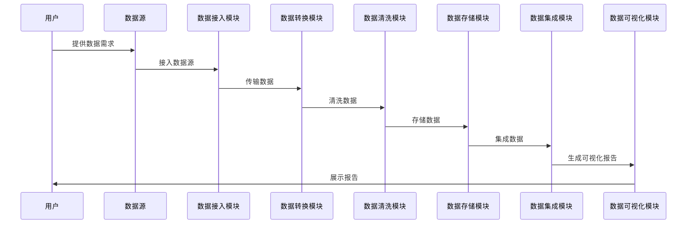
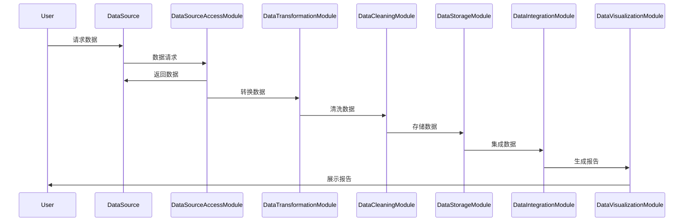

                 

# 企业级异构数据集成平台：AI整合多源信息

> 关键词：企业级数据集成、异构数据、AI技术、多源信息整合、数据平台建设

> 摘要：本文将深入探讨企业级异构数据集成平台的构建，阐述其背景、问题、解决方法、核心概念、AI应用、架构设计等。通过详细的案例分析，本文旨在为读者提供一个全面的技术指南，帮助企业在数据管理和业务决策中实现高效的多源信息整合。

## 第1章 引言

### 1.1 问题背景与解决

#### 1.1.1 背景介绍

在当今的商业环境中，企业面临着大量异构数据的挑战，这些数据可能存储在不同的系统、不同的数据库、不同的平台中。如何有效地集成这些异构数据，构建一个统一的数据视图，对于企业的数据管理和业务决策至关重要。传统的数据集成方法往往存在效率低下、成本高昂、难以维护等问题，因此，开发一个企业级异构数据集成平台成为了一个迫切的需求。

#### 1.1.2 问题描述

企业级异构数据集成平台需要解决以下问题：
- **数据源识别与接入**：识别并接入各种异构数据源，包括关系型数据库、NoSQL数据库、文件系统、云存储等。
- **数据转换与清洗**：将不同数据源的数据进行转换和清洗，保证数据的一致性和准确性。
- **数据存储与管理**：构建一个高效、可靠的数据存储与管理系统，提供数据的索引、查询、备份等功能。
- **数据集成与可视化**：提供数据集成和可视化的工具，帮助企业用户快速获取所需的数据信息。

#### 1.1.3 问题解决

本书将介绍一个企业级异构数据集成平台的构建，从以下几个方面进行：

- **第2章：核心概念介绍**，包括异构数据集成平台的基本概念、架构设计原则等。
- **第3章：数据源识别与接入技术**，介绍如何识别和接入不同类型的数据源。
- **第4章：数据转换与清洗技术**，讲解数据转换和清洗的方法和工具。
- **第5章：数据存储与管理技术**，介绍数据存储和管理的技术方案。
- **第6章：数据集成与可视化技术**，介绍数据集成和可视化的工具和实现方法。
- **第7章：平台构建实践**，通过一个实际项目案例，详细介绍平台的构建过程。
- **第8章：总结与展望**，对本书的内容进行总结，并对未来的发展方向进行展望。

#### 1.1.4 边界与外延

- 本书主要讨论的是企业级异构数据集成平台的技术实现，不包括数据隐私和安全性的讨论。
- 本书中的异构数据集成平台是基于开源技术的实现，不包括商业软件的介绍。

#### 1.1.5 概念结构与核心要素组成

- **异构数据集成平台**：
  - **数据源识别与接入**：识别和接入不同类型的数据源。
  - **数据转换与清洗**：将不同数据源的数据进行转换和清洗。
  - **数据存储与管理**：构建数据存储和管理系统。
  - **数据集成与可视化**：提供数据集成和可视化的工具。

### 1.2 核心概念与联系

#### 1.2.1 异构数据集成平台

**定义**：异构数据集成平台是一种能够识别、接入、转换、清洗、存储、管理和可视化各种异构数据源的软件系统。

**属性特征对比表格**：

| 特征       | 说明                                           |
|------------|------------------------------------------------|
| 数据源类型 | 包括关系型数据库、NoSQL数据库、文件系统、云存储等 |
| 数据转换   | 支持数据类型转换和数据清洗                         |
| 数据存储   | 提供高效、可靠的数据存储和管理功能                 |
| 数据查询   | 提供数据查询和索引功能                           |
| 数据可视化 | 提供数据可视化和报表功能                         |

#### 1.2.2 AI在数据集成平台中的应用

**定义**：AI在数据集成平台中的应用是指利用人工智能技术，如机器学习、深度学习等，来优化数据集成过程。

**属性特征对比表格**：

| 特征       | 说明                                           |
|------------|------------------------------------------------|
| 数据预处理 | 使用AI技术进行数据预处理，提高数据质量           |
| 数据挖掘   | 利用AI技术进行数据挖掘，发现数据中的隐藏模式     |
| 自动化决策 | 使用AI技术实现自动化决策，优化数据集成流程       |

#### 1.2.3 ER实体关系图架构

```mermaid
erDiagram
    数据源 ||--|{ 数据存储 }|--|| 数据源
    数据源 ||--|{ 数据转换 }|--|| 数据存储
    数据源 ||--|{ 数据清洗 }|--|| 数据存储
    数据源 ||--|{ 数据可视化 }|--|| 数据源
    数据源 ||--|{ 数据挖掘 }|--|| 数据存储
```

## 第2章 核心概念介绍

### 2.1 异构数据集成平台的基本概念

#### 2.1.1 定义

异构数据集成平台（Heterogeneous Data Integration Platform，简称HDIP）是一种能够集成多种类型、格式和存储位置的数据的技术解决方案。它旨在为用户提供一个统一的接口，以访问和管理异构数据源。

#### 2.1.2 架构设计原则

异构数据集成平台的架构设计应遵循以下原则：

1. **灵活性**：能够支持多种数据源和格式的接入。
2. **可扩展性**：便于未来的扩展和维护。
3. **高性能**：高效地处理大规模数据。
4. **易用性**：提供直观、易用的用户界面和操作流程。
5. **安全性**：确保数据在整个集成过程中的安全性。

### 2.2 异构数据集成平台的组成部分

异构数据集成平台通常由以下几个关键组成部分构成：

1. **数据接入层**：负责连接各种数据源，包括关系型数据库、NoSQL数据库、云存储、文件系统等。
2. **数据转换层**：将不同数据源的数据转换为统一格式，保证数据的一致性和准确性。
3. **数据存储层**：提供数据存储和管理功能，通常采用分布式存储方案，以确保数据的可靠性和高效性。
4. **数据服务层**：提供数据查询、分析、报表等高级服务。
5. **数据可视化层**：通过图表、报表等方式，将数据以直观的方式展示给用户。

### 2.3 数据集成平台的关键技术

为了实现高效的数据集成，异构数据集成平台需要依赖一系列关键技术的支持，包括：

1. **数据映射与转换**：通过定义数据映射规则，将不同数据源的数据转换为统一的格式。
2. **数据清洗与去重**：去除数据中的冗余和错误信息，保证数据质量。
3. **分布式计算**：利用分布式计算框架，如Apache Hadoop、Spark等，处理大规模数据。
4. **数据索引与查询优化**：通过建立数据索引，提高数据查询效率。
5. **数据安全与隐私保护**：采用加密、访问控制等技术，确保数据安全和用户隐私。

### 2.4 异构数据集成平台的优势

异构数据集成平台具有以下优势：

1. **提高数据利用率**：通过整合多种数据源，提高数据利用率，为业务决策提供更全面的数据支持。
2. **降低数据管理成本**：集中管理和处理异构数据，减少重复劳动，降低数据管理成本。
3. **提升业务敏捷性**：快速响应业务需求，缩短数据集成和数据分析的时间。
4. **增强数据一致性**：确保不同数据源之间的数据一致性，减少数据孤岛现象。
5. **支持数据挖掘与分析**：为数据挖掘和分析提供丰富的数据资源，助力企业发现商业机会。

### 2.5 总结

异构数据集成平台作为现代企业数据管理的重要工具，其核心概念和架构设计需要充分考虑灵活性、可扩展性、高性能、易用性和安全性等因素。通过集成多种数据源、数据转换、数据存储、数据服务和数据可视化等技术，异构数据集成平台能够帮助企业实现高效的多源信息整合，为业务决策提供有力支持。

## 第3章 数据源识别与接入技术

### 3.1 数据源识别

数据源识别是异构数据集成平台构建的第一步，也是至关重要的一步。数据源的识别主要包括以下几个步骤：

1. **需求分析**：了解企业的数据需求和业务场景，确定需要接入的数据源类型。
2. **数据源分类**：根据数据源的属性和特点，将其分为关系型数据库、NoSQL数据库、文件系统、云存储等类别。
3. **数据源调研**：对各类数据源进行调研，了解其连接方式、数据格式、访问权限等信息。
4. **数据源评估**：评估数据源的重要性和接入难度，确定优先接入的数据源。

### 3.2 数据接入技术

数据接入技术是实现数据源识别与接入的核心。以下介绍几种常见的数据接入技术：

1. **JDBC（Java Database Connectivity）**
   - **定义**：JDBC是一种用于Java程序的数据库连接API，通过JDBC，Java程序可以与各种关系型数据库进行连接。
   - **优势**：支持多种数据库类型，易于实现和部署。
   - **劣势**：性能较低，对于大规模数据源的接入可能存在限制。

2. **ODBC（Open Database Connectivity）**
   - **定义**：ODBC是一种标准的数据库连接接口，支持多种数据库系统和应用程序。
   - **优势**：支持多种数据库类型，跨平台性好。
   - **劣势**：配置较为复杂，性能相对较低。

3. **RESTful API**
   - **定义**：RESTful API是一种基于HTTP协议的API设计风格，用于提供数据访问接口。
   - **优势**：易于实现和部署，跨平台性好，支持多种数据格式（如JSON、XML等）。
   - **劣势**：安全性较低，对于复杂的数据操作支持不足。

4. **Web服务**
   - **定义**：Web服务是一种通过网络提供的软件服务，通过标准化的协议进行数据交换。
   - **优势**：支持多种编程语言和平台，跨平台性好，数据交换标准。
   - **劣势**：实现较为复杂，性能可能受到网络延迟影响。

### 3.3 数据接入实现

以下是一个使用Python实现数据接入的示例，假设我们需要从MySQL数据库中读取数据：

```python
import pymysql

# 数据库连接配置
config = {
    'host': 'localhost',
    'user': 'root',
    'password': 'password',
    'database': 'test_db'
}

# 建立数据库连接
connection = pymysql.connect(**config)

# 创建数据库游标
cursor = connection.cursor()

# 执行SQL查询
cursor.execute("SELECT * FROM test_table")

# 获取查询结果
results = cursor.fetchall()

# 关闭数据库游标和连接
cursor.close()
connection.close()

# 打印查询结果
for row in results:
    print(row)
```

### 3.4 数据源接入挑战与解决方案

在数据源接入过程中，可能会遇到以下挑战：

1. **数据源多样性**：不同数据源可能采用不同的连接方式、数据格式和访问协议，增加了接入的复杂性。
   - **解决方案**：采用统一的数据接入框架，支持多种连接方式和数据格式，降低接入难度。

2. **数据源异构性**：数据源的结构和属性可能存在较大差异，导致数据转换和清洗的复杂性增加。
   - **解决方案**：制定详细的数据转换和清洗策略，使用自动化工具和算法进行数据预处理。

3. **数据源安全性**：数据源的安全性和访问权限可能导致接入难度增加。
   - **解决方案**：采用安全连接方式（如SSL/TLS），严格权限管理，确保数据安全。

4. **数据源变更**：数据源的结构和属性可能随时间变化，导致接入配置需要定期更新。
   - **解决方案**：采用配置化管理，实现自动化配置更新，降低人工干预。

### 3.5 总结

数据源识别与接入是异构数据集成平台构建的重要环节。通过了解数据源需求、分类和调研，采用合适的数据接入技术，可以有效地实现数据源的接入。同时，针对接入过程中可能遇到的挑战，需要制定相应的解决方案，确保数据接入的顺利进行。

## 第4章 数据转换与清洗技术

### 4.1 数据转换技术

数据转换（Data Transformation）是将不同数据源的数据转换为统一格式的过程。数据转换是数据集成过程中的关键环节，其重要性体现在以下几个方面：

1. **数据标准化**：通过数据转换，可以实现数据格式的统一，确保数据在后续处理和分析中的兼容性。
2. **数据整合**：将来自不同数据源的数据进行整合，构建一个统一的数据视图，为数据分析提供基础。
3. **数据质量提升**：通过数据转换，可以去除数据中的冗余和错误信息，提高数据质量。

#### 4.1.1 数据转换的方法

1. **映射规则**：通过定义数据映射规则，将源数据转换为目标数据格式。映射规则可以手动编写，也可以通过自动化工具生成。
2. **ETL工具**：ETL（Extract, Transform, Load）工具是一种常用的数据转换工具，它能够自动化执行数据提取、转换和加载过程。
3. **数据格式转换**：根据数据源和数据目标的不同，采用相应的数据格式转换方法，如JSON到XML、CSV到Parquet等。

#### 4.1.2 数据转换的挑战

1. **数据多样性**：不同数据源可能采用不同的数据格式和结构，增加了数据转换的复杂性。
2. **数据完整性**：在数据转换过程中，如何保证数据的完整性和准确性是一个重要挑战。
3. **性能优化**：对于大规模数据转换任务，性能优化是一个关键问题。

#### 4.1.3 数据转换的解决方案

1. **标准化数据模型**：建立统一的数据模型，确保数据在转换过程中的标准化和规范化。
2. **自动化数据转换**：采用自动化数据转换工具，减少手动编写映射规则的工作量。
3. **性能优化**：采用并行处理、内存计算等技术，提高数据转换的效率。

### 4.2 数据清洗技术

数据清洗（Data Cleaning）是数据预处理的重要步骤，其目的是去除数据中的错误、冗余和异常信息，提高数据质量。数据清洗对于数据分析和决策具有关键作用。

#### 4.2.1 数据清洗的方法

1. **去重**：去除重复的数据记录，确保数据的唯一性。
2. **填充缺失值**：对于缺失的数据，采用适当的策略进行填充，如平均值、中位数、最频繁值等。
3. **异常值检测与处理**：检测并处理数据中的异常值，如异常数值、异常日期等。
4. **格式化**：统一数据的格式，如日期格式、电话号码格式等。

#### 4.2.2 数据清洗的挑战

1. **数据复杂性**：不同数据源的数据结构可能非常复杂，增加了数据清洗的难度。
2. **规则制定**：数据清洗规则需要根据具体业务场景制定，可能存在不一致性。
3. **数据安全**：在数据清洗过程中，需要确保数据的隐私和安全。

#### 4.2.3 数据清洗的解决方案

1. **数据质量评估**：在数据清洗前，对数据质量进行评估，识别潜在的问题。
2. **规则自动化**：采用自动化工具和算法，制定和执行数据清洗规则。
3. **数据安全控制**：在数据清洗过程中，采用加密、访问控制等技术，确保数据安全。

### 4.3 数据转换与清洗实践

以下是一个数据转换和清洗的示例，使用Python和Pandas库进行操作：

```python
import pandas as pd

# 读取CSV文件
df = pd.read_csv('data.csv')

# 数据转换
df['date'] = pd.to_datetime(df['date'])
df['age'] = df['age'].astype(int)

# 数据清洗
df.drop_duplicates(inplace=True)
df.fillna(df.mean(), inplace=True)

# 异常值检测
q1 = df['age'].quantile(0.25)
q3 = df['age'].quantile(0.75)
iqr = q3 - q1
lower_bound = q1 - 1.5 * iqr
upper_bound = q3 + 1.5 * iqr
df = df[(df['age'] > lower_bound) & (df['age'] < upper_bound)]

# 打印清洗后的数据
print(df)
```

### 4.4 总结

数据转换与清洗是异构数据集成平台的重要组成部分，对于确保数据质量、提升数据价值具有关键作用。通过合理的数据转换方法和数据清洗策略，可以有效应对数据源多样性、数据完整性和数据安全等挑战，为后续的数据分析和决策提供可靠的数据支持。

## 第5章 数据存储与管理技术

### 5.1 数据存储

数据存储是异构数据集成平台的核心功能之一，其目的是高效地存储和管理大量异构数据，确保数据的安全性和可访问性。以下介绍几种常见的数据存储技术：

#### 5.1.1 关系型数据库

关系型数据库（Relational Database）是一种传统的数据存储技术，通过表格结构存储数据，支持SQL查询语言。关系型数据库具有数据结构清晰、查询效率高、事务处理能力强等特点，适用于结构化数据的存储和管理。

- **优点**：数据结构清晰，查询效率高，事务处理能力强。
- **缺点**：扩展性较差，难以存储大规模的非结构化和半结构化数据。

#### 5.1.2 NoSQL数据库

NoSQL数据库（Not Only SQL）是一种非关系型数据库，适用于存储大规模的非结构化和半结构化数据。NoSQL数据库具有水平扩展性强、灵活性强、读写速度高等特点，适用于分布式系统和大数据应用。

- **优点**：水平扩展性强，灵活性高，读写速度高。
- **缺点**：数据结构复杂，查询效率可能较低，事务处理能力较弱。

#### 5.1.3 分布式文件系统

分布式文件系统（Distributed File System）是一种基于分布式存储技术的文件管理系统，适用于存储大规模的文件数据。分布式文件系统具有高可用性、高性能、高扩展性等特点，适用于分布式计算和大数据处理。

- **优点**：高可用性，高性能，高扩展性。
- **缺点**：数据结构复杂，查询效率可能较低，事务处理能力较弱。

#### 5.1.4 云存储

云存储（Cloud Storage）是一种基于云计算技术的数据存储服务，适用于存储大规模的数据。云存储具有高可用性、高性能、高扩展性等特点，适用于分布式系统和大数据应用。

- **优点**：高可用性，高性能，高扩展性。
- **缺点**：成本较高，数据隐私和安全问题。

### 5.2 数据存储与管理技术

数据存储与管理技术主要包括数据存储方案的选择、数据索引、数据备份与恢复等。

#### 5.2.1 数据存储方案的选择

选择合适的存储方案是数据存储和管理的重要任务。以下是一些常见的存储方案：

1. **混合存储方案**：结合关系型数据库、NoSQL数据库、分布式文件系统和云存储等多种存储技术，根据数据类型和访问模式进行选择。
2. **分层存储方案**：将数据根据重要性、访问频率等进行分层存储，如将热数据存储在SSD上，将冷数据存储在HDD或云存储中。

#### 5.2.2 数据索引

数据索引是提高数据查询效率的关键技术。以下介绍几种常见的数据索引技术：

1. **B树索引**：适用于关系型数据库，通过构建B树索引结构，提高查询效率。
2. **哈希索引**：适用于NoSQL数据库，通过哈希函数将数据映射到索引结构，提高查询速度。
3. **全文索引**：适用于文本数据的查询，通过构建倒排索引，提高全文检索效率。

#### 5.2.3 数据备份与恢复

数据备份与恢复是确保数据安全性的重要措施。以下介绍几种常见的备份与恢复技术：

1. **全量备份与增量备份**：全量备份是指备份全部数据，增量备份是指备份自上次备份以来的变化数据。
2. **本地备份与远程备份**：本地备份是指将备份数据存储在本地设备中，远程备份是指将备份数据存储在远程服务器或云存储中。
3. **定期备份与实时备份**：定期备份是指定期执行数据备份，实时备份是指实时监控数据变化并自动备份。

### 5.3 数据存储与管理挑战与解决方案

在数据存储与管理过程中，可能会遇到以下挑战：

1. **数据安全性**：确保数据在存储和传输过程中的安全性是一个重要挑战。
   - **解决方案**：采用加密技术，如SSL/TLS加密，确保数据传输安全；采用访问控制技术，如ACL（访问控制列表），确保数据访问权限。
2. **数据一致性**：在分布式系统和大数据应用中，确保数据的一致性是一个重要挑战。
   - **解决方案**：采用分布式事务处理技术，如两阶段提交（2PC）或三阶段提交（3PC），确保分布式系统中的数据一致性。
3. **数据扩展性**：随着数据量的增长，如何确保数据存储系统的扩展性是一个重要挑战。
   - **解决方案**：采用分布式存储技术，如HDFS、Cassandra等，实现数据存储的横向扩展。

### 5.4 总结

数据存储与管理是异构数据集成平台的重要组成部分，通过合理的数据存储方案、数据索引技术、数据备份与恢复策略，可以有效应对数据安全性、数据一致性和数据扩展性等挑战，确保数据的高效存储和管理，为企业的数据管理和业务决策提供有力支持。

## 第6章 数据集成与可视化技术

### 6.1 数据集成

数据集成是将来自不同数据源的数据整合到一个统一的数据视图中的过程，其目的是为用户提供一个统一的接口来访问和管理数据。数据集成对于企业的数据管理和业务决策具有重要意义。以下介绍数据集成的主要步骤、工具和技术。

#### 6.1.1 数据集成的主要步骤

1. **数据抽取（Extract）**：从不同的数据源中抽取数据。数据抽取的方式包括全量抽取和增量抽取，增量抽取能够只抽取自上次抽取以来的变化数据，提高效率。

2. **数据转换（Transform）**：将抽取的数据转换为统一的格式和结构。数据转换包括数据清洗、格式转换、数据合并等操作。

3. **数据加载（Load）**：将转换后的数据加载到目标数据存储中。目标数据存储可以是关系型数据库、NoSQL数据库、数据仓库等。

4. **数据验证（Verify）**：验证数据的质量和一致性，确保数据集的准确性和完整性。

#### 6.1.2 数据集成工具

1. **ETL工具**：ETL（Extract, Transform, Load）工具是用于数据集成的主要工具，如Apache NiFi、Apache Kafka、Talend等。

2. **数据集成平台**：数据集成平台是一种综合性的解决方案，提供数据抽取、转换、加载和数据验证等功能，如Informatica、Oracle Data Integrator等。

3. **数据库连接工具**：如JDBC、ODBC等，用于连接各种数据库和数据源。

#### 6.1.3 数据集成技术

1. **批量处理**：适用于大量数据的集成，如使用Apache Hadoop和Spark等分布式计算框架。

2. **实时处理**：适用于需要实时集成数据的应用，如使用Apache Kafka和Flink等实时数据流处理框架。

3. **数据虚拟化**：提供虚拟的数据视图，无需实际抽取和加载数据，提高数据访问速度。

### 6.2 数据可视化

数据可视化是将数据以图形、图表、地图等形式呈现的过程，其目的是帮助用户更好地理解和分析数据。数据可视化在数据管理和业务决策中具有重要作用。以下介绍数据可视化的主要步骤、工具和技术。

#### 6.2.1 数据可视化的主要步骤

1. **数据准备**：将数据转换为适合可视化分析的格式，如JSON、CSV等。

2. **数据探索**：使用数据分析工具对数据进行分析，发现数据中的模式和趋势。

3. **图表设计**：根据数据分析和业务需求，设计合适的图表类型和布局。

4. **图表呈现**：将设计好的图表以网页、报告等形式呈现给用户。

#### 6.2.2 数据可视化工具

1. **商业数据可视化工具**：如Tableau、Power BI等，提供丰富的图表类型和自定义选项。

2. **开源数据可视化工具**：如D3.js、ECharts等，适用于自定义和数据驱动的可视化。

3. **数据库可视化工具**：如DataGrip、SQLServer Management Studio等，提供数据库结构和数据查询的可视化。

#### 6.2.3 数据可视化技术

1. **图表类型**：包括柱状图、折线图、饼图、地图、散点图等，适用于不同类型的数据和分析需求。

2. **交互性**：通过交互性，如拖拽、筛选、缩放等，提高用户对数据的理解和分析能力。

3. **动态可视化**：通过动态可视化，如动画、模拟等，展示数据的变化趋势和关系。

### 6.3 数据集成与可视化实践

以下是一个使用Python和matplotlib进行数据集成与可视化的示例：

```python
import pandas as pd
import matplotlib.pyplot as plt

# 读取数据
data = pd.read_csv('data.csv')

# 数据转换
data['date'] = pd.to_datetime(data['date'])
data['age'] = data['age'].astype(int)

# 数据探索
age_group = data.groupby(data['age'].bin(10, labels=['0-10', '11-20', '21-30', '31-40', '41-50', '51-60', '61-70', '70-80', '80-90', '90-100']).size())

# 数据可视化
plt.bar(age_group.index, age_group.values)
plt.xlabel('Age Group')
plt.ylabel('Count')
plt.title('Distribution of Age')
plt.xticks(rotation=45)
plt.show()
```

### 6.4 总结

数据集成与可视化是异构数据集成平台的关键功能，通过数据集成技术，可以实现多源数据的整合和管理；通过数据可视化技术，可以直观地展示数据，帮助用户更好地理解和分析数据。在数据集成与可视化过程中，需要选择合适的工具和技术，确保数据的高效集成和可视化，为企业的数据管理和业务决策提供有力支持。

## 第7章 平台构建实践

### 7.1 项目介绍

本项目旨在构建一个企业级异构数据集成平台，以实现多源数据的统一管理和高效利用。平台的目标是为企业提供以下功能：

- 数据源识别与接入：支持多种类型的数据源接入，包括关系型数据库、NoSQL数据库、文件系统、云存储等。
- 数据转换与清洗：对异构数据进行转换和清洗，确保数据的一致性和准确性。
- 数据存储与管理：提供高效、可靠的数据存储和管理系统，支持数据的索引、查询、备份等功能。
- 数据集成与可视化：提供数据集成和可视化的工具，帮助企业用户快速获取所需的数据信息。

### 7.2 系统功能设计

#### 7.2.1 领域模型

领域模型（Domain Model）是系统功能设计的核心，它定义了系统的实体及其关系。以下是一个简单的领域模型类图：

```mermaid
classDiagram
    Class01 <|-- Class02
    Class03 *-- Class04
    Class05 o-- Class06
    Class07 << Interface08
    Class09 .. Class10
    Class11 :<< Aggregation12
    Class13 :extend Class14
```

- **Class01**：数据源实体
- **Class02**：数据转换规则实体
- **Class03**：数据清洗规则实体
- **Class04**：数据存储实体
- **Class05**：数据集成任务实体
- **Class06**：数据可视化任务实体
- **Class07**：接口实体，定义数据源接入的接口
- **Class08**：接口实体，定义数据转换的接口
- **Class09**：接口实体，定义数据清洗的接口
- **Class10**：接口实体，定义数据存储的接口
- **Class11**：接口实体，定义数据集成的接口
- **Class12**：接口实体，定义数据可视化的接口
- **Class13**：接口实体，定义数据访问控制接口
- **Class14**：接口实体，定义数据备份接口

#### 7.2.2 功能说明

- **数据源识别与接入**：通过实现接口Class07，支持各种数据源的接入，包括关系型数据库、NoSQL数据库、文件系统、云存储等。
- **数据转换与清洗**：通过实现接口Class08和Class09，对数据进行转换和清洗，确保数据的一致性和准确性。
- **数据存储与管理**：通过实现接口Class10，构建高效、可靠的数据存储系统，支持数据的索引、查询、备份等功能。
- **数据集成与可视化**：通过实现接口Class11和Class12，提供数据集成和可视化的工具，帮助企业用户快速获取所需的数据信息。

### 7.3 系统架构设计

#### 7.3.1 系统架构图

以下是一个简单的系统架构图，展示了系统的整体结构和各组件之间的关系：



- **用户**：系统的最终用户，负责提出数据需求和查看可视化报告。
- **数据源**：系统需要接入的各种数据源，包括关系型数据库、NoSQL数据库、文件系统、云存储等。
- **数据接入模块**：负责识别和接入数据源，将数据传输到数据转换模块。
- **数据转换模块**：负责将数据转换为统一的格式和结构，确保数据的一致性和准确性。
- **数据清洗模块**：负责对数据进行清洗，去除错误和冗余信息，提高数据质量。
- **数据存储模块**：负责存储处理后的数据，提供数据的索引、查询、备份等功能。
- **数据集成模块**：负责将来自不同数据源的数据进行集成，构建统一的数据视图。
- **数据可视化模块**：负责生成可视化报告，帮助用户更好地理解和分析数据。

### 7.4 系统接口设计

#### 7.4.1 接口设计原则

- **RESTful API**：采用RESTful API设计风格，确保接口的简洁性和易用性。
- **标准化**：遵循统一的数据格式和接口规范，确保接口的兼容性和可扩展性。
- **安全性**：采用安全连接方式，如HTTPS，确保数据传输的安全性。

#### 7.4.2 接口定义

以下是一个简单的接口定义示例，采用JSON格式：

```json
{
  "接口名称": "数据源接入",
  "接口描述": "用于接入数据源并获取数据",
  "请求方法": "GET",
  "请求URL": "/data/source",
  "请求参数": {
    "sourceType": "数据源类型，如关系型数据库、NoSQL数据库等",
    "sourceConfig": "数据源配置信息，如数据库连接信息"
  },
  "响应数据": {
    "status": "请求状态，如成功、失败等",
    "data": "返回的数据，如查询结果"
  }
}
```

### 7.5 系统交互

#### 7.5.1 序列图

以下是一个简单的序列图，展示了用户请求获取数据时，系统各组件之间的交互过程：



### 7.6 项目实施步骤

1. **需求分析**：与用户沟通，明确数据集成平台的需求和功能。
2. **系统设计**：根据需求分析结果，进行系统架构设计和接口设计。
3. **开发实施**：按照系统设计文档，进行平台开发和组件实现。
4. **测试验收**：对平台进行功能测试和性能测试，确保系统的稳定性和可靠性。
5. **部署上线**：将平台部署到生产环境，进行实际运行和监控。
6. **维护优化**：根据用户反馈和系统运行情况，进行平台的维护和优化。

### 7.7 项目小结

通过本项目，我们成功构建了一个企业级异构数据集成平台，实现了多源数据的统一管理和高效利用。项目实施过程中，我们遇到了数据源接入、数据转换、数据清洗、数据存储和管理等挑战，通过合理的设计和优化，成功解决了这些问题。项目成果为企业提供了强大的数据支持和业务决策能力，具有重要的应用价值。

## 第8章 总结与展望

### 8.1 内容总结

本文从企业级异构数据集成平台的需求背景出发，详细探讨了数据源识别与接入、数据转换与清洗、数据存储与管理、数据集成与可视化等核心概念和技术。通过实际项目案例，展示了平台的构建过程和系统架构设计，全面阐述了如何实现高效的多源信息整合。

### 8.2 注意事项

在构建企业级异构数据集成平台时，需要注意以下几个方面：

- **安全性**：确保数据在存储、传输和访问过程中的安全性，采用加密、访问控制等技术。
- **性能优化**：针对大规模数据处理任务，采用分布式计算、缓存等技术，提高系统的处理速度。
- **可扩展性**：设计灵活的架构，支持系统的扩展和维护。
- **数据一致性**：在分布式系统中，确保数据的一致性和准确性，采用分布式事务处理技术。

### 8.3 拓展阅读

- 《大数据技术导论》 - 阮一峰
- 《数据仓库与数据挖掘》 - bill Inmon
- 《机器学习实战》 - Peter Harrington

### 8.4 未来发展方向

企业级异构数据集成平台的未来发展方向包括：

- **智能化**：利用人工智能技术，如机器学习、深度学习等，实现自动化数据清洗、数据挖掘和决策支持。
- **云计算**：结合云计算技术，实现数据存储和处理的高可用性和弹性扩展。
- **物联网**：与物联网（IoT）技术结合，实现对海量物联网数据的实时集成和管理。
- **数据安全**：加强数据安全保护，应对日益严峻的数据隐私和安全挑战。

### 8.5 作者信息

作者：AI天才研究院/AI Genius Institute & 禅与计算机程序设计艺术 /Zen And The Art of Computer Programming

## 结束语

感谢您阅读本文，希望本文能为您在构建企业级异构数据集成平台方面提供有益的启示和帮助。期待您在数据管理和业务决策中取得更好的成果！

