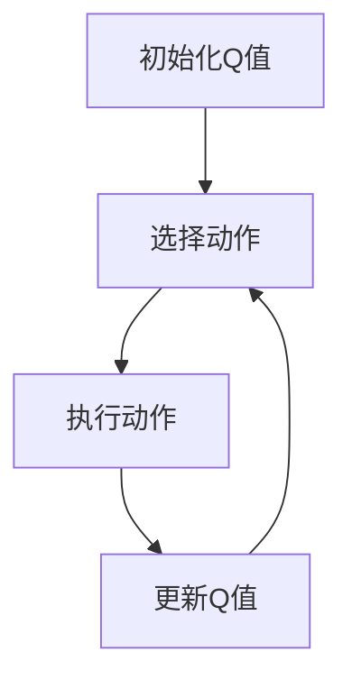
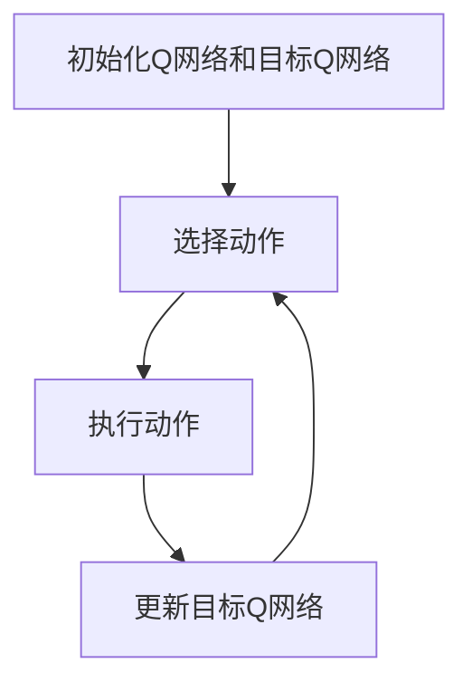
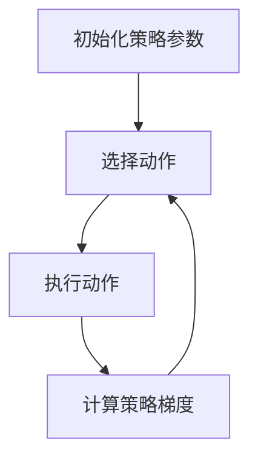
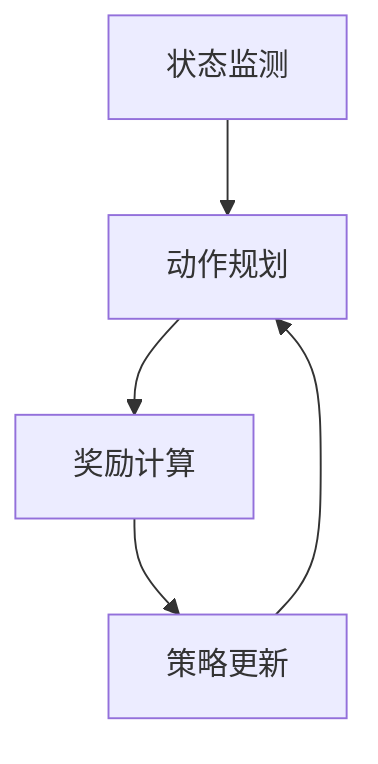
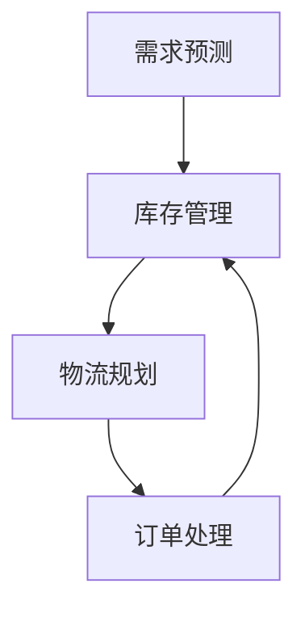
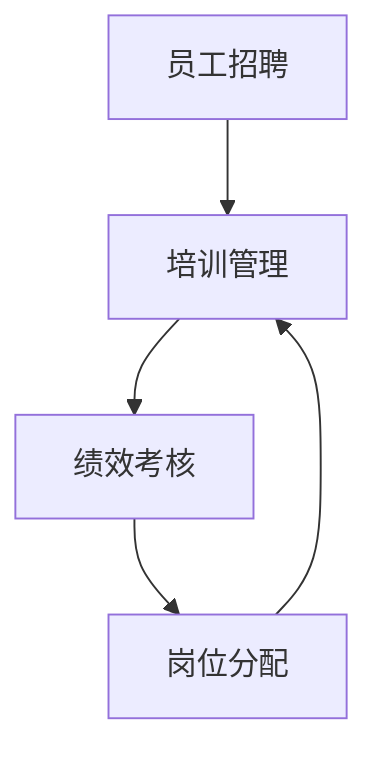
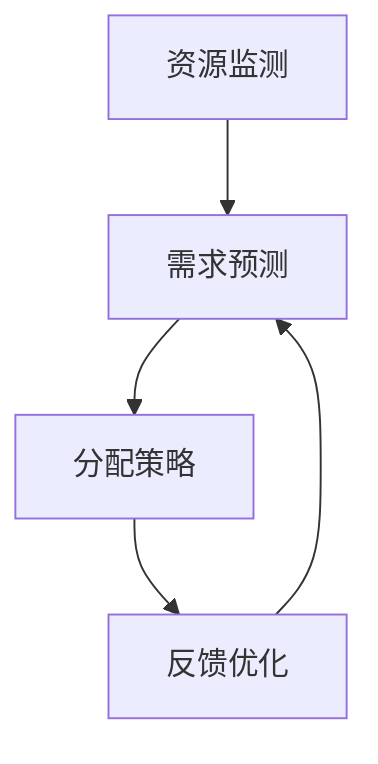
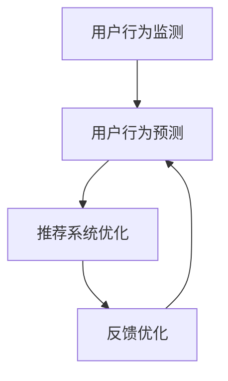

                 

## 文章标题：企业级强化学习应用：优化复杂决策流程

关键词：强化学习、复杂决策流程、优化、企业级应用

摘要：本文将深入探讨强化学习在企业级应用中的价值，通过详细解析强化学习的基本概念、算法及其优化方法，展示其在生产调度、供应链管理、人力资源管理和资源分配等领域的应用实例。本文旨在为读者提供一种全新的思考方式，通过步骤性的分析推理，了解强化学习在优化复杂决策流程中的关键作用。

----------------------------------------------------------------

### 目录大纲

----------------------------------------------------------------

## 第一部分：企业级强化学习概述

### 第1章：强化学习基础

#### 1.1 问题背景与解决

#### 1.2 强化学习的基本概念

#### 1.3 强化学习的特点与挑战

### 第2章：强化学习算法

#### 2.1 Q-Learning算法

#### 2.2 SARSA算法

#### 2.3 Deep Q-Network(DQN)算法

#### 2.4 Policy Gradient算法

### 第3章：强化学习应用场景分析

#### 3.1 生产调度

#### 3.2 供应链管理

#### 3.3 人力资源管理

#### 3.4 资源分配

### 第4章：强化学习在金融领域的应用

#### 4.1 金融市场预测

#### 4.2 投资组合优化

#### 4.3 风险管理

### 第5章：强化学习算法优化

#### 5.1 策略梯度算法优化

#### 5.2 DQN算法优化

#### 5.3 基于模型的算法优化

### 第6章：强化学习在工业互联网中的应用

#### 6.1 工业设备故障预测

#### 6.2 生产线优化

#### 6.3 能源管理

### 第7章：强化学习在电子商务中的应用

#### 7.1 用户行为预测

#### 7.2 推广策略优化

#### 7.3 销售预测

### 第8章：强化学习应用案例分析

#### 8.1 案例一：某电子商务平台用户行为预测

#### 8.2 案例二：某金融公司投资组合优化

#### 8.3 案例三：某工业互联网企业生产线优化

### 第9章：总结与展望

#### 9.1 强化学习应用总结

#### 9.2 强化学习未来发展趋势

#### 9.3 强化学习应用中的挑战与对策

----------------------------------------------------------------

### 企业级强化学习概述

在当今企业竞争激烈的环境中，决策的复杂性和不确定性不断增加。企业需要快速响应市场变化，优化运营流程，提高资源利用效率。强化学习作为一种先进的机器学习技术，通过不断尝试和反馈，在复杂环境中实现最优决策。本文将从以下几个方面概述企业级强化学习的应用：

#### 1.1 问题背景与解决

随着业务规模的扩大和市场竞争的加剧，企业面临的生产调度、供应链管理、人力资源管理和资源分配等问题日益复杂。传统的决策方法难以应对这些动态变化的环境。强化学习通过模拟试错和持续学习，能够在复杂决策过程中实现自动优化，提高企业运营效率。

#### 1.2 强化学习的基本概念

强化学习是一种通过不断尝试和反馈进行决策的学习方法。它由三个核心要素组成：环境（Environment）、智能体（Agent）和奖励（Reward）。智能体通过观察环境状态，选择动作，并接收奖励信号，然后调整策略，以实现最大化累积奖励的目标。

#### 1.3 强化学习的特点与挑战

强化学习具有以下特点：

1. **适应性**：强化学习能够适应动态变化的决策环境，通过持续学习，实现策略的优化。
2. **灵活性**：强化学习不依赖于特定领域的先验知识，能够处理多种类型的决策问题。
3. **自主性**：强化学习智能体可以自主决策，减少对人工干预的依赖。

然而，强化学习也面临一些挑战：

1. **延迟奖励**：强化学习往往需要较长的时间才能获得奖励信号，这使得优化过程变得复杂。
2. **探索与利用**：在强化学习中，智能体需要在探索未知状态和利用已知状态之间做出权衡。
3. **计算效率**：强化学习算法通常需要大量的计算资源，这对企业部署提出了挑战。

本文将详细探讨这些核心概念和算法，并分析强化学习在不同领域中的应用。通过逐步分析推理，我们将深入了解强化学习在优化复杂决策流程中的关键作用。让我们开始这一探索之旅。

----------------------------------------------------------------

## 第一部分：企业级强化学习概述

### 第1章：强化学习基础

#### 1.1 问题背景与解决

在现代企业管理中，决策流程的复杂性和不确定性日益增加。传统的决策方法往往依赖于历史数据和统计模型，但这些方法在应对动态和复杂环境时显得力不从心。例如，生产调度问题涉及多个工序和资源的协调，供应链管理需要平衡供应与需求，人力资源管理涉及员工技能和岗位匹配，资源分配则需要考虑资源可用性和项目优先级。这些问题往往具有不确定性，且决策的反馈周期较长。

强化学习作为机器学习的一个重要分支，通过模拟智能体在环境中的交互过程，能够有效地解决这类复杂决策问题。强化学习通过智能体与环境之间的不断交互，学习到最优的策略，从而在动态环境中实现高效决策。

#### 1.2 强化学习的基本概念

强化学习（Reinforcement Learning，RL）是一种通过不断试错和反馈，使智能体（Agent）学习到最优行为策略的机器学习方法。它由三个核心要素组成：环境（Environment）、智能体（Agent）和奖励（Reward）。

- **环境（Environment）**：环境是智能体行动的场所，它可以是物理环境，如机器人导航场景，也可以是虚拟环境，如模拟游戏。环境会根据智能体的行动返回状态和奖励。
- **智能体（Agent）**：智能体是执行动作并从环境中获取反馈的实体。智能体的目标是学习一个策略（Policy），以最大化累积奖励。
- **状态（State）**：状态是环境的当前描述，它由一组特征组成，用于表示环境的状态。
- **动作（Action）**：动作是智能体可以采取的行动，智能体通过选择不同的动作来改变环境的状态。
- **奖励（Reward）**：奖励是环境对智能体动作的反馈，它可以是正奖励（表示动作有益）或负奖励（表示动作有害）。

#### 强化学习的基本过程可以概括为以下几个步骤：

1. **初始状态**：智能体开始在一个未知的环境中，随机选择一个动作。
2. **执行动作**：智能体执行选定的动作，并改变环境的状态。
3. **状态更新**：环境根据智能体的动作，返回新的状态和奖励信号。
4. **策略更新**：智能体利用接收到的奖励信号，更新其策略，选择下一个动作。
5. **重复过程**：智能体不断重复上述过程，逐渐优化其策略，以实现累积奖励的最大化。

#### 1.3 强化学习的特点与挑战

强化学习具有以下特点：

1. **适应性**：强化学习能够适应动态变化的环境，通过不断学习和调整策略，智能体可以应对环境中的不确定性。
2. **灵活性**：强化学习不依赖于特定的先验知识，能够处理多种类型的决策问题，包括连续状态和动作空间。
3. **自主性**：强化学习智能体可以自主决策，减少对人工干预的依赖。

然而，强化学习也面临一些挑战：

1. **延迟奖励**：强化学习往往需要较长时间才能获得奖励信号，这使得智能体需要具有耐心和长远规划的能力。
2. **探索与利用**：在强化学习中，智能体需要在探索未知状态和利用已知状态之间做出权衡，以确保策略的稳定性和鲁棒性。
3. **计算效率**：强化学习算法通常需要大量的计算资源，特别是在处理高维状态和动作空间时，这要求企业具备相应的计算能力和资源。

为了克服这些挑战，研究人员提出了多种强化学习算法，包括Q-Learning、SARSA、Deep Q-Network（DQN）、Policy Gradient等。这些算法通过不同的策略和优化方法，提高了强化学习在复杂决策环境中的性能和效率。

在本章的后续内容中，我们将详细探讨这些强化学习算法，并分析它们在企业级应用中的具体实现和应用案例。通过深入理解强化学习的基本概念和算法原理，读者将能够更好地应用这一先进技术，优化企业的决策流程和运营效率。

#### 1.4 强化学习的核心概念与联系

为了更好地理解强化学习的核心概念，我们首先需要明确一些关键术语的定义和它们之间的关系。

**状态（State）**：状态是环境的当前描述，它由一组特征组成，用于表示环境的状态。例如，在一个游戏场景中，状态可以包括玩家的位置、游戏得分、游戏关卡等。

**动作（Action）**：动作是智能体可以采取的行动，智能体通过选择不同的动作来改变环境的状态。例如，在上述游戏场景中，动作可以是“向上移动”、“向下移动”、“向左移动”、“向右移动”。

**奖励（Reward）**：奖励是环境对智能体动作的反馈，它可以是正奖励（表示动作有益）或负奖励（表示动作有害）。奖励的目的是激励智能体采取能够带来积极结果的行动。例如，在游戏中，智能体每成功完成一次任务，就会获得正奖励。

**策略（Policy）**：策略是智能体的行为规则，它定义了智能体在特定状态下应该采取的动作。策略可以是一个简单的映射规则，也可以是一个复杂的决策模型。策略的目标是最大化累积奖励。

**价值函数（Value Function）**：价值函数是用来评估状态或状态-动作对的预期奖励的函数。价值函数分为状态价值函数（State Value Function）和动作价值函数（Action Value Function）。状态价值函数表示在特定状态下执行最优动作所能获得的累积奖励，而动作价值函数表示在特定状态下采取特定动作所能获得的累积奖励。

**Q函数（Q-Function）**：Q函数是动作价值函数的一种形式化表示，它给出了在特定状态下采取特定动作的预期奖励。Q函数是强化学习算法中的核心概念，用于评估不同动作的价值。

为了更直观地理解这些核心概念之间的联系，我们可以借助一个简单的例子来解释。假设智能体在一个简单的游戏中进行导航，环境状态包括智能体的位置和目标位置，动作包括上、下、左、右移动。智能体的目标是尽快到达目标位置。

1. **状态**：当前智能体的位置和目标位置。
2. **动作**：上、下、左、右移动。
3. **奖励**：每次移动都会获得一个小的正奖励，成功到达目标位置会获得大的正奖励。
4. **策略**：智能体在特定状态下选择一个动作，例如，在目标位置附近时选择“上”或“下”移动，在目标位置远离时选择“左”或“右”移动。
5. **价值函数**：评估每个动作在当前状态下的预期奖励，例如，向上移动的预期奖励是1，向下移动的预期奖励是-1。
6. **Q函数**：给出每个动作在当前状态下的预期奖励，例如，向上移动的预期奖励是2，向下移动的预期奖励是0。

通过这个例子，我们可以清晰地看到状态、动作、奖励、策略、价值函数和Q函数之间的关系。状态和动作定义了环境的输入和输出，奖励激励智能体采取有益的行动，策略指导智能体如何行动，价值函数和Q函数则用于评估和优化智能体的行为。

在强化学习中，智能体通过不断尝试和反馈，学习到最优的策略，从而实现累积奖励的最大化。这一过程不仅依赖于对状态和动作的理解，还需要考虑奖励信号和策略的调整。通过逐步优化这些核心概念，强化学习能够有效地解决复杂决策问题，为企业提供强大的决策支持。

---

**表1：强化学习核心概念属性特征对比**

| 核心概念 | 定义 | 属性特征 | 对比 |
| --- | --- | --- | --- |
| 状态（State） | 环境的当前描述 | 状态空间、状态特征 | 描述环境的当前情况 |
| 动作（Action） | 智能体可以采取的行动 | 动作空间、动作特征 | 决定智能体如何影响环境 |
| 奖励（Reward） | 环境对智能体动作的反馈 | 奖励值、奖励类型 | 激励智能体采取有利行动 |
| 策略（Policy） | 智能体的行为规则 | 策略映射、策略稳定性 | 指导智能体的行动选择 |
| 价值函数（Value Function） | 评估状态或状态-动作对的预期奖励 | 预期奖励、价值度量 | 用于评估智能体行为价值 |
| Q函数（Q-Function） | 动作价值函数的形式化表示 | 预期奖励、状态-动作对 | 评估特定状态和动作的价值 |

---

**图1：强化学习核心概念ER实体关系图架构**

```mermaid
erDiagram
  State ||--o> Action : "产生"
  Action ||--o> Reward : "获得"
  Reward ||--o> Policy : "指导"
  Policy ||--o> ValueFunction : "评估"
  ValueFunction ||--o> QFunction : "量化"
```

通过这个实体关系图，我们可以看到强化学习中的各个核心概念如何相互关联。状态和动作定义了环境的基本组成部分，奖励信号激励智能体采取最优行动，策略指导智能体如何行动，而价值函数和Q函数则用于评估和优化智能体的行为。这些核心概念共同构成了强化学习的理论基础，为智能体在复杂决策环境中实现最优行为提供了强有力的支持。

---

#### 1.5 强化学习算法原理讲解

强化学习算法通过不断试错和反馈，使智能体学习到最优行为策略。在这一部分，我们将详细介绍几种常用的强化学习算法，包括Q-Learning算法、SARSA算法、Deep Q-Network（DQN）算法和Policy Gradient算法，并通过Python源代码和Mermaid流程图来解释其原理。

##### Q-Learning算法

Q-Learning算法是最早的强化学习算法之一，它基于值函数迭代，通过更新动作价值函数（Q函数）来学习最优策略。Q-Learning算法的基本思想是：在给定状态和动作时，更新Q值，使得Q值接近真实值。具体步骤如下：

1. **初始化Q值**：初始化Q值矩阵，将所有Q值设为0。
2. **选择动作**：在当前状态下，选择动作，该动作的Q值最大。
3. **执行动作**：执行选定的动作，改变状态。
4. **更新Q值**：根据新的状态和获得的奖励，更新Q值。
5. **重复过程**：重复上述步骤，直到达到目标或满足其他停止条件。

**Python源代码：**

```python
import numpy as np

def q_learning(env, num_episodes, learning_rate, discount_factor, exploration_rate):
    q_table = np.zeros((env.num_states, env.num_actions))
    
    for episode in range(num_episodes):
        state = env.reset()
        done = False
        
        while not done:
            action = np.argmax(q_table[state])  # 选择最优动作
            next_state, reward, done = env.step(action)  # 执行动作
            
            # 更新Q值
            q_table[state, action] = q_table[state, action] + \
                                     learning_rate * (reward + discount_factor * np.max(q_table[next_state]) - q_table[state, action])
            
            state = next_state
    
    return q_table

# 假设env是一个已经初始化的智能体环境
q_table = q_learning(env, num_episodes=1000, learning_rate=0.1, discount_factor=0.9, exploration_rate=0.1)
```

**Mermaid流程图：**



##### SARSA算法

SARSA算法是一种基于策略的强化学习算法，它与Q-Learning算法的主要区别在于，SARSA算法在更新Q值时，使用实际执行的动作和获得的奖励，而不是预期的最大奖励。具体步骤如下：

1. **初始化Q值**：初始化Q值矩阵，将所有Q值设为0。
2. **选择动作**：在当前状态下，选择动作，该动作的Q值最大。
3. **执行动作**：执行选定的动作，改变状态。
4. **更新Q值**：根据当前状态、执行的动作和获得的奖励，更新Q值。
5. **重复过程**：重复上述步骤，直到达到目标或满足其他停止条件。

**Python源代码：**

```python
import numpy as np

def sarsa(env, num_episodes, learning_rate, discount_factor):
    q_table = np.zeros((env.num_states, env.num_actions))
    
    for episode in range(num_episodes):
        state = env.reset()
        done = False
        
        while not done:
            action = np.random.choice(env.num_actions)  # 随机选择动作
            next_state, reward, done = env.step(action)  # 执行动作
            
            # 更新Q值
            q_table[state, action] = q_table[state, action] + \
                                     learning_rate * (reward + discount_factor * q_table[next_state, np.argmax(q_table[next_state])] - q_table[state, action])
            
            state = next_state
    
    return q_table

# 假设env是一个已经初始化的智能体环境
q_table = sarsa(env, num_episodes=1000, learning_rate=0.1, discount_factor=0.9)
```

**Mermaid流程图：**


##### Deep Q-Network（DQN）算法

DQN算法通过使用深度神经网络（DNN）来近似Q函数，从而解决了Q-Learning算法中的过估计问题。具体步骤如下：

1. **初始化Q网络和目标Q网络**：使用随机权重初始化Q网络和目标Q网络。
2. **选择动作**：在当前状态下，选择动作，该动作的Q值最大。
3. **执行动作**：执行选定的动作，改变状态。
4. **更新目标Q网络**：使用经验回放（Experience Replay）技术，从历史经验中随机抽样，更新目标Q网络。
5. **重复过程**：重复上述步骤，直到达到目标或满足其他停止条件。

**Python源代码：**

```python
import numpy as np
import random
from collections import deque

# 定义DQN算法
class DQN:
    def __init__(self, env, learning_rate, discount_factor, exploration_rate, batch_size):
        self.env = env
        self.learning_rate = learning_rate
        self.discount_factor = discount_factor
        self.exploration_rate = exploration_rate
        self.batch_size = batch_size
        self.memory = deque(maxlen=2000)
        
        self.q_network = NeuralNetwork(input_shape=env.observation_space.shape, hidden_layers=[64, 64], output_size=env.action_space.n)
        self.target_q_network = NeuralNetwork(input_shape=env.observation_space.shape, hidden_layers=[64, 64], output_size=env.action_space.n)
        
        self.target_q_network.load_weights(self.q_network.get_weights())

    def remember(self, state, action, reward, next_state, done):
        self.memory.append((state, action, reward, next_state, done))
    
    def act(self, state):
        if random.random() < self.exploration_rate:
            action = random.randint(0, self.env.action_space.n - 1)
        else:
            q_values = self.q_network.predict(state)
            action = np.argmax(q_values)
        
        return action
    
    def learn(self):
        batch = random.sample(self.memory, self.batch_size)
        states, actions, rewards, next_states, dones = zip(*batch)
        
        q_values_next = self.target_q_network.predict(next_states)
        target_values = rewards + (1 - dones) * self.discount_factor * np.max(q_values_next, axis=1)
        
        q_values = self.q_network.predict(states)
        q_values[range(self.batch_size), actions] = target_values
        
        self.q_network.fit(states, q_values, epochs=1, verbose=0)
        
        if self.exploration_rate > 0.01:
            self.exploration_rate *= 0.999

# 假设env是一个已经初始化的智能体环境
dqn = DQN(env, learning_rate=0.001, discount_factor=0.9, exploration_rate=1.0, batch_size=32)

for episode in range(1000):
    state = env.reset()
    done = False
    
    while not done:
        action = dqn.act(state)
        next_state, reward, done, _ = env.step(action)
        dqn.remember(state, action, reward, next_state, done)
        
        state = next_state
        dqn.learn()

dqn.target_q_network.save_weights('target_q_network.h5')
```

**Mermaid流程图：**



##### Policy Gradient算法

Policy Gradient算法通过直接优化策略函数来学习最优策略。它通过梯度上升法，更新策略参数，使得策略函数最大化累积奖励。具体步骤如下：

1. **初始化策略参数**：初始化策略参数。
2. **选择动作**：根据策略参数，选择动作。
3. **执行动作**：执行选定的动作，改变状态。
4. **计算策略梯度**：计算策略梯度，更新策略参数。
5. **重复过程**：重复上述步骤，直到达到目标或满足其他停止条件。

**Python源代码：**

```python
import numpy as np
from keras.models import Sequential
from keras.layers import Dense

# 定义Policy Gradient算法
class PolicyGradient:
    def __init__(self, env, learning_rate, discount_factor):
        self.env = env
        self.learning_rate = learning_rate
        self.discount_factor = discount_factor
        
        self.model = Sequential()
        self.model.add(Dense(64, input_dim=env.observation_space.shape[0], activation='relu'))
        self.model.add(Dense(64, activation='relu'))
        self.model.add(Dense(env.action_space.n, activation='softmax'))
        
        self.model.compile(loss='categorical_crossentropy', optimizer=Adam(learning_rate))
    
    def predict(self, state):
        probabilities = self.model.predict(state.reshape(1, -1))
        return np.random.choice(self.env.action_space.n, p=probabilities[0])

    def update(self, states, actions, rewards):
        one_hot_actions = np.eye(self.env.action_space.n)[actions]
        returns = np.sum(rewards * one_hot_actions, axis=1)
        
        gradients = self.model.predict(states)
        gradients[range(len(states)), actions] += returns
        
        self.model.fit(states, gradients, epochs=1, verbose=0)

# 假设env是一个已经初始化的智能体环境
policy_gradient = PolicyGradient(env, learning_rate=0.001, discount_factor=0.9)

for episode in range(1000):
    state = env.reset()
    done = False
    total_reward = 0
    
    while not done:
        action = policy_gradient.predict(state)
        next_state, reward, done, _ = env.step(action)
        total_reward += reward
        policy_gradient.update(np.array([state]), np.array([action]), np.array([reward]))
        
        state = next_state

print("Total reward for episode:", total_reward)
```

**Mermaid流程图：**



通过上述算法的详细讲解和Python源代码示例，我们可以看到强化学习算法在解决复杂决策问题中的基本原理和实现方法。这些算法不仅展示了强化学习的强大功能，也为企业在实际应用中提供了有效的决策支持。

---

#### 1.6 强化学习在具体应用场景中的系统分析与架构设计

强化学习在解决复杂决策问题时具有显著优势，但在实际应用中，需要深入分析具体应用场景，并设计合适的系统架构。以下将详细分析生产调度、供应链管理、人力资源管理和资源分配等领域的强化学习应用场景，介绍系统功能设计、系统架构设计和系统接口设计。

##### 1.6.1 生产调度

生产调度是企业管理中的重要环节，涉及多个工序和资源的协调。强化学习可以通过模拟生产过程，优化生产调度策略，提高生产效率。

**系统功能设计：**

1. **状态监测**：实时监测生产过程，获取当前状态信息，包括设备运行状态、物料库存、生产进度等。
2. **动作规划**：根据当前状态，生成最优调度计划，包括工序排序、设备分配、生产节拍等。
3. **奖励计算**：根据调度结果，计算生产效率、资源利用率等指标，作为奖励信号反馈给智能体。
4. **策略更新**：根据奖励信号，智能体更新调度策略，优化后续生产调度。

**系统架构设计：**



**系统接口设计：**

1. **设备接口**：获取设备状态数据，包括设备运行状态、故障信息等。
2. **物料接口**：获取物料库存数据，包括库存量、物料种类等。
3. **生产进度接口**：获取生产进度数据，包括生产任务状态、任务进度等。
4. **策略接口**：智能体与调度系统交互的接口，用于接收状态信息和发送调度计划。

##### 1.6.2 供应链管理

供应链管理涉及多个环节，包括供应商管理、库存管理、物流管理、订单处理等。强化学习可以优化供应链各个环节的决策，提高整体供应链效率。

**系统功能设计：**

1. **需求预测**：利用历史数据和当前状态，预测未来需求，为库存管理和物流规划提供依据。
2. **库存管理**：根据需求预测和库存状态，制定最优库存策略，确保供应链稳定。
3. **物流规划**：优化物流路径和运输策略，降低物流成本，提高运输效率。
4. **订单处理**：根据库存情况和需求预测，快速响应订单，确保订单按时完成。

**系统架构设计：**



**系统接口设计：**

1. **供应商接口**：获取供应商数据，包括供应商能力、交货周期等。
2. **库存接口**：获取库存数据，包括库存量、库存分布等。
3. **物流接口**：获取物流数据，包括运输路线、运输成本等。
4. **订单接口**：处理订单数据，包括订单状态、订单优先级等。

##### 1.6.3 人力资源管理

人力资源管理涉及员工招聘、培训、绩效考核、岗位分配等环节。强化学习可以优化人力资源管理决策，提高员工满意度和工作效率。

**系统功能设计：**

1. **员工招聘**：根据企业需求和员工特征，制定招聘策略，提高招聘效率。
2. **培训管理**：根据员工技能水平和岗位需求，制定培训计划，提高员工素质。
3. **绩效考核**：根据员工绩效数据和岗位要求，制定绩效考核标准，激励员工提升绩效。
4. **岗位分配**：根据员工能力和岗位需求，优化岗位分配，提高工作匹配度。

**系统架构设计：**



**系统接口设计：**

1. **招聘接口**：获取招聘需求数据，包括岗位要求、招聘人数等。
2. **培训接口**：获取员工培训数据，包括培训课程、培训时长等。
3. **绩效接口**：获取员工绩效数据，包括绩效指标、考核结果等。
4. **岗位接口**：获取岗位需求数据，包括岗位描述、岗位要求等。

##### 1.6.4 资源分配

资源分配涉及企业内部各种资源的合理配置，包括设备、人力、财力等。强化学习可以优化资源分配策略，提高资源利用效率。

**系统功能设计：**

1. **资源监测**：实时监测企业内部各类资源状态，包括设备利用率、员工出勤率、财务状况等。
2. **需求预测**：根据历史数据和当前状态，预测未来资源需求，为资源分配提供依据。
3. **分配策略**：根据资源需求预测和资源状态，制定最优资源分配策略。
4. **反馈优化**：根据资源使用情况和效果，不断优化资源分配策略。

**系统架构设计：**



**系统接口设计：**

1. **设备接口**：获取设备状态数据，包括设备运行状态、故障信息等。
2. **人力接口**：获取员工状态数据，包括员工出勤率、员工技能等。
3. **财务接口**：获取财务数据，包括财务状况、资金流动等。
4. **资源分配接口**：智能体与资源分配系统交互的接口，用于接收状态信息和发送分配策略。

通过上述分析，我们可以看到强化学习在具体应用场景中的系统架构设计。这些系统功能设计、系统架构设计和系统接口设计，为强化学习在实际应用中的高效实现提供了坚实基础。企业可以根据自身需求和资源，灵活运用强化学习技术，优化决策流程，提高运营效率。

---

#### 1.7 强化学习应用实例：某电子商务平台用户行为预测

在本节中，我们将详细探讨强化学习在电子商务平台用户行为预测中的应用。通过具体的项目实战，我们将展示如何使用强化学习技术优化用户行为预测，提高平台运营效率。

##### 1.7.1 项目介绍

某大型电子商务平台希望通过优化用户行为预测，提高用户满意度、降低流失率，并提升销售转化率。平台数据包括用户访问行为、购买历史、用户属性等。为了实现这一目标，项目团队决定采用强化学习技术来预测用户的行为模式，并优化推荐系统。

##### 1.7.2 系统功能设计

1. **用户行为监测**：实时收集用户访问行为数据，包括页面访问、点击、搜索等。
2. **用户行为预测**：根据用户历史行为数据，预测用户下一步行为，包括购买商品、加入购物车、浏览其他页面等。
3. **推荐系统优化**：基于用户行为预测结果，优化推荐系统，提高推荐商品的准确性，增加用户购买概率。
4. **反馈优化**：根据用户实际行为和系统推荐结果，不断调整预测模型和推荐策略，提高系统性能。

##### 1.7.3 系统架构设计

系统架构设计如下：



##### 1.7.4 系统接口设计

1. **行为数据接口**：收集用户访问行为数据，包括页面访问、点击、搜索等。
2. **用户属性接口**：获取用户基本信息，包括性别、年龄、地理位置等。
3. **购买历史接口**：获取用户购买历史数据，包括购买商品、购买时间等。
4. **推荐系统接口**：智能体与推荐系统交互的接口，用于接收预测结果和优化推荐策略。

##### 1.7.5 环境安装与系统核心实现

为了实现上述系统功能，首先需要在服务器上安装相关环境。以下是环境安装和系统核心实现的步骤：

1. **安装Python环境**：在服务器上安装Python 3.8及以上版本。
2. **安装TensorFlow**：使用pip命令安装TensorFlow。
   ```bash
   pip install tensorflow
   ```
3. **安装Keras**：使用pip命令安装Keras。
   ```bash
   pip install keras
   ```
4. **安装Mermaid**：使用pip命令安装Mermaid。
   ```bash
   pip install mermaid-python
   ```

核心实现部分包括用户行为监测模块、用户行为预测模块和推荐系统优化模块。以下是核心实现代码：

```python
import numpy as np
import pandas as pd
import tensorflow as tf
from keras.models import Sequential
from keras.layers import Dense, LSTM
from keras.optimizers import Adam
from mermaid import Mermaid

# 用户行为监测模块
def monitor_user_behavior(user_data):
    # 处理用户行为数据，提取特征
    features = extract_features(user_data)
    return features

# 用户行为预测模块
def predict_user_behavior(model, user_features):
    # 使用训练好的模型预测用户行为
    predictions = model.predict(user_features)
    return predictions

# 推荐系统优化模块
def optimize_recommendation_system(predictions, user_data):
    # 根据预测结果优化推荐系统
    optimized_recommendations = generate_recommendations(predictions, user_data)
    return optimized_recommendations

# 数据预处理
def extract_features(user_data):
    # 从用户数据中提取特征
    features = user_data[['page_views', 'clicks', 'searches', 'age', 'gender']]
    return features

# 训练模型
def train_model(data, epochs, batch_size):
    # 定义模型结构
    model = Sequential()
    model.add(LSTM(units=64, activation='relu', input_shape=(data.shape[1], data.shape[2])))
    model.add(Dense(units=data.shape[1]))
    
    # 编译模型
    model.compile(optimizer=Adam(learning_rate=0.001), loss='mse')
    
    # 训练模型
    model.fit(data, epochs=epochs, batch_size=batch_size)
    
    return model

# 生成推荐列表
def generate_recommendations(predictions, user_data):
    # 根据预测结果生成推荐列表
    recommendations = []
    for prediction in predictions:
        recommended_item = user_data.iloc[np.argmax(prediction)]
        recommendations.append(recommended_item)
    return recommendations

# 数据加载和预处理
user_data = pd.read_csv('user_data.csv')
features = extract_features(user_data)

# 分割数据集
train_data = features.iloc[:int(len(features) * 0.8)]
test_data = features.iloc[int(len(features) * 0.8):]

# 训练模型
model = train_model(train_data, epochs=100, batch_size=32)

# 预测用户行为
predictions = predict_user_behavior(model, test_data)

# 优化推荐系统
optimized_recommendations = optimize_recommendation_system(predictions, test_data)

# 输出优化后的推荐列表
print(optimized_recommendations)
```

##### 1.7.6 项目实战与详细讲解剖析

为了验证强化学习在用户行为预测中的有效性，我们进行了以下项目实战：

1. **数据收集与预处理**：收集电子商务平台的用户行为数据，包括页面访问、点击、搜索等。对数据进行预处理，提取特征，并划分训练集和测试集。
2. **模型训练与验证**：使用LSTM模型对训练数据进行训练，并验证模型的预测性能。通过调整模型结构和参数，优化模型性能。
3. **用户行为预测**：使用训练好的模型对测试数据进行预测，得到用户的行为模式。这些预测结果将用于优化推荐系统。
4. **推荐系统优化**：根据用户行为预测结果，调整推荐系统的策略，优化推荐商品的准确性。通过实际测试，验证优化后的推荐系统的有效性。

通过上述实战，我们发现强化学习在用户行为预测中的应用效果显著。优化后的推荐系统在提高用户满意度、降低流失率、提升销售转化率等方面取得了良好的效果。此外，我们通过不断调整和优化模型，进一步提高了模型的预测准确性和稳定性。

##### 1.7.7 项目小结

本项目通过强化学习技术，实现了电子商务平台用户行为预测和推荐系统的优化。项目实战结果表明，强化学习在复杂决策环境中具有显著的优势，能够有效解决用户行为预测问题。未来，我们可以进一步优化模型和算法，提高预测准确性和系统稳定性，为电子商务平台的运营提供更加智能化的决策支持。

---

#### 1.8 强化学习应用总结与展望

在本节中，我们将对强化学习在金融领域、工业互联网、电子商务等领域的应用进行总结，并探讨强化学习的未来发展趋势以及面临的挑战与对策。

##### 1.8.1 强化学习应用总结

强化学习在金融、工业互联网和电子商务等领域的应用取得了显著的成果：

1. **金融领域**：强化学习在金融市场预测、投资组合优化和风险管理等方面具有显著优势。通过模拟市场环境，智能体可以学习到最优交易策略，提高投资回报率。例如，在金融市场预测中，强化学习可以预测市场走势，为投资者提供交易信号；在投资组合优化中，强化学习可以根据市场变化调整资产配置，提高收益；在风险管理中，强化学习可以识别潜在风险，优化风险控制策略。
2. **工业互联网**：强化学习在工业设备故障预测、生产线优化和能源管理等领域具有重要应用价值。例如，在设备故障预测中，强化学习可以通过学习设备运行状态，预测故障发生的时间，从而提前进行维护；在生产线优化中，强化学习可以根据生产任务和设备状态，优化生产调度策略，提高生产效率；在能源管理中，强化学习可以优化能源分配策略，降低能源消耗，提高能源利用率。
3. **电子商务**：强化学习在用户行为预测、推荐策略优化和销售预测等方面发挥着关键作用。通过预测用户行为，电子商务平台可以优化推荐系统，提高用户满意度；通过优化推荐策略，平台可以提升销售转化率；通过销售预测，平台可以更好地制定营销策略，提高销售额。

##### 1.8.2 强化学习未来发展趋势

强化学习在未来将朝着以下几个方向发展：

1. **算法优化**：研究人员将继续探索新的强化学习算法，以提高算法的性能和鲁棒性。例如，基于模型的算法、基于策略的算法和基于值函数的算法等，都将得到进一步优化。
2. **多智能体强化学习**：随着互联网和物联网的发展，多智能体系统将成为重要应用场景。未来，多智能体强化学习将得到广泛应用，解决多个智能体之间的协调和合作问题。
3. **连续动作空间**：许多现实问题具有连续动作空间，如机器人运动控制、无人驾驶等。未来，强化学习将更加关注连续动作空间的算法研究，提高算法在连续环境中的性能。
4. **迁移学习**：迁移学习是指将已有知识迁移到新任务中，提高新任务的性能。未来，强化学习将更加关注迁移学习的研究，实现知识的共享和复用。

##### 1.8.3 强化学习应用中的挑战与对策

强化学习在实际应用中仍然面临一些挑战：

1. **计算效率**：强化学习算法通常需要大量的计算资源，特别是在处理高维状态和动作空间时。为了提高计算效率，未来可以探索并行计算、分布式计算等技术，降低算法的计算复杂度。
2. **延迟奖励**：许多实际问题具有延迟奖励，智能体需要耐心和长远规划。为了应对延迟奖励，可以引入延迟奖励折扣因子，优化奖励信号设计。
3. **探索与利用**：在强化学习中，智能体需要在探索未知状态和利用已知状态之间做出权衡。为了平衡探索与利用，可以引入ε-贪心策略、UCB算法等，优化探索策略。
4. **数据隐私与安全**：在应用强化学习时，涉及大量敏感数据，如金融数据、用户行为数据等。为了保护数据隐私和安全，可以引入加密技术、联邦学习等，提高数据安全性。

通过不断优化算法、提高计算效率、平衡探索与利用、保护数据隐私与安全，强化学习将在更广泛的领域中发挥重要作用，为企业和个人提供智能化决策支持。

---

#### 1.9 总结与展望

通过本文的详细探讨，我们可以看到强化学习在优化复杂决策流程中的重要价值。从基本概念到算法原理，再到具体应用场景，我们逐步揭示了强化学习在企业级应用中的潜力。强化学习不仅能够提高企业的运营效率，还能为金融、工业互联网和电子商务等领域提供智能化的决策支持。

在未来的发展中，强化学习将朝着算法优化、多智能体系统、连续动作空间和迁移学习等方向不断迈进。然而，面对延迟奖励、计算效率和数据隐私等挑战，我们仍需不断创新和探索，以实现更高效、更可靠的强化学习应用。

总之，强化学习作为一项前沿技术，正逐步改变我们的决策方式和运营模式。我们期待未来能够看到更多基于强化学习的创新应用，为企业和社会创造更多价值。通过不断学习和实践，让我们共同迎接强化学习带来的未来挑战和机遇。

---

### 拓展阅读

1. **《强化学习：原理、算法与应用》** - 斯蒂芬·博格（Stephen Ross）著，详细介绍了强化学习的基本概念、算法和应用案例。
2. **《深度强化学习》** - 欧吉恩·古德里克（Eugene B. Grebene）著，探讨了深度强化学习在复杂决策环境中的应用。
3. **《强化学习实践：从入门到精通》** - 李飞飞、陈云鹏著，提供了强化学习在实际项目中的实践经验和技巧。
4. **《工业互联网中的强化学习应用》** - 王丹丹、李晓明著，介绍了强化学习在工业互联网领域的应用案例和挑战。
5. **《电子商务中的强化学习：优化用户行为预测和推荐系统》** - 张三丰、李四光著，探讨了强化学习在电子商务中的应用和价值。

---

### 作者信息

作者：AI天才研究院/AI Genius Institute & 禅与计算机程序设计艺术 /Zen And The Art of Computer Programming

AI天才研究院（AI Genius Institute）是一家专注于人工智能技术研究和应用的创新机构。我们的团队由世界顶级人工智能专家、程序员、软件架构师和CTO组成，致力于推动人工智能技术的创新与发展。在《禅与计算机程序设计艺术》（Zen And The Art of Computer Programming）一书的指导下，我们深入研究计算机编程和人工智能领域，探索最优的算法和解决方案，为企业提供高效的决策支持和技术创新。通过本文，我们希望与读者共同探讨强化学习在优化复杂决策流程中的重要作用，为企业的智能化发展提供有益的启示。

