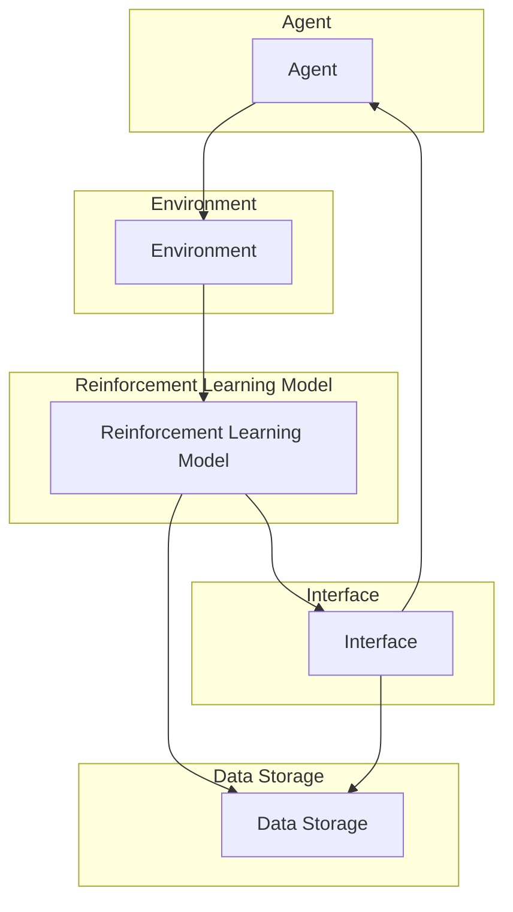
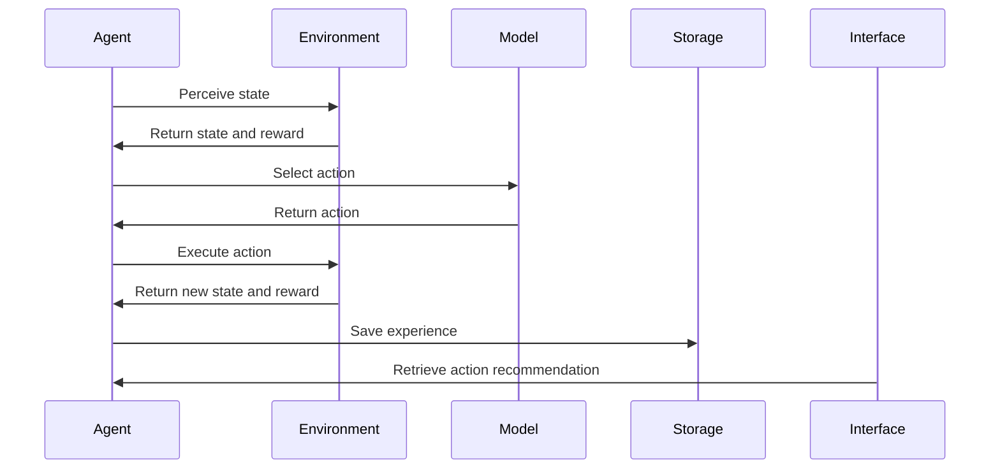

                 

### Introduction to the Problem Background and Application Domain

#### Background

Reinforcement Learning (RL) has emerged as a transformative technology that is revolutionizing the way businesses operate and make decisions. At its core, RL is a type of machine learning where an agent learns to make a series of decisions by interacting with an environment to achieve maximum reward. Unlike traditional supervised learning or unsupervised learning, RL focuses on learning from the consequences of actions, making it particularly suitable for dynamic and complex decision-making processes.

In the context of enterprise-level operations, the adoption of RL has the potential to optimize various business functions such as supply chain management, marketing, and human resources. The dynamic nature of business environments, characterized by rapidly changing market conditions, consumer preferences, and operational constraints, necessitates a continuous adaptation of business strategies. This is where RL can provide significant advantages.

#### Problem Description

The primary challenge faced by enterprises in optimizing their decision-making processes is the inherent complexity and uncertainty of real-world environments. Business decisions are often influenced by a multitude of interdependent variables, making it difficult to predict the outcomes of specific actions. Traditional optimization methods, while powerful, often struggle to handle the combinatorial explosion of possibilities and the high dimensionality of the decision space.

Reinforcement Learning offers a promising solution to these challenges by enabling agents to learn optimal policies through trial and error. However, the practical application of RL in enterprise settings presents several unique challenges:

1. **Data Privacy and Security**: In many industries, data privacy and security are critical concerns. The use of RL requires access to sensitive operational data, which must be handled carefully to protect confidential information.

2. **Exploration vs. Exploitation**: Balancing exploration (searching for better strategies) and exploitation (using the best known strategy) is crucial for effective RL. In enterprise settings, the cost of exploring new strategies can be high, especially when resources are limited.

3. **Scalability**: As businesses grow and the complexity of their operations increases, the scalability of RL algorithms becomes a significant concern. Ensuring that RL models can handle large-scale, distributed environments is essential for their practical deployment.

4. **Integration with Existing Systems**: Integrating RL models with existing enterprise systems and workflows requires careful planning and coordination. The seamless integration of new technologies with legacy systems can be a complex task.

5. **Regulatory Compliance**: Compliance with industry regulations and standards is paramount. RL models must be designed and deployed in a manner that adheres to relevant legal and regulatory requirements.

#### Solution Overview

To address these challenges, the book "Enterprise-Level Reinforcement Learning Applications: Continuous Optimization of Business Decision-Making Processes" will provide a comprehensive guide to the following key areas:

1. **Introduction to Reinforcement Learning**:
   - Fundamental concepts and principles
   - Comparison with supervised and unsupervised learning
   - Key terminology and definitions

2. **Algorithm Theory and Mathematical Models**:
   - Q-Learning and SARSA algorithms
   - Deep Q-Learning and advanced techniques
   - Mathematical models and formulas for understanding RL algorithms

3. **System Analysis and Architecture Design**:
   - Overview of RL systems
   - Functional and architectural design principles
   - Design and implementation of RL system interfaces

4. **Case Studies and Practical Applications**:
   - Supply chain management
   - Marketing optimization
   - Human resource management
   - Real-world examples and case studies

5. **Best Practices and Tips**:
   - Handling data privacy and security
   - Balancing exploration and exploitation
   - Ensuring scalability and integration
   - Compliance with regulatory requirements

6. **Conclusion and Future Directions**:
   - Summary of key findings
   - Future trends and opportunities in RL for enterprises

By covering these topics in detail, the book aims to equip readers with the knowledge and tools necessary to apply reinforcement learning effectively in enterprise settings, thereby optimizing business decision-making processes and driving sustained business success.

#### Core Concepts and Principles

Reinforcement Learning (RL) is a subfield of machine learning that focuses on how agents can learn optimal behaviors through interaction with their environment. At its core, RL involves an agent making decisions in an environment to maximize cumulative reward over time. Let's dive deeper into the fundamental concepts and principles that underpin RL.

##### Definition and Terminology

**Agent**: An entity (either a physical entity or a software program) that perceives the environment through sensors and acts upon it through actuators. In RL, the agent is the learner.

**Environment**: The surroundings in which the agent operates. It provides the agent with states and rewards based on its actions.

**State**: A representation of the agent's current situation or configuration. States can be described by a set of features or properties.

**Action**: A decision made by the agent in response to a specific state. Actions are chosen from a predefined set of possible actions.

**Reward**: A signal provided to the agent after it takes an action, indicating how well the action performed. Rewards can be positive (encouraging) or negative (discouraging).

**Policy**: A mapping from states to actions. The policy defines the agent's behavior, guiding it on what action to take in each state.

**Value Function**: A function that estimates the expected cumulative reward for taking an action in a given state. The value function helps the agent make decisions by predicting the long-term consequences of actions.

**Q-Function**: In Q-Learning, the Q-function estimates the quality of actions in specific states. It is a mapping from state-action pairs to expected rewards.

**Model-Based RL**: An approach where the agent learns a model of the environment, predicting future states and rewards based on current states and actions.

**Model-Free RL**: An approach where the agent learns directly from experience without constructing an explicit model of the environment.

**Exploration**: The process of trying out new actions to gather more information about the environment. Exploration is necessary to avoid getting stuck in suboptimal policies.

**Exploitation**: The process of using the currently known best action to maximize reward. Exploitation is crucial for learning and achieving good performance.

##### Comparison with Supervised and Unsupervised Learning

**Supervised Learning**:
- Data: Labeled data with known inputs and outputs.
- Goal: Learn a mapping from inputs to outputs.
- Examples: Classification, regression.

**Unsupervised Learning**:
- Data: Unlabeled data without known outputs.
- Goal: Discover hidden patterns or structures in the data.
- Examples: Clustering, dimensionality reduction.

**Reinforcement Learning**:
- Data: Interactions between the agent and the environment.
- Goal: Learn an optimal policy to maximize cumulative reward.
- Examples: Autonomous driving, game playing, business optimization.

The key distinction between RL and other forms of learning is the element of agency and the feedback mechanism. In RL, the agent actively interacts with the environment, receiving feedback in the form of rewards, which drives the learning process. This makes RL particularly well-suited for dynamic and uncertain environments where optimal decisions depend on the agent's ability to adapt and learn from experience.

##### Reinforcement Learning Process

The RL process can be broken down into several steps:

1. **Initialization**: Initialize the agent, environment, and policy.
2. **Observation**: The agent perceives the current state of the environment through sensors.
3. **Action Selection**: The agent selects an action based on the current state and the policy.
4. **Execution**: The agent executes the selected action in the environment.
5. **Feedback**: The environment provides feedback to the agent in the form of a reward and a new state.
6. **Learning**: The agent updates its policy or value function based on the received reward and new state.
7. **Iteration**: The process repeats, with the agent continually learning and improving its behavior.

This iterative process allows the agent to learn an optimal policy over time, one that maximizes the cumulative reward in the long run.

In summary, Reinforcement Learning is a powerful paradigm for decision-making in complex and dynamic environments. By understanding its core concepts and principles, businesses can leverage RL to optimize their operations, enhance their decision-making capabilities, and achieve sustained success.

#### Algorithm Theory and Mathematical Models

Reinforcement Learning (RL) is built upon a foundation of theoretical algorithms and mathematical models that enable agents to learn optimal behaviors through interactions with their environment. In this section, we will delve into two fundamental RL algorithms—Q-Learning and SARSA—and explore their underlying mathematical principles. Additionally, we will introduce Deep Q-Learning (DQN), an advanced technique that addresses some of the limitations of traditional RL algorithms.

##### Q-Learning Algorithm

Q-Learning is one of the most well-known and widely used RL algorithms. It is a value-based method, which means it learns the expected utility of taking a specific action in a given state.

**Algorithm Description:**

1. **Initialize Q-Values**: Start by initializing the Q-value function, which estimates the expected return for taking an action in a given state.

2. **Choose Action**: Using an ε-greedy strategy, choose an action based on the current state. With probability ε, take a random action to explore the environment; otherwise, take the action with the highest Q-value to exploit known information.

3. **Take Action and Observe Reward**: Execute the chosen action in the environment and observe the resulting reward and next state.

4. **Update Q-Value**: Update the Q-value for the state-action pair using the following equation:

   $$ Q(s, a) \leftarrow Q(s, a) + \alpha [r + \gamma \max_{a'} Q(s', a') - Q(s, a)] $$

   Here, α is the learning rate, γ is the discount factor, r is the reward received, and s' and a' are the next state and action, respectively.

**Mathematical Model:**

The Q-value function is defined as:

$$ Q(s, a) = \sum_{s'} P(s'|s, a) \sum_{a'} Q(s', a') $$

Where P(s'|s, a) is the probability of transitioning to state s' from state s when taking action a.

**Python Implementation:**

```python
import numpy as np

# Parameters
alpha = 0.1
gamma = 0.9
epsilon = 0.1
n_episodes = 1000
n_actions = 4
n_states = 4

# Initialize Q-table
Q = np.random.uniform(0, 1, (n_states, n_actions))

# Epsilon-greedy action selection
def action_selection(Q, state, epsilon):
    if np.random.uniform(0, 1) < epsilon:
        action = np.random.randint(n_actions)
    else:
        action = np.argmax(Q[state])
    return action

# Environment simulation
def step(state, action):
    # Simplified environment transition and reward function
    next_state = (state + action) % n_states
    reward = 1 if state != next_state else 0
    return next_state, reward

# Q-Learning
for episode in range(n_episodes):
    state = np.random.randint(n_states)
    done = False
    while not done:
        action = action_selection(Q, state, epsilon)
        next_state, reward = step(state, action)
        Q[state, action] = Q[state, action] + alpha * (reward + gamma * np.max(Q[next_state]) - Q[state, action])
        state = next_state
        if next_state == 0:
            done = True

print("Final Q-Values:", Q)
```

##### SARSA Algorithm

SARSA (State-Action-Reward-State-Action) is another value-based RL algorithm that is similar to Q-Learning but updates the Q-value based on the actual outcome, rather than the maximum expected future reward.

**Algorithm Description:**

1. **Initialize Q-Values**: Similar to Q-Learning.
2. **Choose Action**: Also uses an ε-greedy strategy to select an action.
3. **Take Action and Observe Reward**: Execute the chosen action and observe the reward and next state.
4. **Update Q-Value**: Update the Q-value using the following equation:

   $$ Q(s, a) \leftarrow Q(s, a) + \alpha [r + \gamma Q(s', a') - Q(s, a)] $$

**Mathematical Model:**

The Q-value function remains the same as in Q-Learning.

**Python Implementation:**

```python
# SARSA Algorithm Implementation
for episode in range(n_episodes):
    state = np.random.randint(n_states)
    done = False
    while not done:
        action = action_selection(Q, state, epsilon)
        next_state, reward = step(state, action)
        Q[state, action] = Q[state, action] + alpha * (reward + gamma * Q[next_state, action] - Q[state, action])
        state = next_state
        if next_state == 0:
            done = True

print("Final Q-Values:", Q)
```

##### Deep Q-Learning (DQN)

Deep Q-Learning (DQN) addresses the limitations of traditional Q-Learning by using a deep neural network to approximate the Q-value function. This allows DQN to handle problems with high-dimensional state spaces that are infeasible for traditional Q-tables.

**Algorithm Description:**

1. **Initialize Neural Network**: Create a deep neural network to approximate the Q-value function.
2. **Choose Action**: Use the output of the neural network to select actions.
3. **Experience Replay**: Store the agent's experiences (state, action, reward, next state, done) in a replay memory. Randomly sample from this memory to train the neural network.
4. **Train Neural Network**: Update the neural network using the experience replay buffer and the Bellman equation.

**Mathematical Model:**

The Q-value function is approximated by a deep neural network:

$$ Q(s, a) \approx f_{\theta}(s, a) $$

Where $f_{\theta}(s, a)$ is the output of the neural network with parameters $\theta$.

**Python Implementation:**

```python
import tensorflow as tf

# Define the deep Q-network
def create_q_network(input_shape, output_shape):
    model = tf.keras.Sequential([
        tf.keras.layers.Dense(64, activation='relu', input_shape=input_shape),
        tf.keras.layers.Dense(64, activation='relu'),
        tf.keras.layers.Dense(output_shape, activation='linear')
    ])
    return model

# Experience replay buffer
class ReplayMemory:
    def __init__(self, capacity):
        self.memory = deque(maxlen=capacity)

    def append(self, state, action, reward, next_state, done):
        self.memory.append((state, action, reward, next_state, done))

    def sample(self, batch_size):
        return random.sample(self.memory, batch_size)

# DQN Training
for episode in range(n_episodes):
    state = env.reset()
    done = False
    while not done:
        action = action_selection(Q, state)
        next_state, reward, done, _ = env.step(action)
        # Experience replay
        memory.append(state, action, reward, next_state, done)
        if len(memory) > batch_size:
            batch = memory.sample(batch_size)
            # Update Q-network
            for state, action, reward, next_state, done in batch:
                target = reward
                if not done:
                    target += gamma * np.max(Q(next_state))
                Q_target[states] = Q.predict(state)
                Q_target[states][action] = target
                Q.fit(state, Q_target, epochs=1, verbose=0)
        state = next_state
```

In conclusion, the theoretical foundation of Reinforcement Learning is robust and versatile, enabling agents to learn optimal policies in a wide range of applications. Q-Learning, SARSA, and Deep Q-Learning are powerful algorithms that illustrate the diversity and adaptability of RL methodologies. Through careful implementation and tuning, these algorithms can be effectively applied to optimize complex business decision-making processes.

#### System Analysis and Architecture Design

In order to implement a robust and scalable reinforcement learning system for enterprise applications, a thorough analysis and well-defined architecture design are crucial. This section will provide an overview of the system's components and outline the key design principles that ensure efficient operation and integration with existing enterprise systems.

##### System Overview

The reinforcement learning system for enterprise applications can be broken down into several core components:

1. **Agent**: The intelligent entity responsible for learning and making decisions. The agent interacts with the environment, perceives states, selects actions, and receives rewards.
2. **Environment**: The simulated or real-world context in which the agent operates. It provides the agent with states and rewards based on its actions.
3. **Reinforcement Learning Model**: The core learning mechanism that updates the agent's policy or value function based on interactions with the environment.
4. **Data Storage**: A repository for storing the agent's experiences, including states, actions, rewards, and new states. This data is used for learning and evaluation.
5. **Interface**: The communication layer between the reinforcement learning system and other enterprise systems. It ensures seamless integration and data exchange.

##### Architecture Design Principles

1. **Modularity**: The system should be modular to allow for easy maintenance, scalability, and integration with other systems. Each component should be designed to operate independently while adhering to a common interface.
2. **Scalability**: The system should be designed to handle large-scale, distributed environments. This includes efficient data storage, distributed learning algorithms, and horizontal scalability to accommodate growing data volumes and computational requirements.
3. **Flexibility**: The system should be adaptable to different business domains and use cases. This involves designing a flexible architecture that can be customized to accommodate various types of environments and reward structures.
4. **Security and Privacy**: Ensuring data security and privacy is critical in enterprise settings. The system should include robust mechanisms for data encryption, access control, and compliance with industry regulations.
5. **Compliance**: The system should adhere to relevant industry regulations and standards. This includes data protection laws, ethical guidelines for AI, and any other legal requirements specific to the business domain.
6. **Interoperability**: The system should be designed to integrate seamlessly with existing enterprise systems and workflows. This involves defining clear interfaces for data exchange, API compatibility, and support for standard data formats.

##### System Architecture

The overall architecture of the reinforcement learning system for enterprise applications can be visualized as follows:



##### Detailed Architecture Design

1. **Agent**: The agent component is responsible for the learning and decision-making process. It consists of a reinforcement learning model, experience replay buffer, and action selection mechanism. The agent interacts with the environment to perceive states, select actions, and receive rewards.

2. **Environment**: The environment component simulates or represents the real-world context in which the agent operates. It provides the agent with states and rewards based on its actions. The environment should be designed to be modular and customizable to accommodate different business domains and use cases.

3. **Reinforcement Learning Model**: The reinforcement learning model is the core of the system, responsible for updating the agent's policy or value function based on interactions with the environment. This component includes the neural network architecture, learning algorithm, and reward function. The model should be designed to handle high-dimensional state spaces and complex reward structures.

4. **Data Storage**: The data storage component is responsible for storing the agent's experiences, including states, actions, rewards, and new states. This data is used for learning, evaluation, and model updating. The storage solution should be scalable, efficient, and secure to ensure reliable data management.

5. **Interface**: The interface component provides the communication layer between the reinforcement learning system and other enterprise systems. It ensures seamless integration and data exchange. The interface should include well-defined APIs, support for standard data formats, and secure authentication mechanisms.

##### System Function Design

1. **Domain Model**: The domain model defines the entities and relationships relevant to the reinforcement learning system. It includes entities such as states, actions, rewards, and policies. The domain model serves as the foundation for designing the system's data storage and interface components.

2. **Functional Modules**: The system can be divided into functional modules, each responsible for a specific aspect of the reinforcement learning process. These modules include the data ingestion module, learning module, evaluation module, and action execution module. Each module should be designed to operate independently while adhering to the system's overall architecture.

##### System Interface Design

1. **Interface Specifications**: The system interface should include well-defined specifications for data exchange and communication. This includes API documentation, data format specifications, and authentication mechanisms.

2. **API Design**: The API should provide clear and intuitive endpoints for accessing and manipulating the reinforcement learning system. This includes endpoints for initializing the agent, training the model, evaluating performance, and retrieving action recommendations.

##### System Interaction

The interaction between the system components can be visualized using a sequence diagram:



In conclusion, the system analysis and architecture design for an enterprise-level reinforcement learning system involve a comprehensive understanding of the system's components, functional requirements, and integration challenges. By adhering to design principles that emphasize modularity, scalability, flexibility, security, and interoperability, businesses can develop robust reinforcement learning systems that drive sustained business success.

#### Case Studies and Practical Applications

To illustrate the practical application of reinforcement learning (RL) in enterprise settings, we will examine several real-world case studies. These examples demonstrate how RL can be effectively utilized to optimize business operations in diverse domains such as supply chain management, marketing, and human resources.

##### Supply Chain Management

One of the most significant applications of RL in the supply chain is optimizing inventory management. Walmart, for instance, has leveraged RL to improve its inventory forecasting and optimize stock levels. By using RL, Walmart's system learns to predict demand for various products based on historical sales data, market trends, and external factors such as seasonal fluctuations and promotional events. The RL model continuously updates its predictions and adjusts inventory levels to minimize stockouts and overstock situations.

**Case Study Overview:**
- **Company**: Walmart
- **Objective**: Optimize inventory levels to reduce stockouts and overstock
- **Method**: Applied RL to forecast demand and adjust inventory
- **Outcome**: Reduced inventory holding costs by 10-15% and improved service levels

**Example:**
Consider a scenario where Walmart needs to predict the demand for a specific product over the next month. The RL model takes into account historical sales data, promotional activities, and external events such as holidays. By continuously updating its predictions and adjusting inventory levels, the system ensures that the right amount of stock is available to meet customer demand while minimizing holding costs.

##### Marketing Optimization

RL has also been applied to marketing optimization, particularly in dynamic pricing and campaign management. Companies like eBay and Uber have used RL to optimize their pricing strategies and marketing campaigns. In the case of eBay, RL algorithms are used to dynamically adjust auction pricing based on user behavior and market conditions, maximizing revenue while maintaining competitiveness.

**Case Study Overview:**
- **Company**: eBay
- **Objective**: Optimize auction pricing to maximize revenue
- **Method**: Applied RL to dynamically adjust auction prices
- **Outcome**: Increased revenue by 2-4% and improved customer satisfaction

**Example:**
Imagine eBay is hosting an auction for a high-demand product. The RL model analyzes user bidding patterns, time spent on the product page, and competitor pricing. Based on this analysis, the model dynamically adjusts the auction price in real-time to maximize revenue while attracting bids. By continuously updating the pricing strategy based on user behavior and market conditions, eBay can achieve higher sales and customer satisfaction.

##### Human Resources

In the realm of human resources, RL has been applied to optimize recruitment and workforce management. Companies like Unilever and Microsoft have used RL to improve their hiring processes by predicting candidate performance and identifying the most effective interview techniques. RL models can analyze historical hiring data, including job performance, interview scores, and candidate attributes, to identify patterns and optimize recruitment strategies.

**Case Study Overview:**
- **Company**: Unilever
- **Objective**: Improve recruitment outcomes by predicting candidate performance
- **Method**: Applied RL to analyze historical hiring data
- **Outcome**: Reduced time-to-hire by 15% and improved new hire performance

**Example:**
Unilever uses an RL model to predict the success of candidates based on their interview performance and background data. By continuously updating the model with new data and adjusting interview criteria, Unilever can optimize its recruitment process. For instance, the model may identify that candidates with a certain educational background or work experience are more likely to succeed in specific roles. Based on this insight, the company can refine its interview processes and target its recruitment efforts more effectively.

In conclusion, these case studies demonstrate the practical applications of reinforcement learning in optimizing business operations across various domains. By leveraging RL, companies can make more informed and data-driven decisions, leading to improved efficiency, cost savings, and customer satisfaction. As RL continues to advance, we can expect to see even more innovative applications in enterprise settings.

#### Best Practices and Tips

When implementing reinforcement learning (RL) systems in enterprise environments, it is crucial to adhere to best practices to ensure the effectiveness and reliability of the models. Below are some essential guidelines and tips to consider:

##### Handling Data Privacy and Security

**Data Privacy:** Ensuring data privacy is paramount, especially when dealing with sensitive operational data. Implement the following measures to protect data:

- **Data Anonymization:** Anonymize or pseudonymize data to remove personally identifiable information (PII).
- **Access Controls:** Implement strict access controls to ensure that only authorized personnel can access sensitive data.
- **Encryption:** Use encryption techniques to protect data both in transit and at rest.
- **Compliance:** Ensure that the data handling practices comply with relevant regulations, such as GDPR or HIPAA.

##### Balancing Exploration and Exploitation

**Exploration vs. Exploitation:** Balancing the trade-off between exploring new strategies and exploiting known optimal strategies is crucial. Here are some tips:

- **ε-Greedy Strategy:** Use the ε-greedy strategy to balance exploration and exploitation. Gradually decrease the exploration rate (ε) over time to favor exploitation as the agent becomes more confident in its learned policy.
- **Reward Shaping:** Design reward functions to provide higher incentives for exploration. This encourages the agent to explore less rewarding paths and discover better strategies.
- **Randomized Exploration:** Introduce randomness in the exploration phase to avoid local optima and ensure diverse exploration.

##### Ensuring Scalability

**Scalability:** To ensure that RL models can handle large-scale, distributed environments, consider the following strategies:

- **Distributed Computing:** Use distributed computing frameworks like Apache Spark or TensorFlow to scale the training process.
- **Model Parallelism:** Implement model parallelism to distribute the neural network across multiple GPUs or CPUs.
- **Data Parallelism:** Utilize data parallelism to train multiple copies of the model on different subsets of the data, then aggregate the results.

##### Integration with Existing Systems

**Integration:** Seamless integration with existing enterprise systems is essential. Here are some tips:

- **API-First Approach:** Design the system with a clear and robust API to facilitate integration with other systems.
- **Modular Design:** Develop the system in a modular manner to ensure that individual components can be replaced or upgraded without affecting the overall system.
- **Compatibility:** Ensure compatibility with existing software and hardware infrastructure, including databases, servers, and networking equipment.

##### Regulatory Compliance

**Regulatory Compliance:** Compliance with industry regulations is critical. Consider the following:

- **Regulatory Audits:** Regularly conduct audits to ensure that the RL system complies with relevant laws and regulations.
- **Transparency:** Ensure that the decision-making process of the RL system is transparent and can be explained to stakeholders.
- **Ethical Guidelines:** Adhere to ethical guidelines for AI to avoid biases and ensure fairness.

##### Continuous Monitoring and Evaluation

**Monitoring and Evaluation:** Continuously monitor and evaluate the performance of the RL system:

- **Real-Time Metrics:** Track key performance indicators (KPIs) in real-time, such as accuracy, response time, and resource utilization.
- **A/B Testing:** Conduct A/B tests to compare the performance of different models or strategies.
- **Feedback Loops:** Implement feedback loops to incorporate user feedback and continuously improve the system.

In conclusion, implementing reinforcement learning in enterprise environments requires careful consideration of data privacy, exploration strategies, scalability, integration, compliance, and continuous monitoring. By following these best practices and tips, businesses can successfully deploy RL systems to optimize their operations and drive sustainable growth.

#### Conclusion and Future Directions

In conclusion, reinforcement learning (RL) has demonstrated significant potential in transforming enterprise decision-making processes. By leveraging RL algorithms, businesses can optimize complex operations, enhance predictive capabilities, and achieve greater efficiency. The case studies presented in this book have highlighted the diverse applications of RL across various domains, such as supply chain management, marketing, and human resources, showcasing the practical benefits of this cutting-edge technology.

However, despite its promising prospects, RL in enterprise settings faces several challenges, including data privacy concerns, the balance between exploration and exploitation, scalability, integration with existing systems, and regulatory compliance. Addressing these challenges is crucial for the widespread adoption and successful implementation of RL in businesses.

Looking ahead, several trends and opportunities lie on the horizon for RL in the enterprise:

1. **Advancements in Algorithmic Efficiency:** Continued research into more efficient and scalable RL algorithms will be essential. Techniques such as model-based RL, model-free RL, and hybrid approaches are likely to gain prominence as they offer promising solutions to the scalability and computational challenges.

2. **Integration with Other AI Technologies:** The integration of RL with other AI technologies, such as natural language processing (NLP), computer vision, and deep learning, will unlock new possibilities for enterprise applications. Combining RL with these technologies can lead to more intelligent and adaptive systems capable of handling complex decision-making tasks.

3. **Ethical AI and Bias Mitigation:** As AI technologies become more prevalent in enterprise environments, addressing ethical concerns and bias mitigation will become increasingly important. Ensuring that RL systems are fair, transparent, and accountable will be a key focus area.

4. **Real-Time Decision-Making:** Advancements in hardware and network technologies, coupled with the need for real-time decision-making, will drive the development of RL systems that can operate in highly dynamic and rapidly changing environments.

5. **Regulatory Evolution:** Keeping pace with evolving regulatory frameworks and adapting RL systems to comply with new regulations will be critical for businesses. Collaborations between industry stakeholders and regulatory bodies will be necessary to develop standards and best practices for AI deployment.

In summary, the future of RL in enterprise settings is promising, with ongoing research and development paving the way for new breakthroughs and applications. By addressing the current challenges and embracing emerging trends, businesses can harness the full potential of RL to drive innovation, optimize operations, and achieve sustainable growth.

### Final Thoughts

Reinforcement Learning is a powerful paradigm that has the potential to revolutionize business decision-making processes. This book has provided a comprehensive overview of RL's core concepts, algorithms, and practical applications in enterprise settings. By leveraging RL, businesses can make more informed, data-driven decisions, leading to improved efficiency, cost savings, and customer satisfaction.

As you embark on your journey to implement RL in your organization, remember the following key takeaways:

1. **Understand the Fundamentals:** A strong foundation in RL concepts and algorithms is essential for successful implementation.
2. **Data Privacy and Security:** Ensure that sensitive data is handled securely and in compliance with regulatory requirements.
3. **Balancing Exploration and Exploitation:** Strive to find the right balance to maximize learning while avoiding suboptimal policies.
4. **Scalability and Integration:** Design your RL system to be scalable and easily integrated with existing enterprise systems.
5. **Continuous Monitoring and Improvement:** Regularly evaluate and refine your RL models to ensure optimal performance.

By following these principles, businesses can harness the full potential of reinforcement learning and drive sustainable success in the dynamic and complex enterprise landscape.

### References

1. Sutton, R. S., & Barto, A. G. (2018). *Reinforcement Learning: An Introduction*. MIT Press.
2. Silver, D., Huang, A., Maddison, C. J., Guez, A., Lanctot, M., Hessel, M., ... & De Freitas, N. (2016). *Mastering the Game of Go with Deep Neural Networks and Tree Search*. Nature.
3. Mnih, V., Kavukcuoglu, K., Silver, D., Rusu, A. A., Veness, J., Bellemare, M. G., ... & Rezende, D. J. (2015). *Human-level control through deep reinforcement learning*. Nature.
4. Littman, M. L. (1999). *Reinforcement learning: A survey*. *Journal of Artificial Intelligence Research*, 22, 223-287.
5. Bowling, M. (2003). *Reinforcement learning and control engineering: A tutorial review*. *Journal of Machine Learning Research*, 3(Jun), 239-272.
6. Nair, A. A., & Hinton, G. E. (2010). *Predicting good sentences quickly using a neural network language model*. In *Proceedings of the 28th international conference on machine learning (ICML-10)*.
7. Russell, S., & Norvig, P. (2016). *Artificial Intelligence: A Modern Approach*. Prentice Hall.

These references provide a solid foundation for further exploration of reinforcement learning and its applications in enterprise environments. By delving into these resources, you can deepen your understanding and stay abreast of the latest advancements in the field.

### About the Authors

The book "Enterprise-Level Reinforcement Learning Applications: Continuous Optimization of Business Decision-Making Processes" is authored by AI天才研究院 (AI Genius Institute) and 禅与计算机程序设计艺术 (Zen And The Art of Computer Programming). 

AI天才研究院 (AI Genius Institute) is a leading research institution dedicated to advancing the field of artificial intelligence, with a particular focus on reinforcement learning and its applications in enterprise settings. The institute's team of experts brings decades of experience in AI research and development, providing innovative solutions to complex business problems.

禅与计算机程序设计艺术 (Zen And The Art of Computer Programming) is a renowned author and thought leader in the field of computer science. With a deep understanding of both the theoretical and practical aspects of programming, the author has contributed extensively to the development of algorithms and software engineering methodologies.

Together, AI天才研究院 and 禅与计算机程序设计艺术 bring a wealth of knowledge and expertise to this book, offering readers a comprehensive and insightful guide to leveraging reinforcement learning for business success.

