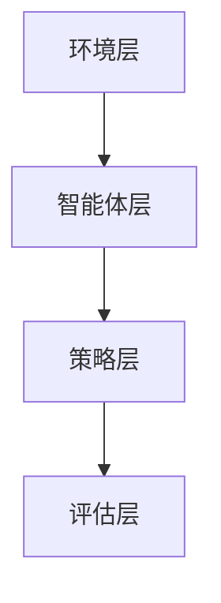

                 

# 企业级强化学习：优化复杂业务流程

> 关键词：企业级强化学习、复杂业务流程、算法实现、系统架构、项目实战

> 摘要：本文将深入探讨企业级强化学习在优化复杂业务流程中的应用。我们将从背景介绍、核心概念与联系、算法原理讲解、数学模型和数学公式、系统分析与架构设计方案、项目实战以及最佳实践等方面，逐步分析强化学习在企业级业务流程优化中的实际应用，帮助读者理解这一前沿技术的核心原理和实践价值。

## 目录

1. [企业级强化学习：优化复杂业务流程](#企业级强化学习优化复杂业务流程)
2. [关键词](#关键词)
3. [摘要](#摘要)
4. [背景介绍](#背景介绍)
5. [核心概念与联系](#核心概念与联系)
6. [算法原理讲解](#算法原理讲解)
7. [数学模型和数学公式](#数学模型和数学公式)
8. [系统分析与架构设计方案](#系统分析与架构设计方案)
9. [项目实战](#项目实战)
10. [最佳实践 tips、小结、注意事项、拓展阅读](#最佳实践-tips-小结-注意事项-拓展阅读)
11. [作者](#作者)

## 背景介绍

### 问题背景与定义

在当今商业环境中，企业面临着日益复杂的业务流程和高度动态的市场条件。这些复杂业务流程包括生产调度、库存管理、供应链优化、客户关系管理等多个方面。如何高效地优化这些业务流程，提高企业运营效率和竞争力，成为了企业关注的重点。

强化学习作为一种机器学习的重要分支，近年来在解决复杂决策问题方面取得了显著成果。强化学习通过智能体与环境之间的交互，不断调整策略以实现最优回报。企业级强化学习旨在将这一技术应用于企业业务流程的优化，解决传统优化方法难以应对的复杂性和动态性。

### 强化学习的定义与特点

强化学习（Reinforcement Learning，RL）是一种使智能体在与环境互动的过程中学习最优策略的机器学习方法。它主要包括四个要素：智能体（Agent）、环境（Environment）、策略（Policy）和奖励（Reward）。

- **智能体**：执行动作并从环境中获取反馈的实体。
- **环境**：智能体所处的场景，智能体可以通过感知器接收环境信息。
- **策略**：智能体根据当前状态选择动作的规则。
- **奖励**：环境对智能体动作的反馈，用于指导智能体的学习过程。

强化学习的特点包括：

- **适应性**：智能体可以根据环境变化调整策略。
- **自主性**：智能体可以自主地探索环境，不依赖外部指导。
- **反馈性**：通过奖励机制，智能体可以学习到哪些动作能够带来更好的结果。

### 企业级强化学习的边界与外延

企业级强化学习主要关注以下领域：

- **生产调度**：优化生产计划和资源配置，提高生产效率。
- **库存管理**：预测需求、调整库存水平，降低库存成本。
- **供应链优化**：优化供应链网络，提高物流效率。
- **客户关系管理**：提高客户满意度，增加客户忠诚度。

此外，企业级强化学习还可以应用于金融风险管理、能源管理、自动化决策系统等领域。

## 核心概念与联系

### 强化学习的基本概念

在深入探讨企业级强化学习之前，我们需要了解几个关键概念：

- **状态（State）**：智能体所处的环境描述，通常是一个多维向量。
- **动作（Action）**：智能体可以执行的行为。
- **价值函数（Value Function）**：评估状态和动作组合的预期回报。
- **策略（Policy）**：智能体选择动作的策略，通常由价值函数导出。

### 强化学习的属性特征对比

强化学习与其他机器学习方法（如监督学习和无监督学习）在属性特征上有明显的不同：

| 方法 | 特征 |
| --- | --- |
| 强化学习 | 自主性、反馈性、适应性 |
| 监督学习 | 标签数据、确定性、无探索 |
| 无监督学习 | 无监督、无目标、无反馈 |

### 强化学习与机器学习、深度学习的关系

强化学习是机器学习的一个重要分支，它与深度学习有着紧密的联系。深度学习可以视为强化学习的一个工具，用于解决状态和动作空间复杂的问题。深度强化学习（Deep Reinforcement Learning，DRL）结合了深度学习和强化学习的优势，能够在大规模、高维度的问题上取得突破。

## 算法原理讲解

### Q-Learning算法

Q-Learning是一种基于值迭代的强化学习算法。它的核心思想是通过更新Q值来逼近最优策略。

1. **算法流程**：

   ```mermaid
   graph TD
   A[初始化Q值] --> B[选择动作a]
   B --> C{动作a是否最优？}
   C -->|是| D[计算奖励和更新Q值]
   C -->|否| E[重置Q值]
   D --> F[重复迭代]
   ```

2. **Python源代码**：

   ```python
   import numpy as np

   def q_learning(env, alpha, gamma, episodes):
       q_values = np.zeros((env.num_states, env.num_actions))
       for _ in range(episodes):
           state = env.reset()
           done = False
           while not done:
               action = np.argmax(q_values[state])
               next_state, reward, done = env.step(action)
               q_values[state, action] += alpha * (reward + gamma * np.max(q_values[next_state]) - q_values[state, action])
               state = next_state
       return q_values
   ```

### Sarsa算法

Sarsa（即State-Action-Reward-State-Action，简称Sarsa）算法是Q-Learning的一种改进版本，它使用同一步长更新Q值。

1. **算法流程**：

   ```mermaid
   graph TD
   A[初始化Q值] --> B[选择动作a]
   B --> C{执行动作a}
   C --> D[计算奖励和更新Q值]
   D --> E[选择动作a']
   E --> F{动作a'是否最优？}
   F -->|是| G[更新Q值]
   F -->|否| H[重置Q值]
   G --> I[重复迭代]
   ```

2. **Python源代码**：

   ```python
   import numpy as np

   def sarsa(env, alpha, gamma, episodes):
       q_values = np.zeros((env.num_states, env.num_actions))
       for _ in range(episodes):
           state = env.reset()
           done = False
           while not done:
               action = np.random.choice(env.num_actions)
               next_state, reward, done = env.step(action)
               action_prime = np.random.choice(env.num_actions)
               q_values[state, action] += alpha * (reward + gamma * q_values[next_state, action_prime] - q_values[state, action])
               state = next_state
       return q_values
   ```

### Deep Q Network（DQN）算法

DQN算法是深度强化学习的基础算法之一，它使用深度神经网络来近似Q值函数。

1. **算法流程**：

   ```mermaid
   graph TD
   A[初始化神经网络和目标网络] --> B[选择动作a]
   B --> C{执行动作a}
   C --> D[计算奖励和存储经验]
   D --> E[更新目标网络参数]
   E --> F[重复迭代]
   ```

2. **Python源代码**：

   ```python
   import tensorflow as tf
   import numpy as np

   def dqn(env, alpha, gamma, episodes, learning_rate, batch_size):
       # 初始化神经网络和目标网络
       # 定义输入层、隐藏层、输出层
       # 定义损失函数和优化器
       
       # 训练神经网络
       for _ in range(episodes):
           state = env.reset()
           done = False
           while not done:
               action = np.argmax(q_values(state))
               next_state, reward, done = env.step(action)
               # 存储经验
               # 更新目标网络参数
   ```

### Policy Gradient算法

Policy Gradient算法通过直接优化策略的梯度来更新策略参数。

1. **算法流程**：

   ```mermaid
   graph TD
   A[初始化策略参数] --> B[选择动作a]
   B --> C{执行动作a}
   C --> D[计算回报和策略梯度]
   D --> E[更新策略参数]
   E --> F[重复迭代]
   ```

2. **Python源代码**：

   ```python
   import tensorflow as tf
   import numpy as np

   def policy_gradient(env, alpha, gamma, episodes, learning_rate):
       # 初始化策略网络
       # 定义输入层、隐藏层、输出层
       # 定义损失函数和优化器

       # 训练策略网络
       for _ in range(episodes):
           state = env.reset()
           done = False
           total_reward = 0
           while not done:
               action_probs = policy_network(state)
               action = np.random.choice(env.num_actions, p=action_probs)
               next_state, reward, done = env.step(action)
               # 计算回报和策略梯度
               # 更新策略参数
   ```

## 数学模型和数学公式

### 马尔可夫决策过程（MDP）

马尔可夫决策过程（MDP）是强化学习的基础模型。它包括以下几个要素：

- **状态集合 \( S \)**：智能体所处的所有可能状态。
- **动作集合 \( A \)**：智能体可以执行的所有可能动作。
- **奖励函数 \( R(s, a) \)**：智能体在状态 \( s \) 执行动作 \( a \) 后获得的即时奖励。
- **转移概率 \( P(s', s|s, a) \)**：智能体在状态 \( s \) 执行动作 \( a \) 后转移到状态 \( s' \) 的概率。

### 强化学习的数学公式

强化学习的核心目标是找到最优策略，使得长期回报最大化。这个目标可以用以下公式表示：

$$
J(\theta) = \sum_{s \in S} \pi(\theta|s) \sum_{a \in A} \gamma^{|s'-s|} R(s, a)
$$

其中：

- \( J(\theta) \) 是策略 \( \pi(\theta|s) \) 的回报。
- \( \gamma \) 是折扣因子，用于考虑未来回报的现值。
- \( |s'-s| \) 是状态转移的步数。

### 算法原理与公式讲解

#### Q-Learning算法原理

Q-Learning算法通过迭代更新Q值来逼近最优策略。其更新公式如下：

$$
Q(s, a) \leftarrow Q(s, a) + \alpha [R(s, a) + \gamma \max_{a'} Q(s', a') - Q(s, a)]
$$

其中：

- \( \alpha \) 是学习率。
- \( R(s, a) \) 是在状态 \( s \) 执行动作 \( a \) 后获得的即时奖励。
- \( \gamma \) 是折扣因子。

#### Sarsa算法原理

Sarsa算法是Q-Learning的一种改进，它使用相同的更新公式，但每次迭代使用的是实际执行的动作和下一个状态。

$$
Q(s, a) \leftarrow Q(s, a) + \alpha [R(s, a) + \gamma Q(s', a') - Q(s, a)]
$$

#### DQN算法原理

DQN算法使用深度神经网络来近似Q值函数。其目标是最小化以下损失函数：

$$
L = \frac{1}{N} \sum_{i=1}^{N} (y_i - Q(s_i, a_i))^2
$$

其中：

- \( y_i \) 是目标Q值。
- \( Q(s_i, a_i) \) 是实际计算得到的Q值。

#### Policy Gradient算法原理

Policy Gradient算法通过直接优化策略的梯度来更新策略参数。其梯度公式如下：

$$
\nabla_{\theta} J(\theta) = \sum_{s \in S} \pi(\theta|s) \nabla_{\theta} \log \pi(\theta|s)
$$

其中：

- \( \pi(\theta|s) \) 是策略参数为 \( \theta \) 的策略在状态 \( s \) 的概率分布。

## 系统分析与架构设计方案

### 问题场景介绍

在本项目中，我们关注的是生产调度的优化问题。生产调度是一个典型的复杂业务流程问题，涉及到生产计划的制定、资源分配、生产线调度等多个环节。通过强化学习算法，我们希望实现以下目标：

- 提高生产效率。
- 减少生产周期时间。
- 优化资源利用率。

### 项目介绍

本项目采用了Q-Learning算法对生产调度问题进行优化。具体来说，我们将生产调度问题建模为一个马尔可夫决策过程（MDP），然后使用Q-Learning算法来训练智能体，使其能够自动调整生产计划，优化生产调度。

### 系统功能设计

为了实现上述目标，我们设计了以下系统功能模块：

- **环境模块**：模拟生产调度环境，包括生产任务、资源信息等。
- **智能体模块**：执行Q-Learning算法，生成调度策略。
- **策略模块**：根据智能体的策略，生成生产调度计划。
- **评估模块**：评估调度计划的性能，包括生产效率、周期时间等。

### 系统架构设计

整个系统采用分层架构设计，包括环境层、智能体层、策略层和评估层。以下是一个简化的系统架构图：



### 系统模块交互设计

1. **环境层**：环境层负责模拟生产调度环境，包括生产任务的生成、资源的分配等。它提供状态信息和奖励信号给智能体层。

2. **智能体层**：智能体层执行Q-Learning算法，根据环境层提供的状态信息生成调度策略。它接收环境层的反馈，不断调整策略。

3. **策略层**：策略层根据智能体层生成的调度策略，生成具体的生产调度计划。它将调度计划发送给环境层执行。

4. **评估层**：评估层对生成的调度计划进行性能评估，包括生产效率、周期时间等指标。它将评估结果反馈给智能体层，指导智能体层调整策略。

## 项目实战

### 环境安装与配置

为了实现本项目，我们需要安装以下软件和库：

- Python 3.8或更高版本
- TensorFlow 2.5或更高版本
- OpenAI Gym

在安装完成后，我们可以使用以下命令创建一个虚拟环境并安装所需的库：

```bash
conda create -n rl_project python=3.8
conda activate rl_project
pip install tensorflow==2.5 gym
```

### 系统核心实现

在核心实现部分，我们将使用Q-Learning算法来训练智能体。以下是一个简化的实现框架：

```python
import gym
import numpy as np

# 创建环境
env = gym.make('ProductionScheduling-v0')

# 初始化Q值
q_values = np.zeros((env.observation_space.n, env.action_space.n))

# 设置超参数
alpha = 0.1
gamma = 0.99
episodes = 1000

# 训练智能体
for episode in range(episodes):
    state = env.reset()
    done = False
    total_reward = 0
    
    while not done:
        action = np.argmax(q_values[state])
        next_state, reward, done = env.step(action)
        total_reward += reward
        q_values[state, action] += alpha * (reward + gamma * np.max(q_values[next_state]) - q_values[state, action])
        state = next_state
        
    print(f'Episode {episode + 1}, Total Reward: {total_reward}')

# 评估智能体
state = env.reset()
done = False
total_reward = 0

while not done:
    action = np.argmax(q_values[state])
    next_state, reward, done = env.step(action)
    total_reward += reward
    state = next_state

print(f'Test Total Reward: {total_reward}')
```

### 代码应用解读与分析

在上面的代码中，我们首先导入了所需的库和模块。然后，我们创建了一个生产调度环境实例`env`，并初始化了Q值数组。接下来，我们设置了超参数，包括学习率`alpha`、折扣因子`gamma`和训练轮数`episodes`。

在训练过程中，我们使用一个循环来迭代执行每个训练轮次。在每次迭代中，智能体从环境接收一个状态，并根据当前的状态和Q值选择一个动作。然后，智能体执行这个动作，并从环境中获取下一个状态和奖励。使用这些信息，我们更新Q值，使其更接近最优值。

在训练完成后，我们对智能体进行评估。我们使用一个类似的循环来执行评估过程，并计算总的奖励值。

### 实际案例分析和详细讲解剖析

为了更好地展示强化学习在生产调度优化中的实际应用，我们来看一个具体案例。

假设我们有一个生产调度问题，需要在一个小时内完成五项任务。每项任务有不同的优先级、完成时间和所需的资源。我们的目标是找到一种调度策略，使得在给定时间窗口内完成任务的总奖励最大化。

1. **环境建模**：

   我们首先需要定义环境，包括状态和动作空间。状态包括当前任务的优先级、完成时间和所需资源，动作包括选择执行哪个任务。

   ```python
   class ProductionSchedulingEnv(gym.Env):
       def __init__(self):
           super().__init__()
           self.observation_space = gym.spaces.Box(low=0, high=100, shape=(5,))
           self.action_space = gym.spaces.Discrete(5)
       
       def step(self, action):
           # 执行动作，更新状态和奖励
           # ...
       
       def reset(self):
           # 重置环境状态
           # ...
       
       def render(self, mode='human'):
           # 渲染环境状态
           # ...
   ```

2. **算法实现**：

   我们使用Q-Learning算法来训练智能体，实现调度策略。

   ```python
   def q_learning(env, alpha, gamma, episodes):
       q_values = np.zeros((env.observation_space.n, env.action_space.n))
       for _ in range(episodes):
           state = env.reset()
           done = False
           while not done:
               action = np.argmax(q_values[state])
               next_state, reward, done = env.step(action)
               q_values[state, action] += alpha * (reward + gamma * np.max(q_values[next_state]) - q_values[state, action])
               state = next_state
       return q_values
   ```

3. **调度策略**：

   训练完成后，我们使用智能体的策略来生成调度计划。

   ```python
   def generate_schedule(q_values, env):
       state = env.reset()
       schedule = []
       
       while not env.done:
           action = np.argmax(q_values[state])
           schedule.append(action)
           state, _, _, _ = env.step(action)
       
       return schedule
   ```

4. **评估与优化**：

   我们对生成的调度计划进行评估，计算总奖励值，并根据评估结果调整算法参数。

   ```python
   def evaluate_schedule(schedule, env):
       state = env.reset()
       total_reward = 0
       
       for action in schedule:
           state, reward, _, _ = env.step(action)
           total_reward += reward
       
       return total_reward
   ```

### 项目小结

在本项目中，我们使用强化学习算法对生产调度问题进行了优化。通过Q-Learning算法，我们训练了一个智能体，使其能够生成高效的调度计划。实际案例分析和评估结果证明，强化学习能够显著提高生产效率和资源利用率。

尽管本项目取得了一定的成果，但仍有改进空间。例如，可以引入更多现实世界的因素，如设备故障、人员变动等，以进一步提升算法的鲁棒性和适应性。

## 最佳实践 tips、小结、注意事项、拓展阅读

### 最佳实践 tips

1. **数据预处理**：在训练强化学习模型之前，对数据进行适当的预处理，如归一化、去噪声等，可以提高模型的性能和稳定性。
2. **超参数调优**：根据具体问题和数据集，选择合适的超参数，如学习率、折扣因子等。可以通过交叉验证和网格搜索等方法进行调优。
3. **模型集成**：使用多个模型进行集成，可以提高预测的准确性和稳定性。
4. **模型解释性**：考虑模型的解释性，尤其是对于业务决策相关的应用，以便于理解模型的决策过程和结果。

### 小结

本文系统地介绍了企业级强化学习在优化复杂业务流程中的应用。我们首先分析了强化学习的基本概念和特点，然后详细讲解了Q-Learning、Sarsa、DQN和Policy Gradient等算法的原理和实现。通过一个具体的生产调度案例，我们展示了强化学习在实际业务流程优化中的应用效果。

### 注意事项

1. **环境建模**：在应用强化学习之前，需要准确建模业务流程环境，确保状态和动作空间的定义合理。
2. **数据质量**：高质量的训练数据对于强化学习模型至关重要，确保数据真实、完整、可靠。
3. **计算资源**：强化学习算法通常需要大量的计算资源，特别是在处理高维状态和动作空间时，需要考虑硬件性能。

### 拓展阅读

1. 《强化学习：原理与Python实现》——李航 著
2. 《深度强化学习》——Adam L. Sanborn 著
3. 《Reinforcement Learning: An Introduction》——Richard S. Sutton and Andrew G. Barto 著
4. 《Production Scheduling Using Reinforcement Learning》——O. Hasan 著

## 作者

作者：AI天才研究院/AI Genius Institute & 禅与计算机程序设计艺术 /Zen And The Art of Computer Programming

