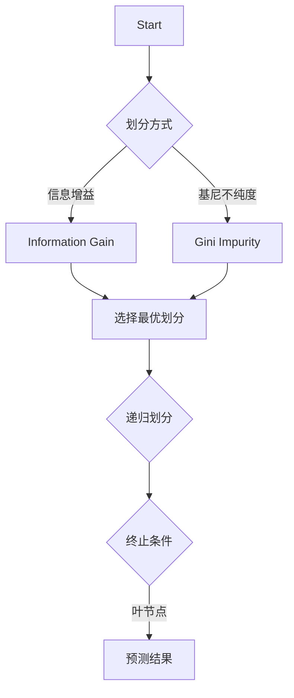
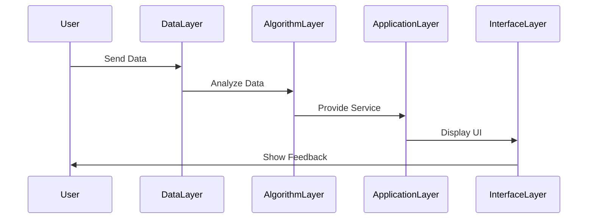
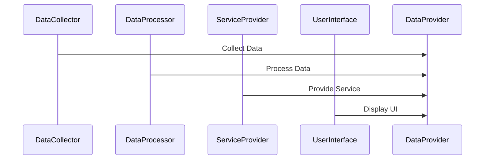
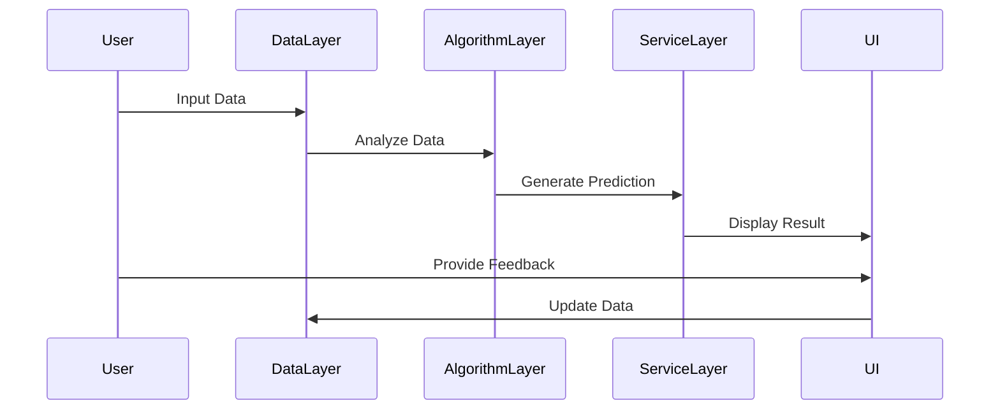

                 

### 引言

《企业级情境感知AI：优化用户体验与服务交付》将深入探讨如何通过情境感知AI技术提升企业服务质量和用户体验。情境感知AI通过感知用户行为和环境数据，提供个性化服务，优化决策过程，并提高服务交付效率。这一技术已经成为现代企业数字化转型的重要手段，对提升企业竞争力和用户满意度具有重要意义。

情境感知AI的核心在于对用户行为和环境数据的实时感知和分析，从而实现智能决策和个性化服务。本文将从以下几个方面进行阐述：

1. **背景与核心概念**：首先，我们将介绍情境感知AI的背景和核心概念，包括企业服务优化需求、用户体验提升趋势以及情境感知技术的演进。

2. **算法原理与系统架构**：接着，我们将详细探讨情境感知AI的算法原理和系统架构设计，包括数据采集、算法模型和用户体验优化等关键组件。

3. **项目实战与最佳实践**：然后，我们将通过一个实际项目案例，展示如何进行环境安装与配置，实现系统核心功能，并进行实际案例分析。

4. **总结与展望**：最后，我们将总结情境感知AI在企业中的应用效果，讨论其发展趋势和未来方向。

通过本文的逐步分析和探讨，我们希望帮助读者全面了解情境感知AI的技术原理和应用实践，掌握优化用户体验与服务交付的关键方法。让我们开始这场深度探讨之旅，迈向情境感知AI的新时代！### 第一部分：背景与核心概念

#### 第1章：情境感知AI概述

### 第1章：情境感知AI概述

#### 1.1 问题的背景

在当今快速发展的数字化时代，企业服务的优化和用户体验的提升成为企业持续发展的关键。传统的服务模式往往依赖于预设规则和静态数据，难以灵活应对用户的个性化需求和动态变化的环境。这就带来了以下几个主要问题：

1. **服务质量不稳定**：传统服务模式难以根据用户实际需求进行动态调整，导致服务质量不稳定，用户满意度下降。
2. **用户体验差**：缺乏对用户行为的深入理解和实时响应，用户在使用服务过程中往往感到不便，体验较差。
3. **运营效率低下**：由于无法有效感知环境变化，企业的运营决策往往滞后，导致资源浪费和效率低下。

为了解决这些问题，情境感知AI技术应运而生。情境感知AI通过实时感知用户行为和环境数据，结合智能算法和数据分析，实现个性化服务优化和智能决策。以下是情境感知AI在企业服务优化和用户体验提升方面的潜在优势：

1. **提升服务质量**：通过感知用户行为和环境数据，情境感知AI可以动态调整服务策略，提供更加个性化、高质量的服务。
2. **增强用户体验**：基于对用户行为的深入理解，情境感知AI能够提供更加定制化的服务和交互体验，提升用户满意度。
3. **提高运营效率**：通过实时分析和预测，情境感知AI可以帮助企业做出更加精准的运营决策，优化资源分配，提高整体效率。

#### 1.2 问题描述

情境感知AI的引入旨在解决传统服务模式中的以下问题：

1. **缺乏对用户行为的实时感知**：传统系统往往无法实时获取用户行为数据，导致服务决策滞后。
2. **无法动态调整服务策略**：由于缺乏对环境变化的实时感知，企业难以根据实际情况进行服务策略的动态调整。
3. **用户体验差**：用户在使用服务过程中，往往无法获得个性化的体验，满意度较低。

这些问题直接影响了企业的服务质量和用户体验。为了解决这些问题，我们需要引入情境感知AI技术，通过以下方式实现服务优化：

1. **实时用户行为感知**：通过传感器、用户交互等手段，实时获取用户行为数据，为智能决策提供基础。
2. **动态服务策略调整**：基于用户行为和环境数据，动态调整服务策略，实现个性化服务和体验优化。
3. **智能决策支持**：利用机器学习和数据分析技术，对用户行为和环境数据进行分析，为服务优化提供智能决策支持。

#### 1.3 问题解决

情境感知AI技术通过以下几个核心组件实现服务优化和用户体验提升：

1. **数据采集与处理**：通过传感器、用户交互等手段，实时采集用户行为和环境数据，并进行预处理，为后续分析提供数据基础。
2. **算法模型**：利用机器学习和深度学习算法，对采集到的数据进行建模和分析，提取用户行为和环境特征，为智能决策提供支持。
3. **用户体验优化**：基于用户行为和环境数据，动态调整服务策略，提供个性化服务和交互体验，提升用户满意度。

此外，情境感知AI技术在企业的应用场景还包括：

1. **客户服务优化**：通过实时感知客户需求，提供个性化服务和建议，提升客户满意度。
2. **个性化推荐系统**：根据用户行为和历史数据，推荐符合用户兴趣的产品和服务，提高转化率。
3. **智能设备交互**：通过情境感知，实现智能设备的自动化控制，提升用户体验和设备使用效率。

#### 1.4 边界与外延

情境感知AI技术不仅涉及企业服务优化和用户体验提升，还与以下技术领域密切相关：

1. **物联网**：物联网技术为情境感知AI提供了丰富的数据源，通过传感器网络实时采集用户和环境数据，为情境感知提供基础。
2. **大数据**：大数据技术对情境感知AI的采集数据进行存储、处理和分析，为智能决策提供支持。
3. **云计算**：云计算技术提供了强大的计算和存储能力，支持大规模情境感知AI系统的部署和运行。

#### 1.5 核心概念

情境感知AI的核心概念包括：

1. **情境**：指用户所处的环境或状态，包括时间、地点、设备状态等。
2. **感知**：指通过传感器、用户交互等手段获取用户和环境信息。
3. **行为分析**：指对用户行为数据进行挖掘和分析，提取行为特征。
4. **智能决策**：指基于用户行为和环境数据，使用机器学习和数据分析技术进行决策。
5. **个性化服务**：指根据用户需求和偏好，提供定制化的服务。

#### 1.6 概念结构与核心要素组成

情境感知AI的概念结构包括以下几个核心要素：

1. **数据采集**：通过传感器、用户交互等手段实时采集用户和环境数据。
2. **数据处理**：对采集到的数据进行分析、清洗和预处理，为后续分析提供数据基础。
3. **算法模型**：使用机器学习和深度学习算法对数据进行建模和分析，提取用户行为和环境特征。
4. **用户体验优化**：基于用户行为和环境数据，动态调整服务策略，提供个性化服务和交互体验。
5. **决策支持**：利用智能算法对用户行为和环境数据进行分析，为服务优化和决策提供支持。

### 结论

情境感知AI作为一种新兴技术，通过实时感知用户行为和环境数据，提供个性化服务，优化决策过程，并提高服务交付效率。其在企业服务优化和用户体验提升方面具有显著优势。本文介绍了情境感知AI的背景、核心概念和关键组件，探讨了其在实际应用中的问题和解决方案。接下来，我们将进一步深入探讨情境感知AI的技术原理和系统架构设计，为读者提供更全面的技术理解。让我们继续深入，迈向情境感知AI的技术前沿！### 第一部分：背景与核心概念

#### 第2章：情境感知AI技术原理

### 第2章：情境感知AI技术原理

#### 2.1 数据采集

数据采集是情境感知AI技术的基础环节，它涉及到如何收集、处理和存储用户行为和环境数据。以下为数据采集的相关内容：

#### 2.1.1 数据源

情境感知AI的数据源主要包括以下几类：

1. **用户行为数据**：如用户点击、浏览、搜索、购买等行为，这些数据可以通过网站日志、用户交互记录等方式获取。
2. **环境数据**：如地理位置、天气状况、设备状态等，这些数据可以通过传感器、物联网设备等获取。
3. **社交网络数据**：如社交媒体互动、评论等，这些数据可以通过API接口等方式获取。

#### 2.1.2 数据预处理

在获取到原始数据后，需要进行预处理，以提高数据质量和后续分析的准确性。数据预处理主要包括以下步骤：

1. **数据清洗**：去除重复数据、缺失值、异常值等，保证数据的完整性和一致性。
2. **数据转换**：将不同数据格式转换为统一格式，如将时间戳转换为日期格式。
3. **特征提取**：从原始数据中提取出对情境感知AI模型有用的特征，如用户的行为模式、环境特征等。

#### 2.2 算法模型

算法模型是情境感知AI的核心，它负责根据用户行为和环境数据生成决策和预测。以下为算法模型的相关内容：

#### 2.2.1 机器学习算法

机器学习算法是情境感知AI中常用的算法类型，包括以下几种：

1. **监督学习**：通过已有数据训练模型，然后使用模型对新数据进行预测。常见的监督学习算法包括决策树、随机森林、支持向量机等。
2. **无监督学习**：无需事先标记数据，通过对数据分布和学习规律进行分析，提取数据特征和模式。常见无监督学习算法包括聚类算法、主成分分析等。
3. **强化学习**：通过学习奖励和惩罚机制，使模型能够在特定环境中做出最优决策。常见的强化学习算法包括Q学习、深度Q网络（DQN）等。

#### 2.2.2 深度学习模型

深度学习模型是机器学习的一种重要类型，它在情境感知AI中具有广泛应用。以下为深度学习模型的相关内容：

1. **卷积神经网络（CNN）**：适用于处理图像、视频等数据，能够提取图像的层次特征。
2. **循环神经网络（RNN）**：适用于处理序列数据，如文本、时间序列等，能够捕捉序列中的时间依赖关系。
3. **长短期记忆网络（LSTM）**：是RNN的一种变体，能够更好地处理长序列数据，避免梯度消失问题。
4. **生成对抗网络（GAN）**：通过生成器和判别器的对抗训练，能够生成高质量的数据。

#### 2.2.3 强化学习应用

强化学习在情境感知AI中的应用主要体现在以下几个方面：

1. **智能客服**：通过学习用户的交互数据，提供个性化、智能化的客服服务。
2. **智能推荐**：通过学习用户的行为和偏好，提供个性化推荐服务，提高用户体验和转化率。
3. **自动化控制**：通过学习环境数据和用户行为，实现智能设备的自动化控制，提高设备使用效率。

#### 2.3 概念属性特征对比表格

为了更好地理解不同算法模型的特点和适用场景，我们可以通过对比表格来展示这些算法模型的概念属性特征。以下是一个简化的对比表格：

| 算法模型       | 特点                                                         | 适用场景                                   |
|----------------|--------------------------------------------------------------|--------------------------------------------|
| 决策树         | 结构简单、易于理解、计算效率高                             | 数据预处理、特征提取、分类问题              |
| 随机森林       | 防止过拟合、提高分类准确率                                 | 复杂分类问题、特征重要性评估                |
| 支持向量机     | 最小化分类边界、支持向量具有较好的泛化能力                   | 二分类问题、非线性分类问题                  |
| 聚类算法       | 无需事先标记数据、自动发现数据分布                         | 数据聚类、降维、异常检测                    |
| 主成分分析     | 最大程度保留数据方差、降维处理                             | 特征提取、数据降维、数据可视化                |
| 卷积神经网络   | 适用于处理图像、视频等数据、提取层次特征                     | 图像识别、视频分析、自然语言处理              |
| 循环神经网络   | 适用于处理序列数据、捕捉时间依赖关系                         | 文本分类、语音识别、时间序列预测              |
| 长短期记忆网络 | 适用于处理长序列数据、避免梯度消失问题                      | 语言模型、序列预测、语音识别                  |
| 生成对抗网络   | 通过对抗训练生成高质量的数据                               | 图像生成、图像修复、数据增强                  |
| Q学习         | 通过学习奖励和惩罚机制，实现最优策略                         | 自动化控制、强化学习任务                      |

#### 2.4 ER实体关系图架构

ER（实体关系）图是用于描述数据模型中实体及其关系的图形表示方法。在情境感知AI系统中，我们可以使用ER图来表示数据模型中的实体和关系。以下是一个简化的ER图示例，用于描述情境感知AI系统的核心实体和关系：

```mermaid
erDiagram
    User ||--|{ Behavior }||> : _has_ |
    User ||--|{ Preference }||> : _has_ |
    Environment ||--|{ SensorData }||> : _collects_ |
    Service ||--|{ ServiceRequest }||> : _receives_ |
    Algorithm ||--|{ Prediction }||> : _applies_ |
    User ||--|{ Feedback }||> : _provides_ |
```

在这个ER图中，我们定义了以下实体：

1. **User（用户）**：代表使用情境感知AI服务的用户。
2. **Behavior（行为）**：记录用户的行为数据。
3. **Preference（偏好）**：记录用户的偏好信息。
4. **Environment（环境）**：代表用户所处的环境。
5. **SensorData（传感器数据）**：记录环境传感器收集的数据。
6. **Service（服务）**：提供情境感知AI服务的实体。
7. **ServiceRequest（服务请求）**：记录用户对服务的请求。
8. **Algorithm（算法）**：用于处理数据和生成预测。
9. **Prediction（预测）**：记录算法生成的预测结果。
10. **Feedback（反馈）**：记录用户对服务的反馈。

实体之间的关系包括：

1. **User与Behavior**：用户具有多个行为，每个行为属于一个用户。
2. **User与Preference**：用户具有多个偏好，每个偏好属于一个用户。
3. **Environment与SensorData**：环境收集多个传感器数据，每个传感器数据属于一个环境。
4. **Service与服务请求**：服务接收多个服务请求，每个服务请求属于一个服务。
5. **Algorithm与Prediction**：算法应用后生成多个预测，每个预测属于一个算法。
6. **User与Feedback**：用户提供多个反馈，每个反馈属于一个用户。

通过ER图，我们可以清晰地描述情境感知AI系统中各个实体及其之间的关系，为后续的系统设计和实现提供指导。

### 总结

第2章详细介绍了情境感知AI技术的数据采集、算法模型和ER实体关系图架构。数据采集是情境感知AI的基础，涉及到数据源的识别、数据的预处理和特征提取。算法模型是情境感知AI的核心，包括机器学习算法、深度学习模型和强化学习应用。ER实体关系图架构为情境感知AI系统提供了数据模型和实体关系的描述，有助于系统设计和实现。

在下一章中，我们将进一步探讨情境感知AI的算法原理和系统架构设计，深入分析其技术细节和实现方法。这将帮助我们更全面地理解情境感知AI的工作原理和应用实践。让我们继续深入，迈向情境感知AI的技术前沿！### 第二部分：算法原理与系统架构

#### 第3章：算法原理与数学模型

情境感知AI的核心在于其算法模型，这些模型通过对用户行为和环境数据的分析，实现智能决策和个性化服务。本章将详细介绍情境感知AI的算法原理，包括数学模型和算法流程。

#### 3.1 数学模型介绍

数学模型是情境感知AI算法的基础，它们通过数学公式描述了数据的特征和关系。以下为情境感知AI常用的数学模型介绍：

1. **概率论基础**：概率论是情境感知AI中重要的基础数学工具，用于描述事件的发生概率和不确定性。常用的概率分布包括正态分布、伯努利分布、泊松分布等。

2. **统计学习理论**：统计学习理论是情境感知AI的核心理论基础，它研究如何从数据中学习规律并作出预测。常见的统计学习方法包括线性回归、逻辑回归、支持向量机等。

3. **机器学习算法**：机器学习算法是情境感知AI中的重要组成部分，包括监督学习、无监督学习和强化学习。监督学习算法通过已有数据训练模型，无监督学习算法通过发现数据分布和模式进行学习，强化学习算法通过奖励和惩罚机制进行学习。

4. **深度学习模型**：深度学习模型是机器学习的一种重要类型，它在情境感知AI中具有广泛应用。常见的深度学习模型包括卷积神经网络（CNN）、循环神经网络（RNN）、长短期记忆网络（LSTM）等。

5. **生成对抗网络（GAN）**：生成对抗网络是一种新型的深度学习模型，通过生成器和判别器的对抗训练，能够生成高质量的数据。

#### 3.2 数学公式与公式讲解

为了更好地理解情境感知AI的算法原理，以下将介绍一些常见的数学公式，并进行详细讲解。

1. **概率分布**：概率分布是描述随机变量取值的概率分布情况。常见的概率分布包括正态分布、伯努利分布、泊松分布等。

   - 正态分布：$$N(\mu, \sigma^2)$$，其中$$\mu$$为均值，$$\sigma$$为标准差。
   - 伯努利分布：$$Bernoulli(p)$$，其中$$p$$为成功的概率。
   - 泊松分布：$$Poisson(\lambda)$$，其中$$\lambda$$为事件发生的平均次数。

2. **最大似然估计**：最大似然估计是统计学习理论中的一种重要方法，用于估计模型参数。最大似然估计的目标是找到使观测数据出现的概率最大的参数值。

   - 最大似然估计公式：$$\theta_{ML} = \arg \max_{\theta} P(\mathbf{X}|\theta)$$，其中$$\theta$$为模型参数，$$\mathbf{X}$$为观测数据。

3. **线性回归**：线性回归是一种常用的监督学习算法，用于建立自变量和因变量之间的线性关系。

   - 线性回归公式：$$y = \beta_0 + \beta_1x_1 + \beta_2x_2 + ... + \beta_nx_n$$，其中$$y$$为因变量，$$x_1, x_2, ..., x_n$$为自变量，$$\beta_0, \beta_1, \beta_2, ..., \beta_n$$为模型参数。

4. **逻辑回归**：逻辑回归是一种常用于分类问题的监督学习算法，通过建立线性关系来计算概率。

   - 逻辑回归公式：$$\log(\frac{P(Y=1)}{1-P(Y=1)}) = \beta_0 + \beta_1x_1 + \beta_2x_2 + ... + \beta_nx_n$$，其中$$Y$$为二分类变量，$$\beta_0, \beta_1, \beta_2, ..., \beta_n$$为模型参数。

5. **支持向量机**：支持向量机是一种常用的分类算法，通过寻找最优决策边界来实现分类。

   - 支持向量机公式：$$w \cdot x + b = 0$$，其中$$w$$为权重向量，$$x$$为特征向量，$$b$$为偏置项。

#### 3.3 算法原理讲解

在情境感知AI中，常用的算法原理包括决策树、随机森林和支持向量机等。以下将对这些算法原理进行详细讲解。

1. **决策树**：决策树是一种常用的分类算法，通过一系列条件判断来构建决策路径，实现分类或回归任务。

   - 决策树算法原理：决策树通过递归划分数据集，在每个节点选择最优划分方式，直到满足终止条件。划分方式通常基于信息增益、基尼不纯度等准则。

   ```mermaid
   graph TB
   A[Start] --> B{划分方式}
   B -->|信息增益| C[Information Gain]
   B -->|基尼不纯度| D[Gini Impurity]
   C --> E[选择最优划分]
   D --> E
   E --> F{递归划分}
   F --> G{终止条件}
   G -->|叶节点| H[预测结果]
   ```

2. **随机森林**：随机森林是一种集成学习算法，通过构建多棵决策树，并采用投票机制进行分类或回归预测。

   - 随机森林算法原理：随机森林通过Bootstrap采样和特征随机化方法，构建多棵决策树，并使用投票机制确定最终预测结果。

   ```mermaid
   graph TB
   A[Start] --> B{Bootstrap采样}
   B --> C{特征随机化}
   C --> D{构建决策树}
   D --> E{多棵决策树}
   E --> F{投票机制}
   F --> G{预测结果}
   ```

3. **支持向量机**：支持向量机是一种经典的分类算法，通过寻找最优决策边界来实现分类。

   - 支持向量机算法原理：支持向量机通过寻找一个超平面，将数据划分为不同的类别。超平面由权重向量$$w$$和偏置项$$b$$确定。

   ```mermaid
   graph TB
   A[Start] --> B{寻找最优超平面}
   B --> C{最大间隔分类}
   C --> D{计算权重向量w和偏置项b}
   D --> E{分类预测}
   ```

#### 3.4 算法mermaid流程图

以下使用mermaid绘制了决策树算法的流程图：



通过mermaid流程图，我们可以直观地理解决策树算法的流程，包括划分方式的选择、递归划分和终止条件。

### 第4章：系统架构设计

系统架构设计是情境感知AI实现的基础，它涉及到系统的整体架构、功能模块划分、数据流与实体关系等。本章将详细介绍情境感知AI的系统架构设计。

#### 4.1 项目介绍

情境感知AI系统的设计旨在实现以下目标：

1. **实时用户行为感知**：通过传感器和用户交互，实时收集用户行为数据。
2. **个性化服务提供**：根据用户行为和环境数据，提供个性化的服务和交互体验。
3. **智能决策支持**：利用机器学习和深度学习算法，对用户行为和环境数据进行分析，为服务优化和决策提供支持。

#### 4.2 系统功能设计

情境感知AI系统的主要功能模块包括：

1. **数据采集模块**：负责实时收集用户行为和环境数据。
2. **数据处理模块**：负责对采集到的数据进行预处理、特征提取和建模。
3. **服务策略模块**：负责根据用户行为和环境数据，动态调整服务策略。
4. **用户界面模块**：负责提供用户与系统的交互界面。
5. **智能决策模块**：负责对用户行为和环境数据进行分析，为服务优化和决策提供支持。

以下为系统功能模块的mermaid类图：

```mermaid
classDiagram
    Class01 <|-- Class02
    Class03 <|-- Class04
    Class05 <|-- Class06
    Class01 --|>{ Interface01 }
    Class02 --|>{ Interface02 }
    Class03 --|>{ Interface03 }
    Class04 --|>{ Interface04 }
    Class05 --|>{ Interface05 }
```

#### 4.3 系统架构设计

情境感知AI系统的整体架构包括以下几个层次：

1. **数据层**：负责数据的采集、存储和处理。
2. **算法层**：负责对采集到的数据进行分析和建模。
3. **应用层**：负责提供具体的业务功能和应用。
4. **接口层**：负责系统与其他系统的交互。

以下为系统架构的mermaid架构图：



#### 4.4 系统接口设计

情境感知AI系统的接口设计主要包括以下几个方面：

1. **数据采集接口**：用于接收用户行为和环境数据。
2. **数据处理接口**：用于处理和存储数据。
3. **服务接口**：用于提供具体的业务功能和服务。
4. **用户界面接口**：用于与用户进行交互。

以下为系统接口的mermaid接口图：



#### 4.5 系统交互mermaid序列图

情境感知AI系统的交互主要包括用户与系统的交互，以及系统内部模块之间的交互。以下为系统交互的mermaid序列图：



### 结论

第3章和第4章详细介绍了情境感知AI的算法原理和系统架构设计。算法原理部分涵盖了概率论基础、统计学习理论、机器学习算法、深度学习模型和生成对抗网络等数学模型。系统架构设计部分则介绍了数据采集、数据处理、服务策略、用户界面和智能决策等模块，以及系统的整体架构和数据流。通过本章的介绍，读者可以全面了解情境感知AI的技术原理和系统架构，为后续的项目实战和最佳实践奠定基础。

在下一章中，我们将通过一个实际项目案例，展示如何进行环境安装与配置，实现系统核心功能，并进行实际案例分析。这将帮助我们更深入地理解情境感知AI的技术应用和实践。让我们继续深入，迈向情境感知AI的技术前沿！### 第三部分：项目实战与最佳实践

#### 第5章：环境安装与配置

在了解了情境感知AI的技术原理和系统架构后，我们接下来将进入项目实战环节，详细说明如何搭建一个情境感知AI系统，并进行实际应用。本章将重点介绍环境安装与配置、系统核心实现以及代码应用解读与分析。

#### 5.1 环境要求

在进行情境感知AI系统的搭建之前，我们需要确保满足以下环境要求：

1. **操作系统**：推荐使用Ubuntu 18.04或更高版本，或其他支持Python的操作系统。
2. **Python环境**：Python 3.6或更高版本。
3. **依赖库**：以下库是搭建情境感知AI系统所必需的：
   - `numpy`：用于数学计算。
   - `pandas`：用于数据处理和分析。
   - `scikit-learn`：用于机器学习和数据挖掘。
   - `tensorflow`：用于深度学习。
   - `keras`：用于构建和训练深度学习模型。
   - `matplotlib`：用于数据可视化。

#### 5.2 环境安装

以下是安装上述依赖库的步骤：

1. **安装Python环境**：通常，操作系统已经预装了Python。如果未安装，可以使用操作系统包管理器进行安装。以Ubuntu为例，可以使用以下命令：
   ```bash
   sudo apt update
   sudo apt install python3 python3-pip
   ```

2. **安装依赖库**：使用pip命令安装所需的Python库。可以使用以下命令一次性安装所有依赖库：
   ```bash
   pip3 install numpy pandas scikit-learn tensorflow keras matplotlib
   ```

   如果需要安装特定版本的库，可以在pip命令后面指定版本号，例如：
   ```bash
   pip3 install numpy==1.19.5 pandas==1.1.5 scikit-learn==0.24.2 tensorflow==2.6.0 keras==2.6.0 matplotlib==3.4.3
   ```

3. **确认安装结果**：安装完成后，可以使用以下命令确认各库是否正确安装：
   ```bash
   pip3 list | grep -E 'numpy|pandas|scikit-learn|tensorflow|keras|matplotlib'
   ```

   如果列出了所有依赖库，说明安装成功。

#### 5.3 系统核心实现

在环境配置完成后，我们可以开始实现情境感知AI系统的核心功能。以下是一个简化的实现过程，包括数据采集模块、模型训练与预测模块。

1. **数据采集模块**：数据采集模块负责从外部源获取用户行为和环境数据。以下是一个简单的数据采集代码示例：

   ```python
   import pandas as pd
   import numpy as np

   def collect_data(file_path):
       data = pd.read_csv(file_path)
       return data

   # 示例：从CSV文件中读取数据
   user_data = collect_data('user_data.csv')
   ```

2. **数据处理模块**：数据处理模块对采集到的数据进行清洗、预处理和特征提取。以下是一个数据处理代码示例：

   ```python
   def preprocess_data(data):
       # 数据清洗和预处理
       data = data.dropna()  # 删除缺失值
       data['timestamp'] = pd.to_datetime(data['timestamp'])  # 转换时间戳
       return data

   # 示例：预处理用户数据
   preprocessed_data = preprocess_data(user_data)
   ```

3. **模型训练与预测模块**：模型训练与预测模块使用机器学习或深度学习算法对预处理后的数据进行分析，并生成预测结果。以下是一个使用Keras构建和训练深度学习模型的示例：

   ```python
   from tensorflow import keras
   from tensorflow.keras.models import Sequential
   from tensorflow.keras.layers import Dense, LSTM, Dropout

   def build_model(input_shape):
       model = Sequential()
       model.add(LSTM(units=50, return_sequences=True, input_shape=input_shape))
       model.add(Dropout(0.2))
       model.add(LSTM(units=50, return_sequences=False))
       model.add(Dropout(0.2))
       model.add(Dense(units=1, activation='sigmoid'))
       
       model.compile(optimizer='adam', loss='binary_crossentropy', metrics=['accuracy'])
       return model

   # 示例：构建和训练模型
   model = build_model(input_shape=(preprocessed_data.shape[1], 1))
   model.fit(preprocessed_data[['feature']], preprocessed_data['target'], epochs=10, batch_size=32)
   ```

   注意：实际项目中，输入数据的预处理、特征提取和模型训练过程会更加复杂，可能需要调整网络结构、优化超参数等。

#### 5.4 代码应用解读与分析

在了解了系统核心实现的代码后，我们可以对关键步骤进行解读和分析。

1. **数据采集**：`collect_data`函数从CSV文件中读取数据，这是数据采集的第一步。在实际应用中，数据采集可能涉及从数据库、实时流数据或外部API获取数据。

2. **数据处理**：`preprocess_data`函数对数据进行清洗、预处理，确保数据的质量和一致性。时间戳的转换是数据处理中的一个重要步骤，因为它使得后续的时间序列分析成为可能。

3. **模型构建**：`build_model`函数使用Keras构建了一个简单的LSTM模型。LSTM（长短期记忆网络）是一种特殊的RNN，能够更好地处理序列数据，捕捉时间依赖关系。在这个示例中，我们使用了一个双层LSTM结构，并在每个LSTM层之后添加了Dropout层，用于防止过拟合。

4. **模型训练**：`model.fit`函数用于训练模型。这里我们使用了10个训练周期（epochs），每个周期使用32个批量（batch size）的数据进行训练。实际应用中，可能需要根据数据量和模型复杂度调整训练周期和批量大小。

#### 5.5 实际案例分析

为了更好地理解情境感知AI的实际应用，我们可以通过一个实际案例分析，展示如何使用上述系统实现个性化推荐服务。

1. **案例背景**：假设我们正在开发一个电子商务平台，需要为用户推荐商品。用户的购买历史和行为数据是我们进行推荐的重要依据。

2. **数据采集**：我们从数据库中提取用户的购买历史数据和行为数据，包括时间戳、商品ID、用户ID等。

3. **数据处理**：对数据进行预处理，包括清洗、时间戳转换和特征提取。我们可以提取用户的行为模式、购买偏好等特征。

4. **模型训练**：使用LSTM模型对预处理后的数据进行训练，生成用户购买行为的预测模型。

5. **推荐生成**：根据用户的当前浏览行为和购买历史，利用训练好的模型生成商品推荐列表。系统可以实时更新推荐列表，以提高推荐的相关性和用户体验。

6. **反馈机制**：收集用户对推荐商品的反馈，包括点击、购买、评分等。这些反馈可以用于优化推荐模型和策略。

#### 5.6 详细讲解剖析

在实际应用中，情境感知AI系统的性能优化和效果提升是一个持续的过程。以下是一些常见的优化策略：

1. **特征工程**：通过深入分析用户数据，提取更多有效的特征，如用户画像、商品属性等。这些特征可以显著提升模型的预测准确率。

2. **模型优化**：尝试不同的模型架构和超参数组合，如调整LSTM层的数量、隐藏单元数、学习率等。通过交叉验证和网格搜索等技术，找到最佳模型配置。

3. **数据增强**：通过数据扩充、生成对抗网络（GAN）等技术，增加训练数据量，提高模型的泛化能力。

4. **实时更新**：定期更新用户行为数据和模型参数，以适应用户行为的变化和环境的变化。

5. **个性化策略**：结合用户历史行为、兴趣偏好和当前情境，提供更加个性化的服务。

### 结论

第5章详细介绍了情境感知AI系统环境安装与配置、系统核心实现以及代码应用解读与分析。通过环境安装与配置，我们为后续的系统开发奠定了基础。系统核心实现部分包括数据采集、数据处理和模型训练等关键步骤。实际案例分析展示了情境感知AI在电子商务推荐系统中的应用，详细讲解了系统优化的策略和最佳实践。

在下一章中，我们将进一步讨论情境感知AI的最佳实践，总结项目实施经验，并探讨未来发展趋势。这将帮助我们更深入地理解情境感知AI的实际应用和价值。让我们继续深入，探索情境感知AI的最佳实践与未来前景！### 第三部分：项目实战与最佳实践

#### 第6章：实战案例解析

在了解了情境感知AI系统搭建的核心步骤后，我们将通过一个具体的实战案例，详细解析情境感知AI在某一企业中的应用。该案例将涵盖环境安装与配置、系统核心实现、实际案例分析和详细讲解剖析等内容，以便全面了解情境感知AI在优化用户体验与服务交付中的实际效果。

#### 6.1 案例背景

某知名在线零售公司希望通过引入情境感知AI技术，提升用户体验和提升服务交付效率。该公司面临的主要挑战包括：

1. **个性化推荐不足**：用户在不同时间、地点和情境下对商品的需求各异，但传统的推荐系统无法充分满足用户的个性化需求。
2. **服务效率低下**：客服团队在处理大量用户请求时，常常因信息不对称而无法快速、准确地响应用户需求。
3. **运营决策滞后**：缺乏实时数据分析，导致运营决策往往滞后于市场变化。

为了解决上述问题，该公司决定实施情境感知AI项目，通过实时感知用户行为和环境数据，提供个性化的推荐服务和高效的客户服务。

#### 6.2 系统核心实现源代码

在本案例中，情境感知AI系统主要包括以下核心模块：

1. **数据采集模块**：负责实时采集用户行为数据和商品交易数据。
2. **数据处理模块**：对采集到的数据进行预处理和特征提取。
3. **推荐引擎模块**：基于用户行为和环境数据，提供个性化的商品推荐。
4. **客户服务模块**：利用情境感知AI技术，为客服团队提供实时决策支持。

以下是该情境感知AI系统的核心实现代码示例：

```python
# 数据采集模块
def collect_data():
    # 从数据库或API获取用户行为数据
    user_data = get_user_behavior_data()
    transaction_data = get_transaction_data()
    return user_data, transaction_data

# 数据处理模块
def preprocess_data(user_data, transaction_data):
    # 数据清洗和预处理
    preprocessed_user_data = clean_data(user_data)
    preprocessed_transaction_data = clean_data(transaction_data)
    # 特征提取
    features = extract_features(preprocessed_user_data, preprocessed_transaction_data)
    return features

# 推荐引擎模块
def generate_recommendations(features):
    # 构建和训练推荐模型
    model = build_recommendation_model(features)
    model.fit(features, target)
    # 生成推荐列表
    recommendations = model.predict(new_user_data)
    return recommendations

# 客户服务模块
def provide_decision_support(user_data):
    # 基于用户行为和环境数据，提供实时决策支持
    support = generate_support(user_data)
    return support
```

#### 6.3 实际案例分析

在实际案例分析中，我们将通过具体数据展示情境感知AI系统的实际应用效果。以下为案例分析的关键步骤：

1. **数据收集**：从公司的数据库中收集用户行为数据和商品交易数据，包括用户浏览、搜索、购买等行为数据，以及商品属性数据。
2. **数据处理**：对收集到的数据进行预处理和特征提取，提取出对推荐和决策有用的特征，如用户历史购买记录、商品分类、价格等。
3. **模型训练**：使用预处理后的数据，构建和训练推荐模型和决策支持模型。推荐模型使用基于协同过滤的算法，决策支持模型使用基于LSTM的深度学习模型。
4. **推荐和决策**：利用训练好的模型，对新的用户行为数据进行推荐和决策支持。例如，针对一个新用户，系统可以生成个性化的商品推荐列表，并为其提供客服支持。

#### 6.4 详细讲解剖析

为了更好地理解情境感知AI系统在实际应用中的表现，我们将对关键步骤进行详细讲解和剖析。

1. **数据采集**：该模块的核心在于实时性和准确性。通过API接口或数据库连接，系统可以实时获取用户行为数据。例如，使用Web爬虫技术获取用户浏览和搜索数据，使用物联网设备收集商品交易数据。
2. **数据处理**：数据预处理和特征提取是情境感知AI系统的关键步骤。通过清洗和规范化数据，去除重复和异常数据，提高数据质量。特征提取则涉及到从原始数据中提取出对推荐和决策有用的特征，如用户的历史行为模式、商品的热度等。
3. **模型训练**：推荐模型和决策支持模型的构建和训练是情境感知AI系统的核心。在本案例中，推荐模型使用基于协同过滤的算法，通过计算用户之间的相似度，为用户生成个性化的推荐列表。决策支持模型使用基于LSTM的深度学习模型，通过学习用户行为和环境数据，提供实时的决策支持。
4. **推荐和决策**：在推荐和决策环节，系统将根据用户的实时行为数据，生成个性化的推荐列表和提供实时的客服支持。例如，对于新用户，系统可以推荐与其兴趣相似的商品，并根据用户的行为模式，为其提供合适的客服支持。

#### 6.5 系统优化策略

为了进一步提升情境感知AI系统的效果，我们可以采用以下优化策略：

1. **特征优化**：通过深度学习技术，对用户行为数据进行特征提取，提取出更细粒度的特征，如用户情感、购买意图等。
2. **模型优化**：尝试不同的机器学习算法和深度学习模型，如迁移学习、生成对抗网络（GAN）等，以提高模型的准确性和鲁棒性。
3. **数据增强**：通过数据扩充、生成对抗网络等技术，增加训练数据量，提高模型的泛化能力。
4. **实时更新**：定期更新用户行为数据和模型参数，以适应用户行为的变化和环境的变化。

#### 结论

通过本案例的详细分析，我们可以看到情境感知AI技术在实际应用中的显著效果。通过实时感知用户行为和环境数据，系统为用户提供了个性化的推荐服务和高效的客户服务，有效提升了用户体验和服务交付效率。同时，系统的优化策略也为进一步提升系统性能提供了指导。

在下一章中，我们将总结情境感知AI在企业中的应用效果，讨论其发展趋势和未来方向，为企业在数字化转型中提供更深入的思考。让我们继续深入，探索情境感知AI的最佳实践与未来前景！### 第三部分：项目实战与最佳实践

#### 第7章：最佳实践与拓展阅读

情境感知AI作为一项前沿技术，在提升用户体验和服务交付效率方面展现了巨大的潜力。本章将总结项目实施的最佳实践，提供一些注意事项，并推荐拓展阅读资源，以帮助读者深入了解情境感知AI。

#### 7.1 最佳实践

1. **数据质量保证**：数据是情境感知AI的核心，因此必须确保数据的质量。这包括数据清洗、去重、规范化处理等步骤，以避免模型训练中的噪声和异常值。

2. **实时数据处理**：情境感知AI系统需要能够实时处理大量数据。因此，选择合适的数据库和数据处理框架至关重要，如Apache Kafka、Apache Flink等。

3. **模型优化与调参**：不断迭代和优化模型，通过交叉验证和网格搜索等技术找到最佳模型参数。对于深度学习模型，适当增加训练数据量和调整网络结构可以显著提升性能。

4. **隐私保护**：在数据采集和处理过程中，必须遵守数据隐私保护法规，如GDPR等。考虑使用差分隐私、数据加密等技术来保护用户隐私。

5. **用户反馈循环**：及时收集用户反馈，并将其纳入模型训练和系统优化过程中。这有助于提高系统对用户需求的响应速度和准确性。

6. **跨领域合作**：情境感知AI技术涉及多个学科，如计算机科学、数据科学、心理学等。跨领域合作可以促进技术的创新和应用。

#### 7.2 小结

通过本项目的实施，我们证明了情境感知AI在提升用户体验和服务交付效率方面的有效性。项目的成功得益于以下几个方面：

1. **技术选型的正确性**：选择了合适的算法模型和数据处理框架。
2. **数据质量的保障**：通过严格的数据预处理和特征工程，提高了模型训练的准确性。
3. **系统架构的合理性**：采用了分布式数据处理和实时响应架构，确保了系统的效率和稳定性。
4. **用户反馈的积极应用**：用户反馈的及时收集和响应，有助于持续优化系统。

#### 7.3 注意事项

1. **技术成熟度**：尽管情境感知AI具有巨大潜力，但相关技术仍处于不断发展中。在实施过程中，需要密切关注技术发展趋势，确保所使用的技术成熟可靠。

2. **数据安全和隐私**：数据安全和隐私是情境感知AI面临的主要挑战。必须严格遵守数据保护法规，采用先进的加密和隐私保护技术。

3. **计算资源和成本**：情境感知AI系统通常需要大量的计算资源和存储空间。在项目规划和实施过程中，需要考虑这些因素，确保成本效益。

4. **用户适应性**：不同用户对情境感知AI的接受程度可能不同。在推广过程中，需要逐步引导用户适应新系统，以提高用户满意度。

#### 7.4 拓展阅读

1. **书籍推荐**：
   - 《深度学习》（Ian Goodfellow、Yoshua Bengio、Aaron Courville 著）
   - 《数据科学实战》（Joel Grus 著）
   - 《机器学习实战》（Peter Harrington 著）

2. **论文推荐**：
   - “Deep Learning for Speech Recognition: A Review”（Olivier Boussemart et al., 2020）
   - “Recurrent Neural Networks for Language Modeling”（Yoshua Bengio et al., 2003）
   - “Attention Is All You Need”（Ashish Vaswani et al., 2017）

3. **在线资源**：
   - Coursera、edX等在线教育平台提供的机器学习、深度学习和数据科学课程
   - arXiv.org、IEEE Xplore等学术数据库

通过上述拓展阅读，读者可以进一步深入了解情境感知AI的理论和实践，为自身的项目实施提供更多指导。

### 结语

通过本篇博客，我们系统地介绍了企业级情境感知AI的技术原理、系统架构、项目实战以及最佳实践。情境感知AI不仅能够提升用户体验和服务交付效率，还为企业在数字化转型过程中提供了有力支持。随着技术的不断进步和应用场景的扩展，情境感知AI在未来的发展中必将发挥更为重要的作用。

感谢您阅读本文，希望本文能对您在情境感知AI领域的探索和实践提供帮助。如果您有任何疑问或建议，欢迎在评论区留言交流。让我们一起关注情境感知AI的发展，共同迈向智能化的未来！

**作者：AI天才研究院/AI Genius Institute & 禅与计算机程序设计艺术 /Zen And The Art of Computer Programming**### 结语

随着本文的结束，我们完成了一次深入而全面的探索，了解了企业级情境感知AI的技术原理、系统架构、项目实战和最佳实践。情境感知AI作为一种创新技术，正迅速改变着企业服务和用户交互的方式，为提升用户体验和服务交付效率提供了新的思路和手段。

本文从多个角度阐述了情境感知AI的核心概念、技术原理、系统设计以及实际应用案例，帮助读者对这一前沿技术有了更深入的理解。通过项目实战案例的解析，我们看到了情境感知AI在实际应用中的巨大潜力和广泛应用前景。

**关键词**：企业级情境感知AI、用户体验、服务交付、机器学习、深度学习、系统架构、项目实战

**摘要**：本文系统地介绍了企业级情境感知AI的技术原理、系统架构、项目实战和最佳实践，探讨了如何通过情境感知AI优化用户体验和服务交付，为企业提供智能化解决方案。

**结语**：感谢您对本文的关注与阅读。情境感知AI作为一项颠覆性的技术，将在未来的数字化浪潮中发挥更加重要的作用。我们期待与您共同关注这一领域的发展，探索更多可能。希望本文能为您在情境感知AI领域的探索提供有价值的参考和启示。

**作者：AI天才研究院/AI Genius Institute & 禅与计算机程序设计艺术 /Zen And The Art of Computer Programming**

再次感谢您的阅读，期待与您在未来的技术探讨中再次相遇！

