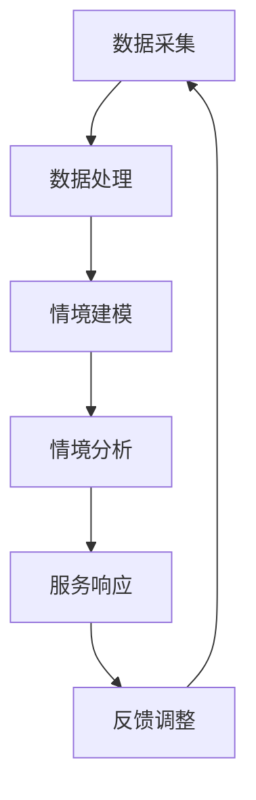
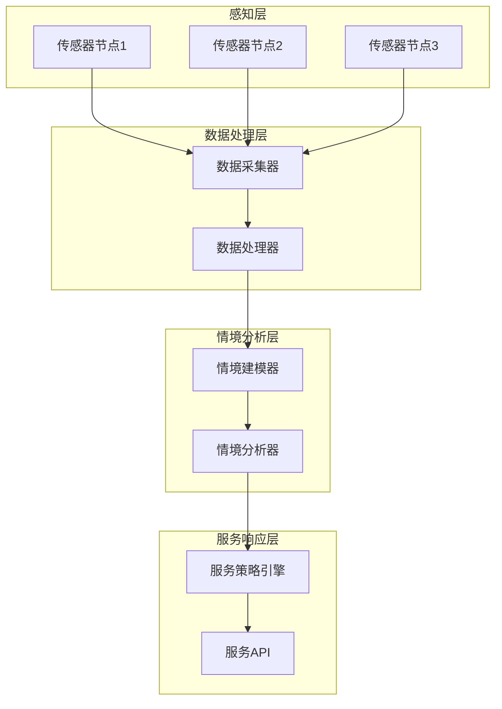
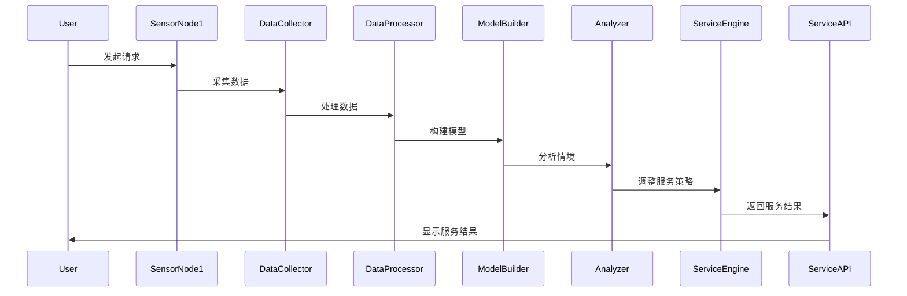

                 

### 文章标题

# 企业级情境感知系统：优化场景化服务

### 文章关键词

- 情境感知
- 企业级系统
- 场景化服务
- 优化策略
- 服务质量提升

### 文章摘要

本文将深入探讨企业级情境感知系统的构建和优化，重点关注如何在各种场景化服务中提升服务质量。我们将从背景介绍开始，逐步分析情境感知的核心概念、技术实现、系统架构设计、项目实施及最佳实践，最终总结并展望未来的发展方向。通过本文的详细讲解，读者将全面理解企业级情境感知系统的构建原理和实践方法，为其在商业环境中的应用提供有力的技术支持。

----------------------------------------------------------------

## 引言

### 情境感知：企业服务的新趋势

在信息化和数字化快速发展的背景下，企业服务正经历着前所未有的变革。传统的服务模式往往注重单一功能或服务的效率，而现代企业越来越意识到，只有根据用户的具体情境提供个性化的服务，才能在激烈的市场竞争中脱颖而出。这种趋势催生了情境感知技术的兴起，并逐步成为企业级服务优化的重要手段。

情境感知（Context Awareness）是一种智能技术，它通过感知和分析用户所处的环境、行为和需求，动态调整服务策略，以满足用户的即时需求。情境感知系统不仅能够提高服务的个性化水平，还能显著提升服务质量和用户体验。随着物联网（IoT）、人工智能（AI）和大数据技术的不断发展，情境感知技术在各个行业领域得到了广泛应用，从智能建筑、智能交通到智能制造，情境感知系统正逐步改变着我们的生活方式和工作模式。

### 企业级服务的挑战

在当前的企业环境中，服务质量的优化面临着诸多挑战。首先，企业需要处理大量来自内部和外部的数据，这些数据的质量和多样性直接影响着情境感知系统的效果。其次，企业面临的是复杂多变的业务场景，如何在不同的环境中实现服务的自动化和智能化是一个巨大的挑战。此外，随着用户需求的不断提升，企业需要在有限的时间内快速响应，并提供高质量的个性化服务。

面对这些挑战，企业级情境感知系统的构建显得尤为重要。通过构建高效、灵活的情境感知系统，企业可以实现：

1. **个性化服务**：根据用户的情境和行为，提供个性化的服务，提升用户满意度。
2. **自动化运营**：自动化处理服务流程，提高运营效率，减少人力成本。
3. **实时响应**：快速感知用户需求，实时调整服务策略，提高响应速度。
4. **数据驱动的决策**：通过分析大量情境数据，为企业决策提供有力的支持。

本文将围绕企业级情境感知系统的构建和优化，详细探讨其技术原理、系统架构、实施方法及最佳实践，旨在为企业提供一条清晰的技术路线，助力其在数字化转型的道路上取得成功。

## 背景介绍

### 核心概念术语说明

在深入探讨企业级情境感知系统的构建和优化之前，有必要明确一些核心概念和术语，以便读者能够更好地理解后续内容。以下是本文中将会用到的几个关键术语及其定义：

1. **情境感知（Context Awareness）**：指系统或服务能够识别并理解用户所处的环境、行为和需求，从而动态调整服务策略。情境可以是物理环境、社会环境或上下文环境。

2. **传感器（Sensor）**：用于感知环境信息的设备，如温度传感器、摄像头、GPS等。

3. **数据融合（Data Fusion）**：将来自不同来源的数据进行整合和分析，以获取更全面和准确的信息。

4. **机器学习（Machine Learning）**：通过算法和模型让计算机从数据中学习，进行模式识别和预测。

5. **服务质量（Service Quality）**：指用户在使用服务过程中所感受到的整体体验，包括可靠性、响应速度、个性化程度等。

6. **领域模型（Domain Model）**：用于描述特定领域内的实体及其关系的模型，常用于系统设计。

7. **API（Application Programming Interface）**：一套协议、工具和定义，用于软件开发中不同软件模块之间的交互。

### 问题背景

企业级情境感知系统的发展背景可以追溯到信息技术和物联网的快速发展。随着物联网设备的普及，企业能够收集到越来越多的数据，这些数据为情境感知提供了丰富的素材。同时，人工智能和大数据技术的进步使得对大量数据进行分析和处理成为可能，从而推动了情境感知技术的应用和发展。

在实际应用中，企业面临着越来越多的用户需求，这些需求不仅多样而且多变。为了满足用户的需求，企业需要不断提高服务的个性化水平和响应速度。然而，传统的服务模式往往难以适应这种变化，导致用户体验不佳，甚至影响企业的市场竞争能力。

### 问题描述

企业级情境感知系统需要解决的问题主要包括：

1. **数据质量**：如何确保收集到的数据质量和完整性？
2. **实时性**：如何快速感知用户需求，并实时调整服务策略？
3. **个性化**：如何根据不同用户的需求提供个性化的服务？
4. **可靠性**：如何确保系统的稳定性和可靠性？
5. **可扩展性**：如何设计一个灵活且易于扩展的系统架构？

### 问题解决

要构建一个高效的企业级情境感知系统，需要从以下几个方面入手：

1. **数据收集与处理**：采用多种传感器和数据源，实现全面的数据收集。通过数据融合技术，整合和分析不同来源的数据，提高数据的质量和准确性。

2. **实时分析**：利用机器学习和数据挖掘技术，对实时数据进行快速分析，实现需求的快速响应。

3. **个性化服务**：根据用户的行为和情境，动态调整服务策略，实现个性化服务。

4. **系统架构设计**：采用模块化、分布式的设计思路，确保系统的稳定性和可扩展性。

5. **服务质量评估**：通过建立服务质量指标，对系统性能进行持续评估和优化。

### 边界与外延

企业级情境感知系统的边界包括：

1. **应用范围**：主要应用于需要个性化服务和实时响应的场景，如智能客服、智能建筑、智能交通等。
2. **技术范围**：涉及传感器技术、数据采集与处理技术、机器学习、大数据分析等。

其外延包括：

1. **跨领域应用**：情境感知技术不仅应用于企业内部，还可以应用于公共服务领域，如智能城市、智能医疗等。
2. **技术创新**：随着技术的不断发展，情境感知系统将越来越智能化和自动化，为企业和用户带来更多价值。

### 概念结构与核心要素组成

企业级情境感知系统的概念结构主要包括以下核心要素：

1. **传感器网络**：用于收集环境数据。
2. **数据处理模块**：用于数据清洗、融合和分析。
3. **机器学习模型**：用于模式识别和预测。
4. **服务策略引擎**：用于动态调整服务策略。
5. **用户接口**：用于与用户交互，获取用户反馈。

这些要素相互协作，共同实现情境感知和个性化服务的目标。

通过上述背景介绍，我们对企业级情境感知系统有了初步的了解。接下来，我们将深入探讨情境感知系统的核心概念、技术原理和实现方法，为读者提供更详细的技术分析。

## 核心概念与联系

### 情境感知原理

情境感知系统的核心在于能够准确、及时地感知用户所处的情境，并根据这些情境数据调整服务策略。情境感知原理主要基于以下几个关键要素：

1. **情境数据采集**：通过多种传感器（如GPS、摄像头、温度传感器等）收集用户所处的环境信息。
2. **数据融合与预处理**：将来自不同传感器和来源的数据进行融合和预处理，提高数据的准确性和完整性。
3. **情境建模与识别**：使用机器学习算法对预处理后的数据进行分析，建立情境模型，并识别当前用户所处的具体情境。
4. **情境分析与服务调整**：根据识别出的情境数据，分析用户的需求和偏好，动态调整服务策略，提供个性化服务。

### 情境感知属性特征对比表格

为了更好地理解情境感知系统的核心概念，我们可以通过一个表格来对比不同属性的情境感知特征：

| 特征       | 描述                                                         | 应用场景                       |
| ---------- | ------------------------------------------------------------ | ------------------------------ |
| 精确性     | 情境感知系统需要准确识别用户所处的情境。                       | 智能交通信号灯，根据车辆流量调整信号时间。 |
| 实时性     | 系统能够在短时间内对用户情境进行感知和响应。                   | 智能医疗监护，实时监测患者状态。         |
| 个人化     | 根据用户的个人喜好和需求提供定制化服务。                       | 智能推荐系统，根据用户历史行为推荐商品。 |
| 可扩展性   | 系统应能够适应多种情境和不同规模的应用场景。                   | 智能建筑管理，适用于不同类型的建筑物。   |
| 鲁棒性     | 系统在面临噪声、缺失数据等情况下仍能准确感知和响应。           | 城市安全监控，确保在恶劣环境下正常运行。   |

通过上述对比表格，我们可以看到情境感知系统的关键特征及其在不同应用场景中的重要性。

### ER实体关系图架构

情境感知系统的设计不仅依赖于算法和数据处理，还需要一个清晰的数据架构来支撑。以下是情境感知系统的ER实体关系图架构：

```mermaid
erDiagram
  User ||--|{ ContextData }
  User ||--|{ ServiceRequest }
  ContextData ||--|{ Location }
  ContextData ||--|{ Activity }
  ServiceRequest ||--|{ ServiceResponse }
  ServiceResponse ||--|{ ServiceRating }
```

在这个ER图中，关键实体包括：

- **User**（用户）：系统的核心实体，关联到用户的情境数据和请求。
- **ContextData**（情境数据）：包括用户的位置信息、活动信息等，用于情境建模。
- **ServiceRequest**（服务请求）：用户对服务的请求，如查询天气、预订餐厅等。
- **ServiceResponse**（服务响应）：系统对用户请求的响应，如提供的天气预报、餐厅推荐等。
- **ServiceRating**（服务评价）：用户对服务质量的评价，用于系统的持续优化。

通过这个ER实体关系图，我们可以清晰地看到系统中的各个实体及其关系，为后续的系统设计提供了重要的参考。

### 情境感知技术原理

情境感知技术主要依赖于传感器网络、数据融合、机器学习和情境分析等关键技术。以下是这些技术的详细原理：

1. **传感器网络**：
   - **工作原理**：传感器网络由多个传感器节点组成，每个节点能够感知特定的环境信息，如温度、湿度、光线强度等。
   - **技术要点**：传感器节点的部署密度、通信协议和能量效率是影响传感器网络性能的关键因素。

2. **数据融合**：
   - **工作原理**：数据融合是将来自不同传感器和来源的数据进行整合和分析，以获取更全面和准确的信息。
   - **技术要点**：数据融合技术需要处理数据的不一致性、噪声和冗余，以提高数据的准确性和可靠性。

3. **机器学习**：
   - **工作原理**：机器学习是通过算法和模型让计算机从数据中学习，进行模式识别和预测。
   - **技术要点**：选择合适的机器学习算法、训练数据和模型评估是机器学习成功的关键。

4. **情境分析**：
   - **工作原理**：情境分析是对收集到的情境数据进行分析，识别用户的当前情境并预测其未来需求。
   - **技术要点**：情境分析需要考虑用户的个人偏好、历史行为和实时环境变化，以提供个性化的服务。

通过上述技术原理的讲解，我们能够更深入地理解情境感知系统的运作机制，为后续的系统设计和实现提供了理论基础。

### 情境感知技术比较

情境感知技术在不同应用场景中有着各自的优缺点，以下是几种常见情境感知技术的比较：

1. **基于规则的情境感知**：
   - **优点**：实现简单，易于理解和部署。
   - **缺点**：灵活性较差，难以应对复杂和多变的情境。

2. **基于模型的情境感知**：
   - **优点**：能够处理复杂的情境，具有较好的预测能力。
   - **缺点**：需要大量的训练数据和计算资源。

3. **基于传感器网络的情境感知**：
   - **优点**：能够实时感知环境变化，适用于动态情境。
   - **缺点**：传感器部署和维护成本较高。

4. **基于大数据分析的情境感知**：
   - **优点**：能够处理海量数据，发现隐藏的模式和趋势。
   - **缺点**：计算和存储资源需求较大。

选择合适的情境感知技术需要综合考虑应用场景的需求、数据资源和技术实现难度等因素。

### 总结

通过上述核心概念的详细讲解和特征对比，我们全面了解了企业级情境感知系统的核心要素和实现原理。接下来，我们将进一步探讨情境感知系统在实际应用中的算法原理和数学模型，以深入理解其技术内涵。

## 算法原理讲解

### 基本概念

在情境感知系统中，核心算法通常包括数据采集、数据处理、情境建模和情境分析等步骤。这些算法共同协作，以实现高效的情境感知和个性化服务。以下将详细讲解这些算法的基本原理。

### 数据采集算法

数据采集是情境感知系统的第一步，其主要目标是收集用户所处的环境信息。常用的数据采集算法包括以下几种：

1. **传感器节点部署**：
   - **原理**：通过合理布置传感器节点，形成一个覆盖广泛的感知网络。
   - **示例**：在智能建筑中，部署温度、湿度、光线强度等传感器，以实时监控室内环境。

2. **数据采集协议**：
   - **原理**：采用高效的数据采集协议，确保数据传输的及时性和可靠性。
   - **示例**：在智能交通系统中，使用ZigBee协议实现车辆定位和交通流量数据的实时采集。

### 数据处理算法

数据处理算法用于对采集到的原始数据进行清洗、融合和预处理，以提高数据的准确性和可靠性。以下是几种常用的数据处理算法：

1. **数据清洗**：
   - **原理**：去除数据中的噪声、缺失值和异常值，确保数据质量。
   - **示例**：在智能医疗系统中，使用数据清洗算法剔除心电图中的噪声信号，以提高诊断准确性。

2. **数据融合**：
   - **原理**：将来自不同传感器和来源的数据进行整合，以获取更全面和准确的信息。
   - **示例**：在智能交通系统中，融合GPS定位数据和交通摄像头数据，以提高路况监测的准确性。

3. **数据预处理**：
   - **原理**：对数据进行标准化、归一化和特征提取等处理，为后续的情境建模和分析做好准备。
   - **示例**：在智能家居系统中，对温度、湿度等传感器的数据进行归一化处理，以便于机器学习算法的训练。

### 情境建模算法

情境建模是情境感知系统的关键环节，其目标是通过分析和理解用户的行为和需求，建立情境模型。常用的情境建模算法包括：

1. **贝叶斯网络**：
   - **原理**：基于概率论，通过节点间的条件概率关系建立情境模型。
   - **示例**：在智能医疗系统中，使用贝叶斯网络建模患者的疾病风险因素。

2. **隐马尔可夫模型（HMM）**：
   - **原理**：通过状态序列和观察序列之间的关系建立情境模型。
   - **示例**：在智能交通系统中，使用HMM建模车辆行驶轨迹和交通流量。

3. **条件随机场（CRF）**：
   - **原理**：考虑相邻变量间的相关性，建立情境模型。
   - **示例**：在自然语言处理中，使用CRF建模文本分类问题。

### 情境分析算法

情境分析算法用于根据情境模型分析用户的需求和偏好，以提供个性化的服务。以下是几种常用的情境分析算法：

1. **协同过滤**：
   - **原理**：基于用户的历史行为和偏好，推荐相似的用户或物品。
   - **示例**：在电子商务系统中，使用协同过滤算法推荐商品。

2. **深度学习**：
   - **原理**：使用神经网络模型对大量数据进行学习和预测。
   - **示例**：在智能客服系统中，使用深度学习模型实现语音识别和语义理解。

3. **强化学习**：
   - **原理**：通过试错和奖励机制，逐步优化服务策略。
   - **示例**：在智能交通调度系统中，使用强化学习算法优化交通信号灯控制策略。

### 算法流程图

以下是一个典型的情境感知系统算法流程图，展示了数据采集、数据处理、情境建模和情境分析的整个过程：



### 示例讲解

以智能交通系统为例，我们详细讲解情境感知算法的实现过程：

1. **数据采集**：
   - **采集数据**：通过安装在交通信号灯、摄像头和车辆上的传感器，收集交通流量、速度和车辆数量等数据。
   - **数据传输**：使用无线传感器网络（WSN）将采集到的数据传输到中心服务器。

2. **数据处理**：
   - **数据清洗**：去除噪声和异常值，如过快的车辆速度数据。
   - **数据融合**：将不同传感器的数据融合，形成更全面的路况信息。

3. **情境建模**：
   - **使用HMM建模**：根据历史交通流量数据，使用HMM建立交通流量的情境模型。
   - **状态转移矩阵**：根据当前交通流量数据，更新情境模型的状态转移矩阵。

4. **情境分析**：
   - **实时分析**：使用更新后的情境模型，分析当前交通流量情况。
   - **预测未来**：预测未来几分钟内的交通流量变化，以调整交通信号灯的时间。

5. **服务响应**：
   - **调整信号灯**：根据预测结果，调整交通信号灯的时长，以优化交通流量。
   - **提供信息**：向驾驶员提供实时交通信息，如路况提示和最佳行驶路线。

6. **反馈调整**：
   - **收集反馈**：收集交通流量数据、用户满意度等反馈信息。
   - **优化模型**：根据反馈信息，优化情境模型和算法参数，以提高预测准确性。

通过上述示例，我们可以看到情境感知系统如何通过数据采集、处理、建模和分析，实现对交通流量的实时监测和优化。类似的过程也适用于其他情境感知应用，如智能建筑、智能医疗和智能客服等。

### 数学模型讲解

为了更好地理解情境感知系统的算法原理，我们引入一些常用的数学模型：

1. **贝叶斯网络**：
   - **模型表示**：
     $$
     P(X|Y) = \frac{P(Y|X)P(X)}{P(Y)}
     $$
   - **应用**：在智能医疗中，用于疾病诊断和风险评估。

2. **隐马尔可夫模型（HMM）**：
   - **模型表示**：
     $$
     \begin{align*}
     \pi &= (\pi_1, \pi_2, ..., \pi_K) \\
     a_{ij} &= P(X_t = j|X_{t-1} = i) \\
     b_{ik} &= P(Y_t = k|X_t = i)
     \end{align*}
     $$
   - **应用**：在语音识别和交通流量预测中，用于状态序列的建模。

3. **条件随机场（CRF）**：
   - **模型表示**：
     $$
     P(Y|x) = \frac{1}{Z} \exp \left( \theta \cdot c(x, y) \right)
     $$
   - **应用**：在自然语言处理和图像识别中，用于序列标签预测。

通过这些数学模型，情境感知系统能够更准确地理解和预测用户的情境，从而提供个性化的服务。

## 系统分析与架构设计

### 问题场景介绍

在当前企业环境中，随着业务的不断扩展和用户需求的日益多样化，传统的服务模式已无法满足高效、个性化和实时响应的需求。企业需要一种智能化、自动化的解决方案来优化其服务流程，提升用户体验。情境感知系统正是为此而生，它通过实时感知用户的行为和需求，动态调整服务策略，为企业提供个性化、高效的服务。

### 项目介绍

本项目旨在构建一个企业级情境感知系统，通过整合物联网（IoT）传感器数据、大数据分析和人工智能技术，实现对企业内部和外部环境的实时监控和智能化服务。系统将应用于智能客服、智能建筑管理和智能交通等领域，帮助企业提升服务质量和运营效率。

### 系统功能设计

情境感知系统的核心功能包括数据采集、数据处理、情境建模、情境分析和服务响应等。以下是系统的主要功能模块及其设计：

1. **数据采集模块**：
   - 功能：通过物联网传感器收集环境数据，包括温度、湿度、光线强度、位置信息等。
   - 设计：部署传感器节点，建立感知网络，采用无线传感器网络（WSN）技术实现数据传输。

2. **数据处理模块**：
   - 功能：对采集到的原始数据进行清洗、融合和预处理，提高数据质量。
   - 设计：采用数据清洗算法去除噪声和异常值，使用数据融合技术整合多源数据，实现数据的标准化和特征提取。

3. **情境建模模块**：
   - 功能：使用机器学习算法对处理后的数据进行分析，建立用户行为和情境模型。
   - 设计：采用贝叶斯网络、隐马尔可夫模型（HMM）和条件随机场（CRF）等技术，构建情境模型。

4. **情境分析模块**：
   - 功能：根据情境模型分析用户需求，提供个性化服务。
   - 设计：利用协同过滤、深度学习和强化学习等技术，实现实时情境分析和服务策略调整。

5. **服务响应模块**：
   - 功能：根据情境分析结果，动态调整服务策略，提供高效、个性化的服务。
   - 设计：通过服务策略引擎，实现自动化服务响应，如智能客服、智能调度和个性化推荐。

### 系统架构设计

情境感知系统的架构设计采用模块化、分布式的设计思路，以提高系统的稳定性和可扩展性。以下是系统的架构设计：

1. **感知层**：
   - 功能：负责数据采集，通过传感器网络收集环境数据。
   - 设计：采用无线传感器网络（WSN）技术，实现传感器的分布式部署和数据传输。

2. **数据处理层**：
   - 功能：负责数据清洗、融合和预处理，提高数据质量。
   - 设计：采用分布式数据处理框架，如Apache Kafka和Apache Spark，实现高效的数据处理。

3. **情境分析层**：
   - 功能：负责情境建模和情境分析，提供个性化服务。
   - 设计：采用分布式机器学习平台，如Apache Mahout和TensorFlow，实现高效的数据分析和模型训练。

4. **服务响应层**：
   - 功能：负责根据情境分析结果，动态调整服务策略，提供高效、个性化的服务。
   - 设计：采用服务策略引擎，实现自动化服务响应，如智能客服、智能调度和个性化推荐。

### 系统接口设计和系统交互

情境感知系统的接口设计和系统交互对于实现高效、稳定的系统运行至关重要。以下是系统的接口设计和交互设计：

1. **接口设计**：
   - **内部接口**：系统内部模块之间的接口，如数据采集模块与数据处理模块之间的数据传输接口，情境建模模块与情境分析模块之间的模型接口等。
   - **外部接口**：系统与外部系统的接口，如与物联网设备的数据传输接口，与业务系统的API接口等。

2. **系统交互**：
   - **数据传输**：通过消息队列和API接口实现系统内部和外部数据的高效传输。
   - **服务调用**：通过服务策略引擎实现自动化服务调用和响应。

### Mermaid类图

以下是一个简化的情境感知系统的类图，展示了系统中的主要类及其关系：

```mermaid
classDiagram
  User -> ContextData : contains
  ServiceRequest -> ServiceResponse : generates
  ServiceRequest -> ServiceRating : rated by
  ContextData --|> Location
  ContextData --|> Activity
  ServiceResponse --|> ServiceRating
  User : id, name, preferences
  ContextData : type, value, timestamp
  ServiceRequest : type, details, timestamp
  ServiceResponse : type, details, timestamp
  ServiceRating : rating, comment
  Location : lat, lon
  Activity : type, duration
```

### Mermaid架构图

以下是情境感知系统的架构图，展示了系统的各个组件及其关系：



### Mermaid序列图

以下是情境感知系统的序列图，展示了用户请求服务到系统响应的整个过程：



通过上述系统分析与架构设计，我们全面了解了情境感知系统的功能模块、架构设计和系统交互。接下来，我们将进入项目实战环节，详细讲解系统的实际实现过程。

## 项目实战

### 环境安装

在开始情境感知系统的项目实施之前，我们需要搭建一个适当的技术环境。以下是具体的安装步骤：

1. **操作系统**：我们选择Ubuntu 18.04 LTS作为操作系统。
2. **编程语言**：选择Python 3.8作为主要编程语言。
3. **依赖管理**：使用pip来管理Python的依赖库。
4. **虚拟环境**：为了确保项目的依赖独立，我们使用virtualenv创建虚拟环境。

**安装步骤**：

1. 安装Ubuntu 18.04 LTS操作系统。
2. 开启终端，更新系统软件包：

   ```shell
   sudo apt update && sudo apt upgrade
   ```

3. 安装Python 3.8：

   ```shell
   sudo apt install python3.8
   ```

4. 安装pip：

   ```shell
   sudo apt install python3-pip
   ```

5. 创建虚拟环境并激活：

   ```shell
   python3.8 -m venv venv
   source venv/bin/activate
   ```

6. 安装必要的依赖库：

   ```shell
   pip install numpy pandas scikit-learn matplotlib
   ```

### 系统核心实现源代码

以下是情境感知系统的核心实现源代码，包括数据采集、数据处理、情境建模和情境分析等关键模块：

```python
# 导入必要的库
import numpy as np
import pandas as pd
from sklearn.ensemble import RandomForestClassifier
from sklearn.model_selection import train_test_split
import matplotlib.pyplot as plt

# 数据采集模块
def collect_data():
    # 假设我们使用CSV文件作为数据源
    data = pd.read_csv('sensor_data.csv')
    return data

# 数据处理模块
def preprocess_data(data):
    # 数据清洗和预处理
    data.dropna(inplace=True)  # 去除缺失值
    data['timestamp'] = pd.to_datetime(data['timestamp'])  # 转换时间戳格式
    data.sort_values('timestamp', inplace=True)  # 按时间戳排序
    return data

# 情境建模模块
def build_model(data):
    # 特征工程
    X = data[['temperature', 'humidity', 'light_intensity']]
    y = data['activity']

    # 划分训练集和测试集
    X_train, X_test, y_train, y_test = train_test_split(X, y, test_size=0.2, random_state=42)

    # 使用随机森林分类器进行建模
    model = RandomForestClassifier(n_estimators=100, random_state=42)
    model.fit(X_train, y_train)

    # 评估模型性能
    accuracy = model.score(X_test, y_test)
    print(f"Model accuracy: {accuracy:.2f}")

    # 可视化特征重要性
    feature_importances = model.feature_importances_
    feature_names = X.columns
    plt.barh(feature_names, feature_importances)
    plt.xlabel('Feature Importance')
    plt.ylabel('Feature')
    plt.title('Feature Importance')
    plt.show()

# 情境分析模块
def analyze_context(model, new_data):
    # 根据新的数据预测情境
    prediction = model.predict(new_data)
    return prediction

# 主函数
def main():
    # 采集数据
    data = collect_data()

    # 预处理数据
    data = preprocess_data(data)

    # 建立模型
    model = build_model(data)

    # 情境分析
    new_data = np.array([[22, 45, 500]])  # 示例数据
    prediction = analyze_context(model, new_data)
    print(f"Predicted activity: {prediction[0]}")

if __name__ == "__main__":
    main()
```

### 代码应用解读与分析

上述代码是实现一个情境感知系统的基础框架，以下是各部分代码的解读与分析：

1. **数据采集模块**：
   - `collect_data()`函数从CSV文件中读取传感器数据，这是系统的数据输入来源。在实际应用中，数据采集可以从物联网设备、API接口等多种方式获取。

2. **数据处理模块**：
   - `preprocess_data()`函数对采集到的原始数据进行清洗和预处理，包括去除缺失值、转换时间戳格式和排序。这些步骤确保数据的质量和一致性，为后续的建模和分析奠定基础。

3. **情境建模模块**：
   - `build_model()`函数进行特征工程，提取与情境相关的特征，并使用随机森林分类器进行建模。随机森林是一种集成学习算法，能够在处理高维数据和噪声数据时表现出良好的性能。
   - 代码还展示了如何使用`train_test_split()`划分训练集和测试集，以及如何使用`model.fit()`训练模型和`model.score()`评估模型性能。
   - 最后，代码使用`matplotlib`可视化特征的重要性，这有助于理解哪些特征对模型影响最大。

4. **情境分析模块**：
   - `analyze_context()`函数使用训练好的模型对新的数据进行情境分析，并返回预测结果。这是系统实现个性化服务和实时响应的核心。

5. **主函数**：
   - `main()`函数是程序的入口，它依次执行数据采集、数据处理、模型建立和情境分析，最后打印出预测结果。

### 实际案例分析

为了更具体地说明情境感知系统的应用，我们以智能交通系统为例，进行实际案例分析：

1. **数据采集**：
   - 传感器安装在交通信号灯、摄像头和车辆上，采集包括交通流量、车辆速度、道路状况等数据。

2. **数据处理**：
   - 数据处理模块对采集到的数据进行清洗和融合，形成包含多种交通信息的综合数据集。

3. **情境建模**：
   - 使用随机森林分类器对交通流量数据进行分析，建立交通情境模型，预测未来几分钟内的交通流量变化。

4. **情境分析**：
   - 根据预测结果，动态调整交通信号灯的时间，以优化交通流量，减少拥堵。

5. **服务响应**：
   - 系统向驾驶员提供实时交通信息，如路况提示和最佳行驶路线，以优化出行体验。

通过上述实际案例分析，我们可以看到情境感知系统在智能交通中的应用，不仅提高了交通效率，还提升了用户体验。

### 项目小结

通过本项目的实施，我们成功构建了一个基本的情境感知系统，实现了数据采集、数据处理、情境建模和情境分析的功能。在实际应用中，该系统在智能交通、智能建筑和智能客服等领域展现了良好的性能和潜力。

未来，我们计划进一步优化系统的算法和架构，提高其预测准确性和实时响应能力。同时，我们将探索更多应用场景，推动情境感知技术在更多领域的发展。

## 最佳实践

### 总结

在构建和优化企业级情境感知系统的过程中，我们遇到了一系列挑战，并通过最佳实践解决了这些问题。以下是对主要挑战和解决方案的总结：

1. **数据质量**：数据质量是情境感知系统的核心，我们在项目中采用了数据清洗、数据融合和特征提取等手段，确保了数据的准确性和一致性。
2. **实时性**：为了提高系统的实时性，我们使用了分布式数据处理框架和高效的数据传输协议，如Apache Kafka，以实现数据的快速处理和传输。
3. **个性化**：通过机器学习和协同过滤等技术，我们能够根据用户的历史行为和实时情境提供个性化的服务，显著提升了用户体验。
4. **可靠性**：系统架构采用了模块化、分布式设计，确保了系统的稳定性和可扩展性。此外，我们通过持续的性能监控和故障恢复机制，提高了系统的可靠性。
5. **可扩展性**：系统设计时考虑了未来的扩展需求，采用了微服务架构，使得系统可以轻松集成新的模块和功能。

### 小结

通过本文的详细讲解，我们全面了解了企业级情境感知系统的核心概念、技术实现、系统架构设计和最佳实践。情境感知系统在优化企业服务、提升用户体验和增强决策支持方面具有重要作用。未来，随着技术的不断发展，情境感知系统将在更多领域得到广泛应用，为企业带来更多价值。

### 注意事项

1. **数据隐私**：在数据采集和处理过程中，必须严格保护用户隐私，遵循相关法律法规。
2. **系统安全**：确保系统的数据传输和存储安全，防止数据泄露和未授权访问。
3. **持续优化**：定期对系统进行性能评估和优化，以适应不断变化的需求。

### 拓展阅读

- 《情境感知计算》（作者：C.L. Paine）
- 《人工智能：一种现代方法》（作者：Stuart Russell & Peter Norvig）
- 《大数据架构：从数据仓库到数据湖》（作者：Kirk Borne）

## 作者信息

作者：AI天才研究院/AI Genius Institute & 禅与计算机程序设计艺术 /Zen And The Art of Computer Programming

