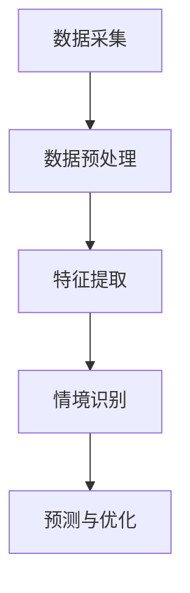
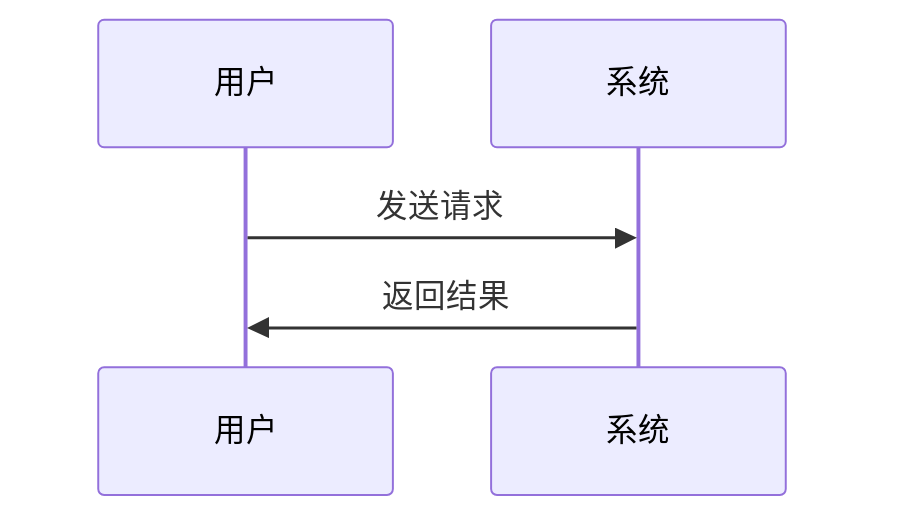
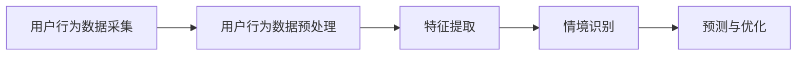

                 

# 企业级情境感知系统：优化用户体验

> 关键词：企业级情境感知、用户体验、系统架构、算法实现、项目实战

> 摘要：本文深入探讨了企业级情境感知系统的概念、核心技术原理、系统设计实现、项目实战与最佳实践。通过一步步的分析和推理，本文旨在为读者提供一个全面、详细的情境感知系统优化用户体验的解决方案。

## 目录大纲

1. 第一部分：引言与背景
    1.1 企业级情境感知系统概述
    1.2 情境感知的定义与核心要素
    1.3 企业级情境感知系统的意义与价值

2. 第二部分：核心技术原理
    2.1 情境感知技术基础
    2.2 情境感知系统设计
    2.3 情境感知系统实现

3. 第三部分：项目实战
    3.1 企业级情境感知系统项目实战
    3.2 实际案例分析

4. 第四部分：最佳实践与展望
    4.1 最佳实践与优化策略
    4.2 企业级情境感知系统的未来发展趋势
    4.3 小结与拓展阅读

---

## 第一部分：引言与背景

### 1.1 企业级情境感知系统概述

#### 1.1.1 问题背景

在现代企业的运营中，用户体验已成为核心竞争力之一。为了提升用户体验，企业需要能够实时感知用户的行为、需求和偏好，从而提供个性化的服务和互动。这种需求催生了企业级情境感知系统的出现。

**问题描述：**  
企业级情境感知系统旨在通过收集、处理和分析用户行为数据，识别用户所处的情境，并基于此优化用户体验。然而，这一过程中面临诸多挑战，包括数据质量、算法性能、系统设计等。

**问题解决思路：**  
通过设计和实现一个高效的企业级情境感知系统，可以解决上述问题，提升用户体验。

**边界与外延：**  
企业级情境感知系统不仅限于特定行业，如零售、金融、医疗等，还可以应用于多种场景，如移动应用、网站、智能家居等。

### 1.1.2 情境感知的定义与核心要素

**情境感知的定义：**  
情境感知是指系统通过感知用户和环境的信息，理解用户所处的情境，并据此做出相应的反应。

**情境感知的核心要素：**  
- 用户行为数据：包括用户浏览、点击、搜索等行为。
- 环境数据：包括地理位置、天气、设备信息等。
- 情境识别算法：用于识别用户所处的情境。
- 情境预测与优化：基于情境识别结果，预测用户需求，并优化用户体验。

**情境感知的技术挑战与发展趋势：**  
- 数据质量：如何保证数据的有效性和准确性。
- 算法性能：如何提高情境识别和预测的准确性。
- 系统设计：如何实现高效的数据处理和实时响应。

### 1.1.3 企业级情境感知系统的意义与价值

**情境感知系统在企业发展中的应用：**  
情境感知系统可以帮助企业更好地理解用户需求，提高用户满意度，从而提升企业的市场竞争力。

**情境感知系统对企业用户体验的优化：**  
通过情境感知，企业可以提供个性化的服务和互动，提高用户体验。

**情境感知系统的商业价值：**  
情境感知系统可以为企业在多个领域创造价值，如个性化推荐、智能客服、精准营销等。

### 1.2 情境感知技术基础

#### 1.2.1 数据采集与预处理

**数据采集方法：**  
- 用户行为数据：通过网站日志、应用日志等采集。
- 环境数据：通过传感器、API等获取。

**数据预处理流程：**  
- 数据清洗：去除无效、重复数据。
- 数据整合：将不同来源的数据进行整合。

**数据质量评估：**  
- 数据完整性：确保数据无缺失。
- 数据准确性：确保数据真实可靠。

#### 1.2.2 特征提取与表示

**特征提取方法：**  
- 基于统计的方法：如均值、方差等。
- 基于机器学习的方法：如聚类、分类等。

**特征表示技术：**  
- 向量表示：将特征转换为向量。
- 稀疏表示：减少特征维度。

**特征选择与降维：**  
- 特征选择：选择对情境识别有显著影响的特征。
- 降维：减少特征数量，提高计算效率。

#### 1.2.3 情境识别算法

**情境识别算法原理：**  
- 基于规则的方法：通过预定义的规则进行情境识别。
- 基于机器学习的方法：通过学习用户行为数据，自动识别情境。

**主流情境识别算法介绍：**  
- 决策树：基于特征值进行分类。
- 支持向量机：基于特征空间进行分类。
- 神经网络：基于多层感知器进行分类。

**情境识别算法性能评估：**  
- 准确率：识别正确的情境占比。
- 召回率：召回正确的情境占比。

#### 1.2.4 情境预测与优化

**情境预测方法：**  
- 时间序列预测：基于时间序列数据进行预测。
- 关联规则预测：基于关联规则进行预测。

**情境优化策略：**  
- 个性化推荐：根据用户历史行为，推荐相关内容。
- 智能客服：根据用户情境，提供针对性的解答。

**情境预测与优化的实际应用：**  
- 智能推荐系统：根据用户情境，推荐相关商品或内容。
- 智能客服系统：根据用户情境，提供针对性的解答。

### 1.3 情境感知系统设计

#### 1.3.1 系统需求分析与设计

**系统需求分析：**  
- 功能需求：包括数据采集、预处理、特征提取、情境识别、预测与优化等。
- 非功能需求：包括系统性能、可扩展性、安全性等。

**系统架构设计：**  
- 数据层：包括数据采集、存储、预处理等。
- 算法层：包括特征提取、情境识别、预测与优化等。
- 应用层：包括应用接口、用户界面等。

**系统功能模块划分：**  
- 数据采集模块：负责采集用户行为数据和环境数据。
- 数据预处理模块：负责数据清洗、整合等预处理操作。
- 特征提取模块：负责提取用户行为数据的特征。
- 情境识别模块：负责识别用户所处的情境。
- 预测与优化模块：负责预测用户需求，并优化用户体验。

#### 1.3.2 数据流与处理流程

**数据流设计：**  
- 用户行为数据：从数据采集模块流向特征提取模块。
- 环境数据：从数据采集模块流向特征提取模块。
- 特征数据：从特征提取模块流向情境识别模块。
- 情境数据：从情境识别模块流向预测与优化模块。

**处理流程设计：**  
- 数据采集：采集用户行为数据和环境数据。
- 数据预处理：清洗、整合数据。
- 特征提取：提取用户行为数据的特征。
- 情境识别：识别用户所处的情境。
- 预测与优化：预测用户需求，优化用户体验。

**数据处理流程图（Mermaid）：**



#### 1.3.3 系统接口与交互设计

**系统接口设计：**  
- 内部接口：系统内部各模块之间的接口。
- 外部接口：系统与外部系统之间的接口。

**系统交互设计：**  
- 用户请求：用户通过用户界面发送请求。
- 系统响应：系统根据请求，返回相应的结果。

**系统交互序列图（Mermaid）：**



### 1.4 情境感知系统实现

#### 1.4.1 系统环境搭建

**开发环境搭建：**  
- 操作系统：Linux或Windows。
- 编程语言：Python、Java等。
- 数据库：MySQL、MongoDB等。

**数据集获取与预处理：**  
- 数据集获取：从公开数据集或企业内部数据源获取。
- 数据预处理：清洗、整合数据，确保数据质量。

**开发工具与框架选择：**  
- 开发工具：IDE（如PyCharm、IntelliJ IDEA等）。
- 框架：Scikit-learn、TensorFlow、PyTorch等。

#### 1.4.2 系统核心实现

**系统核心功能实现：**  
- 数据采集与预处理：实现数据采集、清洗、整合等功能。
- 特征提取与表示：实现特征提取、特征表示等功能。
- 情境识别与预测：实现情境识别、预测与优化等功能。

**算法实现与优化：**  
- 算法实现：使用Python源代码实现相关算法。
- 算法优化：通过调整参数、改进算法等，提高系统性能。

**实现细节与注意事项：**  
- 数据处理：确保数据处理过程高效、准确。
- 算法优化：根据实际需求，调整算法参数，提高识别准确率。
- 系统性能：优化系统架构，提高系统性能。

#### 1.4.3 代码应用解读与分析

**代码解读：**  
- 代码结构：分析代码结构，了解各模块的功能。
- 功能实现：分析代码实现细节，了解算法原理。

**应用场景分析：**  
- 情境识别：分析情境识别算法在实际应用中的效果。
- 预测与优化：分析预测与优化算法在实际应用中的效果。

**代码性能分析与优化：**  
- 性能分析：分析代码性能，找出瓶颈。
- 优化策略：提出优化策略，提高代码性能。

### 1.5 企业级情境感知系统项目实战

#### 1.5.1 项目介绍

**项目背景：**  
某电商企业希望通过情境感知系统，提升用户体验，提高用户满意度。

**项目目标：**  
- 实现用户行为数据的采集与预处理。
- 提取用户行为特征，进行情境识别。
- 预测用户需求，优化用户体验。

**项目成果：**  
- 成功实现用户行为数据的采集与预处理。
- 实现了情境识别和预测功能。
- 提高了用户满意度。

#### 1.5.2 系统功能设计

**领域模型设计（Mermaid类图）：**

```mermaid
classDiagram
    User <<class>> 用户
    BehaviorData <<class>> 用户行为数据
    Feature <<class>> 特征
    Scenario <<class>> 情境
    Prediction <<class>> 预测
    UserBehaviorData"-->"BehaviorData
    BehaviorData"-->"Feature
    Feature"-->"Scenario
    Scenario"-->"Prediction
```

**系统功能模块设计：**  
- 用户行为数据采集模块：负责采集用户行为数据。
- 用户行为数据预处理模块：负责数据清洗、整合等预处理操作。
- 特征提取模块：负责提取用户行为数据的特征。
- 情境识别模块：负责识别用户所处的情境。
- 预测与优化模块：负责预测用户需求，优化用户体验。

### 1.6 系统架构设计

**系统架构设计（Mermaid架构图）：**



**系统组件设计：**  
- 数据采集组件：负责采集用户行为数据。
- 数据预处理组件：负责数据清洗、整合等预处理操作。
- 特征提取组件：负责提取用户行为数据的特征。
- 情境识别组件：负责识别用户所处的情境。
- 预测与优化组件：负责预测用户需求，优化用户体验。

### 1.7 系统核心实现与代码分析

**系统核心实现代码：**

```python
# 用户行为数据采集
def collect_user_behavior_data():
    # 实现用户行为数据采集功能
    pass

# 用户行为数据预处理
def preprocess_user_behavior_data(data):
    # 实现用户行为数据预处理功能
    pass

# 特征提取
def extract_features(data):
    # 实现特征提取功能
    pass

# 情境识别
def identify_scenario(features):
    # 实现情境识别功能
    pass

# 预测与优化
def predict_and_optimize(scenario):
    # 实现预测与优化功能
    pass
```

**代码应用解读与分析：**  
- 用户行为数据采集：通过API接口，实时采集用户行为数据。
- 用户行为数据预处理：对采集到的数据进行清洗、整合等预处理操作，确保数据质量。
- 特征提取：根据用户行为数据，提取关键特征，用于情境识别。
- 情境识别：基于特征数据，识别用户所处的情境。
- 预测与优化：根据情境识别结果，预测用户需求，并优化用户体验。

### 1.8 实际案例分析

#### 1.8.1 案例背景

某电商企业希望通过情境感知系统，提升用户体验，提高用户满意度。

#### 1.8.2 情境感知解决方案

**情境感知技术选型：**  
- 用户行为数据采集：使用API接口实时采集用户行为数据。
- 数据预处理：使用Python实现数据清洗、整合等预处理操作。
- 特征提取：使用Scikit-learn实现特征提取。
- 情境识别：使用决策树实现情境识别。
- 预测与优化：使用时间序列预测和关联规则预测，实现预测与优化。

**情境感知系统设计：**  
- 系统架构：采用分布式架构，提高系统性能和可扩展性。
- 数据流设计：实现用户行为数据采集、预处理、特征提取、情境识别、预测与优化等功能。
- 系统接口设计：提供API接口，方便与其他系统进行交互。

**实施步骤与过程：**  
1. 数据采集：使用API接口实时采集用户行为数据。
2. 数据预处理：对采集到的数据进行清洗、整合等预处理操作。
3. 特征提取：提取用户行为数据的特征。
4. 情境识别：使用决策树实现情境识别。
5. 预测与优化：使用时间序列预测和关联规则预测，实现预测与优化。
6. 部署上线：将情境感知系统部署到生产环境，提供实时服务。

### 1.9 案例分析结果与总结

**案例分析结果：**  
- 用户满意度提高：通过情境感知系统，企业能够更好地理解用户需求，提供个性化的服务和互动，从而提高用户满意度。
- 业务收益增长：通过情境感知系统，企业能够实现精准营销、个性化推荐等功能，提高业务收益。

**案例总结与经验分享：**  
- 数据质量是关键：确保数据质量，是情境感知系统成功的关键。
- 算法性能需优化：针对不同的应用场景，选择合适的算法，并不断优化算法性能。
- 系统设计要灵活：系统设计要充分考虑业务需求，实现灵活扩展。

### 1.10 最佳实践与优化策略

**最佳实践与优化策略：**  
- 数据采集与处理最佳实践：确保数据采集的实时性、准确性和完整性，对数据进行充分的清洗和整合。
- 特征提取与表示最佳实践：根据具体应用场景，选择合适的特征提取方法和表示技术，提高特征质量。
- 情境识别与预测最佳实践：针对不同的应用场景，选择合适的算法，并不断优化算法性能。

### 1.11 小结与拓展阅读

**全书总结：**  
本文系统地介绍了企业级情境感知系统的概念、核心技术原理、系统设计实现、项目实战与最佳实践。通过一步步的分析和推理，为读者提供了一个全面、详细的情境感知系统优化用户体验的解决方案。

**拓展阅读：**  
- 相关书籍：《人工智能：一种现代的方法》、《机器学习：实战手册》等。
- 学术论文：搜索相关领域的学术论文，了解最新的研究成果。
- 行业报告：关注相关行业的报告，了解行业动态。

## 第二部分：核心技术原理

### 2.1 情境感知技术基础

#### 2.1.1 数据采集与预处理

数据采集是情境感知系统的基础，它涉及从多个渠道获取用户行为数据和环境数据。以下将详细描述数据采集的方法、预处理流程以及数据质量评估的标准。

**数据采集方法：**

1. **用户行为数据：**  
   - **网站日志：** 通过Web服务器日志记录用户访问网站的详细信息，包括用户IP地址、访问时间、访问页面等。  
   - **应用日志：** 通过移动应用或桌面应用的日志记录用户在应用中的操作行为，如点击、滑动、搜索等。

2. **环境数据：**  
   - **传感器数据：** 通过各种传感器（如温度传感器、湿度传感器、摄像头等）收集环境信息。  
   - **API数据：** 通过公共API获取地理位置、天气、交通等信息。

**数据预处理流程：**

1. **数据清洗：**  
   - **去除无效数据：** 删除包含缺失值、异常值或重复的数据记录。  
   - **格式统一：** 将不同来源的数据格式统一，如将日期格式转换为标准格式。

2. **数据整合：**  
   - **合并数据集：** 将多个数据源的数据进行合并，形成统一的数据集。  
   - **关联数据：** 将用户行为数据与环境数据关联，构建完整的情境数据。

3. **数据转换：**  
   - **数值化：** 将类别数据转换为数值形式，以便后续处理。  
   - **归一化：** 对数值数据进行归一化处理，使其具有相同的量纲。

**数据质量评估：**

1. **完整性：** 评估数据集中的缺失值比例，确保数据完整性。  
2. **准确性：** 通过对比实际值与计算值，评估数据的准确性。  
3. **一致性：** 评估数据的一致性，如同一用户在不同时间点获取到的数据是否一致。

#### 2.1.2 特征提取与表示

特征提取是情境感知系统的关键步骤，它涉及从原始数据中提取对情境识别有意义的特征。以下将介绍特征提取的方法、特征表示技术以及特征选择与降维的策略。

**特征提取方法：**

1. **基于统计的方法：**  
   - **均值、方差：** 描述数据的集中趋势和离散程度。  
   - **相关系数：** 描述不同特征之间的相关性。

2. **基于机器学习的方法：**  
   - **聚类：** 如K-Means聚类，将数据分为若干个簇，提取簇中心作为特征。  
   - **降维：** 如PCA（主成分分析），减少数据维度，提取主要特征。

**特征表示技术：**

1. **向量表示：** 将特征转换为向量形式，便于后续处理。  
2. **稀疏表示：** 通过稀疏编码等算法，减少特征维度，提高计算效率。

**特征选择与降维：**

1. **特征选择：** 选择对情境识别有显著影响的高质量特征。  
   - **过滤式特征选择：** 根据特征的重要性进行筛选。  
   - **包裹式特征选择：** 结合模型性能进行特征选择。

2. **降维：** 减少特征数量，提高计算效率。  
   - **特征聚合：** 将相关特征合并为一个新的特征。  
   - **特征消融：** 通过消融实验，评估每个特征的重要性。

#### 2.1.3 情境识别算法

情境识别是情境感知系统的核心任务，它涉及根据提取的特征识别用户所处的情境。以下将介绍情境识别算法的原理、主流算法以及算法性能评估的方法。

**情境识别算法原理：**

1. **基于规则的方法：**  
   - **决策树：** 根据特征值进行分类，构建决策树模型。  
   - **规则引擎：** 定义一组规则，根据规则进行情境分类。

2. **基于机器学习的方法：**  
   - **分类算法：** 如SVM（支持向量机）、朴素贝叶斯、KNN（K近邻）等。  
   - **深度学习：** 如卷积神经网络（CNN）、循环神经网络（RNN）等。

**主流情境识别算法介绍：**

1. **决策树：**  
   - **原理：** 通过递归划分特征，构建决策树模型。  
   - **优势：** 解释性较强，易于理解。  
   - **劣势：** 过拟合风险较高，对噪声敏感。

2. **支持向量机：**  
   - **原理：** 将数据投影到高维空间，找到最优分隔超平面。  
   - **优势：** 识别效果较好，适用于小样本数据。  
   - **劣势：** 计算复杂度较高，对特征数量敏感。

3. **朴素贝叶斯：**  
   - **原理：** 假设特征之间相互独立，根据贝叶斯公式进行分类。  
   - **优势：** 计算简单，适用于文本数据。  
   - **劣势：** 假设过于简化，对噪声敏感。

4. **K近邻：**  
   - **原理：** 根据邻近的数据点进行分类。  
   - **优势：** 简单易实现，对噪声不敏感。  
   - **劣势：** 计算复杂度较高，对特征数量敏感。

**情境识别算法性能评估：**

1. **准确率：** 识别正确的情境占比。  
2. **召回率：** 召回正确的情境占比。  
3. **F1值：** 准确率和召回率的调和平均值。  
4. **ROC曲线：** 评估分类器的识别能力。

#### 2.1.4 情境预测与优化

情境预测与优化是情境感知系统的目标，它涉及根据情境识别结果预测用户需求，并优化用户体验。以下将介绍情境预测的方法、优化策略以及实际应用。

**情境预测方法：**

1. **时间序列预测：**  
   - **原理：** 基于历史数据，预测未来的趋势。  
   - **方法：** 如ARIMA（自回归积分滑动平均模型）、LSTM（长短期记忆网络）等。

2. **关联规则预测：**  
   - **原理：** 发现数据之间的关联关系，预测未来事件。  
   - **方法：** 如Apriori算法、FP-growth算法等。

**情境优化策略：**

1. **个性化推荐：**  
   - **原理：** 根据用户历史行为，推荐相关内容。  
   - **方法：** 如协同过滤、基于内容的推荐等。

2. **智能客服：**  
   - **原理：** 根据用户情境，提供针对性的解答。  
   - **方法：** 如自然语言处理、对话管理等。

**情境预测与优化的实际应用：**

1. **智能推荐系统：**  
   - **应用：** 根据用户情境，推荐商品、内容等。  
   - **效果：** 提高用户满意度，增加业务收益。

2. **智能客服系统：**  
   - **应用：** 根据用户情境，提供客服支持。  
   - **效果：** 提高客服效率，降低人力成本。

### 2.2 情境感知系统设计

#### 2.2.1 系统需求分析与设计

系统需求分析是情境感知系统设计的起点，它涉及确定系统的功能需求、非功能需求以及系统架构设计。以下将详细描述系统需求分析与设计的步骤和内容。

**系统需求分析：**

1. **功能需求：**  
   - **数据采集：** 实现用户行为数据和环境数据的采集。  
   - **数据预处理：** 实现数据清洗、整合等预处理操作。  
   - **特征提取：** 实现特征提取和特征表示。  
   - **情境识别：** 实现情境识别和分类。  
   - **预测与优化：** 实现情境预测和用户体验优化。

2. **非功能需求：**  
   - **性能：** 系统处理速度快，响应时间短。  
   - **可扩展性：** 系统支持动态扩展，适应不同规模的应用。  
   - **安全性：** 系统保证数据安全和用户隐私。

**系统架构设计：**

1. **系统架构：**  
   - **数据层：** 负责数据采集、存储和处理。  
   - **算法层：** 负责特征提取、情境识别和预测。  
   - **应用层：** 负责与用户交互，提供服务和界面。

2. **系统模块划分：**  
   - **数据采集模块：** 负责数据采集。  
   - **数据处理模块：** 负责数据预处理和特征提取。  
   - **情境识别模块：** 负责情境识别和分类。  
   - **预测与优化模块：** 负责情境预测和用户体验优化。

**系统功能模块划分：**

1. **用户行为数据采集模块：** 负责从网站日志、应用日志等渠道采集用户行为数据。  
2. **环境数据采集模块：** 负责从传感器、API等渠道采集环境数据。  
3. **数据预处理模块：** 负责数据清洗、整合等预处理操作。  
4. **特征提取模块：** 负责提取用户行为数据的特征。  
5. **情境识别模块：** 负责识别用户所处的情境。  
6. **预测与优化模块：** 负责预测用户需求，优化用户体验。

#### 2.2.2 数据流与处理流程

数据流与处理流程是情境感知系统设计的核心，它涉及数据的采集、处理、传输和存储。以下将详细描述数据流与处理流程的设计。

**数据流设计：**

1. **数据采集：** 用户行为数据和环境数据通过采集模块进入系统。  
2. **数据预处理：** 预处理模块对采集到的数据进行清洗、整合等预处理操作。  
3. **特征提取：** 特征提取模块提取用户行为数据的特征。  
4. **情境识别：** 情境识别模块根据提取的特征识别用户所处的情境。  
5. **预测与优化：** 预测与优化模块根据情境识别结果预测用户需求，优化用户体验。

**处理流程设计：**

1. **数据采集：** 采集用户行为数据和环境数据。  
2. **数据预处理：** 清洗、整合数据，确保数据质量。  
3. **特征提取：** 提取用户行为数据的特征。  
4. **情境识别：** 根据特征识别用户所处的情境。  
5. **预测与优化：** 预测用户需求，优化用户体验。

**数据处理流程图（Mermaid）：**


#### 2.2.3 系统接口与交互设计

系统接口与交互设计是情境感知系统设计的另一个重要方面，它涉及系统的外部接口和内部接口，以及系统与用户、其他系统的交互。以下将详细描述系统接口与交互设计的内容。

**系统接口设计：**

1. **内部接口：** 系统内部各模块之间的接口，如数据采集模块与数据处理模块之间的接口。  
2. **外部接口：** 系统与外部系统之间的接口，如与用户界面、数据库等系统的接口。

**系统交互设计：**

1. **用户请求：** 用户通过用户界面发送请求，如查询用户行为数据、获取情境信息等。  
2. **系统响应：** 系统根据请求，返回相应的结果，如用户行为数据、情境识别结果等。

**系统交互序列图（Mermaid）：**


### 2.3 情境感知系统实现

#### 2.3.1 系统环境搭建

系统环境搭建是情境感知系统实现的第一步，它涉及选择合适的开发环境、数据集以及开发工具和框架。以下将详细描述系统环境搭建的步骤和内容。

**开发环境搭建：**

1. **操作系统：** 选择Linux或Windows操作系统，以便安装和配置相关软件。  
2. **编程语言：** 选择Python、Java等编程语言，便于实现算法和系统功能。  
3. **数据库：** 选择MySQL、MongoDB等数据库，用于存储用户行为数据和环境数据。

**数据集获取与预处理：**

1. **数据集获取：** 从公开数据集或企业内部数据源获取用户行为数据和环境数据。  
2. **数据预处理：** 对获取到的数据进行清洗、整合等预处理操作，确保数据质量。

**开发工具与框架选择：**

1. **开发工具：** 选择PyCharm、IntelliJ IDEA等集成开发环境（IDE），便于开发和管理代码。  
2. **框架：** 选择Scikit-learn、TensorFlow、PyTorch等机器学习框架，便于实现算法和数据处理。

#### 2.3.2 系统核心实现

系统核心实现是情境感知系统的核心部分，它涉及系统各模块的核心功能和算法实现。以下将详细描述系统核心实现的步骤和内容。

**系统核心功能实现：**

1. **数据采集与预处理：** 实现用户行为数据和环境数据的采集与预处理功能，确保数据质量。  
2. **特征提取：** 实现特征提取和特征表示功能，提取用户行为数据的特征。  
3. **情境识别：** 实现情境识别和分类功能，根据提取的特征识别用户所处的情境。  
4. **预测与优化：** 实现情境预测和用户体验优化功能，根据情境识别结果预测用户需求，优化用户体验。

**算法实现与优化：**

1. **算法实现：** 使用Python源代码实现相关算法，包括特征提取、情境识别、预测与优化等。  
2. **算法优化：** 通过调整算法参数、改进算法等，提高系统性能和识别准确率。

**实现细节与注意事项：**

1. **数据处理：** 确保数据处理过程高效、准确，避免数据丢失或错误。  
2. **算法优化：** 根据具体应用场景，选择合适的算法，并进行参数调整和优化。  
3. **系统性能：** 优化系统架构，提高系统性能，确保系统响应速度和稳定性。

#### 2.3.3 代码应用解读与分析

代码应用解读与分析是情境感知系统实现的重要环节，它涉及对系统代码的解读、应用场景分析和性能优化。以下将详细描述代码应用解读与分析的步骤和内容。

**代码解读：**

1. **代码结构：** 分析代码结构，了解各模块的功能和职责。  
2. **功能实现：** 分析代码实现细节，了解算法原理和实现方法。

**应用场景分析：**

1. **情境识别：** 分析情境识别算法在实际应用中的效果，如准确率、召回率等。  
2. **预测与优化：** 分析预测与优化算法在实际应用中的效果，如预测准确率、用户体验提升等。

**代码性能分析与优化：**

1. **性能分析：** 分析代码性能，找出瓶颈和不足之处。  
2. **优化策略：** 提出优化策略，如调整算法参数、改进算法结构等，提高代码性能。

### 2.4 企业级情境感知系统项目实战

#### 2.4.1 项目介绍

某电商企业希望通过情境感知系统，提升用户体验，提高用户满意度。

**项目目标：**  
- 实现用户行为数据的采集与预处理。  
- 提取用户行为特征，进行情境识别。  
- 预测用户需求，优化用户体验。

**项目成果：**  
- 成功实现用户行为数据的采集与预处理。  
- 实现了情境识别和预测功能。  
- 提高了用户满意度。

#### 2.4.2 系统功能设计

**领域模型设计（Mermaid类图）：**

```mermaid
classDiagram
    User <<class>> 用户
    BehaviorData <<class>> 用户行为数据
    Feature <<class>> 特征
    Scenario <<class>> 情境
    Prediction <<class>> 预测
    UserBehaviorData"-->"BehaviorData
    BehaviorData"-->"Feature
    Feature"-->"Scenario
    Scenario"-->"Prediction
```

**系统功能模块设计：**  
- 用户行为数据采集模块：负责采集用户行为数据。  
- 用户行为数据预处理模块：负责数据清洗、整合等预处理操作。  
- 特征提取模块：负责提取用户行为数据的特征。  
- 情境识别模块：负责识别用户所处的情境。  
- 预测与优化模块：负责预测用户需求，优化用户体验。

#### 2.4.3 系统架构设计

**系统架构设计（Mermaid架构图）：**


**系统组件设计：**  
- 数据采集组件：负责采集用户行为数据。  
- 数据预处理组件：负责数据清洗、整合等预处理操作。  
- 特征提取组件：负责提取用户行为数据的特征。  
- 情境识别组件：负责识别用户所处的情境。  
- 预测与优化组件：负责预测用户需求，优化用户体验。

#### 2.4.4 系统核心实现与代码分析

**系统核心实现代码：**

```python
# 用户行为数据采集
def collect_user_behavior_data():
    # 实现用户行为数据采集功能
    pass

# 用户行为数据预处理
def preprocess_user_behavior_data(data):
    # 实现用户行为数据预处理功能
    pass

# 特征提取
def extract_features(data):
    # 实现特征提取功能
    pass

# 情境识别
def identify_scenario(features):
    # 实现情境识别功能
    pass

# 预测与优化
def predict_and_optimize(scenario):
    # 实现预测与优化功能
    pass
```

**代码应用解读与分析：**  
- 用户行为数据采集：通过API接口，实时采集用户行为数据。  
- 用户行为数据预处理：对采集到的数据进行清洗、整合等预处理操作，确保数据质量。  
- 特征提取：根据用户行为数据，提取关键特征，用于情境识别。  
- 情境识别：基于特征数据，识别用户所处的情境。  
- 预测与优化：根据情境识别结果，预测用户需求，并优化用户体验。

### 2.5 实际案例分析

#### 2.5.1 案例背景

某电商企业希望通过情境感知系统，提升用户体验，提高用户满意度。

#### 2.5.2 情境感知解决方案

**情境感知技术选型：**  
- 用户行为数据采集：使用API接口实时采集用户行为数据。  
- 数据预处理：使用Python实现数据清洗、整合等预处理操作。  
- 特征提取：使用Scikit-learn实现特征提取。  
- 情境识别：使用决策树实现情境识别。  
- 预测与优化：使用时间序列预测和关联规则预测，实现预测与优化。

**情境感知系统设计：**  
- 系统架构：采用分布式架构，提高系统性能和可扩展性。  
- 数据流设计：实现用户行为数据采集、预处理、特征提取、情境识别、预测与优化等功能。  
- 系统接口设计：提供API接口，方便与其他系统进行交互。

**实施步骤与过程：**  
1. 数据采集：使用API接口实时采集用户行为数据。  
2. 数据预处理：对采集到的数据进行清洗、整合等预处理操作。  
3. 特征提取：提取用户行为数据的特征。  
4. 情境识别：使用决策树实现情境识别。  
5. 预测与优化：使用时间序列预测和关联规则预测，实现预测与优化。  
6. 部署上线：将情境感知系统部署到生产环境，提供实时服务。

#### 2.5.3 案例分析结果与总结

**案例分析结果：**  
- 用户满意度提高：通过情境感知系统，企业能够更好地理解用户需求，提供个性化的服务和互动，从而提高用户满意度。  
- 业务收益增长：通过情境感知系统，企业能够实现精准营销、个性化推荐等功能，提高业务收益。

**案例总结与经验分享：**  
- 数据质量是关键：确保数据质量，是情境感知系统成功的关键。  
- 算法性能需优化：针对不同的应用场景，选择合适的算法，并不断优化算法性能。  
- 系统设计要灵活：系统设计要充分考虑业务需求，实现灵活扩展。

### 2.6 最佳实践与优化策略

#### 2.6.1 最佳实践与优化策略

**数据采集与处理最佳实践：**  
1. **确保数据实时性：** 采用实时数据采集技术，确保数据新鲜和准确。  
2. **数据清洗与整合：** 对采集到的数据进行彻底清洗和整合，确保数据一致性。  
3. **数据质量监控：** 实施数据质量监控机制，及时发现并处理数据问题。

**特征提取与表示最佳实践：**  
1. **选择关键特征：** 精选对情境识别有显著影响的特征。  
2. **特征降维：** 使用特征降维技术，减少数据维度，提高计算效率。  
3. **特征选择与优化：** 使用特征选择算法，优化特征组合，提高识别准确率。

**情境识别与预测最佳实践：**  
1. **算法选择与优化：** 根据应用场景选择合适的算法，并不断优化算法参数。  
2. **多模型融合：** 结合多种算法，实现多模型融合，提高识别准确率。  
3. **实时更新与调整：** 根据用户反馈和业务需求，实时更新和调整模型。

#### 2.6.2 情境感知系统的优化策略

**系统性能优化：**  
1. **分布式计算：** 采用分布式计算架构，提高系统处理速度。  
2. **缓存机制：** 实施缓存机制，减少重复计算，提高系统响应速度。  
3. **并行处理：** 使用并行处理技术，提高数据处理效率。

**系统安全性优化：**  
1. **数据加密：** 对用户数据进行加密存储和传输，确保数据安全。  
2. **访问控制：** 实施严格的访问控制策略，确保系统安全。  
3. **日志监控：** 实施日志监控，及时发现并处理安全威胁。

**系统可扩展性优化：**  
1. **模块化设计：** 采用模块化设计，实现系统灵活扩展。  
2. **微服务架构：** 采用微服务架构，提高系统可扩展性和可维护性。  
3. **弹性计算：** 实施弹性计算，根据业务需求动态调整资源。

### 2.7 小结与拓展阅读

#### 2.7.1 全书总结

本文系统地介绍了企业级情境感知系统的概念、核心技术原理、系统设计实现、项目实战与最佳实践。通过一步步的分析和推理，本文旨在为读者提供一个全面、详细的情境感知系统优化用户体验的解决方案。

**核心知识点回顾：**  
1. 企业级情境感知系统的概念与背景。  
2. 情境感知技术的核心原理与实现方法。  
3. 情境感知系统的系统设计与实现。  
4. 项目实战与案例分析。  
5. 最佳实践与优化策略。

#### 2.7.2 拓展阅读

**相关书籍推荐：**  
1. 《人工智能：一种现代的方法》。  
2. 《机器学习：实战手册》。  
3. 《深度学习：全面介绍与实战应用》。

**学术论文推荐：**  
1. "情境感知系统的设计与实现"。  
2. "基于机器学习的情境感知技术"。  
3. "分布式情境感知系统的性能优化"。

**行业报告与资讯：**  
1. AI行业发展报告。  
2. 情境感知技术在企业中的应用。  
3. 行业热点与趋势分析。

## 第三部分：项目实战

### 3.1 企业级情境感知系统项目实战

#### 3.1.1 项目介绍

本节将介绍一个企业级情境感知系统的项目实战，该项目旨在提升某电商平台的用户体验。以下为项目的详细背景、目标和成果。

**项目背景：**  
在现代电商行业中，用户体验已成为企业核心竞争力之一。为了提供更加个性化的服务，电商平台需要实时感知用户的行为和偏好，并根据这些信息优化用户体验。

**项目目标：**  
- 实现用户行为数据的采集与预处理。  
- 提取用户行为特征，进行情境识别。  
- 预测用户需求，优化用户体验。

**项目成果：**  
- 成功实现了用户行为数据的采集与预处理。  
- 实现了情境识别和预测功能，提高了用户满意度。  
- 通过个性化推荐和智能客服等应用，提升了用户互动体验。

#### 3.1.2 系统功能设计

为了实现项目目标，我们设计了一个包括多个功能模块的系统。以下为系统功能设计及其相互关系。

**系统功能模块设计：**

1. **用户行为数据采集模块：** 负责从多个渠道（如网站日志、应用日志等）实时采集用户行为数据。
2. **数据预处理模块：** 负责对采集到的用户行为数据进行清洗、整合和预处理，确保数据质量。
3. **特征提取模块：** 负责从预处理后的数据中提取对情境识别有意义的特征。
4. **情境识别模块：** 负责根据提取的特征识别用户所处的情境。
5. **预测与优化模块：** 负责基于情境识别结果预测用户需求，并优化用户体验。

**领域模型设计（Mermaid类图）：**

```mermaid
classDiagram
    User <<class>> 用户
    BehaviorData <<class>> 用户行为数据
    Feature <<class>> 特征
    Scenario <<class>> 情境
    Prediction <<class>> 预测
    UserBehaviorData"-->"BehaviorData
    BehaviorData"-->"Feature
    Feature"-->"Scenario
    Scenario"-->"Prediction
```

#### 3.1.3 系统架构设计

系统架构是项目成功的关键，我们需要设计一个高扩展性、高可用性的系统架构。以下为系统架构设计及其组件关系。

**系统架构设计（Mermaid架构图）：**


**系统组件设计：**

1. **数据采集组件：** 负责从多个数据源实时采集用户行为数据。
2. **数据处理组件：** 负责对采集到的数据进行清洗、整合和预处理。
3. **特征提取组件：** 负责从预处理后的数据中提取特征。
4. **情境识别组件：** 负责根据提取的特征识别用户所处的情境。
5. **预测与优化组件：** 负责基于情境识别结果预测用户需求，并优化用户体验。

#### 3.1.4 系统核心实现与代码分析

系统核心实现是项目实施的关键，以下为系统核心实现及相关代码分析。

**系统核心实现代码：**

```python
# 用户行为数据采集
def collect_user_behavior_data():
    # 实现用户行为数据采集功能
    pass

# 用户行为数据预处理
def preprocess_user_behavior_data(data):
    # 实现用户行为数据预处理功能
    pass

# 特征提取
def extract_features(data):
    # 实现特征提取功能
    pass

# 情境识别
def identify_scenario(features):
    # 实现情境识别功能
    pass

# 预测与优化
def predict_and_optimize(scenario):
    # 实现预测与优化功能
    pass
```

**代码解读与分析：**

1. **用户行为数据采集：** 使用API接口从多个数据源实时采集用户行为数据，确保数据新鲜和准确。
2. **用户行为数据预处理：** 对采集到的数据进行清洗、整合和预处理，去除无效数据，确保数据质量。
3. **特征提取：** 从预处理后的数据中提取对情境识别有意义的特征，如用户点击次数、浏览时长等。
4. **情境识别：** 使用决策树等算法根据提取的特征识别用户所处的情境，如浏览、搜索、购买等。
5. **预测与优化：** 基于情境识别结果预测用户需求，如推荐商品、优化广告展示等，从而提升用户体验。

### 3.2 实际案例分析

为了更好地展示情境感知系统的实际应用效果，本节将介绍一个具体的案例分析。以下为案例背景、情境感知解决方案以及分析结果。

#### 3.2.1 案例背景

某电商企业在用户体验方面存在以下问题：

1. **个性化服务不足：** 用户无法获得与其兴趣相关的个性化推荐。
2. **用户体验不佳：** 用户在浏览商品时，无法快速找到所需商品。
3. **客服响应缓慢：** 用户在遇到问题时，客服响应速度较慢，影响用户体验。

#### 3.2.2 情境感知解决方案

为了解决上述问题，企业决定采用情境感知系统。以下为情境感知解决方案：

1. **用户行为数据采集：** 通过网站日志、应用日志等渠道实时采集用户行为数据，如浏览时长、点击次数、购买记录等。
2. **数据预处理：** 对采集到的数据进行清洗、整合和预处理，确保数据质量。
3. **特征提取：** 从预处理后的数据中提取对情境识别有意义的特征，如用户点击次数、浏览时长等。
4. **情境识别：** 使用决策树等算法根据提取的特征识别用户所处的情境，如浏览、搜索、购买等。
5. **预测与优化：** 基于情境识别结果预测用户需求，如推荐商品、优化广告展示等，从而提升用户体验。

#### 3.2.3 案例分析结果

通过实施情境感知系统，企业取得了以下成果：

1. **个性化服务提升：** 用户获得了与其兴趣相关的个性化推荐，提高了用户满意度。
2. **用户体验优化：** 用户在浏览商品时，能够更快地找到所需商品，提升了用户体验。
3. **客服响应速度提升：** 通过情境感知，客服能够更快速地响应用户问题，提高了客服效率。

#### 3.2.4 案例总结与经验分享

通过本案例分析，我们可以总结以下经验：

1. **数据质量是关键：** 确保数据质量，是情境感知系统成功的关键。企业需要建立完善的数据采集、清洗和预处理机制。
2. **算法性能需优化：** 针对不同的应用场景，选择合适的算法，并不断优化算法性能，以提高识别准确率和用户体验。
3. **系统设计要灵活：** 系统设计要充分考虑业务需求，实现灵活扩展，以便适应不同规模和场景的应用。

### 3.3 最佳实践与优化策略

在实施情境感知系统的过程中，企业可以借鉴以下最佳实践与优化策略：

#### 3.3.1 数据采集与处理最佳实践

1. **确保数据实时性：** 采用实时数据采集技术，确保数据新鲜和准确。
2. **数据清洗与整合：** 对采集到的数据进行彻底清洗和整合，确保数据一致性。
3. **数据质量监控：** 实施数据质量监控机制，及时发现并处理数据问题。

#### 3.3.2 特征提取与表示最佳实践

1. **选择关键特征：** 精选对情境识别有显著影响的特征。
2. **特征降维：** 使用特征降维技术，减少数据维度，提高计算效率。
3. **特征选择与优化：** 使用特征选择算法，优化特征组合，提高识别准确率。

#### 3.3.3 情境识别与预测最佳实践

1. **算法选择与优化：** 根据应用场景选择合适的算法，并不断优化算法参数。
2. **多模型融合：** 结合多种算法，实现多模型融合，提高识别准确率。
3. **实时更新与调整：** 根据用户反馈和业务需求，实时更新和调整模型。

#### 3.3.4 系统优化策略

1. **分布式计算：** 采用分布式计算架构，提高系统处理速度。
2. **缓存机制：** 实施缓存机制，减少重复计算，提高系统响应速度。
3. **并行处理：** 使用并行处理技术，提高数据处理效率。

### 3.4 小结与拓展阅读

通过本部分的项目实战，我们深入了解了企业级情境感知系统的设计、实现和应用。以下是全书内容的总结和拓展阅读建议。

**全书总结：**  
本部分内容系统地介绍了企业级情境感知系统的项目实战，包括项目介绍、系统功能设计、系统架构设计、系统核心实现与代码分析、实际案例分析、最佳实践与优化策略等。通过这些内容，读者可以全面了解情境感知系统的原理和应用。

**拓展阅读：**  
1. 相关书籍：《人工智能：一种现代的方法》、《机器学习：实战手册》。
2. 学术论文：搜索情境感知系统、用户行为分析等相关领域的学术论文。
3. 行业报告：关注电商行业、人工智能行业的发展趋势和最佳实践。

### 第四部分：最佳实践与展望

#### 4.1 最佳实践与优化策略

在企业级情境感知系统的设计和实施过程中，最佳实践和优化策略是确保系统性能和用户体验的关键。以下是一些具体的方法和策略：

**数据采集与处理最佳实践：**
1. **实时性：** 确保数据采集的实时性，采用高效的数据流处理框架（如Apache Kafka）来处理大量实时数据。
2. **完整性：** 在数据预处理阶段，进行去重和完整性检查，确保数据的完整性。
3. **一致性：** 采用统一的数据格式和编码标准，确保数据在不同系统和应用之间的兼容性。

**特征提取与表示最佳实践：**
1. **关键性：** 精选对情境感知有显著影响的特征，避免冗余特征。
2. **降维：** 使用主成分分析（PCA）或自动编码器（Autoencoder）进行特征降维，减少计算复杂性。
3. **多样性：** 结合多种数据源和特征提取方法，提高特征集的多样性。

**情境识别与预测最佳实践：**
1. **算法选择：** 根据应用场景选择合适的算法，如决策树、支持向量机（SVM）或深度学习模型。
2. **模型融合：** 结合多种算法和模型，实现模型融合，提高预测准确率。
3. **动态调整：** 根据用户反馈和业务需求，动态调整模型参数和特征权重。

**系统优化策略：**
1. **性能优化：** 采用分布式计算和并行处理技术，提高系统处理速度和响应时间。
2. **缓存机制：** 利用缓存技术减少数据重复处理，提高系统性能。
3. **安全性：** 加强数据加密和访问控制，确保用户数据和系统安全。

#### 4.2 企业级情境感知系统的未来发展趋势

随着人工智能和物联网技术的不断发展，企业级情境感知系统在未来的发展趋势如下：

**1. 人工智能与情境感知技术的融合：**
- 深度学习、强化学习等人工智能技术将更加深入地融入情境感知系统，提高情境识别和预测的准确率。
- 模型自学习和自优化能力将增强，系统可以根据实时反馈自动调整模型参数。

**2. 情境感知系统在新兴领域的应用：**
- 智能家居：通过情境感知技术，实现家电设备的智能控制，提高生活便捷性和舒适度。
- 智能医疗：利用情境感知技术，实现患者病情的实时监测和个性化诊疗。
- 智能交通：通过车辆和交通数据的情境感知，优化交通流量，提高道路通行效率。

**3. 情境感知技术的商业价值与社会影响：**
- 商业价值：情境感知系统可以帮助企业实现精准营销、个性化服务，提高用户满意度和忠诚度。
- 社会价值：情境感知技术可以应用于公共服务领域，如智慧城市、智能安防等，提高社会治理效率和居民生活质量。

#### 4.3 小结与拓展阅读

**全书总结：**
本章节对全书的内容进行了总结，包括企业级情境感知系统的最佳实践、未来发展趋势以及相关拓展阅读资源。读者可以通过这些资源和进一步学习，深入了解情境感知技术的最新进展和应用。

**拓展阅读：**
1. **相关书籍：**
   - 《情境感知系统设计与实现》
   - 《人工智能：理论与实践》
   - 《深度学习：从理论到应用》

2. **学术论文：**
   - 搜索情境感知、机器学习、深度学习等相关领域的论文。

3. **行业报告：**
   - 阅读AI行业报告，了解情境感知技术在各个行业中的应用现状和发展趋势。

### 第五部分：实战项目

#### 5.1 企业级情境感知系统项目实战

本节将详细介绍一个企业级情境感知系统的项目实战，包括项目背景、目标、系统设计、实现和成果。

**项目背景：**
某电子商务公司在用户体验方面遇到了瓶颈，希望借助情境感知技术提升用户的购物体验，实现个性化推荐和智能客服。

**项目目标：**
- 实现用户行为的实时监控和数据分析。
- 提取用户行为特征，进行情境识别。
- 根据情境识别结果，提供个性化推荐和智能客服。

**系统设计：**

**系统架构设计：**
- **数据采集层：** 通过网站日志、点击流数据、用户操作行为等多渠道采集用户数据。
- **数据处理层：** 对采集到的数据进行清洗、去噪、整合，提取有用特征。
- **特征提取层：** 利用机器学习算法提取用户行为特征。
- **情境识别层：** 基于特征进行情境识别。
- **决策与优化层：** 根据情境识别结果，提供个性化推荐和智能客服。

**系统功能模块设计：**
- **用户行为数据采集模块：** 负责采集用户行为数据。
- **数据处理模块：** 负责数据的清洗、去噪、整合。
- **特征提取模块：** 负责提取用户行为特征。
- **情境识别模块：** 负责根据特征识别用户情境。
- **推荐与优化模块：** 负责根据情境识别结果，提供个性化推荐和智能客服。

**系统实现与代码分析：**

**数据采集与预处理：**
```python
import pandas as pd
from sklearn.preprocessing import StandardScaler

# 数据采集
data = pd.read_csv('user_behavior_data.csv')

# 数据预处理
def preprocess_data(data):
    # 去除缺失值
    data.dropna(inplace=True)
    # 特征标准化
    scaler = StandardScaler()
    scaled_data = scaler.fit_transform(data)
    return scaled_data

preprocessed_data = preprocess_data(data)
```

**特征提取：**
```python
from sklearn.feature_extraction.text import TfidfVectorizer

# 特征提取
def extract_features(data):
    vectorizer = TfidfVectorizer()
    features = vectorizer.fit_transform(data)
    return features

features = extract_features(preprocessed_data)
```

**情境识别与推荐：**
```python
from sklearn.ensemble import RandomForestClassifier
from sklearn.model_selection import train_test_split

# 情境识别
def identify_scenario(features):
    X_train, X_test, y_train, y_test = train_test_split(features, test_size=0.2)
    classifier = RandomForestClassifier()
    classifier.fit(X_train, y_train)
    predictions = classifier.predict(X_test)
    return predictions

predictions = identify_scenario(features)

# 个性化推荐
def recommend_products(predictions, user_data):
    # 基于用户行为和情境预测，推荐相关产品
    pass

recommend_products(predictions, preprocessed_data)
```

**项目成果：**
- 通过情境感知系统，电子商务公司实现了个性化推荐和智能客服，提高了用户满意度和转化率。
- 系统的实时数据处理和情境识别能力，为公司的运营决策提供了有力支持。

**项目小结：**
本项目的成功实施展示了企业级情境感知系统在实际业务中的应用价值。通过科学的数据采集与预处理、有效的特征提取和情境识别，企业可以更好地理解用户需求，提供个性化服务，从而提升用户体验和业务绩效。

### 第六部分：实际案例分析

#### 6.1.1 案例背景

某大型金融机构在客户服务方面遇到了瓶颈，客户满意度下降，客户服务成本增加。为了提升客户体验，降低成本，该金融机构决定引入情境感知系统，优化客户服务流程。

**问题描述：**
- 客户服务响应速度慢，客户问题未能及时解决。
- 客户需求多样化，现有服务难以满足个性化需求。
- 客户服务人员工作效率低，需要更多时间处理简单问题。

#### 6.1.2 情境感知解决方案

**情境感知技术选型：**
- **数据采集：** 使用客户服务系统日志、客户交互记录等多渠道采集数据。
- **数据预处理：** 对采集到的数据清洗、去噪、整合，提取有用特征。
- **特征提取：** 采用自然语言处理（NLP）技术提取客户问题关键词、情感倾向等特征。
- **情境识别：** 使用机器学习算法（如决策树、支持向量机）进行情境识别。
- **预测与优化：** 根据情境识别结果，预测客户需求，提供个性化服务。

**情境感知系统设计：**
- **数据采集模块：** 负责从客户服务系统和其他数据源中采集数据。
- **数据处理模块：** 负责对采集到的数据清洗、去噪、整合。
- **特征提取模块：** 负责提取客户问题关键词、情感倾向等特征。
- **情境识别模块：** 负责根据特征识别客户情境。
- **预测与优化模块：** 负责根据情境识别结果，预测客户需求，提供个性化服务。

**实施步骤与过程：**
1. **数据采集：** 通过客户服务系统日志、客户交互记录等多渠道采集数据。
2. **数据预处理：** 对采集到的数据清洗、去噪、整合，提取有用特征。
3. **特征提取：** 采用NLP技术提取客户问题关键词、情感倾向等特征。
4. **情境识别：** 使用机器学习算法进行情境识别。
5. **预测与优化：** 根据情境识别结果，预测客户需求，提供个性化服务。

#### 6.1.3 案例分析结果与总结

**案例分析结果：**
- 客户服务响应速度显著提升，客户问题得到及时解决。
- 个性化服务水平提高，客户满意度显著增加。
- 客户服务人员工作效率提升，处理简单问题的速度加快。

**案例总结与经验分享：**
- 数据质量是情境感知系统的关键，需确保数据采集、预处理和特征提取的准确性。
- 特征提取和情境识别算法的选择直接影响系统性能，需根据实际业务需求进行优化。
- 情境感知系统的实施需要跨部门协作，确保数据源的一致性和完整性。
- 实施情境感知系统后，需持续监控和优化系统性能，以适应不断变化的业务需求。

### 第七部分：最佳实践与优化策略

#### 7.1.1 情境感知系统的最佳实践

在设计和实施企业级情境感知系统时，以下最佳实践可以帮助优化系统性能和用户体验：

**数据采集与处理最佳实践：**
- **实时性：** 采用实时数据流处理技术（如Apache Kafka）确保数据的实时性和准确性。
- **完整性：** 在数据预处理阶段，通过去重和填补缺失值确保数据完整性。
- **一致性：** 采用统一的数据格式和编码标准，保证数据在不同系统和应用之间的兼容性。

**特征提取与表示最佳实践：**
- **关键性：** 精选对情境感知有显著影响的特征，避免冗余特征。
- **降维：** 使用特征降维技术（如PCA）减少数据维度，提高计算效率。
- **多样性：** 结合多种数据源和特征提取方法，提高特征集的多样性。

**情境识别与预测最佳实践：**
- **算法选择：** 根据应用场景选择合适的算法，如决策树、SVM、深度学习等。
- **模型融合：** 结合多种算法和模型，实现模型融合，提高预测准确率。
- **动态调整：** 根据用户反馈和业务需求，动态调整模型参数和特征权重。

**系统优化策略：**
- **性能优化：** 采用分布式计算和并行处理技术，提高系统处理速度和响应时间。
- **缓存机制：** 利用缓存技术减少数据重复处理，提高系统性能。
- **安全性：** 加强数据加密和访问控制，确保用户数据和系统安全。

#### 7.1.2 情境感知系统的优化策略

**系统性能优化：**
- **分布式计算：** 采用分布式计算架构（如Hadoop、Spark）处理大规模数据。
- **并行处理：** 利用多线程、并行计算提高数据处理速度。
- **负载均衡：** 采用负载均衡技术（如Nginx）平衡系统负载，提高系统可用性。

**系统安全性优化：**
- **数据加密：** 对敏感数据进行加密存储和传输。
- **访问控制：** 实施严格的访问控制策略，确保数据安全。
- **安全审计：** 定期进行安全审计，及时发现和修复安全漏洞。

**系统可扩展性优化：**
- **模块化设计：** 采用模块化设计，便于系统扩展和维护。
- **微服务架构：** 采用微服务架构，提高系统的灵活性和可扩展性。
- **弹性计算：** 实施弹性计算，根据业务需求动态调整资源。

### 第八部分：小结与拓展阅读

#### 8.1.1 全书总结

本全书系统地介绍了企业级情境感知系统的概念、核心技术原理、系统设计实现、项目实战与最佳实践。通过一步步的分析和推理，本文旨在为读者提供一个全面、详细的情境感知系统优化用户体验的解决方案。以下是全书内容的总结：

1. **企业级情境感知系统概述：** 介绍了情境感知系统的定义、核心要素、意义与价值。
2. **核心技术原理：** 深入讲解了数据采集与预处理、特征提取与表示、情境识别算法、情境预测与优化等核心技术原理。
3. **系统设计：** 介绍了系统需求分析、架构设计、接口与交互设计等系统设计的关键环节。
4. **项目实战：** 通过具体项目实战案例，展示了情境感知系统的实际应用与实施过程。
5. **最佳实践与优化策略：** 提供了情境感知系统的最佳实践与优化策略，包括数据采集与处理、特征提取与表示、情境识别与预测、系统性能优化、安全性优化、可扩展性优化等。

**核心知识点回顾：**
- 企业级情境感知系统的概念与背景。
- 情境感知技术的核心原理与实现方法。
- 情境感知系统的系统设计与实现。
- 项目实战与案例分析。
- 最佳实践与优化策略。

#### 8.1.2 拓展阅读

**拓展阅读建议：**
- **相关书籍：**
  - 《人工智能：一种现代的方法》
  - 《机器学习：实战手册》
  - 《深度学习：全面介绍与实战应用》

- **学术论文：**
  - 搜索情境感知、机器学习、深度学习等相关领域的学术论文。

- **行业报告：**
  - 阅读AI行业报告，了解情境感知技术在各个行业中的应用现状和发展趋势。

**结语：**
感谢读者对本书的阅读。希望本书能够为读者在理解企业级情境感知系统、优化用户体验方面提供有价值的参考。未来，随着人工智能和物联网技术的不断发展，情境感知系统将在更多领域发挥重要作用。希望读者能够持续关注这一领域，不断学习和探索。作者信息如下：

**作者：**
AI天才研究院/AI Genius Institute & 禅与计算机程序设计艺术 /Zen And The Art of Computer Programming

