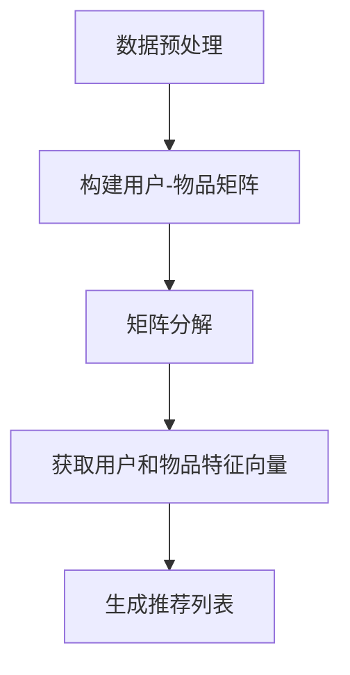
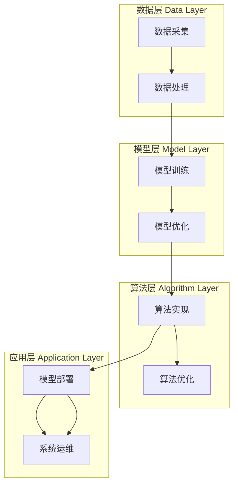
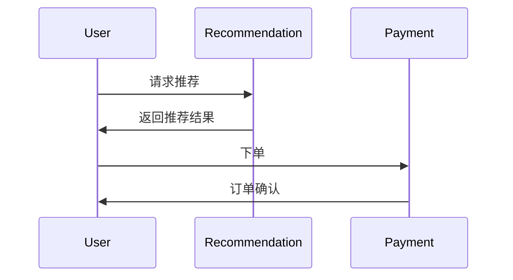

                 


### 让我们一步步深入思考——企业级情境智能框架

**1. 背景介绍**

在数字化转型的浪潮中，企业正面临着前所未有的机遇与挑战。随着大数据、云计算、物联网等技术的迅猛发展，智能化需求已成为企业提升竞争力、优化业务流程、创造更多价值的关键。情境智能（Context-Aware Intelligence）作为智能化的高级形式，能够根据环境变化和用户需求动态调整自身行为，成为企业智能化升级的重要推动力。

**2. 核心概念与联系**

情境智能框架的设计需要考虑以下几个核心概念：

- **数据层**：负责数据的采集、存储和管理。这一层的关键在于如何高效地处理和分析海量数据，以支持后续的智能推理和决策。
- **模型层**：构建和优化AI模型，是情境智能框架的核心。在这一层，我们需要选择合适的模型架构，并通过不断的训练和优化，使其能够准确预测和响应复杂情境。
- **算法层**：实现智能推理和决策的算法是框架的“大脑”。算法的设计和优化决定了框架的响应速度和准确性。
- **应用层**：面向具体业务场景，提供定制化的解决方案。这一层的任务是将智能模型和算法应用于实际业务中，实现智能化的业务流程。

**3. 算法原理讲解**

以情境智能框架中的推荐系统为例，我们可以用以下步骤来阐述算法原理：

- **模型选择**：选择基于协同过滤的推荐算法，如矩阵分解（Matrix Factorization）。
- **模型架构设计**：构建用户-物品矩阵，并通过矩阵分解得到用户和物品的特征向量。
- **模型参数设置**：设定模型中的参数，如隐变量维度、正则化系数等。

算法原理可以用以下mermaid流程图表示：



以下是一个简单的Python代码示例，用于矩阵分解：

```python
import numpy as np

def matrix_factorization(R, num_features, alpha, beta, num_iterations):
    """
    矩阵分解算法
    """
    U = np.random.rand(R.shape[0], num_features)
    V = np.random.rand(R.shape[1], num_features)

    for i in range(num_iterations):
        # 预测评分
        predictions = np.dot(U, V.T)

        # 更新用户特征向量
        for j in range(R.shape[1]):
            if R[j] > 0:
                eij = R[j] - predictions[j]
                for i in range(R.shape[0]):
                    delta_u = alpha * (eij * V[j] + beta * U[i])
                    U[i] += delta_u

        # 更新物品特征向量
        for i in range(R.shape[0]):
            if R[i] > 0:
                eij = R[i] - predictions[i]
                for j in range(R.shape[1]):
                    delta_v = alpha * (eij * U[i] + beta * V[j])
                    V[j] += delta_v

    return U, V

# 参数设置
R = np.array([[5, 3, 0], [4, 0, 1], [1, 5, 0]])
num_features = 2
alpha = 0.01
beta = 0.01
num_iterations = 1000

U, V = matrix_factorization(R, num_features, alpha, beta, num_iterations)
```

通过以上代码，我们可以看到矩阵分解的过程和参数设置。此外，我们还可以用以下latex公式来描述模型优化目标：

$$
\min_{U,V} \frac{1}{2} \sum_{i,j} (R_{ij} - \hat{R}_{ij})^2 + \lambda_1 \sum_{i} \sum_{k} (U_{ik} - \mu)^2 + \lambda_2 \sum_{j} \sum_{l} (V_{jl} - \nu)^2
$$

其中，\(R_{ij}\) 表示实际评分，\(\hat{R}_{ij}\) 表示预测评分，\(\mu\) 和 \(\nu\) 分别表示用户和物品的均值，\(\lambda_1\) 和 \(\lambda_2\) 分别为正则化参数。

**4. 系统分析与架构设计方案**

在项目实施过程中，我们需要综合考虑问题场景、系统功能设计、系统架构设计、系统接口设计和系统交互等因素。

- **问题场景介绍**：企业级情境智能框架主要应用于电商、金融、医疗等领域，旨在通过智能推荐、风险控制、智能诊断等功能，提升业务效率和用户体验。
- **系统功能设计**：包括数据采集、数据处理、模型训练、模型优化、模型部署和系统运维等功能模块。
- **系统架构设计**：采用微服务架构，将数据层、模型层、算法层和应用层分别部署在不同的服务中，以提高系统的可扩展性和灵活性。
- **系统接口设计**：定义标准化的接口协议，确保不同模块之间的数据流通和功能调用。
- **系统交互**：通过消息队列和API网关实现各模块之间的协同工作，确保系统的稳定运行。

以下是一个简单的mermaid类图，用于描述领域模型：

```mermaid
classDiagram
    Customer <|-- Order
    Product <|-- Order
    Order <<-- Payment
    Order <<-- Recommendation
```

以下是一个简单的mermaid架构图，用于描述系统架构：



以下是一个简单的mermaid序列图，用于描述系统交互：



**5. 项目实战**

在企业级情境智能框架的实施过程中，我们需要关注以下几个方面：

- **环境安装**：配置服务器环境，安装必要的软件和库。
- **系统核心实现**：编写核心代码，实现数据采集、数据处理、模型训练、模型优化等功能。
- **代码应用解读与分析**：对实现的代码进行详细解读，分析其优缺点和适用场景。
- **实际案例分析和详细讲解剖析**：通过实际案例，展示框架的应用效果，并对案例进行详细分析。
- **项目小结**：总结项目实施过程中的经验教训，为后续项目提供借鉴。

**6. 最佳实践 tips**

- **数据质量是关键**：确保数据来源可靠，数据预处理工作充分。
- **模型优化要持续**：定期对模型进行优化，以提高预测准确性和响应速度。
- **团队协作是保障**：建立高效的团队协作机制，确保项目顺利进行。

**7. 小结与注意事项**

本文介绍了企业级情境智能框架的背景、核心概念、算法原理、系统架构设计和项目实战等内容。在实施过程中，需要注意数据质量、模型优化和团队协作等方面的问题。通过不断实践和优化，企业级情境智能框架将为企业的智能化升级提供有力支持。

**8. 拓展阅读推荐**

- [1] 《大数据时代：思维变革与商业价值》
- [2] 《深度学习：基础模型与算法》
- [3] 《企业大数据架构设计与优化实践》
- [4] 《人工智能：一种现代的方法》
- [5] 《机器学习实战》

**9. 作者信息**

作者：AI天才研究院/AI Genius Institute & 禅与计算机程序设计艺术 /Zen And The Art of Computer Programming****

# 企业级情境智能框架：增强AI场景适应性

关键词：企业级情境智能、AI场景适应性、框架设计、模型优化、算法实现

摘要：随着企业数字化转型的深入，智能化需求日益增长。本文介绍了企业级情境智能框架的背景与意义，分析了框架的核心概念与原理，阐述了应用实践、模型设计与优化、算法设计与实现等内容，旨在为企业提供一套完整的情境智能解决方案，以提升AI在复杂企业场景中的应用适应性。

## 第一部分：企业级情境智能框架概述

### 第1章：企业级情境智能框架的背景与意义

1.1 问题背景

随着大数据、云计算、物联网等技术的发展，企业数字化转型进程加快。在此背景下，智能化需求日益增长，企业希望通过智能化手段优化业务流程、提升运营效率、创造更多价值。然而，现有AI框架在应对复杂企业级应用场景时，往往存在适应性不足的问题。为此，设计一套企业级情境智能框架，以提升AI场景适应性，成为当前的研究热点。

1.2 问题描述

企业级应用场景多样化，不同业务场景对AI框架的适应性要求不同。现有AI框架如TensorFlow、PyTorch等，虽然在特定领域表现出色，但难以满足复杂企业级应用的需求。为此，我们需要设计一套具有高度适应性的企业级情境智能框架，以满足不同业务场景的需求。

1.3 问题解决

企业级情境智能框架的设计思路如下：

- **数据层**：构建高效的数据采集、存储和管理体系，为智能推理和决策提供数据支持。
- **模型层**：选择合适的AI模型，通过训练和优化，提升模型在复杂企业场景中的应用性能。
- **算法层**：设计灵活的智能推理和决策算法，确保框架在不同业务场景下的适应性。
- **应用层**：面向具体业务场景，提供定制化的解决方案，实现智能化的业务流程。

1.4 边界与外延

企业级情境智能框架适用于各类企业级应用场景，如电商、金融、医疗等。框架具备以下特点：

- **可扩展性**：支持多模块、多服务的分布式架构，便于扩展和升级。
- **灵活性**：可根据不同业务场景调整模型、算法和应用策略，实现定制化解决方案。
- **高效性**：采用分布式计算和数据并行处理技术，提升框架的运行效率和性能。

1.5 概念结构与核心要素组成

企业级情境智能框架由以下四个层次组成：

- **数据层**：负责数据的采集、存储和管理，为智能推理和决策提供数据支持。
- **模型层**：构建和优化AI模型，实现智能推理和决策。
- **算法层**：设计灵活的智能推理和决策算法，提升框架的适应性。
- **应用层**：面向具体业务场景，提供定制化的解决方案。

### 第2章：企业级情境智能框架的核心概念与原理

2.1 情境智能概述

情境智能（Context-Aware Intelligence）是一种能够根据环境变化和用户需求动态调整自身行为的智能系统。情境智能具有以下特点：

- **环境感知**：通过感知设备、传感器等获取环境信息。
- **自适应**：根据环境信息和用户需求，动态调整自身行为。
- **情境理解**：对复杂情境进行理解和分析，为决策提供支持。

2.2 情境智能框架的组成

企业级情境智能框架由数据层、模型层、算法层和应用层组成。各层次的功能如下：

- **数据层**：负责数据的采集、存储和管理，为智能推理和决策提供数据支持。
- **模型层**：构建和优化AI模型，实现智能推理和决策。
- **算法层**：设计灵活的智能推理和决策算法，提升框架的适应性。
- **应用层**：面向具体业务场景，提供定制化的解决方案。

2.3 核心概念属性特征对比表格

| 层次 | 数据层 | 模型层 | 算法层 | 应用层 |
| --- | --- | --- | --- | --- |
| 功能 | 数据采集、存储和管理 | 模型构建、模型训练、模型优化 | 算法设计、算法优化、算法应用 | 面向业务场景的解决方案 |
| 特点 | 高效性、稳定性、安全性 | 适应性、准确性、实时性 | 可扩展性、灵活性、鲁棒性 | 定制化、易用性、可靠性 |

### 第3章：企业级情境智能框架的应用实践

3.1 主流AI框架介绍

当前主流的AI框架包括TensorFlow、PyTorch、Keras等。这些框架在数据处理、模型训练和优化等方面具有较好的性能和适应性。

3.2 框架选型与搭建

框架选型需要考虑以下几个方面：

- **业务场景**：根据不同业务场景选择合适的框架。
- **性能要求**：考虑计算性能、存储性能等。
- **开发难度**：考虑开发效率和开发成本。

框架搭建步骤如下：

- **环境配置**：配置服务器环境，安装必要的软件和库。
- **数据预处理**：进行数据清洗、归一化等预处理工作。
- **模型搭建**：根据业务需求搭建AI模型。
- **训练与优化**：对模型进行训练和优化，提高模型性能。
- **部署与运维**：将模型部署到生产环境，进行运维管理。

### 第4章：企业级情境智能模型设计与优化

4.1 模型设计方法

模型设计需要考虑以下几个方面：

- **模型选择**：根据业务场景和数据特点选择合适的模型。
- **模型架构设计**：设计模型的结构，包括输入层、隐藏层和输出层等。
- **模型参数设置**：设置模型的参数，如学习率、批量大小等。

4.2 模型训练与优化

模型训练与优化包括以下几个方面：

- **训练策略**：设置训练策略，如梯度下降、随机梯度下降等。
- **优化技巧**：采用优化技巧，如正则化、dropout等，提高模型性能。
- **评估方法**：对模型进行评估，如准确率、召回率等。

4.3 模型应用与部署

模型应用与部署包括以下几个方面：

- **模型应用场景**：根据业务需求确定模型应用场景。
- **模型部署策略**：设计模型部署策略，如在线部署、离线部署等。
- **模型运维与管理**：对模型进行运维和管理，确保模型稳定运行。

### 第5章：企业级情境智能算法设计与实现

5.1 算法设计原则

算法设计需要遵循以下原则：

- **算法目标**：明确算法的设计目标，如预测准确性、实时性等。
- **算法可行性**：确保算法的实现可行性，考虑硬件资源和算法复杂度。
- **算法可扩展性**：设计可扩展的算法，便于后续优化和升级。

5.2 算法实现方法

算法实现包括以下几个方面：

- **算法原型设计**：设计算法的原型，包括输入、输出和算法流程。
- **算法实现细节**：详细描述算法的实现过程，包括数据结构、算法逻辑等。
- **算法优化与调整**：对算法进行优化和调整，提高算法性能。

5.3 算法应用案例

算法应用案例包括以下几个方面：

- **算法在业务场景中的应用**：展示算法在具体业务场景中的应用效果。
- **算法实现的挑战与解决策略**：分析算法实现的挑战，并提出解决策略。

### 第6章：企业级情境智能框架的集成与扩展

6.1 框架集成方法

框架集成方法包括以下几个方面：

- **框架与现有系统的集成**：将情境智能框架与现有系统进行集成，实现数据的流通和功能的调用。
- **框架与其他AI框架的集成**：与其他AI框架进行集成，实现多框架协同工作。

6.2 框架扩展策略

框架扩展策略包括以下几个方面：

- **模块化设计**：设计模块化的框架，便于后续扩展和升级。
- **接口定义与规范**：定义清晰的接口规范，便于框架的扩展和集成。
- **框架扩展实践**：通过实际案例展示框架的扩展过程和效果。

6.3 框架性能优化

框架性能优化包括以下几个方面：

- **性能评估指标**：设定框架的性能评估指标，如响应时间、计算效率等。
- **性能优化方法**：采用性能优化方法，如并行计算、分布式计算等。
- **案例分析**：通过实际案例分析框架的性能优化效果。

### 第7章：企业级情境智能框架的实施与最佳实践

7.1 实施策略

实施策略包括以下几个方面：

- **项目规划**：制定项目规划，包括项目目标、时间表、资源分配等。
- **资源分配**：合理分配项目资源，包括人力、资金、设备等。
- **风险管理**：识别和评估项目风险，制定风险管理策略。

7.2 最佳实践

最佳实践包括以下几个方面：

- **成功案例分析**：分析成功的情境智能项目案例，总结经验教训。
- **实施经验总结**：总结项目实施过程中的经验教训，为后续项目提供借鉴。
- **最佳实践分享**：分享情境智能框架实施的最佳实践，提高项目成功率。

7.3 注意事项与拓展阅读

注意事项包括以下几个方面：

- **数据质量**：确保数据质量，为智能推理和决策提供可靠支持。
- **模型优化**：定期对模型进行优化，提高模型性能。
- **团队协作**：建立高效的团队协作机制，确保项目顺利进行。

拓展阅读推荐：

- 《大数据时代：思维变革与商业价值》
- 《深度学习：基础模型与算法》
- 《企业大数据架构设计与优化实践》
- 《人工智能：一种现代的方法》
- 《机器学习实战》

### 作者信息

作者：AI天才研究院/AI Genius Institute & 禅与计算机程序设计艺术 /Zen And The Art of Computer Programming****

