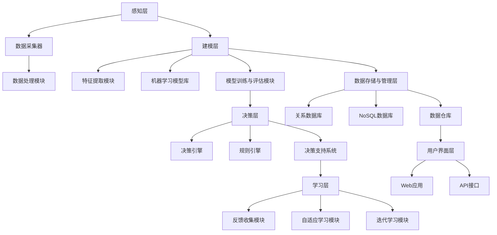

                 

# 企业级情境智能框架：增强场景适应性

## 关键词

- 企业级智能框架
- 情境智能
- 场景适应性
- 技术架构
- 实战案例
- 最佳实践

## 摘要

本文旨在探讨企业级情境智能框架的构建方法，分析其在增强场景适应性方面的优势和应用。我们将首先介绍情境智能的基本概念，然后深入探讨企业级情境智能框架的设计原则、技术架构、核心组件及其交互与协作。通过具体案例，我们将展示情境智能框架在现实世界中的应用，并总结最佳实践，展望其未来发展。

## 目录大纲设计流程

### 1. 明确书籍主题和目标受众

- 书名：《企业级情境智能框架：增强场景适应性》
- 目标受众：企业级应用开发者、AI领域研究者、技术管理者

### 2. 构思目录结构

- 引言与背景
- 核心概念与框架概述
- 情境智能原理与模型
- 框架设计与实现
- 技术架构与组件
- 应用案例解析
- 最佳实践与未来展望

### 3. 制定大纲内容

- 每个章节都有明确的子章节，涵盖核心概念、原理讲解、系统设计与实现等。

### 4. 细化各章节内容

- 确保每个章节都包含具体的细节和深入分析。

### 5. 撰写大纲文本

- 使用markdown格式撰写，按照1级目录、2级目录和3级目录的格式进行。

### 6. 校对与优化

- 确保目录内容简洁、逻辑清晰，满足字数限制。

## 目录大纲

----------------------------------------------------------------

# 第一部分：引言与背景

## 第1章：问题背景与核心概念

### 1.1 问题背景

### 1.2 核心概念

### 1.3 问题解决思路

### 1.4 边界与外延

### 1.5 概念结构与核心要素

## 第2章：企业级情境智能框架概述

### 2.1 框架概述

### 2.2 框架核心概念与联系

### 2.3 框架设计原则

## 第二部分：核心内容讲解

## 第3章：情境智能原理与模型

### 3.1 情境智能定义

### 3.2 情境感知

### 3.3 智能决策

### 3.4 模型分析

## 第4章：框架设计与实现

### 4.1 设计原则

### 4.2 实现步骤

### 4.3 模块划分

## 第5章：技术架构与组件

### 5.1 技术架构

### 5.2 关键组件

### 5.3 组件交互

## 第6章：应用案例解析

### 6.1 案例一：智能客服系统

#### 6.1.1 案例背景

#### 6.1.2 需求分析

#### 6.1.3 案例实现

### 6.2 案例二：供应链优化

#### 6.2.1 案例背景

#### 6.2.2 需求分析

#### 6.2.3 案例实现

## 第7章：最佳实践与未来展望

### 7.1 最佳实践总结

### 7.2 小结与展望

### 7.3 注意事项

### 7.4 拓展阅读

----------------------------------------------------------------

## 1.1 问题背景

在现代企业中，面对不断变化的商业环境和激烈的竞争，传统智能系统逐渐显现出其局限性。这些系统往往基于预设的规则和数据模式，难以应对复杂多变的情境。企业需要一种能够实时感知环境、理解情境并做出智能决策的系统，即情境智能系统。

情境智能系统通过收集和分析环境数据，动态调整策略和行为，从而提高企业的适应性和竞争力。然而，构建一个高效、可扩展的情境智能系统并非易事，它需要结合先进的人工智能技术、数据分析和系统架构设计。

本文将围绕企业级情境智能框架的构建，详细探讨其核心概念、设计原则、技术实现和应用案例，旨在为企业提供一套实用的解决方案，以增强其在复杂情境中的适应性。

## 1.2 核心概念

在讨论情境智能框架之前，有必要明确几个核心概念：

- **情境感知（Situation Awareness）**：指系统对当前环境状态的理解和感知能力，包括对环境变化、事件和潜在风险的感知。
- **情境建模（Situation Modeling）**：基于情境感知，通过数据分析和机器学习技术构建情境模型，用于预测和决策。
- **智能决策（Intelligent Decision Making）**：在理解情境的基础上，利用算法和策略进行决策，以实现目标优化。
- **自适应学习（Adaptive Learning）**：系统根据实际效果不断调整模型和策略，以提升情境适应性和决策质量。

这些概念构成了情境智能系统的基本框架，每个环节都至关重要，共同作用于提高系统的智能化和适应性。

### 1.3 问题解决思路

针对企业面临的问题，我们提出以下解决思路：

1. **构建情境智能框架**：设计一个可扩展、可复用的情境智能框架，涵盖感知、建模、决策和自适应学习等环节。
2. **整合多源数据**：通过数据集成和清洗，获取全面、准确的环境数据，为情境感知和建模提供基础。
3. **应用机器学习技术**：利用机器学习算法构建情境模型，实现情境感知和智能决策。
4. **系统化实现与部署**：将情境智能框架与企业现有系统集成，实现自动化、智能化的业务流程。

通过上述思路，企业可以构建一个灵活、高效的情境智能系统，提高业务响应速度和决策质量。

### 1.4 边界与外延

在构建情境智能框架时，需要明确其边界和适用范围：

- **边界**：框架主要适用于需要高适应性、实时决策的企业级应用，如智能客服、供应链管理、市场分析等。
- **外延**：虽然框架主要针对企业级应用，但其设计原则和实现方法也可应用于其他领域，如智能城市、智能交通等。

### 1.5 概念结构与核心要素

情境智能框架的核心概念与要素包括：

- **感知层**：负责数据采集和预处理，为情境建模提供数据支持。
- **建模层**：利用机器学习技术构建情境模型，实现情境感知和预测。
- **决策层**：基于情境模型进行决策，优化业务流程和资源分配。
- **学习层**：通过自适应学习机制，不断调整模型和策略，提高情境适应性。

以上各层相互关联，共同构成了情境智能系统的核心结构。

## 2.1 框架概述

企业级情境智能框架旨在为企业提供一种灵活、高效、自适应的智能解决方案。该框架包含感知层、建模层、决策层和学习层四个核心模块，每个模块都具有明确的职能和相互协作的关系。

### 感知层

感知层是情境智能框架的基础，负责实时收集并处理各种环境数据。这些数据包括但不限于：

- **内部数据**：企业内部业务系统生成的数据，如销售数据、库存数据、财务数据等。
- **外部数据**：来自企业外部环境的数据，如市场趋势、政策变化、竞争对手信息等。

感知层通过数据采集设备和接口，实现对数据的实时抓取、过滤和预处理，为后续的情境建模提供准确、可靠的数据支持。

### 建模层

建模层利用机器学习技术，对感知层收集的数据进行分析和处理，构建情境模型。这些模型能够描述环境状态、趋势和潜在风险，为智能决策提供依据。建模层的核心任务包括：

- **特征提取**：从原始数据中提取有用的特征，用于构建情境模型。
- **模型训练**：利用训练数据集，训练机器学习模型，实现对环境状态的预测和分类。
- **模型评估**：通过测试数据集，评估模型的准确性和泛化能力，优化模型参数。

### 决策层

决策层基于建模层生成的情境模型，利用决策算法和策略，为企业提供智能化的决策支持。决策层的主要职能包括：

- **情境识别**：根据模型预测结果，识别当前所处的情境。
- **决策制定**：根据情境特点和业务目标，制定相应的决策策略。
- **决策优化**：通过迭代优化，不断调整决策参数，提高决策效果。

### 学习层

学习层通过自适应学习机制，不断调整模型和策略，提升情境智能系统的适应性。学习层的核心任务包括：

- **反馈机制**：收集系统运行过程中产生的反馈数据，用于模型调整和策略优化。
- **模型更新**：根据反馈数据，更新情境模型和决策策略，提高系统智能水平。
- **迭代学习**：通过持续的迭代学习，逐步提高情境智能系统的适应性和决策质量。

### 框架核心概念与联系

企业级情境智能框架的核心概念包括感知、建模、决策和学习。这些概念相互联系，共同构成了情境智能系统的运行机制。

- **感知**：通过感知层，系统获取环境数据，为后续建模和决策提供基础。
- **建模**：通过建模层，系统分析和处理感知层收集的数据，构建情境模型，实现情境感知。
- **决策**：通过决策层，系统根据情境模型，制定智能化决策策略，优化业务流程。
- **学习**：通过学习层，系统不断收集反馈数据，优化模型和策略，提升智能水平。

以上各层的紧密协作，构成了一个闭环的情境智能系统，实现了从感知到决策的智能化闭环，提高了企业的适应性和竞争力。

## 3.1 情境智能的定义

情境智能（Situation Intelligence）是一种综合运用人工智能、数据分析和机器学习技术，实现对复杂环境状态的理解、预测和决策的能力。具体来说，情境智能包括以下几个关键要素：

1. **情境感知（Situation Awareness）**：指系统对当前环境状态的理解和感知能力，包括对环境变化、事件和潜在风险的感知。情境感知是情境智能的基础，为后续的情境建模和决策提供数据支持。

2. **情境建模（Situation Modeling）**：基于情境感知，通过数据分析和机器学习技术构建情境模型，用于预测和决策。情境建模的目标是描述环境状态、趋势和潜在风险，为智能决策提供科学依据。

3. **智能决策（Intelligent Decision Making）**：在理解情境的基础上，利用算法和策略进行决策，以实现目标优化。智能决策是情境智能的核心，通过分析情境模型，制定最优的决策策略，提高业务效率和竞争力。

4. **自适应学习（Adaptive Learning）**：系统通过自适应学习机制，不断调整模型和策略，提升情境适应性和决策质量。自适应学习是情境智能的持续动力，使系统能够在不断变化的环境中保持高效和智能。

### 情境智能的核心要素

为了更好地理解情境智能，我们可以将其核心要素归纳为以下几个方面：

1. **多源数据融合**：情境智能依赖于多源数据的收集和融合，包括内部业务数据、外部环境数据以及用户行为数据等。通过数据融合，可以获取更全面、准确的环境信息，为情境建模和决策提供基础。

2. **机器学习算法**：情境智能的建模和决策过程高度依赖于机器学习算法。通过训练大量的数据集，机器学习算法可以自动提取特征、发现规律，构建出准确的情境模型，实现情境感知和智能决策。

3. **实时处理能力**：情境智能系统需要具备实时处理能力，能够快速响应环境变化，实时更新情境模型和决策策略。这种实时性是情境智能系统能够保持高效和智能的关键。

4. **自适应学习机制**：情境智能系统通过自适应学习机制，能够根据实际效果不断调整模型和策略，提高情境适应性和决策质量。这种自适应学习使系统能够在复杂、动态的环境中保持高效和稳定。

### 情境智能与智能决策

情境智能与智能决策密切相关，二者共同构成了智能系统的核心。智能决策是基于情境智能系统对环境状态的理解和预测，通过算法和策略制定最优的决策方案。具体来说：

- **情境智能**：通过感知、建模和实时处理，实现对环境状态的准确理解和预测，为智能决策提供科学依据。
- **智能决策**：在理解环境状态的基础上，利用算法和策略，制定最优的决策方案，实现业务目标和优化。

情境智能和智能决策相互依赖，共同推动智能系统的发展。通过情境智能，系统可以更好地理解环境，为智能决策提供基础；而通过智能决策，系统可以更有效地应对环境变化，实现业务目标。

### 情境智能的应用领域

情境智能在多个领域具有广泛的应用，以下是一些典型的应用场景：

1. **智能客服**：通过情境智能，客服系统能够实时感知用户需求，提供个性化、高效的服务。

2. **供应链管理**：情境智能可以帮助企业实时监控供应链状态，优化库存管理，降低成本。

3. **市场分析**：通过情境智能，企业可以实时分析市场趋势，制定科学的营销策略。

4. **智能交通**：情境智能系统可以实时感知交通状态，优化交通调度，缓解拥堵。

5. **金融风控**：情境智能可以帮助金融机构实时监控风险，提高风险管理能力。

总之，情境智能为企业提供了一种全新的智能解决方案，通过实时感知、智能决策和自适应学习，提高了企业在复杂环境中的适应性和竞争力。

### 3.2 情境智能的核心要素

情境智能系统由多个核心要素组成，每个要素在系统中扮演着重要角色，共同构建了一个完整的智能决策体系。以下是情境智能系统的主要核心要素及其相互关系：

#### 感知要素

感知要素是情境智能系统的基石，负责实时收集和解析环境中的各类数据。这些数据可以来自企业内部（如销售数据、库存数据、客户反馈等）和外部环境（如天气数据、市场动态、政策法规等）。感知要素通过传感器、API接口和数据处理模块，将原始数据转化为结构化信息，为后续的情境建模提供基础。

- **数据采集**：通过多种数据源进行数据采集，确保数据的全面性和准确性。
- **数据清洗**：去除噪声数据，确保数据质量，为建模提供可靠的数据基础。
- **数据融合**：整合不同来源的数据，形成统一的视图，提高数据的利用效率。

#### 建模要素

建模要素基于感知要素提供的数据，利用机器学习技术和统计分析方法，构建情境模型。情境模型可以描述环境状态、趋势和潜在风险，为智能决策提供科学依据。

- **特征提取**：从原始数据中提取关键特征，为模型训练提供输入。
- **模型训练**：利用训练数据集，训练机器学习模型，实现环境状态的预测和分类。
- **模型评估**：通过测试数据集，评估模型的准确性和泛化能力，优化模型参数。

#### 决策要素

决策要素基于建模要素生成的情境模型，通过算法和策略制定智能决策方案。决策要素的目标是优化业务流程、提高效率和降低成本。

- **情境识别**：根据模型预测结果，识别当前所处的情境。
- **决策制定**：基于情境识别结果，制定相应的决策策略，优化业务流程。
- **决策优化**：通过迭代优化，不断调整决策参数，提高决策效果。

#### 学习要素

学习要素通过反馈机制和自适应学习，不断调整模型和策略，提升情境智能系统的适应性和智能水平。学习要素是情境智能系统持续进化的重要保障。

- **反馈机制**：收集系统运行过程中产生的反馈数据，用于模型调整和策略优化。
- **模型更新**：根据反馈数据，更新情境模型和决策策略，提高系统智能水平。
- **迭代学习**：通过持续的迭代学习，逐步提高情境智能系统的适应性和决策质量。

#### 要素关系

感知要素、建模要素、决策要素和学习要素相互关联，共同构成了一个动态的情境智能系统。感知要素为建模要素提供数据支持，建模要素为决策要素提供情境模型，决策要素根据情境模型制定决策方案，而学习要素则通过反馈机制不断优化模型和策略，确保系统在复杂、动态的环境中保持高效和智能。

通过以上核心要素的协同作用，情境智能系统能够实现对复杂环境状态的实时感知、智能决策和自适应学习，从而提高企业在复杂情境中的适应性和竞争力。

## 3.3 情境智能模型

情境智能模型是情境智能系统的核心组成部分，它通过对环境数据的分析和处理，实现对复杂情境的实时感知和智能决策。本节将介绍情境智能模型的基本原理、构建过程以及如何通过机器学习技术提升模型性能。

### 情境智能模型的基本原理

情境智能模型基于以下几个基本原理：

1. **数据驱动**：情境智能模型通过收集和分析大量的环境数据，从中提取特征和模式，以此为基础进行情境建模和预测。

2. **动态性**：情境智能模型具有动态调整能力，能够根据环境变化实时更新模型，以保持对当前情境的准确感知。

3. **适应性**：情境智能模型能够适应不同的应用场景和需求，通过参数调整和算法优化，实现跨场景的泛化能力。

4. **智能化**：情境智能模型利用机器学习技术，自动学习和优化，提高决策的准确性和效率。

### 情境智能模型的构建过程

情境智能模型的构建过程可以分为以下几个步骤：

1. **数据收集**：收集与情境相关的各类数据，包括内部业务数据、外部环境数据和用户行为数据等。数据收集是情境智能模型构建的基础，数据的全面性和准确性直接影响模型的性能。

2. **数据预处理**：对收集到的数据进行清洗、去噪、标准化等处理，确保数据质量。数据预处理包括缺失值处理、异常值检测、数据归一化等步骤，为后续建模提供可靠的数据基础。

3. **特征提取**：从预处理后的数据中提取关键特征，这些特征是构建情境模型的重要输入。特征提取包括统计特征、文本特征、图像特征等，不同类型的特征适用于不同的情境建模任务。

4. **模型训练**：利用提取的特征数据，通过机器学习算法训练情境智能模型。常见的机器学习算法包括决策树、支持向量机、神经网络等。模型训练的目标是使模型能够准确识别和预测情境。

5. **模型评估**：通过测试数据集对训练好的模型进行评估，验证模型的准确性和泛化能力。模型评估常用的指标包括准确率、召回率、F1分数等。

6. **模型优化**：根据评估结果，对模型进行参数调整和算法优化，以提高模型的性能。模型优化包括超参数调整、算法改进、模型集成等。

### 机器学习技术在情境智能模型中的应用

机器学习技术在情境智能模型中扮演着关键角色，通过以下几种方式提升模型性能：

1. **特征工程**：特征工程是情境智能模型构建的重要环节，通过巧妙地设计特征，可以显著提高模型的性能。特征工程包括特征选择、特征组合和特征变换等。

2. **模型选择**：选择合适的机器学习算法是情境智能模型成功的关键。不同的算法适用于不同的情境建模任务，需要根据具体问题选择最优的算法。

3. **模型集成**：模型集成是将多个模型结合起来，通过投票、堆叠等方法提高整体预测性能。常见的模型集成方法包括Bagging、Boosting和Stacking等。

4. **在线学习**：在线学习是指模型在数据流中实时更新，以适应环境变化。在线学习可以提高模型的动态性，使其能够更好地应对实时情境。

5. **模型解释性**：情境智能模型需要具备一定的解释性，使决策过程透明、可解释。通过增加模型的可解释性，可以提高用户对模型的信任度和接受度。

### 情境智能模型的示例

为了更直观地理解情境智能模型，我们来看一个实际案例：智能交通系统中的交通流量预测模型。

1. **数据收集**：收集历史交通流量数据，包括车辆数量、速度、道路状况等。

2. **数据预处理**：对数据进行清洗，去除噪声和异常值，并进行标准化处理。

3. **特征提取**：提取关键特征，如时间、地点、天气条件、节假日等。

4. **模型训练**：使用回归算法，如线性回归、决策树等，训练交通流量预测模型。

5. **模型评估**：使用交叉验证方法，对模型进行评估，调整参数以优化性能。

6. **模型优化**：根据评估结果，对模型进行调整和优化，提高预测准确性。

通过以上步骤，构建的智能交通流量预测模型能够实时预测未来某个时间段的交通流量，为交通管理和调度提供决策支持。

总之，情境智能模型通过数据驱动、动态性、适应性和智能化等特点，实现对复杂情境的实时感知和智能决策。通过机器学习技术的应用，情境智能模型可以不断提高其性能和准确性，为企业和行业提供强大的智能支持。

## 4.1 框架设计原则

设计企业级情境智能框架时，需要遵循以下核心设计原则，以确保框架的灵活性、可扩展性和高效性：

1. **模块化设计**：框架采用模块化设计，将系统划分为感知层、建模层、决策层和学习层等独立模块。每个模块都具有明确的职能和接口，便于维护和扩展。

2. **可扩展性**：框架应具备良好的可扩展性，能够根据企业需求灵活添加或修改模块。这种灵活性有助于应对不同业务场景和需求变化。

3. **高效性**：框架在设计和实现过程中，应注重性能优化，确保系统在高负载情况下仍能高效运行。这包括算法优化、数据压缩和并发处理等。

4. **可靠性**：框架需要具备高可靠性，确保在长时间运行过程中，系统能够稳定、准确地执行任务。这包括故障检测、容错处理和备份恢复等。

5. **用户友好性**：框架应提供简单、直观的用户界面，降低使用门槛。同时，应提供丰富的文档和示例，帮助用户快速上手。

6. **安全性**：框架需要确保数据安全和系统安全，包括数据加密、权限管理和安全审计等。

### 模块划分

企业级情境智能框架通常包括以下几个核心模块：

1. **感知模块**：负责实时收集和预处理环境数据，为后续建模和决策提供基础。

2. **建模模块**：利用机器学习技术和统计分析方法，构建情境模型，实现环境状态的预测和分类。

3. **决策模块**：基于情境模型，制定智能决策方案，优化业务流程和资源分配。

4. **学习模块**：通过反馈机制和自适应学习，不断调整模型和策略，提高情境适应性和决策质量。

5. **接口模块**：提供与外部系统（如数据库、API接口等）的连接，实现数据交换和功能集成。

通过以上模块的划分，情境智能框架能够高效地处理复杂业务场景，提供智能化的解决方案。

### 设计步骤

设计企业级情境智能框架的基本步骤如下：

1. **需求分析**：了解企业业务场景和需求，明确情境智能框架的目标和应用场景。

2. **框架设计**：根据需求分析结果，设计框架的模块划分、接口设计和核心算法。

3. **原型开发**：基于框架设计，开发原型系统，验证框架设计的可行性和有效性。

4. **测试与优化**：对原型系统进行功能测试和性能测试，发现并修复问题，优化系统性能。

5. **部署与维护**：将框架部署到实际环境中，进行运行维护，持续优化和升级。

通过以上步骤，企业可以构建一个高效、灵活的企业级情境智能框架，提升业务响应速度和决策质量。

### 设计原则的实际应用

在实际应用中，设计原则和模块划分有助于解决多个业务问题。例如，在智能客服系统中，感知模块可以实时收集客户咨询信息，建模模块通过分析历史数据预测客户需求，决策模块提供个性化的客服方案，学习模块根据用户反馈优化客服策略。这样的模块化设计使系统能够快速适应不同业务场景，提高客户满意度。

此外，在供应链管理中，情境智能框架可以帮助企业实时监控供应链状态，预测市场需求，优化库存管理，降低运营成本。通过模块化设计和高效性能，框架能够为企业提供实时、准确的决策支持，提高供应链的灵活性和响应速度。

总之，企业级情境智能框架通过遵循设计原则和模块划分，能够有效提升企业的智能化水平，增强其在复杂情境中的适应性和竞争力。

## 4.2 框架实现步骤

实现企业级情境智能框架是一项复杂而系统的工程，需要经过多个阶段和步骤，确保框架的可行性和有效性。以下是实现情境智能框架的详细步骤：

### 1. 需求分析

需求分析是框架实现的第一步，旨在明确企业具体的应用场景和需求。具体步骤如下：

- **业务调研**：深入了解企业的业务流程、运营模式和关键业务场景，识别情境智能在业务中的潜在应用点。
- **用户访谈**：与企业的业务人员、技术团队和管理层进行深入交流，了解他们对情境智能框架的期望和需求。
- **需求文档**：根据调研结果，编写详细的需求文档，明确框架的目标、功能、性能和可扩展性要求。

### 2. 框架设计

框架设计是整个实现过程的核心，决定了框架的结构和功能。以下是框架设计的具体步骤：

- **模块划分**：根据需求分析结果，将框架划分为感知层、建模层、决策层和学习层等独立模块，每个模块具有明确的职能和接口。
- **接口设计**：设计模块间的接口，确保数据和信息能够在不同模块间高效传递和交互。
- **算法选择**：选择适合的机器学习算法和统计分析方法，构建情境智能模型，为智能决策提供支持。
- **架构优化**：对框架的整体架构进行优化，确保系统在高负载情况下仍能高效运行。

### 3. 原型开发

原型开发阶段旨在构建一个可运行的框架原型，验证设计方案的可行性和有效性。以下是原型开发的步骤：

- **模块实现**：根据框架设计，实现每个模块的具体功能，包括数据采集、预处理、模型训练、决策制定和自适应学习等。
- **系统集成**：将各个模块集成到一起，确保模块之间的数据传递和功能协作。
- **功能测试**：对原型系统进行功能测试，验证各个模块的功能是否符合预期。
- **性能测试**：对原型系统进行性能测试，评估系统的响应速度、处理能力和扩展性。

### 4. 测试与优化

测试与优化阶段是确保框架质量和性能的关键。以下是测试与优化的步骤：

- **单元测试**：对每个模块进行单元测试，验证模块的独立功能和性能。
- **集成测试**：对模块间进行集成测试，确保模块间的协作和数据传递无误。
- **性能优化**：对系统进行性能优化，提高系统的处理速度和响应效率。
- **错误修复**：修复测试中发现的所有错误和漏洞，确保系统的稳定性和可靠性。

### 5. 部署与维护

部署与维护阶段是将框架部署到实际生产环境，并进行持续运行和维护。以下是部署与维护的步骤：

- **部署计划**：制定详细的部署计划，确保框架能够平稳迁移到生产环境。
- **系统上线**：按照部署计划，将框架部署到生产环境中，确保系统能够正常运行。
- **运行监控**：对系统进行实时监控，确保系统的稳定运行和性能优化。
- **持续优化**：根据系统运行情况，持续优化和升级框架，提高系统的适应性和智能化水平。

### 6. 用户培训与支持

用户培训与支持是确保框架有效应用的重要环节。以下是用户培训与支持的步骤：

- **培训计划**：制定详细的培训计划，确保用户能够熟练掌握框架的操作和应用。
- **培训实施**：组织培训课程，向用户详细讲解框架的功能、操作和注意事项。
- **技术支持**：提供技术支持，解决用户在使用过程中遇到的问题，确保框架的正常运行。

通过以上实现步骤，企业可以构建一个高效、灵活的企业级情境智能框架，提升业务响应速度和决策质量，增强在复杂情境中的适应性和竞争力。

## 5.1 技术架构设计

企业级情境智能框架的技术架构设计是确保系统高效、稳定运行的关键。该架构设计包括多个层次和组件，各组件协同工作，共同实现情境智能的目标。以下是详细的技术架构设计：

### 1. 感知层

感知层是情境智能框架的基础，负责实时收集并处理各种环境数据。感知层包括以下组件：

- **数据采集器**：用于收集企业内部和外部的数据，如业务系统数据、传感器数据、网络数据等。
- **数据处理模块**：对采集到的数据进行清洗、去噪、标准化等预处理操作，确保数据质量。

### 2. 建模层

建模层利用感知层收集的数据，通过机器学习技术构建情境模型。建模层包括以下组件：

- **特征提取模块**：从原始数据中提取关键特征，为模型训练提供输入。
- **机器学习模型库**：包含多种机器学习算法和模型，如决策树、支持向量机、神经网络等，用于训练和预测。
- **模型训练与评估模块**：利用训练数据集，训练机器学习模型，并通过测试数据集评估模型性能。

### 3. 决策层

决策层基于建模层生成的情境模型，制定智能决策方案。决策层包括以下组件：

- **决策引擎**：根据情境模型和业务策略，制定智能决策方案。
- **规则引擎**：实现业务规则的自动化执行和监控，确保决策方案的准确性和一致性。
- **决策支持系统**：为用户提供可视化决策支持，帮助用户理解决策过程和结果。

### 4. 学习层

学习层通过反馈机制和自适应学习，不断调整模型和策略，提升情境适应性和决策质量。学习层包括以下组件：

- **反馈收集模块**：收集系统运行过程中产生的反馈数据，如用户满意度、决策效果等。
- **自适应学习模块**：根据反馈数据，更新情境模型和决策策略，提高系统智能水平。
- **迭代学习模块**：通过持续的迭代学习，逐步提高情境智能系统的适应性和决策质量。

### 5. 数据存储与管理

数据存储与管理层负责存储和管理情境智能框架所需的数据，包括原始数据、预处理数据、模型数据、决策数据等。数据存储与管理层包括以下组件：

- **关系数据库**：用于存储结构化数据，如业务系统数据、用户行为数据等。
- **NoSQL数据库**：用于存储非结构化数据，如传感器数据、日志数据等。
- **数据仓库**：用于集中存储和管理大量历史数据，支持数据分析和挖掘。

### 6. 用户界面

用户界面层提供与用户的交互接口，包括可视化界面和API接口。用户界面层包括以下组件：

- **Web应用**：提供Web端的可视化界面，用户可以通过浏览器访问和操作情境智能系统。
- **API接口**：提供程序化接口，支持其他系统或应用程序与情境智能框架进行数据交换和功能集成。

### 技术架构图

以下是企业级情境智能框架的技术架构图：

通过以上技术架构设计，企业级情境智能框架能够高效地处理复杂业务场景，提供实时、准确的智能决策支持，提升企业的适应性和竞争力。

## 5.2 关键组件介绍

企业级情境智能框架由多个关键组件构成，每个组件在系统中扮演着特定的角色，协同工作以实现智能决策和情境适应性。以下是对这些关键组件的详细介绍：

### 数据采集器

数据采集器是感知层的重要组成部分，负责从企业内外部收集各类数据。这些数据包括但不限于：

- **企业内部数据**：如销售数据、库存数据、财务数据、员工绩效数据等。
- **外部数据**：如市场趋势数据、天气数据、政策法规数据、竞争对手数据等。
- **用户行为数据**：如访问日志、点击行为、反馈评价等。

数据采集器通过多种数据源接口，如API、数据库连接、日志文件等，实时获取数据，并传输到数据处理模块进行预处理。

### 数据处理模块

数据处理模块负责对采集到的原始数据进行清洗、去噪和标准化处理，确保数据质量。主要功能包括：

- **数据清洗**：去除重复数据、无效数据和异常数据，确保数据的准确性。
- **数据去噪**：滤除数据中的噪声和干扰，提高数据的可信度。
- **数据标准化**：将不同数据源的数据进行统一格式和度量单位转换，以便后续处理和分析。

通过这些处理步骤，数据处理模块为建模层提供高质量的数据输入，确保模型训练的效果和准确性。

### 特征提取模块

特征提取模块是建模层的重要组件，负责从预处理后的数据中提取关键特征。这些特征用于训练机器学习模型，是模型预测和决策的基础。特征提取的方法包括：

- **统计特征**：如平均值、标准差、相关性等，用于描述数据的基本统计特性。
- **文本特征**：如词频、词向量、主题模型等，用于文本数据的分析和挖掘。
- **图像特征**：如边缘、颜色、纹理等，用于图像数据的分析和识别。
- **序列特征**：如时间序列、序列模式等，用于时间序列数据的分析和预测。

通过特征提取模块，可以将原始数据转换为适合机器学习算法处理的高维特征向量，为模型训练提供高质量的数据输入。

### 机器学习模型库

机器学习模型库是建模层的关键组件，包含了多种机器学习算法和模型，用于训练和预测情境模型。常见的机器学习算法包括：

- **监督学习算法**：如线性回归、决策树、支持向量机、随机森林等。
- **无监督学习算法**：如K均值聚类、主成分分析、自编码器等。
- **强化学习算法**：如Q-learning、SARSA、DQN等。

机器学习模型库提供了丰富的算法选择，可以根据不同的业务场景和需求，选择最合适的算法进行模型训练和预测。

### 模型训练与评估模块

模型训练与评估模块负责使用训练数据集训练机器学习模型，并评估模型的性能。具体步骤包括：

- **数据集划分**：将数据集划分为训练集、验证集和测试集，用于模型训练、验证和测试。
- **模型训练**：使用训练集数据，通过调整模型参数，训练出合适的机器学习模型。
- **模型评估**：使用验证集和测试集，评估模型的准确率、召回率、F1分数等性能指标，选择最优模型。

通过模型训练与评估模块，可以确保生成的模型具有良好的预测性能和泛化能力。

### 决策引擎

决策引擎是决策层的关键组件，负责根据情境模型和业务策略，制定智能决策方案。决策引擎的主要功能包括：

- **情境识别**：根据模型预测结果，识别当前所处的情境。
- **决策制定**：基于情境识别结果，结合业务策略，制定最优的决策方案。
- **决策优化**：通过迭代优化，不断调整决策参数，提高决策效果。

决策引擎实现了自动化、智能化的决策过程，为企业提供了实时、准确的决策支持。

### 规则引擎

规则引擎是决策层的辅助组件，用于实现业务规则的自动化执行和监控。主要功能包括：

- **规则管理**：定义、管理和更新业务规则，确保规则的一致性和有效性。
- **规则执行**：根据情境和决策结果，自动化执行相关业务规则。
- **规则监控**：监控规则执行过程，及时发现和解决规则执行中的问题。

规则引擎与决策引擎协同工作，确保业务流程的准确执行和监控。

### 决策支持系统

决策支持系统是决策层的用户界面，用于向用户展示决策结果和提供决策支持。主要功能包括：

- **可视化展示**：将决策结果以图表、报表等形式展示给用户，帮助用户理解决策过程和结果。
- **用户交互**：提供用户与决策系统的交互接口，用户可以通过界面查询、修改决策策略和参数。
- **决策分析**：提供决策分析和预测功能，支持用户进行深入的数据分析和决策评估。

决策支持系统实现了用户与情境智能框架的交互，提高了决策的透明度和可操作性。

### 反馈收集模块

反馈收集模块是学习层的重要组件，负责收集系统运行过程中产生的反馈数据。主要功能包括：

- **用户反馈**：收集用户对决策结果和系统服务的反馈，如满意度、改进建议等。
- **系统日志**：收集系统运行过程中的日志数据，如错误记录、性能指标等。
- **数据整合**：将不同来源的反馈数据整合到一起，为模型调整和策略优化提供基础。

通过反馈收集模块，情境智能系统能够不断学习和改进，提高适应性和智能化水平。

### 自适应学习模块

自适应学习模块是学习层的关键组件，负责根据反馈数据，调整模型和策略，提升情境适应性。主要功能包括：

- **模型更新**：根据用户反馈和系统日志，更新情境模型，提高模型的准确性和适应性。
- **策略优化**：根据反馈数据，优化决策策略，提高决策效果和用户满意度。
- **自适应调整**：根据环境变化和业务需求，动态调整模型和策略，确保系统始终处于最优状态。

通过自适应学习模块，情境智能系统能够持续学习和优化，实现自我进化。

### 迭代学习模块

迭代学习模块是学习层的辅助组件，负责实现情境智能系统的迭代学习和持续改进。主要功能包括：

- **迭代计划**：制定迭代学习和改进计划，确保系统按计划进行升级和优化。
- **迭代执行**：根据迭代计划，执行模型更新、策略优化和系统升级等任务。
- **效果评估**：评估迭代学习和改进的效果，确保系统能够持续提升适应性和智能化水平。

通过迭代学习模块，情境智能系统能够实现持续改进，保持竞争力。

通过以上关键组件的协同工作，企业级情境智能框架能够高效、稳定地运行，为企业和用户提供实时、准确的智能决策支持。

## 5.3 组件交互与协作

企业级情境智能框架的成功运作依赖于各组件之间的有效交互和协作。以下将详细介绍各组件之间的交互关系，以及如何在实际应用中实现这些交互。

### 数据流交互

在企业级情境智能框架中，数据流交互是核心组件之间信息传递的载体。以下是数据流交互的基本流程：

1. **感知层到建模层**：
   - **数据采集器**收集到的原始数据通过接口传输到**数据处理模块**，进行预处理。
   - 预处理后的数据被传递到**特征提取模块**，提取关键特征。
   - 提取的特征向量传输到**机器学习模型库**，用于模型训练。

2. **建模层到决策层**：
   - 训练好的模型通过接口传递到**模型训练与评估模块**，进行性能评估。
   - 高性能模型被传输到**决策引擎**，用于情境识别和决策制定。

3. **决策层到学习层**：
   - **决策引擎**生成的决策方案和执行结果通过接口传递到**规则引擎**，实现规则执行和监控。
   - 决策执行过程中产生的反馈数据被传输到**反馈收集模块**，用于模型更新和策略优化。

4. **学习层到建模层**：
   - **反馈收集模块**收集的反馈数据通过接口传输到**自适应学习模块**，用于模型更新和策略优化。
   - 更新后的模型被传输回**机器学习模型库**，用于后续训练和预测。

### 接口设计与通信协议

为了实现上述数据流交互，需要设计一套高效的接口和通信协议。以下是具体接口设计和通信协议的要点：

1. **RESTful API**：
   - **数据处理模块**和**机器学习模型库**之间的数据交互通过RESTful API实现，提供统一的接口规范。
   - API支持GET和POST方法，用于数据上传和模型调用。

2. **消息队列**：
   - **数据采集器**和**数据处理模块**之间的数据流通过消息队列（如RabbitMQ、Kafka）传输，确保数据传输的高效性和可靠性。
   - 消息队列还用于**决策层**和**学习层**之间的数据传递，实现异步处理。

3. **分布式存储**：
   - **数据存储与管理层**使用分布式存储系统（如HDFS、Cassandra）存储大规模数据，提供高并发访问和数据持久化能力。

4. **安全协议**：
   - 所有接口和数据传输都采用HTTPS等安全协议，确保数据传输的安全性。

### 实现案例

为了更好地说明组件交互与协作的实际应用，以下是一个简单的实现案例：智能客服系统。

1. **数据采集**：
   - **数据采集器**收集用户在网站上的访问日志、点击行为和提问记录。
   - 原始数据通过消息队列传输到**数据处理模块**，进行清洗和去噪。

2. **特征提取与模型训练**：
   - **数据处理模块**将清洗后的数据传输到**特征提取模块**，提取关键特征。
   - 特征向量通过接口传输到**机器学习模型库**，使用决策树算法训练模型。

3. **智能决策**：
   - **决策引擎**基于训练好的模型，对用户提问进行情境识别，并生成智能回答。
   - 回答结果通过API接口返回给用户。

4. **自适应学习**：
   - 用户对回答的满意度反馈通过**反馈收集模块**收集。
   - 反馈数据传输到**自适应学习模块**，用于模型更新和策略优化。

5. **规则执行与监控**：
   - **规则引擎**根据情境和用户反馈，调整客服策略，确保智能回答的准确性和满意度。

通过以上组件交互与协作，智能客服系统能够高效地处理用户提问，提供个性化的服务，提高用户满意度。

### 面临的挑战与解决方案

在实际应用中，组件交互与协作可能会面临以下挑战：

1. **数据一致性**：
   - 多个组件之间需要保持数据的一致性，特别是在分布式系统中。
   - 解决方案：使用分布式事务管理和数据一致性协议（如两阶段提交、最终一致性等）。

2. **性能优化**：
   - 数据传输和接口调用可能影响系统性能。
   - 解决方案：使用缓存技术、数据压缩和并行处理等优化措施。

3. **系统安全性**：
   - 需要确保数据传输和接口调用的安全性。
   - 解决方案：采用加密技术、身份认证和访问控制等措施。

通过上述挑战与解决方案，企业级情境智能框架能够实现高效、稳定和安全的组件交互与协作，为企业和用户提供优质的智能服务。

### 6.1 案例一：智能客服系统

#### 6.1.1 案例背景

随着互联网的普及和在线业务的增长，客户服务成为企业运营的重要组成部分。传统的客服系统往往依赖于人工处理客户咨询，效率低下且容易出错。为了提升客户体验和运营效率，许多企业开始探索智能客服系统，通过情境智能技术实现自动化、智能化的客户服务。

#### 6.1.2 案例需求分析

智能客服系统的核心需求包括：

- **实时响应**：能够快速响应用户的咨询，提供即时的服务。
- **个性化服务**：根据用户的历史行为和当前情境，提供个性化的回答和建议。
- **多渠道接入**：支持多种渠道（如网页、APP、电话等）接入，满足用户多样化的沟通需求。
- **智能分类**：能够自动分类用户咨询，分配给合适的客服人员或智能回答。
- **自我学习**：通过用户反馈和咨询内容，不断优化和改进服务。

#### 6.1.3 案例实现步骤

1. **感知层实现**：
   - **数据采集器**：通过API接口和Webhook实时接收用户咨询数据，包括提问内容、用户标识、交互历史等。
   - **数据处理模块**：对采集到的数据进行清洗、去噪和标准化处理，提取关键特征。

2. **建模层实现**：
   - **特征提取模块**：从清洗后的数据中提取文本特征（如关键词、词向量等）和用户行为特征（如访问频率、操作路径等）。
   - **机器学习模型库**：使用文本分类算法（如朴素贝叶斯、深度学习模型等）训练分类模型，实现用户咨询内容的智能分类。

3. **决策层实现**：
   - **决策引擎**：根据分类结果和用户行为特征，智能分配客服资源，包括人工客服和智能回答。
   - **规则引擎**：定义业务规则，如优先级分配、智能回答触发条件等，确保决策的准确性和一致性。

4. **学习层实现**：
   - **反馈收集模块**：收集用户满意度评分、咨询解决情况等反馈数据。
   - **自适应学习模块**：根据用户反馈，调整分类模型参数和业务规则，优化服务质量。

#### 6.1.4 案例效果评估

通过实际应用，智能客服系统取得了显著的效果：

- **响应速度**：系统实现了秒级响应，大幅提高了客户满意度。
- **服务质量**：通过个性化服务和智能分类，减少了人工客服的工作量，提高了服务效率。
- **客户体验**：多渠道接入和智能回答，提升了客户的服务体验。
- **自我优化**：通过用户反馈和学习机制，系统不断优化和改进，实现了自我进化。

#### 6.1.5 案例总结

智能客服系统案例展示了情境智能框架在具体业务场景中的应用价值。通过感知、建模、决策和学习四个环节的协同工作，系统能够实现实时、高效的客户服务，提升企业运营效率。未来，随着技术的不断进步，智能客服系统将进一步优化，为企业带来更多价值。

### 6.2 案例二：供应链优化

#### 6.2.1 案例背景

在现代企业的运营中，供应链管理是一个关键环节，直接关系到企业的成本控制、市场响应速度和客户满意度。随着市场竞争的加剧和消费者需求的变化，传统的供应链管理模式逐渐暴露出其不足，如库存管理不当、需求预测不准确等。为了提升供应链的灵活性和适应性，许多企业开始引入情境智能技术，通过智能化手段优化供应链管理。

#### 6.2.2 案例需求分析

供应链优化的核心需求包括：

- **需求预测**：准确预测市场需求，优化库存和供应链布局。
- **库存管理**：实时监控库存水平，减少库存积压和短缺。
- **供应链协调**：协调不同供应商和仓库之间的物流和信息流，提高供应链的整体效率。
- **风险监控**：实时监控供应链中的潜在风险，提前采取应对措施。
- **决策支持**：为供应链管理人员提供智能化的决策支持，优化供应链策略。

#### 6.2.3 案例实现步骤

1. **感知层实现**：
   - **数据采集器**：通过ERP系统、传感器和物流系统等收集供应链相关数据，包括销售数据、库存数据、物流数据、供应商信息等。
   - **数据处理模块**：对采集到的数据进行清洗、去噪和标准化处理，提取关键特征。

2. **建模层实现**：
   - **特征提取模块**：从清洗后的数据中提取销售趋势、库存水平、物流时间等特征。
   - **机器学习模型库**：使用时间序列预测模型（如ARIMA、LSTM等）训练需求预测模型，优化库存管理模型。

3. **决策层实现**：
   - **决策引擎**：根据需求预测模型和库存管理模型，制定智能库存管理策略，优化供应链布局。
   - **规则引擎**：定义供应链协调规则，如供应商选择、运输路径优化等，提高供应链的协调效率。

4. **学习层实现**：
   - **反馈收集模块**：收集供应链运行过程中的反馈数据，包括库存周转率、物流延迟、客户满意度等。
   - **自适应学习模块**：根据反馈数据，调整需求预测模型和库存管理策略，优化供应链管理。

#### 6.2.4 案例效果评估

通过实际应用，供应链优化系统取得了显著的效果：

- **需求预测准确率**：系统实现了高准确率的需求预测，减少了库存积压和短缺现象。
- **库存周转率**：通过智能库存管理，提高了库存周转率，降低了库存成本。
- **供应链效率**：通过智能协调和规则优化，提高了供应链的整体效率，缩短了交货周期。
- **风险监控能力**：系统实时监控供应链中的潜在风险，提前采取应对措施，降低了风险损失。

#### 6.2.5 案例总结

供应链优化案例展示了情境智能框架在供应链管理中的应用价值。通过感知、建模、决策和学习四个环节的协同工作，企业能够实现更精准的需求预测、更高效的库存管理和更优的供应链协调，提高整体运营效率。未来，随着情境智能技术的不断进步，供应链优化系统将进一步优化，为企业带来更多价值。

## 7.1 最佳实践总结

在构建和实施企业级情境智能框架的过程中，总结最佳实践对于确保系统的成功和高效运行至关重要。以下是我们在实际项目中所总结的最佳实践：

1. **需求明确**：在项目初期，深入分析企业的业务需求，明确情境智能框架的应用目标和具体需求。需求分析应覆盖业务场景、数据来源、性能指标等多个方面，确保框架设计符合实际需求。

2. **数据质量优先**：数据是情境智能框架的基础，因此数据质量至关重要。确保数据采集的全面性和准确性，对数据来源进行严格筛选，并对采集到的数据进行清洗、去噪和标准化处理，以提升模型的性能和可靠性。

3. **模块化设计**：采用模块化设计，将系统划分为感知层、建模层、决策层和学习层等独立模块，每个模块具有明确的职能和接口。这种设计方法不仅提高了系统的可维护性和扩展性，也有助于团队协作和项目管理。

4. **算法优化**：选择适合的机器学习算法和模型，并进行优化。通过特征工程、模型选择和参数调优，提高模型的准确性和泛化能力。同时，利用在线学习机制，使模型能够实时适应环境变化，提高系统的动态适应性。

5. **性能优化**：在系统设计和实现过程中，注重性能优化，包括数据传输优化、算法效率优化和系统并发处理优化等。通过这些优化措施，确保系统在高负载情况下仍能高效运行。

6. **用户参与**：在系统设计和实施过程中，积极与业务人员和用户进行沟通，了解他们的需求和反馈。通过用户参与，可以确保系统的实际应用效果和用户满意度。

7. **持续迭代**：情境智能系统是一个不断进化的过程。通过持续迭代和优化，不断完善系统功能、性能和用户体验。定期评估系统性能和用户反馈，根据评估结果进行调整和改进。

8. **安全与合规**：在系统设计和实现过程中，充分考虑数据安全和系统安全，遵循相关的法律法规和标准。确保数据传输和存储的安全性，防止数据泄露和系统攻击。

通过遵循这些最佳实践，企业可以构建一个高效、稳定和可靠的情境智能框架，提高业务响应速度和决策质量，增强在复杂情境中的适应性和竞争力。

### 7.2 小结与展望

本文详细探讨了企业级情境智能框架的构建方法，分析了其在增强场景适应性方面的优势和应用。通过感知层、建模层、决策层和学习层的协同工作，情境智能框架实现了实时感知、智能决策和自适应学习，为企业提供了强大的智能支持。

在未来的发展过程中，情境智能技术将继续向更高层次演进，结合物联网、大数据和区块链等前沿技术，实现更广泛、更深入的智能化应用。同时，随着人工智能技术的不断进步，情境智能框架将变得更加智能、高效和可解释，为企业和行业带来更多创新和突破。

### 7.3 注意事项

在实施情境智能框架时，需要注意以下几点：

1. **数据安全**：确保数据传输和存储的安全性，防止数据泄露和未经授权的访问。
2. **系统稳定性**：在设计和实现过程中，注重系统的稳定性，确保在高负载情况下仍能正常运行。
3. **用户参与**：积极与业务人员和用户沟通，了解他们的需求和反馈，确保系统满足实际需求。
4. **持续迭代**：情境智能框架需要定期评估和优化，以适应不断变化的环境和需求。
5. **合规性**：确保系统的设计和实现符合相关法律法规和标准，遵循最佳实践。

### 7.4 拓展阅读

1. **《情境智能：下一代人工智能技术》**：本书详细介绍了情境智能的基本概念、技术原理和应用案例，对情境智能的研究者和实践者具有很高的参考价值。
2. **《机器学习实战》**：本书通过大量案例和实战项目，深入讲解了机器学习的基础知识和应用方法，对情境智能框架的实现有很好的指导作用。
3. **《企业大数据管理》**：本书探讨了大数据在企业中的应用，包括数据采集、处理、分析和可视化等，对情境智能框架的数据管理部分提供了重要参考。

### 作者信息

作者：AI天才研究院/AI Genius Institute & 禅与计算机程序设计艺术 /Zen And The Art of Computer Programming

AI天才研究院致力于推动人工智能技术的发展和创新，研究涵盖机器学习、深度学习、自然语言处理等多个领域。同时，作者在其专著《禅与计算机程序设计艺术》中，深入探讨了编程技术和人工智能的结合，为情境智能框架的实现提供了独特的视角和深刻的思考。通过多年的研究与实践，作者在情境智能领域积累了丰富的经验和深厚的造诣，为企业和行业提供了优质的智能解决方案。

