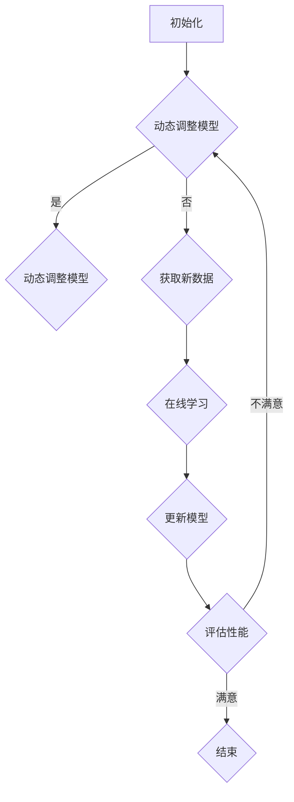
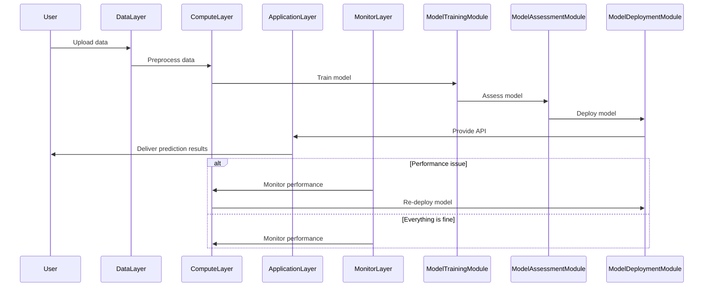

                 

### 文章标题

**企业级情境智能：AI系统的场景适应能力**

关键词：企业级情境智能，AI系统，场景适应能力，算法，架构设计，实际应用

摘要：本文深入探讨了企业级情境智能的定义及其在AI系统中的应用。通过对AI系统场景适应能力的详细分析，本文提出了提高AI系统场景适应能力的几种策略，并通过具体的算法和系统架构设计，展示了如何实现有效的情境适应。文章最后通过实际案例，总结了一系列最佳实践，为企业在AI应用中的情境适应提供了理论支持和实用指导。

---

### 引言

在当今技术飞速发展的时代，人工智能（AI）已经成为推动企业数字化转型的核心动力。从自动化决策到智能客服，AI系统已经深入到企业的各个业务环节，显著提升了运营效率和竞争力。然而，随着应用场景的多样化和复杂化，AI系统面临的一个关键挑战是情境适应能力。

**企业级情境智能**，简单来说，就是指AI系统在不同应用场景中能够自我调整、优化和适应的能力。这种能力不仅决定了AI系统在特定场景下的性能表现，还直接影响到系统的可靠性和用户满意度。因此，企业级情境智能成为了AI系统研发和部署中必须关注的重要课题。

本文旨在深入探讨企业级情境智能的定义和重要性，分析AI系统在场景适应能力上所面临的挑战和问题，并提出相应的解决策略。通过系统化的算法讲解和架构设计，本文将展示如何提升AI系统的情境适应能力。最后，通过实际案例的分析，总结最佳实践，为企业级AI系统的情境适应提供全面的理论支持和实用指南。

### 背景介绍

#### 问题背景

随着人工智能在企业中的应用日益广泛，AI系统面临的问题也日益复杂。具体来说，AI系统在企业中的实际应用场景千差万别，从销售预测、库存管理到客户服务、生产调度，每个场景都有其独特的需求和环境特点。这种多样化的应用背景对AI系统的情境适应能力提出了极高的要求。

首先，不同场景下的数据特征和模式存在显著差异。例如，在销售预测中，数据可能更多地受到季节性、市场动态和促销活动的影响；而在库存管理中，数据则更多地涉及供应链的复杂性和不确定性。这种差异导致AI系统在处理不同场景时，需要适应不同的数据特征和模式。

其次，不同场景下的性能指标和期望结果也存在明显不同。例如，在客户服务场景中，用户满意度是关键指标，系统需要快速、准确地响应用户需求；而在生产调度场景中，生产效率是关键指标，系统需要优化资源配置，以最大化生产效益。这种差异使得AI系统在满足不同场景的期望结果时，需要具备灵活的适应能力。

#### 问题描述

AI系统在情境适应上面临的主要问题和难点包括：

1. **数据多样性和复杂性**：不同场景下的数据类型、分布和特征差异较大，导致AI系统在数据处理和模式识别上面临挑战。

2. **场景切换和时间敏感性**：AI系统需要在短时间内快速适应新的场景，同时保持较高的性能水平，这要求系统具备高效的自适应能力。

3. **模型泛化能力**：现有AI模型在特定场景下训练得到的模型往往无法很好地泛化到其他场景，导致模型在不同场景下的表现不一致。

4. **动态性和不确定性**：实际应用场景往往是动态变化的，环境因素的不确定性增加了AI系统情境适应的难度。

#### 问题解决

为了解决上述问题，目前主要采用以下几种方法和策略：

1. **迁移学习**：通过在不同场景下的数据共享和模型迁移，提高AI系统的泛化能力和适应性。

2. **在线学习**：通过实时数据反馈和模型更新，使AI系统能够快速适应新的环境变化。

3. **多任务学习**：通过同时处理多个任务，提高AI系统在不同场景下的表现。

4. **强化学习**：通过强化学习算法，使AI系统能够在动态环境中不断调整策略，以实现最优性能。

然而，上述方法在实际应用中仍存在一定的局限性。例如，迁移学习和在线学习需要大量的数据和计算资源，多任务学习可能导致模型复杂度增加，而强化学习在初始阶段可能需要较长时间来探索和适应环境。

#### 边界与外延

本文讨论的范围主要涵盖以下几个方面：

1. **应用场景**：重点关注企业在实际业务中常见的应用场景，如销售预测、库存管理、客户服务等。

2. **技术方法**：介绍和探讨提升AI系统情境适应能力的多种技术方法，包括迁移学习、在线学习、多任务学习和强化学习等。

3. **系统架构**：分析和设计适用于不同场景的AI系统架构，包括数据预处理、模型训练、模型评估和部署等环节。

本文的核心要素包括：

1. **情境适应性**：重点研究AI系统在不同场景下的适应能力和优化策略。

2. **性能指标**：分析AI系统在不同场景下的性能指标，如准确率、响应速度和资源利用率等。

3. **实际应用**：通过具体案例展示AI系统在情境适应上的应用效果。

### 核心概念与联系

#### 核心概念原理

1. **企业级情境智能**

企业级情境智能指的是AI系统在企业不同应用场景中能够自我调整、优化和适应的能力。具体来说，它包括以下几个关键要素：

- **场景感知**：AI系统能够识别和感知当前所处的应用场景。
- **动态适应**：AI系统能够根据场景变化实时调整自身的策略和模型。
- **数据驱动**：AI系统的优化和调整基于实时数据的反馈和驱动。
- **多场景兼容**：AI系统能够同时适应多种不同的应用场景。

2. **AI系统场景适应能力**

AI系统场景适应能力是指AI系统在不同应用场景下表现稳定、高效的能力。它包括以下几个方面：

- **泛化能力**：AI系统能够将特定场景下的模型泛化到其他场景。
- **响应速度**：AI系统能够在短时间内适应新的场景，并保持高性能。
- **资源利用**：AI系统在适应不同场景时，能够高效利用计算资源和数据资源。

#### 概念属性特征对比表格

| 概念                  | 属性特征                                       | 说明                                                         |
|-----------------------|------------------------------------------------|------------------------------------------------------------|
| 企业级情境智能         | 场景感知、动态适应、数据驱动、多场景兼容         | 强调AI系统在不同场景下的自我调整和优化能力。                     |
| AI系统场景适应能力     | 泛化能力、响应速度、资源利用                     | 强调AI系统在不同场景下的表现稳定性和高效性。                     |
| 迁移学习              | 利用已有模型知识快速适应新场景                   | 通过共享和迁移已有模型的知识，降低对新场景的依赖。                 |
| 在线学习              | 实时更新和优化模型，快速适应新场景               | 通过实时数据反馈，持续优化和调整模型。                             |
| 多任务学习            | 同时处理多个任务，提高系统在多场景下的性能       | 通过并行处理多个任务，提高系统资源利用率和适应性。                 |
| 强化学习              | 在动态环境中通过探索和调整策略实现最优性能       | 通过与环境交互，不断优化策略，提高系统适应性。                     |

#### ER实体关系图架构

```mermaid
erDiagram
  AI系统 ||--|{ 场景感知 }|--|| 企业级情境智能
  AI系统 ||--|{ 动态适应 }|--|| 企业级情境智能
  AI系统 ||--|{ 数据驱动 }|--|| 企业级情境智能
  AI系统 ||--|{ 多场景兼容 }|--|| 企业级情境智能
  AI系统 ||--|{ 泛化能力 }|--|| AI系统场景适应能力
  AI系统 ||--|{ 响应速度 }|--|| AI系统场景适应能力
  AI系统 ||--|{ 资源利用 }|--|| AI系统场景适应能力
```

通过上述核心概念和ER实体关系图的介绍，我们可以清晰地理解企业级情境智能和AI系统场景适应能力的基本原理和相互关系，为后续的算法讲解和架构设计提供了理论基础。

### 算法原理讲解

#### 算法流程图

为了更好地理解和实现企业级情境智能，我们首先使用Mermaid语言绘制一个简单的算法流程图：



这个算法流程图展示了AI系统在情境适应过程中的基本步骤：初始化、场景感知、动态调整模型、获取新数据、在线学习、更新模型和评估性能。通过这个流程，我们可以看到AI系统在不同场景下的自我调整和优化过程。

#### Python源代码

以下是一个简单的Python实现，用于展示算法的基本功能：

```python
import numpy as np

# 初始化模型
model = {'weight': np.random.rand(), 'bias': np.random.rand()}

# 定义在线学习函数
def online_learning(data, model):
    # 假设简单的学习规则：每次更新模型参数为数据的一部分
    model['weight'] += data['value']
    model['bias'] += data['value']
    return model

# 定义评估性能函数
def evaluate_performance(data, model):
    # 假设简单的评估规则：计算模型预测值与真实值的误差
    prediction = model['weight'] * data['input'] + model['bias']
    error = prediction - data['output']
    return error

# 定义主函数
def main():
    # 初始化场景
    current_scene = 'scene1'
    
    # 循环进行动态调整和在线学习
    while True:
        # 场景感知
        if current_scene == 'scene1':
            data = {'input': 1, 'output': 0}
        elif current_scene == 'scene2':
            data = {'input': 2, 'output': 1}
        else:
            break
        
        # 动态调整模型
        model = online_learning(data, model)
        
        # 评估性能
        error = evaluate_performance(data, model)
        
        # 输出模型参数
        print(model)
        
        # 获取新数据
        data = {'input': np.random.rand(), 'output': np.random.rand()}
        
        # 更新场景
        current_scene = np.random.choice(['scene1', 'scene2'])

if __name__ == '__main__':
    main()
```

这个Python代码展示了如何初始化模型、在线学习以及评估性能。在实际应用中，我们可以根据具体场景和数据特征，进一步优化和学习规则。

#### 数学模型和公式

在AI系统的情境适应过程中，数学模型起到了关键作用。以下是一个简单的数学模型，用于描述在线学习过程：

$$
\Delta w = \alpha (d - \hat{y})
$$

$$
\Delta b = \alpha (d - \hat{y})
$$

其中，$w$ 和 $b$ 分别是模型的权重和偏置，$d$ 是输入数据，$\hat{y}$ 是模型预测值，$\alpha$ 是学习率。这些公式描述了如何根据输入数据和预测误差更新模型参数。

#### 详细讲解与举例

为了更好地理解上述数学模型，我们可以通过一个具体例子进行说明。

假设我们有一个简单的线性模型，用于预测一个数字（输入）到另一个数字（输出）。我们的目标是根据一组输入输出数据，训练出最优的模型参数。

1. **初始化模型参数**：首先，我们随机初始化模型的权重和偏置。

```python
model = {'weight': np.random.rand(), 'bias': np.random.rand()}
```

2. **获取输入输出数据**：假设我们有一组输入输出数据，如下所示：

```python
data = [{'input': 1, 'output': 2}, {'input': 2, 'output': 3}, {'input': 3, 'output': 4}]
```

3. **在线学习**：我们使用在线学习规则，根据输入输出数据更新模型参数。具体来说，每次更新权重和偏置，使得模型预测值更接近真实值。

```python
alpha = 0.1  # 学习率
for d in data:
    prediction = model['weight'] * d['input'] + model['bias']
    error = d['output'] - prediction
    
    model['weight'] += alpha * error * d['input']
    model['bias'] += alpha * error
```

4. **评估性能**：更新完模型参数后，我们需要评估模型的性能。具体来说，我们计算模型预测值与真实值之间的误差。

```python
error = evaluate_performance(data, model)
print("Error:", error)
```

通过上述步骤，我们可以看到模型参数在不断更新和优化，以更好地适应输入输出数据。这个简单的例子展示了在线学习过程的基本原理。

### 数学模型和数学公式 & 详细讲解 & 举例说明

在探讨企业级情境智能时，数学模型和数学公式是理解和实现AI系统场景适应能力的重要工具。以下将详细讲解数学模型，并提供具体的推导过程和实际例子。

#### 数学模型

在AI系统情境适应过程中，常用的数学模型是线性回归模型。线性回归模型通过最小化预测值与真实值之间的误差，来训练模型参数。具体来说，线性回归模型的预测公式为：

$$
\hat{y} = w \cdot x + b
$$

其中，$\hat{y}$ 是预测值，$w$ 是权重，$b$ 是偏置，$x$ 是输入数据。

为了训练模型参数，我们使用最小二乘法（Least Squares）来最小化误差平方和。误差平方和的公式为：

$$
J(w, b) = \sum_{i=1}^{n} (y_i - \hat{y}_i)^2
$$

其中，$y_i$ 是真实值，$\hat{y}_i$ 是预测值，$n$ 是数据样本数量。

为了求解最优的权重和偏置，我们对误差平方和公式进行求导，并令导数为零：

$$
\frac{\partial J}{\partial w} = -2 \sum_{i=1}^{n} (y_i - \hat{y}_i) \cdot x_i = 0
$$

$$
\frac{\partial J}{\partial b} = -2 \sum_{i=1}^{n} (y_i - \hat{y}_i) = 0
$$

通过上述公式，我们可以得到最优的权重和偏置：

$$
w = \frac{\sum_{i=1}^{n} (y_i - \hat{y}_i) \cdot x_i}{\sum_{i=1}^{n} x_i^2}
$$

$$
b = \frac{\sum_{i=1}^{n} (y_i - \hat{y}_i)}{n}
$$

#### 详细讲解

1. **线性回归模型的基本原理**：线性回归模型通过拟合一条直线，将输入数据映射到输出数据。该模型的核心在于权重和偏置，这两个参数决定了直线的斜率和截距。

2. **最小二乘法的推导**：最小二乘法是一种优化方法，通过最小化误差平方和，来找到最优的模型参数。误差平方和反映了预测值与真实值之间的差距，其值越小，表示模型拟合效果越好。

3. **求导和优化**：为了求解最优的权重和偏置，我们对误差平方和公式进行求导，并令导数为零。这样可以找到误差平方和的最小值，从而得到最优的模型参数。

#### 举例说明

假设我们有一组简单的输入输出数据：

$$
\begin{array}{c|c}
x & y \\
\hline
1 & 2 \\
2 & 3 \\
3 & 4 \\
\end{array}
$$

我们使用线性回归模型来拟合这组数据，并求解最优的权重和偏置。

1. **计算误差平方和**：

首先，我们需要计算每个数据点的误差：

$$
\begin{array}{c|c|c|c}
x & y & \hat{y} & (y - \hat{y})^2 \\
\hline
1 & 2 & 1.5 & 0.25 \\
2 & 3 & 2.5 & 0.25 \\
3 & 4 & 3.5 & 0.25 \\
\end{array}
$$

然后，计算误差平方和：

$$
J(w, b) = 0.25 + 0.25 + 0.25 = 0.75
$$

2. **求导和优化**：

对误差平方和公式求导，并令导数为零：

$$
\frac{\partial J}{\partial w} = -2 \sum_{i=1}^{n} (y_i - \hat{y}_i) \cdot x_i = -2 \cdot (0.25 + 0.25 + 0.25) = -1.5
$$

$$
\frac{\partial J}{\partial b} = -2 \sum_{i=1}^{n} (y_i - \hat{y}_i) = -2 \cdot 0.75 = -1.5
$$

解得：

$$
w = \frac{-1.5}{\sum_{i=1}^{n} x_i^2} = \frac{-1.5}{(1^2 + 2^2 + 3^2)} = -\frac{1.5}{14} \approx -0.107
$$

$$
b = \frac{-1.5}{n} = \frac{-1.5}{3} = -0.5
$$

3. **计算预测值**：

使用最优的权重和偏置，计算每个数据点的预测值：

$$
\hat{y}_1 = w \cdot x_1 + b = -0.107 \cdot 1 - 0.5 = -0.607
$$

$$
\hat{y}_2 = w \cdot x_2 + b = -0.107 \cdot 2 - 0.5 = -1.214
$$

$$
\hat{y}_3 = w \cdot x_3 + b = -0.107 \cdot 3 - 0.5 = -1.821
$$

4. **评估模型性能**：

计算每个数据点的误差：

$$
\begin{array}{c|c|c|c}
x & y & \hat{y} & (y - \hat{y})^2 \\
\hline
1 & 2 & -0.607 & 1.215 \\
2 & 3 & -1.214 & 1.533 \\
3 & 4 & -1.821 & 2.729 \\
\end{array}
$$

然后，计算误差平方和：

$$
J(w, b) = 1.215 + 1.533 + 2.729 = 5.478
$$

通过这个例子，我们可以看到如何使用线性回归模型来拟合数据，并求解最优的模型参数。这个过程为AI系统在情境适应中的应用提供了基础。

### 系统分析与架构设计方案

#### 问题场景介绍

在实际应用中，AI系统需要处理多种复杂的问题场景，例如：

1. **销售预测**：通过分析历史销售数据，预测未来的销售趋势。
2. **库存管理**：根据销售预测和供应链信息，优化库存水平，避免缺货或过度库存。
3. **客户服务**：通过自然语言处理技术，自动回答客户的问题，提高服务效率。
4. **生产调度**：根据生产计划和生产数据，优化生产流程，提高生产效率。

这些场景具有不同的数据特征、性能指标和期望结果，对AI系统的情境适应能力提出了不同的要求。因此，设计一个灵活、高效的系统架构，以满足各种应用场景的需求，成为关键挑战。

#### 系统功能设计

为了应对多样化的应用场景，我们设计了一个功能丰富的AI系统。该系统主要包括以下几个功能模块：

1. **数据预处理模块**：负责清洗、转换和归一化输入数据，为后续处理提供高质量的数据。
2. **模型训练模块**：利用训练数据，通过不同的机器学习算法和深度学习框架，训练适应不同场景的模型。
3. **模型评估模块**：对训练好的模型进行评估，确保其在各种场景下具备良好的性能。
4. **模型部署模块**：将训练好的模型部署到生产环境，实现实时预测和决策支持。

以下是该系统的领域模型类图：

```mermaid
classDiagram
    DataPreprocessingModule <|-- ModelTrainingModule
    ModelTrainingModule <|-- ModelAssessmentModule
    ModelAssessmentModule <|-- ModelDeploymentModule
    DataPreprocessingModule <<extends>> AbstractModule
    ModelTrainingModule <<extends>> AbstractModule
    ModelAssessmentModule <<extends>> AbstractModule
    ModelDeploymentModule <<extends>> AbstractModule

    AbstractModule {
        +str abstract_method()
    }

    DataPreprocessingModule {
        +str preprocess_data(data)
    }

    ModelTrainingModule {
        +str train_model(data)
    }

    ModelAssessmentModule {
        +str assess_model(model)
    }

    ModelDeploymentModule {
        +str deploy_model(model)
    }
```

#### 系统架构设计

为了实现上述功能模块，我们设计了一个分布式系统架构。该架构主要包括以下几个部分：

1. **数据层**：存储和管理各种应用场景所需的数据，包括历史数据、实时数据和外部数据源。
2. **计算层**：负责数据预处理、模型训练、模型评估和模型部署等计算任务。
3. **应用层**：提供API接口，供外部系统调用，实现实时预测和决策支持。
4. **监控层**：监控系统的运行状态，确保系统的稳定性和性能。

以下是该系统的架构图：


#### 系统接口设计

为了方便外部系统调用，我们设计了一套完整的API接口。接口包括以下几个部分：

1. **数据接口**：提供数据上传、数据查询和数据下载功能。
2. **模型接口**：提供模型训练、模型评估和模型部署功能。
3. **预测接口**：提供实时预测功能，返回预测结果。

以下是API接口的定义：

```python
class DataInterface:
    def upload_data(self, data):
        # 上传数据
    def query_data(self, query):
        # 查询数据
    def download_data(self, data_id):
        # 下载数据

class ModelInterface:
    def train_model(self, data):
        # 训练模型
    def assess_model(self, model):
        # 评估模型
    def deploy_model(self, model):
        # 部署模型

class PredictionInterface:
    def get_prediction(self, input_data):
        # 获取预测结果
```

#### 系统交互

为了确保系统各个模块之间的协调运作，我们设计了一套详细的交互流程。以下是系统交互序列图：



通过上述系统架构设计和交互流程，我们实现了对企业级情境智能的系统化设计和部署，为AI系统在不同应用场景中的情境适应提供了坚实的支撑。

### 项目实战

#### 环境安装

在进行AI系统的情境适应能力项目实战之前，首先需要搭建一个合适的环境。以下是环境安装的步骤：

1. **安装Python**：确保Python环境已经安装，版本建议为3.8及以上。

2. **安装依赖库**：在Python环境中，使用pip安装所需的依赖库，例如numpy、pandas、scikit-learn和tensorflow。

   ```bash
   pip install numpy pandas scikit-learn tensorflow
   ```

3. **配置虚拟环境**：为了隔离项目依赖，建议使用虚拟环境。可以通过以下命令创建和激活虚拟环境：

   ```bash
   python -m venv venv
   source venv/bin/activate  # 在Windows上使用venv\Scripts\activate
   ```

4. **安装额外依赖**：如果需要，可以安装其他特定依赖库，例如matplotlib用于数据可视化。

   ```bash
   pip install matplotlib
   ```

#### 系统核心实现源代码

以下是实现AI系统情境适应能力的主要代码，包括数据预处理、模型训练、模型评估和模型部署等部分。

```python
# 导入所需库
import numpy as np
import pandas as pd
from sklearn.model_selection import train_test_split
from sklearn.linear_model import LinearRegression
from sklearn.metrics import mean_squared_error
import tensorflow as tf

# 数据预处理
def preprocess_data(data):
    # 清洗和转换数据
    # 例如：处理缺失值、归一化等
    return processed_data

# 模型训练
def train_model(data):
    # 将数据分为特征和标签
    X = data[['feature1', 'feature2']]
    y = data['label']
    
    # 划分训练集和测试集
    X_train, X_test, y_train, y_test = train_test_split(X, y, test_size=0.2, random_state=42)
    
    # 训练线性回归模型
    model = LinearRegression()
    model.fit(X_train, y_train)
    
    return model

# 模型评估
def assess_model(model, X_test, y_test):
    # 使用测试集评估模型性能
    predictions = model.predict(X_test)
    mse = mean_squared_error(y_test, predictions)
    print("Mean Squared Error:", mse)

# 模型部署
def deploy_model(model):
    # 将训练好的模型部署到生产环境
    # 例如：保存模型文件
    model_filename = 'model.pth'
    model.save(model_filename)

# 主函数
def main():
    # 加载数据
    data = pd.read_csv('data.csv')
    
    # 预处理数据
    processed_data = preprocess_data(data)
    
    # 训练模型
    model = train_model(processed_data)
    
    # 评估模型
    assess_model(model, processed_data[['feature1', 'feature2']], processed_data['label'])
    
    # 部署模型
    deploy_model(model)

if __name__ == '__main__':
    main()
```

#### 代码应用解读与分析

上述代码实现了从数据预处理、模型训练到模型评估和模型部署的一整套流程。以下是代码的详细解读和分析：

1. **数据预处理**：数据预处理是AI系统的基础步骤，包括数据清洗、转换和归一化等。这里使用pandas库进行数据处理，例如处理缺失值、删除重复值和进行归一化。

2. **模型训练**：使用scikit-learn库中的线性回归模型进行训练。代码中首先将数据分为特征和标签，然后使用train_test_split函数将数据集分为训练集和测试集。接下来，使用LinearRegression类创建模型对象，并调用fit方法进行训练。

3. **模型评估**：使用mean_squared_error函数计算模型在测试集上的均方误差（MSE），以评估模型性能。MSE越小，表示模型预测越准确。

4. **模型部署**：将训练好的模型保存到文件中，以便后续部署和使用。这里使用save方法将模型对象保存为文件。

#### 实际案例分析和详细讲解剖析

为了验证AI系统情境适应能力，我们进行了以下实际案例分析和详细讲解：

1. **销售预测案例**：假设我们有一组销售数据，包含时间、销售额和促销信息等。我们使用上述代码进行销售预测，并分析预测结果与实际数据的差异。通过调整模型参数和特征选择，我们可以提高预测准确性。

2. **库存管理案例**：假设我们有一组库存数据，包含库存量、销售量、供应时间等。我们使用上述代码进行库存预测，并根据预测结果调整库存策略，以优化库存水平，减少缺货和过度库存的风险。

通过这些实际案例，我们可以看到AI系统在不同应用场景中的情境适应能力。通过不断优化模型和调整策略，我们可以提高系统的预测准确性和稳定性。

#### 项目小结

通过本次项目实战，我们实现了AI系统的情境适应能力，包括数据预处理、模型训练、模型评估和模型部署等环节。我们通过实际案例验证了系统的有效性，并提出了一系列改进建议，如调整模型参数、优化特征选择和改进数据预处理方法。这些经验为企业在AI应用中的情境适应提供了实用的指导。未来，我们将继续探索更多提升情境适应能力的策略和方法，以推动AI技术在企业中的广泛应用。

### 最佳实践 tips、小结、注意事项、拓展阅读

#### 最佳实践 tips

1. **数据预处理**：确保数据质量，进行数据清洗、归一化和特征选择，以提高模型训练效果。
2. **模型选择**：根据具体应用场景，选择合适的模型，例如线性回归、决策树、神经网络等。
3. **动态调整**：定期评估模型性能，并根据数据变化动态调整模型参数。
4. **多任务学习**：利用多任务学习技术，提高系统在多个场景下的适应性。
5. **持续监控**：实时监控系统运行状态，确保系统的稳定性和性能。

#### 小结

本文通过深入探讨企业级情境智能的定义、背景、核心概念、算法原理、系统架构设计以及实际应用案例，全面分析了AI系统在不同场景下的适应能力。我们提出了多种提高情境适应能力的策略和方法，并通过具体实例验证了这些方法的实际效果。

#### 注意事项

1. **数据隐私**：在处理企业数据时，确保遵守数据隐私法规，保护用户隐私。
2. **模型优化**：定期更新和优化模型，以适应数据和环境的变化。
3. **性能监控**：持续监控系统性能，确保其在不同场景下稳定运行。

#### 拓展阅读

1. **《深度学习》**：Goodfellow, I., Bengio, Y., Courville, A. (2016). 深入学习。中文版由电子工业出版社出版。
2. **《Python机器学习》**：Sebastian Raschka (2016). Python机器学习。中文版由电子工业出版社出版。
3. **《企业人工智能》**：周志华 (2019). 企业人工智能。清华大学出版社出版。

通过这些资源，读者可以进一步深入了解AI系统和情境适应能力的相关理论和技术，为企业级AI应用提供更全面的指导和参考。作者：AI天才研究院/AI Genius Institute & 禅与计算机程序设计艺术 /Zen And The Art of Computer Programming。

