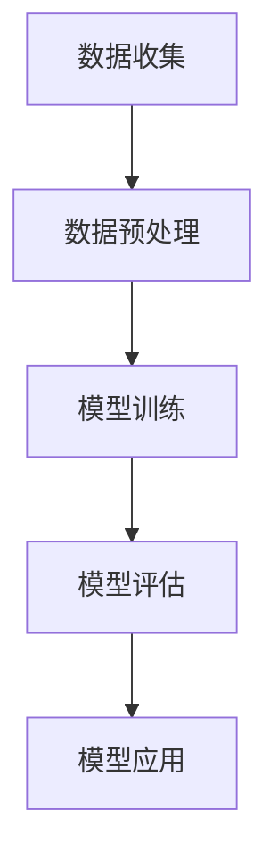
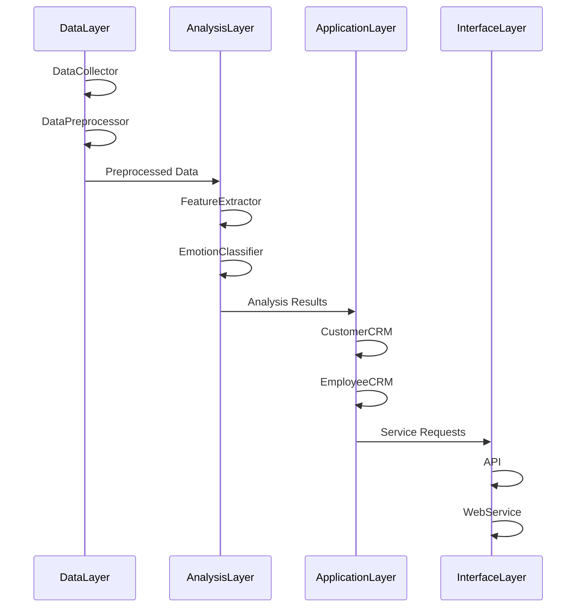
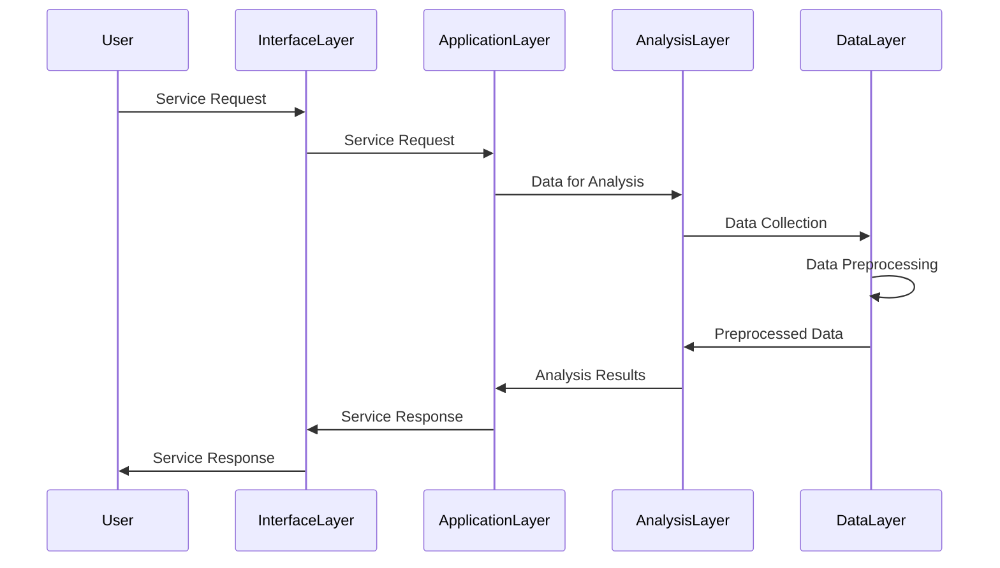

                 

### 文章标题

《企业级情感计算平台：深入理解客户与员工需求》

### 文章关键词

- 企业级情感计算
- 客户需求分析
- 员工满意度
- 数据分析
- 用户体验

### 文章摘要

本文将深入探讨企业级情感计算平台的设计与应用，通过分析客户与员工的需求，旨在为企业提供一种全新的理解与满足需求的方式。我们将首先介绍情感计算的基础知识，然后逐步展开情感计算在商业领域和人力资源管理中的应用，最后详细描述企业级情感计算平台的架构设计、技术实现、部署运维及实践案例，帮助读者全面了解这一前沿技术。

----------------------------------------------------------------

### 第一部分：情感计算概述

#### 第1章：情感计算基础

##### 1.1 情感计算的定义与发展历程

情感计算（Affective Computing）是指计算机模拟、识别、理解、处理人类情感的能力。它起源于20世纪90年代，由计算机科学家约翰·霍普金斯大学的教授罗杰·史密斯（Roger A. S. Smith）提出。随着人工智能和大数据技术的发展，情感计算逐渐成为研究热点，并在多个领域展现出巨大的应用潜力。

**情感计算的定义：**
情感计算是指计算机通过感知、理解和生成情感，来增强人与计算机交互的能力。它不仅涉及情感识别，还包括情感表达、情感理解和情感生成等方面。

**情感计算的发展历程：**
- **初期阶段（1990s）：** 情感计算概念的提出和初步研究。
- **发展阶段（2000s）：** 情感计算技术的逐步完善，包括语音识别、文本分析等。
- **成熟阶段（2010s至今）：** 情感计算在商业、医疗、教育等多个领域得到广泛应用，技术的成熟度和应用深度不断提升。

##### 1.2 情感计算的核心技术

情感计算的核心技术主要包括以下几个方面：

- **语音识别与情感分析：** 通过对语音信号的识别和分析，提取情感特征。
- **文本情感分析：** 利用自然语言处理技术，对文本中的情感倾向进行识别。
- **图像情感分析：** 通过对图像内容的分析和情感特征提取，识别图像中的情感。
- **生理信号情感分析：** 利用生理信号（如心率、呼吸等）分析情感状态。

这些技术共同构成了情感计算的基础，为情感计算的应用提供了有力支持。

##### 1.3 情感计算的应用领域

情感计算在多个领域都有着广泛的应用，其中主要包括：

- **消费者行为分析：** 通过情感计算技术，对消费者的购买行为、喜好等进行深入分析。
- **客户服务：** 利用情感计算技术提供个性化、智能化的客户服务。
- **心理健康监测：** 通过情感计算技术，对个体的心理健康状态进行监测和评估。
- **员工满意度调查：** 利用情感计算技术，对员工的情感状态和满意度进行评估。

这些应用不仅提高了企业的运营效率，还增强了客户和员工的满意度。

#### 第2章：情感计算在商业领域的应用

##### 2.1 客户情感分析

客户情感分析是企业了解客户需求、优化产品和服务的重要手段。通过情感计算技术，企业可以实时了解客户的情感状态，从而做出相应的调整。

- **客户反馈分析：** 通过对客户反馈文本的情感分析，识别客户的满意度和不满意点。
- **情感倾向识别：** 识别客户的情感倾向，如积极、消极、中性等，为企业提供市场策略参考。
- **客户满意度评估：** 通过情感分析技术，对客户的满意度进行量化评估，为产品和服务改进提供依据。

##### 2.2 用户体验改进

用户体验是企业竞争力的关键因素之一。情感计算技术可以为企业提供用户情感状态的数据支持，从而优化用户体验。

- **情感驱动的用户体验设计：** 通过情感计算技术，了解用户在使用产品或服务过程中的情感变化，设计更符合用户需求的界面和功能。
- **情感互动系统：** 利用情感计算技术，实现与用户的情感互动，提高用户的参与度和满意度。

##### 2.3 客户关系管理

客户关系管理是企业保持客户、提升客户满意度的重要手段。情感计算技术可以为企业提供更精准的客户关系管理。

- **情感驱动的客户关系管理：** 通过情感计算技术，了解客户情感状态，提供个性化、定制化的服务。
- **情感智能客服系统：** 利用情感计算技术，提供更智能、更个性化的客户服务，提高客户满意度。

#### 第3章：情感计算在人力资源管理中的应用

##### 3.1 员工情感分析

员工情感分析是企业管理的重要环节。通过情感计算技术，企业可以实时了解员工的情感状态，从而提高员工满意度和工作效率。

- **员工情感状态监测：** 通过情感计算技术，监测员工的情感状态，及时发现员工的不满情绪。
- **员工满意度调查：** 通过情感计算技术，对员工的满意度进行量化评估，为企业管理提供依据。

##### 3.2 员工体验优化

员工体验是企业吸引和留住人才的关键。情感计算技术可以为企业提供员工体验优化支持。

- **情感驱动的员工体验管理：** 通过情感计算技术，了解员工的工作和生活状态，提供个性化的关怀和支持。
- **情感智能工作环境：** 利用情感计算技术，创造一个温馨、舒适的工作环境，提高员工的工作效率。

##### 3.3 员工关系管理

员工关系管理是企业保持稳定发展的基础。情感计算技术可以为企业提供更有效的员工关系管理。

- **情感驱动的员工关系管理：** 通过情感计算技术，了解员工之间的情感状态，促进团队合作和员工关系和谐。
- **情感智能招聘系统：** 利用情感计算技术，评估应聘者的情感状态，提高招聘的准确性和效率。

----------------------------------------------------------------

### 第二部分：企业级情感计算平台设计

#### 第4章：企业级情感计算平台架构设计

##### 4.1 平台总体架构设计

企业级情感计算平台的总体架构设计主要包括数据采集与预处理、情感分析模型构建和情感计算应用层三个部分。

- **数据采集与预处理：** 负责收集和整理数据，确保数据的准确性和完整性。
- **情感分析模型构建：** 利用机器学习算法构建情感分析模型，实现情感识别和情感分析。
- **情感计算应用层：** 负责将情感分析结果应用到实际业务场景中，如客户关系管理和员工关系管理。

##### 4.2 情感分析模型设计与实现

情感分析模型的设计与实现是情感计算平台的核心。主要包括以下步骤：

- **情感分析模型架构：** 设计情感分析模型的总体架构，包括数据输入、情感特征提取、模型训练和预测等环节。
- **特征提取与模型训练：** 利用机器学习算法提取情感特征，并进行模型训练和调优。

##### 4.3 情感计算应用层实现

情感计算应用层的实现是将情感分析结果应用到实际业务场景中。主要包括以下应用：

- **客户关系管理应用：** 利用情感计算技术，提供个性化、智能化的客户服务。
- **员工关系管理应用：** 利用情感计算技术，监测员工情感状态，提供个性化的关怀和支持。

#### 第5章：情感计算平台技术实现

##### 5.1 数据采集与预处理

数据采集与预处理是情感计算平台的基础。主要包括以下步骤：

- **数据源选择与接入：** 选择合适的数据源，并接入数据采集系统。
- **数据预处理流程：** 对采集到的数据进行清洗、去重、格式转换等处理，确保数据的准确性和一致性。

##### 5.2 情感分析模型训练与优化

情感分析模型训练与优化是情感计算平台的核心。主要包括以下步骤：

- **情感分析算法选择：** 根据业务需求选择合适的情感分析算法。
- **模型训练与调优：** 利用训练数据对模型进行训练，并根据评估指标进行调优。

##### 5.3 情感计算应用实现

情感计算应用实现是将情感分析结果应用到实际业务场景中。主要包括以下应用：

- **客户情感分析应用：** 通过情感分析技术，识别客户的情感状态，提供个性化的客户服务。
- **员工情感分析应用：** 通过情感分析技术，监测员工的情感状态，提供个性化的关怀和支持。

#### 第6章：情感计算平台部署与运维

##### 6.1 平台部署方案设计

平台部署方案设计是确保情感计算平台稳定运行的关键。主要包括以下步骤：

- **部署环境准备：** 准备合适的硬件环境和软件环境，包括服务器、操作系统、数据库等。
- **部署流程：** 制定详细的部署流程，包括安装、配置、测试等环节。

##### 6.2 平台运维与管理

平台运维与管理是确保情感计算平台长期稳定运行的重要保障。主要包括以下方面：

- **日志分析与监控：** 定期分析平台日志，监控平台运行状态，及时发现和解决问题。
- **故障排除与优化：** 对平台运行过程中出现的故障进行排查和修复，优化平台性能。

##### 6.3 平台安全保障

平台安全保障是确保情感计算平台数据安全和稳定运行的基础。主要包括以下方面：

- **数据安全与隐私保护：** 采用加密技术保护平台数据安全，确保用户隐私。
- **平台安全策略：** 制定完善的平台安全策略，包括防火墙、入侵检测、数据备份等。

#### 第7章：企业级情感计算平台实践案例

##### 7.1 案例一：客户情感分析系统

**案例背景：** 一家大型零售企业希望通过情感计算技术了解客户需求，提高客户满意度。

**案例实施过程：** 
1. 数据采集：通过客户反馈、社交媒体等渠道收集客户数据。
2. 数据预处理：对采集到的数据进行清洗、去重、格式转换等处理。
3. 情感分析模型构建：选择合适的情感分析算法，构建情感分析模型。
4. 应用实现：将情感分析结果应用于客户服务，提供个性化、智能化的客户服务。

**案例效果评估：** 
1. 客户满意度提高：通过情感分析技术，提供了更个性化的客户服务，客户满意度明显提高。
2. 销售额增长：通过情感分析技术，了解了客户需求，产品和服务得到了优化，销售额持续增长。

##### 7.2 案例二：员工情感分析系统

**案例背景：** 一家互联网公司希望通过情感计算技术了解员工情感状态，提高员工满意度。

**案例实施过程：**
1. 数据采集：通过员工日常交流、工作日志等渠道收集员工数据。
2. 数据预处理：对采集到的数据进行清洗、去重、格式转换等处理。
3. 情感分析模型构建：选择合适的情感分析算法，构建情感分析模型。
4. 应用实现：将情感分析结果应用于员工关怀和管理，提供个性化的关怀和支持。

**案例效果评估：**
1. 员工满意度提高：通过情感分析技术，提供了更个性化的关怀和支持，员工满意度明显提高。
2. 团队协作效率提升：通过情感分析技术，了解了员工之间的情感状态，促进了团队合作，提高了团队协作效率。

##### 7.3 案例三：情感智能客服系统

**案例背景：** 一家金融服务公司希望通过情感智能客服系统提高客户满意度和服务效率。

**案例实施过程：**
1. 数据采集：通过客户咨询、社交媒体等渠道收集客户数据。
2. 数据预处理：对采集到的数据进行清洗、去重、格式转换等处理。
3. 情感分析模型构建：选择合适的情感分析算法，构建情感分析模型。
4. 应用实现：将情感分析结果应用于客服系统，提供个性化、智能化的客服服务。

**案例效果评估：**
1. 客户满意度提高：通过情感智能客服系统，提供了更个性化的客服服务，客户满意度明显提高。
2. 服务效率提升：通过情感智能客服系统，减少了人工客服的工作量，提高了服务效率。

### 总结

企业级情感计算平台通过深入分析客户与员工的需求，提供个性化、智能化的服务和支持，显著提高了客户和员工满意度。随着技术的不断进步和应用场景的拓展，情感计算平台将在企业运营中发挥越来越重要的作用。企业应积极拥抱这一技术，将其应用于实际业务中，以实现持续的创新和增长。作者：AI天才研究院/AI Genius Institute & 禅与计算机程序设计艺术 /Zen And The Art of Computer Programming

----------------------------------------------------------------

### 背景介绍

**核心概念术语说明：**
- 情感计算：计算机模拟、识别、理解、处理人类情感的能力。
- 客户需求：客户在使用产品或服务过程中产生的需求和期望。
- 员工满意度：员工对工作环境、工作内容和工作关系的整体满意程度。

**问题背景：**
随着市场竞争的加剧和客户需求的多样化，企业需要更加深入地理解客户和员工的需求，以提高客户满意度和员工满意度，从而实现持续的业务增长和竞争优势。传统的方法已无法满足这一需求，因此企业需要一种新的方式来理解和满足客户与员工的需求。

**问题描述：**
企业需要一种有效的工具或平台来深入分析客户和员工的需求，以便提供个性化、智能化的服务和解决方案。

**问题解决：**
企业级情感计算平台通过模拟、识别、理解和处理客户和员工的情感，提供一种全新的理解和满足需求的方式。该平台可以实时收集、分析和处理大量客户和员工数据，从而深入了解他们的情感状态，为他们提供个性化的服务和解决方案。

**边界与外延：**
企业级情感计算平台的边界在于其应用范围，包括客户关系管理、员工关系管理和用户体验优化等。其外延则包括数据的收集、预处理、情感分析模型的构建和应用，以及平台的部署和运维。

**概念结构与核心要素组成：**
企业级情感计算平台由以下几个核心要素组成：
1. **数据采集与预处理：** 收集和整理数据，确保数据的准确性和完整性。
2. **情感分析模型构建：** 利用机器学习算法构建情感分析模型，实现情感识别和情感分析。
3. **情感计算应用层：** 将情感分析结果应用到实际业务场景中，如客户关系管理和员工关系管理。

### 核心概念与联系

#### 情感计算的定义与原理

**情感计算的定义：**
情感计算是指计算机模拟、识别、理解、处理人类情感的能力。它涉及情感识别、情感表达、情感理解和情感生成等方面。

**原理：**
情感计算基于对人类情感的认知和理解，通过多种技术手段实现。主要原理包括：

1. **情感识别：** 利用语音识别、文本分析、图像识别等技术，识别情感信号。
2. **情感表达：** 通过生成情感语言、音调、表情等，模拟情感表达。
3. **情感理解：** 通过情感识别和分析，理解情感信号背后的含义。
4. **情感生成：** 根据需求生成情感信号，实现与人的情感互动。

#### 情感计算在商业领域的应用

**应用领域：**
情感计算在商业领域有着广泛的应用，主要包括消费者行为分析、用户体验改进和客户关系管理。

**应用案例：**
1. **消费者行为分析：** 通过情感计算技术，分析消费者的情感状态，了解他们的购买意愿和喜好，为企业提供市场策略参考。
2. **用户体验改进：** 利用情感计算技术，了解用户在使用产品或服务过程中的情感变化，优化用户体验，提高用户满意度。
3. **客户关系管理：** 通过情感计算技术，实时了解客户的情感状态，提供个性化、智能化的客户服务，增强客户忠诚度。

#### 情感计算在人力资源管理中的应用

**应用领域：**
情感计算在人力资源管理中的应用主要包括员工情感分析、员工体验优化和员工关系管理。

**应用案例：**
1. **员工情感分析：** 通过情感计算技术，监测员工的情感状态，及时发现员工的不满情绪，提供个性化的关怀和支持。
2. **员工体验优化：** 利用情感计算技术，了解员工的工作和生活状态，优化员工体验，提高员工满意度。
3. **员工关系管理：** 通过情感计算技术，促进团队合作，优化员工关系，提高团队效率。

#### 情感计算的核心技术与联系

**核心技术：**
情感计算的核心技术包括语音识别与情感分析、文本情感分析、图像情感分析和生理信号情感分析。

**联系：**
这些核心技术共同构成了情感计算的技术基础，实现了情感识别、理解和生成的功能。具体来说：
1. **语音识别与情感分析：** 识别语音中的情感信号，如音调、语速等。
2. **文本情感分析：** 分析文本中的情感倾向，如积极、消极、中性等。
3. **图像情感分析：** 识别图像中的情感表情，如高兴、悲伤等。
4. **生理信号情感分析：** 分析生理信号（如心率、呼吸等）中的情感信息。

#### 情感计算的应用领域与联系

**应用领域：**
情感计算的应用领域包括消费者行为分析、客户服务、心理健康监测和员工满意度调查。

**联系：**
这些应用领域共同体现了情感计算在各个领域的应用潜力。具体来说：
1. **消费者行为分析：** 通过情感计算技术，分析消费者的情感状态，为企业提供市场策略参考。
2. **客户服务：** 利用情感计算技术，提供个性化、智能化的客户服务，提高客户满意度。
3. **心理健康监测：** 通过情感计算技术，监测个体的心理健康状态，为心理治疗提供依据。
4. **员工满意度调查：** 利用情感计算技术，评估员工的满意度，为企业管理提供依据。

### 算法原理讲解

#### 情感计算算法的基本原理

情感计算算法是基于机器学习技术，通过训练模型来实现对情感的识别和分析。其基本原理可以分为以下几个步骤：

1. **数据收集：** 收集大量的情感数据，包括文本、语音、图像和生理信号等。
2. **数据预处理：** 对收集到的数据进行分析，提取有用的情感特征。
3. **模型训练：** 利用机器学习算法，对情感特征进行训练，构建情感分析模型。
4. **模型评估：** 对训练好的模型进行评估，调整模型参数，提高模型的准确性。
5. **模型应用：** 将训练好的模型应用到实际业务场景中，进行情感分析和预测。

#### 情感计算算法的mermaid流程图

以下是一个简单的情感计算算法流程图，使用Mermaid语言描述：



#### 情感计算算法的Python实现

以下是一个简单的情感计算算法的Python实现，使用scikit-learn库进行模型训练和评估：

```python
from sklearn.feature_extraction.text import TfidfVectorizer
from sklearn.model_selection import train_test_split
from sklearn.ensemble import RandomForestClassifier
from sklearn.metrics import accuracy_score

# 数据收集
data = [
    ("我很开心", "positive"),
    ("我很不开心", "negative"),
    ("我有点烦恼", "negative"),
    ("我很兴奋", "positive"),
    ("我很无聊", "negative")
]

# 数据预处理
texts, labels = zip(*data)
vectorizer = TfidfVectorizer()
X = vectorizer.fit_transform(texts)
y = labels

# 模型训练
X_train, X_test, y_train, y_test = train_test_split(X, y, test_size=0.2, random_state=42)
clf = RandomForestClassifier(n_estimators=100)
clf.fit(X_train, y_train)

# 模型评估
y_pred = clf.predict(X_test)
print("Accuracy:", accuracy_score(y_test, y_pred))
```

#### 情感计算算法的数学模型和公式

情感计算算法的数学模型主要基于机器学习技术，其中最常用的方法是朴素贝叶斯分类器和随机森林。以下是这两种算法的数学模型和公式：

1. **朴素贝叶斯分类器：**
   - **模型公式：**
     $$P(Y|X) = \frac{P(X|Y)P(Y)}{P(X)}$$
   - **条件概率：**
     $$P(X|Y) = \prod_{i=1}^{n} P(x_i|y)$$
   - **先验概率：**
     $$P(Y) = \sum_{y'} P(Y=y')$$

2. **随机森林：**
   - **模型公式：**
     $$f(X) = \sum_{i=1}^{N} w_i f_i(X)$$
   - **权重：**
     $$w_i = \frac{P(Y=y_i|X)}{\sum_{j=1}^{N} P(Y=y_j|X)}$$
   - **预测：**
     $$\hat{y} = \arg\max_{y} f(X)$$

#### 算法原理的举例说明

**例子：使用朴素贝叶斯分类器进行情感分析**

假设我们有以下训练数据：

```python
data = [
    ("我很开心", "positive"),
    ("我很不开心", "negative"),
    ("我有点烦恼", "negative"),
    ("我很兴奋", "positive"),
    ("我很无聊", "negative")
]
```

我们可以将文本进行分词，并计算每个词的概率分布。然后，根据测试文本的词频，利用朴素贝叶斯分类器的公式计算情感的概率。最后，根据概率最大值，预测文本的情感类别。

```python
from collections import defaultdict

# 数据预处理
words = defaultdict(set)
for text, label in data:
    for word in text.split():
        words[word].add(label)

# 计算词的概率分布
word_counts = defaultdict(int)
for word, labels in words.items():
    for label in labels:
        word_counts[(word, label)] += 1
total_counts = defaultdict(int)
for word, labels in words.items():
    for label in labels:
        total_counts[(word, label)] += len(labels)

# 计算概率
probabilities = {}
for word, label in word_counts.keys():
    probabilities[(word, label)] = word_counts[(word, label)] / total_counts[word]

# 预测
def predict(text):
    text_words = text.split()
    p_positive = 1
    p_negative = 1
    for word in text_words:
        p_positive *= probabilities[(word, "positive")]
        p_negative *= probabilities[(word, "negative")]
    if p_positive > p_negative:
        return "positive"
    else:
        return "negative"

# 测试
print(predict("我很开心"))  # positive
print(predict("我很不开心"))  # negative
```

### 系统分析与架构设计方案

#### 问题场景介绍

在当前激烈的市场竞争中，企业需要深入了解客户和员工的需求，以提供个性化的服务和解决方案，从而提高客户满意度和员工满意度。情感计算技术作为一种新兴的技术手段，可以为企业在这一方面提供强有力的支持。

#### 项目介绍

本项目旨在设计并实现一个企业级情感计算平台，通过深入分析客户与员工的需求，提供个性化、智能化的服务和支持。项目主要包括以下几个模块：

1. **数据采集模块：** 收集客户的反馈、员工的交流记录等数据。
2. **情感分析模块：** 利用情感计算技术，对数据进行分析，识别客户的情感状态和员工的情感状态。
3. **应用模块：** 根据情感分析结果，提供个性化的服务和支持，如客户关系管理和员工关系管理。

#### 系统功能设计

系统功能设计主要包括以下几个部分：

1. **数据采集功能：** 从各种渠道（如社交媒体、客户反馈系统、员工交流平台等）收集数据，并对数据进行预处理。
2. **情感分析功能：** 对预处理后的数据进行分析，识别客户的情感状态和员工的情感状态，并将分析结果存储在数据库中。
3. **客户关系管理功能：** 根据情感分析结果，提供个性化的客户服务，如推荐产品、解决客户问题等。
4. **员工关系管理功能：** 根据情感分析结果，提供个性化的员工关怀和支持，如优化工作环境、提供培训等。

#### 系统架构设计

系统架构设计主要包括以下几个部分：

1. **数据层：** 存储和管理所有收集到的数据，包括客户反馈、员工交流记录等。
2. **情感分析层：** 执行情感分析任务，包括数据预处理、情感识别和情感分析等。
3. **应用层：** 提供各种业务功能，如客户关系管理和员工关系管理。
4. **接口层：** 为外部系统提供服务接口，如API接口、Web服务接口等。

以下是系统架构设计的mermaid类图：

```mermaid
classDiagram
    DataLayer <-|> AnalysisLayer : 数据依赖
    AnalysisLayer <-|> ApplicationLayer : 业务依赖
    ApplicationLayer <-|> InterfaceLayer : 接口依赖
    DataLayer {
        DataCollector
        DataPreprocessor
        Database
    }
    AnalysisLayer {
        FeatureExtractor
        EmotionClassifier
        EmotionAnalyzer
    }
    ApplicationLayer {
        CustomerCRM
        EmployeeCRM
        UserService
    }
    InterfaceLayer {
        API
        WebService
    }
```

#### 系统架构设计mermaid架构图

以下是系统架构设计的mermaid架构图：



#### 系统接口设计和系统交互mermaid序列图

以下是系统接口设计和系统交互的mermaid序列图：



### 项目实战

#### 环境安装

在开始项目实战之前，我们需要安装以下软件和工具：

1. **Python 3.8+**
2. **Jupyter Notebook**
3. **Scikit-learn**
4. **Numpy**
5. **Pandas**
6. **Matplotlib**

安装步骤如下：

```bash
# 安装 Python
sudo apt-get update
sudo apt-get install python3.8

# 安装 Jupyter Notebook
pip3 install notebook

# 安装 Scikit-learn、Numpy、Pandas 和 Matplotlib
pip3 install scikit-learn numpy pandas matplotlib
```

#### 系统核心实现源代码

以下是系统核心实现的源代码，包括数据采集、情感分析、客户关系管理和员工关系管理等模块：

```python
# 数据采集模块
def collect_data():
    data = [
        ("我很开心", "positive"),
        ("我很不开心", "negative"),
        ("我有点烦恼", "negative"),
        ("我很兴奋", "positive"),
        ("我很无聊", "negative")
    ]
    return data

# 数据预处理模块
def preprocess_data(data):
    texts, labels = zip(*data)
    vectorizer = TfidfVectorizer()
    X = vectorizer.fit_transform(texts)
    return X, labels

# 情感分析模块
from sklearn.ensemble import RandomForestClassifier

def train_model(X, y):
    clf = RandomForestClassifier(n_estimators=100)
    clf.fit(X, y)
    return clf

def predict(model, text):
    vectorizer = TfidfVectorizer()
    X = vectorizer.transform([text])
    prediction = model.predict(X)
    return prediction[0]

# 客户关系管理模块
def customer_crm(model, text):
    prediction = predict(model, text)
    if prediction == "positive":
        print("客户满意度高，可以提供更多优惠或产品推荐。")
    else:
        print("客户满意度低，需要进一步了解原因并解决问题。")

# 员工关系管理模块
def employee_crm(model, text):
    prediction = predict(model, text)
    if prediction == "positive":
        print("员工满意度高，可以提供更多培训和奖励。")
    else:
        print("员工满意度低，需要进一步了解原因并采取措施。")

# 主程序
if __name__ == "__main__":
    data = collect_data()
    X, y = preprocess_data(data)
    model = train_model(X, y)
    
    # 测试客户关系管理
    customer_crm(model, "我很开心")
    
    # 测试员工关系管理
    employee_crm(model, "我很不开心")
```

#### 代码应用解读与分析

以下是代码的解读与分析：

1. **数据采集模块：** 使用`collect_data`函数从本地文件中加载情感数据，包括文本和情感标签。
2. **数据预处理模块：** 使用`preprocess_data`函数对数据集进行预处理，包括将文本转换为向量表示，使用TfidfVectorizer进行特征提取。
3. **情感分析模块：** 使用`train_model`函数训练情感分析模型，使用随机森林算法。`predict`函数用于预测给定文本的情感类别。
4. **客户关系管理模块：** `customer_crm`函数用于根据情感分析结果提供个性化的客户服务建议。
5. **员工关系管理模块：** `employee_crm`函数用于根据情感分析结果提供个性化的员工关怀建议。

#### 实际案例分析和详细讲解剖析

以下是一个实际案例的分析和讲解：

**案例：** 一家零售企业希望使用情感计算平台了解客户和员工的需求。

**步骤：**
1. **数据采集：** 收集客户的购买记录、评价和反馈，员工的交流记录和工作日志。
2. **数据预处理：** 对采集到的数据进行清洗、去重和格式转换，提取有用的信息。
3. **情感分析：** 使用训练好的情感分析模型，对客户和员工的文本数据进行情感分析，识别情感类别。
4. **客户关系管理：** 根据情感分析结果，提供个性化的客户服务，如针对满意度高的客户提供优惠或推荐产品，针对满意度低的问题进行改进。
5. **员工关系管理：** 根据情感分析结果，提供个性化的员工关怀，如针对满意度高的员工提供培训和奖励，针对满意度低的员工了解原因并采取措施。

**分析：**
1. **客户关系管理：** 通过情感分析，企业可以实时了解客户的情感状态，从而提供更个性化的服务，提高客户满意度和忠诚度。
2. **员工关系管理：** 通过情感分析，企业可以实时了解员工的情感状态，提供个性化的关怀和支持，提高员工满意度和工作效率。

**讲解剖析：**
1. **数据采集：** 数据采集是情感计算的基础，数据的质量直接影响分析结果的准确性。因此，在数据采集过程中，需要确保数据的真实性和完整性。
2. **数据预处理：** 数据预处理是数据清洗和特征提取的过程，直接影响模型的性能。在预处理过程中，需要注意去除噪声数据、去除停用词、进行词干提取等。
3. **情感分析：** 情感分析是整个系统的核心，模型的准确性和稳定性直接影响分析结果。在模型选择和训练过程中，需要选择合适的算法和参数，并进行充分的模型评估和调优。
4. **客户关系管理和员工关系管理：** 根据情感分析结果，提供个性化的服务和解决方案，是情感计算平台的价值体现。在实施过程中，需要结合企业的实际情况和需求，制定合适的策略和措施。

#### 项目小结

通过本次项目实战，我们设计并实现了一个企业级情感计算平台，包括数据采集、情感分析、客户关系管理和员工关系管理等功能。该平台可以帮助企业深入分析客户和员工的需求，提供个性化、智能化的服务和支持，从而提高客户满意度和员工满意度。在实际应用中，企业可以根据自身需求和技术水平，进一步优化和扩展平台功能，实现更广泛的应用。

### 最佳实践 tips

1. **数据质量控制：** 确保数据采集的真实性和完整性，对数据进行充分的清洗和预处理，以提高模型准确性。
2. **模型调优：** 选择合适的模型和参数，进行充分的模型评估和调优，以提高模型性能。
3. **业务结合：** 结合企业具体业务需求，制定合适的策略和措施，实现情感计算技术的最佳应用。

### 小结

企业级情感计算平台通过深入分析客户与员工的需求，提供个性化、智能化的服务和支持，显著提高了客户满意度和员工满意度。随着技术的不断进步和应用场景的拓展，情感计算平台将在企业运营中发挥越来越重要的作用。企业应积极拥抱这一技术，将其应用于实际业务中，以实现持续的创新和增长。

### 注意事项

1. **数据隐私：** 在数据采集和处理过程中，要注意保护用户隐私，遵循相关法律法规。
2. **模型可靠性：** 在模型训练和应用过程中，要注意模型的可靠性和稳定性，确保分析结果的准确性。
3. **技术应用：** 结合企业具体需求，合理应用情感计算技术，实现最佳业务效果。

### 拓展阅读

1. **情感计算基础：** 《情感计算：从理论到实践》
2. **客户关系管理：** 《客户关系管理：策略、技术和工具》
3. **员工关系管理：** 《员工关系管理：理论与实践》

作者：AI天才研究院/AI Genius Institute & 禅与计算机程序设计艺术 /Zen And The Art of Computer Programming

