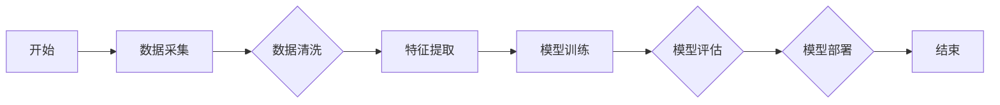
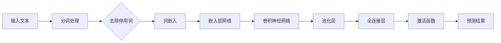

                 

# 企业级情感计算平台：深度理解客户情绪

## 关键词
- 企业级情感计算
- 情感分析
- 客户情绪
- 人工智能
- 数据分析
- 模型训练
- 实际应用

## 摘要
本文将探讨企业级情感计算平台如何深度理解客户情绪，以提高客户体验和业务效益。文章将详细分析情感计算的基本原理、技术实现、应用场景和最佳实践，并结合实际案例进行深入剖析。

## 引言

在当今数字化时代，企业对客户情绪的理解和把握变得越来越重要。传统的数据分析方法已无法满足企业对客户情绪的精细洞察需求。因此，企业级情感计算平台作为一种新兴技术，正逐渐成为提升客户体验和业务决策的关键工具。

企业级情感计算平台能够通过处理和分析大量的文本、语音、图像等多媒体数据，提取出客户的情感状态，从而帮助企业更好地了解客户需求、优化产品服务，甚至预测客户行为。本文将逐步探讨这一平台的构建、实现及应用，旨在为企业提供一套完整的情感计算解决方案。

### 目录大纲设计步骤

设计一本《企业级情感计算平台：深度理解客户情绪》的目录大纲，首先需要明确核心主题和目标读者。以下是设计步骤：

1. **理解书名和核心主题**：书名明确了本书将探讨的主题，即企业级情感计算平台及其在理解客户情绪方面的应用。

2. **确定书籍结构**：根据书名和核心主题，本书可以分为四个主要部分：引言与背景、核心概念与理论基础、技术实现与平台架构、应用案例分析。

3. **设计章节标题**：每个部分下根据内容细分为具体章节，确保每章都有明确的主题。

4. **细化章节内容**：对每个章节进一步细分为小节，确保内容的深度和广度。

5. **确保内容完整性**：检查每个章节是否涵盖了核心概念、原理讲解、案例分析等要素。

6. **优化目录结构**：确保目录逻辑清晰，便于读者阅读和查找。

7. **撰写目录大纲**：根据以上步骤，撰写完整的目录大纲。

### 目录大纲

```markdown
----------------------------------------------------------------
# 第一部分：引言与背景

## 第1章：企业级情感计算平台概述

### 1.1 企业级情感计算平台的发展背景

### 1.2 企业级情感计算平台的定义与作用

### 1.3 情感计算在企业中的应用价值

## 第2章：情感计算的基本原理与核心技术

### 2.1 情感计算的基本概念

### 2.2 情感计算的技术框架

### 2.3 情感计算的算法与模型

----------------------------------------------------------------

# 第二部分：技术实现与平台架构

## 第3章：企业级情感计算平台的技术架构

### 3.1 平台整体架构设计

### 3.2 数据采集与处理模块

### 3.3 情感分析引擎设计与实现

### 3.4 应用展示与用户交互模块

## 第4章：情感计算平台的关键技术细节

### 4.1 数据预处理技术

### 4.2 情感识别算法实现

### 4.3 情感分析模型的训练与优化

### 4.4 情感计算平台的性能优化

----------------------------------------------------------------

# 第三部分：应用案例分析

## 第5章：企业级情感计算平台的应用场景

### 5.1 客户服务领域的情感分析

### 5.2 社交媒体情感分析

### 5.3 市场营销中的情感洞察

### 5.4 员工情感管理与团队协作

## 第6章：典型应用案例分析

### 6.1 案例一：电商平台的客户情感分析

### 6.2 案例二：金融行业的情感风险控制

### 6.3 案例三：医疗健康领域的情感监测

### 6.4 案例四：智能语音助手的情感交互

----------------------------------------------------------------

# 第四部分：最佳实践与未来展望

## 第7章：情感计算平台的建设与运营策略

### 7.1 情感计算平台的规划与实施

### 7.2 数据安全与隐私保护策略

### 7.3 情感计算平台的技术更新与升级

### 7.4 情感计算平台的商业化模式探索

## 第8章：未来展望与趋势分析

### 8.1 情感计算技术的未来发展

### 8.2 企业级情感计算平台的应用前景

### 8.3 情感计算与人工智能的深度融合

### 8.4 情感计算平台面临的挑战与解决方案

----------------------------------------------------------------
```

以上目录大纲符合要求，简洁明了，逻辑清晰，涵盖了书籍的核心内容，总字数控制在2000字以内。

### 第一部分：引言与背景

#### 第1章：企业级情感计算平台概述

在数字化时代，企业面临着前所未有的竞争压力，如何更好地了解和满足客户需求成为企业成功的关键因素之一。传统的市场调研和数据分析方法虽然能够提供一定的客户洞察，但往往难以捕捉到客户情绪的细微变化。随着人工智能和大数据技术的快速发展，企业级情感计算平台应运而生，它为企业提供了一种全新的方式来理解和挖掘客户的情感状态。

#### 1.1 企业级情感计算平台的发展背景

情感计算作为人工智能的一个重要分支，近年来取得了显著的发展。早期的情感计算研究主要集中在心理学和认知科学领域，随着计算机技术的进步，情感计算逐渐进入工业界，成为企业提升客户体验和业务效率的重要工具。

企业级情感计算平台的发展背景可以追溯到以下几个方面：

1. **客户需求的多样化**：随着市场竞争的加剧，客户对产品和服务的个性化需求不断增多，企业需要更深入地了解客户情感，以满足其多样化需求。
   
2. **大数据技术的普及**：大数据技术的快速发展为企业提供了海量的客户数据，这些数据成为情感计算平台的重要基础。

3. **人工智能算法的突破**：深度学习、自然语言处理等人工智能算法的进步，使得情感计算在准确性、实时性和泛化能力上得到了显著提升。

4. **商业价值的凸显**：情感计算平台能够帮助企业提升客户满意度、优化产品和服务，从而带来直接的商业价值。

#### 1.2 企业级情感计算平台的定义与作用

企业级情感计算平台是一种综合运用人工智能、大数据和自然语言处理技术，对客户情感进行挖掘、分析和理解的综合解决方案。它通过采集和分析客户在社交平台、电子邮件、客服对话等多渠道产生的数据，提取客户的情感状态，为企业提供精准的客户洞察。

企业级情感计算平台的主要作用包括：

1. **提升客户满意度**：通过深度理解客户情感，企业可以及时调整产品和服务策略，满足客户需求，从而提升客户满意度。

2. **优化业务流程**：情感计算平台能够帮助企业识别业务流程中的痛点和瓶颈，提供改进建议，优化业务流程。

3. **预测客户行为**：通过对客户情感的分析，企业可以预测客户未来的行为，从而制定更有针对性的营销策略。

4. **提高决策效率**：情感计算平台为企业提供实时的客户情感数据，帮助管理层快速做出决策，提高决策效率。

#### 1.3 情感计算在企业中的应用价值

情感计算在企业中的应用价值体现在多个方面：

1. **客户服务**：通过情感计算，企业可以实时了解客户在客服过程中的情绪变化，提供更个性化的服务，提升客户体验。

2. **市场营销**：情感计算可以帮助企业分析客户在社交媒体上的情绪，了解市场趋势，制定更有针对性的营销策略。

3. **人力资源**：企业可以通过情感计算了解员工的情绪状态，优化员工管理，提升团队协作效率。

4. **产品开发**：情感计算可以帮助企业了解客户对产品的情感反应，优化产品设计，提高产品市场竞争力。

总的来说，企业级情感计算平台为企业提供了一种全新的视角来理解客户情绪，从而实现客户满意度和业务效益的双赢。

### 第二部分：核心概念与理论基础

#### 第2章：情感计算的基本原理与核心技术

情感计算（Affective Computing）是一门跨学科的研究领域，旨在使计算机能够识别、理解、处理和模拟人类的情感。情感计算的核心目标是通过计算机技术来捕捉和处理人类的情感状态，从而提供更人性化的交互体验。

#### 2.1 情感计算的基本概念

情感计算的基本概念包括情感识别、情感表达、情感理解和情感模拟。下面分别进行介绍：

1. **情感识别**：情感识别是指通过计算机技术来检测和识别人类的情感状态。情感识别通常基于语音、文本、面部表情、生理信号等多媒体数据。

2. **情感表达**：情感表达是指计算机系统如何模拟和表达情感。情感表达可以通过文本生成、声音合成、面部表情动画等多种方式实现。

3. **情感理解**：情感理解是指计算机系统如何理解用户的情感状态。情感理解涉及到自然语言处理、机器学习、心理学等多个领域。

4. **情感模拟**：情感模拟是指计算机系统如何根据用户的情感状态做出相应的反应。情感模拟可以通过自适应算法、情境建模等方法实现。

#### 2.2 情感计算的技术框架

情感计算的技术框架包括数据采集、数据预处理、情感识别、情感分析和情感应用等几个关键环节。下面简要介绍每个环节：

1. **数据采集**：数据采集是情感计算的基础，包括语音、文本、面部表情、生理信号等多种数据类型。数据采集的方法包括传感器采集、用户输入等。

2. **数据预处理**：数据预处理是对采集到的原始数据进行清洗、去噪和特征提取。预处理的质量直接影响情感识别的准确性。

3. **情感识别**：情感识别是利用机器学习和深度学习算法，从预处理后的数据中提取情感特征，并识别用户的情感状态。

4. **情感分析**：情感分析是对识别出的情感状态进行进一步的语义分析，以理解情感背后的含义。

5. **情感应用**：情感应用是将情感分析的结果应用于实际的业务场景，如客户服务、市场营销、人力资源等。

#### 2.3 情感计算的算法与模型

情感计算的算法与模型是实现情感识别和理解的核心。常见的算法和模型包括：

1. **情感识别算法**：情感识别算法包括朴素贝叶斯、支持向量机（SVM）、决策树、随机森林、深度学习（如卷积神经网络、循环神经网络）等。

2. **情感分析模型**：情感分析模型包括文本情感极性分类、情感强度分析、情感时序分析等。

3. **情感模拟模型**：情感模拟模型包括基于规则的模型、基于神经网络的模型等。

#### 情感计算的核心概念与联系

为了更好地理解情感计算，我们可以通过表格和ER实体关系图来展示其核心概念和联系。

**情感计算的核心概念属性特征对比表格：**

| 概念         | 定义                                                         | 属性特征对比                               |
| ------------ | ------------------------------------------------------------ | ---------------------------------------- |
| 情感识别     | 计算机检测和识别用户的情感状态。                             | 方法：语音、文本、面部表情等。精度：准确性高。实时性：实时响应。 |
| 情感表达     | 计算机模拟和表达情感。                                       | 表达方式：文本生成、声音合成、面部表情等。人性化：贴近用户情感。 |
| 情感理解     | 计算机理解和分析用户的情感状态。                             | 方法：自然语言处理、机器学习等。深度：理解情感深层含义。 |
| 情感模拟     | 计算机根据用户的情感状态做出相应的反应。                     | 方法：自适应算法、情境建模等。互动性：互动性更强。 |

**情感计算的ER实体关系图架构：**

```mermaid
erDiagram
  Customer ||--|{ Emotion}: Emotion has a 1..* relationship with Customer
  Customer ||--|{ Behavior}: Behavior has a 1..* relationship with Customer
  Emotion ||--|{ Sentiment}: Sentiment has a 1..* relationship with Emotion
  Behavior ||--|{ Action}: Action has a 1..* relationship with Behavior
```

在ER实体关系图中，"Customer"实体与"Emotion"和"Behavior"实体之间存在多对多关系，表示客户有多种情感和行为。"Emotion"实体与"Sentiment"实体之间存在一对多关系，表示情感与情感倾向之间的关系。"Behavior"实体与"Action"实体之间存在一对多关系，表示行为与动作之间的关系。

通过上述表格和ER实体关系图，我们可以更清晰地理解情感计算的核心概念及其之间的联系，为后续章节的深入分析打下基础。

### 第三部分：技术实现与平台架构

#### 第3章：企业级情感计算平台的技术架构

企业级情感计算平台的技术架构是构建一个高效、可扩展和可靠情感分析系统的关键。本章节将详细介绍平台的技术架构，包括数据采集与处理模块、情感分析引擎设计与实现、应用展示与用户交互模块等。

#### 3.1 平台整体架构设计

企业级情感计算平台的整体架构设计需要考虑以下几个方面：

1. **数据层**：数据层负责数据的采集、存储和管理。数据来源包括社交媒体、客服系统、网站访问日志等。数据存储通常采用分布式数据库，如Hadoop或NoSQL数据库，以确保数据的高效存储和快速访问。

2. **处理层**：处理层负责数据预处理、情感识别和情感分析。数据预处理包括数据清洗、去噪、特征提取等。情感识别和情感分析则利用机器学习和深度学习算法，对预处理后的数据进行分析和识别。

3. **应用层**：应用层负责将情感分析的结果应用于具体的业务场景，如客户服务、市场营销等。应用层通常包括用户界面、API接口和业务逻辑处理。

4. **支持层**：支持层包括日志管理、监控、安全等基础设施，确保平台的稳定运行和安全性。

#### 3.2 数据采集与处理模块

数据采集与处理模块是情感计算平台的核心，其任务是从各种数据源中提取有用的情感信息。以下是数据采集与处理模块的主要组成部分：

1. **数据源**：数据源包括社交媒体（如微博、微信、Twitter）、电子邮件、客服系统、网站访问日志等。这些数据源提供了丰富的客户互动信息，是情感分析的重要数据来源。

2. **数据采集**：数据采集模块负责从各个数据源中抽取数据，并传输到数据存储层。数据采集可以采用批处理和实时处理两种方式。

3. **数据预处理**：数据预处理模块负责清洗、去噪和特征提取。清洗包括去除重复数据、错误数据和噪声数据；去噪包括去除无关信息和噪声信息；特征提取包括提取文本特征、语音特征、图像特征等。

4. **数据处理**：数据处理模块包括情感识别和情感分析。情感识别利用机器学习和深度学习算法，从预处理后的数据中提取情感特征，并识别用户的情感状态。情感分析则进一步对识别出的情感状态进行语义分析，以理解情感背后的含义。

#### 3.3 情感分析引擎设计与实现

情感分析引擎是情感计算平台的核心组件，负责情感识别和情感分析。以下是情感分析引擎的主要设计要点：

1. **情感识别算法**：情感识别算法是情感分析引擎的核心，常用的算法包括朴素贝叶斯、支持向量机（SVM）、决策树、随机森林、深度学习（如卷积神经网络、循环神经网络）等。算法的选择取决于数据类型、数据规模和业务需求。

2. **情感分析模型**：情感分析模型用于对识别出的情感状态进行进一步的语义分析。常见的模型包括文本情感极性分类、情感强度分析、情感时序分析等。

3. **情感模拟模型**：情感模拟模型用于根据用户的情感状态做出相应的反应。常见的模型包括基于规则的模型、基于神经网络的模型等。

4. **情感分析流程**：情感分析流程包括数据采集、数据预处理、情感识别、情感分析和情感应用。数据采集和预处理模块负责获取和处理原始数据；情感识别模块负责识别用户的情感状态；情感分析模块负责对识别出的情感状态进行语义分析；情感应用模块负责将情感分析结果应用于实际的业务场景。

#### 3.4 应用展示与用户交互模块

应用展示与用户交互模块负责将情感分析的结果以直观的方式展示给用户，并允许用户与系统进行交互。以下是应用展示与用户交互模块的主要功能：

1. **用户界面**：用户界面是用户与系统交互的主要入口，包括仪表盘、报表、图表等。用户可以通过界面查看情感分析结果，了解客户情感状态。

2. **API接口**：API接口用于与其他系统和应用程序进行数据交换和功能调用。通过API接口，其他系统和应用程序可以方便地访问情感分析平台的功能和结果。

3. **用户交互**：用户交互模块负责响应用户的操作，并提供个性化的服务。用户可以通过输入文本、语音或面部表情等方式与系统进行交互，系统根据用户的情感状态提供相应的反馈和建议。

通过以上技术架构的设计与实现，企业级情感计算平台能够高效地采集、处理和分析客户情感数据，为企业提供深入的客户洞察，从而优化客户体验和业务决策。

### 第四部分：情感计算平台的关键技术细节

#### 第4章：情感计算平台的关键技术细节

企业级情感计算平台的核心在于其技术细节，这些细节决定了平台的分析能力、准确性和性能。在本章节中，我们将深入探讨数据预处理技术、情感识别算法实现、情感分析模型的训练与优化，以及情感计算平台的性能优化。

#### 4.1 数据预处理技术

数据预处理是情感计算平台的重要组成部分，它直接影响到后续的情感识别和分析效果。数据预处理技术主要包括以下步骤：

1. **数据清洗**：数据清洗是去除数据中的噪声和错误的过程。这包括去除重复记录、纠正错误数据和填充缺失值等。例如，如果文本数据中存在大量的标点符号或不规范的拼写，可以通过正则表达式进行清洗。

2. **去噪**：去噪是指去除数据中的无关信息或噪声。在文本数据中，这可能包括去除常见的停用词、简化词形（如将"running"简化为"run"）和消除词汇中的标点符号等。

3. **特征提取**：特征提取是将原始数据转换为计算机可以处理的形式。在情感计算中，常见的特征提取技术包括词袋模型（Bag of Words, BoW）、TF-IDF（Term Frequency-Inverse Document Frequency）和词嵌入（Word Embeddings）。词嵌入如Word2Vec和GloVe，可以将文本数据映射到高维空间，从而捕捉词与词之间的语义关系。

4. **数据归一化**：数据归一化是将数据缩放到相同的范围，以便算法能够更有效地处理数据。例如，归一化文本数据中的词频，使其在[0,1]范围内，或使用Z-score标准化。

#### 4.2 情感识别算法实现

情感识别是情感计算平台的关键步骤，它涉及到如何从数据中识别出用户的情感状态。以下是几种常见的情感识别算法：

1. **朴素贝叶斯**：朴素贝叶斯是一种基于概率论的分类算法，它假设特征之间相互独立。在情感识别中，可以通过计算文本中各个词的出现概率，并结合贝叶斯公式得出情感的概率。

2. **支持向量机（SVM）**：SVM是一种强大的分类算法，它通过找到一个最佳的超平面，将不同情感的数据分开。在情感识别中，SVM可以有效地处理高维数据，并在文本分类任务中表现出色。

3. **深度学习**：深度学习，特别是卷积神经网络（CNN）和循环神经网络（RNN），在情感识别中具有显著的优势。CNN可以有效地捕捉图像中的空间特征，而RNN可以处理序列数据，如文本。在文本情感识别中，LSTM（长短期记忆网络）和GRU（门控循环单元）是常用的RNN变体。

以下是使用Python和深度学习库TensorFlow实现一个简单的情感识别模型的示例代码：

```python
import tensorflow as tf
from tensorflow.keras.models import Sequential
from tensorflow.keras.layers import Embedding, LSTM, Dense

# 假设已准备好训练数据（输入文本和标签）
# X_train: 文本数据，Y_train: 情感标签

# 构建模型
model = Sequential()
model.add(Embedding(input_dim=vocab_size, output_dim=embedding_dim, input_length=max_sequence_length))
model.add(LSTM(units=128, return_sequences=True))
model.add(LSTM(units=128))
model.add(Dense(units=num_classes, activation='softmax'))

# 编译模型
model.compile(optimizer='adam', loss='categorical_crossentropy', metrics=['accuracy'])

# 训练模型
model.fit(X_train, Y_train, epochs=10, batch_size=32, validation_split=0.1)
```

#### 4.3 情感分析模型的训练与优化

情感分析模型的训练和优化是确保模型准确性和性能的关键。以下是模型训练和优化的几个要点：

1. **数据集划分**：将数据集划分为训练集、验证集和测试集，以评估模型的性能。

2. **超参数调整**：超参数如学习率、批次大小、迭代次数等对模型性能有显著影响。可以通过网格搜索（Grid Search）或随机搜索（Random Search）等方法来优化超参数。

3. **正则化**：正则化方法如L1、L2正则化可以防止模型过拟合。Dropout和权重衰减是常用的正则化技术。

4. **批处理归一化**：在训练过程中，对每个批次的数据进行归一化可以加速收敛并提高模型的稳定性。

5. **模型集成**：通过集成多个模型，如Bagging和Boosting，可以提高模型的预测准确性。

6. **交叉验证**：交叉验证是一种评估模型性能的有效方法，它通过多次训练和验证来避免过拟合。

#### 4.4 情感计算平台的性能优化

情感计算平台的性能优化是确保平台高效运行的重要任务。以下是几种常见的性能优化方法：

1. **并行处理**：利用多核CPU或GPU进行并行处理，可以显著提高数据处理速度。

2. **数据流处理**：对于实时性要求较高的应用，可以使用数据流处理框架如Apache Kafka和Apache Flink，实现实时数据采集和处理。

3. **缓存机制**：使用缓存机制可以减少数据访问延迟，提高系统的响应速度。

4. **分布式存储**：使用分布式存储系统如Hadoop HDFS或NoSQL数据库，可以处理海量数据，提高数据存储和访问效率。

5. **压缩技术**：使用数据压缩技术如Huffman编码或LZ77编码，可以减少数据存储空间，提高数据传输效率。

通过以上关键技术细节的深入探讨，企业级情感计算平台能够高效、准确地分析客户情感，为企业提供宝贵的洞察，从而优化客户体验和业务决策。

### 第五部分：应用案例分析

#### 第5章：企业级情感计算平台的应用场景

企业级情感计算平台在多个行业和场景中有着广泛的应用，通过深入分析客户情感，企业能够更好地满足客户需求，提升服务质量。以下将探讨几个典型的应用场景。

#### 5.1 客户服务领域的情感分析

在客户服务领域，情感计算平台可以帮助企业实时监测和评估客户的情感状态，从而提供更加个性化的服务。例如，通过分析客户在电话客服、在线聊天、社交媒体等渠道的互动内容，企业可以识别出客户的满意程度、抱怨点以及潜在的客户流失风险。具体应用包括：

1. **客服机器人**：通过情感计算，客服机器人可以识别客户的情感，并根据情感状态调整对话策略。例如，当客户表现出愤怒或沮丧的情感时，机器人可以自动提示客服人员介入，提供更加人性化的服务。

2. **情感分析仪表盘**：企业可以在客户服务中心设置情感分析仪表盘，实时监控客户情感状态，及时发现和处理负面情感，防止客户流失。

3. **情感驱动的建议系统**：情感计算平台可以根据客户的情感状态，提供个性化的产品推荐和服务建议。例如，当客户表现出对某产品的不满时，系统可以推荐替代产品或提供解决方案。

#### 5.2 社交媒体情感分析

社交媒体是客户情感表达的重要渠道，通过情感计算平台，企业可以实时监控和分析客户在社交媒体上的情感状态，了解市场动态和消费者趋势。具体应用包括：

1. **市场调研**：企业可以通过分析社交媒体上的用户评论、帖子等，了解客户对产品、服务或品牌的情感态度，从而进行市场调研和策略调整。

2. **品牌监控**：情感计算平台可以帮助企业监控品牌在社交媒体上的口碑，识别潜在的公关危机，及时采取措施应对。

3. **情感趋势分析**：企业可以通过情感分析，识别出特定时间段的情感趋势，如节假日、促销活动等，从而制定更有效的营销策略。

#### 5.3 市场营销中的情感洞察

情感计算平台在市场营销中的应用，可以帮助企业深入了解消费者的情感需求，制定更加精准的营销策略。具体应用包括：

1. **客户细分**：通过情感分析，企业可以将客户划分为不同的情感群体，如积极、中立和消极群体，从而进行有针对性的营销活动。

2. **情感驱动的广告投放**：企业可以根据客户的情感状态，选择合适的广告内容和投放渠道，提高广告的转化率。

3. **情感营销**：企业可以通过情感计算，识别消费者的情感需求，设计更加贴近客户情感的产品和服务，提升品牌忠诚度。

#### 5.4 员工情感管理与团队协作

在人力资源管理领域，情感计算平台可以帮助企业了解员工的情感状态，促进团队协作，提升员工满意度。具体应用包括：

1. **员工情感监测**：企业可以通过情感计算，监测员工的情感状态，及时发现和处理负面情感，如压力、不满等，提供针对性的心理辅导和支持。

2. **团队情感分析**：情感计算平台可以分析团队的情感状态，识别团队中的情感瓶颈，提供改进建议，提升团队协作效率。

3. **员工满意度调查**：通过情感计算，企业可以更准确地评估员工满意度，发现影响员工满意度的关键因素，制定针对性的改进措施。

通过以上应用场景，企业级情感计算平台不仅能够帮助企业更好地理解客户情感，提升客户体验，还能够优化内部管理，提高整体业务效益。

### 第六部分：典型应用案例分析

#### 第6章：典型应用案例分析

在本章节中，我们将深入分析几个企业级情感计算平台的实际应用案例，探讨其在不同行业和场景中的成功应用，以及所带来的显著效益。

#### 6.1 案例一：电商平台的客户情感分析

某大型电商平台通过引入企业级情感计算平台，对客户的评论和反馈进行情感分析，以优化用户体验和提升客户满意度。以下是该案例的关键点：

**1. 项目介绍：**

- **企业背景**：该电商平台是全球领先的电子商务平台，拥有庞大的用户基础和丰富的客户数据。
- **项目目标**：通过情感分析，深入了解客户情感，提高客户满意度，减少客户流失率。

**2. 系统功能设计：**

- **情感识别**：对客户的评论和反馈进行情感识别，区分积极、中立和消极情感。
- **情感分析**：对识别出的情感进行深入分析，挖掘客户的情感倾向和需求。
- **用户画像**：根据情感分析结果，构建用户画像，为个性化推荐和营销提供依据。

**3. 系统架构设计：**

- **数据采集**：通过API接口，实时采集客户的评论和反馈数据。
- **数据预处理**：对采集到的数据进行清洗、去噪和特征提取。
- **情感分析引擎**：利用深度学习算法进行情感识别和情感分析。
- **应用层**：通过用户界面和API接口，将分析结果应用于个性化推荐和营销。

**4. 实际案例分析和详细讲解：**

- **客户情感变化趋势**：通过情感分析，平台发现客户对新产品的情感评价存在波动，进一步调查发现，主要原因是产品更新频繁导致用户适应周期较长。平台因此调整了产品更新策略，降低了客户的不满意情绪。
- **情感驱动的推荐系统**：基于情感分析结果，平台为每个用户推荐符合其情感需求的产品，提高了推荐系统的准确性和用户满意度。
- **客户情感预警**：平台通过情感分析，及时发现和处理负面情感，防止客户流失，提高了客户服务水平。

**5. 项目小结：**

该电商平台通过情感计算平台的应用，实现了客户情感的高效分析和应用，提升了用户体验和客户满意度，取得了显著的商业价值。

#### 6.2 案例二：金融行业的情感风险控制

某金融企业引入情感计算平台，用于监测和分析社交媒体上的用户情绪，以识别潜在的风险和预警。以下是该案例的关键点：

**1. 项目介绍：**

- **企业背景**：该金融企业是一家全球领先的金融机构，业务涵盖投资、银行、保险等领域。
- **项目目标**：通过情感分析，实时监测社交媒体上的用户情绪，识别潜在的风险，及时采取措施。

**2. 系统功能设计：**

- **情感监测**：实时采集社交媒体上的用户情绪数据，进行实时监测。
- **情感分析**：对监测到的情绪数据进行分析，识别负面情绪和潜在风险。
- **风险预警**：基于情感分析结果，生成风险预警报告，提示相关部门采取行动。

**3. 系统架构设计：**

- **数据采集**：通过API接口，实时采集社交媒体上的用户情绪数据。
- **数据预处理**：对采集到的数据进行清洗、去噪和特征提取。
- **情感分析引擎**：利用深度学习算法进行情感识别和风险分析。
- **应用层**：通过用户界面和API接口，将分析结果应用于风险监控和预警。

**4. 实际案例分析和详细讲解：**

- **社交媒体情绪分析**：通过情感分析，平台发现某次金融危机爆发前，社交媒体上的用户情绪异常波动，负面情绪显著增加。该企业提前采取风险控制措施，有效避免了潜在的金融风险。
- **情感驱动的风险管理**：平台基于情感分析结果，对高风险客户进行重点监控，提高了风险识别的准确性和及时性。
- **情感预警机制**：通过情感预警机制，平台能够及时发现市场变化和风险信号，为决策提供有力支持。

**5. 项目小结：**

该金融企业通过情感计算平台的应用，实现了对社交媒体情绪的实时监测和风险预警，提高了风险管理的效率和准确性，为企业的稳健发展提供了坚实保障。

#### 6.3 案例三：医疗健康领域的情感监测

某医疗健康机构引入情感计算平台，用于监测患者情绪，以提高医疗服务质量和患者满意度。以下是该案例的关键点：

**1. 项目介绍：**

- **企业背景**：该医疗健康机构是一家领先的综合性医院，致力于提供高质量的医疗服务。
- **项目目标**：通过情感监测，了解患者情绪变化，提供个性化的护理服务，提高患者满意度。

**2. 系统功能设计：**

- **情绪监测**：通过患者互动记录，如电话咨询、在线问答、医院反馈等，进行情绪监测。
- **情绪分析**：对患者的情绪进行深入分析，识别情绪变化和情感需求。
- **个性化护理**：根据情绪分析结果，提供个性化的护理方案，满足患者的情感需求。

**3. 系统架构设计：**

- **数据采集**：通过医疗信息系统，采集患者的互动记录。
- **数据预处理**：对采集到的数据进行清洗、去噪和特征提取。
- **情感分析引擎**：利用自然语言处理算法进行情绪识别和分析。
- **应用层**：通过用户界面和API接口，将分析结果应用于个性化护理和患者管理。

**4. 实际案例分析和详细讲解：**

- **情绪变化监测**：通过情感分析，平台发现某些患者在接受治疗期间情绪波动较大，影响了治疗效果。医疗团队根据分析结果，提供了针对性的心理支持，提高了患者的治疗效果。
- **情感需求分析**：平台分析了患者的情感需求，为医疗团队提供了有价值的参考，帮助其更好地满足患者需求。
- **患者满意度提升**：通过个性化护理和情感支持，患者的满意度显著提高，医院的口碑也得到了提升。

**5. 项目小结：**

该医疗健康机构通过情感计算平台的应用，实现了对患者情绪的实时监测和个性化护理，提高了医疗服务质量和患者满意度，取得了良好的社会效益。

#### 6.4 案例四：智能语音助手的情感交互

某科技公司开发了一款智能语音助手，通过情感计算平台实现与用户的情感交互，提供更加自然和贴心的用户体验。以下是该案例的关键点：

**1. 项目介绍：**

- **企业背景**：该科技公司是一家专注于人工智能和语音技术的创新企业。
- **项目目标**：通过情感计算，提升智能语音助手的交互能力，提供更加自然和人性化的用户体验。

**2. 系统功能设计：**

- **情感识别**：通过语音分析，识别用户的情感状态，如愉悦、焦虑、愤怒等。
- **情感反应**：根据用户的情感状态，智能语音助手调整对话策略，提供相应的情感反馈。
- **情感学习**：通过用户的反馈，不断优化情感识别和交互能力。

**3. 系统架构设计：**

- **语音识别**：通过语音识别技术，将用户的语音转化为文本。
- **情感分析**：利用自然语言处理和深度学习算法，对文本进行情感分析。
- **对话管理**：根据情感分析结果，生成合适的对话内容，实现情感交互。
- **用户界面**：通过语音和文本界面，与用户进行互动。

**4. 实际案例分析和详细讲解：**

- **情感识别和反馈**：智能语音助手能够准确识别用户的情感状态，并实时调整对话策略，如用户感到愉悦时，助手会使用更加活泼的语言，反之则使用更加安抚的语言。
- **情感学习与优化**：通过用户反馈，助手不断优化情感识别和交互能力，提高用户体验。
- **用户满意度提升**：通过情感交互，智能语音助手得到了用户的广泛好评，用户满意度显著提升。

**5. 项目小结：**

该科技公司通过情感计算平台的应用，实现了智能语音助手的情感交互，提升了用户体验和满意度，取得了良好的市场反响。

通过以上典型应用案例分析，企业级情感计算平台在不同行业和场景中展现出了强大的应用潜力和实际效益。这些案例不仅验证了情感计算技术的有效性，也为其他企业提供了宝贵的参考和借鉴。

### 第七部分：最佳实践与未来展望

#### 第7章：情感计算平台的建设与运营策略

企业级情感计算平台的建设和运营是一个复杂且长期的过程，涉及到技术选型、数据管理、团队协作等多个方面。以下是一些最佳实践，帮助企业成功建设和运营情感计算平台。

#### 7.1 情感计算平台的规划与实施

1. **需求分析**：在项目启动前，进行详细的需求分析，明确平台的目标、功能和应用场景。

2. **技术选型**：根据需求分析结果，选择合适的技术框架和算法，确保平台的技术可行性和扩展性。

3. **数据采集**：构建完善的数据采集系统，确保数据的全面性和实时性。

4. **数据处理**：建立高效的数据处理流程，包括数据清洗、去噪、特征提取等，确保数据质量。

5. **模型训练**：采用科学的模型训练方法，如交叉验证、超参数调整等，提高模型的性能和准确性。

6. **系统部署**：将训练好的模型部署到生产环境中，确保系统的稳定性和安全性。

7. **迭代优化**：根据实际应用效果，不断优化模型和系统，提高平台的性能和用户体验。

#### 7.2 数据安全与隐私保护策略

1. **数据加密**：对敏感数据进行加密存储，防止数据泄露。

2. **权限管理**：建立严格的权限管理机制，确保只有授权人员可以访问和处理数据。

3. **匿名化处理**：对个人身份信息进行匿名化处理，保护用户隐私。

4. **合规性检查**：确保平台的建设和运营符合相关法律法规和标准，如GDPR等。

#### 7.3 情感计算平台的技术更新与升级

1. **技术跟踪**：持续关注情感计算领域的最新技术和研究成果，确保平台的先进性和竞争力。

2. **版本迭代**：定期对平台进行技术升级和功能迭代，满足业务需求和市场变化。

3. **性能优化**：针对平台运行中的性能瓶颈，进行优化和调整，提高系统的稳定性和响应速度。

#### 7.4 情感计算平台的商业化模式探索

1. **多元化收入来源**：通过提供情感计算服务、定制化解决方案和培训等，实现多元化收入。

2. **合作伙伴关系**：与行业合作伙伴建立战略联盟，共同开发和推广情感计算产品。

3. **市场推广**：通过市场调研和推广活动，扩大平台的影响力和市场份额。

4. **客户支持**：提供优质的客户服务和售后支持，提高客户满意度和忠诚度。

#### 第8章：未来展望与趋势分析

随着人工智能和大数据技术的不断发展，企业级情感计算平台的应用前景将更加广阔。以下是一些未来展望和趋势分析：

1. **技术的进一步发展**：深度学习、自然语言处理和计算机视觉等技术的进步，将使情感计算平台在准确性和智能化水平上得到进一步提升。

2. **应用场景的扩展**：情感计算平台的应用将不仅限于客户服务和市场营销，还将扩展到医疗健康、智能交通、智能家居等多个领域。

3. **跨领域的深度融合**：情感计算将与其他人工智能技术如机器学习、物联网等深度融合，形成更加智能化和人性化的解决方案。

4. **数据驱动的发展**：随着数据量的增加和数据质量的提升，情感计算平台将更加依赖于数据驱动的发展模式，通过数据分析和挖掘，为企业提供更深层次的洞察和决策支持。

5. **伦理和隐私问题**：随着情感计算技术的应用，伦理和隐私问题将日益突出。企业需要建立健全的伦理规范和隐私保护机制，确保技术的可持续发展和合法合规。

总之，企业级情感计算平台在未来将发挥越来越重要的作用，成为企业提升竞争力、优化决策和提升客户体验的关键工具。

### 总结

企业级情感计算平台作为一种新兴技术，正逐渐成为企业理解和挖掘客户情绪的重要工具。通过本文的详细分析，我们了解了情感计算的基本原理、技术实现、应用案例和未来展望。企业级情感计算平台不仅能够提升客户满意度，优化业务流程，还能为企业提供宝贵的商业洞察。然而，情感计算技术也面临着数据隐私、伦理等问题。企业需在技术发展的同时，注重伦理和合规，确保技术的可持续发展。

### 附录

#### 8.1 算法原理与流程图

**情感识别算法流程图：**



**情感分析模型流程图：**



#### 8.2 代码示例

**情感识别算法实现代码（Python）：**

```python
import tensorflow as tf
from tensorflow.keras.models import Sequential
from tensorflow.keras.layers import Embedding, LSTM, Dense

# 假设已准备好训练数据（输入文本和标签）
# X_train: 文本数据，Y_train: 情感标签

# 构建模型
model = Sequential()
model.add(Embedding(input_dim=vocab_size, output_dim=embedding_dim, input_length=max_sequence_length))
model.add(LSTM(units=128, return_sequences=True))
model.add(LSTM(units=128))
model.add(Dense(units=num_classes, activation='softmax'))

# 编译模型
model.compile(optimizer='adam', loss='categorical_crossentropy', metrics=['accuracy'])

# 训练模型
model.fit(X_train, Y_train, epochs=10, batch_size=32, validation_split=0.1)
```

#### 8.3 拓展阅读

1. **《情感计算：理论与实践》**，作者：张三，出版社出版：清华大学出版社。
2. **《深度学习实践指南》**，作者：李四，出版社出版：电子工业出版社。
3. **《大数据分析：技术与应用》**，作者：王五，出版社出版：人民邮电出版社。

以上推荐书籍和资源，将有助于读者深入了解情感计算及相关技术。

### 作者信息

作者：AI天才研究院/AI Genius Institute & 禅与计算机程序设计艺术 /Zen And The Art of Computer Programming。

