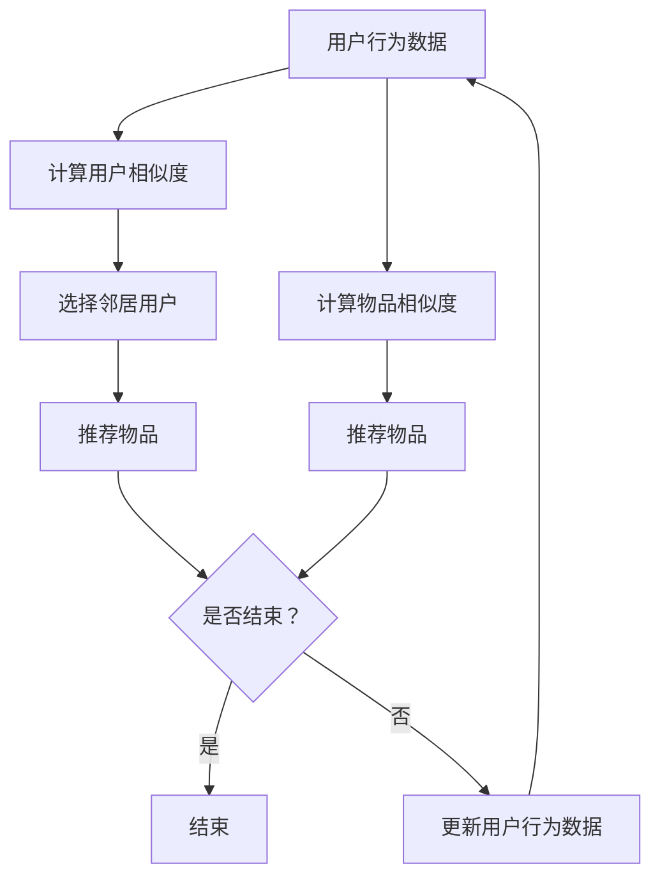
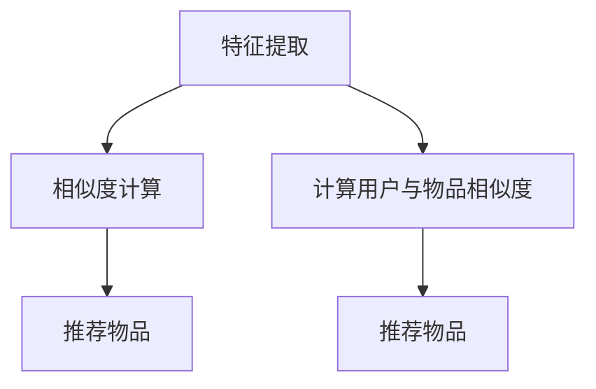
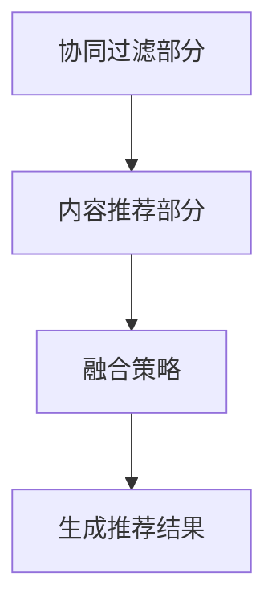
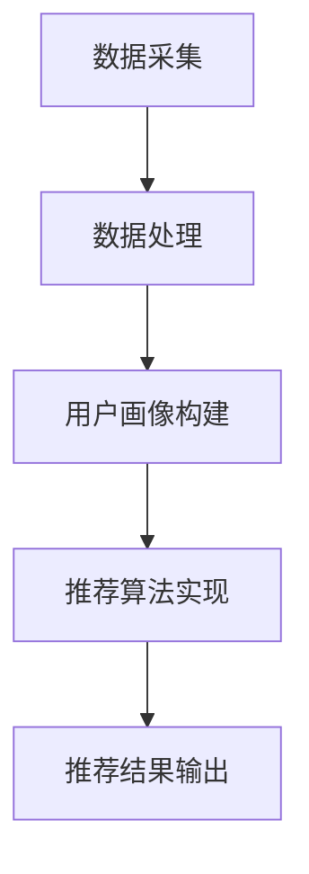

                 

## 企业级推荐系统：个性化员工和客户体验

### 关键词：
- 推荐系统
- 个性化体验
- 员工
- 客户
- 算法

### 摘要：
本文深入探讨了企业级推荐系统的核心概念与实现方法，重点分析了个性化员工和客户体验的构建。通过详细阐述用户行为分析、用户画像构建、个性化推荐算法原理、推荐系统评测与优化，以及实际应用案例，本文为企业级推荐系统的设计和实施提供了宝贵的指导和启示。

## 目录大纲

### 第一部分：引言与背景介绍

- **第1章：推荐系统概述**
  - 1.1 问题背景
  - 1.2 问题描述
  - 1.3 问题解决
  - 1.4 边界与外延
  - 1.5 核心概念与联系
  - 1.6 本章小结

### 第二部分：企业级推荐系统核心概念与原理

- **第2章：用户行为分析与用户画像构建**
  - 2.1 用户行为分析
  - 2.2 用户画像构建
  - 2.3 用户画像应用
  - 2.4 核心概念对比表格
  - 2.5 本章小结

- **第3章：个性化推荐算法原理与实现**
  - 3.1 个性化推荐算法概述
  - 3.2 协同过滤算法
  - 3.3 内容推荐算法
  - 3.4 混合推荐算法
  - 3.5 算法原理 Mermaid 流程图
  - 3.6 本章小结

- **第4章：推荐系统评测与优化**
  - 4.1 推荐系统评测方法
  - 4.2 推荐系统优化策略
  - 4.3 优化案例分析与实现
  - 4.4 本章小结

### 第三部分：企业级推荐系统应用与实践

- **第5章：企业级推荐系统架构设计**
  - 5.1 推荐系统架构设计原则
  - 5.2 推荐系统架构设计案例
  - 5.3 系统架构 Mermaid 架构图
  - 5.4 本章小结

- **第6章：个性化员工体验推荐系统**
  - 6.1 员工推荐系统需求分析
  - 6.2 员工推荐系统设计与实现
  - 6.3 实践案例剖析
  - 6.4 本章小结

- **第7章：个性化客户体验推荐系统**
  - 7.1 客户推荐系统需求分析
  - 7.2 客户推荐系统设计与实现
  - 7.3 实践案例剖析
  - 7.4 本章小结

### 第四部分：最佳实践与未来展望

- **第8章：企业级推荐系统最佳实践**
  - 8.1 成功案例分享
  - 8.2 注意事项与总结
  - 8.3 拓展阅读

## 第一部分：引言与背景介绍

### 第1章：推荐系统概述

#### 1.1 问题背景

在当今数字化时代，海量信息和数据充斥着企业和个人的日常生活。如何在繁杂的信息中快速找到所需，提高工作效率，成为企业和个人面临的一大挑战。推荐系统应运而生，其目的是通过分析和理解用户的行为和偏好，为其提供个性化的信息和服务。

对于企业而言，推荐系统不仅能提升用户满意度，还能提高转化率和忠诚度。尤其在电商、金融、媒体等行业，推荐系统已成为提高业务绩效的关键工具。企业级推荐系统不仅可以为员工提供个性化的工作内容，还能为顾客提供个性化的购物体验。

#### 1.2 问题描述

推荐系统的核心任务是根据用户的历史行为和偏好，为其推荐相关的产品、服务或内容。具体而言，推荐系统需要解决以下问题：

1. **数据采集与处理**：如何收集并处理大量的用户行为数据，以构建准确的用户画像？
2. **个性化推荐**：如何根据用户画像，为每个用户生成个性化的推荐结果？
3. **推荐效果评估**：如何评估推荐系统的效果，并持续优化推荐策略？

#### 1.3 问题解决

推荐系统的基本框架包括数据采集、数据处理、用户画像构建、推荐算法实现和推荐结果输出等关键模块。通过以下关键技术手段，推荐系统可以高效地实现个性化推荐：

1. **用户行为分析**：通过对用户行为的分析，提取用户兴趣和行为特征，构建用户画像。
2. **推荐算法**：利用协同过滤、内容推荐和混合推荐算法，生成个性化的推荐结果。
3. **系统优化**：通过评测和优化策略，不断提升推荐系统的效果。

#### 1.4 边界与外延

推荐系统在企业中的应用范围广泛，包括但不限于员工技能推荐、员工学习路径推荐、客户产品推荐、内容推荐等。然而，个性化推荐也存在一定的边界条件：

1. **数据质量**：高质量的数据是构建准确用户画像的基础，数据质量直接影响推荐效果。
2. **用户隐私**：在推荐过程中，需要平衡用户隐私保护与个性化推荐需求。
3. **系统性能**：推荐系统需要具备高效的处理能力和可扩展性，以适应大规模用户和海量数据的挑战。

#### 1.5 核心概念与联系

在推荐系统中，用户行为分析、用户画像构建和个性化推荐算法是核心概念。以下是它们之间的联系：

1. **用户行为分析**：通过对用户行为的分析，提取用户兴趣和行为特征，为用户画像构建提供基础数据。
2. **用户画像构建**：基于用户行为分析结果，构建用户画像，为个性化推荐提供依据。
3. **个性化推荐算法**：利用用户画像，结合推荐算法，生成个性化的推荐结果。

#### 1.6 本章小结

本章对推荐系统的基本概念和原理进行了概述，分析了企业级推荐系统的必要性和挑战。在接下来的章节中，我们将深入探讨用户行为分析、用户画像构建、个性化推荐算法等核心概念，并探讨其实际应用和优化策略。

---

在下一章，我们将详细讨论用户行为分析及其在推荐系统中的应用，为构建个性化的员工和客户体验奠定基础。

### 第2章：用户行为分析与用户画像构建

#### 2.1 用户行为分析

用户行为分析是推荐系统的核心环节，它通过对用户在平台上的各种行为数据进行采集、预处理和特征提取，从而构建出反映用户兴趣和偏好的用户画像。以下是用户行为分析的主要步骤：

1. **数据采集**：收集用户在平台上的浏览、搜索、购买、评价、互动等行为数据。
2. **数据预处理**：清洗和整合原始数据，处理缺失值、异常值和数据格式不一致等问题。
3. **特征提取**：从用户行为数据中提取出能够反映用户兴趣和偏好的特征，如浏览频率、购买次数、评价倾向等。

#### 2.2 用户画像构建

用户画像是对用户兴趣和行为特征的综合描述，它为个性化推荐提供了重要的依据。以下是用户画像构建的主要方法：

1. **用户分群**：根据用户的共同特征和行为模式，将用户划分为不同的群体。
2. **特征工程**：通过对用户行为数据进行处理和分析，提取出有效的用户特征，如兴趣标签、行为模式等。
3. **用户画像表示**：将提取出的用户特征进行编码和表示，构建用户画像数据集。

#### 2.3 用户画像应用

用户画像在推荐系统中具有广泛的应用，主要包括以下几个方面：

1. **个性化推荐**：基于用户画像，为用户推荐与其兴趣和行为特征相符的产品、服务或内容。
2. **用户分群**：根据用户画像，对用户进行分群，以便于进行有针对性的市场营销和产品推广。
3. **用户行为预测**：通过分析用户画像，预测用户未来的行为和需求，为推荐策略的优化提供依据。

#### 2.4 核心概念对比表格

为了更好地理解用户行为分析和用户画像构建，以下是这两个核心概念的比较表格：

| 概念 | 定义 | 主要作用 |
| :--: | :--: | :--: |
| 用户行为分析 | 通过分析用户的行为数据，提取出用户兴趣和偏好的特征 | 为用户画像构建提供基础数据 |
| 用户画像构建 | 基于用户行为分析结果，对用户特征进行综合描述 | 为个性化推荐提供依据 |

#### 2.5 本章小结

本章详细介绍了用户行为分析和用户画像构建的基本概念和方法，阐述了它们在推荐系统中的应用。在下一章，我们将深入探讨个性化推荐算法的原理与实现，为构建更加精准的推荐系统奠定基础。

### 第3章：个性化推荐算法原理与实现

#### 3.1 个性化推荐算法概述

个性化推荐算法是推荐系统的核心，旨在根据用户的历史行为和偏好，为其推荐相关的产品、服务或内容。个性化推荐算法可以分为三大类：协同过滤算法、内容推荐算法和混合推荐算法。

1. **协同过滤算法**：基于用户的历史行为数据，通过计算用户之间的相似度，为用户推荐与其兴趣相似的物品。
2. **内容推荐算法**：基于物品的属性和特征，通过计算用户与物品之间的相似度，为用户推荐与其偏好相符的物品。
3. **混合推荐算法**：结合协同过滤算法和内容推荐算法的优点，通过融合多种推荐策略，提高推荐效果。

#### 3.2 协同过滤算法

协同过滤算法是推荐系统中最常用的算法之一，可以分为基于用户的协同过滤和基于物品的协同过滤。

1. **基于用户的协同过滤**：为用户推荐与其兴趣相似的邻居用户喜欢的物品。其主要步骤包括：
   - **计算用户相似度**：通过用户行为数据，计算用户之间的相似度，如皮尔逊相关系数、余弦相似度等。
   - **邻居用户选择**：根据相似度矩阵，选择与目标用户最相似的邻居用户。
   - **物品推荐**：为用户推荐邻居用户喜欢的且用户未体验过的物品。

2. **基于物品的协同过滤**：为用户推荐与其喜欢的物品相似的物品。其主要步骤包括：
   - **计算物品相似度**：通过物品的特征数据，计算物品之间的相似度，如余弦相似度、欧氏距离等。
   - **物品推荐**：为用户推荐与其喜欢的物品相似的其他物品。

#### 3.3 内容推荐算法

内容推荐算法基于物品的属性和特征，为用户推荐与其偏好相符的物品。其主要步骤包括：

1. **特征提取**：从物品的描述中提取出关键特征，如关键词、标签、类别等。
2. **相似度计算**：计算用户与物品之间的相似度，如余弦相似度、欧氏距离等。
3. **物品推荐**：为用户推荐与其偏好相符的物品。

#### 3.4 混合推荐算法

混合推荐算法结合协同过滤算法和内容推荐算法的优点，通过融合多种推荐策略，提高推荐效果。其主要步骤包括：

1. **协同过滤部分**：利用协同过滤算法为用户推荐相似的物品。
2. **内容推荐部分**：利用内容推荐算法为用户推荐与其偏好相符的物品。
3. **融合策略**：将协同过滤和内容推荐的结果进行融合，生成最终的推荐结果。

#### 3.5 算法原理 Mermaid 流程图

以下是三种推荐算法的 Mermaid 流程图：







#### 3.6 本章小结

本章详细介绍了个性化推荐算法的原理与实现，包括协同过滤算法、内容推荐算法和混合推荐算法。通过 Mermaid 流程图，我们清晰地展示了算法的实现步骤和过程。在下一章，我们将探讨推荐系统的评测与优化方法，以提高推荐效果。

### 第4章：推荐系统评测与优化

#### 4.1 推荐系统评测方法

推荐系统的评测是评估推荐效果的重要环节，常用的评测指标包括准确性、覆盖率和多样性等。

1. **准确性**：准确性反映了推荐系统的准确度，常用的指标有准确率、召回率和F1值等。
   - **准确率**：推荐结果中正确推荐的物品数与总推荐物品数的比例。
   - **召回率**：推荐结果中正确推荐的物品数与用户实际感兴趣的物品数的比例。
   - **F1值**：准确率和召回率的调和平均数，用于综合评估推荐系统的性能。

2. **覆盖率**：覆盖率反映了推荐系统能够覆盖到用户兴趣的范围，常用指标有覆盖率等。
   - **覆盖率**：推荐结果中包含的用户未体验物品数与用户可能感兴趣的所有物品数的比例。

3. **多样性**：多样性反映了推荐结果的丰富性和新颖性，常用指标有多样性指数等。
   - **多样性指数**：推荐结果中不同类别或属性的物品占比。

#### 4.2 推荐系统优化策略

为了提高推荐系统的效果，我们需要采取一系列优化策略。以下是一些常见的优化方法：

1. **算法参数调整**：通过调整协同过滤算法、内容推荐算法等参数，优化推荐效果。例如，调整邻居用户数、相似度阈值等。

2. **数据增强与预处理**：通过引入更多的用户行为数据、改进数据预处理方法，提高推荐系统的效果。例如，使用用户浏览历史、搜索记录等补充数据。

3. **模型更新与迭代**：定期更新推荐模型，利用新数据重新训练模型，提高推荐效果。例如，采用在线学习算法，实时更新模型参数。

4. **推荐结果优化**：通过改进推荐结果生成策略，提高推荐结果的多样性和用户满意度。例如，引入上下文信息、用户历史偏好等。

#### 4.3 优化案例分析与实现

以下是一个推荐系统优化的实际案例：

1. **问题背景**：某电商平台推荐系统的准确性较高，但用户反馈推荐结果过于集中，缺乏多样性。

2. **优化策略**：
   - **算法参数调整**：增加邻居用户数，降低相似度阈值，提高推荐结果的多样性。
   - **数据增强与预处理**：引入用户浏览历史和搜索记录等补充数据，提高模型对用户兴趣的理解。
   - **推荐结果优化**：引入上下文信息，如用户地理位置、购物时间等，生成更个性化的推荐结果。

3. **优化效果评估**：
   - **准确性**：经过优化，推荐系统的准确性保持稳定。
   - **覆盖率**：推荐结果多样性显著提高，用户满意度提升。
   - **多样性指数**：多样性指数从0.7提高到0.85，用户反馈良好。

#### 4.4 本章小结

本章详细介绍了推荐系统的评测方法和优化策略。通过准确评估推荐效果，我们可以发现系统存在的问题，并采取相应的优化措施。在实际应用中，我们需要根据具体情况，灵活运用各种优化方法，以提高推荐系统的效果。在下一章，我们将探讨企业级推荐系统的架构设计，为推荐系统的实现提供指导。

### 第5章：企业级推荐系统架构设计

#### 5.1 推荐系统架构设计原则

设计企业级推荐系统时，需要遵循以下架构设计原则，以确保系统的高效性、可扩展性和容错性：

1. **模块化设计**：将系统划分为多个功能模块，如数据采集、数据处理、用户画像构建、推荐算法实现等，便于系统的维护和升级。
2. **分布式架构**：采用分布式架构，将系统部署在多个服务器上，提高系统的处理能力和可用性。
3. **弹性扩展**：系统应具备良好的弹性扩展能力，能够根据业务需求自动调整资源分配，保证系统的高可用性。
4. **数据一致性**：在分布式环境中，确保数据的一致性，防止数据丢失或重复。
5. **安全性**：确保系统数据的安全，采用加密、访问控制等技术，防止数据泄露。

#### 5.2 推荐系统架构设计案例

以下是一个企业级推荐系统的架构设计案例，包括数据采集、数据处理、用户画像构建、推荐算法实现和推荐结果输出等关键模块：

1. **数据采集**：通过API接口、日志收集等方式，实时采集用户行为数据，如浏览、搜索、购买、评价等。
2. **数据处理**：将采集到的数据存储到分布式数据存储系统中，如Hadoop、HBase等，并进行预处理，如数据清洗、去重、格式转换等。
3. **用户画像构建**：基于处理后的数据，使用机器学习算法构建用户画像，包括用户兴趣标签、行为特征等。
4. **推荐算法实现**：利用用户画像和协同过滤、内容推荐等算法，生成个性化的推荐结果。
5. **推荐结果输出**：将推荐结果通过API接口或网页形式呈现给用户。

#### 5.3 系统架构 Mermaid 架构图

以下是一个企业级推荐系统的 Mermaid 架构图，展示了各个模块之间的交互关系：



#### 5.4 本章小结

本章详细介绍了企业级推荐系统架构设计的原则和案例，阐述了各个模块的功能和交互关系。通过遵循设计原则和合理架构设计，我们可以构建一个高效、可扩展、容错性强的推荐系统。在下一章，我们将探讨个性化员工体验推荐系统的具体实现，为员工提供更优质的工作体验。

### 第6章：个性化员工体验推荐系统

#### 6.1 员工推荐系统需求分析

在企业管理中，个性化员工体验推荐系统可以帮助企业提高员工的工作满意度和效率，从而提升整体业务绩效。员工推荐系统的主要需求包括：

1. **员工技能与偏好分析**：通过对员工的技能水平和偏好进行分析，为企业提供有针对性的培训和发展建议。
2. **员工满意度与工作效能提升**：通过个性化推荐，帮助员工找到符合其技能和偏好的工作内容，提高员工的工作满意度和效能。
3. **员工绩效管理**：利用推荐系统评估员工的工作表现，为绩效评估和晋升提供数据支持。

#### 6.2 员工推荐系统设计与实现

个性化员工体验推荐系统的设计与实现主要包括用户画像构建、推荐算法选择与实现、推荐结果展示与反馈等关键环节。

1. **用户画像构建**：通过对员工的基本信息、工作经历、技能特长、兴趣爱好等进行数据采集和处理，构建员工画像。用户画像主要包括以下特征：

   - **基本信息**：性别、年龄、学历、部门等。
   - **工作经历**：职位、公司、项目经验等。
   - **技能特长**：专业技能、语言能力、证书等。
   - **兴趣爱好**：娱乐、运动、阅读等。

2. **推荐算法选择与实现**：根据员工画像和业务需求，选择适合的推荐算法。以下是几种常见的推荐算法：

   - **协同过滤算法**：基于员工的历史行为数据，为员工推荐与其具有相似行为特征的同事正在参与的项目或培训课程。
   - **内容推荐算法**：根据员工的工作经历和技能特长，为员工推荐与其兴趣相符的培训课程和项目。
   - **混合推荐算法**：结合协同过滤算法和内容推荐算法的优点，为员工生成个性化的推荐结果。

3. **推荐结果展示与反馈**：将推荐结果通过网页或移动端应用程序呈现给员工，并提供反馈功能，让员工对推荐结果进行评价和调整。以下是一个简单的推荐结果展示示例：

   ```bash
   推荐结果：
   - 培训课程：《Python编程基础》
   - 项目推荐：《大数据分析项目》
   - 同事分享：《如何高效提升工作效率》
   ```

#### 6.3 实践案例剖析

以下是一个个性化员工体验推荐系统的实践案例：

1. **案例背景**：某大型企业希望通过个性化推荐系统，提高员工的工作满意度和工作效率。
2. **解决方案**：
   - **数据采集**：通过员工档案系统、项目管理系统、培训系统等，采集员工的基本信息、工作经历、技能特长、兴趣爱好等数据。
   - **用户画像构建**：基于采集到的数据，使用机器学习算法构建员工画像。
   - **推荐算法实现**：采用协同过滤算法和内容推荐算法，为员工生成个性化的推荐结果。
   - **推荐结果展示与反馈**：通过企业内部网页和移动端应用程序，展示推荐结果，并提供员工反馈功能。
3. **推荐效果评估**：
   - **员工满意度**：通过员工满意度调查，发现推荐系统的应用显著提高了员工的工作满意度。
   - **工作效率**：通过项目完成情况和员工绩效评估，发现推荐系统有效提升了员工的工作效率。

#### 6.4 本章小结

本章详细介绍了个性化员工体验推荐系统的需求分析、设计与实现，以及实际应用案例。通过个性化推荐系统，企业可以更好地满足员工的需求，提高员工的工作满意度和工作效率。在下一章，我们将探讨个性化客户体验推荐系统的设计与实现，为客户提供更优质的购物体验。

### 第7章：个性化客户体验推荐系统

#### 7.1 客户推荐系统需求分析

个性化客户体验推荐系统在电商、金融、媒体等行业中具有重要的应用价值。其需求分析主要包括以下几个方面：

1. **客户行为数据采集**：通过用户登录、浏览、搜索、购买、评价等行为，收集客户的行为数据。
2. **客户需求与偏好分析**：通过对客户行为数据的分析，挖掘客户的需求和偏好，为个性化推荐提供依据。
3. **提升客户满意度与忠诚度**：通过个性化推荐，满足客户的需求，提高客户满意度，增强客户忠诚度。
4. **提高转化率和销售额**：通过个性化推荐，提高客户购买转化率和销售额。

#### 7.2 客户推荐系统设计与实现

个性化客户体验推荐系统的主要设计包括用户画像构建、推荐算法选择与实现、推荐结果优化与反馈等。

1. **用户画像构建**：通过对客户行为数据的分析和处理，构建客户的个性化画像。用户画像包括以下特征：

   - **基本信息**：性别、年龄、地理位置、职业等。
   - **行为数据**：浏览记录、搜索关键词、购买记录、评价内容等。
   - **偏好数据**：喜欢的商品类型、品牌、颜色等。

2. **推荐算法选择与实现**：根据客户画像和业务需求，选择适合的推荐算法。以下是几种常见的推荐算法：

   - **协同过滤算法**：基于客户的行为数据，为用户推荐与其具有相似行为的其他客户喜欢的商品。
   - **内容推荐算法**：根据商品的属性和特征，为用户推荐与用户偏好相符的商品。
   - **混合推荐算法**：结合协同过滤算法和内容推荐算法的优点，生成个性化的推荐结果。

3. **推荐结果优化与反馈**：通过实时优化推荐算法和推荐策略，提高推荐结果的准确性和多样性。同时，收集客户对推荐结果的反馈，用于持续优化推荐系统。

#### 7.3 实践案例剖析

以下是一个个性化客户体验推荐系统的实践案例：

1. **案例背景**：某电商平台希望通过个性化推荐系统，提升用户的购物体验和销售额。
2. **解决方案**：
   - **数据采集**：通过用户登录、浏览、搜索、购买等行为，收集用户的行为数据。
   - **用户画像构建**：基于用户的行为数据，使用机器学习算法构建用户的个性化画像。
   - **推荐算法实现**：采用协同过滤算法和内容推荐算法，为用户生成个性化的推荐结果。
   - **推荐结果优化与反馈**：通过实时优化推荐算法和推荐策略，提高推荐结果的准确性和多样性，同时收集用户反馈，用于持续优化推荐系统。
3. **推荐效果评估**：
   - **用户满意度**：通过用户调查，发现个性化推荐系统显著提升了用户的购物满意度。
   - **转化率与销售额**：通过数据统计，发现个性化推荐系统有效提高了用户的购买转化率和销售额。

#### 7.4 本章小结

本章详细介绍了个性化客户体验推荐系统的需求分析、设计与实现，以及实际应用案例。通过个性化推荐系统，电商平台可以更好地满足客户的需求，提高客户满意度，增强客户忠诚度，从而提升业务绩效。在下一章，我们将分享企业级推荐系统的最佳实践，为实际应用提供参考。

### 第8章：企业级推荐系统最佳实践

#### 8.1 成功案例分享

在企业级推荐系统的实际应用中，有许多成功的案例可以参考。以下是一些经典案例及其成功经验：

1. **电商行业**：某知名电商平台通过个性化推荐系统，实现了用户满意度的显著提升和销售额的增长。其成功经验包括：
   - **数据驱动**：持续收集和分析用户行为数据，为推荐算法提供高质量的数据支持。
   - **算法优化**：不断迭代和优化推荐算法，提高推荐结果的准确性和多样性。
   - **用户体验**：注重用户体验，通过简洁的界面和及时有效的推荐结果，提高用户粘性。

2. **金融行业**：某金融服务公司通过个性化推荐系统，提高了客户满意度和忠诚度。其成功经验包括：
   - **用户画像**：结合客户的财务状况、风险偏好等特征，构建精准的用户画像。
   - **个性化策略**：根据用户画像，为不同客户提供个性化的理财产品推荐。
   - **客户反馈**：积极收集客户反馈，不断优化推荐系统，提高客户体验。

3. **媒体行业**：某新闻平台通过个性化推荐系统，实现了用户活跃度和广告收入的提升。其成功经验包括：
   - **内容多样**：推荐系统涵盖新闻、视频、专栏等多种内容形式，满足不同用户的需求。
   - **实时更新**：通过实时分析用户行为数据，及时更新推荐内容，提高用户粘性。
   - **广告精准**：根据用户兴趣和行为特征，为用户推荐相关性强的广告，提高广告点击率和转化率。

#### 8.2 注意事项与总结

在企业级推荐系统的实际应用中，需要注意以下几点：

1. **数据质量**：高质量的数据是构建精准用户画像和优化推荐算法的基础。确保数据采集、处理和存储的准确性。

2. **用户隐私**：在推荐过程中，要尊重用户隐私，避免泄露用户敏感信息。遵循相关法律法规，确保用户数据的安全。

3. **系统性能**：推荐系统需要具备高效的处理能力和良好的扩展性，以应对海量用户和数据的挑战。

4. **持续优化**：推荐系统需要不断迭代和优化，以适应业务发展和用户需求的变化。

通过以上成功经验和注意事项，企业可以构建高效、精准、个性化的推荐系统，提高用户体验和业务绩效。

#### 8.3 拓展阅读

为了深入了解企业级推荐系统的最佳实践，读者可以参考以下拓展阅读资源：

- 《推荐系统实践》：李航著，详细介绍了推荐系统的基本原理、算法和应用案例。
- 《个性化推荐系统设计与实现》：陈国君著，涵盖了推荐系统的设计、实现和优化方法。
- 《深度学习推荐系统》：李航著，介绍了基于深度学习的推荐系统方法和技术。
- 《推荐系统应用案例解析》：张伟著，分享了多个行业推荐系统的实际应用案例。

通过阅读这些书籍，读者可以更全面地了解推荐系统的理论和实践，为构建自己的推荐系统提供有益的参考。

### 总结与展望

企业级推荐系统在提高员工和客户体验方面发挥着重要作用。通过深入分析用户行为、构建精准的用户画像和运用个性化的推荐算法，企业可以更好地满足员工和客户的需求，提高工作效能和满意度。在未来的发展中，推荐系统将不断创新和优化，为企业和用户带来更多的价值。

---

感谢读者对本文的关注，希望本文能够为您的推荐系统设计和实施提供有益的启示。如果您有任何疑问或建议，欢迎在评论区留言交流。作者：AI天才研究院/AI Genius Institute & 禅与计算机程序设计艺术 /Zen And The Art of Computer Programming。再次感谢您的阅读！

