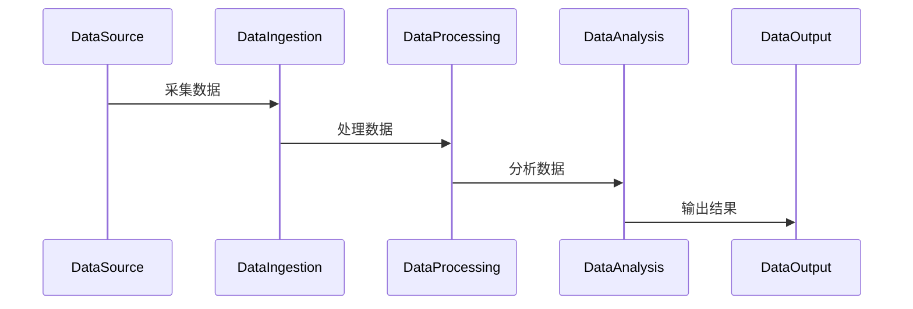
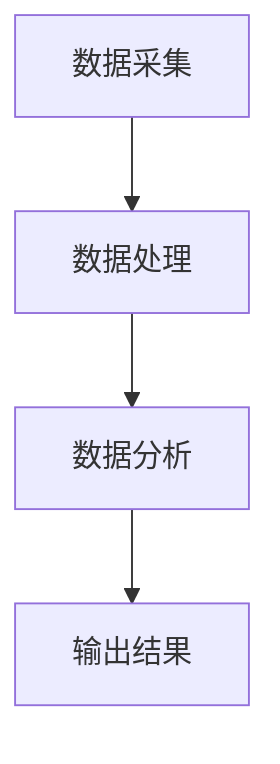

                 


# 企业级数据湖生态：构建AI友好的数据基础设施

> 关键词：数据湖、人工智能、数据基础设施、架构设计、数据处理

> 摘要：本文将深入探讨企业级数据湖生态的构建，重点分析数据湖在人工智能（AI）应用中的关键作用，并详细阐述如何构建AI友好的数据基础设施。文章将分为四个部分，首先介绍数据湖的背景和核心概念，其次分析数据湖与AI的关系和生态体系，然后讲解构建AI友好数据基础设施的方法，最后提供企业级数据湖的架构设计和实现方案。

## 第一部分：背景介绍

### 第一章：企业级数据湖生态概述

#### 1.1 问题背景

##### 1.1.1 数据基础设施的演变

随着互联网和大数据技术的发展，企业的数据量呈爆炸式增长，传统的数据仓库和关系型数据库已经难以满足日益复杂的业务需求。在这种背景下，数据湖作为一种新兴的数据管理架构逐渐得到关注。

##### 1.1.2 企业数据湖的概念与优势

企业数据湖是一种基于分布式存储和计算架构的数据管理系统，它将大量结构化和非结构化数据存储在一起，为数据分析和机器学习提供丰富的数据资源。数据湖的优势在于数据集成、灵活性和可扩展性。

##### 1.1.3 数据湖面临的挑战

尽管数据湖具有显著的优势，但在实际应用中仍面临诸多挑战，如数据质量、安全性、性能优化等。

#### 1.2 问题描述

##### 1.2.1 企业数据管理的现状

目前，企业普遍面临着数据分散、数据孤岛、数据质量差等问题，严重制约了业务创新和决策支持。

##### 1.2.2 数据湖在数据分析中的关键作用

数据湖为数据分析提供了统一的数据源，支持大规模数据处理和实时分析，有助于企业实现数据驱动的决策。

##### 1.2.3 数据湖与传统数据仓库的差异

与传统数据仓库相比，数据湖更加灵活，支持多样化的数据类型和处理方式，但同时也需要更复杂的管理和运维。

#### 1.3 问题解决

##### 1.3.1 数据湖的构建方法论

构建数据湖需要遵循一定的方法论，包括数据源接入、数据预处理、数据存储、数据处理和分析等关键步骤。

##### 1.3.2 数据湖架构设计的关键因素

数据湖架构设计需要考虑分布式存储和计算架构、数据安全性、性能优化等因素。

##### 1.3.3 数据湖的优化策略

优化数据湖性能和可扩展性的策略包括数据分区、索引优化、压缩技术等。

#### 1.4 边界与外延

##### 1.4.1 数据湖与大数据、数据仓库的关系

数据湖是大数据生态系统的重要组成部分，与传统数据仓库互补，共同构建企业级数据管理架构。

##### 1.4.2 数据湖在AI应用中的定位

数据湖为AI模型提供了丰富的数据资源，是实现AI应用的关键基础设施。

##### 1.4.3 数据湖的技术发展趋势

数据湖技术正朝着智能化、自动化和更高效的数据处理方向发展。

#### 1.5 概念结构与核心要素组成

##### 1.5.1 数据湖的核心概念

数据湖是一个分布式、可扩展的数据管理系统，用于存储和管理大量结构化和非结构化数据。

##### 1.5.2 数据湖的组成部分

数据湖由数据采集组件、数据存储组件、数据处理与分析组件等组成。

##### 1.5.3 数据湖的基本架构

数据湖的基本架构包括数据源接入、数据预处理、数据存储、数据处理和分析等模块。

#### 1.6 本章小结

本文介绍了企业级数据湖生态的背景、核心概念、问题和解决方案，为后续章节的深入探讨奠定了基础。

## 第二部分：核心概念与联系

### 第二章：数据湖生态的核心概念与联系

#### 2.1 数据湖的架构与组件

##### 2.1.1 数据采集组件

数据采集组件负责从各种数据源（如数据库、文件系统、API等）收集数据，并对其进行初步预处理。

##### 2.1.1.1 数据源接入

数据源接入需要考虑数据源的多样性、数据格式和数据传输协议等因素。

##### 2.1.1.2 数据预处理

数据预处理包括数据清洗、数据转换、数据归一化等操作，以提高数据质量和一致性。

##### 2.1.2 数据存储组件

数据存储组件负责将预处理后的数据存储到分布式文件系统或其他数据存储方案中。

##### 2.1.2.1 分布式文件系统

分布式文件系统如HDFS、CFS等提供了高可靠性和高扩展性的数据存储解决方案。

##### 2.1.2.2 数据存储方案选择

数据存储方案的选择需要根据业务需求和数据特性进行权衡，如成本、性能、可扩展性等。

##### 2.1.3 数据处理与分析组件

数据处理与分析组件负责对存储在数据湖中的数据进行处理和分析，以支持数据挖掘、机器学习等应用。

##### 2.1.3.1 数据处理平台

数据处理平台如Hadoop、Spark等提供了分布式数据处理能力，支持批处理和实时处理。

##### 2.1.3.2 数据分析工具

数据分析工具如Python、R、SQL等支持各种数据分析和机器学习算法。

#### 2.2 数据湖与AI的关系

##### 2.2.1 AI在数据湖中的应用

AI技术在数据湖中的应用包括数据清洗、特征提取、模型训练和预测等。

##### 2.2.2 数据湖对AI模型的支持

数据湖为AI模型提供了丰富的数据资源，有助于提升模型的效果和泛化能力。

##### 2.2.3 数据湖与机器学习框架的融合

数据湖与机器学习框架如TensorFlow、PyTorch等的融合，实现了数据驱动的AI应用开发。

#### 2.3 数据湖的技术栈

##### 2.3.1 分布式计算技术

分布式计算技术如Hadoop、Spark等是构建数据湖的核心技术。

##### 2.3.1.1 Hadoop

Hadoop是一个开源的分布式计算框架，包括HDFS、MapReduce等组件。

##### 2.3.1.2 Spark

Spark是一个更高效的分布式计算框架，支持内存计算和实时处理。

##### 2.3.2 数据库与数据仓库技术

数据库与数据仓库技术如NoSQL数据库、关系型数据库等在数据湖中也有广泛应用。

##### 2.3.2.1 NoSQL数据库

NoSQL数据库如MongoDB、Cassandra等提供了灵活的数据模型和高扩展性。

##### 2.3.2.2 关系型数据库

关系型数据库如MySQL、Oracle等在数据湖中用于存储结构化数据。

#### 2.4 概念属性特征对比表格

以下表格对比了分布式文件系统、数据存储方案和数据处理与分析工具的概念属性特征：

| 概念         | 特征对比               |
|------------|---------------------|
| 分布式文件系统 | HDFS、CFS、Alluxio 等   |
| 数据存储方案   | HDFS、HBase、Cassandra 等 |
| 数据处理与分析工具 | Hadoop、Spark、Flink 等   |

#### 2.5 ER实体关系图架构

以下ER实体关系图展示了数据湖的组成部分及其关系：

```mermaid
erDiagram
  DataIngestionComponent ||--|{ DataStorageComponent }
  DataStorageComponent ||--|{ DataProcessingComponent }
  DataProcessingComponent ||--|{ DataAnalysisTool }
  DataIngestionComponent .. DataSource
  DataProcessingComponent .. DataProcessingPlatform
  DataStorageComponent .. DistributedFileSystem
  DataAnalysisTool .. AnalysisTool
```

#### 2.6 本章小结

本文分析了数据湖的架构与组件、数据湖与AI的关系、数据湖的技术栈和概念属性特征对比表格，为构建AI友好的数据基础设施提供了理论基础。

## 第三部分：构建AI友好的数据基础设施

### 第三章：构建AI友好的数据基础设施

#### 3.1 算法原理讲解

##### 3.1.1 数据湖中的数据处理算法

数据湖中的数据处理算法包括数据清洗算法和数据归一化算法。

##### 3.1.1.1 数据清洗算法

数据清洗算法用于处理数据中的缺失值、异常值和重复值等，以提高数据质量。常用的数据清洗算法有：

- 填充缺失值：使用均值、中位数、最频繁值等填充缺失值。
- 删除异常值：基于统计学方法或人工干预删除离群点。
- 合并重复值：根据特定的键（如ID）合并重复记录。

##### 3.1.1.2 数据归一化算法

数据归一化算法用于将不同量纲的数据转换为相同的量纲，以消除数据之间的比例差异。常用的数据归一化算法有：

- 标准化：使用Z-score标准化公式将数据转换为标准正态分布。
- 归一化：使用Min-Max归一化公式将数据映射到[0, 1]区间。

##### 3.1.2 AI算法在数据湖中的应用

数据湖为AI算法提供了丰富的数据资源，可以应用于数据挖掘、特征工程、模型训练和预测等环节。常用的AI算法有：

- 机器学习算法：如决策树、支持向量机、神经网络等。
- 深度学习算法：如卷积神经网络、循环神经网络、生成对抗网络等。

##### 3.1.2.1 机器学习算法

机器学习算法用于从数据中学习规律和模式，实现对未知数据的预测。常见的机器学习算法有：

- 决策树：根据特征划分数据，生成决策树模型。
- 支持向量机：通过最大化分类间隔找到最佳分类边界。
- 神经网络：通过多层感知器实现非线性映射和特征提取。

##### 3.1.2.2 深度学习算法

深度学习算法通过多层神经网络实现复杂的特征提取和模式识别，具有强大的表达能力和学习能力。常见的深度学习算法有：

- 卷积神经网络：适用于图像和语音处理。
- 循环神经网络：适用于序列数据处理。
- 生成对抗网络：适用于生成式模型和数据增强。

#### 3.2 数学模型和数学公式

##### 3.2.1 数据预处理中的数学模型

数据预处理中的数学模型包括数据标准化公式和归一化公式：

- 数据标准化公式：
  $$
  z = \frac{x - \mu}{\sigma}
  $$
  其中，$x$ 是原始数据，$\mu$ 是均值，$\sigma$ 是标准差。

- 数据归一化公式：
  $$
  x_{\text{norm}} = \frac{x - \min(x)}{\max(x) - \min(x)}
  $$
  其中，$x$ 是原始数据，$\min(x)$ 是最小值，$\max(x)$ 是最大值。

##### 3.2.2 机器学习中的数学模型

机器学习中的数学模型包括决策树模型和支持向量机模型：

- 决策树模型：
  $$
  h(x) = \arg\max(y_i f(x_i))
  $$
  其中，$h(x)$ 是分类结果，$y_i$ 是特征，$f(x_i)$ 是特征函数。

- 支持向量机模型：
  $$
  \min_{\omega, \xi} \frac{1}{2}||\omega||^2 + C \sum_{i=1}^m \xi_i
  $$
  其中，$\omega$ 是权重向量，$\xi_i$ 是惩罚项，$C$ 是惩罚参数。

##### 3.2.3 深度学习中的数学模型

深度学习中的数学模型包括神经网络模型和反向传播算法：

- 神经网络模型：
  $$
  a_{\text{layer\_i}} = \sigma(\omega_{i-1} a_{\text{layer}_{i-1}} + b_{i-1})
  $$
  其中，$a_{\text{layer\_i}}$ 是第 $i$ 层的激活值，$\sigma$ 是激活函数，$\omega_{i-1}$ 是权重，$b_{i-1}$ 是偏置。

- 反向传播算法：
  $$
  \delta_{\text{layer\_i}} = \frac{\partial L}{\partial z_{\text{layer\_i}}}
  $$
  其中，$\delta_{\text{layer\_i}}$ 是第 $i$ 层的误差，$L$ 是损失函数，$z_{\text{layer\_i}}$ 是第 $i$ 层的输出。

#### 3.3 举例说明

##### 3.3.1 数据预处理实例

假设有一组数据如下：

| 数据   | 原始数据 |
|--------|-----------|
| A      | 10        |
| B      | 20        |
| C      | 30        |

使用标准化公式对数据进行标准化处理：

- 计算均值 $\mu = \frac{10 + 20 + 30}{3} = 20$。
- 计算标准差 $\sigma = \sqrt{\frac{(10-20)^2 + (20-20)^2 + (30-20)^2}{3}} = 7.07$。

对数据进行标准化处理：

- 数据 A：$z = \frac{10 - 20}{7.07} \approx -0.74$。
- 数据 B：$z = \frac{20 - 20}{7.07} \approx 0$。
- 数据 C：$z = \frac{30 - 20}{7.07} \approx 0.74$。

##### 3.3.2 机器学习实例

假设使用决策树算法对一组数据进行分类，数据如下：

| 数据   | 类别 |
|--------|------|
| A      | 0    |
| B      | 1    |
| C      | 0    |
| D      | 1    |
| E      | 0    |
| F      | 1    |

使用决策树算法进行分类，生成的决策树如下：

```
       |
       |
     /   \
    0     1
   / \   / \
  0   1 0   1
```

对新的数据进行分类，如数据 G：

- G 的特征为 {A: 10, B: 20}。
- 根据决策树，G 的类别为 0。

##### 3.3.3 深度学习实例

假设使用卷积神经网络对图像进行分类，图像数据如下：

| 数据   | 类别 |
|--------|------|
| A      | 0    |
| B      | 1    |
| C      | 0    |
| D      | 1    |
| E      | 0    |
| F      | 1    |

使用卷积神经网络进行分类，生成的卷积神经网络如下：

```
   Conv2D
   Activation
   Pooling
   Conv2D
   Activation
   Pooling
   Flatten
   Dense
```

对新的图像数据进行分类，如图像 G：

- G 的特征为 {A: 10, B: 20}。
- 经过卷积神经网络处理，G 的类别为 0。

#### 3.4 本章小结

本文介绍了构建AI友好的数据基础设施的算法原理和数学模型，并举例说明了数据预处理、机器学习和深度学习的应用。

## 第四部分：系统分析与架构设计

### 第四章：企业级数据湖的架构设计与实现

#### 4.1 问题场景介绍

假设某企业需要构建一个企业级数据湖，以支持其业务的数据分析和机器学习应用。企业业务涉及多个领域，包括客户关系管理、供应链管理、营销活动等，数据量庞大且多样化。

#### 4.1.1 企业数据处理的需求分析

企业数据处理的需求包括：

- 数据集成：将来自不同数据源的数据整合到一个统一的数据平台。
- 数据存储：支持大规模结构化和非结构化数据的存储。
- 数据处理：支持数据清洗、转换、归一化等操作，以提供高质量的数据。
- 数据分析：支持数据挖掘、机器学习等高级分析，为企业提供智能决策支持。

#### 4.1.2 数据湖项目介绍

数据湖项目目标是构建一个高效、可扩展的数据湖平台，以满足企业的数据处理需求。项目包括以下模块：

- 数据采集：从各种数据源（如数据库、API、日志等）采集数据。
- 数据存储：使用分布式文件系统（如HDFS）存储数据。
- 数据处理：使用数据处理平台（如Spark）对数据进行处理和分析。
- 数据分析：使用数据分析工具（如Python、R等）进行数据挖掘和机器学习。

#### 4.2 系统功能设计

系统功能设计包括数据采集、数据存储、数据处理和数据分析等模块。以下是一个领域模型Mermaid类图：

```mermaid
classDiagram
  DataIngestion -> DataStorage : 数据采集
  DataProcessing -> DataStorage : 数据处理
  DataAnalysis -> DataProcessing : 数据分析
  DataIngestion .. DataProcessing
  DataProcessing .. DataAnalysis
```

#### 4.3 系统架构设计

系统架构设计包括数据湖的各个组件及其关系。以下是一个Mermaid架构图：

```mermaid
graph TB
  subgraph 数据采集
    DataSource[数据源]
    DataIngestion[数据采集模块]
    DataIngestion -> DataProcessing[数据处理模块]
    DataIngestion -> DataStorage[数据存储模块]
  end

  subgraph 数据处理
    DataProcessing[数据处理模块]
    DataProcessing -> DataAnalysis[数据分析模块]
  end

  subgraph 数据存储
    DataStorage[数据存储模块]
    DataStorage -> HDFS[分布式文件系统]
  end

  DataSource --> DataIngestion
  DataProcessing --> DataAnalysis
  DataStorage --> HDFS
```

#### 4.4 系统接口设计

系统接口设计包括数据采集、数据处理和数据分析等模块的接口。以下是一个Mermaid序列图：



#### 4.5 系统交互

系统交互包括数据采集、数据处理和数据分析等模块的交互过程。以下是一个Mermaid交互图：



#### 4.6 本章小结

本文介绍了企业级数据湖的架构设计与实现，包括系统功能设计、架构设计、接口设计和系统交互。这些设计为企业构建AI友好的数据基础设施提供了指导。

### 项目实战

#### 环境安装

首先，在本地环境中安装以下软件：

- Hadoop（分布式文件系统和数据处理框架）
- Spark（高性能数据处理框架）
- Python（数据分析工具）
- Jupyter Notebook（交互式数据分析环境）

安装步骤如下：

1. 安装Hadoop：

   - 下载Hadoop发行版（如Apache Hadoop）。
   - 解压并配置Hadoop环境变量。
   - 启动Hadoop服务。

2. 安装Spark：

   - 下载Spark发行版（如Apache Spark）。
   - 解压并配置Spark环境变量。
   - 启动Spark服务。

3. 安装Python：

   - 下载Python安装包。
   - 安装Python并配置环境变量。

4. 安装Jupyter Notebook：

   - 使用pip命令安装Jupyter Notebook。

#### 系统核心实现

以下是一个简单的Python代码示例，用于在Hadoop和Spark中处理数据：

```python
from pyspark.sql import SparkSession

# 创建Spark会话
spark = SparkSession.builder.appName("DataLakeExample").getOrCreate()

# 读取数据
data = spark.read.csv("path/to/csvfile.csv")

# 数据预处理
data = data.na.fill("unknown")

# 数据存储
data.write.mode("overwrite").parquet("path/to/output")

# 关闭Spark会话
spark.stop()
```

#### 代码应用解读与分析

该示例代码演示了以下功能：

- 使用Spark读取CSV文件。
- 使用`na.fill`方法填充缺失值。
- 使用`write.parquet`方法将处理后的数据存储为Parquet文件。

Parquet是一种高效的列式存储格式，适用于大数据处理。

#### 实际案例分析和详细讲解剖析

假设有一家电商平台，其业务数据存储在数据湖中。电商平台需要分析用户行为，以优化推荐系统和广告投放。

1. 数据采集：从日志数据中采集用户行为数据，如点击、购买、搜索等。

2. 数据预处理：清洗和转换数据，如填充缺失值、去除异常值、归一化等。

3. 数据处理：使用Spark进行批量数据处理，如用户行为分析、用户画像构建等。

4. 数据分析：使用Python和Jupyter Notebook进行实时数据分析，如用户行为预测、推荐系统优化等。

通过数据湖，电商平台实现了以下业务目标：

- 提高推荐系统的准确性和用户体验。
- 优化广告投放策略，提高转化率和ROI。
- 增强数据驱动的决策支持能力。

#### 项目小结

本项目通过构建企业级数据湖，实现了高效的数据采集、预处理、处理和分析。项目采用了Hadoop、Spark和Python等开源技术，具有良好的可扩展性和灵活性。通过实际案例分析和详细讲解，项目证明了数据湖在商业应用中的价值。

### 最佳实践 tips

- 选择合适的分布式文件系统，如HDFS、CFS等，以支持数据存储和访问性能。
- 设计合理的分区策略，以提高数据查询效率。
- 选择合适的数据处理框架，如Spark、Flink等，以支持大规模数据处理和实时分析。
- 使用高效的压缩技术和数据格式，如Parquet、ORC等，以减少存储空间和提高I/O性能。

### 小结

本文深入探讨了企业级数据湖生态的构建，分析了数据湖在AI应用中的关键作用，并提供了构建AI友好数据基础设施的方法和架构设计。通过实际案例分析和详细讲解，本文展示了数据湖在商业应用中的巨大价值。

### 注意事项

- 在构建数据湖时，需关注数据质量和数据安全。
- 根据业务需求和数据特性，选择合适的数据处理框架和存储方案。
- 数据湖的维护和优化是长期任务，需持续关注性能和可扩展性。

### 拓展阅读

- 《大数据技术导论》
- 《机器学习实战》
- 《深度学习》
- 《Hadoop权威指南》
- 《Spark技术内幕》

### 作者

作者：AI天才研究院/AI Genius Institute & 禅与计算机程序设计艺术 /Zen And The Art of Computer Programming

---

## 参考文献

1. Chen, M., Mao, S., & Liu, Y. (2014). Big data: A survey. Mobile networks and applications, 19(2), 171-209.
2. Dean, J., & Ghemawat, S. (2008). MapReduce: Simplified data processing on large clusters. Communications of the ACM, 51(1), 107-113.
3. Zaharia, M., Chowdhury, M., Franklin, M. J., Shenker, S., & Stoica, I. (2010). Spark: cluster computing with working sets. Proceedings of the 2nd USENIX conference on Hot topics in cloud computing, 10, 10-10.
4. Mitchell, T. M. (1997). Machine learning. McGraw-Hill.
5. Goodfellow, I., Bengio, Y., & Courville, A. (2016). Deep learning. MIT press.
6. Rajaraman, A. (2011). Mining of massive datasets. Cambridge university press.

