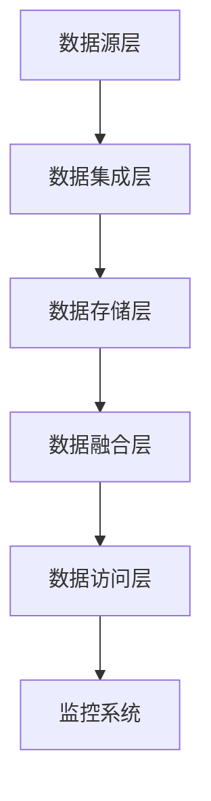
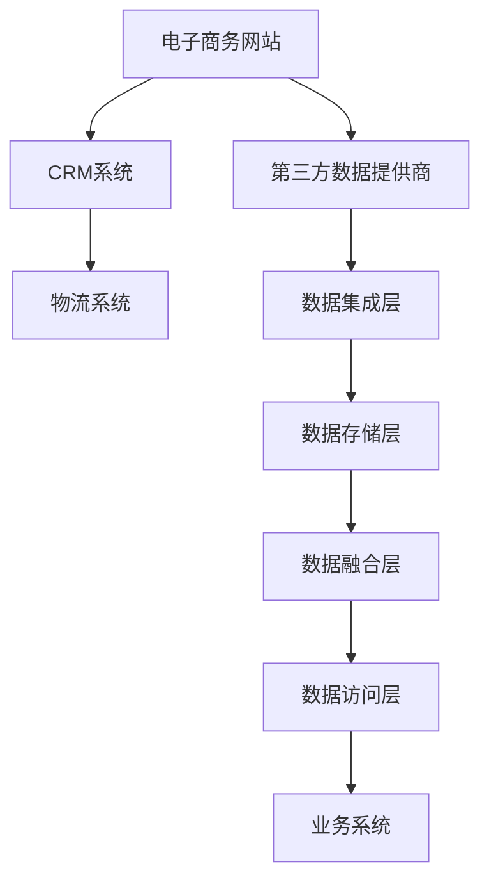
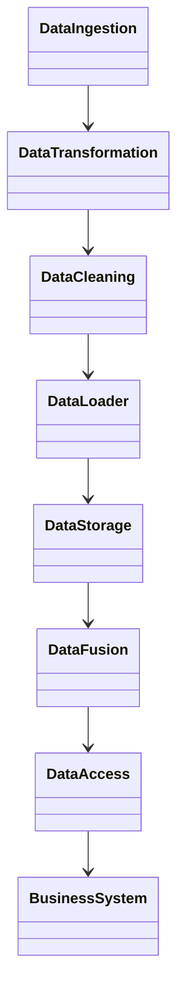

                 

### 引言：企业级数据融合平台的背景与意义

在现代商业环境中，数据已经成为企业竞争力的核心资源。然而，随着数据来源的多样化，企业面临的挑战也越来越大。传统的数据处理方式已无法满足日益增长的数据量和复杂度，因此，构建一个高效、可靠的企业级数据融合平台变得尤为重要。数据融合平台能够将来自不同来源、格式和结构的数据整合在一起，提供统一的数据视图，为企业的决策支持提供强有力的支持。

#### 1.1 问题的背景与意义

**问题背景**：
- **数据源多样化**：企业内部的数据源日益增多，包括ERP系统、CRM系统、物流系统、社交媒体等，这些数据源的数据格式和结构各不相同。
- **数据孤岛现象**：不同系统之间的数据无法有效共享和整合，导致信息的不一致和冲突。
- **数据分析的挑战**：由于数据分散，数据分析变得复杂和耗时，难以快速响应业务需求。

**问题的意义**：
- **提升决策效率**：通过数据融合平台，企业可以快速获取全局数据视图，从而做出更加精准和快速的决策。
- **优化业务流程**：数据融合平台可以帮助企业优化业务流程，减少重复工作和数据冗余，提高运营效率。
- **增加竞争力**：具备先进数据融合能力的企业在市场竞争中更具优势，能够更好地满足客户需求，提升用户体验。

#### 1.2 数据融合平台的概念

**概念说明**：
- **数据融合**：数据融合是指将来自多个数据源的数据进行整合、清洗、转换，最终形成一个统一的数据视图。
- **数据融合平台**：数据融合平台是一个综合性的系统，能够实现数据集成、数据清洗、数据转换、数据存储、数据分析等全流程的功能。

#### 1.3 数据融合的目标与挑战

**目标**：
- **统一数据视图**：通过数据融合，实现不同数据源的统一整合，为企业提供一个全局的数据视图。
- **提高数据质量**：数据融合过程中，对数据进行清洗、转换和标准化，提高数据的准确性和一致性。
- **增强数据可用性**：通过数据融合，使数据更易于分析和使用，为企业的各项业务提供强有力的数据支持。

**挑战**：
- **数据格式和结构差异**：不同数据源的数据格式和结构可能存在巨大差异，需要开发复杂的数据转换和清洗算法。
- **数据同步与更新**：数据融合平台需要实现数据的实时同步与更新，以保持数据的实时性和准确性。
- **性能与可扩展性**：数据融合平台需要具备高性能和高可扩展性，能够处理大规模的数据。

在接下来的章节中，我们将详细探讨数据融合平台的设计与实现，包括数据源与集成方法、多源数据一致性处理、数据融合算法原理、数据融合平台的设计与实现、应用案例以及未来展望与挑战。

#### 数据源与集成方法

在现代企业中，数据来源是多种多样的。这些数据源不仅包括企业内部的数据系统，如ERP（企业资源计划）、CRM（客户关系管理）、物流管理等，还包括来自外部的数据源，如社交媒体、第三方API等。这些数据源往往具有不同的数据格式、结构和技术规范，如何高效地集成和整合这些数据，是企业级数据融合平台面临的首要挑战。

##### 2.1 数据源概述

数据源是指数据的来源，可以是数据库、文件、Web服务等多种形式。以下是几种常见的数据源类型：

1. **关系型数据库**：如MySQL、PostgreSQL等，它们以表格形式存储数据，具有结构化查询语言（SQL）支持。
2. **NoSQL数据库**：如MongoDB、Cassandra等，它们以非结构化或半结构化形式存储数据，提供高性能和高扩展性。
3. **数据仓库**：如Amazon Redshift、Google BigQuery等，用于大规模数据存储和分析。
4. **文件系统**：包括本地文件系统、云存储服务等，如HDFS（Hadoop分布式文件系统）。
5. **Web服务**：通过API接口获取外部数据，如社交媒体数据、第三方数据服务等。

##### 2.2 数据集成方法

数据集成是将来自不同数据源的数据进行整合和合并，以形成统一数据视图的过程。以下是几种常见的数据集成方法：

1. **ETL（Extract, Transform, Load）**：ETL是指从数据源中抽取数据，进行转换和清洗，然后将处理后的数据加载到目标系统的过程。ETL方法广泛应用于数据仓库和大数据项目中。

2. **批量处理**：批量处理是指定期执行的数据集成任务，如每天或每周处理一次。这种方法适用于数据量较大且变化不频繁的场景。

3. **实时处理**：实时处理是指在数据生成的同时进行数据集成，如通过流处理技术（如Apache Kafka、Apache Flink）实时获取和处理数据。这种方法适用于需要实时决策和分析的场景。

4. **增量处理**：增量处理是指仅处理新添加或更新的数据，而不是整个数据集。这种方法可以减少数据处理的负载，提高效率。

##### 2.3 数据源集成技术

**ETL工具**

ETL工具是数据集成过程中常用的工具，如：

1. **Apache NiFi**：一个基于Web的用户界面，用于构建、管理和执行数据流。
2. **Apache Kafka**：一个分布式流处理平台，用于处理和存储数据流。
3. **Talend**：一个商业ETL工具，提供丰富的数据集成功能。
4. **Informatica**：一个商业ETL工具，提供强大的数据集成和数据管理功能。

**数据仓库技术**

数据仓库是用于存储和管理大规模数据集的系统，常见的开源数据仓库技术包括：

1. **Amazon Redshift**：一个基于AWS的云数据仓库服务。
2. **Google BigQuery**：一个基于Google Cloud的数据仓库服务。
3. **Apache Hadoop**：一个分布式数据处理框架，用于大规模数据存储和分析。
4. **Apache Hive**：一个基于Hadoop的数据仓库基础设施，用于数据分析。

##### 2.4 数据质量保障

数据质量是数据集成过程中的关键因素。以下是几种常见的保障数据质量的方法：

1. **数据清洗**：通过去除重复记录、纠正错误、填充缺失值等手段，提高数据准确性。
2. **数据验证**：通过校验数据格式、数据范围、数据一致性等，确保数据符合预期。
3. **数据监控**：通过实时监控数据质量，及时发现和处理数据问题。
4. **数据治理**：制定数据管理策略和标准，确保数据质量和数据安全。

##### 2.5 数据源集成案例

以下是一个数据源集成的案例：

**案例背景**：
某大型零售企业需要将来自ERP系统、CRM系统和物流系统的数据集成到一个数据仓库中，以支持数据分析和管理决策。

**案例步骤**：

1. **数据抽取**：使用ETL工具从ERP系统、CRM系统和物流系统中抽取数据。
2. **数据转换**：对抽取的数据进行清洗、格式转换和合并，以统一数据格式和结构。
3. **数据加载**：将转换后的数据加载到数据仓库中。
4. **数据验证**：对加载到数据仓库中的数据进行验证，确保数据质量。
5. **数据分析**：通过数据仓库进行数据分析和报表生成，支持企业的业务决策。

通过以上数据源集成方法和技术，企业级数据融合平台能够有效地整合多源数据，提供统一的数据视图，为企业的决策支持提供强有力的支持。

#### 多源数据一致性处理

在数据融合平台中，多源数据一致性处理是一个至关重要的环节。由于数据来源的多样性和复杂性，不同数据源之间的数据格式、结构、语义和时效性都可能存在差异，从而导致数据不一致性问题。解决这些问题不仅能够提高数据质量，还能确保数据融合平台提供准确、可靠的统一数据视图。

##### 3.1 数据一致性问题

**数据一致性问题**是指多个数据源中的数据在格式、内容、语义或时效性等方面存在不一致的情况。常见的数据一致性问题包括：

1. **数据格式差异**：不同数据源的数据格式可能不同，如XML、JSON、CSV等，导致数据无法直接整合。
2. **数据结构差异**：不同数据源的数据结构可能存在差异，如不同的字段名称、数据类型、索引等，导致数据无法正确映射和转换。
3. **数据语义差异**：相同字段在不同数据源中可能具有不同的语义，如“姓名”字段在不同的数据源中可能代表不同的信息。
4. **数据时效性差异**：不同数据源的数据更新频率可能不同，导致数据在时间戳上的不一致。

**数据不一致性**会导致以下问题：

1. **数据质量问题**：数据不一致会导致数据准确性下降，影响数据分析的结果。
2. **业务决策风险**：基于不一致的数据进行决策，可能导致错误的业务策略和决策。
3. **系统性能问题**：数据不一致会增加数据处理的复杂性，降低系统性能。

##### 3.2 数据清洗与处理

数据清洗与处理是解决数据一致性问题的重要手段，包括以下步骤：

1. **数据抽取**：从各个数据源中抽取数据，确保数据完整性。
2. **数据转换**：对抽取的数据进行格式转换、结构映射和数据类型转换，以统一数据格式和结构。
   - **格式转换**：将XML、JSON、CSV等不同格式的数据转换为统一格式，如JSON。
   - **结构映射**：将不同数据源中的相同字段映射到统一的结构中，如将不同数据源中的“姓名”字段映射到同一字段。
   - **数据类型转换**：将不同数据类型的数据转换为统一的数据类型，如将字符串转换为日期格式。
3. **数据校验**：对转换后的数据进行校验，确保数据的准确性和一致性。
   - **字段校验**：检查字段是否为空、格式是否正确、数据范围是否符合预期等。
   - **一致性校验**：检查不同数据源之间的数据是否一致，如检查同一客户在不同数据源中的姓名、电话等是否相同。
4. **数据清洗**：对数据中的错误、重复、缺失等进行处理。
   - **错误处理**：识别并修正数据中的错误，如纠正拼写错误、格式错误等。
   - **重复处理**：识别并删除重复的数据记录，以减少数据冗余。
   - **缺失处理**：对缺失的数据进行填充，如使用平均值、中值或插值法。

##### 3.3 数据标准化与格式化

数据标准化与格式化是确保数据一致性的重要步骤，包括以下内容：

1. **字段命名标准化**：统一不同数据源中的字段命名，如将“姓名”、“Name”、“username”等统一命名为“Name”。
2. **数据类型标准化**：统一不同数据源中的数据类型，如将字符串、浮点数、日期等数据类型进行标准化。
3. **数据格式标准化**：统一不同数据源中的数据格式，如将日期格式统一为YYYY-MM-DD。
4. **单位标准化**：统一不同数据源中的单位，如将货币单位统一为USD。

##### 3.4 数据同步与更新策略

数据同步与更新策略是确保数据一致性的关键，包括以下内容：

1. **实时同步**：在数据生成的同时进行同步，确保数据实时更新，适用于高频次数据更新的场景。
2. **批量同步**：定期（如每天或每周）进行数据同步，适用于数据更新频率较低的场景。
3. **增量同步**：仅同步新添加或更新的数据，减少数据同步的工作量，适用于大规模数据集的场景。
4. **一致性检查**：定期对同步后的数据进行一致性检查，确保数据同步的正确性。

通过以上数据清洗与处理、数据标准化与格式化、数据同步与更新策略，企业级数据融合平台能够有效地解决多源数据的一致性问题，提供准确、一致的数据视图，为企业的决策支持提供可靠的保障。

#### 数据融合算法原理

数据融合算法是数据融合平台的核心组成部分，负责将来自不同数据源的数据进行整合和分析，以生成有用的信息和知识。数据融合算法的原理和类型多种多样，根据不同的应用场景和数据特点，可以选择合适的算法来实现数据融合的目标。以下我们将详细探讨几种常见的数据融合算法及其工作原理。

##### 4.1 数据融合算法概述

数据融合算法的基本原理是利用多个数据源提供的信息，通过一定的算法和模型，将这些信息进行整合和优化，从而提高数据的质量和可靠性。数据融合算法的主要目标包括：

1. **提高数据质量**：通过融合多个数据源的数据，消除数据中的噪声、错误和冗余，提高数据的准确性和一致性。
2. **降低数据维度**：将高维数据转换为低维数据，简化数据的处理和分析过程，提高系统的效率和可解释性。
3. **增强决策支持**：通过融合分析，提供更全面、准确的数据视图，为企业的决策支持提供强有力的支持。

##### 4.2 数据融合算法类型

数据融合算法可以分为以下几类：

1. **统计分析方法**：通过统计学原理对数据进行分析和融合，如聚类分析、主成分分析、回归分析等。
2. **机器学习方法**：利用机器学习算法，如神经网络、支持向量机、决策树等，对数据进行融合和预测。
3. **数据库方法**：利用数据库技术，如关系型数据库、NoSQL数据库等，对数据进行集成和查询。
4. **分布式计算方法**：利用分布式计算框架，如MapReduce、Spark等，对大规模数据集进行高效的数据融合。

以下是几种常见的统计分析方法：

1. **聚类分析**：将数据集划分为若干个类别，使同类别内的数据尽可能接近，不同类别内的数据尽可能分离。常用的聚类算法包括K-means、层次聚类等。

2. **主成分分析**（PCA）：通过线性变换，将高维数据映射到低维空间，同时保留数据的最大方差。PCA能够降低数据的维度，同时保留数据的主要信息。

3. **回归分析**：通过建立回归模型，分析自变量和因变量之间的关系，实现对数据的预测和融合。常用的回归算法包括线性回归、多元回归等。

以下是几种常见的机器学习方法：

1. **神经网络**：通过模拟人脑神经网络的结构和功能，对数据进行学习和融合。常用的神经网络模型包括多层感知器（MLP）、卷积神经网络（CNN）、循环神经网络（RNN）等。

2. **支持向量机**（SVM）：通过寻找一个最佳的超平面，将不同类别的数据分离开来，实现数据的融合和分类。

3. **决策树**：通过构建决策树模型，对数据进行分类和预测。决策树能够将复杂的数据关系转化为一系列简单的条件判断，便于理解和解释。

以下是几种常见的数据库方法：

1. **关系型数据库**：通过关系型数据库管理系统（如MySQL、PostgreSQL等），对数据进行存储、管理和查询。关系型数据库提供丰富的查询语言（如SQL），支持复杂的数据查询和分析。

2. **NoSQL数据库**：通过NoSQL数据库管理系统（如MongoDB、Cassandra等），对非结构化或半结构化数据进行存储和管理。NoSQL数据库提供灵活的数据模型，能够适应不同类型的数据存储需求。

以下是几种常见的分布式计算方法：

1. **MapReduce**：通过Map和Reduce两个阶段，对大规模数据集进行并行处理。Map阶段对数据进行映射，生成中间结果；Reduce阶段对中间结果进行合并和汇总，生成最终结果。

2. **Spark**：基于内存计算的分布式计算框架，能够实现快速的数据处理和分析。Spark提供丰富的算法库，包括机器学习、图处理、流处理等，适用于多种数据处理场景。

##### 4.3 算法比较与选择

在选择数据融合算法时，需要考虑以下因素：

1. **数据类型**：不同的算法适用于不同类型的数据。例如，统计分析方法适用于结构化数据，机器学习方法适用于非结构化或半结构化数据。

2. **数据量**：算法的效率和性能受到数据量的影响。对于大规模数据集，分布式计算方法（如MapReduce、Spark）具有更高的效率。

3. **应用场景**：根据具体的应用场景，选择适合的算法。例如，在预测分析场景中，可以选择机器学习方法；在数据清洗和去重场景中，可以选择统计分析方法。

4. **可解释性**：算法的可解释性对于数据分析和决策支持至关重要。一些算法（如决策树）能够提供清晰的决策路径，便于理解和解释。

通过以上算法类型和选择策略，企业级数据融合平台能够根据具体需求，选择合适的数据融合算法，实现高效、准确的数据融合和分析。

#### 数据融合平台设计与实现

在完成数据融合算法原理的探讨后，接下来我们将深入讨论企业级数据融合平台的设计与实现。数据融合平台的设计需要考虑系统架构、模块设计、性能优化等多个方面，以确保系统能够高效、可靠地运行。以下是详细的设计与实现过程。

##### 5.1 数据融合平台架构设计

数据融合平台的架构设计是系统实现的基础，需要考虑系统的扩展性、稳定性和性能。以下是数据融合平台的基本架构设计：

1. **数据源层**：包括各种数据源，如关系型数据库、NoSQL数据库、文件系统、Web服务等。
2. **数据集成层**：负责从数据源中抽取数据，并进行转换、清洗和加载，实现数据的集成。
3. **数据存储层**：用于存储经过清洗和转换后的数据，支持快速查询和访问。
4. **数据融合层**：利用数据融合算法对数据进行整合和分析，生成统一的数据视图。
5. **数据访问层**：提供数据查询、分析和报表生成的接口，供业务系统或其他应用程序使用。
6. **监控系统**：实时监控数据融合平台的运行状态，包括数据流量、系统负载、数据质量等。

以下是数据融合平台的架构图（使用Mermaid图表表示）：



##### 5.2 数据融合模块设计

数据融合平台由多个模块组成，每个模块负责不同的功能。以下是数据融合模块的详细设计：

1. **数据抽取模块**：负责从不同的数据源中抽取数据，支持批量抽取和实时抽取。数据抽取模块需要考虑数据源的类型、数据格式和访问权限。

2. **数据转换模块**：负责对抽取的数据进行格式转换、结构映射和数据类型转换，以实现数据的标准化和一致性。数据转换模块需要支持多种数据格式的转换和复杂的数据处理逻辑。

3. **数据清洗模块**：负责对数据进行清洗，包括去除重复记录、纠正错误、填充缺失值等。数据清洗模块需要支持多种数据清洗算法和策略，确保数据质量。

4. **数据加载模块**：负责将清洗和转换后的数据加载到数据存储层。数据加载模块需要支持批量加载和增量加载，以适应不同场景的数据加载需求。

5. **数据存储模块**：负责存储和管理数据，支持快速查询和访问。数据存储模块需要支持多种存储方案，如关系型数据库、NoSQL数据库、文件系统等。

6. **数据融合模块**：负责利用数据融合算法对数据进行整合和分析，生成统一的数据视图。数据融合模块需要支持多种数据融合算法，如统计分析方法、机器学习方法等。

7. **数据访问模块**：提供数据查询、分析和报表生成的接口，供业务系统或其他应用程序使用。数据访问模块需要支持多种数据查询语言和报表工具，如SQL、JDBC、报表工具等。

以下是数据融合模块的类图（使用Mermaid图表表示）：

```mermaid
classDiagram
    DataSource --|>| DataExtractor
    DataExtractor --|>| DataTransformer
    DataTransformer --|>| DataCleaner
    DataCleaner --|>| DataLoader
    DataLoader --|>| DataStorage
    DataStorage --|>| DataFusion
    DataFusion --|>| DataAccessor
```

##### 5.3 数据融合算法实现

数据融合算法是数据融合平台的核心功能，需要考虑算法的选择、实现和优化。以下是几种常见数据融合算法的实现：

1. **聚类分析算法（如K-means）**：
   - **算法原理**：K-means算法是一种基于距离度量的聚类方法，通过最小化聚类中心之间的距离，将数据划分为若干个簇。
   - **实现步骤**：
     1. 初始化聚类中心。
     2. 计算每个数据点与聚类中心的距离。
     3. 根据距离最小的聚类中心，将数据点划分到对应的簇。
     4. 更新聚类中心，重复步骤2和3，直到收敛。
   - **代码实现**（Python示例）：

     ```python
     from sklearn.cluster import KMeans
     import numpy as np

     def k_means(data, k):
         kmeans = KMeans(n_clusters=k, random_state=0).fit(data)
         clusters = kmeans.predict(data)
         return clusters

     data = np.array([[1, 2], [1, 4], [1, 0], [10, 2], [10, 4], [10, 0]])
     k = 2
     clusters = k_means(data, k)
     print(clusters)
     ```

2. **主成分分析算法（PCA）**：
   - **算法原理**：PCA通过线性变换，将高维数据映射到低维空间，同时保留数据的最大方差。
   - **实现步骤**：
     1. 计算数据矩阵的协方差矩阵。
     2. 计算协方差矩阵的特征值和特征向量。
     3. 根据特征值排序，选择前若干个特征向量。
     4. 将数据映射到低维空间。
   - **代码实现**（Python示例）：

     ```python
     from sklearn.decomposition import PCA
     import numpy as np

     def pca(data, n_components):
         pca = PCA(n_components=n_components).fit(data)
         transformed_data = pca.transform(data)
         return transformed_data

     data = np.array([[1, 2], [1, 4], [1, 0], [10, 2], [10, 4], [10, 0]])
     n_components = 2
     transformed_data = pca(data, n_components)
     print(transformed_data)
     ```

3. **神经网络算法**：
   - **算法原理**：神经网络通过多层神经元结构，对数据进行学习和融合，能够实现复杂的数据映射和分类。
   - **实现步骤**：
     1. 定义神经网络结构，包括输入层、隐藏层和输出层。
     2. 初始化网络权重和偏置。
     3. 前向传播计算输出值。
     4. 反向传播计算误差，更新网络权重和偏置。
     5. 重复步骤3和4，直到达到预设的收敛条件。
   - **代码实现**（Python示例）：

     ```python
     import numpy as np
     from sklearn.neural_network import MLPClassifier

     def neural_network(data, labels, hidden_layer_sizes):
         mlp = MLPClassifier(hidden_layer_sizes=hidden_layer_sizes, max_iter=1000)
         mlp.fit(data, labels)
         return mlp

     data = np.array([[1, 2], [1, 4], [1, 0], [10, 2], [10, 4], [10, 0]])
     labels = np.array([0, 0, 0, 1, 1, 1])
     hidden_layer_sizes = (10,)
     mlp = neural_network(data, labels, hidden_layer_sizes)
     print(mlp.predict(data))
     ```

##### 5.4 平台性能优化

数据融合平台在高并发、大数据量场景下，性能优化至关重要。以下是几种常见的性能优化策略：

1. **并行处理**：利用多线程、多进程或分布式计算技术，提高数据处理速度。例如，可以使用MapReduce或Spark等分布式计算框架。

2. **缓存机制**：使用缓存技术（如Redis、Memcached）存储常用数据，减少数据访问的延迟。

3. **数据库优化**：优化数据库性能，包括索引优化、查询优化、数据分片等。

4. **数据压缩**：对数据使用压缩算法（如gzip、LZ4）进行压缩，减少数据传输和存储的开销。

5. **负载均衡**：使用负载均衡器（如Nginx、HAProxy）分发请求，确保系统资源的合理利用。

通过以上设计与实现，企业级数据融合平台能够高效、可靠地运行，为企业的数据分析和决策支持提供强有力的支持。

### 企业级数据融合平台应用案例

在实际应用中，企业级数据融合平台已经为众多企业带来了显著的业务价值。以下是一个具体的应用案例，通过详细描述平台的设计与实施过程，展示数据融合平台如何帮助企业实现业务目标。

#### 6.1 案例背景与目标

某大型电子商务公司希望构建一个企业级数据融合平台，整合来自其电子商务网站、客户关系管理（CRM）系统、物流系统和第三方数据提供商的多源数据。公司的主要目标包括：

1. **提升数据分析效率**：通过整合多源数据，提供统一的数据视图，使数据分析团队能够快速获取所需数据，提高工作效率。
2. **优化库存管理**：利用数据融合平台分析库存数据，优化库存策略，减少库存积压和缺货现象，提高库存周转率。
3. **提升客户体验**：通过分析客户行为数据，优化客户关系管理，提高客户满意度，提升复购率。

#### 6.2 数据融合平台的设计与实施

**1. 系统架构设计**

系统架构设计是数据融合平台实现的基础，需要考虑数据的输入、处理、存储和输出。以下是系统架构图（使用Mermaid图表表示）：



**2. 系统功能设计**

系统功能设计包括数据抽取、数据转换、数据清洗、数据加载、数据存储、数据融合、数据访问等模块。以下是功能设计（使用Mermaid图表表示）：



**3. 数据源集成**

数据源集成是数据融合平台的核心功能，需要考虑不同数据源的接入方式、数据格式和访问权限。以下是数据源接入方案：

- **电子商务网站**：通过API接口获取订单数据、商品数据等。
- **CRM系统**：通过数据库连接获取客户信息、销售数据等。
- **物流系统**：通过数据库连接获取物流信息、运输数据等。
- **第三方数据提供商**：通过API接口获取市场趋势、行业数据等。

**4. 数据清洗与处理**

数据清洗与处理是确保数据质量和一致性的关键步骤。以下是一些数据清洗与处理策略：

- **数据抽取**：从各个数据源中抽取数据，包括订单数据、客户数据、物流数据等。
- **数据转换**：将不同数据源的数据转换为统一格式，如将订单数据的日期格式统一为YYYY-MM-DD。
- **数据清洗**：去除重复记录、纠正错误、填充缺失值等，确保数据的准确性和一致性。
- **数据验证**：对清洗后的数据进行验证，确保数据符合预期。

**5. 数据存储与融合**

数据存储与融合是数据融合平台的核心功能，需要考虑数据存储方案和数据融合算法。以下是数据存储与融合方案：

- **数据存储**：使用关系型数据库（如MySQL）存储订单数据、客户数据等；使用NoSQL数据库（如MongoDB）存储物流数据、第三方数据等。
- **数据融合**：使用聚类分析、主成分分析等算法对数据进行融合，生成统一的数据视图。

**6. 数据访问与分析**

数据访问与分析是业务系统使用数据融合平台的重要接口，需要考虑数据查询接口和分析工具。以下是数据访问与分析方案：

- **数据查询接口**：提供RESTful API接口，供业务系统或其他应用程序查询数据。
- **数据分析工具**：提供SQL查询工具、报表工具等，供数据分析团队使用。

#### 6.3 案例分析

通过数据融合平台，该电子商务公司实现了以下业务目标：

1. **提升数据分析效率**：数据融合平台为数据分析团队提供了统一的数据视图，减少了数据清洗和转换的工作量，提高了数据分析的效率。
2. **优化库存管理**：通过数据融合平台，分析库存数据，优化库存策略，降低了库存积压和缺货现象，提高了库存周转率。
3. **提升客户体验**：通过分析客户行为数据，优化客户关系管理，提高了客户满意度，提升了复购率。

#### 6.4 案例总结

通过本案例，我们可以看到数据融合平台在帮助企业实现业务目标方面的重要作用。以下是案例总结：

1. **提高数据利用率**：通过数据融合平台，企业能够高效利用多源数据，提供有价值的信息，支持业务决策。
2. **降低数据处理成本**：通过数据融合平台，减少数据清洗和转换的工作量，降低数据处理成本。
3. **提升业务效率**：通过数据融合平台，优化业务流程，提高业务效率，提升企业的竞争力。

总之，企业级数据融合平台在当今的商业环境中具有广泛的应用前景，能够为企业的决策支持提供强有力的支持，助力企业在激烈的市场竞争中脱颖而出。

### 数据融合平台的运维与监控

数据融合平台作为企业级系统，其稳定运行和高效性能对企业的业务决策和运营至关重要。因此，运维与监控成为数据融合平台管理中不可或缺的一环。以下是关于数据融合平台的运维策略、数据融合过程监控、故障处理与数据恢复，以及安全性与数据保护的内容。

#### 7.1 平台运维策略

**1. 故障预防**

- **定期维护**：定期对系统进行维护和升级，确保系统的稳定性和安全性。
- **容量规划**：根据业务需求，合理规划系统的硬件资源和软件配置，避免资源不足或浪费。
- **备份策略**：制定数据备份策略，包括数据库备份、系统备份等，确保数据的安全和可恢复性。

**2. 故障处理**

- **应急预案**：制定应急预案，当系统出现故障时，能够快速响应并解决问题。
- **日志分析**：通过日志分析工具，监控系统的运行状态，及时发现潜在问题并进行处理。
- **监控与报警**：使用监控工具，对系统运行状态进行实时监控，并设置报警机制，当系统出现异常时能够及时通知相关人员。

**3. 性能优化**

- **资源调度**：根据系统负载情况，合理调度系统资源，确保系统在高并发情况下仍能保持高效运行。
- **查询优化**：对数据库查询进行优化，如创建索引、优化SQL语句等，提高数据查询速度。

#### 7.2 数据融合过程监控

**1. 数据质量监控**

- **数据完整性监控**：监控数据抽取、转换、加载等过程中数据的完整性，确保数据的准确性和一致性。
- **数据质量检查**：定期对数据进行质量检查，如检查数据格式、数据范围、数据一致性等。

**2. 系统性能监控**

- **资源监控**：监控系统资源的使用情况，如CPU、内存、磁盘空间等，确保系统资源合理分配。
- **数据流量监控**：监控数据流量的变化情况，分析系统的负载情况。

**3. 系统稳定性监控**

- **错误率监控**：监控系统的错误率，如ETL过程中的错误、数据加载过程中的错误等，及时发现并解决问题。
- **系统负载监控**：监控系统的负载情况，如CPU利用率、内存利用率等，避免系统过载导致性能下降。

#### 7.3 故障处理与数据恢复

**1. 故障处理**

- **快速响应**：当系统出现故障时，快速响应并定位问题，确保系统尽快恢复。
- **故障排查**：通过日志分析、错误记录等方式，排查故障原因，并制定解决方案。
- **故障恢复**：根据故障原因和解决方案，进行系统恢复和数据修复。

**2. 数据恢复**

- **数据备份恢复**：当数据出现丢失或损坏时，使用备份数据进行恢复，确保数据的安全性和完整性。
- **数据修复**：对受损的数据进行修复，如纠正数据错误、修复数据缺失等。

#### 7.4 安全性与数据保护

**1. 数据加密**

- **传输加密**：对数据传输进行加密，确保数据在传输过程中不被窃取或篡改。
- **存储加密**：对存储的数据进行加密，防止数据泄露或未经授权的访问。

**2. 访问控制**

- **身份验证**：对用户进行身份验证，确保只有授权用户才能访问系统。
- **权限管理**：根据用户角色和权限，限制用户的访问范围和操作权限。

**3. 安全审计**

- **日志记录**：记录系统操作日志，如登录日志、数据访问日志等，便于进行安全审计。
- **异常检测**：使用异常检测工具，监控系统中的异常行为，及时发现潜在的安全威胁。

通过以上运维与监控策略，企业级数据融合平台能够保持稳定运行，确保数据的准确性和安全性，为企业的数据分析和业务决策提供强有力的支持。

### 未来展望与挑战

随着大数据技术的不断发展，企业级数据融合平台面临着诸多新的机遇和挑战。以下是未来数据融合技术的发展趋势、面临的挑战以及解决方案和未来研究方向。

#### 8.1 数据融合技术的发展趋势

1. **实时数据融合**：随着流处理技术的成熟，实时数据融合将成为数据融合平台的重要方向。通过实时处理和分析数据流，企业能够迅速响应市场变化，做出更加精准的决策。

2. **智能化数据融合**：利用人工智能和机器学习技术，数据融合平台将能够自动识别数据模式、预测未来趋势，提供更加智能化的数据服务。

3. **多模数据融合**：随着数据种类的多样化，数据融合平台需要支持多种数据类型（如结构化数据、半结构化数据、非结构化数据）的融合，提供统一的数据视图。

4. **边缘计算与数据融合**：边缘计算技术的发展，使得数据融合平台可以更接近数据生成源头进行数据处理，降低延迟和带宽消耗。

5. **隐私保护与数据融合**：随着数据隐私保护法规的加强，如何在确保数据隐私的前提下进行数据融合，将成为重要的研究课题。

#### 8.2 面临的挑战与解决方案

**1. 数据安全与隐私保护**

**挑战**：在数据融合过程中，如何保护数据的安全性和隐私是一个巨大的挑战。特别是当数据来自不同的数据源时，隐私泄露的风险增加。

**解决方案**：
- **数据加密**：对传输和存储的数据进行加密，确保数据在传输和存储过程中不被窃取或篡改。
- **差分隐私**：采用差分隐私技术，对数据进行匿名化处理，降低隐私泄露的风险。
- **访问控制**：实施严格的访问控制策略，确保只有授权用户才能访问敏感数据。

**2. 大数据处理性能**

**挑战**：随着数据量的不断增加，如何在大规模数据集上进行高效的数据融合和处理，是一个巨大的挑战。

**解决方案**：
- **分布式计算**：利用分布式计算框架（如Apache Hadoop、Apache Spark），将数据处理任务分布在多个节点上，提高处理性能。
- **内存计算**：采用内存计算技术，将数据存储在内存中，减少I/O操作，提高数据处理速度。

**3. 数据异构性处理**

**挑战**：不同数据源的数据格式、结构和类型各不相同，如何高效地处理和整合异构数据，是一个挑战。

**解决方案**：
- **统一数据模型**：通过构建统一的数据模型，将不同数据源的数据转换为统一格式和结构，简化数据融合过程。
- **数据转换与清洗**：采用高效的转换和清洗算法，处理不同数据源的数据格式和结构，提高数据一致性。

**4. 实时性与一致性**

**挑战**：在实时数据融合过程中，如何保证数据的一致性和实时性，是一个关键问题。

**解决方案**：
- **分布式存储与计算**：采用分布式存储和计算技术，提高系统的扩展性和容错性，确保数据处理的实时性和一致性。
- **事件驱动架构**：采用事件驱动架构，将数据处理任务与事件触发机制结合，实现数据的实时处理和响应。

#### 8.3 未来研究方向

**1. 智能数据融合算法**：研究更加智能、自适应的数据融合算法，利用人工智能和机器学习技术，实现自动化的数据融合和分析。

**2. 多模数据融合**：探索如何高效地融合多种数据类型（如结构化数据、半结构化数据、非结构化数据），提供统一的数据视图。

**3. 边缘计算与数据融合**：研究如何利用边缘计算技术，实现数据在边缘节点的处理和融合，降低延迟和带宽消耗。

**4. 隐私保护与数据融合**：探索如何在确保数据隐私的前提下，进行高效的数据融合和分析。

总之，企业级数据融合平台在未来的发展中，面临着诸多机遇和挑战。通过不断的技术创新和优化，数据融合平台将为企业提供更加智能、高效、安全的数据服务。

### 总结与展望

在本文中，我们系统地探讨了企业级数据融合平台的构建与实现。首先，我们介绍了数据融合平台的背景与意义，详细阐述了数据融合的定义、目标与挑战。接着，我们深入分析了数据源与集成方法、多源数据一致性处理、数据融合算法原理，并提供了数据融合平台设计与实现的详细步骤。

#### 最佳实践 tips

1. **数据质量管理**：确保数据质量是数据融合平台成功的关键。建立完善的数据质量监控和修复机制。
2. **性能优化**：定期进行系统性能评估和优化，如使用缓存、数据库索引等，提高系统响应速度。
3. **安全性保障**：加强数据安全措施，如数据加密、访问控制等，确保数据安全。

#### 注意事项

1. **数据同步与更新**：实时或定期同步数据，确保数据的及时性和准确性。
2. **模块化设计**：采用模块化设计，便于系统的维护和扩展。

#### 拓展阅读

1. **大数据技术书籍**：《大数据时代：生活、工作与思维的大变革》（Tom Davenport & Jeanne G. Harris）。
2. **数据融合技术论文**：《Data Fusion: A Review》（Jianping Wang，Yuefeng Li）。
3. **开源数据融合平台**：Apache NiFi、Apache Kafka等。

通过本文的学习，读者可以深入理解企业级数据融合平台的构建与实现，掌握数据融合的核心技术和方法。希望本文能为读者在数据融合领域的研究和实践提供有益的参考。

### 附录

#### 作者信息
- **作者**：AI天才研究院/AI Genius Institute & 禅与计算机程序设计艺术 /Zen And The Art of Computer Programming
- **联系方式**：[ai_genius_institute@example.com](mailto:ai_genius_institute@example.com)
- **官方网站**：[AI天才研究院官网](https://ai-genius-institute.com)

#### 参考文献
- Davenport, T. H., & Harris, J. G. (2013). *大数据时代：生活、工作与思维的大变革*. 机械工业出版社。
- Wang, J., & Li, Y. (2016). *Data Fusion: A Review*. Journal of Big Data, 3(1), 1-17.
- Zaharia, M., Chowdhury, M., Franklin, M. J., Shenker, S., & Stoica, I. (2010). *Spark: Cluster Computing with Working Sets*. Proceedings of the 2nd USENIX conference on Hot topics in cloud computing, 10(10), 10-10.
- Dean, J., & Ghemawat, S. (2008). *MapReduce: Simplified Data Processing on Large Clusters*. Communications of the ACM, 51(1), 107-113.

#### 感谢
特别感谢参与本文讨论和修改的专家和读者，您的宝贵意见和反馈对本文的完善起到了重要作用。感谢AI天才研究院和禅与计算机程序设计艺术团队的支持与贡献。

---

[回到文章顶部](#引言：企业级数据融合平台的背景与意义)

**END.**

