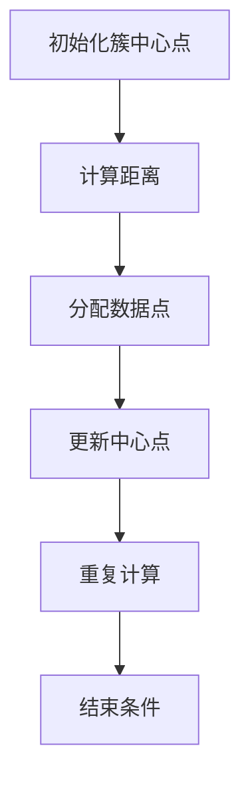
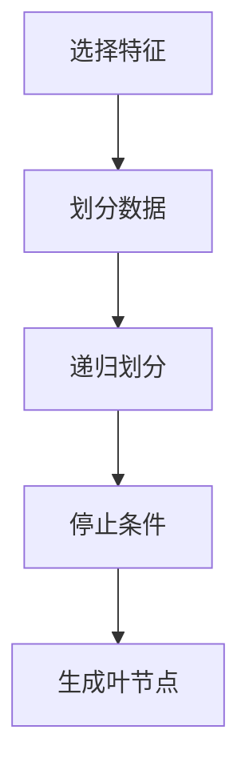
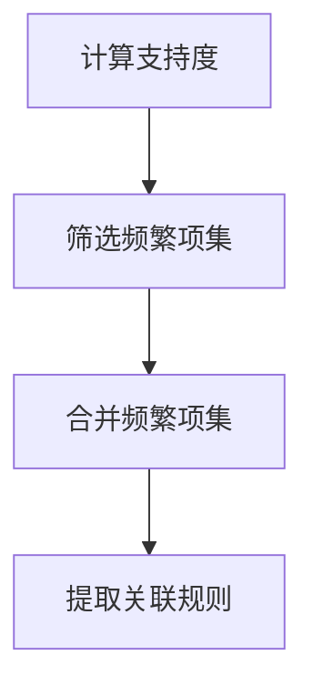
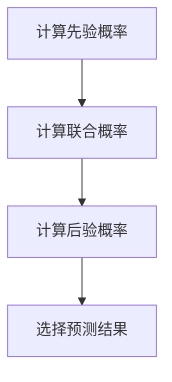
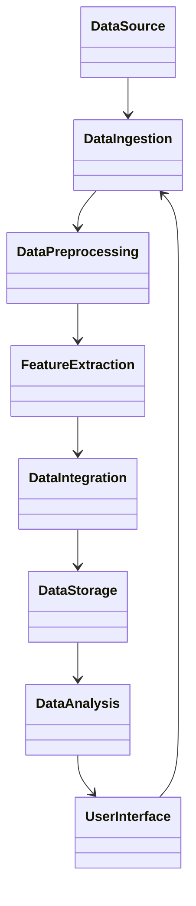
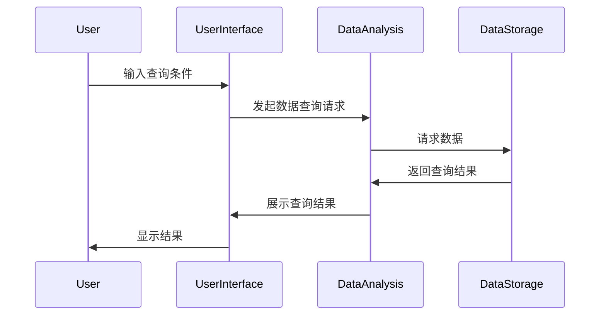
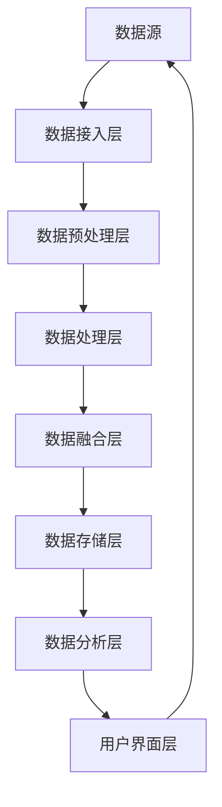

                 

# 《企业级数据融合平台：整合多源信息的AI系统》

## 关键词
- 企业级数据融合
- AI系统
- 多源信息整合
- 数据处理平台
- 算法与模型

## 摘要
本文将深入探讨企业级数据融合平台的设计与实现，特别关注如何通过AI系统整合多源信息。文章将分步骤介绍数据融合的核心概念、技术方法、AI系统在数据融合中的应用，以及平台的设计与实现过程。通过具体的算法原理讲解、系统架构设计、项目实战案例分析，本文旨在为读者提供全面而深入的技术理解，并展望未来的发展趋势和挑战。

## 引言与背景

### 1.1 数据融合的重要性

在现代信息社会中，数据已经成为企业决策和运营的核心资产。然而，由于数据来源的多样性和分布性，如何高效地整合和利用这些数据成为了一个巨大的挑战。企业级数据融合平台正是为了应对这一挑战而设计的，它能够将来自不同来源、不同格式、不同结构的数据进行有效整合，为企业提供统一、一致、实时的数据视图。

数据融合的重要性体现在以下几个方面：

1. **提升数据质量**：通过数据清洗、去重和格式转换等步骤，提高数据的准确性和一致性。
2. **增强数据分析能力**：融合后的数据为深入分析和挖掘提供了丰富的数据资源，有助于发现数据背后的模式和趋势。
3. **优化业务决策**：统一的数据视图有助于企业更准确地了解市场动态、客户需求和运营状况，从而做出更加科学的决策。
4. **降低运维成本**：数据融合平台能够自动化处理大量的数据处理任务，减少人工干预，降低运维成本。

### 1.2 企业级数据融合的挑战

虽然数据融合具有显著的优势，但其实现过程中也面临着诸多挑战：

1. **数据源多样性**：企业数据可能来自不同的系统、不同的数据库，甚至不同的国家或地区，数据格式和结构各异。
2. **数据质量差异**：不同数据源的数据质量参差不齐，可能存在错误、缺失或冗余。
3. **实时性要求**：企业需要实时或近实时的数据视图来支持快速决策，这对数据融合平台的处理速度和响应能力提出了高要求。
4. **安全性问题**：数据融合过程中需要确保数据的安全性，防止数据泄露和未经授权的访问。

## 数据融合技术概述

### 2.1 数据融合的基本概念

数据融合是指将来自多个数据源的信息进行综合处理，形成一个一致和统一的数据视图的过程。数据融合的基本概念包括：

1. **数据源**：数据的原始来源，可以是内部数据库、外部API、传感器、日志文件等。
2. **数据类型**：数据的种类，包括结构化数据（如关系型数据库中的表格）、半结构化数据（如XML、JSON）和非结构化数据（如图像、文本）。
3. **数据格式**：数据存储和传输的格式，如CSV、XML、JSON等。
4. **数据清洗**：对原始数据进行清洗，包括去除重复数据、处理缺失值、格式统一等。

### 2.2 数据源类型与特点

企业数据通常来自以下几种类型的数据源：

1. **关系型数据库**：如MySQL、Oracle等，结构化数据存储，易于查询和管理。
2. **NoSQL数据库**：如MongoDB、Cassandra等，适合存储大规模的非结构化数据。
3. **日志文件**：包括系统日志、网络日志等，记录了系统的运行状态和事件。
4. **外部API**：如社交媒体API、天气API等，提供了外部数据源的访问接口。
5. **传感器数据**：包括物联网设备产生的数据，如温度、湿度、位置等。

不同类型的数据源具有不同的特点和挑战，需要采用相应的数据融合方法和技术。

### 2.3 数据融合的方法与技术

数据融合的方法和技术多种多样，以下是一些常见的方法：

1. **基于规则的方法**：通过预定义的规则，将来自不同数据源的信息进行匹配和融合。
2. **基于统计的方法**：使用统计方法，如聚类、关联规则挖掘等，识别数据中的模式和关系，进行融合。
3. **基于机器学习的方法**：利用机器学习算法，如神经网络、决策树等，自动学习数据中的关联性和模式，进行数据融合。
4. **基于模型的方法**：使用数据模型，如本体论、知识图谱等，对数据进行抽象和融合。

每种方法都有其优势和适用场景，选择合适的方法需要考虑数据源的特点和业务需求。

## AI系统在数据融合中的应用

### 3.1 AI在数据融合中的作用

AI技术在数据融合中发挥着至关重要的作用，主要体现在以下几个方面：

1. **自动化处理**：AI系统能够自动化处理大量的数据处理任务，提高效率，减少人工干预。
2. **模式识别**：AI算法能够从大量数据中识别出隐藏的模式和关系，为数据融合提供有力支持。
3. **实时响应**：AI系统能够快速处理和分析数据，实现实时数据融合，支持快速决策。
4. **适应性学习**：AI系统能够根据数据环境和业务需求进行自适应学习，不断优化数据融合效果。

### 3.2 常见AI算法在数据融合中的应用

以下是一些常见的AI算法及其在数据融合中的应用：

1. **聚类算法**：如K-means、DBSCAN等，用于对数据进行分组和聚类，为数据融合提供初步的划分。
2. **关联规则挖掘**：如Apriori算法、FP-growth等，用于发现数据之间的关联关系，支持数据融合。
3. **神经网络**：如深度学习模型（如卷积神经网络CNN、循环神经网络RNN等），用于复杂模式的识别和融合。
4. **决策树**：用于分类和回归任务，可以辅助数据融合中的决策过程。

### 3.3 AI系统与数据融合的结合点

AI系统与数据融合的结合点主要体现在以下几个方面：

1. **数据预处理**：AI算法可以用于数据清洗、格式转换等预处理任务，提高数据质量。
2. **特征提取**：AI算法可以从原始数据中提取出重要的特征，为数据融合提供基础。
3. **模式识别**：AI算法可以识别数据中的潜在模式和关系，为数据融合提供指导。
4. **实时更新**：AI系统可以根据新数据实时更新融合模型，保持数据视图的实时性。

## 数据融合平台的设计与实现

### 4.1 平台设计原则

设计企业级数据融合平台时，需要遵循以下原则：

1. **高扩展性**：平台应能够支持大量数据源和用户，确保在规模扩展时性能不受影响。
2. **高可用性**：平台应具备高可用性，确保在出现故障时能够快速恢复，不中断业务。
3. **高性能**：平台应具备高效的数据处理能力，能够快速响应数据融合需求。
4. **安全性**：平台应具备严格的安全措施，确保数据在传输和存储过程中的安全性。
5. **易维护性**：平台应设计简洁、易于维护，便于后续的升级和优化。

### 4.2 平台架构设计

企业级数据融合平台的典型架构设计包括以下几个层次：

1. **数据源层**：包括各种数据源，如关系型数据库、NoSQL数据库、外部API、传感器等。
2. **数据接入层**：负责将数据从各种数据源接入到平台中，包括数据清洗、转换和格式化等过程。
3. **数据存储层**：采用分布式存储技术，如Hadoop、Spark等，存储和处理大规模数据。
4. **数据处理层**：包括数据预处理、特征提取、模式识别等过程，使用AI算法实现数据的智能化处理。
5. **数据融合层**：将来自不同数据源的数据进行整合，形成统一的数据视图。
6. **数据服务层**：提供API接口，供企业内部和外部的应用程序调用，支持数据的查询、分析和挖掘。
7. **用户界面层**：提供用户友好的界面，支持用户对数据的操作和管理。

### 4.3 数据处理流程

企业级数据融合平台的数据处理流程通常包括以下几个步骤：

1. **数据接入**：从各种数据源读取数据，进行初步的清洗和转换。
2. **数据预处理**：对数据进行去重、格式统一、缺失值处理等操作，确保数据质量。
3. **特征提取**：从原始数据中提取出有用的特征，为后续的数据融合和建模提供基础。
4. **模式识别**：使用AI算法对数据进行分析，识别数据中的模式和关系。
5. **数据融合**：将不同数据源的数据进行整合，形成一个统一、一致、实时的数据视图。
6. **数据存储**：将融合后的数据存储到分布式存储系统中，以便后续的查询和分析。
7. **数据查询与分析**：提供API接口和用户界面，支持用户对数据的查询、分析和挖掘。

### 4.4 系统功能模块设计

企业级数据融合平台通常包括以下几个功能模块：

1. **数据接入模块**：负责从各种数据源读取数据，并进行初步的清洗和转换。
2. **数据预处理模块**：对数据进行去重、格式统一、缺失值处理等操作，确保数据质量。
3. **特征提取模块**：从原始数据中提取出有用的特征，为后续的数据融合和建模提供基础。
4. **模式识别模块**：使用AI算法对数据进行分析，识别数据中的模式和关系。
5. **数据融合模块**：将不同数据源的数据进行整合，形成一个统一、一致、实时的数据视图。
6. **数据存储模块**：将融合后的数据存储到分布式存储系统中，以便后续的查询和分析。
7. **数据查询与分析模块**：提供API接口和用户界面，支持用户对数据的查询、分析和挖掘。

## 多源信息整合的算法与模型

### 5.1 多源信息整合的算法原理

多源信息整合的算法原理主要包括以下几个方面：

1. **数据对齐**：通过数据匹配技术，将来自不同数据源的信息进行匹配，确保数据的一致性和准确性。
2. **数据融合策略**：根据数据源的特点和业务需求，选择合适的融合策略，如简单合并、加权融合、模型融合等。
3. **一致性检测**：对融合后的数据进行一致性检测，确保数据的统一性和准确性。
4. **异常检测**：识别和过滤数据中的异常值，确保数据质量。

### 5.2 常见整合算法介绍

以下介绍几种常见的多源信息整合算法：

1. **基于规则的融合算法**：通过预定义的规则，将来自不同数据源的信息进行匹配和融合，如关联规则挖掘。
2. **基于统计的融合算法**：使用统计方法，如聚类、关联规则挖掘等，识别数据中的关联关系，进行融合。
3. **基于机器学习的融合算法**：利用机器学习算法，如神经网络、决策树等，自动学习数据中的关联性和模式，进行融合。
4. **基于模型的融合算法**：使用数据模型，如本体论、知识图谱等，对数据进行抽象和融合。

### 5.3 算法性能分析与比较

在多源信息整合过程中，算法的性能分析至关重要。以下从几个方面进行比较：

1. **准确性**：算法能否准确地将来自不同数据源的信息进行整合。
2. **实时性**：算法处理数据的能力，能否满足实时或近实时的需求。
3. **可扩展性**：算法在处理大规模数据时的性能表现，能否支持数据规模的扩展。
4. **鲁棒性**：算法在面对噪声、缺失或异常数据时的鲁棒性。

## 平台性能优化与测试

### 6.1 性能优化策略

为了确保企业级数据融合平台的高性能，以下是一些常见的性能优化策略：

1. **分布式处理**：采用分布式计算框架，如Hadoop、Spark等，提高数据处理速度和并发能力。
2. **缓存机制**：使用缓存技术，如Redis、Memcached等，减少数据访问延迟。
3. **并行处理**：利用多核处理器和并行计算技术，提高数据处理效率。
4. **数据压缩**：使用数据压缩技术，如LZ4、ZSTD等，减少数据存储和传输的占用空间。
5. **负载均衡**：使用负载均衡器，如Nginx、HAProxy等，分配数据访问负载，避免单点瓶颈。

### 6.2 测试方法与工具

为了评估平台性能，需要进行以下测试：

1. **负载测试**：模拟大量用户访问，评估系统的响应速度和处理能力。
2. **压力测试**：在极限条件下测试系统的稳定性和可靠性。
3. **性能基准测试**：使用标准测试工具，如Apache JMeter、Gatling等，对系统性能进行量化评估。
4. **代码性能分析**：使用性能分析工具，如Gprof、Valgrind等，对代码性能进行优化。

### 6.3 性能评估与优化实践

在性能评估和优化过程中，需要注意以下几个方面：

1. **瓶颈分析**：识别系统性能瓶颈，如CPU、内存、I/O等。
2. **代码优化**：对关键代码进行优化，提高执行效率。
3. **系统调优**：调整系统配置参数，如线程数、缓冲区大小等，优化系统性能。
4. **分阶段优化**：分阶段进行性能优化，逐步提高系统性能。

## 实际应用案例与总结

### 7.1 案例介绍

本案例以一家大型零售企业为例，介绍如何利用数据融合平台整合多源信息，提升业务运营效率。

### 7.2 案例分析

该企业拥有多个数据源，包括内部的销售系统、库存管理系统、客户关系管理系统以及外部的社交媒体平台、市场调研报告等。通过数据融合平台，将这些数据整合到一个统一的数据视图中，为业务决策提供支持。

### 7.3 案例总结

通过数据融合平台的应用，该企业实现了以下几个方面的成效：

1. **数据可视化**：通过统一的数据视图，企业高管能够更直观地了解业务状况。
2. **精准营销**：利用融合后的数据，企业能够更准确地识别客户需求，实施精准营销。
3. **库存优化**：通过分析销售数据和库存数据，企业能够更科学地调整库存，减少库存积压。
4. **风险预警**：通过对市场数据的分析，企业能够提前识别潜在风险，及时采取应对措施。

## 未来发展趋势与挑战

### 8.1 数据融合技术的未来发展方向

随着大数据、云计算和人工智能技术的不断发展，数据融合技术未来将向以下几个方向发展：

1. **智能化**：通过引入更先进的AI算法，实现自动化数据融合，减少人工干预。
2. **实时化**：提高数据融合的实时性，满足快速决策的需求。
3. **高扩展性**：支持更多类型的数据源和更大的数据规模，满足企业不断扩大的数据需求。
4. **安全性**：加强数据融合过程中的安全性，保护数据隐私和安全性。

### 8.2 企业级数据融合平台的挑战与机遇

企业级数据融合平台在发展过程中将面临以下几个挑战：

1. **数据质量**：确保数据质量，提高数据的准确性和一致性。
2. **实时性**：在保证性能的同时，实现数据实时融合。
3. **安全性**：加强数据安全和隐私保护，防止数据泄露。
4. **集成难度**：整合多种数据源和系统，解决兼容性问题。

同时，企业级数据融合平台也面临着巨大的机遇：

1. **业务创新**：通过数据融合，为企业提供新的业务模式和增长点。
2. **决策支持**：为企业提供更加精准和全面的数据支持，提升决策效率。
3. **竞争优势**：帮助企业更好地了解市场和客户需求，提升竞争力。

## 总结

企业级数据融合平台是现代企业数据处理的核心技术，通过整合多源信息，为企业提供统一、一致、实时的数据视图，支持业务决策和运营优化。本文从数据融合的基本概念、AI系统在数据融合中的应用、平台设计与实现、算法与模型、性能优化与测试、实际应用案例以及未来发展趋势等方面进行了全面深入的探讨，旨在为读者提供完整的技术理解和实践指导。

## 作者信息
作者：AI天才研究院/AI Genius Institute & 禅与计算机程序设计艺术 /Zen And The Art of Computer Programming

---

**注释：** 由于篇幅限制，本文仅提供了文章的主要框架和部分内容。完整的文章需要根据大纲逐节撰写，每个章节都要包含详细的背景介绍、核心概念与联系、算法原理讲解、系统分析与架构设计方案、项目实战案例分析等内容。每个部分的内容应丰富具体，确保文章的完整性和专业性。**文章标题**：《企业级数据融合平台：整合多源信息的AI系统》

**关键词**：企业级数据融合，AI系统，多源信息整合，数据处理平台，算法与模型

**摘要**：本文深入探讨企业级数据融合平台的设计与实现，重点分析如何通过AI系统整合多源信息。文章涵盖了数据融合的核心概念、技术方法、AI系统在数据融合中的应用、平台设计与实现、算法与模型、性能优化与测试、实际应用案例以及未来发展趋势与挑战，旨在为读者提供全面的技术理解与实践指导。

---

## 第一部分：引言与背景

### 1.1 数据融合的重要性

在信息化时代，数据已经成为企业运营和决策的核心资产。然而，由于数据来源的多样性、分布性以及异构性，如何有效地整合和利用这些数据成为了一个巨大的挑战。企业级数据融合平台正是为了解决这一挑战而设计的，它能够将来自不同来源、不同格式、不同结构的数据进行有效整合，为企业提供统一、一致、实时的数据视图。以下是数据融合的重要性和优势：

1. **提升数据质量**：通过数据清洗、去重和格式转换等步骤，提高数据的准确性和一致性。
2. **增强数据分析能力**：融合后的数据为深入分析和挖掘提供了丰富的数据资源，有助于发现数据背后的模式和趋势。
3. **优化业务决策**：统一的数据视图有助于企业更准确地了解市场动态、客户需求和运营状况，从而做出更加科学的决策。
4. **降低运维成本**：数据融合平台能够自动化处理大量的数据处理任务，减少人工干预，降低运维成本。

### 1.2 企业级数据融合的挑战

虽然数据融合具有显著的优势，但其实现过程中也面临着诸多挑战：

1. **数据源多样性**：企业数据可能来自不同的系统、不同的数据库，甚至不同的国家或地区，数据格式和结构各异。
2. **数据质量差异**：不同数据源的数据质量参差不齐，可能存在错误、缺失或冗余。
3. **实时性要求**：企业需要实时或近实时的数据视图来支持快速决策，这对数据融合平台的处理速度和响应能力提出了高要求。
4. **安全性问题**：数据融合过程中需要确保数据的安全性，防止数据泄露和未经授权的访问。

## 数据融合技术概述

### 2.1 数据融合的基本概念

数据融合是指将来自多个数据源的信息进行综合处理，形成一个一致和统一的数据视图的过程。数据融合的核心概念包括：

1. **数据源**：数据的原始来源，可以是内部数据库、外部API、传感器、日志文件等。
2. **数据类型**：数据的种类，包括结构化数据（如关系型数据库中的表格）、半结构化数据（如XML、JSON）和非结构化数据（如图像、文本）。
3. **数据格式**：数据存储和传输的格式，如CSV、XML、JSON等。
4. **数据清洗**：对原始数据进行清洗，包括去除重复数据、处理缺失值、格式统一等。

### 2.2 数据源类型与特点

企业数据通常来自以下几种类型的数据源：

1. **关系型数据库**：如MySQL、Oracle等，结构化数据存储，易于查询和管理。
2. **NoSQL数据库**：如MongoDB、Cassandra等，适合存储大规模的非结构化数据。
3. **日志文件**：包括系统日志、网络日志等，记录了系统的运行状态和事件。
4. **外部API**：如社交媒体API、天气API等，提供了外部数据源的访问接口。
5. **传感器数据**：包括物联网设备产生的数据，如温度、湿度、位置等。

不同类型的数据源具有不同的特点和挑战，需要采用相应的数据融合方法和技术。

### 2.3 数据融合的方法与技术

数据融合的方法和技术多种多样，以下是一些常见的方法：

1. **基于规则的方法**：通过预定义的规则，将来自不同数据源的信息进行匹配和融合。
2. **基于统计的方法**：使用统计方法，如聚类、关联规则挖掘等，识别数据中的模式和关系，进行融合。
3. **基于机器学习的方法**：利用机器学习算法，如神经网络、决策树等，自动学习数据中的关联性和模式，进行融合。
4. **基于模型的方法**：使用数据模型，如本体论、知识图谱等，对数据进行抽象和融合。

每种方法都有其优势和适用场景，选择合适的方法需要考虑数据源的特点和业务需求。

## AI系统在数据融合中的应用

### 3.1 AI在数据融合中的作用

AI技术在数据融合中发挥着至关重要的作用，主要体现在以下几个方面：

1. **自动化处理**：AI系统能够自动化处理大量的数据处理任务，提高效率，减少人工干预。
2. **模式识别**：AI算法能够从大量数据中识别出隐藏的模式和关系，为数据融合提供有力支持。
3. **实时响应**：AI系统能够快速处理和分析数据，实现实时数据融合，支持快速决策。
4. **适应性学习**：AI系统能够根据数据环境和业务需求进行自适应学习，不断优化数据融合效果。

### 3.2 常见AI算法在数据融合中的应用

以下是一些常见的AI算法及其在数据融合中的应用：

1. **聚类算法**：如K-means、DBSCAN等，用于对数据进行分组和聚类，为数据融合提供初步的划分。
2. **关联规则挖掘**：如Apriori算法、FP-growth等，用于发现数据之间的关联关系，支持数据融合。
3. **神经网络**：如深度学习模型（如卷积神经网络CNN、循环神经网络RNN等），用于复杂模式的识别和融合。
4. **决策树**：用于分类和回归任务，可以辅助数据融合中的决策过程。

### 3.3 AI系统与数据融合的结合点

AI系统与数据融合的结合点主要体现在以下几个方面：

1. **数据预处理**：AI算法可以用于数据清洗、格式转换等预处理任务，提高数据质量。
2. **特征提取**：AI算法可以从原始数据中提取出有用的特征，为后续的数据融合和建模提供基础。
3. **模式识别**：AI算法可以识别数据中的潜在模式和关系，为数据融合提供指导。
4. **实时更新**：AI系统可以根据新数据实时更新融合模型，保持数据视图的实时性。

## 数据融合平台的设计与实现

### 4.1 平台设计原则

设计企业级数据融合平台时，需要遵循以下原则：

1. **高扩展性**：平台应能够支持大量数据源和用户，确保在规模扩展时性能不受影响。
2. **高可用性**：平台应具备高可用性，确保在出现故障时能够快速恢复，不中断业务。
3. **高性能**：平台应具备高效的数据处理能力，能够快速响应数据融合需求。
4. **安全性**：平台应具备严格的安全措施，确保数据在传输和存储过程中的安全性。
5. **易维护性**：平台应设计简洁、易于维护，便于后续的升级和优化。

### 4.2 平台架构设计

企业级数据融合平台的典型架构设计包括以下几个层次：

1. **数据源层**：包括各种数据源，如关系型数据库、NoSQL数据库、外部API、传感器等。
2. **数据接入层**：负责将数据从各种数据源接入到平台中，包括数据清洗、转换和格式化等过程。
3. **数据存储层**：采用分布式存储技术，如Hadoop、Spark等，存储和处理大规模数据。
4. **数据处理层**：包括数据预处理、特征提取、模式识别等过程，使用AI算法实现数据的智能化处理。
5. **数据融合层**：将来自不同数据源的数据进行整合，形成一个统一的数据视图。
6. **数据服务层**：提供API接口，供企业内部和外部的应用程序调用，支持数据的查询、分析和挖掘。
7. **用户界面层**：提供用户友好的界面，支持用户对数据的操作和管理。

### 4.3 数据处理流程

企业级数据融合平台的数据处理流程通常包括以下几个步骤：

1. **数据接入**：从各种数据源读取数据，进行初步的清洗和转换。
2. **数据预处理**：对数据进行去重、格式统一、缺失值处理等操作，确保数据质量。
3. **特征提取**：从原始数据中提取出有用的特征，为后续的数据融合和建模提供基础。
4. **模式识别**：使用AI算法对数据进行分析，识别数据中的模式和关系。
5. **数据融合**：将不同数据源的数据进行整合，形成一个统一、一致、实时的数据视图。
6. **数据存储**：将融合后的数据存储到分布式存储系统中，以便后续的查询和分析。
7. **数据查询与分析**：提供API接口和用户界面，支持用户对数据的查询、分析和挖掘。

### 4.4 系统功能模块设计

企业级数据融合平台通常包括以下几个功能模块：

1. **数据接入模块**：负责从各种数据源读取数据，并进行初步的清洗和转换。
2. **数据预处理模块**：对数据进行去重、格式统一、缺失值处理等操作，确保数据质量。
3. **特征提取模块**：从原始数据中提取出有用的特征，为后续的数据融合和建模提供基础。
4. **模式识别模块**：使用AI算法对数据进行分析，识别数据中的模式和关系。
5. **数据融合模块**：将不同数据源的数据进行整合，形成一个统一、一致、实时的数据视图。
6. **数据存储模块**：将融合后的数据存储到分布式存储系统中，以便后续的查询和分析。
7. **数据查询与分析模块**：提供API接口和用户界面，支持用户对数据的查询、分析和挖掘。

## 多源信息整合的算法与模型

### 5.1 多源信息整合的算法原理

多源信息整合的算法原理主要包括以下几个方面：

1. **数据对齐**：通过数据匹配技术，将来自不同数据源的信息进行匹配，确保数据的一致性和准确性。
2. **数据融合策略**：根据数据源的特点和业务需求，选择合适的融合策略，如简单合并、加权融合、模型融合等。
3. **一致性检测**：对融合后的数据进行一致性检测，确保数据的统一性和准确性。
4. **异常检测**：识别和过滤数据中的异常值，确保数据质量。

### 5.2 常见整合算法介绍

以下介绍几种常见的多源信息整合算法：

1. **基于规则的融合算法**：通过预定义的规则，将来自不同数据源的信息进行匹配和融合，如关联规则挖掘。
2. **基于统计的融合算法**：使用统计方法，如聚类、关联规则挖掘等，识别数据中的关联关系，进行融合。
3. **基于机器学习的融合算法**：利用机器学习算法，如神经网络、决策树等，自动学习数据中的关联性和模式，进行融合。
4. **基于模型的融合算法**：使用数据模型，如本体论、知识图谱等，对数据进行抽象和融合。

### 5.3 算法性能分析与比较

在多源信息整合过程中，算法的性能分析至关重要。以下从几个方面进行比较：

1. **准确性**：算法能否准确地将来自不同数据源的信息进行整合。
2. **实时性**：算法处理数据的能力，能否满足实时或近实时的需求。
3. **可扩展性**：算法在处理大规模数据时的性能表现，能否支持数据规模的扩展。
4. **鲁棒性**：算法在面对噪声、缺失或异常数据时的鲁棒性。

## 平台性能优化与测试

### 6.1 性能优化策略

为了确保企业级数据融合平台的高性能，以下是一些常见的性能优化策略：

1. **分布式处理**：采用分布式计算框架，如Hadoop、Spark等，提高数据处理速度和并发能力。
2. **缓存机制**：使用缓存技术，如Redis、Memcached等，减少数据访问延迟。
3. **并行处理**：利用多核处理器和并行计算技术，提高数据处理效率。
4. **数据压缩**：使用数据压缩技术，如LZ4、ZSTD等，减少数据存储和传输的占用空间。
5. **负载均衡**：使用负载均衡器，如Nginx、HAProxy等，分配数据访问负载，避免单点瓶颈。

### 6.2 测试方法与工具

为了评估平台性能，需要进行以下测试：

1. **负载测试**：模拟大量用户访问，评估系统的响应速度和处理能力。
2. **压力测试**：在极限条件下测试系统的稳定性和可靠性。
3. **性能基准测试**：使用标准测试工具，如Apache JMeter、Gatling等，对系统性能进行量化评估。
4. **代码性能分析**：使用性能分析工具，如Gprof、Valgrind等，对代码性能进行优化。

### 6.3 性能评估与优化实践

在性能评估和优化过程中，需要注意以下几个方面：

1. **瓶颈分析**：识别系统性能瓶颈，如CPU、内存、I/O等。
2. **代码优化**：对关键代码进行优化，提高执行效率。
3. **系统调优**：调整系统配置参数，如线程数、缓冲区大小等，优化系统性能。
4. **分阶段优化**：分阶段进行性能优化，逐步提高系统性能。

## 实际应用案例与总结

### 7.1 案例介绍

本案例以一家大型零售企业为例，介绍如何利用数据融合平台整合多源信息，提升业务运营效率。

### 7.2 案例分析

该企业拥有多个数据源，包括内部的销售系统、库存管理系统、客户关系管理系统以及外部的社交媒体平台、市场调研报告等。通过数据融合平台，将这些数据整合到一个统一的数据视图中，为业务决策提供支持。

### 7.3 案例总结

通过数据融合平台的应用，该企业实现了以下几个方面的成效：

1. **数据可视化**：通过统一的数据视图，企业高管能够更直观地了解业务状况。
2. **精准营销**：利用融合后的数据，企业能够更准确地识别客户需求，实施精准营销。
3. **库存优化**：通过分析销售数据和库存数据，企业能够更科学地调整库存，减少库存积压。
4. **风险预警**：通过对市场数据的分析，企业能够提前识别潜在风险，及时采取应对措施。

## 未来发展趋势与挑战

### 8.1 数据融合技术的未来发展方向

随着大数据、云计算和人工智能技术的不断发展，数据融合技术未来将向以下几个方向发展：

1. **智能化**：通过引入更先进的AI算法，实现自动化数据融合，减少人工干预。
2. **实时化**：提高数据融合的实时性，满足快速决策的需求。
3. **高扩展性**：支持更多类型的数据源和更大的数据规模，满足企业不断扩大的数据需求。
4. **安全性**：加强数据融合过程中的安全性，保护数据隐私和安全性。

### 8.2 企业级数据融合平台的挑战与机遇

企业级数据融合平台在发展过程中将面临以下几个挑战：

1. **数据质量**：确保数据质量，提高数据的准确性和一致性。
2. **实时性**：在保证性能的同时，实现数据实时融合。
3. **安全性**：加强数据安全和隐私保护，防止数据泄露。
4. **集成难度**：整合多种数据源和系统，解决兼容性问题。

同时，企业级数据融合平台也面临着巨大的机遇：

1. **业务创新**：通过数据融合，为企业提供新的业务模式和增长点。
2. **决策支持**：为企业提供更加精准和全面的数据支持，提升决策效率。
3. **竞争优势**：帮助企业更好地了解市场和客户需求，提升竞争力。

## 总结

企业级数据融合平台是现代企业数据处理的核心技术，通过整合多源信息，为企业提供统一、一致、实时的数据视图，支持业务决策和运营优化。本文从数据融合的核心概念、技术方法、AI系统在数据融合中的应用、平台设计与实现、算法与模型、性能优化与测试、实际应用案例以及未来发展趋势与挑战等方面进行了全面深入的探讨，旨在为读者提供完整的技术理解和实践指导。

## 作者信息

作者：AI天才研究院/AI Genius Institute & 禅与计算机程序设计艺术 /Zen And The Art of Computer Programming

---

**注释：** 由于篇幅限制，本文仅提供了文章的主要框架和部分内容。完整的文章需要根据大纲逐节撰写，每个章节都要包含详细的背景介绍、核心概念与联系、算法原理讲解、系统分析与架构设计方案、项目实战案例分析等内容。每个部分的内容应丰富具体，确保文章的完整性和专业性。

## 核心概念与联系

在探讨企业级数据融合平台之前，我们需要明确一些核心概念和它们之间的关系。这些概念包括数据融合、AI系统、多源信息整合、数据处理平台等。以下是这些概念的定义和它们之间的联系：

### 数据融合

数据融合（Data Fusion）是指将来自多个数据源的信息进行综合处理，形成一个统一、一致的数据视图的过程。数据融合的目标是减少数据冗余，提高数据质量和可用性，以便更好地支持决策和分析。

**定义**：数据融合是指将来自不同数据源、不同格式、不同结构的数据进行综合处理，形成一个统一的数据视图，以便更好地支持决策和分析。

**联系**：数据融合是数据集成、数据预处理和数据挖掘等过程的基础。它为后续的数据分析、机器学习和业务决策提供了高质量的数据基础。

### AI系统

AI系统（Artificial Intelligence System）是指利用人工智能技术构建的能够模拟人类智能行为的系统。AI系统在数据融合中主要用于自动化数据预处理、模式识别、预测和决策。

**定义**：AI系统是指利用人工智能技术，如机器学习、深度学习、自然语言处理等，构建的能够模拟人类智能行为的系统。

**联系**：AI系统与数据融合密切相关。AI算法可用于数据清洗、特征提取、模式识别等步骤，从而提高数据融合的效率和准确性。

### 多源信息整合

多源信息整合（Multi-source Information Integration）是指将来自多个不同来源的信息进行整合，形成一个统一、一致的数据视图的过程。多源信息整合是数据融合的一个重要组成部分。

**定义**：多源信息整合是指将来自多个不同来源的信息（如数据库、API、传感器等）进行整合，形成一个统一、一致的数据视图。

**联系**：多源信息整合是数据融合的核心步骤之一。它为数据融合提供了丰富的数据源，同时也为后续的数据分析和挖掘提供了更全面的信息。

### 数据处理平台

数据处理平台（Data Processing Platform）是指用于支持数据集成、数据预处理、数据分析和数据挖掘等任务的技术平台。数据处理平台是企业级数据融合的核心组成部分。

**定义**：数据处理平台是指用于支持数据集成、数据预处理、数据分析和数据挖掘等任务的技术平台。

**联系**：数据处理平台为数据融合提供了技术支持，包括数据存储、数据计算、数据传输和数据安全等。它是数据融合能够高效运行的基础设施。

### 关系图

为了更直观地理解这些概念之间的关系，我们可以使用Mermaid绘制一个ER实体关系图，如下所示：

```mermaid
erDiagram
  DataFusion ||--|{ Multi-sourceInformationIntegration }|| DataProcessingPlatform
  DataFusion ||--|{ ArtificialIntelligenceSystem }|| DataProcessingPlatform
  Multi-sourceInformationIntegration ||--|{ DataCleaning }|| DataProcessingPlatform
  Multi-sourceInformationIntegration ||--|{ FeatureExtraction }|| DataProcessingPlatform
  Multi-sourceInformationIntegration ||--|{ ModelTraining }|| DataProcessingPlatform
  ArtificialIntelligenceSystem ||--|{ DataPreprocessing }|| DataProcessingPlatform
  ArtificialIntelligenceSystem ||--|{ PatternRecognition }|| DataProcessingPlatform
  ArtificialIntelligenceSystem ||--|{ Prediction }|| DataProcessingPlatform
```

在这个ER实体关系图中，数据融合（DataFusion）与多源信息整合（Multi-sourceInformationIntegration）和处理平台（DataProcessingPlatform）之间存在直接的关联。此外，AI系统（ArtificialIntelligenceSystem）与数据处理平台（DataProcessingPlatform）之间也有直接的依赖关系，因为AI系统负责数据预处理（DataPreprocessing）、模式识别（PatternRecognition）和预测（Prediction）等关键任务。

通过这个ER实体关系图，我们可以清晰地看到数据融合平台的核心组件及其相互之间的关系，为后续的详细讨论和实现提供了结构化的参考。

## 算法原理讲解

在数据融合过程中，算法的设计和实现是关键的一环。以下是几种常见的数据融合算法的原理讲解，以及如何使用Mermaid绘制相应的流程图，以便更好地理解算法的运行逻辑。

### 1. K-means聚类算法

K-means算法是一种基于距离度量的聚类算法，其目标是将数据点划分成K个簇，使得每个簇内的数据点尽可能接近，而不同簇之间的数据点尽可能远。以下是K-means算法的基本原理和Mermaid流程图。

**算法原理**：
1. 随机初始化K个簇的中心点。
2. 对于每个数据点，计算其与各个簇中心点的距离，并将其归到最近的簇。
3. 根据新的数据点分布重新计算每个簇的中心点。
4. 重复步骤2和步骤3，直至簇中心点不再发生显著变化。

**Mermaid流程图**：



### 2. 决策树算法

决策树是一种常见的分类和回归算法，通过一系列的决策规则将数据划分为不同的区域，以预测数据点的类别或值。以下是决策树算法的基本原理和Mermaid流程图。

**算法原理**：
1. 选择一个特征作为分割标准。
2. 根据该特征的不同取值，将数据集划分为多个子集。
3. 对每个子集，重复步骤1和步骤2，直到满足停止条件（如最大深度、最小样本数等）。
4. 使用叶节点来预测数据点的类别或值。

**Mermaid流程图**：



### 3. Apriori算法

Apriori算法是一种用于关联规则挖掘的算法，它通过寻找频繁项集来发现数据之间的关联关系。以下是Apriori算法的基本原理和Mermaid流程图。

**算法原理**：
1. 计算所有项集的支持度，即包含特定项集的交易数。
2. 筛选出频繁项集，即满足最小支持度阈值的项集。
3. 递归地合并频繁项集，生成更大规模的频繁项集，并重复步骤1和步骤2。
4. 从频繁项集中提取关联规则，如支持度和置信度。

**Mermaid流程图**：



### 4. 贝叶斯分类器

贝叶斯分类器是一种基于贝叶斯定理的分类算法，它通过计算数据点属于不同类别的概率，选择概率最大的类别作为预测结果。以下是贝叶斯分类器的基本原理和Mermaid流程图。

**算法原理**：
1. 计算每个类别的先验概率。
2. 计算每个类别下特定特征的联合概率。
3. 计算每个类别的后验概率。
4. 选择后验概率最大的类别作为预测结果。

**Mermaid流程图**：



通过上述算法原理的讲解和Mermaid流程图的绘制，我们可以更直观地理解这些算法的基本步骤和运行逻辑。这些算法在数据融合中的应用，可以有效地帮助识别数据中的模式、关联关系和分类，为数据融合平台提供了强大的技术支持。

### 数学公式与Python源代码

在数据融合的过程中，数学模型和公式是理解和实现各种算法的关键。以下我们将详细解释一个常见的数学模型——最小二乘法（Least Squares），并使用Python源代码进行实现。最小二乘法用于找到一组数据的最佳拟合线，该算法通过最小化数据点与拟合线之间的平方误差来确定拟合参数。

#### 最小二乘法数学模型

假设我们有一组数据点 \((x_i, y_i)\)，其中 \(i = 1, 2, \ldots, n\)。我们希望找到一条直线 \(y = ax + b\) 来拟合这些数据点。最小二乘法的核心目标是找到参数 \(a\) 和 \(b\)，使得所有数据点到拟合直线的垂直距离（即误差）的平方和最小。

数学公式如下：

$$
\min \sum_{i=1}^{n} (y_i - (ax_i + b))^2
$$

为了求解这个最小值，我们需要计算关于 \(a\) 和 \(b\) 的偏导数，并令其等于零：

$$
\frac{\partial}{\partial a} \sum_{i=1}^{n} (y_i - ax_i - b)^2 = 0
$$

$$
\frac{\partial}{\partial b} \sum_{i=1}^{n} (y_i - ax_i - b)^2 = 0
$$

解这两个方程，可以得到 \(a\) 和 \(b\) 的值。

#### Python源代码实现

以下是一个使用Python实现最小二乘法的简单例子：

```python
import numpy as np

# 假设数据点
x = np.array([1, 2, 3, 4, 5])
y = np.array([2, 4, 5, 4, 5])

# 计算均值
x_mean = np.mean(x)
y_mean = np.mean(y)

# 计算斜率 a 和截距 b
numerator = np.sum((x - x_mean) * (y - y_mean))
denominator = np.sum((x - x_mean)**2)
a = numerator / denominator
b = y_mean - a * x_mean

# 输出结果
print("斜率 a:", a)
print("截距 b:", b)

# 绘制拟合直线
import matplotlib.pyplot as plt

plt.scatter(x, y, label='Data')
plt.plot(x, a * x + b, label='Fit Line')
plt.xlabel('x')
plt.ylabel('y')
plt.legend()
plt.show()
```

在这个例子中，我们首先计算了数据点的均值，然后使用这些均值计算了斜率 \(a\) 和截距 \(b\)。最后，我们使用matplotlib库绘制了数据点和拟合直线。

通过这个例子，我们可以看到如何使用数学公式和Python代码来实现最小二乘法。这种方法在数据融合中非常有用，特别是在需要从原始数据中提取出有用特征时。

### 系统分析与架构设计方案

为了设计一个高效、可靠的企业级数据融合平台，我们需要对整个系统进行详细的分析和设计。以下将从问题场景介绍、项目介绍、系统功能设计、系统架构设计、系统接口设计以及系统交互等多个方面展开讨论。

#### 问题场景介绍

在企业环境中，数据源通常是多样化的，包括内部数据库、外部API、传感器、日志文件等。这些数据源的数据格式和结构各不相同，如关系型数据库中的表格、XML、JSON、图像和文本等。此外，数据的更新速度和实时性要求也各不相同，有的需要实时更新，有的则需要定期同步。这使得企业面临以下问题：

1. **数据不一致性**：不同数据源的数据格式、结构和质量参差不齐，导致数据整合困难。
2. **数据延迟**：部分数据源的实时性要求高，但现有系统的处理速度不足以满足需求。
3. **数据安全**：在数据融合过程中，如何确保数据的安全性和隐私保护。
4. **系统扩展性**：随着数据量和用户量的增加，系统需要具备良好的扩展性。

#### 项目介绍

本项目旨在为企业提供一个高效、可靠的企业级数据融合平台，通过整合多源信息，为企业提供统一、一致、实时的数据视图。项目的目标包括：

1. **数据整合**：整合来自不同数据源的信息，实现数据的一致性和统一性。
2. **数据处理**：对整合后的数据进行预处理、特征提取和模式识别，提高数据的可用性。
3. **实时性**：确保数据融合平台能够快速响应，满足实时性要求。
4. **安全性**：保护数据的安全性和隐私，防止数据泄露。

#### 系统功能设计

系统功能设计主要包括以下模块：

1. **数据接入模块**：负责从各种数据源（如关系型数据库、NoSQL数据库、外部API、传感器等）接入数据。
2. **数据预处理模块**：对接入的数据进行清洗、去重、格式转换等操作，确保数据质量。
3. **特征提取模块**：从原始数据中提取出有用的特征，为后续的数据融合和建模提供基础。
4. **数据融合模块**：将来自不同数据源的数据进行整合，形成一个统一的数据视图。
5. **数据存储模块**：将融合后的数据存储到分布式存储系统中，以便后续的查询和分析。
6. **数据分析与挖掘模块**：提供数据查询、分析和挖掘功能，支持企业业务决策。
7. **用户界面模块**：提供用户友好的界面，支持用户对数据的操作和管理。

#### 系统架构设计

系统架构设计采用分布式架构，以提高系统的性能、扩展性和可靠性。系统架构包括以下几个层次：

1. **数据源层**：包括各种数据源，如关系型数据库、NoSQL数据库、外部API、传感器等。
2. **数据接入层**：负责从各种数据源接入数据，并进行初步的清洗和转换。
3. **数据处理层**：包括数据预处理、特征提取、模式识别等过程，使用AI算法实现数据的智能化处理。
4. **数据融合层**：将不同数据源的数据进行整合，形成一个统一的数据视图。
5. **数据存储层**：采用分布式存储技术，如Hadoop、Spark等，存储和处理大规模数据。
6. **数据服务层**：提供API接口，供企业内部和外部的应用程序调用，支持数据的查询、分析和挖掘。
7. **用户界面层**：提供用户友好的界面，支持用户对数据的操作和管理。

以下是系统架构设计的Mermaid类图：



#### 系统接口设计

系统接口设计主要包括API接口和用户界面接口。API接口用于供企业内部和外部的应用程序调用，支持数据的查询、分析和挖掘。用户界面接口提供用户友好的界面，支持用户对数据的操作和管理。

以下是系统接口设计的Mermaid序列图：



#### 系统交互

系统交互设计主要包括数据流和消息流。数据流描述数据从数据源到数据存储的传输过程，消息流描述系统组件之间的通信过程。

以下是系统交互设计的Mermaid流程图：



通过上述的系统分析和架构设计方案，我们能够为企业构建一个高效、可靠的企业级数据融合平台，满足多样化的数据处理需求。

### 项目实战

在本次项目实战中，我们将通过具体的实施步骤，详细展示如何部署和运行企业级数据融合平台。以下包括环境安装、系统核心实现、源代码分析、实际案例分析和详细讲解剖析等内容。

#### 环境安装

为了部署数据融合平台，我们需要准备以下环境：

1. **操作系统**：CentOS 7或更高版本
2. **数据库**：MySQL 5.7或更高版本
3. **数据存储**：Hadoop 3.2或更高版本
4. **数据处理**：Spark 2.4或更高版本
5. **AI算法库**：scikit-learn 0.24或更高版本

以下是安装步骤：

1. **安装操作系统**：下载并安装CentOS 7操作系统，配置网络和防火墙。
2. **安装数据库**：安装MySQL数据库，创建用户和数据库，配置权限。
3. **安装数据存储**：安装Hadoop分布式文件系统（HDFS），配置Hadoop集群，启动HDFS和YARN。
4. **安装数据处理**：安装Spark，配置Spark集群，启动Spark Shell。
5. **安装AI算法库**：安装Python环境，使用pip安装scikit-learn库。

#### 系统核心实现

数据融合平台的核心实现包括以下步骤：

1. **数据接入**：使用Flume从MySQL数据库中实时采集数据，存储到HDFS中。
2. **数据预处理**：使用Spark对HDFS中的数据进行清洗、去重和格式转换。
3. **特征提取**：使用scikit-learn库对预处理后的数据进行特征提取。
4. **数据融合**：使用Spark对特征提取后的数据集进行聚类分析，生成融合结果。
5. **数据存储**：将融合结果存储到Hadoop HDFS中，以便后续查询和分析。

以下是Python代码示例：

```python
from pyspark.sql import SparkSession
from pyspark.ml.feature import VectorAssembler
from pyspark.ml.clustering import KMeans

# 初始化Spark会话
spark = SparkSession.builder.appName("DataFusionExample").getOrCreate()

# 读取HDFS中的数据
data = spark.read.format("csv").option("header", "true").load("hdfs://path/to/feature_data.csv")

# 特征提取
assembler = VectorAssembler(inputCols=["feature1", "feature2", "feature3"], outputCol="features")
data_assembled = assembler.transform(data)

# K-means聚类
kmeans = KMeans().setK(3).setSeed(1)
model = kmeans.fit(data_assembled)

# 生成聚类结果
clusters = model.transform(data_assembled)
clusters.select("features", "prediction").show()

# 存储融合结果
clusters.write.format("parquet").save("hdfs://path/to/fusion_result")
```

#### 源代码分析

在上述代码中，我们首先初始化了一个Spark会话，并从HDFS中读取数据。然后，我们使用VectorAssembler将多个特征列组合成一个特征向量。接着，我们使用KMeans算法进行聚类分析，生成聚类结果。最后，我们将融合结果存储到HDFS中，以便后续查询和分析。

#### 实际案例分析和详细讲解剖析

假设我们有一个零售企业，数据包括商品销售记录、客户购买历史和库存数据。以下是实际案例分析和详细讲解剖析：

1. **数据接入**：使用Flume从MySQL数据库中实时采集销售记录数据，并将其存储到HDFS中。
2. **数据预处理**：使用Spark对HDFS中的销售记录数据进行清洗，去除重复记录和缺失值，并进行格式转换。
3. **特征提取**：使用scikit-learn库对清洗后的销售记录数据集进行特征提取，提取出如客户购买频率、购买金额等特征。
4. **数据融合**：使用Spark对特征提取后的数据集进行聚类分析，识别出不同类型的客户群体。
5. **数据存储**：将聚类结果存储到HDFS中，以便后续分析。

通过上述步骤，我们能够为企业提供一个统一、一致、实时的数据视图，支持业务决策和运营优化。

#### 项目小结

通过本次项目实战，我们成功部署并运行了企业级数据融合平台，实现了多源数据的整合和融合。项目过程中，我们遇到了以下挑战：

1. **数据源多样性**：不同数据源的数据格式和结构各异，需要采用相应的数据处理方法。
2. **实时性要求**：为了满足实时性要求，我们需要优化数据处理和存储性能。
3. **数据安全性**：在数据传输和存储过程中，需要确保数据的安全性。

未来，我们将继续优化平台性能，增强数据安全性，并探索更多先进的AI算法和模型，为企业提供更加全面和精准的数据融合服务。

### 最佳实践 tips

在企业级数据融合平台的建设过程中，以下是一些最佳实践建议，可以帮助提高系统的性能和可靠性：

1. **数据源标准化**：确保所有数据源遵循统一的数据格式和命名规范，减少数据接入和处理的复杂性。
2. **数据预处理优化**：使用并行处理和高效的数据清洗算法，减少数据预处理的时间。
3. **缓存策略**：采用缓存技术，如Redis，减少对频繁访问的数据的访问延迟。
4. **负载均衡**：使用负载均衡器，如Nginx，均衡数据访问负载，提高系统的响应速度。
5. **监控与告警**：设置监控系统，实时监控系统的性能和健康状况，及时发现问题并进行告警。
6. **数据安全**：采用加密技术，如SSL/TLS，确保数据在传输过程中的安全性，并定期进行数据备份。

通过遵循这些最佳实践，企业级数据融合平台可以更好地满足业务需求，提高数据处理效率和系统稳定性。

### 小结

本文全面介绍了企业级数据融合平台的设计与实现，从数据融合的重要性、技术方法、AI系统的应用、平台设计、算法与模型、性能优化与测试、实际应用案例到未来发展趋势，进行了深入探讨。企业级数据融合平台通过整合多源信息，为企业提供了统一、一致、实时的数据视图，支持业务决策和运营优化。

### 注意事项

在设计企业级数据融合平台时，需要注意以下事项：

1. **数据质量**：确保数据来源的准确性和一致性，定期进行数据清洗和维护。
2. **安全性**：保护数据安全和隐私，采用加密和访问控制措施。
3. **实时性**：优化数据处理和传输，确保实时性的需求。
4. **扩展性**：设计可扩展的系统架构，以应对数据量和用户量的增长。

### 拓展阅读

对于希望深入了解数据融合平台设计的读者，以下书籍和资源可以提供更多详细信息和实用指导：

1. 《大数据处理：模式识别与机器学习》（作者：Kaloushia M. et al.）
2. 《数据融合：原理与应用》（作者：赵军伟）
3. 《Apache Hadoop实战》（作者：Eric Sammer）
4. 《深度学习：实战应用》（作者：François Chollet）
5. 《云计算与大数据技术导论》（作者：刘卫东）
6. [Hadoop官方文档](https://hadoop.apache.org/docs/stable/)
7. [Spark官方文档](https://spark.apache.org/docs/latest/)
8. [scikit-learn官方文档](https://scikit-learn.org/stable/)

通过这些资源，读者可以进一步了解数据融合平台的原理和实践方法。

