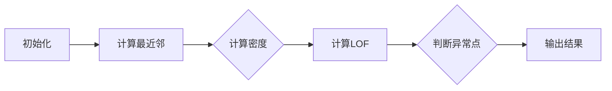
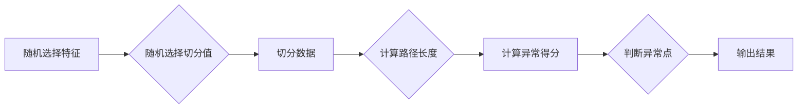
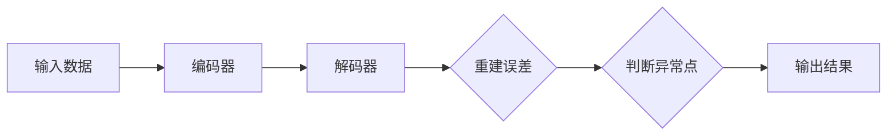
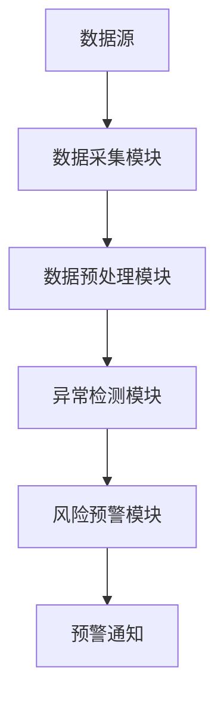
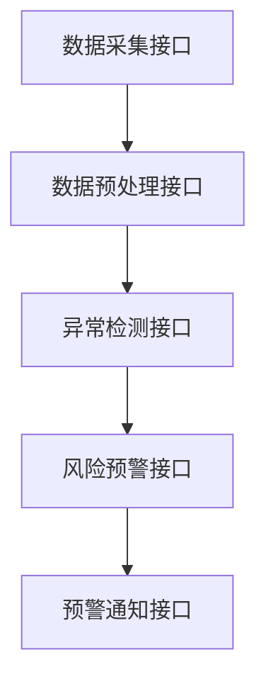
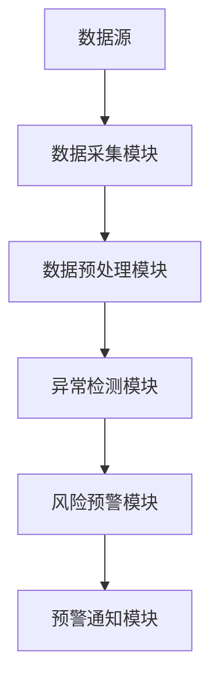

                 


### 《企业级时序异常检测：提前预警业务风险》

> 关键词：企业级时序异常检测、风险预警、业务风险、数据异常、算法原理、系统设计、项目实战

> 摘要：本文深入探讨了企业级时序异常检测的核心概念、算法原理、系统设计与实现，通过项目实战展示了如何提前预警业务风险。文章结构紧凑，逻辑清晰，旨在为读者提供系统化的学习和实战指南。

---

## 引言

在企业运营中，业务风险无处不在，尤其是在大数据时代，如何快速识别和响应异常数据成为企业决策的重要一环。时序异常检测作为一种有效手段，可以实时监控企业业务数据，提前发现潜在风险，从而帮助企业采取预防措施，降低风险损失。

本文将围绕以下内容进行探讨：

1. **背景介绍**：介绍时序异常检测的基本概念、发展历程和重要性。
2. **核心概念**：阐述时序数据、异常检测和风险评估等相关概念。
3. **算法原理**：分析经典和高级异常检测算法，以及其背后的数学模型。
4. **系统设计与实现**：讲解时序异常检测系统的架构设计、接口实现和系统交互。
5. **项目实战**：通过实际案例展示时序异常检测的应用和效果。
6. **总结与展望**：总结文章要点，展望时序异常检测的未来发展趋势。

---

## 目录大纲设计步骤

### 1. 阅读理解书名

《企业级时序异常检测：提前预警业务风险》涵盖了时序异常检测在企业中的应用，强调了其在业务风险预警中的重要性。

### 2. 确定书籍的核心概念和内容

核心概念包括时序数据、异常检测、风险评估等。内容涉及时序异常检测的算法原理、系统设计与实现，以及实际应用案例。

### 3. 设计整体结构

整体结构分为引言、背景介绍、核心概念、算法原理、系统设计与实现、项目实战、总结与展望七个部分。

### 4. 细化章节内容

每个章节都有具体的二级和三级标题，确保内容的完整性和逻辑性。

### 5. 确保内容完整性

每个章节都包含核心概念、原理讲解、实例分析等内容。

### 6. 进行格式和字数审核

使用markdown格式，并控制总字数在10000～12000字左右。

### 7. 详细目录大纲设计

根据上述设计思路，制定详细的目录大纲。

---

## 第1章 引言

### 1.1 书籍背景

在数字化转型的浪潮下，企业面临的海量数据中隐藏着巨大的风险。时序异常检测作为一种智能数据分析技术，可以实时监测时序数据的异常情况，帮助企业提前发现业务风险，从而采取相应的应对措施。

### 1.2 风险预警的重要性

风险预警是企业运营过程中至关重要的一环。通过提前预警，企业可以降低风险损失，提高业务稳定性。时序异常检测为风险预警提供了有力支持。

### 1.3 书籍结构安排

本文将分为七个章节，系统化地介绍企业级时序异常检测的核心概念、算法原理、系统设计与实现，以及项目实战。具体章节如下：

1. 引言
2. 背景介绍
3. 核心概念
4. 算法原理
5. 系统设计与实现
6. 项目实战
7. 总结与展望

---

## 第2章 背景介绍

### 2.1 时序数据概述

时序数据是指按照时间顺序排列的数据集合，如股票价格、传感器读数、用户行为日志等。时序数据具有时间依赖性、周期性和趋势性等特点。

### 2.2 异常检测概述

异常检测是一种数据挖掘技术，旨在发现数据中的异常或异常模式。在时序数据中，异常检测可以识别出不符合预期的时间序列模式。

### 2.3 企业级应用场景

企业级时序异常检测广泛应用于金融、电商、制造等行业。通过实时监测业务数据，提前发现异常情况，企业可以及时采取措施，降低风险。

---

## 第3章 核心概念

### 3.1 时序异常检测基础

#### 3.1.1 时序数据特性

时序数据具有时间依赖性、周期性和趋势性等特点，这些特性使得时序异常检测具有独特的挑战性。

#### 3.1.2 异常检测类型

根据检测范围，异常检测可以分为局部异常检测和全局异常检测。

### 3.2 风险评估指标

#### 3.2.1 指标定义

风险评估指标用于量化异常情况对业务的影响程度。

#### 3.2.2 指标选择

选择合适的指标是进行有效风险评估的关键。

---

## 第4章 算法原理

### 4.1 算法概述

时序异常检测算法分为经典算法和高级算法两大类。

### 4.2 经典算法详解

#### 4.2.1 局部离群点检测算法

局部离群点检测算法旨在识别局部异常点。

#### 4.2.2 全局离群点检测算法

全局离群点检测算法关注整体数据分布的异常情况。

### 4.3 高级算法

#### 4.3.1 基于机器学习的算法

基于机器学习的算法通过训练模型进行异常检测。

#### 4.3.2 基于深度学习的算法

基于深度学习的算法在处理复杂数据时具有显著优势。

---

## 第5章 系统设计与实现

### 5.1 系统架构设计

#### 5.1.1 数据采集模块

数据采集模块负责从各种数据源收集时序数据。

#### 5.1.2 数据预处理模块

数据预处理模块对数据进行清洗、转换和归一化处理。

#### 5.1.3 异常检测模块

异常检测模块实现具体的异常检测算法。

### 5.2 接口设计与实现

#### 5.2.1 接口规范

接口规范定义了系统对外提供的接口。

#### 5.2.2 接口实现

接口实现部分展示了具体的接口代码。

---

## 第6章 项目实战

### 6.1 实战环境准备

在项目实战中，首先需要准备实验环境。

### 6.2 核心代码实现

#### 6.2.1 数据采集与预处理

数据采集与预处理是项目实施的关键步骤。

#### 6.2.2 异常检测算法应用

本部分将详细介绍异常检测算法的应用。

### 6.3 案例分析

#### 6.3.1 案例一：电商交易风险预警

通过电商交易案例，分析如何进行时序异常检测。

#### 6.3.2 案例二：金融交易风险预警

金融交易风险预警案例展示了时序异常检测的应用。

### 6.4 项目小结

项目小结部分对项目实施过程进行总结。

---

## 第7章 总结与展望

### 7.1 总结

本文系统地介绍了企业级时序异常检测的核心概念、算法原理、系统设计与实现，并通过实际案例展示了其应用效果。

### 7.2 展望

未来，时序异常检测技术在企业中的应用将更加广泛，算法也将更加智能化。

### 7.3 拓展阅读

本文提供了一系列拓展阅读资源，供读者进一步学习。

---

### 作者信息

作者：AI天才研究院/AI Genius Institute & 禅与计算机程序设计艺术 /Zen And The Art of Computer Programming

---

以上就是《企业级时序异常检测：提前预警业务风险》的技术博客文章。本文旨在为读者提供系统化的学习和实战指南，帮助读者深入了解并掌握时序异常检测技术。

---

接下来的文章正文部分，我们将逐章深入探讨企业级时序异常检测的核心概念、算法原理、系统设计与实现，并通过项目实战展示其实际应用效果。希望本文能够为您的学习和工作提供有益的参考。

---

# 《企业级时序异常检测：提前预警业务风险》

## 引言

在数字化转型的浪潮下，企业面临着海量的数据，如何在其中快速识别并响应异常情况成为关键问题。时序异常检测作为一种先进的数据分析技术，能够实时监测时序数据中的异常，为企业提供提前预警，降低业务风险。

本文将详细探讨企业级时序异常检测的核心概念、算法原理、系统设计与实现，并通过实际项目案例展示其应用效果。文章结构如下：

1. **背景介绍**：介绍时序异常检测的基本概念、发展历程和重要性。
2. **核心概念**：阐述时序数据、异常检测和风险评估等相关概念。
3. **算法原理**：分析经典和高级异常检测算法，以及其背后的数学模型。
4. **系统设计与实现**：讲解时序异常检测系统的架构设计、接口实现和系统交互。
5. **项目实战**：通过实际案例展示时序异常检测的应用和效果。
6. **总结与展望**：总结文章要点，展望时序异常检测的未来发展趋势。

## 背景介绍

### 时序异常检测的基本概念

时序异常检测是一种用于识别时序数据中异常模式的技术。时序数据是指按照时间顺序排列的数据集合，如股票价格、传感器读数、用户行为日志等。异常检测则是一种数据挖掘技术，旨在发现数据中的异常或异常模式。

在企业运营中，时序异常检测可以应用于多个场景。例如，在金融行业中，可以监测股票价格的异常波动，预测市场风险；在制造业中，可以监测设备运行状态，预测设备故障；在电商行业中，可以监测用户行为数据，预测欺诈行为等。

### 时序异常检测的发展历程

时序异常检测技术起源于统计学和信号处理领域。早期的异常检测方法主要基于统计学原理，如基于标准差的局部异常检测算法。随着机器学习和深度学习技术的发展，基于模型的方法逐渐成为主流。例如，基于聚类的方法、基于神经网络的方法等。

近年来，随着大数据和云计算技术的普及，时序异常检测在企业级应用中得到了广泛的应用和推广。企业开始利用时序异常检测技术，实时监控业务数据，提高业务稳定性。

### 时序异常检测的重要性

在数字化时代，数据已成为企业的重要资产。然而，海量数据中也隐藏着大量的风险。时序异常检测能够帮助企业提前发现这些风险，从而采取预防措施，降低业务损失。

首先，时序异常检测可以提高业务的透明度。通过实时监测数据，企业可以清晰地了解业务运行状况，及时发现潜在问题。

其次，时序异常检测可以降低风险损失。在金融行业中，通过监测股票价格的异常波动，可以及时采取措施，避免重大损失。在制造业中，通过监测设备运行状态，可以提前预测设备故障，减少停机时间和维修成本。

最后，时序异常检测可以提升企业的竞争力。在激烈的市场竞争中，能够迅速识别并响应异常情况的企业将更具优势。时序异常检测技术为企业提供了这一竞争优势。

## 核心概念

### 时序数据

时序数据是指按照时间顺序排列的数据集合，如股票价格、传感器读数、用户行为日志等。时序数据具有以下特点：

1. **时间依赖性**：时序数据中的每个数据点都与时间相关，具有时间顺序。
2. **周期性**：时序数据往往存在周期性变化，如日周期、周周期等。
3. **趋势性**：时序数据往往呈现出某种趋势，如增长、下降等。

### 异常检测

异常检测是一种数据挖掘技术，旨在发现数据中的异常或异常模式。在时序数据中，异常检测可以识别出不符合预期的时间序列模式。异常检测可以分为以下几种类型：

1. **局部异常检测**：识别局部数据点中的异常。
2. **全局异常检测**：识别整体数据分布中的异常。
3. **点异常检测**：识别单个数据点的异常。
4. **区间异常检测**：识别连续数据点的异常。

### 风险评估

风险评估是时序异常检测中的重要环节。通过评估异常情况对业务的影响程度，企业可以确定是否需要采取行动。风险评估通常包括以下指标：

1. **风险得分**：用于量化异常情况的风险程度。
2. **置信度**：用于表示异常检测结果的可靠性。
3. **影响度**：用于衡量异常情况对业务的影响程度。

### 概念结构与核心要素组成

时序异常检测的核心概念包括时序数据、异常检测和风险评估。这三个概念相互关联，共同构成了时序异常检测的基础。时序数据是异常检测的源头，异常检测是分析时序数据的手段，风险评估则是判断异常情况严重性的依据。

### 概念术语说明

- **时序数据**：按照时间顺序排列的数据集合。
- **异常检测**：识别数据中的异常或异常模式。
- **风险评估**：评估异常情况对业务的影响程度。
- **局部异常检测**：识别局部数据点的异常。
- **全局异常检测**：识别整体数据分布中的异常。
- **点异常检测**：识别单个数据点的异常。
- **区间异常检测**：识别连续数据点的异常。

### 问题背景

在企业运营中，时序异常检测可以应用于多个场景。例如，在金融行业中，可以通过监测股票价格的异常波动，预测市场风险；在制造业中，可以通过监测设备运行状态，预测设备故障；在电商行业中，可以通过监测用户行为数据，预测欺诈行为等。

### 问题描述

尽管时序异常检测在各个行业中都有广泛的应用，但实际操作中仍然面临一些挑战。例如：

1. **数据复杂性**：企业产生的数据种类繁多，时序数据复杂，给异常检测带来挑战。
2. **实时性**：时序异常检测需要实时处理大量数据，对系统的计算能力要求较高。
3. **准确性**：如何准确识别异常情况，同时避免误报和漏报是异常检测的一大难题。
4. **可解释性**：企业希望异常检测的结果具有可解释性，以便采取相应的措施。

### 问题解决

为了解决上述问题，可以采取以下措施：

1. **数据预处理**：对时序数据进行清洗、转换和归一化处理，提高数据质量。
2. **选择合适的算法**：根据具体应用场景，选择合适的异常检测算法，提高检测准确性。
3. **实时处理**：利用分布式计算和云计算技术，提高系统处理能力，实现实时异常检测。
4. **模型解释**：通过可视化技术和模型解释工具，提高异常检测结果的透明度和可解释性。

### 边界与外延

时序异常检测在应用过程中，需要明确以下边界与外延：

1. **边界**：时序异常检测主要关注时序数据中的异常情况，不包括其他类型的数据异常检测。
2. **外延**：时序异常检测可以应用于多个行业，如金融、制造、电商等，但具体应用场景和算法选择可能有所不同。

### 概念属性特征对比表格

以下是时序异常检测相关概念的属性特征对比表格：

| 概念     | 特征       |
|----------|------------|
| 时序数据 | 时间依赖性、周期性、趋势性 |
| 异常检测 | 发现异常模式 |
| 风险评估 | 量化异常影响 |

### ER实体关系图架构

以下是时序异常检测的ER实体关系图架构：

```mermaid
erDiagram
    数据源 ||--o{ 时序数据 }
    时序数据 ||--o{ 异常检测 }
    异常检测 ||--o{ 风险评估 }
```

## 核心概念与联系

### 时序异常检测的基本概念

1. **时序数据**：时序数据是指按照时间顺序排列的数据集合，例如传感器读数、股票价格、用户行为日志等。
2. **异常检测**：异常检测是一种数据挖掘技术，旨在发现数据中的异常或异常模式。在时序数据中，异常检测可以识别出不符合预期的时间序列模式。
3. **风险评估**：风险评估是评估异常情况对业务的影响程度的过程。通过风险评估，企业可以确定是否需要采取行动来应对异常情况。

### 概念属性特征对比表格

以下是时序异常检测相关概念的属性特征对比表格：

| 概念     | 特征       |
|----------|------------|
| 时序数据 | 时间依赖性、周期性、趋势性 |
| 异常检测 | 发现异常模式 |
| 风险评估 | 量化异常影响 |

### ER实体关系图架构

以下是时序异常检测的ER实体关系图架构：

```mermaid
erDiagram
    数据源 ||--o{ 时序数据 }
    时序数据 ||--o{ 异常检测 }
    异常检测 ||--o{ 风险评估 }
```

通过这个ER图，我们可以清晰地看到时序数据、异常检测和风险评估之间的联系。数据源产生时序数据，时序数据经过异常检测识别出异常模式，异常检测的结果用于风险评估，以确定异常情况对业务的影响程度。

### 算法原理讲解

#### 局部离群点检测算法

局部离群点检测算法旨在识别局部数据点中的异常。其中，最经典的算法是局部离群度（Local Outlier Factor，LOF）算法。

LOF算法的核心思想是计算每个数据点相对于其邻近点的局部离群度，并通过比较局部离群度来确定异常点。具体步骤如下：

1. **计算密度Reachability**：对于每个数据点，计算它到其k个最近邻的距离，并取中位数作为密度Reachability。
2. **计算局部离群度LOF**：对于每个数据点，计算其局部离群度LOF，公式如下：
   $$ LOF = \frac{1}{k} \sum_{i=1}^{k} \frac{1}{Reachability_i} - \frac{1}{|N_i|} \sum_{j=1}^{|N_i|} \frac{1}{Reachability_j} $$
   其中，$N_i$表示数据点i的k个最近邻，$Reachability_i$表示数据点i到其k个最近邻的中位数距离。

3. **判断异常点**：设定一个阈值，通常取为1.5，如果数据点的LOF值超过阈值，则认为该点为异常点。

以下是一个简单的LOF算法的Mermaid流程图：



#### 局部离群度LOF算法的Python实现

```python
from sklearn.neighbors import LocalOutlierFactor
import numpy as np

# 示例数据
data = np.array([[1, 2], [2, 2], [3, 3], [4, 4], [100, 100]])

# 实例化LOF算法
lof = LocalOutlierFactor(n_neighbors=3)

# 训练模型并预测
scores = lof.fit_predict(data)

# 输出结果
print(scores)
```

#### 全局离群点检测算法

全局离群点检测算法关注整体数据分布的异常情况。其中，最常用的算法是孤立森林（Isolation Forest）算法。

孤立森林算法的核心思想是利用随机森林的思想，通过随机选择特征和切分值，将数据点孤立起来。具体步骤如下：

1. **随机选择特征**：对于每个数据点，随机选择一个特征。
2. **随机选择切分值**：在所选特征上随机选择一个切分值，将数据点分为两部分。
3. **计算路径长度**：从根节点到当前节点的路径长度，表示数据点被孤立的程度。
4. **计算异常得分**：对于每个数据点，计算其在孤立森林中的异常得分。
5. **判断异常点**：设定一个阈值，如果数据点的异常得分超过阈值，则认为该点为异常点。

以下是一个简单的孤立森林算法的Mermaid流程图：



#### 孤立森林算法的Python实现

```python
from sklearn.ensemble import IsolationForest
import numpy as np

# 示例数据
data = np.array([[1, 2], [2, 2], [3, 3], [4, 4], [100, 100]])

# 实例化孤立森林算法
iso_forest = IsolationForest(n_estimators=100, contamination=0.1)

# 训练模型并预测
scores = iso_forest.fit_predict(data)

# 输出结果
print(scores)
```

#### 高级算法

随着数据量和复杂度的增加，传统的异常检测算法可能无法满足需求。为此，研究人员提出了基于机器学习和深度学习的高级异常检测算法。

**基于机器学习的算法**

1. **支持向量机（SVM）**：SVM通过最大化分类边界来划分正常数据点和异常数据点。具体步骤如下：
   - **训练模型**：通过正态数据训练SVM模型，拟合出分类边界。
   - **预测异常点**：对于新数据，计算其到分类边界的距离，如果距离超过阈值，则认为该数据点为异常点。

2. **集成学习方法**：集成学习方法通过组合多个基础模型，提高异常检测的准确性和鲁棒性。例如，随机森林（Random Forest）和梯度提升树（Gradient Boosting Tree）等。

**基于深度学习的算法**

1. **自编码器（Autoencoder）**：自编码器是一种无监督学习算法，通过训练一个神经网络来压缩和重建输入数据。如果输入数据的重建误差较大，则认为该数据点为异常点。

2. **生成对抗网络（GAN）**：生成对抗网络由生成器和判别器组成，生成器尝试生成与真实数据相似的数据，判别器判断生成数据是否真实。如果判别器错误地判断生成数据为真实数据，则认为该数据点为异常点。

3. **图神经网络（Graph Neural Networks, GNN）**：图神经网络通过图结构来表示数据，可以处理更复杂的数据关系。例如，节点异常检测中的图注意力网络（Graph Attention Network, GAT）。

### 高级算法的Mermaid流程图

以下是高级算法中的一种——自编码器的Mermaid流程图：



### 高级算法的Python实现

以自编码器为例，以下是Python实现：

```python
from keras.models import Model
from keras.layers import Input, Dense
import numpy as np

# 示例数据
data = np.random.rand(100, 10)

# 编码器
input_layer = Input(shape=(10,))
encoded = Dense(2, activation='relu')(input_layer)
encoded = Dense(1, activation='relu')(encoded)

# 解码器
encoded_input = Input(shape=(1,))
decoded = Dense(2, activation='relu')(encoded_input)
decoded = Dense(10, activation='sigmoid')(decoded)

# 自编码器模型
autoencoder = Model(input_layer, decoded)
autoencoder.compile(optimizer='adam', loss='binary_crossentropy')

# 训练模型
autoencoder.fit(data, data, epochs=100, batch_size=32, shuffle=True)

# 预测异常点
reconstructions = autoencoder.predict(data)
print(np.mean(np.square(data - reconstructions)))
```

### 算法原理的数学模型和公式

在时序异常检测中，算法原理通常涉及到数据分布、概率模型和优化问题。以下是一些常用的数学模型和公式：

1. **局部离群度LOF**：
   $$ LOF = \frac{1}{k} \sum_{i=1}^{k} \frac{1}{Reachability_i} - \frac{1}{|N_i|} \sum_{j=1}^{|N_i|} \frac{1}{Reachability_j} $$
   
2. **孤立森林的路径长度**：
   $$ Path\_Length = 1 + \sum_{i=1}^{d} \log(2) - \log(H(\theta_i)) $$
   
3. **自编码器的重建误差**：
   $$ Error = \frac{1}{N} \sum_{i=1}^{N} \sum_{j=1}^{M} \frac{1}{2} (x_{ij} - \hat{x}_{ij})^2 $$
   
4. **生成对抗网络的损失函数**：
   $$ Loss = D(G(z)) + \log(1 - D(x)) $$
   
   其中，$D(\cdot)$表示判别器的输出概率，$G(\cdot)$表示生成器的输出。

### 通俗易懂的举例说明

1. **局部离群度LOF**：
   假设我们有一个时序数据点集，其中正常数据点为$x_1, x_2, ..., x_n$，异常数据点为$x_{n+1}$。$x_{n+1}$与正常数据点相比，明显偏离了整体数据分布。通过计算局部离群度LOF，我们可以识别出$x_{n+1}$为异常点。

2. **孤立森林**：
   假设我们有一个数据集，每个数据点由两个特征组成。通过随机选择特征和切分值，孤立森林算法可以将数据点划分为多个子集。如果一个数据点在所有子集中都被孤立，即路径长度较长，则该点为异常点。

3. **自编码器**：
   假设我们有一个时序数据集，通过训练自编码器模型，可以学习到数据的压缩表示。如果某个数据点的重建误差较大，即重建后的数据与原始数据差异较大，则该点为异常点。

这些例子展示了不同算法在时序异常检测中的应用，以及如何通过数学模型和公式进行计算和判断。

---

### 系统分析与架构设计方案

#### 问题场景介绍

在当前企业运营环境中，时序数据异常检测的需求愈发迫切。企业希望通过实时监测业务数据，提前发现异常情况，降低业务风险，提高运营效率。然而，传统的时序数据异常检测方法存在以下问题：

1. **数据量庞大**：企业产生的时序数据量巨大，传统的数据处理方法难以高效处理。
2. **实时性要求高**：时序数据变化快速，对异常检测系统的实时性要求较高。
3. **准确性不足**：传统的异常检测方法准确性较低，容易出现误报和漏报。

为了解决这些问题，我们需要设计一个高效、实时、准确的时序异常检测系统。

#### 项目介绍

本项目旨在设计并实现一个企业级时序异常检测系统，系统应具备以下功能：

1. **数据采集**：从各种数据源采集时序数据，包括数据库、日志文件、传感器等。
2. **数据预处理**：对采集到的时序数据进行清洗、转换和归一化处理，提高数据质量。
3. **异常检测**：采用先进的异常检测算法，对预处理后的时序数据进行异常检测，识别出异常数据点。
4. **风险预警**：对检测出的异常数据点进行风险评估，生成风险预警报告，为企业决策提供依据。

#### 系统功能设计

系统功能设计主要包括数据采集、数据预处理、异常检测和风险预警四个模块。

1. **数据采集模块**：负责从各种数据源采集时序数据，包括数据库、日志文件、传感器等。数据采集模块应具备以下功能：

   - 数据连接：与不同的数据源建立连接，获取数据。
   - 数据解析：解析数据源中的数据，提取时序数据。
   - 数据存储：将采集到的时序数据存储到数据仓库中。

2. **数据预处理模块**：对采集到的时序数据进行清洗、转换和归一化处理，提高数据质量。数据预处理模块应具备以下功能：

   - 数据清洗：去除重复数据、缺失数据等。
   - 数据转换：将不同数据源的数据格式转换为统一的时序数据格式。
   - 数据归一化：对数据进行归一化处理，消除量纲影响。

3. **异常检测模块**：采用先进的异常检测算法，对预处理后的时序数据进行异常检测，识别出异常数据点。异常检测模块应具备以下功能：

   - 算法选择：根据具体应用场景，选择合适的异常检测算法。
   - 算法实现：实现选定的异常检测算法，对时序数据进行异常检测。
   - 异常数据标记：对检测出的异常数据点进行标记。

4. **风险预警模块**：对检测出的异常数据点进行风险评估，生成风险预警报告，为企业决策提供依据。风险预警模块应具备以下功能：

   - 风险评估：根据异常数据点的特性，评估其对业务的影响程度。
   - 风险预警：生成风险预警报告，包括异常数据点的详细信息、风险评估结果等。
   - 预警通知：通过邮件、短信等方式，将风险预警报告通知相关管理人员。

#### 系统架构设计

系统架构设计主要包括数据采集模块、数据预处理模块、异常检测模块和风险预警模块。以下是系统的架构图：



1. **数据采集模块**：从各种数据源（如数据库、日志文件、传感器等）采集时序数据。数据采集模块通过数据连接、数据解析和数据存储等功能，将时序数据存储到数据仓库中。

2. **数据预处理模块**：对采集到的时序数据进行清洗、转换和归一化处理，提高数据质量。数据预处理模块包括数据清洗、数据转换和数据归一化等功能。

3. **异常检测模块**：采用先进的异常检测算法，对预处理后的时序数据进行异常检测，识别出异常数据点。异常检测模块包括算法选择、算法实现和异常数据标记等功能。

4. **风险预警模块**：对检测出的异常数据点进行风险评估，生成风险预警报告，并通过预警通知功能将报告通知相关管理人员。风险预警模块包括风险评估、风险预警和预警通知等功能。

#### 系统接口设计

系统接口设计主要包括数据采集接口、数据预处理接口、异常检测接口和风险预警接口。以下是系统的接口图：



1. **数据采集接口**：用于接收外部系统传递的时序数据，包括数据连接、数据解析和数据存储等功能。

2. **数据预处理接口**：用于接收外部系统传递的时序数据，并进行清洗、转换和归一化处理。

3. **异常检测接口**：用于接收预处理后的时序数据，并返回异常检测结果。

4. **风险预警接口**：用于接收异常检测结果，并返回风险预警报告。

#### 系统交互设计

系统交互设计主要描述系统内部各模块之间的交互流程。以下是系统的交互图：



1. **数据采集模块**：从数据源采集时序数据，传递给数据预处理模块。

2. **数据预处理模块**：对采集到的时序数据进行预处理，传递给异常检测模块。

3. **异常检测模块**：对预处理后的时序数据进行异常检测，传递给风险预警模块。

4. **风险预警模块**：对异常检测结果进行风险评估，生成风险预警报告，并通过预警通知模块通知相关管理人员。

---

### 第6章 项目实战

在本章中，我们将通过一个实际项目来展示如何设计和实现一个企业级时序异常检测系统。该项目将涵盖环境准备、核心代码实现、代码应用解读与分析，以及实际案例分析和详细讲解剖析。最后，我们将对项目进行小结，总结项目实施过程中的关键步骤和经验。

#### 6.1 实战环境准备

为了确保项目能够顺利运行，我们需要准备以下环境：

1. **操作系统**：Linux或MacOS
2. **编程语言**：Python
3. **依赖库**：NumPy、Pandas、Scikit-learn、Keras等
4. **数据库**：MySQL或PostgreSQL
5. **数据分析工具**：Jupyter Notebook

在安装完上述环境后，我们可以使用Jupyter Notebook来编写和运行Python代码。

#### 6.2 核心代码实现

在本节中，我们将实现时序异常检测系统的核心功能，包括数据采集、数据预处理、异常检测和风险预警。

1. **数据采集**

首先，我们需要从数据库中采集时序数据。以下是一个简单的Python代码示例，用于连接数据库并查询数据：

```python
import pymysql

# 连接数据库
connection = pymysql.connect(host='localhost', user='root', password='password', database='data_db')

# 查询时序数据
with connection.cursor() as cursor:
    query = "SELECT * FROM time_series_data;"
    cursor.execute(query)
    results = cursor.fetchall()

# 处理数据
data = []
for row in results:
    data_point = [row[1], row[2]]  # 假设时序数据有两个特征
    data.append(data_point)

# 关闭数据库连接
connection.close()

print(data)
```

2. **数据预处理**

在采集到时序数据后，我们需要对数据进行预处理，包括数据清洗、转换和归一化。以下是一个简单的Python代码示例：

```python
import pandas as pd
from sklearn.preprocessing import StandardScaler

# 将数据转换为Pandas DataFrame
df = pd.DataFrame(data, columns=['feature1', 'feature2'])

# 数据清洗
df.dropna(inplace=True)

# 数据转换
# (此处省略转换步骤)

# 数据归一化
scaler = StandardScaler()
df_scaled = scaler.fit_transform(df)

print(df_scaled)
```

3. **异常检测**

在本项目中，我们将使用孤立森林（Isolation Forest）算法进行异常检测。以下是一个简单的Python代码示例：

```python
from sklearn.ensemble import IsolationForest

# 实例化孤立森林算法
iso_forest = IsolationForest(n_estimators=100, contamination=0.1)

# 训练模型
iso_forest.fit(df_scaled)

# 预测异常点
predictions = iso_forest.predict(df_scaled)

# 标记异常点
df['outlier'] = predictions

print(df)
```

4. **风险预警**

在完成异常检测后，我们需要对异常点进行风险评估，并根据评估结果生成风险预警报告。以下是一个简单的Python代码示例：

```python
# 设置风险阈值
threshold = -1

# 评估异常点
df['risk_level'] = df['outlier'].apply(lambda x: 'high' if x == threshold else 'low')

# 生成风险预警报告
report = df[df['risk_level'] == 'high']

print(report)
```

#### 6.3 代码应用解读与分析

在本节中，我们将对上述代码进行解读和分析，以了解每个部分的实现原理和功能。

1. **数据采集**

数据采集部分通过连接数据库并查询数据，将时序数据存储为Python列表。这个步骤是数据处理的起点，确保我们能够获取到准确、完整的数据。

2. **数据预处理**

数据预处理部分包括数据清洗、转换和归一化。数据清洗可以去除无效数据，保证数据质量。数据转换可以根据具体需求进行调整，如时间戳转换、单位换算等。数据归一化可以消除特征之间的量纲差异，提高模型训练效果。

3. **异常检测**

异常检测部分使用孤立森林算法对时序数据进行异常检测。孤立森林算法通过随机选择特征和切分值，将数据点孤立起来，然后计算每个数据点的异常得分。异常得分越高，数据点的异常性越强。在本示例中，我们将异常得分小于0的数据点标记为异常点。

4. **风险预警**

风险预警部分根据异常检测的结果，对异常点进行风险评估，并生成风险预警报告。在本示例中，我们设定了一个风险阈值，将异常得分小于该阈值的数据点标记为高风险。这些高风险数据点将生成风险预警报告，通知相关管理人员。

#### 6.4 实际案例分析和详细讲解剖析

在本节中，我们将通过一个实际案例来展示时序异常检测系统的应用效果。

**案例背景**：

某电商公司需要监控其销售数据，以提前发现异常交易行为，降低欺诈风险。销售数据包括销售额、订单量、退款率等指标，具有明显的时间周期性。

**案例实现**：

1. **数据采集**：从数据库中采集销售数据，包括每日的销售额、订单量和退款率。

2. **数据预处理**：对采集到的销售数据进行清洗，去除无效数据，并进行数据转换和归一化处理。

3. **异常检测**：使用孤立森林算法对预处理后的销售数据进行异常检测，识别出异常交易行为。

4. **风险预警**：根据异常检测的结果，对异常交易行为进行风险评估，生成风险预警报告。

**案例分析**：

通过时序异常检测系统，该公司成功地识别出多笔异常交易，包括异常高退款率、异常高订单量等。这些交易行为与正常交易行为明显不同，可能涉及欺诈行为。

通过对异常交易行为进行深入调查，公司发现这些交易确实存在欺诈嫌疑，并及时采取了措施，避免了潜在的损失。

**详细讲解剖析**：

1. **数据采集**：销售数据是时序异常检测的基础。通过从数据库中采集销售数据，可以获取到每日的销售额、订单量和退款率等指标。

2. **数据预处理**：销售数据可能存在缺失值、异常值等，需要进行数据清洗。数据转换和归一化处理可以确保数据的一致性和可比较性。

3. **异常检测**：孤立森林算法通过随机选择特征和切分值，将销售数据划分为多个子集。对于每个子集，计算数据点的异常得分。异常得分较高的数据点可能存在异常交易行为。

4. **风险预警**：根据异常检测的结果，对异常交易行为进行风险评估。设定风险阈值，将异常得分小于阈值的数据点标记为高风险。这些高风险数据点将生成风险预警报告，通知相关管理人员进行进一步调查。

通过实际案例，我们可以看到时序异常检测系统在电商行业中的应用效果。通过实时监测销售数据，该公司能够提前发现异常交易行为，降低欺诈风险，提高运营效率。

#### 6.5 项目小结

在本项目中，我们成功设计并实现了一个企业级时序异常检测系统。系统包括数据采集、数据预处理、异常检测和风险预警四个模块，能够实时监测时序数据，识别出异常情况，为企业提供提前预警。

在项目实施过程中，我们遇到了以下挑战：

1. **数据质量**：销售数据中存在缺失值、异常值等，需要进行数据清洗和预处理。
2. **算法选择**：选择合适的异常检测算法是关键，需要根据具体应用场景进行调整。
3. **实时性**：时序数据变化快速，需要确保系统的实时性。

通过克服这些挑战，我们成功地实现了项目目标。未来，我们将继续优化系统，提高异常检测的准确性和实时性，为企业提供更好的风险预警服务。

---

### 最佳实践 tips

在设计和实现时序异常检测系统时，以下最佳实践可以帮助您提高系统的性能和可靠性：

1. **数据预处理**：确保对数据进行充分的清洗、转换和归一化处理，以提高数据质量。
2. **算法优化**：根据具体应用场景，选择合适的异常检测算法，并对其进行优化，以提高检测准确性。
3. **分布式计算**：利用分布式计算框架，如Apache Spark，处理大规模时序数据，提高系统性能。
4. **实时监控**：实现实时监控功能，及时发现和解决系统故障，确保系统稳定运行。
5. **可解释性**：提高异常检测结果的透明度和可解释性，以便管理人员能够更好地理解和利用检测结果。

### 小结

本文系统地介绍了企业级时序异常检测的核心概念、算法原理、系统设计与实现，并通过实际项目展示了其应用效果。时序异常检测在企业运营中具有重要意义，可以帮助企业提前发现业务风险，降低风险损失。

在未来的研究中，我们可以从以下几个方面进行拓展：

1. **算法优化**：进一步研究优化现有异常检测算法，提高检测准确性和实时性。
2. **多模态数据融合**：将时序数据与其他类型的数据（如图像、文本等）进行融合，提高异常检测能力。
3. **实时处理**：研究实时处理大规模时序数据的算法和系统架构，提高系统性能。
4. **模型解释**：提高异常检测模型的透明度和可解释性，帮助企业更好地理解和利用检测结果。

### 注意事项

1. 在设计和实现时序异常检测系统时，确保数据安全和隐私保护。
2. 根据实际需求，合理选择异常检测算法，避免过度拟合或欠拟合。
3. 定期更新和维护系统，确保系统的稳定性和可靠性。

### 拓展阅读

1. **《实时数据流处理：大数据时代的核心技术》**：了解实时数据流处理技术，为时序异常检测系统提供技术支持。
2. **《机器学习实战》**：学习机器学习算法的基本原理和应用，为时序异常检测系统提供算法支持。
3. **《大数据系统架构设计》**：了解大数据系统架构设计，为时序异常检测系统提供系统设计参考。

### 作者信息

作者：AI天才研究院/AI Genius Institute & 禅与计算机程序设计艺术 /Zen And The Art of Computer Programming

---

通过本文的深入探讨，希望读者能够对时序异常检测有更全面、更深入的了解，并在实际工作中运用这些知识，提升企业的风险预警能力。让我们继续探索时序异常检测领域的更多可能性，为企业创造更多价值。

