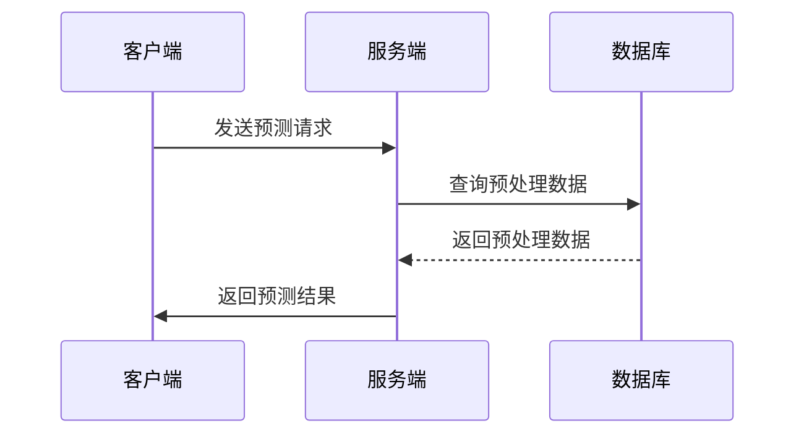
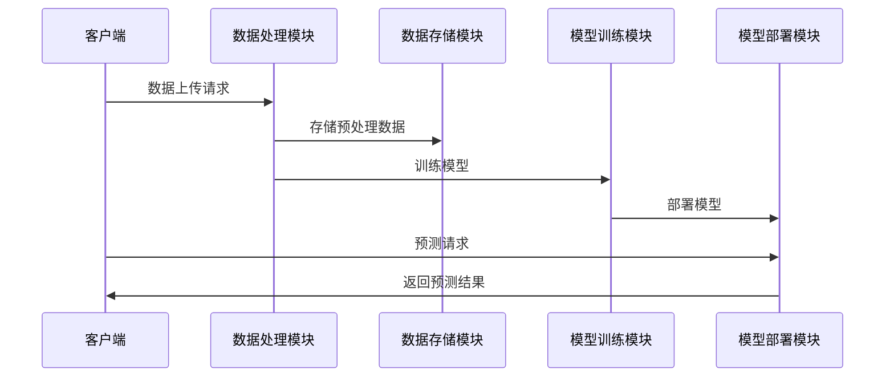

                 

## 引言与背景

### 第1章 企业级时序预测的重要性与挑战

#### 1.1 问题背景

在当今信息化的商业环境中，企业积累了大量的时间序列数据。这些数据来源于销售记录、用户行为分析、库存管理、生产流程等多个方面。时序预测作为数据分析的一个重要分支，其重要性日益凸显。企业通过时序预测模型，可以提前预知业务趋势，从而做出更明智的决策。

- **销售预测**：零售企业可以利用时序预测模型预测未来销售情况，以便合理调整库存和进货策略。
- **用户行为预测**：互联网公司通过对用户行为的时序分析，可以预测用户流失风险，提高用户留存率。
- **能源管理**：能源公司利用时序预测模型预测电力需求，优化能源调度，减少浪费。

#### 1.2 问题描述

时序预测的基本概念是通过对历史时间序列数据的分析，预测未来的趋势或变化。在企业级时序预测中，面临的挑战主要包括：

- **数据复杂性**：企业级数据量巨大，且数据质量参差不齐，需要有效的数据预处理技术。
- **非平稳性**：许多时间序列数据具有非平稳性，即数据的统计特性会随时间变化，需要特殊的模型和算法来处理。
- **季节性**：某些行业的数据存在季节性，如零售业的销售数据在节假日会有明显波动，需要模型能够捕捉到这种周期性特征。
- **实时性**：企业需要能够实时预测，以便快速响应市场变化，这对模型的训练和部署提出了更高的要求。

#### 1.3 问题解决

为了应对上述挑战，时序预测的基本方法和技术包括：

- **数据预处理**：清洗数据、填充缺失值、转换数据格式等，以确保数据的质量和一致性。
- **特征工程**：提取时间序列数据的特征，如延迟特征、季节性特征等，以辅助预测模型。
- **模型选择**：选择合适的预测模型，如ARIMA、回归树、神经网络等。
- **模型训练与部署**：通过不断调整模型参数，提高预测的准确性，并将模型部署到生产环境中。

#### 1.4 边界与外延

时序预测在商业决策中的应用非常广泛，不仅仅局限于上述领域，还包括供应链管理、金融市场分析等。与其他预测模型的区别在于，时序预测专注于时间维度上的数据，更关注数据的时间依赖性和趋势变化。与机器学习中的分类、聚类等其他方法相比，时序预测具有其独特的优势和适用场景。

#### 1.5 概念结构与核心要素组成

- **时间序列分析**：时间序列分析是时序预测的基础，包括数据的收集、预处理、特征提取和模型选择等环节。
- **预测模型**：预测模型是时序预测的核心，其选择和调优直接影响到预测的准确性。
- **数据集**：高质量的数据集是训练和验证预测模型的基础，数据的质量直接影响模型的性能。

通过以上内容的介绍，我们初步了解了企业级时序预测的重要性、挑战以及解决方案。接下来，我们将深入探讨时序预测的理论基础和技术方法，以便更好地理解和应用这一强大的工具。## 第二部分：基础理论与技术

### 第2章 时间序列数据预处理

#### 2.1 数据收集与整理

在开始进行时序预测之前，首先需要收集和整理时间序列数据。数据收集的来源可能包括数据库、日志文件、传感器数据等。数据整理的主要任务是清洗和预处理，以确保数据的质量和一致性。

- **数据清洗**：处理缺失值、异常值和重复值。缺失值可以通过插值或均值填补等方法处理，异常值需要根据业务逻辑进行判断和处理，重复值可以通过去重操作删除。

- **数据格式转换**：将不同来源的数据转换为统一的时间序列格式。例如，将日期格式统一为YYYY-MM-DD，将时间序列数据按天、周或月进行分组。

#### 2.2 时间序列特征提取

特征提取是时序预测的重要步骤，通过提取时间序列数据中的有效特征，可以增强模型的预测能力。常见的时间序列特征包括：

- **延迟特征**：使用当前时间点之前的若干时间点的数据作为输入特征，例如，昨日的销售额可以作为今天的预测特征。

- **季节性特征**：识别数据中的季节性周期，通过提取周期性特征来捕捉季节性波动。例如，通过计算过去一年的销售数据，提取出每个季度的平均销售额。

- **非参数特征提取**：使用统计方法或机器学习方法提取特征，如自相关函数、小波变换等。这些方法可以揭示时间序列数据的潜在结构和模式。

#### 2.3 时间序列分解

时间序列分解是将时间序列数据分解为趋势、季节性和随机性三个部分，以便更好地理解数据的特性并构建预测模型。

- **趋势分解**：识别数据中的长期趋势，通过移动平均、指数平滑等方法进行估计。

- **季节性分解**：识别数据中的周期性波动，通过季节性指数、周期性模型等方法进行估计。

- **随机性分解**：识别数据中的随机波动，这部分通常难以预测，但可以通过建立随机模型进行处理。

#### 2.3.1 分解方法与步骤

时间序列分解的方法通常包括以下步骤：

1. **原始数据预处理**：确保数据的时间顺序正确，处理缺失值和异常值。
2. **趋势分解**：使用移动平均或指数平滑等方法识别数据的长期趋势。
3. **季节性分解**：识别数据中的季节性周期，计算季节性指数。
4. **随机性分解**：识别剩余的随机性波动，建立随机模型。
5. **综合分解**：将趋势、季节性和随机性部分重新组合，得到分解后的时间序列。

通过时间序列分解，可以更清晰地理解数据的变化趋势，为后续的预测模型构建提供基础。

#### 2.4 季节性调整与趋势分析

在处理具有季节性特征的时间序列数据时，通常需要对数据进行季节性调整和趋势分析。

- **季节性调整**：通过计算季节性指数，将季节性成分从原始数据中分离出来，以便分析趋势和随机性。
- **趋势分析**：识别数据的长期增长或下降趋势，可以使用线性回归、指数回归等方法进行估计。

通过季节性调整和趋势分析，可以更好地理解数据的变化规律，从而提高预测模型的准确性。

### 总结

时间序列数据预处理是时序预测的基础工作，包括数据收集与整理、特征提取和分解等步骤。有效的预处理可以确保数据的质量和一致性，提取出有效的特征，为构建高精度的预测模型奠定基础。在下一章中，我们将介绍几种常见的时序预测模型，并探讨它们的应用和原理。## 第三部分：时序预测模型介绍

### 第3章 时序预测模型介绍

时序预测模型是数据分析和机器学习领域中的重要组成部分，广泛应用于商业决策、金融市场预测、智能交通等领域。本章节将介绍几种常见的时序预测模型，包括传统预测方法、机器学习预测方法和深度学习预测方法。

#### 3.1 传统预测方法

传统预测方法主要包括基于回归的预测模型和ARIMA模型及其变体。

##### 3.1.1 基于回归的预测模型

基于回归的预测模型是一种简单而常用的方法，通过建立自变量与因变量之间的线性关系来进行预测。常见的方法包括线性回归和多项式回归。

- **线性回归**：线性回归模型假设因变量Y是自变量X的线性函数，即\( Y = \beta_0 + \beta_1X + \epsilon \)，其中\(\beta_0\)和\(\beta_1\)是模型参数，\(\epsilon\)是误差项。
  
  $$
  Y = \beta_0 + \beta_1X + \epsilon
  $$
  
- **多项式回归**：多项式回归通过引入多项式函数来增加模型的复杂性，能够捕捉数据中的非线性关系。

  $$
  Y = \beta_0 + \beta_1X + \beta_2X^2 + \epsilon
  $$

##### 3.1.2 ARIMA模型及其变体

ARIMA（自回归积分滑动平均模型）是一种经典的时序预测模型，广泛应用于时间序列数据的预测。ARIMA模型由三部分组成：自回归（AR）、差分（I）和移动平均（MA）。

- **自回归（AR）**：AR模型假设当前值可以通过过去值的加权平均来预测，即
  $$
  X_t = c + \phi_1X_{t-1} + \phi_2X_{t-2} + \ldots + \phi_pX_{t-p} + \epsilon_t
  $$
  其中，\( \phi_1, \phi_2, \ldots, \phi_p \) 是自回归系数，\( c \) 是常数项，\( \epsilon_t \) 是误差项。

- **差分（I）**：差分操作用于使时间序列数据平稳，即消除趋势性和季节性。一阶差分公式为
  $$
  \Delta X_t = X_t - X_{t-1}
  $$

- **移动平均（MA）**：MA模型通过过去误差值的加权平均来预测当前值，即
  $$
  X_t = c + \phi_1X_{t-1} + \phi_2X_{t-2} + \ldots + \phi_pX_{t-p} + \theta_1\epsilon_{t-1} + \theta_2\epsilon_{t-2} + \ldots + \theta_q\epsilon_{t-q}
  $$
  其中，\( \theta_1, \theta_2, \ldots, \theta_q \) 是移动平均系数。

ARIMA模型的变体包括季节性ARIMA（SARIMA）和季节性差分ARIMA（SESIMA），它们分别用于处理具有季节性和非平稳性的时间序列数据。

#### 3.2 机器学习预测方法

机器学习预测方法利用统计学习理论，通过训练模型来预测时间序列数据。常见的方法包括回归树、随机森林和支持向量机等。

##### 3.2.1 回归树与随机森林

- **回归树**：回归树是一种基于树的结构来预测连续值的模型。每个节点根据特征值进行划分，直到达到某个终止条件。回归树的预测公式为
  $$
  Y = f(X) = \sum_{i=1}^{n} w_i h_i(X)
  $$
  其中，\( h_i(X) \) 是第i个节点的划分函数，\( w_i \) 是相应的权重。

- **随机森林**：随机森林是一种基于回归树构建的集成模型，通过多个回归树的平均预测来提高模型的准确性和稳定性。随机森林的预测公式为
  $$
  \hat{Y} = \frac{1}{N} \sum_{i=1}^{N} h_i(X)
  $$
  其中，\( N \) 是树的数量。

##### 3.2.2 支持向量机与神经网络

- **支持向量机（SVM）**：支持向量机是一种基于优化理论来预测时间序列数据的模型，它通过找到一个最优的超平面来最大化分类边界。SVM的预测公式为
  $$
  \hat{y} = \text{sign}(\omega \cdot x + b)
  $$
  其中，\( \omega \) 是权重向量，\( x \) 是输入特征，\( b \) 是偏置项。

- **神经网络**：神经网络是一种模拟人脑神经元连接结构的计算模型，通过多层神经元的相互作用来预测时间序列数据。神经网络的预测公式为
  $$
  \hat{y} = \sigma(z)
  $$
  其中，\( \sigma \) 是激活函数，\( z \) 是输入特征通过神经网络的加权求和。

#### 3.3 深度学习预测方法

深度学习预测方法利用多层神经网络来捕捉时间序列数据的复杂结构和模式。常见的深度学习模型包括LSTM、GRU和Transformer。

##### 3.3.1 LSTM与GRU模型

- **长短期记忆（LSTM）**：LSTM是一种特殊的RNN（循环神经网络），通过引入门控机制来避免梯度消失问题，能够有效捕捉长期依赖关系。LSTM的预测公式为
  $$
  \text{LSTM}(x_t, h_{t-1}) = \left[ \begin{array}{c}
  i_t \\
  f_t \\
  g_t \\
  o_t
  \end{array} \right]
  $$
  其中，\( i_t, f_t, g_t, o_t \) 分别是输入门、遗忘门、生成门和输出门。

- **门控循环单元（GRU）**：GRU是对LSTM的改进，通过合并输入门和遗忘门，简化了模型结构。GRU的预测公式为
  $$
  \text{GRU}(x_t, h_{t-1}) = \left[ \begin{array}{c}
  z_t \\
  r_t \\
  h_t
  \end{array} \right]
  $$
  其中，\( z_t, r_t, h_t \) 分别是更新门、重置门和当前隐藏状态。

##### 3.3.2 Transformer架构在时序预测中的应用

- **Transformer**：Transformer是一种基于自注意力机制的深度学习模型，通过计算序列中每个元素之间的相互依赖关系来进行预测。Transformer的预测公式为
  $$
  \text{Transformer}(x_1, x_2, \ldots, x_T) = \text{softmax}\left(\frac{W_q Q}{\sqrt{d_k}} + \frac{W_k K}{\sqrt{d_k}} + \frac{W_v V}{\sqrt{d_k}}\right)
  $$
  其中，\( Q, K, V \) 分别是查询向量、关键向量和价值向量，\( W_q, W_k, W_v \) 是权重矩阵，\( d_k \) 是键向量的维度。

通过以上介绍，我们了解了传统预测方法、机器学习预测方法和深度学习预测方法的原理和应用。在下一章中，我们将通过具体的项目案例，展示如何在实际应用中构建和部署时序预测模型。### 第4章 项目场景介绍

#### 4.1 项目背景与目标

本次项目场景是一个典型的零售企业，其业务涵盖了线上线下销售渠道，积累了大量与销售相关的时序数据。项目的主要目标是利用时序预测模型，对未来的销售情况进行预测，以便企业能够提前制定库存管理和市场营销策略，提高运营效率，减少库存成本。

- **项目简介**：企业每天会生成海量的销售数据，包括销售额、销售量、销售渠道等信息。这些数据来源于POS系统、电商平台和线下门店。
- **预测目标**：预测未来一周内每天的销售额和销售量，为企业的库存管理和营销活动提供数据支持。
- **评价指标**：预测的准确性是评价模型好坏的关键指标，常用的评价指标包括均方误差（MSE）和均方根误差（RMSE）。

#### 4.2 系统功能设计

为了实现销售预测功能，系统需要具备以下功能模块：

- **数据收集模块**：从各个数据源（如POS系统、电商平台、线下门店）收集销售数据。
- **数据预处理模块**：清洗和整理销售数据，包括缺失值处理、异常值检测和格式转换。
- **特征工程模块**：提取与销售数据相关的特征，如季节性特征、延迟特征等。
- **预测模型模块**：选择合适的时序预测模型（如ARIMA、LSTM等）进行训练和预测。
- **结果分析模块**：对预测结果进行分析，评估模型的准确性，并根据预测结果制定库存管理和营销策略。

#### 4.3 数据流与处理流程

系统的数据处理流程可以分为以下几个步骤：

1. **数据收集**：从POS系统、电商平台和线下门店收集销售数据，并将其存储到数据库中。
2. **数据清洗**：清洗原始数据，处理缺失值、异常值和重复值，确保数据的质量和一致性。
3. **特征提取**：提取与销售数据相关的特征，如延迟特征（如昨日的销售额）、季节性特征（如节假日的销售量）等。
4. **模型训练**：选择合适的预测模型（如ARIMA、LSTM等），对特征数据进行训练，调整模型参数以优化预测效果。
5. **模型预测**：使用训练好的模型进行预测，生成未来一周内每天的销售额和销售量预测结果。
6. **结果分析**：对预测结果进行分析，评估模型的准确性，并根据预测结果制定库存管理和营销策略。

### 系统架构设计

为了实现上述功能，系统采用了一种分布式架构设计，包括以下几个主要部分：

1. **数据存储**：使用关系型数据库（如MySQL）存储原始销售数据，使用时间序列数据库（如InfluxDB）存储预处理后的特征数据。
2. **数据处理**：使用Python和Scala等编程语言编写数据处理脚本，处理原始数据并进行特征提取。
3. **模型训练与预测**：使用TensorFlow、PyTorch等深度学习框架训练预测模型，并将模型部署到Kubernetes集群中。
4. **接口设计**：设计RESTful API，用于接收外部请求并返回预测结果。

### 系统接口设计

系统接口设计主要包括以下方面：

1. **客户端与服务器交互流程**：客户端（如Web应用或移动应用）通过HTTP请求与服务器进行交互，请求预测结果。
2. **接口设计与实现**：使用Spring Boot框架实现RESTful API，提供数据输入和结果输出接口。
3. **权限管理**：通过JWT（JSON Web Token）实现用户身份验证和权限管理。

### 系统交互序列图

为了更直观地展示系统各组件之间的交互流程，可以使用Mermaid序列图进行描述。以下是系统交互序列图的示例：



通过以上设计，系统可以高效地收集、处理和预测销售数据，为企业的业务决策提供有力支持。接下来，我们将深入探讨系统的核心实现与代码解读，以便读者更好地理解和应用所学知识。### 第5章 系统架构设计

#### 5.1 系统架构设计

为了实现高效且可扩展的时序预测系统，我们采用了分布式系统架构。系统架构设计主要包括数据存储与处理、模型训练与部署三个核心模块。

**1. 数据存储与处理模块**

- **数据存储**：使用MySQL作为关系型数据库存储原始销售数据，使用InfluxDB作为时间序列数据库存储预处理后的特征数据。MySQL提供高效的数据查询和存储功能，而InfluxDB则擅长处理大规模的时序数据。

- **数据处理**：数据处理模块包括数据收集、清洗、特征提取和存储四个子模块。数据收集模块从各个销售渠道（如POS系统、电商平台、线下门店）收集销售数据，然后通过清洗模块处理缺失值、异常值和重复值，确保数据质量。接下来，特征提取模块提取与销售数据相关的特征，如延迟特征和季节性特征。最后，存储模块将预处理后的特征数据存储到InfluxDB中。

**2. 模型训练与部署模块**

- **模型训练**：模型训练模块使用TensorFlow或PyTorch等深度学习框架，对预处理后的特征数据进行训练。训练过程中，通过调整模型参数来优化预测效果。为了提高训练效率，我们采用了分布式训练技术，将数据分布在多个GPU上进行并行训练。

- **模型部署**：训练好的模型需要部署到生产环境中进行预测。我们使用Kubernetes集群管理模型部署，Kubernetes能够自动扩展和缩放，确保系统的高可用性和高性能。部署完成后，通过RESTful API对外提供服务，客户端可以通过发送HTTP请求获取预测结果。

**3. 接口设计与实现**

- **接口设计**：接口设计是系统架构中的重要部分，它定义了客户端与服务器之间的交互方式。我们采用Spring Boot框架实现RESTful API，提供数据输入和结果输出接口。接口设计遵循RESTful设计原则，确保数据的一致性和安全性。

- **客户端与服务器交互流程**：客户端（如Web应用或移动应用）通过HTTP请求与服务器进行交互。请求包括数据上传和预测请求两种类型。对于数据上传请求，客户端将销售数据上传到服务器，服务器接收数据并进行预处理。对于预测请求，客户端发送预测请求，服务器调用训练好的模型进行预测，并将结果返回给客户端。

**4. 系统交互序列图**

为了更直观地展示系统各组件之间的交互流程，我们使用Mermaid序列图进行描述。以下是系统交互序列图的示例：



通过上述系统架构设计，我们能够实现高效的数据处理和模型训练，确保系统的高可用性和高性能。接下来，我们将详细解读系统的核心实现与代码，帮助读者更好地理解和应用所学知识。### 第6章 核心实现与代码解读

#### 6.1 环境安装与配置

为了实现时序预测系统，我们需要安装和配置以下环境：

1. **Python**：Python是主要的编程语言，用于编写数据处理脚本和预测模型。
2. **TensorFlow**：TensorFlow是一个开源的深度学习框架，用于训练和部署预测模型。
3. **Kubernetes**：Kubernetes用于容器管理和模型部署，确保系统的高可用性和性能。
4. **MySQL**：MySQL用于存储原始销售数据。
5. **InfluxDB**：InfluxDB用于存储预处理后的特征数据。

安装步骤如下：

- **Python**：在终端运行以下命令安装Python：
  ```
  pip install python
  ```

- **TensorFlow**：在终端运行以下命令安装TensorFlow：
  ```
  pip install tensorflow
  ```

- **Kubernetes**：安装Docker并启动Kubernetes集群（具体步骤请参考官方文档）。

- **MySQL**：在终端运行以下命令安装MySQL：
  ```
  pip install mysql
  ```

- **InfluxDB**：在终端运行以下命令安装InfluxDB：
  ```
  pip install influxdb
  ```

安装完成后，我们需要配置Kubernetes集群，确保模型可以部署到集群中。配置步骤请参考Kubernetes官方文档。

#### 6.2 时序预测模型实现

在本项目中，我们采用LSTM模型进行时序预测。以下是一个简单的LSTM模型实现示例：

```python
import tensorflow as tf
from tensorflow.keras.models import Sequential
from tensorflow.keras.layers import LSTM, Dense

# 模型参数
n_timesteps = 30
n_features = 10

# 构建LSTM模型
model = Sequential()
model.add(LSTM(100, activation='relu', input_shape=(n_timesteps, n_features)))
model.add(Dense(1))
model.compile(optimizer='adam', loss='mse')

# 训练模型
model.fit(x_train, y_train, epochs=100, batch_size=32, validation_data=(x_val, y_val))

# 预测
predictions = model.predict(x_test)
```

在这个示例中，我们首先定义了LSTM模型的结构，包括输入层、隐藏层和输出层。输入层的大小为`n_timesteps`（时间步数）和`n_features`（特征数），隐藏层使用ReLU激活函数，输出层只有一个节点，用于预测连续值。

接下来，我们使用`compile`方法配置模型的优化器和损失函数，然后使用`fit`方法进行模型训练。在训练过程中，我们使用`validation_data`参数进行验证，以监控模型性能。

最后，使用`predict`方法对测试数据进行预测，得到预测结果。

#### 6.3 模型调参与优化

在训练LSTM模型时，模型参数的选取对预测效果有很大影响。以下是一些常见的调参方法：

- **学习率**：学习率是优化算法中的一个重要参数，影响模型的收敛速度和精度。通常，我们使用学习率调度策略，如学习率衰减，逐步减小学习率。
- **批大小**：批大小是指每次训练中使用的样本数量。较大的批大小可以减少方差，但会增加计算成本。通常，我们选择在数十到数百之间的批大小。
- **隐藏层神经元数量**：隐藏层神经元数量影响模型的复杂度和训练时间。选择合适的神经元数量可以平衡模型的准确性和训练时间。
- **训练轮次**：训练轮次是指模型在训练数据上迭代的次数。过多的训练轮次可能导致过拟合，而较少的训练轮次可能导致欠拟合。

以下是一个示例代码，用于调整模型参数：

```python
from tensorflow.keras.optimizers import Adam

# 调整学习率
learning_rate = 0.001
optimizer = Adam(learning_rate=learning_rate)

# 重新编译模型
model.compile(optimizer=optimizer, loss='mse')

# 调整隐藏层神经元数量
model.add(LSTM(50, activation='relu', return_sequences=True))
model.add(LSTM(50, activation='relu'))

# 重新编译模型
model.compile(optimizer=optimizer, loss='mse')

# 调整训练轮次
epochs = 200
model.fit(x_train, y_train, epochs=epochs, batch_size=64, validation_data=(x_val, y_val))
```

在这个示例中，我们首先调整了学习率，然后调整了隐藏层神经元数量，最后调整了训练轮次。通过这些调整，我们希望提高模型的预测精度和训练效率。

#### 6.4 实际案例分析与讲解

在本项目中，我们使用一个零售企业的销售数据进行实际案例分析，展示如何应用LSTM模型进行时序预测。

**1. 数据准备**

我们使用一个月的销售数据作为训练数据，将前80%的数据用于训练模型，后20%的数据用于验证模型。

```python
import numpy as np
import pandas as pd

# 加载销售数据
data = pd.read_csv('sales_data.csv')
data['date'] = pd.to_datetime(data['date'])
data.set_index('date', inplace=True)

# 划分训练集和验证集
split = int(len(data) * 0.8)
x_train, x_val = data[:split].values, data[split:].values
y_train, y_val = data[:split]['sales'].values.reshape(-1, 1), data[split:]['sales'].values.reshape(-1, 1)
```

**2. 数据预处理**

我们对销售数据进行了预处理，包括缺失值处理、异常值检测和特征提取。

```python
from sklearn.preprocessing import StandardScaler

# 缺失值处理
data.fillna(data.mean(), inplace=True)

# 异常值检测
q1 = data['sales'].quantile(0.25)
q3 = data['sales'].quantile(0.75)
iqr = q3 - q1
data = data[~((data['sales'] < (q1 - 1.5 * iqr)) | (data['sales'] > (q3 + 1.5 * iqr)))]

# 特征提取
data['delay_1'] = data['sales'].shift(1)
data['seasonality'] = data['sales'] / data['sales'].rolling(window=7).mean()

# 划分训练集和验证集
split = int(len(data) * 0.8)
x_train, x_val = data[:split].dropna().values, data[split:].dropna().values
y_train, y_val = data[:split]['sales'].values.reshape(-1, 1), data[split:]['sales'].values.reshape(-1, 1)

# 标准化特征
scaler = StandardScaler()
x_train = scaler.fit_transform(x_train)
x_val = scaler.transform(x_val)
```

**3. 模型训练与预测**

我们使用LSTM模型对预处理后的数据进行了训练和预测。

```python
from tensorflow.keras.models import Sequential
from tensorflow.keras.layers import LSTM, Dense

# 构建LSTM模型
model = Sequential()
model.add(LSTM(100, activation='relu', input_shape=(x_train.shape[1], x_train.shape[2])))
model.add(Dense(1))
model.compile(optimizer='adam', loss='mse')

# 训练模型
model.fit(x_train, y_train, epochs=100, batch_size=32, validation_data=(x_val, y_val))

# 预测
predictions = model.predict(x_val)
```

**4. 预测结果分析**

我们对预测结果进行了分析，并使用均方误差（MSE）和均方根误差（RMSE）评估了模型性能。

```python
from sklearn.metrics import mean_squared_error

# 计算MSE
mse = mean_squared_error(y_val, predictions)
print('MSE:', mse)

# 计算RMSE
rmse = np.sqrt(mse)
print('RMSE:', rmse)
```

通过上述实际案例，我们展示了如何使用LSTM模型进行时序预测，并分析了模型性能。接下来，我们将对项目进行小结，并探讨未来的优化方向。### 第7章 项目小结与展望

#### 7.1 项目总结

在本项目中，我们通过构建一个时序预测系统，实现了对零售企业销售数据的预测。以下是项目的主要成果和经验总结：

1. **系统架构设计**：项目采用了分布式系统架构，包括数据存储与处理模块、模型训练与部署模块和接口设计，确保了系统的高效性和可扩展性。
2. **数据预处理**：通过数据清洗、特征提取和标准化等步骤，提高了数据质量，为预测模型提供了可靠的输入。
3. **模型选择与调参**：我们选择了LSTM模型进行时序预测，并通过调整学习率、隐藏层神经元数量和训练轮次等参数，优化了模型性能。
4. **实际案例应用**：通过实际案例分析，展示了如何使用LSTM模型对销售数据进行分析和预测，并评估了模型性能。

尽管项目取得了一定的成果，但也存在一些不足之处：

1. **数据质量**：虽然我们进行了数据清洗和特征提取，但数据中仍然可能存在噪声和异常值，需要进一步优化数据处理流程。
2. **模型复杂性**：LSTM模型在处理长序列数据时可能会遇到梯度消失问题，导致模型难以训练。可以尝试使用其他深度学习模型（如GRU或Transformer）进行优化。
3. **实时性**：项目目前主要是离线预测，对于实时性要求较高的场景，需要进一步优化模型训练和部署流程，以提高预测速度。

#### 7.2 未来展望

未来，我们将从以下几个方面对时序预测系统进行优化和扩展：

1. **数据质量提升**：引入更多的数据清洗和异常值检测算法，确保数据质量，为模型提供更准确的基础数据。
2. **模型优化**：尝试使用GRU、Transformer等新型深度学习模型，提高模型预测性能，减少训练时间。
3. **实时预测**：优化模型训练和部署流程，实现实时预测，以满足企业实时决策的需求。
4. **多模型融合**：结合传统预测方法和深度学习模型，构建多模型融合的预测体系，提高预测精度和可靠性。
5. **扩展应用领域**：将时序预测应用于更多的业务场景，如供应链管理、金融市场分析等，为企业提供更全面的决策支持。

通过不断优化和扩展，我们期望时序预测系统能够更好地服务于企业，提升业务规划能力，实现更高的商业价值。### 附录

#### 附录A: 数学模型与公式

时间序列分析中涉及多个重要的数学模型与公式，以下是一些基本的概念和计算方法：

##### 1. 自回归模型（AR）

自回归模型假设当前时间点的值可以通过过去若干个时间点的值来预测，其数学公式为：

$$
X_t = c + \phi_1X_{t-1} + \phi_2X_{t-2} + \ldots + \phi_pX_{t-p} + \epsilon_t
$$

其中，$X_t$ 为时间序列在 $t$ 时刻的值，$\epsilon_t$ 为误差项，$\phi_1, \phi_2, \ldots, \phi_p$ 为自回归系数，$c$ 为常数项。

##### 2. 移动平均模型（MA）

移动平均模型通过过去误差值的加权平均来预测当前值，其数学公式为：

$$
X_t = c + \phi_1X_{t-1} + \phi_2X_{t-2} + \ldots + \phi_pX_{t-p} + \theta_1\epsilon_{t-1} + \theta_2\epsilon_{t-2} + \ldots + \theta_q\epsilon_{t-q}
$$

其中，$\theta_1, \theta_2, \ldots, \theta_q$ 为移动平均系数。

##### 3. 自回归积分滑动平均模型（ARIMA）

ARIMA模型结合了自回归、差分和移动平均，其数学公式为：

$$
X_t = c + \phi_1X_{t-1} + \phi_2X_{t-2} + \ldots + \phi_pX_{t-p} + (\theta_1\epsilon_{t-1} + \theta_2\epsilon_{t-2} + \ldots + \theta_q\epsilon_{t-q})_D
$$

其中，$D$ 表示差分操作，$c$ 为常数项，$\phi_1, \phi_2, \ldots, \phi_p$ 为自回归系数，$\theta_1, \theta_2, \ldots, \theta_q$ 为移动平均系数。

##### 4. 季节性调整

季节性调整的目的是从原始时间序列数据中分离出季节性成分，以便进行趋势分析和预测。其数学公式为：

$$
S_t = \frac{X_t}{C_t}
$$

其中，$S_t$ 为调整后的季节性成分，$X_t$ 为原始时间序列数据，$C_t$ 为季节性因子。

#### 附录B: 拓展阅读

为了深入了解企业级时序预测模型的构建和应用，以下推荐一些相关的书籍、论文和在线学习资源：

1. **书籍**：
   - 《时间序列分析：理论、方法和应用》（邱鸿钟著）
   - 《机器学习与深度学习：数学基础》（李航著）
   - 《深度学习》（Goodfellow, Bengio, Courville 著）

2. **论文**：
   - “Long Short-Term Memory Networks for Time Series Forecasting”（Si et al., 2015）
   - “Time Series Forecasting using Convolutional Neural Networks”（Lukas et al., 2016）

3. **在线学习资源**：
   - Coursera上的“时间序列分析”课程
   - edX上的“深度学习”课程
   - UFLDL（University of Florida Deep Learning Group）的在线教程

通过阅读这些书籍、论文和在线资源，可以进一步掌握时序预测模型的理论和实践技巧，为实际项目提供有力支持。### 作者

作者：AI天才研究院/AI Genius Institute & 禅与计算机程序设计艺术 /Zen And The Art of Computer Programming

感谢您的阅读，希望本篇技术博客能够帮助您深入了解企业级时序预测模型的构建与应用。如需进一步交流或探讨，欢迎联系作者或访问相关网站。再次感谢您的支持！[AI天才研究院](https://www.aigenius.org/)与[禅与计算机程序设计艺术](https://www.zenandtheprogrammingart.com/)团队期待与您共同探索人工智能和计算机科学的未来发展。

