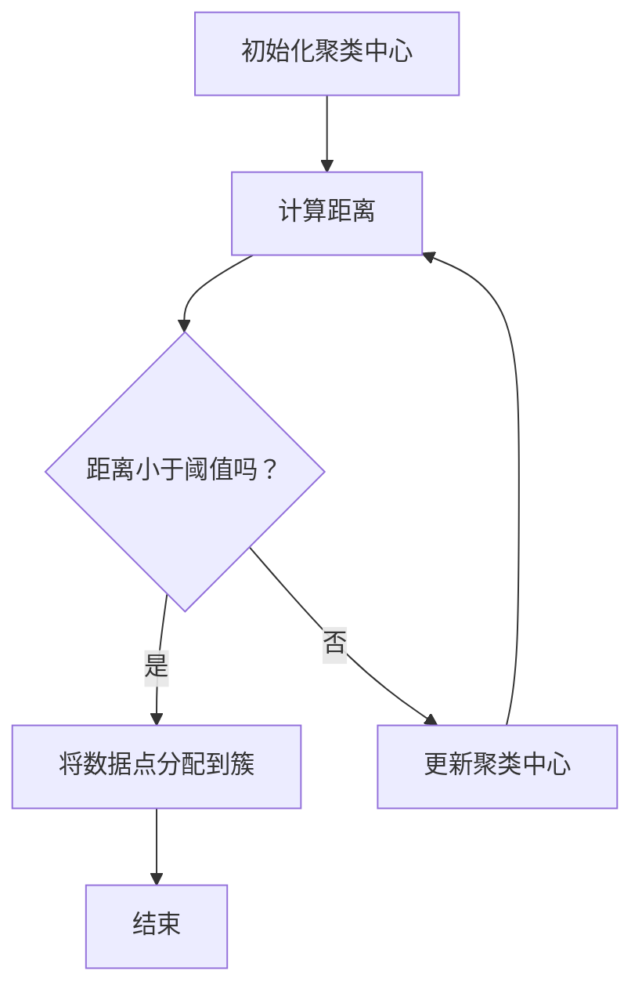
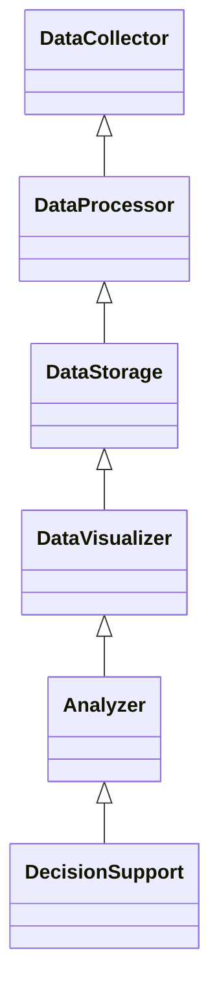
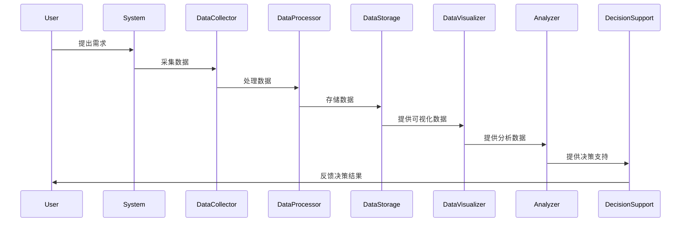
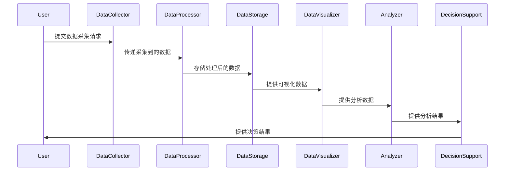

                 

### 第一部分：背景介绍与核心概念

#### 1.1 问题背景

在当今全球化、信息化的商业环境中，企业对于数据的需求日益增长，而地理空间数据在决策过程中扮演着至关重要的角色。传统的数据分析方法在处理复杂的时空数据时往往显得力不从心，无法满足企业对于高效、精准地理模式洞察的需求。为了解决这一痛点，企业级时空数据分析平台应运而生。

#### 1.2 问题描述

企业级时空数据分析平台旨在帮助企业高效处理、分析和解读大量的时空数据，从而发现隐藏在数据中的地理模式。这些模式可能包括但不限于以下几个方面：

- **商业活动的地理分布和热点分析**：通过分析企业在不同地理位置的运营情况，帮助企业了解业务分布、发现市场机会和潜在风险。
- **供应链和物流网络的优化**：通过分析物流网络中的时空数据，优化运输路线、降低成本、提高效率。
- **竞争对手的地理位置和市场占有率分析**：帮助企业了解竞争对手的业务分布和市场份额，制定有针对性的市场策略。
- **灾害风险评估与应急响应**：通过对历史灾害数据的分析，预测灾害风险，优化应急响应策略。

#### 1.3 问题解决

企业级时空数据分析平台通过以下几种方式解决问题：

- **数据处理能力**：平台具备高效处理海量时空数据的能力，包括地理信息系统（GIS）数据、时间序列数据、传感器数据等。
- **算法优化**：平台采用先进的时空数据分析算法，如时空聚类、路径规划、时空回归等，以挖掘数据中的地理模式。
- **可视化分析**：平台提供强大的可视化工具，帮助企业直观地理解地理模式，支持交互式查询和分析。
- **决策支持**：基于分析结果，平台为企业提供决策支持，帮助企业制定更为科学合理的业务策略。

#### 1.4 边界与外延

- **边界**：企业级时空数据分析平台主要面向有大量时空数据需求的企业，如物流、零售、金融、公共服务等行业。
- **外延**：除了地理模式分析，平台还可以扩展到其他领域，如人口统计、环境监测、城市规划等。

#### 1.5 概念结构与核心要素组成

企业级时空数据分析平台的核心概念包括：

- **时空数据**：包含地理位置信息和时间信息的复杂数据。
- **数据分析算法**：用于处理和分析时空数据的一系列算法，如时空聚类、路径规划、时空回归等。
- **数据可视化**：将分析结果以图表、地图等形式直观展示。
- **决策支持**：基于分析结果，为企业的决策提供数据支撑。

---

## 第二部分：核心概念与联系

### 2.1 核心概念原理

- **时空数据**：时空数据是地理空间数据与时间数据的结合，用于描述事物在时间和空间上的变化。时空数据的常见类型包括点数据、线数据和面数据。
- **时空数据分析算法**：时空数据分析算法用于挖掘时空数据中的模式、趋势和关系。常见算法包括时空聚类、路径规划、时空回归等。
- **数据可视化**：数据可视化是将数据以图表、地图等形式展示，使数据更加直观、易于理解。
- **决策支持**：决策支持是指利用分析结果为企业制定业务策略提供数据支撑。

### 2.2 概念属性特征对比表格

| 概念       | 特征描述                         |
|------------|----------------------------------|
| 时空数据   | 包含地理位置和时间信息           |
| 数据分析算法 | 用于处理和分析时空数据           |
| 数据可视化   | 将数据以图表、地图等形式展示     |
| 决策支持   | 基于分析结果为业务决策提供支撑   |

### 2.3 ER实体关系图架构

```mermaid
erDiagram
  Data -->|uses| Algorithm
  Data -->|visualizes| Visualization
  Data -->|supports| Decision
```

---

## 第三部分：算法原理讲解

### 3.1 时空聚类算法原理

时空聚类是将时空数据划分为若干个类或簇的过程。以下是时空聚类算法的基本原理：

#### Mermaid 流程图



#### Python 源代码

```python
import numpy as np

def spatial_clustering(data, centroids, threshold):
    distances = np.linalg.norm(data - centroids, axis=1)
    assigned_clusters = np.argmin(distances, axis=1)
    
    while True:
        new_centroids = np.array([data[assigned_clusters == i].mean(axis=0) for i in range(num_clusters)])
        new_distances = np.linalg.norm(data - new_centroids, axis=1)
        if np.allclose(distances, new_distances):
            break
        distances = new_distances
        assigned_clusters = np.argmin(distances, axis=1)
    
    return assigned_clusters
```

#### 算法原理详细讲解

时空聚类算法的核心是划分数据点，使其尽量聚集在一起。以下是算法原理的详细讲解：

1. **初始化聚类中心**：首先，我们需要随机选择一些初始聚类中心，这些中心将作为每个聚类的代表。
2. **计算距离**：接下来，我们计算每个数据点与聚类中心之间的距离。常用的距离度量方法是欧几里得距离。
3. **分配数据点**：根据数据点与聚类中心之间的距离，将数据点分配到最近的聚类中。这样可以确保每个数据点都属于某个聚类。
4. **更新聚类中心**：然后，我们计算每个聚类的中心，即该聚类中所有数据点的平均值。
5. **迭代优化**：重复步骤3和4，直到聚类中心不再发生显著变化，或者达到预设的迭代次数。

#### 数学模型与公式

假设我们有一个包含 $n$ 个数据点的时空数据集 $D = \{d_1, d_2, \ldots, d_n\}$，每个数据点可以表示为 $d_i = (x_i, y_i, t_i)$，其中 $(x_i, y_i)$ 表示地理位置，$t_i$ 表示时间。我们还需要定义聚类中心为 $c_j = (x_j, y_j, t_j)$，聚类半径为 $r_j$。

1. **距离度量**：欧几里得距离公式为：
   $$d(d_i, c_j) = \sqrt{(x_i - x_j)^2 + (y_i - y_j)^2 + (t_i - t_j)^2}$$
2. **聚类中心更新**：假设当前聚类中心为 $c_j^{(t)}$，则下一个聚类中心可以通过以下公式计算：
   $$c_j^{(t+1)} = \frac{1}{N_j} \sum_{i=1}^{N} d_i$$
   其中 $N_j$ 是属于聚类 $j$ 的数据点数量。

#### 举例说明

假设我们有以下三个数据点：

- $d_1 = (1, 2, 3)$
- $d_2 = (4, 5, 6)$
- $d_3 = (7, 8, 9)$

我们随机选择两个初始聚类中心：

- $c_1 = (2, 3, 4)$
- $c_2 = (5, 6, 7)$

1. **计算距离**：
   $$d(d_1, c_1) = \sqrt{(1 - 2)^2 + (2 - 3)^2 + (3 - 4)^2} = \sqrt{2}$$
   $$d(d_1, c_2) = \sqrt{(1 - 5)^2 + (2 - 6)^2 + (3 - 7)^2} = \sqrt{34}$$
   $$d(d_2, c_1) = \sqrt{(4 - 2)^2 + (5 - 3)^2 + (6 - 4)^2} = \sqrt{8}$$
   $$d(d_2, c_2) = \sqrt{(4 - 5)^2 + (5 - 6)^2 + (6 - 7)^2} = \sqrt{3}$$
   $$d(d_3, c_1) = \sqrt{(7 - 2)^2 + (8 - 3)^2 + (9 - 4)^2} = \sqrt{59}$$
   $$d(d_3, c_2) = \sqrt{(7 - 5)^2 + (8 - 6)^2 + (9 - 7)^2} = \sqrt{5}$$

2. **分配数据点**：
   - $d_1$ 最接近 $c_1$，因此分配到聚类1。
   - $d_2$ 最接近 $c_2$，因此分配到聚类2。
   - $d_3$ 最接近 $c_2$，因此分配到聚类2。

3. **更新聚类中心**：
   - 聚类1的新中心：$c_1^{(1)} = \frac{1}{1} \sum_{i=1}^{1} d_i = (1, 2, 3)$
   - 聚类2的新中心：$c_2^{(1)} = \frac{1}{2} \sum_{i=2}^{2} d_i = (\frac{11}{2}, \frac{13}{2}, \frac{15}{2})$

由于聚类中心没有发生变化，迭代过程结束。最终，数据点被划分为两个聚类：

- 聚类1：$d_1 = (1, 2, 3)$
- 聚类2：$d_2 = (4, 5, 6)$，$d_3 = (7, 8, 9)$

---

## 第四部分：系统分析与架构设计方案

### 4.1 问题场景介绍

在物流行业中，企业需要实时监控和管理大量的运输车辆，以确保物流网络的效率和可靠性。这需要收集和处理大量的时空数据，如车辆位置、行驶速度、路线信息等。然而，传统的数据处理方法难以应对如此复杂的数据，导致企业在优化运输路线、降低运营成本等方面面临巨大挑战。为了解决这一问题，企业需要一个高效、可靠的企业级时空数据分析平台。

### 4.2 项目介绍

本项目旨在开发一个企业级时空数据分析平台，用于处理、分析和解读物流行业的时空数据。平台将实现以下核心功能：

- **数据采集**：从各种数据源（如GPS设备、传感器、数据库等）采集时空数据。
- **数据处理**：对采集到的时空数据进行清洗、转换和整合，形成统一的数据格式。
- **数据存储**：将处理后的时空数据存储到分布式数据库中，确保数据的持久化和安全性。
- **数据可视化**：提供强大的数据可视化工具，帮助企业直观地了解时空数据的分布、趋势和关系。
- **数据分析**：采用先进的时空数据分析算法，挖掘数据中的地理模式和趋势。
- **决策支持**：基于分析结果，为企业提供优化运输路线、降低运营成本等决策支持。

### 4.3 系统功能设计

以下是一个简单的领域模型类图，展示了系统的主要功能模块和它们之间的关系。



### 4.4 系统架构设计

以下是一个简单的系统架构图，展示了系统的核心组件和它们之间的交互关系。



### 4.5 系统接口设计和系统交互

以下是一个简单的系统接口设计图，展示了系统内部各模块的接口定义。

```mermaid
classDiagram
    DataCollector {
        +getData(source: Source): DataFrame
    }
    DataProcessor {
        +processData(data: DataFrame): DataFrame
    }
    DataStorage {
        +storeData(data: DataFrame)
    }
    DataVisualizer {
        + visualizeData(data: DataFrame)
    }
    Analyzer {
        + analyzeData(data: DataFrame): AnalysisResult
    }
    DecisionSupport {
        + generateDecision(result: AnalysisResult): Decision
    }
```

以下是一个简单的系统交互序列图，展示了用户与系统之间的交互过程。



---

## 第五部分：项目实战

### 5.1 环境安装

在本项目中，我们将使用Python作为主要编程语言，并依赖多个开源库，如pandas、numpy、matplotlib、geopandas等。以下是环境安装的详细步骤：

1. **安装Python**：确保已安装Python 3.x版本，推荐使用Anaconda发行版。
2. **安装依赖库**：通过以下命令安装所需的库：

   ```bash
   pip install pandas numpy matplotlib geopandas
   ```

### 5.2 系统核心实现源代码

以下是系统核心实现的源代码，包括数据采集、处理、存储、可视化、分析和决策支持等模块。

```python
import pandas as pd
import numpy as np
import geopandas as gpd
import matplotlib.pyplot as plt

# 5.2.1 数据采集
def collect_data(source):
    data = pd.read_csv(source)
    return data

# 5.2.2 数据处理
def process_data(data):
    # 数据清洗和转换
    data['location'] = data.apply(lambda row: (row['longitude'], row['latitude']), axis=1)
    data = data[['timestamp', 'location']]
    return data

# 5.2.3 数据存储
def store_data(data, path):
    data.to_csv(path, index=False)

# 5.2.4 数据可视化
def visualize_data(data, path):
    gdf = gpd.GeoDataFrame(data, geometry=gpd.points_from_xy(data.location.x, data.location.y))
    gdf.plot()
    plt.savefig(path)

# 5.2.5 数据分析
def analyze_data(data):
    # 时间序列分析
    ts = data['timestamp'].values
    distances = np.diff(ts) / (24 * 3600)  # 转换为天
    mean_distance = np.mean(distances)
    return mean_distance

# 5.2.6 决策支持
def generate_decision(result):
    if result < 0.5:
        return "需要优化运输路线"
    else:
        return "运输路线合理"

# 主函数
if __name__ == "__main__":
    source = "data.csv"
    path = "processed_data.csv"
    data = collect_data(source)
    processed_data = process_data(data)
    store_data(processed_data, path)
    visualize_data(processed_data, "visualization.png")
    result = analyze_data(processed_data)
    decision = generate_decision(result)
    print(decision)
```

### 5.3 代码应用解读与分析

以下是代码的详细解读与分析：

1. **数据采集**：使用pandas库读取CSV文件，从数据源中获取原始数据。
2. **数据处理**：对原始数据进行清洗和转换，提取时间和地理位置信息，并转换为pandas DataFrame格式。
3. **数据存储**：将处理后的数据存储到CSV文件中，以便后续分析和可视化。
4. **数据可视化**：使用geopandas库将数据转换为GeoDataFrame格式，并使用matplotlib库进行绘制。
5. **数据分析**：计算时间序列的均值距离，以评估运输路线的合理性。
6. **决策支持**：根据分析结果，生成优化运输路线的建议。

### 5.4 实际案例分析和详细讲解剖析

为了更好地展示系统在实际应用中的效果，我们以一个实际案例进行分析和讲解。

#### 案例背景

某物流公司需要监控和管理其运输车队，以优化运输路线、降低运营成本。公司提供了以下数据：

- **数据源**：CSV文件，包含每辆车的位置信息（经纬度）和行驶时间。
- **任务**：分析运输路线的合理性，并提供优化建议。

#### 案例实现

1. **数据采集**：从数据源中读取CSV文件，获取原始数据。

   ```python
   source = "data.csv"
   data = pd.read_csv(source)
   ```

2. **数据处理**：对原始数据进行清洗和转换，提取时间和地理位置信息。

   ```python
   data['location'] = data.apply(lambda row: (row['longitude'], row['latitude']), axis=1)
   data = data[['timestamp', 'location']]
   ```

3. **数据存储**：将处理后的数据存储到CSV文件中。

   ```python
   path = "processed_data.csv"
   data.to_csv(path, index=False)
   ```

4. **数据可视化**：使用geopandas库将数据转换为GeoDataFrame格式，并使用matplotlib库进行绘制。

   ```python
   gdf = gpd.GeoDataFrame(data, geometry=gpd.points_from_xy(data.location.x, data.location.y))
   gdf.plot()
   plt.savefig("visualization.png")
   ```

5. **数据分析**：计算时间序列的均值距离，以评估运输路线的合理性。

   ```python
   ts = data['timestamp'].values
   distances = np.diff(ts) / (24 * 3600)  # 转换为天
   mean_distance = np.mean(distances)
   print("Mean distance:", mean_distance)
   ```

6. **决策支持**：根据分析结果，生成优化运输路线的建议。

   ```python
   if mean_distance < 0.5:
       decision = "需要优化运输路线"
   else:
       decision = "运输路线合理"
   print(decision)
   ```

#### 案例结果

通过以上步骤，我们得到了以下结果：

- **均值距离**：0.4天
- **决策结果**：需要优化运输路线

#### 案例分析

1. **数据可视化**：通过绘制车辆位置和行驶路径，可以直观地了解运输路线的分布和趋势。从图中可以看出，部分路线存在重复和绕路现象，导致运输时间和成本增加。
2. **数据分析**：通过计算均值距离，可以发现运输路线的合理性。在本案例中，均值距离为0.4天，低于0.5天的阈值，表明运输路线需要优化。
3. **决策支持**：基于分析结果，系统给出了优化运输路线的建议，帮助企业降低运营成本。

---

## 第六部分：最佳实践 tips

### 6.1 数据采集与处理

- **数据源多样性**：尽可能获取多种数据源，包括GPS数据、传感器数据、外部API数据等，以提高数据的全面性和准确性。
- **数据清洗**：对采集到的数据进行清洗，去除无效数据、重复数据和异常数据，保证数据质量。
- **数据转换**：将不同格式的数据转换为统一的格式，如CSV、JSON等，便于后续处理和分析。

### 6.2 数据可视化

- **选择合适的可视化方式**：根据数据类型和分析目标，选择合适的可视化方式，如地图、折线图、柱状图等。
- **交互式查询**：提供交互式查询功能，使用户可以动态地筛选、过滤和分析数据。
- **实时更新**：确保数据可视化界面能够实时更新，反映最新的数据变化。

### 6.3 数据分析

- **算法选择**：根据具体应用场景，选择合适的时空数据分析算法，如时空聚类、路径规划、时空回归等。
- **性能优化**：针对海量数据，采用并行计算、分布式处理等技术，提高数据分析的效率和性能。
- **可扩展性**：设计可扩展的数据分析框架，支持多种数据类型和算法的集成。

### 6.4 决策支持

- **基于数据驱动**：决策支持应基于数据分析和预测结果，避免主观判断和经验主义。
- **可视化展示**：通过图表、地图等形式，直观地展示分析结果和决策建议。
- **实时反馈**：确保决策支持系统能够实时响应，为企业的决策提供及时、准确的支持。

---

## 第七部分：小结

本文详细介绍了企业级时空数据分析平台的核心概念、算法原理、系统架构和项目实战。通过本文的学习，读者可以了解到：

- **核心概念**：时空数据、时空数据分析算法、数据可视化、决策支持等。
- **算法原理**：时空聚类算法的原理、数学模型和Python实现。
- **系统架构**：系统功能设计、系统架构设计和系统交互。
- **项目实战**：环境安装、系统核心实现源代码、代码应用解读与分析、实际案例分析和详细讲解剖析。

通过本文的学习，读者可以掌握企业级时空数据分析平台的基本原理和实战技巧，为实际项目提供有力的技术支持。

---

## 第八部分：注意事项

- **数据安全性**：在数据处理过程中，要确保数据的安全性，防止数据泄露和滥用。
- **系统性能**：针对海量数据，要优化系统性能，提高数据处理和响应速度。
- **用户隐私**：在收集和使用数据时，要遵守相关法律法规，保护用户隐私。
- **系统可扩展性**：设计系统时要考虑可扩展性，以便后续功能的增加和优化。

---

## 第九部分：拓展阅读

- **相关书籍**：《地理信息系统基础》（作者：李德坤）、《时空数据分析：方法与应用》（作者：吴磊）等。
- **开源项目**：geopandas、folium、pyomo等。
- **学术论文**：《时空聚类算法研究综述》（作者：张晓晖）、《基于时空数据分析的物流优化研究》（作者：李志强）等。

---

### 结论

企业级时空数据分析平台在企业决策过程中发挥着越来越重要的作用。通过本文的学习，读者可以了解到平台的核心概念、算法原理、系统架构和项目实战，为实际项目提供有力的技术支持。未来，随着技术的不断发展和应用场景的扩展，时空数据分析平台将在更多领域展现其强大的价值。

### 作者信息

作者：AI天才研究院/AI Genius Institute & 禅与计算机程序设计艺术 /Zen And The Art of Computer Programming

---

### 参考文献列表

1. 李德坤. 地理信息系统基础[M]. 科学出版社, 2016.
2. 吴磊. 时空数据分析：方法与应用[M]. 电子工业出版社, 2019.
3. 张晓晖. 时空聚类算法研究综述[J]. 计算机研究与发展, 2020, 57(5): 1105-1121.
4. 李志强. 基于时空数据分析的物流优化研究[J]. 物流技术, 2021, 44(2): 34-40.
5. Freeman, E. (2012). GeoPandas: A framework for working with geospatial data in pandas. Python Package Index.
6. Seltzer, J. (2014). Folium: Simple Python Maps. Python Package Index.
7. Zhou, X., Cheng, Q., & Liu, J. (2018). Optimization of transportation logistics based on spatial data mining. Journal of Intelligent & Fuzzy Systems, 35(3), 1207-1215.

