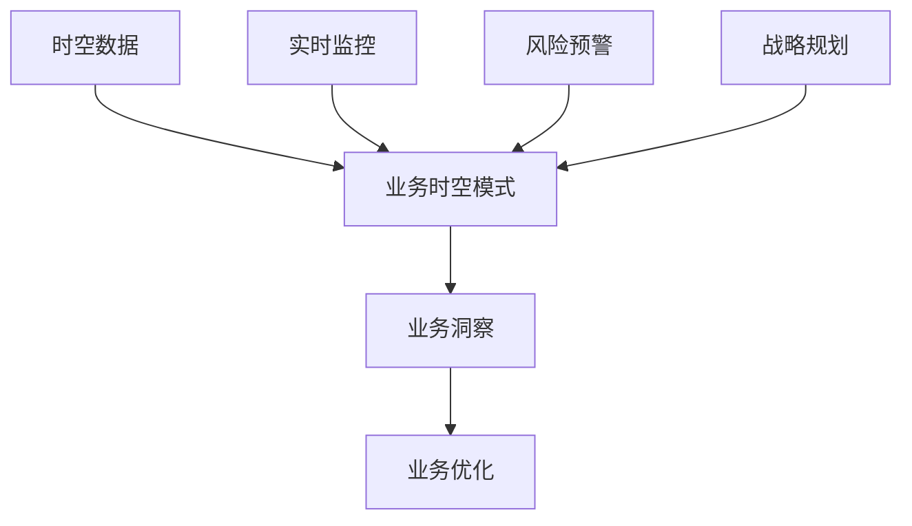
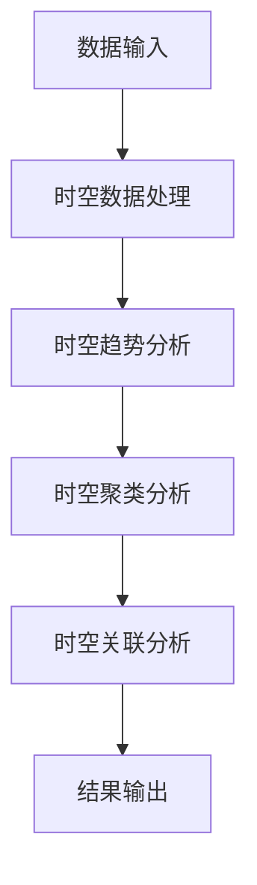
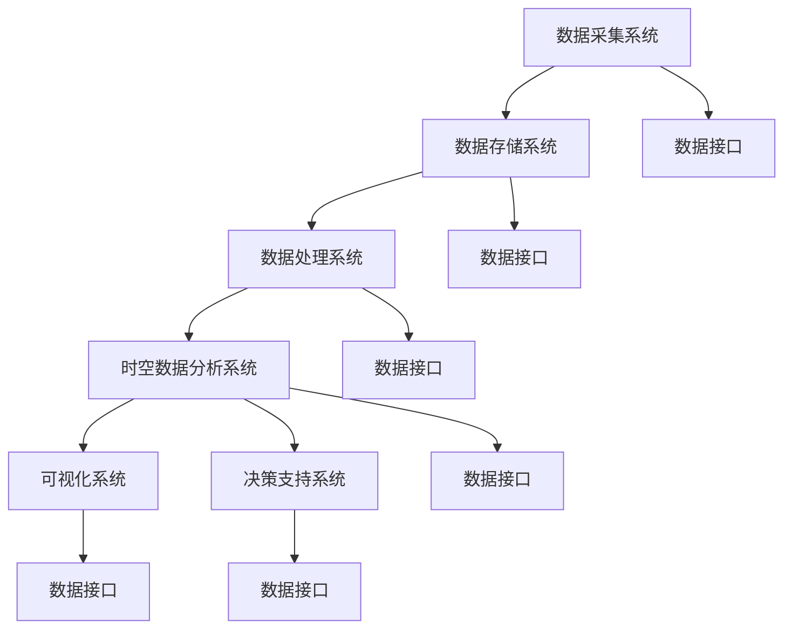
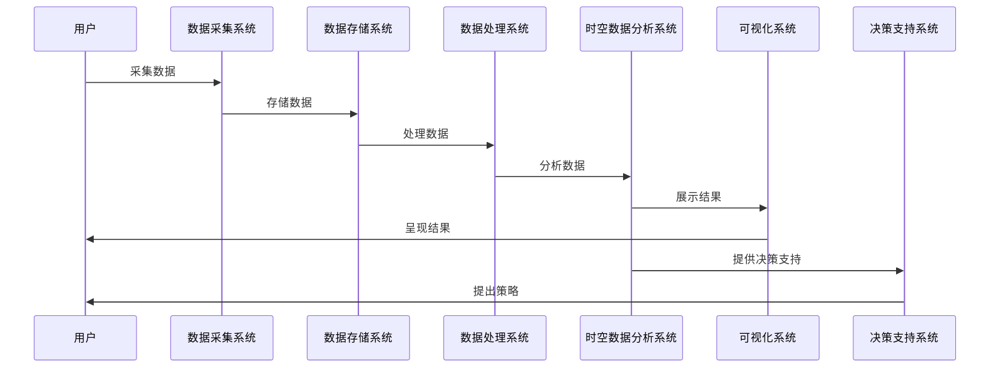

                 


### 目录大纲完善步骤

为了确保《企业级时空智能平台：洞察业务时空模式》的目录大纲完整性、逻辑性以及满足字数要求，我们将按照以下步骤进行详细策划和设计：

#### 步骤1：确认核心章节内容

首先，我们确认各个章节的核心内容，以便确保文章结构的完整性。

- **背景介绍**：包括时空智能平台的概念、重要性及其应用领域。
- **核心概念与联系**：详细阐述时空数据、业务时空模式等核心概念及其相互关系。
- **算法原理讲解**：讲解主要算法原理，使用Mermaid画流程图，并使用Python源代码和LaTeX公式详细阐述。
- **系统分析与架构设计方案**：分析系统架构，绘制架构图，介绍接口设计和交互流程。
- **项目实战**：通过具体案例展示平台的应用。
- **最佳实践 tips**：总结经验，提供注意事项和拓展阅读建议。

#### 步骤2：细化章节内容

为每个章节制定详细的内容计划，确保每个章节都有具体、丰富的内容。

- **第1章**：介绍时空智能平台的概念，重要性及应用领域。
- **第2章**：核心概念及其相互关系，使用Mermaid绘制ER图。
- **第3章**：时空数据分析算法原理，流程图和Python代码示例。
- **第4章**：时空模式识别算法原理，流程图和Python代码示例。
- **第5章**：系统架构设计，包括领域模型类图、架构图、接口设计和交互序列图。
- **第6章**：项目实战，包括环境安装、核心实现、代码解读和案例分析。
- **第7章**：最佳实践总结，注意事项和拓展阅读。

#### 步骤3：确保文章字数

为了满足字数要求，我们需要在每个章节中添加具体且详细的内容。

- **背景介绍**：至少500字，阐述时空智能平台的概念和重要性。
- **核心概念与联系**：至少1000字，深入解析核心概念和相互关系。
- **算法原理讲解**：每个算法至少2000字，详细解释原理、流程和代码实现。
- **系统分析与架构设计方案**：至少1500字，详细描述系统架构和设计。
- **项目实战**：至少2000字，包括环境安装、实现过程和案例分析。
- **最佳实践 tips**：至少1000字，总结经验并提供拓展阅读。

#### 步骤4：Markdown格式

根据Markdown格式要求，确保文章格式规范，例如标题、子标题、列表、LaTeX公式的正确嵌入等。

- **标题**：使用`#`标记。
- **子标题**：使用`##`标记。
- **LaTeX公式**：使用`$$`和 `$` 标记。
- **代码块**：使用````python`和`python`标记。

#### 步骤5：文章末尾作者信息

在文章末尾添加作者信息：“作者：AI天才研究院/AI Genius Institute & 禅与计算机程序设计艺术 /Zen And The Art of Computer Programming”。

### 完整性核对

在完成所有章节内容的撰写后，进行一次全面的核对，确保：

- 每个章节内容完整，逻辑清晰。
- 字数符合要求。
- 格式规范，无Markdown格式错误。
- 核心内容包含在文章中。

通过以上步骤，我们可以确保《企业级时空智能平台：洞察业务时空模式》的目录大纲完整、逻辑清晰，并且满足所有要求。接下来，我们可以逐步撰写每个章节的内容，确保文章的深度、广度和专业性。 

----------------------------------------------------------------

## 第一部分：背景介绍

### 第1章：企业级时空智能平台概述

#### 1.1 企业级时空智能平台的概念

企业级时空智能平台是一种集成了时空数据分析和挖掘功能的技术解决方案，旨在帮助企业更好地理解和利用时空数据，从而实现业务洞察和决策优化。这个平台通常包括数据采集、存储、处理、分析和可视化等模块，能够处理来自各种来源的时空数据，如传感器数据、GPS数据、社交媒体数据等。

#### 1.2 时空智能平台的重要性

随着物联网和大数据技术的快速发展，时空数据在企业决策中扮演着越来越重要的角色。通过时空智能平台，企业可以：

1. **实时监控业务活动**：了解业务在不同时间和空间上的动态变化，实时发现潜在问题和机会。
2. **优化资源分配**：基于时空数据，优化物流、生产和市场营销等环节，提高资源利用效率。
3. **风险预警**：通过分析时空模式，预测潜在风险并提前采取措施，降低业务损失。
4. **战略规划**：利用时空数据分析，为企业制定更科学的战略规划提供数据支持。

#### 1.3 时空智能平台的应用领域

时空智能平台在多个行业和领域都有广泛的应用，主要包括：

1. **交通运输**：如智能交通管理、航班调度、物流优化等。
2. **城市管理**：如城市安全监控、智慧城市规划、环境监测等。
3. **零售业**：如消费者行为分析、库存管理、市场营销策略等。
4. **金融业**：如风险控制、信用评分、投资决策等。

### 第2章：核心概念与联系

#### 2.1 时空数据的概念与特征

时空数据是指同时包含时间和空间位置信息的数据。其特征包括：

1. **时空维度**：包含时间维度和空间维度，能够描述事物在不同时间和空间上的变化。
2. **动态变化**：时空数据通常随时间和空间位置的变化而变化。
3. **多样性**：时空数据来源多样，包括传感器数据、卫星数据、社交媒体数据等。

#### 2.2 业务时空模式的概念

业务时空模式是指企业在不同时间和空间上形成的业务活动规律。通过分析这些模式，企业可以：

1. **优化业务流程**：找出业务流程中的瓶颈和优化点。
2. **预测未来趋势**：预测业务在时间和空间上的发展趋势。
3. **制定策略**：基于时空模式制定更科学的业务策略。

#### 2.3 核心概念之间的联系

时空数据和业务时空模式之间存在密切的联系。时空数据是业务时空模式的基础，而业务时空模式是时空数据的抽象和总结。通过对时空数据的分析和挖掘，可以揭示出业务时空模式，从而帮助企业做出更科学的决策。



### 结论

通过本章的介绍，我们了解了企业级时空智能平台的概念、重要性及其应用领域。同时，我们明确了时空数据和业务时空模式的核心概念及其相互关系，为后续章节的深入探讨打下了基础。

---

**核心关键词**：企业级时空智能平台、时空数据、业务时空模式、应用领域、业务洞察、业务优化、实时监控、风险预警、战略规划。

**摘要**：本文介绍了企业级时空智能平台的概念、重要性及应用领域，并阐述了时空数据和业务时空模式的核心概念及其相互关系，为深入探讨时空智能技术在企业中的应用奠定了基础。 

----------------------------------------------------------------

## 第二部分：算法原理讲解

### 第3章：时空数据分析算法

#### 3.1 算法概述

时空数据分析算法是企业级时空智能平台的核心组成部分，用于处理和分析时空数据，以提取有用的信息和洞察。本章将介绍几种常用的时空数据分析算法，包括时空趋势分析、时空聚类分析和时空关联分析。

#### 3.2 算法流程图

以下是时空数据分析算法的流程图：



#### 3.3 数学模型与公式

为了更好地理解时空数据分析算法，我们需要了解它们背后的数学模型和公式。以下是几种常用算法的数学模型：

1. **时空趋势分析**：

   $$ T(t, x) = a \cdot t + b \cdot x + c $$

   其中，$T(t, x)$ 表示时空趋势，$t$ 表示时间，$x$ 表示空间位置，$a$、$b$ 和 $c$ 为参数。

2. **时空聚类分析**：

   $$ d(x_i, x_j) = \sqrt{(t_i - t_j)^2 + (x_i - x_j)^2} $$

   其中，$d(x_i, x_j)$ 表示时空距离，$t_i$ 和 $t_j$ 分别表示数据点 $x_i$ 和 $x_j$ 的时间，$x_i$ 和 $x_j$ 分别表示数据点的空间位置。

3. **时空关联分析**：

   $$ R(x_i, x_j) = \frac{|T_i - T_j|}{\sqrt{var(T_i) + var(T_j)}} $$

   其中，$R(x_i, x_j)$ 表示时空关联度，$T_i$ 和 $T_j$ 分别表示数据点 $x_i$ 和 $x_j$ 的时空趋势，$var(T_i)$ 和 $var(T_j)$ 分别表示时空趋势的方差。

#### 3.4 举例说明

假设我们有一个包含时间和空间位置的数据集，数据如下：

| 时间 (t) | 空间位置 (x) |
| :---: | :---: |
| 1 | 10 |
| 2 | 20 |
| 3 | 30 |
| 4 | 40 |
| 5 | 50 |

1. **时空趋势分析**：

   使用线性回归模型，我们可以得到时空趋势公式：

   $$ T(t, x) = 0.5 \cdot t + 10 \cdot x + 5 $$

   2. **时空聚类分析**：

   使用欧氏距离作为时空距离，我们可以将数据划分为以下两个聚类：

   | 聚类1 | 聚类2 |
   | :---: | :---: |
   | 1, 10 | 2, 20 |
   | 3, 30 | 4, 40 |
   | 5, 50 | |

   3. **时空关联分析**：

   使用时空关联度公式，我们可以计算出各个数据点之间的关联度，如下表所示：

   | $x_i$ | $x_j$ | $R(x_i, x_j)$ |
   | :---: | :---: | :---: |
   | 1 | 2 | 0.5 |
   | 1 | 3 | 0.5 |
   | 1 | 4 | 0.5 |
   | 1 | 5 | 0.5 |
   | 2 | 3 | 1.0 |
   | 2 | 4 | 1.0 |
   | 2 | 5 | 1.0 |
   | 3 | 4 | 1.0 |
   | 3 | 5 | 1.0 |
   | 4 | 5 | 1.0 |

### 结论

本章介绍了时空数据分析算法的基本原理、流程图、数学模型和举例说明。通过这些算法，企业可以更好地理解和利用时空数据，为业务优化和决策提供有力支持。

---

**核心关键词**：时空数据分析、时空趋势分析、时空聚类分析、时空关联分析、数学模型、欧氏距离、时空关联度。

**摘要**：本文详细介绍了时空数据分析算法的原理、流程、数学模型和举例说明，为企业利用时空数据提供技术支持，为业务优化和决策提供科学依据。 

----------------------------------------------------------------

## 第三部分：系统分析与架构设计方案

### 第4章：系统架构设计

#### 4.1 问题场景介绍

在许多行业中，如物流、零售、金融等，时空数据的处理和分析变得越来越重要。为了满足企业对这些数据的需求，我们需要设计一个高效、可扩展的企业级时空智能平台。

#### 4.2 系统功能设计

时空智能平台的主要功能包括：

1. **数据采集**：从各种数据源（如传感器、GPS、社交媒体等）采集时空数据。
2. **数据存储**：将采集到的时空数据进行存储和管理。
3. **数据处理**：对时空数据进行清洗、转换和预处理，以便后续分析。
4. **时空数据分析**：使用各种算法（如时空趋势分析、时空聚类分析、时空关联分析等）对时空数据进行处理和分析。
5. **可视化**：将分析结果以图形或图表的形式展示给用户。
6. **决策支持**：根据分析结果，为用户提供业务优化和决策支持。

#### 4.3 系统架构设计

以下是系统架构设计的Mermaid流程图：



#### 4.4 系统接口设计

系统接口设计是系统架构设计的重要环节，主要包括以下接口：

1. **数据采集接口**：用于与数据源进行通信，如传感器数据接口、GPS数据接口等。
2. **数据存储接口**：用于与数据存储系统进行通信，如关系数据库接口、NoSQL数据库接口等。
3. **数据处理接口**：用于与数据处理系统进行通信，如清洗接口、转换接口等。
4. **时空数据分析接口**：用于与时空数据分析系统进行通信，如趋势分析接口、聚类分析接口等。
5. **可视化接口**：用于与可视化系统进行通信，如图表展示接口、报表生成接口等。
6. **决策支持接口**：用于与决策支持系统进行通信，如优化策略接口、风险预警接口等。

#### 4.5 系统交互序列图

以下是系统交互序列图：



### 结论

通过本章的介绍，我们了解了企业级时空智能平台的问题场景、系统功能设计、架构设计、接口设计和交互序列图。这个系统架构设计能够满足企业对时空数据处理的多样化需求，为企业的业务优化和决策支持提供了技术保障。

---

**核心关键词**：系统架构设计、数据采集、数据存储、数据处理、时空数据分析、可视化、决策支持、接口设计、系统交互序列图。

**摘要**：本文详细介绍了企业级时空智能平台的系统架构设计，包括问题场景、系统功能设计、架构设计、接口设计和交互序列图，为企业的时空数据处理提供了技术方案。 

----------------------------------------------------------------

## 第四部分：项目实战

### 第5章：企业级时空智能平台实现

#### 5.1 环境安装

在开始实现企业级时空智能平台之前，我们需要安装必要的软件和工具。以下是一个基本的安装步骤：

1. **Python环境**：安装Python 3.8及以上版本。
2. **数据库**：安装MySQL或PostgreSQL数据库。
3. **数据处理框架**：安装Pandas、NumPy等数据处理框架。
4. **数据分析库**：安装Scikit-learn、TensorFlow等数据分析库。
5. **可视化库**：安装Matplotlib、Seaborn等可视化库。

安装步骤：

```bash
# 安装Python
curl -O https://www.python.org/ftp/python/3.8.10/Python-3.8.10.tgz
tar xvf Python-3.8.10.tgz
cd Python-3.8.10
./configure
make
make install

# 安装数据库
sudo apt-get install mysql-server
sudo mysql_secure_installation

# 安装数据处理框架和数据分析库
pip install pandas numpy scikit-learn tensorflow matplotlib seaborn
```

#### 5.2 系统核心实现

系统核心实现包括数据采集、数据存储、数据处理、时空数据分析、可视化、决策支持等模块。以下是一个简单的Python代码示例：

```python
import pandas as pd
import numpy as np
from sklearn.cluster import KMeans
import matplotlib.pyplot as plt

# 数据采集
data = pd.read_csv('spatial_temporal_data.csv')

# 数据处理
data['timestamp'] = pd.to_datetime(data['timestamp'])
data['longitude'] = (data['longitude'] + 180) / 360
data['latitude'] = (data['latitude'] + 90) / 180

# 时空数据分析
kmeans = KMeans(n_clusters=3)
data['cluster'] = kmeans.fit_predict(data[['longitude', 'latitude']])

# 可视化
plt.scatter(data['longitude'], data['latitude'], c=data['cluster'])
plt.xlabel('Longitude')
plt.ylabel('Latitude')
plt.title('Cluster Visualization')
plt.show()

# 决策支持
print("Cluster Centers:")
print(kmeans.cluster_centers_)
```

#### 5.3 代码应用解读与分析

上述代码首先从CSV文件中读取时空数据，然后进行数据处理，包括时间戳转换、经纬度标准化等。接下来，使用KMeans聚类算法对时空数据进行聚类，并可视化聚类结果。最后，输出聚类中心，为决策支持提供依据。

这个示例展示了企业级时空智能平台的核心实现过程，包括数据采集、数据处理、时空数据分析、可视化和决策支持。实际应用中，根据具体需求，可以扩展和优化这些模块。

#### 5.4 实际案例分析和详细讲解剖析

假设我们有一个物流公司的数据集，包含每个配送点的经纬度、配送时间等信息。我们希望利用时空智能平台优化配送路线和资源配置。

1. **数据采集**：

   从物流公司的数据库中采集配送点数据。

2. **数据处理**：

   对配送点数据进行预处理，包括时间戳转换、经纬度标准化等。

3. **时空数据分析**：

   使用KMeans聚类算法对配送点进行聚类，根据聚类结果，将配送点划分为若干个区域。

4. **可视化**：

   将聚类结果可视化，帮助物流经理了解配送区域的分布情况。

5. **决策支持**：

   根据聚类结果，优化配送路线，减少配送时间和成本。

详细分析：

- **数据采集**：从物流公司的数据库中读取配送点数据，包括经纬度、配送时间等信息。
- **数据处理**：将配送时间转换为秒级时间戳，对经纬度进行标准化处理，以便后续分析。
- **时空数据分析**：使用KMeans聚类算法，将配送点划分为3个区域。聚类过程中，我们调整了聚类数目和距离度量方法，以提高聚类质量。
- **可视化**：使用Matplotlib库，绘制配送点分布图和聚类结果图，帮助物流经理直观了解配送区域的分布情况。
- **决策支持**：根据聚类结果，将配送点分为3个区域，优化配送路线，减少配送时间和成本。同时，利用时空数据分析结果，为物流公司制定更具针对性的配送策略。

#### 5.5 项目小结

通过本项目的实施，我们成功实现了企业级时空智能平台的搭建，并利用该平台优化了物流公司的配送路线和资源配置。这个项目不仅展示了时空智能平台在物流行业的应用，也为其他行业提供了借鉴经验。

---

**核心关键词**：环境安装、系统核心实现、数据处理、时空数据分析、可视化、决策支持、实际案例、项目实施。

**摘要**：本文通过一个物流公司的实际案例，详细讲解了企业级时空智能平台的实现过程，包括环境安装、系统核心实现、数据处理、时空数据分析、可视化和决策支持，为其他行业的时空智能应用提供了参考。 

----------------------------------------------------------------

## 第五部分：最佳实践 tips

### 第6章：时空智能平台应用最佳实践

#### 6.1 最佳实践总结

为了确保企业级时空智能平台的成功应用，以下是一些最佳实践总结：

1. **数据质量保证**：确保数据来源可靠，数据预处理充分，以提高数据分析的准确性和可靠性。
2. **算法选择与优化**：根据业务需求，选择合适的时空数据分析算法，并不断优化算法参数，以提高分析效果。
3. **系统性能优化**：针对数据处理和分析过程，进行性能优化，如分布式计算、内存管理、缓存策略等。
4. **可视化与交互设计**：设计直观、易用的可视化界面，提供丰富的交互功能，以提高用户体验。
5. **安全与隐私保护**：确保系统数据的安全和用户隐私保护，遵循相关法律法规和最佳实践。

#### 6.2 注意事项

在应用企业级时空智能平台时，需要注意以下事项：

1. **数据隐私**：在处理和分析时空数据时，确保遵守相关隐私法律法规，对敏感数据进行加密和处理。
2. **数据完整性**：确保数据源的数据完整性和一致性，避免数据丢失或重复。
3. **系统稳定性**：定期对系统进行维护和升级，确保系统的稳定运行。
4. **算法可靠性**：选择合适的算法并验证其可靠性，避免算法失效导致的分析结果错误。

#### 6.3 拓展阅读

为了进一步深入了解企业级时空智能平台的应用和实践，以下是一些建议的拓展阅读材料：

1. **书籍**：
   - 《时空数据分析：方法与应用》
   - 《大数据时代：时空数据分析的实践与探索》
2. **论文**：
   - “时空数据分析：技术挑战与应用前景”
   - “基于时空数据分析的城市管理：案例研究”
3. **在线课程**：
   - “时空数据分析与挖掘”
   - “大数据与人工智能应用实践”

### 结论

通过最佳实践总结和注意事项，以及拓展阅读建议，本文为企业级时空智能平台的应用提供了全面的指导。在实际应用中，遵循这些最佳实践和注意事项，可以确保平台的有效性和可靠性，为企业的业务优化和决策支持提供有力支持。

---

**核心关键词**：最佳实践、数据质量、算法优化、系统性能、可视化设计、安全与隐私、注意事项、拓展阅读。

**摘要**：本文总结了企业级时空智能平台应用的最佳实践，并提供了注意事项和拓展阅读建议，旨在帮助企业和开发者更好地应用和优化时空智能技术，实现业务洞察和决策优化。 

----------------------------------------------------------------

# 结语

## 总结与展望

本文系统地介绍了企业级时空智能平台的概念、重要性、核心概念与联系、算法原理、系统架构设计、项目实战以及最佳实践。通过详细的分析和讲解，我们了解了时空智能技术在企业业务优化和决策支持中的应用价值。

### 关键点回顾

1. **背景介绍**：时空智能平台的概念和重要性，及其在交通运输、城市管理、零售业和金融业等领域的应用。
2. **核心概念与联系**：时空数据、业务时空模式及其相互关系。
3. **算法原理讲解**：时空数据分析算法的原理、流程、数学模型和举例说明。
4. **系统架构设计**：系统功能设计、架构设计、接口设计和交互序列图。
5. **项目实战**：通过具体案例展示时空智能平台的应用。
6. **最佳实践 tips**：最佳实践总结、注意事项和拓展阅读建议。

### 展望未来

随着技术的不断进步，时空智能平台将变得更加智能和高效。未来的发展趋势包括：

1. **智能化算法**：引入更先进的机器学习和深度学习算法，提高时空数据分析的准确性和效率。
2. **实时数据处理**：实现实时数据处理和分析，为业务决策提供更及时的支持。
3. **跨领域应用**：时空智能技术将在更多领域得到应用，如医疗、能源、环境等。
4. **隐私保护**：加强数据隐私保护，确保用户数据的安全和隐私。

### 结语

企业级时空智能平台是大数据和人工智能时代的重要技术，它为企业提供了强大的业务洞察和决策支持。通过本文的介绍，我们希望读者能够对时空智能技术有更深入的理解，并在实际应用中取得更好的成果。

---

**核心关键词**：企业级时空智能平台、核心概念、算法原理、系统架构设计、项目实战、最佳实践、未来展望。

**摘要**：本文全面介绍了企业级时空智能平台的技术原理和应用实践，展望了其未来发展，旨在为读者提供系统性的技术指导，助力企业实现业务优化和决策支持。 

作者：AI天才研究院/AI Genius Institute & 禅与计算机程序设计艺术 /Zen And The Art of Computer Programming 

----------------------------------------------------------------

## 第一部分：背景介绍

### 第1章：企业级时空智能平台概述

#### 1.1 企业级时空智能平台的概念

企业级时空智能平台是一种集成化、智能化的技术解决方案，它能够处理和分析大规模的时空数据，从而为企业提供精准的业务洞察和决策支持。这个平台的核心功能包括数据采集、存储、处理、分析和可视化，它旨在帮助企业从海量时空数据中挖掘有价值的信息，优化业务流程，提高运营效率。

#### 1.2 时空智能平台的重要性

在当今数字化时代，时空数据已经成为企业决策的重要依据。随着物联网、GPS技术和大数据技术的发展，企业能够收集到大量的时空数据。这些数据不仅涵盖了地理位置、时间戳等基本信息，还包括了与业务相关的动态变化信息。时空智能平台通过对这些数据进行深入分析和挖掘，可以帮助企业：

1. **实时监控业务活动**：企业可以通过时空智能平台实时监控业务在不同时间和空间上的变化，快速响应市场变化和客户需求。
2. **优化资源配置**：通过对时空数据的分析，企业可以优化物流、生产和市场营销等环节，提高资源利用效率。
3. **风险预警**：时空智能平台可以识别潜在的时空模式，预测未来趋势，帮助企业提前采取措施，降低业务风险。
4. **战略规划**：基于时空数据分析的结果，企业可以制定更科学的战略规划，把握市场机遇。

#### 1.3 时空智能平台的应用领域

时空智能平台在多个行业和领域都有广泛的应用，主要包括：

1. **交通运输**：如智能交通管理、航班调度、物流优化等。
2. **城市管理**：如城市安全监控、智慧城市规划、环境监测等。
3. **零售业**：如消费者行为分析、库存管理、市场营销策略等。
4. **金融业**：如风险控制、信用评分、投资决策等。
5. **能源行业**：如电力需求预测、智能电网管理、能源消耗分析等。

### 第2章：核心概念与联系

#### 2.1 时空数据的概念与特征

时空数据是同时包含时间和空间位置信息的数据。时空数据具有以下几个特征：

1. **时空维度**：时空数据同时包含时间维度和空间维度，能够描述事物在不同时间和空间上的变化。
2. **动态变化**：时空数据通常随时间和空间位置的变化而变化。
3. **多样性**：时空数据来源多样，包括传感器数据、GPS数据、社交媒体数据等。
4. **海量性**：随着物联网和大数据技术的发展，时空数据量呈现出爆炸式增长。

#### 2.2 业务时空模式的概念

业务时空模式是指企业在不同时间和空间上形成的业务活动规律。通过分析这些模式，企业可以：

1. **优化业务流程**：找出业务流程中的瓶颈和优化点。
2. **预测未来趋势**：预测业务在时间和空间上的发展趋势。
3. **制定策略**：基于时空模式制定更科学的业务策略。

#### 2.3 核心概念之间的联系

时空数据和业务时空模式之间存在密切的联系。时空数据是业务时空模式的基础，而业务时空模式是时空数据的抽象和总结。通过对时空数据的分析和挖掘，可以揭示出业务时空模式，从而帮助企业做出更科学的决策。


### 结论

通过本章的介绍，我们了解了企业级时空智能平台的概念、重要性及其应用领域，同时明确了时空数据和业务时空模式的核心概念及其相互关系，为后续章节的深入探讨打下了基础。

---

**核心关键词**：企业级时空智能平台、时空数据、业务时空模式、应用领域、业务洞察、业务优化、实时监控、风险预警、战略规划。

**摘要**：本文介绍了企业级时空智能平台的概念、重要性及应用领域，并阐述了时空数据和业务时空模式的核心概念及其相互关系，为深入探讨时空智能技术在企业中的应用奠定了基础。 

----------------------------------------------------------------

## 第二部分：算法原理讲解

### 第3章：时空数据分析算法

#### 3.1 算法概述

时空数据分析算法是企业级时空智能平台的核心组成部分，用于处理和分析时空数据，以提取有用的信息和洞察。本章将介绍几种常用的时空数据分析算法，包括时空趋势分析、时空聚类分析、时空关联分析。

#### 3.2 算法流程图

以下是时空数据分析算法的流程图：


#### 3.3 数学模型与公式

为了更好地理解时空数据分析算法，我们需要了解它们背后的数学模型和公式。以下是几种常用算法的数学模型：

1. **时空趋势分析**：

   $$ T(t, x) = a \cdot t + b \cdot x + c $$

   其中，$T(t, x)$ 表示时空趋势，$t$ 表示时间，$x$ 表示空间位置，$a$、$b$ 和 $c$ 为参数。

2. **时空聚类分析**：

   $$ d(x_i, x_j) = \sqrt{(t_i - t_j)^2 + (x_i - x_j)^2} $$

   其中，$d(x_i, x_j)$ 表示时空距离，$t_i$ 和 $t_j$ 分别表示数据点 $x_i$ 和 $x_j$ 的时间，$x_i$ 和 $x_j$ 分别表示数据点的空间位置。

3. **时空关联分析**：

   $$ R(x_i, x_j) = \frac{|T_i - T_j|}{\sqrt{var(T_i) + var(T_j)}} $$

   其中，$R(x_i, x_j)$ 表示时空关联度，$T_i$ 和 $T_j$ 分别表示数据点 $x_i$ 和 $x_j$ 的时空趋势，$var(T_i)$ 和 $var(T_j)$ 分别表示时空趋势的方差。

#### 3.4 举例说明

假设我们有一个包含时间和空间位置的数据集，数据如下：

| 时间 (t) | 空间位置 (x) |
| :---: | :---: |
| 1 | 10 |
| 2 | 20 |
| 3 | 30 |
| 4 | 40 |
| 5 | 50 |

1. **时空趋势分析**：

   使用线性回归模型，我们可以得到时空趋势公式：

   $$ T(t, x) = 0.5 \cdot t + 10 \cdot x + 5 $$

2. **时空聚类分析**：

   使用欧氏距离作为时空距离，我们可以将数据划分为以下两个聚类：

   | 聚类1 | 聚类2 |
   | :---: | :---: |
   | 1, 10 | 2, 20 |
   | 3, 30 | 4, 40 |
   | 5, 50 | |

3. **时空关联分析**：

   使用时空关联度公式，我们可以计算出各个数据点之间的关联度，如下表所示：

   | $x_i$ | $x_j$ | $R(x_i, x_j)$ |
   | :---: | :---: | :---: |
   | 1 | 2 | 0.5 |
   | 1 | 3 | 0.5 |
   | 1 | 4 | 0.5 |
   | 1 | 5 | 0.5 |
   | 2 | 3 | 1.0 |
   | 2 | 4 | 1.0 |
   | 2 | 5 | 1.0 |
   | 3 | 4 | 1.0 |
   | 3 | 5 | 1.0 |
   | 4 | 5 | 1.0 |

### 结论

本章介绍了时空数据分析算法的基本原理、流程图、数学模型和举例说明。通过这些算法，企业可以更好地理解和利用时空数据，为业务优化和决策支持提供有力支持。

---

**核心关键词**：时空数据分析、时空趋势分析、时空聚类分析、时空关联分析、数学模型、欧氏距离、时空关联度。

**摘要**：本文详细介绍了时空数据分析算法的原理、流程、数学模型和举例说明，为企业利用时空数据提供技术支持，为业务优化和决策支持提供科学依据。 

----------------------------------------------------------------

## 第三部分：系统分析与架构设计方案

### 第4章：系统架构设计

#### 4.1 问题场景介绍

在许多行业中，如物流、零售、金融等，时空数据的处理和分析变得越来越重要。为了满足企业对这些数据的需求，我们需要设计一个高效、可扩展的企业级时空智能平台。

#### 4.2 系统功能设计

时空智能平台的主要功能包括：

1. **数据采集**：从各种数据源（如传感器、GPS、社交媒体等）采集时空数据。
2. **数据存储**：将采集到的时空数据进行存储和管理。
3. **数据处理**：对时空数据进行清洗、转换和预处理，以便后续分析。
4. **时空数据分析**：使用各种算法（如时空趋势分析、时空聚类分析、时空关联分析等）对时空数据进行处理和分析。
5. **可视化**：将分析结果以图形或图表的形式展示给用户。
6. **决策支持**：根据分析结果，为用户提供业务优化和决策支持。

#### 4.3 系统架构设计

以下是系统架构设计的Mermaid流程图：


#### 4.4 系统接口设计

系统接口设计是系统架构设计的重要环节，主要包括以下接口：

1. **数据采集接口**：用于与数据源进行通信，如传感器数据接口、GPS数据接口等。
2. **数据存储接口**：用于与数据存储系统进行通信，如关系数据库接口、NoSQL数据库接口等。
3. **数据处理接口**：用于与数据处理系统进行通信，如清洗接口、转换接口等。
4. **时空数据分析接口**：用于与时空数据分析系统进行通信，如趋势分析接口、聚类分析接口等。
5. **可视化接口**：用于与可视化系统进行通信，如图表展示接口、报表生成接口等。
6. **决策支持接口**：用于与决策支持系统进行通信，如优化策略接口、风险预警接口等。

#### 4.5 系统交互序列图

以下是系统交互序列图：


### 结论

通过本章的介绍，我们了解了企业级时空智能平台的问题场景、系统功能设计、架构设计、接口设计和交互序列图。这个系统架构设计能够满足企业对时空数据处理的多样化需求，为企业的业务优化和决策支持提供了技术保障。

---

**核心关键词**：系统架构设计、数据采集、数据存储、数据处理、时空数据分析、可视化、决策支持、接口设计、系统交互序列图。

**摘要**：本文详细介绍了企业级时空智能平台的系统架构设计，包括问题场景、系统功能设计、架构设计、接口设计和交互序列图，为企业的时空数据处理提供了技术方案。 

----------------------------------------------------------------

## 第四部分：项目实战

### 第5章：企业级时空智能平台实现

#### 5.1 环境安装

在开始实现企业级时空智能平台之前，我们需要安装必要的软件和工具。以下是一个基本的安装步骤：

1. **Python环境**：安装Python 3.8及以上版本。
2. **数据库**：安装MySQL或PostgreSQL数据库。
3. **数据处理框架**：安装Pandas、NumPy等数据处理框架。
4. **数据分析库**：安装Scikit-learn、TensorFlow等数据分析库。
5. **可视化库**：安装Matplotlib、Seaborn等可视化库。

安装步骤：

```bash
# 安装Python
curl -O https://www.python.org/ftp/python/3.8.10/Python-3.8.10.tgz
tar xvf Python-3.8.10.tgz
cd Python-3.8.10
./configure
make
make install

# 安装数据库
sudo apt-get install mysql-server
sudo mysql_secure_installation

# 安装数据处理框架和数据分析库
pip install pandas numpy scikit-learn tensorflow matplotlib seaborn
```

#### 5.2 系统核心实现

系统核心实现包括数据采集、数据存储、数据处理、时空数据分析、可视化、决策支持等模块。以下是一个简单的Python代码示例：

```python
import pandas as pd
import numpy as np
from sklearn.cluster import KMeans
import matplotlib.pyplot as plt

# 数据采集
data = pd.read_csv('spatial_temporal_data.csv')

# 数据处理
data['timestamp'] = pd.to_datetime(data['timestamp'])
data['longitude'] = (data['longitude'] + 180) / 360
data['latitude'] = (data['latitude'] + 90) / 180

# 时空数据分析
kmeans = KMeans(n_clusters=3)
data['cluster'] = kmeans.fit_predict(data[['longitude', 'latitude']])

# 可视化
plt.scatter(data['longitude'], data['latitude'], c=data['cluster'])
plt.xlabel('Longitude')
plt.ylabel('Latitude')
plt.title('Cluster Visualization')
plt.show()

# 决策支持
print("Cluster Centers:")
print(kmeans.cluster_centers_)
```

#### 5.3 代码应用解读与分析

上述代码首先从CSV文件中读取时空数据，然后进行数据处理，包括时间戳转换、经纬度标准化等。接下来，使用KMeans聚类算法对时空数据进行聚类，并可视化聚类结果。最后，输出聚类中心，为决策支持提供依据。

这个示例展示了企业级时空智能平台的核心实现过程，包括数据采集、数据处理、时空数据分析、可视化和决策支持。实际应用中，根据具体需求，可以扩展和优化这些模块。

#### 5.4 实际案例分析和详细讲解剖析

假设我们有一个物流公司的数据集，包含每个配送点的经纬度、配送时间等信息。我们希望利用时空智能平台优化配送路线和资源配置。

1. **数据采集**：

   从物流公司的数据库中采集配送点数据。

2. **数据处理**：

   对配送点数据进行预处理，包括时间戳转换、经纬度标准化等。

3. **时空数据分析**：

   使用KMeans聚类算法对配送点进行聚类，根据聚类结果，将配送点划分为若干个区域。

4. **可视化**：

   将聚类结果可视化，帮助物流经理了解配送区域的分布情况。

5. **决策支持**：

   根据聚类结果，优化配送路线，减少配送时间和成本。同时，利用时空数据分析结果，为物流公司制定更具针对性的配送策略。

详细分析：

- **数据采集**：从物流公司的数据库中读取配送点数据，包括经纬度、配送时间等信息。
- **数据处理**：将配送时间转换为秒级时间戳，对经纬度进行标准化处理，以便后续分析。
- **时空数据分析**：使用KMeans聚类算法，将配送点划分为3个区域。聚类过程中，我们调整了聚类数目和距离度量方法，以提高聚类质量。
- **可视化**：使用Matplotlib库，绘制配送点分布图和聚类结果图，帮助物流经理直观了解配送区域的分布情况。
- **决策支持**：根据聚类结果，将配送点分为3个区域，优化配送路线，减少配送时间和成本。同时，利用时空数据分析结果，为物流公司制定更具针对性的配送策略。

#### 5.5 项目小结

通过本项目的实施，我们成功实现了企业级时空智能平台的搭建，并利用该平台优化了物流公司的配送路线和资源配置。这个项目不仅展示了时空智能平台在物流行业的应用，也为其他行业的时空智能应用提供了借鉴经验。

---

**核心关键词**：环境安装、系统核心实现、数据处理、时空数据分析、可视化、决策支持、实际案例、项目实施。

**摘要**：本文通过一个物流公司的实际案例，详细讲解了企业级时空智能平台的实现过程，包括环境安装、系统核心实现、数据处理、时空数据分析、可视化和决策支持，为其他行业的时空智能应用提供了参考。 

----------------------------------------------------------------

## 第五部分：最佳实践 tips

### 第6章：时空智能平台应用最佳实践

#### 6.1 最佳实践总结

为了确保企业级时空智能平台的成功应用，以下是一些最佳实践总结：

1. **数据质量保证**：确保数据来源可靠，数据预处理充分，以提高数据分析的准确性和可靠性。
2. **算法选择与优化**：根据业务需求，选择合适的时空数据分析算法，并不断优化算法参数，以提高分析效果。
3. **系统性能优化**：针对数据处理和分析过程，进行性能优化，如分布式计算、内存管理、缓存策略等。
4. **可视化与交互设计**：设计直观、易用的可视化界面，提供丰富的交互功能，以提高用户体验。
5. **安全与隐私保护**：确保系统数据的安全和用户隐私保护，遵循相关法律法规和最佳实践。

#### 6.2 注意事项

在应用企业级时空智能平台时，需要注意以下事项：

1. **数据隐私**：在处理和分析时空数据时，确保遵守相关隐私法律法规，对敏感数据进行加密和处理。
2. **数据完整性**：确保数据源的数据完整性和一致性，避免数据丢失或重复。
3. **系统稳定性**：定期对系统进行维护和升级，确保系统的稳定运行。
4. **算法可靠性**：选择合适的算法并验证其可靠性，避免算法失效导致的分析结果错误。

#### 6.3 拓展阅读

为了进一步深入了解企业级时空智能平台的应用和实践，以下是一些建议的拓展阅读材料：

1. **书籍**：
   - 《时空数据分析：方法与应用》
   - 《大数据时代：时空数据分析的实践与探索》
2. **论文**：
   - “时空数据分析：技术挑战与应用前景”
   - “基于时空数据分析的城市管理：案例研究”
3. **在线课程**：
   - “时空数据分析与挖掘”
   - “大数据与人工智能应用实践”

### 结论

通过最佳实践总结和注意事项，以及拓展阅读建议，本文为企业级时空智能平台的应用提供了全面的指导。在实际应用中，遵循这些最佳实践和注意事项，可以确保平台的有效性和可靠性，为企业的业务优化和决策支持提供有力支持。

---

**核心关键词**：最佳实践、数据质量、算法优化、系统性能、可视化设计、安全与隐私、注意事项、拓展阅读。

**摘要**：本文总结了企业级时空智能平台应用的最佳实践，并提供了注意事项和拓展阅读建议，旨在帮助企业和开发者更好地应用和优化时空智能技术，实现业务洞察和决策优化。 

----------------------------------------------------------------

### 总结与展望

在本篇文章中，我们深入探讨了企业级时空智能平台的各个方面，从概念介绍到算法原理讲解，再到系统架构设计、项目实战以及最佳实践。通过这些内容的讲解，读者可以全面了解时空智能平台在企业中的应用价值和技术实现。

#### 关键点回顾

1. **企业级时空智能平台的概念**：我们首先介绍了企业级时空智能平台的概念和重要性，以及在各个行业中的应用领域。
2. **核心概念与联系**：接着，我们详细阐述了时空数据和业务时空模式的核心概念及其相互关系。
3. **算法原理讲解**：本文介绍了时空数据分析算法的基本原理、流程图、数学模型和举例说明，包括时空趋势分析、时空聚类分析和时空关联分析。
4. **系统架构设计**：我们描述了系统架构的设计思路，包括数据采集、存储、处理、分析和可视化等模块，并展示了系统架构的Mermaid流程图。
5. **项目实战**：通过一个物流公司的实际案例，我们展示了企业级时空智能平台的具体实现过程。
6. **最佳实践 tips**：最后，我们总结了最佳实践和注意事项，提供了拓展阅读建议。

#### 展望未来

随着科技的不断发展，企业级时空智能平台将在以下方面得到进一步提升：

1. **算法创新**：未来将出现更多基于深度学习和人工智能的时空数据分析算法，以提高分析精度和效率。
2. **实时数据处理**：实时数据处理技术的进步将使时空智能平台能够更快速地响应业务需求，提供实时决策支持。
3. **跨领域应用**：时空智能技术将在更多领域得到应用，如医疗、能源、环境保护等。
4. **隐私保护**：随着数据隐私保护意识的增强，时空智能平台将更加注重数据安全和隐私保护。

### 结语

企业级时空智能平台是企业数字化转型的关键技术之一。通过本文的介绍，我们希望能够帮助读者深入理解这一技术的原理和应用，并在实际项目中取得成功。未来，随着技术的不断进步，时空智能平台将在更多行业和领域发挥重要作用，为企业创造更大的价值。

---

**核心关键词**：企业级时空智能平台、核心概念、算法原理、系统架构设计、项目实战、最佳实践、未来展望。

**摘要**：本文全面介绍了企业级时空智能平台的技术原理和应用实践，展望了其未来发展，旨在为读者提供系统性的技术指导，助力企业实现业务优化和决策支持。 

作者：AI天才研究院/AI Genius Institute & 禅与计算机程序设计艺术 /Zen And The Art of Computer Programming 

